# Class: Agriculture


URI: [mixs_6_2_proposal:Agriculture](https://turbomam.github.io/mixs-envo-struct-knowl-extraction/Agriculture)

```mermaid
 classDiagram
    class Agriculture
      EnvironmentalPackage <|-- Agriculture
      
      Agriculture : adapters
        
      Agriculture : adjacent_environment
        
      Agriculture : agrochem_addition
        
      Agriculture : ances_data
        
      Agriculture : anim_water_method
        
      Agriculture : annot
        
      Agriculture : annual_precpt
        
      Agriculture : annual_temp
        
      Agriculture : assembly_name
        
      Agriculture : assembly_qual
        
      Agriculture : assembly_software
        
      Agriculture : associated_resource
        
      Agriculture : biotic_relationship
        
          Agriculture --|> BIOTIC_RELATIONSHIP_ENUM : biotic_relationship
        
      Agriculture : chem_administration
        
      Agriculture : chimera_check
        
      Agriculture : climate_environment
        
      Agriculture : crop_rotation
        
      Agriculture : crop_yield
        
      Agriculture : cult_isol_date
        
      Agriculture : cur_land_use
        
      Agriculture : cur_vegetation
        
      Agriculture : cur_vegetation_meth
        
      Agriculture : depth
        
      Agriculture : drainage_class
        
          Agriculture --|> DRAINAGE_CLASS_ENUM : drainage_class
        
      Agriculture : elev
        
      Agriculture : enrichment_protocol
        
      Agriculture : extreme_event
        
      Agriculture : fao_class
        
          Agriculture --|> FAO_CLASS_ENUM : fao_class
        
      Agriculture : farm_equip
        
      Agriculture : farm_equip_san
        
      Agriculture : farm_equip_shared
        
      Agriculture : farm_water_source
        
          Agriculture --|> FARM_WATER_SOURCE_ENUM : farm_water_source
        
      Agriculture : fertilizer_admin
        
      Agriculture : fire
        
      Agriculture : flooding
        
      Agriculture : food_harvest_proc
        
      Agriculture : food_prod
        
      Agriculture : food_product_type
        
      Agriculture : food_source
        
      Agriculture : food_trav_mode
        
      Agriculture : food_trav_vehic
        
      Agriculture : fungicide_regm
        
      Agriculture : gaseous_environment
        
      Agriculture : genetic_mod
        
      Agriculture : heavy_metals_meth
        
      Agriculture : herbicide_regm
        
      Agriculture : horizon
        
          Agriculture --|> SHARED_ENUM_4 : horizon
        
      Agriculture : horizon_meth
        
      Agriculture : host_age
        
      Agriculture : host_common_name
        
      Agriculture : host_disease_stat
        
      Agriculture : host_dry_mass
        
      Agriculture : host_genotype
        
      Agriculture : host_height
        
      Agriculture : host_length
        
      Agriculture : host_life_stage
        
      Agriculture : host_phenotype
        
      Agriculture : host_spec_range
        
      Agriculture : host_subspecf_genlin
        
      Agriculture : host_symbiont
        
      Agriculture : host_taxid
        
      Agriculture : host_tot_mass
        
      Agriculture : humidity
        
      Agriculture : isol_growth_condt
        
      Agriculture : lib_layout
        
          Agriculture --|> LIB_LAYOUT_ENUM : lib_layout
        
      Agriculture : lib_reads_seqd
        
      Agriculture : lib_screen
        
      Agriculture : lib_size
        
      Agriculture : lib_vector
        
      Agriculture : library_prep_kit
        
      Agriculture : link_class_info
        
      Agriculture : link_climate_info
        
      Agriculture : local_class
        
      Agriculture : local_class_meth
        
      Agriculture : lot_number
        
      Agriculture : micro_biomass_meth
        
      Agriculture : microbial_biomass
        
      Agriculture : mid
        
      Agriculture : misc_param
        
      Agriculture : non_min_nutr_regm
        
      Agriculture : nucl_acid_amp
        
      Agriculture : nucl_acid_ext
        
      Agriculture : organism_count
        
      Agriculture : oxy_stat_samp
        
          Agriculture --|> OXY_STAT_SAMP_ENUM : oxy_stat_samp
        
      Agriculture : pathogenicity
        
      Agriculture : pcr_cond
        
      Agriculture : pcr_primers
        
      Agriculture : perturbation
        
      Agriculture : pesticide_regm
        
      Agriculture : ph_meth
        
      Agriculture : ph_regm
        
      Agriculture : photosynt_activ
        
      Agriculture : photosynt_activ_meth
        
      Agriculture : plant_growth_med
        
      Agriculture : plant_product
        
      Agriculture : plant_struc
        
      Agriculture : plant_water_method
        
      Agriculture : pool_dna_extracts
        
      Agriculture : porosity
        
      Agriculture : pres_animal_insect
        
      Agriculture : prev_land_use_meth
        
      Agriculture : previous_land_use
        
      Agriculture : profile_position
        
          Agriculture --|> PROFILE_POSITION_ENUM : profile_position
        
      Agriculture : rel_location
        
      Agriculture : root_med_carbon
        
      Agriculture : root_med_macronutr
        
      Agriculture : root_med_ph
        
      Agriculture : salt_regm
        
      Agriculture : samp_collect_device
        
      Agriculture : samp_collect_method
        
      Agriculture : samp_mat_process
        
      Agriculture : samp_pooling
        
      Agriculture : samp_size
        
      Agriculture : samp_store_dur
        
      Agriculture : samp_store_loc
        
      Agriculture : samp_store_temp
        
      Agriculture : samp_vol_we_dna_ext
        
      Agriculture : season
        
      Agriculture : season_environment
        
      Agriculture : season_humidity
        
      Agriculture : season_precpt
        
      Agriculture : season_temp
        
      Agriculture : seq_meth
        
      Agriculture : seq_quality_check
        
          Agriculture --|> SEQ_QUALITY_CHECK_ENUM : seq_quality_check
        
      Agriculture : sequencing_location
        
      Agriculture : sieving
        
      Agriculture : size_frac_low
        
      Agriculture : size_frac_up
        
      Agriculture : slope_aspect
        
      Agriculture : slope_gradient
        
      Agriculture : soil_conductivity
        
      Agriculture : soil_cover
        
      Agriculture : soil_horizon
        
          Agriculture --|> SHARED_ENUM_4 : soil_horizon
        
      Agriculture : soil_pH
        
      Agriculture : soil_temp
        
      Agriculture : soil_texture_meth
        
      Agriculture : soil_type
        
      Agriculture : soil_type_meth
        
      Agriculture : solar_irradiance
        
      Agriculture : sop
        
      Agriculture : source_mat_id
        
      Agriculture : specific_host
        
      Agriculture : spikein_strain
        
      Agriculture : standing_water_regm
        
      Agriculture : store_cond
        
      Agriculture : target_gene
        
      Agriculture : target_subfragment
        
      Agriculture : temp
        
      Agriculture : tillage
        
          Agriculture --|> TILLAGE_ENUM : tillage
        
      Agriculture : tot_carb
        
      Agriculture : tot_nitro_cont_meth
        
      Agriculture : tot_nitro_content
        
      Agriculture : tot_org_c_meth
        
      Agriculture : tot_org_carb
        
      Agriculture : tot_phosp
        
      Agriculture : trophic_level
        
          Agriculture --|> TROPHIC_LEVEL_ENUM : trophic_level
        
      Agriculture : water_pH
        
      Agriculture : water_source_shared
        
      Agriculture : water_temp_regm
        
      Agriculture : watering_regm
        
      
```





## Inheritance
* [EnvironmentalPackage](EnvironmentalPackage.md)
    * **Agriculture**


## Slots

| Name | Cardinality and Range | Description | Inheritance |
| ---  | --- | --- | --- |
| [plant_growth_med](plant_growth_med.md) | 0..1 <br/> [String](String.md) | Specification of the media for growing the plants or tissue cultured samples,... | direct |
| [soil_horizon](soil_horizon.md) | 0..1 _recommended_ <br/> [SHAREDENUM4](SHAREDENUM4.md) | soil horizon is defined as the layer parallel to the soil surface whose physi... | direct |
| [photosynt_activ](photosynt_activ.md) | 0..1 _recommended_ <br/> [String](String.md) | Measurement of photosythetic activity (i | direct |
| [photosynt_activ_meth](photosynt_activ_meth.md) | 0..* _recommended_ <br/> [String](String.md) | Reference or method used in measurement of photosythetic activity | direct |
| [samp_collect_method](samp_collect_method.md) | 0..1 <br/> [String](String.md) | The method employed for collecting the sample | direct |
| [enrichment_protocol](enrichment_protocol.md) | 0..1 _recommended_ <br/> [String](String.md) | The microbiological workflow or protocol followed to test for the presence or... | direct |
| [library_prep_kit](library_prep_kit.md) | 0..1 <br/> [String](String.md) | Packaged kits (containing adapters, indexes, enzymes, buffers etc), tailored ... | direct |
| [sequencing_location](sequencing_location.md) | 0..1 <br/> [String](String.md) | The location the sequencing run was performed | direct |
| [soil_temp](soil_temp.md) | 0..1 <br/> [String](String.md) | Temperature of soil at the time of sampling | direct |
| [soil_pH](soil_pH.md) | 0..1 <br/> [Float](Float.md) | pH of some soil | direct |
| [soil_conductivity](soil_conductivity.md) | 0..1 <br/> [String](String.md) | Conductivity of some soil | direct |
| [rel_location](rel_location.md) | 0..1 _recommended_ <br/> [String](String.md) | Location of sampled soil to other parts of the farm e | direct |
| [soil_cover](soil_cover.md) | 0..1 _recommended_ <br/> [String](String.md) | Material covering the sampled soil | direct |
| [porosity](porosity.md) | 0..1 <br/> [String](String.md) | Porosity of deposited sediment is volume of voids divided by the total volume... | direct |
| [soil_texture_meth](soil_texture_meth.md) | 0..1 <br/> [String](String.md) | Reference or method used in determining soil texture | direct |
| [host_symbiont](host_symbiont.md) | 0..1 <br/> [String](String.md) | The taxonomic name of the organism(s) found living in mutualistic, commensali... | direct |
| [host_disease_stat](host_disease_stat.md) | 0..* _recommended_ <br/> [String](String.md) | List of diseases with which the host has been diagnosed; can include multiple... | direct |
| [pres_animal_insect](pres_animal_insect.md) | 0..1 <br/> [String](String.md) | The type and number of animals or insects present in the sampling space | direct |
| [plant_water_method](plant_water_method.md) | 0..1 _recommended_ <br/> [String](String.md) | Description of the equipment or method used to distribute water to crops | direct |
| [anim_water_method](anim_water_method.md) | 0..* <br/> [String](String.md) | Description of the equipment or method used to distribute water to livestock | direct |
| [farm_water_source](farm_water_source.md) | 0..1 _recommended_ <br/> [FARMWATERSOURCEENUM](FARMWATERSOURCEENUM.md) | Source of water used on the farm for irrigation of crops or watering of lives... | direct |
| [water_source_shared](water_source_shared.md) | 0..* <br/> [String](String.md) | Other users sharing access to the same water source | direct |
| [water_pH](water_pH.md) | 0..1 <br/> [Float](Float.md) | The pH measurement of the sample, or liquid portion of sample, or aqueous pha... | direct |
| [elev](elev.md) | 0..1 <br/> [String](String.md) | Elevation of the sampling site is its height above a fixed reference point, m... | direct |
| [season](season.md) | 0..1 <br/> [String](String.md) | The season when sampling occurred | direct |
| [solar_irradiance](solar_irradiance.md) | 0..* <br/> [String](String.md) | The amount of solar energy that arrives at a specific area of a surface durin... | direct |
| [crop_yield](crop_yield.md) | 0..1 <br/> [String](String.md) | Amount of crop produced per unit or area of land | direct |
| [season_humidity](season_humidity.md) | 0..1 <br/> [Float](Float.md) | Average humidity of the region throughout the growing season | direct |
| [humidity](humidity.md) | 0..1 _recommended_ <br/> [String](String.md) | Amount of water vapour in the air, at the time of sampling | direct |
| [adjacent_environment](adjacent_environment.md) | 0..* <br/> [String](String.md) | Description of the environmental system or features that are adjacent to the ... | direct |
| [chem_administration](chem_administration.md) | 1..* <br/> [String](String.md) | List of chemical compounds administered to the host or site where sampling oc... | direct |
| [food_prod](food_prod.md) | 0..* <br/> [String](String.md) | Descriptors of the food production system or of the agricultural environment ... | direct |
| [lot_number](lot_number.md) | 0..* <br/> [String](String.md) | A distinctive alpha-numeric identification code assigned by the manufacturer ... | direct |
| [fertilizer_admin](fertilizer_admin.md) | 0..1 <br/> [String](String.md) | Type of fertilizer or amendment added to the soil or water for the purpose of... | direct |
| [samp_store_temp](samp_store_temp.md) | 0..1 <br/> [String](String.md) | Temperature at which sample was stored, e | direct |
| [food_trav_mode](food_trav_mode.md) | 0..* <br/> [String](String.md) | A descriptor for the method of movement of food commodity along the food dist... | direct |
| [food_trav_vehic](food_trav_vehic.md) | 0..* <br/> [String](String.md) | A descriptor for the mobile machine which is used to transport food commoditi... | direct |
| [farm_equip_san](farm_equip_san.md) | 0..* <br/> [String](String.md) | Method used to sanitize growing and harvesting equipment including type and c... | direct |
| [farm_equip](farm_equip.md) | 0..* <br/> [String](String.md) | List of equipment used for planting, fertilization, harvesting, irrigation, l... | direct |
| [farm_equip_shared](farm_equip_shared.md) | 0..* <br/> [String](String.md) | List of planting, growing or harvesting equipment shared with other farms | direct |
| [food_harvest_proc](food_harvest_proc.md) | 0..* <br/> [String](String.md) | A harvesting process is a process which takes in some food material from an i... | direct |
| [plant_struc](plant_struc.md) | 0..1 _recommended_ <br/> [String](String.md) | Name of plant structure the sample was obtained from; for Plant Ontology (PO)... | direct |
| [host_dry_mass](host_dry_mass.md) | 0..1 <br/> [String](String.md) | Measurement of dry mass | direct |
| [ances_data](ances_data.md) | 0..1 <br/> [String](String.md) | Information about either pedigree or other ancestral information description ... | direct |
| [genetic_mod](genetic_mod.md) | 0..1 <br/> [String](String.md) | Genetic modifications of the genome of an organism, which may occur naturally... | direct |
| [food_product_type](food_product_type.md) | 0..1 <br/> [String](String.md) | A food product type is a class of food products that is differentiated by its... | direct |
| [food_source](food_source.md) | 1..1 <br/> [String](String.md) | Type of plant or animal from which the food product or its major ingredient i... | direct |
| [spikein_strain](spikein_strain.md) | 0..* <br/> [String](String.md) | Taxonomic information about the spike-in organism(s) at the strain level | direct |
| [organism_count](organism_count.md) | 0..1 _recommended_ <br/> [String](String.md) | Total cell count of any organism (or group of organisms) per gram, volume or ... | direct |
| [size_frac_low](size_frac_low.md) | 0..1 <br/> [String](String.md) | Refers to the mesh/pore size used to pre-filter/pre-sort the sample | direct |
| [size_frac_up](size_frac_up.md) | 0..1 <br/> [String](String.md) | Refers to the mesh/pore size used to retain the sample | direct |
| [cult_isol_date](cult_isol_date.md) | 0..1 <br/> [String](String.md) | The datetime marking the end of a process in which a sample yields a positive... | direct |
| [samp_pooling](samp_pooling.md) | 0..* _recommended_ <br/> [String](String.md) | Physical combination of several instances of like material, e | direct |
| [root_med_macronutr](root_med_macronutr.md) | 0..1 <br/> [String](String.md) | Measurement of the culture rooting medium macronutrients (N,P, K, Ca, Mg, S);... | direct |
| [root_med_carbon](root_med_carbon.md) | 0..1 <br/> [String](String.md) | Source of organic carbon in the culture rooting medium; e | direct |
| [root_med_ph](root_med_ph.md) | 0..1 <br/> [Float](Float.md) | pH measurement of the culture rooting medium; e | direct |
| [depth](depth.md) | 0..1 _recommended_ <br/> [String](String.md) | The vertical distance below local surface | direct |
| [specific_host](specific_host.md) | 1..1 <br/> [String](String.md) | Report the host's taxonomic name and/or NCBI taxonomy ID | direct |
| [pathogenicity](pathogenicity.md) | 1..1 <br/> [String](String.md) | To what is the entity pathogenic | direct |
| [biotic_relationship](biotic_relationship.md) | 0..1 _recommended_ <br/> [BIOTICRELATIONSHIPENUM](BIOTICRELATIONSHIPENUM.md) | Description of relationship(s) between the subject organism and other organis... | direct |
| [water_temp_regm](water_temp_regm.md) | 0..* _recommended_ <br/> [String](String.md) | Information about treatment involving an exposure to water with varying degre... | direct |
| [watering_regm](watering_regm.md) | 0..* _recommended_ <br/> [String](String.md) | Information about treatment involving an exposure to watering frequencies, tr... | direct |
| [standing_water_regm](standing_water_regm.md) | 0..* _recommended_ <br/> [String](String.md) | Treatment involving an exposure to standing water during a plant's life span,... | direct |
| [gaseous_environment](gaseous_environment.md) | 0..* _recommended_ <br/> [String](String.md) | Use of conditions with differing gaseous environments; should include the nam... | direct |
| [fungicide_regm](fungicide_regm.md) | 0..* _recommended_ <br/> [String](String.md) | Information about treatment involving use of fungicides; should include the n... | direct |
| [climate_environment](climate_environment.md) | 0..* _recommended_ <br/> [String](String.md) | Treatment involving an exposure to a particular climate; treatment regimen in... | direct |
| [herbicide_regm](herbicide_regm.md) | 0..* _recommended_ <br/> [String](String.md) | Information about treatment involving use of herbicides; information about tr... | direct |
| [non_min_nutr_regm](non_min_nutr_regm.md) | 0..* _recommended_ <br/> [String](String.md) | Information about treatment involving the exposure of plant to non-mineral nu... | direct |
| [pesticide_regm](pesticide_regm.md) | 0..* _recommended_ <br/> [String](String.md) | Information about treatment involving use of insecticides; should include the... | direct |
| [ph_regm](ph_regm.md) | 0..* _recommended_ <br/> [String](String.md) | Information about treatment involving exposure of plants to varying levels of... | direct |
| [salt_regm](salt_regm.md) | 0..* _recommended_ <br/> [String](String.md) | Information about treatment involving use of salts as supplement to liquid an... | direct |
| [season_environment](season_environment.md) | 0..* _recommended_ <br/> [String](String.md) | Treatment involving an exposure to a particular season (e | direct |
| [temp](temp.md) | 1..1 <br/> [String](String.md) | Temperature of the sample at the time of sampling | direct |
| [perturbation](perturbation.md) | 0..* _recommended_ <br/> [String](String.md) | Type of perturbation, e | direct |
| [isol_growth_condt](isol_growth_condt.md) | 0..1 <br/> [String](String.md) | Publication reference in the form of pubmed ID (pmid), digital object identif... | direct |
| [samp_store_dur](samp_store_dur.md) | 1..1 <br/> [String](String.md) | Duration for which the sample was stored | direct |
| [samp_store_loc](samp_store_loc.md) | 1..1 <br/> [String](String.md) | Location at which sample was stored, usually name of a specific freezer/room | direct |
| [samp_collect_device](samp_collect_device.md) | 1..1 <br/> [String](String.md) | The device used to collect an environmental sample | direct |
| [samp_mat_process](samp_mat_process.md) | 1..1 <br/> [String](String.md) | A brief description of any processing applied to the sample during or after r... | direct |
| [host_age](host_age.md) | 1..1 <br/> [String](String.md) | Age of host at the time of sampling; relevant scale depends on species and st... | direct |
| [host_common_name](host_common_name.md) | 1..1 <br/> [String](String.md) | Common name of the host | direct |
| [host_genotype](host_genotype.md) | 1..1 <br/> [String](String.md) | Observed genotype | direct |
| [host_height](host_height.md) | 1..1 <br/> [String](String.md) | The height of subject | direct |
| [host_subspecf_genlin](host_subspecf_genlin.md) | 0..* <br/> [String](String.md) | Information about the genetic distinctness of the host organism below the sub... | direct |
| [host_length](host_length.md) | 1..1 <br/> [String](String.md) | The length of subject | direct |
| [host_life_stage](host_life_stage.md) | 1..1 <br/> [String](String.md) | Description of life stage of host | direct |
| [host_phenotype](host_phenotype.md) | 1..1 <br/> [String](String.md) | Phenotype of human or other host | direct |
| [host_taxid](host_taxid.md) | 1..1 <br/> [String](String.md) | NCBI taxon id of the host, e | direct |
| [host_tot_mass](host_tot_mass.md) | 1..1 <br/> [String](String.md) | Total mass of the host at collection, the unit depends on host | direct |
| [host_spec_range](host_spec_range.md) | 1..* <br/> [String](String.md) | The range and diversity of host species that an organism is capable of infect... | direct |
| [trophic_level](trophic_level.md) | 0..1 _recommended_ <br/> [TROPHICLEVELENUM](TROPHICLEVELENUM.md) | Trophic levels are the feeding position in a food chain | direct |
| [plant_product](plant_product.md) | 0..1 _recommended_ <br/> [String](String.md) | Substance produced by the plant, where the sample was obtained from | direct |
| [samp_size](samp_size.md) | 1..1 <br/> [String](String.md) | The total amount or size (volume (ml), mass (g) or area (m2) ) of sample coll... | direct |
| [oxy_stat_samp](oxy_stat_samp.md) | 0..1 _recommended_ <br/> [OXYSTATSAMPENUM](OXYSTATSAMPENUM.md) | Oxygenation status of sample | direct |
| [seq_meth](seq_meth.md) | 1..1 <br/> [String](String.md) | Sequencing machine used | direct |
| [samp_vol_we_dna_ext](samp_vol_we_dna_ext.md) | 1..1 <br/> [String](String.md) | Volume (ml) or mass (g) of total collected sample processed for DNA extractio... | direct |
| [pcr_primers](pcr_primers.md) | 1..1 <br/> [String](String.md) | PCR primers that were used to amplify the sequence of the targeted gene, locu... | direct |
| [nucl_acid_ext](nucl_acid_ext.md) | 1..1 <br/> [String](String.md) | A link to a literature reference, electronic resource or a standard operating... | direct |
| [nucl_acid_amp](nucl_acid_amp.md) | 1..1 <br/> [String](String.md) | A link to a literature reference, electronic resource or a standard operating... | direct |
| [lib_size](lib_size.md) | 0..1 <br/> [Integer](Integer.md) | Total number of clones in the library prepared for the project | direct |
| [lib_reads_seqd](lib_reads_seqd.md) | 1..1 <br/> [Integer](Integer.md) | Total number of clones sequenced from the library | direct |
| [lib_layout](lib_layout.md) | 0..1 _recommended_ <br/> [LIBLAYOUTENUM](LIBLAYOUTENUM.md) | Specify whether to expect single, paired, or other configuration of reads | direct |
| [lib_vector](lib_vector.md) | 1..1 <br/> [String](String.md) | Cloning vector type(s) used in construction of libraries | direct |
| [lib_screen](lib_screen.md) | 1..1 <br/> [String](String.md) | Specific enrichment or screening methods applied before and/or after creating... | direct |
| [target_gene](target_gene.md) | 1..1 <br/> [String](String.md) | Targeted gene or locus name for marker gene studies | direct |
| [target_subfragment](target_subfragment.md) | 1..1 <br/> [String](String.md) | Name of subfragment of a gene or locus | direct |
| [mid](mid.md) | 1..1 <br/> [String](String.md) | Molecular barcodes, called Multiplex Identifiers (MIDs), that are used to spe... | direct |
| [adapters](adapters.md) | 1..1 <br/> [String](String.md) | Adapters provide priming sequences for both amplification and sequencing of t... | direct |
| [pcr_cond](pcr_cond.md) | 1..1 <br/> [String](String.md) | Description of reaction conditions and components of PCR in the form of 'init... | direct |
| [seq_quality_check](seq_quality_check.md) | 0..1 <br/> [SEQQUALITYCHECKENUM](SEQQUALITYCHECKENUM.md) | Indicate if the sequence has been called by automatic systems (none) or under... | direct |
| [chimera_check](chimera_check.md) | 1..1 <br/> [String](String.md) | Tool(s) used for chimera checking, including version number and parameters, t... | direct |
| [assembly_name](assembly_name.md) | 1..1 <br/> [String](String.md) | Name/version of the assembly provided by the submitter that is used in the ge... | direct |
| [assembly_qual](assembly_qual.md) | 0..1 <br/> [String](String.md) | The assembly quality category is based on sets of criteria outlined for each ... | direct |
| [assembly_software](assembly_software.md) | 0..1 <br/> [String](String.md) | Tool(s) used for assembly, including version number and parameters | direct |
| [annot](annot.md) | 0..1 _recommended_ <br/> [String](String.md) | Tool used for annotation, or for cases where annotation was provided by a com... | direct |
| [associated_resource](associated_resource.md) | 0..* _recommended_ <br/> [String](String.md) | A related resource that is referenced, cited, or otherwise associated to the ... | direct |
| [sop](sop.md) | 0..* <br/> [String](String.md) | Standard operating procedures used in assembly and/or annotation of genomes, ... | direct |
| [source_mat_id](source_mat_id.md) | 0..* <br/> [String](String.md) | A unique identifier assigned to a material sample (as defined by http://rs | direct |
| [fao_class](fao_class.md) | 0..1 _recommended_ <br/> [FAOCLASSENUM](FAOCLASSENUM.md) | Soil classification from the FAO World Reference Database for Soil Resources | direct |
| [local_class](local_class.md) | 0..1 _recommended_ <br/> [String](String.md) | Soil classification based on local soil classification system | direct |
| [local_class_meth](local_class_meth.md) | 0..1 _recommended_ <br/> [String](String.md) | Reference or method used in determining the local soil classification | direct |
| [soil_type](soil_type.md) | 1..1 <br/> [String](String.md) | Soil series name or other lower-level classification | direct |
| [soil_type_meth](soil_type_meth.md) | 1..1 <br/> [String](String.md) | Reference or method used in determining soil series name or other lower-level... | direct |
| [horizon](horizon.md) | 0..1 _recommended_ <br/> [SHAREDENUM4](SHAREDENUM4.md) | Specific layer in the land area which measures parallel to the soil surface a... | direct |
| [horizon_meth](horizon_meth.md) | 0..1 _recommended_ <br/> [String](String.md) | Reference or method used in determining the horizon | direct |
| [link_class_info](link_class_info.md) | 0..1 <br/> [String](String.md) | Link to digitized soil maps or other soil classification information | direct |
| [previous_land_use](previous_land_use.md) | 0..1 _recommended_ <br/> [String](String.md) | Previous land use and dates | direct |
| [prev_land_use_meth](prev_land_use_meth.md) | 0..1 _recommended_ <br/> [String](String.md) | Reference or method used in determining previous land use and dates | direct |
| [crop_rotation](crop_rotation.md) | 0..1 _recommended_ <br/> [String](String.md) | Whether or not crop is rotated, and if yes, rotation schedule | direct |
| [agrochem_addition](agrochem_addition.md) | 0..* <br/> [String](String.md) | Addition of fertilizers, pesticides, etc | direct |
| [tillage](tillage.md) | 0..* _recommended_ <br/> [TILLAGEENUM](TILLAGEENUM.md) | Note method(s) used for tilling | direct |
| [fire](fire.md) | 0..1 _recommended_ <br/> [Datetime](Datetime.md) | Historical and/or physical evidence of fire | direct |
| [flooding](flooding.md) | 0..1 _recommended_ <br/> [Datetime](Datetime.md) | Historical and/or physical evidence of flooding | direct |
| [extreme_event](extreme_event.md) | 0..1 _recommended_ <br/> [Datetime](Datetime.md) | Unusual physical events that may have affected microbial populations | direct |
| [link_climate_info](link_climate_info.md) | 0..1 <br/> [String](String.md) | Link to climate resource | direct |
| [annual_temp](annual_temp.md) | 0..1 <br/> [String](String.md) | Mean annual temperature | direct |
| [season_temp](season_temp.md) | 0..1 <br/> [String](String.md) | Mean seasonal temperature | direct |
| [annual_precpt](annual_precpt.md) | 0..1 <br/> [String](String.md) | The average of all annual precipitation values known, or an estimated equival... | direct |
| [season_precpt](season_precpt.md) | 0..1 <br/> [String](String.md) | The average of all seasonal precipitation values known, or an estimated equiv... | direct |
| [cur_land_use](cur_land_use.md) | 0..1 <br/> [String](String.md) | Present state of sample site | direct |
| [slope_gradient](slope_gradient.md) | 0..1 _recommended_ <br/> [String](String.md) | Commonly called 'slope' | direct |
| [slope_aspect](slope_aspect.md) | 0..1 _recommended_ <br/> [String](String.md) | The direction a slope faces | direct |
| [profile_position](profile_position.md) | 0..1 _recommended_ <br/> [PROFILEPOSITIONENUM](PROFILEPOSITIONENUM.md) | Cross-sectional position in the hillslope where sample was collected | direct |
| [drainage_class](drainage_class.md) | 0..1 _recommended_ <br/> [DRAINAGECLASSENUM](DRAINAGECLASSENUM.md) | Drainage classification from a standard system such as the USDA system | direct |
| [store_cond](store_cond.md) | 1..1 <br/> [String](String.md) | Explain how and for how long the soil sample was stored before DNA extraction... | direct |
| [ph_meth](ph_meth.md) | 0..1 _recommended_ <br/> [String](String.md) | Reference or method used in determining ph | direct |
| [cur_vegetation](cur_vegetation.md) | 0..1 _recommended_ <br/> [String](String.md) | Vegetation classification from one or more standard classification systems, o... | direct |
| [cur_vegetation_meth](cur_vegetation_meth.md) | 0..1 _recommended_ <br/> [String](String.md) | Reference or method used in vegetation classification | direct |
| [tot_org_carb](tot_org_carb.md) | 0..1 _recommended_ <br/> [String](String.md) | Definition for soil: total organic carbon content of the soil, definition oth... | direct |
| [tot_org_c_meth](tot_org_c_meth.md) | 0..1 _recommended_ <br/> [String](String.md) | Reference or method used in determining total organic carbon | direct |
| [tot_nitro_content](tot_nitro_content.md) | 0..1 _recommended_ <br/> [String](String.md) | Total nitrogen content of the sample | direct |
| [tot_nitro_cont_meth](tot_nitro_cont_meth.md) | 0..1 _recommended_ <br/> [String](String.md) | Reference or method used in determining the total nitrogen | direct |
| [microbial_biomass](microbial_biomass.md) | 1..1 <br/> [String](String.md) | The part of the organic matter in the soil that constitutes living microorgan... | direct |
| [micro_biomass_meth](micro_biomass_meth.md) | 1..1 <br/> [String](String.md) | Reference or method used in determining microbial biomass | direct |
| [heavy_metals_meth](heavy_metals_meth.md) | 0..1 _recommended_ <br/> [String](String.md) | Reference or method used in determining heavy metals | direct |
| [tot_carb](tot_carb.md) | 0..1 _recommended_ <br/> [String](String.md) | Total carbon content | direct |
| [tot_phosp](tot_phosp.md) | 0..1 _recommended_ <br/> [String](String.md) | Total phosphorus concentration in the sample, calculated by: total phosphorus... | direct |
| [sieving](sieving.md) | 1..1 <br/> [String](String.md) | Collection design of pooled samples and/or sieve size and amount of sample si... | direct |
| [pool_dna_extracts](pool_dna_extracts.md) | 1..1 <br/> [String](String.md) | Indicate whether multiple DNA extractions were mixed | direct |
| [misc_param](misc_param.md) | 0..* <br/> [String](String.md) | Any other measurement performed or parameter collected, that is not listed he... | direct |


## Identifier and Mapping Information


### Schema Source


* from schema: https://turbomam.github.io/mixs-envo-struct-knowl-extraction//GSC_MIxS_6


## Mappings

| Mapping Type | Mapped Value |
| ---  | ---  |
| self | mixs_6_2_proposal:Agriculture |
| native | mixs_6_2_proposal:Agriculture |


## LinkML Source

<!-- TODO: investigate https://stackoverflow.com/questions/37606292/how-to-create-tabbed-code-blocks-in-mkdocs-or-sphinx -->

### Direct

<details>
```yaml
name: Agriculture
title: Agriculture
from_schema: https://turbomam.github.io/mixs-envo-struct-knowl-extraction//GSC_MIxS_6
is_a: EnvironmentalPackage
mixin: false
slots:
- plant_growth_med
- soil_horizon
- photosynt_activ
- photosynt_activ_meth
- samp_collect_method
- enrichment_protocol
- library_prep_kit
- sequencing_location
- soil_temp
- soil_pH
- soil_conductivity
- rel_location
- soil_cover
- porosity
- soil_texture_meth
- host_symbiont
- host_disease_stat
- pres_animal_insect
- plant_water_method
- anim_water_method
- farm_water_source
- water_source_shared
- water_pH
- elev
- season
- solar_irradiance
- crop_yield
- season_humidity
- humidity
- adjacent_environment
- chem_administration
- food_prod
- lot_number
- fertilizer_admin
- samp_store_temp
- food_trav_mode
- food_trav_vehic
- farm_equip_san
- farm_equip
- farm_equip_shared
- food_harvest_proc
- plant_struc
- host_dry_mass
- ances_data
- genetic_mod
- food_product_type
- food_source
- spikein_strain
- organism_count
- size_frac_low
- size_frac_up
- cult_isol_date
- samp_pooling
- root_med_macronutr
- root_med_carbon
- root_med_ph
- depth
- specific_host
- pathogenicity
- biotic_relationship
- water_temp_regm
- watering_regm
- standing_water_regm
- gaseous_environment
- fungicide_regm
- climate_environment
- herbicide_regm
- non_min_nutr_regm
- pesticide_regm
- ph_regm
- salt_regm
- season_environment
- temp
- perturbation
- isol_growth_condt
- samp_store_dur
- samp_store_loc
- samp_collect_device
- samp_mat_process
- host_age
- host_common_name
- host_genotype
- host_height
- host_subspecf_genlin
- host_length
- host_life_stage
- host_phenotype
- host_taxid
- host_tot_mass
- host_spec_range
- trophic_level
- plant_product
- samp_size
- oxy_stat_samp
- seq_meth
- samp_vol_we_dna_ext
- pcr_primers
- nucl_acid_ext
- nucl_acid_amp
- lib_size
- lib_reads_seqd
- lib_layout
- lib_vector
- lib_screen
- target_gene
- target_subfragment
- mid
- adapters
- pcr_cond
- seq_quality_check
- chimera_check
- assembly_name
- assembly_qual
- assembly_software
- annot
- associated_resource
- sop
- source_mat_id
- fao_class
- local_class
- local_class_meth
- soil_type
- soil_type_meth
- horizon
- horizon_meth
- link_class_info
- previous_land_use
- prev_land_use_meth
- crop_rotation
- agrochem_addition
- tillage
- fire
- flooding
- extreme_event
- link_climate_info
- annual_temp
- season_temp
- annual_precpt
- season_precpt
- cur_land_use
- slope_gradient
- slope_aspect
- profile_position
- drainage_class
- store_cond
- ph_meth
- cur_vegetation
- cur_vegetation_meth
- tot_org_carb
- tot_org_c_meth
- tot_nitro_content
- tot_nitro_cont_meth
- microbial_biomass
- micro_biomass_meth
- heavy_metals_meth
- tot_carb
- tot_phosp
- sieving
- pool_dna_extracts
- misc_param
slot_usage:
  adapters:
    name: adapters
    string_serialization: '{dna},{dna}'
    domain_of:
    - Agriculture
    - MigsBa
    - MigsEu
    - MigsOrg
    - MigsPl
    - MigsVi
    - Mimag
    - MimarksS
    - Mims
    - Misag
    - Miuvig
    required: true
  ances_data:
    name: ances_data
    domain_of:
    - Agriculture
    - FoodFarmEnvironment
    - HostAssociated
    - PlantAssociated
  annot:
    name: annot
    domain_of:
    - Agriculture
    - MigsBa
    - MigsEu
    - MigsOrg
    - MigsPl
    - MigsVi
    - Mimag
    - Mims
    - Misag
    - Miuvig
    recommended: true
  assembly_name:
    name: assembly_name
    domain_of:
    - Agriculture
    - MigsBa
    - MigsEu
    - MigsOrg
    - MigsPl
    - MigsVi
    - Mimag
    - Mims
    - Misag
    - Miuvig
    required: true
  assembly_qual:
    name: assembly_qual
    annotations:
      Requirement:
        tag: Requirement
        value: nan
    domain_of:
    - Agriculture
    - MigsBa
    - MigsEu
    - MigsOrg
    - MigsPl
    - MigsVi
    - Mimag
    - Mims
    - Misag
    - Miuvig
  assembly_software:
    name: assembly_software
    annotations:
      Requirement:
        tag: Requirement
        value: nan
    domain_of:
    - Agriculture
    - MigsBa
    - MigsEu
    - MigsOrg
    - MigsPl
    - MigsVi
    - Mimag
    - MimarksS
    - Mims
    - Misag
    - Miuvig
  associated_resource:
    name: associated_resource
    string_serialization: '{URL}'
    domain_of:
    - Agriculture
    - MigsBa
    - MigsEu
    - MigsOrg
    - MigsPl
    - MigsVi
    - Mimag
    - MimarksC
    - MimarksS
    - Mims
    - Misag
    - Miuvig
  biotic_relationship:
    name: biotic_relationship
    domain_of:
    - Agriculture
    - MigsBa
    - MigsEu
    - MigsVi
    - MimarksC
    - Miuvig
    recommended: true
  chem_administration:
    name: chem_administration
    domain_of:
    - Agriculture
    - Air
    - FoodFarmEnvironment
    - HostAssociated
    - HumanAssociated
    - HumanGut
    - HumanOral
    - HumanSkin
    - HumanVaginal
    - MicrobialMatBiofilm
    - MiscellaneousNaturalOrArtificialEnvironment
    - PlantAssociated
    - Sediment
    - SymbiontAssociated
    - WastewaterSludge
    - Water
    required: true
  chimera_check:
    name: chimera_check
    domain_of:
    - Agriculture
    - MimarksC
    - MimarksS
    required: true
  climate_environment:
    name: climate_environment
    string_serialization: '{text};{period};{interval};{period}'
    domain_of:
    - Agriculture
    - PlantAssociated
    recommended: true
  crop_rotation:
    name: crop_rotation
    string_serialization: '{boolean};Rn/{timestamp}/{period}'
    domain_of:
    - Agriculture
    - FoodFarmEnvironment
    - Soil
    recommended: true
  cult_isol_date:
    name: cult_isol_date
    examples:
    - value: '2020-02-26 00:00:00'
    string_serialization: YYYY-MM-DD
    domain_of:
    - Agriculture
    - FoodAnimalAndAnimalFeed
    - FoodFarmEnvironment
    - FoodFoodProductionFacility
    - FoodHumanFoods
  cur_vegetation:
    name: cur_vegetation
    domain_of:
    - Agriculture
    - Soil
    recommended: true
  cur_vegetation_meth:
    name: cur_vegetation_meth
    string_serialization: '{PMID|DOI|URL}'
    domain_of:
    - Agriculture
    - Soil
    recommended: true
  depth:
    name: depth
    title: soil depth
    examples:
    - value: 5 cm
    domain_of:
    - Agriculture
    - FoodFarmEnvironment
    - HostAssociated
    - MicrobialMatBiofilm
    - MigsBa
    - MigsEu
    - MigsOrg
    - MigsPl
    - MigsVi
    - Mimag
    - MimarksC
    - MimarksS
    - Mims
    - Misag
    - MiscellaneousNaturalOrArtificialEnvironment
    - Miuvig
    - PlantAssociated
    - Sediment
    - Soil
    - SymbiontAssociated
    - WastewaterSludge
    - Water
    recommended: true
  drainage_class:
    name: drainage_class
    domain_of:
    - Agriculture
    - Soil
    recommended: true
  elev:
    name: elev
    domain_of:
    - Agriculture
    - Air
    - HostAssociated
    - HydrocarbonResourcesCores
    - MicrobialMatBiofilm
    - MigsBa
    - MigsEu
    - MigsOrg
    - MigsPl
    - MigsVi
    - Mimag
    - MimarksC
    - MimarksS
    - Mims
    - Misag
    - MiscellaneousNaturalOrArtificialEnvironment
    - Miuvig
    - PlantAssociated
    - Sediment
    - Soil
    - SymbiontAssociated
    - Water
    required: false
    recommended: false
  enrichment_protocol:
    name: enrichment_protocol
    domain_of:
    - Agriculture
    - FoodAnimalAndAnimalFeed
    - FoodFarmEnvironment
    - FoodFoodProductionFacility
    - FoodHumanFoods
    recommended: true
  extreme_event:
    name: extreme_event
    domain_of:
    - Agriculture
    - Soil
    recommended: true
  fao_class:
    name: fao_class
    string_serialization: '{term}'
    domain_of:
    - Agriculture
    - Soil
    recommended: true
  farm_equip:
    name: farm_equip
    description: List of equipment used for planting, fertilization, harvesting, irrigation,
      land levelling, residue management, weeding or transplanting during the growing
      season. This field accepts terms listed under agricultural implement (http://purl.obolibrary.org/obo/AGRO_00000416).
      Multiple terms can be separated by pipes.
    domain_of:
    - Agriculture
    - FoodFarmEnvironment
  farm_equip_san:
    name: farm_equip_san
    description: Method used to sanitize growing and harvesting equipment including
      type and concentration of sanitizing solution and frequency of sanitization.
    domain_of:
    - Agriculture
    - FoodFarmEnvironment
  farm_equip_shared:
    name: farm_equip_shared
    description: List of planting, growing or harvesting equipment shared with other
      farms.
    domain_of:
    - Agriculture
    - FoodFarmEnvironment
  fire:
    name: fire
    domain_of:
    - Agriculture
    - Soil
    recommended: true
  flooding:
    name: flooding
    domain_of:
    - Agriculture
    - Soil
    recommended: true
  food_prod:
    name: food_prod
    description: Descriptors of the food production system or of the agricultural
      environment and growing conditions related to the farm production system, such
      as wild caught, organic, free-range, industrial, dairy, beef, domestic or cultivated
      food production. This field accepts terms listed under food production (http://purl.obolibrary.org/obo/FOODON_03530206).
      Multiple terms may apply and can be separated by pipes.
    domain_of:
    - Agriculture
    - FoodAnimalAndAnimalFeed
    - FoodFoodProductionFacility
    - FoodHumanFoods
    required: false
    recommended: false
  food_product_type:
    name: food_product_type
    examples:
    - value: delicatessen salad; FOODON:03316276
    domain_of:
    - Agriculture
    - FoodAnimalAndAnimalFeed
    - FoodFarmEnvironment
    - FoodFoodProductionFacility
    - FoodHumanFoods
    required: false
    recommended: false
  food_source:
    name: food_source
    examples:
    - value: red swamp crayfish; FOODON:03412231
    string_serialization: '{text}'
    domain_of:
    - Agriculture
    - FoodAnimalAndAnimalFeed
    - FoodFarmEnvironment
    - FoodFoodProductionFacility
    - FoodHumanFoods
    required: true
  food_trav_mode:
    name: food_trav_mode
    description: A descriptor for the method of movement of food commodity along the
      food distribution system.  This field accepts terms listed under travel mode
      (http://purl.obolibrary.org/obo/GENEPIO_0001064). If the proper descrptor is
      not listed please use text to describe the mode of travel. Multiple terms can
      be separated by one or more pipes.
    domain_of:
    - Agriculture
    - FoodAnimalAndAnimalFeed
    - FoodFarmEnvironment
    - FoodFoodProductionFacility
    - FoodHumanFoods
  fungicide_regm:
    name: fungicide_regm
    string_serialization: '{text};{float} {unit};{period};{interval};{period}'
    domain_of:
    - Agriculture
    - PlantAssociated
    recommended: true
  gaseous_environment:
    name: gaseous_environment
    string_serialization: '{text};{float} {unit};{period};{interval};{period}'
    domain_of:
    - Agriculture
    - PlantAssociated
    recommended: true
  genetic_mod:
    name: genetic_mod
    string_serialization: '{PMID}|{DOI}|{URL}|{text}'
    multivalued: false
    domain_of:
    - Agriculture
    - FoodFarmEnvironment
    - FoodFoodProductionFacility
    - FoodHumanFoods
    - HostAssociated
    - PlantAssociated
  heavy_metals_meth:
    name: heavy_metals_meth
    string_serialization: '{PMID|DOI|URL}'
    domain_of:
    - Agriculture
    - Soil
    recommended: true
  herbicide_regm:
    name: herbicide_regm
    string_serialization: '{text};{float} {unit};{period};{interval};{period}'
    domain_of:
    - Agriculture
    - PlantAssociated
    recommended: true
  horizon_meth:
    name: horizon_meth
    string_serialization: '{PMID|DOI|URL}'
    domain_of:
    - Agriculture
    - Soil
    recommended: true
  host_age:
    name: host_age
    examples:
    - value: nan
    domain_of:
    - Agriculture
    - FoodFarmEnvironment
    - HostAssociated
    - HumanAssociated
    - HumanGut
    - HumanOral
    - HumanSkin
    - HumanVaginal
    - PlantAssociated
    - SymbiontAssociated
    required: true
  host_common_name:
    name: host_common_name
    examples:
    - value: nan
    domain_of:
    - Agriculture
    - HostAssociated
    - PlantAssociated
    - SymbiontAssociated
    required: true
  host_disease_stat:
    name: host_disease_stat
    description: List of diseases with which the host has been diagnosed; can include
      multiple diagnoses. The value of the field depends on host; for humans the terms
      should be chosen from the DO (Human Disease Ontology) at https://www.disease-ontology.org,
      non-human host diseases are free text
    examples:
    - value: downy mildew
    string_serialization: '{text}|{termLabel} [{termID}]'
    multivalued: true
    domain_of:
    - Agriculture
    - FoodFarmEnvironment
    - HostAssociated
    - HumanAssociated
    - HumanGut
    - HumanOral
    - HumanSkin
    - HumanVaginal
    - MigsBa
    - MigsEu
    - MigsVi
    - Miuvig
    - PlantAssociated
    recommended: true
  host_dry_mass:
    name: host_dry_mass
    domain_of:
    - Agriculture
    - FoodFarmEnvironment
    - HostAssociated
    - PlantAssociated
    - SymbiontAssociated
  host_genotype:
    name: host_genotype
    examples:
    - value: nan
    domain_of:
    - Agriculture
    - FoodFarmEnvironment
    - HostAssociated
    - HumanAssociated
    - HumanGut
    - HumanOral
    - HumanSkin
    - HumanVaginal
    - PlantAssociated
    - SymbiontAssociated
    required: true
  host_height:
    name: host_height
    examples:
    - value: nan
    domain_of:
    - Agriculture
    - FoodFarmEnvironment
    - HostAssociated
    - HumanAssociated
    - HumanGut
    - HumanOral
    - HumanSkin
    - HumanVaginal
    - PlantAssociated
    - SymbiontAssociated
    required: true
  host_length:
    name: host_length
    domain_of:
    - Agriculture
    - FoodFarmEnvironment
    - HostAssociated
    - PlantAssociated
    - SymbiontAssociated
    required: true
  host_life_stage:
    name: host_life_stage
    examples:
    - value: nan
    domain_of:
    - Agriculture
    - HostAssociated
    - PlantAssociated
    - SymbiontAssociated
    required: true
  host_phenotype:
    name: host_phenotype
    examples:
    - value: nan
    string_serialization: '{term}'
    domain_of:
    - Agriculture
    - FoodFarmEnvironment
    - HostAssociated
    - HumanAssociated
    - HumanGut
    - HumanOral
    - HumanSkin
    - HumanVaginal
    - PlantAssociated
    - SymbiontAssociated
    required: true
  host_spec_range:
    name: host_spec_range
    domain_of:
    - Agriculture
    - MigsBa
    - MigsEu
    - MigsPl
    - MigsVi
    - Miuvig
    required: true
  host_symbiont:
    name: host_symbiont
    description: 'The taxonomic name of the organism(s) found living in mutualistic,
      commensalistic, or parasitic symbiosis with the specific host. For cases when
      the specific host of the sample is a symbiont this field should refer to other
      organisms it is associated with. E.g.: hyperparasite species X (parasite of
      the parasite).'
    examples:
    - value: Paragordius varius
    slot_uri: MIXS:0001309
    multivalued: false
    domain_of:
    - Agriculture
    - HostAssociated
    - HumanAssociated
    - HumanGut
    - HumanOral
    - HumanSkin
    - HumanVaginal
    - PlantAssociated
    - SymbiontAssociated
  host_taxid:
    name: host_taxid
    description: NCBI taxon id of the host, e.g. 9606
    examples:
    - value: '9606'
    string_serialization: '{integer}'
    domain_of:
    - Agriculture
    - FoodFarmEnvironment
    - HostAssociated
    - PlantAssociated
    - SymbiontAssociated
    required: true
  host_tot_mass:
    name: host_tot_mass
    examples:
    - value: nan
    domain_of:
    - Agriculture
    - FoodFarmEnvironment
    - HostAssociated
    - HumanAssociated
    - HumanGut
    - HumanOral
    - HumanSkin
    - HumanVaginal
    - PlantAssociated
    - SymbiontAssociated
    required: true
  humidity:
    name: humidity
    examples:
    - value: 30% relative humidity
    domain_of:
    - Agriculture
    - Air
    - FoodFarmEnvironment
    recommended: true
  isol_growth_condt:
    name: isol_growth_condt
    string_serialization: '{PMID|DOI|URL}'
    domain_of:
    - Agriculture
    - MigsBa
    - MigsEu
    - MigsOrg
    - MigsPl
    - MigsVi
    - MimarksC
    required: false
    recommended: false
  lib_layout:
    name: lib_layout
    domain_of:
    - Agriculture
    - MigsBa
    - MigsEu
    - MigsOrg
    - MigsPl
    - MigsVi
    - Mimag
    - MimarksS
    - Mims
    - Misag
    - Miuvig
    recommended: true
  lib_reads_seqd:
    name: lib_reads_seqd
    domain_of:
    - Agriculture
    - MigsBa
    - MigsEu
    - MigsOrg
    - MigsPl
    - MigsVi
    - Mimag
    - MimarksS
    - Mims
    - Misag
    - Miuvig
    required: true
  lib_screen:
    name: lib_screen
    domain_of:
    - Agriculture
    - MigsBa
    - MigsEu
    - MigsOrg
    - MigsPl
    - MigsVi
    - Mimag
    - MimarksS
    - Mims
    - Misag
    - Miuvig
    required: true
  lib_size:
    name: lib_size
    domain_of:
    - Agriculture
    - MigsBa
    - MigsEu
    - MigsOrg
    - MigsPl
    - MigsVi
    - Mimag
    - MimarksS
    - Mims
    - Misag
    - Miuvig
    required: false
    recommended: false
  lib_vector:
    name: lib_vector
    domain_of:
    - Agriculture
    - MigsBa
    - MigsEu
    - MigsOrg
    - MigsPl
    - MigsVi
    - Mimag
    - MimarksS
    - Mims
    - Misag
    - Miuvig
    required: true
  library_prep_kit:
    name: library_prep_kit
    description: Packaged kits (containing adapters, indexes, enzymes, buffers etc),
      tailored for specific sequencing workflows, which allow the simplified preparation
      of sequencing-ready libraries for small genomes, amplicons, and plasmids.
    examples:
    - value: llumina DNA Prep, (M) Tagmentation
    domain_of:
    - Agriculture
    - FoodAnimalAndAnimalFeed
    - FoodFarmEnvironment
    - FoodFoodProductionFacility
    - FoodHumanFoods
  link_class_info:
    name: link_class_info
    string_serialization: '{PMID|DOI|URL}'
    domain_of:
    - Agriculture
    - Soil
  link_climate_info:
    name: link_climate_info
    string_serialization: '{PMID|DOI|URL}'
    domain_of:
    - Agriculture
    - Soil
  local_class:
    name: local_class
    domain_of:
    - Agriculture
    - Soil
    recommended: true
  local_class_meth:
    name: local_class_meth
    string_serialization: '{PMID|DOI|URL}'
    domain_of:
    - Agriculture
    - Soil
    recommended: true
  lot_number:
    name: lot_number
    description: 'A distinctive alpha-numeric identification code assigned by the
      manufacturer or distributor to a specific quantity of manufactured material
      or product within a batch. Synonym: Batch Number. The submitter should provide
      lot number of the item followed by the item name for which the lot number was
      provided.'
    domain_of:
    - Agriculture
    - FoodAnimalAndAnimalFeed
    - FoodFarmEnvironment
    - FoodFoodProductionFacility
    - FoodHumanFoods
  micro_biomass_meth:
    name: micro_biomass_meth
    string_serialization: '{PMID|DOI|URL}'
    domain_of:
    - Agriculture
    - Soil
    required: true
  microbial_biomass:
    name: microbial_biomass
    domain_of:
    - Agriculture
    - Soil
    required: true
  mid:
    name: mid
    domain_of:
    - Agriculture
    - Mimag
    - MimarksS
    - Mims
    - Misag
    - Miuvig
    required: true
  misc_param:
    name: misc_param
    domain_of:
    - Agriculture
    - Air
    - FoodAnimalAndAnimalFeed
    - FoodFarmEnvironment
    - FoodFoodProductionFacility
    - FoodHumanFoods
    - HostAssociated
    - HumanAssociated
    - HumanGut
    - HumanOral
    - HumanSkin
    - HumanVaginal
    - HydrocarbonResourcesCores
    - HydrocarbonResourcesFluidsSwabs
    - MicrobialMatBiofilm
    - MiscellaneousNaturalOrArtificialEnvironment
    - PlantAssociated
    - Sediment
    - Soil
    - SymbiontAssociated
    - WastewaterSludge
    - Water
  non_min_nutr_regm:
    name: non_min_nutr_regm
    string_serialization: '{text};{float} {unit};{period};{interval};{period}'
    domain_of:
    - Agriculture
    - PlantAssociated
    recommended: true
  nucl_acid_amp:
    name: nucl_acid_amp
    string_serialization: '{PMID|DOI|URL}'
    domain_of:
    - Agriculture
    - MigsBa
    - MigsEu
    - MigsOrg
    - MigsPl
    - MigsVi
    - Mimag
    - MimarksC
    - MimarksS
    - Mims
    - Misag
    - Miuvig
    required: true
  nucl_acid_ext:
    name: nucl_acid_ext
    string_serialization: '{PMID|DOI|URL}'
    domain_of:
    - Agriculture
    - FoodAnimalAndAnimalFeed
    - FoodFarmEnvironment
    - FoodFoodProductionFacility
    - FoodHumanFoods
    - MigsBa
    - MigsEu
    - MigsOrg
    - MigsPl
    - MigsVi
    - Mimag
    - MimarksC
    - MimarksS
    - Mims
    - Misag
    - Miuvig
    required: true
  organism_count:
    name: organism_count
    description: 'Total cell count of any organism (or group of organisms) per gram,
      volume or area of sample, should include name of organism followed by count.
      The method that was used for the enumeration (e.g. qPCR, atp, mpn, etc.) Should
      also be provided. (example: total prokaryotes; 3.5e7 cells per ml; qpcr)'
    examples:
    - value: total prokaryotes;3.5e7 cells per milliliter;qPCR
    string_serialization: '{text};{float} {unit};[qPCR|ATP|MPN|other]'
    multivalued: false
    domain_of:
    - Agriculture
    - Air
    - BuiltEnvironment
    - FoodAnimalAndAnimalFeed
    - FoodFarmEnvironment
    - FoodFoodProductionFacility
    - FoodHumanFoods
    - HostAssociated
    - HumanAssociated
    - HumanGut
    - HumanOral
    - HumanSkin
    - HumanVaginal
    - HydrocarbonResourcesCores
    - HydrocarbonResourcesFluidsSwabs
    - MicrobialMatBiofilm
    - MiscellaneousNaturalOrArtificialEnvironment
    - PlantAssociated
    - Sediment
    - SymbiontAssociated
    - WastewaterSludge
    - Water
    recommended: true
  oxy_stat_samp:
    name: oxy_stat_samp
    domain_of:
    - Agriculture
    - Air
    - HostAssociated
    - HumanAssociated
    - HumanGut
    - HumanOral
    - HumanSkin
    - HumanVaginal
    - HydrocarbonResourcesCores
    - HydrocarbonResourcesFluidsSwabs
    - MicrobialMatBiofilm
    - MiscellaneousNaturalOrArtificialEnvironment
    - PlantAssociated
    - Sediment
    - SymbiontAssociated
    - WastewaterSludge
    - Water
    recommended: true
  pathogenicity:
    name: pathogenicity
    string_serialization: '{term}'
    domain_of:
    - Agriculture
    - MigsBa
    - MigsEu
    - MigsVi
    - Miuvig
    required: true
  pcr_cond:
    name: pcr_cond
    string_serialization: 'initial denaturation:degrees_minutes; annealing:degrees_minutes;
      elongation: degrees_minutes; final elongation:degrees_minutes; total cycles'
    domain_of:
    - Agriculture
    - MimarksC
    - MimarksS
    required: true
  pcr_primers:
    name: pcr_primers
    examples:
    - value: 'FWD: forward primer sequence REV:reverse primer sequence'
    domain_of:
    - Agriculture
    - MimarksC
    - MimarksS
    required: true
  perturbation:
    name: perturbation
    string_serialization: '{text};{interval}'
    domain_of:
    - Agriculture
    - Air
    - FoodAnimalAndAnimalFeed
    - FoodFarmEnvironment
    - FoodHumanFoods
    - HostAssociated
    - HumanAssociated
    - HumanGut
    - HumanOral
    - HumanSkin
    - HumanVaginal
    - MicrobialMatBiofilm
    - MiscellaneousNaturalOrArtificialEnvironment
    - PlantAssociated
    - Sediment
    - SymbiontAssociated
    - WastewaterSludge
    - Water
    recommended: true
  pesticide_regm:
    name: pesticide_regm
    string_serialization: '{text};{float} {unit};{period};{interval};{period}'
    domain_of:
    - Agriculture
    - PlantAssociated
    recommended: true
  ph_meth:
    name: ph_meth
    description: Reference or method used in determining ph
    string_serialization: '{PMID|DOI|URL}'
    domain_of:
    - Agriculture
    - FoodFarmEnvironment
    - Soil
    recommended: true
  ph_regm:
    name: ph_regm
    string_serialization: '{float};{period};{interval};{period}'
    domain_of:
    - Agriculture
    - PlantAssociated
    recommended: true
  plant_growth_med:
    name: plant_growth_med
    examples:
    - value: hydroponic plant culture media [EO:0007067]
    multivalued: false
    domain_of:
    - Agriculture
    - FoodFarmEnvironment
    - PlantAssociated
  plant_product:
    name: plant_product
    domain_of:
    - Agriculture
    - PlantAssociated
    recommended: true
  plant_struc:
    name: plant_struc
    domain_of:
    - Agriculture
    - PlantAssociated
    recommended: true
  pool_dna_extracts:
    name: pool_dna_extracts
    examples:
    - value: nan
    string_serialization: '{boolean};{float} {unit}'
    multivalued: false
    domain_of:
    - Agriculture
    - FoodAnimalAndAnimalFeed
    - FoodFoodProductionFacility
    - FoodHumanFoods
    - Soil
    required: true
  prev_land_use_meth:
    name: prev_land_use_meth
    string_serialization: '{PMID|DOI|URL}'
    domain_of:
    - Agriculture
    - Soil
    recommended: true
  previous_land_use:
    name: previous_land_use
    domain_of:
    - Agriculture
    - FoodFarmEnvironment
    - Soil
    recommended: true
  profile_position:
    name: profile_position
    domain_of:
    - Agriculture
    - Soil
    recommended: true
  rel_location:
    name: rel_location
    domain_of:
    - Agriculture
    - FoodFarmEnvironment
    recommended: true
  root_med_macronutr:
    name: root_med_macronutr
    description: Measurement of the culture rooting medium macronutrients (N,P, K,
      Ca, Mg, S); e.g. KH2PO4 (170 mg/L).
    domain_of:
    - Agriculture
    - FoodFarmEnvironment
    - PlantAssociated
  salt_regm:
    name: salt_regm
    string_serialization: '{text};{float} {unit};{period};{interval};{period}'
    domain_of:
    - Agriculture
    - PlantAssociated
    recommended: true
  samp_collect_device:
    name: samp_collect_device
    examples:
    - value: biopsy, niskin bottle, push core
    domain_of:
    - Agriculture
    - FoodAnimalAndAnimalFeed
    - FoodFarmEnvironment
    - FoodFoodProductionFacility
    - FoodHumanFoods
    - MigsBa
    - MigsEu
    - MigsOrg
    - MigsPl
    - MigsVi
    - Mimag
    - MimarksC
    - MimarksS
    - Mims
    - Misag
    - Miuvig
    required: true
  samp_collect_method:
    name: samp_collect_method
    examples:
    - value: environmental swab sampling
    domain_of:
    - Agriculture
    - FoodAnimalAndAnimalFeed
    - FoodFoodProductionFacility
    - FoodHumanFoods
    - MigsBa
    - MigsEu
    - MigsOrg
    - MigsPl
    - MigsVi
    - Mimag
    - MimarksC
    - MimarksS
    - Mims
    - Misag
    - Miuvig
    required: false
    recommended: false
  samp_mat_process:
    name: samp_mat_process
    string_serialization: '{text|term}'
    domain_of:
    - Agriculture
    - MigsBa
    - MigsEu
    - MigsOrg
    - MigsPl
    - MigsVi
    - Mimag
    - MimarksC
    - MimarksS
    - Mims
    - Misag
    - Miuvig
    required: true
  samp_pooling:
    name: samp_pooling
    domain_of:
    - Agriculture
    - FoodAnimalAndAnimalFeed
    - FoodFarmEnvironment
    - FoodFoodProductionFacility
    - FoodHumanFoods
    recommended: true
  samp_size:
    name: samp_size
    examples:
    - value: nan
    domain_of:
    - Agriculture
    - FoodAnimalAndAnimalFeed
    - FoodFarmEnvironment
    - FoodFoodProductionFacility
    - FoodHumanFoods
    - MigsBa
    - MigsEu
    - MigsOrg
    - MigsPl
    - MigsVi
    - Mimag
    - MimarksC
    - MimarksS
    - Mims
    - Misag
    - Miuvig
    required: true
  samp_store_dur:
    name: samp_store_dur
    description: Duration for which the sample was stored
    string_serialization: '{interval}'
    domain_of:
    - Agriculture
    - Air
    - FoodAnimalAndAnimalFeed
    - FoodFarmEnvironment
    - FoodFoodProductionFacility
    - FoodHumanFoods
    - HostAssociated
    - HumanAssociated
    - HumanGut
    - HumanOral
    - HumanSkin
    - HumanVaginal
    - HydrocarbonResourcesCores
    - HydrocarbonResourcesFluidsSwabs
    - MicrobialMatBiofilm
    - MiscellaneousNaturalOrArtificialEnvironment
    - PlantAssociated
    - Sediment
    - SymbiontAssociated
    - WastewaterSludge
    - Water
    required: true
  samp_store_loc:
    name: samp_store_loc
    description: Location at which sample was stored, usually name of a specific freezer/room
    examples:
    - value: nan
    domain_of:
    - Agriculture
    - Air
    - FoodAnimalAndAnimalFeed
    - FoodFoodProductionFacility
    - FoodHumanFoods
    - HostAssociated
    - HumanAssociated
    - HumanGut
    - HumanOral
    - HumanSkin
    - HumanVaginal
    - HydrocarbonResourcesCores
    - HydrocarbonResourcesFluidsSwabs
    - MicrobialMatBiofilm
    - MiscellaneousNaturalOrArtificialEnvironment
    - PlantAssociated
    - Sediment
    - SymbiontAssociated
    - WastewaterSludge
    - Water
    required: true
  samp_vol_we_dna_ext:
    name: samp_vol_we_dna_ext
    description: 'Volume (ml) or mass (g) of total collected sample processed for
      DNA extraction. Note: total sample collected should be entered under the term
      Sample Size (MIXS:0000001).'
    domain_of:
    - Agriculture
    - Air
    - FoodAnimalAndAnimalFeed
    - FoodFarmEnvironment
    - FoodFoodProductionFacility
    - FoodHumanFoods
    - HostAssociated
    - HumanAssociated
    - HumanGut
    - HumanOral
    - HumanSkin
    - HumanVaginal
    - HydrocarbonResourcesCores
    - HydrocarbonResourcesFluidsSwabs
    - MicrobialMatBiofilm
    - MigsBa
    - MigsEu
    - MigsOrg
    - MigsPl
    - MigsVi
    - Mimag
    - MimarksC
    - MimarksS
    - Mims
    - Misag
    - MiscellaneousNaturalOrArtificialEnvironment
    - Miuvig
    - PlantAssociated
    - Sediment
    - Soil
    - SymbiontAssociated
    - WastewaterSludge
    - Water
    required: true
  season:
    name: season
    domain_of:
    - Agriculture
    - BuiltEnvironment
    - FoodFarmEnvironment
  season_environment:
    name: season_environment
    string_serialization: '{text};{period};{interval};{period}'
    domain_of:
    - Agriculture
    - PlantAssociated
    recommended: true
  season_precpt:
    name: season_precpt
    multivalued: false
    domain_of:
    - Agriculture
    - FoodFarmEnvironment
    - Soil
  seq_quality_check:
    name: seq_quality_check
    domain_of:
    - Agriculture
    - MimarksC
    - MimarksS
    required: false
    recommended: false
  sieving:
    name: sieving
    domain_of:
    - Agriculture
    - Soil
    required: true
  slope_aspect:
    name: slope_aspect
    domain_of:
    - Agriculture
    - Soil
    recommended: true
  slope_gradient:
    name: slope_gradient
    domain_of:
    - Agriculture
    - Soil
    recommended: true
  soil_conductivity:
    name: soil_conductivity
    description: Conductivity of some soil.
    domain_of:
    - Agriculture
    - FoodFarmEnvironment
  soil_cover:
    name: soil_cover
    domain_of:
    - Agriculture
    - FoodFarmEnvironment
    recommended: true
  soil_horizon:
    name: soil_horizon
    description: soil horizon is defined as the layer parallel to the soil surface
      whose physical, chemical and biological characteristics differ from the layers
      above and beneath. Horizon can be described both in absolute terms (particle
      size distribution for texture, for instance) and in terms relative to the surrounding
      material, i.e. ‘coarser’ or ‘sandier’ than the horizons above and below.
    examples:
    - value: '[O horizon|A horizon|E horizon|B horizon|C horizon|R layer|Permafrost]'
    string_serialization: enumeration
    slot_uri: MIXS:0001291
    domain_of:
    - Agriculture
    - Soil
    recommended: true
  soil_pH:
    name: soil_pH
    description: pH of some soil.
    domain_of:
    - Agriculture
    - FoodFarmEnvironment
  soil_temp:
    name: soil_temp
    multivalued: false
    domain_of:
    - Agriculture
    - FoodFarmEnvironment
  soil_texture_meth:
    name: soil_texture_meth
    description: Reference or method used in determining soil texture.
    title: texture method
    domain_of:
    - Agriculture
    - FoodFarmEnvironment
    - Soil
  soil_type:
    name: soil_type
    description: Soil series name or other lower-level classification
    string_serialization: '{text}'
    multivalued: false
    domain_of:
    - Agriculture
    - FoodFarmEnvironment
    - Soil
    required: true
  soil_type_meth:
    name: soil_type_meth
    string_serialization: '{PMID|DOI|URL}'
    domain_of:
    - Agriculture
    - FoodFarmEnvironment
    - Soil
    required: true
  sop:
    name: sop
    string_serialization: '{PMID|DOI|URL}'
    domain_of:
    - Agriculture
    - MigsBa
    - MigsEu
    - MigsOrg
    - MigsPl
    - MigsVi
    - Mimag
    - MimarksC
    - MimarksS
    - Mims
    - Misag
    - Miuvig
    required: false
    recommended: false
  source_mat_id:
    name: source_mat_id
    domain_of:
    - Agriculture
    - MigsBa
    - MigsEu
    - MigsOrg
    - MigsPl
    - MigsVi
    - Mimag
    - MimarksC
    - MimarksS
    - Mims
    - Misag
    - Miuvig
    - SymbiontAssociated
    required: false
    recommended: false
  specific_host:
    name: specific_host
    domain_of:
    - Agriculture
    - MigsBa
    - MigsEu
    - MigsPl
    - MigsVi
    - Miuvig
    required: true
  standing_water_regm:
    name: standing_water_regm
    string_serialization: '{text};{period};{interval};{period}'
    domain_of:
    - Agriculture
    - PlantAssociated
    recommended: true
  store_cond:
    name: store_cond
    domain_of:
    - Agriculture
    - Soil
    required: true
  target_gene:
    name: target_gene
    domain_of:
    - Agriculture
    - MimarksC
    - MimarksS
    required: true
  target_subfragment:
    name: target_subfragment
    domain_of:
    - Agriculture
    - MimarksC
    - MimarksS
    required: true
  temp:
    name: temp
    domain_of:
    - Agriculture
    - Air
    - FoodAnimalAndAnimalFeed
    - FoodFarmEnvironment
    - FoodHumanFoods
    - HostAssociated
    - HumanAssociated
    - HumanGut
    - HumanOral
    - HumanSkin
    - HumanVaginal
    - HydrocarbonResourcesCores
    - HydrocarbonResourcesFluidsSwabs
    - MicrobialMatBiofilm
    - MigsBa
    - MigsEu
    - MigsOrg
    - MigsPl
    - MigsVi
    - Mimag
    - MimarksC
    - MimarksS
    - Mims
    - Misag
    - MiscellaneousNaturalOrArtificialEnvironment
    - Miuvig
    - PlantAssociated
    - Sediment
    - Soil
    - SymbiontAssociated
    - WastewaterSludge
    - Water
    required: true
  tillage:
    name: tillage
    multivalued: true
    domain_of:
    - Agriculture
    - FoodFarmEnvironment
    - Soil
    recommended: true
  tot_carb:
    name: tot_carb
    domain_of:
    - Agriculture
    - MicrobialMatBiofilm
    - Sediment
    recommended: true
  tot_nitro_cont_meth:
    name: tot_nitro_cont_meth
    string_serialization: '{PMID|DOI|URL}'
    domain_of:
    - Agriculture
    - FoodFarmEnvironment
    - Soil
    recommended: true
  tot_nitro_content:
    name: tot_nitro_content
    multivalued: false
    domain_of:
    - Agriculture
    - FoodFarmEnvironment
    - MicrobialMatBiofilm
    - Sediment
    - Soil
    recommended: true
  tot_org_c_meth:
    name: tot_org_c_meth
    string_serialization: '{PMID|DOI|URL}'
    domain_of:
    - Agriculture
    - FoodFarmEnvironment
    - Soil
    recommended: true
  tot_org_carb:
    name: tot_org_carb
    string_serialization: '{float} {unit}'
    domain_of:
    - Agriculture
    - FoodFarmEnvironment
    - MicrobialMatBiofilm
    - Sediment
    - Soil
    recommended: true
  tot_phosp:
    name: tot_phosp
    title: total phosphorous
    domain_of:
    - Agriculture
    - HydrocarbonResourcesCores
    - HydrocarbonResourcesFluidsSwabs
    - Water
    recommended: true
  trophic_level:
    name: trophic_level
    domain_of:
    - Agriculture
    - MigsBa
    - MigsEu
    - MimarksC
    recommended: true
  water_pH:
    name: water_pH
    description: The pH measurement of the sample, or liquid portion of sample, or
      aqueous phase of the fluid.
    domain_of:
    - Agriculture
    - FoodFarmEnvironment
  water_temp_regm:
    name: water_temp_regm
    string_serialization: '{float} {unit};{period};{interval};{period}'
    domain_of:
    - Agriculture
    - PlantAssociated
    recommended: true
  watering_regm:
    name: watering_regm
    string_serialization: '{float} {unit};{period};{interval};{period}'
    domain_of:
    - Agriculture
    - PlantAssociated
    recommended: true

```
</details>

### Induced

<details>
```yaml
name: Agriculture
title: Agriculture
from_schema: https://turbomam.github.io/mixs-envo-struct-knowl-extraction//GSC_MIxS_6
is_a: EnvironmentalPackage
mixin: false
slot_usage:
  adapters:
    name: adapters
    string_serialization: '{dna},{dna}'
    domain_of:
    - Agriculture
    - MigsBa
    - MigsEu
    - MigsOrg
    - MigsPl
    - MigsVi
    - Mimag
    - MimarksS
    - Mims
    - Misag
    - Miuvig
    required: true
  ances_data:
    name: ances_data
    domain_of:
    - Agriculture
    - FoodFarmEnvironment
    - HostAssociated
    - PlantAssociated
  annot:
    name: annot
    domain_of:
    - Agriculture
    - MigsBa
    - MigsEu
    - MigsOrg
    - MigsPl
    - MigsVi
    - Mimag
    - Mims
    - Misag
    - Miuvig
    recommended: true
  assembly_name:
    name: assembly_name
    domain_of:
    - Agriculture
    - MigsBa
    - MigsEu
    - MigsOrg
    - MigsPl
    - MigsVi
    - Mimag
    - Mims
    - Misag
    - Miuvig
    required: true
  assembly_qual:
    name: assembly_qual
    annotations:
      Requirement:
        tag: Requirement
        value: nan
    domain_of:
    - Agriculture
    - MigsBa
    - MigsEu
    - MigsOrg
    - MigsPl
    - MigsVi
    - Mimag
    - Mims
    - Misag
    - Miuvig
  assembly_software:
    name: assembly_software
    annotations:
      Requirement:
        tag: Requirement
        value: nan
    domain_of:
    - Agriculture
    - MigsBa
    - MigsEu
    - MigsOrg
    - MigsPl
    - MigsVi
    - Mimag
    - MimarksS
    - Mims
    - Misag
    - Miuvig
  associated_resource:
    name: associated_resource
    string_serialization: '{URL}'
    domain_of:
    - Agriculture
    - MigsBa
    - MigsEu
    - MigsOrg
    - MigsPl
    - MigsVi
    - Mimag
    - MimarksC
    - MimarksS
    - Mims
    - Misag
    - Miuvig
  biotic_relationship:
    name: biotic_relationship
    domain_of:
    - Agriculture
    - MigsBa
    - MigsEu
    - MigsVi
    - MimarksC
    - Miuvig
    recommended: true
  chem_administration:
    name: chem_administration
    domain_of:
    - Agriculture
    - Air
    - FoodFarmEnvironment
    - HostAssociated
    - HumanAssociated
    - HumanGut
    - HumanOral
    - HumanSkin
    - HumanVaginal
    - MicrobialMatBiofilm
    - MiscellaneousNaturalOrArtificialEnvironment
    - PlantAssociated
    - Sediment
    - SymbiontAssociated
    - WastewaterSludge
    - Water
    required: true
  chimera_check:
    name: chimera_check
    domain_of:
    - Agriculture
    - MimarksC
    - MimarksS
    required: true
  climate_environment:
    name: climate_environment
    string_serialization: '{text};{period};{interval};{period}'
    domain_of:
    - Agriculture
    - PlantAssociated
    recommended: true
  crop_rotation:
    name: crop_rotation
    string_serialization: '{boolean};Rn/{timestamp}/{period}'
    domain_of:
    - Agriculture
    - FoodFarmEnvironment
    - Soil
    recommended: true
  cult_isol_date:
    name: cult_isol_date
    examples:
    - value: '2020-02-26 00:00:00'
    string_serialization: YYYY-MM-DD
    domain_of:
    - Agriculture
    - FoodAnimalAndAnimalFeed
    - FoodFarmEnvironment
    - FoodFoodProductionFacility
    - FoodHumanFoods
  cur_vegetation:
    name: cur_vegetation
    domain_of:
    - Agriculture
    - Soil
    recommended: true
  cur_vegetation_meth:
    name: cur_vegetation_meth
    string_serialization: '{PMID|DOI|URL}'
    domain_of:
    - Agriculture
    - Soil
    recommended: true
  depth:
    name: depth
    title: soil depth
    examples:
    - value: 5 cm
    domain_of:
    - Agriculture
    - FoodFarmEnvironment
    - HostAssociated
    - MicrobialMatBiofilm
    - MigsBa
    - MigsEu
    - MigsOrg
    - MigsPl
    - MigsVi
    - Mimag
    - MimarksC
    - MimarksS
    - Mims
    - Misag
    - MiscellaneousNaturalOrArtificialEnvironment
    - Miuvig
    - PlantAssociated
    - Sediment
    - Soil
    - SymbiontAssociated
    - WastewaterSludge
    - Water
    recommended: true
  drainage_class:
    name: drainage_class
    domain_of:
    - Agriculture
    - Soil
    recommended: true
  elev:
    name: elev
    domain_of:
    - Agriculture
    - Air
    - HostAssociated
    - HydrocarbonResourcesCores
    - MicrobialMatBiofilm
    - MigsBa
    - MigsEu
    - MigsOrg
    - MigsPl
    - MigsVi
    - Mimag
    - MimarksC
    - MimarksS
    - Mims
    - Misag
    - MiscellaneousNaturalOrArtificialEnvironment
    - Miuvig
    - PlantAssociated
    - Sediment
    - Soil
    - SymbiontAssociated
    - Water
    required: false
    recommended: false
  enrichment_protocol:
    name: enrichment_protocol
    domain_of:
    - Agriculture
    - FoodAnimalAndAnimalFeed
    - FoodFarmEnvironment
    - FoodFoodProductionFacility
    - FoodHumanFoods
    recommended: true
  extreme_event:
    name: extreme_event
    domain_of:
    - Agriculture
    - Soil
    recommended: true
  fao_class:
    name: fao_class
    string_serialization: '{term}'
    domain_of:
    - Agriculture
    - Soil
    recommended: true
  farm_equip:
    name: farm_equip
    description: List of equipment used for planting, fertilization, harvesting, irrigation,
      land levelling, residue management, weeding or transplanting during the growing
      season. This field accepts terms listed under agricultural implement (http://purl.obolibrary.org/obo/AGRO_00000416).
      Multiple terms can be separated by pipes.
    domain_of:
    - Agriculture
    - FoodFarmEnvironment
  farm_equip_san:
    name: farm_equip_san
    description: Method used to sanitize growing and harvesting equipment including
      type and concentration of sanitizing solution and frequency of sanitization.
    domain_of:
    - Agriculture
    - FoodFarmEnvironment
  farm_equip_shared:
    name: farm_equip_shared
    description: List of planting, growing or harvesting equipment shared with other
      farms.
    domain_of:
    - Agriculture
    - FoodFarmEnvironment
  fire:
    name: fire
    domain_of:
    - Agriculture
    - Soil
    recommended: true
  flooding:
    name: flooding
    domain_of:
    - Agriculture
    - Soil
    recommended: true
  food_prod:
    name: food_prod
    description: Descriptors of the food production system or of the agricultural
      environment and growing conditions related to the farm production system, such
      as wild caught, organic, free-range, industrial, dairy, beef, domestic or cultivated
      food production. This field accepts terms listed under food production (http://purl.obolibrary.org/obo/FOODON_03530206).
      Multiple terms may apply and can be separated by pipes.
    domain_of:
    - Agriculture
    - FoodAnimalAndAnimalFeed
    - FoodFoodProductionFacility
    - FoodHumanFoods
    required: false
    recommended: false
  food_product_type:
    name: food_product_type
    examples:
    - value: delicatessen salad; FOODON:03316276
    domain_of:
    - Agriculture
    - FoodAnimalAndAnimalFeed
    - FoodFarmEnvironment
    - FoodFoodProductionFacility
    - FoodHumanFoods
    required: false
    recommended: false
  food_source:
    name: food_source
    examples:
    - value: red swamp crayfish; FOODON:03412231
    string_serialization: '{text}'
    domain_of:
    - Agriculture
    - FoodAnimalAndAnimalFeed
    - FoodFarmEnvironment
    - FoodFoodProductionFacility
    - FoodHumanFoods
    required: true
  food_trav_mode:
    name: food_trav_mode
    description: A descriptor for the method of movement of food commodity along the
      food distribution system.  This field accepts terms listed under travel mode
      (http://purl.obolibrary.org/obo/GENEPIO_0001064). If the proper descrptor is
      not listed please use text to describe the mode of travel. Multiple terms can
      be separated by one or more pipes.
    domain_of:
    - Agriculture
    - FoodAnimalAndAnimalFeed
    - FoodFarmEnvironment
    - FoodFoodProductionFacility
    - FoodHumanFoods
  fungicide_regm:
    name: fungicide_regm
    string_serialization: '{text};{float} {unit};{period};{interval};{period}'
    domain_of:
    - Agriculture
    - PlantAssociated
    recommended: true
  gaseous_environment:
    name: gaseous_environment
    string_serialization: '{text};{float} {unit};{period};{interval};{period}'
    domain_of:
    - Agriculture
    - PlantAssociated
    recommended: true
  genetic_mod:
    name: genetic_mod
    string_serialization: '{PMID}|{DOI}|{URL}|{text}'
    multivalued: false
    domain_of:
    - Agriculture
    - FoodFarmEnvironment
    - FoodFoodProductionFacility
    - FoodHumanFoods
    - HostAssociated
    - PlantAssociated
  heavy_metals_meth:
    name: heavy_metals_meth
    string_serialization: '{PMID|DOI|URL}'
    domain_of:
    - Agriculture
    - Soil
    recommended: true
  herbicide_regm:
    name: herbicide_regm
    string_serialization: '{text};{float} {unit};{period};{interval};{period}'
    domain_of:
    - Agriculture
    - PlantAssociated
    recommended: true
  horizon_meth:
    name: horizon_meth
    string_serialization: '{PMID|DOI|URL}'
    domain_of:
    - Agriculture
    - Soil
    recommended: true
  host_age:
    name: host_age
    examples:
    - value: nan
    domain_of:
    - Agriculture
    - FoodFarmEnvironment
    - HostAssociated
    - HumanAssociated
    - HumanGut
    - HumanOral
    - HumanSkin
    - HumanVaginal
    - PlantAssociated
    - SymbiontAssociated
    required: true
  host_common_name:
    name: host_common_name
    examples:
    - value: nan
    domain_of:
    - Agriculture
    - HostAssociated
    - PlantAssociated
    - SymbiontAssociated
    required: true
  host_disease_stat:
    name: host_disease_stat
    description: List of diseases with which the host has been diagnosed; can include
      multiple diagnoses. The value of the field depends on host; for humans the terms
      should be chosen from the DO (Human Disease Ontology) at https://www.disease-ontology.org,
      non-human host diseases are free text
    examples:
    - value: downy mildew
    string_serialization: '{text}|{termLabel} [{termID}]'
    multivalued: true
    domain_of:
    - Agriculture
    - FoodFarmEnvironment
    - HostAssociated
    - HumanAssociated
    - HumanGut
    - HumanOral
    - HumanSkin
    - HumanVaginal
    - MigsBa
    - MigsEu
    - MigsVi
    - Miuvig
    - PlantAssociated
    recommended: true
  host_dry_mass:
    name: host_dry_mass
    domain_of:
    - Agriculture
    - FoodFarmEnvironment
    - HostAssociated
    - PlantAssociated
    - SymbiontAssociated
  host_genotype:
    name: host_genotype
    examples:
    - value: nan
    domain_of:
    - Agriculture
    - FoodFarmEnvironment
    - HostAssociated
    - HumanAssociated
    - HumanGut
    - HumanOral
    - HumanSkin
    - HumanVaginal
    - PlantAssociated
    - SymbiontAssociated
    required: true
  host_height:
    name: host_height
    examples:
    - value: nan
    domain_of:
    - Agriculture
    - FoodFarmEnvironment
    - HostAssociated
    - HumanAssociated
    - HumanGut
    - HumanOral
    - HumanSkin
    - HumanVaginal
    - PlantAssociated
    - SymbiontAssociated
    required: true
  host_length:
    name: host_length
    domain_of:
    - Agriculture
    - FoodFarmEnvironment
    - HostAssociated
    - PlantAssociated
    - SymbiontAssociated
    required: true
  host_life_stage:
    name: host_life_stage
    examples:
    - value: nan
    domain_of:
    - Agriculture
    - HostAssociated
    - PlantAssociated
    - SymbiontAssociated
    required: true
  host_phenotype:
    name: host_phenotype
    examples:
    - value: nan
    string_serialization: '{term}'
    domain_of:
    - Agriculture
    - FoodFarmEnvironment
    - HostAssociated
    - HumanAssociated
    - HumanGut
    - HumanOral
    - HumanSkin
    - HumanVaginal
    - PlantAssociated
    - SymbiontAssociated
    required: true
  host_spec_range:
    name: host_spec_range
    domain_of:
    - Agriculture
    - MigsBa
    - MigsEu
    - MigsPl
    - MigsVi
    - Miuvig
    required: true
  host_symbiont:
    name: host_symbiont
    description: 'The taxonomic name of the organism(s) found living in mutualistic,
      commensalistic, or parasitic symbiosis with the specific host. For cases when
      the specific host of the sample is a symbiont this field should refer to other
      organisms it is associated with. E.g.: hyperparasite species X (parasite of
      the parasite).'
    examples:
    - value: Paragordius varius
    slot_uri: MIXS:0001309
    multivalued: false
    domain_of:
    - Agriculture
    - HostAssociated
    - HumanAssociated
    - HumanGut
    - HumanOral
    - HumanSkin
    - HumanVaginal
    - PlantAssociated
    - SymbiontAssociated
  host_taxid:
    name: host_taxid
    description: NCBI taxon id of the host, e.g. 9606
    examples:
    - value: '9606'
    string_serialization: '{integer}'
    domain_of:
    - Agriculture
    - FoodFarmEnvironment
    - HostAssociated
    - PlantAssociated
    - SymbiontAssociated
    required: true
  host_tot_mass:
    name: host_tot_mass
    examples:
    - value: nan
    domain_of:
    - Agriculture
    - FoodFarmEnvironment
    - HostAssociated
    - HumanAssociated
    - HumanGut
    - HumanOral
    - HumanSkin
    - HumanVaginal
    - PlantAssociated
    - SymbiontAssociated
    required: true
  humidity:
    name: humidity
    examples:
    - value: 30% relative humidity
    domain_of:
    - Agriculture
    - Air
    - FoodFarmEnvironment
    recommended: true
  isol_growth_condt:
    name: isol_growth_condt
    string_serialization: '{PMID|DOI|URL}'
    domain_of:
    - Agriculture
    - MigsBa
    - MigsEu
    - MigsOrg
    - MigsPl
    - MigsVi
    - MimarksC
    required: false
    recommended: false
  lib_layout:
    name: lib_layout
    domain_of:
    - Agriculture
    - MigsBa
    - MigsEu
    - MigsOrg
    - MigsPl
    - MigsVi
    - Mimag
    - MimarksS
    - Mims
    - Misag
    - Miuvig
    recommended: true
  lib_reads_seqd:
    name: lib_reads_seqd
    domain_of:
    - Agriculture
    - MigsBa
    - MigsEu
    - MigsOrg
    - MigsPl
    - MigsVi
    - Mimag
    - MimarksS
    - Mims
    - Misag
    - Miuvig
    required: true
  lib_screen:
    name: lib_screen
    domain_of:
    - Agriculture
    - MigsBa
    - MigsEu
    - MigsOrg
    - MigsPl
    - MigsVi
    - Mimag
    - MimarksS
    - Mims
    - Misag
    - Miuvig
    required: true
  lib_size:
    name: lib_size
    domain_of:
    - Agriculture
    - MigsBa
    - MigsEu
    - MigsOrg
    - MigsPl
    - MigsVi
    - Mimag
    - MimarksS
    - Mims
    - Misag
    - Miuvig
    required: false
    recommended: false
  lib_vector:
    name: lib_vector
    domain_of:
    - Agriculture
    - MigsBa
    - MigsEu
    - MigsOrg
    - MigsPl
    - MigsVi
    - Mimag
    - MimarksS
    - Mims
    - Misag
    - Miuvig
    required: true
  library_prep_kit:
    name: library_prep_kit
    description: Packaged kits (containing adapters, indexes, enzymes, buffers etc),
      tailored for specific sequencing workflows, which allow the simplified preparation
      of sequencing-ready libraries for small genomes, amplicons, and plasmids.
    examples:
    - value: llumina DNA Prep, (M) Tagmentation
    domain_of:
    - Agriculture
    - FoodAnimalAndAnimalFeed
    - FoodFarmEnvironment
    - FoodFoodProductionFacility
    - FoodHumanFoods
  link_class_info:
    name: link_class_info
    string_serialization: '{PMID|DOI|URL}'
    domain_of:
    - Agriculture
    - Soil
  link_climate_info:
    name: link_climate_info
    string_serialization: '{PMID|DOI|URL}'
    domain_of:
    - Agriculture
    - Soil
  local_class:
    name: local_class
    domain_of:
    - Agriculture
    - Soil
    recommended: true
  local_class_meth:
    name: local_class_meth
    string_serialization: '{PMID|DOI|URL}'
    domain_of:
    - Agriculture
    - Soil
    recommended: true
  lot_number:
    name: lot_number
    description: 'A distinctive alpha-numeric identification code assigned by the
      manufacturer or distributor to a specific quantity of manufactured material
      or product within a batch. Synonym: Batch Number. The submitter should provide
      lot number of the item followed by the item name for which the lot number was
      provided.'
    domain_of:
    - Agriculture
    - FoodAnimalAndAnimalFeed
    - FoodFarmEnvironment
    - FoodFoodProductionFacility
    - FoodHumanFoods
  micro_biomass_meth:
    name: micro_biomass_meth
    string_serialization: '{PMID|DOI|URL}'
    domain_of:
    - Agriculture
    - Soil
    required: true
  microbial_biomass:
    name: microbial_biomass
    domain_of:
    - Agriculture
    - Soil
    required: true
  mid:
    name: mid
    domain_of:
    - Agriculture
    - Mimag
    - MimarksS
    - Mims
    - Misag
    - Miuvig
    required: true
  misc_param:
    name: misc_param
    domain_of:
    - Agriculture
    - Air
    - FoodAnimalAndAnimalFeed
    - FoodFarmEnvironment
    - FoodFoodProductionFacility
    - FoodHumanFoods
    - HostAssociated
    - HumanAssociated
    - HumanGut
    - HumanOral
    - HumanSkin
    - HumanVaginal
    - HydrocarbonResourcesCores
    - HydrocarbonResourcesFluidsSwabs
    - MicrobialMatBiofilm
    - MiscellaneousNaturalOrArtificialEnvironment
    - PlantAssociated
    - Sediment
    - Soil
    - SymbiontAssociated
    - WastewaterSludge
    - Water
  non_min_nutr_regm:
    name: non_min_nutr_regm
    string_serialization: '{text};{float} {unit};{period};{interval};{period}'
    domain_of:
    - Agriculture
    - PlantAssociated
    recommended: true
  nucl_acid_amp:
    name: nucl_acid_amp
    string_serialization: '{PMID|DOI|URL}'
    domain_of:
    - Agriculture
    - MigsBa
    - MigsEu
    - MigsOrg
    - MigsPl
    - MigsVi
    - Mimag
    - MimarksC
    - MimarksS
    - Mims
    - Misag
    - Miuvig
    required: true
  nucl_acid_ext:
    name: nucl_acid_ext
    string_serialization: '{PMID|DOI|URL}'
    domain_of:
    - Agriculture
    - FoodAnimalAndAnimalFeed
    - FoodFarmEnvironment
    - FoodFoodProductionFacility
    - FoodHumanFoods
    - MigsBa
    - MigsEu
    - MigsOrg
    - MigsPl
    - MigsVi
    - Mimag
    - MimarksC
    - MimarksS
    - Mims
    - Misag
    - Miuvig
    required: true
  organism_count:
    name: organism_count
    description: 'Total cell count of any organism (or group of organisms) per gram,
      volume or area of sample, should include name of organism followed by count.
      The method that was used for the enumeration (e.g. qPCR, atp, mpn, etc.) Should
      also be provided. (example: total prokaryotes; 3.5e7 cells per ml; qpcr)'
    examples:
    - value: total prokaryotes;3.5e7 cells per milliliter;qPCR
    string_serialization: '{text};{float} {unit};[qPCR|ATP|MPN|other]'
    multivalued: false
    domain_of:
    - Agriculture
    - Air
    - BuiltEnvironment
    - FoodAnimalAndAnimalFeed
    - FoodFarmEnvironment
    - FoodFoodProductionFacility
    - FoodHumanFoods
    - HostAssociated
    - HumanAssociated
    - HumanGut
    - HumanOral
    - HumanSkin
    - HumanVaginal
    - HydrocarbonResourcesCores
    - HydrocarbonResourcesFluidsSwabs
    - MicrobialMatBiofilm
    - MiscellaneousNaturalOrArtificialEnvironment
    - PlantAssociated
    - Sediment
    - SymbiontAssociated
    - WastewaterSludge
    - Water
    recommended: true
  oxy_stat_samp:
    name: oxy_stat_samp
    domain_of:
    - Agriculture
    - Air
    - HostAssociated
    - HumanAssociated
    - HumanGut
    - HumanOral
    - HumanSkin
    - HumanVaginal
    - HydrocarbonResourcesCores
    - HydrocarbonResourcesFluidsSwabs
    - MicrobialMatBiofilm
    - MiscellaneousNaturalOrArtificialEnvironment
    - PlantAssociated
    - Sediment
    - SymbiontAssociated
    - WastewaterSludge
    - Water
    recommended: true
  pathogenicity:
    name: pathogenicity
    string_serialization: '{term}'
    domain_of:
    - Agriculture
    - MigsBa
    - MigsEu
    - MigsVi
    - Miuvig
    required: true
  pcr_cond:
    name: pcr_cond
    string_serialization: 'initial denaturation:degrees_minutes; annealing:degrees_minutes;
      elongation: degrees_minutes; final elongation:degrees_minutes; total cycles'
    domain_of:
    - Agriculture
    - MimarksC
    - MimarksS
    required: true
  pcr_primers:
    name: pcr_primers
    examples:
    - value: 'FWD: forward primer sequence REV:reverse primer sequence'
    domain_of:
    - Agriculture
    - MimarksC
    - MimarksS
    required: true
  perturbation:
    name: perturbation
    string_serialization: '{text};{interval}'
    domain_of:
    - Agriculture
    - Air
    - FoodAnimalAndAnimalFeed
    - FoodFarmEnvironment
    - FoodHumanFoods
    - HostAssociated
    - HumanAssociated
    - HumanGut
    - HumanOral
    - HumanSkin
    - HumanVaginal
    - MicrobialMatBiofilm
    - MiscellaneousNaturalOrArtificialEnvironment
    - PlantAssociated
    - Sediment
    - SymbiontAssociated
    - WastewaterSludge
    - Water
    recommended: true
  pesticide_regm:
    name: pesticide_regm
    string_serialization: '{text};{float} {unit};{period};{interval};{period}'
    domain_of:
    - Agriculture
    - PlantAssociated
    recommended: true
  ph_meth:
    name: ph_meth
    description: Reference or method used in determining ph
    string_serialization: '{PMID|DOI|URL}'
    domain_of:
    - Agriculture
    - FoodFarmEnvironment
    - Soil
    recommended: true
  ph_regm:
    name: ph_regm
    string_serialization: '{float};{period};{interval};{period}'
    domain_of:
    - Agriculture
    - PlantAssociated
    recommended: true
  plant_growth_med:
    name: plant_growth_med
    examples:
    - value: hydroponic plant culture media [EO:0007067]
    multivalued: false
    domain_of:
    - Agriculture
    - FoodFarmEnvironment
    - PlantAssociated
  plant_product:
    name: plant_product
    domain_of:
    - Agriculture
    - PlantAssociated
    recommended: true
  plant_struc:
    name: plant_struc
    domain_of:
    - Agriculture
    - PlantAssociated
    recommended: true
  pool_dna_extracts:
    name: pool_dna_extracts
    examples:
    - value: nan
    string_serialization: '{boolean};{float} {unit}'
    multivalued: false
    domain_of:
    - Agriculture
    - FoodAnimalAndAnimalFeed
    - FoodFoodProductionFacility
    - FoodHumanFoods
    - Soil
    required: true
  prev_land_use_meth:
    name: prev_land_use_meth
    string_serialization: '{PMID|DOI|URL}'
    domain_of:
    - Agriculture
    - Soil
    recommended: true
  previous_land_use:
    name: previous_land_use
    domain_of:
    - Agriculture
    - FoodFarmEnvironment
    - Soil
    recommended: true
  profile_position:
    name: profile_position
    domain_of:
    - Agriculture
    - Soil
    recommended: true
  rel_location:
    name: rel_location
    domain_of:
    - Agriculture
    - FoodFarmEnvironment
    recommended: true
  root_med_macronutr:
    name: root_med_macronutr
    description: Measurement of the culture rooting medium macronutrients (N,P, K,
      Ca, Mg, S); e.g. KH2PO4 (170 mg/L).
    domain_of:
    - Agriculture
    - FoodFarmEnvironment
    - PlantAssociated
  salt_regm:
    name: salt_regm
    string_serialization: '{text};{float} {unit};{period};{interval};{period}'
    domain_of:
    - Agriculture
    - PlantAssociated
    recommended: true
  samp_collect_device:
    name: samp_collect_device
    examples:
    - value: biopsy, niskin bottle, push core
    domain_of:
    - Agriculture
    - FoodAnimalAndAnimalFeed
    - FoodFarmEnvironment
    - FoodFoodProductionFacility
    - FoodHumanFoods
    - MigsBa
    - MigsEu
    - MigsOrg
    - MigsPl
    - MigsVi
    - Mimag
    - MimarksC
    - MimarksS
    - Mims
    - Misag
    - Miuvig
    required: true
  samp_collect_method:
    name: samp_collect_method
    examples:
    - value: environmental swab sampling
    domain_of:
    - Agriculture
    - FoodAnimalAndAnimalFeed
    - FoodFoodProductionFacility
    - FoodHumanFoods
    - MigsBa
    - MigsEu
    - MigsOrg
    - MigsPl
    - MigsVi
    - Mimag
    - MimarksC
    - MimarksS
    - Mims
    - Misag
    - Miuvig
    required: false
    recommended: false
  samp_mat_process:
    name: samp_mat_process
    string_serialization: '{text|term}'
    domain_of:
    - Agriculture
    - MigsBa
    - MigsEu
    - MigsOrg
    - MigsPl
    - MigsVi
    - Mimag
    - MimarksC
    - MimarksS
    - Mims
    - Misag
    - Miuvig
    required: true
  samp_pooling:
    name: samp_pooling
    domain_of:
    - Agriculture
    - FoodAnimalAndAnimalFeed
    - FoodFarmEnvironment
    - FoodFoodProductionFacility
    - FoodHumanFoods
    recommended: true
  samp_size:
    name: samp_size
    examples:
    - value: nan
    domain_of:
    - Agriculture
    - FoodAnimalAndAnimalFeed
    - FoodFarmEnvironment
    - FoodFoodProductionFacility
    - FoodHumanFoods
    - MigsBa
    - MigsEu
    - MigsOrg
    - MigsPl
    - MigsVi
    - Mimag
    - MimarksC
    - MimarksS
    - Mims
    - Misag
    - Miuvig
    required: true
  samp_store_dur:
    name: samp_store_dur
    description: Duration for which the sample was stored
    string_serialization: '{interval}'
    domain_of:
    - Agriculture
    - Air
    - FoodAnimalAndAnimalFeed
    - FoodFarmEnvironment
    - FoodFoodProductionFacility
    - FoodHumanFoods
    - HostAssociated
    - HumanAssociated
    - HumanGut
    - HumanOral
    - HumanSkin
    - HumanVaginal
    - HydrocarbonResourcesCores
    - HydrocarbonResourcesFluidsSwabs
    - MicrobialMatBiofilm
    - MiscellaneousNaturalOrArtificialEnvironment
    - PlantAssociated
    - Sediment
    - SymbiontAssociated
    - WastewaterSludge
    - Water
    required: true
  samp_store_loc:
    name: samp_store_loc
    description: Location at which sample was stored, usually name of a specific freezer/room
    examples:
    - value: nan
    domain_of:
    - Agriculture
    - Air
    - FoodAnimalAndAnimalFeed
    - FoodFoodProductionFacility
    - FoodHumanFoods
    - HostAssociated
    - HumanAssociated
    - HumanGut
    - HumanOral
    - HumanSkin
    - HumanVaginal
    - HydrocarbonResourcesCores
    - HydrocarbonResourcesFluidsSwabs
    - MicrobialMatBiofilm
    - MiscellaneousNaturalOrArtificialEnvironment
    - PlantAssociated
    - Sediment
    - SymbiontAssociated
    - WastewaterSludge
    - Water
    required: true
  samp_vol_we_dna_ext:
    name: samp_vol_we_dna_ext
    description: 'Volume (ml) or mass (g) of total collected sample processed for
      DNA extraction. Note: total sample collected should be entered under the term
      Sample Size (MIXS:0000001).'
    domain_of:
    - Agriculture
    - Air
    - FoodAnimalAndAnimalFeed
    - FoodFarmEnvironment
    - FoodFoodProductionFacility
    - FoodHumanFoods
    - HostAssociated
    - HumanAssociated
    - HumanGut
    - HumanOral
    - HumanSkin
    - HumanVaginal
    - HydrocarbonResourcesCores
    - HydrocarbonResourcesFluidsSwabs
    - MicrobialMatBiofilm
    - MigsBa
    - MigsEu
    - MigsOrg
    - MigsPl
    - MigsVi
    - Mimag
    - MimarksC
    - MimarksS
    - Mims
    - Misag
    - MiscellaneousNaturalOrArtificialEnvironment
    - Miuvig
    - PlantAssociated
    - Sediment
    - Soil
    - SymbiontAssociated
    - WastewaterSludge
    - Water
    required: true
  season:
    name: season
    domain_of:
    - Agriculture
    - BuiltEnvironment
    - FoodFarmEnvironment
  season_environment:
    name: season_environment
    string_serialization: '{text};{period};{interval};{period}'
    domain_of:
    - Agriculture
    - PlantAssociated
    recommended: true
  season_precpt:
    name: season_precpt
    multivalued: false
    domain_of:
    - Agriculture
    - FoodFarmEnvironment
    - Soil
  seq_quality_check:
    name: seq_quality_check
    domain_of:
    - Agriculture
    - MimarksC
    - MimarksS
    required: false
    recommended: false
  sieving:
    name: sieving
    domain_of:
    - Agriculture
    - Soil
    required: true
  slope_aspect:
    name: slope_aspect
    domain_of:
    - Agriculture
    - Soil
    recommended: true
  slope_gradient:
    name: slope_gradient
    domain_of:
    - Agriculture
    - Soil
    recommended: true
  soil_conductivity:
    name: soil_conductivity
    description: Conductivity of some soil.
    domain_of:
    - Agriculture
    - FoodFarmEnvironment
  soil_cover:
    name: soil_cover
    domain_of:
    - Agriculture
    - FoodFarmEnvironment
    recommended: true
  soil_horizon:
    name: soil_horizon
    description: soil horizon is defined as the layer parallel to the soil surface
      whose physical, chemical and biological characteristics differ from the layers
      above and beneath. Horizon can be described both in absolute terms (particle
      size distribution for texture, for instance) and in terms relative to the surrounding
      material, i.e. ‘coarser’ or ‘sandier’ than the horizons above and below.
    examples:
    - value: '[O horizon|A horizon|E horizon|B horizon|C horizon|R layer|Permafrost]'
    string_serialization: enumeration
    slot_uri: MIXS:0001291
    domain_of:
    - Agriculture
    - Soil
    recommended: true
  soil_pH:
    name: soil_pH
    description: pH of some soil.
    domain_of:
    - Agriculture
    - FoodFarmEnvironment
  soil_temp:
    name: soil_temp
    multivalued: false
    domain_of:
    - Agriculture
    - FoodFarmEnvironment
  soil_texture_meth:
    name: soil_texture_meth
    description: Reference or method used in determining soil texture.
    title: texture method
    domain_of:
    - Agriculture
    - FoodFarmEnvironment
    - Soil
  soil_type:
    name: soil_type
    description: Soil series name or other lower-level classification
    string_serialization: '{text}'
    multivalued: false
    domain_of:
    - Agriculture
    - FoodFarmEnvironment
    - Soil
    required: true
  soil_type_meth:
    name: soil_type_meth
    string_serialization: '{PMID|DOI|URL}'
    domain_of:
    - Agriculture
    - FoodFarmEnvironment
    - Soil
    required: true
  sop:
    name: sop
    string_serialization: '{PMID|DOI|URL}'
    domain_of:
    - Agriculture
    - MigsBa
    - MigsEu
    - MigsOrg
    - MigsPl
    - MigsVi
    - Mimag
    - MimarksC
    - MimarksS
    - Mims
    - Misag
    - Miuvig
    required: false
    recommended: false
  source_mat_id:
    name: source_mat_id
    domain_of:
    - Agriculture
    - MigsBa
    - MigsEu
    - MigsOrg
    - MigsPl
    - MigsVi
    - Mimag
    - MimarksC
    - MimarksS
    - Mims
    - Misag
    - Miuvig
    - SymbiontAssociated
    required: false
    recommended: false
  specific_host:
    name: specific_host
    domain_of:
    - Agriculture
    - MigsBa
    - MigsEu
    - MigsPl
    - MigsVi
    - Miuvig
    required: true
  standing_water_regm:
    name: standing_water_regm
    string_serialization: '{text};{period};{interval};{period}'
    domain_of:
    - Agriculture
    - PlantAssociated
    recommended: true
  store_cond:
    name: store_cond
    domain_of:
    - Agriculture
    - Soil
    required: true
  target_gene:
    name: target_gene
    domain_of:
    - Agriculture
    - MimarksC
    - MimarksS
    required: true
  target_subfragment:
    name: target_subfragment
    domain_of:
    - Agriculture
    - MimarksC
    - MimarksS
    required: true
  temp:
    name: temp
    domain_of:
    - Agriculture
    - Air
    - FoodAnimalAndAnimalFeed
    - FoodFarmEnvironment
    - FoodHumanFoods
    - HostAssociated
    - HumanAssociated
    - HumanGut
    - HumanOral
    - HumanSkin
    - HumanVaginal
    - HydrocarbonResourcesCores
    - HydrocarbonResourcesFluidsSwabs
    - MicrobialMatBiofilm
    - MigsBa
    - MigsEu
    - MigsOrg
    - MigsPl
    - MigsVi
    - Mimag
    - MimarksC
    - MimarksS
    - Mims
    - Misag
    - MiscellaneousNaturalOrArtificialEnvironment
    - Miuvig
    - PlantAssociated
    - Sediment
    - Soil
    - SymbiontAssociated
    - WastewaterSludge
    - Water
    required: true
  tillage:
    name: tillage
    multivalued: true
    domain_of:
    - Agriculture
    - FoodFarmEnvironment
    - Soil
    recommended: true
  tot_carb:
    name: tot_carb
    domain_of:
    - Agriculture
    - MicrobialMatBiofilm
    - Sediment
    recommended: true
  tot_nitro_cont_meth:
    name: tot_nitro_cont_meth
    string_serialization: '{PMID|DOI|URL}'
    domain_of:
    - Agriculture
    - FoodFarmEnvironment
    - Soil
    recommended: true
  tot_nitro_content:
    name: tot_nitro_content
    multivalued: false
    domain_of:
    - Agriculture
    - FoodFarmEnvironment
    - MicrobialMatBiofilm
    - Sediment
    - Soil
    recommended: true
  tot_org_c_meth:
    name: tot_org_c_meth
    string_serialization: '{PMID|DOI|URL}'
    domain_of:
    - Agriculture
    - FoodFarmEnvironment
    - Soil
    recommended: true
  tot_org_carb:
    name: tot_org_carb
    string_serialization: '{float} {unit}'
    domain_of:
    - Agriculture
    - FoodFarmEnvironment
    - MicrobialMatBiofilm
    - Sediment
    - Soil
    recommended: true
  tot_phosp:
    name: tot_phosp
    title: total phosphorous
    domain_of:
    - Agriculture
    - HydrocarbonResourcesCores
    - HydrocarbonResourcesFluidsSwabs
    - Water
    recommended: true
  trophic_level:
    name: trophic_level
    domain_of:
    - Agriculture
    - MigsBa
    - MigsEu
    - MimarksC
    recommended: true
  water_pH:
    name: water_pH
    description: The pH measurement of the sample, or liquid portion of sample, or
      aqueous phase of the fluid.
    domain_of:
    - Agriculture
    - FoodFarmEnvironment
  water_temp_regm:
    name: water_temp_regm
    string_serialization: '{float} {unit};{period};{interval};{period}'
    domain_of:
    - Agriculture
    - PlantAssociated
    recommended: true
  watering_regm:
    name: watering_regm
    string_serialization: '{float} {unit};{period};{interval};{period}'
    domain_of:
    - Agriculture
    - PlantAssociated
    recommended: true
attributes:
  plant_growth_med:
    name: plant_growth_med
    description: Specification of the media for growing the plants or tissue cultured
      samples, e.g. soil, aeroponic, hydroponic, in vitro solid culture medium, in
      vitro liquid culture medium. Recommended value is a specific value from EO:plant
      growth medium (follow this link for terms http://purl.obolibrary.org/obo/EO_0007147)
      or other controlled vocabulary
    title: plant growth medium
    examples:
    - value: hydroponic plant culture media [EO:0007067]
    from_schema: https://turbomam.github.io/mixs-envo-struct-knowl-extraction//GSC_MIxS_6
    rank: 1000
    string_serialization: '{termLabel} [{termID}] or [husk|other artificial liquid
      medium|other artificial solid medium|peat moss|perlite|pumice|sand|soil|vermiculite|water]'
    slot_uri: MIXS:0001057
    multivalued: false
    alias: plant_growth_med
    owner: Agriculture
    domain_of:
    - Agriculture
    - FoodFarmEnvironment
    - PlantAssociated
    range: string
    required: false
    recommended: false
  soil_horizon:
    name: soil_horizon
    description: soil horizon is defined as the layer parallel to the soil surface
      whose physical, chemical and biological characteristics differ from the layers
      above and beneath. Horizon can be described both in absolute terms (particle
      size distribution for texture, for instance) and in terms relative to the surrounding
      material, i.e. ‘coarser’ or ‘sandier’ than the horizons above and below.
    title: soil horizon
    examples:
    - value: '[O horizon|A horizon|E horizon|B horizon|C horizon|R layer|Permafrost]'
    from_schema: https://turbomam.github.io/mixs-envo-struct-knowl-extraction//GSC_MIxS_6
    rank: 1000
    string_serialization: enumeration
    slot_uri: MIXS:0001291
    multivalued: false
    alias: soil_horizon
    owner: Agriculture
    domain_of:
    - Agriculture
    - Soil
    range: SHARED_ENUM_4
    recommended: true
  photosynt_activ:
    name: photosynt_activ
    annotations:
      Preferred_unit:
        tag: Preferred_unit
        value: mol m-2 s-1
    description: Measurement of photosythetic activity (i.e. leaf gas exchange / chlorophyll
      fluorescence emissions / reflectance / transpiration) Please also include the
      term method term detailing the method of activity measurement
    title: photosynthetic activity
    examples:
    - value: 0.1 mol CO2 m-2 s-1
      description: added a magnitude to the example from the XLSX file, " mol CO2
        m-2 s-1"
    from_schema: https://turbomam.github.io/mixs-envo-struct-knowl-extraction//GSC_MIxS_6
    rank: 1000
    slot_uri: MIXS:0001296
    alias: photosynt_activ
    owner: Agriculture
    domain_of:
    - Agriculture
    range: string
    recommended: true
    pattern: ^[-+]?[0-9]*\.?[0-9]+([eE][-+]?[0-9]+)? \S.*\S$
  photosynt_activ_meth:
    name: photosynt_activ_meth
    description: Reference or method used in measurement of photosythetic activity
    title: photosynthetic activity method
    notes:
    - method
    from_schema: https://turbomam.github.io/mixs-envo-struct-knowl-extraction//GSC_MIxS_6
    rank: 1000
    slot_uri: MIXS:0001336
    multivalued: true
    alias: photosynt_activ_meth
    owner: Agriculture
    domain_of:
    - Agriculture
    range: string
    recommended: true
    structured_pattern:
      syntax: '{PMID}|{DOI}|{URL}|{text}'
      interpolated: true
      partial_match: true
  samp_collect_method:
    name: samp_collect_method
    description: The method employed for collecting the sample
    title: sample collection method
    examples:
    - value: environmental swab sampling
    from_schema: https://turbomam.github.io/mixs-envo-struct-knowl-extraction//GSC_MIxS_6
    rank: 1000
    slot_uri: MIXS:0001225
    multivalued: false
    alias: samp_collect_method
    owner: Agriculture
    domain_of:
    - Agriculture
    - FoodAnimalAndAnimalFeed
    - FoodFoodProductionFacility
    - FoodHumanFoods
    - MigsBa
    - MigsEu
    - MigsOrg
    - MigsPl
    - MigsVi
    - Mimag
    - MimarksC
    - MimarksS
    - Mims
    - Misag
    - Miuvig
    range: string
    required: false
    recommended: false
    structured_pattern:
      syntax: '{PMID}|{DOI}|{URL}|{text}'
      interpolated: true
      partial_match: true
  enrichment_protocol:
    name: enrichment_protocol
    description: The microbiological workflow or protocol followed to test for the
      presence or enumeration of the target microbial analyte(s). Please provide a
      PubMed or DOI reference for published protocols
    title: enrichment protocol
    from_schema: https://turbomam.github.io/mixs-envo-struct-knowl-extraction//GSC_MIxS_6
    rank: 1000
    slot_uri: MIXS:0001177
    multivalued: false
    alias: enrichment_protocol
    owner: Agriculture
    domain_of:
    - Agriculture
    - FoodAnimalAndAnimalFeed
    - FoodFarmEnvironment
    - FoodFoodProductionFacility
    - FoodHumanFoods
    range: string
    recommended: true
    structured_pattern:
      syntax: '{PMID}|{DOI}|{URL}|{text}'
      interpolated: true
      partial_match: true
  library_prep_kit:
    name: library_prep_kit
    description: Packaged kits (containing adapters, indexes, enzymes, buffers etc),
      tailored for specific sequencing workflows, which allow the simplified preparation
      of sequencing-ready libraries for small genomes, amplicons, and plasmids.
    title: library preparation kit
    examples:
    - value: llumina DNA Prep, (M) Tagmentation
    from_schema: https://turbomam.github.io/mixs-envo-struct-knowl-extraction//GSC_MIxS_6
    rank: 1000
    slot_uri: MIXS:0001145
    multivalued: false
    alias: library_prep_kit
    owner: Agriculture
    domain_of:
    - Agriculture
    - FoodAnimalAndAnimalFeed
    - FoodFarmEnvironment
    - FoodFoodProductionFacility
    - FoodHumanFoods
    range: string
    required: false
    recommended: false
  sequencing_location:
    name: sequencing_location
    description: The location the sequencing run was performed. Indicate the name
      of the lab or core facility where samples were sequenced
    title: sequencing location
    notes:
    - location
    examples:
    - value: University of Maryland Genomics Resource Center
    from_schema: https://turbomam.github.io/mixs-envo-struct-knowl-extraction//GSC_MIxS_6
    rank: 1000
    slot_uri: MIXS:0001156
    multivalued: false
    alias: sequencing_location
    owner: Agriculture
    domain_of:
    - Agriculture
    - FoodAnimalAndAnimalFeed
    - FoodFarmEnvironment
    - FoodFoodProductionFacility
    - FoodHumanFoods
    range: string
    required: false
    recommended: false
  soil_temp:
    name: soil_temp
    description: Temperature of soil at the time of sampling
    title: soil temperature
    from_schema: https://turbomam.github.io/mixs-envo-struct-knowl-extraction//GSC_MIxS_6
    rank: 1000
    slot_uri: MIXS:0001163
    multivalued: false
    alias: soil_temp
    owner: Agriculture
    domain_of:
    - Agriculture
    - FoodFarmEnvironment
    range: string
    required: false
    recommended: false
    pattern: ^[-+]?[0-9]*\.?[0-9]+([eE][-+]?[0-9]+)? \S.*\S$
  soil_pH:
    name: soil_pH
    description: pH of some soil.
    title: soil pH
    from_schema: https://turbomam.github.io/mixs-envo-struct-knowl-extraction//GSC_MIxS_6
    rank: 1000
    slot_uri: MIXS:0001160
    multivalued: false
    alias: soil_pH
    owner: Agriculture
    domain_of:
    - Agriculture
    - FoodFarmEnvironment
    range: float
    required: false
    recommended: false
  soil_conductivity:
    name: soil_conductivity
    description: Conductivity of some soil.
    title: soil conductivity
    from_schema: https://turbomam.github.io/mixs-envo-struct-knowl-extraction//GSC_MIxS_6
    rank: 1000
    slot_uri: MIXS:0001158
    multivalued: false
    alias: soil_conductivity
    owner: Agriculture
    domain_of:
    - Agriculture
    - FoodFarmEnvironment
    range: string
    required: false
    recommended: false
    pattern: ^[-+]?[0-9]*\.?[0-9]+([eE][-+]?[0-9]+)? \S.*\S$
  rel_location:
    name: rel_location
    description: Location of sampled soil to other parts of the farm e.g. under crop
      plant, near irrigation ditch, from the dirt road
    title: relative location of sample
    from_schema: https://turbomam.github.io/mixs-envo-struct-knowl-extraction//GSC_MIxS_6
    rank: 1000
    slot_uri: MIXS:0001161
    multivalued: false
    alias: rel_location
    owner: Agriculture
    domain_of:
    - Agriculture
    - FoodFarmEnvironment
    range: string
    recommended: true
  soil_cover:
    name: soil_cover
    description: Material covering the sampled soil. This field accepts terms under
      ENVO:00010483, environmental material
    title: soil cover
    from_schema: https://turbomam.github.io/mixs-envo-struct-knowl-extraction//GSC_MIxS_6
    rank: 1000
    string_serialization: bare soil [ENVO:01001616]
    slot_uri: MIXS:0001159
    multivalued: false
    alias: soil_cover
    owner: Agriculture
    domain_of:
    - Agriculture
    - FoodFarmEnvironment
    range: string
    recommended: true
  porosity:
    name: porosity
    annotations:
      Expected_value:
        tag: Expected_value
        value: measurement value or range
      Preferred_unit:
        tag: Preferred_unit
        value: percentage
    description: Porosity of deposited sediment is volume of voids divided by the
      total volume of sample
    title: porosity
    notes:
    - porosity
    from_schema: https://turbomam.github.io/mixs-envo-struct-knowl-extraction//GSC_MIxS_6
    rank: 1000
    string_serialization: '{float} - {float} {unit}'
    slot_uri: MIXS:0000211
    multivalued: false
    alias: porosity
    owner: Agriculture
    domain_of:
    - Agriculture
    - HydrocarbonResourcesCores
    - Sediment
    range: string
    required: false
    recommended: false
  soil_texture_meth:
    name: soil_texture_meth
    description: Reference or method used in determining soil texture.
    title: texture method
    from_schema: https://turbomam.github.io/mixs-envo-struct-knowl-extraction//GSC_MIxS_6
    rank: 1000
    slot_uri: MIXS:0000336
    multivalued: false
    alias: soil_texture_meth
    owner: Agriculture
    domain_of:
    - Agriculture
    - FoodFarmEnvironment
    - Soil
    range: string
    required: false
    recommended: false
    structured_pattern:
      syntax: '{PMID}|{DOI}|{URL}'
      interpolated: true
      partial_match: true
  host_symbiont:
    name: host_symbiont
    description: 'The taxonomic name of the organism(s) found living in mutualistic,
      commensalistic, or parasitic symbiosis with the specific host. For cases when
      the specific host of the sample is a symbiont this field should refer to other
      organisms it is associated with. E.g.: hyperparasite species X (parasite of
      the parasite).'
    title: observed host symbionts
    examples:
    - value: Paragordius varius
    from_schema: https://turbomam.github.io/mixs-envo-struct-knowl-extraction//GSC_MIxS_6
    rank: 1000
    slot_uri: MIXS:0001309
    multivalued: false
    alias: host_symbiont
    owner: Agriculture
    domain_of:
    - Agriculture
    - HostAssociated
    - HumanAssociated
    - HumanGut
    - HumanOral
    - HumanSkin
    - HumanVaginal
    - PlantAssociated
    - SymbiontAssociated
    range: string
    required: false
    recommended: false
  host_disease_stat:
    name: host_disease_stat
    description: List of diseases with which the host has been diagnosed; can include
      multiple diagnoses. The value of the field depends on host; for humans the terms
      should be chosen from the DO (Human Disease Ontology) at https://www.disease-ontology.org,
      non-human host diseases are free text
    title: host disease status
    examples:
    - value: downy mildew
    from_schema: https://turbomam.github.io/mixs-envo-struct-knowl-extraction//GSC_MIxS_6
    rank: 1000
    string_serialization: '{text}|{termLabel} [{termID}]'
    slot_uri: MIXS:0000031
    multivalued: true
    alias: host_disease_stat
    owner: Agriculture
    domain_of:
    - Agriculture
    - FoodFarmEnvironment
    - HostAssociated
    - HumanAssociated
    - HumanGut
    - HumanOral
    - HumanSkin
    - HumanVaginal
    - MigsBa
    - MigsEu
    - MigsVi
    - Miuvig
    - PlantAssociated
    range: string
    recommended: true
  pres_animal_insect:
    name: pres_animal_insect
    annotations:
      Expected_value:
        tag: Expected_value
        value: enumeration;count
    description: The type and number of animals or insects present in the sampling
      space
    title: presence of pets, animals, or insects
    notes:
    - animal
    - presence
    examples:
    - value: cat;5
    from_schema: https://turbomam.github.io/mixs-envo-struct-knowl-extraction//GSC_MIxS_6
    rank: 1000
    string_serialization: '[cat|dog|rodent|snake|other];{integer}'
    slot_uri: MIXS:0000819
    multivalued: false
    alias: pres_animal_insect
    owner: Agriculture
    domain_of:
    - Agriculture
    - BuiltEnvironment
    range: string
    required: false
    recommended: false
  plant_water_method:
    name: plant_water_method
    description: Description of the equipment or method used to distribute water to
      crops. This field accepts termed listed under irrigation process (http://purl.obolibrary.org/obo/AGRO_00000006).
      Multiple terms can be separated by pipes
    title: plant water delivery method
    notes:
    - delivery
    - method
    - plant
    - water
    examples:
    - value: drip irrigation process [AGRO:00000056]
    from_schema: https://turbomam.github.io/mixs-envo-struct-knowl-extraction//GSC_MIxS_6
    rank: 1000
    slot_uri: MIXS:0001111
    multivalued: false
    alias: plant_water_method
    owner: Agriculture
    domain_of:
    - Agriculture
    - FoodFarmEnvironment
    range: string
    recommended: true
    pattern: ^\S+.*\S+ \[[a-zA-Z]{2,}:\d+\]$
  anim_water_method:
    name: anim_water_method
    description: Description of the equipment or method used to distribute water to
      livestock. This field accepts termed listed under water delivery equipment (http://opendata.inra.fr/EOL/EOL_0001653).
      Multiple terms can be separated by pipes
    title: animal water delivery method
    notes:
    - animal
    - delivery
    - method
    - water
    examples:
    - value: water trough [EOL:0001618]
    from_schema: https://turbomam.github.io/mixs-envo-struct-knowl-extraction//GSC_MIxS_6
    rank: 1000
    slot_uri: MIXS:0001115
    multivalued: true
    alias: anim_water_method
    owner: Agriculture
    domain_of:
    - Agriculture
    - FoodFarmEnvironment
    range: string
    required: false
    recommended: false
    pattern: ^\S+.*\S+ \[[a-zA-Z]{2,}:\d+\]$
  farm_water_source:
    name: farm_water_source
    description: Source of water used on the farm for irrigation of crops or watering
      of livestock
    title: farm watering water source
    notes:
    - farm
    - source
    - water
    examples:
    - value: well
      description: was water well (ENVO:01000002)
    from_schema: https://turbomam.github.io/mixs-envo-struct-knowl-extraction//GSC_MIxS_6
    rank: 1000
    slot_uri: MIXS:0001110
    alias: farm_water_source
    owner: Agriculture
    domain_of:
    - Agriculture
    - FoodFarmEnvironment
    range: FARM_WATER_SOURCE_ENUM
    recommended: true
  water_source_shared:
    name: water_source_shared
    annotations:
      Expected_value:
        tag: Expected_value
        value: enumeration
    description: Other users sharing access to the same water source. Multiple terms
      can be separated by one or more pipes
    title: water source shared
    notes:
    - source
    - water
    examples:
    - value: no sharing
    from_schema: https://turbomam.github.io/mixs-envo-struct-knowl-extraction//GSC_MIxS_6
    rank: 1000
    string_serialization: '[multiple users, agricutural|multiple users, other|no sharing]'
    slot_uri: MIXS:0001176
    multivalued: true
    alias: water_source_shared
    owner: Agriculture
    domain_of:
    - Agriculture
    - FoodFarmEnvironment
    range: string
    required: false
    recommended: false
  water_pH:
    name: water_pH
    description: The pH measurement of the sample, or liquid portion of sample, or
      aqueous phase of the fluid.
    title: water pH
    from_schema: https://turbomam.github.io/mixs-envo-struct-knowl-extraction//GSC_MIxS_6
    rank: 1000
    slot_uri: MIXS:0001175
    multivalued: false
    alias: water_pH
    owner: Agriculture
    domain_of:
    - Agriculture
    - FoodFarmEnvironment
    range: float
    required: false
    recommended: false
  elev:
    name: elev
    description: Elevation of the sampling site is its height above a fixed reference
      point, most commonly the mean sea level. Elevation is mainly used when referring
      to points on the earth's surface, while altitude is used for points above the
      surface, such as an aircraft in flight or a spacecraft in orbit
    title: elevation
    from_schema: https://turbomam.github.io/mixs-envo-struct-knowl-extraction//GSC_MIxS_6
    rank: 1000
    slot_uri: MIXS:0000093
    multivalued: false
    alias: elev
    owner: Agriculture
    domain_of:
    - Agriculture
    - Air
    - HostAssociated
    - HydrocarbonResourcesCores
    - MicrobialMatBiofilm
    - MigsBa
    - MigsEu
    - MigsOrg
    - MigsPl
    - MigsVi
    - Mimag
    - MimarksC
    - MimarksS
    - Mims
    - Misag
    - MiscellaneousNaturalOrArtificialEnvironment
    - Miuvig
    - PlantAssociated
    - Sediment
    - Soil
    - SymbiontAssociated
    - Water
    range: string
    required: false
    recommended: false
    pattern: ^[-+]?[0-9]*\.?[0-9]+([eE][-+]?[0-9]+)? \S.*\S$
  season:
    name: season
    description: The season when sampling occurred. Any of the four periods into which
      the year is divided by the equinoxes and solstices. This field accepts terms
      listed under season (http://purl.obolibrary.org/obo/NCIT_C94729)
    title: season
    from_schema: https://turbomam.github.io/mixs-envo-struct-knowl-extraction//GSC_MIxS_6
    rank: 1000
    slot_uri: MIXS:0000829
    alias: season
    owner: Agriculture
    domain_of:
    - Agriculture
    - BuiltEnvironment
    - FoodFarmEnvironment
    range: string
    required: false
    recommended: false
    pattern: ^\S+.*\S+ \[[a-zA-Z]{2,}:[a-zA-Z0-9]+\]$
  solar_irradiance:
    name: solar_irradiance
    annotations:
      Preferred_unit:
        tag: Preferred_unit
        value: kilowatts per square meter per day, ergs per square centimeter per
          second
    description: The amount of solar energy that arrives at a specific area of a surface
      during a specific time interval
    title: mean seasonal solar irradiance
    notes:
    - mean
    - season
    examples:
    - value: 1.36 kilowatts per square meter per day
    from_schema: https://turbomam.github.io/mixs-envo-struct-knowl-extraction//GSC_MIxS_6
    rank: 1000
    slot_uri: MIXS:0000112
    multivalued: true
    alias: solar_irradiance
    owner: Agriculture
    domain_of:
    - Agriculture
    - Air
    - FoodFarmEnvironment
    range: string
    required: false
    recommended: false
    pattern: ^[-+]?[0-9]*\.?[0-9]+([eE][-+]?[0-9]+)? \S.*\S$
  crop_yield:
    name: crop_yield
    annotations:
      Preferred_unit:
        tag: Preferred_unit
        value: kilogram per metre square
    description: Amount of crop produced per unit or area of land
    title: crop yield
    notes:
    - crop
    examples:
    - value: 570 kilogram per metre square
    from_schema: https://turbomam.github.io/mixs-envo-struct-knowl-extraction//GSC_MIxS_6
    rank: 1000
    slot_uri: MIXS:0001116
    multivalued: false
    alias: crop_yield
    owner: Agriculture
    domain_of:
    - Agriculture
    - FoodFarmEnvironment
    range: string
    required: false
    recommended: false
    pattern: ^[-+]?[0-9]*\.?[0-9]+([eE][-+]?[0-9]+)? \S.*\S$
  season_humidity:
    name: season_humidity
    description: Average humidity of the region throughout the growing season
    title: mean seasonal humidity
    notes:
    - humidity
    - mean
    - season
    comments:
    - percent or float?
    examples:
    - value: '0.25'
    from_schema: https://turbomam.github.io/mixs-envo-struct-knowl-extraction//GSC_MIxS_6
    rank: 1000
    slot_uri: MIXS:0001148
    alias: season_humidity
    owner: Agriculture
    domain_of:
    - Agriculture
    - FoodFarmEnvironment
    range: float
    required: false
    recommended: false
  humidity:
    name: humidity
    description: Amount of water vapour in the air, at the time of sampling
    title: humidity
    examples:
    - value: 30% relative humidity
    from_schema: https://turbomam.github.io/mixs-envo-struct-knowl-extraction//GSC_MIxS_6
    rank: 1000
    slot_uri: MIXS:0000100
    multivalued: false
    alias: humidity
    owner: Agriculture
    domain_of:
    - Agriculture
    - Air
    - FoodFarmEnvironment
    range: string
    recommended: true
    pattern: ^[-+]?[0-9]*\.?[0-9]+([eE][-+]?[0-9]+)? \S.*\S$
  adjacent_environment:
    name: adjacent_environment
    annotations:
      Expected_value:
        tag: Expected_value
        value: ENVO_01001110 or ENVO_00000070
    description: Description of the environmental system or features that are adjacent
      to the sampling site. This field accepts terms under ecosystem (http://purl.obolibrary.org/obo/ENVO_01001110)
      and human construction (http://purl.obolibrary.org/obo/ENVO_00000070). Multiple
      terms can be separated by pipes
    title: environment adjacent to site
    notes:
    - adjacent
    - environment
    - site
    examples:
    - value: estuarine biome [ENVO:01000020]
    from_schema: https://turbomam.github.io/mixs-envo-struct-knowl-extraction//GSC_MIxS_6
    rank: 1000
    string_serialization: '{termLabel}{[termID]}'
    slot_uri: MIXS:0001121
    multivalued: true
    alias: adjacent_environment
    owner: Agriculture
    domain_of:
    - Agriculture
    - FoodFarmEnvironment
    range: string
    required: false
    recommended: false
  chem_administration:
    name: chem_administration
    description: List of chemical compounds administered to the host or site where
      sampling occurred, and when (e.g. Antibiotics, n fertilizer, air filter); can
      include multiple compounds. For chemical entities of biological interest ontology
      (chebi) (v 163), http://purl.bioontology.org/ontology/chebi
    title: chemical administration
    from_schema: https://turbomam.github.io/mixs-envo-struct-knowl-extraction//GSC_MIxS_6
    rank: 1000
    string_serialization: '{termLabel} [{termID}];{timestamp}'
    slot_uri: MIXS:0000751
    multivalued: true
    alias: chem_administration
    owner: Agriculture
    domain_of:
    - Agriculture
    - Air
    - FoodFarmEnvironment
    - HostAssociated
    - HumanAssociated
    - HumanGut
    - HumanOral
    - HumanSkin
    - HumanVaginal
    - MicrobialMatBiofilm
    - MiscellaneousNaturalOrArtificialEnvironment
    - PlantAssociated
    - Sediment
    - SymbiontAssociated
    - WastewaterSludge
    - Water
    range: string
    required: true
  food_prod:
    name: food_prod
    description: Descriptors of the food production system or of the agricultural
      environment and growing conditions related to the farm production system, such
      as wild caught, organic, free-range, industrial, dairy, beef, domestic or cultivated
      food production. This field accepts terms listed under food production (http://purl.obolibrary.org/obo/FOODON_03530206).
      Multiple terms may apply and can be separated by pipes.
    title: food production system characteristics
    from_schema: https://turbomam.github.io/mixs-envo-struct-knowl-extraction//GSC_MIxS_6
    rank: 1000
    slot_uri: MIXS:0001211
    multivalued: true
    alias: food_prod
    owner: Agriculture
    domain_of:
    - Agriculture
    - FoodAnimalAndAnimalFeed
    - FoodFoodProductionFacility
    - FoodHumanFoods
    range: string
    required: false
    recommended: false
    pattern: ^\S+.*\S+ \[[a-zA-Z]{2,}:\d+\]$
  lot_number:
    name: lot_number
    description: 'A distinctive alpha-numeric identification code assigned by the
      manufacturer or distributor to a specific quantity of manufactured material
      or product within a batch. Synonym: Batch Number. The submitter should provide
      lot number of the item followed by the item name for which the lot number was
      provided.'
    title: lot number
    from_schema: https://turbomam.github.io/mixs-envo-struct-knowl-extraction//GSC_MIxS_6
    rank: 1000
    string_serialization: '{integer}, {text}'
    slot_uri: MIXS:0001147
    multivalued: true
    alias: lot_number
    owner: Agriculture
    domain_of:
    - Agriculture
    - FoodAnimalAndAnimalFeed
    - FoodFarmEnvironment
    - FoodFoodProductionFacility
    - FoodHumanFoods
    range: string
    required: false
    recommended: false
  fertilizer_admin:
    name: fertilizer_admin
    description: Type of fertilizer or amendment added to the soil or water for the
      purpose of improving substrate health and quality for plant growth. This field
      accepts terms listed under agronomic fertilizer (http://purl.obolibrary.org/obo/AGRO_00002062).
      Multiple terms may apply and can be separated by pipes, listing in reverse chronological
      order
    title: fertilizer administration
    notes:
    - administration
    examples:
    - value: fish emulsion [AGRO:00000082]
    from_schema: https://turbomam.github.io/mixs-envo-struct-knowl-extraction//GSC_MIxS_6
    rank: 1000
    slot_uri: MIXS:0001127
    multivalued: false
    alias: fertilizer_admin
    owner: Agriculture
    domain_of:
    - Agriculture
    - FoodFarmEnvironment
    range: string
    required: false
    recommended: false
    pattern: ^\S+.*\S+ \[[a-zA-Z]{2,}:\d+\]$
  samp_store_temp:
    name: samp_store_temp
    annotations:
      Preferred_unit:
        tag: Preferred_unit
        value: degree Celsius
    description: Temperature at which sample was stored, e.g. -80 degree Celsius
    title: sample storage temperature
    notes:
    - sample
    - storage
    - temperature
    examples:
    - value: -80 degree Celsius
    from_schema: https://turbomam.github.io/mixs-envo-struct-knowl-extraction//GSC_MIxS_6
    rank: 1000
    slot_uri: MIXS:0000110
    multivalued: false
    alias: samp_store_temp
    owner: Agriculture
    domain_of:
    - Agriculture
    - Air
    - FoodAnimalAndAnimalFeed
    - FoodFarmEnvironment
    - FoodFoodProductionFacility
    - FoodHumanFoods
    - HostAssociated
    - HumanAssociated
    - HumanGut
    - HumanOral
    - HumanSkin
    - HumanVaginal
    - HydrocarbonResourcesCores
    - HydrocarbonResourcesFluidsSwabs
    - MicrobialMatBiofilm
    - MiscellaneousNaturalOrArtificialEnvironment
    - PlantAssociated
    - Sediment
    - SymbiontAssociated
    - WastewaterSludge
    - Water
    range: string
    required: false
    recommended: false
    pattern: ^[-+]?[0-9]*\.?[0-9]+([eE][-+]?[0-9]+)? \S.*\S$
  food_trav_mode:
    name: food_trav_mode
    description: A descriptor for the method of movement of food commodity along the
      food distribution system.  This field accepts terms listed under travel mode
      (http://purl.obolibrary.org/obo/GENEPIO_0001064). If the proper descrptor is
      not listed please use text to describe the mode of travel. Multiple terms can
      be separated by one or more pipes.
    title: food shipping transportation method
    from_schema: https://turbomam.github.io/mixs-envo-struct-knowl-extraction//GSC_MIxS_6
    rank: 1000
    slot_uri: MIXS:0001137
    multivalued: true
    alias: food_trav_mode
    owner: Agriculture
    domain_of:
    - Agriculture
    - FoodAnimalAndAnimalFeed
    - FoodFarmEnvironment
    - FoodFoodProductionFacility
    - FoodHumanFoods
    range: string
    required: false
    recommended: false
    pattern: ^\S+.*\S+ \[[a-zA-Z]{2,}:\d+\]$
  food_trav_vehic:
    name: food_trav_vehic
    annotations:
      Expected_value:
        tag: Expected_value
        value: ENVO:01000604
    description: A descriptor for the mobile machine which is used to transport food
      commodities along the food distribution system.  This field accepts terms listed
      under vehicle (http://purl.obolibrary.org/obo/ENVO_01000604). If the proper
      descrptor is not listed please use text to describe the mode of travel. Multiple
      terms can be separated by one or more pipes
    title: food shipping transportation vehicle
    notes:
    - food
    - transport
    examples:
    - value: aircraft [ENVO:01001488]|car [ENVO:01000605]
    from_schema: https://turbomam.github.io/mixs-envo-struct-knowl-extraction//GSC_MIxS_6
    rank: 1000
    string_serialization: '{text}|{termLabel} [{termID}]'
    slot_uri: MIXS:0001138
    multivalued: true
    alias: food_trav_vehic
    owner: Agriculture
    domain_of:
    - Agriculture
    - FoodAnimalAndAnimalFeed
    - FoodFarmEnvironment
    - FoodFoodProductionFacility
    - FoodHumanFoods
    range: string
    required: false
    recommended: false
  farm_equip_san:
    name: farm_equip_san
    description: Method used to sanitize growing and harvesting equipment including
      type and concentration of sanitizing solution and frequency of sanitization.
    title: farm equipment sanitization
    from_schema: https://turbomam.github.io/mixs-envo-struct-knowl-extraction//GSC_MIxS_6
    rank: 1000
    string_serialization: '{text} {float} {unit}'
    slot_uri: MIXS:0001124
    multivalued: true
    alias: farm_equip_san
    owner: Agriculture
    domain_of:
    - Agriculture
    - FoodFarmEnvironment
    range: string
    required: false
    recommended: false
  farm_equip:
    name: farm_equip
    description: List of equipment used for planting, fertilization, harvesting, irrigation,
      land levelling, residue management, weeding or transplanting during the growing
      season. This field accepts terms listed under agricultural implement (http://purl.obolibrary.org/obo/AGRO_00000416).
      Multiple terms can be separated by pipes.
    title: farm equipment used
    from_schema: https://turbomam.github.io/mixs-envo-struct-knowl-extraction//GSC_MIxS_6
    rank: 1000
    slot_uri: MIXS:0001126
    multivalued: true
    alias: farm_equip
    owner: Agriculture
    domain_of:
    - Agriculture
    - FoodFarmEnvironment
    range: string
    required: false
    recommended: false
    pattern: ^\S+.*\S+ \[[a-zA-Z]{2,}:\d+\]$
  farm_equip_shared:
    name: farm_equip_shared
    description: List of planting, growing or harvesting equipment shared with other
      farms.
    title: equipment shared with other farms
    from_schema: https://turbomam.github.io/mixs-envo-struct-knowl-extraction//GSC_MIxS_6
    rank: 1000
    slot_uri: MIXS:0001123
    multivalued: true
    alias: farm_equip_shared
    owner: Agriculture
    domain_of:
    - Agriculture
    - FoodFarmEnvironment
    range: string
    required: false
    recommended: false
    pattern: ^\S+.*\S+ \[[a-zA-Z]{2,}:\d+\]$
  food_harvest_proc:
    name: food_harvest_proc
    description: A harvesting process is a process which takes in some food material
      from an individual or community of plant or animal organisms in a given context
      and time, and outputs a precursor or consumable food product. This may include
      a part of an organism or the whole, and may involve killing the organism
    title: Food harvesting process
    notes:
    - food
    - process
    examples:
    - value: hand-picked
    from_schema: https://turbomam.github.io/mixs-envo-struct-knowl-extraction//GSC_MIxS_6
    rank: 1000
    slot_uri: MIXS:0001133
    multivalued: true
    alias: food_harvest_proc
    owner: Agriculture
    domain_of:
    - Agriculture
    - FoodFarmEnvironment
    range: string
    required: false
    recommended: false
  plant_struc:
    name: plant_struc
    description: Name of plant structure the sample was obtained from; for Plant Ontology
      (PO) (v releases/2017-12-14) terms, see http://purl.bioontology.org/ontology/PO,
      e.g. petiole epidermis (PO_0000051). If an individual flower is sampled, the
      sex of it can be recorded here
    title: plant structure
    from_schema: https://turbomam.github.io/mixs-envo-struct-knowl-extraction//GSC_MIxS_6
    rank: 1000
    slot_uri: MIXS:0001060
    multivalued: false
    alias: plant_struc
    owner: Agriculture
    domain_of:
    - Agriculture
    - PlantAssociated
    range: string
    recommended: true
    pattern: ^\S+.*\S+ \[[a-zA-Z]{2,}:\d+\]$
  host_dry_mass:
    name: host_dry_mass
    description: Measurement of dry mass
    title: host dry mass
    from_schema: https://turbomam.github.io/mixs-envo-struct-knowl-extraction//GSC_MIxS_6
    rank: 1000
    slot_uri: MIXS:0000257
    multivalued: false
    alias: host_dry_mass
    owner: Agriculture
    domain_of:
    - Agriculture
    - FoodFarmEnvironment
    - HostAssociated
    - PlantAssociated
    - SymbiontAssociated
    range: string
    required: false
    recommended: false
    pattern: ^[-+]?[0-9]*\.?[0-9]+([eE][-+]?[0-9]+)? \S.*\S$
  ances_data:
    name: ances_data
    description: Information about either pedigree or other ancestral information
      description (e.g. parental variety in case of mutant or selection), e.g. A/3*B
      (meaning [(A x B) x B] x B)
    title: ancestral data
    from_schema: https://turbomam.github.io/mixs-envo-struct-knowl-extraction//GSC_MIxS_6
    rank: 1000
    slot_uri: MIXS:0000247
    multivalued: false
    alias: ances_data
    owner: Agriculture
    domain_of:
    - Agriculture
    - FoodFarmEnvironment
    - HostAssociated
    - PlantAssociated
    range: string
    required: false
    recommended: false
  genetic_mod:
    name: genetic_mod
    description: Genetic modifications of the genome of an organism, which may occur
      naturally by spontaneous mutation, or be introduced by some experimental means,
      e.g. specification of a transgene or the gene knocked-out or details of transient
      transfection
    title: genetic modification
    from_schema: https://turbomam.github.io/mixs-envo-struct-knowl-extraction//GSC_MIxS_6
    rank: 1000
    string_serialization: '{PMID}|{DOI}|{URL}|{text}'
    slot_uri: MIXS:0000859
    multivalued: false
    alias: genetic_mod
    owner: Agriculture
    domain_of:
    - Agriculture
    - FoodFarmEnvironment
    - FoodFoodProductionFacility
    - FoodHumanFoods
    - HostAssociated
    - PlantAssociated
    range: string
    required: false
    recommended: false
  food_product_type:
    name: food_product_type
    description: A food product type is a class of food products that is differentiated
      by its food composition (e.g., single- or multi-ingredient), processing and/or
      consumption characteristics. This does not include brand name products but it
      may include generic food dish categories. This field accepts terms under food
      product type (http://purl.obolibrary.org/obo/FOODON:03400361). For terms related
      to food product for an animal, consult food product for animal (http://purl.obolibrary.org/obo/FOODON_03309997).
      If the proper descriptor is not listed please use text to describe the food
      type. Multiple terms can be separated by one or more pipes
    title: food product type
    examples:
    - value: delicatessen salad; FOODON:03316276
    from_schema: https://turbomam.github.io/mixs-envo-struct-knowl-extraction//GSC_MIxS_6
    rank: 1000
    string_serialization: '{text}|{termLabel} [{termID}]'
    slot_uri: MIXS:0001184
    multivalued: false
    alias: food_product_type
    owner: Agriculture
    domain_of:
    - Agriculture
    - FoodAnimalAndAnimalFeed
    - FoodFarmEnvironment
    - FoodFoodProductionFacility
    - FoodHumanFoods
    range: string
    required: false
    recommended: false
  food_source:
    name: food_source
    description: Type of plant or animal from which the food product or its major
      ingredient is derived or a chemical food source [FDA CFSAN 1995]
    title: food source
    examples:
    - value: red swamp crayfish; FOODON:03412231
    from_schema: https://turbomam.github.io/mixs-envo-struct-knowl-extraction//GSC_MIxS_6
    rank: 1000
    string_serialization: '{text}'
    slot_uri: MIXS:0001139
    multivalued: false
    alias: food_source
    owner: Agriculture
    domain_of:
    - Agriculture
    - FoodAnimalAndAnimalFeed
    - FoodFarmEnvironment
    - FoodFoodProductionFacility
    - FoodHumanFoods
    range: string
    required: true
  spikein_strain:
    name: spikein_strain
    annotations:
      Expected_value:
        tag: Expected_value
        value: NCIT:C14250 or NCBI taxid or text
    description: Taxonomic information about the spike-in organism(s) at the strain
      level. This field accepts terms under organism (http://purl.obolibrary.org/obo/NCIT_C14250).
      This field also accepts identification numbers from NCBI under https://www.ncbi.nlm.nih.gov/taxonomy.
      Multiple terms can be separated by pipes
    title: spike-in microbial strain
    notes:
    - microbial
    - spike
    examples:
    - value: '169963'
    from_schema: https://turbomam.github.io/mixs-envo-struct-knowl-extraction//GSC_MIxS_6
    rank: 1000
    string_serialization: '{termLabel} [{termID}]|{integer}'
    slot_uri: MIXS:0001170
    multivalued: true
    alias: spikein_strain
    owner: Agriculture
    domain_of:
    - Agriculture
    - FoodAnimalAndAnimalFeed
    - FoodFarmEnvironment
    - FoodHumanFoods
    range: string
    required: false
    recommended: false
  organism_count:
    name: organism_count
    description: 'Total cell count of any organism (or group of organisms) per gram,
      volume or area of sample, should include name of organism followed by count.
      The method that was used for the enumeration (e.g. qPCR, atp, mpn, etc.) Should
      also be provided. (example: total prokaryotes; 3.5e7 cells per ml; qpcr)'
    title: organism count
    examples:
    - value: total prokaryotes;3.5e7 cells per milliliter;qPCR
    from_schema: https://turbomam.github.io/mixs-envo-struct-knowl-extraction//GSC_MIxS_6
    rank: 1000
    string_serialization: '{text};{float} {unit};[qPCR|ATP|MPN|other]'
    slot_uri: MIXS:0000103
    multivalued: false
    alias: organism_count
    owner: Agriculture
    domain_of:
    - Agriculture
    - Air
    - BuiltEnvironment
    - FoodAnimalAndAnimalFeed
    - FoodFarmEnvironment
    - FoodFoodProductionFacility
    - FoodHumanFoods
    - HostAssociated
    - HumanAssociated
    - HumanGut
    - HumanOral
    - HumanSkin
    - HumanVaginal
    - HydrocarbonResourcesCores
    - HydrocarbonResourcesFluidsSwabs
    - MicrobialMatBiofilm
    - MiscellaneousNaturalOrArtificialEnvironment
    - PlantAssociated
    - Sediment
    - SymbiontAssociated
    - WastewaterSludge
    - Water
    range: string
    recommended: true
  size_frac_low:
    name: size_frac_low
    annotations:
      Preferred_unit:
        tag: Preferred_unit
        value: micrometer
    description: Refers to the mesh/pore size used to pre-filter/pre-sort the sample.
      Materials larger than the size threshold are excluded from the sample
    title: size-fraction lower threshold
    notes:
    - lower
    examples:
    - value: 0.2 micrometer
    from_schema: https://turbomam.github.io/mixs-envo-struct-knowl-extraction//GSC_MIxS_6
    rank: 1000
    slot_uri: MIXS:0000735
    multivalued: false
    alias: size_frac_low
    owner: Agriculture
    domain_of:
    - Agriculture
    - FoodFarmEnvironment
    - Water
    range: string
    required: false
    recommended: false
    pattern: ^[-+]?[0-9]*\.?[0-9]+([eE][-+]?[0-9]+)? \S.*\S$
  size_frac_up:
    name: size_frac_up
    annotations:
      Preferred_unit:
        tag: Preferred_unit
        value: micrometer
    description: Refers to the mesh/pore size used to retain the sample. Materials
      smaller than the size threshold are excluded from the sample
    title: size-fraction upper threshold
    notes:
    - upper
    examples:
    - value: 20 micrometer
    from_schema: https://turbomam.github.io/mixs-envo-struct-knowl-extraction//GSC_MIxS_6
    rank: 1000
    slot_uri: MIXS:0000736
    multivalued: false
    alias: size_frac_up
    owner: Agriculture
    domain_of:
    - Agriculture
    - FoodFarmEnvironment
    - Water
    range: string
    required: false
    recommended: false
    pattern: ^[-+]?[0-9]*\.?[0-9]+([eE][-+]?[0-9]+)? \S.*\S$
  cult_isol_date:
    name: cult_isol_date
    description: The datetime marking the end of a process in which a sample yields
      a positive result for the target microbial analyte(s) in the form of an isolated
      colony or colonies
    title: culture isolation date
    examples:
    - value: '2020-02-26 00:00:00'
    from_schema: https://turbomam.github.io/mixs-envo-struct-knowl-extraction//GSC_MIxS_6
    rank: 1000
    string_serialization: YYYY-MM-DD
    slot_uri: MIXS:0001181
    multivalued: false
    alias: cult_isol_date
    owner: Agriculture
    domain_of:
    - Agriculture
    - FoodAnimalAndAnimalFeed
    - FoodFarmEnvironment
    - FoodFoodProductionFacility
    - FoodHumanFoods
    range: string
    required: false
    recommended: false
  samp_pooling:
    name: samp_pooling
    description: Physical combination of several instances of like material, e.g.
      RNA extracted from samples or dishes of cell cultures into one big aliquot of
      cells. Please provide a short description of the samples that were pooled
    title: sample pooling
    from_schema: https://turbomam.github.io/mixs-envo-struct-knowl-extraction//GSC_MIxS_6
    rank: 1000
    slot_uri: MIXS:0001153
    multivalued: true
    alias: samp_pooling
    owner: Agriculture
    domain_of:
    - Agriculture
    - FoodAnimalAndAnimalFeed
    - FoodFarmEnvironment
    - FoodFoodProductionFacility
    - FoodHumanFoods
    range: string
    recommended: true
  root_med_macronutr:
    name: root_med_macronutr
    description: Measurement of the culture rooting medium macronutrients (N,P, K,
      Ca, Mg, S); e.g. KH2PO4 (170 mg/L).
    title: rooting medium macronutrients
    from_schema: https://turbomam.github.io/mixs-envo-struct-knowl-extraction//GSC_MIxS_6
    rank: 1000
    string_serialization: '{text};{float} {unit}'
    slot_uri: MIXS:0000578
    multivalued: false
    alias: root_med_macronutr
    owner: Agriculture
    domain_of:
    - Agriculture
    - FoodFarmEnvironment
    - PlantAssociated
    range: string
    required: false
    recommended: false
  root_med_carbon:
    name: root_med_carbon
    annotations:
      Expected_value:
        tag: Expected_value
        value: carbon source name;measurement value
      Preferred_unit:
        tag: Preferred_unit
        value: milligram per liter
    description: Source of organic carbon in the culture rooting medium; e.g. sucrose
    title: rooting medium carbon
    notes:
    - carbon
    examples:
    - value: sucrose
    from_schema: https://turbomam.github.io/mixs-envo-struct-knowl-extraction//GSC_MIxS_6
    rank: 1000
    string_serialization: '{text};{float} {unit}'
    slot_uri: MIXS:0000577
    multivalued: false
    alias: root_med_carbon
    owner: Agriculture
    domain_of:
    - Agriculture
    - FoodFarmEnvironment
    - PlantAssociated
    range: string
    required: false
    recommended: false
  root_med_ph:
    name: root_med_ph
    description: pH measurement of the culture rooting medium; e.g. 5.5
    title: rooting medium pH
    notes:
    - ph
    examples:
    - value: '7.5'
    from_schema: https://turbomam.github.io/mixs-envo-struct-knowl-extraction//GSC_MIxS_6
    rank: 1000
    slot_uri: MIXS:0001062
    multivalued: false
    alias: root_med_ph
    owner: Agriculture
    domain_of:
    - Agriculture
    - FoodFarmEnvironment
    - PlantAssociated
    range: float
    required: false
    recommended: false
  depth:
    name: depth
    description: The vertical distance below local surface. For sediment or soil samples
      depth is measured from sediment or soil surface, respectively. Depth can be
      reported as an interval for subsurface samples
    title: soil depth
    examples:
    - value: 5 cm
    from_schema: https://turbomam.github.io/mixs-envo-struct-knowl-extraction//GSC_MIxS_6
    rank: 1000
    slot_uri: MIXS:0000018
    multivalued: false
    alias: depth
    owner: Agriculture
    domain_of:
    - Agriculture
    - FoodFarmEnvironment
    - HostAssociated
    - MicrobialMatBiofilm
    - MigsBa
    - MigsEu
    - MigsOrg
    - MigsPl
    - MigsVi
    - Mimag
    - MimarksC
    - MimarksS
    - Mims
    - Misag
    - MiscellaneousNaturalOrArtificialEnvironment
    - Miuvig
    - PlantAssociated
    - Sediment
    - Soil
    - SymbiontAssociated
    - WastewaterSludge
    - Water
    range: string
    recommended: true
    pattern: ^[-+]?[0-9]*\.?[0-9]+([eE][-+]?[0-9]+)? \S.*\S$
  specific_host:
    name: specific_host
    description: Report the host's taxonomic name and/or NCBI taxonomy ID
    title: host scientific name
    from_schema: https://turbomam.github.io/mixs-envo-struct-knowl-extraction//GSC_MIxS_6
    rank: 1000
    string_serialization: '{text}|{NCBI taxid}'
    slot_uri: MIXS:0000029
    multivalued: false
    alias: specific_host
    owner: Agriculture
    domain_of:
    - Agriculture
    - MigsBa
    - MigsEu
    - MigsPl
    - MigsVi
    - Miuvig
    range: string
    required: true
  pathogenicity:
    name: pathogenicity
    description: To what is the entity pathogenic
    title: known pathogenicity
    from_schema: https://turbomam.github.io/mixs-envo-struct-knowl-extraction//GSC_MIxS_6
    rank: 1000
    string_serialization: '{term}'
    slot_uri: MIXS:0000027
    multivalued: false
    alias: pathogenicity
    owner: Agriculture
    domain_of:
    - Agriculture
    - MigsBa
    - MigsEu
    - MigsVi
    - Miuvig
    range: string
    required: true
  biotic_relationship:
    name: biotic_relationship
    description: Description of relationship(s) between the subject organism and other
      organism(s) it is associated with. E.g., parasite on species X; mutualist with
      species Y. The target organism is the subject of the relationship, and the other
      organism(s) is the object
    title: observed biotic relationship
    from_schema: https://turbomam.github.io/mixs-envo-struct-knowl-extraction//GSC_MIxS_6
    rank: 1000
    slot_uri: MIXS:0000028
    multivalued: false
    alias: biotic_relationship
    owner: Agriculture
    domain_of:
    - Agriculture
    - MigsBa
    - MigsEu
    - MigsVi
    - MimarksC
    - Miuvig
    range: BIOTIC_RELATIONSHIP_ENUM
    recommended: true
  water_temp_regm:
    name: water_temp_regm
    description: Information about treatment involving an exposure to water with varying
      degree of temperature, treatment regimen including how many times the treatment
      was repeated, how long each treatment lasted, and the start and end time of
      the entire treatment; can include multiple regimens
    title: water temperature regimen
    from_schema: https://turbomam.github.io/mixs-envo-struct-knowl-extraction//GSC_MIxS_6
    rank: 1000
    string_serialization: '{float} {unit};{period};{interval};{period}'
    slot_uri: MIXS:0000590
    multivalued: true
    alias: water_temp_regm
    owner: Agriculture
    domain_of:
    - Agriculture
    - PlantAssociated
    range: string
    recommended: true
  watering_regm:
    name: watering_regm
    description: Information about treatment involving an exposure to watering frequencies,
      treatment regimen including how many times the treatment was repeated, how long
      each treatment lasted, and the start and end time of the entire treatment; can
      include multiple regimens
    title: watering regimen
    from_schema: https://turbomam.github.io/mixs-envo-struct-knowl-extraction//GSC_MIxS_6
    rank: 1000
    string_serialization: '{float} {unit};{period};{interval};{period}'
    slot_uri: MIXS:0000591
    multivalued: true
    alias: watering_regm
    owner: Agriculture
    domain_of:
    - Agriculture
    - PlantAssociated
    range: string
    recommended: true
  standing_water_regm:
    name: standing_water_regm
    description: Treatment involving an exposure to standing water during a plant's
      life span, types can be flood water or standing water, treatment regimen including
      how many times the treatment was repeated, how long each treatment lasted, and
      the start and end time of the entire treatment; can include multiple regimens
    title: standing water regimen
    from_schema: https://turbomam.github.io/mixs-envo-struct-knowl-extraction//GSC_MIxS_6
    rank: 1000
    string_serialization: '{text};{period};{interval};{period}'
    slot_uri: MIXS:0001069
    multivalued: true
    alias: standing_water_regm
    owner: Agriculture
    domain_of:
    - Agriculture
    - PlantAssociated
    range: string
    recommended: true
  gaseous_environment:
    name: gaseous_environment
    description: Use of conditions with differing gaseous environments; should include
      the name of gaseous compound, amount administered, treatment duration, interval
      and total experimental duration; can include multiple gaseous environment regimens
    title: gaseous environment
    from_schema: https://turbomam.github.io/mixs-envo-struct-knowl-extraction//GSC_MIxS_6
    rank: 1000
    string_serialization: '{text};{float} {unit};{period};{interval};{period}'
    slot_uri: MIXS:0000558
    multivalued: true
    alias: gaseous_environment
    owner: Agriculture
    domain_of:
    - Agriculture
    - PlantAssociated
    range: string
    recommended: true
  fungicide_regm:
    name: fungicide_regm
    description: Information about treatment involving use of fungicides; should include
      the name of fungicide, amount administered, treatment regimen including how
      many times the treatment was repeated, how long each treatment lasted, and the
      start and end time of the entire treatment; can include multiple fungicide regimens
    title: fungicide regimen
    from_schema: https://turbomam.github.io/mixs-envo-struct-knowl-extraction//GSC_MIxS_6
    rank: 1000
    string_serialization: '{text};{float} {unit};{period};{interval};{period}'
    slot_uri: MIXS:0000557
    multivalued: true
    alias: fungicide_regm
    owner: Agriculture
    domain_of:
    - Agriculture
    - PlantAssociated
    range: string
    recommended: true
  climate_environment:
    name: climate_environment
    description: Treatment involving an exposure to a particular climate; treatment
      regimen including how many times the treatment was repeated, how long each treatment
      lasted, and the start and end time of the entire treatment; can include multiple
      climates
    title: climate environment
    from_schema: https://turbomam.github.io/mixs-envo-struct-knowl-extraction//GSC_MIxS_6
    rank: 1000
    string_serialization: '{text};{period};{interval};{period}'
    slot_uri: MIXS:0001040
    multivalued: true
    alias: climate_environment
    owner: Agriculture
    domain_of:
    - Agriculture
    - PlantAssociated
    range: string
    recommended: true
  herbicide_regm:
    name: herbicide_regm
    description: Information about treatment involving use of herbicides; information
      about treatment involving use of growth hormones; should include the name of
      herbicide, amount administered, treatment regimen including how many times the
      treatment was repeated, how long each treatment lasted, and the start and end
      time of the entire treatment; can include multiple regimens
    title: herbicide regimen
    from_schema: https://turbomam.github.io/mixs-envo-struct-knowl-extraction//GSC_MIxS_6
    rank: 1000
    string_serialization: '{text};{float} {unit};{period};{interval};{period}'
    slot_uri: MIXS:0000561
    multivalued: true
    alias: herbicide_regm
    owner: Agriculture
    domain_of:
    - Agriculture
    - PlantAssociated
    range: string
    recommended: true
  non_min_nutr_regm:
    name: non_min_nutr_regm
    description: Information about treatment involving the exposure of plant to non-mineral
      nutrient such as oxygen, hydrogen or carbon; should include the name of non-mineral
      nutrient, amount administered, treatment regimen including how many times the
      treatment was repeated, how long each treatment lasted, and the start and end
      time of the entire treatment; can include multiple non-mineral nutrient regimens
    title: non-mineral nutrient regimen
    from_schema: https://turbomam.github.io/mixs-envo-struct-knowl-extraction//GSC_MIxS_6
    rank: 1000
    string_serialization: '{text};{float} {unit};{period};{interval};{period}'
    slot_uri: MIXS:0000571
    multivalued: true
    alias: non_min_nutr_regm
    owner: Agriculture
    domain_of:
    - Agriculture
    - PlantAssociated
    range: string
    recommended: true
  pesticide_regm:
    name: pesticide_regm
    description: Information about treatment involving use of insecticides; should
      include the name of pesticide, amount administered, treatment regimen including
      how many times the treatment was repeated, how long each treatment lasted, and
      the start and end time of the entire treatment; can include multiple pesticide
      regimens
    title: pesticide regimen
    from_schema: https://turbomam.github.io/mixs-envo-struct-knowl-extraction//GSC_MIxS_6
    rank: 1000
    string_serialization: '{text};{float} {unit};{period};{interval};{period}'
    slot_uri: MIXS:0000573
    multivalued: true
    alias: pesticide_regm
    owner: Agriculture
    domain_of:
    - Agriculture
    - PlantAssociated
    range: string
    recommended: true
  ph_regm:
    name: ph_regm
    description: Information about treatment involving exposure of plants to varying
      levels of ph of the growth media, treatment regimen including how many times
      the treatment was repeated, how long each treatment lasted, and the start and
      end time of the entire treatment; can include multiple regimen
    title: pH regimen
    from_schema: https://turbomam.github.io/mixs-envo-struct-knowl-extraction//GSC_MIxS_6
    rank: 1000
    string_serialization: '{float};{period};{interval};{period}'
    slot_uri: MIXS:0001056
    multivalued: true
    alias: ph_regm
    owner: Agriculture
    domain_of:
    - Agriculture
    - PlantAssociated
    range: string
    recommended: true
  salt_regm:
    name: salt_regm
    description: Information about treatment involving use of salts as supplement
      to liquid and soil growth media; should include the name of salt, amount administered,
      treatment regimen including how many times the treatment was repeated, how long
      each treatment lasted, and the start and end time of the entire treatment; can
      include multiple salt regimens
    title: salt regimen
    from_schema: https://turbomam.github.io/mixs-envo-struct-knowl-extraction//GSC_MIxS_6
    rank: 1000
    string_serialization: '{text};{float} {unit};{period};{interval};{period}'
    slot_uri: MIXS:0000582
    multivalued: true
    alias: salt_regm
    owner: Agriculture
    domain_of:
    - Agriculture
    - PlantAssociated
    range: string
    recommended: true
  season_environment:
    name: season_environment
    description: Treatment involving an exposure to a particular season (e.g. Winter,
      summer, rabi, rainy etc.), treatment regimen including how many times the treatment
      was repeated, how long each treatment lasted, and the start and end time of
      the entire treatment
    title: seasonal environment
    from_schema: https://turbomam.github.io/mixs-envo-struct-knowl-extraction//GSC_MIxS_6
    rank: 1000
    string_serialization: '{text};{period};{interval};{period}'
    slot_uri: MIXS:0001068
    multivalued: true
    alias: season_environment
    owner: Agriculture
    domain_of:
    - Agriculture
    - PlantAssociated
    range: string
    recommended: true
  temp:
    name: temp
    description: Temperature of the sample at the time of sampling
    title: temperature
    from_schema: https://turbomam.github.io/mixs-envo-struct-knowl-extraction//GSC_MIxS_6
    rank: 1000
    slot_uri: MIXS:0000113
    multivalued: false
    alias: temp
    owner: Agriculture
    domain_of:
    - Agriculture
    - Air
    - FoodAnimalAndAnimalFeed
    - FoodFarmEnvironment
    - FoodHumanFoods
    - HostAssociated
    - HumanAssociated
    - HumanGut
    - HumanOral
    - HumanSkin
    - HumanVaginal
    - HydrocarbonResourcesCores
    - HydrocarbonResourcesFluidsSwabs
    - MicrobialMatBiofilm
    - MigsBa
    - MigsEu
    - MigsOrg
    - MigsPl
    - MigsVi
    - Mimag
    - MimarksC
    - MimarksS
    - Mims
    - Misag
    - MiscellaneousNaturalOrArtificialEnvironment
    - Miuvig
    - PlantAssociated
    - Sediment
    - Soil
    - SymbiontAssociated
    - WastewaterSludge
    - Water
    range: string
    required: true
    pattern: ^[-+]?[0-9]*\.?[0-9]+([eE][-+]?[0-9]+)? \S.*\S$
  perturbation:
    name: perturbation
    description: Type of perturbation, e.g. chemical administration, physical disturbance,
      etc., coupled with perturbation regimen including how many times the perturbation
      was repeated, how long each perturbation lasted, and the start and end time
      of the entire perturbation period; can include multiple perturbation types
    title: perturbation
    from_schema: https://turbomam.github.io/mixs-envo-struct-knowl-extraction//GSC_MIxS_6
    rank: 1000
    string_serialization: '{text};{interval}'
    slot_uri: MIXS:0000754
    multivalued: true
    alias: perturbation
    owner: Agriculture
    domain_of:
    - Agriculture
    - Air
    - FoodAnimalAndAnimalFeed
    - FoodFarmEnvironment
    - FoodHumanFoods
    - HostAssociated
    - HumanAssociated
    - HumanGut
    - HumanOral
    - HumanSkin
    - HumanVaginal
    - MicrobialMatBiofilm
    - MiscellaneousNaturalOrArtificialEnvironment
    - PlantAssociated
    - Sediment
    - SymbiontAssociated
    - WastewaterSludge
    - Water
    range: string
    recommended: true
  isol_growth_condt:
    name: isol_growth_condt
    description: Publication reference in the form of pubmed ID (pmid), digital object
      identifier (doi) or url for isolation and growth condition specifications of
      the organism/material
    title: isolation and growth condition
    from_schema: https://turbomam.github.io/mixs-envo-struct-knowl-extraction//GSC_MIxS_6
    rank: 1000
    string_serialization: '{PMID|DOI|URL}'
    slot_uri: MIXS:0000003
    multivalued: false
    alias: isol_growth_condt
    owner: Agriculture
    domain_of:
    - Agriculture
    - MigsBa
    - MigsEu
    - MigsOrg
    - MigsPl
    - MigsVi
    - MimarksC
    range: string
    required: false
    recommended: false
    structured_pattern:
      syntax: '{PMID}|{DOI}|{URL}'
      interpolated: true
      partial_match: true
  samp_store_dur:
    name: samp_store_dur
    description: Duration for which the sample was stored
    title: sample storage duration
    from_schema: https://turbomam.github.io/mixs-envo-struct-knowl-extraction//GSC_MIxS_6
    rank: 1000
    string_serialization: '{interval}'
    slot_uri: MIXS:0000116
    multivalued: false
    alias: samp_store_dur
    owner: Agriculture
    domain_of:
    - Agriculture
    - Air
    - FoodAnimalAndAnimalFeed
    - FoodFarmEnvironment
    - FoodFoodProductionFacility
    - FoodHumanFoods
    - HostAssociated
    - HumanAssociated
    - HumanGut
    - HumanOral
    - HumanSkin
    - HumanVaginal
    - HydrocarbonResourcesCores
    - HydrocarbonResourcesFluidsSwabs
    - MicrobialMatBiofilm
    - MiscellaneousNaturalOrArtificialEnvironment
    - PlantAssociated
    - Sediment
    - SymbiontAssociated
    - WastewaterSludge
    - Water
    range: string
    required: true
  samp_store_loc:
    name: samp_store_loc
    description: Location at which sample was stored, usually name of a specific freezer/room
    title: sample storage location
    examples:
    - value: nan
    from_schema: https://turbomam.github.io/mixs-envo-struct-knowl-extraction//GSC_MIxS_6
    rank: 1000
    slot_uri: MIXS:0000755
    multivalued: false
    alias: samp_store_loc
    owner: Agriculture
    domain_of:
    - Agriculture
    - Air
    - FoodAnimalAndAnimalFeed
    - FoodFoodProductionFacility
    - FoodHumanFoods
    - HostAssociated
    - HumanAssociated
    - HumanGut
    - HumanOral
    - HumanSkin
    - HumanVaginal
    - HydrocarbonResourcesCores
    - HydrocarbonResourcesFluidsSwabs
    - MicrobialMatBiofilm
    - MiscellaneousNaturalOrArtificialEnvironment
    - PlantAssociated
    - Sediment
    - SymbiontAssociated
    - WastewaterSludge
    - Water
    range: string
    required: true
  samp_collect_device:
    name: samp_collect_device
    description: The device used to collect an environmental sample. This field accepts
      terms listed under environmental sampling device (http://purl.obolibrary.org/obo/ENVO).
      This field also accepts terms listed under specimen collection device (http://purl.obolibrary.org/obo/GENEPIO_0002094)
    title: sample collection device
    examples:
    - value: biopsy, niskin bottle, push core
    from_schema: https://turbomam.github.io/mixs-envo-struct-knowl-extraction//GSC_MIxS_6
    rank: 1000
    string_serialization: '{termLabel} [{termID}]|{text}'
    slot_uri: MIXS:0000002
    multivalued: false
    alias: samp_collect_device
    owner: Agriculture
    domain_of:
    - Agriculture
    - FoodAnimalAndAnimalFeed
    - FoodFarmEnvironment
    - FoodFoodProductionFacility
    - FoodHumanFoods
    - MigsBa
    - MigsEu
    - MigsOrg
    - MigsPl
    - MigsVi
    - Mimag
    - MimarksC
    - MimarksS
    - Mims
    - Misag
    - Miuvig
    range: string
    required: true
  samp_mat_process:
    name: samp_mat_process
    description: A brief description of any processing applied to the sample during
      or after retrieving the sample from environment, or a link to the relevant protocol(s)
      performed
    title: sample material processing
    from_schema: https://turbomam.github.io/mixs-envo-struct-knowl-extraction//GSC_MIxS_6
    rank: 1000
    string_serialization: '{text|term}'
    slot_uri: MIXS:0000016
    multivalued: false
    alias: samp_mat_process
    owner: Agriculture
    domain_of:
    - Agriculture
    - MigsBa
    - MigsEu
    - MigsOrg
    - MigsPl
    - MigsVi
    - Mimag
    - MimarksC
    - MimarksS
    - Mims
    - Misag
    - Miuvig
    range: string
    required: true
  host_age:
    name: host_age
    description: Age of host at the time of sampling; relevant scale depends on species
      and study, e.g. Could be seconds for amoebae or centuries for trees
    title: host age
    examples:
    - value: nan
    from_schema: https://turbomam.github.io/mixs-envo-struct-knowl-extraction//GSC_MIxS_6
    rank: 1000
    slot_uri: MIXS:0000255
    multivalued: false
    alias: host_age
    owner: Agriculture
    domain_of:
    - Agriculture
    - FoodFarmEnvironment
    - HostAssociated
    - HumanAssociated
    - HumanGut
    - HumanOral
    - HumanSkin
    - HumanVaginal
    - PlantAssociated
    - SymbiontAssociated
    range: string
    required: true
    pattern: ^[-+]?[0-9]*\.?[0-9]+([eE][-+]?[0-9]+)? \S.*\S$
  host_common_name:
    name: host_common_name
    description: Common name of the host
    title: host common name
    examples:
    - value: nan
    from_schema: https://turbomam.github.io/mixs-envo-struct-knowl-extraction//GSC_MIxS_6
    rank: 1000
    slot_uri: MIXS:0000248
    multivalued: false
    alias: host_common_name
    owner: Agriculture
    domain_of:
    - Agriculture
    - HostAssociated
    - PlantAssociated
    - SymbiontAssociated
    range: string
    required: true
  host_genotype:
    name: host_genotype
    description: Observed genotype
    title: host genotype
    examples:
    - value: nan
    from_schema: https://turbomam.github.io/mixs-envo-struct-knowl-extraction//GSC_MIxS_6
    rank: 1000
    slot_uri: MIXS:0000365
    multivalued: false
    alias: host_genotype
    owner: Agriculture
    domain_of:
    - Agriculture
    - FoodFarmEnvironment
    - HostAssociated
    - HumanAssociated
    - HumanGut
    - HumanOral
    - HumanSkin
    - HumanVaginal
    - PlantAssociated
    - SymbiontAssociated
    range: string
    required: true
  host_height:
    name: host_height
    description: The height of subject
    title: host height
    examples:
    - value: nan
    from_schema: https://turbomam.github.io/mixs-envo-struct-knowl-extraction//GSC_MIxS_6
    rank: 1000
    slot_uri: MIXS:0000264
    multivalued: false
    alias: host_height
    owner: Agriculture
    domain_of:
    - Agriculture
    - FoodFarmEnvironment
    - HostAssociated
    - HumanAssociated
    - HumanGut
    - HumanOral
    - HumanSkin
    - HumanVaginal
    - PlantAssociated
    - SymbiontAssociated
    range: string
    required: true
    pattern: ^[-+]?[0-9]*\.?[0-9]+([eE][-+]?[0-9]+)? \S.*\S$
  host_subspecf_genlin:
    name: host_subspecf_genlin
    annotations:
      Expected_value:
        tag: Expected_value
        value: Genetic lineage below lowest rank of NCBI taxonomy, which is subspecies,
          e.g. serovar, biotype, ecotype, variety, cultivar
    description: Information about the genetic distinctness of the host organism below
      the subspecies level e.g., serovar, serotype, biotype, ecotype, variety, cultivar,
      or any relevant genetic typing schemes like Group I plasmid. Subspecies should
      not be recorded in this term, but in the NCBI taxonomy. Supply both the lineage
      name and the lineage rank separated by a colon, e.g., biovar:abc123
    title: host subspecific genetic lineage
    notes:
    - host
    - host.
    - lineage
    examples:
    - value: 'serovar:Newport, variety:glabrum, cultivar: Red Delicious'
    from_schema: https://turbomam.github.io/mixs-envo-struct-knowl-extraction//GSC_MIxS_6
    rank: 1000
    string_serialization: '{rank name}:{text}'
    slot_uri: MIXS:0001318
    multivalued: true
    alias: host_subspecf_genlin
    owner: Agriculture
    domain_of:
    - Agriculture
    - FoodFarmEnvironment
    - HostAssociated
    - PlantAssociated
    range: string
    required: false
    recommended: false
  host_length:
    name: host_length
    description: The length of subject
    title: host length
    from_schema: https://turbomam.github.io/mixs-envo-struct-knowl-extraction//GSC_MIxS_6
    rank: 1000
    slot_uri: MIXS:0000256
    multivalued: false
    alias: host_length
    owner: Agriculture
    domain_of:
    - Agriculture
    - FoodFarmEnvironment
    - HostAssociated
    - PlantAssociated
    - SymbiontAssociated
    range: string
    required: true
    pattern: ^[-+]?[0-9]*\.?[0-9]+([eE][-+]?[0-9]+)? \S.*\S$
  host_life_stage:
    name: host_life_stage
    description: Description of life stage of host
    title: host life stage
    examples:
    - value: nan
    from_schema: https://turbomam.github.io/mixs-envo-struct-knowl-extraction//GSC_MIxS_6
    rank: 1000
    slot_uri: MIXS:0000251
    multivalued: false
    alias: host_life_stage
    owner: Agriculture
    domain_of:
    - Agriculture
    - HostAssociated
    - PlantAssociated
    - SymbiontAssociated
    range: string
    required: true
  host_phenotype:
    name: host_phenotype
    description: Phenotype of human or other host. For phenotypic quality ontology
      (pato) (v 2018-03-27) terms, please see http://purl.bioontology.org/ontology/pato.
      For Human Phenotype Ontology (HP) (v 2018-06-13) please see http://purl.bioontology.org/ontology/HP
    title: host phenotype
    examples:
    - value: nan
    from_schema: https://turbomam.github.io/mixs-envo-struct-knowl-extraction//GSC_MIxS_6
    rank: 1000
    string_serialization: '{term}'
    slot_uri: MIXS:0000874
    multivalued: false
    alias: host_phenotype
    owner: Agriculture
    domain_of:
    - Agriculture
    - FoodFarmEnvironment
    - HostAssociated
    - HumanAssociated
    - HumanGut
    - HumanOral
    - HumanSkin
    - HumanVaginal
    - PlantAssociated
    - SymbiontAssociated
    range: string
    required: true
  host_taxid:
    name: host_taxid
    description: NCBI taxon id of the host, e.g. 9606
    title: host taxid
    examples:
    - value: '9606'
    from_schema: https://turbomam.github.io/mixs-envo-struct-knowl-extraction//GSC_MIxS_6
    rank: 1000
    string_serialization: '{integer}'
    slot_uri: MIXS:0000250
    multivalued: false
    alias: host_taxid
    owner: Agriculture
    domain_of:
    - Agriculture
    - FoodFarmEnvironment
    - HostAssociated
    - PlantAssociated
    - SymbiontAssociated
    range: string
    required: true
  host_tot_mass:
    name: host_tot_mass
    description: Total mass of the host at collection, the unit depends on host
    title: host total mass
    examples:
    - value: nan
    from_schema: https://turbomam.github.io/mixs-envo-struct-knowl-extraction//GSC_MIxS_6
    rank: 1000
    slot_uri: MIXS:0000263
    multivalued: false
    alias: host_tot_mass
    owner: Agriculture
    domain_of:
    - Agriculture
    - FoodFarmEnvironment
    - HostAssociated
    - HumanAssociated
    - HumanGut
    - HumanOral
    - HumanSkin
    - HumanVaginal
    - PlantAssociated
    - SymbiontAssociated
    range: string
    required: true
    pattern: ^[-+]?[0-9]*\.?[0-9]+([eE][-+]?[0-9]+)? \S.*\S$
  host_spec_range:
    name: host_spec_range
    description: The range and diversity of host species that an organism is capable
      of infecting, defined by NCBI taxonomy identifier
    title: host specificity or range
    from_schema: https://turbomam.github.io/mixs-envo-struct-knowl-extraction//GSC_MIxS_6
    rank: 1000
    string_serialization: '{integer}'
    slot_uri: MIXS:0000030
    multivalued: true
    alias: host_spec_range
    owner: Agriculture
    domain_of:
    - Agriculture
    - MigsBa
    - MigsEu
    - MigsPl
    - MigsVi
    - Miuvig
    range: string
    required: true
  trophic_level:
    name: trophic_level
    description: Trophic levels are the feeding position in a food chain. Microbes
      can be a range of producers (e.g. chemolithotroph)
    title: trophic level
    from_schema: https://turbomam.github.io/mixs-envo-struct-knowl-extraction//GSC_MIxS_6
    rank: 1000
    slot_uri: MIXS:0000032
    multivalued: false
    alias: trophic_level
    owner: Agriculture
    domain_of:
    - Agriculture
    - MigsBa
    - MigsEu
    - MimarksC
    range: TROPHIC_LEVEL_ENUM
    recommended: true
  plant_product:
    name: plant_product
    description: Substance produced by the plant, where the sample was obtained from
    title: plant product
    from_schema: https://turbomam.github.io/mixs-envo-struct-knowl-extraction//GSC_MIxS_6
    rank: 1000
    string_serialization: '{text}'
    slot_uri: MIXS:0001058
    multivalued: false
    alias: plant_product
    owner: Agriculture
    domain_of:
    - Agriculture
    - PlantAssociated
    range: string
    recommended: true
  samp_size:
    name: samp_size
    description: The total amount or size (volume (ml), mass (g) or area (m2) ) of
      sample collected
    title: amount or size of sample collected
    examples:
    - value: nan
    from_schema: https://turbomam.github.io/mixs-envo-struct-knowl-extraction//GSC_MIxS_6
    rank: 1000
    slot_uri: MIXS:0000001
    multivalued: false
    alias: samp_size
    owner: Agriculture
    domain_of:
    - Agriculture
    - FoodAnimalAndAnimalFeed
    - FoodFarmEnvironment
    - FoodFoodProductionFacility
    - FoodHumanFoods
    - MigsBa
    - MigsEu
    - MigsOrg
    - MigsPl
    - MigsVi
    - Mimag
    - MimarksC
    - MimarksS
    - Mims
    - Misag
    - Miuvig
    range: string
    required: true
    pattern: ^[-+]?[0-9]*\.?[0-9]+([eE][-+]?[0-9]+)? \S.*\S$
  oxy_stat_samp:
    name: oxy_stat_samp
    description: Oxygenation status of sample
    title: oxygenation status of sample
    from_schema: https://turbomam.github.io/mixs-envo-struct-knowl-extraction//GSC_MIxS_6
    rank: 1000
    slot_uri: MIXS:0000753
    multivalued: false
    alias: oxy_stat_samp
    owner: Agriculture
    domain_of:
    - Agriculture
    - Air
    - HostAssociated
    - HumanAssociated
    - HumanGut
    - HumanOral
    - HumanSkin
    - HumanVaginal
    - HydrocarbonResourcesCores
    - HydrocarbonResourcesFluidsSwabs
    - MicrobialMatBiofilm
    - MiscellaneousNaturalOrArtificialEnvironment
    - PlantAssociated
    - Sediment
    - SymbiontAssociated
    - WastewaterSludge
    - Water
    range: OXY_STAT_SAMP_ENUM
    recommended: true
  seq_meth:
    name: seq_meth
    annotations:
      Expected_value:
        tag: Expected_value
        value: Text or OBI
    description: Sequencing machine used. Where possible the term should be taken
      from the OBI list of DNA sequencers (http://purl.obolibrary.org/obo/OBI_0400103)
    title: sequencing method
    notes:
    - method
    examples:
    - value: 454 Genome Sequencer FLX [OBI:0000702]
    in_subset:
    - sequencing
    from_schema: https://turbomam.github.io/mixs-envo-struct-knowl-extraction//GSC_MIxS_6
    rank: 1000
    string_serialization: '{termLabel} [{termID}]|{text}'
    slot_uri: MIXS:0000050
    multivalued: false
    alias: seq_meth
    owner: Agriculture
    domain_of:
    - Agriculture
    - FoodAnimalAndAnimalFeed
    - FoodFarmEnvironment
    - FoodFoodProductionFacility
    - FoodHumanFoods
    - MigsBa
    - MigsEu
    - MigsOrg
    - MigsPl
    - MigsVi
    - Mimag
    - MimarksC
    - MimarksS
    - Mims
    - Misag
    - Miuvig
    range: string
    required: true
  samp_vol_we_dna_ext:
    name: samp_vol_we_dna_ext
    description: 'Volume (ml) or mass (g) of total collected sample processed for
      DNA extraction. Note: total sample collected should be entered under the term
      Sample Size (MIXS:0000001).'
    title: sample volume or weight for DNA extraction
    from_schema: https://turbomam.github.io/mixs-envo-struct-knowl-extraction//GSC_MIxS_6
    rank: 1000
    slot_uri: MIXS:0000111
    multivalued: false
    alias: samp_vol_we_dna_ext
    owner: Agriculture
    domain_of:
    - Agriculture
    - Air
    - FoodAnimalAndAnimalFeed
    - FoodFarmEnvironment
    - FoodFoodProductionFacility
    - FoodHumanFoods
    - HostAssociated
    - HumanAssociated
    - HumanGut
    - HumanOral
    - HumanSkin
    - HumanVaginal
    - HydrocarbonResourcesCores
    - HydrocarbonResourcesFluidsSwabs
    - MicrobialMatBiofilm
    - MigsBa
    - MigsEu
    - MigsOrg
    - MigsPl
    - MigsVi
    - Mimag
    - MimarksC
    - MimarksS
    - Mims
    - Misag
    - MiscellaneousNaturalOrArtificialEnvironment
    - Miuvig
    - PlantAssociated
    - Sediment
    - Soil
    - SymbiontAssociated
    - WastewaterSludge
    - Water
    range: string
    required: true
    pattern: ^[-+]?[0-9]*\.?[0-9]+([eE][-+]?[0-9]+)? \S.*\S$
  pcr_primers:
    name: pcr_primers
    description: PCR primers that were used to amplify the sequence of the targeted
      gene, locus or subfragment. This field should contain all the primers used for
      a single PCR reaction if multiple forward or reverse primers are present in
      a single PCR reaction. The primer sequence should be reported in uppercase letters
    title: pcr primers
    examples:
    - value: 'FWD: forward primer sequence REV:reverse primer sequence'
    from_schema: https://turbomam.github.io/mixs-envo-struct-knowl-extraction//GSC_MIxS_6
    rank: 1000
    string_serialization: FWD:{dna};REV:{dna}
    slot_uri: MIXS:0000046
    multivalued: false
    alias: pcr_primers
    owner: Agriculture
    domain_of:
    - Agriculture
    - MimarksC
    - MimarksS
    range: string
    required: true
  nucl_acid_ext:
    name: nucl_acid_ext
    description: A link to a literature reference, electronic resource or a standard
      operating procedure (SOP), that describes the material separation to recover
      the nucleic acid fraction from a sample
    title: nucleic acid extraction
    from_schema: https://turbomam.github.io/mixs-envo-struct-knowl-extraction//GSC_MIxS_6
    rank: 1000
    string_serialization: '{PMID|DOI|URL}'
    slot_uri: MIXS:0000037
    multivalued: false
    alias: nucl_acid_ext
    owner: Agriculture
    domain_of:
    - Agriculture
    - FoodAnimalAndAnimalFeed
    - FoodFarmEnvironment
    - FoodFoodProductionFacility
    - FoodHumanFoods
    - MigsBa
    - MigsEu
    - MigsOrg
    - MigsPl
    - MigsVi
    - Mimag
    - MimarksC
    - MimarksS
    - Mims
    - Misag
    - Miuvig
    range: string
    required: true
    structured_pattern:
      syntax: '{PMID}|{DOI}|{URL}'
      interpolated: true
      partial_match: true
  nucl_acid_amp:
    name: nucl_acid_amp
    description: A link to a literature reference, electronic resource or a standard
      operating procedure (SOP), that describes the enzymatic amplification (PCR,
      TMA, NASBA) of specific nucleic acids
    title: nucleic acid amplification
    from_schema: https://turbomam.github.io/mixs-envo-struct-knowl-extraction//GSC_MIxS_6
    rank: 1000
    string_serialization: '{PMID|DOI|URL}'
    slot_uri: MIXS:0000038
    multivalued: false
    alias: nucl_acid_amp
    owner: Agriculture
    domain_of:
    - Agriculture
    - MigsBa
    - MigsEu
    - MigsOrg
    - MigsPl
    - MigsVi
    - Mimag
    - MimarksC
    - MimarksS
    - Mims
    - Misag
    - Miuvig
    range: string
    required: true
  lib_size:
    name: lib_size
    description: Total number of clones in the library prepared for the project
    title: library size
    from_schema: https://turbomam.github.io/mixs-envo-struct-knowl-extraction//GSC_MIxS_6
    rank: 1000
    slot_uri: MIXS:0000039
    multivalued: false
    alias: lib_size
    owner: Agriculture
    domain_of:
    - Agriculture
    - MigsBa
    - MigsEu
    - MigsOrg
    - MigsPl
    - MigsVi
    - Mimag
    - MimarksS
    - Mims
    - Misag
    - Miuvig
    range: integer
    required: false
    recommended: false
  lib_reads_seqd:
    name: lib_reads_seqd
    description: Total number of clones sequenced from the library
    title: library reads sequenced
    from_schema: https://turbomam.github.io/mixs-envo-struct-knowl-extraction//GSC_MIxS_6
    rank: 1000
    slot_uri: MIXS:0000040
    multivalued: false
    alias: lib_reads_seqd
    owner: Agriculture
    domain_of:
    - Agriculture
    - MigsBa
    - MigsEu
    - MigsOrg
    - MigsPl
    - MigsVi
    - Mimag
    - MimarksS
    - Mims
    - Misag
    - Miuvig
    range: integer
    required: true
  lib_layout:
    name: lib_layout
    description: Specify whether to expect single, paired, or other configuration
      of reads
    title: library layout
    from_schema: https://turbomam.github.io/mixs-envo-struct-knowl-extraction//GSC_MIxS_6
    rank: 1000
    slot_uri: MIXS:0000041
    multivalued: false
    alias: lib_layout
    owner: Agriculture
    domain_of:
    - Agriculture
    - MigsBa
    - MigsEu
    - MigsOrg
    - MigsPl
    - MigsVi
    - Mimag
    - MimarksS
    - Mims
    - Misag
    - Miuvig
    range: LIB_LAYOUT_ENUM
    recommended: true
  lib_vector:
    name: lib_vector
    description: Cloning vector type(s) used in construction of libraries
    title: library vector
    from_schema: https://turbomam.github.io/mixs-envo-struct-knowl-extraction//GSC_MIxS_6
    rank: 1000
    string_serialization: '{text}'
    slot_uri: MIXS:0000042
    multivalued: false
    alias: lib_vector
    owner: Agriculture
    domain_of:
    - Agriculture
    - MigsBa
    - MigsEu
    - MigsOrg
    - MigsPl
    - MigsVi
    - Mimag
    - MimarksS
    - Mims
    - Misag
    - Miuvig
    range: string
    required: true
  lib_screen:
    name: lib_screen
    description: Specific enrichment or screening methods applied before and/or after
      creating libraries
    title: library screening strategy
    from_schema: https://turbomam.github.io/mixs-envo-struct-knowl-extraction//GSC_MIxS_6
    rank: 1000
    string_serialization: '{text}'
    slot_uri: MIXS:0000043
    multivalued: false
    alias: lib_screen
    owner: Agriculture
    domain_of:
    - Agriculture
    - MigsBa
    - MigsEu
    - MigsOrg
    - MigsPl
    - MigsVi
    - Mimag
    - MimarksS
    - Mims
    - Misag
    - Miuvig
    range: string
    required: true
  target_gene:
    name: target_gene
    description: Targeted gene or locus name for marker gene studies
    title: target gene
    from_schema: https://turbomam.github.io/mixs-envo-struct-knowl-extraction//GSC_MIxS_6
    rank: 1000
    slot_uri: MIXS:0000044
    multivalued: false
    alias: target_gene
    owner: Agriculture
    domain_of:
    - Agriculture
    - MimarksC
    - MimarksS
    range: string
    required: true
  target_subfragment:
    name: target_subfragment
    description: Name of subfragment of a gene or locus. Important to e.g. identify
      special regions on marker genes like V6 on 16S rRNA
    title: target subfragment
    from_schema: https://turbomam.github.io/mixs-envo-struct-knowl-extraction//GSC_MIxS_6
    rank: 1000
    slot_uri: MIXS:0000045
    multivalued: false
    alias: target_subfragment
    owner: Agriculture
    domain_of:
    - Agriculture
    - MimarksC
    - MimarksS
    range: string
    required: true
  mid:
    name: mid
    description: Molecular barcodes, called Multiplex Identifiers (MIDs), that are
      used to specifically tag unique samples in a sequencing run. Sequence should
      be reported in uppercase letters
    title: multiplex identifiers
    from_schema: https://turbomam.github.io/mixs-envo-struct-knowl-extraction//GSC_MIxS_6
    rank: 1000
    slot_uri: MIXS:0000047
    multivalued: false
    alias: mid
    owner: Agriculture
    domain_of:
    - Agriculture
    - Mimag
    - MimarksS
    - Mims
    - Misag
    - Miuvig
    range: string
    required: true
    pattern: ^[ACGTRKSYMWBHDVN]+$
  adapters:
    name: adapters
    description: Adapters provide priming sequences for both amplification and sequencing
      of the sample-library fragments. Both adapters should be reported; in uppercase
      letters
    title: adapters
    from_schema: https://turbomam.github.io/mixs-envo-struct-knowl-extraction//GSC_MIxS_6
    rank: 1000
    string_serialization: '{dna},{dna}'
    slot_uri: MIXS:0000048
    multivalued: false
    alias: adapters
    owner: Agriculture
    domain_of:
    - Agriculture
    - MigsBa
    - MigsEu
    - MigsOrg
    - MigsPl
    - MigsVi
    - Mimag
    - MimarksS
    - Mims
    - Misag
    - Miuvig
    range: string
    required: true
    structured_pattern:
      syntax: '{adapter_a};{adapter_b}'
      interpolated: true
      partial_match: true
  pcr_cond:
    name: pcr_cond
    description: Description of reaction conditions and components of PCR in the form
      of 'initial denaturation:94degC_1.5min; annealing=...'
    title: pcr conditions
    from_schema: https://turbomam.github.io/mixs-envo-struct-knowl-extraction//GSC_MIxS_6
    rank: 1000
    string_serialization: 'initial denaturation:degrees_minutes; annealing:degrees_minutes;
      elongation: degrees_minutes; final elongation:degrees_minutes; total cycles'
    slot_uri: MIXS:0000049
    multivalued: false
    alias: pcr_cond
    owner: Agriculture
    domain_of:
    - Agriculture
    - MimarksC
    - MimarksS
    range: string
    required: true
  seq_quality_check:
    name: seq_quality_check
    description: Indicate if the sequence has been called by automatic systems (none)
      or undergone a manual editing procedure (e.g. by inspecting the raw data or
      chromatograms). Applied only for sequences that are not submitted to SRA,ENA
      or DRA
    title: sequence quality check
    from_schema: https://turbomam.github.io/mixs-envo-struct-knowl-extraction//GSC_MIxS_6
    rank: 1000
    slot_uri: MIXS:0000051
    multivalued: false
    alias: seq_quality_check
    owner: Agriculture
    domain_of:
    - Agriculture
    - MimarksC
    - MimarksS
    range: SEQ_QUALITY_CHECK_ENUM
    required: false
    recommended: false
  chimera_check:
    name: chimera_check
    description: Tool(s) used for chimera checking, including version number and parameters,
      to discover and remove chimeric sequences. A chimeric sequence is comprised
      of two or more phylogenetically distinct parent sequences
    title: chimera check software
    from_schema: https://turbomam.github.io/mixs-envo-struct-knowl-extraction//GSC_MIxS_6
    rank: 1000
    string_serialization: '{software};{version};{parameters}'
    slot_uri: MIXS:0000052
    multivalued: false
    alias: chimera_check
    owner: Agriculture
    domain_of:
    - Agriculture
    - MimarksC
    - MimarksS
    range: string
    required: true
  assembly_name:
    name: assembly_name
    description: Name/version of the assembly provided by the submitter that is used
      in the genome browsers and in the community
    title: assembly name
    from_schema: https://turbomam.github.io/mixs-envo-struct-knowl-extraction//GSC_MIxS_6
    rank: 1000
    slot_uri: MIXS:0000057
    multivalued: false
    alias: assembly_name
    owner: Agriculture
    domain_of:
    - Agriculture
    - MigsBa
    - MigsEu
    - MigsOrg
    - MigsPl
    - MigsVi
    - Mimag
    - Mims
    - Misag
    - Miuvig
    range: string
    required: true
    pattern: ^\S.*\S+ \S.*\S+$
  assembly_qual:
    name: assembly_qual
    annotations:
      Requirement:
        tag: Requirement
        value: nan
    description: 'The assembly quality category is based on sets of criteria outlined
      for each assembly quality category. For MISAG/MIMAG; Finished: Single, validated,
      contiguous sequence per replicon without gaps or ambiguities with a consensus
      error rate equivalent to Q50 or better. High Quality Draft:Multiple fragments
      where gaps span repetitive regions. Presence of the 23S, 16S and 5S rRNA genes
      and at least 18 tRNAs. Medium Quality Draft:Many fragments with little to no
      review of assembly other than reporting of standard assembly statistics. Low
      Quality Draft:Many fragments with little to no review of assembly other than
      reporting of standard assembly statistics. Assembly statistics include, but
      are not limited to total assembly size, number of contigs, contig N50/L50, and
      maximum contig length. For MIUVIG; Finished: Single, validated, contiguous sequence
      per replicon without gaps or ambiguities, with extensive manual review and editing
      to annotate putative gene functions and transcriptional units. High-quality
      draft genome: One or multiple fragments, totaling  90% of the expected genome
      or replicon sequence or predicted complete. Genome fragment(s): One or multiple
      fragments, totalling < 90% of the expected genome or replicon sequence, or for
      which no genome size could be estimated'
    title: assembly quality
    from_schema: https://turbomam.github.io/mixs-envo-struct-knowl-extraction//GSC_MIxS_6
    rank: 1000
    string_serialization: '[Finished genome|High-quality draft genome|Medium-quality
      draft genome|Low-quality draft genome|Genome fragment(s)]'
    slot_uri: MIXS:0000056
    multivalued: false
    alias: assembly_qual
    owner: Agriculture
    domain_of:
    - Agriculture
    - MigsBa
    - MigsEu
    - MigsOrg
    - MigsPl
    - MigsVi
    - Mimag
    - Mims
    - Misag
    - Miuvig
    range: string
  assembly_software:
    name: assembly_software
    annotations:
      Requirement:
        tag: Requirement
        value: nan
    description: Tool(s) used for assembly, including version number and parameters
    title: assembly software
    from_schema: https://turbomam.github.io/mixs-envo-struct-knowl-extraction//GSC_MIxS_6
    rank: 1000
    string_serialization: '{software};{version};{parameters}'
    slot_uri: MIXS:0000058
    multivalued: false
    alias: assembly_software
    owner: Agriculture
    domain_of:
    - Agriculture
    - MigsBa
    - MigsEu
    - MigsOrg
    - MigsPl
    - MigsVi
    - Mimag
    - MimarksS
    - Mims
    - Misag
    - Miuvig
    range: string
  annot:
    name: annot
    description: Tool used for annotation, or for cases where annotation was provided
      by a community jamboree or model organism database rather than by a specific
      submitter
    title: annotation
    from_schema: https://turbomam.github.io/mixs-envo-struct-knowl-extraction//GSC_MIxS_6
    rank: 1000
    slot_uri: MIXS:0000059
    multivalued: false
    alias: annot
    owner: Agriculture
    domain_of:
    - Agriculture
    - MigsBa
    - MigsEu
    - MigsOrg
    - MigsPl
    - MigsVi
    - Mimag
    - Mims
    - Misag
    - Miuvig
    range: string
    recommended: true
  associated_resource:
    name: associated_resource
    description: A related resource that is referenced, cited, or otherwise associated
      to the sequence
    title: relevant electronic resources
    from_schema: https://turbomam.github.io/mixs-envo-struct-knowl-extraction//GSC_MIxS_6
    rank: 1000
    string_serialization: '{URL}'
    slot_uri: MIXS:0000091
    multivalued: true
    alias: associated_resource
    owner: Agriculture
    domain_of:
    - Agriculture
    - MigsBa
    - MigsEu
    - MigsOrg
    - MigsPl
    - MigsVi
    - Mimag
    - MimarksC
    - MimarksS
    - Mims
    - Misag
    - Miuvig
    range: string
    recommended: true
  sop:
    name: sop
    description: Standard operating procedures used in assembly and/or annotation
      of genomes, metagenomes or environmental sequences
    title: relevant standard operating procedures
    from_schema: https://turbomam.github.io/mixs-envo-struct-knowl-extraction//GSC_MIxS_6
    rank: 1000
    string_serialization: '{PMID|DOI|URL}'
    slot_uri: MIXS:0000090
    multivalued: true
    alias: sop
    owner: Agriculture
    domain_of:
    - Agriculture
    - MigsBa
    - MigsEu
    - MigsOrg
    - MigsPl
    - MigsVi
    - Mimag
    - MimarksC
    - MimarksS
    - Mims
    - Misag
    - Miuvig
    range: string
    required: false
    recommended: false
  source_mat_id:
    name: source_mat_id
    description: A unique identifier assigned to a material sample (as defined by
      http://rs.tdwg.org/dwc/terms/materialSampleID, and as opposed to a particular
      digital record of a material sample) used for extracting nucleic acids, and
      subsequent sequencing. The identifier can refer either to the original material
      collected or to any derived sub-samples. The INSDC qualifiers /specimen_voucher,
      /bio_material, or /culture_collection may or may not share the same value as
      the source_mat_id field. For instance, the /specimen_voucher qualifier and source_mat_id
      may both contain 'UAM:Herps:14' , referring to both the specimen voucher and
      sampled tissue with the same identifier. However, the /culture_collection qualifier
      may refer to a value from an initial culture (e.g. ATCC:11775) while source_mat_id
      would refer to an identifier from some derived culture from which the nucleic
      acids were extracted (e.g. xatc123 or ark:/2154/R2)
    title: source material identifiers
    from_schema: https://turbomam.github.io/mixs-envo-struct-knowl-extraction//GSC_MIxS_6
    rank: 1000
    string_serialization: '{text}'
    slot_uri: MIXS:0000026
    multivalued: true
    alias: source_mat_id
    owner: Agriculture
    domain_of:
    - Agriculture
    - MigsBa
    - MigsEu
    - MigsOrg
    - MigsPl
    - MigsVi
    - Mimag
    - MimarksC
    - MimarksS
    - Mims
    - Misag
    - Miuvig
    - SymbiontAssociated
    range: string
    required: false
    recommended: false
  fao_class:
    name: fao_class
    description: Soil classification from the FAO World Reference Database for Soil
      Resources. The list can be found at http://www.fao.org/nr/land/sols/soil/wrb-soil-maps/reference-groups
    title: soil_taxonomic/FAO classification
    from_schema: https://turbomam.github.io/mixs-envo-struct-knowl-extraction//GSC_MIxS_6
    rank: 1000
    string_serialization: '{term}'
    slot_uri: MIXS:0001083
    multivalued: false
    alias: fao_class
    owner: Agriculture
    domain_of:
    - Agriculture
    - Soil
    range: FAO_CLASS_ENUM
    recommended: true
  local_class:
    name: local_class
    description: Soil classification based on local soil classification system
    title: soil_taxonomic/local classification
    from_schema: https://turbomam.github.io/mixs-envo-struct-knowl-extraction//GSC_MIxS_6
    rank: 1000
    string_serialization: '{text}'
    slot_uri: MIXS:0000330
    multivalued: false
    alias: local_class
    owner: Agriculture
    domain_of:
    - Agriculture
    - Soil
    range: string
    recommended: true
  local_class_meth:
    name: local_class_meth
    description: Reference or method used in determining the local soil classification
    title: soil_taxonomic/local classification method
    from_schema: https://turbomam.github.io/mixs-envo-struct-knowl-extraction//GSC_MIxS_6
    rank: 1000
    string_serialization: '{PMID|DOI|URL}'
    slot_uri: MIXS:0000331
    multivalued: false
    alias: local_class_meth
    owner: Agriculture
    domain_of:
    - Agriculture
    - Soil
    range: string
    recommended: true
    structured_pattern:
      syntax: '{PMID}|{DOI}|{URL}'
      interpolated: true
      partial_match: true
  soil_type:
    name: soil_type
    description: Soil series name or other lower-level classification
    title: soil type
    from_schema: https://turbomam.github.io/mixs-envo-struct-knowl-extraction//GSC_MIxS_6
    rank: 1000
    string_serialization: '{text}'
    slot_uri: MIXS:0000332
    multivalued: false
    alias: soil_type
    owner: Agriculture
    domain_of:
    - Agriculture
    - FoodFarmEnvironment
    - Soil
    range: string
    required: true
  soil_type_meth:
    name: soil_type_meth
    description: Reference or method used in determining soil series name or other
      lower-level classification
    title: soil type method
    from_schema: https://turbomam.github.io/mixs-envo-struct-knowl-extraction//GSC_MIxS_6
    rank: 1000
    string_serialization: '{PMID|DOI|URL}'
    slot_uri: MIXS:0000334
    multivalued: false
    alias: soil_type_meth
    owner: Agriculture
    domain_of:
    - Agriculture
    - FoodFarmEnvironment
    - Soil
    range: string
    required: true
    structured_pattern:
      syntax: '{PMID}|{DOI}|{URL}'
      interpolated: true
      partial_match: true
  horizon:
    name: horizon
    description: Specific layer in the land area which measures parallel to the soil
      surface and possesses physical characteristics which differ from the layers
      above and beneath
    title: horizon
    notes:
    - horizon
    from_schema: https://turbomam.github.io/mixs-envo-struct-knowl-extraction//GSC_MIxS_6
    rank: 1000
    slot_uri: MIXS:0001082
    multivalued: false
    alias: horizon
    owner: Agriculture
    domain_of:
    - Agriculture
    range: SHARED_ENUM_4
    recommended: true
  horizon_meth:
    name: horizon_meth
    description: Reference or method used in determining the horizon
    title: soil horizon method
    from_schema: https://turbomam.github.io/mixs-envo-struct-knowl-extraction//GSC_MIxS_6
    rank: 1000
    string_serialization: '{PMID|DOI|URL}'
    slot_uri: MIXS:0000321
    multivalued: false
    alias: horizon_meth
    owner: Agriculture
    domain_of:
    - Agriculture
    - Soil
    range: string
    recommended: true
    structured_pattern:
      syntax: '{PMID}|{DOI}|{URL}'
      interpolated: true
      partial_match: true
  link_class_info:
    name: link_class_info
    description: Link to digitized soil maps or other soil classification information
    title: link to classification information
    from_schema: https://turbomam.github.io/mixs-envo-struct-knowl-extraction//GSC_MIxS_6
    rank: 1000
    string_serialization: '{PMID|DOI|URL}'
    slot_uri: MIXS:0000329
    multivalued: false
    alias: link_class_info
    owner: Agriculture
    domain_of:
    - Agriculture
    - Soil
    range: string
    required: false
    recommended: false
    structured_pattern:
      syntax: '{PMID}|{DOI}|{URL}'
      interpolated: true
      partial_match: true
  previous_land_use:
    name: previous_land_use
    description: Previous land use and dates
    title: history/previous land use
    from_schema: https://turbomam.github.io/mixs-envo-struct-knowl-extraction//GSC_MIxS_6
    rank: 1000
    string_serialization: '{text};{timestamp}'
    slot_uri: MIXS:0000315
    multivalued: false
    alias: previous_land_use
    owner: Agriculture
    domain_of:
    - Agriculture
    - FoodFarmEnvironment
    - Soil
    range: string
    recommended: true
  prev_land_use_meth:
    name: prev_land_use_meth
    description: Reference or method used in determining previous land use and dates
    title: history/previous land use method
    from_schema: https://turbomam.github.io/mixs-envo-struct-knowl-extraction//GSC_MIxS_6
    rank: 1000
    string_serialization: '{PMID|DOI|URL}'
    slot_uri: MIXS:0000316
    multivalued: false
    alias: prev_land_use_meth
    owner: Agriculture
    domain_of:
    - Agriculture
    - Soil
    range: string
    recommended: true
    structured_pattern:
      syntax: '{PMID}|{DOI}|{URL}'
      interpolated: true
      partial_match: true
  crop_rotation:
    name: crop_rotation
    description: Whether or not crop is rotated, and if yes, rotation schedule
    title: history/crop rotation
    from_schema: https://turbomam.github.io/mixs-envo-struct-knowl-extraction//GSC_MIxS_6
    rank: 1000
    string_serialization: '{boolean};Rn/{timestamp}/{period}'
    slot_uri: MIXS:0000318
    multivalued: false
    alias: crop_rotation
    owner: Agriculture
    domain_of:
    - Agriculture
    - FoodFarmEnvironment
    - Soil
    range: string
    recommended: true
    structured_pattern:
      syntax: '{crop_rotation_status};{schedule}'
      interpolated: true
      partial_match: true
  agrochem_addition:
    name: agrochem_addition
    annotations:
      Expected_value:
        tag: Expected_value
        value: agrochemical name;agrochemical amount;timestamp
      Preferred_unit:
        tag: Preferred_unit
        value: gram, mole per liter, milligram per liter
    description: Addition of fertilizers, pesticides, etc. - amount and time of applications
    title: history/agrochemical additions
    notes:
    - history
    examples:
    - value: roundup;5 milligram per liter;2018-06-21
    from_schema: https://turbomam.github.io/mixs-envo-struct-knowl-extraction//GSC_MIxS_6
    rank: 1000
    string_serialization: '{text};{float} {unit};{timestamp}'
    slot_uri: MIXS:0000639
    multivalued: true
    alias: agrochem_addition
    owner: Agriculture
    domain_of:
    - Agriculture
    - Soil
    range: string
    required: false
    recommended: false
  tillage:
    name: tillage
    description: Note method(s) used for tilling
    title: history/tillage
    from_schema: https://turbomam.github.io/mixs-envo-struct-knowl-extraction//GSC_MIxS_6
    rank: 1000
    slot_uri: MIXS:0001081
    multivalued: true
    alias: tillage
    owner: Agriculture
    domain_of:
    - Agriculture
    - FoodFarmEnvironment
    - Soil
    range: TILLAGE_ENUM
    recommended: true
  fire:
    name: fire
    description: Historical and/or physical evidence of fire
    title: history/fire
    from_schema: https://turbomam.github.io/mixs-envo-struct-knowl-extraction//GSC_MIxS_6
    rank: 1000
    slot_uri: MIXS:0001086
    multivalued: false
    alias: fire
    owner: Agriculture
    domain_of:
    - Agriculture
    - Soil
    range: datetime
    recommended: true
  flooding:
    name: flooding
    description: Historical and/or physical evidence of flooding
    title: history/flooding
    from_schema: https://turbomam.github.io/mixs-envo-struct-knowl-extraction//GSC_MIxS_6
    rank: 1000
    slot_uri: MIXS:0000319
    multivalued: false
    alias: flooding
    owner: Agriculture
    domain_of:
    - Agriculture
    - Soil
    range: datetime
    recommended: true
  extreme_event:
    name: extreme_event
    description: Unusual physical events that may have affected microbial populations
    title: history/extreme events
    from_schema: https://turbomam.github.io/mixs-envo-struct-knowl-extraction//GSC_MIxS_6
    rank: 1000
    slot_uri: MIXS:0000320
    multivalued: false
    alias: extreme_event
    owner: Agriculture
    domain_of:
    - Agriculture
    - Soil
    range: datetime
    recommended: true
  link_climate_info:
    name: link_climate_info
    description: Link to climate resource
    title: link to climate information
    from_schema: https://turbomam.github.io/mixs-envo-struct-knowl-extraction//GSC_MIxS_6
    rank: 1000
    string_serialization: '{PMID|DOI|URL}'
    slot_uri: MIXS:0000328
    multivalued: false
    alias: link_climate_info
    owner: Agriculture
    domain_of:
    - Agriculture
    - Soil
    range: string
    required: false
    recommended: false
    structured_pattern:
      syntax: '{PMID}|{DOI}|{URL}'
      interpolated: true
      partial_match: true
  annual_temp:
    name: annual_temp
    annotations:
      Preferred_unit:
        tag: Preferred_unit
        value: degree Celsius
    description: Mean annual temperature
    title: mean annual temperature
    notes:
    - mean
    - temperature
    examples:
    - value: 12.5 degree Celsius
    from_schema: https://turbomam.github.io/mixs-envo-struct-knowl-extraction//GSC_MIxS_6
    rank: 1000
    slot_uri: MIXS:0000642
    multivalued: false
    alias: annual_temp
    owner: Agriculture
    domain_of:
    - Agriculture
    - Soil
    range: string
    required: false
    recommended: false
    pattern: ^[-+]?[0-9]*\.?[0-9]+([eE][-+]?[0-9]+)? \S.*\S$
  season_temp:
    name: season_temp
    annotations:
      Preferred_unit:
        tag: Preferred_unit
        value: degree Celsius
    description: Mean seasonal temperature
    title: mean seasonal temperature
    notes:
    - mean
    - season
    - temperature
    examples:
    - value: 18 degree Celsius
    from_schema: https://turbomam.github.io/mixs-envo-struct-knowl-extraction//GSC_MIxS_6
    rank: 1000
    slot_uri: MIXS:0000643
    multivalued: false
    alias: season_temp
    owner: Agriculture
    domain_of:
    - Agriculture
    - FoodFarmEnvironment
    - Soil
    range: string
    required: false
    recommended: false
    pattern: ^[-+]?[0-9]*\.?[0-9]+([eE][-+]?[0-9]+)? \S.*\S$
  annual_precpt:
    name: annual_precpt
    annotations:
      Preferred_unit:
        tag: Preferred_unit
        value: millimeter
    description: The average of all annual precipitation values known, or an estimated
      equivalent value derived by such methods as regional indexes or Isohyetal maps
    title: mean annual precipitation
    notes:
    - mean
    from_schema: https://turbomam.github.io/mixs-envo-struct-knowl-extraction//GSC_MIxS_6
    rank: 1000
    slot_uri: MIXS:0000644
    multivalued: false
    alias: annual_precpt
    owner: Agriculture
    domain_of:
    - Agriculture
    - Soil
    range: string
    required: false
    recommended: false
    pattern: ^[-+]?[0-9]*\.?[0-9]+([eE][-+]?[0-9]+)? \S.*\S$
  season_precpt:
    name: season_precpt
    description: The average of all seasonal precipitation values known, or an estimated
      equivalent value derived by such methods as regional indexes or Isohyetal maps
    title: mean seasonal precipitation
    from_schema: https://turbomam.github.io/mixs-envo-struct-knowl-extraction//GSC_MIxS_6
    rank: 1000
    slot_uri: MIXS:0000645
    multivalued: false
    alias: season_precpt
    owner: Agriculture
    domain_of:
    - Agriculture
    - FoodFarmEnvironment
    - Soil
    range: string
    required: false
    recommended: false
    pattern: ^[-+]?[0-9]*\.?[0-9]+([eE][-+]?[0-9]+)? \S.*\S$
  cur_land_use:
    name: cur_land_use
    annotations:
      Expected_value:
        tag: Expected_value
        value: enumeration
    description: Present state of sample site
    title: current land use
    notes:
    - land
    - use
    examples:
    - value: conifers
    from_schema: https://turbomam.github.io/mixs-envo-struct-knowl-extraction//GSC_MIxS_6
    rank: 1000
    string_serialization: '[cities|farmstead|industrial areas|roads/railroads|rock|sand|gravel|mudflats|salt
      flats|badlands|permanent snow or ice|saline seeps|mines/quarries|oil waste areas|small
      grains|row crops|vegetable crops|horticultural plants (e.g. tulips)|marshlands
      (grass,sedges,rushes)|tundra (mosses,lichens)|rangeland|pastureland (grasslands
      used for livestock grazing)|hayland|meadows (grasses,alfalfa,fescue,bromegrass,timothy)|shrub
      land (e.g. mesquite,sage-brush,creosote bush,shrub oak,eucalyptus)|successional
      shrub land (tree saplings,hazels,sumacs,chokecherry,shrub dogwoods,blackberries)|shrub
      crops (blueberries,nursery ornamentals,filberts)|vine crops (grapes)|conifers
      (e.g. pine,spruce,fir,cypress)|hardwoods (e.g. oak,hickory,elm,aspen)|intermixed
      hardwood and conifers|tropical (e.g. mangrove,palms)|rainforest (evergreen forest
      receiving >406 cm annual rainfall)|swamp (permanent or semi-permanent water
      body dominated by woody plants)|crop trees (nuts,fruit,christmas trees,nursery
      trees)]'
    slot_uri: MIXS:0001080
    multivalued: false
    alias: cur_land_use
    owner: Agriculture
    domain_of:
    - Agriculture
    - Soil
    range: string
    required: false
    recommended: false
  slope_gradient:
    name: slope_gradient
    description: Commonly called 'slope'. The angle between ground surface and a horizontal
      line (in percent). This is the direction that overland water would flow. This
      measure is usually taken with a hand level meter or clinometer
    title: slope gradient
    from_schema: https://turbomam.github.io/mixs-envo-struct-knowl-extraction//GSC_MIxS_6
    rank: 1000
    slot_uri: MIXS:0000646
    multivalued: false
    alias: slope_gradient
    owner: Agriculture
    domain_of:
    - Agriculture
    - Soil
    range: string
    recommended: true
    pattern: ^[-+]?[0-9]*\.?[0-9]+([eE][-+]?[0-9]+)? \S.*\S$
  slope_aspect:
    name: slope_aspect
    description: The direction a slope faces. While looking down a slope use a compass
      to record the direction you are facing (direction or degrees); e.g., nw or 315
      degrees. This measure provides an indication of sun and wind exposure that will
      influence soil temperature and evapotranspiration
    title: slope aspect
    from_schema: https://turbomam.github.io/mixs-envo-struct-knowl-extraction//GSC_MIxS_6
    rank: 1000
    slot_uri: MIXS:0000647
    multivalued: false
    alias: slope_aspect
    owner: Agriculture
    domain_of:
    - Agriculture
    - Soil
    range: string
    recommended: true
    pattern: ^[-+]?[0-9]*\.?[0-9]+([eE][-+]?[0-9]+)? \S.*\S$
  profile_position:
    name: profile_position
    description: Cross-sectional position in the hillslope where sample was collected.sample
      area position in relation to surrounding areas
    title: profile position
    from_schema: https://turbomam.github.io/mixs-envo-struct-knowl-extraction//GSC_MIxS_6
    rank: 1000
    slot_uri: MIXS:0001084
    multivalued: false
    alias: profile_position
    owner: Agriculture
    domain_of:
    - Agriculture
    - Soil
    range: PROFILE_POSITION_ENUM
    recommended: true
  drainage_class:
    name: drainage_class
    description: Drainage classification from a standard system such as the USDA system
    title: drainage classification
    from_schema: https://turbomam.github.io/mixs-envo-struct-knowl-extraction//GSC_MIxS_6
    rank: 1000
    slot_uri: MIXS:0001085
    multivalued: false
    alias: drainage_class
    owner: Agriculture
    domain_of:
    - Agriculture
    - Soil
    range: DRAINAGE_CLASS_ENUM
    recommended: true
  store_cond:
    name: store_cond
    description: Explain how and for how long the soil sample was stored before DNA
      extraction (fresh/frozen/other)
    title: storage conditions
    from_schema: https://turbomam.github.io/mixs-envo-struct-knowl-extraction//GSC_MIxS_6
    rank: 1000
    string_serialization: '{text};{period}'
    slot_uri: MIXS:0000327
    multivalued: false
    alias: store_cond
    owner: Agriculture
    domain_of:
    - Agriculture
    - Soil
    range: string
    required: true
  ph_meth:
    name: ph_meth
    description: Reference or method used in determining ph
    title: pH method
    from_schema: https://turbomam.github.io/mixs-envo-struct-knowl-extraction//GSC_MIxS_6
    rank: 1000
    string_serialization: '{PMID|DOI|URL}'
    slot_uri: MIXS:0001106
    multivalued: false
    alias: ph_meth
    owner: Agriculture
    domain_of:
    - Agriculture
    - FoodFarmEnvironment
    - Soil
    range: string
    recommended: true
    structured_pattern:
      syntax: '{PMID}|{DOI}|{URL}'
      interpolated: true
      partial_match: true
  cur_vegetation:
    name: cur_vegetation
    description: Vegetation classification from one or more standard classification
      systems, or agricultural crop
    title: current vegetation
    from_schema: https://turbomam.github.io/mixs-envo-struct-knowl-extraction//GSC_MIxS_6
    rank: 1000
    string_serialization: '{text}'
    slot_uri: MIXS:0000312
    multivalued: false
    alias: cur_vegetation
    owner: Agriculture
    domain_of:
    - Agriculture
    - Soil
    range: string
    recommended: true
  cur_vegetation_meth:
    name: cur_vegetation_meth
    description: Reference or method used in vegetation classification
    title: current vegetation method
    from_schema: https://turbomam.github.io/mixs-envo-struct-knowl-extraction//GSC_MIxS_6
    rank: 1000
    string_serialization: '{PMID|DOI|URL}'
    slot_uri: MIXS:0000314
    multivalued: false
    alias: cur_vegetation_meth
    owner: Agriculture
    domain_of:
    - Agriculture
    - Soil
    range: string
    recommended: true
    structured_pattern:
      syntax: '{PMID}|{DOI}|{URL}'
      interpolated: true
      partial_match: true
  tot_org_carb:
    name: tot_org_carb
    description: 'Definition for soil: total organic carbon content of the soil, definition
      otherwise: total organic carbon content'
    title: total organic carbon
    from_schema: https://turbomam.github.io/mixs-envo-struct-knowl-extraction//GSC_MIxS_6
    rank: 1000
    string_serialization: '{float} {unit}'
    slot_uri: MIXS:0000533
    multivalued: false
    alias: tot_org_carb
    owner: Agriculture
    domain_of:
    - Agriculture
    - FoodFarmEnvironment
    - MicrobialMatBiofilm
    - Sediment
    - Soil
    range: string
    recommended: true
  tot_org_c_meth:
    name: tot_org_c_meth
    description: Reference or method used in determining total organic carbon
    title: total organic carbon method
    from_schema: https://turbomam.github.io/mixs-envo-struct-knowl-extraction//GSC_MIxS_6
    rank: 1000
    string_serialization: '{PMID|DOI|URL}'
    slot_uri: MIXS:0000337
    multivalued: false
    alias: tot_org_c_meth
    owner: Agriculture
    domain_of:
    - Agriculture
    - FoodFarmEnvironment
    - Soil
    range: string
    recommended: true
    structured_pattern:
      syntax: '{PMID}|{DOI}|{URL}'
      interpolated: true
      partial_match: true
  tot_nitro_content:
    name: tot_nitro_content
    description: Total nitrogen content of the sample
    title: total nitrogen content
    from_schema: https://turbomam.github.io/mixs-envo-struct-knowl-extraction//GSC_MIxS_6
    rank: 1000
    slot_uri: MIXS:0000530
    multivalued: false
    alias: tot_nitro_content
    owner: Agriculture
    domain_of:
    - Agriculture
    - FoodFarmEnvironment
    - MicrobialMatBiofilm
    - Sediment
    - Soil
    range: string
    recommended: true
    pattern: ^[-+]?[0-9]*\.?[0-9]+([eE][-+]?[0-9]+)? \S.*\S$
  tot_nitro_cont_meth:
    name: tot_nitro_cont_meth
    description: Reference or method used in determining the total nitrogen
    title: total nitrogen content method
    from_schema: https://turbomam.github.io/mixs-envo-struct-knowl-extraction//GSC_MIxS_6
    rank: 1000
    string_serialization: '{PMID|DOI|URL}'
    slot_uri: MIXS:0000338
    multivalued: false
    alias: tot_nitro_cont_meth
    owner: Agriculture
    domain_of:
    - Agriculture
    - FoodFarmEnvironment
    - Soil
    range: string
    recommended: true
    structured_pattern:
      syntax: '{PMID}|{DOI}|{URL}'
      interpolated: true
      partial_match: true
  microbial_biomass:
    name: microbial_biomass
    description: The part of the organic matter in the soil that constitutes living
      microorganisms smaller than 5-10 micrometer. If you keep this, you would need
      to have correction factors used for conversion to the final units
    title: microbial biomass
    from_schema: https://turbomam.github.io/mixs-envo-struct-knowl-extraction//GSC_MIxS_6
    rank: 1000
    slot_uri: MIXS:0000650
    multivalued: false
    alias: microbial_biomass
    owner: Agriculture
    domain_of:
    - Agriculture
    - Soil
    range: string
    required: true
    pattern: ^[-+]?[0-9]*\.?[0-9]+([eE][-+]?[0-9]+)? \S.*\S$
  micro_biomass_meth:
    name: micro_biomass_meth
    description: Reference or method used in determining microbial biomass
    title: microbial biomass method
    from_schema: https://turbomam.github.io/mixs-envo-struct-knowl-extraction//GSC_MIxS_6
    rank: 1000
    string_serialization: '{PMID|DOI|URL}'
    slot_uri: MIXS:0000339
    alias: micro_biomass_meth
    owner: Agriculture
    domain_of:
    - Agriculture
    - Soil
    range: string
    required: true
    structured_pattern:
      syntax: '{PMID}|{DOI}|{URL}'
      interpolated: true
      partial_match: true
  heavy_metals_meth:
    name: heavy_metals_meth
    description: Reference or method used in determining heavy metals
    title: extreme_unusual_properties/heavy metals method
    from_schema: https://turbomam.github.io/mixs-envo-struct-knowl-extraction//GSC_MIxS_6
    rank: 1000
    string_serialization: '{PMID|DOI|URL}'
    slot_uri: MIXS:0000343
    multivalued: false
    alias: heavy_metals_meth
    owner: Agriculture
    domain_of:
    - Agriculture
    - Soil
    range: string
    recommended: true
    structured_pattern:
      syntax: '{PMID}|{DOI}|{URL}'
      interpolated: true
      partial_match: true
  tot_carb:
    name: tot_carb
    description: Total carbon content
    title: total carbon
    from_schema: https://turbomam.github.io/mixs-envo-struct-knowl-extraction//GSC_MIxS_6
    rank: 1000
    slot_uri: MIXS:0000525
    multivalued: false
    alias: tot_carb
    owner: Agriculture
    domain_of:
    - Agriculture
    - MicrobialMatBiofilm
    - Sediment
    range: string
    recommended: true
    pattern: ^[-+]?[0-9]*\.?[0-9]+([eE][-+]?[0-9]+)? \S.*\S$
  tot_phosp:
    name: tot_phosp
    description: 'Total phosphorus concentration in the sample, calculated by: total
      phosphorus = total dissolved phosphorus + particulate phosphorus'
    title: total phosphorous
    from_schema: https://turbomam.github.io/mixs-envo-struct-knowl-extraction//GSC_MIxS_6
    rank: 1000
    slot_uri: MIXS:0000117
    multivalued: false
    alias: tot_phosp
    owner: Agriculture
    domain_of:
    - Agriculture
    - HydrocarbonResourcesCores
    - HydrocarbonResourcesFluidsSwabs
    - Water
    range: string
    recommended: true
    pattern: ^[-+]?[0-9]*\.?[0-9]+([eE][-+]?[0-9]+)? \S.*\S$
  sieving:
    name: sieving
    description: Collection design of pooled samples and/or sieve size and amount
      of sample sieved
    title: composite design/sieving
    from_schema: https://turbomam.github.io/mixs-envo-struct-knowl-extraction//GSC_MIxS_6
    rank: 1000
    string_serialization: '{text};{float} {unit}'
    slot_uri: MIXS:0000322
    multivalued: false
    alias: sieving
    owner: Agriculture
    domain_of:
    - Agriculture
    - Soil
    range: string
    required: true
  pool_dna_extracts:
    name: pool_dna_extracts
    description: Indicate whether multiple DNA extractions were mixed. If the answer
      yes, the number of extracts that were pooled should be given
    title: pooling of DNA extracts (if done)
    examples:
    - value: nan
    from_schema: https://turbomam.github.io/mixs-envo-struct-knowl-extraction//GSC_MIxS_6
    rank: 1000
    string_serialization: '{boolean};{float} {unit}'
    slot_uri: MIXS:0000325
    multivalued: false
    alias: pool_dna_extracts
    owner: Agriculture
    domain_of:
    - Agriculture
    - FoodAnimalAndAnimalFeed
    - FoodFoodProductionFacility
    - FoodHumanFoods
    - Soil
    range: string
    required: true
  misc_param:
    name: misc_param
    description: Any other measurement performed or parameter collected, that is not
      listed here
    title: miscellaneous parameter
    from_schema: https://turbomam.github.io/mixs-envo-struct-knowl-extraction//GSC_MIxS_6
    rank: 1000
    string_serialization: '{text};{float} {unit}'
    slot_uri: MIXS:0000752
    multivalued: true
    alias: misc_param
    owner: Agriculture
    domain_of:
    - Agriculture
    - Air
    - FoodAnimalAndAnimalFeed
    - FoodFarmEnvironment
    - FoodFoodProductionFacility
    - FoodHumanFoods
    - HostAssociated
    - HumanAssociated
    - HumanGut
    - HumanOral
    - HumanSkin
    - HumanVaginal
    - HydrocarbonResourcesCores
    - HydrocarbonResourcesFluidsSwabs
    - MicrobialMatBiofilm
    - MiscellaneousNaturalOrArtificialEnvironment
    - PlantAssociated
    - Sediment
    - Soil
    - SymbiontAssociated
    - WastewaterSludge
    - Water
    range: string
    required: false
    recommended: false

```
</details>