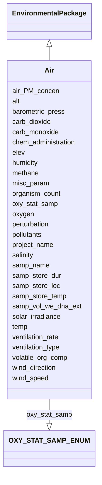

# Class: Air


URI: [mixs_6_2_proposal:Air](https://turbomam.github.io/mixs-envo-struct-knowl-extraction/Air)





## Inheritance
* [EnvironmentalPackage](EnvironmentalPackage.md)
    * **Air**


## Slots

| Name | Cardinality and Range | Description | Inheritance |
| ---  | --- | --- | --- |
| [samp_name](samp_name.md) | 1..1 <br/> [String](String.md) | A local identifier or name that for the material sample used for extracting n... | direct |
| [project_name](project_name.md) | 1..1 <br/> [String](String.md) | Name of the project within which the sequencing was organized | direct |
| [alt](alt.md) | 1..1 <br/> [String](String.md) | Heights of objects such as airplanes, space shuttles, rockets, atmospheric ba... | direct |
| [elev](elev.md) | 0..1 _recommended_ <br/> [String](String.md) | Elevation of the sampling site is its height above a fixed reference point, m... | direct |
| [barometric_press](barometric_press.md) | 0..1 <br/> [String](String.md) | Force per unit area exerted against a surface by the weight of air above that... | direct |
| [carb_dioxide](carb_dioxide.md) | 0..1 <br/> [String](String.md) | Carbon dioxide (gas) amount or concentration at the time of sampling | direct |
| [carb_monoxide](carb_monoxide.md) | 0..1 <br/> [String](String.md) | Carbon monoxide (gas) amount or concentration at the time of sampling | direct |
| [chem_administration](chem_administration.md) | 0..* <br/> [String](String.md) | List of chemical compounds administered to the host or site where sampling oc... | direct |
| [humidity](humidity.md) | 0..1 <br/> [String](String.md) | Amount of water vapour in the air, at the time of sampling | direct |
| [methane](methane.md) | 0..1 <br/> [String](String.md) | Methane (gas) amount or concentration at the time of sampling | direct |
| [organism_count](organism_count.md) | 0..* <br/> [String](String.md) | Total cell count of any organism (or group of organisms) per gram, volume or ... | direct |
| [oxygen](oxygen.md) | 0..1 <br/> [String](String.md) | Oxygen (gas) amount or concentration at the time of sampling | direct |
| [oxy_stat_samp](oxy_stat_samp.md) | 0..1 <br/> [OXYSTATSAMPENUM](OXYSTATSAMPENUM.md) | Oxygenation status of sample | direct |
| [perturbation](perturbation.md) | 0..* <br/> [String](String.md) | Type of perturbation, e | direct |
| [pollutants](pollutants.md) | 0..* <br/> [String](String.md) | Pollutant types and, amount or concentrations measured at the time of samplin... | direct |
| [air_PM_concen](air_PM_concen.md) | 0..* <br/> [String](String.md) | Concentration of substances that remain suspended in the air, and comprise mi... | direct |
| [salinity](salinity.md) | 0..1 <br/> [String](String.md) | The total concentration of all dissolved salts in a liquid or solid sample | direct |
| [samp_store_dur](samp_store_dur.md) | 0..1 <br/> [String](String.md) | Duration for which the sample was stored | direct |
| [samp_store_loc](samp_store_loc.md) | 0..1 <br/> [String](String.md) | Location at which sample was stored, usually name of a specific freezer/room | direct |
| [samp_store_temp](samp_store_temp.md) | 0..1 <br/> [String](String.md) | Temperature at which sample was stored, e | direct |
| [samp_vol_we_dna_ext](samp_vol_we_dna_ext.md) | 0..1 <br/> [String](String.md) | Volume (ml) or mass (g) of total collected sample processed for DNA extractio... | direct |
| [solar_irradiance](solar_irradiance.md) | 0..* <br/> [String](String.md) | The amount of solar energy that arrives at a specific area of a surface durin... | direct |
| [temp](temp.md) | 0..1 <br/> [String](String.md) | Temperature of the sample at the time of sampling | direct |
| [ventilation_rate](ventilation_rate.md) | 0..1 <br/> [String](String.md) | Ventilation rate of the system in the sampled premises | direct |
| [ventilation_type](ventilation_type.md) | 0..1 <br/> [String](String.md) | Ventilation system used in the sampled premises | direct |
| [volatile_org_comp](volatile_org_comp.md) | 0..* <br/> [String](String.md) | Concentration of carbon-based chemicals that easily evaporate at room tempera... | direct |
| [wind_direction](wind_direction.md) | 0..1 <br/> [String](String.md) | Wind direction is the direction from which a wind originates | direct |
| [wind_speed](wind_speed.md) | 0..1 <br/> [String](String.md) | Speed of wind measured at the time of sampling | direct |
| [misc_param](misc_param.md) | 0..* <br/> [String](String.md) | Any other measurement performed or parameter collected, that is not listed he... | direct |


## Identifier and Mapping Information


### Schema Source


* from schema: https://turbomam.github.io/mixs-envo-struct-knowl-extraction//GSC_MIxS_6


## Mappings

| Mapping Type | Mapped Value |
| ---  | ---  |
| self | mixs_6_2_proposal:Air |
| native | mixs_6_2_proposal:Air |


## LinkML Source

<!-- TODO: investigate https://stackoverflow.com/questions/37606292/how-to-create-tabbed-code-blocks-in-mkdocs-or-sphinx -->

### Direct

<details>
```yaml
name: Air
title: Air
from_schema: https://turbomam.github.io/mixs-envo-struct-knowl-extraction//GSC_MIxS_6
is_a: EnvironmentalPackage
mixin: false
slots:
- samp_name
- project_name
- alt
- elev
- barometric_press
- carb_dioxide
- carb_monoxide
- chem_administration
- humidity
- methane
- organism_count
- oxygen
- oxy_stat_samp
- perturbation
- pollutants
- air_PM_concen
- salinity
- samp_store_dur
- samp_store_loc
- samp_store_temp
- samp_vol_we_dna_ext
- solar_irradiance
- temp
- ventilation_rate
- ventilation_type
- volatile_org_comp
- wind_direction
- wind_speed
- misc_param
slot_usage:
  air_PM_concen:
    name: air_PM_concen
    domain_of:
    - Air
    - FoodFarmEnvironment
  alt:
    name: alt
    domain_of:
    - Air
    - HostAssociated
    - MigsBa
    - MigsEu
    - MigsOrg
    - MigsPl
    - MigsVi
    - Mimag
    - MimarksC
    - MimarksS
    - Mims
    - Misag
    - MiscellaneousNaturalOrArtificialEnvironment
    - Miuvig
    - SymbiontAssociated
    required: true
  carb_dioxide:
    name: carb_dioxide
    domain_of:
    - Air
    - BuiltEnvironment
    required: false
    recommended: false
  chem_administration:
    name: chem_administration
    domain_of:
    - Agriculture
    - Air
    - FoodFarmEnvironment
    - HostAssociated
    - HumanAssociated
    - HumanGut
    - HumanOral
    - HumanSkin
    - HumanVaginal
    - MicrobialMatBiofilm
    - MiscellaneousNaturalOrArtificialEnvironment
    - PlantAssociated
    - Sediment
    - SymbiontAssociated
    - WastewaterSludge
    - Water
    required: false
    recommended: false
  elev:
    name: elev
    domain_of:
    - Agriculture
    - Air
    - HostAssociated
    - HydrocarbonResourcesCores
    - MicrobialMatBiofilm
    - MigsBa
    - MigsEu
    - MigsOrg
    - MigsPl
    - MigsVi
    - Mimag
    - MimarksC
    - MimarksS
    - Mims
    - Misag
    - MiscellaneousNaturalOrArtificialEnvironment
    - Miuvig
    - PlantAssociated
    - Sediment
    - Soil
    - SymbiontAssociated
    - Water
    recommended: true
  humidity:
    name: humidity
    examples:
    - value: 25 gram per cubic meter
    domain_of:
    - Agriculture
    - Air
    - FoodFarmEnvironment
    required: false
    recommended: false
  methane:
    name: methane
    examples:
    - value: 1800 parts per billion
    domain_of:
    - Air
    - MicrobialMatBiofilm
    - Sediment
  misc_param:
    name: misc_param
    domain_of:
    - Agriculture
    - Air
    - FoodAnimalAndAnimalFeed
    - FoodFarmEnvironment
    - FoodFoodProductionFacility
    - FoodHumanFoods
    - HostAssociated
    - HumanAssociated
    - HumanGut
    - HumanOral
    - HumanSkin
    - HumanVaginal
    - HydrocarbonResourcesCores
    - HydrocarbonResourcesFluidsSwabs
    - MicrobialMatBiofilm
    - MiscellaneousNaturalOrArtificialEnvironment
    - PlantAssociated
    - Sediment
    - Soil
    - SymbiontAssociated
    - WastewaterSludge
    - Water
  organism_count:
    name: organism_count
    description: 'Total cell count of any organism (or group of organisms) per gram,
      volume or area of sample, should include name of organism followed by count.
      The method that was used for the enumeration (e.g. qPCR, atp, mpn, etc.) Should
      also be provided. (example: total prokaryotes; 3.5e7 cells per ml; qpcr)'
    examples:
    - value: total prokaryotes;3.5e7 cells per milliliter;qPCR
    string_serialization: '{text};{float} {unit};[qPCR|ATP|MPN|other]'
    multivalued: true
    domain_of:
    - Agriculture
    - Air
    - BuiltEnvironment
    - FoodAnimalAndAnimalFeed
    - FoodFarmEnvironment
    - FoodFoodProductionFacility
    - FoodHumanFoods
    - HostAssociated
    - HumanAssociated
    - HumanGut
    - HumanOral
    - HumanSkin
    - HumanVaginal
    - HydrocarbonResourcesCores
    - HydrocarbonResourcesFluidsSwabs
    - MicrobialMatBiofilm
    - MiscellaneousNaturalOrArtificialEnvironment
    - PlantAssociated
    - Sediment
    - SymbiontAssociated
    - WastewaterSludge
    - Water
    required: false
    recommended: false
  oxy_stat_samp:
    name: oxy_stat_samp
    domain_of:
    - Agriculture
    - Air
    - HostAssociated
    - HumanAssociated
    - HumanGut
    - HumanOral
    - HumanSkin
    - HumanVaginal
    - HydrocarbonResourcesCores
    - HydrocarbonResourcesFluidsSwabs
    - MicrobialMatBiofilm
    - MiscellaneousNaturalOrArtificialEnvironment
    - PlantAssociated
    - Sediment
    - SymbiontAssociated
    - WastewaterSludge
    - Water
    required: false
    recommended: false
  perturbation:
    name: perturbation
    string_serialization: '{text};{Rn/start_time/end_time/duration}'
    domain_of:
    - Agriculture
    - Air
    - FoodAnimalAndAnimalFeed
    - FoodFarmEnvironment
    - FoodHumanFoods
    - HostAssociated
    - HumanAssociated
    - HumanGut
    - HumanOral
    - HumanSkin
    - HumanVaginal
    - MicrobialMatBiofilm
    - MiscellaneousNaturalOrArtificialEnvironment
    - PlantAssociated
    - Sediment
    - SymbiontAssociated
    - WastewaterSludge
    - Water
    required: false
    recommended: false
  salinity:
    name: salinity
    multivalued: false
    domain_of:
    - Air
    - FoodFarmEnvironment
    - HostAssociated
    - HumanAssociated
    - HumanGut
    - HumanOral
    - HumanSkin
    - HumanVaginal
    - HydrocarbonResourcesCores
    - HydrocarbonResourcesFluidsSwabs
    - MicrobialMatBiofilm
    - MiscellaneousNaturalOrArtificialEnvironment
    - PlantAssociated
    - Sediment
    - SymbiontAssociated
    - WastewaterSludge
    - Water
  samp_store_dur:
    name: samp_store_dur
    description: Duration for which the sample was stored
    string_serialization: '{duration}'
    domain_of:
    - Agriculture
    - Air
    - FoodAnimalAndAnimalFeed
    - FoodFarmEnvironment
    - FoodFoodProductionFacility
    - FoodHumanFoods
    - HostAssociated
    - HumanAssociated
    - HumanGut
    - HumanOral
    - HumanSkin
    - HumanVaginal
    - HydrocarbonResourcesCores
    - HydrocarbonResourcesFluidsSwabs
    - MicrobialMatBiofilm
    - MiscellaneousNaturalOrArtificialEnvironment
    - PlantAssociated
    - Sediment
    - SymbiontAssociated
    - WastewaterSludge
    - Water
    required: false
    recommended: false
  samp_store_loc:
    name: samp_store_loc
    description: Location at which sample was stored, usually name of a specific freezer/room
    examples:
    - value: Freezer no:5
    domain_of:
    - Agriculture
    - Air
    - FoodAnimalAndAnimalFeed
    - FoodFoodProductionFacility
    - FoodHumanFoods
    - HostAssociated
    - HumanAssociated
    - HumanGut
    - HumanOral
    - HumanSkin
    - HumanVaginal
    - HydrocarbonResourcesCores
    - HydrocarbonResourcesFluidsSwabs
    - MicrobialMatBiofilm
    - MiscellaneousNaturalOrArtificialEnvironment
    - PlantAssociated
    - Sediment
    - SymbiontAssociated
    - WastewaterSludge
    - Water
    required: false
    recommended: false
  samp_vol_we_dna_ext:
    name: samp_vol_we_dna_ext
    description: 'Volume (ml) or mass (g) of total collected sample processed for
      DNA extraction. Note: total sample collected should be entered under the term
      Sample Size (MIXS:0000001).'
    domain_of:
    - Agriculture
    - Air
    - FoodAnimalAndAnimalFeed
    - FoodFarmEnvironment
    - FoodFoodProductionFacility
    - FoodHumanFoods
    - HostAssociated
    - HumanAssociated
    - HumanGut
    - HumanOral
    - HumanSkin
    - HumanVaginal
    - HydrocarbonResourcesCores
    - HydrocarbonResourcesFluidsSwabs
    - MicrobialMatBiofilm
    - MigsBa
    - MigsEu
    - MigsOrg
    - MigsPl
    - MigsVi
    - Mimag
    - MimarksC
    - MimarksS
    - Mims
    - Misag
    - MiscellaneousNaturalOrArtificialEnvironment
    - Miuvig
    - PlantAssociated
    - Sediment
    - Soil
    - SymbiontAssociated
    - WastewaterSludge
    - Water
    required: false
    recommended: false
  temp:
    name: temp
    domain_of:
    - Agriculture
    - Air
    - FoodAnimalAndAnimalFeed
    - FoodFarmEnvironment
    - FoodHumanFoods
    - HostAssociated
    - HumanAssociated
    - HumanGut
    - HumanOral
    - HumanSkin
    - HumanVaginal
    - HydrocarbonResourcesCores
    - HydrocarbonResourcesFluidsSwabs
    - MicrobialMatBiofilm
    - MigsBa
    - MigsEu
    - MigsOrg
    - MigsPl
    - MigsVi
    - Mimag
    - MimarksC
    - MimarksS
    - Mims
    - Misag
    - MiscellaneousNaturalOrArtificialEnvironment
    - Miuvig
    - PlantAssociated
    - Sediment
    - Soil
    - SymbiontAssociated
    - WastewaterSludge
    - Water
    required: false
    recommended: false
  ventilation_type:
    name: ventilation_type
    multivalued: false
    domain_of:
    - Air
    - BuiltEnvironment
    - FoodFarmEnvironment
    required: false
    recommended: false
  wind_direction:
    name: wind_direction
    examples:
    - value: Northwest
    domain_of:
    - Air
    - FoodFarmEnvironment
  wind_speed:
    name: wind_speed
    description: Speed of wind measured at the time of sampling
    examples:
    - value: 21 kilometer per hour
    domain_of:
    - Air
    - FoodFarmEnvironment

```
</details>

### Induced

<details>
```yaml
name: Air
title: Air
from_schema: https://turbomam.github.io/mixs-envo-struct-knowl-extraction//GSC_MIxS_6
is_a: EnvironmentalPackage
mixin: false
slot_usage:
  air_PM_concen:
    name: air_PM_concen
    domain_of:
    - Air
    - FoodFarmEnvironment
  alt:
    name: alt
    domain_of:
    - Air
    - HostAssociated
    - MigsBa
    - MigsEu
    - MigsOrg
    - MigsPl
    - MigsVi
    - Mimag
    - MimarksC
    - MimarksS
    - Mims
    - Misag
    - MiscellaneousNaturalOrArtificialEnvironment
    - Miuvig
    - SymbiontAssociated
    required: true
  carb_dioxide:
    name: carb_dioxide
    domain_of:
    - Air
    - BuiltEnvironment
    required: false
    recommended: false
  chem_administration:
    name: chem_administration
    domain_of:
    - Agriculture
    - Air
    - FoodFarmEnvironment
    - HostAssociated
    - HumanAssociated
    - HumanGut
    - HumanOral
    - HumanSkin
    - HumanVaginal
    - MicrobialMatBiofilm
    - MiscellaneousNaturalOrArtificialEnvironment
    - PlantAssociated
    - Sediment
    - SymbiontAssociated
    - WastewaterSludge
    - Water
    required: false
    recommended: false
  elev:
    name: elev
    domain_of:
    - Agriculture
    - Air
    - HostAssociated
    - HydrocarbonResourcesCores
    - MicrobialMatBiofilm
    - MigsBa
    - MigsEu
    - MigsOrg
    - MigsPl
    - MigsVi
    - Mimag
    - MimarksC
    - MimarksS
    - Mims
    - Misag
    - MiscellaneousNaturalOrArtificialEnvironment
    - Miuvig
    - PlantAssociated
    - Sediment
    - Soil
    - SymbiontAssociated
    - Water
    recommended: true
  humidity:
    name: humidity
    examples:
    - value: 25 gram per cubic meter
    domain_of:
    - Agriculture
    - Air
    - FoodFarmEnvironment
    required: false
    recommended: false
  methane:
    name: methane
    examples:
    - value: 1800 parts per billion
    domain_of:
    - Air
    - MicrobialMatBiofilm
    - Sediment
  misc_param:
    name: misc_param
    domain_of:
    - Agriculture
    - Air
    - FoodAnimalAndAnimalFeed
    - FoodFarmEnvironment
    - FoodFoodProductionFacility
    - FoodHumanFoods
    - HostAssociated
    - HumanAssociated
    - HumanGut
    - HumanOral
    - HumanSkin
    - HumanVaginal
    - HydrocarbonResourcesCores
    - HydrocarbonResourcesFluidsSwabs
    - MicrobialMatBiofilm
    - MiscellaneousNaturalOrArtificialEnvironment
    - PlantAssociated
    - Sediment
    - Soil
    - SymbiontAssociated
    - WastewaterSludge
    - Water
  organism_count:
    name: organism_count
    description: 'Total cell count of any organism (or group of organisms) per gram,
      volume or area of sample, should include name of organism followed by count.
      The method that was used for the enumeration (e.g. qPCR, atp, mpn, etc.) Should
      also be provided. (example: total prokaryotes; 3.5e7 cells per ml; qpcr)'
    examples:
    - value: total prokaryotes;3.5e7 cells per milliliter;qPCR
    string_serialization: '{text};{float} {unit};[qPCR|ATP|MPN|other]'
    multivalued: true
    domain_of:
    - Agriculture
    - Air
    - BuiltEnvironment
    - FoodAnimalAndAnimalFeed
    - FoodFarmEnvironment
    - FoodFoodProductionFacility
    - FoodHumanFoods
    - HostAssociated
    - HumanAssociated
    - HumanGut
    - HumanOral
    - HumanSkin
    - HumanVaginal
    - HydrocarbonResourcesCores
    - HydrocarbonResourcesFluidsSwabs
    - MicrobialMatBiofilm
    - MiscellaneousNaturalOrArtificialEnvironment
    - PlantAssociated
    - Sediment
    - SymbiontAssociated
    - WastewaterSludge
    - Water
    required: false
    recommended: false
  oxy_stat_samp:
    name: oxy_stat_samp
    domain_of:
    - Agriculture
    - Air
    - HostAssociated
    - HumanAssociated
    - HumanGut
    - HumanOral
    - HumanSkin
    - HumanVaginal
    - HydrocarbonResourcesCores
    - HydrocarbonResourcesFluidsSwabs
    - MicrobialMatBiofilm
    - MiscellaneousNaturalOrArtificialEnvironment
    - PlantAssociated
    - Sediment
    - SymbiontAssociated
    - WastewaterSludge
    - Water
    required: false
    recommended: false
  perturbation:
    name: perturbation
    string_serialization: '{text};{Rn/start_time/end_time/duration}'
    domain_of:
    - Agriculture
    - Air
    - FoodAnimalAndAnimalFeed
    - FoodFarmEnvironment
    - FoodHumanFoods
    - HostAssociated
    - HumanAssociated
    - HumanGut
    - HumanOral
    - HumanSkin
    - HumanVaginal
    - MicrobialMatBiofilm
    - MiscellaneousNaturalOrArtificialEnvironment
    - PlantAssociated
    - Sediment
    - SymbiontAssociated
    - WastewaterSludge
    - Water
    required: false
    recommended: false
  salinity:
    name: salinity
    multivalued: false
    domain_of:
    - Air
    - FoodFarmEnvironment
    - HostAssociated
    - HumanAssociated
    - HumanGut
    - HumanOral
    - HumanSkin
    - HumanVaginal
    - HydrocarbonResourcesCores
    - HydrocarbonResourcesFluidsSwabs
    - MicrobialMatBiofilm
    - MiscellaneousNaturalOrArtificialEnvironment
    - PlantAssociated
    - Sediment
    - SymbiontAssociated
    - WastewaterSludge
    - Water
  samp_store_dur:
    name: samp_store_dur
    description: Duration for which the sample was stored
    string_serialization: '{duration}'
    domain_of:
    - Agriculture
    - Air
    - FoodAnimalAndAnimalFeed
    - FoodFarmEnvironment
    - FoodFoodProductionFacility
    - FoodHumanFoods
    - HostAssociated
    - HumanAssociated
    - HumanGut
    - HumanOral
    - HumanSkin
    - HumanVaginal
    - HydrocarbonResourcesCores
    - HydrocarbonResourcesFluidsSwabs
    - MicrobialMatBiofilm
    - MiscellaneousNaturalOrArtificialEnvironment
    - PlantAssociated
    - Sediment
    - SymbiontAssociated
    - WastewaterSludge
    - Water
    required: false
    recommended: false
  samp_store_loc:
    name: samp_store_loc
    description: Location at which sample was stored, usually name of a specific freezer/room
    examples:
    - value: Freezer no:5
    domain_of:
    - Agriculture
    - Air
    - FoodAnimalAndAnimalFeed
    - FoodFoodProductionFacility
    - FoodHumanFoods
    - HostAssociated
    - HumanAssociated
    - HumanGut
    - HumanOral
    - HumanSkin
    - HumanVaginal
    - HydrocarbonResourcesCores
    - HydrocarbonResourcesFluidsSwabs
    - MicrobialMatBiofilm
    - MiscellaneousNaturalOrArtificialEnvironment
    - PlantAssociated
    - Sediment
    - SymbiontAssociated
    - WastewaterSludge
    - Water
    required: false
    recommended: false
  samp_vol_we_dna_ext:
    name: samp_vol_we_dna_ext
    description: 'Volume (ml) or mass (g) of total collected sample processed for
      DNA extraction. Note: total sample collected should be entered under the term
      Sample Size (MIXS:0000001).'
    domain_of:
    - Agriculture
    - Air
    - FoodAnimalAndAnimalFeed
    - FoodFarmEnvironment
    - FoodFoodProductionFacility
    - FoodHumanFoods
    - HostAssociated
    - HumanAssociated
    - HumanGut
    - HumanOral
    - HumanSkin
    - HumanVaginal
    - HydrocarbonResourcesCores
    - HydrocarbonResourcesFluidsSwabs
    - MicrobialMatBiofilm
    - MigsBa
    - MigsEu
    - MigsOrg
    - MigsPl
    - MigsVi
    - Mimag
    - MimarksC
    - MimarksS
    - Mims
    - Misag
    - MiscellaneousNaturalOrArtificialEnvironment
    - Miuvig
    - PlantAssociated
    - Sediment
    - Soil
    - SymbiontAssociated
    - WastewaterSludge
    - Water
    required: false
    recommended: false
  temp:
    name: temp
    domain_of:
    - Agriculture
    - Air
    - FoodAnimalAndAnimalFeed
    - FoodFarmEnvironment
    - FoodHumanFoods
    - HostAssociated
    - HumanAssociated
    - HumanGut
    - HumanOral
    - HumanSkin
    - HumanVaginal
    - HydrocarbonResourcesCores
    - HydrocarbonResourcesFluidsSwabs
    - MicrobialMatBiofilm
    - MigsBa
    - MigsEu
    - MigsOrg
    - MigsPl
    - MigsVi
    - Mimag
    - MimarksC
    - MimarksS
    - Mims
    - Misag
    - MiscellaneousNaturalOrArtificialEnvironment
    - Miuvig
    - PlantAssociated
    - Sediment
    - Soil
    - SymbiontAssociated
    - WastewaterSludge
    - Water
    required: false
    recommended: false
  ventilation_type:
    name: ventilation_type
    multivalued: false
    domain_of:
    - Air
    - BuiltEnvironment
    - FoodFarmEnvironment
    required: false
    recommended: false
  wind_direction:
    name: wind_direction
    examples:
    - value: Northwest
    domain_of:
    - Air
    - FoodFarmEnvironment
  wind_speed:
    name: wind_speed
    description: Speed of wind measured at the time of sampling
    examples:
    - value: 21 kilometer per hour
    domain_of:
    - Air
    - FoodFarmEnvironment
attributes:
  samp_name:
    name: samp_name
    description: A local identifier or name that for the material sample used for
      extracting nucleic acids, and subsequent sequencing. It can refer either to
      the original material collected or to any derived sub-samples. It can have any
      format, but we suggest that you make it concise, unique and consistent within
      your lab, and as informative as possible. INSDC requires every sample name from
      a single Submitter to be unique. Use of a globally unique identifier for the
      field source_mat_id is recommended in addition to sample_name
    title: sample name
    notes:
    - sample
    examples:
    - value: ISDsoil1
    in_subset:
    - investigation
    from_schema: https://turbomam.github.io/mixs-envo-struct-knowl-extraction//GSC_MIxS_6
    rank: 1000
    slot_uri: MIXS:0001107
    multivalued: false
    alias: samp_name
    owner: Air
    domain_of:
    - Air
    - BuiltEnvironment
    - FoodAnimalAndAnimalFeed
    - FoodFarmEnvironment
    - FoodFoodProductionFacility
    - FoodHumanFoods
    - HostAssociated
    - HumanAssociated
    - HumanGut
    - HumanOral
    - HumanSkin
    - HumanVaginal
    - HydrocarbonResourcesCores
    - HydrocarbonResourcesFluidsSwabs
    - MicrobialMatBiofilm
    - MigsBa
    - MigsEu
    - MigsOrg
    - MigsPl
    - MigsVi
    - Mimag
    - MimarksC
    - MimarksS
    - Mims
    - Misag
    - MiscellaneousNaturalOrArtificialEnvironment
    - Miuvig
    - PlantAssociated
    - Sediment
    - Soil
    - SymbiontAssociated
    - WastewaterSludge
    - Water
    range: string
    required: true
  project_name:
    name: project_name
    description: Name of the project within which the sequencing was organized
    title: project name
    notes:
    - project
    examples:
    - value: Forest soil metagenome
    in_subset:
    - investigation
    from_schema: https://turbomam.github.io/mixs-envo-struct-knowl-extraction//GSC_MIxS_6
    rank: 1000
    slot_uri: MIXS:0000092
    multivalued: false
    alias: project_name
    owner: Air
    domain_of:
    - Air
    - BuiltEnvironment
    - FoodAnimalAndAnimalFeed
    - FoodFarmEnvironment
    - FoodFoodProductionFacility
    - FoodHumanFoods
    - HostAssociated
    - HumanAssociated
    - HumanGut
    - HumanOral
    - HumanSkin
    - HumanVaginal
    - HydrocarbonResourcesCores
    - HydrocarbonResourcesFluidsSwabs
    - MicrobialMatBiofilm
    - MigsBa
    - MigsEu
    - MigsOrg
    - MigsPl
    - MigsVi
    - Mimag
    - MimarksC
    - MimarksS
    - Mims
    - Misag
    - MiscellaneousNaturalOrArtificialEnvironment
    - Miuvig
    - PlantAssociated
    - Sediment
    - Soil
    - SymbiontAssociated
    - WastewaterSludge
    - Water
    range: string
    required: true
  alt:
    name: alt
    description: Heights of objects such as airplanes, space shuttles, rockets, atmospheric
      balloons and heights of places such as atmospheric layers and clouds. Used to
      measure the height of an object which is above the earth's surface. In this
      context, the altitude measurement is the vertical distance between the earth's
      surface above sea level and the sampled position in the air
    title: altitude
    from_schema: https://turbomam.github.io/mixs-envo-struct-knowl-extraction//GSC_MIxS_6
    rank: 1000
    slot_uri: MIXS:0000094
    multivalued: false
    alias: alt
    owner: Air
    domain_of:
    - Air
    - HostAssociated
    - MigsBa
    - MigsEu
    - MigsOrg
    - MigsPl
    - MigsVi
    - Mimag
    - MimarksC
    - MimarksS
    - Mims
    - Misag
    - MiscellaneousNaturalOrArtificialEnvironment
    - Miuvig
    - SymbiontAssociated
    range: string
    required: true
    pattern: ^[-+]?[0-9]*\.?[0-9]+([eE][-+]?[0-9]+)? \S.*\S$
  elev:
    name: elev
    description: Elevation of the sampling site is its height above a fixed reference
      point, most commonly the mean sea level. Elevation is mainly used when referring
      to points on the earth's surface, while altitude is used for points above the
      surface, such as an aircraft in flight or a spacecraft in orbit
    title: elevation
    from_schema: https://turbomam.github.io/mixs-envo-struct-knowl-extraction//GSC_MIxS_6
    rank: 1000
    slot_uri: MIXS:0000093
    multivalued: false
    alias: elev
    owner: Air
    domain_of:
    - Agriculture
    - Air
    - HostAssociated
    - HydrocarbonResourcesCores
    - MicrobialMatBiofilm
    - MigsBa
    - MigsEu
    - MigsOrg
    - MigsPl
    - MigsVi
    - Mimag
    - MimarksC
    - MimarksS
    - Mims
    - Misag
    - MiscellaneousNaturalOrArtificialEnvironment
    - Miuvig
    - PlantAssociated
    - Sediment
    - Soil
    - SymbiontAssociated
    - Water
    range: string
    recommended: true
    pattern: ^[-+]?[0-9]*\.?[0-9]+([eE][-+]?[0-9]+)? \S.*\S$
  barometric_press:
    name: barometric_press
    annotations:
      Preferred_unit:
        tag: Preferred_unit
        value: millibar
    description: Force per unit area exerted against a surface by the weight of air
      above that surface
    title: barometric pressure
    notes:
    - pressure
    examples:
    - value: 5 millibar
    from_schema: https://turbomam.github.io/mixs-envo-struct-knowl-extraction//GSC_MIxS_6
    rank: 1000
    slot_uri: MIXS:0000096
    multivalued: false
    alias: barometric_press
    owner: Air
    domain_of:
    - Air
    range: string
    required: false
    recommended: false
    pattern: ^[-+]?[0-9]*\.?[0-9]+([eE][-+]?[0-9]+)? \S.*\S$
  carb_dioxide:
    name: carb_dioxide
    description: Carbon dioxide (gas) amount or concentration at the time of sampling
    title: carbon dioxide
    from_schema: https://turbomam.github.io/mixs-envo-struct-knowl-extraction//GSC_MIxS_6
    rank: 1000
    slot_uri: MIXS:0000097
    multivalued: false
    alias: carb_dioxide
    owner: Air
    domain_of:
    - Air
    - BuiltEnvironment
    range: string
    required: false
    recommended: false
    pattern: ^[-+]?[0-9]*\.?[0-9]+([eE][-+]?[0-9]+)? \S.*\S$
  carb_monoxide:
    name: carb_monoxide
    annotations:
      Preferred_unit:
        tag: Preferred_unit
        value: micromole per liter, parts per million
    description: Carbon monoxide (gas) amount or concentration at the time of sampling
    title: carbon monoxide
    notes:
    - carbon
    examples:
    - value: 0.1 parts per million
    from_schema: https://turbomam.github.io/mixs-envo-struct-knowl-extraction//GSC_MIxS_6
    rank: 1000
    slot_uri: MIXS:0000098
    multivalued: false
    alias: carb_monoxide
    owner: Air
    domain_of:
    - Air
    range: string
    required: false
    recommended: false
    pattern: ^[-+]?[0-9]*\.?[0-9]+([eE][-+]?[0-9]+)? \S.*\S$
  chem_administration:
    name: chem_administration
    description: List of chemical compounds administered to the host or site where
      sampling occurred, and when (e.g. Antibiotics, n fertilizer, air filter); can
      include multiple compounds. For chemical entities of biological interest ontology
      (chebi) (v 163), http://purl.bioontology.org/ontology/chebi
    title: chemical administration
    from_schema: https://turbomam.github.io/mixs-envo-struct-knowl-extraction//GSC_MIxS_6
    rank: 1000
    string_serialization: '{termLabel} [{termID}];{timestamp}'
    slot_uri: MIXS:0000751
    multivalued: true
    alias: chem_administration
    owner: Air
    domain_of:
    - Agriculture
    - Air
    - FoodFarmEnvironment
    - HostAssociated
    - HumanAssociated
    - HumanGut
    - HumanOral
    - HumanSkin
    - HumanVaginal
    - MicrobialMatBiofilm
    - MiscellaneousNaturalOrArtificialEnvironment
    - PlantAssociated
    - Sediment
    - SymbiontAssociated
    - WastewaterSludge
    - Water
    range: string
    required: false
    recommended: false
  humidity:
    name: humidity
    description: Amount of water vapour in the air, at the time of sampling
    title: humidity
    examples:
    - value: 25 gram per cubic meter
    from_schema: https://turbomam.github.io/mixs-envo-struct-knowl-extraction//GSC_MIxS_6
    rank: 1000
    slot_uri: MIXS:0000100
    multivalued: false
    alias: humidity
    owner: Air
    domain_of:
    - Agriculture
    - Air
    - FoodFarmEnvironment
    range: string
    required: false
    recommended: false
    pattern: ^[-+]?[0-9]*\.?[0-9]+([eE][-+]?[0-9]+)? \S.*\S$
  methane:
    name: methane
    description: Methane (gas) amount or concentration at the time of sampling
    title: methane
    examples:
    - value: 1800 parts per billion
    from_schema: https://turbomam.github.io/mixs-envo-struct-knowl-extraction//GSC_MIxS_6
    rank: 1000
    slot_uri: MIXS:0000101
    multivalued: false
    alias: methane
    owner: Air
    domain_of:
    - Air
    - MicrobialMatBiofilm
    - Sediment
    range: string
    required: false
    recommended: false
    pattern: ^[-+]?[0-9]*\.?[0-9]+([eE][-+]?[0-9]+)? \S.*\S$
  organism_count:
    name: organism_count
    description: 'Total cell count of any organism (or group of organisms) per gram,
      volume or area of sample, should include name of organism followed by count.
      The method that was used for the enumeration (e.g. qPCR, atp, mpn, etc.) Should
      also be provided. (example: total prokaryotes; 3.5e7 cells per ml; qpcr)'
    title: organism count
    examples:
    - value: total prokaryotes;3.5e7 cells per milliliter;qPCR
    from_schema: https://turbomam.github.io/mixs-envo-struct-knowl-extraction//GSC_MIxS_6
    rank: 1000
    string_serialization: '{text};{float} {unit};[qPCR|ATP|MPN|other]'
    slot_uri: MIXS:0000103
    multivalued: true
    alias: organism_count
    owner: Air
    domain_of:
    - Agriculture
    - Air
    - BuiltEnvironment
    - FoodAnimalAndAnimalFeed
    - FoodFarmEnvironment
    - FoodFoodProductionFacility
    - FoodHumanFoods
    - HostAssociated
    - HumanAssociated
    - HumanGut
    - HumanOral
    - HumanSkin
    - HumanVaginal
    - HydrocarbonResourcesCores
    - HydrocarbonResourcesFluidsSwabs
    - MicrobialMatBiofilm
    - MiscellaneousNaturalOrArtificialEnvironment
    - PlantAssociated
    - Sediment
    - SymbiontAssociated
    - WastewaterSludge
    - Water
    range: string
    required: false
    recommended: false
  oxygen:
    name: oxygen
    annotations:
      Preferred_unit:
        tag: Preferred_unit
        value: milligram per liter, parts per million
    description: Oxygen (gas) amount or concentration at the time of sampling
    title: oxygen
    notes:
    - oxygen
    examples:
    - value: 600 parts per million
    from_schema: https://turbomam.github.io/mixs-envo-struct-knowl-extraction//GSC_MIxS_6
    rank: 1000
    slot_uri: MIXS:0000104
    multivalued: false
    alias: oxygen
    owner: Air
    domain_of:
    - Air
    range: string
    required: false
    recommended: false
    pattern: ^[-+]?[0-9]*\.?[0-9]+([eE][-+]?[0-9]+)? \S.*\S$
  oxy_stat_samp:
    name: oxy_stat_samp
    description: Oxygenation status of sample
    title: oxygenation status of sample
    from_schema: https://turbomam.github.io/mixs-envo-struct-knowl-extraction//GSC_MIxS_6
    rank: 1000
    slot_uri: MIXS:0000753
    multivalued: false
    alias: oxy_stat_samp
    owner: Air
    domain_of:
    - Agriculture
    - Air
    - HostAssociated
    - HumanAssociated
    - HumanGut
    - HumanOral
    - HumanSkin
    - HumanVaginal
    - HydrocarbonResourcesCores
    - HydrocarbonResourcesFluidsSwabs
    - MicrobialMatBiofilm
    - MiscellaneousNaturalOrArtificialEnvironment
    - PlantAssociated
    - Sediment
    - SymbiontAssociated
    - WastewaterSludge
    - Water
    range: OXY_STAT_SAMP_ENUM
    required: false
    recommended: false
  perturbation:
    name: perturbation
    description: Type of perturbation, e.g. chemical administration, physical disturbance,
      etc., coupled with perturbation regimen including how many times the perturbation
      was repeated, how long each perturbation lasted, and the start and end time
      of the entire perturbation period; can include multiple perturbation types
    title: perturbation
    from_schema: https://turbomam.github.io/mixs-envo-struct-knowl-extraction//GSC_MIxS_6
    rank: 1000
    string_serialization: '{text};{Rn/start_time/end_time/duration}'
    slot_uri: MIXS:0000754
    multivalued: true
    alias: perturbation
    owner: Air
    domain_of:
    - Agriculture
    - Air
    - FoodAnimalAndAnimalFeed
    - FoodFarmEnvironment
    - FoodHumanFoods
    - HostAssociated
    - HumanAssociated
    - HumanGut
    - HumanOral
    - HumanSkin
    - HumanVaginal
    - MicrobialMatBiofilm
    - MiscellaneousNaturalOrArtificialEnvironment
    - PlantAssociated
    - Sediment
    - SymbiontAssociated
    - WastewaterSludge
    - Water
    range: string
    required: false
    recommended: false
  pollutants:
    name: pollutants
    annotations:
      Expected_value:
        tag: Expected_value
        value: pollutant name;measurement value
      Preferred_unit:
        tag: Preferred_unit
        value: gram, mole per liter, milligram per liter, microgram per cubic meter
    description: Pollutant types and, amount or concentrations measured at the time
      of sampling; can report multiple pollutants by entering numeric values preceded
      by name of pollutant
    title: pollutants
    examples:
    - value: lead;0.15 microgram per cubic meter
    from_schema: https://turbomam.github.io/mixs-envo-struct-knowl-extraction//GSC_MIxS_6
    rank: 1000
    string_serialization: '{text};{float} {unit}'
    slot_uri: MIXS:0000107
    multivalued: true
    alias: pollutants
    owner: Air
    domain_of:
    - Air
    range: string
    required: false
    recommended: false
  air_PM_concen:
    name: air_PM_concen
    description: Concentration of substances that remain suspended in the air, and
      comprise mixtures of organic and inorganic substances (PM10 and PM2.5); can
      report multiple PM's by entering numeric values preceded by name of PM
    title: air particulate matter concentration
    from_schema: https://turbomam.github.io/mixs-envo-struct-knowl-extraction//GSC_MIxS_6
    rank: 1000
    string_serialization: '{text};{float} {unit}'
    slot_uri: MIXS:0000108
    multivalued: true
    alias: air_PM_concen
    owner: Air
    domain_of:
    - Air
    - FoodFarmEnvironment
    range: string
    required: false
    recommended: false
  salinity:
    name: salinity
    description: The total concentration of all dissolved salts in a liquid or solid
      sample. While salinity can be measured by a complete chemical analysis, this
      method is difficult and time consuming. More often, it is instead derived from
      the conductivity measurement. This is known as practical salinity. These derivations
      compare the specific conductance of the sample to a salinity standard such as
      seawater
    title: salinity
    from_schema: https://turbomam.github.io/mixs-envo-struct-knowl-extraction//GSC_MIxS_6
    rank: 1000
    slot_uri: MIXS:0000183
    multivalued: false
    alias: salinity
    owner: Air
    domain_of:
    - Air
    - FoodFarmEnvironment
    - HostAssociated
    - HumanAssociated
    - HumanGut
    - HumanOral
    - HumanSkin
    - HumanVaginal
    - HydrocarbonResourcesCores
    - HydrocarbonResourcesFluidsSwabs
    - MicrobialMatBiofilm
    - MiscellaneousNaturalOrArtificialEnvironment
    - PlantAssociated
    - Sediment
    - SymbiontAssociated
    - WastewaterSludge
    - Water
    range: string
    required: false
    recommended: false
    pattern: ^[-+]?[0-9]*\.?[0-9]+([eE][-+]?[0-9]+)? \S.*\S$
  samp_store_dur:
    name: samp_store_dur
    description: Duration for which the sample was stored
    title: sample storage duration
    from_schema: https://turbomam.github.io/mixs-envo-struct-knowl-extraction//GSC_MIxS_6
    rank: 1000
    string_serialization: '{duration}'
    slot_uri: MIXS:0000116
    multivalued: false
    alias: samp_store_dur
    owner: Air
    domain_of:
    - Agriculture
    - Air
    - FoodAnimalAndAnimalFeed
    - FoodFarmEnvironment
    - FoodFoodProductionFacility
    - FoodHumanFoods
    - HostAssociated
    - HumanAssociated
    - HumanGut
    - HumanOral
    - HumanSkin
    - HumanVaginal
    - HydrocarbonResourcesCores
    - HydrocarbonResourcesFluidsSwabs
    - MicrobialMatBiofilm
    - MiscellaneousNaturalOrArtificialEnvironment
    - PlantAssociated
    - Sediment
    - SymbiontAssociated
    - WastewaterSludge
    - Water
    range: string
    required: false
    recommended: false
  samp_store_loc:
    name: samp_store_loc
    description: Location at which sample was stored, usually name of a specific freezer/room
    title: sample storage location
    examples:
    - value: Freezer no:5
    from_schema: https://turbomam.github.io/mixs-envo-struct-knowl-extraction//GSC_MIxS_6
    rank: 1000
    slot_uri: MIXS:0000755
    multivalued: false
    alias: samp_store_loc
    owner: Air
    domain_of:
    - Agriculture
    - Air
    - FoodAnimalAndAnimalFeed
    - FoodFoodProductionFacility
    - FoodHumanFoods
    - HostAssociated
    - HumanAssociated
    - HumanGut
    - HumanOral
    - HumanSkin
    - HumanVaginal
    - HydrocarbonResourcesCores
    - HydrocarbonResourcesFluidsSwabs
    - MicrobialMatBiofilm
    - MiscellaneousNaturalOrArtificialEnvironment
    - PlantAssociated
    - Sediment
    - SymbiontAssociated
    - WastewaterSludge
    - Water
    range: string
    required: false
    recommended: false
  samp_store_temp:
    name: samp_store_temp
    annotations:
      Preferred_unit:
        tag: Preferred_unit
        value: degree Celsius
    description: Temperature at which sample was stored, e.g. -80 degree Celsius
    title: sample storage temperature
    notes:
    - sample
    - storage
    - temperature
    examples:
    - value: -80 degree Celsius
    from_schema: https://turbomam.github.io/mixs-envo-struct-knowl-extraction//GSC_MIxS_6
    rank: 1000
    slot_uri: MIXS:0000110
    multivalued: false
    alias: samp_store_temp
    owner: Air
    domain_of:
    - Agriculture
    - Air
    - FoodAnimalAndAnimalFeed
    - FoodFarmEnvironment
    - FoodFoodProductionFacility
    - FoodHumanFoods
    - HostAssociated
    - HumanAssociated
    - HumanGut
    - HumanOral
    - HumanSkin
    - HumanVaginal
    - HydrocarbonResourcesCores
    - HydrocarbonResourcesFluidsSwabs
    - MicrobialMatBiofilm
    - MiscellaneousNaturalOrArtificialEnvironment
    - PlantAssociated
    - Sediment
    - SymbiontAssociated
    - WastewaterSludge
    - Water
    range: string
    required: false
    recommended: false
    pattern: ^[-+]?[0-9]*\.?[0-9]+([eE][-+]?[0-9]+)? \S.*\S$
  samp_vol_we_dna_ext:
    name: samp_vol_we_dna_ext
    description: 'Volume (ml) or mass (g) of total collected sample processed for
      DNA extraction. Note: total sample collected should be entered under the term
      Sample Size (MIXS:0000001).'
    title: sample volume or weight for DNA extraction
    from_schema: https://turbomam.github.io/mixs-envo-struct-knowl-extraction//GSC_MIxS_6
    rank: 1000
    slot_uri: MIXS:0000111
    multivalued: false
    alias: samp_vol_we_dna_ext
    owner: Air
    domain_of:
    - Agriculture
    - Air
    - FoodAnimalAndAnimalFeed
    - FoodFarmEnvironment
    - FoodFoodProductionFacility
    - FoodHumanFoods
    - HostAssociated
    - HumanAssociated
    - HumanGut
    - HumanOral
    - HumanSkin
    - HumanVaginal
    - HydrocarbonResourcesCores
    - HydrocarbonResourcesFluidsSwabs
    - MicrobialMatBiofilm
    - MigsBa
    - MigsEu
    - MigsOrg
    - MigsPl
    - MigsVi
    - Mimag
    - MimarksC
    - MimarksS
    - Mims
    - Misag
    - MiscellaneousNaturalOrArtificialEnvironment
    - Miuvig
    - PlantAssociated
    - Sediment
    - Soil
    - SymbiontAssociated
    - WastewaterSludge
    - Water
    range: string
    required: false
    recommended: false
    pattern: ^[-+]?[0-9]*\.?[0-9]+([eE][-+]?[0-9]+)? \S.*\S$
  solar_irradiance:
    name: solar_irradiance
    annotations:
      Preferred_unit:
        tag: Preferred_unit
        value: kilowatts per square meter per day, ergs per square centimeter per
          second
    description: The amount of solar energy that arrives at a specific area of a surface
      during a specific time interval
    title: mean seasonal solar irradiance
    notes:
    - mean
    - season
    examples:
    - value: 1.36 kilowatts per square meter per day
    from_schema: https://turbomam.github.io/mixs-envo-struct-knowl-extraction//GSC_MIxS_6
    rank: 1000
    slot_uri: MIXS:0000112
    multivalued: true
    alias: solar_irradiance
    owner: Air
    domain_of:
    - Agriculture
    - Air
    - FoodFarmEnvironment
    range: string
    required: false
    recommended: false
    pattern: ^[-+]?[0-9]*\.?[0-9]+([eE][-+]?[0-9]+)? \S.*\S$
  temp:
    name: temp
    description: Temperature of the sample at the time of sampling
    title: temperature
    from_schema: https://turbomam.github.io/mixs-envo-struct-knowl-extraction//GSC_MIxS_6
    rank: 1000
    slot_uri: MIXS:0000113
    multivalued: false
    alias: temp
    owner: Air
    domain_of:
    - Agriculture
    - Air
    - FoodAnimalAndAnimalFeed
    - FoodFarmEnvironment
    - FoodHumanFoods
    - HostAssociated
    - HumanAssociated
    - HumanGut
    - HumanOral
    - HumanSkin
    - HumanVaginal
    - HydrocarbonResourcesCores
    - HydrocarbonResourcesFluidsSwabs
    - MicrobialMatBiofilm
    - MigsBa
    - MigsEu
    - MigsOrg
    - MigsPl
    - MigsVi
    - Mimag
    - MimarksC
    - MimarksS
    - Mims
    - Misag
    - MiscellaneousNaturalOrArtificialEnvironment
    - Miuvig
    - PlantAssociated
    - Sediment
    - Soil
    - SymbiontAssociated
    - WastewaterSludge
    - Water
    range: string
    required: false
    recommended: false
    pattern: ^[-+]?[0-9]*\.?[0-9]+([eE][-+]?[0-9]+)? \S.*\S$
  ventilation_rate:
    name: ventilation_rate
    annotations:
      Preferred_unit:
        tag: Preferred_unit
        value: cubic meter per minute, liters per second
    description: Ventilation rate of the system in the sampled premises
    title: ventilation rate
    notes:
    - rate
    examples:
    - value: 750 cubic meter per minute
    from_schema: https://turbomam.github.io/mixs-envo-struct-knowl-extraction//GSC_MIxS_6
    rank: 1000
    slot_uri: MIXS:0000114
    multivalued: false
    alias: ventilation_rate
    owner: Air
    domain_of:
    - Air
    - FoodFarmEnvironment
    range: string
    required: false
    recommended: false
    pattern: ^[-+]?[0-9]*\.?[0-9]+([eE][-+]?[0-9]+)? \S.*\S$
  ventilation_type:
    name: ventilation_type
    description: Ventilation system used in the sampled premises
    title: ventilation type
    from_schema: https://turbomam.github.io/mixs-envo-struct-knowl-extraction//GSC_MIxS_6
    rank: 1000
    string_serialization: '{text}'
    slot_uri: MIXS:0000756
    multivalued: false
    alias: ventilation_type
    owner: Air
    domain_of:
    - Air
    - BuiltEnvironment
    - FoodFarmEnvironment
    range: string
    required: false
    recommended: false
  volatile_org_comp:
    name: volatile_org_comp
    annotations:
      Expected_value:
        tag: Expected_value
        value: volatile organic compound name;measurement value
      Preferred_unit:
        tag: Preferred_unit
        value: microgram per cubic meter, parts per million, nanogram per liter
    description: Concentration of carbon-based chemicals that easily evaporate at
      room temperature; can report multiple volatile organic compounds by entering
      numeric values preceded by name of compound
    title: volatile organic compounds
    notes:
    - organic
    examples:
    - value: formaldehyde;500 nanogram per liter
    from_schema: https://turbomam.github.io/mixs-envo-struct-knowl-extraction//GSC_MIxS_6
    rank: 1000
    string_serialization: '{text};{float} {unit}'
    slot_uri: MIXS:0000115
    multivalued: true
    alias: volatile_org_comp
    owner: Air
    domain_of:
    - Air
    range: string
    required: false
    recommended: false
  wind_direction:
    name: wind_direction
    description: Wind direction is the direction from which a wind originates
    title: wind direction
    examples:
    - value: Northwest
    from_schema: https://turbomam.github.io/mixs-envo-struct-knowl-extraction//GSC_MIxS_6
    rank: 1000
    slot_uri: MIXS:0000757
    multivalued: false
    alias: wind_direction
    owner: Air
    domain_of:
    - Air
    - FoodFarmEnvironment
    range: string
    required: false
    recommended: false
  wind_speed:
    name: wind_speed
    description: Speed of wind measured at the time of sampling
    title: wind speed
    examples:
    - value: 21 kilometer per hour
    from_schema: https://turbomam.github.io/mixs-envo-struct-knowl-extraction//GSC_MIxS_6
    rank: 1000
    slot_uri: MIXS:0000118
    multivalued: false
    alias: wind_speed
    owner: Air
    domain_of:
    - Air
    - FoodFarmEnvironment
    range: string
    required: false
    recommended: false
    pattern: ^[-+]?[0-9]*\.?[0-9]+([eE][-+]?[0-9]+)? \S.*\S$
  misc_param:
    name: misc_param
    description: Any other measurement performed or parameter collected, that is not
      listed here
    title: miscellaneous parameter
    from_schema: https://turbomam.github.io/mixs-envo-struct-knowl-extraction//GSC_MIxS_6
    rank: 1000
    string_serialization: '{text};{float} {unit}'
    slot_uri: MIXS:0000752
    multivalued: true
    alias: misc_param
    owner: Air
    domain_of:
    - Agriculture
    - Air
    - FoodAnimalAndAnimalFeed
    - FoodFarmEnvironment
    - FoodFoodProductionFacility
    - FoodHumanFoods
    - HostAssociated
    - HumanAssociated
    - HumanGut
    - HumanOral
    - HumanSkin
    - HumanVaginal
    - HydrocarbonResourcesCores
    - HydrocarbonResourcesFluidsSwabs
    - MicrobialMatBiofilm
    - MiscellaneousNaturalOrArtificialEnvironment
    - PlantAssociated
    - Sediment
    - Soil
    - SymbiontAssociated
    - WastewaterSludge
    - Water
    range: string
    required: false
    recommended: false

```
</details>