# Class: BuiltEnvironment


URI: [mixs_6_2_proposal:BuiltEnvironment](https://turbomam.github.io/mixs-envo-struct-knowl-extraction/BuiltEnvironment)

```mermaid
 classDiagram
    class BuiltEnvironment
      EnvironmentalPackage <|-- BuiltEnvironment
      
      BuiltEnvironment : abs_air_humidity
        
      BuiltEnvironment : address
        
      BuiltEnvironment : adj_room
        
      BuiltEnvironment : aero_struc
        
          BuiltEnvironment --|> AERO_STRUC_ENUM : aero_struc
        
      BuiltEnvironment : air_temp
        
      BuiltEnvironment : amount_light
        
      BuiltEnvironment : arch_struc
        
          BuiltEnvironment --|> ARCH_STRUC_ENUM : arch_struc
        
      BuiltEnvironment : avg_dew_point
        
      BuiltEnvironment : avg_occup
        
      BuiltEnvironment : avg_temp
        
      BuiltEnvironment : bathroom_count
        
      BuiltEnvironment : bedroom_count
        
      BuiltEnvironment : build_docs
        
          BuiltEnvironment --|> BUILD_DOCS_ENUM : build_docs
        
      BuiltEnvironment : build_occup_type
        
          BuiltEnvironment --|> BUILD_OCCUP_TYPE_ENUM : build_occup_type
        
      BuiltEnvironment : building_setting
        
          BuiltEnvironment --|> BUILDING_SETTING_ENUM : building_setting
        
      BuiltEnvironment : built_struc_age
        
      BuiltEnvironment : built_struc_set
        
          BuiltEnvironment --|> BUILT_STRUC_SET_ENUM : built_struc_set
        
      BuiltEnvironment : built_struc_type
        
      BuiltEnvironment : carb_dioxide
        
      BuiltEnvironment : ceil_area
        
      BuiltEnvironment : ceil_cond
        
          BuiltEnvironment --|> SHARED_ENUM_2 : ceil_cond
        
      BuiltEnvironment : ceil_finish_mat
        
          BuiltEnvironment --|> CEIL_FINISH_MAT_ENUM : ceil_finish_mat
        
      BuiltEnvironment : ceil_struc
        
          BuiltEnvironment --|> CEIL_STRUC_ENUM : ceil_struc
        
      BuiltEnvironment : ceil_texture
        
          BuiltEnvironment --|> SHARED_ENUM_5 : ceil_texture
        
      BuiltEnvironment : ceil_thermal_mass
        
      BuiltEnvironment : ceil_type
        
          BuiltEnvironment --|> CEIL_TYPE_ENUM : ceil_type
        
      BuiltEnvironment : ceil_water_mold
        
          BuiltEnvironment --|> SHARED_ENUM_1 : ceil_water_mold
        
      BuiltEnvironment : cool_syst_id
        
      BuiltEnvironment : date_last_rain
        
      BuiltEnvironment : dew_point
        
      BuiltEnvironment : door_comp_type
        
          BuiltEnvironment --|> DOOR_COMP_TYPE_ENUM : door_comp_type
        
      BuiltEnvironment : door_cond
        
          BuiltEnvironment --|> SHARED_ENUM_3 : door_cond
        
      BuiltEnvironment : door_direct
        
          BuiltEnvironment --|> DOOR_DIRECT_ENUM : door_direct
        
      BuiltEnvironment : door_loc
        
          BuiltEnvironment --|> SHARED_ENUM_0 : door_loc
        
      BuiltEnvironment : door_mat
        
          BuiltEnvironment --|> DOOR_MAT_ENUM : door_mat
        
      BuiltEnvironment : door_move
        
          BuiltEnvironment --|> DOOR_MOVE_ENUM : door_move
        
      BuiltEnvironment : door_size
        
      BuiltEnvironment : door_type
        
          BuiltEnvironment --|> DOOR_TYPE_ENUM : door_type
        
      BuiltEnvironment : door_type_metal
        
          BuiltEnvironment --|> DOOR_TYPE_METAL_ENUM : door_type_metal
        
      BuiltEnvironment : door_type_wood
        
      BuiltEnvironment : door_water_mold
        
          BuiltEnvironment --|> SHARED_ENUM_1 : door_water_mold
        
      BuiltEnvironment : drawings
        
          BuiltEnvironment --|> DRAWINGS_ENUM : drawings
        
      BuiltEnvironment : elevator
        
      BuiltEnvironment : escalator
        
      BuiltEnvironment : exp_duct
        
      BuiltEnvironment : exp_pipe
        
      BuiltEnvironment : ext_door
        
      BuiltEnvironment : ext_wall_orient
        
          BuiltEnvironment --|> SHARED_ENUM_0 : ext_wall_orient
        
      BuiltEnvironment : ext_window_orient
        
          BuiltEnvironment --|> SHARED_ENUM_0 : ext_window_orient
        
      BuiltEnvironment : filter_type
        
          BuiltEnvironment --|> FILTER_TYPE_ENUM : filter_type
        
      BuiltEnvironment : fireplace_type
        
          BuiltEnvironment --|> FIREPLACE_TYPE_ENUM : fireplace_type
        
      BuiltEnvironment : floor_age
        
      BuiltEnvironment : floor_area
        
      BuiltEnvironment : floor_cond
        
          BuiltEnvironment --|> SHARED_ENUM_2 : floor_cond
        
      BuiltEnvironment : floor_count
        
      BuiltEnvironment : floor_finish_mat
        
      BuiltEnvironment : floor_struc
        
          BuiltEnvironment --|> FLOOR_STRUC_ENUM : floor_struc
        
      BuiltEnvironment : floor_thermal_mass
        
      BuiltEnvironment : floor_water_mold
        
          BuiltEnvironment --|> FLOOR_WATER_MOLD_ENUM : floor_water_mold
        
      BuiltEnvironment : freq_clean
        
          BuiltEnvironment --|> FREQ_CLEAN_ENUM : freq_clean
        
      BuiltEnvironment : freq_cook
        
      BuiltEnvironment : furniture
        
          BuiltEnvironment --|> FURNITURE_ENUM : furniture
        
      BuiltEnvironment : gender_restroom
        
          BuiltEnvironment --|> GENDER_RESTROOM_ENUM : gender_restroom
        
      BuiltEnvironment : hall_count
        
      BuiltEnvironment : handidness
        
          BuiltEnvironment --|> HANDIDNESS_ENUM : handidness
        
      BuiltEnvironment : heat_cool_type
        
          BuiltEnvironment --|> HEAT_COOL_TYPE_ENUM : heat_cool_type
        
      BuiltEnvironment : heat_deliv_loc
        
          BuiltEnvironment --|> SHARED_ENUM_0 : heat_deliv_loc
        
      BuiltEnvironment : heat_sys_deliv_meth
        
          BuiltEnvironment --|> HEAT_SYS_DELIV_METH_ENUM : heat_sys_deliv_meth
        
      BuiltEnvironment : heat_system_id
        
      BuiltEnvironment : height_carper_fiber
        
      BuiltEnvironment : indoor_space
        
          BuiltEnvironment --|> INDOOR_SPACE_ENUM : indoor_space
        
      BuiltEnvironment : indoor_surf
        
          BuiltEnvironment --|> INDOOR_SURF_ENUM : indoor_surf
        
      BuiltEnvironment : inside_lux
        
      BuiltEnvironment : int_wall_cond
        
          BuiltEnvironment --|> SHARED_ENUM_2 : int_wall_cond
        
      BuiltEnvironment : last_clean
        
      BuiltEnvironment : light_type
        
          BuiltEnvironment --|> LIGHT_TYPE_ENUM : light_type
        
      BuiltEnvironment : max_occup
        
      BuiltEnvironment : mech_struc
        
          BuiltEnvironment --|> MECH_STRUC_ENUM : mech_struc
        
      BuiltEnvironment : number_pets
        
      BuiltEnvironment : number_plants
        
      BuiltEnvironment : number_resident
        
      BuiltEnvironment : occup_density_samp
        
      BuiltEnvironment : occup_document
        
          BuiltEnvironment --|> OCCUP_DOCUMENT_ENUM : occup_document
        
      BuiltEnvironment : occup_samp
        
      BuiltEnvironment : organism_count
        
      BuiltEnvironment : pres_animal_insect
        
      BuiltEnvironment : project_name
        
      BuiltEnvironment : quad_pos
        
          BuiltEnvironment --|> QUAD_POS_ENUM : quad_pos
        
      BuiltEnvironment : rel_air_humidity
        
      BuiltEnvironment : rel_humidity_out
        
      BuiltEnvironment : rel_samp_loc
        
          BuiltEnvironment --|> REL_SAMP_LOC_ENUM : rel_samp_loc
        
      BuiltEnvironment : room_air_exch_rate
        
      BuiltEnvironment : room_architec_elem
        
      BuiltEnvironment : room_condt
        
          BuiltEnvironment --|> ROOM_CONDT_ENUM : room_condt
        
      BuiltEnvironment : room_connected
        
          BuiltEnvironment --|> ROOM_CONNECTED_ENUM : room_connected
        
      BuiltEnvironment : room_count
        
      BuiltEnvironment : room_dim
        
      BuiltEnvironment : room_door_dist
        
      BuiltEnvironment : room_door_share
        
      BuiltEnvironment : room_hallway
        
      BuiltEnvironment : room_loc
        
          BuiltEnvironment --|> ROOM_LOC_ENUM : room_loc
        
      BuiltEnvironment : room_moist_dam_hist
        
      BuiltEnvironment : room_net_area
        
      BuiltEnvironment : room_occup
        
      BuiltEnvironment : room_samp_pos
        
          BuiltEnvironment --|> ROOM_SAMP_POS_ENUM : room_samp_pos
        
      BuiltEnvironment : room_type
        
      BuiltEnvironment : room_vol
        
      BuiltEnvironment : room_wall_share
        
      BuiltEnvironment : room_window_count
        
      BuiltEnvironment : samp_floor
        
      BuiltEnvironment : samp_name
        
      BuiltEnvironment : samp_room_id
        
      BuiltEnvironment : samp_sort_meth
        
      BuiltEnvironment : samp_time_out
        
      BuiltEnvironment : samp_weather
        
          BuiltEnvironment --|> SAMP_WEATHER_ENUM : samp_weather
        
      BuiltEnvironment : season
        
      BuiltEnvironment : season_use
        
          BuiltEnvironment --|> SEASON_USE_ENUM : season_use
        
      BuiltEnvironment : shad_dev_water_mold
        
          BuiltEnvironment --|> SHARED_ENUM_1 : shad_dev_water_mold
        
      BuiltEnvironment : shading_device_cond
        
          BuiltEnvironment --|> SHARED_ENUM_3 : shading_device_cond
        
      BuiltEnvironment : shading_device_loc
        
          BuiltEnvironment --|> SHADING_DEVICE_LOC_ENUM : shading_device_loc
        
      BuiltEnvironment : shading_device_mat
        
      BuiltEnvironment : shading_device_type
        
          BuiltEnvironment --|> SHADING_DEVICE_TYPE_ENUM : shading_device_type
        
      BuiltEnvironment : space_typ_state
        
          BuiltEnvironment --|> SPACE_TYP_STATE_ENUM : space_typ_state
        
      BuiltEnvironment : specific
        
          BuiltEnvironment --|> SPECIFIC_ENUM : specific
        
      BuiltEnvironment : specific_humidity
        
      BuiltEnvironment : substructure_type
        
          BuiltEnvironment --|> SUBSTRUCTURE_TYPE_ENUM : substructure_type
        
      BuiltEnvironment : surf_air_cont
        
          BuiltEnvironment --|> SURF_AIR_CONT_ENUM : surf_air_cont
        
      BuiltEnvironment : surf_humidity
        
      BuiltEnvironment : surf_material
        
          BuiltEnvironment --|> SURF_MATERIAL_ENUM : surf_material
        
      BuiltEnvironment : surf_moisture
        
      BuiltEnvironment : surf_moisture_ph
        
      BuiltEnvironment : surf_temp
        
      BuiltEnvironment : temp_out
        
      BuiltEnvironment : train_line
        
          BuiltEnvironment --|> TRAIN_LINE_ENUM : train_line
        
      BuiltEnvironment : train_stat_loc
        
          BuiltEnvironment --|> TRAIN_STAT_LOC_ENUM : train_stat_loc
        
      BuiltEnvironment : train_stop_loc
        
          BuiltEnvironment --|> TRAIN_STOP_LOC_ENUM : train_stop_loc
        
      BuiltEnvironment : typ_occup_density
        
      BuiltEnvironment : ventilation_type
        
      BuiltEnvironment : vis_media
        
      BuiltEnvironment : wall_area
        
      BuiltEnvironment : wall_const_type
        
          BuiltEnvironment --|> WALL_CONST_TYPE_ENUM : wall_const_type
        
      BuiltEnvironment : wall_finish_mat
        
          BuiltEnvironment --|> WALL_FINISH_MAT_ENUM : wall_finish_mat
        
      BuiltEnvironment : wall_height
        
      BuiltEnvironment : wall_loc
        
          BuiltEnvironment --|> SHARED_ENUM_0 : wall_loc
        
      BuiltEnvironment : wall_surf_treatment
        
          BuiltEnvironment --|> WALL_SURF_TREATMENT_ENUM : wall_surf_treatment
        
      BuiltEnvironment : wall_texture
        
          BuiltEnvironment --|> SHARED_ENUM_5 : wall_texture
        
      BuiltEnvironment : wall_thermal_mass
        
      BuiltEnvironment : wall_water_mold
        
          BuiltEnvironment --|> SHARED_ENUM_1 : wall_water_mold
        
      BuiltEnvironment : water_feat_size
        
      BuiltEnvironment : water_feat_type
        
          BuiltEnvironment --|> WATER_FEAT_TYPE_ENUM : water_feat_type
        
      BuiltEnvironment : weekday
        
          BuiltEnvironment --|> WEEKDAY_ENUM : weekday
        
      BuiltEnvironment : window_cond
        
          BuiltEnvironment --|> SHARED_ENUM_3 : window_cond
        
      BuiltEnvironment : window_cover
        
          BuiltEnvironment --|> WINDOW_COVER_ENUM : window_cover
        
      BuiltEnvironment : window_horiz_pos
        
          BuiltEnvironment --|> WINDOW_HORIZ_POS_ENUM : window_horiz_pos
        
      BuiltEnvironment : window_loc
        
          BuiltEnvironment --|> SHARED_ENUM_0 : window_loc
        
      BuiltEnvironment : window_mat
        
          BuiltEnvironment --|> WINDOW_MAT_ENUM : window_mat
        
      BuiltEnvironment : window_open_freq
        
      BuiltEnvironment : window_size
        
      BuiltEnvironment : window_status
        
          BuiltEnvironment --|> WINDOW_STATUS_ENUM : window_status
        
      BuiltEnvironment : window_type
        
          BuiltEnvironment --|> WINDOW_TYPE_ENUM : window_type
        
      BuiltEnvironment : window_vert_pos
        
          BuiltEnvironment --|> WINDOW_VERT_POS_ENUM : window_vert_pos
        
      BuiltEnvironment : window_water_mold
        
          BuiltEnvironment --|> SHARED_ENUM_1 : window_water_mold
        
      
```





## Inheritance
* [EnvironmentalPackage](EnvironmentalPackage.md)
    * **BuiltEnvironment**


## Slots

| Name | Cardinality and Range | Description | Inheritance |
| ---  | --- | --- | --- |
| [samp_name](samp_name.md) | 1..1 <br/> [String](String.md) | A local identifier or name that for the material sample used for extracting n... | direct |
| [project_name](project_name.md) | 1..1 <br/> [String](String.md) | Name of the project within which the sequencing was organized | direct |
| [surf_material](surf_material.md) | 1..1 _recommended_ <br/> [SURFMATERIALENUM](SURFMATERIALENUM.md) | Surface materials at the point of sampling | direct |
| [surf_air_cont](surf_air_cont.md) | 0..* _recommended_ <br/> [SURFAIRCONTENUM](SURFAIRCONTENUM.md) | Contaminant identified on surface | direct |
| [rel_air_humidity](rel_air_humidity.md) | 1..1 <br/> [Float](Float.md) | Partial vapor and air pressure, density of the vapor and air, or by the actua... | direct |
| [abs_air_humidity](abs_air_humidity.md) | 1..1 <br/> [String](String.md) | Actual mass of water vapor - mh20 - present in the air water vapor mixture | direct |
| [surf_humidity](surf_humidity.md) | 0..1 _recommended_ <br/> [Float](Float.md) | Surfaces: water activity as a function of air and material moisture | direct |
| [air_temp](air_temp.md) | 1..1 <br/> [String](String.md) | Temperature of the air at the time of sampling | direct |
| [surf_temp](surf_temp.md) | 0..1 _recommended_ <br/> [String](String.md) | Temperature of the surface at the time of sampling | direct |
| [surf_moisture_ph](surf_moisture_ph.md) | 0..1 _recommended_ <br/> [Float](Float.md) | ph measurement of surface | direct |
| [build_occup_type](build_occup_type.md) | 1..* <br/> [BUILDOCCUPTYPEENUM](BUILDOCCUPTYPEENUM.md) | The primary function for which a building or discrete part of a building is i... | direct |
| [surf_moisture](surf_moisture.md) | 0..1 _recommended_ <br/> [String](String.md) | Water held on a surface | direct |
| [dew_point](dew_point.md) | 0..1 <br/> [String](String.md) | The temperature to which a given parcel of humid air must be cooled, at const... | direct |
| [carb_dioxide](carb_dioxide.md) | 1..1 <br/> [String](String.md) | Carbon dioxide (gas) amount or concentration at the time of sampling | direct |
| [ventilation_type](ventilation_type.md) | 1..1 <br/> [String](String.md) | Ventilation system used in the sampled premises | direct |
| [organism_count](organism_count.md) | 1..* <br/> [String](String.md) | Total cell count of any organism (or group of organisms) per gram, volume or ... | direct |
| [indoor_space](indoor_space.md) | 1..1 <br/> [INDOORSPACEENUM](INDOORSPACEENUM.md) | A distinguishable space within a structure, the purpose for which discrete ar... | direct |
| [indoor_surf](indoor_surf.md) | 1..1 _recommended_ <br/> [INDOORSURFENUM](INDOORSURFENUM.md) | Type of indoor surface | direct |
| [filter_type](filter_type.md) | 1..* <br/> [FILTERTYPEENUM](FILTERTYPEENUM.md) | A device which removes solid particulates or airborne molecular contaminants | direct |
| [heat_cool_type](heat_cool_type.md) | 1..* <br/> [HEATCOOLTYPEENUM](HEATCOOLTYPEENUM.md) | Methods of conditioning or heating a room or building | direct |
| [substructure_type](substructure_type.md) | 0..* <br/> [SUBSTRUCTURETYPEENUM](SUBSTRUCTURETYPEENUM.md) | The substructure or under building is that largely hidden section of the buil... | direct |
| [building_setting](building_setting.md) | 1..1 <br/> [BUILDINGSETTINGENUM](BUILDINGSETTINGENUM.md) | A location (geography) where a building is set | direct |
| [light_type](light_type.md) | 1..* <br/> [LIGHTTYPEENUM](LIGHTTYPEENUM.md) | Application of light to achieve some practical or aesthetic effect | direct |
| [samp_sort_meth](samp_sort_meth.md) | 0..* <br/> [String](String.md) | Method by which samples are sorted; open face filter collecting total suspend... | direct |
| [space_typ_state](space_typ_state.md) | 1..1 <br/> [SPACETYPSTATEENUM](SPACETYPSTATEENUM.md) | Customary or normal state of the space | direct |
| [typ_occup_density](typ_occup_density.md) | 1..1 <br/> [Float](Float.md) | Customary or normal density of occupants | direct |
| [occup_samp](occup_samp.md) | 1..1 <br/> [Float](Float.md) | Number of occupants present at time of sample within the given space | direct |
| [occup_density_samp](occup_density_samp.md) | 1..1 <br/> [Float](Float.md) | Average number of occupants at time of sampling per square footage | direct |
| [address](address.md) | 0..1 <br/> [String](String.md) | The street name and building number where the sampling occurred | direct |
| [adj_room](adj_room.md) | 0..1 <br/> [String](String.md) | List of rooms (room number, room name) immediately adjacent to the sampling r... | direct |
| [aero_struc](aero_struc.md) | 0..1 <br/> [AEROSTRUCENUM](AEROSTRUCENUM.md) | Aerospace structures typically consist of thin plates with stiffeners for the... | direct |
| [amount_light](amount_light.md) | 0..1 <br/> [String](String.md) | The unit of illuminance and luminous emittance, measuring luminous flux per u... | direct |
| [arch_struc](arch_struc.md) | 0..1 <br/> [ARCHSTRUCENUM](ARCHSTRUCENUM.md) | An architectural structure is a human-made, free-standing, immobile outdoor c... | direct |
| [avg_occup](avg_occup.md) | 0..1 <br/> [Float](Float.md) | Daily average occupancy of room | direct |
| [avg_dew_point](avg_dew_point.md) | 0..1 <br/> [String](String.md) | The average of dew point measures taken at the beginning of every hour over a... | direct |
| [avg_temp](avg_temp.md) | 0..1 <br/> [String](String.md) | The average of temperatures taken at the beginning of every hour over a 24 ho... | direct |
| [bathroom_count](bathroom_count.md) | 0..1 <br/> [Integer](Integer.md) | The number of bathrooms in the building | direct |
| [bedroom_count](bedroom_count.md) | 0..1 <br/> [Integer](Integer.md) | The number of bedrooms in the building | direct |
| [built_struc_age](built_struc_age.md) | 0..1 <br/> [String](String.md) | The age of the built structure since construction | direct |
| [built_struc_set](built_struc_set.md) | 0..1 <br/> [BUILTSTRUCSETENUM](BUILTSTRUCSETENUM.md) | The characterization of the location of the built structure as high or low hu... | direct |
| [built_struc_type](built_struc_type.md) | 0..1 <br/> [String](String.md) | A physical structure that is a body or assemblage of bodies in space to form ... | direct |
| [ceil_area](ceil_area.md) | 0..1 <br/> [String](String.md) | The area of the ceiling space within the room | direct |
| [ceil_cond](ceil_cond.md) | 0..1 <br/> [SHAREDENUM2](SHAREDENUM2.md) | The physical condition of the ceiling at the time of sampling; photos or vide... | direct |
| [ceil_finish_mat](ceil_finish_mat.md) | 0..1 <br/> [CEILFINISHMATENUM](CEILFINISHMATENUM.md) | The type of material used to finish a ceiling | direct |
| [ceil_water_mold](ceil_water_mold.md) | 0..1 <br/> [SHAREDENUM1](SHAREDENUM1.md) | Signs of the presence of mold or mildew on the ceiling | direct |
| [ceil_struc](ceil_struc.md) | 0..1 <br/> [CEILSTRUCENUM](CEILSTRUCENUM.md) | The construction format of the ceiling | direct |
| [ceil_texture](ceil_texture.md) | 0..1 <br/> [SHAREDENUM5](SHAREDENUM5.md) | The feel, appearance, or consistency of a ceiling surface | direct |
| [ceil_thermal_mass](ceil_thermal_mass.md) | 0..1 <br/> [String](String.md) | The ability of the ceiling to provide inertia against temperature fluctuation... | direct |
| [ceil_type](ceil_type.md) | 0..1 <br/> [CEILTYPEENUM](CEILTYPEENUM.md) | The type of ceiling according to the ceiling's appearance or construction | direct |
| [cool_syst_id](cool_syst_id.md) | 0..1 <br/> [Integer](Integer.md) | The cooling system identifier | direct |
| [date_last_rain](date_last_rain.md) | 0..1 <br/> [Datetime](Datetime.md) | The date of the last time it rained | direct |
| [build_docs](build_docs.md) | 0..1 <br/> [BUILDDOCSENUM](BUILDDOCSENUM.md) | The building design, construction and operation documents | direct |
| [door_size](door_size.md) | 0..1 <br/> [String](String.md) | The size of the door | direct |
| [door_cond](door_cond.md) | 0..1 <br/> [SHAREDENUM3](SHAREDENUM3.md) | The phsical condition of the door | direct |
| [door_direct](door_direct.md) | 0..1 <br/> [DOORDIRECTENUM](DOORDIRECTENUM.md) | The direction the door opens | direct |
| [door_loc](door_loc.md) | 0..1 <br/> [SHAREDENUM0](SHAREDENUM0.md) | The relative location of the door in the room | direct |
| [door_mat](door_mat.md) | 0..1 <br/> [DOORMATENUM](DOORMATENUM.md) | The material the door is composed of | direct |
| [door_move](door_move.md) | 0..1 <br/> [DOORMOVEENUM](DOORMOVEENUM.md) | The type of movement of the door | direct |
| [door_water_mold](door_water_mold.md) | 0..1 <br/> [SHAREDENUM1](SHAREDENUM1.md) | Signs of the presence of mold or mildew on a door | direct |
| [door_type](door_type.md) | 0..1 <br/> [DOORTYPEENUM](DOORTYPEENUM.md) | The type of door material | direct |
| [door_comp_type](door_comp_type.md) | 0..1 <br/> [DOORCOMPTYPEENUM](DOORCOMPTYPEENUM.md) | The composite type of the door | direct |
| [door_type_metal](door_type_metal.md) | 0..1 <br/> [DOORTYPEMETALENUM](DOORTYPEMETALENUM.md) | The type of metal door | direct |
| [door_type_wood](door_type_wood.md) | 0..1 <br/> [String](String.md) | The type of wood door | direct |
| [drawings](drawings.md) | 0..1 <br/> [DRAWINGSENUM](DRAWINGSENUM.md) | The buildings architectural drawings; if design is chosen, indicate phase-con... | direct |
| [elevator](elevator.md) | 0..1 <br/> [Integer](Integer.md) | The number of elevators within the built structure | direct |
| [escalator](escalator.md) | 0..1 <br/> [Integer](Integer.md) | The number of escalators within the built structure | direct |
| [exp_duct](exp_duct.md) | 0..1 <br/> [String](String.md) | The amount of exposed ductwork in the room | direct |
| [exp_pipe](exp_pipe.md) | 0..1 <br/> [String](String.md) | The number of exposed pipes in the room | direct |
| [ext_door](ext_door.md) | 0..1 <br/> [Integer](Integer.md) | The number of exterior doors in the built structure | direct |
| [fireplace_type](fireplace_type.md) | 0..1 <br/> [FIREPLACETYPEENUM](FIREPLACETYPEENUM.md) | A firebox with chimney | direct |
| [floor_age](floor_age.md) | 0..1 <br/> [String](String.md) | The time period since installment of the carpet or flooring | direct |
| [floor_area](floor_area.md) | 0..1 <br/> [String](String.md) | The area of the floor space within the room | direct |
| [floor_cond](floor_cond.md) | 0..1 <br/> [SHAREDENUM2](SHAREDENUM2.md) | The physical condition of the floor at the time of sampling; photos or video ... | direct |
| [floor_count](floor_count.md) | 0..1 <br/> [Integer](Integer.md) | The number of floors in the building, including basements and mechanical pent... | direct |
| [floor_finish_mat](floor_finish_mat.md) | 0..1 <br/> [String](String.md) | The floor covering type; the finished surface that is walked on | direct |
| [floor_water_mold](floor_water_mold.md) | 0..1 <br/> [FLOORWATERMOLDENUM](FLOORWATERMOLDENUM.md) | Signs of the presence of mold or mildew in a room | direct |
| [floor_struc](floor_struc.md) | 0..1 <br/> [FLOORSTRUCENUM](FLOORSTRUCENUM.md) | Refers to the structural elements and subfloor upon which the finish flooring... | direct |
| [floor_thermal_mass](floor_thermal_mass.md) | 0..1 <br/> [String](String.md) | The ability of the floor to provide inertia against temperature fluctuations | direct |
| [freq_clean](freq_clean.md) | 0..1 <br/> [FREQCLEANENUM](FREQCLEANENUM.md) | The number of times the sample location is cleaned | direct |
| [freq_cook](freq_cook.md) | 0..1 <br/> [String](String.md) | The number of times a meal is cooked per week | direct |
| [furniture](furniture.md) | 0..1 <br/> [FURNITUREENUM](FURNITUREENUM.md) | The types of furniture present in the sampled room | direct |
| [gender_restroom](gender_restroom.md) | 0..1 <br/> [GENDERRESTROOMENUM](GENDERRESTROOMENUM.md) | The gender type of the restroom | direct |
| [hall_count](hall_count.md) | 0..1 <br/> [Integer](Integer.md) | The total count of hallways and cooridors in the built structure | direct |
| [handidness](handidness.md) | 0..1 <br/> [HANDIDNESSENUM](HANDIDNESSENUM.md) | The handidness of the individual sampled | direct |
| [heat_deliv_loc](heat_deliv_loc.md) | 0..1 <br/> [SHAREDENUM0](SHAREDENUM0.md) | The location of heat delivery within the room | direct |
| [heat_sys_deliv_meth](heat_sys_deliv_meth.md) | 0..1 <br/> [HEATSYSDELIVMETHENUM](HEATSYSDELIVMETHENUM.md) | The method by which the heat is delivered through the system | direct |
| [heat_system_id](heat_system_id.md) | 0..1 <br/> [Integer](Integer.md) | The heating system identifier | direct |
| [height_carper_fiber](height_carper_fiber.md) | 0..1 <br/> [String](String.md) | The average carpet fiber height in the indoor environment | direct |
| [inside_lux](inside_lux.md) | 0..1 <br/> [String](String.md) | The recorded value at sampling time (power density) | direct |
| [int_wall_cond](int_wall_cond.md) | 0..1 <br/> [SHAREDENUM2](SHAREDENUM2.md) | The physical condition of the wall at the time of sampling; photos or video p... | direct |
| [last_clean](last_clean.md) | 0..1 <br/> [Datetime](Datetime.md) | The last time the floor was cleaned (swept, mopped, vacuumed) | direct |
| [max_occup](max_occup.md) | 0..1 <br/> [String](String.md) | The maximum amount of people allowed in the indoor environment | direct |
| [mech_struc](mech_struc.md) | 0..1 <br/> [MECHSTRUCENUM](MECHSTRUCENUM.md) | mechanical structure: a moving structure | direct |
| [number_plants](number_plants.md) | 0..1 <br/> [String](String.md) | The number of plant(s) in the sampling space | direct |
| [number_pets](number_pets.md) | 0..1 <br/> [String](String.md) | The number of pets residing in the sampled space | direct |
| [number_resident](number_resident.md) | 0..1 <br/> [String](String.md) | The number of individuals currently occupying in the sampling location | direct |
| [occup_document](occup_document.md) | 0..1 <br/> [OCCUPDOCUMENTENUM](OCCUPDOCUMENTENUM.md) | The type of documentation of occupancy | direct |
| [ext_wall_orient](ext_wall_orient.md) | 0..1 <br/> [SHAREDENUM0](SHAREDENUM0.md) | The orientation of the exterior wall | direct |
| [ext_window_orient](ext_window_orient.md) | 0..1 <br/> [SHAREDENUM0](SHAREDENUM0.md) | The compass direction the exterior window of the room is facing | direct |
| [rel_humidity_out](rel_humidity_out.md) | 0..1 <br/> [String](String.md) | The recorded outside relative humidity value at the time of sampling | direct |
| [pres_animal_insect](pres_animal_insect.md) | 0..1 <br/> [String](String.md) | The type and number of animals or insects present in the sampling space | direct |
| [quad_pos](quad_pos.md) | 0..1 <br/> [QUADPOSENUM](QUADPOSENUM.md) | The quadrant position of the sampling room within the building | direct |
| [rel_samp_loc](rel_samp_loc.md) | 0..1 <br/> [RELSAMPLOCENUM](RELSAMPLOCENUM.md) | The sampling location within the train car | direct |
| [room_air_exch_rate](room_air_exch_rate.md) | 0..1 <br/> [String](String.md) | The rate at which outside air replaces indoor air in a given space | direct |
| [room_architec_elem](room_architec_elem.md) | 0..1 <br/> [String](String.md) | The unique details and component parts that, together, form the architecture ... | direct |
| [room_condt](room_condt.md) | 0..1 <br/> [ROOMCONDTENUM](ROOMCONDTENUM.md) | The condition of the room at the time of sampling | direct |
| [room_count](room_count.md) | 0..1 <br/> [Integer](Integer.md) | The total count of rooms in the built structure including all room types | direct |
| [room_dim](room_dim.md) | 0..1 <br/> [String](String.md) | The length, width and height of sampling room | direct |
| [room_door_dist](room_door_dist.md) | 0..1 <br/> [String](String.md) | Distance between doors (meters) in the hallway between the sampling room and ... | direct |
| [room_loc](room_loc.md) | 0..1 <br/> [ROOMLOCENUM](ROOMLOCENUM.md) | The position of the room within the building | direct |
| [room_moist_dam_hist](room_moist_dam_hist.md) | 0..1 <br/> [Integer](Integer.md) | The history of moisture damage or mold in the past 12 months | direct |
| [room_net_area](room_net_area.md) | 0..1 <br/> [String](String.md) | The net floor area of sampling room | direct |
| [room_occup](room_occup.md) | 0..1 <br/> [String](String.md) | Count of room occupancy at time of sampling | direct |
| [room_samp_pos](room_samp_pos.md) | 0..1 <br/> [ROOMSAMPPOSENUM](ROOMSAMPPOSENUM.md) | The horizontal sampling position in the room relative to architectural elemen... | direct |
| [room_type](room_type.md) | 0..1 <br/> [String](String.md) | The main purpose or activity of the sampling room | direct |
| [room_vol](room_vol.md) | 0..1 <br/> [String](String.md) | Volume of sampling room | direct |
| [room_window_count](room_window_count.md) | 0..1 <br/> [Integer](Integer.md) | Number of windows in the room | direct |
| [room_connected](room_connected.md) | 0..1 <br/> [ROOMCONNECTEDENUM](ROOMCONNECTEDENUM.md) | List of rooms connected to the sampling room by a doorway | direct |
| [room_hallway](room_hallway.md) | 0..1 <br/> [String](String.md) | List of room(s) (room number, room name) located in the same hallway as sampl... | direct |
| [room_door_share](room_door_share.md) | 0..1 <br/> [String](String.md) | List of room(s) (room number, room name) sharing a door with the sampling roo... | direct |
| [room_wall_share](room_wall_share.md) | 0..1 <br/> [String](String.md) | List of room(s) (room number, room name) sharing a wall with the sampling roo... | direct |
| [samp_weather](samp_weather.md) | 0..1 <br/> [SAMPWEATHERENUM](SAMPWEATHERENUM.md) | The weather on the sampling day | direct |
| [samp_floor](samp_floor.md) | 0..1 <br/> [String](String.md) | The floor of the building, where the sampling room is located | direct |
| [samp_room_id](samp_room_id.md) | 0..1 <br/> [Integer](Integer.md) | Sampling room number | direct |
| [samp_time_out](samp_time_out.md) | 0..1 <br/> [String](String.md) | The recent and long term history of outside sampling | direct |
| [season](season.md) | 0..1 <br/> [String](String.md) | The season when sampling occurred | direct |
| [season_use](season_use.md) | 0..1 <br/> [SEASONUSEENUM](SEASONUSEENUM.md) | The seasons the space is occupied | direct |
| [shading_device_cond](shading_device_cond.md) | 0..1 <br/> [SHAREDENUM3](SHAREDENUM3.md) | The physical condition of the shading device at the time of sampling | direct |
| [shading_device_loc](shading_device_loc.md) | 0..1 <br/> [SHADINGDEVICELOCENUM](SHADINGDEVICELOCENUM.md) | The location of the shading device in relation to the built structure | direct |
| [shading_device_mat](shading_device_mat.md) | 0..1 <br/> [String](String.md) | The material the shading device is composed of | direct |
| [shad_dev_water_mold](shad_dev_water_mold.md) | 0..1 <br/> [SHAREDENUM1](SHAREDENUM1.md) | Signs of the presence of mold or mildew on the shading device | direct |
| [shading_device_type](shading_device_type.md) | 0..1 <br/> [SHADINGDEVICETYPEENUM](SHADINGDEVICETYPEENUM.md) | The type of shading device | direct |
| [specific_humidity](specific_humidity.md) | 0..1 <br/> [String](String.md) | The mass of water vapour in a unit mass of moist air, usually expressed as gr... | direct |
| [specific](specific.md) | 0..1 <br/> [SPECIFICENUM](SPECIFICENUM.md) | The building specifications | direct |
| [temp_out](temp_out.md) | 0..1 <br/> [String](String.md) | The recorded temperature value at sampling time outside | direct |
| [train_line](train_line.md) | 0..1 <br/> [TRAINLINEENUM](TRAINLINEENUM.md) | The subway line name | direct |
| [train_stat_loc](train_stat_loc.md) | 0..1 <br/> [TRAINSTATLOCENUM](TRAINSTATLOCENUM.md) | The train station collection location | direct |
| [train_stop_loc](train_stop_loc.md) | 0..1 <br/> [TRAINSTOPLOCENUM](TRAINSTOPLOCENUM.md) | The train stop collection location | direct |
| [vis_media](vis_media.md) | 0..1 <br/> [String](String.md) | The building visual media | direct |
| [wall_area](wall_area.md) | 0..1 <br/> [String](String.md) | The total area of the sampled room's walls | direct |
| [wall_const_type](wall_const_type.md) | 0..1 <br/> [WALLCONSTTYPEENUM](WALLCONSTTYPEENUM.md) | The building class of the wall defined by the composition of the building ele... | direct |
| [wall_finish_mat](wall_finish_mat.md) | 0..1 <br/> [WALLFINISHMATENUM](WALLFINISHMATENUM.md) | The material utilized to finish the outer most layer of the wall | direct |
| [wall_height](wall_height.md) | 0..1 <br/> [String](String.md) | The average height of the walls in the sampled room | direct |
| [wall_loc](wall_loc.md) | 0..1 <br/> [SHAREDENUM0](SHAREDENUM0.md) | The relative location of the wall within the room | direct |
| [wall_water_mold](wall_water_mold.md) | 0..1 <br/> [SHAREDENUM1](SHAREDENUM1.md) | Signs of the presence of mold or mildew on a wall | direct |
| [wall_surf_treatment](wall_surf_treatment.md) | 0..1 <br/> [WALLSURFTREATMENTENUM](WALLSURFTREATMENTENUM.md) | The surface treatment of interior wall | direct |
| [wall_texture](wall_texture.md) | 0..1 <br/> [SHAREDENUM5](SHAREDENUM5.md) | The feel, appearance, or consistency of a wall surface | direct |
| [wall_thermal_mass](wall_thermal_mass.md) | 0..1 <br/> [String](String.md) | The ability of the wall to provide inertia against temperature fluctuations | direct |
| [water_feat_size](water_feat_size.md) | 0..1 <br/> [String](String.md) | The size of the water feature | direct |
| [water_feat_type](water_feat_type.md) | 0..1 <br/> [WATERFEATTYPEENUM](WATERFEATTYPEENUM.md) | The type of water feature present within the building being sampled | direct |
| [weekday](weekday.md) | 0..1 <br/> [WEEKDAYENUM](WEEKDAYENUM.md) | The day of the week when sampling occurred | direct |
| [window_size](window_size.md) | 0..1 <br/> [String](String.md) | The window's length and width | direct |
| [window_cond](window_cond.md) | 0..1 <br/> [SHAREDENUM3](SHAREDENUM3.md) | The physical condition of the window at the time of sampling | direct |
| [window_cover](window_cover.md) | 0..1 <br/> [WINDOWCOVERENUM](WINDOWCOVERENUM.md) | The type of window covering | direct |
| [window_horiz_pos](window_horiz_pos.md) | 0..1 <br/> [WINDOWHORIZPOSENUM](WINDOWHORIZPOSENUM.md) | The horizontal position of the window on the wall | direct |
| [window_loc](window_loc.md) | 0..1 <br/> [SHAREDENUM0](SHAREDENUM0.md) | The relative location of the window within the room | direct |
| [window_mat](window_mat.md) | 0..1 <br/> [WINDOWMATENUM](WINDOWMATENUM.md) | The type of material used to finish a window | direct |
| [window_open_freq](window_open_freq.md) | 0..1 <br/> [Integer](Integer.md) | The number of times windows are opened per week | direct |
| [window_water_mold](window_water_mold.md) | 0..1 <br/> [SHAREDENUM1](SHAREDENUM1.md) | Signs of the presence of mold or mildew on the window | direct |
| [window_status](window_status.md) | 0..1 <br/> [WINDOWSTATUSENUM](WINDOWSTATUSENUM.md) | Defines whether the windows were open or closed during environmental testing | direct |
| [window_type](window_type.md) | 0..1 <br/> [WINDOWTYPEENUM](WINDOWTYPEENUM.md) | The type of windows | direct |
| [window_vert_pos](window_vert_pos.md) | 0..1 <br/> [WINDOWVERTPOSENUM](WINDOWVERTPOSENUM.md) | The vertical position of the window on the wall | direct |


## Identifier and Mapping Information


### Schema Source


* from schema: https://turbomam.github.io/mixs-envo-struct-knowl-extraction//mixs_6_2_proposal


## Mappings

| Mapping Type | Mapped Value |
| ---  | ---  |
| self | mixs_6_2_proposal:BuiltEnvironment |
| native | mixs_6_2_proposal:BuiltEnvironment |


## LinkML Source

<!-- TODO: investigate https://stackoverflow.com/questions/37606292/how-to-create-tabbed-code-blocks-in-mkdocs-or-sphinx -->

### Direct

<details>
```yaml
name: BuiltEnvironment
title: BuiltEnvironment
from_schema: https://turbomam.github.io/mixs-envo-struct-knowl-extraction//mixs_6_2_proposal
is_a: EnvironmentalPackage
mixin: false
slots:
- samp_name
- project_name
- surf_material
- surf_air_cont
- rel_air_humidity
- abs_air_humidity
- surf_humidity
- air_temp
- surf_temp
- surf_moisture_ph
- build_occup_type
- surf_moisture
- dew_point
- carb_dioxide
- ventilation_type
- organism_count
- indoor_space
- indoor_surf
- filter_type
- heat_cool_type
- substructure_type
- building_setting
- light_type
- samp_sort_meth
- space_typ_state
- typ_occup_density
- occup_samp
- occup_density_samp
- address
- adj_room
- aero_struc
- amount_light
- arch_struc
- avg_occup
- avg_dew_point
- avg_temp
- bathroom_count
- bedroom_count
- built_struc_age
- built_struc_set
- built_struc_type
- ceil_area
- ceil_cond
- ceil_finish_mat
- ceil_water_mold
- ceil_struc
- ceil_texture
- ceil_thermal_mass
- ceil_type
- cool_syst_id
- date_last_rain
- build_docs
- door_size
- door_cond
- door_direct
- door_loc
- door_mat
- door_move
- door_water_mold
- door_type
- door_comp_type
- door_type_metal
- door_type_wood
- drawings
- elevator
- escalator
- exp_duct
- exp_pipe
- ext_door
- fireplace_type
- floor_age
- floor_area
- floor_cond
- floor_count
- floor_finish_mat
- floor_water_mold
- floor_struc
- floor_thermal_mass
- freq_clean
- freq_cook
- furniture
- gender_restroom
- hall_count
- handidness
- heat_deliv_loc
- heat_sys_deliv_meth
- heat_system_id
- height_carper_fiber
- inside_lux
- int_wall_cond
- last_clean
- max_occup
- mech_struc
- number_plants
- number_pets
- number_resident
- occup_document
- ext_wall_orient
- ext_window_orient
- rel_humidity_out
- pres_animal_insect
- quad_pos
- rel_samp_loc
- room_air_exch_rate
- room_architec_elem
- room_condt
- room_count
- room_dim
- room_door_dist
- room_loc
- room_moist_dam_hist
- room_net_area
- room_occup
- room_samp_pos
- room_type
- room_vol
- room_window_count
- room_connected
- room_hallway
- room_door_share
- room_wall_share
- samp_weather
- samp_floor
- samp_room_id
- samp_time_out
- season
- season_use
- shading_device_cond
- shading_device_loc
- shading_device_mat
- shad_dev_water_mold
- shading_device_type
- specific_humidity
- specific
- temp_out
- train_line
- train_stat_loc
- train_stop_loc
- vis_media
- wall_area
- wall_const_type
- wall_finish_mat
- wall_height
- wall_loc
- wall_water_mold
- wall_surf_treatment
- wall_texture
- wall_thermal_mass
- water_feat_size
- water_feat_type
- weekday
- window_size
- window_cond
- window_cover
- window_horiz_pos
- window_loc
- window_mat
- window_open_freq
- window_water_mold
- window_status
- window_type
- window_vert_pos
slot_usage:
  air_temp:
    name: air_temp
    examples:
    - value: 20 degree Celsius
    domain_of:
    - BuiltEnvironment
    - FoodFoodProductionFacility
    required: true
  avg_occup:
    name: avg_occup
    examples:
    - value: '2'
    domain_of:
    - BuiltEnvironment
    - FoodFoodProductionFacility
  carb_dioxide:
    name: carb_dioxide
    domain_of:
    - Air
    - BuiltEnvironment
    required: true
  freq_clean:
    name: freq_clean
    string_serialization: '[ Daily| Weekly| Monthly| Quarterly | Annually| other]'
    domain_of:
    - BuiltEnvironment
    - FoodFoodProductionFacility
  indoor_surf:
    name: indoor_surf
    domain_of:
    - BuiltEnvironment
    - FoodFoodProductionFacility
    required: true
    recommended: true
  organism_count:
    name: organism_count
    description: 'Total cell count of any organism (or group of organisms) per gram,
      volume or area of sample, should include name of organism followed by count.
      The method that was used for the enumeration (e.g. qPCR, atp, mpn, etc.) Should
      also be provided. (example: total prokaryotes; 3.5e7 cells per ml; qpcr)'
    examples:
    - value: total prokaryotes;3.5e7 cells per milliliter;qPCR
    string_serialization: '{text};{float} {unit};[qPCR|ATP|MPN|other]'
    multivalued: true
    domain_of:
    - Agriculture
    - Air
    - BuiltEnvironment
    - FoodAnimalAndAnimalFeed
    - FoodFarmEnvironment
    - FoodFoodProductionFacility
    - FoodHumanFoods
    - HostAssociated
    - HumanAssociated
    - HumanGut
    - HumanOral
    - HumanSkin
    - HumanVaginal
    - HydrocarbonResourcesCores
    - HydrocarbonResourcesFluidsSwabs
    - MicrobialMatBiofilm
    - MiscellaneousNaturalOrArtificialEnvironment
    - PlantAssociated
    - Sediment
    - SymbiontAssociated
    - WastewaterSludge
    - Water
    required: true
  season:
    name: season
    domain_of:
    - Agriculture
    - BuiltEnvironment
    - FoodFarmEnvironment
  surf_material:
    name: surf_material
    domain_of:
    - BuiltEnvironment
    - FoodFoodProductionFacility
    required: true
    recommended: true
  ventilation_type:
    name: ventilation_type
    multivalued: false
    domain_of:
    - Air
    - BuiltEnvironment
    - FoodFarmEnvironment
    required: true

```
</details>

### Induced

<details>
```yaml
name: BuiltEnvironment
title: BuiltEnvironment
from_schema: https://turbomam.github.io/mixs-envo-struct-knowl-extraction//mixs_6_2_proposal
is_a: EnvironmentalPackage
mixin: false
slot_usage:
  air_temp:
    name: air_temp
    examples:
    - value: 20 degree Celsius
    domain_of:
    - BuiltEnvironment
    - FoodFoodProductionFacility
    required: true
  avg_occup:
    name: avg_occup
    examples:
    - value: '2'
    domain_of:
    - BuiltEnvironment
    - FoodFoodProductionFacility
  carb_dioxide:
    name: carb_dioxide
    domain_of:
    - Air
    - BuiltEnvironment
    required: true
  freq_clean:
    name: freq_clean
    string_serialization: '[ Daily| Weekly| Monthly| Quarterly | Annually| other]'
    domain_of:
    - BuiltEnvironment
    - FoodFoodProductionFacility
  indoor_surf:
    name: indoor_surf
    domain_of:
    - BuiltEnvironment
    - FoodFoodProductionFacility
    required: true
    recommended: true
  organism_count:
    name: organism_count
    description: 'Total cell count of any organism (or group of organisms) per gram,
      volume or area of sample, should include name of organism followed by count.
      The method that was used for the enumeration (e.g. qPCR, atp, mpn, etc.) Should
      also be provided. (example: total prokaryotes; 3.5e7 cells per ml; qpcr)'
    examples:
    - value: total prokaryotes;3.5e7 cells per milliliter;qPCR
    string_serialization: '{text};{float} {unit};[qPCR|ATP|MPN|other]'
    multivalued: true
    domain_of:
    - Agriculture
    - Air
    - BuiltEnvironment
    - FoodAnimalAndAnimalFeed
    - FoodFarmEnvironment
    - FoodFoodProductionFacility
    - FoodHumanFoods
    - HostAssociated
    - HumanAssociated
    - HumanGut
    - HumanOral
    - HumanSkin
    - HumanVaginal
    - HydrocarbonResourcesCores
    - HydrocarbonResourcesFluidsSwabs
    - MicrobialMatBiofilm
    - MiscellaneousNaturalOrArtificialEnvironment
    - PlantAssociated
    - Sediment
    - SymbiontAssociated
    - WastewaterSludge
    - Water
    required: true
  season:
    name: season
    domain_of:
    - Agriculture
    - BuiltEnvironment
    - FoodFarmEnvironment
  surf_material:
    name: surf_material
    domain_of:
    - BuiltEnvironment
    - FoodFoodProductionFacility
    required: true
    recommended: true
  ventilation_type:
    name: ventilation_type
    multivalued: false
    domain_of:
    - Air
    - BuiltEnvironment
    - FoodFarmEnvironment
    required: true
attributes:
  samp_name:
    name: samp_name
    description: A local identifier or name that for the material sample used for
      extracting nucleic acids, and subsequent sequencing. It can refer either to
      the original material collected or to any derived sub-samples. It can have any
      format, but we suggest that you make it concise, unique and consistent within
      your lab, and as informative as possible. INSDC requires every sample name from
      a single Submitter to be unique. Use of a globally unique identifier for the
      field source_mat_id is recommended in addition to sample_name
    title: sample name
    notes:
    - sample
    examples:
    - value: ISDsoil1
    in_subset:
    - investigation
    from_schema: https://turbomam.github.io/mixs-envo-struct-knowl-extraction//mixs_6_2_proposal
    rank: 1000
    slot_uri: MIXS:0001107
    multivalued: false
    alias: samp_name
    owner: BuiltEnvironment
    domain_of:
    - Air
    - BuiltEnvironment
    - FoodAnimalAndAnimalFeed
    - FoodFarmEnvironment
    - FoodFoodProductionFacility
    - FoodHumanFoods
    - HostAssociated
    - HumanAssociated
    - HumanGut
    - HumanOral
    - HumanSkin
    - HumanVaginal
    - HydrocarbonResourcesCores
    - HydrocarbonResourcesFluidsSwabs
    - MicrobialMatBiofilm
    - MigsBa
    - MigsEu
    - MigsOrg
    - MigsPl
    - MigsVi
    - Mimag
    - MimarksC
    - MimarksS
    - Mims
    - Misag
    - MiscellaneousNaturalOrArtificialEnvironment
    - Miuvig
    - PlantAssociated
    - Sediment
    - Soil
    - SymbiontAssociated
    - WastewaterSludge
    - Water
    range: string
    required: true
  project_name:
    name: project_name
    description: Name of the project within which the sequencing was organized
    title: project name
    notes:
    - project
    examples:
    - value: Forest soil metagenome
    in_subset:
    - investigation
    from_schema: https://turbomam.github.io/mixs-envo-struct-knowl-extraction//mixs_6_2_proposal
    rank: 1000
    slot_uri: MIXS:0000092
    multivalued: false
    alias: project_name
    owner: BuiltEnvironment
    domain_of:
    - Air
    - BuiltEnvironment
    - FoodAnimalAndAnimalFeed
    - FoodFarmEnvironment
    - FoodFoodProductionFacility
    - FoodHumanFoods
    - HostAssociated
    - HumanAssociated
    - HumanGut
    - HumanOral
    - HumanSkin
    - HumanVaginal
    - HydrocarbonResourcesCores
    - HydrocarbonResourcesFluidsSwabs
    - MicrobialMatBiofilm
    - MigsBa
    - MigsEu
    - MigsOrg
    - MigsPl
    - MigsVi
    - Mimag
    - MimarksC
    - MimarksS
    - Mims
    - Misag
    - MiscellaneousNaturalOrArtificialEnvironment
    - Miuvig
    - PlantAssociated
    - Sediment
    - Soil
    - SymbiontAssociated
    - WastewaterSludge
    - Water
    range: string
    required: true
  surf_material:
    name: surf_material
    description: Surface materials at the point of sampling
    title: surface material
    from_schema: https://turbomam.github.io/mixs-envo-struct-knowl-extraction//mixs_6_2_proposal
    rank: 1000
    slot_uri: MIXS:0000758
    multivalued: false
    alias: surf_material
    owner: BuiltEnvironment
    domain_of:
    - BuiltEnvironment
    - FoodFoodProductionFacility
    range: SURF_MATERIAL_ENUM
    required: true
    recommended: true
  surf_air_cont:
    name: surf_air_cont
    description: Contaminant identified on surface
    title: surface-air contaminant
    examples:
    - value: radon
    from_schema: https://turbomam.github.io/mixs-envo-struct-knowl-extraction//mixs_6_2_proposal
    rank: 1000
    slot_uri: MIXS:0000759
    multivalued: true
    alias: surf_air_cont
    owner: BuiltEnvironment
    domain_of:
    - BuiltEnvironment
    range: SURF_AIR_CONT_ENUM
    recommended: true
  rel_air_humidity:
    name: rel_air_humidity
    annotations:
      Preferred_unit:
        tag: Preferred_unit
        value: percentage
    description: Partial vapor and air pressure, density of the vapor and air, or
      by the actual mass of the vapor and air
    title: relative air humidity
    notes:
    - air
    - humidity
    - relative
    comments:
    - percent or float?
    examples:
    - value: '0.8'
    from_schema: https://turbomam.github.io/mixs-envo-struct-knowl-extraction//mixs_6_2_proposal
    rank: 1000
    slot_uri: MIXS:0000121
    alias: rel_air_humidity
    owner: BuiltEnvironment
    domain_of:
    - BuiltEnvironment
    range: float
    required: true
  abs_air_humidity:
    name: abs_air_humidity
    annotations:
      Preferred_unit:
        tag: Preferred_unit
        value: gram per gram, kilogram per kilogram, kilogram, pound
    description: Actual mass of water vapor - mh20 - present in the air water vapor
      mixture
    title: absolute air humidity
    notes:
    - absolute
    - air
    - humidity
    examples:
    - value: 9 gram per gram
    from_schema: https://turbomam.github.io/mixs-envo-struct-knowl-extraction//mixs_6_2_proposal
    rank: 1000
    slot_uri: MIXS:0000122
    multivalued: false
    alias: abs_air_humidity
    owner: BuiltEnvironment
    domain_of:
    - BuiltEnvironment
    range: string
    required: true
    pattern: ^[-+]?[0-9]*\.?[0-9]+([eE][-+]?[0-9]+)? \S.*\S$
  surf_humidity:
    name: surf_humidity
    annotations:
      Preferred_unit:
        tag: Preferred_unit
        value: percentage
    description: 'Surfaces: water activity as a function of air and material moisture'
    title: surface humidity
    notes:
    - humidity
    - surface
    comments:
    - percent or float?
    examples:
    - value: '0.1'
    from_schema: https://turbomam.github.io/mixs-envo-struct-knowl-extraction//mixs_6_2_proposal
    rank: 1000
    slot_uri: MIXS:0000123
    alias: surf_humidity
    owner: BuiltEnvironment
    domain_of:
    - BuiltEnvironment
    range: float
    recommended: true
  air_temp:
    name: air_temp
    description: Temperature of the air at the time of sampling
    title: air temperature
    examples:
    - value: 20 degree Celsius
    from_schema: https://turbomam.github.io/mixs-envo-struct-knowl-extraction//mixs_6_2_proposal
    rank: 1000
    slot_uri: MIXS:0000124
    multivalued: false
    alias: air_temp
    owner: BuiltEnvironment
    domain_of:
    - BuiltEnvironment
    - FoodFoodProductionFacility
    range: string
    required: true
    pattern: ^[-+]?[0-9]*\.?[0-9]+([eE][-+]?[0-9]+)? \S.*\S$
  surf_temp:
    name: surf_temp
    annotations:
      Preferred_unit:
        tag: Preferred_unit
        value: degree Celsius
    description: Temperature of the surface at the time of sampling
    title: surface temperature
    notes:
    - surface
    - temperature
    examples:
    - value: 15 degree Celsius
    from_schema: https://turbomam.github.io/mixs-envo-struct-knowl-extraction//mixs_6_2_proposal
    rank: 1000
    slot_uri: MIXS:0000125
    multivalued: false
    alias: surf_temp
    owner: BuiltEnvironment
    domain_of:
    - BuiltEnvironment
    range: string
    recommended: true
    pattern: ^[-+]?[0-9]*\.?[0-9]+([eE][-+]?[0-9]+)? \S.*\S$
  surf_moisture_ph:
    name: surf_moisture_ph
    description: ph measurement of surface
    title: surface moisture pH
    notes:
    - moisture
    - ph
    - surface
    examples:
    - value: '7'
    from_schema: https://turbomam.github.io/mixs-envo-struct-knowl-extraction//mixs_6_2_proposal
    rank: 1000
    slot_uri: MIXS:0000760
    multivalued: false
    alias: surf_moisture_ph
    owner: BuiltEnvironment
    domain_of:
    - BuiltEnvironment
    range: float
    recommended: true
  build_occup_type:
    name: build_occup_type
    description: The primary function for which a building or discrete part of a building
      is intended to be used
    title: building occupancy type
    notes:
    - type
    examples:
    - value: market
    from_schema: https://turbomam.github.io/mixs-envo-struct-knowl-extraction//mixs_6_2_proposal
    rank: 1000
    slot_uri: MIXS:0000761
    multivalued: true
    alias: build_occup_type
    owner: BuiltEnvironment
    domain_of:
    - BuiltEnvironment
    range: BUILD_OCCUP_TYPE_ENUM
    required: true
  surf_moisture:
    name: surf_moisture
    annotations:
      Preferred_unit:
        tag: Preferred_unit
        value: parts per million, gram per cubic meter, gram per square meter
    description: Water held on a surface
    title: surface moisture
    notes:
    - moisture
    - surface
    examples:
    - value: 0.01 gram per square meter
    from_schema: https://turbomam.github.io/mixs-envo-struct-knowl-extraction//mixs_6_2_proposal
    rank: 1000
    slot_uri: MIXS:0000128
    multivalued: false
    alias: surf_moisture
    owner: BuiltEnvironment
    domain_of:
    - BuiltEnvironment
    range: string
    recommended: true
    pattern: ^[-+]?[0-9]*\.?[0-9]+([eE][-+]?[0-9]+)? \S.*\S$
  dew_point:
    name: dew_point
    annotations:
      Preferred_unit:
        tag: Preferred_unit
        value: degree Celsius
    description: The temperature to which a given parcel of humid air must be cooled,
      at constant barometric pressure, for water vapor to condense into water
    title: dew point
    examples:
    - value: 22 degree Celsius
    from_schema: https://turbomam.github.io/mixs-envo-struct-knowl-extraction//mixs_6_2_proposal
    rank: 1000
    slot_uri: MIXS:0000129
    multivalued: false
    alias: dew_point
    owner: BuiltEnvironment
    domain_of:
    - BuiltEnvironment
    range: string
    required: false
    recommended: false
    pattern: ^[-+]?[0-9]*\.?[0-9]+([eE][-+]?[0-9]+)? \S.*\S$
  carb_dioxide:
    name: carb_dioxide
    description: Carbon dioxide (gas) amount or concentration at the time of sampling
    title: carbon dioxide
    from_schema: https://turbomam.github.io/mixs-envo-struct-knowl-extraction//mixs_6_2_proposal
    rank: 1000
    slot_uri: MIXS:0000097
    multivalued: false
    alias: carb_dioxide
    owner: BuiltEnvironment
    domain_of:
    - Air
    - BuiltEnvironment
    range: string
    required: true
    pattern: ^[-+]?[0-9]*\.?[0-9]+([eE][-+]?[0-9]+)? \S.*\S$
  ventilation_type:
    name: ventilation_type
    description: Ventilation system used in the sampled premises
    title: ventilation type
    from_schema: https://turbomam.github.io/mixs-envo-struct-knowl-extraction//mixs_6_2_proposal
    rank: 1000
    string_serialization: '{text}'
    slot_uri: MIXS:0000756
    multivalued: false
    alias: ventilation_type
    owner: BuiltEnvironment
    domain_of:
    - Air
    - BuiltEnvironment
    - FoodFarmEnvironment
    range: string
    required: true
  organism_count:
    name: organism_count
    description: 'Total cell count of any organism (or group of organisms) per gram,
      volume or area of sample, should include name of organism followed by count.
      The method that was used for the enumeration (e.g. qPCR, atp, mpn, etc.) Should
      also be provided. (example: total prokaryotes; 3.5e7 cells per ml; qpcr)'
    title: organism count
    examples:
    - value: total prokaryotes;3.5e7 cells per milliliter;qPCR
    from_schema: https://turbomam.github.io/mixs-envo-struct-knowl-extraction//mixs_6_2_proposal
    rank: 1000
    string_serialization: '{text};{float} {unit};[qPCR|ATP|MPN|other]'
    slot_uri: MIXS:0000103
    multivalued: true
    alias: organism_count
    owner: BuiltEnvironment
    domain_of:
    - Agriculture
    - Air
    - BuiltEnvironment
    - FoodAnimalAndAnimalFeed
    - FoodFarmEnvironment
    - FoodFoodProductionFacility
    - FoodHumanFoods
    - HostAssociated
    - HumanAssociated
    - HumanGut
    - HumanOral
    - HumanSkin
    - HumanVaginal
    - HydrocarbonResourcesCores
    - HydrocarbonResourcesFluidsSwabs
    - MicrobialMatBiofilm
    - MiscellaneousNaturalOrArtificialEnvironment
    - PlantAssociated
    - Sediment
    - SymbiontAssociated
    - WastewaterSludge
    - Water
    range: string
    required: true
  indoor_space:
    name: indoor_space
    description: A distinguishable space within a structure, the purpose for which
      discrete areas of a building is used
    title: indoor space
    notes:
    - indoor
    examples:
    - value: foyer
    from_schema: https://turbomam.github.io/mixs-envo-struct-knowl-extraction//mixs_6_2_proposal
    rank: 1000
    slot_uri: MIXS:0000763
    multivalued: false
    alias: indoor_space
    owner: BuiltEnvironment
    domain_of:
    - BuiltEnvironment
    range: INDOOR_SPACE_ENUM
    required: true
  indoor_surf:
    name: indoor_surf
    description: Type of indoor surface
    title: indoor surface
    from_schema: https://turbomam.github.io/mixs-envo-struct-knowl-extraction//mixs_6_2_proposal
    rank: 1000
    slot_uri: MIXS:0000764
    multivalued: false
    alias: indoor_surf
    owner: BuiltEnvironment
    domain_of:
    - BuiltEnvironment
    - FoodFoodProductionFacility
    range: INDOOR_SURF_ENUM
    required: true
    recommended: true
  filter_type:
    name: filter_type
    description: A device which removes solid particulates or airborne molecular contaminants
    title: filter type
    notes:
    - filter
    - type
    examples:
    - value: HEPA
    from_schema: https://turbomam.github.io/mixs-envo-struct-knowl-extraction//mixs_6_2_proposal
    rank: 1000
    slot_uri: MIXS:0000765
    multivalued: true
    alias: filter_type
    owner: BuiltEnvironment
    domain_of:
    - BuiltEnvironment
    range: FILTER_TYPE_ENUM
    required: true
  heat_cool_type:
    name: heat_cool_type
    description: Methods of conditioning or heating a room or building
    title: heating and cooling system type
    notes:
    - type
    examples:
    - value: heat pump
    from_schema: https://turbomam.github.io/mixs-envo-struct-knowl-extraction//mixs_6_2_proposal
    rank: 1000
    slot_uri: MIXS:0000766
    multivalued: true
    alias: heat_cool_type
    owner: BuiltEnvironment
    domain_of:
    - BuiltEnvironment
    range: HEAT_COOL_TYPE_ENUM
    required: true
  substructure_type:
    name: substructure_type
    description: The substructure or under building is that largely hidden section
      of the building which is built off the foundations to the ground floor level
    title: substructure type
    notes:
    - type
    examples:
    - value: basement
    from_schema: https://turbomam.github.io/mixs-envo-struct-knowl-extraction//mixs_6_2_proposal
    rank: 1000
    slot_uri: MIXS:0000767
    multivalued: true
    alias: substructure_type
    owner: BuiltEnvironment
    domain_of:
    - BuiltEnvironment
    range: SUBSTRUCTURE_TYPE_ENUM
    required: false
    recommended: false
  building_setting:
    name: building_setting
    description: A location (geography) where a building is set
    title: building setting
    examples:
    - value: rural
    from_schema: https://turbomam.github.io/mixs-envo-struct-knowl-extraction//mixs_6_2_proposal
    rank: 1000
    slot_uri: MIXS:0000768
    multivalued: false
    alias: building_setting
    owner: BuiltEnvironment
    domain_of:
    - BuiltEnvironment
    range: BUILDING_SETTING_ENUM
    required: true
  light_type:
    name: light_type
    description: Application of light to achieve some practical or aesthetic effect.
      Lighting includes the use of both artificial light sources such as lamps and
      light fixtures, as well as natural illumination by capturing daylight. Can also
      include absence of light
    title: light type
    notes:
    - light
    - type
    examples:
    - value: desk lamp
    from_schema: https://turbomam.github.io/mixs-envo-struct-knowl-extraction//mixs_6_2_proposal
    rank: 1000
    slot_uri: MIXS:0000769
    multivalued: true
    alias: light_type
    owner: BuiltEnvironment
    domain_of:
    - BuiltEnvironment
    range: LIGHT_TYPE_ENUM
    required: true
  samp_sort_meth:
    name: samp_sort_meth
    description: Method by which samples are sorted; open face filter collecting total
      suspended particles, prefilter to remove particles larger than X micrometers
      in diameter, where common values of X would be 10 and 2.5 full size sorting
      in a cascade impactor
    title: sample size sorting method
    notes:
    - method
    - sample
    - size
    from_schema: https://turbomam.github.io/mixs-envo-struct-knowl-extraction//mixs_6_2_proposal
    rank: 1000
    slot_uri: MIXS:0000216
    multivalued: true
    alias: samp_sort_meth
    owner: BuiltEnvironment
    domain_of:
    - BuiltEnvironment
    range: string
    required: false
    recommended: false
  space_typ_state:
    name: space_typ_state
    description: Customary or normal state of the space
    title: space typical state
    examples:
    - value: typically occupied
    from_schema: https://turbomam.github.io/mixs-envo-struct-knowl-extraction//mixs_6_2_proposal
    rank: 1000
    slot_uri: MIXS:0000770
    multivalued: false
    alias: space_typ_state
    owner: BuiltEnvironment
    domain_of:
    - BuiltEnvironment
    range: SPACE_TYP_STATE_ENUM
    required: true
  typ_occup_density:
    name: typ_occup_density
    description: Customary or normal density of occupants
    title: typical occupant density
    notes:
    - density
    examples:
    - value: '25'
    from_schema: https://turbomam.github.io/mixs-envo-struct-knowl-extraction//mixs_6_2_proposal
    rank: 1000
    slot_uri: MIXS:0000771
    multivalued: false
    alias: typ_occup_density
    owner: BuiltEnvironment
    domain_of:
    - BuiltEnvironment
    range: float
    required: true
  occup_samp:
    name: occup_samp
    description: Number of occupants present at time of sample within the given space
    title: occupancy at sampling
    examples:
    - value: '10'
    from_schema: https://turbomam.github.io/mixs-envo-struct-knowl-extraction//mixs_6_2_proposal
    rank: 1000
    slot_uri: MIXS:0000772
    alias: occup_samp
    owner: BuiltEnvironment
    domain_of:
    - BuiltEnvironment
    range: float
    required: true
  occup_density_samp:
    name: occup_density_samp
    description: Average number of occupants at time of sampling per square footage
    title: occupant density at sampling
    notes:
    - density
    examples:
    - value: '0.1'
    from_schema: https://turbomam.github.io/mixs-envo-struct-knowl-extraction//mixs_6_2_proposal
    rank: 1000
    slot_uri: MIXS:0000217
    multivalued: false
    alias: occup_density_samp
    owner: BuiltEnvironment
    domain_of:
    - BuiltEnvironment
    range: float
    required: true
  address:
    name: address
    annotations:
      Expected_value:
        tag: Expected_value
        value: value
    description: The street name and building number where the sampling occurred
    title: address
    from_schema: https://turbomam.github.io/mixs-envo-struct-knowl-extraction//mixs_6_2_proposal
    rank: 1000
    string_serialization: '{integer}{text}'
    slot_uri: MIXS:0000218
    multivalued: false
    alias: address
    owner: BuiltEnvironment
    domain_of:
    - BuiltEnvironment
    range: string
    required: false
    recommended: false
  adj_room:
    name: adj_room
    description: List of rooms (room number, room name) immediately adjacent to the
      sampling room
    title: adjacent rooms
    notes:
    - adjacent
    - room
    from_schema: https://turbomam.github.io/mixs-envo-struct-knowl-extraction//mixs_6_2_proposal
    rank: 1000
    slot_uri: MIXS:0000219
    multivalued: false
    alias: adj_room
    owner: BuiltEnvironment
    domain_of:
    - BuiltEnvironment
    range: string
    required: false
    recommended: false
    structured_pattern:
      syntax: '{room name};{room number}'
      interpolated: true
      partial_match: true
  aero_struc:
    name: aero_struc
    description: Aerospace structures typically consist of thin plates with stiffeners
      for the external surfaces, bulkheads and frames to support the shape and fasteners
      such as welds, rivets, screws and bolts to hold the components together
    title: aerospace structure
    examples:
    - value: plane
    from_schema: https://turbomam.github.io/mixs-envo-struct-knowl-extraction//mixs_6_2_proposal
    rank: 1000
    slot_uri: MIXS:0000773
    multivalued: false
    alias: aero_struc
    owner: BuiltEnvironment
    domain_of:
    - BuiltEnvironment
    range: AERO_STRUC_ENUM
    required: false
    recommended: false
  amount_light:
    name: amount_light
    annotations:
      Preferred_unit:
        tag: Preferred_unit
        value: lux, lumens per square meter
    description: The unit of illuminance and luminous emittance, measuring luminous
      flux per unit area
    title: amount of light
    notes:
    - light
    from_schema: https://turbomam.github.io/mixs-envo-struct-knowl-extraction//mixs_6_2_proposal
    rank: 1000
    slot_uri: MIXS:0000140
    multivalued: false
    alias: amount_light
    owner: BuiltEnvironment
    domain_of:
    - BuiltEnvironment
    range: string
    required: false
    recommended: false
    pattern: ^[-+]?[0-9]*\.?[0-9]+([eE][-+]?[0-9]+)? \S.*\S$
  arch_struc:
    name: arch_struc
    description: An architectural structure is a human-made, free-standing, immobile
      outdoor construction
    title: architectural structure
    examples:
    - value: shed
    from_schema: https://turbomam.github.io/mixs-envo-struct-knowl-extraction//mixs_6_2_proposal
    rank: 1000
    slot_uri: MIXS:0000774
    multivalued: false
    alias: arch_struc
    owner: BuiltEnvironment
    domain_of:
    - BuiltEnvironment
    range: ARCH_STRUC_ENUM
    required: false
    recommended: false
  avg_occup:
    name: avg_occup
    description: Daily average occupancy of room. Indicate the number of person(s)
      daily occupying the sampling room
    title: average daily occupancy
    examples:
    - value: '2'
    from_schema: https://turbomam.github.io/mixs-envo-struct-knowl-extraction//mixs_6_2_proposal
    rank: 1000
    slot_uri: MIXS:0000775
    multivalued: false
    alias: avg_occup
    owner: BuiltEnvironment
    domain_of:
    - BuiltEnvironment
    - FoodFoodProductionFacility
    range: float
    required: false
    recommended: false
  avg_dew_point:
    name: avg_dew_point
    annotations:
      Preferred_unit:
        tag: Preferred_unit
        value: degree Celsius
    description: The average of dew point measures taken at the beginning of every
      hour over a 24 hour period on the sampling day
    title: average dew point
    notes:
    - average
    examples:
    - value: 25.5 degree Celsius
    from_schema: https://turbomam.github.io/mixs-envo-struct-knowl-extraction//mixs_6_2_proposal
    rank: 1000
    slot_uri: MIXS:0000141
    multivalued: false
    alias: avg_dew_point
    owner: BuiltEnvironment
    domain_of:
    - BuiltEnvironment
    range: string
    required: false
    recommended: false
    pattern: ^[-+]?[0-9]*\.?[0-9]+([eE][-+]?[0-9]+)? \S.*\S$
  avg_temp:
    name: avg_temp
    annotations:
      Preferred_unit:
        tag: Preferred_unit
        value: degree Celsius
    description: The average of temperatures taken at the beginning of every hour
      over a 24 hour period on the sampling day
    title: average temperature
    notes:
    - average
    - temperature
    examples:
    - value: 12.5 degree Celsius
    from_schema: https://turbomam.github.io/mixs-envo-struct-knowl-extraction//mixs_6_2_proposal
    rank: 1000
    slot_uri: MIXS:0000142
    multivalued: false
    alias: avg_temp
    owner: BuiltEnvironment
    domain_of:
    - BuiltEnvironment
    range: string
    required: false
    recommended: false
    pattern: ^[-+]?[0-9]*\.?[0-9]+([eE][-+]?[0-9]+)? \S.*\S$
  bathroom_count:
    name: bathroom_count
    description: The number of bathrooms in the building
    title: bathroom count
    notes:
    - count
    examples:
    - value: '1'
    from_schema: https://turbomam.github.io/mixs-envo-struct-knowl-extraction//mixs_6_2_proposal
    rank: 1000
    slot_uri: MIXS:0000776
    multivalued: false
    alias: bathroom_count
    owner: BuiltEnvironment
    domain_of:
    - BuiltEnvironment
    range: integer
    required: false
    recommended: false
  bedroom_count:
    name: bedroom_count
    description: The number of bedrooms in the building
    title: bedroom count
    notes:
    - count
    examples:
    - value: '2'
    from_schema: https://turbomam.github.io/mixs-envo-struct-knowl-extraction//mixs_6_2_proposal
    rank: 1000
    slot_uri: MIXS:0000777
    multivalued: false
    alias: bedroom_count
    owner: BuiltEnvironment
    domain_of:
    - BuiltEnvironment
    range: integer
    required: false
    recommended: false
  built_struc_age:
    name: built_struc_age
    annotations:
      Preferred_unit:
        tag: Preferred_unit
        value: year
    description: The age of the built structure since construction
    title: built structure age
    notes:
    - age
    examples:
    - value: 15 years
    from_schema: https://turbomam.github.io/mixs-envo-struct-knowl-extraction//mixs_6_2_proposal
    rank: 1000
    slot_uri: MIXS:0000145
    multivalued: false
    alias: built_struc_age
    owner: BuiltEnvironment
    domain_of:
    - BuiltEnvironment
    range: string
    required: false
    recommended: false
    pattern: ^[-+]?[0-9]*\.?[0-9]+([eE][-+]?[0-9]+)? \S.*\S$
  built_struc_set:
    name: built_struc_set
    description: The characterization of the location of the built structure as high
      or low human density
    title: built structure setting
    examples:
    - value: rural
    from_schema: https://turbomam.github.io/mixs-envo-struct-knowl-extraction//mixs_6_2_proposal
    rank: 1000
    slot_uri: MIXS:0000778
    multivalued: false
    alias: built_struc_set
    owner: BuiltEnvironment
    domain_of:
    - BuiltEnvironment
    range: BUILT_STRUC_SET_ENUM
    required: false
    recommended: false
  built_struc_type:
    name: built_struc_type
    description: A physical structure that is a body or assemblage of bodies in space
      to form a system capable of supporting loads
    title: built structure type
    notes:
    - type
    from_schema: https://turbomam.github.io/mixs-envo-struct-knowl-extraction//mixs_6_2_proposal
    rank: 1000
    slot_uri: MIXS:0000721
    multivalued: false
    alias: built_struc_type
    owner: BuiltEnvironment
    domain_of:
    - BuiltEnvironment
    range: string
    required: false
    recommended: false
  ceil_area:
    name: ceil_area
    annotations:
      Preferred_unit:
        tag: Preferred_unit
        value: square meter
    description: The area of the ceiling space within the room
    title: ceiling area
    notes:
    - area
    - ceiling
    examples:
    - value: 25 square meter
    from_schema: https://turbomam.github.io/mixs-envo-struct-knowl-extraction//mixs_6_2_proposal
    rank: 1000
    slot_uri: MIXS:0000148
    multivalued: false
    alias: ceil_area
    owner: BuiltEnvironment
    domain_of:
    - BuiltEnvironment
    range: string
    required: false
    recommended: false
    pattern: ^[-+]?[0-9]*\.?[0-9]+([eE][-+]?[0-9]+)? \S.*\S$
  ceil_cond:
    name: ceil_cond
    description: The physical condition of the ceiling at the time of sampling; photos
      or video preferred; use drawings to indicate location of damaged areas
    title: ceiling condition
    notes:
    - ceiling
    - condition
    examples:
    - value: damaged
    from_schema: https://turbomam.github.io/mixs-envo-struct-knowl-extraction//mixs_6_2_proposal
    rank: 1000
    slot_uri: MIXS:0000779
    multivalued: false
    alias: ceil_cond
    owner: BuiltEnvironment
    domain_of:
    - BuiltEnvironment
    range: SHARED_ENUM_2
    required: false
    recommended: false
  ceil_finish_mat:
    name: ceil_finish_mat
    description: The type of material used to finish a ceiling
    title: ceiling finish material
    notes:
    - ceiling
    - material
    examples:
    - value: stucco
    from_schema: https://turbomam.github.io/mixs-envo-struct-knowl-extraction//mixs_6_2_proposal
    rank: 1000
    slot_uri: MIXS:0000780
    multivalued: false
    alias: ceil_finish_mat
    owner: BuiltEnvironment
    domain_of:
    - BuiltEnvironment
    range: CEIL_FINISH_MAT_ENUM
    required: false
    recommended: false
  ceil_water_mold:
    name: ceil_water_mold
    description: Signs of the presence of mold or mildew on the ceiling
    title: ceiling signs of water/mold
    notes:
    - ceiling
    examples:
    - value: presence of mold visible
    from_schema: https://turbomam.github.io/mixs-envo-struct-knowl-extraction//mixs_6_2_proposal
    rank: 1000
    slot_uri: MIXS:0000781
    multivalued: false
    alias: ceil_water_mold
    owner: BuiltEnvironment
    domain_of:
    - BuiltEnvironment
    range: SHARED_ENUM_1
    required: false
    recommended: false
  ceil_struc:
    name: ceil_struc
    description: The construction format of the ceiling
    title: ceiling structure
    notes:
    - ceiling
    examples:
    - value: concrete
    from_schema: https://turbomam.github.io/mixs-envo-struct-knowl-extraction//mixs_6_2_proposal
    rank: 1000
    slot_uri: MIXS:0000782
    multivalued: false
    alias: ceil_struc
    owner: BuiltEnvironment
    domain_of:
    - BuiltEnvironment
    range: CEIL_STRUC_ENUM
    required: false
    recommended: false
  ceil_texture:
    name: ceil_texture
    description: The feel, appearance, or consistency of a ceiling surface
    title: ceiling texture
    notes:
    - ceiling
    - texture
    examples:
    - value: popcorn
    from_schema: https://turbomam.github.io/mixs-envo-struct-knowl-extraction//mixs_6_2_proposal
    rank: 1000
    slot_uri: MIXS:0000783
    multivalued: false
    alias: ceil_texture
    owner: BuiltEnvironment
    domain_of:
    - BuiltEnvironment
    range: SHARED_ENUM_5
    required: false
    recommended: false
  ceil_thermal_mass:
    name: ceil_thermal_mass
    annotations:
      Preferred_unit:
        tag: Preferred_unit
        value: joule per degree Celsius
    description: The ability of the ceiling to provide inertia against temperature
      fluctuations. Generally this means concrete that is exposed. A metal deck that
      supports a concrete slab will act thermally as long as it is exposed to room
      air flow
    title: ceiling thermal mass
    notes:
    - ceiling
    - mass
    from_schema: https://turbomam.github.io/mixs-envo-struct-knowl-extraction//mixs_6_2_proposal
    rank: 1000
    slot_uri: MIXS:0000143
    multivalued: false
    alias: ceil_thermal_mass
    owner: BuiltEnvironment
    domain_of:
    - BuiltEnvironment
    range: string
    required: false
    recommended: false
    pattern: ^[-+]?[0-9]*\.?[0-9]+([eE][-+]?[0-9]+)? \S.*\S$
  ceil_type:
    name: ceil_type
    description: The type of ceiling according to the ceiling's appearance or construction
    title: ceiling type
    notes:
    - ceiling
    - type
    examples:
    - value: coffered
    from_schema: https://turbomam.github.io/mixs-envo-struct-knowl-extraction//mixs_6_2_proposal
    rank: 1000
    slot_uri: MIXS:0000784
    multivalued: false
    alias: ceil_type
    owner: BuiltEnvironment
    domain_of:
    - BuiltEnvironment
    range: CEIL_TYPE_ENUM
    required: false
    recommended: false
  cool_syst_id:
    name: cool_syst_id
    description: The cooling system identifier
    title: cooling system identifier
    notes:
    - identifier
    examples:
    - value: '12345'
    from_schema: https://turbomam.github.io/mixs-envo-struct-knowl-extraction//mixs_6_2_proposal
    rank: 1000
    slot_uri: MIXS:0000785
    multivalued: false
    alias: cool_syst_id
    owner: BuiltEnvironment
    domain_of:
    - BuiltEnvironment
    range: integer
    required: false
    recommended: false
  date_last_rain:
    name: date_last_rain
    description: The date of the last time it rained
    title: date last rain
    notes:
    - date
    - rain
    examples:
    - value: '2013-03-25T12:42:31+00:32'
    from_schema: https://turbomam.github.io/mixs-envo-struct-knowl-extraction//mixs_6_2_proposal
    rank: 1000
    slot_uri: MIXS:0000786
    multivalued: false
    alias: date_last_rain
    owner: BuiltEnvironment
    domain_of:
    - BuiltEnvironment
    range: datetime
    required: false
    recommended: false
  build_docs:
    name: build_docs
    description: The building design, construction and operation documents
    title: design, construction, and operation documents
    notes:
    - documents
    examples:
    - value: maintenance plans
    from_schema: https://turbomam.github.io/mixs-envo-struct-knowl-extraction//mixs_6_2_proposal
    rank: 1000
    slot_uri: MIXS:0000787
    multivalued: false
    alias: build_docs
    owner: BuiltEnvironment
    domain_of:
    - BuiltEnvironment
    range: BUILD_DOCS_ENUM
    required: false
    recommended: false
  door_size:
    name: door_size
    annotations:
      Preferred_unit:
        tag: Preferred_unit
        value: square meter
    description: The size of the door
    title: door area or size
    notes:
    - area
    - door
    - size
    examples:
    - value: 2.5 square meter
    from_schema: https://turbomam.github.io/mixs-envo-struct-knowl-extraction//mixs_6_2_proposal
    rank: 1000
    slot_uri: MIXS:0000158
    multivalued: false
    alias: door_size
    owner: BuiltEnvironment
    domain_of:
    - BuiltEnvironment
    range: string
    required: false
    recommended: false
    pattern: ^[-+]?[0-9]*\.?[0-9]+([eE][-+]?[0-9]+)? \S.*\S$
  door_cond:
    name: door_cond
    description: The phsical condition of the door
    title: door condition
    notes:
    - condition
    - door
    examples:
    - value: new
    from_schema: https://turbomam.github.io/mixs-envo-struct-knowl-extraction//mixs_6_2_proposal
    rank: 1000
    slot_uri: MIXS:0000788
    multivalued: false
    alias: door_cond
    owner: BuiltEnvironment
    domain_of:
    - BuiltEnvironment
    range: SHARED_ENUM_3
    required: false
    recommended: false
  door_direct:
    name: door_direct
    description: The direction the door opens
    title: door direction of opening
    notes:
    - direction
    - door
    examples:
    - value: inward
    from_schema: https://turbomam.github.io/mixs-envo-struct-knowl-extraction//mixs_6_2_proposal
    rank: 1000
    slot_uri: MIXS:0000789
    multivalued: false
    alias: door_direct
    owner: BuiltEnvironment
    domain_of:
    - BuiltEnvironment
    range: DOOR_DIRECT_ENUM
    required: false
    recommended: false
  door_loc:
    name: door_loc
    description: The relative location of the door in the room
    title: door location
    notes:
    - door
    - location
    examples:
    - value: north
    from_schema: https://turbomam.github.io/mixs-envo-struct-knowl-extraction//mixs_6_2_proposal
    rank: 1000
    slot_uri: MIXS:0000790
    multivalued: false
    alias: door_loc
    owner: BuiltEnvironment
    domain_of:
    - BuiltEnvironment
    range: SHARED_ENUM_0
    required: false
    recommended: false
  door_mat:
    name: door_mat
    description: The material the door is composed of
    title: door material
    notes:
    - door
    - material
    examples:
    - value: wood
    from_schema: https://turbomam.github.io/mixs-envo-struct-knowl-extraction//mixs_6_2_proposal
    rank: 1000
    slot_uri: MIXS:0000791
    multivalued: false
    alias: door_mat
    owner: BuiltEnvironment
    domain_of:
    - BuiltEnvironment
    range: DOOR_MAT_ENUM
    required: false
    recommended: false
  door_move:
    name: door_move
    description: The type of movement of the door
    title: door movement
    notes:
    - door
    examples:
    - value: swinging
    from_schema: https://turbomam.github.io/mixs-envo-struct-knowl-extraction//mixs_6_2_proposal
    rank: 1000
    slot_uri: MIXS:0000792
    multivalued: false
    alias: door_move
    owner: BuiltEnvironment
    domain_of:
    - BuiltEnvironment
    range: DOOR_MOVE_ENUM
    required: false
    recommended: false
  door_water_mold:
    name: door_water_mold
    description: Signs of the presence of mold or mildew on a door
    title: door signs of water/mold
    notes:
    - door
    examples:
    - value: presence of mold visible
    from_schema: https://turbomam.github.io/mixs-envo-struct-knowl-extraction//mixs_6_2_proposal
    rank: 1000
    slot_uri: MIXS:0000793
    multivalued: false
    alias: door_water_mold
    owner: BuiltEnvironment
    domain_of:
    - BuiltEnvironment
    range: SHARED_ENUM_1
    required: false
    recommended: false
  door_type:
    name: door_type
    description: The type of door material
    title: door type
    notes:
    - door
    - type
    examples:
    - value: wooden
    from_schema: https://turbomam.github.io/mixs-envo-struct-knowl-extraction//mixs_6_2_proposal
    rank: 1000
    slot_uri: MIXS:0000794
    multivalued: false
    alias: door_type
    owner: BuiltEnvironment
    domain_of:
    - BuiltEnvironment
    range: DOOR_TYPE_ENUM
    required: false
    recommended: false
  door_comp_type:
    name: door_comp_type
    description: The composite type of the door
    title: door type, composite
    notes:
    - door
    - type
    examples:
    - value: revolving
    from_schema: https://turbomam.github.io/mixs-envo-struct-knowl-extraction//mixs_6_2_proposal
    rank: 1000
    slot_uri: MIXS:0000795
    multivalued: false
    alias: door_comp_type
    owner: BuiltEnvironment
    domain_of:
    - BuiltEnvironment
    range: DOOR_COMP_TYPE_ENUM
    required: false
    recommended: false
  door_type_metal:
    name: door_type_metal
    description: The type of metal door
    title: door type, metal
    notes:
    - door
    - type
    examples:
    - value: hollow
    from_schema: https://turbomam.github.io/mixs-envo-struct-knowl-extraction//mixs_6_2_proposal
    rank: 1000
    slot_uri: MIXS:0000796
    multivalued: false
    alias: door_type_metal
    owner: BuiltEnvironment
    domain_of:
    - BuiltEnvironment
    range: DOOR_TYPE_METAL_ENUM
    required: false
    recommended: false
  door_type_wood:
    name: door_type_wood
    annotations:
      Expected_value:
        tag: Expected_value
        value: enumeration
    description: The type of wood door
    title: door type, wood
    notes:
    - door
    - type
    examples:
    - value: battened
    from_schema: https://turbomam.github.io/mixs-envo-struct-knowl-extraction//mixs_6_2_proposal
    rank: 1000
    string_serialization: '[bettened and ledged|battened|ledged and braced|battened|ledged
      and framed|battened|ledged, braced and frame|framed and paneled|glashed or sash|flush|louvered|wire
      gauged]'
    slot_uri: MIXS:0000797
    multivalued: false
    alias: door_type_wood
    owner: BuiltEnvironment
    domain_of:
    - BuiltEnvironment
    range: string
    required: false
    recommended: false
  drawings:
    name: drawings
    description: The buildings architectural drawings; if design is chosen, indicate
      phase-conceptual, schematic, design development, and construction documents
    title: drawings
    notes:
    - drawings
    examples:
    - value: sketch
    from_schema: https://turbomam.github.io/mixs-envo-struct-knowl-extraction//mixs_6_2_proposal
    rank: 1000
    slot_uri: MIXS:0000798
    multivalued: false
    alias: drawings
    owner: BuiltEnvironment
    domain_of:
    - BuiltEnvironment
    range: DRAWINGS_ENUM
    required: false
    recommended: false
  elevator:
    name: elevator
    description: The number of elevators within the built structure
    title: elevator count
    notes:
    - count
    examples:
    - value: '2'
    from_schema: https://turbomam.github.io/mixs-envo-struct-knowl-extraction//mixs_6_2_proposal
    rank: 1000
    slot_uri: MIXS:0000799
    multivalued: false
    alias: elevator
    owner: BuiltEnvironment
    domain_of:
    - BuiltEnvironment
    range: integer
    required: false
    recommended: false
  escalator:
    name: escalator
    description: The number of escalators within the built structure
    title: escalator count
    notes:
    - count
    examples:
    - value: '4'
    from_schema: https://turbomam.github.io/mixs-envo-struct-knowl-extraction//mixs_6_2_proposal
    rank: 1000
    slot_uri: MIXS:0000800
    multivalued: false
    alias: escalator
    owner: BuiltEnvironment
    domain_of:
    - BuiltEnvironment
    range: integer
    required: false
    recommended: false
  exp_duct:
    name: exp_duct
    annotations:
      Preferred_unit:
        tag: Preferred_unit
        value: square meter
    description: The amount of exposed ductwork in the room
    title: exposed ductwork
    from_schema: https://turbomam.github.io/mixs-envo-struct-knowl-extraction//mixs_6_2_proposal
    rank: 1000
    slot_uri: MIXS:0000144
    multivalued: false
    alias: exp_duct
    owner: BuiltEnvironment
    domain_of:
    - BuiltEnvironment
    range: string
    required: false
    recommended: false
    pattern: ^[-+]?[0-9]*\.?[0-9]+([eE][-+]?[0-9]+)? \S.*\S$
  exp_pipe:
    name: exp_pipe
    description: The number of exposed pipes in the room
    title: exposed pipes
    notes:
    - pipes
    from_schema: https://turbomam.github.io/mixs-envo-struct-knowl-extraction//mixs_6_2_proposal
    rank: 1000
    slot_uri: MIXS:0000220
    multivalued: false
    alias: exp_pipe
    owner: BuiltEnvironment
    domain_of:
    - BuiltEnvironment
    range: string
    required: false
    recommended: false
    pattern: ^[1-9][0-9]* \S.*\S+$
  ext_door:
    name: ext_door
    description: The number of exterior doors in the built structure
    title: exterior door count
    notes:
    - count
    - door
    - exterior
    from_schema: https://turbomam.github.io/mixs-envo-struct-knowl-extraction//mixs_6_2_proposal
    rank: 1000
    slot_uri: MIXS:0000170
    multivalued: false
    alias: ext_door
    owner: BuiltEnvironment
    domain_of:
    - BuiltEnvironment
    range: integer
    required: false
    recommended: false
  fireplace_type:
    name: fireplace_type
    description: A firebox with chimney
    title: fireplace type
    notes:
    - type
    examples:
    - value: wood burning
    from_schema: https://turbomam.github.io/mixs-envo-struct-knowl-extraction//mixs_6_2_proposal
    rank: 1000
    slot_uri: MIXS:0000802
    multivalued: false
    alias: fireplace_type
    owner: BuiltEnvironment
    domain_of:
    - BuiltEnvironment
    range: FIREPLACE_TYPE_ENUM
    required: false
    recommended: false
  floor_age:
    name: floor_age
    annotations:
      Preferred_unit:
        tag: Preferred_unit
        value: years, weeks, days
    description: The time period since installment of the carpet or flooring
    title: floor age
    notes:
    - age
    - floor
    from_schema: https://turbomam.github.io/mixs-envo-struct-knowl-extraction//mixs_6_2_proposal
    rank: 1000
    slot_uri: MIXS:0000164
    multivalued: false
    alias: floor_age
    owner: BuiltEnvironment
    domain_of:
    - BuiltEnvironment
    range: string
    required: false
    recommended: false
    pattern: ^[-+]?[0-9]*\.?[0-9]+([eE][-+]?[0-9]+)? \S.*\S$
  floor_area:
    name: floor_area
    annotations:
      Preferred_unit:
        tag: Preferred_unit
        value: square meter
    description: The area of the floor space within the room
    title: floor area
    notes:
    - area
    - floor
    from_schema: https://turbomam.github.io/mixs-envo-struct-knowl-extraction//mixs_6_2_proposal
    rank: 1000
    slot_uri: MIXS:0000165
    multivalued: false
    alias: floor_area
    owner: BuiltEnvironment
    domain_of:
    - BuiltEnvironment
    range: string
    required: false
    recommended: false
    pattern: ^[-+]?[0-9]*\.?[0-9]+([eE][-+]?[0-9]+)? \S.*\S$
  floor_cond:
    name: floor_cond
    description: The physical condition of the floor at the time of sampling; photos
      or video preferred; use drawings to indicate location of damaged areas
    title: floor condition
    notes:
    - condition
    - floor
    examples:
    - value: new
    from_schema: https://turbomam.github.io/mixs-envo-struct-knowl-extraction//mixs_6_2_proposal
    rank: 1000
    slot_uri: MIXS:0000803
    multivalued: false
    alias: floor_cond
    owner: BuiltEnvironment
    domain_of:
    - BuiltEnvironment
    range: SHARED_ENUM_2
    required: false
    recommended: false
  floor_count:
    name: floor_count
    description: The number of floors in the building, including basements and mechanical
      penthouse
    title: floor count
    notes:
    - count
    - floor
    from_schema: https://turbomam.github.io/mixs-envo-struct-knowl-extraction//mixs_6_2_proposal
    rank: 1000
    slot_uri: MIXS:0000225
    multivalued: false
    alias: floor_count
    owner: BuiltEnvironment
    domain_of:
    - BuiltEnvironment
    range: integer
    required: false
    recommended: false
  floor_finish_mat:
    name: floor_finish_mat
    annotations:
      Expected_value:
        tag: Expected_value
        value: enumeration
    description: The floor covering type; the finished surface that is walked on
    title: floor finish material
    notes:
    - floor
    - material
    examples:
    - value: carpet
    from_schema: https://turbomam.github.io/mixs-envo-struct-knowl-extraction//mixs_6_2_proposal
    rank: 1000
    string_serialization: '[tile|wood strip or parquet|carpet|rug|laminate wood|lineoleum|vinyl
      composition tile|sheet vinyl|stone|bamboo|cork|terrazo|concrete|none;specify
      unfinished|sealed|clear finish|paint]'
    slot_uri: MIXS:0000804
    multivalued: false
    alias: floor_finish_mat
    owner: BuiltEnvironment
    domain_of:
    - BuiltEnvironment
    range: string
    required: false
    recommended: false
  floor_water_mold:
    name: floor_water_mold
    description: Signs of the presence of mold or mildew in a room
    title: floor signs of water/mold
    notes:
    - floor
    examples:
    - value: ceiling discoloration
    from_schema: https://turbomam.github.io/mixs-envo-struct-knowl-extraction//mixs_6_2_proposal
    rank: 1000
    slot_uri: MIXS:0000805
    multivalued: false
    alias: floor_water_mold
    owner: BuiltEnvironment
    domain_of:
    - BuiltEnvironment
    range: FLOOR_WATER_MOLD_ENUM
    required: false
    recommended: false
  floor_struc:
    name: floor_struc
    description: Refers to the structural elements and subfloor upon which the finish
      flooring is installed
    title: floor structure
    notes:
    - floor
    examples:
    - value: concrete
    from_schema: https://turbomam.github.io/mixs-envo-struct-knowl-extraction//mixs_6_2_proposal
    rank: 1000
    slot_uri: MIXS:0000806
    multivalued: false
    alias: floor_struc
    owner: BuiltEnvironment
    domain_of:
    - BuiltEnvironment
    range: FLOOR_STRUC_ENUM
    required: false
    recommended: false
  floor_thermal_mass:
    name: floor_thermal_mass
    annotations:
      Preferred_unit:
        tag: Preferred_unit
        value: joule per degree Celsius
    description: The ability of the floor to provide inertia against temperature fluctuations
    title: floor thermal mass
    notes:
    - floor
    - mass
    from_schema: https://turbomam.github.io/mixs-envo-struct-knowl-extraction//mixs_6_2_proposal
    rank: 1000
    slot_uri: MIXS:0000166
    multivalued: false
    alias: floor_thermal_mass
    owner: BuiltEnvironment
    domain_of:
    - BuiltEnvironment
    range: string
    required: false
    recommended: false
    pattern: ^[-+]?[0-9]*\.?[0-9]+([eE][-+]?[0-9]+)? \S.*\S$
  freq_clean:
    name: freq_clean
    description: The number of times the sample location is cleaned. Frequency of
      cleaning might be on a Daily basis, Weekly, Monthly, Quarterly or Annually
    title: frequency of cleaning
    from_schema: https://turbomam.github.io/mixs-envo-struct-knowl-extraction//mixs_6_2_proposal
    rank: 1000
    string_serialization: '[ Daily| Weekly| Monthly| Quarterly | Annually| other]'
    slot_uri: MIXS:0000226
    multivalued: false
    alias: freq_clean
    owner: BuiltEnvironment
    domain_of:
    - BuiltEnvironment
    - FoodFoodProductionFacility
    range: FREQ_CLEAN_ENUM
    required: false
    recommended: false
  freq_cook:
    name: freq_cook
    description: The number of times a meal is cooked per week
    title: frequency of cooking
    notes:
    - frequency
    from_schema: https://turbomam.github.io/mixs-envo-struct-knowl-extraction//mixs_6_2_proposal
    rank: 1000
    slot_uri: MIXS:0000227
    multivalued: false
    alias: freq_cook
    owner: BuiltEnvironment
    domain_of:
    - BuiltEnvironment
    range: string
    required: false
    recommended: false
    pattern: ^[1-9][0-9]* \S.*\S+$
  furniture:
    name: furniture
    description: The types of furniture present in the sampled room
    title: furniture
    examples:
    - value: chair
    from_schema: https://turbomam.github.io/mixs-envo-struct-knowl-extraction//mixs_6_2_proposal
    rank: 1000
    slot_uri: MIXS:0000807
    multivalued: false
    alias: furniture
    owner: BuiltEnvironment
    domain_of:
    - BuiltEnvironment
    range: FURNITURE_ENUM
    required: false
    recommended: false
  gender_restroom:
    name: gender_restroom
    description: The gender type of the restroom
    title: gender of restroom
    examples:
    - value: male
    from_schema: https://turbomam.github.io/mixs-envo-struct-knowl-extraction//mixs_6_2_proposal
    rank: 1000
    slot_uri: MIXS:0000808
    multivalued: false
    alias: gender_restroom
    owner: BuiltEnvironment
    domain_of:
    - BuiltEnvironment
    range: GENDER_RESTROOM_ENUM
    required: false
    recommended: false
  hall_count:
    name: hall_count
    description: The total count of hallways and cooridors in the built structure
    title: hallway/corridor count
    notes:
    - corridor
    - count
    - hallway
    from_schema: https://turbomam.github.io/mixs-envo-struct-knowl-extraction//mixs_6_2_proposal
    rank: 1000
    slot_uri: MIXS:0000228
    multivalued: false
    alias: hall_count
    owner: BuiltEnvironment
    domain_of:
    - BuiltEnvironment
    range: integer
    required: false
    recommended: false
  handidness:
    name: handidness
    description: The handidness of the individual sampled
    title: handidness
    examples:
    - value: right handedness
    from_schema: https://turbomam.github.io/mixs-envo-struct-knowl-extraction//mixs_6_2_proposal
    rank: 1000
    slot_uri: MIXS:0000809
    multivalued: false
    alias: handidness
    owner: BuiltEnvironment
    domain_of:
    - BuiltEnvironment
    range: HANDIDNESS_ENUM
    required: false
    recommended: false
  heat_deliv_loc:
    name: heat_deliv_loc
    description: The location of heat delivery within the room
    title: heating delivery locations
    notes:
    - delivery
    - location
    - locations
    examples:
    - value: north
    from_schema: https://turbomam.github.io/mixs-envo-struct-knowl-extraction//mixs_6_2_proposal
    rank: 1000
    slot_uri: MIXS:0000810
    multivalued: false
    alias: heat_deliv_loc
    owner: BuiltEnvironment
    domain_of:
    - BuiltEnvironment
    range: SHARED_ENUM_0
    required: false
    recommended: false
  heat_sys_deliv_meth:
    name: heat_sys_deliv_meth
    description: The method by which the heat is delivered through the system
    title: heating system delivery method
    notes:
    - delivery
    - method
    examples:
    - value: radiant
    from_schema: https://turbomam.github.io/mixs-envo-struct-knowl-extraction//mixs_6_2_proposal
    rank: 1000
    slot_uri: MIXS:0000812
    multivalued: false
    alias: heat_sys_deliv_meth
    owner: BuiltEnvironment
    domain_of:
    - BuiltEnvironment
    range: HEAT_SYS_DELIV_METH_ENUM
    required: false
    recommended: false
  heat_system_id:
    name: heat_system_id
    description: The heating system identifier
    title: heating system identifier
    notes:
    - identifier
    from_schema: https://turbomam.github.io/mixs-envo-struct-knowl-extraction//mixs_6_2_proposal
    rank: 1000
    slot_uri: MIXS:0000833
    multivalued: false
    alias: heat_system_id
    owner: BuiltEnvironment
    domain_of:
    - BuiltEnvironment
    range: integer
    required: false
    recommended: false
  height_carper_fiber:
    name: height_carper_fiber
    annotations:
      Preferred_unit:
        tag: Preferred_unit
        value: centimeter
    description: The average carpet fiber height in the indoor environment
    title: height carpet fiber mat
    notes:
    - height
    from_schema: https://turbomam.github.io/mixs-envo-struct-knowl-extraction//mixs_6_2_proposal
    rank: 1000
    slot_uri: MIXS:0000167
    multivalued: false
    alias: height_carper_fiber
    owner: BuiltEnvironment
    domain_of:
    - BuiltEnvironment
    range: string
    required: false
    recommended: false
    pattern: ^[-+]?[0-9]*\.?[0-9]+([eE][-+]?[0-9]+)? \S.*\S$
  inside_lux:
    name: inside_lux
    annotations:
      Preferred_unit:
        tag: Preferred_unit
        value: kilowatt per square metre
    description: The recorded value at sampling time (power density)
    title: inside lux light
    notes:
    - inside
    - light
    from_schema: https://turbomam.github.io/mixs-envo-struct-knowl-extraction//mixs_6_2_proposal
    rank: 1000
    slot_uri: MIXS:0000168
    multivalued: false
    alias: inside_lux
    owner: BuiltEnvironment
    domain_of:
    - BuiltEnvironment
    range: string
    required: false
    recommended: false
    pattern: ^[-+]?[0-9]*\.?[0-9]+([eE][-+]?[0-9]+)? \S.*\S$
  int_wall_cond:
    name: int_wall_cond
    description: The physical condition of the wall at the time of sampling; photos
      or video preferred; use drawings to indicate location of damaged areas
    title: interior wall condition
    notes:
    - condition
    - interior
    - wall
    examples:
    - value: damaged
    from_schema: https://turbomam.github.io/mixs-envo-struct-knowl-extraction//mixs_6_2_proposal
    rank: 1000
    slot_uri: MIXS:0000813
    multivalued: false
    alias: int_wall_cond
    owner: BuiltEnvironment
    domain_of:
    - BuiltEnvironment
    range: SHARED_ENUM_2
    required: false
    recommended: false
  last_clean:
    name: last_clean
    description: The last time the floor was cleaned (swept, mopped, vacuumed)
    title: last time swept/mopped/vacuumed
    notes:
    - time
    examples:
    - value: '2013-03-25T12:42:31+00:32'
    from_schema: https://turbomam.github.io/mixs-envo-struct-knowl-extraction//mixs_6_2_proposal
    rank: 1000
    slot_uri: MIXS:0000814
    multivalued: false
    alias: last_clean
    owner: BuiltEnvironment
    domain_of:
    - BuiltEnvironment
    range: datetime
    required: false
    recommended: false
  max_occup:
    name: max_occup
    description: The maximum amount of people allowed in the indoor environment
    title: maximum occupancy
    notes:
    - maximum
    from_schema: https://turbomam.github.io/mixs-envo-struct-knowl-extraction//mixs_6_2_proposal
    rank: 1000
    slot_uri: MIXS:0000229
    multivalued: false
    alias: max_occup
    owner: BuiltEnvironment
    domain_of:
    - BuiltEnvironment
    range: string
    required: false
    recommended: false
    pattern: ^[1-9][0-9]* \S.*\S+$
  mech_struc:
    name: mech_struc
    description: 'mechanical structure: a moving structure'
    title: mechanical structure
    examples:
    - value: elevator
    from_schema: https://turbomam.github.io/mixs-envo-struct-knowl-extraction//mixs_6_2_proposal
    rank: 1000
    slot_uri: MIXS:0000815
    multivalued: false
    alias: mech_struc
    owner: BuiltEnvironment
    domain_of:
    - BuiltEnvironment
    range: MECH_STRUC_ENUM
    required: false
    recommended: false
  number_plants:
    name: number_plants
    description: The number of plant(s) in the sampling space
    title: number of houseplants
    notes:
    - number
    from_schema: https://turbomam.github.io/mixs-envo-struct-knowl-extraction//mixs_6_2_proposal
    rank: 1000
    slot_uri: MIXS:0000230
    multivalued: false
    alias: number_plants
    owner: BuiltEnvironment
    domain_of:
    - BuiltEnvironment
    range: string
    required: false
    recommended: false
    pattern: ^[1-9][0-9]* \S.*\S+$
  number_pets:
    name: number_pets
    description: The number of pets residing in the sampled space
    title: number of pets
    notes:
    - number
    from_schema: https://turbomam.github.io/mixs-envo-struct-knowl-extraction//mixs_6_2_proposal
    rank: 1000
    slot_uri: MIXS:0000231
    multivalued: false
    alias: number_pets
    owner: BuiltEnvironment
    domain_of:
    - BuiltEnvironment
    range: string
    required: false
    recommended: false
    pattern: ^[1-9][0-9]* \S.*\S+$
  number_resident:
    name: number_resident
    description: The number of individuals currently occupying in the sampling location
    title: number of residents
    notes:
    - number
    from_schema: https://turbomam.github.io/mixs-envo-struct-knowl-extraction//mixs_6_2_proposal
    rank: 1000
    slot_uri: MIXS:0000232
    multivalued: false
    alias: number_resident
    owner: BuiltEnvironment
    domain_of:
    - BuiltEnvironment
    range: string
    required: false
    recommended: false
    pattern: ^[1-9][0-9]* \S.*\S+$
  occup_document:
    name: occup_document
    description: The type of documentation of occupancy
    title: occupancy documentation
    notes:
    - documentation
    examples:
    - value: estimate
    from_schema: https://turbomam.github.io/mixs-envo-struct-knowl-extraction//mixs_6_2_proposal
    rank: 1000
    slot_uri: MIXS:0000816
    multivalued: false
    alias: occup_document
    owner: BuiltEnvironment
    domain_of:
    - BuiltEnvironment
    range: OCCUP_DOCUMENT_ENUM
    required: false
    recommended: false
  ext_wall_orient:
    name: ext_wall_orient
    description: The orientation of the exterior wall
    title: orientations of exterior wall
    notes:
    - exterior
    - wall
    examples:
    - value: northwest
    from_schema: https://turbomam.github.io/mixs-envo-struct-knowl-extraction//mixs_6_2_proposal
    rank: 1000
    slot_uri: MIXS:0000817
    multivalued: false
    alias: ext_wall_orient
    owner: BuiltEnvironment
    domain_of:
    - BuiltEnvironment
    range: SHARED_ENUM_0
    required: false
    recommended: false
  ext_window_orient:
    name: ext_window_orient
    description: The compass direction the exterior window of the room is facing
    title: orientations of exterior window
    notes:
    - exterior
    - window
    examples:
    - value: southwest
    from_schema: https://turbomam.github.io/mixs-envo-struct-knowl-extraction//mixs_6_2_proposal
    rank: 1000
    slot_uri: MIXS:0000818
    multivalued: false
    alias: ext_window_orient
    owner: BuiltEnvironment
    domain_of:
    - BuiltEnvironment
    range: SHARED_ENUM_0
    required: false
    recommended: false
  rel_humidity_out:
    name: rel_humidity_out
    annotations:
      Preferred_unit:
        tag: Preferred_unit
        value: gram of air, kilogram of air
    description: The recorded outside relative humidity value at the time of sampling
    title: outside relative humidity
    notes:
    - humidity
    - relative
    examples:
    - value: 12 per kilogram of air
    from_schema: https://turbomam.github.io/mixs-envo-struct-knowl-extraction//mixs_6_2_proposal
    rank: 1000
    slot_uri: MIXS:0000188
    multivalued: false
    alias: rel_humidity_out
    owner: BuiltEnvironment
    domain_of:
    - BuiltEnvironment
    range: string
    required: false
    recommended: false
    pattern: ^[-+]?[0-9]*\.?[0-9]+([eE][-+]?[0-9]+)? \S.*\S$
  pres_animal_insect:
    name: pres_animal_insect
    annotations:
      Expected_value:
        tag: Expected_value
        value: enumeration;count
    description: The type and number of animals or insects present in the sampling
      space
    title: presence of pets, animals, or insects
    notes:
    - animal
    - presence
    examples:
    - value: cat;5
    from_schema: https://turbomam.github.io/mixs-envo-struct-knowl-extraction//mixs_6_2_proposal
    rank: 1000
    string_serialization: '[cat|dog|rodent|snake|other];{integer}'
    slot_uri: MIXS:0000819
    multivalued: false
    alias: pres_animal_insect
    owner: BuiltEnvironment
    domain_of:
    - Agriculture
    - BuiltEnvironment
    range: string
    required: false
    recommended: false
  quad_pos:
    name: quad_pos
    description: The quadrant position of the sampling room within the building
    title: quadrant position
    examples:
    - value: West side
    from_schema: https://turbomam.github.io/mixs-envo-struct-knowl-extraction//mixs_6_2_proposal
    rank: 1000
    slot_uri: MIXS:0000820
    multivalued: false
    alias: quad_pos
    owner: BuiltEnvironment
    domain_of:
    - BuiltEnvironment
    range: QUAD_POS_ENUM
    required: false
    recommended: false
  rel_samp_loc:
    name: rel_samp_loc
    description: The sampling location within the train car
    title: relative sampling location
    notes:
    - location
    - relative
    examples:
    - value: center of car
    from_schema: https://turbomam.github.io/mixs-envo-struct-knowl-extraction//mixs_6_2_proposal
    rank: 1000
    slot_uri: MIXS:0000821
    multivalued: false
    alias: rel_samp_loc
    owner: BuiltEnvironment
    domain_of:
    - BuiltEnvironment
    range: REL_SAMP_LOC_ENUM
    required: false
    recommended: false
  room_air_exch_rate:
    name: room_air_exch_rate
    annotations:
      Preferred_unit:
        tag: Preferred_unit
        value: liter per hour
    description: The rate at which outside air replaces indoor air in a given space
    title: room air exchange rate
    notes:
    - air
    - rate
    - room
    from_schema: https://turbomam.github.io/mixs-envo-struct-knowl-extraction//mixs_6_2_proposal
    rank: 1000
    slot_uri: MIXS:0000169
    multivalued: false
    alias: room_air_exch_rate
    owner: BuiltEnvironment
    domain_of:
    - BuiltEnvironment
    range: string
    required: false
    recommended: false
    pattern: ^[-+]?[0-9]*\.?[0-9]+([eE][-+]?[0-9]+)? \S.*\S$
  room_architec_elem:
    name: room_architec_elem
    description: The unique details and component parts that, together, form the architecture
      of a distinguisahable space within a built structure
    title: room architectural elements
    notes:
    - room
    from_schema: https://turbomam.github.io/mixs-envo-struct-knowl-extraction//mixs_6_2_proposal
    rank: 1000
    slot_uri: MIXS:0000233
    multivalued: false
    alias: room_architec_elem
    owner: BuiltEnvironment
    domain_of:
    - BuiltEnvironment
    range: string
    required: false
    recommended: false
  room_condt:
    name: room_condt
    description: The condition of the room at the time of sampling
    title: room condition
    notes:
    - condition
    - room
    examples:
    - value: new
    from_schema: https://turbomam.github.io/mixs-envo-struct-knowl-extraction//mixs_6_2_proposal
    rank: 1000
    slot_uri: MIXS:0000822
    multivalued: false
    alias: room_condt
    owner: BuiltEnvironment
    domain_of:
    - BuiltEnvironment
    range: ROOM_CONDT_ENUM
    required: false
    recommended: false
  room_count:
    name: room_count
    description: The total count of rooms in the built structure including all room
      types
    title: room count
    notes:
    - count
    - room
    from_schema: https://turbomam.github.io/mixs-envo-struct-knowl-extraction//mixs_6_2_proposal
    rank: 1000
    slot_uri: MIXS:0000234
    multivalued: false
    alias: room_count
    owner: BuiltEnvironment
    domain_of:
    - BuiltEnvironment
    range: integer
    required: false
    recommended: false
  room_dim:
    name: room_dim
    annotations:
      Expected_value:
        tag: Expected_value
        value: measurement value
      Preferred_unit:
        tag: Preferred_unit
        value: meter
    description: The length, width and height of sampling room
    title: room dimensions
    notes:
    - dimensions
    - room
    examples:
    - value: 4 meter x 4 meter x 4 meter
    from_schema: https://turbomam.github.io/mixs-envo-struct-knowl-extraction//mixs_6_2_proposal
    rank: 1000
    string_serialization: '{integer} {unit} x {integer} {unit} x {integer} {unit}'
    slot_uri: MIXS:0000192
    multivalued: false
    alias: room_dim
    owner: BuiltEnvironment
    domain_of:
    - BuiltEnvironment
    - FoodFoodProductionFacility
    range: string
    required: false
    recommended: false
  room_door_dist:
    name: room_door_dist
    annotations:
      Preferred_unit:
        tag: Preferred_unit
        value: meter
    description: Distance between doors (meters) in the hallway between the sampling
      room and adjacent rooms
    title: room door distance
    notes:
    - distance
    - door
    - room
    from_schema: https://turbomam.github.io/mixs-envo-struct-knowl-extraction//mixs_6_2_proposal
    rank: 1000
    slot_uri: MIXS:0000193
    multivalued: false
    alias: room_door_dist
    owner: BuiltEnvironment
    domain_of:
    - BuiltEnvironment
    range: string
    required: false
    recommended: false
    pattern: ^[1-9][0-9]* \S.*\S+$
  room_loc:
    name: room_loc
    description: The position of the room within the building
    title: room location in building
    notes:
    - location
    - room
    examples:
    - value: interior room
    from_schema: https://turbomam.github.io/mixs-envo-struct-knowl-extraction//mixs_6_2_proposal
    rank: 1000
    slot_uri: MIXS:0000823
    multivalued: false
    alias: room_loc
    owner: BuiltEnvironment
    domain_of:
    - BuiltEnvironment
    range: ROOM_LOC_ENUM
    required: false
    recommended: false
  room_moist_dam_hist:
    name: room_moist_dam_hist
    description: The history of moisture damage or mold in the past 12 months. Number
      of events of moisture damage or mold observed
    title: room moisture damage or mold history
    notes:
    - history
    - moisture
    - room
    from_schema: https://turbomam.github.io/mixs-envo-struct-knowl-extraction//mixs_6_2_proposal
    rank: 1000
    slot_uri: MIXS:0000235
    multivalued: false
    alias: room_moist_dam_hist
    owner: BuiltEnvironment
    domain_of:
    - BuiltEnvironment
    range: integer
    required: false
    recommended: false
  room_net_area:
    name: room_net_area
    annotations:
      Preferred_unit:
        tag: Preferred_unit
        value: square feet, square meter
    description: The net floor area of sampling room. Net area excludes wall thicknesses
    title: room net area
    notes:
    - area
    - room
    from_schema: https://turbomam.github.io/mixs-envo-struct-knowl-extraction//mixs_6_2_proposal
    rank: 1000
    slot_uri: MIXS:0000194
    multivalued: false
    alias: room_net_area
    owner: BuiltEnvironment
    domain_of:
    - BuiltEnvironment
    range: string
    required: false
    recommended: false
    pattern: ^[1-9][0-9]* \S.*\S+$
  room_occup:
    name: room_occup
    description: Count of room occupancy at time of sampling
    title: room occupancy
    notes:
    - room
    from_schema: https://turbomam.github.io/mixs-envo-struct-knowl-extraction//mixs_6_2_proposal
    rank: 1000
    slot_uri: MIXS:0000236
    multivalued: false
    alias: room_occup
    owner: BuiltEnvironment
    domain_of:
    - BuiltEnvironment
    range: string
    required: false
    recommended: false
    pattern: ^[1-9][0-9]* \S.*\S+$
  room_samp_pos:
    name: room_samp_pos
    description: The horizontal sampling position in the room relative to architectural
      elements
    title: room sampling position
    notes:
    - room
    examples:
    - value: south corner
    from_schema: https://turbomam.github.io/mixs-envo-struct-knowl-extraction//mixs_6_2_proposal
    rank: 1000
    slot_uri: MIXS:0000824
    multivalued: false
    alias: room_samp_pos
    owner: BuiltEnvironment
    domain_of:
    - BuiltEnvironment
    range: ROOM_SAMP_POS_ENUM
    required: false
    recommended: false
  room_type:
    name: room_type
    annotations:
      Expected_value:
        tag: Expected_value
        value: enumeration
    description: The main purpose or activity of the sampling room. A room is any
      distinguishable space within a structure
    title: room type
    notes:
    - room
    - type
    examples:
    - value: bathroom
    from_schema: https://turbomam.github.io/mixs-envo-struct-knowl-extraction//mixs_6_2_proposal
    rank: 1000
    string_serialization: '[attic|bathroom|closet|conference room|elevator|examining
      room|hallway|kitchen|mail room|private office|open office|stairwell|,restroom|lobby|vestibule|mechanical
      or electrical room|data center|laboratory_wet|laboratory_dry|gymnasium|natatorium|auditorium|lockers|cafe|warehouse]'
    slot_uri: MIXS:0000825
    multivalued: false
    alias: room_type
    owner: BuiltEnvironment
    domain_of:
    - BuiltEnvironment
    range: string
    required: false
    recommended: false
  room_vol:
    name: room_vol
    annotations:
      Preferred_unit:
        tag: Preferred_unit
        value: cubic feet, cubic meter
    description: Volume of sampling room
    title: room volume
    notes:
    - room
    - volume
    from_schema: https://turbomam.github.io/mixs-envo-struct-knowl-extraction//mixs_6_2_proposal
    rank: 1000
    slot_uri: MIXS:0000195
    multivalued: false
    alias: room_vol
    owner: BuiltEnvironment
    domain_of:
    - BuiltEnvironment
    range: string
    required: false
    recommended: false
    pattern: ^[1-9][0-9]* \S.*\S+$
  room_window_count:
    name: room_window_count
    description: Number of windows in the room
    title: room window count
    notes:
    - count
    - room
    - window
    from_schema: https://turbomam.github.io/mixs-envo-struct-knowl-extraction//mixs_6_2_proposal
    rank: 1000
    slot_uri: MIXS:0000237
    multivalued: false
    alias: room_window_count
    owner: BuiltEnvironment
    domain_of:
    - BuiltEnvironment
    range: integer
    required: false
    recommended: false
  room_connected:
    name: room_connected
    description: List of rooms connected to the sampling room by a doorway
    title: rooms connected by a doorway
    notes:
    - doorway
    - room
    examples:
    - value: office
    from_schema: https://turbomam.github.io/mixs-envo-struct-knowl-extraction//mixs_6_2_proposal
    rank: 1000
    slot_uri: MIXS:0000826
    multivalued: false
    alias: room_connected
    owner: BuiltEnvironment
    domain_of:
    - BuiltEnvironment
    range: ROOM_CONNECTED_ENUM
    required: false
    recommended: false
  room_hallway:
    name: room_hallway
    description: List of room(s) (room number, room name) located in the same hallway
      as sampling room
    title: rooms that are on the same hallway
    notes:
    - hallway
    - room
    from_schema: https://turbomam.github.io/mixs-envo-struct-knowl-extraction//mixs_6_2_proposal
    rank: 1000
    slot_uri: MIXS:0000238
    multivalued: false
    alias: room_hallway
    owner: BuiltEnvironment
    domain_of:
    - BuiltEnvironment
    range: string
    required: false
    recommended: false
    structured_pattern:
      syntax: '{room name};{room number}'
      interpolated: true
      partial_match: true
  room_door_share:
    name: room_door_share
    description: List of room(s) (room number, room name) sharing a door with the
      sampling room
    title: rooms that share a door with sampling room
    notes:
    - door
    - room
    from_schema: https://turbomam.github.io/mixs-envo-struct-knowl-extraction//mixs_6_2_proposal
    rank: 1000
    slot_uri: MIXS:0000242
    multivalued: false
    alias: room_door_share
    owner: BuiltEnvironment
    domain_of:
    - BuiltEnvironment
    range: string
    required: false
    recommended: false
    structured_pattern:
      syntax: '{room name};{room number}'
      interpolated: true
      partial_match: true
  room_wall_share:
    name: room_wall_share
    description: List of room(s) (room number, room name) sharing a wall with the
      sampling room
    title: rooms that share a wall with sampling room
    notes:
    - room
    - wall
    from_schema: https://turbomam.github.io/mixs-envo-struct-knowl-extraction//mixs_6_2_proposal
    rank: 1000
    slot_uri: MIXS:0000243
    multivalued: false
    alias: room_wall_share
    owner: BuiltEnvironment
    domain_of:
    - BuiltEnvironment
    range: string
    required: false
    recommended: false
    structured_pattern:
      syntax: '{room name};{room number}'
      interpolated: true
      partial_match: true
  samp_weather:
    name: samp_weather
    description: The weather on the sampling day
    title: sampling day weather
    notes:
    - day
    - weather
    examples:
    - value: foggy
    from_schema: https://turbomam.github.io/mixs-envo-struct-knowl-extraction//mixs_6_2_proposal
    rank: 1000
    slot_uri: MIXS:0000827
    multivalued: false
    alias: samp_weather
    owner: BuiltEnvironment
    domain_of:
    - BuiltEnvironment
    range: SAMP_WEATHER_ENUM
    required: false
    recommended: false
  samp_floor:
    name: samp_floor
    annotations:
      Expected_value:
        tag: Expected_value
        value: enumeration
    description: The floor of the building, where the sampling room is located
    title: sampling floor
    notes:
    - floor
    examples:
    - value: 4th floor
    from_schema: https://turbomam.github.io/mixs-envo-struct-knowl-extraction//mixs_6_2_proposal
    rank: 1000
    string_serialization: '[1st floor|2nd floor|{integer} floor|basement|lobby]'
    slot_uri: MIXS:0000828
    multivalued: false
    alias: samp_floor
    owner: BuiltEnvironment
    domain_of:
    - BuiltEnvironment
    - FoodFoodProductionFacility
    range: string
    required: false
    recommended: false
  samp_room_id:
    name: samp_room_id
    description: Sampling room number. This ID should be consistent with the designations
      on the building floor plans
    title: sampling room ID or name
    notes:
    - identifier
    - room
    from_schema: https://turbomam.github.io/mixs-envo-struct-knowl-extraction//mixs_6_2_proposal
    rank: 1000
    slot_uri: MIXS:0000244
    multivalued: false
    alias: samp_room_id
    owner: BuiltEnvironment
    domain_of:
    - BuiltEnvironment
    - FoodFoodProductionFacility
    range: integer
    required: false
    recommended: false
  samp_time_out:
    name: samp_time_out
    annotations:
      Expected_value:
        tag: Expected_value
        value: time
      Preferred_unit:
        tag: Preferred_unit
        value: hour
    description: The recent and long term history of outside sampling
    title: sampling time outside
    notes:
    - time
    from_schema: https://turbomam.github.io/mixs-envo-struct-knowl-extraction//mixs_6_2_proposal
    rank: 1000
    string_serialization: '{float}'
    slot_uri: MIXS:0000196
    multivalued: false
    alias: samp_time_out
    owner: BuiltEnvironment
    domain_of:
    - BuiltEnvironment
    range: string
    required: false
    recommended: false
  season:
    name: season
    description: The season when sampling occurred. Any of the four periods into which
      the year is divided by the equinoxes and solstices. This field accepts terms
      listed under season (http://purl.obolibrary.org/obo/NCIT_C94729)
    title: season
    from_schema: https://turbomam.github.io/mixs-envo-struct-knowl-extraction//mixs_6_2_proposal
    rank: 1000
    slot_uri: MIXS:0000829
    alias: season
    owner: BuiltEnvironment
    domain_of:
    - Agriculture
    - BuiltEnvironment
    - FoodFarmEnvironment
    range: string
    required: false
    recommended: false
    pattern: ^\S+.*\S+ \[[a-zA-Z]{2,}:[a-zA-Z0-9]+\]$
  season_use:
    name: season_use
    description: The seasons the space is occupied
    title: seasonal use
    notes:
    - season
    - use
    examples:
    - value: Winter
    from_schema: https://turbomam.github.io/mixs-envo-struct-knowl-extraction//mixs_6_2_proposal
    rank: 1000
    slot_uri: MIXS:0000830
    multivalued: false
    alias: season_use
    owner: BuiltEnvironment
    domain_of:
    - BuiltEnvironment
    range: SEASON_USE_ENUM
    required: false
    recommended: false
  shading_device_cond:
    name: shading_device_cond
    description: The physical condition of the shading device at the time of sampling
    title: shading device condition
    notes:
    - condition
    - device
    examples:
    - value: new
    from_schema: https://turbomam.github.io/mixs-envo-struct-knowl-extraction//mixs_6_2_proposal
    rank: 1000
    slot_uri: MIXS:0000831
    multivalued: false
    alias: shading_device_cond
    owner: BuiltEnvironment
    domain_of:
    - BuiltEnvironment
    range: SHARED_ENUM_3
    required: false
    recommended: false
  shading_device_loc:
    name: shading_device_loc
    description: The location of the shading device in relation to the built structure
    title: shading device location
    notes:
    - device
    - location
    examples:
    - value: exterior
    from_schema: https://turbomam.github.io/mixs-envo-struct-knowl-extraction//mixs_6_2_proposal
    rank: 1000
    slot_uri: MIXS:0000832
    multivalued: false
    alias: shading_device_loc
    owner: BuiltEnvironment
    domain_of:
    - BuiltEnvironment
    range: SHADING_DEVICE_LOC_ENUM
    required: false
    recommended: false
  shading_device_mat:
    name: shading_device_mat
    annotations:
      Expected_value:
        tag: Expected_value
        value: material name
    description: The material the shading device is composed of
    title: shading device material
    notes:
    - device
    - material
    from_schema: https://turbomam.github.io/mixs-envo-struct-knowl-extraction//mixs_6_2_proposal
    rank: 1000
    string_serialization: '{text}'
    slot_uri: MIXS:0000245
    multivalued: false
    alias: shading_device_mat
    owner: BuiltEnvironment
    domain_of:
    - BuiltEnvironment
    range: string
    required: false
    recommended: false
  shad_dev_water_mold:
    name: shad_dev_water_mold
    description: Signs of the presence of mold or mildew on the shading device
    title: shading device signs of water/mold
    notes:
    - device
    examples:
    - value: no presence of mold visible
    from_schema: https://turbomam.github.io/mixs-envo-struct-knowl-extraction//mixs_6_2_proposal
    rank: 1000
    slot_uri: MIXS:0000834
    multivalued: false
    alias: shad_dev_water_mold
    owner: BuiltEnvironment
    domain_of:
    - BuiltEnvironment
    range: SHARED_ENUM_1
    required: false
    recommended: false
  shading_device_type:
    name: shading_device_type
    description: The type of shading device
    title: shading device type
    notes:
    - device
    - type
    examples:
    - value: slatted aluminum
      description: was slatted aluminum awning
    from_schema: https://turbomam.github.io/mixs-envo-struct-knowl-extraction//mixs_6_2_proposal
    rank: 1000
    slot_uri: MIXS:0000835
    alias: shading_device_type
    owner: BuiltEnvironment
    domain_of:
    - BuiltEnvironment
    range: SHADING_DEVICE_TYPE_ENUM
    required: false
    recommended: false
  specific_humidity:
    name: specific_humidity
    annotations:
      Preferred_unit:
        tag: Preferred_unit
        value: gram of air, kilogram of air
    description: The mass of water vapour in a unit mass of moist air, usually expressed
      as grams of vapour per kilogram of air, or, in air conditioning, as grains per
      pound
    title: specific humidity
    notes:
    - humidity
    examples:
    - value: 15 per kilogram of air
    from_schema: https://turbomam.github.io/mixs-envo-struct-knowl-extraction//mixs_6_2_proposal
    rank: 1000
    slot_uri: MIXS:0000214
    multivalued: false
    alias: specific_humidity
    owner: BuiltEnvironment
    domain_of:
    - BuiltEnvironment
    range: string
    required: false
    recommended: false
    pattern: ^[-+]?[0-9]*\.?[0-9]+([eE][-+]?[0-9]+)? \S.*\S$
  specific:
    name: specific
    description: 'The building specifications. If design is chosen, indicate phase:
      conceptual, schematic, design development, construction documents'
    title: specifications
    examples:
    - value: construction
    from_schema: https://turbomam.github.io/mixs-envo-struct-knowl-extraction//mixs_6_2_proposal
    rank: 1000
    slot_uri: MIXS:0000836
    multivalued: false
    alias: specific
    owner: BuiltEnvironment
    domain_of:
    - BuiltEnvironment
    range: SPECIFIC_ENUM
    required: false
    recommended: false
  temp_out:
    name: temp_out
    annotations:
      Preferred_unit:
        tag: Preferred_unit
        value: degree Celsius
    description: The recorded temperature value at sampling time outside
    title: temperature outside house
    notes:
    - house
    - temperature
    examples:
    - value: 5 degree Celsius
    from_schema: https://turbomam.github.io/mixs-envo-struct-knowl-extraction//mixs_6_2_proposal
    rank: 1000
    slot_uri: MIXS:0000197
    multivalued: false
    alias: temp_out
    owner: BuiltEnvironment
    domain_of:
    - BuiltEnvironment
    range: string
    required: false
    recommended: false
    pattern: ^[-+]?[0-9]*\.?[0-9]+([eE][-+]?[0-9]+)? \S.*\S$
  train_line:
    name: train_line
    description: The subway line name
    title: train line
    notes:
    - train
    examples:
    - value: red
    from_schema: https://turbomam.github.io/mixs-envo-struct-knowl-extraction//mixs_6_2_proposal
    rank: 1000
    slot_uri: MIXS:0000837
    multivalued: false
    alias: train_line
    owner: BuiltEnvironment
    domain_of:
    - BuiltEnvironment
    range: TRAIN_LINE_ENUM
    required: false
    recommended: false
  train_stat_loc:
    name: train_stat_loc
    description: The train station collection location
    title: train station collection location
    notes:
    - location
    - train
    examples:
    - value: forest hills
    from_schema: https://turbomam.github.io/mixs-envo-struct-knowl-extraction//mixs_6_2_proposal
    rank: 1000
    slot_uri: MIXS:0000838
    multivalued: false
    alias: train_stat_loc
    owner: BuiltEnvironment
    domain_of:
    - BuiltEnvironment
    range: TRAIN_STAT_LOC_ENUM
    required: false
    recommended: false
  train_stop_loc:
    name: train_stop_loc
    description: The train stop collection location
    title: train stop collection location
    notes:
    - location
    - stop
    - train
    examples:
    - value: end
    from_schema: https://turbomam.github.io/mixs-envo-struct-knowl-extraction//mixs_6_2_proposal
    rank: 1000
    slot_uri: MIXS:0000839
    multivalued: false
    alias: train_stop_loc
    owner: BuiltEnvironment
    domain_of:
    - BuiltEnvironment
    range: TRAIN_STOP_LOC_ENUM
    required: false
    recommended: false
  vis_media:
    name: vis_media
    annotations:
      Expected_value:
        tag: Expected_value
        value: enumeration
    description: The building visual media
    title: visual media
    examples:
    - value: 3D scans
    from_schema: https://turbomam.github.io/mixs-envo-struct-knowl-extraction//mixs_6_2_proposal
    rank: 1000
    string_serialization: '[photos|videos|commonly of the building|site context (adjacent
      buildings, vegetation, terrain, streets)|interiors|equipment|3D scans]'
    slot_uri: MIXS:0000840
    multivalued: false
    alias: vis_media
    owner: BuiltEnvironment
    domain_of:
    - BuiltEnvironment
    range: string
    required: false
    recommended: false
  wall_area:
    name: wall_area
    annotations:
      Preferred_unit:
        tag: Preferred_unit
        value: square meter
    description: The total area of the sampled room's walls
    title: wall area
    notes:
    - area
    - wall
    from_schema: https://turbomam.github.io/mixs-envo-struct-knowl-extraction//mixs_6_2_proposal
    rank: 1000
    slot_uri: MIXS:0000198
    multivalued: false
    alias: wall_area
    owner: BuiltEnvironment
    domain_of:
    - BuiltEnvironment
    range: string
    required: false
    recommended: false
    pattern: ^[-+]?[0-9]*\.?[0-9]+([eE][-+]?[0-9]+)? \S.*\S$
  wall_const_type:
    name: wall_const_type
    description: The building class of the wall defined by the composition of the
      building elements and fire-resistance rating
    title: wall construction type
    notes:
    - type
    - wall
    examples:
    - value: fire resistive
    from_schema: https://turbomam.github.io/mixs-envo-struct-knowl-extraction//mixs_6_2_proposal
    rank: 1000
    slot_uri: MIXS:0000841
    multivalued: false
    alias: wall_const_type
    owner: BuiltEnvironment
    domain_of:
    - BuiltEnvironment
    range: WALL_CONST_TYPE_ENUM
    required: false
    recommended: false
  wall_finish_mat:
    name: wall_finish_mat
    description: The material utilized to finish the outer most layer of the wall
    title: wall finish material
    notes:
    - material
    - wall
    examples:
    - value: wood
    from_schema: https://turbomam.github.io/mixs-envo-struct-knowl-extraction//mixs_6_2_proposal
    rank: 1000
    slot_uri: MIXS:0000842
    multivalued: false
    alias: wall_finish_mat
    owner: BuiltEnvironment
    domain_of:
    - BuiltEnvironment
    range: WALL_FINISH_MAT_ENUM
    required: false
    recommended: false
  wall_height:
    name: wall_height
    annotations:
      Preferred_unit:
        tag: Preferred_unit
        value: centimeter
    description: The average height of the walls in the sampled room
    title: wall height
    notes:
    - height
    - wall
    from_schema: https://turbomam.github.io/mixs-envo-struct-knowl-extraction//mixs_6_2_proposal
    rank: 1000
    slot_uri: MIXS:0000221
    multivalued: false
    alias: wall_height
    owner: BuiltEnvironment
    domain_of:
    - BuiltEnvironment
    range: string
    required: false
    recommended: false
    pattern: ^[-+]?[0-9]*\.?[0-9]+([eE][-+]?[0-9]+)? \S.*\S$
  wall_loc:
    name: wall_loc
    description: The relative location of the wall within the room
    title: wall location
    notes:
    - location
    - wall
    examples:
    - value: north
    from_schema: https://turbomam.github.io/mixs-envo-struct-knowl-extraction//mixs_6_2_proposal
    rank: 1000
    slot_uri: MIXS:0000843
    multivalued: false
    alias: wall_loc
    owner: BuiltEnvironment
    domain_of:
    - BuiltEnvironment
    range: SHARED_ENUM_0
    required: false
    recommended: false
  wall_water_mold:
    name: wall_water_mold
    description: Signs of the presence of mold or mildew on a wall
    title: wall signs of water/mold
    notes:
    - wall
    examples:
    - value: no presence of mold visible
    from_schema: https://turbomam.github.io/mixs-envo-struct-knowl-extraction//mixs_6_2_proposal
    rank: 1000
    slot_uri: MIXS:0000844
    multivalued: false
    alias: wall_water_mold
    owner: BuiltEnvironment
    domain_of:
    - BuiltEnvironment
    range: SHARED_ENUM_1
    required: false
    recommended: false
  wall_surf_treatment:
    name: wall_surf_treatment
    description: The surface treatment of interior wall
    title: wall surface treatment
    notes:
    - surface
    - treatment
    - wall
    examples:
    - value: paneling
    from_schema: https://turbomam.github.io/mixs-envo-struct-knowl-extraction//mixs_6_2_proposal
    rank: 1000
    slot_uri: MIXS:0000845
    multivalued: false
    alias: wall_surf_treatment
    owner: BuiltEnvironment
    domain_of:
    - BuiltEnvironment
    range: WALL_SURF_TREATMENT_ENUM
    required: false
    recommended: false
  wall_texture:
    name: wall_texture
    description: The feel, appearance, or consistency of a wall surface
    title: wall texture
    notes:
    - texture
    - wall
    examples:
    - value: popcorn
    from_schema: https://turbomam.github.io/mixs-envo-struct-knowl-extraction//mixs_6_2_proposal
    rank: 1000
    slot_uri: MIXS:0000846
    multivalued: false
    alias: wall_texture
    owner: BuiltEnvironment
    domain_of:
    - BuiltEnvironment
    range: SHARED_ENUM_5
    required: false
    recommended: false
  wall_thermal_mass:
    name: wall_thermal_mass
    annotations:
      Preferred_unit:
        tag: Preferred_unit
        value: joule per degree Celsius
    description: The ability of the wall to provide inertia against temperature fluctuations.
      Generally this means concrete or concrete block that is either exposed or covered
      only with paint
    title: wall thermal mass
    notes:
    - mass
    - wall
    from_schema: https://turbomam.github.io/mixs-envo-struct-knowl-extraction//mixs_6_2_proposal
    rank: 1000
    slot_uri: MIXS:0000222
    multivalued: false
    alias: wall_thermal_mass
    owner: BuiltEnvironment
    domain_of:
    - BuiltEnvironment
    range: string
    required: false
    recommended: false
    pattern: ^[-+]?[0-9]*\.?[0-9]+([eE][-+]?[0-9]+)? \S.*\S$
  water_feat_size:
    name: water_feat_size
    annotations:
      Preferred_unit:
        tag: Preferred_unit
        value: square meter
    description: The size of the water feature
    title: water feature size
    notes:
    - feature
    - size
    - water
    from_schema: https://turbomam.github.io/mixs-envo-struct-knowl-extraction//mixs_6_2_proposal
    rank: 1000
    slot_uri: MIXS:0000223
    multivalued: false
    alias: water_feat_size
    owner: BuiltEnvironment
    domain_of:
    - BuiltEnvironment
    range: string
    required: false
    recommended: false
    pattern: ^[-+]?[0-9]*\.?[0-9]+([eE][-+]?[0-9]+)? \S.*\S$
  water_feat_type:
    name: water_feat_type
    description: The type of water feature present within the building being sampled
    title: water feature type
    notes:
    - feature
    - type
    - water
    examples:
    - value: stream
    from_schema: https://turbomam.github.io/mixs-envo-struct-knowl-extraction//mixs_6_2_proposal
    rank: 1000
    slot_uri: MIXS:0000847
    multivalued: false
    alias: water_feat_type
    owner: BuiltEnvironment
    domain_of:
    - BuiltEnvironment
    range: WATER_FEAT_TYPE_ENUM
    required: false
    recommended: false
  weekday:
    name: weekday
    description: The day of the week when sampling occurred
    title: weekday
    examples:
    - value: Sunday
    from_schema: https://turbomam.github.io/mixs-envo-struct-knowl-extraction//mixs_6_2_proposal
    rank: 1000
    slot_uri: MIXS:0000848
    multivalued: false
    alias: weekday
    owner: BuiltEnvironment
    domain_of:
    - BuiltEnvironment
    range: WEEKDAY_ENUM
    required: false
    recommended: false
  window_size:
    name: window_size
    annotations:
      Expected_value:
        tag: Expected_value
        value: measurement value
      Preferred_unit:
        tag: Preferred_unit
        value: inch, meter
    description: The window's length and width
    title: window area/size
    notes:
    - window
    from_schema: https://turbomam.github.io/mixs-envo-struct-knowl-extraction//mixs_6_2_proposal
    rank: 1000
    string_serialization: '{float} {unit} x {float} {unit}'
    slot_uri: MIXS:0000224
    multivalued: false
    alias: window_size
    owner: BuiltEnvironment
    domain_of:
    - BuiltEnvironment
    range: string
    required: false
    recommended: false
  window_cond:
    name: window_cond
    description: The physical condition of the window at the time of sampling
    title: window condition
    notes:
    - condition
    - window
    examples:
    - value: rupture
    from_schema: https://turbomam.github.io/mixs-envo-struct-knowl-extraction//mixs_6_2_proposal
    rank: 1000
    slot_uri: MIXS:0000849
    multivalued: false
    alias: window_cond
    owner: BuiltEnvironment
    domain_of:
    - BuiltEnvironment
    range: SHARED_ENUM_3
    required: false
    recommended: false
  window_cover:
    name: window_cover
    description: The type of window covering
    title: window covering
    notes:
    - window
    examples:
    - value: curtains
    from_schema: https://turbomam.github.io/mixs-envo-struct-knowl-extraction//mixs_6_2_proposal
    rank: 1000
    slot_uri: MIXS:0000850
    multivalued: false
    alias: window_cover
    owner: BuiltEnvironment
    domain_of:
    - BuiltEnvironment
    range: WINDOW_COVER_ENUM
    required: false
    recommended: false
  window_horiz_pos:
    name: window_horiz_pos
    description: The horizontal position of the window on the wall
    title: window horizontal position
    notes:
    - window
    examples:
    - value: middle
    from_schema: https://turbomam.github.io/mixs-envo-struct-knowl-extraction//mixs_6_2_proposal
    rank: 1000
    slot_uri: MIXS:0000851
    multivalued: false
    alias: window_horiz_pos
    owner: BuiltEnvironment
    domain_of:
    - BuiltEnvironment
    range: WINDOW_HORIZ_POS_ENUM
    required: false
    recommended: false
  window_loc:
    name: window_loc
    description: The relative location of the window within the room
    title: window location
    notes:
    - location
    - window
    examples:
    - value: west
    from_schema: https://turbomam.github.io/mixs-envo-struct-knowl-extraction//mixs_6_2_proposal
    rank: 1000
    slot_uri: MIXS:0000852
    multivalued: false
    alias: window_loc
    owner: BuiltEnvironment
    domain_of:
    - BuiltEnvironment
    range: SHARED_ENUM_0
    required: false
    recommended: false
  window_mat:
    name: window_mat
    description: The type of material used to finish a window
    title: window material
    notes:
    - material
    - window
    examples:
    - value: wood
    from_schema: https://turbomam.github.io/mixs-envo-struct-knowl-extraction//mixs_6_2_proposal
    rank: 1000
    slot_uri: MIXS:0000853
    multivalued: false
    alias: window_mat
    owner: BuiltEnvironment
    domain_of:
    - BuiltEnvironment
    range: WINDOW_MAT_ENUM
    required: false
    recommended: false
  window_open_freq:
    name: window_open_freq
    description: The number of times windows are opened per week
    title: window open frequency
    notes:
    - frequency
    - window
    from_schema: https://turbomam.github.io/mixs-envo-struct-knowl-extraction//mixs_6_2_proposal
    rank: 1000
    slot_uri: MIXS:0000246
    multivalued: false
    alias: window_open_freq
    owner: BuiltEnvironment
    domain_of:
    - BuiltEnvironment
    range: integer
    required: false
    recommended: false
  window_water_mold:
    name: window_water_mold
    description: Signs of the presence of mold or mildew on the window
    title: window signs of water/mold
    notes:
    - window
    examples:
    - value: no presence of mold visible
    from_schema: https://turbomam.github.io/mixs-envo-struct-knowl-extraction//mixs_6_2_proposal
    rank: 1000
    slot_uri: MIXS:0000854
    multivalued: false
    alias: window_water_mold
    owner: BuiltEnvironment
    domain_of:
    - BuiltEnvironment
    range: SHARED_ENUM_1
    required: false
    recommended: false
  window_status:
    name: window_status
    description: Defines whether the windows were open or closed during environmental
      testing
    title: window status
    notes:
    - status
    - window
    examples:
    - value: open
    from_schema: https://turbomam.github.io/mixs-envo-struct-knowl-extraction//mixs_6_2_proposal
    rank: 1000
    slot_uri: MIXS:0000855
    multivalued: false
    alias: window_status
    owner: BuiltEnvironment
    domain_of:
    - BuiltEnvironment
    range: WINDOW_STATUS_ENUM
    required: false
    recommended: false
  window_type:
    name: window_type
    description: The type of windows
    title: window type
    notes:
    - type
    - window
    examples:
    - value: fixed window
    from_schema: https://turbomam.github.io/mixs-envo-struct-knowl-extraction//mixs_6_2_proposal
    rank: 1000
    slot_uri: MIXS:0000856
    multivalued: false
    alias: window_type
    owner: BuiltEnvironment
    domain_of:
    - BuiltEnvironment
    range: WINDOW_TYPE_ENUM
    required: false
    recommended: false
  window_vert_pos:
    name: window_vert_pos
    description: The vertical position of the window on the wall
    title: window vertical position
    notes:
    - window
    examples:
    - value: middle
    from_schema: https://turbomam.github.io/mixs-envo-struct-knowl-extraction//mixs_6_2_proposal
    rank: 1000
    slot_uri: MIXS:0000857
    multivalued: false
    alias: window_vert_pos
    owner: BuiltEnvironment
    domain_of:
    - BuiltEnvironment
    range: WINDOW_VERT_POS_ENUM
    required: false
    recommended: false

```
</details>