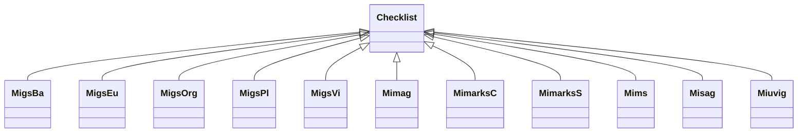

# Class: Checklist


URI: [mixs_6_2_proposal:Checklist](https://turbomam.github.io/mixs-envo-struct-knowl-extraction/Checklist)





## Inheritance
* **Checklist**
    * [MigsBa](MigsBa.md)
    * [MigsEu](MigsEu.md)
    * [MigsOrg](MigsOrg.md)
    * [MigsPl](MigsPl.md)
    * [MigsVi](MigsVi.md)
    * [Mimag](Mimag.md)
    * [MimarksC](MimarksC.md)
    * [MimarksS](MimarksS.md)
    * [Mims](Mims.md)
    * [Misag](Misag.md)
    * [Miuvig](Miuvig.md)


## Slots

| Name | Cardinality and Range | Description | Inheritance |
| ---  | --- | --- | --- |


## Identifier and Mapping Information


### Schema Source


* from schema: https://turbomam.github.io/mixs-envo-struct-knowl-extraction//GSC_MIxS_6


## Mappings

| Mapping Type | Mapped Value |
| ---  | ---  |
| self | mixs_6_2_proposal:Checklist |
| native | mixs_6_2_proposal:Checklist |


## LinkML Source

<!-- TODO: investigate https://stackoverflow.com/questions/37606292/how-to-create-tabbed-code-blocks-in-mkdocs-or-sphinx -->

### Direct

<details>
```yaml
name: Checklist
from_schema: https://turbomam.github.io/mixs-envo-struct-knowl-extraction//GSC_MIxS_6

```
</details>

### Induced

<details>
```yaml
name: Checklist
from_schema: https://turbomam.github.io/mixs-envo-struct-knowl-extraction//GSC_MIxS_6

```
</details>