# Class: EnvironmentalPackage


URI: [mixs_6_2_proposal:EnvironmentalPackage](https://turbomam.github.io/mixs-envo-struct-knowl-extraction/EnvironmentalPackage)

```mermaid
 classDiagram
    class EnvironmentalPackage
      EnvironmentalPackage <|-- Agriculture
      EnvironmentalPackage <|-- Air
      EnvironmentalPackage <|-- BuiltEnvironment
      EnvironmentalPackage <|-- FoodAnimalAndAnimalFeed
      EnvironmentalPackage <|-- FoodFarmEnvironment
      EnvironmentalPackage <|-- FoodFoodProductionFacility
      EnvironmentalPackage <|-- FoodHumanFoods
      EnvironmentalPackage <|-- HostAssociated
      EnvironmentalPackage <|-- HumanAssociated
      EnvironmentalPackage <|-- HumanGut
      EnvironmentalPackage <|-- HumanOral
      EnvironmentalPackage <|-- HumanSkin
      EnvironmentalPackage <|-- HumanVaginal
      EnvironmentalPackage <|-- HydrocarbonResourcesCores
      EnvironmentalPackage <|-- HydrocarbonResourcesFluidsSwabs
      EnvironmentalPackage <|-- MicrobialMatBiofilm
      EnvironmentalPackage <|-- MiscellaneousNaturalOrArtificialEnvironment
      EnvironmentalPackage <|-- PlantAssociated
      EnvironmentalPackage <|-- Sediment
      EnvironmentalPackage <|-- Soil
      EnvironmentalPackage <|-- SymbiontAssociated
      EnvironmentalPackage <|-- WastewaterSludge
      EnvironmentalPackage <|-- Water
      
      
```





## Inheritance
* **EnvironmentalPackage**
    * [Agriculture](Agriculture.md)
    * [Air](Air.md)
    * [BuiltEnvironment](BuiltEnvironment.md)
    * [FoodAnimalAndAnimalFeed](FoodAnimalAndAnimalFeed.md)
    * [FoodFarmEnvironment](FoodFarmEnvironment.md)
    * [FoodFoodProductionFacility](FoodFoodProductionFacility.md)
    * [FoodHumanFoods](FoodHumanFoods.md)
    * [HostAssociated](HostAssociated.md)
    * [HumanAssociated](HumanAssociated.md)
    * [HumanGut](HumanGut.md)
    * [HumanOral](HumanOral.md)
    * [HumanSkin](HumanSkin.md)
    * [HumanVaginal](HumanVaginal.md)
    * [HydrocarbonResourcesCores](HydrocarbonResourcesCores.md)
    * [HydrocarbonResourcesFluidsSwabs](HydrocarbonResourcesFluidsSwabs.md)
    * [MicrobialMatBiofilm](MicrobialMatBiofilm.md)
    * [MiscellaneousNaturalOrArtificialEnvironment](MiscellaneousNaturalOrArtificialEnvironment.md)
    * [PlantAssociated](PlantAssociated.md)
    * [Sediment](Sediment.md)
    * [Soil](Soil.md)
    * [SymbiontAssociated](SymbiontAssociated.md)
    * [WastewaterSludge](WastewaterSludge.md)
    * [Water](Water.md)


## Slots

| Name | Cardinality and Range | Description | Inheritance |
| ---  | --- | --- | --- |


## Identifier and Mapping Information


### Schema Source


* from schema: https://turbomam.github.io/mixs-envo-struct-knowl-extraction//mixs_6_2_proposal


## Mappings

| Mapping Type | Mapped Value |
| ---  | ---  |
| self | mixs_6_2_proposal:EnvironmentalPackage |
| native | mixs_6_2_proposal:EnvironmentalPackage |


## LinkML Source

<!-- TODO: investigate https://stackoverflow.com/questions/37606292/how-to-create-tabbed-code-blocks-in-mkdocs-or-sphinx -->

### Direct

<details>
```yaml
name: EnvironmentalPackage
from_schema: https://turbomam.github.io/mixs-envo-struct-knowl-extraction//mixs_6_2_proposal

```
</details>

### Induced

<details>
```yaml
name: EnvironmentalPackage
from_schema: https://turbomam.github.io/mixs-envo-struct-knowl-extraction//mixs_6_2_proposal

```
</details>