# Class: FoodFarmEnvironment


URI: [mixs_6_2_proposal:FoodFarmEnvironment](https://turbomam.github.io/mixs-envo-struct-knowl-extraction/FoodFarmEnvironment)

```mermaid
 classDiagram
    class FoodFarmEnvironment
      EnvironmentalPackage <|-- FoodFarmEnvironment
      
      FoodFarmEnvironment : adjacent_environment
        
      FoodFarmEnvironment : air_flow_impede
        
      FoodFarmEnvironment : air_PM_concen
        
      FoodFarmEnvironment : ances_data
        
      FoodFarmEnvironment : anim_water_method
        
      FoodFarmEnvironment : animal_diet
        
      FoodFarmEnvironment : animal_feed_equip
        
      FoodFarmEnvironment : animal_group_size
        
      FoodFarmEnvironment : animal_housing
        
      FoodFarmEnvironment : animal_intrusion
        
      FoodFarmEnvironment : biotic_regm
        
      FoodFarmEnvironment : chem_administration
        
      FoodFarmEnvironment : collection_date
        
      FoodFarmEnvironment : conduc
        
      FoodFarmEnvironment : crop_rotation
        
      FoodFarmEnvironment : crop_yield
        
      FoodFarmEnvironment : cult_isol_date
        
      FoodFarmEnvironment : cult_result
        
          FoodFarmEnvironment --|> CULT_RESULT_ENUM : cult_result
        
      FoodFarmEnvironment : cult_result_org
        
      FoodFarmEnvironment : cult_target
        
      FoodFarmEnvironment : date_extr_weath
        
      FoodFarmEnvironment : depth
        
      FoodFarmEnvironment : enrichment_protocol
        
      FoodFarmEnvironment : extr_weather_event
        
          FoodFarmEnvironment --|> EXTR_WEATHER_EVENT_ENUM : extr_weather_event
        
      FoodFarmEnvironment : farm_equip
        
      FoodFarmEnvironment : farm_equip_san
        
      FoodFarmEnvironment : farm_equip_san_freq
        
      FoodFarmEnvironment : farm_equip_shared
        
      FoodFarmEnvironment : farm_water_source
        
          FoodFarmEnvironment --|> FARM_WATER_SOURCE_ENUM : farm_water_source
        
      FoodFarmEnvironment : fertilizer_admin
        
      FoodFarmEnvironment : fertilizer_date
        
      FoodFarmEnvironment : food_clean_proc
        
          FoodFarmEnvironment --|> FOOD_CLEAN_PROC_ENUM : food_clean_proc
        
      FoodFarmEnvironment : food_contact_surf
        
      FoodFarmEnvironment : food_contain_wrap
        
      FoodFarmEnvironment : food_harvest_proc
        
      FoodFarmEnvironment : food_pack_medium
        
      FoodFarmEnvironment : food_preserv_proc
        
      FoodFarmEnvironment : food_prod_char
        
      FoodFarmEnvironment : food_product_type
        
      FoodFarmEnvironment : food_quality_date
        
      FoodFarmEnvironment : food_source
        
      FoodFarmEnvironment : food_trav_mode
        
      FoodFarmEnvironment : food_trav_vehic
        
      FoodFarmEnvironment : food_treat_proc
        
      FoodFarmEnvironment : genetic_mod
        
      FoodFarmEnvironment : geo_loc_name
        
      FoodFarmEnvironment : growth_habit
        
          FoodFarmEnvironment --|> GROWTH_HABIT_ENUM : growth_habit
        
      FoodFarmEnvironment : growth_medium
        
      FoodFarmEnvironment : host_age
        
      FoodFarmEnvironment : host_disease_stat
        
      FoodFarmEnvironment : host_dry_mass
        
      FoodFarmEnvironment : host_genotype
        
      FoodFarmEnvironment : host_height
        
      FoodFarmEnvironment : host_length
        
      FoodFarmEnvironment : host_phenotype
        
      FoodFarmEnvironment : host_subspecf_genlin
        
      FoodFarmEnvironment : host_taxid
        
      FoodFarmEnvironment : host_tot_mass
        
      FoodFarmEnvironment : humidity
        
      FoodFarmEnvironment : IFSAC_category
        
      FoodFarmEnvironment : intended_consumer
        
      FoodFarmEnvironment : lat_lon
        
      FoodFarmEnvironment : library_prep_kit
        
      FoodFarmEnvironment : lot_number
        
      FoodFarmEnvironment : mechanical_damage
        
      FoodFarmEnvironment : misc_param
        
      FoodFarmEnvironment : nucl_acid_ext
        
      FoodFarmEnvironment : organism_count
        
      FoodFarmEnvironment : part_plant_animal
        
      FoodFarmEnvironment : perturbation
        
      FoodFarmEnvironment : ph
        
      FoodFarmEnvironment : ph_meth
        
      FoodFarmEnvironment : plant_growth_med
        
      FoodFarmEnvironment : plant_part_maturity
        
      FoodFarmEnvironment : plant_reprod_crop
        
          FoodFarmEnvironment --|> PLANT_REPROD_CROP_ENUM : plant_reprod_crop
        
      FoodFarmEnvironment : plant_water_method
        
      FoodFarmEnvironment : previous_land_use
        
      FoodFarmEnvironment : prod_label_claims
        
      FoodFarmEnvironment : project_name
        
      FoodFarmEnvironment : rel_location
        
      FoodFarmEnvironment : repository_name
        
      FoodFarmEnvironment : root_cond
        
      FoodFarmEnvironment : root_med_carbon
        
      FoodFarmEnvironment : root_med_macronutr
        
      FoodFarmEnvironment : root_med_micronutr
        
      FoodFarmEnvironment : root_med_ph
        
      FoodFarmEnvironment : salinity
        
      FoodFarmEnvironment : samp_collect_device
        
      FoodFarmEnvironment : samp_name
        
      FoodFarmEnvironment : samp_pooling
        
      FoodFarmEnvironment : samp_purpose
        
      FoodFarmEnvironment : samp_size
        
      FoodFarmEnvironment : samp_source_mat_cat
        
      FoodFarmEnvironment : samp_store_dur
        
      FoodFarmEnvironment : samp_store_temp
        
      FoodFarmEnvironment : samp_type
        
      FoodFarmEnvironment : samp_vol_we_dna_ext
        
      FoodFarmEnvironment : season
        
      FoodFarmEnvironment : season_humidity
        
      FoodFarmEnvironment : season_precpt
        
      FoodFarmEnvironment : season_temp
        
      FoodFarmEnvironment : seq_meth
        
      FoodFarmEnvironment : sequencing_kit
        
      FoodFarmEnvironment : sequencing_location
        
      FoodFarmEnvironment : serovar_or_serotype
        
      FoodFarmEnvironment : size_frac_low
        
      FoodFarmEnvironment : size_frac_up
        
      FoodFarmEnvironment : soil_conductivity
        
      FoodFarmEnvironment : soil_cover
        
      FoodFarmEnvironment : soil_pH
        
      FoodFarmEnvironment : soil_porosity
        
      FoodFarmEnvironment : soil_temp
        
      FoodFarmEnvironment : soil_texture_class
        
          FoodFarmEnvironment --|> SOIL_TEXTURE_CLASS_ENUM : soil_texture_class
        
      FoodFarmEnvironment : soil_texture_meth
        
      FoodFarmEnvironment : soil_type
        
      FoodFarmEnvironment : soil_type_meth
        
      FoodFarmEnvironment : solar_irradiance
        
      FoodFarmEnvironment : spikein_antibiotic
        
      FoodFarmEnvironment : spikein_count
        
      FoodFarmEnvironment : spikein_growth_med
        
      FoodFarmEnvironment : spikein_metal
        
      FoodFarmEnvironment : spikein_org
        
      FoodFarmEnvironment : spikein_serovar
        
      FoodFarmEnvironment : spikein_strain
        
      FoodFarmEnvironment : temp
        
      FoodFarmEnvironment : tillage
        
          FoodFarmEnvironment --|> TILLAGE_ENUM : tillage
        
      FoodFarmEnvironment : timepoint
        
      FoodFarmEnvironment : tot_nitro_cont_meth
        
      FoodFarmEnvironment : tot_nitro_content
        
      FoodFarmEnvironment : tot_org_c_meth
        
      FoodFarmEnvironment : tot_org_carb
        
      FoodFarmEnvironment : turbidity
        
      FoodFarmEnvironment : ventilation_rate
        
      FoodFarmEnvironment : ventilation_type
        
      FoodFarmEnvironment : water_frequency
        
      FoodFarmEnvironment : water_pH
        
      FoodFarmEnvironment : water_source_adjac
        
      FoodFarmEnvironment : water_source_shared
        
      FoodFarmEnvironment : wind_direction
        
      FoodFarmEnvironment : wind_speed
        
      
```





## Inheritance
* [EnvironmentalPackage](EnvironmentalPackage.md)
    * **FoodFarmEnvironment**


## Slots

| Name | Cardinality and Range | Description | Inheritance |
| ---  | --- | --- | --- |
| [samp_name](samp_name.md) | 1..1 <br/> [String](String.md) | A local identifier or name that for the material sample used for extracting n... | direct |
| [project_name](project_name.md) | 1..1 <br/> [String](String.md) | Name of the project within which the sequencing was organized | direct |
| [lat_lon](lat_lon.md) | 1..1 <br/> [String](String.md) | The geographical origin of the sample as defined by latitude and longitude | direct |
| [geo_loc_name](geo_loc_name.md) | 1..1 <br/> [String](String.md) | The geographical origin of the sample as defined by the country or sea name f... | direct |
| [collection_date](collection_date.md) | 1..1 <br/> [Datetime](Datetime.md) | The time of sampling, either as an instance (single point in time) or interva... | direct |
| [seq_meth](seq_meth.md) | 1..1 <br/> [String](String.md) | Sequencing machine used | direct |
| [samp_size](samp_size.md) | 0..1 <br/> [String](String.md) | The total amount or size (volume (ml), mass (g) or area (m2) ) of sample coll... | direct |
| [samp_collect_device](samp_collect_device.md) | 0..1 <br/> [String](String.md) | The device used to collect an environmental sample | direct |
| [nucl_acid_ext](nucl_acid_ext.md) | 0..1 <br/> [String](String.md) | A link to a literature reference, electronic resource or a standard operating... | direct |
| [humidity](humidity.md) | 0..1 <br/> [String](String.md) | Amount of water vapour in the air, at the time of sampling | direct |
| [organism_count](organism_count.md) | 0..1 <br/> [String](String.md) | Total cell count of any organism (or group of organisms) per gram, volume or ... | direct |
| [spikein_count](spikein_count.md) | 0..1 <br/> [String](String.md) | Total cell count of any organism (or group of organisms) per gram, volume or ... | direct |
| [samp_store_temp](samp_store_temp.md) | 0..1 <br/> [String](String.md) | Temperature at which sample was stored, e | direct |
| [solar_irradiance](solar_irradiance.md) | 0..* <br/> [String](String.md) | The amount of solar energy that arrives at a specific area of a surface durin... | direct |
| [ventilation_rate](ventilation_rate.md) | 0..1 <br/> [String](String.md) | Ventilation rate of the system in the sampled premises | direct |
| [samp_store_dur](samp_store_dur.md) | 0..1 <br/> [String](String.md) | Duration for which the sample was stored | direct |
| [wind_speed](wind_speed.md) | 0..1 <br/> [String](String.md) | speed of wind measured at the time of sampling | direct |
| [salinity](salinity.md) | 0..1 <br/> [String](String.md) | The total concentration of all dissolved salts in a liquid or solid sample | direct |
| [samp_vol_we_dna_ext](samp_vol_we_dna_ext.md) | 0..1 <br/> [String](String.md) | Volume (ml) or mass (g) of total collected sample processed for DNA extractio... | direct |
| [previous_land_use](previous_land_use.md) | 0..1 <br/> [String](String.md) | Previous land use and dates | direct |
| [crop_rotation](crop_rotation.md) | 0..1 <br/> [String](String.md) | Whether or not crop is rotated, and if yes, rotation schedule | direct |
| [soil_type_meth](soil_type_meth.md) | 0..1 <br/> [String](String.md) | Reference or method used in determining soil series name or other lower-level... | direct |
| [tot_org_c_meth](tot_org_c_meth.md) | 0..1 <br/> [String](String.md) | Reference or method used in determining total organic carbon | direct |
| [tot_nitro_cont_meth](tot_nitro_cont_meth.md) | 0..1 <br/> [String](String.md) | Reference or method used in determining the total nitrogen | direct |
| [host_age](host_age.md) | 0..1 <br/> [String](String.md) | Age of host at the time of sampling; relevant scale depends on species and st... | direct |
| [host_dry_mass](host_dry_mass.md) | 0..1 <br/> [String](String.md) | Measurement of dry mass | direct |
| [host_height](host_height.md) | 0..1 <br/> [String](String.md) | The height of subject | direct |
| [host_length](host_length.md) | 0..1 <br/> [String](String.md) | The length of subject | direct |
| [host_tot_mass](host_tot_mass.md) | 0..1 <br/> [String](String.md) | Total mass of the host at collection, the unit depends on host | direct |
| [root_med_carbon](root_med_carbon.md) | 0..1 <br/> [String](String.md) | Source of organic carbon in the culture rooting medium; e | direct |
| [root_med_macronutr](root_med_macronutr.md) | 0..1 <br/> [String](String.md) | Measurement of the culture rooting medium macronutrients (N,P, K, Ca, Mg, S);... | direct |
| [root_med_micronutr](root_med_micronutr.md) | 0..1 <br/> [String](String.md) | Measurement of the culture rooting medium micronutrients (Fe, Mn, Zn, B, Cu, ... | direct |
| [depth](depth.md) | 1..1 <br/> [String](String.md) | The vertical distance below local surface | direct |
| [season_temp](season_temp.md) | 0..1 <br/> [String](String.md) | Mean seasonal temperature | direct |
| [season_precpt](season_precpt.md) | 0..* <br/> [String](String.md) | The average of all seasonal precipitation values known, or an estimated equiv... | direct |
| [tot_org_carb](tot_org_carb.md) | 0..1 <br/> [String](String.md) | Definition for soil: total organic carbon content of the soil, definition oth... | direct |
| [tot_nitro_content](tot_nitro_content.md) | 0..* <br/> [String](String.md) | Total nitrogen content of the sample | direct |
| [conduc](conduc.md) | 0..1 <br/> [String](String.md) | Electrical conductivity of water | direct |
| [turbidity](turbidity.md) | 0..1 <br/> [String](String.md) | Measure of the amount of cloudiness or haziness in water caused by individual... | direct |
| [size_frac_low](size_frac_low.md) | 0..1 <br/> [String](String.md) | Refers to the mesh/pore size used to pre-filter/pre-sort the sample | direct |
| [size_frac_up](size_frac_up.md) | 0..1 <br/> [String](String.md) | Refers to the mesh/pore size used to retain the sample | direct |
| [temp](temp.md) | 0..1 <br/> [String](String.md) | Temperature of the sample at the time of sampling | direct |
| [ventilation_type](ventilation_type.md) | 0..* <br/> [String](String.md) | Ventilation system used in the sampled premises | direct |
| [wind_direction](wind_direction.md) | 0..1 <br/> [String](String.md) | Wind direction is the direction from which a wind originates | direct |
| [genetic_mod](genetic_mod.md) | 0..* <br/> [String](String.md) | Genetic modifications of the genome of an organism, which may occur naturally... | direct |
| [host_phenotype](host_phenotype.md) | 0..1 <br/> [String](String.md) | Phenotype of human or other host | direct |
| [ph](ph.md) | 0..1 <br/> [Float](Float.md) | pH measurement of the sample, or liquid portion of sample, or aqueous phase o... | direct |
| [ances_data](ances_data.md) | 0..1 <br/> [String](String.md) | Information about either pedigree or other ancestral information description ... | direct |
| [biotic_regm](biotic_regm.md) | 1..* <br/> [String](String.md) | Information about treatment(s) involving use of biotic factors, such as bacte... | direct |
| [chem_administration](chem_administration.md) | 1..* <br/> [String](String.md) | List of chemical compounds administered to the host or site where sampling oc... | direct |
| [growth_habit](growth_habit.md) | 0..1 <br/> [GROWTHHABITENUM](GROWTHHABITENUM.md) | Characteristic shape, appearance or growth form of a plant species | direct |
| [host_disease_stat](host_disease_stat.md) | 0..1 _recommended_ <br/> [String](String.md) | List of diseases with which the host has been diagnosed; can include multiple... | direct |
| [host_genotype](host_genotype.md) | 0..1 <br/> [String](String.md) | Observed genotype | direct |
| [host_taxid](host_taxid.md) | 0..1 <br/> [String](String.md) | NCBI taxon id of the host, e | direct |
| [mechanical_damage](mechanical_damage.md) | 0..* <br/> [String](String.md) | Information about any mechanical damage exerted on the plant; can include mul... | direct |
| [perturbation](perturbation.md) | 0..* <br/> [String](String.md) | Type of perturbation, e | direct |
| [root_cond](root_cond.md) | 0..1 <br/> [String](String.md) | Relevant rooting conditions such as field plot size, sowing density, containe... | direct |
| [root_med_ph](root_med_ph.md) | 0..1 <br/> [Float](Float.md) | pH measurement of the culture rooting medium; e | direct |
| [tillage](tillage.md) | 0..1 <br/> [TILLAGEENUM](TILLAGEENUM.md) | Note method(s) used for tilling | direct |
| [ph_meth](ph_meth.md) | 0..1 <br/> [String](String.md) | Reference or method used in determining pH | direct |
| [growth_medium](growth_medium.md) | 0..1 <br/> [String](String.md) | A liquid or gel containing nutrients, salts, and other factors formulated to ... | direct |
| [season](season.md) | 0..1 <br/> [String](String.md) | The season when sampling occurred | direct |
| [food_product_type](food_product_type.md) | 1..1 <br/> [String](String.md) | A food product type is a class of food products that is differentiated by its... | direct |
| [samp_type](samp_type.md) | 1..1 <br/> [String](String.md) | The type of material from which the sample was obtained | direct |
| [farm_water_source](farm_water_source.md) | 0..1 _recommended_ <br/> [FARMWATERSOURCEENUM](FARMWATERSOURCEENUM.md) | Source of water used on the farm for irrigation of crops or watering of lives... | direct |
| [plant_water_method](plant_water_method.md) | 0..1 _recommended_ <br/> [String](String.md) | Description of the equipment or method used to distribute water to crops | direct |
| [air_PM_concen](air_PM_concen.md) | 0..* <br/> [String](String.md) | Concentration of substances that remain suspended in the air, and comprise mi... | direct |
| [animal_feed_equip](animal_feed_equip.md) | 0..* <br/> [String](String.md) | Description of the feeding equipment used for livestock | direct |
| [animal_intrusion](animal_intrusion.md) | 0..* <br/> [String](String.md) | Identification of animals intruding on the sample or sample site including in... | direct |
| [anim_water_method](anim_water_method.md) | 0..* <br/> [String](String.md) | Description of the equipment or method used to distribute water to livestock | direct |
| [crop_yield](crop_yield.md) | 0..1 <br/> [String](String.md) | Amount of crop produced per unit or area of land | direct |
| [cult_result](cult_result.md) | 0..1 <br/> [CULTRESULTENUM](CULTRESULTENUM.md) | Any result of a bacterial culture experiment reported as a binary assessment ... | direct |
| [cult_result_org](cult_result_org.md) | 0..* <br/> [String](String.md) | Taxonomic information about the cultured organism(s) | direct |
| [cult_target](cult_target.md) | 0..* <br/> [String](String.md) | The target microbial analyte in terms of investigation scope | direct |
| [plant_part_maturity](plant_part_maturity.md) | 0..1 <br/> [String](String.md) | A description of the stage of development of a plant or plant part based on m... | direct |
| [adjacent_environment](adjacent_environment.md) | 0..* <br/> [String](String.md) | Description of the environmental system or features that are adjacent to the ... | direct |
| [water_source_adjac](water_source_adjac.md) | 0..* <br/> [String](String.md) | Description of the environmental features that are adjacent to the farm water... | direct |
| [farm_equip_shared](farm_equip_shared.md) | 0..* <br/> [String](String.md) | List of planting, growing or harvesting equipment shared with other farms | direct |
| [farm_equip_san](farm_equip_san.md) | 0..* <br/> [String](String.md) | Method used to sanitize growing and harvesting equipment | direct |
| [farm_equip_san_freq](farm_equip_san_freq.md) | 0..1 <br/> [String](String.md) | The number of times farm equipment is cleaned | direct |
| [farm_equip](farm_equip.md) | 0..* <br/> [String](String.md) | List of equipment used for planting, fertilization, harvesting, irrigation, l... | direct |
| [fertilizer_admin](fertilizer_admin.md) | 0..1 <br/> [String](String.md) | Type of fertilizer or amendment added to the soil or water for the purpose of... | direct |
| [fertilizer_date](fertilizer_date.md) | 0..1 <br/> [Datetime](Datetime.md) | Date of administration of soil amendment or fertilizer | direct |
| [animal_group_size](animal_group_size.md) | 0..1 <br/> [Integer](Integer.md) | The number of food animals of the same species that are maintained together a... | direct |
| [animal_diet](animal_diet.md) | 0..* <br/> [String](String.md) | If the isolate is from a food animal, the type of diet eaten by the food anim... | direct |
| [food_contact_surf](food_contact_surf.md) | 0..* <br/> [String](String.md) | The specific container or coating materials in direct contact with the food | direct |
| [food_contain_wrap](food_contain_wrap.md) | 0..1 <br/> [String](String.md) | Type of container or wrapping defined by the main container material, the con... | direct |
| [food_harvest_proc](food_harvest_proc.md) | 0..* <br/> [String](String.md) | A harvesting process is a process which takes in some food material from an i... | direct |
| [food_pack_medium](food_pack_medium.md) | 0..* <br/> [String](String.md) | The medium in which the food is packed for preservation and handling or the m... | direct |
| [food_preserv_proc](food_preserv_proc.md) | 0..* <br/> [String](String.md) | The methods contributing to the prevention or retardation of microbial, enzym... | direct |
| [food_prod_char](food_prod_char.md) | 0..* <br/> [String](String.md) | Descriptors of the food production system such as wild caught, free-range, or... | direct |
| [prod_label_claims](prod_label_claims.md) | 0..* <br/> [String](String.md) | Labeling claims containing descriptors such as wild caught, free-range, organ... | direct |
| [food_trav_mode](food_trav_mode.md) | 0..* <br/> [String](String.md) | A descriptor for the method of movement of food commodity along the food dist... | direct |
| [food_trav_vehic](food_trav_vehic.md) | 0..* <br/> [String](String.md) | A descriptor for the mobile machine which is used to transport food commoditi... | direct |
| [food_source](food_source.md) | 0..1 <br/> [String](String.md) | Type of plant or animal from which the food product or its major ingredient i... | direct |
| [food_treat_proc](food_treat_proc.md) | 0..* <br/> [String](String.md) | Used to specifically characterize a food product based on the treatment or pr... | direct |
| [extr_weather_event](extr_weather_event.md) | 0..* <br/> [EXTRWEATHEREVENTENUM](EXTRWEATHEREVENTENUM.md) | Unusual weather events that may have affected microbial populations | direct |
| [date_extr_weath](date_extr_weath.md) | 0..* <br/> [Datetime](Datetime.md) | Date of unusual weather events that may have affected microbial populations | direct |
| [host_subspecf_genlin](host_subspecf_genlin.md) | 0..* <br/> [String](String.md) | Information about the genetic distinctness of the host organism below the sub... | direct |
| [intended_consumer](intended_consumer.md) | 0..* <br/> [String](String.md) | Food consumer type, human or animal, for which the food product is produced a... | direct |
| [library_prep_kit](library_prep_kit.md) | 0..1 <br/> [String](String.md) | Packaged kits (containing adapters, indexes, enzymes, buffers etc | direct |
| [air_flow_impede](air_flow_impede.md) | 0..* <br/> [String](String.md) | Presence of objects in the area that would influence or impede air flow throu... | direct |
| [lot_number](lot_number.md) | 0..* <br/> [String](String.md) | A distinctive alpha-numeric identification code assigned by the manufacturer ... | direct |
| [season_humidity](season_humidity.md) | 0..1 <br/> [Float](Float.md) | Average humidity of the region throughout the growing season | direct |
| [part_plant_animal](part_plant_animal.md) | 0..* <br/> [String](String.md) | The anatomical part of the organism being involved in food production or cons... | direct |
| [plant_growth_med](plant_growth_med.md) | 0..* <br/> [String](String.md) | Specification of the media for growing the plants or tissue cultured samples,... | direct |
| [plant_reprod_crop](plant_reprod_crop.md) | 0..* <br/> [PLANTREPRODCROPENUM](PLANTREPRODCROPENUM.md) | Plant reproductive part used in the field during planting to start the crop | direct |
| [samp_purpose](samp_purpose.md) | 0..1 <br/> [String](String.md) | The reason that the sample was collected | direct |
| [repository_name](repository_name.md) | 0..* <br/> [String](String.md) | The name of the institution where the sample or DNA extract is held or "sampl... | direct |
| [samp_pooling](samp_pooling.md) | 0..* <br/> [String](String.md) | Physical combination of several instances of like material, e | direct |
| [samp_source_mat_cat](samp_source_mat_cat.md) | 0..1 <br/> [String](String.md) | This is the scientific role or category that the subject organism or material... | direct |
| [sequencing_kit](sequencing_kit.md) | 0..1 <br/> [String](String.md) | Pre-filled, ready-to-use reagent cartridges | direct |
| [sequencing_location](sequencing_location.md) | 0..1 <br/> [String](String.md) | The location the sequencing run was performed | direct |
| [serovar_or_serotype](serovar_or_serotype.md) | 0..* <br/> [String](String.md) | A characterization of a cell or microorganism based on the antigenic properti... | direct |
| [soil_conductivity](soil_conductivity.md) | 0..1 <br/> [String](String.md) | Conductivity of soil at time of sampling | direct |
| [soil_cover](soil_cover.md) | 0..1 <br/> [String](String.md) | Material covering the sampled soil | direct |
| [soil_pH](soil_pH.md) | 0..1 <br/> [Float](Float.md) | The pH of soil at time of sampling | direct |
| [rel_location](rel_location.md) | 0..1 <br/> [String](String.md) | Location of sampled soil to other parts of the farm e | direct |
| [soil_porosity](soil_porosity.md) | 0..1 <br/> [String](String.md) | Porosity of soil or deposited sediment is volume of voids divided by the tota... | direct |
| [soil_temp](soil_temp.md) | 0..* <br/> [String](String.md) | Temperature of soil at the time of sampling | direct |
| [soil_texture_class](soil_texture_class.md) | 0..1 <br/> [SOILTEXTURECLASSENUM](SOILTEXTURECLASSENUM.md) | One of the 12 soil texture classes use to describe soil texture based on the ... | direct |
| [soil_texture_meth](soil_texture_meth.md) | 0..1 <br/> [String](String.md) | Reference or method used in determining soil texture classification | direct |
| [soil_type](soil_type.md) | 0..* <br/> [String](String.md) | Description of the soil type or classification | direct |
| [spikein_org](spikein_org.md) | 0..* <br/> [String](String.md) | Taxonomic information about the spike-in organism(s) | direct |
| [spikein_serovar](spikein_serovar.md) | 0..* <br/> [String](String.md) | Taxonomic information about the spike-in organism(s) at the serovar or seroty... | direct |
| [spikein_growth_med](spikein_growth_med.md) | 0..* <br/> [String](String.md) | A liquid or gel containing nutrients, salts, and other factors formulated to ... | direct |
| [spikein_strain](spikein_strain.md) | 0..* <br/> [String](String.md) | Taxonomic information about the spike-in organism(s) at the strain level | direct |
| [spikein_antibiotic](spikein_antibiotic.md) | 0..* <br/> [String](String.md) | Antimicrobials used in research study to assess effects of exposure on microb... | direct |
| [spikein_metal](spikein_metal.md) | 0..* <br/> [String](String.md) | Heavy metals used in research study to assess effects of exposure on microbio... | direct |
| [timepoint](timepoint.md) | 0..1 <br/> [String](String.md) | Time point at which a sample or observation is made or taken from a biomateri... | direct |
| [water_frequency](water_frequency.md) | 0..1 <br/> [String](String.md) | Number of water delivery events within a given period of time | direct |
| [water_pH](water_pH.md) | 0..1 <br/> [Float](Float.md) | pH measurement of the sample, or liquid portion of sample, or aqueous phase o... | direct |
| [water_source_shared](water_source_shared.md) | 0..* <br/> [String](String.md) | Other users sharing access to the same water source | direct |
| [enrichment_protocol](enrichment_protocol.md) | 0..1 <br/> [String](String.md) | The microbiological workflow or protocol followed to test for the presence or... | direct |
| [food_quality_date](food_quality_date.md) | 0..1 <br/> [String](String.md) | The date recommended for the use of the product while at peak quality, this d... | direct |
| [IFSAC_category](IFSAC_category.md) | 1..* <br/> [String](String.md) | The IFSAC food categorization scheme has five distinct levels to which foods ... | direct |
| [animal_housing](animal_housing.md) | 0..* <br/> [String](String.md) | Description of the housing system of the livestock | direct |
| [cult_isol_date](cult_isol_date.md) | 0..1 <br/> [String](String.md) | The datetime marking the end of a process in which a sample yields a positive... | direct |
| [food_clean_proc](food_clean_proc.md) | 0..1 <br/> [FOODCLEANPROCENUM](FOODCLEANPROCENUM.md) | The process of cleaning food to separate other environmental materials from t... | direct |
| [misc_param](misc_param.md) | 0..* <br/> [String](String.md) | Any other measurement performed or parameter collected, that is not listed he... | direct |


## Identifier and Mapping Information


### Schema Source


* from schema: https://turbomam.github.io/mixs-envo-struct-knowl-extraction//GSC_MIxS_6


## Mappings

| Mapping Type | Mapped Value |
| ---  | ---  |
| self | mixs_6_2_proposal:FoodFarmEnvironment |
| native | mixs_6_2_proposal:FoodFarmEnvironment |


## LinkML Source

<!-- TODO: investigate https://stackoverflow.com/questions/37606292/how-to-create-tabbed-code-blocks-in-mkdocs-or-sphinx -->

### Direct

<details>
```yaml
name: FoodFarmEnvironment
title: FoodFarmEnvironment
from_schema: https://turbomam.github.io/mixs-envo-struct-knowl-extraction//GSC_MIxS_6
is_a: EnvironmentalPackage
mixin: false
slots:
- samp_name
- project_name
- lat_lon
- geo_loc_name
- collection_date
- seq_meth
- samp_size
- samp_collect_device
- nucl_acid_ext
- humidity
- organism_count
- spikein_count
- samp_store_temp
- solar_irradiance
- ventilation_rate
- samp_store_dur
- wind_speed
- salinity
- samp_vol_we_dna_ext
- previous_land_use
- crop_rotation
- soil_type_meth
- tot_org_c_meth
- tot_nitro_cont_meth
- host_age
- host_dry_mass
- host_height
- host_length
- host_tot_mass
- root_med_carbon
- root_med_macronutr
- root_med_micronutr
- depth
- season_temp
- season_precpt
- tot_org_carb
- tot_nitro_content
- conduc
- turbidity
- size_frac_low
- size_frac_up
- temp
- ventilation_type
- wind_direction
- genetic_mod
- host_phenotype
- ph
- ances_data
- biotic_regm
- chem_administration
- growth_habit
- host_disease_stat
- host_genotype
- host_taxid
- mechanical_damage
- perturbation
- root_cond
- root_med_ph
- tillage
- ph_meth
- growth_medium
- season
- food_product_type
- samp_type
- farm_water_source
- plant_water_method
- air_PM_concen
- animal_feed_equip
- animal_intrusion
- anim_water_method
- crop_yield
- cult_result
- cult_result_org
- cult_target
- plant_part_maturity
- adjacent_environment
- water_source_adjac
- farm_equip_shared
- farm_equip_san
- farm_equip_san_freq
- farm_equip
- fertilizer_admin
- fertilizer_date
- animal_group_size
- animal_diet
- food_contact_surf
- food_contain_wrap
- food_harvest_proc
- food_pack_medium
- food_preserv_proc
- food_prod_char
- prod_label_claims
- food_trav_mode
- food_trav_vehic
- food_source
- food_treat_proc
- extr_weather_event
- date_extr_weath
- host_subspecf_genlin
- intended_consumer
- library_prep_kit
- air_flow_impede
- lot_number
- season_humidity
- part_plant_animal
- plant_growth_med
- plant_reprod_crop
- samp_purpose
- repository_name
- samp_pooling
- samp_source_mat_cat
- sequencing_kit
- sequencing_location
- serovar_or_serotype
- soil_conductivity
- soil_cover
- soil_pH
- rel_location
- soil_porosity
- soil_temp
- soil_texture_class
- soil_texture_meth
- soil_type
- spikein_org
- spikein_serovar
- spikein_growth_med
- spikein_strain
- spikein_antibiotic
- spikein_metal
- timepoint
- water_frequency
- water_pH
- water_source_shared
- enrichment_protocol
- food_quality_date
- IFSAC_category
- animal_housing
- cult_isol_date
- food_clean_proc
- misc_param
slot_usage:
  air_PM_concen:
    name: air_PM_concen
    domain_of:
    - Air
    - FoodFarmEnvironment
  ances_data:
    name: ances_data
    domain_of:
    - Agriculture
    - FoodFarmEnvironment
    - HostAssociated
    - PlantAssociated
  animal_diet:
    name: animal_diet
    examples:
    - value: Hay [FOODON_03301763]
    domain_of:
    - FoodAnimalAndAnimalFeed
    - FoodFarmEnvironment
  animal_feed_equip:
    name: animal_feed_equip
    string_serialization: '{termLabel}{[termID]}'
    domain_of:
    - FoodAnimalAndAnimalFeed
    - FoodFarmEnvironment
  biotic_regm:
    name: biotic_regm
    multivalued: true
    domain_of:
    - FoodFarmEnvironment
    - PlantAssociated
    required: true
  chem_administration:
    name: chem_administration
    domain_of:
    - Agriculture
    - Air
    - FoodFarmEnvironment
    - HostAssociated
    - HumanAssociated
    - HumanGut
    - HumanOral
    - HumanSkin
    - HumanVaginal
    - MicrobialMatBiofilm
    - MiscellaneousNaturalOrArtificialEnvironment
    - PlantAssociated
    - Sediment
    - SymbiontAssociated
    - WastewaterSludge
    - Water
    required: true
  crop_rotation:
    name: crop_rotation
    string_serialization: '{boolean};{Rn/start_time/end_time/duration}'
    domain_of:
    - Agriculture
    - FoodFarmEnvironment
    - Soil
    required: false
    recommended: false
  cult_isol_date:
    name: cult_isol_date
    examples:
    - value: '2018-05-11T10:00:00+01:00'
    string_serialization: '{timestamp}'
    domain_of:
    - Agriculture
    - FoodAnimalAndAnimalFeed
    - FoodFarmEnvironment
    - FoodFoodProductionFacility
    - FoodHumanFoods
  cult_result_org:
    name: cult_result_org
    string_serialization: '{TermLabel} [{termID}]|{integer}'
    domain_of:
    - FoodAnimalAndAnimalFeed
    - FoodFarmEnvironment
    - FoodFoodProductionFacility
    - FoodHumanFoods
  cult_target:
    name: cult_target
    string_serialization: '{TermLabel} [{termID}]|{integer}'
    domain_of:
    - FoodAnimalAndAnimalFeed
    - FoodFarmEnvironment
    - FoodFoodProductionFacility
    - FoodHumanFoods
  depth:
    name: depth
    title: depth
    examples:
    - value: 10 meter
    domain_of:
    - Agriculture
    - FoodFarmEnvironment
    - HostAssociated
    - MicrobialMatBiofilm
    - MigsBa
    - MigsEu
    - MigsOrg
    - MigsPl
    - MigsVi
    - Mimag
    - MimarksC
    - MimarksS
    - Mims
    - Misag
    - MiscellaneousNaturalOrArtificialEnvironment
    - Miuvig
    - PlantAssociated
    - Sediment
    - Soil
    - SymbiontAssociated
    - WastewaterSludge
    - Water
    required: true
  enrichment_protocol:
    name: enrichment_protocol
    domain_of:
    - Agriculture
    - FoodAnimalAndAnimalFeed
    - FoodFarmEnvironment
    - FoodFoodProductionFacility
    - FoodHumanFoods
    required: false
    recommended: false
  farm_equip:
    name: farm_equip
    description: List of equipment used for planting, fertilization, harvesting, irrigation,
      land levelling, residue management, weeding or transplanting during the growing
      season.  This field accepts terms listed under agricultural implement (http://purl.obolibrary.org/obo/AGRO_00000416).
      Multiple terms can be separated by pipes.
    domain_of:
    - Agriculture
    - FoodFarmEnvironment
  farm_equip_san:
    name: farm_equip_san
    description: Method used to sanitize growing and harvesting equipment. This can
      including type and concentration of sanitizing solution.  Multiple terms can
      be separated by one or more pipes.
    domain_of:
    - Agriculture
    - FoodFarmEnvironment
  farm_equip_shared:
    name: farm_equip_shared
    description: List of planting, growing or harvesting equipment shared with other
      farms. This field accepts terms listed under agricultural implement (http://purl.obolibrary.org/obo/AGRO_00000416).
      Multiple terms can be separated by pipes.
    domain_of:
    - Agriculture
    - FoodFarmEnvironment
  food_contact_surf:
    name: food_contact_surf
    domain_of:
    - FoodAnimalAndAnimalFeed
    - FoodFarmEnvironment
    - FoodFoodProductionFacility
    - FoodHumanFoods
    required: false
    recommended: false
  food_pack_medium:
    name: food_pack_medium
    examples:
    - value: vacuum-packed [FOODON:03480027]
    domain_of:
    - FoodAnimalAndAnimalFeed
    - FoodFarmEnvironment
    - FoodFoodProductionFacility
    - FoodHumanFoods
  food_product_type:
    name: food_product_type
    examples:
    - value: shrimp (peeled, deep-frozen) [FOODON:03317171]
    domain_of:
    - Agriculture
    - FoodAnimalAndAnimalFeed
    - FoodFarmEnvironment
    - FoodFoodProductionFacility
    - FoodHumanFoods
    required: true
  food_source:
    name: food_source
    examples:
    - value: giant tiger prawn [FOODON:03412612]
    string_serialization: '{termLabel} [{termID}]'
    domain_of:
    - Agriculture
    - FoodAnimalAndAnimalFeed
    - FoodFarmEnvironment
    - FoodFoodProductionFacility
    - FoodHumanFoods
    required: false
    recommended: false
  food_trav_mode:
    name: food_trav_mode
    description: A descriptor for the method of movement of food commodity along the
      food distribution system.  This field accepts terms listed under travel mode
      (http://purl.obolibrary.org/obo/GENEPIO_0001064). If the proper descrptor is
      not listed please use text to describe the mode of travel. Multiple terms can
      be separated by one or more pipes.
    domain_of:
    - Agriculture
    - FoodAnimalAndAnimalFeed
    - FoodFarmEnvironment
    - FoodFoodProductionFacility
    - FoodHumanFoods
  genetic_mod:
    name: genetic_mod
    string_serialization: '{PMID}|{DOI}|{URL}'
    multivalued: true
    domain_of:
    - Agriculture
    - FoodFarmEnvironment
    - FoodFoodProductionFacility
    - FoodHumanFoods
    - HostAssociated
    - PlantAssociated
  geo_loc_name:
    name: geo_loc_name
    description: The geographical origin of the sample as defined by the country or
      sea name followed by specific region name. Country or sea names should be chosen
      from the INSDC country list (http://insdc.org/country.html), or the GAZ ontology  (http://purl.bioontology.org/ontology/GAZ).
    domain_of:
    - FoodAnimalAndAnimalFeed
    - FoodFarmEnvironment
    - FoodFoodProductionFacility
    - FoodHumanFoods
    - MigsBa
    - MigsEu
    - MigsOrg
    - MigsPl
    - MigsVi
    - Mimag
    - MimarksC
    - MimarksS
    - Mims
    - Misag
    - Miuvig
    - SymbiontAssociated
  host_age:
    name: host_age
    examples:
    - value: 10 days
    domain_of:
    - Agriculture
    - FoodFarmEnvironment
    - HostAssociated
    - HumanAssociated
    - HumanGut
    - HumanOral
    - HumanSkin
    - HumanVaginal
    - PlantAssociated
    - SymbiontAssociated
    required: false
    recommended: false
  host_disease_stat:
    name: host_disease_stat
    description: List of diseases with which the host has been diagnosed; can include
      multiple diagnoses. The value of the field depends on host; for humans the terms
      should be chosen from the DO (Human Disease Ontology) at https://www.disease-ontology.org,
      non-human host diseases are free text.
    examples:
    - value: downy mildew
    string_serialization: '{text}|{termLabel} [{termID}]'
    multivalued: false
    domain_of:
    - Agriculture
    - FoodFarmEnvironment
    - HostAssociated
    - HumanAssociated
    - HumanGut
    - HumanOral
    - HumanSkin
    - HumanVaginal
    - MigsBa
    - MigsEu
    - MigsVi
    - Miuvig
    - PlantAssociated
    recommended: true
  host_dry_mass:
    name: host_dry_mass
    domain_of:
    - Agriculture
    - FoodFarmEnvironment
    - HostAssociated
    - PlantAssociated
    - SymbiontAssociated
  host_genotype:
    name: host_genotype
    examples:
    - value: Ts
    domain_of:
    - Agriculture
    - FoodFarmEnvironment
    - HostAssociated
    - HumanAssociated
    - HumanGut
    - HumanOral
    - HumanSkin
    - HumanVaginal
    - PlantAssociated
    - SymbiontAssociated
    required: false
    recommended: false
  host_height:
    name: host_height
    examples:
    - value: 1 meter
    domain_of:
    - Agriculture
    - FoodFarmEnvironment
    - HostAssociated
    - HumanAssociated
    - HumanGut
    - HumanOral
    - HumanSkin
    - HumanVaginal
    - PlantAssociated
    - SymbiontAssociated
    required: false
    recommended: false
  host_length:
    name: host_length
    domain_of:
    - Agriculture
    - FoodFarmEnvironment
    - HostAssociated
    - PlantAssociated
    - SymbiontAssociated
    required: false
    recommended: false
  host_phenotype:
    name: host_phenotype
    examples:
    - value: seed pod; green [PATO:0000320]
    string_serialization: '{text};{termLabel} [{termID}]'
    domain_of:
    - Agriculture
    - FoodFarmEnvironment
    - HostAssociated
    - HumanAssociated
    - HumanGut
    - HumanOral
    - HumanSkin
    - HumanVaginal
    - PlantAssociated
    - SymbiontAssociated
    required: false
    recommended: false
  host_taxid:
    name: host_taxid
    description: NCBI taxon id of the host, e.g. 9606.
    examples:
    - value: '4530'
    string_serialization: '{NCBI taxid}'
    domain_of:
    - Agriculture
    - FoodFarmEnvironment
    - HostAssociated
    - PlantAssociated
    - SymbiontAssociated
    required: false
    recommended: false
  host_tot_mass:
    name: host_tot_mass
    examples:
    - value: 2500 gram
    domain_of:
    - Agriculture
    - FoodFarmEnvironment
    - HostAssociated
    - HumanAssociated
    - HumanGut
    - HumanOral
    - HumanSkin
    - HumanVaginal
    - PlantAssociated
    - SymbiontAssociated
    required: false
    recommended: false
  humidity:
    name: humidity
    examples:
    - value: 30% relative humidity
    domain_of:
    - Agriculture
    - Air
    - FoodFarmEnvironment
    required: false
    recommended: false
  intended_consumer:
    name: intended_consumer
    domain_of:
    - FoodAnimalAndAnimalFeed
    - FoodFarmEnvironment
    - FoodFoodProductionFacility
    - FoodHumanFoods
    required: false
    recommended: false
  lat_lon:
    name: lat_lon
    domain_of:
    - FoodAnimalAndAnimalFeed
    - FoodFarmEnvironment
    - FoodFoodProductionFacility
    - FoodHumanFoods
    - MigsBa
    - MigsEu
    - MigsOrg
    - MigsPl
    - MigsVi
    - Mimag
    - MimarksC
    - MimarksS
    - Mims
    - Misag
    - Miuvig
    - SymbiontAssociated
  library_prep_kit:
    name: library_prep_kit
    description: Packaged kits (containing adapters, indexes, enzymes, buffers etc.),
      tailored for specific sequencing workflows, which allow the simplified preparation
      of sequencing-ready libraries for small genomes, amplicons, and plasmids.
    examples:
    - value: Illumina DNA Prep
    domain_of:
    - Agriculture
    - FoodAnimalAndAnimalFeed
    - FoodFarmEnvironment
    - FoodFoodProductionFacility
    - FoodHumanFoods
  lot_number:
    name: lot_number
    description: 'A distinctive alpha-numeric identification code assigned by the
      manufacturer or distributor to a specific quantity of manufactured material
      or product within a batch. Synonym: Batch Number.  The submitter should provide
      lot number of the item followed by the item name for which the lot number was
      provided.'
    domain_of:
    - Agriculture
    - FoodAnimalAndAnimalFeed
    - FoodFarmEnvironment
    - FoodFoodProductionFacility
    - FoodHumanFoods
  misc_param:
    name: misc_param
    domain_of:
    - Agriculture
    - Air
    - FoodAnimalAndAnimalFeed
    - FoodFarmEnvironment
    - FoodFoodProductionFacility
    - FoodHumanFoods
    - HostAssociated
    - HumanAssociated
    - HumanGut
    - HumanOral
    - HumanSkin
    - HumanVaginal
    - HydrocarbonResourcesCores
    - HydrocarbonResourcesFluidsSwabs
    - MicrobialMatBiofilm
    - MiscellaneousNaturalOrArtificialEnvironment
    - PlantAssociated
    - Sediment
    - Soil
    - SymbiontAssociated
    - WastewaterSludge
    - Water
  nucl_acid_ext:
    name: nucl_acid_ext
    string_serialization: '{PMID}|{DOI}|{URL}'
    domain_of:
    - Agriculture
    - FoodAnimalAndAnimalFeed
    - FoodFarmEnvironment
    - FoodFoodProductionFacility
    - FoodHumanFoods
    - MigsBa
    - MigsEu
    - MigsOrg
    - MigsPl
    - MigsVi
    - Mimag
    - MimarksC
    - MimarksS
    - Mims
    - Misag
    - Miuvig
    required: false
    recommended: false
  organism_count:
    name: organism_count
    description: 'Total cell count of any organism (or group of organisms) per gram,
      volume or area of sample, should include name of organism followed by count.
      The method that was used for the enumeration (e.g. qPCR, atp, mpn, etc.) should
      also be provided. (example: total prokaryotes; 3.5e7 cells per ml; qPCR).'
    examples:
    - value: total prokaryotes;3.5e7 colony forming units per milliliter;qPCR
    string_serialization: '{text};{float} {unit};[ATP|MPN|qPCR|other]'
    multivalued: false
    domain_of:
    - Agriculture
    - Air
    - BuiltEnvironment
    - FoodAnimalAndAnimalFeed
    - FoodFarmEnvironment
    - FoodFoodProductionFacility
    - FoodHumanFoods
    - HostAssociated
    - HumanAssociated
    - HumanGut
    - HumanOral
    - HumanSkin
    - HumanVaginal
    - HydrocarbonResourcesCores
    - HydrocarbonResourcesFluidsSwabs
    - MicrobialMatBiofilm
    - MiscellaneousNaturalOrArtificialEnvironment
    - PlantAssociated
    - Sediment
    - SymbiontAssociated
    - WastewaterSludge
    - Water
    required: false
    recommended: false
  perturbation:
    name: perturbation
    string_serialization: '{text};{Rn/start_time/end_time/duration}'
    domain_of:
    - Agriculture
    - Air
    - FoodAnimalAndAnimalFeed
    - FoodFarmEnvironment
    - FoodHumanFoods
    - HostAssociated
    - HumanAssociated
    - HumanGut
    - HumanOral
    - HumanSkin
    - HumanVaginal
    - MicrobialMatBiofilm
    - MiscellaneousNaturalOrArtificialEnvironment
    - PlantAssociated
    - Sediment
    - SymbiontAssociated
    - WastewaterSludge
    - Water
    required: false
    recommended: false
  ph:
    name: ph
    description: pH measurement of the sample, or liquid portion of sample, or aqueous
      phase of the fluid.
    domain_of:
    - FoodFarmEnvironment
    - HydrocarbonResourcesCores
    - HydrocarbonResourcesFluidsSwabs
    - MicrobialMatBiofilm
    - MiscellaneousNaturalOrArtificialEnvironment
    - Sediment
    - Soil
    - WastewaterSludge
    - Water
    required: false
    recommended: false
  ph_meth:
    name: ph_meth
    description: Reference or method used in determining pH.
    string_serialization: '{PMID}|{DOI}|{URL}'
    domain_of:
    - Agriculture
    - FoodFarmEnvironment
    - Soil
    required: false
    recommended: false
  plant_growth_med:
    name: plant_growth_med
    examples:
    - value: soil
    multivalued: true
    domain_of:
    - Agriculture
    - FoodFarmEnvironment
    - PlantAssociated
  previous_land_use:
    name: previous_land_use
    domain_of:
    - Agriculture
    - FoodFarmEnvironment
    - Soil
    required: false
    recommended: false
  rel_location:
    name: rel_location
    domain_of:
    - Agriculture
    - FoodFarmEnvironment
    required: false
    recommended: false
  repository_name:
    name: repository_name
    domain_of:
    - FoodAnimalAndAnimalFeed
    - FoodFarmEnvironment
    - FoodFoodProductionFacility
    - FoodHumanFoods
  root_med_macronutr:
    name: root_med_macronutr
    description: Measurement of the culture rooting medium macronutrients (N,P, K,
      Ca, Mg, S); e.g. KH2PO4 (170 mg/L).
    domain_of:
    - Agriculture
    - FoodFarmEnvironment
    - PlantAssociated
  root_med_micronutr:
    name: root_med_micronutr
    description: Measurement of the culture rooting medium micronutrients (Fe, Mn,
      Zn, B, Cu, Mo); e.g. H3BO3 (6.2 mg/L).
    domain_of:
    - FoodFarmEnvironment
    - PlantAssociated
  salinity:
    name: salinity
    multivalued: false
    domain_of:
    - Air
    - FoodFarmEnvironment
    - HostAssociated
    - HumanAssociated
    - HumanGut
    - HumanOral
    - HumanSkin
    - HumanVaginal
    - HydrocarbonResourcesCores
    - HydrocarbonResourcesFluidsSwabs
    - MicrobialMatBiofilm
    - MiscellaneousNaturalOrArtificialEnvironment
    - PlantAssociated
    - Sediment
    - SymbiontAssociated
    - WastewaterSludge
    - Water
  samp_collect_device:
    name: samp_collect_device
    examples:
    - value: swab, biopsy, niskin bottle, push core, drag swab [GENEPIO:0002713]
    domain_of:
    - Agriculture
    - FoodAnimalAndAnimalFeed
    - FoodFarmEnvironment
    - FoodFoodProductionFacility
    - FoodHumanFoods
    - MigsBa
    - MigsEu
    - MigsOrg
    - MigsPl
    - MigsVi
    - Mimag
    - MimarksC
    - MimarksS
    - Mims
    - Misag
    - Miuvig
    required: false
    recommended: false
  samp_pooling:
    name: samp_pooling
    domain_of:
    - Agriculture
    - FoodAnimalAndAnimalFeed
    - FoodFarmEnvironment
    - FoodFoodProductionFacility
    - FoodHumanFoods
    required: false
    recommended: false
  samp_purpose:
    name: samp_purpose
    domain_of:
    - FoodAnimalAndAnimalFeed
    - FoodFarmEnvironment
    - FoodFoodProductionFacility
    - FoodHumanFoods
    required: false
    recommended: false
  samp_size:
    name: samp_size
    examples:
    - value: 5 liters
    domain_of:
    - Agriculture
    - FoodAnimalAndAnimalFeed
    - FoodFarmEnvironment
    - FoodFoodProductionFacility
    - FoodHumanFoods
    - MigsBa
    - MigsEu
    - MigsOrg
    - MigsPl
    - MigsVi
    - Mimag
    - MimarksC
    - MimarksS
    - Mims
    - Misag
    - Miuvig
    required: false
    recommended: false
  samp_source_mat_cat:
    name: samp_source_mat_cat
    description: This is the scientific role or category that the subject organism
      or material has with respect to an investigation.  This field accepts terms
      listed under specimen source material category (http://purl.obolibrary.org/obo/GENEPIO_0001237
      or http://purl.obolibrary.org/obo/OBI_0100051).
    examples:
    - value: environmental (swab or sampling) [GENEPIO:0001732]
    domain_of:
    - FoodAnimalAndAnimalFeed
    - FoodFarmEnvironment
    - FoodFoodProductionFacility
    - FoodHumanFoods
    required: false
    recommended: false
  samp_store_dur:
    name: samp_store_dur
    description: Duration for which the sample was stored. Indicate the duration for
      which the sample was stored written in ISO 8601 format.
    string_serialization: '{duration}'
    domain_of:
    - Agriculture
    - Air
    - FoodAnimalAndAnimalFeed
    - FoodFarmEnvironment
    - FoodFoodProductionFacility
    - FoodHumanFoods
    - HostAssociated
    - HumanAssociated
    - HumanGut
    - HumanOral
    - HumanSkin
    - HumanVaginal
    - HydrocarbonResourcesCores
    - HydrocarbonResourcesFluidsSwabs
    - MicrobialMatBiofilm
    - MiscellaneousNaturalOrArtificialEnvironment
    - PlantAssociated
    - Sediment
    - SymbiontAssociated
    - WastewaterSludge
    - Water
    required: false
    recommended: false
  samp_vol_we_dna_ext:
    name: samp_vol_we_dna_ext
    description: 'Volume (ml) or mass (g) of total collected sample processed for
      DNA extraction. Note: total sample collected should be entered under the term
      Sample Size (MIXS:0000001).'
    domain_of:
    - Agriculture
    - Air
    - FoodAnimalAndAnimalFeed
    - FoodFarmEnvironment
    - FoodFoodProductionFacility
    - FoodHumanFoods
    - HostAssociated
    - HumanAssociated
    - HumanGut
    - HumanOral
    - HumanSkin
    - HumanVaginal
    - HydrocarbonResourcesCores
    - HydrocarbonResourcesFluidsSwabs
    - MicrobialMatBiofilm
    - MigsBa
    - MigsEu
    - MigsOrg
    - MigsPl
    - MigsVi
    - Mimag
    - MimarksC
    - MimarksS
    - Mims
    - Misag
    - MiscellaneousNaturalOrArtificialEnvironment
    - Miuvig
    - PlantAssociated
    - Sediment
    - Soil
    - SymbiontAssociated
    - WastewaterSludge
    - Water
    required: false
    recommended: false
  season:
    name: season
    domain_of:
    - Agriculture
    - BuiltEnvironment
    - FoodFarmEnvironment
  season_precpt:
    name: season_precpt
    multivalued: true
    domain_of:
    - Agriculture
    - FoodFarmEnvironment
    - Soil
  soil_conductivity:
    name: soil_conductivity
    description: Conductivity of soil at time of sampling.
    domain_of:
    - Agriculture
    - FoodFarmEnvironment
  soil_cover:
    name: soil_cover
    domain_of:
    - Agriculture
    - FoodFarmEnvironment
    required: false
    recommended: false
  soil_pH:
    name: soil_pH
    description: The pH of soil at time of sampling.
    domain_of:
    - Agriculture
    - FoodFarmEnvironment
  soil_temp:
    name: soil_temp
    multivalued: true
    domain_of:
    - Agriculture
    - FoodFarmEnvironment
  soil_texture_meth:
    name: soil_texture_meth
    description: Reference or method used in determining soil texture classification.
    title: soil texture method
    domain_of:
    - Agriculture
    - FoodFarmEnvironment
    - Soil
  soil_type:
    name: soil_type
    description: Description of the soil type or classification. This field accepts
      terms under soil (http://purl.obolibrary.org/obo/ENVO_00001998).  Multiple terms
      can be separated by pipes.
    string_serialization: '{termLabel} [{termID}]'
    multivalued: true
    domain_of:
    - Agriculture
    - FoodFarmEnvironment
    - Soil
    required: false
    recommended: false
  soil_type_meth:
    name: soil_type_meth
    string_serialization: '{PMID}|{DOI}|{URL}'
    domain_of:
    - Agriculture
    - FoodFarmEnvironment
    - Soil
    required: false
    recommended: false
  spikein_count:
    name: spikein_count
    description: 'Total cell count of any organism (or group of organisms) per gram,
      volume or area of sample, should include name of organism followed by count.
      The method that was used for the enumeration (e.g. qPCR, atp, mpn, etc.) should
      also be provided. (example: total prokaryotes; 3.5e7 cells per ml; qPCR).'
    domain_of:
    - FoodAnimalAndAnimalFeed
    - FoodFarmEnvironment
    - FoodHumanFoods
  temp:
    name: temp
    domain_of:
    - Agriculture
    - Air
    - FoodAnimalAndAnimalFeed
    - FoodFarmEnvironment
    - FoodHumanFoods
    - HostAssociated
    - HumanAssociated
    - HumanGut
    - HumanOral
    - HumanSkin
    - HumanVaginal
    - HydrocarbonResourcesCores
    - HydrocarbonResourcesFluidsSwabs
    - MicrobialMatBiofilm
    - MigsBa
    - MigsEu
    - MigsOrg
    - MigsPl
    - MigsVi
    - Mimag
    - MimarksC
    - MimarksS
    - Mims
    - Misag
    - MiscellaneousNaturalOrArtificialEnvironment
    - Miuvig
    - PlantAssociated
    - Sediment
    - Soil
    - SymbiontAssociated
    - WastewaterSludge
    - Water
    required: false
    recommended: false
  tillage:
    name: tillage
    multivalued: false
    domain_of:
    - Agriculture
    - FoodFarmEnvironment
    - Soil
    required: false
    recommended: false
  tot_nitro_cont_meth:
    name: tot_nitro_cont_meth
    string_serialization: '{PMID}|{DOI}|{URL}'
    domain_of:
    - Agriculture
    - FoodFarmEnvironment
    - Soil
    required: false
    recommended: false
  tot_nitro_content:
    name: tot_nitro_content
    multivalued: true
    domain_of:
    - Agriculture
    - FoodFarmEnvironment
    - MicrobialMatBiofilm
    - Sediment
    - Soil
    required: false
    recommended: false
  tot_org_c_meth:
    name: tot_org_c_meth
    string_serialization: '{PMID}|{DOI}|{URL}'
    domain_of:
    - Agriculture
    - FoodFarmEnvironment
    - Soil
    required: false
    recommended: false
  tot_org_carb:
    name: tot_org_carb
    string_serialization: '{percentage}'
    domain_of:
    - Agriculture
    - FoodFarmEnvironment
    - MicrobialMatBiofilm
    - Sediment
    - Soil
    required: false
    recommended: false
  turbidity:
    name: turbidity
    domain_of:
    - FoodFarmEnvironment
    - MicrobialMatBiofilm
    - Sediment
    - Water
  ventilation_type:
    name: ventilation_type
    multivalued: true
    domain_of:
    - Air
    - BuiltEnvironment
    - FoodFarmEnvironment
    required: false
    recommended: false
  water_pH:
    name: water_pH
    description: pH measurement of the sample, or liquid portion of sample, or aqueous
      phase of the fluid.
    domain_of:
    - Agriculture
    - FoodFarmEnvironment
  wind_direction:
    name: wind_direction
    examples:
    - value: 0 degrees; Northwest
    domain_of:
    - Air
    - FoodFarmEnvironment
  wind_speed:
    name: wind_speed
    description: speed of wind measured at the time of sampling.
    examples:
    - value: 1.6 kilometers per hour
    domain_of:
    - Air
    - FoodFarmEnvironment

```
</details>

### Induced

<details>
```yaml
name: FoodFarmEnvironment
title: FoodFarmEnvironment
from_schema: https://turbomam.github.io/mixs-envo-struct-knowl-extraction//GSC_MIxS_6
is_a: EnvironmentalPackage
mixin: false
slot_usage:
  air_PM_concen:
    name: air_PM_concen
    domain_of:
    - Air
    - FoodFarmEnvironment
  ances_data:
    name: ances_data
    domain_of:
    - Agriculture
    - FoodFarmEnvironment
    - HostAssociated
    - PlantAssociated
  animal_diet:
    name: animal_diet
    examples:
    - value: Hay [FOODON_03301763]
    domain_of:
    - FoodAnimalAndAnimalFeed
    - FoodFarmEnvironment
  animal_feed_equip:
    name: animal_feed_equip
    string_serialization: '{termLabel}{[termID]}'
    domain_of:
    - FoodAnimalAndAnimalFeed
    - FoodFarmEnvironment
  biotic_regm:
    name: biotic_regm
    multivalued: true
    domain_of:
    - FoodFarmEnvironment
    - PlantAssociated
    required: true
  chem_administration:
    name: chem_administration
    domain_of:
    - Agriculture
    - Air
    - FoodFarmEnvironment
    - HostAssociated
    - HumanAssociated
    - HumanGut
    - HumanOral
    - HumanSkin
    - HumanVaginal
    - MicrobialMatBiofilm
    - MiscellaneousNaturalOrArtificialEnvironment
    - PlantAssociated
    - Sediment
    - SymbiontAssociated
    - WastewaterSludge
    - Water
    required: true
  crop_rotation:
    name: crop_rotation
    string_serialization: '{boolean};{Rn/start_time/end_time/duration}'
    domain_of:
    - Agriculture
    - FoodFarmEnvironment
    - Soil
    required: false
    recommended: false
  cult_isol_date:
    name: cult_isol_date
    examples:
    - value: '2018-05-11T10:00:00+01:00'
    string_serialization: '{timestamp}'
    domain_of:
    - Agriculture
    - FoodAnimalAndAnimalFeed
    - FoodFarmEnvironment
    - FoodFoodProductionFacility
    - FoodHumanFoods
  cult_result_org:
    name: cult_result_org
    string_serialization: '{TermLabel} [{termID}]|{integer}'
    domain_of:
    - FoodAnimalAndAnimalFeed
    - FoodFarmEnvironment
    - FoodFoodProductionFacility
    - FoodHumanFoods
  cult_target:
    name: cult_target
    string_serialization: '{TermLabel} [{termID}]|{integer}'
    domain_of:
    - FoodAnimalAndAnimalFeed
    - FoodFarmEnvironment
    - FoodFoodProductionFacility
    - FoodHumanFoods
  depth:
    name: depth
    title: depth
    examples:
    - value: 10 meter
    domain_of:
    - Agriculture
    - FoodFarmEnvironment
    - HostAssociated
    - MicrobialMatBiofilm
    - MigsBa
    - MigsEu
    - MigsOrg
    - MigsPl
    - MigsVi
    - Mimag
    - MimarksC
    - MimarksS
    - Mims
    - Misag
    - MiscellaneousNaturalOrArtificialEnvironment
    - Miuvig
    - PlantAssociated
    - Sediment
    - Soil
    - SymbiontAssociated
    - WastewaterSludge
    - Water
    required: true
  enrichment_protocol:
    name: enrichment_protocol
    domain_of:
    - Agriculture
    - FoodAnimalAndAnimalFeed
    - FoodFarmEnvironment
    - FoodFoodProductionFacility
    - FoodHumanFoods
    required: false
    recommended: false
  farm_equip:
    name: farm_equip
    description: List of equipment used for planting, fertilization, harvesting, irrigation,
      land levelling, residue management, weeding or transplanting during the growing
      season.  This field accepts terms listed under agricultural implement (http://purl.obolibrary.org/obo/AGRO_00000416).
      Multiple terms can be separated by pipes.
    domain_of:
    - Agriculture
    - FoodFarmEnvironment
  farm_equip_san:
    name: farm_equip_san
    description: Method used to sanitize growing and harvesting equipment. This can
      including type and concentration of sanitizing solution.  Multiple terms can
      be separated by one or more pipes.
    domain_of:
    - Agriculture
    - FoodFarmEnvironment
  farm_equip_shared:
    name: farm_equip_shared
    description: List of planting, growing or harvesting equipment shared with other
      farms. This field accepts terms listed under agricultural implement (http://purl.obolibrary.org/obo/AGRO_00000416).
      Multiple terms can be separated by pipes.
    domain_of:
    - Agriculture
    - FoodFarmEnvironment
  food_contact_surf:
    name: food_contact_surf
    domain_of:
    - FoodAnimalAndAnimalFeed
    - FoodFarmEnvironment
    - FoodFoodProductionFacility
    - FoodHumanFoods
    required: false
    recommended: false
  food_pack_medium:
    name: food_pack_medium
    examples:
    - value: vacuum-packed [FOODON:03480027]
    domain_of:
    - FoodAnimalAndAnimalFeed
    - FoodFarmEnvironment
    - FoodFoodProductionFacility
    - FoodHumanFoods
  food_product_type:
    name: food_product_type
    examples:
    - value: shrimp (peeled, deep-frozen) [FOODON:03317171]
    domain_of:
    - Agriculture
    - FoodAnimalAndAnimalFeed
    - FoodFarmEnvironment
    - FoodFoodProductionFacility
    - FoodHumanFoods
    required: true
  food_source:
    name: food_source
    examples:
    - value: giant tiger prawn [FOODON:03412612]
    string_serialization: '{termLabel} [{termID}]'
    domain_of:
    - Agriculture
    - FoodAnimalAndAnimalFeed
    - FoodFarmEnvironment
    - FoodFoodProductionFacility
    - FoodHumanFoods
    required: false
    recommended: false
  food_trav_mode:
    name: food_trav_mode
    description: A descriptor for the method of movement of food commodity along the
      food distribution system.  This field accepts terms listed under travel mode
      (http://purl.obolibrary.org/obo/GENEPIO_0001064). If the proper descrptor is
      not listed please use text to describe the mode of travel. Multiple terms can
      be separated by one or more pipes.
    domain_of:
    - Agriculture
    - FoodAnimalAndAnimalFeed
    - FoodFarmEnvironment
    - FoodFoodProductionFacility
    - FoodHumanFoods
  genetic_mod:
    name: genetic_mod
    string_serialization: '{PMID}|{DOI}|{URL}'
    multivalued: true
    domain_of:
    - Agriculture
    - FoodFarmEnvironment
    - FoodFoodProductionFacility
    - FoodHumanFoods
    - HostAssociated
    - PlantAssociated
  geo_loc_name:
    name: geo_loc_name
    description: The geographical origin of the sample as defined by the country or
      sea name followed by specific region name. Country or sea names should be chosen
      from the INSDC country list (http://insdc.org/country.html), or the GAZ ontology  (http://purl.bioontology.org/ontology/GAZ).
    domain_of:
    - FoodAnimalAndAnimalFeed
    - FoodFarmEnvironment
    - FoodFoodProductionFacility
    - FoodHumanFoods
    - MigsBa
    - MigsEu
    - MigsOrg
    - MigsPl
    - MigsVi
    - Mimag
    - MimarksC
    - MimarksS
    - Mims
    - Misag
    - Miuvig
    - SymbiontAssociated
  host_age:
    name: host_age
    examples:
    - value: 10 days
    domain_of:
    - Agriculture
    - FoodFarmEnvironment
    - HostAssociated
    - HumanAssociated
    - HumanGut
    - HumanOral
    - HumanSkin
    - HumanVaginal
    - PlantAssociated
    - SymbiontAssociated
    required: false
    recommended: false
  host_disease_stat:
    name: host_disease_stat
    description: List of diseases with which the host has been diagnosed; can include
      multiple diagnoses. The value of the field depends on host; for humans the terms
      should be chosen from the DO (Human Disease Ontology) at https://www.disease-ontology.org,
      non-human host diseases are free text.
    examples:
    - value: downy mildew
    string_serialization: '{text}|{termLabel} [{termID}]'
    multivalued: false
    domain_of:
    - Agriculture
    - FoodFarmEnvironment
    - HostAssociated
    - HumanAssociated
    - HumanGut
    - HumanOral
    - HumanSkin
    - HumanVaginal
    - MigsBa
    - MigsEu
    - MigsVi
    - Miuvig
    - PlantAssociated
    recommended: true
  host_dry_mass:
    name: host_dry_mass
    domain_of:
    - Agriculture
    - FoodFarmEnvironment
    - HostAssociated
    - PlantAssociated
    - SymbiontAssociated
  host_genotype:
    name: host_genotype
    examples:
    - value: Ts
    domain_of:
    - Agriculture
    - FoodFarmEnvironment
    - HostAssociated
    - HumanAssociated
    - HumanGut
    - HumanOral
    - HumanSkin
    - HumanVaginal
    - PlantAssociated
    - SymbiontAssociated
    required: false
    recommended: false
  host_height:
    name: host_height
    examples:
    - value: 1 meter
    domain_of:
    - Agriculture
    - FoodFarmEnvironment
    - HostAssociated
    - HumanAssociated
    - HumanGut
    - HumanOral
    - HumanSkin
    - HumanVaginal
    - PlantAssociated
    - SymbiontAssociated
    required: false
    recommended: false
  host_length:
    name: host_length
    domain_of:
    - Agriculture
    - FoodFarmEnvironment
    - HostAssociated
    - PlantAssociated
    - SymbiontAssociated
    required: false
    recommended: false
  host_phenotype:
    name: host_phenotype
    examples:
    - value: seed pod; green [PATO:0000320]
    string_serialization: '{text};{termLabel} [{termID}]'
    domain_of:
    - Agriculture
    - FoodFarmEnvironment
    - HostAssociated
    - HumanAssociated
    - HumanGut
    - HumanOral
    - HumanSkin
    - HumanVaginal
    - PlantAssociated
    - SymbiontAssociated
    required: false
    recommended: false
  host_taxid:
    name: host_taxid
    description: NCBI taxon id of the host, e.g. 9606.
    examples:
    - value: '4530'
    string_serialization: '{NCBI taxid}'
    domain_of:
    - Agriculture
    - FoodFarmEnvironment
    - HostAssociated
    - PlantAssociated
    - SymbiontAssociated
    required: false
    recommended: false
  host_tot_mass:
    name: host_tot_mass
    examples:
    - value: 2500 gram
    domain_of:
    - Agriculture
    - FoodFarmEnvironment
    - HostAssociated
    - HumanAssociated
    - HumanGut
    - HumanOral
    - HumanSkin
    - HumanVaginal
    - PlantAssociated
    - SymbiontAssociated
    required: false
    recommended: false
  humidity:
    name: humidity
    examples:
    - value: 30% relative humidity
    domain_of:
    - Agriculture
    - Air
    - FoodFarmEnvironment
    required: false
    recommended: false
  intended_consumer:
    name: intended_consumer
    domain_of:
    - FoodAnimalAndAnimalFeed
    - FoodFarmEnvironment
    - FoodFoodProductionFacility
    - FoodHumanFoods
    required: false
    recommended: false
  lat_lon:
    name: lat_lon
    domain_of:
    - FoodAnimalAndAnimalFeed
    - FoodFarmEnvironment
    - FoodFoodProductionFacility
    - FoodHumanFoods
    - MigsBa
    - MigsEu
    - MigsOrg
    - MigsPl
    - MigsVi
    - Mimag
    - MimarksC
    - MimarksS
    - Mims
    - Misag
    - Miuvig
    - SymbiontAssociated
  library_prep_kit:
    name: library_prep_kit
    description: Packaged kits (containing adapters, indexes, enzymes, buffers etc.),
      tailored for specific sequencing workflows, which allow the simplified preparation
      of sequencing-ready libraries for small genomes, amplicons, and plasmids.
    examples:
    - value: Illumina DNA Prep
    domain_of:
    - Agriculture
    - FoodAnimalAndAnimalFeed
    - FoodFarmEnvironment
    - FoodFoodProductionFacility
    - FoodHumanFoods
  lot_number:
    name: lot_number
    description: 'A distinctive alpha-numeric identification code assigned by the
      manufacturer or distributor to a specific quantity of manufactured material
      or product within a batch. Synonym: Batch Number.  The submitter should provide
      lot number of the item followed by the item name for which the lot number was
      provided.'
    domain_of:
    - Agriculture
    - FoodAnimalAndAnimalFeed
    - FoodFarmEnvironment
    - FoodFoodProductionFacility
    - FoodHumanFoods
  misc_param:
    name: misc_param
    domain_of:
    - Agriculture
    - Air
    - FoodAnimalAndAnimalFeed
    - FoodFarmEnvironment
    - FoodFoodProductionFacility
    - FoodHumanFoods
    - HostAssociated
    - HumanAssociated
    - HumanGut
    - HumanOral
    - HumanSkin
    - HumanVaginal
    - HydrocarbonResourcesCores
    - HydrocarbonResourcesFluidsSwabs
    - MicrobialMatBiofilm
    - MiscellaneousNaturalOrArtificialEnvironment
    - PlantAssociated
    - Sediment
    - Soil
    - SymbiontAssociated
    - WastewaterSludge
    - Water
  nucl_acid_ext:
    name: nucl_acid_ext
    string_serialization: '{PMID}|{DOI}|{URL}'
    domain_of:
    - Agriculture
    - FoodAnimalAndAnimalFeed
    - FoodFarmEnvironment
    - FoodFoodProductionFacility
    - FoodHumanFoods
    - MigsBa
    - MigsEu
    - MigsOrg
    - MigsPl
    - MigsVi
    - Mimag
    - MimarksC
    - MimarksS
    - Mims
    - Misag
    - Miuvig
    required: false
    recommended: false
  organism_count:
    name: organism_count
    description: 'Total cell count of any organism (or group of organisms) per gram,
      volume or area of sample, should include name of organism followed by count.
      The method that was used for the enumeration (e.g. qPCR, atp, mpn, etc.) should
      also be provided. (example: total prokaryotes; 3.5e7 cells per ml; qPCR).'
    examples:
    - value: total prokaryotes;3.5e7 colony forming units per milliliter;qPCR
    string_serialization: '{text};{float} {unit};[ATP|MPN|qPCR|other]'
    multivalued: false
    domain_of:
    - Agriculture
    - Air
    - BuiltEnvironment
    - FoodAnimalAndAnimalFeed
    - FoodFarmEnvironment
    - FoodFoodProductionFacility
    - FoodHumanFoods
    - HostAssociated
    - HumanAssociated
    - HumanGut
    - HumanOral
    - HumanSkin
    - HumanVaginal
    - HydrocarbonResourcesCores
    - HydrocarbonResourcesFluidsSwabs
    - MicrobialMatBiofilm
    - MiscellaneousNaturalOrArtificialEnvironment
    - PlantAssociated
    - Sediment
    - SymbiontAssociated
    - WastewaterSludge
    - Water
    required: false
    recommended: false
  perturbation:
    name: perturbation
    string_serialization: '{text};{Rn/start_time/end_time/duration}'
    domain_of:
    - Agriculture
    - Air
    - FoodAnimalAndAnimalFeed
    - FoodFarmEnvironment
    - FoodHumanFoods
    - HostAssociated
    - HumanAssociated
    - HumanGut
    - HumanOral
    - HumanSkin
    - HumanVaginal
    - MicrobialMatBiofilm
    - MiscellaneousNaturalOrArtificialEnvironment
    - PlantAssociated
    - Sediment
    - SymbiontAssociated
    - WastewaterSludge
    - Water
    required: false
    recommended: false
  ph:
    name: ph
    description: pH measurement of the sample, or liquid portion of sample, or aqueous
      phase of the fluid.
    domain_of:
    - FoodFarmEnvironment
    - HydrocarbonResourcesCores
    - HydrocarbonResourcesFluidsSwabs
    - MicrobialMatBiofilm
    - MiscellaneousNaturalOrArtificialEnvironment
    - Sediment
    - Soil
    - WastewaterSludge
    - Water
    required: false
    recommended: false
  ph_meth:
    name: ph_meth
    description: Reference or method used in determining pH.
    string_serialization: '{PMID}|{DOI}|{URL}'
    domain_of:
    - Agriculture
    - FoodFarmEnvironment
    - Soil
    required: false
    recommended: false
  plant_growth_med:
    name: plant_growth_med
    examples:
    - value: soil
    multivalued: true
    domain_of:
    - Agriculture
    - FoodFarmEnvironment
    - PlantAssociated
  previous_land_use:
    name: previous_land_use
    domain_of:
    - Agriculture
    - FoodFarmEnvironment
    - Soil
    required: false
    recommended: false
  rel_location:
    name: rel_location
    domain_of:
    - Agriculture
    - FoodFarmEnvironment
    required: false
    recommended: false
  repository_name:
    name: repository_name
    domain_of:
    - FoodAnimalAndAnimalFeed
    - FoodFarmEnvironment
    - FoodFoodProductionFacility
    - FoodHumanFoods
  root_med_macronutr:
    name: root_med_macronutr
    description: Measurement of the culture rooting medium macronutrients (N,P, K,
      Ca, Mg, S); e.g. KH2PO4 (170 mg/L).
    domain_of:
    - Agriculture
    - FoodFarmEnvironment
    - PlantAssociated
  root_med_micronutr:
    name: root_med_micronutr
    description: Measurement of the culture rooting medium micronutrients (Fe, Mn,
      Zn, B, Cu, Mo); e.g. H3BO3 (6.2 mg/L).
    domain_of:
    - FoodFarmEnvironment
    - PlantAssociated
  salinity:
    name: salinity
    multivalued: false
    domain_of:
    - Air
    - FoodFarmEnvironment
    - HostAssociated
    - HumanAssociated
    - HumanGut
    - HumanOral
    - HumanSkin
    - HumanVaginal
    - HydrocarbonResourcesCores
    - HydrocarbonResourcesFluidsSwabs
    - MicrobialMatBiofilm
    - MiscellaneousNaturalOrArtificialEnvironment
    - PlantAssociated
    - Sediment
    - SymbiontAssociated
    - WastewaterSludge
    - Water
  samp_collect_device:
    name: samp_collect_device
    examples:
    - value: swab, biopsy, niskin bottle, push core, drag swab [GENEPIO:0002713]
    domain_of:
    - Agriculture
    - FoodAnimalAndAnimalFeed
    - FoodFarmEnvironment
    - FoodFoodProductionFacility
    - FoodHumanFoods
    - MigsBa
    - MigsEu
    - MigsOrg
    - MigsPl
    - MigsVi
    - Mimag
    - MimarksC
    - MimarksS
    - Mims
    - Misag
    - Miuvig
    required: false
    recommended: false
  samp_pooling:
    name: samp_pooling
    domain_of:
    - Agriculture
    - FoodAnimalAndAnimalFeed
    - FoodFarmEnvironment
    - FoodFoodProductionFacility
    - FoodHumanFoods
    required: false
    recommended: false
  samp_purpose:
    name: samp_purpose
    domain_of:
    - FoodAnimalAndAnimalFeed
    - FoodFarmEnvironment
    - FoodFoodProductionFacility
    - FoodHumanFoods
    required: false
    recommended: false
  samp_size:
    name: samp_size
    examples:
    - value: 5 liters
    domain_of:
    - Agriculture
    - FoodAnimalAndAnimalFeed
    - FoodFarmEnvironment
    - FoodFoodProductionFacility
    - FoodHumanFoods
    - MigsBa
    - MigsEu
    - MigsOrg
    - MigsPl
    - MigsVi
    - Mimag
    - MimarksC
    - MimarksS
    - Mims
    - Misag
    - Miuvig
    required: false
    recommended: false
  samp_source_mat_cat:
    name: samp_source_mat_cat
    description: This is the scientific role or category that the subject organism
      or material has with respect to an investigation.  This field accepts terms
      listed under specimen source material category (http://purl.obolibrary.org/obo/GENEPIO_0001237
      or http://purl.obolibrary.org/obo/OBI_0100051).
    examples:
    - value: environmental (swab or sampling) [GENEPIO:0001732]
    domain_of:
    - FoodAnimalAndAnimalFeed
    - FoodFarmEnvironment
    - FoodFoodProductionFacility
    - FoodHumanFoods
    required: false
    recommended: false
  samp_store_dur:
    name: samp_store_dur
    description: Duration for which the sample was stored. Indicate the duration for
      which the sample was stored written in ISO 8601 format.
    string_serialization: '{duration}'
    domain_of:
    - Agriculture
    - Air
    - FoodAnimalAndAnimalFeed
    - FoodFarmEnvironment
    - FoodFoodProductionFacility
    - FoodHumanFoods
    - HostAssociated
    - HumanAssociated
    - HumanGut
    - HumanOral
    - HumanSkin
    - HumanVaginal
    - HydrocarbonResourcesCores
    - HydrocarbonResourcesFluidsSwabs
    - MicrobialMatBiofilm
    - MiscellaneousNaturalOrArtificialEnvironment
    - PlantAssociated
    - Sediment
    - SymbiontAssociated
    - WastewaterSludge
    - Water
    required: false
    recommended: false
  samp_vol_we_dna_ext:
    name: samp_vol_we_dna_ext
    description: 'Volume (ml) or mass (g) of total collected sample processed for
      DNA extraction. Note: total sample collected should be entered under the term
      Sample Size (MIXS:0000001).'
    domain_of:
    - Agriculture
    - Air
    - FoodAnimalAndAnimalFeed
    - FoodFarmEnvironment
    - FoodFoodProductionFacility
    - FoodHumanFoods
    - HostAssociated
    - HumanAssociated
    - HumanGut
    - HumanOral
    - HumanSkin
    - HumanVaginal
    - HydrocarbonResourcesCores
    - HydrocarbonResourcesFluidsSwabs
    - MicrobialMatBiofilm
    - MigsBa
    - MigsEu
    - MigsOrg
    - MigsPl
    - MigsVi
    - Mimag
    - MimarksC
    - MimarksS
    - Mims
    - Misag
    - MiscellaneousNaturalOrArtificialEnvironment
    - Miuvig
    - PlantAssociated
    - Sediment
    - Soil
    - SymbiontAssociated
    - WastewaterSludge
    - Water
    required: false
    recommended: false
  season:
    name: season
    domain_of:
    - Agriculture
    - BuiltEnvironment
    - FoodFarmEnvironment
  season_precpt:
    name: season_precpt
    multivalued: true
    domain_of:
    - Agriculture
    - FoodFarmEnvironment
    - Soil
  soil_conductivity:
    name: soil_conductivity
    description: Conductivity of soil at time of sampling.
    domain_of:
    - Agriculture
    - FoodFarmEnvironment
  soil_cover:
    name: soil_cover
    domain_of:
    - Agriculture
    - FoodFarmEnvironment
    required: false
    recommended: false
  soil_pH:
    name: soil_pH
    description: The pH of soil at time of sampling.
    domain_of:
    - Agriculture
    - FoodFarmEnvironment
  soil_temp:
    name: soil_temp
    multivalued: true
    domain_of:
    - Agriculture
    - FoodFarmEnvironment
  soil_texture_meth:
    name: soil_texture_meth
    description: Reference or method used in determining soil texture classification.
    title: soil texture method
    domain_of:
    - Agriculture
    - FoodFarmEnvironment
    - Soil
  soil_type:
    name: soil_type
    description: Description of the soil type or classification. This field accepts
      terms under soil (http://purl.obolibrary.org/obo/ENVO_00001998).  Multiple terms
      can be separated by pipes.
    string_serialization: '{termLabel} [{termID}]'
    multivalued: true
    domain_of:
    - Agriculture
    - FoodFarmEnvironment
    - Soil
    required: false
    recommended: false
  soil_type_meth:
    name: soil_type_meth
    string_serialization: '{PMID}|{DOI}|{URL}'
    domain_of:
    - Agriculture
    - FoodFarmEnvironment
    - Soil
    required: false
    recommended: false
  spikein_count:
    name: spikein_count
    description: 'Total cell count of any organism (or group of organisms) per gram,
      volume or area of sample, should include name of organism followed by count.
      The method that was used for the enumeration (e.g. qPCR, atp, mpn, etc.) should
      also be provided. (example: total prokaryotes; 3.5e7 cells per ml; qPCR).'
    domain_of:
    - FoodAnimalAndAnimalFeed
    - FoodFarmEnvironment
    - FoodHumanFoods
  temp:
    name: temp
    domain_of:
    - Agriculture
    - Air
    - FoodAnimalAndAnimalFeed
    - FoodFarmEnvironment
    - FoodHumanFoods
    - HostAssociated
    - HumanAssociated
    - HumanGut
    - HumanOral
    - HumanSkin
    - HumanVaginal
    - HydrocarbonResourcesCores
    - HydrocarbonResourcesFluidsSwabs
    - MicrobialMatBiofilm
    - MigsBa
    - MigsEu
    - MigsOrg
    - MigsPl
    - MigsVi
    - Mimag
    - MimarksC
    - MimarksS
    - Mims
    - Misag
    - MiscellaneousNaturalOrArtificialEnvironment
    - Miuvig
    - PlantAssociated
    - Sediment
    - Soil
    - SymbiontAssociated
    - WastewaterSludge
    - Water
    required: false
    recommended: false
  tillage:
    name: tillage
    multivalued: false
    domain_of:
    - Agriculture
    - FoodFarmEnvironment
    - Soil
    required: false
    recommended: false
  tot_nitro_cont_meth:
    name: tot_nitro_cont_meth
    string_serialization: '{PMID}|{DOI}|{URL}'
    domain_of:
    - Agriculture
    - FoodFarmEnvironment
    - Soil
    required: false
    recommended: false
  tot_nitro_content:
    name: tot_nitro_content
    multivalued: true
    domain_of:
    - Agriculture
    - FoodFarmEnvironment
    - MicrobialMatBiofilm
    - Sediment
    - Soil
    required: false
    recommended: false
  tot_org_c_meth:
    name: tot_org_c_meth
    string_serialization: '{PMID}|{DOI}|{URL}'
    domain_of:
    - Agriculture
    - FoodFarmEnvironment
    - Soil
    required: false
    recommended: false
  tot_org_carb:
    name: tot_org_carb
    string_serialization: '{percentage}'
    domain_of:
    - Agriculture
    - FoodFarmEnvironment
    - MicrobialMatBiofilm
    - Sediment
    - Soil
    required: false
    recommended: false
  turbidity:
    name: turbidity
    domain_of:
    - FoodFarmEnvironment
    - MicrobialMatBiofilm
    - Sediment
    - Water
  ventilation_type:
    name: ventilation_type
    multivalued: true
    domain_of:
    - Air
    - BuiltEnvironment
    - FoodFarmEnvironment
    required: false
    recommended: false
  water_pH:
    name: water_pH
    description: pH measurement of the sample, or liquid portion of sample, or aqueous
      phase of the fluid.
    domain_of:
    - Agriculture
    - FoodFarmEnvironment
  wind_direction:
    name: wind_direction
    examples:
    - value: 0 degrees; Northwest
    domain_of:
    - Air
    - FoodFarmEnvironment
  wind_speed:
    name: wind_speed
    description: speed of wind measured at the time of sampling.
    examples:
    - value: 1.6 kilometers per hour
    domain_of:
    - Air
    - FoodFarmEnvironment
attributes:
  samp_name:
    name: samp_name
    description: A local identifier or name that for the material sample used for
      extracting nucleic acids, and subsequent sequencing. It can refer either to
      the original material collected or to any derived sub-samples. It can have any
      format, but we suggest that you make it concise, unique and consistent within
      your lab, and as informative as possible. INSDC requires every sample name from
      a single Submitter to be unique. Use of a globally unique identifier for the
      field source_mat_id is recommended in addition to sample_name
    title: sample name
    notes:
    - sample
    examples:
    - value: ISDsoil1
    in_subset:
    - investigation
    from_schema: https://turbomam.github.io/mixs-envo-struct-knowl-extraction//GSC_MIxS_6
    rank: 1000
    slot_uri: MIXS:0001107
    multivalued: false
    alias: samp_name
    owner: FoodFarmEnvironment
    domain_of:
    - Air
    - BuiltEnvironment
    - FoodAnimalAndAnimalFeed
    - FoodFarmEnvironment
    - FoodFoodProductionFacility
    - FoodHumanFoods
    - HostAssociated
    - HumanAssociated
    - HumanGut
    - HumanOral
    - HumanSkin
    - HumanVaginal
    - HydrocarbonResourcesCores
    - HydrocarbonResourcesFluidsSwabs
    - MicrobialMatBiofilm
    - MigsBa
    - MigsEu
    - MigsOrg
    - MigsPl
    - MigsVi
    - Mimag
    - MimarksC
    - MimarksS
    - Mims
    - Misag
    - MiscellaneousNaturalOrArtificialEnvironment
    - Miuvig
    - PlantAssociated
    - Sediment
    - Soil
    - SymbiontAssociated
    - WastewaterSludge
    - Water
    range: string
    required: true
  project_name:
    name: project_name
    description: Name of the project within which the sequencing was organized
    title: project name
    notes:
    - project
    examples:
    - value: Forest soil metagenome
    in_subset:
    - investigation
    from_schema: https://turbomam.github.io/mixs-envo-struct-knowl-extraction//GSC_MIxS_6
    rank: 1000
    slot_uri: MIXS:0000092
    multivalued: false
    alias: project_name
    owner: FoodFarmEnvironment
    domain_of:
    - Air
    - BuiltEnvironment
    - FoodAnimalAndAnimalFeed
    - FoodFarmEnvironment
    - FoodFoodProductionFacility
    - FoodHumanFoods
    - HostAssociated
    - HumanAssociated
    - HumanGut
    - HumanOral
    - HumanSkin
    - HumanVaginal
    - HydrocarbonResourcesCores
    - HydrocarbonResourcesFluidsSwabs
    - MicrobialMatBiofilm
    - MigsBa
    - MigsEu
    - MigsOrg
    - MigsPl
    - MigsVi
    - Mimag
    - MimarksC
    - MimarksS
    - Mims
    - Misag
    - MiscellaneousNaturalOrArtificialEnvironment
    - Miuvig
    - PlantAssociated
    - Sediment
    - Soil
    - SymbiontAssociated
    - WastewaterSludge
    - Water
    range: string
    required: true
  lat_lon:
    name: lat_lon
    description: The geographical origin of the sample as defined by latitude and
      longitude. The values should be reported in decimal degrees and in WGS84 system
    title: geographic location (latitude and longitude)
    from_schema: https://turbomam.github.io/mixs-envo-struct-knowl-extraction//GSC_MIxS_6
    rank: 1000
    string_serialization: '{float} {float}'
    slot_uri: MIXS:0000009
    multivalued: false
    alias: lat_lon
    owner: FoodFarmEnvironment
    domain_of:
    - FoodAnimalAndAnimalFeed
    - FoodFarmEnvironment
    - FoodFoodProductionFacility
    - FoodHumanFoods
    - MigsBa
    - MigsEu
    - MigsOrg
    - MigsPl
    - MigsVi
    - Mimag
    - MimarksC
    - MimarksS
    - Mims
    - Misag
    - Miuvig
    - SymbiontAssociated
    range: string
    required: true
  geo_loc_name:
    name: geo_loc_name
    description: The geographical origin of the sample as defined by the country or
      sea name followed by specific region name. Country or sea names should be chosen
      from the INSDC country list (http://insdc.org/country.html), or the GAZ ontology  (http://purl.bioontology.org/ontology/GAZ).
    title: geographic location (country and/or sea,region)
    from_schema: https://turbomam.github.io/mixs-envo-struct-knowl-extraction//GSC_MIxS_6
    rank: 1000
    string_serialization: '{term}: {term}, {text}'
    slot_uri: MIXS:0000010
    multivalued: false
    alias: geo_loc_name
    owner: FoodFarmEnvironment
    domain_of:
    - FoodAnimalAndAnimalFeed
    - FoodFarmEnvironment
    - FoodFoodProductionFacility
    - FoodHumanFoods
    - MigsBa
    - MigsEu
    - MigsOrg
    - MigsPl
    - MigsVi
    - Mimag
    - MimarksC
    - MimarksS
    - Mims
    - Misag
    - Miuvig
    - SymbiontAssociated
    range: string
    required: true
  collection_date:
    name: collection_date
    description: 'The time of sampling, either as an instance (single point in time)
      or interval. In case no exact time is available, the date/time can be right
      truncated i.e. all of these are valid times: 2008-01-23T19:23:10+00:00; 2008-01-23T19:23:10;
      2008-01-23; 2008-01; 2008; Except: 2008-01; 2008 all are ISO8601 compliant'
    title: collection date
    notes:
    - date
    examples:
    - value: '2013-03-25T12:42:31+00:32'
    in_subset:
    - environment
    from_schema: https://turbomam.github.io/mixs-envo-struct-knowl-extraction//GSC_MIxS_6
    rank: 1000
    slot_uri: MIXS:0000011
    multivalued: false
    alias: collection_date
    owner: FoodFarmEnvironment
    domain_of:
    - FoodAnimalAndAnimalFeed
    - FoodFarmEnvironment
    - FoodFoodProductionFacility
    - FoodHumanFoods
    - MigsBa
    - MigsEu
    - MigsOrg
    - MigsPl
    - MigsVi
    - Mimag
    - MimarksC
    - MimarksS
    - Mims
    - Misag
    - Miuvig
    - SymbiontAssociated
    range: datetime
    required: true
  seq_meth:
    name: seq_meth
    annotations:
      Expected_value:
        tag: Expected_value
        value: Text or OBI
    description: Sequencing machine used. Where possible the term should be taken
      from the OBI list of DNA sequencers (http://purl.obolibrary.org/obo/OBI_0400103)
    title: sequencing method
    notes:
    - method
    examples:
    - value: 454 Genome Sequencer FLX [OBI:0000702]
    in_subset:
    - sequencing
    from_schema: https://turbomam.github.io/mixs-envo-struct-knowl-extraction//GSC_MIxS_6
    rank: 1000
    string_serialization: '{termLabel} [{termID}]|{text}'
    slot_uri: MIXS:0000050
    multivalued: false
    alias: seq_meth
    owner: FoodFarmEnvironment
    domain_of:
    - Agriculture
    - FoodAnimalAndAnimalFeed
    - FoodFarmEnvironment
    - FoodFoodProductionFacility
    - FoodHumanFoods
    - MigsBa
    - MigsEu
    - MigsOrg
    - MigsPl
    - MigsVi
    - Mimag
    - MimarksC
    - MimarksS
    - Mims
    - Misag
    - Miuvig
    range: string
    required: true
  samp_size:
    name: samp_size
    description: The total amount or size (volume (ml), mass (g) or area (m2) ) of
      sample collected
    title: amount or size of sample collected
    examples:
    - value: 5 liters
    from_schema: https://turbomam.github.io/mixs-envo-struct-knowl-extraction//GSC_MIxS_6
    rank: 1000
    slot_uri: MIXS:0000001
    multivalued: false
    alias: samp_size
    owner: FoodFarmEnvironment
    domain_of:
    - Agriculture
    - FoodAnimalAndAnimalFeed
    - FoodFarmEnvironment
    - FoodFoodProductionFacility
    - FoodHumanFoods
    - MigsBa
    - MigsEu
    - MigsOrg
    - MigsPl
    - MigsVi
    - Mimag
    - MimarksC
    - MimarksS
    - Mims
    - Misag
    - Miuvig
    range: string
    required: false
    recommended: false
    pattern: ^[-+]?[0-9]*\.?[0-9]+([eE][-+]?[0-9]+)? \S.*\S$
  samp_collect_device:
    name: samp_collect_device
    description: The device used to collect an environmental sample. This field accepts
      terms listed under environmental sampling device (http://purl.obolibrary.org/obo/ENVO).
      This field also accepts terms listed under specimen collection device (http://purl.obolibrary.org/obo/GENEPIO_0002094)
    title: sample collection device
    examples:
    - value: swab, biopsy, niskin bottle, push core, drag swab [GENEPIO:0002713]
    from_schema: https://turbomam.github.io/mixs-envo-struct-knowl-extraction//GSC_MIxS_6
    rank: 1000
    string_serialization: '{termLabel} [{termID}]|{text}'
    slot_uri: MIXS:0000002
    multivalued: false
    alias: samp_collect_device
    owner: FoodFarmEnvironment
    domain_of:
    - Agriculture
    - FoodAnimalAndAnimalFeed
    - FoodFarmEnvironment
    - FoodFoodProductionFacility
    - FoodHumanFoods
    - MigsBa
    - MigsEu
    - MigsOrg
    - MigsPl
    - MigsVi
    - Mimag
    - MimarksC
    - MimarksS
    - Mims
    - Misag
    - Miuvig
    range: string
    required: false
    recommended: false
  nucl_acid_ext:
    name: nucl_acid_ext
    description: A link to a literature reference, electronic resource or a standard
      operating procedure (SOP), that describes the material separation to recover
      the nucleic acid fraction from a sample
    title: nucleic acid extraction
    from_schema: https://turbomam.github.io/mixs-envo-struct-knowl-extraction//GSC_MIxS_6
    rank: 1000
    string_serialization: '{PMID}|{DOI}|{URL}'
    slot_uri: MIXS:0000037
    multivalued: false
    alias: nucl_acid_ext
    owner: FoodFarmEnvironment
    domain_of:
    - Agriculture
    - FoodAnimalAndAnimalFeed
    - FoodFarmEnvironment
    - FoodFoodProductionFacility
    - FoodHumanFoods
    - MigsBa
    - MigsEu
    - MigsOrg
    - MigsPl
    - MigsVi
    - Mimag
    - MimarksC
    - MimarksS
    - Mims
    - Misag
    - Miuvig
    range: string
    required: false
    recommended: false
    structured_pattern:
      syntax: '{PMID}|{DOI}|{URL}'
      interpolated: true
      partial_match: true
  humidity:
    name: humidity
    description: Amount of water vapour in the air, at the time of sampling
    title: humidity
    examples:
    - value: 30% relative humidity
    from_schema: https://turbomam.github.io/mixs-envo-struct-knowl-extraction//GSC_MIxS_6
    rank: 1000
    slot_uri: MIXS:0000100
    multivalued: false
    alias: humidity
    owner: FoodFarmEnvironment
    domain_of:
    - Agriculture
    - Air
    - FoodFarmEnvironment
    range: string
    required: false
    recommended: false
    pattern: ^[-+]?[0-9]*\.?[0-9]+([eE][-+]?[0-9]+)? \S.*\S$
  organism_count:
    name: organism_count
    description: 'Total cell count of any organism (or group of organisms) per gram,
      volume or area of sample, should include name of organism followed by count.
      The method that was used for the enumeration (e.g. qPCR, atp, mpn, etc.) should
      also be provided. (example: total prokaryotes; 3.5e7 cells per ml; qPCR).'
    title: organism count
    examples:
    - value: total prokaryotes;3.5e7 colony forming units per milliliter;qPCR
    from_schema: https://turbomam.github.io/mixs-envo-struct-knowl-extraction//GSC_MIxS_6
    rank: 1000
    string_serialization: '{text};{float} {unit};[ATP|MPN|qPCR|other]'
    slot_uri: MIXS:0000103
    multivalued: false
    alias: organism_count
    owner: FoodFarmEnvironment
    domain_of:
    - Agriculture
    - Air
    - BuiltEnvironment
    - FoodAnimalAndAnimalFeed
    - FoodFarmEnvironment
    - FoodFoodProductionFacility
    - FoodHumanFoods
    - HostAssociated
    - HumanAssociated
    - HumanGut
    - HumanOral
    - HumanSkin
    - HumanVaginal
    - HydrocarbonResourcesCores
    - HydrocarbonResourcesFluidsSwabs
    - MicrobialMatBiofilm
    - MiscellaneousNaturalOrArtificialEnvironment
    - PlantAssociated
    - Sediment
    - SymbiontAssociated
    - WastewaterSludge
    - Water
    range: string
    required: false
    recommended: false
  spikein_count:
    name: spikein_count
    description: 'Total cell count of any organism (or group of organisms) per gram,
      volume or area of sample, should include name of organism followed by count.
      The method that was used for the enumeration (e.g. qPCR, atp, mpn, etc.) should
      also be provided. (example: total prokaryotes; 3.5e7 cells per ml; qPCR).'
    title: spike-in organism count
    from_schema: https://turbomam.github.io/mixs-envo-struct-knowl-extraction//GSC_MIxS_6
    rank: 1000
    string_serialization: '{text};{float} {unit};[ATP|MPN|qPCR|other]'
    slot_uri: MIXS:0001335
    multivalued: false
    alias: spikein_count
    owner: FoodFarmEnvironment
    domain_of:
    - FoodAnimalAndAnimalFeed
    - FoodFarmEnvironment
    - FoodHumanFoods
    range: string
    required: false
    recommended: false
  samp_store_temp:
    name: samp_store_temp
    annotations:
      Preferred_unit:
        tag: Preferred_unit
        value: degree Celsius
    description: Temperature at which sample was stored, e.g. -80 degree Celsius
    title: sample storage temperature
    notes:
    - sample
    - storage
    - temperature
    examples:
    - value: -80 degree Celsius
    from_schema: https://turbomam.github.io/mixs-envo-struct-knowl-extraction//GSC_MIxS_6
    rank: 1000
    slot_uri: MIXS:0000110
    multivalued: false
    alias: samp_store_temp
    owner: FoodFarmEnvironment
    domain_of:
    - Agriculture
    - Air
    - FoodAnimalAndAnimalFeed
    - FoodFarmEnvironment
    - FoodFoodProductionFacility
    - FoodHumanFoods
    - HostAssociated
    - HumanAssociated
    - HumanGut
    - HumanOral
    - HumanSkin
    - HumanVaginal
    - HydrocarbonResourcesCores
    - HydrocarbonResourcesFluidsSwabs
    - MicrobialMatBiofilm
    - MiscellaneousNaturalOrArtificialEnvironment
    - PlantAssociated
    - Sediment
    - SymbiontAssociated
    - WastewaterSludge
    - Water
    range: string
    required: false
    recommended: false
    pattern: ^[-+]?[0-9]*\.?[0-9]+([eE][-+]?[0-9]+)? \S.*\S$
  solar_irradiance:
    name: solar_irradiance
    annotations:
      Preferred_unit:
        tag: Preferred_unit
        value: kilowatts per square meter per day, ergs per square centimeter per
          second
    description: The amount of solar energy that arrives at a specific area of a surface
      during a specific time interval
    title: mean seasonal solar irradiance
    notes:
    - mean
    - season
    examples:
    - value: 1.36 kilowatts per square meter per day
    from_schema: https://turbomam.github.io/mixs-envo-struct-knowl-extraction//GSC_MIxS_6
    rank: 1000
    slot_uri: MIXS:0000112
    multivalued: true
    alias: solar_irradiance
    owner: FoodFarmEnvironment
    domain_of:
    - Agriculture
    - Air
    - FoodFarmEnvironment
    range: string
    required: false
    recommended: false
    pattern: ^[-+]?[0-9]*\.?[0-9]+([eE][-+]?[0-9]+)? \S.*\S$
  ventilation_rate:
    name: ventilation_rate
    annotations:
      Preferred_unit:
        tag: Preferred_unit
        value: cubic meter per minute, liters per second
    description: Ventilation rate of the system in the sampled premises
    title: ventilation rate
    notes:
    - rate
    examples:
    - value: 750 cubic meter per minute
    from_schema: https://turbomam.github.io/mixs-envo-struct-knowl-extraction//GSC_MIxS_6
    rank: 1000
    slot_uri: MIXS:0000114
    multivalued: false
    alias: ventilation_rate
    owner: FoodFarmEnvironment
    domain_of:
    - Air
    - FoodFarmEnvironment
    range: string
    required: false
    recommended: false
    pattern: ^[-+]?[0-9]*\.?[0-9]+([eE][-+]?[0-9]+)? \S.*\S$
  samp_store_dur:
    name: samp_store_dur
    description: Duration for which the sample was stored. Indicate the duration for
      which the sample was stored written in ISO 8601 format.
    title: sample storage duration
    from_schema: https://turbomam.github.io/mixs-envo-struct-knowl-extraction//GSC_MIxS_6
    rank: 1000
    string_serialization: '{duration}'
    slot_uri: MIXS:0000116
    multivalued: false
    alias: samp_store_dur
    owner: FoodFarmEnvironment
    domain_of:
    - Agriculture
    - Air
    - FoodAnimalAndAnimalFeed
    - FoodFarmEnvironment
    - FoodFoodProductionFacility
    - FoodHumanFoods
    - HostAssociated
    - HumanAssociated
    - HumanGut
    - HumanOral
    - HumanSkin
    - HumanVaginal
    - HydrocarbonResourcesCores
    - HydrocarbonResourcesFluidsSwabs
    - MicrobialMatBiofilm
    - MiscellaneousNaturalOrArtificialEnvironment
    - PlantAssociated
    - Sediment
    - SymbiontAssociated
    - WastewaterSludge
    - Water
    range: string
    required: false
    recommended: false
  wind_speed:
    name: wind_speed
    description: speed of wind measured at the time of sampling.
    title: wind speed
    examples:
    - value: 1.6 kilometers per hour
    from_schema: https://turbomam.github.io/mixs-envo-struct-knowl-extraction//GSC_MIxS_6
    rank: 1000
    slot_uri: MIXS:0000118
    multivalued: false
    alias: wind_speed
    owner: FoodFarmEnvironment
    domain_of:
    - Air
    - FoodFarmEnvironment
    range: string
    required: false
    recommended: false
    pattern: ^[-+]?[0-9]*\.?[0-9]+([eE][-+]?[0-9]+)? \S.*\S$
  salinity:
    name: salinity
    description: The total concentration of all dissolved salts in a liquid or solid
      sample. While salinity can be measured by a complete chemical analysis, this
      method is difficult and time consuming. More often, it is instead derived from
      the conductivity measurement. This is known as practical salinity. These derivations
      compare the specific conductance of the sample to a salinity standard such as
      seawater
    title: salinity
    from_schema: https://turbomam.github.io/mixs-envo-struct-knowl-extraction//GSC_MIxS_6
    rank: 1000
    slot_uri: MIXS:0000183
    multivalued: false
    alias: salinity
    owner: FoodFarmEnvironment
    domain_of:
    - Air
    - FoodFarmEnvironment
    - HostAssociated
    - HumanAssociated
    - HumanGut
    - HumanOral
    - HumanSkin
    - HumanVaginal
    - HydrocarbonResourcesCores
    - HydrocarbonResourcesFluidsSwabs
    - MicrobialMatBiofilm
    - MiscellaneousNaturalOrArtificialEnvironment
    - PlantAssociated
    - Sediment
    - SymbiontAssociated
    - WastewaterSludge
    - Water
    range: string
    required: false
    recommended: false
    pattern: ^[-+]?[0-9]*\.?[0-9]+([eE][-+]?[0-9]+)? \S.*\S$
  samp_vol_we_dna_ext:
    name: samp_vol_we_dna_ext
    description: 'Volume (ml) or mass (g) of total collected sample processed for
      DNA extraction. Note: total sample collected should be entered under the term
      Sample Size (MIXS:0000001).'
    title: sample volume or weight for DNA extraction
    from_schema: https://turbomam.github.io/mixs-envo-struct-knowl-extraction//GSC_MIxS_6
    rank: 1000
    slot_uri: MIXS:0000111
    multivalued: false
    alias: samp_vol_we_dna_ext
    owner: FoodFarmEnvironment
    domain_of:
    - Agriculture
    - Air
    - FoodAnimalAndAnimalFeed
    - FoodFarmEnvironment
    - FoodFoodProductionFacility
    - FoodHumanFoods
    - HostAssociated
    - HumanAssociated
    - HumanGut
    - HumanOral
    - HumanSkin
    - HumanVaginal
    - HydrocarbonResourcesCores
    - HydrocarbonResourcesFluidsSwabs
    - MicrobialMatBiofilm
    - MigsBa
    - MigsEu
    - MigsOrg
    - MigsPl
    - MigsVi
    - Mimag
    - MimarksC
    - MimarksS
    - Mims
    - Misag
    - MiscellaneousNaturalOrArtificialEnvironment
    - Miuvig
    - PlantAssociated
    - Sediment
    - Soil
    - SymbiontAssociated
    - WastewaterSludge
    - Water
    range: string
    required: false
    recommended: false
    pattern: ^[-+]?[0-9]*\.?[0-9]+([eE][-+]?[0-9]+)? \S.*\S$
  previous_land_use:
    name: previous_land_use
    description: Previous land use and dates
    title: history/previous land use
    from_schema: https://turbomam.github.io/mixs-envo-struct-knowl-extraction//GSC_MIxS_6
    rank: 1000
    string_serialization: '{text};{timestamp}'
    slot_uri: MIXS:0000315
    multivalued: false
    alias: previous_land_use
    owner: FoodFarmEnvironment
    domain_of:
    - Agriculture
    - FoodFarmEnvironment
    - Soil
    range: string
    required: false
    recommended: false
  crop_rotation:
    name: crop_rotation
    description: Whether or not crop is rotated, and if yes, rotation schedule
    title: history/crop rotation
    from_schema: https://turbomam.github.io/mixs-envo-struct-knowl-extraction//GSC_MIxS_6
    rank: 1000
    string_serialization: '{boolean};{Rn/start_time/end_time/duration}'
    slot_uri: MIXS:0000318
    multivalued: false
    alias: crop_rotation
    owner: FoodFarmEnvironment
    domain_of:
    - Agriculture
    - FoodFarmEnvironment
    - Soil
    range: string
    required: false
    recommended: false
    structured_pattern:
      syntax: '{crop_rotation_status};{schedule}'
      interpolated: true
      partial_match: true
  soil_type_meth:
    name: soil_type_meth
    description: Reference or method used in determining soil series name or other
      lower-level classification
    title: soil type method
    from_schema: https://turbomam.github.io/mixs-envo-struct-knowl-extraction//GSC_MIxS_6
    rank: 1000
    string_serialization: '{PMID}|{DOI}|{URL}'
    slot_uri: MIXS:0000334
    multivalued: false
    alias: soil_type_meth
    owner: FoodFarmEnvironment
    domain_of:
    - Agriculture
    - FoodFarmEnvironment
    - Soil
    range: string
    required: false
    recommended: false
    structured_pattern:
      syntax: '{PMID}|{DOI}|{URL}'
      interpolated: true
      partial_match: true
  tot_org_c_meth:
    name: tot_org_c_meth
    description: Reference or method used in determining total organic carbon
    title: total organic carbon method
    from_schema: https://turbomam.github.io/mixs-envo-struct-knowl-extraction//GSC_MIxS_6
    rank: 1000
    string_serialization: '{PMID}|{DOI}|{URL}'
    slot_uri: MIXS:0000337
    multivalued: false
    alias: tot_org_c_meth
    owner: FoodFarmEnvironment
    domain_of:
    - Agriculture
    - FoodFarmEnvironment
    - Soil
    range: string
    required: false
    recommended: false
    structured_pattern:
      syntax: '{PMID}|{DOI}|{URL}'
      interpolated: true
      partial_match: true
  tot_nitro_cont_meth:
    name: tot_nitro_cont_meth
    description: Reference or method used in determining the total nitrogen
    title: total nitrogen content method
    from_schema: https://turbomam.github.io/mixs-envo-struct-knowl-extraction//GSC_MIxS_6
    rank: 1000
    string_serialization: '{PMID}|{DOI}|{URL}'
    slot_uri: MIXS:0000338
    multivalued: false
    alias: tot_nitro_cont_meth
    owner: FoodFarmEnvironment
    domain_of:
    - Agriculture
    - FoodFarmEnvironment
    - Soil
    range: string
    required: false
    recommended: false
    structured_pattern:
      syntax: '{PMID}|{DOI}|{URL}'
      interpolated: true
      partial_match: true
  host_age:
    name: host_age
    description: Age of host at the time of sampling; relevant scale depends on species
      and study, e.g. Could be seconds for amoebae or centuries for trees
    title: host age
    examples:
    - value: 10 days
    from_schema: https://turbomam.github.io/mixs-envo-struct-knowl-extraction//GSC_MIxS_6
    rank: 1000
    slot_uri: MIXS:0000255
    multivalued: false
    alias: host_age
    owner: FoodFarmEnvironment
    domain_of:
    - Agriculture
    - FoodFarmEnvironment
    - HostAssociated
    - HumanAssociated
    - HumanGut
    - HumanOral
    - HumanSkin
    - HumanVaginal
    - PlantAssociated
    - SymbiontAssociated
    range: string
    required: false
    recommended: false
    pattern: ^[-+]?[0-9]*\.?[0-9]+([eE][-+]?[0-9]+)? \S.*\S$
  host_dry_mass:
    name: host_dry_mass
    description: Measurement of dry mass
    title: host dry mass
    from_schema: https://turbomam.github.io/mixs-envo-struct-knowl-extraction//GSC_MIxS_6
    rank: 1000
    slot_uri: MIXS:0000257
    multivalued: false
    alias: host_dry_mass
    owner: FoodFarmEnvironment
    domain_of:
    - Agriculture
    - FoodFarmEnvironment
    - HostAssociated
    - PlantAssociated
    - SymbiontAssociated
    range: string
    required: false
    recommended: false
    pattern: ^[-+]?[0-9]*\.?[0-9]+([eE][-+]?[0-9]+)? \S.*\S$
  host_height:
    name: host_height
    description: The height of subject
    title: host height
    examples:
    - value: 1 meter
    from_schema: https://turbomam.github.io/mixs-envo-struct-knowl-extraction//GSC_MIxS_6
    rank: 1000
    slot_uri: MIXS:0000264
    multivalued: false
    alias: host_height
    owner: FoodFarmEnvironment
    domain_of:
    - Agriculture
    - FoodFarmEnvironment
    - HostAssociated
    - HumanAssociated
    - HumanGut
    - HumanOral
    - HumanSkin
    - HumanVaginal
    - PlantAssociated
    - SymbiontAssociated
    range: string
    required: false
    recommended: false
    pattern: ^[-+]?[0-9]*\.?[0-9]+([eE][-+]?[0-9]+)? \S.*\S$
  host_length:
    name: host_length
    description: The length of subject
    title: host length
    from_schema: https://turbomam.github.io/mixs-envo-struct-knowl-extraction//GSC_MIxS_6
    rank: 1000
    slot_uri: MIXS:0000256
    multivalued: false
    alias: host_length
    owner: FoodFarmEnvironment
    domain_of:
    - Agriculture
    - FoodFarmEnvironment
    - HostAssociated
    - PlantAssociated
    - SymbiontAssociated
    range: string
    required: false
    recommended: false
    pattern: ^[-+]?[0-9]*\.?[0-9]+([eE][-+]?[0-9]+)? \S.*\S$
  host_tot_mass:
    name: host_tot_mass
    description: Total mass of the host at collection, the unit depends on host
    title: host total mass
    examples:
    - value: 2500 gram
    from_schema: https://turbomam.github.io/mixs-envo-struct-knowl-extraction//GSC_MIxS_6
    rank: 1000
    slot_uri: MIXS:0000263
    multivalued: false
    alias: host_tot_mass
    owner: FoodFarmEnvironment
    domain_of:
    - Agriculture
    - FoodFarmEnvironment
    - HostAssociated
    - HumanAssociated
    - HumanGut
    - HumanOral
    - HumanSkin
    - HumanVaginal
    - PlantAssociated
    - SymbiontAssociated
    range: string
    required: false
    recommended: false
    pattern: ^[-+]?[0-9]*\.?[0-9]+([eE][-+]?[0-9]+)? \S.*\S$
  root_med_carbon:
    name: root_med_carbon
    annotations:
      Expected_value:
        tag: Expected_value
        value: carbon source name;measurement value
      Preferred_unit:
        tag: Preferred_unit
        value: milligram per liter
    description: Source of organic carbon in the culture rooting medium; e.g. sucrose
    title: rooting medium carbon
    notes:
    - carbon
    examples:
    - value: sucrose
    from_schema: https://turbomam.github.io/mixs-envo-struct-knowl-extraction//GSC_MIxS_6
    rank: 1000
    string_serialization: '{text};{float} {unit}'
    slot_uri: MIXS:0000577
    multivalued: false
    alias: root_med_carbon
    owner: FoodFarmEnvironment
    domain_of:
    - Agriculture
    - FoodFarmEnvironment
    - PlantAssociated
    range: string
    required: false
    recommended: false
  root_med_macronutr:
    name: root_med_macronutr
    description: Measurement of the culture rooting medium macronutrients (N,P, K,
      Ca, Mg, S); e.g. KH2PO4 (170 mg/L).
    title: rooting medium macronutrients
    from_schema: https://turbomam.github.io/mixs-envo-struct-knowl-extraction//GSC_MIxS_6
    rank: 1000
    string_serialization: '{text};{float} {unit}'
    slot_uri: MIXS:0000578
    multivalued: false
    alias: root_med_macronutr
    owner: FoodFarmEnvironment
    domain_of:
    - Agriculture
    - FoodFarmEnvironment
    - PlantAssociated
    range: string
    required: false
    recommended: false
  root_med_micronutr:
    name: root_med_micronutr
    description: Measurement of the culture rooting medium micronutrients (Fe, Mn,
      Zn, B, Cu, Mo); e.g. H3BO3 (6.2 mg/L).
    title: rooting medium micronutrients
    from_schema: https://turbomam.github.io/mixs-envo-struct-knowl-extraction//GSC_MIxS_6
    rank: 1000
    string_serialization: '{text};{float} {unit}'
    slot_uri: MIXS:0000579
    multivalued: false
    alias: root_med_micronutr
    owner: FoodFarmEnvironment
    domain_of:
    - FoodFarmEnvironment
    - PlantAssociated
    range: string
    required: false
    recommended: false
  depth:
    name: depth
    description: The vertical distance below local surface. For sediment or soil samples
      depth is measured from sediment or soil surface, respectively. Depth can be
      reported as an interval for subsurface samples
    title: depth
    examples:
    - value: 10 meter
    from_schema: https://turbomam.github.io/mixs-envo-struct-knowl-extraction//GSC_MIxS_6
    rank: 1000
    slot_uri: MIXS:0000018
    multivalued: false
    alias: depth
    owner: FoodFarmEnvironment
    domain_of:
    - Agriculture
    - FoodFarmEnvironment
    - HostAssociated
    - MicrobialMatBiofilm
    - MigsBa
    - MigsEu
    - MigsOrg
    - MigsPl
    - MigsVi
    - Mimag
    - MimarksC
    - MimarksS
    - Mims
    - Misag
    - MiscellaneousNaturalOrArtificialEnvironment
    - Miuvig
    - PlantAssociated
    - Sediment
    - Soil
    - SymbiontAssociated
    - WastewaterSludge
    - Water
    range: string
    required: true
    pattern: ^[-+]?[0-9]*\.?[0-9]+([eE][-+]?[0-9]+)? \S.*\S$
  season_temp:
    name: season_temp
    annotations:
      Preferred_unit:
        tag: Preferred_unit
        value: degree Celsius
    description: Mean seasonal temperature
    title: mean seasonal temperature
    notes:
    - mean
    - season
    - temperature
    examples:
    - value: 18 degree Celsius
    from_schema: https://turbomam.github.io/mixs-envo-struct-knowl-extraction//GSC_MIxS_6
    rank: 1000
    slot_uri: MIXS:0000643
    multivalued: false
    alias: season_temp
    owner: FoodFarmEnvironment
    domain_of:
    - Agriculture
    - FoodFarmEnvironment
    - Soil
    range: string
    required: false
    recommended: false
    pattern: ^[-+]?[0-9]*\.?[0-9]+([eE][-+]?[0-9]+)? \S.*\S$
  season_precpt:
    name: season_precpt
    description: The average of all seasonal precipitation values known, or an estimated
      equivalent value derived by such methods as regional indexes or Isohyetal maps
    title: mean seasonal precipitation
    from_schema: https://turbomam.github.io/mixs-envo-struct-knowl-extraction//GSC_MIxS_6
    rank: 1000
    slot_uri: MIXS:0000645
    multivalued: true
    alias: season_precpt
    owner: FoodFarmEnvironment
    domain_of:
    - Agriculture
    - FoodFarmEnvironment
    - Soil
    range: string
    required: false
    recommended: false
    pattern: ^[-+]?[0-9]*\.?[0-9]+([eE][-+]?[0-9]+)? \S.*\S$
  tot_org_carb:
    name: tot_org_carb
    description: 'Definition for soil: total organic carbon content of the soil, definition
      otherwise: total organic carbon content'
    title: total organic carbon
    from_schema: https://turbomam.github.io/mixs-envo-struct-knowl-extraction//GSC_MIxS_6
    rank: 1000
    string_serialization: '{percentage}'
    slot_uri: MIXS:0000533
    multivalued: false
    alias: tot_org_carb
    owner: FoodFarmEnvironment
    domain_of:
    - Agriculture
    - FoodFarmEnvironment
    - MicrobialMatBiofilm
    - Sediment
    - Soil
    range: string
    required: false
    recommended: false
  tot_nitro_content:
    name: tot_nitro_content
    description: Total nitrogen content of the sample
    title: total nitrogen content
    from_schema: https://turbomam.github.io/mixs-envo-struct-knowl-extraction//GSC_MIxS_6
    rank: 1000
    slot_uri: MIXS:0000530
    multivalued: true
    alias: tot_nitro_content
    owner: FoodFarmEnvironment
    domain_of:
    - Agriculture
    - FoodFarmEnvironment
    - MicrobialMatBiofilm
    - Sediment
    - Soil
    range: string
    required: false
    recommended: false
    pattern: ^[-+]?[0-9]*\.?[0-9]+([eE][-+]?[0-9]+)? \S.*\S$
  conduc:
    name: conduc
    annotations:
      Preferred_unit:
        tag: Preferred_unit
        value: milliSiemens per centimeter
    description: Electrical conductivity of water
    title: conductivity
    examples:
    - value: 10 milliSiemens per centimeter
    from_schema: https://turbomam.github.io/mixs-envo-struct-knowl-extraction//GSC_MIxS_6
    rank: 1000
    slot_uri: MIXS:0000692
    multivalued: false
    alias: conduc
    owner: FoodFarmEnvironment
    domain_of:
    - FoodFarmEnvironment
    - Water
    range: string
    required: false
    recommended: false
    pattern: ^[-+]?[0-9]*\.?[0-9]+([eE][-+]?[0-9]+)? \S.*\S$
  turbidity:
    name: turbidity
    description: Measure of the amount of cloudiness or haziness in water caused by
      individual particles
    title: turbidity
    from_schema: https://turbomam.github.io/mixs-envo-struct-knowl-extraction//GSC_MIxS_6
    rank: 1000
    slot_uri: MIXS:0000191
    multivalued: false
    alias: turbidity
    owner: FoodFarmEnvironment
    domain_of:
    - FoodFarmEnvironment
    - MicrobialMatBiofilm
    - Sediment
    - Water
    range: string
    required: false
    recommended: false
    pattern: ^[-+]?[0-9]*\.?[0-9]+([eE][-+]?[0-9]+)? \S.*\S$
  size_frac_low:
    name: size_frac_low
    annotations:
      Preferred_unit:
        tag: Preferred_unit
        value: micrometer
    description: Refers to the mesh/pore size used to pre-filter/pre-sort the sample.
      Materials larger than the size threshold are excluded from the sample
    title: size-fraction lower threshold
    notes:
    - lower
    examples:
    - value: 0.2 micrometer
    from_schema: https://turbomam.github.io/mixs-envo-struct-knowl-extraction//GSC_MIxS_6
    rank: 1000
    slot_uri: MIXS:0000735
    multivalued: false
    alias: size_frac_low
    owner: FoodFarmEnvironment
    domain_of:
    - Agriculture
    - FoodFarmEnvironment
    - Water
    range: string
    required: false
    recommended: false
    pattern: ^[-+]?[0-9]*\.?[0-9]+([eE][-+]?[0-9]+)? \S.*\S$
  size_frac_up:
    name: size_frac_up
    annotations:
      Preferred_unit:
        tag: Preferred_unit
        value: micrometer
    description: Refers to the mesh/pore size used to retain the sample. Materials
      smaller than the size threshold are excluded from the sample
    title: size-fraction upper threshold
    notes:
    - upper
    examples:
    - value: 20 micrometer
    from_schema: https://turbomam.github.io/mixs-envo-struct-knowl-extraction//GSC_MIxS_6
    rank: 1000
    slot_uri: MIXS:0000736
    multivalued: false
    alias: size_frac_up
    owner: FoodFarmEnvironment
    domain_of:
    - Agriculture
    - FoodFarmEnvironment
    - Water
    range: string
    required: false
    recommended: false
    pattern: ^[-+]?[0-9]*\.?[0-9]+([eE][-+]?[0-9]+)? \S.*\S$
  temp:
    name: temp
    description: Temperature of the sample at the time of sampling
    title: temperature
    from_schema: https://turbomam.github.io/mixs-envo-struct-knowl-extraction//GSC_MIxS_6
    rank: 1000
    slot_uri: MIXS:0000113
    multivalued: false
    alias: temp
    owner: FoodFarmEnvironment
    domain_of:
    - Agriculture
    - Air
    - FoodAnimalAndAnimalFeed
    - FoodFarmEnvironment
    - FoodHumanFoods
    - HostAssociated
    - HumanAssociated
    - HumanGut
    - HumanOral
    - HumanSkin
    - HumanVaginal
    - HydrocarbonResourcesCores
    - HydrocarbonResourcesFluidsSwabs
    - MicrobialMatBiofilm
    - MigsBa
    - MigsEu
    - MigsOrg
    - MigsPl
    - MigsVi
    - Mimag
    - MimarksC
    - MimarksS
    - Mims
    - Misag
    - MiscellaneousNaturalOrArtificialEnvironment
    - Miuvig
    - PlantAssociated
    - Sediment
    - Soil
    - SymbiontAssociated
    - WastewaterSludge
    - Water
    range: string
    required: false
    recommended: false
    pattern: ^[-+]?[0-9]*\.?[0-9]+([eE][-+]?[0-9]+)? \S.*\S$
  ventilation_type:
    name: ventilation_type
    description: Ventilation system used in the sampled premises
    title: ventilation type
    from_schema: https://turbomam.github.io/mixs-envo-struct-knowl-extraction//GSC_MIxS_6
    rank: 1000
    string_serialization: '{text}'
    slot_uri: MIXS:0000756
    multivalued: true
    alias: ventilation_type
    owner: FoodFarmEnvironment
    domain_of:
    - Air
    - BuiltEnvironment
    - FoodFarmEnvironment
    range: string
    required: false
    recommended: false
  wind_direction:
    name: wind_direction
    description: Wind direction is the direction from which a wind originates
    title: wind direction
    examples:
    - value: 0 degrees; Northwest
    from_schema: https://turbomam.github.io/mixs-envo-struct-knowl-extraction//GSC_MIxS_6
    rank: 1000
    slot_uri: MIXS:0000757
    multivalued: false
    alias: wind_direction
    owner: FoodFarmEnvironment
    domain_of:
    - Air
    - FoodFarmEnvironment
    range: string
    required: false
    recommended: false
  genetic_mod:
    name: genetic_mod
    description: Genetic modifications of the genome of an organism, which may occur
      naturally by spontaneous mutation, or be introduced by some experimental means,
      e.g. specification of a transgene or the gene knocked-out or details of transient
      transfection
    title: genetic modification
    from_schema: https://turbomam.github.io/mixs-envo-struct-knowl-extraction//GSC_MIxS_6
    rank: 1000
    string_serialization: '{PMID}|{DOI}|{URL}'
    slot_uri: MIXS:0000859
    multivalued: true
    alias: genetic_mod
    owner: FoodFarmEnvironment
    domain_of:
    - Agriculture
    - FoodFarmEnvironment
    - FoodFoodProductionFacility
    - FoodHumanFoods
    - HostAssociated
    - PlantAssociated
    range: string
    required: false
    recommended: false
  host_phenotype:
    name: host_phenotype
    description: Phenotype of human or other host. For phenotypic quality ontology
      (pato) (v 2018-03-27) terms, please see http://purl.bioontology.org/ontology/pato.
      For Human Phenotype Ontology (HP) (v 2018-06-13) please see http://purl.bioontology.org/ontology/HP
    title: host phenotype
    examples:
    - value: seed pod; green [PATO:0000320]
    from_schema: https://turbomam.github.io/mixs-envo-struct-knowl-extraction//GSC_MIxS_6
    rank: 1000
    string_serialization: '{text};{termLabel} [{termID}]'
    slot_uri: MIXS:0000874
    multivalued: false
    alias: host_phenotype
    owner: FoodFarmEnvironment
    domain_of:
    - Agriculture
    - FoodFarmEnvironment
    - HostAssociated
    - HumanAssociated
    - HumanGut
    - HumanOral
    - HumanSkin
    - HumanVaginal
    - PlantAssociated
    - SymbiontAssociated
    range: string
    required: false
    recommended: false
  ph:
    name: ph
    description: pH measurement of the sample, or liquid portion of sample, or aqueous
      phase of the fluid.
    title: pH
    from_schema: https://turbomam.github.io/mixs-envo-struct-knowl-extraction//GSC_MIxS_6
    rank: 1000
    slot_uri: MIXS:0001001
    multivalued: false
    alias: ph
    owner: FoodFarmEnvironment
    domain_of:
    - FoodFarmEnvironment
    - HydrocarbonResourcesCores
    - HydrocarbonResourcesFluidsSwabs
    - MicrobialMatBiofilm
    - MiscellaneousNaturalOrArtificialEnvironment
    - Sediment
    - Soil
    - WastewaterSludge
    - Water
    range: float
    required: false
    recommended: false
  ances_data:
    name: ances_data
    description: Information about either pedigree or other ancestral information
      description (e.g. parental variety in case of mutant or selection), e.g. A/3*B
      (meaning [(A x B) x B] x B)
    title: ancestral data
    from_schema: https://turbomam.github.io/mixs-envo-struct-knowl-extraction//GSC_MIxS_6
    rank: 1000
    slot_uri: MIXS:0000247
    multivalued: false
    alias: ances_data
    owner: FoodFarmEnvironment
    domain_of:
    - Agriculture
    - FoodFarmEnvironment
    - HostAssociated
    - PlantAssociated
    range: string
    required: false
    recommended: false
  biotic_regm:
    name: biotic_regm
    description: Information about treatment(s) involving use of biotic factors, such
      as bacteria, viruses or fungi
    title: biotic regimen
    from_schema: https://turbomam.github.io/mixs-envo-struct-knowl-extraction//GSC_MIxS_6
    rank: 1000
    slot_uri: MIXS:0001038
    multivalued: true
    alias: biotic_regm
    owner: FoodFarmEnvironment
    domain_of:
    - FoodFarmEnvironment
    - PlantAssociated
    range: string
    required: true
  chem_administration:
    name: chem_administration
    description: List of chemical compounds administered to the host or site where
      sampling occurred, and when (e.g. Antibiotics, n fertilizer, air filter); can
      include multiple compounds. For chemical entities of biological interest ontology
      (chebi) (v 163), http://purl.bioontology.org/ontology/chebi
    title: chemical administration
    from_schema: https://turbomam.github.io/mixs-envo-struct-knowl-extraction//GSC_MIxS_6
    rank: 1000
    string_serialization: '{termLabel} [{termID}];{timestamp}'
    slot_uri: MIXS:0000751
    multivalued: true
    alias: chem_administration
    owner: FoodFarmEnvironment
    domain_of:
    - Agriculture
    - Air
    - FoodFarmEnvironment
    - HostAssociated
    - HumanAssociated
    - HumanGut
    - HumanOral
    - HumanSkin
    - HumanVaginal
    - MicrobialMatBiofilm
    - MiscellaneousNaturalOrArtificialEnvironment
    - PlantAssociated
    - Sediment
    - SymbiontAssociated
    - WastewaterSludge
    - Water
    range: string
    required: true
  growth_habit:
    name: growth_habit
    description: Characteristic shape, appearance or growth form of a plant species
    title: growth habit
    notes:
    - growth
    examples:
    - value: spreading
    from_schema: https://turbomam.github.io/mixs-envo-struct-knowl-extraction//GSC_MIxS_6
    rank: 1000
    slot_uri: MIXS:0001044
    multivalued: false
    alias: growth_habit
    owner: FoodFarmEnvironment
    domain_of:
    - FoodFarmEnvironment
    - PlantAssociated
    range: GROWTH_HABIT_ENUM
    required: false
    recommended: false
  host_disease_stat:
    name: host_disease_stat
    description: List of diseases with which the host has been diagnosed; can include
      multiple diagnoses. The value of the field depends on host; for humans the terms
      should be chosen from the DO (Human Disease Ontology) at https://www.disease-ontology.org,
      non-human host diseases are free text.
    title: host disease status
    examples:
    - value: downy mildew
    from_schema: https://turbomam.github.io/mixs-envo-struct-knowl-extraction//GSC_MIxS_6
    rank: 1000
    string_serialization: '{text}|{termLabel} [{termID}]'
    slot_uri: MIXS:0000031
    multivalued: false
    alias: host_disease_stat
    owner: FoodFarmEnvironment
    domain_of:
    - Agriculture
    - FoodFarmEnvironment
    - HostAssociated
    - HumanAssociated
    - HumanGut
    - HumanOral
    - HumanSkin
    - HumanVaginal
    - MigsBa
    - MigsEu
    - MigsVi
    - Miuvig
    - PlantAssociated
    range: string
    recommended: true
  host_genotype:
    name: host_genotype
    description: Observed genotype
    title: host genotype
    examples:
    - value: Ts
    from_schema: https://turbomam.github.io/mixs-envo-struct-knowl-extraction//GSC_MIxS_6
    rank: 1000
    slot_uri: MIXS:0000365
    multivalued: false
    alias: host_genotype
    owner: FoodFarmEnvironment
    domain_of:
    - Agriculture
    - FoodFarmEnvironment
    - HostAssociated
    - HumanAssociated
    - HumanGut
    - HumanOral
    - HumanSkin
    - HumanVaginal
    - PlantAssociated
    - SymbiontAssociated
    range: string
    required: false
    recommended: false
  host_taxid:
    name: host_taxid
    description: NCBI taxon id of the host, e.g. 9606.
    title: host taxid
    examples:
    - value: '4530'
    from_schema: https://turbomam.github.io/mixs-envo-struct-knowl-extraction//GSC_MIxS_6
    rank: 1000
    string_serialization: '{NCBI taxid}'
    slot_uri: MIXS:0000250
    multivalued: false
    alias: host_taxid
    owner: FoodFarmEnvironment
    domain_of:
    - Agriculture
    - FoodFarmEnvironment
    - HostAssociated
    - PlantAssociated
    - SymbiontAssociated
    range: string
    required: false
    recommended: false
  mechanical_damage:
    name: mechanical_damage
    annotations:
      Expected_value:
        tag: Expected_value
        value: damage type;body site
    description: Information about any mechanical damage exerted on the plant; can
      include multiple damages and sites
    title: mechanical damage
    examples:
    - value: pruning;bark
    from_schema: https://turbomam.github.io/mixs-envo-struct-knowl-extraction//GSC_MIxS_6
    rank: 1000
    string_serialization: '{text};{text}'
    slot_uri: MIXS:0001052
    multivalued: true
    alias: mechanical_damage
    owner: FoodFarmEnvironment
    domain_of:
    - FoodFarmEnvironment
    - PlantAssociated
    range: string
    required: false
    recommended: false
  perturbation:
    name: perturbation
    description: Type of perturbation, e.g. chemical administration, physical disturbance,
      etc., coupled with perturbation regimen including how many times the perturbation
      was repeated, how long each perturbation lasted, and the start and end time
      of the entire perturbation period; can include multiple perturbation types
    title: perturbation
    from_schema: https://turbomam.github.io/mixs-envo-struct-knowl-extraction//GSC_MIxS_6
    rank: 1000
    string_serialization: '{text};{Rn/start_time/end_time/duration}'
    slot_uri: MIXS:0000754
    multivalued: true
    alias: perturbation
    owner: FoodFarmEnvironment
    domain_of:
    - Agriculture
    - Air
    - FoodAnimalAndAnimalFeed
    - FoodFarmEnvironment
    - FoodHumanFoods
    - HostAssociated
    - HumanAssociated
    - HumanGut
    - HumanOral
    - HumanSkin
    - HumanVaginal
    - MicrobialMatBiofilm
    - MiscellaneousNaturalOrArtificialEnvironment
    - PlantAssociated
    - Sediment
    - SymbiontAssociated
    - WastewaterSludge
    - Water
    range: string
    required: false
    recommended: false
  root_cond:
    name: root_cond
    description: Relevant rooting conditions such as field plot size, sowing density,
      container dimensions, number of plants per container
    title: rooting conditions
    notes:
    - condition
    examples:
    - value: http://himedialabs.com/TD/PT158.pdf
    from_schema: https://turbomam.github.io/mixs-envo-struct-knowl-extraction//GSC_MIxS_6
    rank: 1000
    slot_uri: MIXS:0001061
    multivalued: false
    alias: root_cond
    owner: FoodFarmEnvironment
    domain_of:
    - FoodFarmEnvironment
    - PlantAssociated
    range: string
    required: false
    recommended: false
    structured_pattern:
      syntax: '{PMID}|{DOI}|{URL}|{text}'
      interpolated: true
      partial_match: true
  root_med_ph:
    name: root_med_ph
    description: pH measurement of the culture rooting medium; e.g. 5.5
    title: rooting medium pH
    notes:
    - ph
    examples:
    - value: '7.5'
    from_schema: https://turbomam.github.io/mixs-envo-struct-knowl-extraction//GSC_MIxS_6
    rank: 1000
    slot_uri: MIXS:0001062
    multivalued: false
    alias: root_med_ph
    owner: FoodFarmEnvironment
    domain_of:
    - Agriculture
    - FoodFarmEnvironment
    - PlantAssociated
    range: float
    required: false
    recommended: false
  tillage:
    name: tillage
    description: Note method(s) used for tilling
    title: history/tillage
    from_schema: https://turbomam.github.io/mixs-envo-struct-knowl-extraction//GSC_MIxS_6
    rank: 1000
    slot_uri: MIXS:0001081
    multivalued: false
    alias: tillage
    owner: FoodFarmEnvironment
    domain_of:
    - Agriculture
    - FoodFarmEnvironment
    - Soil
    range: TILLAGE_ENUM
    required: false
    recommended: false
  ph_meth:
    name: ph_meth
    description: Reference or method used in determining pH.
    title: pH method
    from_schema: https://turbomam.github.io/mixs-envo-struct-knowl-extraction//GSC_MIxS_6
    rank: 1000
    string_serialization: '{PMID}|{DOI}|{URL}'
    slot_uri: MIXS:0001106
    multivalued: false
    alias: ph_meth
    owner: FoodFarmEnvironment
    domain_of:
    - Agriculture
    - FoodFarmEnvironment
    - Soil
    range: string
    required: false
    recommended: false
    structured_pattern:
      syntax: '{PMID}|{DOI}|{URL}'
      interpolated: true
      partial_match: true
  growth_medium:
    name: growth_medium
    description: A liquid or gel containing nutrients, salts, and other factors formulated
      to support the growth of microorganisms, cells, or plants (National Cancer Institute
      Thesaurus).  The name of the medium used to grow the microorganism
    title: growth medium
    notes:
    - growth
    examples:
    - value: LB broth
    from_schema: https://turbomam.github.io/mixs-envo-struct-knowl-extraction//GSC_MIxS_6
    rank: 1000
    slot_uri: MIXS:0001108
    multivalued: false
    alias: growth_medium
    owner: FoodFarmEnvironment
    domain_of:
    - FoodFarmEnvironment
    range: string
    required: false
    recommended: false
  season:
    name: season
    description: The season when sampling occurred. Any of the four periods into which
      the year is divided by the equinoxes and solstices. This field accepts terms
      listed under season (http://purl.obolibrary.org/obo/NCIT_C94729)
    title: season
    from_schema: https://turbomam.github.io/mixs-envo-struct-knowl-extraction//GSC_MIxS_6
    rank: 1000
    slot_uri: MIXS:0000829
    alias: season
    owner: FoodFarmEnvironment
    domain_of:
    - Agriculture
    - BuiltEnvironment
    - FoodFarmEnvironment
    range: string
    required: false
    recommended: false
    pattern: ^\S+.*\S+ \[[a-zA-Z]{2,}:[a-zA-Z0-9]+\]$
  food_product_type:
    name: food_product_type
    description: A food product type is a class of food products that is differentiated
      by its food composition (e.g., single- or multi-ingredient), processing and/or
      consumption characteristics. This does not include brand name products but it
      may include generic food dish categories. This field accepts terms under food
      product type (http://purl.obolibrary.org/obo/FOODON:03400361). For terms related
      to food product for an animal, consult food product for animal (http://purl.obolibrary.org/obo/FOODON_03309997).
      If the proper descriptor is not listed please use text to describe the food
      type. Multiple terms can be separated by one or more pipes
    title: food product type
    examples:
    - value: shrimp (peeled, deep-frozen) [FOODON:03317171]
    from_schema: https://turbomam.github.io/mixs-envo-struct-knowl-extraction//GSC_MIxS_6
    rank: 1000
    string_serialization: '{text}|{termLabel} [{termID}]'
    slot_uri: MIXS:0001184
    multivalued: false
    alias: food_product_type
    owner: FoodFarmEnvironment
    domain_of:
    - Agriculture
    - FoodAnimalAndAnimalFeed
    - FoodFarmEnvironment
    - FoodFoodProductionFacility
    - FoodHumanFoods
    range: string
    required: true
  samp_type:
    name: samp_type
    description: The type of material from which the sample was obtained. For the
      Hydrocarbon package, samples include types like core, rock trimmings, drill
      cuttings, piping section, coupon, pigging debris, solid deposit, produced fluid,
      produced water, injected water, swabs, etc. For the Food Package, samples are
      usually categorized as food, body products or tissues, or environmental material.
      This field accepts terms listed under environmental specimen (http://purl.obolibrary.org/obo/GENEPIO_0001246)
    title: sample type
    notes:
    - sample
    - type
    examples:
    - value: built environment sample [GENEPIO:0001248]
    from_schema: https://turbomam.github.io/mixs-envo-struct-knowl-extraction//GSC_MIxS_6
    rank: 1000
    slot_uri: MIXS:0000998
    multivalued: false
    alias: samp_type
    owner: FoodFarmEnvironment
    domain_of:
    - FoodFarmEnvironment
    - FoodFoodProductionFacility
    - HydrocarbonResourcesCores
    - HydrocarbonResourcesFluidsSwabs
    range: string
    required: true
    pattern: ^\S+.*\S+ \[[a-zA-Z]{2,}:\d+\]$
  farm_water_source:
    name: farm_water_source
    description: Source of water used on the farm for irrigation of crops or watering
      of livestock
    title: farm watering water source
    notes:
    - farm
    - source
    - water
    examples:
    - value: well
      description: was water well (ENVO:01000002)
    from_schema: https://turbomam.github.io/mixs-envo-struct-knowl-extraction//GSC_MIxS_6
    rank: 1000
    slot_uri: MIXS:0001110
    alias: farm_water_source
    owner: FoodFarmEnvironment
    domain_of:
    - Agriculture
    - FoodFarmEnvironment
    range: FARM_WATER_SOURCE_ENUM
    recommended: true
  plant_water_method:
    name: plant_water_method
    description: Description of the equipment or method used to distribute water to
      crops. This field accepts termed listed under irrigation process (http://purl.obolibrary.org/obo/AGRO_00000006).
      Multiple terms can be separated by pipes
    title: plant water delivery method
    notes:
    - delivery
    - method
    - plant
    - water
    examples:
    - value: drip irrigation process [AGRO:00000056]
    from_schema: https://turbomam.github.io/mixs-envo-struct-knowl-extraction//GSC_MIxS_6
    rank: 1000
    slot_uri: MIXS:0001111
    multivalued: false
    alias: plant_water_method
    owner: FoodFarmEnvironment
    domain_of:
    - Agriculture
    - FoodFarmEnvironment
    range: string
    recommended: true
    pattern: ^\S+.*\S+ \[[a-zA-Z]{2,}:\d+\]$
  air_PM_concen:
    name: air_PM_concen
    description: Concentration of substances that remain suspended in the air, and
      comprise mixtures of organic and inorganic substances (PM10 and PM2.5); can
      report multiple PM's by entering numeric values preceded by name of PM
    title: air particulate matter concentration
    from_schema: https://turbomam.github.io/mixs-envo-struct-knowl-extraction//GSC_MIxS_6
    rank: 1000
    string_serialization: '{text};{float} {unit}'
    slot_uri: MIXS:0000108
    multivalued: true
    alias: air_PM_concen
    owner: FoodFarmEnvironment
    domain_of:
    - Air
    - FoodFarmEnvironment
    range: string
    required: false
    recommended: false
  animal_feed_equip:
    name: animal_feed_equip
    description: Description of the feeding equipment used for livestock. This field
      accepts terms listed under feed delivery (http://opendata.inra.fr/EOL/EOL_0001757).
      Multiple terms can be separated by pipes
    title: animal feeding equipment
    from_schema: https://turbomam.github.io/mixs-envo-struct-knowl-extraction//GSC_MIxS_6
    rank: 1000
    string_serialization: '{termLabel}{[termID]}'
    slot_uri: MIXS:0001113
    multivalued: true
    alias: animal_feed_equip
    owner: FoodFarmEnvironment
    domain_of:
    - FoodAnimalAndAnimalFeed
    - FoodFarmEnvironment
    range: string
    required: false
    recommended: false
  animal_intrusion:
    name: animal_intrusion
    annotations:
      Expected_value:
        tag: Expected_value
        value: NCIT:C14250 or NCBI taxid
    description: Identification of animals intruding on the sample or sample site
      including invertebrates (such as pests or pollinators) and vertebrates (such
      as wildlife or domesticated animals). This field accepts terms under organism
      (http://purl.obolibrary.org/obo/NCIT_C14250). This field also accepts identification
      numbers from NCBI under https://www.ncbi.nlm.nih.gov/taxonomy. Multiple terms
      can be separated by pipes
    title: animal intrusion near sample source
    notes:
    - animal
    - sample
    - source
    examples:
    - value: Thripidae [NCBITaxon:45053]
    from_schema: https://turbomam.github.io/mixs-envo-struct-knowl-extraction//GSC_MIxS_6
    rank: 1000
    string_serialization: '{termLabel} [{termID}]|{integer}'
    slot_uri: MIXS:0001114
    multivalued: true
    alias: animal_intrusion
    owner: FoodFarmEnvironment
    domain_of:
    - FoodFarmEnvironment
    range: string
    required: false
    recommended: false
  anim_water_method:
    name: anim_water_method
    description: Description of the equipment or method used to distribute water to
      livestock. This field accepts termed listed under water delivery equipment (http://opendata.inra.fr/EOL/EOL_0001653).
      Multiple terms can be separated by pipes
    title: animal water delivery method
    notes:
    - animal
    - delivery
    - method
    - water
    examples:
    - value: water trough [EOL:0001618]
    from_schema: https://turbomam.github.io/mixs-envo-struct-knowl-extraction//GSC_MIxS_6
    rank: 1000
    slot_uri: MIXS:0001115
    multivalued: true
    alias: anim_water_method
    owner: FoodFarmEnvironment
    domain_of:
    - Agriculture
    - FoodFarmEnvironment
    range: string
    required: false
    recommended: false
    pattern: ^\S+.*\S+ \[[a-zA-Z]{2,}:\d+\]$
  crop_yield:
    name: crop_yield
    annotations:
      Preferred_unit:
        tag: Preferred_unit
        value: kilogram per metre square
    description: Amount of crop produced per unit or area of land
    title: crop yield
    notes:
    - crop
    examples:
    - value: 570 kilogram per metre square
    from_schema: https://turbomam.github.io/mixs-envo-struct-knowl-extraction//GSC_MIxS_6
    rank: 1000
    slot_uri: MIXS:0001116
    multivalued: false
    alias: crop_yield
    owner: FoodFarmEnvironment
    domain_of:
    - Agriculture
    - FoodFarmEnvironment
    range: string
    required: false
    recommended: false
    pattern: ^[-+]?[0-9]*\.?[0-9]+([eE][-+]?[0-9]+)? \S.*\S$
  cult_result:
    name: cult_result
    description: Any result of a bacterial culture experiment reported as a binary
      assessment such as positive/negative, active/inactive
    title: culture result
    notes:
    - culture
    examples:
    - value: positive
    from_schema: https://turbomam.github.io/mixs-envo-struct-knowl-extraction//GSC_MIxS_6
    rank: 1000
    slot_uri: MIXS:0001117
    multivalued: false
    alias: cult_result
    owner: FoodFarmEnvironment
    domain_of:
    - FoodAnimalAndAnimalFeed
    - FoodFarmEnvironment
    - FoodFoodProductionFacility
    - FoodHumanFoods
    range: CULT_RESULT_ENUM
    required: false
    recommended: false
  cult_result_org:
    name: cult_result_org
    description: Taxonomic information about the cultured organism(s)
    title: culture result organism
    from_schema: https://turbomam.github.io/mixs-envo-struct-knowl-extraction//GSC_MIxS_6
    rank: 1000
    string_serialization: '{TermLabel} [{termID}]|{integer}'
    slot_uri: MIXS:0001118
    multivalued: true
    alias: cult_result_org
    owner: FoodFarmEnvironment
    domain_of:
    - FoodAnimalAndAnimalFeed
    - FoodFarmEnvironment
    - FoodFoodProductionFacility
    - FoodHumanFoods
    range: string
    required: false
    recommended: false
  cult_target:
    name: cult_target
    description: The target microbial analyte in terms of investigation scope. This
      field accepts terms under organism (http://purl.obolibrary.org/obo/NCIT_C14250).
      This field also accepts identification numbers from NCBI under https://www.ncbi.nlm.nih.gov/taxonomy
    title: culture target microbial analyte
    from_schema: https://turbomam.github.io/mixs-envo-struct-knowl-extraction//GSC_MIxS_6
    rank: 1000
    string_serialization: '{TermLabel} [{termID}]|{integer}'
    slot_uri: MIXS:0001119
    multivalued: true
    alias: cult_target
    owner: FoodFarmEnvironment
    domain_of:
    - FoodAnimalAndAnimalFeed
    - FoodFarmEnvironment
    - FoodFoodProductionFacility
    - FoodHumanFoods
    range: string
    required: false
    recommended: false
  plant_part_maturity:
    name: plant_part_maturity
    annotations:
      Expected_value:
        tag: Expected_value
        value: FOODON:03530050
    description: A description of the stage of development of a plant or plant part
      based on maturity or ripeness. This field accepts terms listed under degree
      of plant maturity (http://purl.obolibrary.org/obo/FOODON_03530050)
    title: degree of plant part maturity
    notes:
    - degree
    - plant
    examples:
    - value: ripe or mature [FOODON:03530052]
    from_schema: https://turbomam.github.io/mixs-envo-struct-knowl-extraction//GSC_MIxS_6
    rank: 1000
    string_serialization: '{term label}{term ID}'
    slot_uri: MIXS:0001120
    multivalued: false
    alias: plant_part_maturity
    owner: FoodFarmEnvironment
    domain_of:
    - FoodFarmEnvironment
    range: string
    required: false
    recommended: false
  adjacent_environment:
    name: adjacent_environment
    annotations:
      Expected_value:
        tag: Expected_value
        value: ENVO_01001110 or ENVO_00000070
    description: Description of the environmental system or features that are adjacent
      to the sampling site. This field accepts terms under ecosystem (http://purl.obolibrary.org/obo/ENVO_01001110)
      and human construction (http://purl.obolibrary.org/obo/ENVO_00000070). Multiple
      terms can be separated by pipes
    title: environment adjacent to site
    notes:
    - adjacent
    - environment
    - site
    examples:
    - value: estuarine biome [ENVO:01000020]
    from_schema: https://turbomam.github.io/mixs-envo-struct-knowl-extraction//GSC_MIxS_6
    rank: 1000
    string_serialization: '{termLabel}{[termID]}'
    slot_uri: MIXS:0001121
    multivalued: true
    alias: adjacent_environment
    owner: FoodFarmEnvironment
    domain_of:
    - Agriculture
    - FoodFarmEnvironment
    range: string
    required: false
    recommended: false
  water_source_adjac:
    name: water_source_adjac
    annotations:
      Expected_value:
        tag: Expected_value
        value: ENVO_01001110 or ENVO_00000070
    description: Description of the environmental features that are adjacent to the
      farm water source. This field accepts terms under ecosystem (http://purl.obolibrary.org/obo/ENVO_01001110)
      and human construction (http://purl.obolibrary.org/obo/ENVO_00000070). Multiple
      terms can be separated by pipes
    title: environmental feature adjacent water source
    notes:
    - adjacent
    - environmental
    - feature
    - source
    - water
    examples:
    - value: feedlot [ENVO:01000627]
    from_schema: https://turbomam.github.io/mixs-envo-struct-knowl-extraction//GSC_MIxS_6
    rank: 1000
    string_serialization: '{text}'
    slot_uri: MIXS:0001122
    multivalued: true
    alias: water_source_adjac
    owner: FoodFarmEnvironment
    domain_of:
    - FoodFarmEnvironment
    range: string
    required: false
    recommended: false
  farm_equip_shared:
    name: farm_equip_shared
    description: List of planting, growing or harvesting equipment shared with other
      farms. This field accepts terms listed under agricultural implement (http://purl.obolibrary.org/obo/AGRO_00000416).
      Multiple terms can be separated by pipes.
    title: equipment shared with other farms
    from_schema: https://turbomam.github.io/mixs-envo-struct-knowl-extraction//GSC_MIxS_6
    rank: 1000
    slot_uri: MIXS:0001123
    multivalued: true
    alias: farm_equip_shared
    owner: FoodFarmEnvironment
    domain_of:
    - Agriculture
    - FoodFarmEnvironment
    range: string
    required: false
    recommended: false
    pattern: ^\S+.*\S+ \[[a-zA-Z]{2,}:\d+\]$
  farm_equip_san:
    name: farm_equip_san
    description: Method used to sanitize growing and harvesting equipment. This can
      including type and concentration of sanitizing solution.  Multiple terms can
      be separated by one or more pipes.
    title: farm equipment sanitization
    from_schema: https://turbomam.github.io/mixs-envo-struct-knowl-extraction//GSC_MIxS_6
    rank: 1000
    string_serialization: '{text} {float} {unit}'
    slot_uri: MIXS:0001124
    multivalued: true
    alias: farm_equip_san
    owner: FoodFarmEnvironment
    domain_of:
    - Agriculture
    - FoodFarmEnvironment
    range: string
    required: false
    recommended: false
  farm_equip_san_freq:
    name: farm_equip_san_freq
    description: The number of times farm equipment is cleaned. Frequency of cleaning
      might be on a Daily basis, Weekly, Monthly, Quarterly or Annually
    title: farm equipment sanitization frequency
    notes:
    - equipment
    - farm
    - frequency
    examples:
    - value: Biweekly
    from_schema: https://turbomam.github.io/mixs-envo-struct-knowl-extraction//GSC_MIxS_6
    rank: 1000
    slot_uri: MIXS:0001125
    multivalued: false
    alias: farm_equip_san_freq
    owner: FoodFarmEnvironment
    domain_of:
    - FoodFarmEnvironment
    range: string
    required: false
    recommended: false
  farm_equip:
    name: farm_equip
    description: List of equipment used for planting, fertilization, harvesting, irrigation,
      land levelling, residue management, weeding or transplanting during the growing
      season.  This field accepts terms listed under agricultural implement (http://purl.obolibrary.org/obo/AGRO_00000416).
      Multiple terms can be separated by pipes.
    title: farm equipment used
    from_schema: https://turbomam.github.io/mixs-envo-struct-knowl-extraction//GSC_MIxS_6
    rank: 1000
    slot_uri: MIXS:0001126
    multivalued: true
    alias: farm_equip
    owner: FoodFarmEnvironment
    domain_of:
    - Agriculture
    - FoodFarmEnvironment
    range: string
    required: false
    recommended: false
    pattern: ^\S+.*\S+ \[[a-zA-Z]{2,}:\d+\]$
  fertilizer_admin:
    name: fertilizer_admin
    description: Type of fertilizer or amendment added to the soil or water for the
      purpose of improving substrate health and quality for plant growth. This field
      accepts terms listed under agronomic fertilizer (http://purl.obolibrary.org/obo/AGRO_00002062).
      Multiple terms may apply and can be separated by pipes, listing in reverse chronological
      order
    title: fertilizer administration
    notes:
    - administration
    examples:
    - value: fish emulsion [AGRO:00000082]
    from_schema: https://turbomam.github.io/mixs-envo-struct-knowl-extraction//GSC_MIxS_6
    rank: 1000
    slot_uri: MIXS:0001127
    multivalued: false
    alias: fertilizer_admin
    owner: FoodFarmEnvironment
    domain_of:
    - Agriculture
    - FoodFarmEnvironment
    range: string
    required: false
    recommended: false
    pattern: ^\S+.*\S+ \[[a-zA-Z]{2,}:\d+\]$
  fertilizer_date:
    name: fertilizer_date
    description: Date of administration of soil amendment or fertilizer. Multiple
      terms may apply and can be separated by pipes, listing in reverse chronological
      order
    title: fertilizer administration date
    notes:
    - administration
    - date
    examples:
    - value: '2018-05-11T10:00:00+01:00'
    from_schema: https://turbomam.github.io/mixs-envo-struct-knowl-extraction//GSC_MIxS_6
    rank: 1000
    slot_uri: MIXS:0001128
    multivalued: false
    alias: fertilizer_date
    owner: FoodFarmEnvironment
    domain_of:
    - FoodFarmEnvironment
    range: datetime
    required: false
    recommended: false
  animal_group_size:
    name: animal_group_size
    description: The number of food animals of the same species that are maintained
      together as a unit, i.e. a herd or flock
    title: food animal group size
    notes:
    - animal
    - food
    - size
    examples:
    - value: '80'
    from_schema: https://turbomam.github.io/mixs-envo-struct-knowl-extraction//GSC_MIxS_6
    rank: 1000
    slot_uri: MIXS:0001129
    multivalued: false
    alias: animal_group_size
    owner: FoodFarmEnvironment
    domain_of:
    - FoodAnimalAndAnimalFeed
    - FoodFarmEnvironment
    range: integer
    required: false
    recommended: false
  animal_diet:
    name: animal_diet
    description: If the isolate is from a food animal, the type of diet eaten by the
      food animal.  Please list the main food staple and the setting, if appropriate.  For
      a list of acceptable animal feed terms or categories, please see http://www.feedipedia.org.  Multiple
      terms may apply and can be separated by pipes |Food product for animal covers
      foods intended for consumption by domesticated animals. Consult http://purl.obolibrary.org/obo/FOODON_03309997.
      If the proper descriptor is not listed please use text to describe the food
      type. Multiple terms can be separated by one or more pipes. If the proper descriptor
      is not listed please use text to describe the food product type
    title: food animal source diet
    examples:
    - value: Hay [FOODON_03301763]
    from_schema: https://turbomam.github.io/mixs-envo-struct-knowl-extraction//GSC_MIxS_6
    rank: 1000
    string_serialization: '{text}'
    slot_uri: MIXS:0001130
    multivalued: true
    alias: animal_diet
    owner: FoodFarmEnvironment
    domain_of:
    - FoodAnimalAndAnimalFeed
    - FoodFarmEnvironment
    range: string
    required: false
    recommended: false
  food_contact_surf:
    name: food_contact_surf
    description: The specific container or coating materials in direct contact with
      the food. Multiple values can be assigned.  This field accepts terms listed
      under food contact surface (http://purl.obolibrary.org/obo/FOODON_03500010)
    title: food contact surface
    from_schema: https://turbomam.github.io/mixs-envo-struct-knowl-extraction//GSC_MIxS_6
    rank: 1000
    string_serialization: '{text}|{termLabel} [{termID}]'
    slot_uri: MIXS:0001131
    multivalued: true
    alias: food_contact_surf
    owner: FoodFarmEnvironment
    domain_of:
    - FoodAnimalAndAnimalFeed
    - FoodFarmEnvironment
    - FoodFoodProductionFacility
    - FoodHumanFoods
    range: string
    required: false
    recommended: false
  food_contain_wrap:
    name: food_contain_wrap
    annotations:
      Expected_value:
        tag: Expected_value
        value: FOODON:03490100
    description: Type of container or wrapping defined by the main container material,
      the container form, and the material of the liner lids or ends. Also type of
      container or wrapping by form; prefer description by material first, then by
      form. This field accepts terms listed under food container or wrapping (http://purl.obolibrary.org/obo/FOODON_03490100)
    title: food container or wrapping
    notes:
    - food
    examples:
    - value: Plastic shrink-pack [FOODON:03490137]
    from_schema: https://turbomam.github.io/mixs-envo-struct-knowl-extraction//GSC_MIxS_6
    rank: 1000
    string_serialization: '{text}|{termLabel} [{termID}]'
    slot_uri: MIXS:0001132
    multivalued: false
    alias: food_contain_wrap
    owner: FoodFarmEnvironment
    domain_of:
    - FoodAnimalAndAnimalFeed
    - FoodFarmEnvironment
    - FoodFoodProductionFacility
    - FoodHumanFoods
    range: string
    required: false
    recommended: false
  food_harvest_proc:
    name: food_harvest_proc
    description: A harvesting process is a process which takes in some food material
      from an individual or community of plant or animal organisms in a given context
      and time, and outputs a precursor or consumable food product. This may include
      a part of an organism or the whole, and may involve killing the organism
    title: Food harvesting process
    notes:
    - food
    - process
    examples:
    - value: hand-picked
    from_schema: https://turbomam.github.io/mixs-envo-struct-knowl-extraction//GSC_MIxS_6
    rank: 1000
    slot_uri: MIXS:0001133
    multivalued: true
    alias: food_harvest_proc
    owner: FoodFarmEnvironment
    domain_of:
    - Agriculture
    - FoodFarmEnvironment
    range: string
    required: false
    recommended: false
  food_pack_medium:
    name: food_pack_medium
    description: The medium in which the food is packed for preservation and handling
      or the medium surrounding homemade foods, e.g., peaches cooked in sugar syrup.
      The packing medium may provide a controlled environment for the food. It may
      also serve to improve palatability and consumer appeal.  This includes edible
      packing media (e.g. fruit juice), gas other than air (e.g. carbon dioxide),
      vacuum packed, or packed with aerosol propellant. This field accepts terms under
      food packing medium (http://purl.obolibrary.org/obo/FOODON_03480020). Multiple
      terms may apply and can be separated by pipes
    title: food packing medium
    examples:
    - value: vacuum-packed [FOODON:03480027]
    from_schema: https://turbomam.github.io/mixs-envo-struct-knowl-extraction//GSC_MIxS_6
    rank: 1000
    string_serialization: '{text}|{termLabel} [{termID}]'
    slot_uri: MIXS:0001134
    multivalued: true
    alias: food_pack_medium
    owner: FoodFarmEnvironment
    domain_of:
    - FoodAnimalAndAnimalFeed
    - FoodFarmEnvironment
    - FoodFoodProductionFacility
    - FoodHumanFoods
    range: string
    required: false
    recommended: false
  food_preserv_proc:
    name: food_preserv_proc
    annotations:
      Expected_value:
        tag: Expected_value
        value: FOODON:03470107
    description: The methods contributing to the prevention or retardation of microbial,
      enzymatic or oxidative spoilage and thus to the extension of shelf life. This
      field accepts terms listed under food preservation process (http://purl.obolibrary.org/obo/FOODON_03470107)
    title: food preservation process
    notes:
    - food
    - process
    examples:
    - value: food slow freezing [FOODON:03470128]
    from_schema: https://turbomam.github.io/mixs-envo-struct-knowl-extraction//GSC_MIxS_6
    rank: 1000
    string_serialization: '{text}|{termLabel} [{termID}]'
    slot_uri: MIXS:0001135
    multivalued: true
    alias: food_preserv_proc
    owner: FoodFarmEnvironment
    domain_of:
    - FoodAnimalAndAnimalFeed
    - FoodFarmEnvironment
    - FoodFoodProductionFacility
    - FoodHumanFoods
    range: string
    required: false
    recommended: false
  food_prod_char:
    name: food_prod_char
    description: Descriptors of the food production system such as wild caught, free-range,
      organic, free-range, industrial, dairy, beef
    title: food production characteristics
    notes:
    - food
    - production
    examples:
    - value: wild caught
    from_schema: https://turbomam.github.io/mixs-envo-struct-knowl-extraction//GSC_MIxS_6
    rank: 1000
    slot_uri: MIXS:0001136
    multivalued: true
    alias: food_prod_char
    owner: FoodFarmEnvironment
    domain_of:
    - FoodFarmEnvironment
    - FoodFoodProductionFacility
    range: string
    required: false
    recommended: false
  prod_label_claims:
    name: prod_label_claims
    description: Labeling claims containing descriptors such as wild caught, free-range,
      organic, free-range, industrial, hormone-free, antibiotic free, cage free. Can
      include more than one term, separated by ";"
    title: production labeling claims
    notes:
    - production
    examples:
    - value: free range
    from_schema: https://turbomam.github.io/mixs-envo-struct-knowl-extraction//GSC_MIxS_6
    rank: 1000
    multivalued: true
    alias: prod_label_claims
    owner: FoodFarmEnvironment
    domain_of:
    - FoodFarmEnvironment
    - FoodFoodProductionFacility
    range: string
    required: false
    recommended: false
  food_trav_mode:
    name: food_trav_mode
    description: A descriptor for the method of movement of food commodity along the
      food distribution system.  This field accepts terms listed under travel mode
      (http://purl.obolibrary.org/obo/GENEPIO_0001064). If the proper descrptor is
      not listed please use text to describe the mode of travel. Multiple terms can
      be separated by one or more pipes.
    title: food shipping transportation method
    from_schema: https://turbomam.github.io/mixs-envo-struct-knowl-extraction//GSC_MIxS_6
    rank: 1000
    slot_uri: MIXS:0001137
    multivalued: true
    alias: food_trav_mode
    owner: FoodFarmEnvironment
    domain_of:
    - Agriculture
    - FoodAnimalAndAnimalFeed
    - FoodFarmEnvironment
    - FoodFoodProductionFacility
    - FoodHumanFoods
    range: string
    required: false
    recommended: false
    pattern: ^\S+.*\S+ \[[a-zA-Z]{2,}:\d+\]$
  food_trav_vehic:
    name: food_trav_vehic
    annotations:
      Expected_value:
        tag: Expected_value
        value: ENVO:01000604
    description: A descriptor for the mobile machine which is used to transport food
      commodities along the food distribution system.  This field accepts terms listed
      under vehicle (http://purl.obolibrary.org/obo/ENVO_01000604). If the proper
      descrptor is not listed please use text to describe the mode of travel. Multiple
      terms can be separated by one or more pipes
    title: food shipping transportation vehicle
    notes:
    - food
    - transport
    examples:
    - value: aircraft [ENVO:01001488]|car [ENVO:01000605]
    from_schema: https://turbomam.github.io/mixs-envo-struct-knowl-extraction//GSC_MIxS_6
    rank: 1000
    string_serialization: '{text}|{termLabel} [{termID}]'
    slot_uri: MIXS:0001138
    multivalued: true
    alias: food_trav_vehic
    owner: FoodFarmEnvironment
    domain_of:
    - Agriculture
    - FoodAnimalAndAnimalFeed
    - FoodFarmEnvironment
    - FoodFoodProductionFacility
    - FoodHumanFoods
    range: string
    required: false
    recommended: false
  food_source:
    name: food_source
    description: Type of plant or animal from which the food product or its major
      ingredient is derived or a chemical food source [FDA CFSAN 1995]
    title: food source
    examples:
    - value: giant tiger prawn [FOODON:03412612]
    from_schema: https://turbomam.github.io/mixs-envo-struct-knowl-extraction//GSC_MIxS_6
    rank: 1000
    string_serialization: '{termLabel} [{termID}]'
    slot_uri: MIXS:0001139
    multivalued: false
    alias: food_source
    owner: FoodFarmEnvironment
    domain_of:
    - Agriculture
    - FoodAnimalAndAnimalFeed
    - FoodFarmEnvironment
    - FoodFoodProductionFacility
    - FoodHumanFoods
    range: string
    required: false
    recommended: false
  food_treat_proc:
    name: food_treat_proc
    annotations:
      Expected_value:
        tag: Expected_value
        value: FOODON:03460111
    description: Used to specifically characterize a food product based on the treatment
      or processes applied to the product or any indexed ingredient. The processes
      include adding, substituting or removing components or modifying the food or
      component, e.g., through fermentation. Multiple values can be assigned. This
      fields accepts terms listed under food treatment process (http://purl.obolibrary.org/obo/FOODON_03460111)
    title: food treatment process
    notes:
    - food
    - process
    - treatment
    examples:
    - value: gluten removal process [FOODON:03460750]
    from_schema: https://turbomam.github.io/mixs-envo-struct-knowl-extraction//GSC_MIxS_6
    rank: 1000
    string_serialization: '{text}|{termLabel} [{termID}]'
    slot_uri: MIXS:0001140
    multivalued: true
    alias: food_treat_proc
    owner: FoodFarmEnvironment
    domain_of:
    - FoodAnimalAndAnimalFeed
    - FoodFarmEnvironment
    - FoodFoodProductionFacility
    - FoodHumanFoods
    range: string
    required: false
    recommended: false
  extr_weather_event:
    name: extr_weather_event
    description: Unusual weather events that may have affected microbial populations.
      Multiple terms can be separated by pipes, listed in reverse chronological order
    title: extreme weather event
    notes:
    - event
    - extreme
    - weather
    examples:
    - value: hail
    from_schema: https://turbomam.github.io/mixs-envo-struct-knowl-extraction//GSC_MIxS_6
    rank: 1000
    slot_uri: MIXS:0001141
    multivalued: true
    alias: extr_weather_event
    owner: FoodFarmEnvironment
    domain_of:
    - FoodFarmEnvironment
    range: EXTR_WEATHER_EVENT_ENUM
    required: false
    recommended: false
  date_extr_weath:
    name: date_extr_weath
    description: Date of unusual weather events that may have affected microbial populations.
      Multiple terms can be separated by pipes, listed in reverse chronological order
    title: extreme weather date
    notes:
    - date
    - extreme
    - weather
    examples:
    - value: '2013-03-25T12:42:31+00:32'
    from_schema: https://turbomam.github.io/mixs-envo-struct-knowl-extraction//GSC_MIxS_6
    rank: 1000
    slot_uri: MIXS:0001142
    multivalued: true
    alias: date_extr_weath
    owner: FoodFarmEnvironment
    domain_of:
    - FoodFarmEnvironment
    range: datetime
    required: false
    recommended: false
  host_subspecf_genlin:
    name: host_subspecf_genlin
    annotations:
      Expected_value:
        tag: Expected_value
        value: Genetic lineage below lowest rank of NCBI taxonomy, which is subspecies,
          e.g. serovar, biotype, ecotype, variety, cultivar
    description: Information about the genetic distinctness of the host organism below
      the subspecies level e.g., serovar, serotype, biotype, ecotype, variety, cultivar,
      or any relevant genetic typing schemes like Group I plasmid. Subspecies should
      not be recorded in this term, but in the NCBI taxonomy. Supply both the lineage
      name and the lineage rank separated by a colon, e.g., biovar:abc123
    title: host subspecific genetic lineage
    notes:
    - host
    - host.
    - lineage
    examples:
    - value: 'serovar:Newport, variety:glabrum, cultivar: Red Delicious'
    from_schema: https://turbomam.github.io/mixs-envo-struct-knowl-extraction//GSC_MIxS_6
    rank: 1000
    string_serialization: '{rank name}:{text}'
    slot_uri: MIXS:0001318
    multivalued: true
    alias: host_subspecf_genlin
    owner: FoodFarmEnvironment
    domain_of:
    - Agriculture
    - FoodFarmEnvironment
    - HostAssociated
    - PlantAssociated
    range: string
    required: false
    recommended: false
  intended_consumer:
    name: intended_consumer
    description: Food consumer type, human or animal, for which the food product is
      produced and marketed. This field accepts terms listed under food consumer group
      (http://purl.obolibrary.org/obo/FOODON_03510136) or NCBI taxid
    title: intended consumer
    from_schema: https://turbomam.github.io/mixs-envo-struct-knowl-extraction//GSC_MIxS_6
    rank: 1000
    string_serialization: '{integer}|{termLabel} [{termID}]'
    slot_uri: MIXS:0001144
    multivalued: true
    alias: intended_consumer
    owner: FoodFarmEnvironment
    domain_of:
    - FoodAnimalAndAnimalFeed
    - FoodFarmEnvironment
    - FoodFoodProductionFacility
    - FoodHumanFoods
    range: string
    required: false
    recommended: false
  library_prep_kit:
    name: library_prep_kit
    description: Packaged kits (containing adapters, indexes, enzymes, buffers etc.),
      tailored for specific sequencing workflows, which allow the simplified preparation
      of sequencing-ready libraries for small genomes, amplicons, and plasmids.
    title: library preparation kit
    examples:
    - value: Illumina DNA Prep
    from_schema: https://turbomam.github.io/mixs-envo-struct-knowl-extraction//GSC_MIxS_6
    rank: 1000
    slot_uri: MIXS:0001145
    multivalued: false
    alias: library_prep_kit
    owner: FoodFarmEnvironment
    domain_of:
    - Agriculture
    - FoodAnimalAndAnimalFeed
    - FoodFarmEnvironment
    - FoodFoodProductionFacility
    - FoodHumanFoods
    range: string
    required: false
    recommended: false
  air_flow_impede:
    name: air_flow_impede
    annotations:
      Expected_value:
        tag: Expected_value
        value: enumeration;obstruction type; distance from sampling device
    description: Presence of objects in the area that would influence or impede air
      flow through the air filter
    title: local air flow impediments
    notes:
    - air
    examples:
    - value: obstructed;hay bales; 2 m
    from_schema: https://turbomam.github.io/mixs-envo-struct-knowl-extraction//GSC_MIxS_6
    rank: 1000
    string_serialization: '[obstructed|unobstructed]; {text}; {measurement value}'
    slot_uri: MIXS:0001146
    multivalued: true
    alias: air_flow_impede
    owner: FoodFarmEnvironment
    domain_of:
    - FoodFarmEnvironment
    range: string
    required: false
    recommended: false
  lot_number:
    name: lot_number
    description: 'A distinctive alpha-numeric identification code assigned by the
      manufacturer or distributor to a specific quantity of manufactured material
      or product within a batch. Synonym: Batch Number.  The submitter should provide
      lot number of the item followed by the item name for which the lot number was
      provided.'
    title: lot number
    from_schema: https://turbomam.github.io/mixs-envo-struct-knowl-extraction//GSC_MIxS_6
    rank: 1000
    string_serialization: '{integer}, {text}'
    slot_uri: MIXS:0001147
    multivalued: true
    alias: lot_number
    owner: FoodFarmEnvironment
    domain_of:
    - Agriculture
    - FoodAnimalAndAnimalFeed
    - FoodFarmEnvironment
    - FoodFoodProductionFacility
    - FoodHumanFoods
    range: string
    required: false
    recommended: false
  season_humidity:
    name: season_humidity
    description: Average humidity of the region throughout the growing season
    title: mean seasonal humidity
    notes:
    - humidity
    - mean
    - season
    comments:
    - percent or float?
    examples:
    - value: '0.25'
    from_schema: https://turbomam.github.io/mixs-envo-struct-knowl-extraction//GSC_MIxS_6
    rank: 1000
    slot_uri: MIXS:0001148
    alias: season_humidity
    owner: FoodFarmEnvironment
    domain_of:
    - Agriculture
    - FoodFarmEnvironment
    range: float
    required: false
    recommended: false
  part_plant_animal:
    name: part_plant_animal
    annotations:
      Expected_value:
        tag: Expected_value
        value: FOODON:03420116
    description: The anatomical part of the organism being involved in food production
      or consumption; e.g., a carrot is the root of the plant (root vegetable). This
      field accepts terms listed under part of plant or animal (http://purl.obolibrary.org/obo/FOODON_03420116)
    title: part of plant or animal
    notes:
    - animal
    - plant
    examples:
    - value: chuck [FOODON:03530021]
    from_schema: https://turbomam.github.io/mixs-envo-struct-knowl-extraction//GSC_MIxS_6
    rank: 1000
    string_serialization: '{text}|{termLabel} [{termID}]'
    slot_uri: MIXS:0001149
    multivalued: true
    alias: part_plant_animal
    owner: FoodFarmEnvironment
    domain_of:
    - FoodAnimalAndAnimalFeed
    - FoodFarmEnvironment
    - FoodFoodProductionFacility
    - FoodHumanFoods
    range: string
    required: false
    recommended: false
  plant_growth_med:
    name: plant_growth_med
    description: Specification of the media for growing the plants or tissue cultured
      samples, e.g. soil, aeroponic, hydroponic, in vitro solid culture medium, in
      vitro liquid culture medium. Recommended value is a specific value from EO:plant
      growth medium (follow this link for terms http://purl.obolibrary.org/obo/EO_0007147)
      or other controlled vocabulary
    title: plant growth medium
    examples:
    - value: soil
    from_schema: https://turbomam.github.io/mixs-envo-struct-knowl-extraction//GSC_MIxS_6
    rank: 1000
    string_serialization: '{termLabel} [{termID}] or [husk|other artificial liquid
      medium|other artificial solid medium|peat moss|perlite|pumice|sand|soil|vermiculite|water]'
    slot_uri: MIXS:0001057
    multivalued: true
    alias: plant_growth_med
    owner: FoodFarmEnvironment
    domain_of:
    - Agriculture
    - FoodFarmEnvironment
    - PlantAssociated
    range: string
    required: false
    recommended: false
  plant_reprod_crop:
    name: plant_reprod_crop
    description: Plant reproductive part used in the field during planting to start
      the crop
    title: plant reproductive part
    notes:
    - plant
    examples:
    - value: seedling
    from_schema: https://turbomam.github.io/mixs-envo-struct-knowl-extraction//GSC_MIxS_6
    rank: 1000
    slot_uri: MIXS:0001150
    multivalued: true
    alias: plant_reprod_crop
    owner: FoodFarmEnvironment
    domain_of:
    - FoodFarmEnvironment
    range: PLANT_REPROD_CROP_ENUM
    required: false
    recommended: false
  samp_purpose:
    name: samp_purpose
    description: The reason that the sample was collected
    title: purpose of sampling
    from_schema: https://turbomam.github.io/mixs-envo-struct-knowl-extraction//GSC_MIxS_6
    rank: 1000
    string_serialization: '[active surveillance in response to an outbreak|active
      surveillance not initiated by an outbreak|clinical trial|cluster investigation|environmental
      assessment|farm sample|field trial|for cause|industry internal investigation|market
      sample|passive surveillance|population based studies|research|research and development]
      or {text}'
    slot_uri: MIXS:0001151
    multivalued: false
    alias: samp_purpose
    owner: FoodFarmEnvironment
    domain_of:
    - FoodAnimalAndAnimalFeed
    - FoodFarmEnvironment
    - FoodFoodProductionFacility
    - FoodHumanFoods
    range: string
    required: false
    recommended: false
  repository_name:
    name: repository_name
    description: The name of the institution where the sample or DNA extract is held
      or "sample not available" if the sample was used in its entirety for analysis
      or otherwise not retained
    title: repository name
    from_schema: https://turbomam.github.io/mixs-envo-struct-knowl-extraction//GSC_MIxS_6
    rank: 1000
    slot_uri: MIXS:0001152
    multivalued: true
    alias: repository_name
    owner: FoodFarmEnvironment
    domain_of:
    - FoodAnimalAndAnimalFeed
    - FoodFarmEnvironment
    - FoodFoodProductionFacility
    - FoodHumanFoods
    range: string
    required: false
    recommended: false
  samp_pooling:
    name: samp_pooling
    description: Physical combination of several instances of like material, e.g.
      RNA extracted from samples or dishes of cell cultures into one big aliquot of
      cells. Please provide a short description of the samples that were pooled
    title: sample pooling
    from_schema: https://turbomam.github.io/mixs-envo-struct-knowl-extraction//GSC_MIxS_6
    rank: 1000
    slot_uri: MIXS:0001153
    multivalued: true
    alias: samp_pooling
    owner: FoodFarmEnvironment
    domain_of:
    - Agriculture
    - FoodAnimalAndAnimalFeed
    - FoodFarmEnvironment
    - FoodFoodProductionFacility
    - FoodHumanFoods
    range: string
    required: false
    recommended: false
  samp_source_mat_cat:
    name: samp_source_mat_cat
    description: This is the scientific role or category that the subject organism
      or material has with respect to an investigation.  This field accepts terms
      listed under specimen source material category (http://purl.obolibrary.org/obo/GENEPIO_0001237
      or http://purl.obolibrary.org/obo/OBI_0100051).
    title: sample source material category
    examples:
    - value: environmental (swab or sampling) [GENEPIO:0001732]
    from_schema: https://turbomam.github.io/mixs-envo-struct-knowl-extraction//GSC_MIxS_6
    rank: 1000
    slot_uri: MIXS:0001154
    multivalued: false
    alias: samp_source_mat_cat
    owner: FoodFarmEnvironment
    domain_of:
    - FoodAnimalAndAnimalFeed
    - FoodFarmEnvironment
    - FoodFoodProductionFacility
    - FoodHumanFoods
    range: string
    required: false
    recommended: false
    pattern: ^\S+.*\S+ \[[a-zA-Z]{2,}:\d+\]$
  sequencing_kit:
    name: sequencing_kit
    annotations:
      Expected_value:
        tag: Expected_value
        value: name of sequencing kit used
    description: Pre-filled, ready-to-use reagent cartridges. Used to produce improved
      chemistry, cluster density and read length as well as improve quality (Q) scores.
      Reagent components are encoded to interact with the sequencing system to validate
      compatibility with user-defined applications. Indicate name of the sequencing
      kit
    title: sequencing kit
    notes:
    - kit
    examples:
    - value: NextSeq 500/550 High Output Kit v2.5 (75 Cycles)
    from_schema: https://turbomam.github.io/mixs-envo-struct-knowl-extraction//GSC_MIxS_6
    rank: 1000
    string_serialization: '{text}'
    slot_uri: MIXS:0001155
    multivalued: false
    alias: sequencing_kit
    owner: FoodFarmEnvironment
    domain_of:
    - FoodAnimalAndAnimalFeed
    - FoodFarmEnvironment
    - FoodFoodProductionFacility
    - FoodHumanFoods
    range: string
    required: false
    recommended: false
  sequencing_location:
    name: sequencing_location
    description: The location the sequencing run was performed. Indicate the name
      of the lab or core facility where samples were sequenced
    title: sequencing location
    notes:
    - location
    examples:
    - value: University of Maryland Genomics Resource Center
    from_schema: https://turbomam.github.io/mixs-envo-struct-knowl-extraction//GSC_MIxS_6
    rank: 1000
    slot_uri: MIXS:0001156
    multivalued: false
    alias: sequencing_location
    owner: FoodFarmEnvironment
    domain_of:
    - Agriculture
    - FoodAnimalAndAnimalFeed
    - FoodFarmEnvironment
    - FoodFoodProductionFacility
    - FoodHumanFoods
    range: string
    required: false
    recommended: false
  serovar_or_serotype:
    name: serovar_or_serotype
    annotations:
      Expected_value:
        tag: Expected_value
        value: NCIT:C14250 or NCBI taxid
    description: A characterization of a cell or microorganism based on the antigenic
      properties of the molecules on its surface. Indicate the name of a serovar or
      serotype of interest. This field accepts terms under organism (http://purl.obolibrary.org/obo/NCIT_C14250).
      This field also accepts identification numbers from NCBI under https://www.ncbi.nlm.nih.gov/taxonomy
    title: serovar or serotype
    examples:
    - value: Escherichia coli strain O157:H7 [NCIT:C86883]
    from_schema: https://turbomam.github.io/mixs-envo-struct-knowl-extraction//GSC_MIxS_6
    rank: 1000
    string_serialization: '{termLabel} [{termID}]|{integer}'
    slot_uri: MIXS:0001157
    multivalued: true
    alias: serovar_or_serotype
    owner: FoodFarmEnvironment
    domain_of:
    - FoodAnimalAndAnimalFeed
    - FoodFarmEnvironment
    - FoodHumanFoods
    range: string
    required: false
    recommended: false
  soil_conductivity:
    name: soil_conductivity
    description: Conductivity of soil at time of sampling.
    title: soil conductivity
    from_schema: https://turbomam.github.io/mixs-envo-struct-knowl-extraction//GSC_MIxS_6
    rank: 1000
    slot_uri: MIXS:0001158
    multivalued: false
    alias: soil_conductivity
    owner: FoodFarmEnvironment
    domain_of:
    - Agriculture
    - FoodFarmEnvironment
    range: string
    required: false
    recommended: false
    pattern: ^[-+]?[0-9]*\.?[0-9]+([eE][-+]?[0-9]+)? \S.*\S$
  soil_cover:
    name: soil_cover
    description: Material covering the sampled soil. This field accepts terms under
      ENVO:00010483, environmental material
    title: soil cover
    from_schema: https://turbomam.github.io/mixs-envo-struct-knowl-extraction//GSC_MIxS_6
    rank: 1000
    string_serialization: bare soil [ENVO:01001616]
    slot_uri: MIXS:0001159
    multivalued: false
    alias: soil_cover
    owner: FoodFarmEnvironment
    domain_of:
    - Agriculture
    - FoodFarmEnvironment
    range: string
    required: false
    recommended: false
  soil_pH:
    name: soil_pH
    description: The pH of soil at time of sampling.
    title: soil pH
    from_schema: https://turbomam.github.io/mixs-envo-struct-knowl-extraction//GSC_MIxS_6
    rank: 1000
    slot_uri: MIXS:0001160
    multivalued: false
    alias: soil_pH
    owner: FoodFarmEnvironment
    domain_of:
    - Agriculture
    - FoodFarmEnvironment
    range: float
    required: false
    recommended: false
  rel_location:
    name: rel_location
    description: Location of sampled soil to other parts of the farm e.g. under crop
      plant, near irrigation ditch, from the dirt road
    title: relative location of sample
    from_schema: https://turbomam.github.io/mixs-envo-struct-knowl-extraction//GSC_MIxS_6
    rank: 1000
    slot_uri: MIXS:0001161
    multivalued: false
    alias: rel_location
    owner: FoodFarmEnvironment
    domain_of:
    - Agriculture
    - FoodFarmEnvironment
    range: string
    required: false
    recommended: false
  soil_porosity:
    name: soil_porosity
    annotations:
      Expected_value:
        tag: Expected_value
        value: percent porosity
      Preferred_unit:
        tag: Preferred_unit
        value: percentage
    description: Porosity of soil or deposited sediment is volume of voids divided
      by the total volume of sample
    title: soil sediment porosity
    notes:
    - porosity
    - sediment
    - soil
    examples:
    - value: '0.2'
    from_schema: https://turbomam.github.io/mixs-envo-struct-knowl-extraction//GSC_MIxS_6
    rank: 1000
    string_serialization: '{percentage}'
    slot_uri: MIXS:0001162
    multivalued: false
    alias: soil_porosity
    owner: FoodFarmEnvironment
    domain_of:
    - FoodFarmEnvironment
    range: string
    required: false
    recommended: false
  soil_temp:
    name: soil_temp
    description: Temperature of soil at the time of sampling
    title: soil temperature
    from_schema: https://turbomam.github.io/mixs-envo-struct-knowl-extraction//GSC_MIxS_6
    rank: 1000
    slot_uri: MIXS:0001163
    multivalued: true
    alias: soil_temp
    owner: FoodFarmEnvironment
    domain_of:
    - Agriculture
    - FoodFarmEnvironment
    range: string
    required: false
    recommended: false
    pattern: ^[-+]?[0-9]*\.?[0-9]+([eE][-+]?[0-9]+)? \S.*\S$
  soil_texture_class:
    name: soil_texture_class
    description: One of the 12 soil texture classes use to describe soil texture based
      on the relative proportion of different grain sizes  of mineral particles [sand
      (50 um to 2 mm), silt (2 um to 50 um), and clay (<2 um)] in a soil
    title: soil texture classification
    notes:
    - classification
    - soil
    - texture
    examples:
    - value: silty clay loam
    from_schema: https://turbomam.github.io/mixs-envo-struct-knowl-extraction//GSC_MIxS_6
    rank: 1000
    slot_uri: MIXS:0001164
    multivalued: false
    alias: soil_texture_class
    owner: FoodFarmEnvironment
    domain_of:
    - FoodFarmEnvironment
    range: SOIL_TEXTURE_CLASS_ENUM
    required: false
    recommended: false
  soil_texture_meth:
    name: soil_texture_meth
    description: Reference or method used in determining soil texture classification.
    title: soil texture method
    from_schema: https://turbomam.github.io/mixs-envo-struct-knowl-extraction//GSC_MIxS_6
    rank: 1000
    slot_uri: MIXS:0000336
    multivalued: false
    alias: soil_texture_meth
    owner: FoodFarmEnvironment
    domain_of:
    - Agriculture
    - FoodFarmEnvironment
    - Soil
    range: string
    required: false
    recommended: false
    structured_pattern:
      syntax: '{PMID}|{DOI}|{URL}'
      interpolated: true
      partial_match: true
  soil_type:
    name: soil_type
    description: Description of the soil type or classification. This field accepts
      terms under soil (http://purl.obolibrary.org/obo/ENVO_00001998).  Multiple terms
      can be separated by pipes.
    title: soil type
    from_schema: https://turbomam.github.io/mixs-envo-struct-knowl-extraction//GSC_MIxS_6
    rank: 1000
    string_serialization: '{termLabel} [{termID}]'
    slot_uri: MIXS:0000332
    multivalued: true
    alias: soil_type
    owner: FoodFarmEnvironment
    domain_of:
    - Agriculture
    - FoodFarmEnvironment
    - Soil
    range: string
    required: false
    recommended: false
  spikein_org:
    name: spikein_org
    annotations:
      Expected_value:
        tag: Expected_value
        value: NCIT:C14250 or NCBI taxid
    description: Taxonomic information about the spike-in organism(s). This field
      accepts terms under organism (http://purl.obolibrary.org/obo/NCIT_C14250). This
      field also accepts identification numbers from NCBI under https://www.ncbi.nlm.nih.gov/taxonomy.
      Multiple terms can be separated by pipes
    title: spike in organism
    notes:
    - organism
    - spike
    examples:
    - value: Listeria monocytogenes [NCIT:C86502]|28901
    from_schema: https://turbomam.github.io/mixs-envo-struct-knowl-extraction//GSC_MIxS_6
    rank: 1000
    string_serialization: '{termLabel} [{termID}]|{integer}'
    slot_uri: MIXS:0001167
    multivalued: true
    alias: spikein_org
    owner: FoodFarmEnvironment
    domain_of:
    - FoodAnimalAndAnimalFeed
    - FoodFarmEnvironment
    - FoodHumanFoods
    range: string
    required: false
    recommended: false
  spikein_serovar:
    name: spikein_serovar
    annotations:
      Expected_value:
        tag: Expected_value
        value: NCIT:C14250 or antigenic formula or serovar name
    description: Taxonomic information about the spike-in organism(s) at the serovar
      or serotype level. This field accepts terms under organism (http://purl.obolibrary.org/obo/NCIT_C14250).
      This field also accepts identification numbers from NCBI under https://www.ncbi.nlm.nih.gov/taxonomy.
      Multiple terms can be separated by pipes
    title: spike-in bacterial serovar or serotype
    notes:
    - spike
    examples:
    - value: Escherichia coli strain O157:H7 [NCIT:C86883]|83334
    from_schema: https://turbomam.github.io/mixs-envo-struct-knowl-extraction//GSC_MIxS_6
    rank: 1000
    string_serialization: '{termLabel} [{termID}]|{integer}'
    slot_uri: MIXS:0001168
    multivalued: true
    alias: spikein_serovar
    owner: FoodFarmEnvironment
    domain_of:
    - FoodAnimalAndAnimalFeed
    - FoodFarmEnvironment
    - FoodHumanFoods
    range: string
    required: false
    recommended: false
  spikein_growth_med:
    name: spikein_growth_med
    annotations:
      Expected_value:
        tag: Expected_value
        value: MICRO:0000067
    description: A liquid or gel containing nutrients, salts, and other factors formulated
      to support the growth of microorganisms, cells, or plants (National Cancer Institute
      Thesaurus).  A growth medium is a culture medium which has the disposition to
      encourage growth of particular bacteria to the exclusion of others in the same
      growth environment.  In this case, list the culture medium used to propagate
      the spike-in bacteria during preparation of spike-in inoculum. This field accepts
      terms listed under microbiological culture medium (http://purl.obolibrary.org/obo/MICRO_0000067).
      If the proper descriptor is not listed please use text to describe the spike
      in growth media
    title: spike-in growth medium
    notes:
    - growth
    - spike
    examples:
    - value: LB broth [MCO:0000036]
    from_schema: https://turbomam.github.io/mixs-envo-struct-knowl-extraction//GSC_MIxS_6
    rank: 1000
    string_serialization: '{text}|{termLabel} [{termID}]'
    slot_uri: MIXS:0001169
    multivalued: true
    alias: spikein_growth_med
    owner: FoodFarmEnvironment
    domain_of:
    - FoodAnimalAndAnimalFeed
    - FoodFarmEnvironment
    - FoodHumanFoods
    range: string
    required: false
    recommended: false
  spikein_strain:
    name: spikein_strain
    annotations:
      Expected_value:
        tag: Expected_value
        value: NCIT:C14250 or NCBI taxid or text
    description: Taxonomic information about the spike-in organism(s) at the strain
      level. This field accepts terms under organism (http://purl.obolibrary.org/obo/NCIT_C14250).
      This field also accepts identification numbers from NCBI under https://www.ncbi.nlm.nih.gov/taxonomy.
      Multiple terms can be separated by pipes
    title: spike-in microbial strain
    notes:
    - microbial
    - spike
    examples:
    - value: '169963'
    from_schema: https://turbomam.github.io/mixs-envo-struct-knowl-extraction//GSC_MIxS_6
    rank: 1000
    string_serialization: '{termLabel} [{termID}]|{integer}'
    slot_uri: MIXS:0001170
    multivalued: true
    alias: spikein_strain
    owner: FoodFarmEnvironment
    domain_of:
    - Agriculture
    - FoodAnimalAndAnimalFeed
    - FoodFarmEnvironment
    - FoodHumanFoods
    range: string
    required: false
    recommended: false
  spikein_antibiotic:
    name: spikein_antibiotic
    annotations:
      Expected_value:
        tag: Expected_value
        value: drug name; concentration
    description: Antimicrobials used in research study to assess effects of exposure
      on microbiome of a specific site.  Please list antimicrobial, common name and/or
      class and concentration used for spike-in
    title: spike-in with antibiotics
    notes:
    - spike
    examples:
    - value: Tetracycline at 5 mg/ml
    from_schema: https://turbomam.github.io/mixs-envo-struct-knowl-extraction//GSC_MIxS_6
    rank: 1000
    string_serialization: '{text} {integer}'
    slot_uri: MIXS:0001171
    multivalued: true
    alias: spikein_antibiotic
    owner: FoodFarmEnvironment
    domain_of:
    - FoodAnimalAndAnimalFeed
    - FoodFarmEnvironment
    - FoodHumanFoods
    range: string
    required: false
    recommended: false
  spikein_metal:
    name: spikein_metal
    annotations:
      Expected_value:
        tag: Expected_value
        value: heavy metal name or chemical symbol; concentration
    description: Heavy metals used in research study to assess effects of exposure
      on microbiome of a specific site.  Please list heavy metals and concentration
      used for spike-in
    title: spike-in with heavy metals
    notes:
    - heavy
    - spike
    examples:
    - value: Cd at 20 ppm
    from_schema: https://turbomam.github.io/mixs-envo-struct-knowl-extraction//GSC_MIxS_6
    rank: 1000
    string_serialization: '{text} {integer}'
    slot_uri: MIXS:0001172
    multivalued: true
    alias: spikein_metal
    owner: FoodFarmEnvironment
    domain_of:
    - FoodAnimalAndAnimalFeed
    - FoodFarmEnvironment
    - FoodHumanFoods
    range: string
    required: false
    recommended: false
  timepoint:
    name: timepoint
    annotations:
      Preferred_unit:
        tag: Preferred_unit
        value: hours or days
    description: Time point at which a sample or observation is made or taken from
      a biomaterial as measured from some reference point. Indicate the timepoint
      written in ISO 8601 format
    title: timepoint
    notes:
    - time
    examples:
    - value: PT24H
    from_schema: https://turbomam.github.io/mixs-envo-struct-knowl-extraction//GSC_MIxS_6
    rank: 1000
    slot_uri: MIXS:0001173
    multivalued: false
    alias: timepoint
    owner: FoodFarmEnvironment
    domain_of:
    - FoodAnimalAndAnimalFeed
    - FoodFarmEnvironment
    - FoodFoodProductionFacility
    - FoodHumanFoods
    range: string
    required: false
    recommended: false
    pattern: ^P(?!$)(\d+Y)?(\d+M)?(\d+W)?(\d+D)?(T(?=\d+[HMS])(\d+H)?(\d+M)?(\d+S)?)?$
  water_frequency:
    name: water_frequency
    annotations:
      Expected_value:
        tag: Expected_value
        value: rate
      Preferred_unit:
        tag: Preferred_unit
        value: per day, per week, per month
    description: Number of water delivery events within a given period of time
    title: water delivery frequency
    notes:
    - delivery
    - frequency
    - water
    examples:
    - value: 2 per day
    from_schema: https://turbomam.github.io/mixs-envo-struct-knowl-extraction//GSC_MIxS_6
    rank: 1000
    string_serialization: '{float}{unit}'
    slot_uri: MIXS:0001174
    multivalued: false
    alias: water_frequency
    owner: FoodFarmEnvironment
    domain_of:
    - FoodFarmEnvironment
    range: string
    required: false
    recommended: false
  water_pH:
    name: water_pH
    description: pH measurement of the sample, or liquid portion of sample, or aqueous
      phase of the fluid.
    title: water pH
    from_schema: https://turbomam.github.io/mixs-envo-struct-knowl-extraction//GSC_MIxS_6
    rank: 1000
    slot_uri: MIXS:0001175
    multivalued: false
    alias: water_pH
    owner: FoodFarmEnvironment
    domain_of:
    - Agriculture
    - FoodFarmEnvironment
    range: float
    required: false
    recommended: false
  water_source_shared:
    name: water_source_shared
    annotations:
      Expected_value:
        tag: Expected_value
        value: enumeration
    description: Other users sharing access to the same water source. Multiple terms
      can be separated by one or more pipes
    title: water source shared
    notes:
    - source
    - water
    examples:
    - value: no sharing
    from_schema: https://turbomam.github.io/mixs-envo-struct-knowl-extraction//GSC_MIxS_6
    rank: 1000
    string_serialization: '[multiple users, agricutural|multiple users, other|no sharing]'
    slot_uri: MIXS:0001176
    multivalued: true
    alias: water_source_shared
    owner: FoodFarmEnvironment
    domain_of:
    - Agriculture
    - FoodFarmEnvironment
    range: string
    required: false
    recommended: false
  enrichment_protocol:
    name: enrichment_protocol
    description: The microbiological workflow or protocol followed to test for the
      presence or enumeration of the target microbial analyte(s). Please provide a
      PubMed or DOI reference for published protocols
    title: enrichment protocol
    from_schema: https://turbomam.github.io/mixs-envo-struct-knowl-extraction//GSC_MIxS_6
    rank: 1000
    slot_uri: MIXS:0001177
    multivalued: false
    alias: enrichment_protocol
    owner: FoodFarmEnvironment
    domain_of:
    - Agriculture
    - FoodAnimalAndAnimalFeed
    - FoodFarmEnvironment
    - FoodFoodProductionFacility
    - FoodHumanFoods
    range: string
    required: false
    recommended: false
    structured_pattern:
      syntax: '{PMID}|{DOI}|{URL}|{text}'
      interpolated: true
      partial_match: true
  food_quality_date:
    name: food_quality_date
    annotations:
      Expected_value:
        tag: Expected_value
        value: enumeration, date
    description: The date recommended for the use of the product while at peak quality,
      this date is not a reflection of safety unless used on infant formula this date
      is not a reflection of safety and is typically labeled on a food product as
      "best if used by," best by," "use by," or "freeze by."
    title: food quality date
    notes:
    - date
    - food
    - quality
    examples:
    - value: best by 2020-05-24
    from_schema: https://turbomam.github.io/mixs-envo-struct-knowl-extraction//GSC_MIxS_6
    rank: 1000
    string_serialization: '[best by|best if used by|freeze by|use by]; date'
    slot_uri: MIXS:0001178
    multivalued: false
    alias: food_quality_date
    owner: FoodFarmEnvironment
    domain_of:
    - FoodAnimalAndAnimalFeed
    - FoodFarmEnvironment
    - FoodFoodProductionFacility
    - FoodHumanFoods
    range: string
    required: false
    recommended: false
  IFSAC_category:
    name: IFSAC_category
    annotations:
      Expected_value:
        tag: Expected_value
        value: IFSAC term
    description: 'The IFSAC food categorization scheme has five distinct levels to
      which foods can be assigned, depending upon the type of food. First, foods are
      assigned to one of four food groups (aquatic animals, land animals, plants,
      and other). Food groups include increasingly specific food categories; dairy,
      eggs, meat and poultry, and game are in the land animal food group, and the
      category meat and poultry is further subdivided into more specific categories
      of meat (beef, pork, other meat) and poultry (chicken, turkey, other poultry).
      Finally, foods are differentiated by differences in food processing (such as
      pasteurized fluid dairy products, unpasteurized fluid dairy products, pasteurized
      solid and semi-solid dairy products, and unpasteurized solid and semi-solid
      dairy products. An IFSAC food category chart is available from https://www.cdc.gov/foodsafety/ifsac/projects/food-categorization-scheme.html
      PMID: 28926300'
    title: Interagency Food Safety Analytics Collaboration (IFSAC) category
    notes:
    - food
    examples:
    - value: Plants:Produce:Vegetables:Herbs:Dried Herbs
    from_schema: https://turbomam.github.io/mixs-envo-struct-knowl-extraction//GSC_MIxS_6
    rank: 1000
    string_serialization: '{text}'
    slot_uri: MIXS:0001179
    multivalued: true
    alias: IFSAC_category
    owner: FoodFarmEnvironment
    domain_of:
    - FoodAnimalAndAnimalFeed
    - FoodFarmEnvironment
    - FoodFoodProductionFacility
    - FoodHumanFoods
    range: string
    required: true
  animal_housing:
    name: animal_housing
    description: Description of the housing system of the livestock. This field accepts
      terms listed under terrestrial management housing system (http://opendata.inra.fr/EOL/EOL_0001605)
    title: animal housing system
    notes:
    - animal
    examples:
    - value: pen rearing system [EOL:0001636]
    from_schema: https://turbomam.github.io/mixs-envo-struct-knowl-extraction//GSC_MIxS_6
    rank: 1000
    slot_uri: MIXS:0001180
    multivalued: true
    alias: animal_housing
    owner: FoodFarmEnvironment
    domain_of:
    - FoodAnimalAndAnimalFeed
    - FoodFarmEnvironment
    range: string
    required: false
    recommended: false
    pattern: ^\S+.*\S+ \[[a-zA-Z]{2,}:\d+\]$
  cult_isol_date:
    name: cult_isol_date
    description: The datetime marking the end of a process in which a sample yields
      a positive result for the target microbial analyte(s) in the form of an isolated
      colony or colonies
    title: culture isolation date
    examples:
    - value: '2018-05-11T10:00:00+01:00'
    from_schema: https://turbomam.github.io/mixs-envo-struct-knowl-extraction//GSC_MIxS_6
    rank: 1000
    string_serialization: '{timestamp}'
    slot_uri: MIXS:0001181
    multivalued: false
    alias: cult_isol_date
    owner: FoodFarmEnvironment
    domain_of:
    - Agriculture
    - FoodAnimalAndAnimalFeed
    - FoodFarmEnvironment
    - FoodFoodProductionFacility
    - FoodHumanFoods
    range: string
    required: false
    recommended: false
  food_clean_proc:
    name: food_clean_proc
    description: The process of cleaning food to separate other environmental materials
      from the food source. Multiple terms can be separated by pipes
    title: food cleaning process
    notes:
    - food
    - process
    examples:
    - value: rinsed with water
      description: was rinsed with water|scrubbed with brush
    - value: scrubbed with brush
      description: was rinsed with water|scrubbed with brush
    from_schema: https://turbomam.github.io/mixs-envo-struct-knowl-extraction//GSC_MIxS_6
    rank: 1000
    slot_uri: MIXS:0001182
    alias: food_clean_proc
    owner: FoodFarmEnvironment
    domain_of:
    - FoodFarmEnvironment
    range: FOOD_CLEAN_PROC_ENUM
    required: false
    recommended: false
  misc_param:
    name: misc_param
    description: Any other measurement performed or parameter collected, that is not
      listed here
    title: miscellaneous parameter
    from_schema: https://turbomam.github.io/mixs-envo-struct-knowl-extraction//GSC_MIxS_6
    rank: 1000
    string_serialization: '{text};{float} {unit}'
    slot_uri: MIXS:0000752
    multivalued: true
    alias: misc_param
    owner: FoodFarmEnvironment
    domain_of:
    - Agriculture
    - Air
    - FoodAnimalAndAnimalFeed
    - FoodFarmEnvironment
    - FoodFoodProductionFacility
    - FoodHumanFoods
    - HostAssociated
    - HumanAssociated
    - HumanGut
    - HumanOral
    - HumanSkin
    - HumanVaginal
    - HydrocarbonResourcesCores
    - HydrocarbonResourcesFluidsSwabs
    - MicrobialMatBiofilm
    - MiscellaneousNaturalOrArtificialEnvironment
    - PlantAssociated
    - Sediment
    - Soil
    - SymbiontAssociated
    - WastewaterSludge
    - Water
    range: string
    required: false
    recommended: false

```
</details>