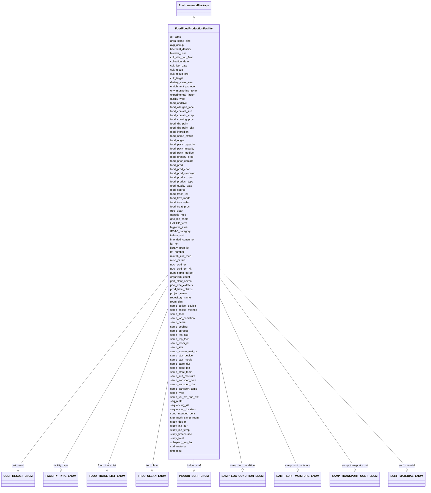

# Class: FoodFoodProductionFacility


URI: [mixs_6_2_proposal:FoodFoodProductionFacility](https://turbomam.github.io/mixs-envo-struct-knowl-extraction/FoodFoodProductionFacility)





## Inheritance
* [EnvironmentalPackage](EnvironmentalPackage.md)
    * **FoodFoodProductionFacility**


## Slots

| Name | Cardinality and Range | Description | Inheritance |
| ---  | --- | --- | --- |
| [samp_name](samp_name.md) | 1..1 <br/> [String](String.md) | A local identifier or name that for the material sample used for extracting n... | direct |
| [project_name](project_name.md) | 1..1 <br/> [String](String.md) | Name of the project within which the sequencing was organized | direct |
| [lat_lon](lat_lon.md) | 1..1 <br/> [String](String.md) | The geographical origin of the sample as defined by latitude and longitude | direct |
| [geo_loc_name](geo_loc_name.md) | 1..1 <br/> [String](String.md) | The geographical origin of the sample as defined by the country or sea name f... | direct |
| [collection_date](collection_date.md) | 1..1 <br/> [Datetime](Datetime.md) | The time of sampling, either as an instance (single point in time) or interva... | direct |
| [seq_meth](seq_meth.md) | 1..1 <br/> [String](String.md) | Sequencing machine used | direct |
| [samp_size](samp_size.md) | 0..1 <br/> [String](String.md) | The total amount or size (volume (ml), mass (g) or area (m2) ) of sample coll... | direct |
| [samp_collect_device](samp_collect_device.md) | 0..1 <br/> [String](String.md) | The device used to collect an environmental sample | direct |
| [experimental_factor](experimental_factor.md) | 0..* <br/> [String](String.md) | Experimental factors are essentially the variable aspects of an experiment de... | direct |
| [nucl_acid_ext](nucl_acid_ext.md) | 0..1 <br/> [String](String.md) | A link to a literature reference, electronic resource or a standard operating... | direct |
| [organism_count](organism_count.md) | 0..1 <br/> [String](String.md) | Total cell count of any organism (or group of organisms) per gram, volume or ... | direct |
| [samp_store_temp](samp_store_temp.md) | 0..1 <br/> [String](String.md) | Temperature at which sample was stored, e | direct |
| [samp_store_dur](samp_store_dur.md) | 0..1 <br/> [String](String.md) | Duration for which the sample was stored | direct |
| [air_temp](air_temp.md) | 0..1 <br/> [String](String.md) | Temperature of the air at the time of sampling | direct |
| [room_dim](room_dim.md) | 0..1 <br/> [String](String.md) | The length, width and height of sampling room | direct |
| [freq_clean](freq_clean.md) | 0..1 <br/> [FREQCLEANENUM](FREQCLEANENUM.md) | The number of times the sample location is cleaned | direct |
| [samp_room_id](samp_room_id.md) | 0..1 <br/> [Integer](Integer.md) | Sampling room number | direct |
| [samp_vol_we_dna_ext](samp_vol_we_dna_ext.md) | 0..1 <br/> [String](String.md) | Volume (ml) or mass (g) of total collected sample processed for DNA extractio... | direct |
| [pool_dna_extracts](pool_dna_extracts.md) | 0..* <br/> [String](String.md) | Indicate whether multiple DNA extractions were mixed | direct |
| [samp_store_loc](samp_store_loc.md) | 0..1 <br/> [String](String.md) | Location at which sample was stored, usually name of a specific freezer/room | direct |
| [surf_material](surf_material.md) | 0..1 <br/> [SURFMATERIALENUM](SURFMATERIALENUM.md) | Surface materials at the point of sampling | direct |
| [indoor_surf](indoor_surf.md) | 0..1 <br/> [INDOORSURFENUM](INDOORSURFENUM.md) | Type of indoor surface | direct |
| [avg_occup](avg_occup.md) | 0..1 <br/> [Float](Float.md) | Daily average occupancy of room | direct |
| [samp_floor](samp_floor.md) | 0..1 <br/> [String](String.md) | The floor of the building, where the sampling room is located | direct |
| [genetic_mod](genetic_mod.md) | 0..1 <br/> [String](String.md) | Genetic modifications of the genome of an organism, which may occur naturally... | direct |
| [coll_site_geo_feat](coll_site_geo_feat.md) | 1..1 <br/> [String](String.md) | Text or terms that describe the geographic feature where the food sample was ... | direct |
| [samp_source_mat_cat](samp_source_mat_cat.md) | 1..1 <br/> [String](String.md) | This is the scientific role or category that the subject organism or material... | direct |
| [samp_type](samp_type.md) | 1..1 <br/> [String](String.md) | The type of material from which the sample was obtained | direct |
| [samp_stor_media](samp_stor_media.md) | 1..1 <br/> [String](String.md) | The liquid that is added to the sample collection device prior to sampling | direct |
| [samp_stor_device](samp_stor_device.md) | 1..1 <br/> [String](String.md) | The container used to store the  sample | direct |
| [food_product_type](food_product_type.md) | 1..1 <br/> [String](String.md) | A food product type is a class of food products that is differentiated by its... | direct |
| [IFSAC_category](IFSAC_category.md) | 1..* <br/> [String](String.md) | The IFSAC food categorization scheme has five distinct levels to which foods ... | direct |
| [food_product_qual](food_product_qual.md) | 1..1 <br/> [String](String.md) | Descriptors for describing food visually or via other senses, which is useful... | direct |
| [food_contact_surf](food_contact_surf.md) | 1..* <br/> [String](String.md) | The specific container or coating materials in direct contact with the food | direct |
| [facility_type](facility_type.md) | 0..* <br/> [FACILITYTYPEENUM](FACILITYTYPEENUM.md) | Establishment details about the type of facility where the sample was taken | direct |
| [food_trav_mode](food_trav_mode.md) | 0..* <br/> [String](String.md) | A descriptor for the method of movement of food commodity along the food dist... | direct |
| [food_trav_vehic](food_trav_vehic.md) | 0..* <br/> [String](String.md) | A descriptor for the mobile machine which is used to transport food commoditi... | direct |
| [samp_transport_dur](samp_transport_dur.md) | 0..1 <br/> [String](String.md) | The duration of time from when the sample was collected until processed | direct |
| [samp_transport_temp](samp_transport_temp.md) | 0..1 <br/> [String](String.md) | Temperature at which sample was transported, e | direct |
| [samp_collect_method](samp_collect_method.md) | 0..1 <br/> [String](String.md) | The method employed for collecting the sample | direct |
| [num_samp_collect](num_samp_collect.md) | 0..1 <br/> [String](String.md) | The number of samples collected during the current sampling event | direct |
| [lot_number](lot_number.md) | 0..* <br/> [String](String.md) | A distinctive alpha-numeric identification code assigned by the manufacturer ... | direct |
| [hygienic_area](hygienic_area.md) | 0..1 <br/> [String](String.md) | The subdivision of areas within a food production facility according to hygie... | direct |
| [env_monitoring_zone](env_monitoring_zone.md) | 0..1 <br/> [String](String.md) | An environmental monitoring zone is a formal designation as part of an enviro... | direct |
| [area_samp_size](area_samp_size.md) | 0..1 <br/> [String](String.md) | The total amount or size (volume (ml), mass (g) or area (m2) ) of sample coll... | direct |
| [samp_surf_moisture](samp_surf_moisture.md) | 0..* <br/> [SAMPSURFMOISTUREENUM](SAMPSURFMOISTUREENUM.md) | Degree of water held on a sampled surface | direct |
| [samp_loc_condition](samp_loc_condition.md) | 0..1 <br/> [SAMPLOCCONDITIONENUM](SAMPLOCCONDITIONENUM.md) | The condition of the sample location at the time of sampling | direct |
| [biocide_used](biocide_used.md) | 0..* <br/> [String](String.md) | Substance intended for preventing, neutralizing, destroying, repelling, or mi... | direct |
| [ster_meth_samp_room](ster_meth_samp_room.md) | 0..* <br/> [String](String.md) | The method used to sterilize the sampling room | direct |
| [enrichment_protocol](enrichment_protocol.md) | 0..1 <br/> [String](String.md) | The microbiological workflow or protocol followed to test for the presence or... | direct |
| [cult_target](cult_target.md) | 0..* <br/> [String](String.md) | The target microbial analyte in terms of investigation scope | direct |
| [microb_cult_med](microb_cult_med.md) | 0..1 <br/> [String](String.md) | A culture medium used to select for, grow, and maintain prokaryotic microorga... | direct |
| [timepoint](timepoint.md) | 0..1 <br/> [String](String.md) | Time point at which a sample or observation is made or taken from a biomateri... | direct |
| [bacterial_density](bacterial_density.md) | 0..1 <br/> [String](String.md) | Number of bacteria in sample, as defined by bacteria density (http://purl | direct |
| [cult_isol_date](cult_isol_date.md) | 0..1 <br/> [String](String.md) | The datetime marking the end of a process in which a sample yields a positive... | direct |
| [cult_result](cult_result.md) | 0..1 <br/> [CULTRESULTENUM](CULTRESULTENUM.md) | Any result of a bacterial culture experiment reported as a binary assessment ... | direct |
| [cult_result_org](cult_result_org.md) | 0..* <br/> [String](String.md) | Taxonomic information about the cultured organism(s) | direct |
| [subspecf_gen_lin](subspecf_gen_lin.md) | 0..1 <br/> [String](String.md) | Information about the genetic distinctness of the sequenced organism below th... | direct |
| [samp_pooling](samp_pooling.md) | 0..* <br/> [String](String.md) | Physical combination of several instances of like material, e | direct |
| [samp_purpose](samp_purpose.md) | 0..1 <br/> [String](String.md) | The reason that the sample was collected | direct |
| [samp_rep_tech](samp_rep_tech.md) | 0..1 <br/> [String](String.md) | Repeated measurements of the same sample that show independent measures of th... | direct |
| [samp_rep_biol](samp_rep_biol.md) | 0..1 <br/> [String](String.md) | Measurements of biologically distinct samples that show biological variation | direct |
| [samp_transport_cont](samp_transport_cont.md) | 0..1 <br/> [SAMPTRANSPORTCONTENUM](SAMPTRANSPORTCONTENUM.md) | Conatiner in which the sample was stored during transport | direct |
| [study_design](study_design.md) | 0..* <br/> [String](String.md) | A plan specification comprised of protocols (which may specify how and what k... | direct |
| [nucl_acid_ext_kit](nucl_acid_ext_kit.md) | 0..* <br/> [String](String.md) | The name of the extraction kit used to recover the nucleic acid fraction of a... | direct |
| [library_prep_kit](library_prep_kit.md) | 0..1 <br/> [String](String.md) | Packaged kits (containing adapters, indexes, enzymes, buffers etc | direct |
| [sequencing_kit](sequencing_kit.md) | 0..1 <br/> [String](String.md) | Pre-filled, ready-to-use reagent cartridges | direct |
| [sequencing_location](sequencing_location.md) | 0..1 <br/> [String](String.md) | The location the sequencing run was performed | direct |
| [study_inc_temp](study_inc_temp.md) | 0..1 <br/> [String](String.md) | Sample incubation temperature if unpublished or unvalidated method is used | direct |
| [study_inc_dur](study_inc_dur.md) | 0..1 <br/> [String](String.md) | Sample incubation duration if unpublished or unvalidated method is used | direct |
| [study_timecourse](study_timecourse.md) | 0..1 <br/> [String](String.md) | For time-course research studies involving samples of the food commodity, ind... | direct |
| [study_tmnt](study_tmnt.md) | 0..* <br/> [String](String.md) | A process in which the act is intended to modify or alter some other material... | direct |
| [food_source](food_source.md) | 0..1 <br/> [String](String.md) | Type of plant or animal from which the food product or its major ingredient i... | direct |
| [food_dis_point](food_dis_point.md) | 0..* <br/> [String](String.md) | A reference to a place on the Earth, by its name or by its geographical locat... | direct |
| [food_dis_point_city](food_dis_point_city.md) | 0..* <br/> [String](String.md) | A reference to a place on the Earth, by its name or by its geographical locat... | direct |
| [food_origin](food_origin.md) | 0..1 <br/> [String](String.md) | A reference to a place on the Earth, by its name or by its geographical locat... | direct |
| [food_prod_synonym](food_prod_synonym.md) | 0..* <br/> [String](String.md) | Other names by which the food product is known by (e | direct |
| [food_additive](food_additive.md) | 0..* <br/> [String](String.md) | A substance or substances added to food to maintain or improve safety and fre... | direct |
| [food_trace_list](food_trace_list.md) | 0..1 <br/> [FOODTRACELISTENUM](FOODTRACELISTENUM.md) | The FDA is proposing to establish additional traceability recordkeeping requi... | direct |
| [part_plant_animal](part_plant_animal.md) | 0..* <br/> [String](String.md) | The anatomical part of the organism being involved in food production or cons... | direct |
| [food_ingredient](food_ingredient.md) | 0..* <br/> [String](String.md) | In this field, please list individual ingredients for multi-component food [F... | direct |
| [spec_intended_cons](spec_intended_cons.md) | 0..* <br/> [String](String.md) | Food consumer type, human or animal, for which the food product is produced a... | direct |
| [HACCP_term](HACCP_term.md) | 0..* <br/> [String](String.md) | Hazard Analysis Critical Control Points (HACCP) food safety terms; This field... | direct |
| [dietary_claim_use](dietary_claim_use.md) | 0..* <br/> [String](String.md) | These descriptors are used either for foods intended for special dietary use ... | direct |
| [food_allergen_label](food_allergen_label.md) | 0..* <br/> [String](String.md) | A label indication that the product contains a recognized allergen | direct |
| [food_prod_char](food_prod_char.md) | 0..* <br/> [String](String.md) | Descriptors of the food production system such as wild caught, free-range, or... | direct |
| [prod_label_claims](prod_label_claims.md) | 0..* <br/> [String](String.md) | Labeling claims containing descriptors such as wild caught, free-range, organ... | direct |
| [food_name_status](food_name_status.md) | 0..1 <br/> [String](String.md) | A datum indicating that use of a food product name is regulated in some legal... | direct |
| [food_preserv_proc](food_preserv_proc.md) | 0..* <br/> [String](String.md) | The methods contributing to the prevention or retardation of microbial, enzym... | direct |
| [food_cooking_proc](food_cooking_proc.md) | 0..* <br/> [String](String.md) | The transformation of raw food by the application of heat | direct |
| [food_treat_proc](food_treat_proc.md) | 0..* <br/> [String](String.md) | Used to specifically characterize a food product based on the treatment or pr... | direct |
| [food_contain_wrap](food_contain_wrap.md) | 0..1 <br/> [String](String.md) | Type of container or wrapping defined by the main container material, the con... | direct |
| [food_pack_capacity](food_pack_capacity.md) | 0..1 <br/> [String](String.md) | The maximum number of product units within a package | direct |
| [food_pack_medium](food_pack_medium.md) | 0..* <br/> [String](String.md) | The medium in which the food is packed for preservation and handling or the m... | direct |
| [food_prior_contact](food_prior_contact.md) | 0..* <br/> [String](String.md) | The material the food contacted (e | direct |
| [food_prod](food_prod.md) | 0..* <br/> [String](String.md) | Descriptors of the food production system or of the agricultural environment ... | direct |
| [food_quality_date](food_quality_date.md) | 0..1 <br/> [String](String.md) | The date recommended for the use of the product while at peak quality, this d... | direct |
| [repository_name](repository_name.md) | 0..* <br/> [String](String.md) | The name of the institution where the sample or DNA extract is held or "sampl... | direct |
| [intended_consumer](intended_consumer.md) | 0..* <br/> [String](String.md) | Food consumer type, human or animal, for which the food product is produced a... | direct |
| [food_pack_integrity](food_pack_integrity.md) | 0..* <br/> [String](String.md) | A term label and term id to describe the state of the packing material and te... | direct |
| [misc_param](misc_param.md) | 0..* <br/> [String](String.md) | Any other measurement performed or parameter collected, that is not listed he... | direct |


## Identifier and Mapping Information


### Schema Source


* from schema: https://turbomam.github.io/mixs-envo-struct-knowl-extraction//mixs_6_2_proposal


## Mappings

| Mapping Type | Mapped Value |
| ---  | ---  |
| self | mixs_6_2_proposal:FoodFoodProductionFacility |
| native | mixs_6_2_proposal:FoodFoodProductionFacility |


## LinkML Source

<!-- TODO: investigate https://stackoverflow.com/questions/37606292/how-to-create-tabbed-code-blocks-in-mkdocs-or-sphinx -->

### Direct

<details>
```yaml
name: FoodFoodProductionFacility
title: FoodFoodProductionFacility
from_schema: https://turbomam.github.io/mixs-envo-struct-knowl-extraction//mixs_6_2_proposal
is_a: EnvironmentalPackage
mixin: false
slots:
- samp_name
- project_name
- lat_lon
- geo_loc_name
- collection_date
- seq_meth
- samp_size
- samp_collect_device
- experimental_factor
- nucl_acid_ext
- organism_count
- samp_store_temp
- samp_store_dur
- air_temp
- room_dim
- freq_clean
- samp_room_id
- samp_vol_we_dna_ext
- pool_dna_extracts
- samp_store_loc
- surf_material
- indoor_surf
- avg_occup
- samp_floor
- genetic_mod
- coll_site_geo_feat
- samp_source_mat_cat
- samp_type
- samp_stor_media
- samp_stor_device
- food_product_type
- IFSAC_category
- food_product_qual
- food_contact_surf
- facility_type
- food_trav_mode
- food_trav_vehic
- samp_transport_dur
- samp_transport_temp
- samp_collect_method
- num_samp_collect
- lot_number
- hygienic_area
- env_monitoring_zone
- area_samp_size
- samp_surf_moisture
- samp_loc_condition
- biocide_used
- ster_meth_samp_room
- enrichment_protocol
- cult_target
- microb_cult_med
- timepoint
- bacterial_density
- cult_isol_date
- cult_result
- cult_result_org
- subspecf_gen_lin
- samp_pooling
- samp_purpose
- samp_rep_tech
- samp_rep_biol
- samp_transport_cont
- study_design
- nucl_acid_ext_kit
- library_prep_kit
- sequencing_kit
- sequencing_location
- study_inc_temp
- study_inc_dur
- study_timecourse
- study_tmnt
- food_source
- food_dis_point
- food_dis_point_city
- food_origin
- food_prod_synonym
- food_additive
- food_trace_list
- part_plant_animal
- food_ingredient
- spec_intended_cons
- HACCP_term
- dietary_claim_use
- food_allergen_label
- food_prod_char
- prod_label_claims
- food_name_status
- food_preserv_proc
- food_cooking_proc
- food_treat_proc
- food_contain_wrap
- food_pack_capacity
- food_pack_medium
- food_prior_contact
- food_prod
- food_quality_date
- repository_name
- intended_consumer
- food_pack_integrity
- misc_param
slot_usage:
  air_temp:
    name: air_temp
    examples:
    - value: 4 degree Celsius
    domain_of:
    - BuiltEnvironment
    - FoodFoodProductionFacility
    required: false
    recommended: false
  avg_occup:
    name: avg_occup
    examples:
    - value: '6'
    domain_of:
    - BuiltEnvironment
    - FoodFoodProductionFacility
  cult_isol_date:
    name: cult_isol_date
    examples:
    - value: '2018-05-11T10:00:00+01:00'
    string_serialization: '{timestamp}'
    domain_of:
    - Agriculture
    - FoodAnimalAndAnimalFeed
    - FoodFarmEnvironment
    - FoodFoodProductionFacility
    - FoodHumanFoods
  cult_result_org:
    name: cult_result_org
    string_serialization: '{termLabel} [{termID}]|{integer}'
    domain_of:
    - FoodAnimalAndAnimalFeed
    - FoodFarmEnvironment
    - FoodFoodProductionFacility
    - FoodHumanFoods
  cult_target:
    name: cult_target
    string_serialization: '{termLabel} [{termID}]|{integer}'
    domain_of:
    - FoodAnimalAndAnimalFeed
    - FoodFarmEnvironment
    - FoodFoodProductionFacility
    - FoodHumanFoods
  enrichment_protocol:
    name: enrichment_protocol
    domain_of:
    - Agriculture
    - FoodAnimalAndAnimalFeed
    - FoodFarmEnvironment
    - FoodFoodProductionFacility
    - FoodHumanFoods
    required: false
    recommended: false
  experimental_factor:
    name: experimental_factor
    examples:
    - value: time series design [EFO:EFO_0001779]
    multivalued: true
    domain_of:
    - FoodAnimalAndAnimalFeed
    - FoodFoodProductionFacility
    - FoodHumanFoods
    - MigsBa
    - MigsEu
    - MigsOrg
    - MigsPl
    - MigsVi
    - Mimag
    - MimarksC
    - MimarksS
    - Mims
    - Misag
    - Miuvig
    required: false
    recommended: false
  food_additive:
    name: food_additive
    examples:
    - value: xanthan gum [FOODON_03413321]
    domain_of:
    - FoodAnimalAndAnimalFeed
    - FoodFoodProductionFacility
    - FoodHumanFoods
  food_contact_surf:
    name: food_contact_surf
    domain_of:
    - FoodAnimalAndAnimalFeed
    - FoodFarmEnvironment
    - FoodFoodProductionFacility
    - FoodHumanFoods
    required: true
  food_dis_point:
    name: food_dis_point
    description: 'A reference to a place on the Earth, by its name or by its geographical
      location that refers to a distribution point along the food chain. This field
      accepts terms listed under geographic location (http://purl.obolibrary.org/obo/GAZ_00000448).
      Reference: Adam Diamond, James Barham. Moving Food Along the Value Chain: Innovations
      in Regional Food Distribution. U.S. Dept. of Agriculture, Agricultural Marketing
      Service. Washington, DC. March 2012. http://dx.doi.org/10.9752/MS045.03-2012.'
    examples:
    - value: 'USA: Delmarva, Peninsula'
    domain_of:
    - FoodAnimalAndAnimalFeed
    - FoodFoodProductionFacility
    - FoodHumanFoods
  food_origin:
    name: food_origin
    examples:
    - value: 'USA: Delmarva, Peninsula'
    string_serialization: '{term}: {term}, {text}'
    domain_of:
    - FoodAnimalAndAnimalFeed
    - FoodFoodProductionFacility
    - FoodHumanFoods
    required: false
    recommended: false
  food_pack_medium:
    name: food_pack_medium
    examples:
    - value: vacuum-packed [FOODON:03480027]
    domain_of:
    - FoodAnimalAndAnimalFeed
    - FoodFarmEnvironment
    - FoodFoodProductionFacility
    - FoodHumanFoods
  food_prod:
    name: food_prod
    description: Descriptors of the food production system or of the agricultural
      environment and growing conditions related to the farm production system, such
      as wild caught, organic, free-range, industrial, dairy, beef,  domestic or cultivated
      food production. This field accepts terms listed under food production (http://purl.obolibrary.org/obo/FOODON_03530206).
      Multiple terms may apply and can be separated by pipes.
    domain_of:
    - Agriculture
    - FoodAnimalAndAnimalFeed
    - FoodFoodProductionFacility
    - FoodHumanFoods
    required: false
    recommended: false
  food_product_qual:
    name: food_product_qual
    domain_of:
    - FoodAnimalAndAnimalFeed
    - FoodFoodProductionFacility
    - FoodHumanFoods
    required: true
  food_product_type:
    name: food_product_type
    examples:
    - value: shrimp (peeled, deep-frozen) [FOODON:03317171]
    domain_of:
    - Agriculture
    - FoodAnimalAndAnimalFeed
    - FoodFarmEnvironment
    - FoodFoodProductionFacility
    - FoodHumanFoods
    required: true
  food_source:
    name: food_source
    examples:
    - value: giant tiger prawn [FOODON:03412612]
    string_serialization: '{termLabel} [{termID}]'
    domain_of:
    - Agriculture
    - FoodAnimalAndAnimalFeed
    - FoodFarmEnvironment
    - FoodFoodProductionFacility
    - FoodHumanFoods
    required: false
    recommended: false
  food_trav_mode:
    name: food_trav_mode
    description: A descriptor for the method of movement of food commodity along the
      food distribution system. This field accepts terms listed under travel mode
      (http://purl.obolibrary.org/obo/GENEPIO_0001064). If the proper descrptor is
      not listed please use text to describe the mode of travel. Multiple terms can
      be separated by one or more pipes.
    domain_of:
    - Agriculture
    - FoodAnimalAndAnimalFeed
    - FoodFarmEnvironment
    - FoodFoodProductionFacility
    - FoodHumanFoods
  freq_clean:
    name: freq_clean
    string_serialization: '{text}'
    domain_of:
    - BuiltEnvironment
    - FoodFoodProductionFacility
  genetic_mod:
    name: genetic_mod
    string_serialization: '{PMID}|{DOI}|{URL}'
    multivalued: false
    domain_of:
    - Agriculture
    - FoodFarmEnvironment
    - FoodFoodProductionFacility
    - FoodHumanFoods
    - HostAssociated
    - PlantAssociated
  geo_loc_name:
    name: geo_loc_name
    description: The geographical origin of the sample as defined by the country or
      sea name followed by specific region name. Country or sea names should be chosen
      from the INSDC country list (http://insdc.org/country.html), or the GAZ ontology  (http://purl.bioontology.org/ontology/GAZ).
    domain_of:
    - FoodAnimalAndAnimalFeed
    - FoodFarmEnvironment
    - FoodFoodProductionFacility
    - FoodHumanFoods
    - MigsBa
    - MigsEu
    - MigsOrg
    - MigsPl
    - MigsVi
    - Mimag
    - MimarksC
    - MimarksS
    - Mims
    - Misag
    - Miuvig
    - SymbiontAssociated
  indoor_surf:
    name: indoor_surf
    domain_of:
    - BuiltEnvironment
    - FoodFoodProductionFacility
    required: false
    recommended: false
  intended_consumer:
    name: intended_consumer
    domain_of:
    - FoodAnimalAndAnimalFeed
    - FoodFarmEnvironment
    - FoodFoodProductionFacility
    - FoodHumanFoods
    required: false
    recommended: false
  lat_lon:
    name: lat_lon
    domain_of:
    - FoodAnimalAndAnimalFeed
    - FoodFarmEnvironment
    - FoodFoodProductionFacility
    - FoodHumanFoods
    - MigsBa
    - MigsEu
    - MigsOrg
    - MigsPl
    - MigsVi
    - Mimag
    - MimarksC
    - MimarksS
    - Mims
    - Misag
    - Miuvig
    - SymbiontAssociated
  library_prep_kit:
    name: library_prep_kit
    description: Packaged kits (containing adapters, indexes, enzymes, buffers etc.),
      tailored for specific sequencing workflows, which allow the simplified preparation
      of sequencing-ready libraries for small genomes, amplicons, and plasmids.
    examples:
    - value: Illumina DNA Prep
    domain_of:
    - Agriculture
    - FoodAnimalAndAnimalFeed
    - FoodFarmEnvironment
    - FoodFoodProductionFacility
    - FoodHumanFoods
  lot_number:
    name: lot_number
    description: 'A distinctive alpha-numeric identification code assigned by the
      manufacturer or distributor to a specific quantity of manufactured material
      or product within a batch. Synonym: Batch Number.  The submitter should provide
      lot number of the item followed by the item name for which the lot number was
      provided.'
    domain_of:
    - Agriculture
    - FoodAnimalAndAnimalFeed
    - FoodFarmEnvironment
    - FoodFoodProductionFacility
    - FoodHumanFoods
  misc_param:
    name: misc_param
    domain_of:
    - Agriculture
    - Air
    - FoodAnimalAndAnimalFeed
    - FoodFarmEnvironment
    - FoodFoodProductionFacility
    - FoodHumanFoods
    - HostAssociated
    - HumanAssociated
    - HumanGut
    - HumanOral
    - HumanSkin
    - HumanVaginal
    - HydrocarbonResourcesCores
    - HydrocarbonResourcesFluidsSwabs
    - MicrobialMatBiofilm
    - MiscellaneousNaturalOrArtificialEnvironment
    - PlantAssociated
    - Sediment
    - Soil
    - SymbiontAssociated
    - WastewaterSludge
    - Water
  nucl_acid_ext:
    name: nucl_acid_ext
    string_serialization: '{PMID}|{DOI}|{URL}'
    domain_of:
    - Agriculture
    - FoodAnimalAndAnimalFeed
    - FoodFarmEnvironment
    - FoodFoodProductionFacility
    - FoodHumanFoods
    - MigsBa
    - MigsEu
    - MigsOrg
    - MigsPl
    - MigsVi
    - Mimag
    - MimarksC
    - MimarksS
    - Mims
    - Misag
    - Miuvig
    required: false
    recommended: false
  organism_count:
    name: organism_count
    description: 'Total cell count of any organism (or group of organisms) per gram,
      volume or area of sample, should include name of organism followed by count.
      The method that was used for the enumeration (e.g. qPCR, atp, mpn, etc.) should
      also be provided. (example: total prokaryotes; 3.5e7 cells per ml; qPCR).'
    examples:
    - value: total prokaryotes;3.5e7 colony forming units per milliliter;qPCR
    string_serialization: '{text};{float} {unit};[ATP|MPN|qPCR|other]'
    multivalued: false
    domain_of:
    - Agriculture
    - Air
    - BuiltEnvironment
    - FoodAnimalAndAnimalFeed
    - FoodFarmEnvironment
    - FoodFoodProductionFacility
    - FoodHumanFoods
    - HostAssociated
    - HumanAssociated
    - HumanGut
    - HumanOral
    - HumanSkin
    - HumanVaginal
    - HydrocarbonResourcesCores
    - HydrocarbonResourcesFluidsSwabs
    - MicrobialMatBiofilm
    - MiscellaneousNaturalOrArtificialEnvironment
    - PlantAssociated
    - Sediment
    - SymbiontAssociated
    - WastewaterSludge
    - Water
    required: false
    recommended: false
  pool_dna_extracts:
    name: pool_dna_extracts
    examples:
    - value: yes, 5
    string_serialization: '{boolean},{integer}'
    multivalued: true
    domain_of:
    - Agriculture
    - FoodAnimalAndAnimalFeed
    - FoodFoodProductionFacility
    - FoodHumanFoods
    - Soil
    required: false
    recommended: false
  repository_name:
    name: repository_name
    domain_of:
    - FoodAnimalAndAnimalFeed
    - FoodFarmEnvironment
    - FoodFoodProductionFacility
    - FoodHumanFoods
  samp_collect_device:
    name: samp_collect_device
    examples:
    - value: biopsy, niskin bottle, push core
    domain_of:
    - Agriculture
    - FoodAnimalAndAnimalFeed
    - FoodFarmEnvironment
    - FoodFoodProductionFacility
    - FoodHumanFoods
    - MigsBa
    - MigsEu
    - MigsOrg
    - MigsPl
    - MigsVi
    - Mimag
    - MimarksC
    - MimarksS
    - Mims
    - Misag
    - Miuvig
    required: false
    recommended: false
  samp_collect_method:
    name: samp_collect_method
    examples:
    - value: environmental swab sampling
    domain_of:
    - Agriculture
    - FoodAnimalAndAnimalFeed
    - FoodFoodProductionFacility
    - FoodHumanFoods
    - MigsBa
    - MigsEu
    - MigsOrg
    - MigsPl
    - MigsVi
    - Mimag
    - MimarksC
    - MimarksS
    - Mims
    - Misag
    - Miuvig
    required: false
    recommended: false
  samp_pooling:
    name: samp_pooling
    domain_of:
    - Agriculture
    - FoodAnimalAndAnimalFeed
    - FoodFarmEnvironment
    - FoodFoodProductionFacility
    - FoodHumanFoods
    required: false
    recommended: false
  samp_purpose:
    name: samp_purpose
    domain_of:
    - FoodAnimalAndAnimalFeed
    - FoodFarmEnvironment
    - FoodFoodProductionFacility
    - FoodHumanFoods
    required: false
    recommended: false
  samp_size:
    name: samp_size
    examples:
    - value: 5 liters
    domain_of:
    - Agriculture
    - FoodAnimalAndAnimalFeed
    - FoodFarmEnvironment
    - FoodFoodProductionFacility
    - FoodHumanFoods
    - MigsBa
    - MigsEu
    - MigsOrg
    - MigsPl
    - MigsVi
    - Mimag
    - MimarksC
    - MimarksS
    - Mims
    - Misag
    - Miuvig
    required: false
    recommended: false
  samp_source_mat_cat:
    name: samp_source_mat_cat
    description: This is the scientific role or category that the subject organism
      or material has with respect to an investigation.  This field accepts terms
      listed under specimen (http://purl.obolibrary.org/obo/GENEPIO_0001237 or http://purl.obolibrary.org/obo/OBI_0100051).
    examples:
    - value: environmental swab specimen [OBI:0002613]
    domain_of:
    - FoodAnimalAndAnimalFeed
    - FoodFarmEnvironment
    - FoodFoodProductionFacility
    - FoodHumanFoods
    required: true
  samp_stor_device:
    name: samp_stor_device
    domain_of:
    - FoodAnimalAndAnimalFeed
    - FoodFoodProductionFacility
    - FoodHumanFoods
    required: true
  samp_stor_media:
    name: samp_stor_media
    domain_of:
    - FoodAnimalAndAnimalFeed
    - FoodFoodProductionFacility
    - FoodHumanFoods
    required: true
  samp_store_dur:
    name: samp_store_dur
    description: Duration for which the sample was stored. Indicate the duration for
      which the sample was stored written in ISO 8601 format.
    string_serialization: '{duration}'
    domain_of:
    - Agriculture
    - Air
    - FoodAnimalAndAnimalFeed
    - FoodFarmEnvironment
    - FoodFoodProductionFacility
    - FoodHumanFoods
    - HostAssociated
    - HumanAssociated
    - HumanGut
    - HumanOral
    - HumanSkin
    - HumanVaginal
    - HydrocarbonResourcesCores
    - HydrocarbonResourcesFluidsSwabs
    - MicrobialMatBiofilm
    - MiscellaneousNaturalOrArtificialEnvironment
    - PlantAssociated
    - Sediment
    - SymbiontAssociated
    - WastewaterSludge
    - Water
    required: false
    recommended: false
  samp_store_loc:
    name: samp_store_loc
    description: Location at which sample was stored, usually name of a specific freezer/room.
      Indicate the location name.
    examples:
    - value: freezer 5
    domain_of:
    - Agriculture
    - Air
    - FoodAnimalAndAnimalFeed
    - FoodFoodProductionFacility
    - FoodHumanFoods
    - HostAssociated
    - HumanAssociated
    - HumanGut
    - HumanOral
    - HumanSkin
    - HumanVaginal
    - HydrocarbonResourcesCores
    - HydrocarbonResourcesFluidsSwabs
    - MicrobialMatBiofilm
    - MiscellaneousNaturalOrArtificialEnvironment
    - PlantAssociated
    - Sediment
    - SymbiontAssociated
    - WastewaterSludge
    - Water
    required: false
    recommended: false
  samp_vol_we_dna_ext:
    name: samp_vol_we_dna_ext
    description: 'Volume (ml) or mass (g) of total collected sample processed for
      DNA extraction. Note: total sample collected should be entered under the term
      Sample Size (MIXS:0000001).'
    domain_of:
    - Agriculture
    - Air
    - FoodAnimalAndAnimalFeed
    - FoodFarmEnvironment
    - FoodFoodProductionFacility
    - FoodHumanFoods
    - HostAssociated
    - HumanAssociated
    - HumanGut
    - HumanOral
    - HumanSkin
    - HumanVaginal
    - HydrocarbonResourcesCores
    - HydrocarbonResourcesFluidsSwabs
    - MicrobialMatBiofilm
    - MigsBa
    - MigsEu
    - MigsOrg
    - MigsPl
    - MigsVi
    - Mimag
    - MimarksC
    - MimarksS
    - Mims
    - Misag
    - MiscellaneousNaturalOrArtificialEnvironment
    - Miuvig
    - PlantAssociated
    - Sediment
    - Soil
    - SymbiontAssociated
    - WastewaterSludge
    - Water
    required: false
    recommended: false
  subspecf_gen_lin:
    name: subspecf_gen_lin
    annotations:
      Requirement:
        tag: Requirement
        value: nan
    domain_of:
    - FoodFoodProductionFacility
    - MigsBa
    - MigsEu
    - MigsOrg
    - MigsPl
    - MigsVi
    - MimarksC
  surf_material:
    name: surf_material
    domain_of:
    - BuiltEnvironment
    - FoodFoodProductionFacility
    required: false
    recommended: false

```
</details>

### Induced

<details>
```yaml
name: FoodFoodProductionFacility
title: FoodFoodProductionFacility
from_schema: https://turbomam.github.io/mixs-envo-struct-knowl-extraction//mixs_6_2_proposal
is_a: EnvironmentalPackage
mixin: false
slot_usage:
  air_temp:
    name: air_temp
    examples:
    - value: 4 degree Celsius
    domain_of:
    - BuiltEnvironment
    - FoodFoodProductionFacility
    required: false
    recommended: false
  avg_occup:
    name: avg_occup
    examples:
    - value: '6'
    domain_of:
    - BuiltEnvironment
    - FoodFoodProductionFacility
  cult_isol_date:
    name: cult_isol_date
    examples:
    - value: '2018-05-11T10:00:00+01:00'
    string_serialization: '{timestamp}'
    domain_of:
    - Agriculture
    - FoodAnimalAndAnimalFeed
    - FoodFarmEnvironment
    - FoodFoodProductionFacility
    - FoodHumanFoods
  cult_result_org:
    name: cult_result_org
    string_serialization: '{termLabel} [{termID}]|{integer}'
    domain_of:
    - FoodAnimalAndAnimalFeed
    - FoodFarmEnvironment
    - FoodFoodProductionFacility
    - FoodHumanFoods
  cult_target:
    name: cult_target
    string_serialization: '{termLabel} [{termID}]|{integer}'
    domain_of:
    - FoodAnimalAndAnimalFeed
    - FoodFarmEnvironment
    - FoodFoodProductionFacility
    - FoodHumanFoods
  enrichment_protocol:
    name: enrichment_protocol
    domain_of:
    - Agriculture
    - FoodAnimalAndAnimalFeed
    - FoodFarmEnvironment
    - FoodFoodProductionFacility
    - FoodHumanFoods
    required: false
    recommended: false
  experimental_factor:
    name: experimental_factor
    examples:
    - value: time series design [EFO:EFO_0001779]
    multivalued: true
    domain_of:
    - FoodAnimalAndAnimalFeed
    - FoodFoodProductionFacility
    - FoodHumanFoods
    - MigsBa
    - MigsEu
    - MigsOrg
    - MigsPl
    - MigsVi
    - Mimag
    - MimarksC
    - MimarksS
    - Mims
    - Misag
    - Miuvig
    required: false
    recommended: false
  food_additive:
    name: food_additive
    examples:
    - value: xanthan gum [FOODON_03413321]
    domain_of:
    - FoodAnimalAndAnimalFeed
    - FoodFoodProductionFacility
    - FoodHumanFoods
  food_contact_surf:
    name: food_contact_surf
    domain_of:
    - FoodAnimalAndAnimalFeed
    - FoodFarmEnvironment
    - FoodFoodProductionFacility
    - FoodHumanFoods
    required: true
  food_dis_point:
    name: food_dis_point
    description: 'A reference to a place on the Earth, by its name or by its geographical
      location that refers to a distribution point along the food chain. This field
      accepts terms listed under geographic location (http://purl.obolibrary.org/obo/GAZ_00000448).
      Reference: Adam Diamond, James Barham. Moving Food Along the Value Chain: Innovations
      in Regional Food Distribution. U.S. Dept. of Agriculture, Agricultural Marketing
      Service. Washington, DC. March 2012. http://dx.doi.org/10.9752/MS045.03-2012.'
    examples:
    - value: 'USA: Delmarva, Peninsula'
    domain_of:
    - FoodAnimalAndAnimalFeed
    - FoodFoodProductionFacility
    - FoodHumanFoods
  food_origin:
    name: food_origin
    examples:
    - value: 'USA: Delmarva, Peninsula'
    string_serialization: '{term}: {term}, {text}'
    domain_of:
    - FoodAnimalAndAnimalFeed
    - FoodFoodProductionFacility
    - FoodHumanFoods
    required: false
    recommended: false
  food_pack_medium:
    name: food_pack_medium
    examples:
    - value: vacuum-packed [FOODON:03480027]
    domain_of:
    - FoodAnimalAndAnimalFeed
    - FoodFarmEnvironment
    - FoodFoodProductionFacility
    - FoodHumanFoods
  food_prod:
    name: food_prod
    description: Descriptors of the food production system or of the agricultural
      environment and growing conditions related to the farm production system, such
      as wild caught, organic, free-range, industrial, dairy, beef,  domestic or cultivated
      food production. This field accepts terms listed under food production (http://purl.obolibrary.org/obo/FOODON_03530206).
      Multiple terms may apply and can be separated by pipes.
    domain_of:
    - Agriculture
    - FoodAnimalAndAnimalFeed
    - FoodFoodProductionFacility
    - FoodHumanFoods
    required: false
    recommended: false
  food_product_qual:
    name: food_product_qual
    domain_of:
    - FoodAnimalAndAnimalFeed
    - FoodFoodProductionFacility
    - FoodHumanFoods
    required: true
  food_product_type:
    name: food_product_type
    examples:
    - value: shrimp (peeled, deep-frozen) [FOODON:03317171]
    domain_of:
    - Agriculture
    - FoodAnimalAndAnimalFeed
    - FoodFarmEnvironment
    - FoodFoodProductionFacility
    - FoodHumanFoods
    required: true
  food_source:
    name: food_source
    examples:
    - value: giant tiger prawn [FOODON:03412612]
    string_serialization: '{termLabel} [{termID}]'
    domain_of:
    - Agriculture
    - FoodAnimalAndAnimalFeed
    - FoodFarmEnvironment
    - FoodFoodProductionFacility
    - FoodHumanFoods
    required: false
    recommended: false
  food_trav_mode:
    name: food_trav_mode
    description: A descriptor for the method of movement of food commodity along the
      food distribution system. This field accepts terms listed under travel mode
      (http://purl.obolibrary.org/obo/GENEPIO_0001064). If the proper descrptor is
      not listed please use text to describe the mode of travel. Multiple terms can
      be separated by one or more pipes.
    domain_of:
    - Agriculture
    - FoodAnimalAndAnimalFeed
    - FoodFarmEnvironment
    - FoodFoodProductionFacility
    - FoodHumanFoods
  freq_clean:
    name: freq_clean
    string_serialization: '{text}'
    domain_of:
    - BuiltEnvironment
    - FoodFoodProductionFacility
  genetic_mod:
    name: genetic_mod
    string_serialization: '{PMID}|{DOI}|{URL}'
    multivalued: false
    domain_of:
    - Agriculture
    - FoodFarmEnvironment
    - FoodFoodProductionFacility
    - FoodHumanFoods
    - HostAssociated
    - PlantAssociated
  geo_loc_name:
    name: geo_loc_name
    description: The geographical origin of the sample as defined by the country or
      sea name followed by specific region name. Country or sea names should be chosen
      from the INSDC country list (http://insdc.org/country.html), or the GAZ ontology  (http://purl.bioontology.org/ontology/GAZ).
    domain_of:
    - FoodAnimalAndAnimalFeed
    - FoodFarmEnvironment
    - FoodFoodProductionFacility
    - FoodHumanFoods
    - MigsBa
    - MigsEu
    - MigsOrg
    - MigsPl
    - MigsVi
    - Mimag
    - MimarksC
    - MimarksS
    - Mims
    - Misag
    - Miuvig
    - SymbiontAssociated
  indoor_surf:
    name: indoor_surf
    domain_of:
    - BuiltEnvironment
    - FoodFoodProductionFacility
    required: false
    recommended: false
  intended_consumer:
    name: intended_consumer
    domain_of:
    - FoodAnimalAndAnimalFeed
    - FoodFarmEnvironment
    - FoodFoodProductionFacility
    - FoodHumanFoods
    required: false
    recommended: false
  lat_lon:
    name: lat_lon
    domain_of:
    - FoodAnimalAndAnimalFeed
    - FoodFarmEnvironment
    - FoodFoodProductionFacility
    - FoodHumanFoods
    - MigsBa
    - MigsEu
    - MigsOrg
    - MigsPl
    - MigsVi
    - Mimag
    - MimarksC
    - MimarksS
    - Mims
    - Misag
    - Miuvig
    - SymbiontAssociated
  library_prep_kit:
    name: library_prep_kit
    description: Packaged kits (containing adapters, indexes, enzymes, buffers etc.),
      tailored for specific sequencing workflows, which allow the simplified preparation
      of sequencing-ready libraries for small genomes, amplicons, and plasmids.
    examples:
    - value: Illumina DNA Prep
    domain_of:
    - Agriculture
    - FoodAnimalAndAnimalFeed
    - FoodFarmEnvironment
    - FoodFoodProductionFacility
    - FoodHumanFoods
  lot_number:
    name: lot_number
    description: 'A distinctive alpha-numeric identification code assigned by the
      manufacturer or distributor to a specific quantity of manufactured material
      or product within a batch. Synonym: Batch Number.  The submitter should provide
      lot number of the item followed by the item name for which the lot number was
      provided.'
    domain_of:
    - Agriculture
    - FoodAnimalAndAnimalFeed
    - FoodFarmEnvironment
    - FoodFoodProductionFacility
    - FoodHumanFoods
  misc_param:
    name: misc_param
    domain_of:
    - Agriculture
    - Air
    - FoodAnimalAndAnimalFeed
    - FoodFarmEnvironment
    - FoodFoodProductionFacility
    - FoodHumanFoods
    - HostAssociated
    - HumanAssociated
    - HumanGut
    - HumanOral
    - HumanSkin
    - HumanVaginal
    - HydrocarbonResourcesCores
    - HydrocarbonResourcesFluidsSwabs
    - MicrobialMatBiofilm
    - MiscellaneousNaturalOrArtificialEnvironment
    - PlantAssociated
    - Sediment
    - Soil
    - SymbiontAssociated
    - WastewaterSludge
    - Water
  nucl_acid_ext:
    name: nucl_acid_ext
    string_serialization: '{PMID}|{DOI}|{URL}'
    domain_of:
    - Agriculture
    - FoodAnimalAndAnimalFeed
    - FoodFarmEnvironment
    - FoodFoodProductionFacility
    - FoodHumanFoods
    - MigsBa
    - MigsEu
    - MigsOrg
    - MigsPl
    - MigsVi
    - Mimag
    - MimarksC
    - MimarksS
    - Mims
    - Misag
    - Miuvig
    required: false
    recommended: false
  organism_count:
    name: organism_count
    description: 'Total cell count of any organism (or group of organisms) per gram,
      volume or area of sample, should include name of organism followed by count.
      The method that was used for the enumeration (e.g. qPCR, atp, mpn, etc.) should
      also be provided. (example: total prokaryotes; 3.5e7 cells per ml; qPCR).'
    examples:
    - value: total prokaryotes;3.5e7 colony forming units per milliliter;qPCR
    string_serialization: '{text};{float} {unit};[ATP|MPN|qPCR|other]'
    multivalued: false
    domain_of:
    - Agriculture
    - Air
    - BuiltEnvironment
    - FoodAnimalAndAnimalFeed
    - FoodFarmEnvironment
    - FoodFoodProductionFacility
    - FoodHumanFoods
    - HostAssociated
    - HumanAssociated
    - HumanGut
    - HumanOral
    - HumanSkin
    - HumanVaginal
    - HydrocarbonResourcesCores
    - HydrocarbonResourcesFluidsSwabs
    - MicrobialMatBiofilm
    - MiscellaneousNaturalOrArtificialEnvironment
    - PlantAssociated
    - Sediment
    - SymbiontAssociated
    - WastewaterSludge
    - Water
    required: false
    recommended: false
  pool_dna_extracts:
    name: pool_dna_extracts
    examples:
    - value: yes, 5
    string_serialization: '{boolean},{integer}'
    multivalued: true
    domain_of:
    - Agriculture
    - FoodAnimalAndAnimalFeed
    - FoodFoodProductionFacility
    - FoodHumanFoods
    - Soil
    required: false
    recommended: false
  repository_name:
    name: repository_name
    domain_of:
    - FoodAnimalAndAnimalFeed
    - FoodFarmEnvironment
    - FoodFoodProductionFacility
    - FoodHumanFoods
  samp_collect_device:
    name: samp_collect_device
    examples:
    - value: biopsy, niskin bottle, push core
    domain_of:
    - Agriculture
    - FoodAnimalAndAnimalFeed
    - FoodFarmEnvironment
    - FoodFoodProductionFacility
    - FoodHumanFoods
    - MigsBa
    - MigsEu
    - MigsOrg
    - MigsPl
    - MigsVi
    - Mimag
    - MimarksC
    - MimarksS
    - Mims
    - Misag
    - Miuvig
    required: false
    recommended: false
  samp_collect_method:
    name: samp_collect_method
    examples:
    - value: environmental swab sampling
    domain_of:
    - Agriculture
    - FoodAnimalAndAnimalFeed
    - FoodFoodProductionFacility
    - FoodHumanFoods
    - MigsBa
    - MigsEu
    - MigsOrg
    - MigsPl
    - MigsVi
    - Mimag
    - MimarksC
    - MimarksS
    - Mims
    - Misag
    - Miuvig
    required: false
    recommended: false
  samp_pooling:
    name: samp_pooling
    domain_of:
    - Agriculture
    - FoodAnimalAndAnimalFeed
    - FoodFarmEnvironment
    - FoodFoodProductionFacility
    - FoodHumanFoods
    required: false
    recommended: false
  samp_purpose:
    name: samp_purpose
    domain_of:
    - FoodAnimalAndAnimalFeed
    - FoodFarmEnvironment
    - FoodFoodProductionFacility
    - FoodHumanFoods
    required: false
    recommended: false
  samp_size:
    name: samp_size
    examples:
    - value: 5 liters
    domain_of:
    - Agriculture
    - FoodAnimalAndAnimalFeed
    - FoodFarmEnvironment
    - FoodFoodProductionFacility
    - FoodHumanFoods
    - MigsBa
    - MigsEu
    - MigsOrg
    - MigsPl
    - MigsVi
    - Mimag
    - MimarksC
    - MimarksS
    - Mims
    - Misag
    - Miuvig
    required: false
    recommended: false
  samp_source_mat_cat:
    name: samp_source_mat_cat
    description: This is the scientific role or category that the subject organism
      or material has with respect to an investigation.  This field accepts terms
      listed under specimen (http://purl.obolibrary.org/obo/GENEPIO_0001237 or http://purl.obolibrary.org/obo/OBI_0100051).
    examples:
    - value: environmental swab specimen [OBI:0002613]
    domain_of:
    - FoodAnimalAndAnimalFeed
    - FoodFarmEnvironment
    - FoodFoodProductionFacility
    - FoodHumanFoods
    required: true
  samp_stor_device:
    name: samp_stor_device
    domain_of:
    - FoodAnimalAndAnimalFeed
    - FoodFoodProductionFacility
    - FoodHumanFoods
    required: true
  samp_stor_media:
    name: samp_stor_media
    domain_of:
    - FoodAnimalAndAnimalFeed
    - FoodFoodProductionFacility
    - FoodHumanFoods
    required: true
  samp_store_dur:
    name: samp_store_dur
    description: Duration for which the sample was stored. Indicate the duration for
      which the sample was stored written in ISO 8601 format.
    string_serialization: '{duration}'
    domain_of:
    - Agriculture
    - Air
    - FoodAnimalAndAnimalFeed
    - FoodFarmEnvironment
    - FoodFoodProductionFacility
    - FoodHumanFoods
    - HostAssociated
    - HumanAssociated
    - HumanGut
    - HumanOral
    - HumanSkin
    - HumanVaginal
    - HydrocarbonResourcesCores
    - HydrocarbonResourcesFluidsSwabs
    - MicrobialMatBiofilm
    - MiscellaneousNaturalOrArtificialEnvironment
    - PlantAssociated
    - Sediment
    - SymbiontAssociated
    - WastewaterSludge
    - Water
    required: false
    recommended: false
  samp_store_loc:
    name: samp_store_loc
    description: Location at which sample was stored, usually name of a specific freezer/room.
      Indicate the location name.
    examples:
    - value: freezer 5
    domain_of:
    - Agriculture
    - Air
    - FoodAnimalAndAnimalFeed
    - FoodFoodProductionFacility
    - FoodHumanFoods
    - HostAssociated
    - HumanAssociated
    - HumanGut
    - HumanOral
    - HumanSkin
    - HumanVaginal
    - HydrocarbonResourcesCores
    - HydrocarbonResourcesFluidsSwabs
    - MicrobialMatBiofilm
    - MiscellaneousNaturalOrArtificialEnvironment
    - PlantAssociated
    - Sediment
    - SymbiontAssociated
    - WastewaterSludge
    - Water
    required: false
    recommended: false
  samp_vol_we_dna_ext:
    name: samp_vol_we_dna_ext
    description: 'Volume (ml) or mass (g) of total collected sample processed for
      DNA extraction. Note: total sample collected should be entered under the term
      Sample Size (MIXS:0000001).'
    domain_of:
    - Agriculture
    - Air
    - FoodAnimalAndAnimalFeed
    - FoodFarmEnvironment
    - FoodFoodProductionFacility
    - FoodHumanFoods
    - HostAssociated
    - HumanAssociated
    - HumanGut
    - HumanOral
    - HumanSkin
    - HumanVaginal
    - HydrocarbonResourcesCores
    - HydrocarbonResourcesFluidsSwabs
    - MicrobialMatBiofilm
    - MigsBa
    - MigsEu
    - MigsOrg
    - MigsPl
    - MigsVi
    - Mimag
    - MimarksC
    - MimarksS
    - Mims
    - Misag
    - MiscellaneousNaturalOrArtificialEnvironment
    - Miuvig
    - PlantAssociated
    - Sediment
    - Soil
    - SymbiontAssociated
    - WastewaterSludge
    - Water
    required: false
    recommended: false
  subspecf_gen_lin:
    name: subspecf_gen_lin
    annotations:
      Requirement:
        tag: Requirement
        value: nan
    domain_of:
    - FoodFoodProductionFacility
    - MigsBa
    - MigsEu
    - MigsOrg
    - MigsPl
    - MigsVi
    - MimarksC
  surf_material:
    name: surf_material
    domain_of:
    - BuiltEnvironment
    - FoodFoodProductionFacility
    required: false
    recommended: false
attributes:
  samp_name:
    name: samp_name
    description: A local identifier or name that for the material sample used for
      extracting nucleic acids, and subsequent sequencing. It can refer either to
      the original material collected or to any derived sub-samples. It can have any
      format, but we suggest that you make it concise, unique and consistent within
      your lab, and as informative as possible. INSDC requires every sample name from
      a single Submitter to be unique. Use of a globally unique identifier for the
      field source_mat_id is recommended in addition to sample_name
    title: sample name
    notes:
    - sample
    examples:
    - value: ISDsoil1
    in_subset:
    - investigation
    from_schema: https://turbomam.github.io/mixs-envo-struct-knowl-extraction//mixs_6_2_proposal
    rank: 1000
    slot_uri: MIXS:0001107
    multivalued: false
    alias: samp_name
    owner: FoodFoodProductionFacility
    domain_of:
    - Air
    - BuiltEnvironment
    - FoodAnimalAndAnimalFeed
    - FoodFarmEnvironment
    - FoodFoodProductionFacility
    - FoodHumanFoods
    - HostAssociated
    - HumanAssociated
    - HumanGut
    - HumanOral
    - HumanSkin
    - HumanVaginal
    - HydrocarbonResourcesCores
    - HydrocarbonResourcesFluidsSwabs
    - MicrobialMatBiofilm
    - MigsBa
    - MigsEu
    - MigsOrg
    - MigsPl
    - MigsVi
    - Mimag
    - MimarksC
    - MimarksS
    - Mims
    - Misag
    - MiscellaneousNaturalOrArtificialEnvironment
    - Miuvig
    - PlantAssociated
    - Sediment
    - Soil
    - SymbiontAssociated
    - WastewaterSludge
    - Water
    range: string
    required: true
  project_name:
    name: project_name
    description: Name of the project within which the sequencing was organized
    title: project name
    notes:
    - project
    examples:
    - value: Forest soil metagenome
    in_subset:
    - investigation
    from_schema: https://turbomam.github.io/mixs-envo-struct-knowl-extraction//mixs_6_2_proposal
    rank: 1000
    slot_uri: MIXS:0000092
    multivalued: false
    alias: project_name
    owner: FoodFoodProductionFacility
    domain_of:
    - Air
    - BuiltEnvironment
    - FoodAnimalAndAnimalFeed
    - FoodFarmEnvironment
    - FoodFoodProductionFacility
    - FoodHumanFoods
    - HostAssociated
    - HumanAssociated
    - HumanGut
    - HumanOral
    - HumanSkin
    - HumanVaginal
    - HydrocarbonResourcesCores
    - HydrocarbonResourcesFluidsSwabs
    - MicrobialMatBiofilm
    - MigsBa
    - MigsEu
    - MigsOrg
    - MigsPl
    - MigsVi
    - Mimag
    - MimarksC
    - MimarksS
    - Mims
    - Misag
    - MiscellaneousNaturalOrArtificialEnvironment
    - Miuvig
    - PlantAssociated
    - Sediment
    - Soil
    - SymbiontAssociated
    - WastewaterSludge
    - Water
    range: string
    required: true
  lat_lon:
    name: lat_lon
    description: The geographical origin of the sample as defined by latitude and
      longitude. The values should be reported in decimal degrees and in WGS84 system
    title: geographic location (latitude and longitude)
    from_schema: https://turbomam.github.io/mixs-envo-struct-knowl-extraction//mixs_6_2_proposal
    rank: 1000
    string_serialization: '{float} {float}'
    slot_uri: MIXS:0000009
    multivalued: false
    alias: lat_lon
    owner: FoodFoodProductionFacility
    domain_of:
    - FoodAnimalAndAnimalFeed
    - FoodFarmEnvironment
    - FoodFoodProductionFacility
    - FoodHumanFoods
    - MigsBa
    - MigsEu
    - MigsOrg
    - MigsPl
    - MigsVi
    - Mimag
    - MimarksC
    - MimarksS
    - Mims
    - Misag
    - Miuvig
    - SymbiontAssociated
    range: string
    required: true
  geo_loc_name:
    name: geo_loc_name
    description: The geographical origin of the sample as defined by the country or
      sea name followed by specific region name. Country or sea names should be chosen
      from the INSDC country list (http://insdc.org/country.html), or the GAZ ontology  (http://purl.bioontology.org/ontology/GAZ).
    title: geographic location (country and/or sea,region)
    from_schema: https://turbomam.github.io/mixs-envo-struct-knowl-extraction//mixs_6_2_proposal
    rank: 1000
    string_serialization: '{term}: {term}, {text}'
    slot_uri: MIXS:0000010
    multivalued: false
    alias: geo_loc_name
    owner: FoodFoodProductionFacility
    domain_of:
    - FoodAnimalAndAnimalFeed
    - FoodFarmEnvironment
    - FoodFoodProductionFacility
    - FoodHumanFoods
    - MigsBa
    - MigsEu
    - MigsOrg
    - MigsPl
    - MigsVi
    - Mimag
    - MimarksC
    - MimarksS
    - Mims
    - Misag
    - Miuvig
    - SymbiontAssociated
    range: string
    required: true
  collection_date:
    name: collection_date
    description: 'The time of sampling, either as an instance (single point in time)
      or interval. In case no exact time is available, the date/time can be right
      truncated i.e. all of these are valid times: 2008-01-23T19:23:10+00:00; 2008-01-23T19:23:10;
      2008-01-23; 2008-01; 2008; Except: 2008-01; 2008 all are ISO8601 compliant'
    title: collection date
    notes:
    - date
    examples:
    - value: '2013-03-25T12:42:31+00:32'
    in_subset:
    - environment
    from_schema: https://turbomam.github.io/mixs-envo-struct-knowl-extraction//mixs_6_2_proposal
    rank: 1000
    slot_uri: MIXS:0000011
    multivalued: false
    alias: collection_date
    owner: FoodFoodProductionFacility
    domain_of:
    - FoodAnimalAndAnimalFeed
    - FoodFarmEnvironment
    - FoodFoodProductionFacility
    - FoodHumanFoods
    - MigsBa
    - MigsEu
    - MigsOrg
    - MigsPl
    - MigsVi
    - Mimag
    - MimarksC
    - MimarksS
    - Mims
    - Misag
    - Miuvig
    - SymbiontAssociated
    range: datetime
    required: true
  seq_meth:
    name: seq_meth
    annotations:
      Expected_value:
        tag: Expected_value
        value: Text or OBI
    description: Sequencing machine used. Where possible the term should be taken
      from the OBI list of DNA sequencers (http://purl.obolibrary.org/obo/OBI_0400103)
    title: sequencing method
    notes:
    - method
    examples:
    - value: 454 Genome Sequencer FLX [OBI:0000702]
    in_subset:
    - sequencing
    from_schema: https://turbomam.github.io/mixs-envo-struct-knowl-extraction//mixs_6_2_proposal
    rank: 1000
    string_serialization: '{termLabel} [{termID}]|{text}'
    slot_uri: MIXS:0000050
    multivalued: false
    alias: seq_meth
    owner: FoodFoodProductionFacility
    domain_of:
    - Agriculture
    - FoodAnimalAndAnimalFeed
    - FoodFarmEnvironment
    - FoodFoodProductionFacility
    - FoodHumanFoods
    - MigsBa
    - MigsEu
    - MigsOrg
    - MigsPl
    - MigsVi
    - Mimag
    - MimarksC
    - MimarksS
    - Mims
    - Misag
    - Miuvig
    range: string
    required: true
  samp_size:
    name: samp_size
    description: The total amount or size (volume (ml), mass (g) or area (m2) ) of
      sample collected
    title: amount or size of sample collected
    examples:
    - value: 5 liters
    from_schema: https://turbomam.github.io/mixs-envo-struct-knowl-extraction//mixs_6_2_proposal
    rank: 1000
    slot_uri: MIXS:0000001
    multivalued: false
    alias: samp_size
    owner: FoodFoodProductionFacility
    domain_of:
    - Agriculture
    - FoodAnimalAndAnimalFeed
    - FoodFarmEnvironment
    - FoodFoodProductionFacility
    - FoodHumanFoods
    - MigsBa
    - MigsEu
    - MigsOrg
    - MigsPl
    - MigsVi
    - Mimag
    - MimarksC
    - MimarksS
    - Mims
    - Misag
    - Miuvig
    range: string
    required: false
    recommended: false
    pattern: ^[-+]?[0-9]*\.?[0-9]+([eE][-+]?[0-9]+)? \S.*\S$
  samp_collect_device:
    name: samp_collect_device
    description: The device used to collect an environmental sample. This field accepts
      terms listed under environmental sampling device (http://purl.obolibrary.org/obo/ENVO).
      This field also accepts terms listed under specimen collection device (http://purl.obolibrary.org/obo/GENEPIO_0002094)
    title: sample collection device
    examples:
    - value: biopsy, niskin bottle, push core
    from_schema: https://turbomam.github.io/mixs-envo-struct-knowl-extraction//mixs_6_2_proposal
    rank: 1000
    string_serialization: '{termLabel} [{termID}]|{text}'
    slot_uri: MIXS:0000002
    multivalued: false
    alias: samp_collect_device
    owner: FoodFoodProductionFacility
    domain_of:
    - Agriculture
    - FoodAnimalAndAnimalFeed
    - FoodFarmEnvironment
    - FoodFoodProductionFacility
    - FoodHumanFoods
    - MigsBa
    - MigsEu
    - MigsOrg
    - MigsPl
    - MigsVi
    - Mimag
    - MimarksC
    - MimarksS
    - Mims
    - Misag
    - Miuvig
    range: string
    required: false
    recommended: false
  experimental_factor:
    name: experimental_factor
    description: Experimental factors are essentially the variable aspects of an experiment
      design which can be used to describe an experiment, or set of experiments, in
      an increasingly detailed manner. This field accepts ontology terms from Experimental
      Factor Ontology (EFO) and/or Ontology for Biomedical Investigations (OBI). For
      a browser of EFO (v 2.95) terms, please see http://purl.bioontology.org/ontology/EFO;
      for a browser of OBI (v 2018-02-12) terms please see http://purl.bioontology.org/ontology/OBI
    title: experimental factor
    examples:
    - value: time series design [EFO:EFO_0001779]
    from_schema: https://turbomam.github.io/mixs-envo-struct-knowl-extraction//mixs_6_2_proposal
    rank: 1000
    string_serialization: '{termLabel} [{termID}]|{text}'
    slot_uri: MIXS:0000008
    multivalued: true
    alias: experimental_factor
    owner: FoodFoodProductionFacility
    domain_of:
    - FoodAnimalAndAnimalFeed
    - FoodFoodProductionFacility
    - FoodHumanFoods
    - MigsBa
    - MigsEu
    - MigsOrg
    - MigsPl
    - MigsVi
    - Mimag
    - MimarksC
    - MimarksS
    - Mims
    - Misag
    - Miuvig
    range: string
    required: false
    recommended: false
  nucl_acid_ext:
    name: nucl_acid_ext
    description: A link to a literature reference, electronic resource or a standard
      operating procedure (SOP), that describes the material separation to recover
      the nucleic acid fraction from a sample
    title: nucleic acid extraction
    from_schema: https://turbomam.github.io/mixs-envo-struct-knowl-extraction//mixs_6_2_proposal
    rank: 1000
    string_serialization: '{PMID}|{DOI}|{URL}'
    slot_uri: MIXS:0000037
    multivalued: false
    alias: nucl_acid_ext
    owner: FoodFoodProductionFacility
    domain_of:
    - Agriculture
    - FoodAnimalAndAnimalFeed
    - FoodFarmEnvironment
    - FoodFoodProductionFacility
    - FoodHumanFoods
    - MigsBa
    - MigsEu
    - MigsOrg
    - MigsPl
    - MigsVi
    - Mimag
    - MimarksC
    - MimarksS
    - Mims
    - Misag
    - Miuvig
    range: string
    required: false
    recommended: false
    structured_pattern:
      syntax: '{PMID}|{DOI}|{URL}'
      interpolated: true
      partial_match: true
  organism_count:
    name: organism_count
    description: 'Total cell count of any organism (or group of organisms) per gram,
      volume or area of sample, should include name of organism followed by count.
      The method that was used for the enumeration (e.g. qPCR, atp, mpn, etc.) should
      also be provided. (example: total prokaryotes; 3.5e7 cells per ml; qPCR).'
    title: organism count
    examples:
    - value: total prokaryotes;3.5e7 colony forming units per milliliter;qPCR
    from_schema: https://turbomam.github.io/mixs-envo-struct-knowl-extraction//mixs_6_2_proposal
    rank: 1000
    string_serialization: '{text};{float} {unit};[ATP|MPN|qPCR|other]'
    slot_uri: MIXS:0000103
    multivalued: false
    alias: organism_count
    owner: FoodFoodProductionFacility
    domain_of:
    - Agriculture
    - Air
    - BuiltEnvironment
    - FoodAnimalAndAnimalFeed
    - FoodFarmEnvironment
    - FoodFoodProductionFacility
    - FoodHumanFoods
    - HostAssociated
    - HumanAssociated
    - HumanGut
    - HumanOral
    - HumanSkin
    - HumanVaginal
    - HydrocarbonResourcesCores
    - HydrocarbonResourcesFluidsSwabs
    - MicrobialMatBiofilm
    - MiscellaneousNaturalOrArtificialEnvironment
    - PlantAssociated
    - Sediment
    - SymbiontAssociated
    - WastewaterSludge
    - Water
    range: string
    required: false
    recommended: false
  samp_store_temp:
    name: samp_store_temp
    annotations:
      Preferred_unit:
        tag: Preferred_unit
        value: degree Celsius
    description: Temperature at which sample was stored, e.g. -80 degree Celsius
    title: sample storage temperature
    notes:
    - sample
    - storage
    - temperature
    examples:
    - value: -80 degree Celsius
    from_schema: https://turbomam.github.io/mixs-envo-struct-knowl-extraction//mixs_6_2_proposal
    rank: 1000
    slot_uri: MIXS:0000110
    multivalued: false
    alias: samp_store_temp
    owner: FoodFoodProductionFacility
    domain_of:
    - Agriculture
    - Air
    - FoodAnimalAndAnimalFeed
    - FoodFarmEnvironment
    - FoodFoodProductionFacility
    - FoodHumanFoods
    - HostAssociated
    - HumanAssociated
    - HumanGut
    - HumanOral
    - HumanSkin
    - HumanVaginal
    - HydrocarbonResourcesCores
    - HydrocarbonResourcesFluidsSwabs
    - MicrobialMatBiofilm
    - MiscellaneousNaturalOrArtificialEnvironment
    - PlantAssociated
    - Sediment
    - SymbiontAssociated
    - WastewaterSludge
    - Water
    range: string
    required: false
    recommended: false
    pattern: ^[-+]?[0-9]*\.?[0-9]+([eE][-+]?[0-9]+)? \S.*\S$
  samp_store_dur:
    name: samp_store_dur
    description: Duration for which the sample was stored. Indicate the duration for
      which the sample was stored written in ISO 8601 format.
    title: sample storage duration
    from_schema: https://turbomam.github.io/mixs-envo-struct-knowl-extraction//mixs_6_2_proposal
    rank: 1000
    string_serialization: '{duration}'
    slot_uri: MIXS:0000116
    multivalued: false
    alias: samp_store_dur
    owner: FoodFoodProductionFacility
    domain_of:
    - Agriculture
    - Air
    - FoodAnimalAndAnimalFeed
    - FoodFarmEnvironment
    - FoodFoodProductionFacility
    - FoodHumanFoods
    - HostAssociated
    - HumanAssociated
    - HumanGut
    - HumanOral
    - HumanSkin
    - HumanVaginal
    - HydrocarbonResourcesCores
    - HydrocarbonResourcesFluidsSwabs
    - MicrobialMatBiofilm
    - MiscellaneousNaturalOrArtificialEnvironment
    - PlantAssociated
    - Sediment
    - SymbiontAssociated
    - WastewaterSludge
    - Water
    range: string
    required: false
    recommended: false
  air_temp:
    name: air_temp
    description: Temperature of the air at the time of sampling
    title: air temperature
    examples:
    - value: 4 degree Celsius
    from_schema: https://turbomam.github.io/mixs-envo-struct-knowl-extraction//mixs_6_2_proposal
    rank: 1000
    slot_uri: MIXS:0000124
    multivalued: false
    alias: air_temp
    owner: FoodFoodProductionFacility
    domain_of:
    - BuiltEnvironment
    - FoodFoodProductionFacility
    range: string
    required: false
    recommended: false
    pattern: ^[-+]?[0-9]*\.?[0-9]+([eE][-+]?[0-9]+)? \S.*\S$
  room_dim:
    name: room_dim
    annotations:
      Expected_value:
        tag: Expected_value
        value: measurement value
      Preferred_unit:
        tag: Preferred_unit
        value: meter
    description: The length, width and height of sampling room
    title: room dimensions
    notes:
    - dimensions
    - room
    examples:
    - value: 4 meter x 4 meter x 4 meter
    from_schema: https://turbomam.github.io/mixs-envo-struct-knowl-extraction//mixs_6_2_proposal
    rank: 1000
    string_serialization: '{integer} {unit} x {integer} {unit} x {integer} {unit}'
    slot_uri: MIXS:0000192
    multivalued: false
    alias: room_dim
    owner: FoodFoodProductionFacility
    domain_of:
    - BuiltEnvironment
    - FoodFoodProductionFacility
    range: string
    required: false
    recommended: false
  freq_clean:
    name: freq_clean
    description: The number of times the sample location is cleaned. Frequency of
      cleaning might be on a Daily basis, Weekly, Monthly, Quarterly or Annually
    title: frequency of cleaning
    from_schema: https://turbomam.github.io/mixs-envo-struct-knowl-extraction//mixs_6_2_proposal
    rank: 1000
    string_serialization: '{text}'
    slot_uri: MIXS:0000226
    multivalued: false
    alias: freq_clean
    owner: FoodFoodProductionFacility
    domain_of:
    - BuiltEnvironment
    - FoodFoodProductionFacility
    range: FREQ_CLEAN_ENUM
    required: false
    recommended: false
  samp_room_id:
    name: samp_room_id
    description: Sampling room number. This ID should be consistent with the designations
      on the building floor plans
    title: sampling room ID or name
    notes:
    - identifier
    - room
    from_schema: https://turbomam.github.io/mixs-envo-struct-knowl-extraction//mixs_6_2_proposal
    rank: 1000
    slot_uri: MIXS:0000244
    multivalued: false
    alias: samp_room_id
    owner: FoodFoodProductionFacility
    domain_of:
    - BuiltEnvironment
    - FoodFoodProductionFacility
    range: integer
    required: false
    recommended: false
  samp_vol_we_dna_ext:
    name: samp_vol_we_dna_ext
    description: 'Volume (ml) or mass (g) of total collected sample processed for
      DNA extraction. Note: total sample collected should be entered under the term
      Sample Size (MIXS:0000001).'
    title: sample volume or weight for DNA extraction
    from_schema: https://turbomam.github.io/mixs-envo-struct-knowl-extraction//mixs_6_2_proposal
    rank: 1000
    slot_uri: MIXS:0000111
    multivalued: false
    alias: samp_vol_we_dna_ext
    owner: FoodFoodProductionFacility
    domain_of:
    - Agriculture
    - Air
    - FoodAnimalAndAnimalFeed
    - FoodFarmEnvironment
    - FoodFoodProductionFacility
    - FoodHumanFoods
    - HostAssociated
    - HumanAssociated
    - HumanGut
    - HumanOral
    - HumanSkin
    - HumanVaginal
    - HydrocarbonResourcesCores
    - HydrocarbonResourcesFluidsSwabs
    - MicrobialMatBiofilm
    - MigsBa
    - MigsEu
    - MigsOrg
    - MigsPl
    - MigsVi
    - Mimag
    - MimarksC
    - MimarksS
    - Mims
    - Misag
    - MiscellaneousNaturalOrArtificialEnvironment
    - Miuvig
    - PlantAssociated
    - Sediment
    - Soil
    - SymbiontAssociated
    - WastewaterSludge
    - Water
    range: string
    required: false
    recommended: false
    pattern: ^[-+]?[0-9]*\.?[0-9]+([eE][-+]?[0-9]+)? \S.*\S$
  pool_dna_extracts:
    name: pool_dna_extracts
    description: Indicate whether multiple DNA extractions were mixed. If the answer
      yes, the number of extracts that were pooled should be given
    title: pooling of DNA extracts (if done)
    examples:
    - value: yes, 5
    from_schema: https://turbomam.github.io/mixs-envo-struct-knowl-extraction//mixs_6_2_proposal
    rank: 1000
    string_serialization: '{boolean},{integer}'
    slot_uri: MIXS:0000325
    multivalued: true
    alias: pool_dna_extracts
    owner: FoodFoodProductionFacility
    domain_of:
    - Agriculture
    - FoodAnimalAndAnimalFeed
    - FoodFoodProductionFacility
    - FoodHumanFoods
    - Soil
    range: string
    required: false
    recommended: false
  samp_store_loc:
    name: samp_store_loc
    description: Location at which sample was stored, usually name of a specific freezer/room.
      Indicate the location name.
    title: sample storage location
    examples:
    - value: freezer 5
    from_schema: https://turbomam.github.io/mixs-envo-struct-knowl-extraction//mixs_6_2_proposal
    rank: 1000
    slot_uri: MIXS:0000755
    multivalued: false
    alias: samp_store_loc
    owner: FoodFoodProductionFacility
    domain_of:
    - Agriculture
    - Air
    - FoodAnimalAndAnimalFeed
    - FoodFoodProductionFacility
    - FoodHumanFoods
    - HostAssociated
    - HumanAssociated
    - HumanGut
    - HumanOral
    - HumanSkin
    - HumanVaginal
    - HydrocarbonResourcesCores
    - HydrocarbonResourcesFluidsSwabs
    - MicrobialMatBiofilm
    - MiscellaneousNaturalOrArtificialEnvironment
    - PlantAssociated
    - Sediment
    - SymbiontAssociated
    - WastewaterSludge
    - Water
    range: string
    required: false
    recommended: false
  surf_material:
    name: surf_material
    description: Surface materials at the point of sampling
    title: surface material
    from_schema: https://turbomam.github.io/mixs-envo-struct-knowl-extraction//mixs_6_2_proposal
    rank: 1000
    slot_uri: MIXS:0000758
    multivalued: false
    alias: surf_material
    owner: FoodFoodProductionFacility
    domain_of:
    - BuiltEnvironment
    - FoodFoodProductionFacility
    range: SURF_MATERIAL_ENUM
    required: false
    recommended: false
  indoor_surf:
    name: indoor_surf
    description: Type of indoor surface
    title: indoor surface
    from_schema: https://turbomam.github.io/mixs-envo-struct-knowl-extraction//mixs_6_2_proposal
    rank: 1000
    slot_uri: MIXS:0000764
    multivalued: false
    alias: indoor_surf
    owner: FoodFoodProductionFacility
    domain_of:
    - BuiltEnvironment
    - FoodFoodProductionFacility
    range: INDOOR_SURF_ENUM
    required: false
    recommended: false
  avg_occup:
    name: avg_occup
    description: Daily average occupancy of room. Indicate the number of person(s)
      daily occupying the sampling room
    title: average daily occupancy
    examples:
    - value: '6'
    from_schema: https://turbomam.github.io/mixs-envo-struct-knowl-extraction//mixs_6_2_proposal
    rank: 1000
    slot_uri: MIXS:0000775
    multivalued: false
    alias: avg_occup
    owner: FoodFoodProductionFacility
    domain_of:
    - BuiltEnvironment
    - FoodFoodProductionFacility
    range: float
    required: false
    recommended: false
  samp_floor:
    name: samp_floor
    annotations:
      Expected_value:
        tag: Expected_value
        value: enumeration
    description: The floor of the building, where the sampling room is located
    title: sampling floor
    notes:
    - floor
    examples:
    - value: 4th floor
    from_schema: https://turbomam.github.io/mixs-envo-struct-knowl-extraction//mixs_6_2_proposal
    rank: 1000
    string_serialization: '[1st floor|2nd floor|{integer} floor|basement|lobby]'
    slot_uri: MIXS:0000828
    multivalued: false
    alias: samp_floor
    owner: FoodFoodProductionFacility
    domain_of:
    - BuiltEnvironment
    - FoodFoodProductionFacility
    range: string
    required: false
    recommended: false
  genetic_mod:
    name: genetic_mod
    description: Genetic modifications of the genome of an organism, which may occur
      naturally by spontaneous mutation, or be introduced by some experimental means,
      e.g. specification of a transgene or the gene knocked-out or details of transient
      transfection
    title: genetic modification
    from_schema: https://turbomam.github.io/mixs-envo-struct-knowl-extraction//mixs_6_2_proposal
    rank: 1000
    string_serialization: '{PMID}|{DOI}|{URL}'
    slot_uri: MIXS:0000859
    multivalued: false
    alias: genetic_mod
    owner: FoodFoodProductionFacility
    domain_of:
    - Agriculture
    - FoodFarmEnvironment
    - FoodFoodProductionFacility
    - FoodHumanFoods
    - HostAssociated
    - PlantAssociated
    range: string
    required: false
    recommended: false
  coll_site_geo_feat:
    name: coll_site_geo_feat
    annotations:
      Expected_value:
        tag: Expected_value
        value: ENVO:00000002 or ENVO:00000070
    description: 'Text or terms that describe the geographic feature where the food
      sample was obtained by the researcher. This field accepts selected terms listed
      under the following ontologies: anthropogenic geographic feature (http://purl.obolibrary.org/obo/ENVO_00000002),
      for example agricultural fairground [ENVO:01000986]; garden [ENVO:00000011}
      or any of its subclasses; market [ENVO:01000987]; water well [ENVO:01000002];
      or human construction (http://purl.obolibrary.org/obo/ENVO_00000070)'
    title: collection site geographic feature
    notes:
    - feature
    - geographic
    - site
    examples:
    - value: farm [ENVO:00000078]
    from_schema: https://turbomam.github.io/mixs-envo-struct-knowl-extraction//mixs_6_2_proposal
    rank: 1000
    string_serialization: '{text}|{termLabel} [{termID}]'
    slot_uri: MIXS:0001183
    multivalued: false
    alias: coll_site_geo_feat
    owner: FoodFoodProductionFacility
    domain_of:
    - FoodAnimalAndAnimalFeed
    - FoodFoodProductionFacility
    - FoodHumanFoods
    range: string
    required: true
  samp_source_mat_cat:
    name: samp_source_mat_cat
    description: This is the scientific role or category that the subject organism
      or material has with respect to an investigation.  This field accepts terms
      listed under specimen (http://purl.obolibrary.org/obo/GENEPIO_0001237 or http://purl.obolibrary.org/obo/OBI_0100051).
    title: sample source material category
    examples:
    - value: environmental swab specimen [OBI:0002613]
    from_schema: https://turbomam.github.io/mixs-envo-struct-knowl-extraction//mixs_6_2_proposal
    rank: 1000
    slot_uri: MIXS:0001154
    multivalued: false
    alias: samp_source_mat_cat
    owner: FoodFoodProductionFacility
    domain_of:
    - FoodAnimalAndAnimalFeed
    - FoodFarmEnvironment
    - FoodFoodProductionFacility
    - FoodHumanFoods
    range: string
    required: true
    pattern: ^\S+.*\S+ \[[a-zA-Z]{2,}:\d+\]$
  samp_type:
    name: samp_type
    description: The type of material from which the sample was obtained. For the
      Hydrocarbon package, samples include types like core, rock trimmings, drill
      cuttings, piping section, coupon, pigging debris, solid deposit, produced fluid,
      produced water, injected water, swabs, etc. For the Food Package, samples are
      usually categorized as food, body products or tissues, or environmental material.
      This field accepts terms listed under environmental specimen (http://purl.obolibrary.org/obo/GENEPIO_0001246)
    title: sample type
    notes:
    - sample
    - type
    examples:
    - value: built environment sample [GENEPIO:0001248]
    from_schema: https://turbomam.github.io/mixs-envo-struct-knowl-extraction//mixs_6_2_proposal
    rank: 1000
    slot_uri: MIXS:0000998
    multivalued: false
    alias: samp_type
    owner: FoodFoodProductionFacility
    domain_of:
    - FoodFarmEnvironment
    - FoodFoodProductionFacility
    - HydrocarbonResourcesCores
    - HydrocarbonResourcesFluidsSwabs
    range: string
    required: true
    pattern: ^\S+.*\S+ \[[a-zA-Z]{2,}:\d+\]$
  samp_stor_media:
    name: samp_stor_media
    description: The liquid that is added to the sample collection device prior to
      sampling. If the sample is pre-hydrated, indicate the liquid media the sample
      is pre-hydrated with for storage purposes. This field accepts terms listed under
      microbiological culture medium (http://purl.obolibrary.org/obo/MICRO_0000067).
      If the proper descriptor is not listed please use text to describe the sample
      storage media
    title: sample storage media
    from_schema: https://turbomam.github.io/mixs-envo-struct-knowl-extraction//mixs_6_2_proposal
    rank: 1000
    string_serialization: '{text}|{termLabel} [{termID}]'
    slot_uri: MIXS:0001229
    multivalued: false
    alias: samp_stor_media
    owner: FoodFoodProductionFacility
    domain_of:
    - FoodAnimalAndAnimalFeed
    - FoodFoodProductionFacility
    - FoodHumanFoods
    range: string
    required: true
  samp_stor_device:
    name: samp_stor_device
    description: The container used to store the  sample. This field accepts terms
      listed under container (http://purl.obolibrary.org/obo/NCIT_C43186). If the
      proper descriptor is not listed please use text to describe the storage device
    title: sample storage device
    from_schema: https://turbomam.github.io/mixs-envo-struct-knowl-extraction//mixs_6_2_proposal
    rank: 1000
    string_serialization: '{text}|{termLabel} [{termID}]'
    slot_uri: MIXS:0001228
    multivalued: false
    alias: samp_stor_device
    owner: FoodFoodProductionFacility
    domain_of:
    - FoodAnimalAndAnimalFeed
    - FoodFoodProductionFacility
    - FoodHumanFoods
    range: string
    required: true
  food_product_type:
    name: food_product_type
    description: A food product type is a class of food products that is differentiated
      by its food composition (e.g., single- or multi-ingredient), processing and/or
      consumption characteristics. This does not include brand name products but it
      may include generic food dish categories. This field accepts terms under food
      product type (http://purl.obolibrary.org/obo/FOODON:03400361). For terms related
      to food product for an animal, consult food product for animal (http://purl.obolibrary.org/obo/FOODON_03309997).
      If the proper descriptor is not listed please use text to describe the food
      type. Multiple terms can be separated by one or more pipes
    title: food product type
    examples:
    - value: shrimp (peeled, deep-frozen) [FOODON:03317171]
    from_schema: https://turbomam.github.io/mixs-envo-struct-knowl-extraction//mixs_6_2_proposal
    rank: 1000
    string_serialization: '{text}|{termLabel} [{termID}]'
    slot_uri: MIXS:0001184
    multivalued: false
    alias: food_product_type
    owner: FoodFoodProductionFacility
    domain_of:
    - Agriculture
    - FoodAnimalAndAnimalFeed
    - FoodFarmEnvironment
    - FoodFoodProductionFacility
    - FoodHumanFoods
    range: string
    required: true
  IFSAC_category:
    name: IFSAC_category
    annotations:
      Expected_value:
        tag: Expected_value
        value: IFSAC term
    description: 'The IFSAC food categorization scheme has five distinct levels to
      which foods can be assigned, depending upon the type of food. First, foods are
      assigned to one of four food groups (aquatic animals, land animals, plants,
      and other). Food groups include increasingly specific food categories; dairy,
      eggs, meat and poultry, and game are in the land animal food group, and the
      category meat and poultry is further subdivided into more specific categories
      of meat (beef, pork, other meat) and poultry (chicken, turkey, other poultry).
      Finally, foods are differentiated by differences in food processing (such as
      pasteurized fluid dairy products, unpasteurized fluid dairy products, pasteurized
      solid and semi-solid dairy products, and unpasteurized solid and semi-solid
      dairy products. An IFSAC food category chart is available from https://www.cdc.gov/foodsafety/ifsac/projects/food-categorization-scheme.html
      PMID: 28926300'
    title: Interagency Food Safety Analytics Collaboration (IFSAC) category
    notes:
    - food
    examples:
    - value: Plants:Produce:Vegetables:Herbs:Dried Herbs
    from_schema: https://turbomam.github.io/mixs-envo-struct-knowl-extraction//mixs_6_2_proposal
    rank: 1000
    string_serialization: '{text}'
    slot_uri: MIXS:0001179
    multivalued: true
    alias: IFSAC_category
    owner: FoodFoodProductionFacility
    domain_of:
    - FoodAnimalAndAnimalFeed
    - FoodFarmEnvironment
    - FoodFoodProductionFacility
    - FoodHumanFoods
    range: string
    required: true
  food_product_qual:
    name: food_product_qual
    description: Descriptors for describing food visually or via other senses, which
      is useful for tasks like food inspection where little prior knowledge of how
      the food came to be is available. Some terms like "food (frozen)" are both a
      quality descriptor and the output of a process. This field accepts terms listed
      under food product by quality (http://purl.obolibrary.org/obo/FOODON_00002454)
    title: food product by quality
    from_schema: https://turbomam.github.io/mixs-envo-struct-knowl-extraction//mixs_6_2_proposal
    rank: 1000
    slot_uri: MIXS:0001213
    multivalued: false
    alias: food_product_qual
    owner: FoodFoodProductionFacility
    domain_of:
    - FoodAnimalAndAnimalFeed
    - FoodFoodProductionFacility
    - FoodHumanFoods
    range: string
    required: true
    pattern: ^\S+.*\S+ \[[a-zA-Z]{2,}:\d+\]$
  food_contact_surf:
    name: food_contact_surf
    description: The specific container or coating materials in direct contact with
      the food. Multiple values can be assigned.  This field accepts terms listed
      under food contact surface (http://purl.obolibrary.org/obo/FOODON_03500010)
    title: food contact surface
    from_schema: https://turbomam.github.io/mixs-envo-struct-knowl-extraction//mixs_6_2_proposal
    rank: 1000
    string_serialization: '{text}|{termLabel} [{termID}]'
    slot_uri: MIXS:0001131
    multivalued: true
    alias: food_contact_surf
    owner: FoodFoodProductionFacility
    domain_of:
    - FoodAnimalAndAnimalFeed
    - FoodFarmEnvironment
    - FoodFoodProductionFacility
    - FoodHumanFoods
    range: string
    required: true
  facility_type:
    name: facility_type
    description: Establishment details about the type of facility where the sample
      was taken. This is independent of the specific product(s) within the facility
    title: facility type
    notes:
    - facility
    - type
    examples:
    - value: manufacturing-processing
    from_schema: https://turbomam.github.io/mixs-envo-struct-knowl-extraction//mixs_6_2_proposal
    rank: 1000
    slot_uri: MIXS:0001252
    multivalued: true
    alias: facility_type
    owner: FoodFoodProductionFacility
    domain_of:
    - FoodFoodProductionFacility
    range: FACILITY_TYPE_ENUM
    required: false
    recommended: false
  food_trav_mode:
    name: food_trav_mode
    description: A descriptor for the method of movement of food commodity along the
      food distribution system. This field accepts terms listed under travel mode
      (http://purl.obolibrary.org/obo/GENEPIO_0001064). If the proper descrptor is
      not listed please use text to describe the mode of travel. Multiple terms can
      be separated by one or more pipes.
    title: food shipping transportation method
    from_schema: https://turbomam.github.io/mixs-envo-struct-knowl-extraction//mixs_6_2_proposal
    rank: 1000
    slot_uri: MIXS:0001137
    multivalued: true
    alias: food_trav_mode
    owner: FoodFoodProductionFacility
    domain_of:
    - Agriculture
    - FoodAnimalAndAnimalFeed
    - FoodFarmEnvironment
    - FoodFoodProductionFacility
    - FoodHumanFoods
    range: string
    required: false
    recommended: false
    pattern: ^\S+.*\S+ \[[a-zA-Z]{2,}:\d+\]$
  food_trav_vehic:
    name: food_trav_vehic
    annotations:
      Expected_value:
        tag: Expected_value
        value: ENVO:01000604
    description: A descriptor for the mobile machine which is used to transport food
      commodities along the food distribution system.  This field accepts terms listed
      under vehicle (http://purl.obolibrary.org/obo/ENVO_01000604). If the proper
      descrptor is not listed please use text to describe the mode of travel. Multiple
      terms can be separated by one or more pipes
    title: food shipping transportation vehicle
    notes:
    - food
    - transport
    examples:
    - value: aircraft [ENVO:01001488]|car [ENVO:01000605]
    from_schema: https://turbomam.github.io/mixs-envo-struct-knowl-extraction//mixs_6_2_proposal
    rank: 1000
    string_serialization: '{text}|{termLabel} [{termID}]'
    slot_uri: MIXS:0001138
    multivalued: true
    alias: food_trav_vehic
    owner: FoodFoodProductionFacility
    domain_of:
    - Agriculture
    - FoodAnimalAndAnimalFeed
    - FoodFarmEnvironment
    - FoodFoodProductionFacility
    - FoodHumanFoods
    range: string
    required: false
    recommended: false
  samp_transport_dur:
    name: samp_transport_dur
    annotations:
      Preferred_unit:
        tag: Preferred_unit
        value: days
    description: The duration of time from when the sample was collected until processed.
      Indicate the duration for which the sample was stored written in ISO 8601 format
    title: sample transport duration
    notes:
    - duration
    - period
    - sample
    - transport
    examples:
    - value: P10D
    from_schema: https://turbomam.github.io/mixs-envo-struct-knowl-extraction//mixs_6_2_proposal
    rank: 1000
    slot_uri: MIXS:0001231
    multivalued: false
    alias: samp_transport_dur
    owner: FoodFoodProductionFacility
    domain_of:
    - FoodAnimalAndAnimalFeed
    - FoodFoodProductionFacility
    - FoodHumanFoods
    range: string
    required: false
    recommended: false
    pattern: ^P(?!$)(\d+Y)?(\d+M)?(\d+W)?(\d+D)?(T(?=\d+[HMS])(\d+H)?(\d+M)?(\d+S)?)?$
  samp_transport_temp:
    name: samp_transport_temp
    annotations:
      Expected_value:
        tag: Expected_value
        value: text or measurement value
      Preferred_unit:
        tag: Preferred_unit
        value: degree Celsius
    description: Temperature at which sample was transported, e.g. -20 or 4 degree
      Celsius
    title: sample transport temperature
    notes:
    - sample
    - temperature
    - transport
    examples:
    - value: 4 degree Celsius
    from_schema: https://turbomam.github.io/mixs-envo-struct-knowl-extraction//mixs_6_2_proposal
    rank: 1000
    string_serialization: '{float} {unit} {text}'
    slot_uri: MIXS:0001232
    multivalued: false
    alias: samp_transport_temp
    owner: FoodFoodProductionFacility
    domain_of:
    - FoodAnimalAndAnimalFeed
    - FoodFoodProductionFacility
    - FoodHumanFoods
    range: string
    required: false
    recommended: false
  samp_collect_method:
    name: samp_collect_method
    description: The method employed for collecting the sample
    title: sample collection method
    examples:
    - value: environmental swab sampling
    from_schema: https://turbomam.github.io/mixs-envo-struct-knowl-extraction//mixs_6_2_proposal
    rank: 1000
    slot_uri: MIXS:0001225
    multivalued: false
    alias: samp_collect_method
    owner: FoodFoodProductionFacility
    domain_of:
    - Agriculture
    - FoodAnimalAndAnimalFeed
    - FoodFoodProductionFacility
    - FoodHumanFoods
    - MigsBa
    - MigsEu
    - MigsOrg
    - MigsPl
    - MigsVi
    - Mimag
    - MimarksC
    - MimarksS
    - Mims
    - Misag
    - Miuvig
    range: string
    required: false
    recommended: false
    structured_pattern:
      syntax: '{PMID}|{DOI}|{URL}|{text}'
      interpolated: true
      partial_match: true
  num_samp_collect:
    name: num_samp_collect
    description: The number of samples collected during the current sampling event
    title: number of samples collected
    notes:
    - number
    - sample
    examples:
    - value: 116 samples
    from_schema: https://turbomam.github.io/mixs-envo-struct-knowl-extraction//mixs_6_2_proposal
    rank: 1000
    slot_uri: MIXS:0001224
    multivalued: false
    alias: num_samp_collect
    owner: FoodFoodProductionFacility
    domain_of:
    - FoodFoodProductionFacility
    - FoodHumanFoods
    range: string
    required: false
    recommended: false
    pattern: ^[-+]?[0-9]*\.?[0-9]+([eE][-+]?[0-9]+)? \S.*\S$
  lot_number:
    name: lot_number
    description: 'A distinctive alpha-numeric identification code assigned by the
      manufacturer or distributor to a specific quantity of manufactured material
      or product within a batch. Synonym: Batch Number.  The submitter should provide
      lot number of the item followed by the item name for which the lot number was
      provided.'
    title: lot number
    from_schema: https://turbomam.github.io/mixs-envo-struct-knowl-extraction//mixs_6_2_proposal
    rank: 1000
    string_serialization: '{integer}, {text}'
    slot_uri: MIXS:0001147
    multivalued: true
    alias: lot_number
    owner: FoodFoodProductionFacility
    domain_of:
    - Agriculture
    - FoodAnimalAndAnimalFeed
    - FoodFarmEnvironment
    - FoodFoodProductionFacility
    - FoodHumanFoods
    range: string
    required: false
    recommended: false
  hygienic_area:
    name: hygienic_area
    description: The subdivision of areas within a food production facility according
      to hygienic requirements. This field accepts terms listed under hygienic food
      production area (http://purl.obolibrary.org/obo/ENVO). Please add a term that
      most accurately indicates the hygienic area your sample was taken from according
      to the definitions provided
    title: hygienic food production area
    notes:
    - area
    - food
    - production
    examples:
    - value: Low Hygiene Area
    from_schema: https://turbomam.github.io/mixs-envo-struct-knowl-extraction//mixs_6_2_proposal
    rank: 1000
    slot_uri: MIXS:0001253
    multivalued: false
    alias: hygienic_area
    owner: FoodFoodProductionFacility
    domain_of:
    - FoodFoodProductionFacility
    range: string
    required: false
    recommended: false
  env_monitoring_zone:
    name: env_monitoring_zone
    description: An environmental monitoring zone is a formal designation as part
      of an environmental monitoring program, in which areas of a food production
      facility are categorized, commonly as zones 1-4, based on likelihood or risk
      of foodborne pathogen contamination. This field accepts terms listed under food
      production environmental monitoring zone (http://purl.obolibrary.org/obo/ENVO).
      Please add a term to indicate the environmental monitoring zone the sample was
      taken from
    title: food production environmental monitoring zone
    notes:
    - environmental
    - food
    - production
    examples:
    - value: Zone 1
    from_schema: https://turbomam.github.io/mixs-envo-struct-knowl-extraction//mixs_6_2_proposal
    rank: 1000
    slot_uri: MIXS:0001254
    multivalued: false
    alias: env_monitoring_zone
    owner: FoodFoodProductionFacility
    domain_of:
    - FoodFoodProductionFacility
    range: string
    required: false
    recommended: false
  area_samp_size:
    name: area_samp_size
    annotations:
      Expected_value:
        tag: Expected_value
        value: measurement value
      Preferred_unit:
        tag: Preferred_unit
        value: centimeter
    description: The total amount or size (volume (ml), mass (g) or area (m2) ) of
      sample collected
    title: area sampled size
    notes:
    - area
    - sample
    - size
    examples:
    - value: 12 centimeter x 12 centimeter
    from_schema: https://turbomam.github.io/mixs-envo-struct-knowl-extraction//mixs_6_2_proposal
    rank: 1000
    string_serialization: '{integer} {unit} x {integer} {unit}'
    slot_uri: MIXS:0001255
    multivalued: false
    alias: area_samp_size
    owner: FoodFoodProductionFacility
    domain_of:
    - FoodFoodProductionFacility
    range: string
    required: false
    recommended: false
  samp_surf_moisture:
    name: samp_surf_moisture
    description: Degree of water held on a sampled surface.  If present, user can
      state the degree of water held on surface (intermittent moisture, submerged).
      If no surface moisture is present indicate not present
    title: sample surface moisture
    notes:
    - moisture
    - sample
    - surface
    examples:
    - value: submerged
    from_schema: https://turbomam.github.io/mixs-envo-struct-knowl-extraction//mixs_6_2_proposal
    rank: 1000
    slot_uri: MIXS:0001256
    multivalued: true
    alias: samp_surf_moisture
    owner: FoodFoodProductionFacility
    domain_of:
    - FoodFoodProductionFacility
    range: SAMP_SURF_MOISTURE_ENUM
    required: false
    recommended: false
  samp_loc_condition:
    name: samp_loc_condition
    description: The condition of the sample location at the time of sampling
    title: sample location condition
    notes:
    - condition
    - location
    - sample
    examples:
    - value: new
    from_schema: https://turbomam.github.io/mixs-envo-struct-knowl-extraction//mixs_6_2_proposal
    rank: 1000
    slot_uri: MIXS:0001257
    multivalued: false
    alias: samp_loc_condition
    owner: FoodFoodProductionFacility
    domain_of:
    - FoodFoodProductionFacility
    range: SAMP_LOC_CONDITION_ENUM
    required: false
    recommended: false
  biocide_used:
    name: biocide_used
    annotations:
      Expected_value:
        tag: Expected_value
        value: commercial name of biocide, active ingredient in biocide or class of
          biocide
    description: Substance intended for preventing, neutralizing, destroying, repelling,
      or mitigating the effects of any pest or microorganism; that inhibits the growth,
      reproduction, and activity of organisms, including fungal cells; decreases the
      number of fungi or pests present; deters microbial growth and degradation of
      other ingredients in the formulation. Indicate the biocide used on the location
      where the sample was taken. Multiple terms can be separated by pipes
    title: biocide
    examples:
    - value: Quaternary ammonium compound|SterBac
    from_schema: https://turbomam.github.io/mixs-envo-struct-knowl-extraction//mixs_6_2_proposal
    rank: 1000
    string_serialization: '{text}'
    slot_uri: MIXS:0001258
    multivalued: true
    alias: biocide_used
    owner: FoodFoodProductionFacility
    domain_of:
    - FoodFoodProductionFacility
    range: string
    required: false
    recommended: false
  ster_meth_samp_room:
    name: ster_meth_samp_room
    annotations:
      Expected_value:
        tag: Expected_value
        value: ENVO:01001026
    description: The method used to sterilize the sampling room. This field accepts
      terms listed under electromagnetic radiation (http://purl.obolibrary.org/obo/ENVO_01001026).
      If the proper descriptor is not listed, please use text to describe the sampling
      room sterilization method. Multiple terms can be separated by pipes
    title: sampling room sterilization method
    notes:
    - method
    - room
    examples:
    - value: ultraviolet radiation [ENVO:21001216]|infrared radiation [ENVO:21001214]
    from_schema: https://turbomam.github.io/mixs-envo-struct-knowl-extraction//mixs_6_2_proposal
    rank: 1000
    string_serialization: '{text}|{termLabel} [{termID}]'
    slot_uri: MIXS:0001259
    multivalued: true
    alias: ster_meth_samp_room
    owner: FoodFoodProductionFacility
    domain_of:
    - FoodFoodProductionFacility
    range: string
    required: false
    recommended: false
  enrichment_protocol:
    name: enrichment_protocol
    description: The microbiological workflow or protocol followed to test for the
      presence or enumeration of the target microbial analyte(s). Please provide a
      PubMed or DOI reference for published protocols
    title: enrichment protocol
    from_schema: https://turbomam.github.io/mixs-envo-struct-knowl-extraction//mixs_6_2_proposal
    rank: 1000
    slot_uri: MIXS:0001177
    multivalued: false
    alias: enrichment_protocol
    owner: FoodFoodProductionFacility
    domain_of:
    - Agriculture
    - FoodAnimalAndAnimalFeed
    - FoodFarmEnvironment
    - FoodFoodProductionFacility
    - FoodHumanFoods
    range: string
    required: false
    recommended: false
    structured_pattern:
      syntax: '{PMID}|{DOI}|{URL}|{text}'
      interpolated: true
      partial_match: true
  cult_target:
    name: cult_target
    description: The target microbial analyte in terms of investigation scope. This
      field accepts terms under organism (http://purl.obolibrary.org/obo/NCIT_C14250).
      This field also accepts identification numbers from NCBI under https://www.ncbi.nlm.nih.gov/taxonomy
    title: culture target microbial analyte
    from_schema: https://turbomam.github.io/mixs-envo-struct-knowl-extraction//mixs_6_2_proposal
    rank: 1000
    string_serialization: '{termLabel} [{termID}]|{integer}'
    slot_uri: MIXS:0001119
    multivalued: true
    alias: cult_target
    owner: FoodFoodProductionFacility
    domain_of:
    - FoodAnimalAndAnimalFeed
    - FoodFarmEnvironment
    - FoodFoodProductionFacility
    - FoodHumanFoods
    range: string
    required: false
    recommended: false
  microb_cult_med:
    name: microb_cult_med
    annotations:
      Expected_value:
        tag: Expected_value
        value: MICRO:0000067
    description: A culture medium used to select for, grow, and maintain prokaryotic
      microorganisms. Can be in either liquid (broth) or solidified (e.g. with agar)
      forms. This field accepts terms listed under microbiological culture medium
      (http://purl.obolibrary.org/obo/MICRO_0000067). If the proper descriptor is
      not listed please use text to describe the culture medium
    title: microbiological culture medium
    notes:
    - culture
    - microbiological
    examples:
    - value: brain heart infusion agar [MICRO:0000566]
    from_schema: https://turbomam.github.io/mixs-envo-struct-knowl-extraction//mixs_6_2_proposal
    rank: 1000
    string_serialization: '{text}|{termLabel} [{termID}]'
    slot_uri: MIXS:0001216
    multivalued: false
    alias: microb_cult_med
    owner: FoodFoodProductionFacility
    domain_of:
    - FoodAnimalAndAnimalFeed
    - FoodFoodProductionFacility
    - FoodHumanFoods
    range: string
    required: false
    recommended: false
  timepoint:
    name: timepoint
    annotations:
      Preferred_unit:
        tag: Preferred_unit
        value: hours or days
    description: Time point at which a sample or observation is made or taken from
      a biomaterial as measured from some reference point. Indicate the timepoint
      written in ISO 8601 format
    title: timepoint
    notes:
    - time
    examples:
    - value: PT24H
    from_schema: https://turbomam.github.io/mixs-envo-struct-knowl-extraction//mixs_6_2_proposal
    rank: 1000
    slot_uri: MIXS:0001173
    multivalued: false
    alias: timepoint
    owner: FoodFoodProductionFacility
    domain_of:
    - FoodAnimalAndAnimalFeed
    - FoodFarmEnvironment
    - FoodFoodProductionFacility
    - FoodHumanFoods
    range: string
    required: false
    recommended: false
    pattern: ^P(?!$)(\d+Y)?(\d+M)?(\d+W)?(\d+D)?(T(?=\d+[HMS])(\d+H)?(\d+M)?(\d+S)?)?$
  bacterial_density:
    name: bacterial_density
    annotations:
      Preferred_unit:
        tag: Preferred_unit
        value: colony forming units per milliliter; colony forming units per gram
          of dry weight
    description: Number of bacteria in sample, as defined by bacteria density (http://purl.obolibrary.org/obo/GENEPIO_0000043)
    title: bacteria density
    notes:
    - density
    examples:
    - value: 10 colony forming units per gram dry weight
    from_schema: https://turbomam.github.io/mixs-envo-struct-knowl-extraction//mixs_6_2_proposal
    rank: 1000
    slot_uri: MIXS:0001194
    multivalued: false
    alias: bacterial_density
    owner: FoodFoodProductionFacility
    domain_of:
    - FoodAnimalAndAnimalFeed
    - FoodFoodProductionFacility
    - FoodHumanFoods
    range: string
    required: false
    recommended: false
    pattern: ^[-+]?[0-9]*\.?[0-9]+([eE][-+]?[0-9]+)? \S.*\S$
  cult_isol_date:
    name: cult_isol_date
    description: The datetime marking the end of a process in which a sample yields
      a positive result for the target microbial analyte(s) in the form of an isolated
      colony or colonies
    title: culture isolation date
    examples:
    - value: '2018-05-11T10:00:00+01:00'
    from_schema: https://turbomam.github.io/mixs-envo-struct-knowl-extraction//mixs_6_2_proposal
    rank: 1000
    string_serialization: '{timestamp}'
    slot_uri: MIXS:0001181
    multivalued: false
    alias: cult_isol_date
    owner: FoodFoodProductionFacility
    domain_of:
    - Agriculture
    - FoodAnimalAndAnimalFeed
    - FoodFarmEnvironment
    - FoodFoodProductionFacility
    - FoodHumanFoods
    range: string
    required: false
    recommended: false
  cult_result:
    name: cult_result
    description: Any result of a bacterial culture experiment reported as a binary
      assessment such as positive/negative, active/inactive
    title: culture result
    notes:
    - culture
    examples:
    - value: positive
    from_schema: https://turbomam.github.io/mixs-envo-struct-knowl-extraction//mixs_6_2_proposal
    rank: 1000
    slot_uri: MIXS:0001117
    multivalued: false
    alias: cult_result
    owner: FoodFoodProductionFacility
    domain_of:
    - FoodAnimalAndAnimalFeed
    - FoodFarmEnvironment
    - FoodFoodProductionFacility
    - FoodHumanFoods
    range: CULT_RESULT_ENUM
    required: false
    recommended: false
  cult_result_org:
    name: cult_result_org
    description: Taxonomic information about the cultured organism(s)
    title: culture result organism
    from_schema: https://turbomam.github.io/mixs-envo-struct-knowl-extraction//mixs_6_2_proposal
    rank: 1000
    string_serialization: '{termLabel} [{termID}]|{integer}'
    slot_uri: MIXS:0001118
    multivalued: true
    alias: cult_result_org
    owner: FoodFoodProductionFacility
    domain_of:
    - FoodAnimalAndAnimalFeed
    - FoodFarmEnvironment
    - FoodFoodProductionFacility
    - FoodHumanFoods
    range: string
    required: false
    recommended: false
  subspecf_gen_lin:
    name: subspecf_gen_lin
    annotations:
      Requirement:
        tag: Requirement
        value: nan
    description: Information about the genetic distinctness of the sequenced organism
      below the subspecies level, e.g., serovar, serotype, biotype, ecotype, or any
      relevant genetic typing schemes like Group I plasmid. Subspecies should not
      be recorded in this term, but in the NCBI taxonomy. Supply both the lineage
      name and the lineage rank separated by a colon, e.g., biovar:abc123
    title: subspecific genetic lineage
    from_schema: https://turbomam.github.io/mixs-envo-struct-knowl-extraction//mixs_6_2_proposal
    rank: 1000
    string_serialization: '{rank name}:{text}'
    slot_uri: MIXS:0000020
    multivalued: false
    alias: subspecf_gen_lin
    owner: FoodFoodProductionFacility
    domain_of:
    - FoodFoodProductionFacility
    - MigsBa
    - MigsEu
    - MigsOrg
    - MigsPl
    - MigsVi
    - MimarksC
    range: string
  samp_pooling:
    name: samp_pooling
    description: Physical combination of several instances of like material, e.g.
      RNA extracted from samples or dishes of cell cultures into one big aliquot of
      cells. Please provide a short description of the samples that were pooled
    title: sample pooling
    from_schema: https://turbomam.github.io/mixs-envo-struct-knowl-extraction//mixs_6_2_proposal
    rank: 1000
    slot_uri: MIXS:0001153
    multivalued: true
    alias: samp_pooling
    owner: FoodFoodProductionFacility
    domain_of:
    - Agriculture
    - FoodAnimalAndAnimalFeed
    - FoodFarmEnvironment
    - FoodFoodProductionFacility
    - FoodHumanFoods
    range: string
    required: false
    recommended: false
  samp_purpose:
    name: samp_purpose
    description: The reason that the sample was collected
    title: purpose of sampling
    from_schema: https://turbomam.github.io/mixs-envo-struct-knowl-extraction//mixs_6_2_proposal
    rank: 1000
    string_serialization: '[active surveillance in response to an outbreak|active
      surveillance not initiated by an outbreak|clinical trial|cluster investigation|environmental
      assessment|farm sample|field trial|for cause|industry internal investigation|market
      sample|passive surveillance|population based studies|research|research and development]
      or {text}'
    slot_uri: MIXS:0001151
    multivalued: false
    alias: samp_purpose
    owner: FoodFoodProductionFacility
    domain_of:
    - FoodAnimalAndAnimalFeed
    - FoodFarmEnvironment
    - FoodFoodProductionFacility
    - FoodHumanFoods
    range: string
    required: false
    recommended: false
  samp_rep_tech:
    name: samp_rep_tech
    description: Repeated measurements of the same sample that show independent measures
      of the noise associated with the equipment and the protocols
    title: technical sample replicate
    notes:
    - sample
    examples:
    - value: 10 replicates
    from_schema: https://turbomam.github.io/mixs-envo-struct-knowl-extraction//mixs_6_2_proposal
    rank: 1000
    slot_uri: MIXS:0001227
    multivalued: false
    alias: samp_rep_tech
    owner: FoodFoodProductionFacility
    domain_of:
    - FoodAnimalAndAnimalFeed
    - FoodFoodProductionFacility
    - FoodHumanFoods
    range: string
    required: false
    recommended: false
    pattern: ^[-+]?[0-9]*\.?[0-9]+([eE][-+]?[0-9]+)? \S.*\S$
  samp_rep_biol:
    name: samp_rep_biol
    description: Measurements of biologically distinct samples that show biological
      variation
    title: biological sample replicate
    notes:
    - sample
    examples:
    - value: 6 replicates
    from_schema: https://turbomam.github.io/mixs-envo-struct-knowl-extraction//mixs_6_2_proposal
    rank: 1000
    slot_uri: MIXS:0001226
    multivalued: false
    alias: samp_rep_biol
    owner: FoodFoodProductionFacility
    domain_of:
    - FoodAnimalAndAnimalFeed
    - FoodFoodProductionFacility
    - FoodHumanFoods
    range: string
    required: false
    recommended: false
    pattern: ^[-+]?[0-9]*\.?[0-9]+([eE][-+]?[0-9]+)? \S.*\S$
  samp_transport_cont:
    name: samp_transport_cont
    description: Conatiner in which the sample was stored during transport. Indicate
      the location name
    title: sample transport  container
    notes:
    - sample
    - transport
    examples:
    - value: cooler
    from_schema: https://turbomam.github.io/mixs-envo-struct-knowl-extraction//mixs_6_2_proposal
    rank: 1000
    slot_uri: MIXS:0001230
    multivalued: false
    alias: samp_transport_cont
    owner: FoodFoodProductionFacility
    domain_of:
    - FoodAnimalAndAnimalFeed
    - FoodFoodProductionFacility
    - FoodHumanFoods
    range: SAMP_TRANSPORT_CONT_ENUM
    required: false
    recommended: false
  study_design:
    name: study_design
    annotations:
      Expected_value:
        tag: Expected_value
        value: OBI:0500000
    description: A plan specification comprised of protocols (which may specify how
      and what kinds of data will be gathered) that are executed as part of an investigation
      and is realized during a study design execution. This field accepts terms under
      study design (http://purl.obolibrary.org/obo/OBI_0500000). If the proper descriptor
      is not listed please use text to describe the study design. Multiple terms can
      be separated by pipes
    title: study design
    examples:
    - value: in vitro design [OBI:0001285]
    from_schema: https://turbomam.github.io/mixs-envo-struct-knowl-extraction//mixs_6_2_proposal
    rank: 1000
    string_serialization: '{text}|{termLabel} [{termID}]'
    slot_uri: MIXS:0001236
    multivalued: true
    alias: study_design
    owner: FoodFoodProductionFacility
    domain_of:
    - FoodAnimalAndAnimalFeed
    - FoodFoodProductionFacility
    - FoodHumanFoods
    range: string
    required: false
    recommended: false
  nucl_acid_ext_kit:
    name: nucl_acid_ext_kit
    annotations:
      Expected_value:
        tag: Expected_value
        value: The name of an extraction kit
    description: The name of the extraction kit used to recover the nucleic acid fraction
      of an input material is performed
    title: nucleic acid extraction kit
    notes:
    - kit
    examples:
    - value: Qiagen PowerSoil Kit
    from_schema: https://turbomam.github.io/mixs-envo-struct-knowl-extraction//mixs_6_2_proposal
    rank: 1000
    string_serialization: '{text}'
    slot_uri: MIXS:0001223
    multivalued: true
    alias: nucl_acid_ext_kit
    owner: FoodFoodProductionFacility
    domain_of:
    - FoodFoodProductionFacility
    - FoodHumanFoods
    range: string
    required: false
    recommended: false
  library_prep_kit:
    name: library_prep_kit
    description: Packaged kits (containing adapters, indexes, enzymes, buffers etc.),
      tailored for specific sequencing workflows, which allow the simplified preparation
      of sequencing-ready libraries for small genomes, amplicons, and plasmids.
    title: library preparation kit
    examples:
    - value: Illumina DNA Prep
    from_schema: https://turbomam.github.io/mixs-envo-struct-knowl-extraction//mixs_6_2_proposal
    rank: 1000
    slot_uri: MIXS:0001145
    multivalued: false
    alias: library_prep_kit
    owner: FoodFoodProductionFacility
    domain_of:
    - Agriculture
    - FoodAnimalAndAnimalFeed
    - FoodFarmEnvironment
    - FoodFoodProductionFacility
    - FoodHumanFoods
    range: string
    required: false
    recommended: false
  sequencing_kit:
    name: sequencing_kit
    annotations:
      Expected_value:
        tag: Expected_value
        value: name of sequencing kit used
    description: Pre-filled, ready-to-use reagent cartridges. Used to produce improved
      chemistry, cluster density and read length as well as improve quality (Q) scores.
      Reagent components are encoded to interact with the sequencing system to validate
      compatibility with user-defined applications. Indicate name of the sequencing
      kit
    title: sequencing kit
    notes:
    - kit
    examples:
    - value: NextSeq 500/550 High Output Kit v2.5 (75 Cycles)
    from_schema: https://turbomam.github.io/mixs-envo-struct-knowl-extraction//mixs_6_2_proposal
    rank: 1000
    string_serialization: '{text}'
    slot_uri: MIXS:0001155
    multivalued: false
    alias: sequencing_kit
    owner: FoodFoodProductionFacility
    domain_of:
    - FoodAnimalAndAnimalFeed
    - FoodFarmEnvironment
    - FoodFoodProductionFacility
    - FoodHumanFoods
    range: string
    required: false
    recommended: false
  sequencing_location:
    name: sequencing_location
    description: The location the sequencing run was performed. Indicate the name
      of the lab or core facility where samples were sequenced
    title: sequencing location
    notes:
    - location
    examples:
    - value: University of Maryland Genomics Resource Center
    from_schema: https://turbomam.github.io/mixs-envo-struct-knowl-extraction//mixs_6_2_proposal
    rank: 1000
    slot_uri: MIXS:0001156
    multivalued: false
    alias: sequencing_location
    owner: FoodFoodProductionFacility
    domain_of:
    - Agriculture
    - FoodAnimalAndAnimalFeed
    - FoodFarmEnvironment
    - FoodFoodProductionFacility
    - FoodHumanFoods
    range: string
    required: false
    recommended: false
  study_inc_temp:
    name: study_inc_temp
    annotations:
      Preferred_unit:
        tag: Preferred_unit
        value: degree Celsius
    description: Sample incubation temperature if unpublished or unvalidated method
      is used
    title: study incubation temperature
    notes:
    - incubation
    - temperature
    examples:
    - value: 37 degree Celsius
    from_schema: https://turbomam.github.io/mixs-envo-struct-knowl-extraction//mixs_6_2_proposal
    rank: 1000
    slot_uri: MIXS:0001238
    multivalued: false
    alias: study_inc_temp
    owner: FoodFoodProductionFacility
    domain_of:
    - FoodAnimalAndAnimalFeed
    - FoodFoodProductionFacility
    - FoodHumanFoods
    range: string
    required: false
    recommended: false
    pattern: ^[-+]?[0-9]*\.?[0-9]+([eE][-+]?[0-9]+)? \S.*\S$
  study_inc_dur:
    name: study_inc_dur
    annotations:
      Preferred_unit:
        tag: Preferred_unit
        value: hours or days
    description: Sample incubation duration if unpublished or unvalidated method is
      used. Indicate the timepoint written in ISO 8601 format
    title: study incubation duration
    notes:
    - duration
    - incubation
    - period
    examples:
    - value: PT24H
    from_schema: https://turbomam.github.io/mixs-envo-struct-knowl-extraction//mixs_6_2_proposal
    rank: 1000
    slot_uri: MIXS:0001237
    multivalued: false
    alias: study_inc_dur
    owner: FoodFoodProductionFacility
    domain_of:
    - FoodAnimalAndAnimalFeed
    - FoodFoodProductionFacility
    - FoodHumanFoods
    range: string
    required: false
    recommended: false
    pattern: ^P(?!$)(\d+Y)?(\d+M)?(\d+W)?(\d+D)?(T(?=\d+[HMS])(\d+H)?(\d+M)?(\d+S)?)?$
  study_timecourse:
    name: study_timecourse
    annotations:
      Preferred_unit:
        tag: Preferred_unit
        value: dpi
    description: For time-course research studies involving samples of the food commodity,
      indicate the total duration of the time-course study
    title: time-course duration
    notes:
    - duration
    - period
    - time
    examples:
    - value: 2 days post inoculation
    from_schema: https://turbomam.github.io/mixs-envo-struct-knowl-extraction//mixs_6_2_proposal
    rank: 1000
    slot_uri: MIXS:0001239
    multivalued: false
    alias: study_timecourse
    owner: FoodFoodProductionFacility
    domain_of:
    - FoodAnimalAndAnimalFeed
    - FoodFoodProductionFacility
    - FoodHumanFoods
    range: string
    required: false
    recommended: false
    pattern: ^[-+]?[0-9]*\.?[0-9]+([eE][-+]?[0-9]+)? \S.*\S$
  study_tmnt:
    name: study_tmnt
    annotations:
      Expected_value:
        tag: Expected_value
        value: MCO:0000866
    description: A process in which the act is intended to modify or alter some other
      material entity.  From the study design, each treatment is comprised of one
      level of one or multiple factors. This field accepts terms listed under treatment
      (http://purl.obolibrary.org/obo/MCO_0000866). If the proper descriptor is not
      listed please use text to describe the study treatment. Multiple terms can be
      separated by one or more pipes
    title: study treatment
    notes:
    - treatment
    examples:
    - value: Factor A|spike-in|levels high, medium, low
    from_schema: https://turbomam.github.io/mixs-envo-struct-knowl-extraction//mixs_6_2_proposal
    rank: 1000
    string_serialization: '{text}|{termLabel} [{termID}]'
    slot_uri: MIXS:0001240
    multivalued: true
    alias: study_tmnt
    owner: FoodFoodProductionFacility
    domain_of:
    - FoodAnimalAndAnimalFeed
    - FoodFoodProductionFacility
    - FoodHumanFoods
    range: string
    required: false
    recommended: false
  food_source:
    name: food_source
    description: Type of plant or animal from which the food product or its major
      ingredient is derived or a chemical food source [FDA CFSAN 1995]
    title: food source
    examples:
    - value: giant tiger prawn [FOODON:03412612]
    from_schema: https://turbomam.github.io/mixs-envo-struct-knowl-extraction//mixs_6_2_proposal
    rank: 1000
    string_serialization: '{termLabel} [{termID}]'
    slot_uri: MIXS:0001139
    multivalued: false
    alias: food_source
    owner: FoodFoodProductionFacility
    domain_of:
    - Agriculture
    - FoodAnimalAndAnimalFeed
    - FoodFarmEnvironment
    - FoodFoodProductionFacility
    - FoodHumanFoods
    range: string
    required: false
    recommended: false
  food_dis_point:
    name: food_dis_point
    description: 'A reference to a place on the Earth, by its name or by its geographical
      location that refers to a distribution point along the food chain. This field
      accepts terms listed under geographic location (http://purl.obolibrary.org/obo/GAZ_00000448).
      Reference: Adam Diamond, James Barham. Moving Food Along the Value Chain: Innovations
      in Regional Food Distribution. U.S. Dept. of Agriculture, Agricultural Marketing
      Service. Washington, DC. March 2012. http://dx.doi.org/10.9752/MS045.03-2012.'
    title: food distribution point geographic location
    examples:
    - value: 'USA: Delmarva, Peninsula'
    from_schema: https://turbomam.github.io/mixs-envo-struct-knowl-extraction//mixs_6_2_proposal
    rank: 1000
    string_serialization: '{term}: {term}, {text}'
    slot_uri: MIXS:0001203
    multivalued: true
    alias: food_dis_point
    owner: FoodFoodProductionFacility
    domain_of:
    - FoodAnimalAndAnimalFeed
    - FoodFoodProductionFacility
    - FoodHumanFoods
    range: string
    required: false
    recommended: false
  food_dis_point_city:
    name: food_dis_point_city
    annotations:
      Expected_value:
        tag: Expected_value
        value: GAZ:00000448
    description: 'A reference to a place on the Earth, by its name or by its geographical
      location that refers to a distribution point along the food chain. This field
      accepts terms listed under geographic location (http://purl.obolibrary.org/obo/GAZ_00000448).
      Reference: Adam Diamond, James Barham. Moving Food Along the Value Chain: Innovations
      in Regional Food Distribution. U.S. Dept. of Agriculture, Agricultural Marketing
      Service. Washington, DC. March 2012. http://dx.doi.org/10.9752/MS045.03-2012'
    title: food distribution point geographic location (city)
    notes:
    - food
    - geographic
    - location
    examples:
    - value: Atlanta[GAZ:00004445]
    from_schema: https://turbomam.github.io/mixs-envo-struct-knowl-extraction//mixs_6_2_proposal
    rank: 1000
    string_serialization: '{text}|{termLabel} [{termID}]'
    slot_uri: MIXS:0001204
    multivalued: true
    alias: food_dis_point_city
    owner: FoodFoodProductionFacility
    domain_of:
    - FoodAnimalAndAnimalFeed
    - FoodFoodProductionFacility
    range: string
    required: false
    recommended: false
  food_origin:
    name: food_origin
    description: A reference to a place on the Earth, by its name or by its geographical
      location that describes the origin of the food commodity, either in terms of
      its cultivation or production. This field accepts terms listed under geographic
      location (http://purl.obolibrary.org/obo/GAZ_00000448)
    title: food product origin geographic location
    examples:
    - value: 'USA: Delmarva, Peninsula'
    from_schema: https://turbomam.github.io/mixs-envo-struct-knowl-extraction//mixs_6_2_proposal
    rank: 1000
    string_serialization: '{term}: {term}, {text}'
    slot_uri: MIXS:0001207
    multivalued: false
    alias: food_origin
    owner: FoodFoodProductionFacility
    domain_of:
    - FoodAnimalAndAnimalFeed
    - FoodFoodProductionFacility
    - FoodHumanFoods
    range: string
    required: false
    recommended: false
    structured_pattern:
      syntax: '{country}: {region}, {specific location}'
      interpolated: true
      partial_match: true
  food_prod_synonym:
    name: food_prod_synonym
    description: Other names by which the food product is known by (e.g., regional
      or non-English names)
    title: food product synonym
    notes:
    - food
    - product
    examples:
    - value: pinot gris
    from_schema: https://turbomam.github.io/mixs-envo-struct-knowl-extraction//mixs_6_2_proposal
    rank: 1000
    slot_uri: MIXS:0001212
    multivalued: true
    alias: food_prod_synonym
    owner: FoodFoodProductionFacility
    domain_of:
    - FoodAnimalAndAnimalFeed
    - FoodFoodProductionFacility
    - FoodHumanFoods
    range: string
    required: false
    recommended: false
  food_additive:
    name: food_additive
    description: A substance or substances added to food to maintain or improve safety
      and freshness, to improve or maintain nutritional value, or improve taste, texture
      and appearance.  This field accepts terms listed under food additive (http://purl.obolibrary.org/obo/FOODON_03412972).
      Multiple terms can be separated by one or more pipes, but please consider limiting
      this list to the top 5 ingredients listed in order as on the food label.  See
      also, https://www.fda.gov/food/food-ingredients-packaging/overview-food-ingredients-additives-colors
    title: food additive
    examples:
    - value: xanthan gum [FOODON_03413321]
    from_schema: https://turbomam.github.io/mixs-envo-struct-knowl-extraction//mixs_6_2_proposal
    rank: 1000
    string_serialization: '{text}|{termLabel} [{termID}]'
    slot_uri: MIXS:0001200
    multivalued: true
    alias: food_additive
    owner: FoodFoodProductionFacility
    domain_of:
    - FoodAnimalAndAnimalFeed
    - FoodFoodProductionFacility
    - FoodHumanFoods
    range: string
    required: false
    recommended: false
  food_trace_list:
    name: food_trace_list
    description: The FDA is proposing to establish additional traceability recordkeeping
      requirements (beyond what is already required in existing regulations) for persons
      who manufacture, process, pack, or hold foods the Agency has designated for
      inclusion on the Food Traceability List. The Food Traceability List (FTL) identifies
      the foods for which the additional traceability records described in the proposed
      rule would be required. The term Food Traceability List (FTL) refers not only
      to the foods specifically listed (https://www.fda.gov/media/142303/download),
      but also to any foods that contain listed foods as ingredients
    title: food traceability list category
    notes:
    - food
    examples:
    - value: tropical tree fruits
    from_schema: https://turbomam.github.io/mixs-envo-struct-knowl-extraction//mixs_6_2_proposal
    rank: 1000
    slot_uri: MIXS:0001214
    multivalued: false
    alias: food_trace_list
    owner: FoodFoodProductionFacility
    domain_of:
    - FoodAnimalAndAnimalFeed
    - FoodFoodProductionFacility
    - FoodHumanFoods
    range: FOOD_TRACE_LIST_ENUM
    required: false
    recommended: false
  part_plant_animal:
    name: part_plant_animal
    annotations:
      Expected_value:
        tag: Expected_value
        value: FOODON:03420116
    description: The anatomical part of the organism being involved in food production
      or consumption; e.g., a carrot is the root of the plant (root vegetable). This
      field accepts terms listed under part of plant or animal (http://purl.obolibrary.org/obo/FOODON_03420116)
    title: part of plant or animal
    notes:
    - animal
    - plant
    examples:
    - value: chuck [FOODON:03530021]
    from_schema: https://turbomam.github.io/mixs-envo-struct-knowl-extraction//mixs_6_2_proposal
    rank: 1000
    string_serialization: '{text}|{termLabel} [{termID}]'
    slot_uri: MIXS:0001149
    multivalued: true
    alias: part_plant_animal
    owner: FoodFoodProductionFacility
    domain_of:
    - FoodAnimalAndAnimalFeed
    - FoodFarmEnvironment
    - FoodFoodProductionFacility
    - FoodHumanFoods
    range: string
    required: false
    recommended: false
  food_ingredient:
    name: food_ingredient
    annotations:
      Expected_value:
        tag: Expected_value
        value: FOODON
    description: In this field, please list individual ingredients for multi-component
      food [FOODON:00002501] and simple foods that is not captured in food_type.  Please
      use terms that are present in FoodOn.  Multiple terms can be separated by one
      or more pipes |, but please consider limiting this list to the top 5 ingredients
      listed in order as on the food label.  See also, https://www.fda.gov/food/food-ingredients-packaging/overview-food-ingredients-additives-colors
    title: food ingredient
    notes:
    - food
    - ingredient
    examples:
    - value: bean (whole) [FOODON:00002753]
    from_schema: https://turbomam.github.io/mixs-envo-struct-knowl-extraction//mixs_6_2_proposal
    rank: 1000
    string_serialization: '{text}|{termLabel} [{termID}]'
    slot_uri: MIXS:0001205
    multivalued: true
    alias: food_ingredient
    owner: FoodFoodProductionFacility
    domain_of:
    - FoodAnimalAndAnimalFeed
    - FoodFoodProductionFacility
    - FoodHumanFoods
    range: string
    required: false
    recommended: false
  spec_intended_cons:
    name: spec_intended_cons
    description: Food consumer type, human or animal, for which the food product is
      produced and marketed. This field accepts terms listed under food consumer group
      (http://purl.obolibrary.org/obo/FOODON_03510136)
    title: specific intended consumer
    notes:
    - consumer
    examples:
    - value: senior as food consumer [FOODON:03510254]
    from_schema: https://turbomam.github.io/mixs-envo-struct-knowl-extraction//mixs_6_2_proposal
    rank: 1000
    slot_uri: MIXS:0001234
    multivalued: true
    alias: spec_intended_cons
    owner: FoodFoodProductionFacility
    domain_of:
    - FoodFoodProductionFacility
    range: string
    required: false
    recommended: false
    pattern: ^\S+.*\S+ \[[a-zA-Z]{2,}:\d+\]$
  HACCP_term:
    name: HACCP_term
    description: Hazard Analysis Critical Control Points (HACCP) food safety terms;
      This field accepts terms listed under HACCP guide food safety term (http://purl.obolibrary.org/obo/FOODON_03530221)
    title: Hazard Analysis Critical Control Points (HACCP) guide food safety term
    notes:
    - food
    - term
    examples:
    - value: tetrodotoxic poisoning [FOODON:03530249]
    from_schema: https://turbomam.github.io/mixs-envo-struct-knowl-extraction//mixs_6_2_proposal
    rank: 1000
    slot_uri: MIXS:0001215
    multivalued: true
    alias: HACCP_term
    owner: FoodFoodProductionFacility
    domain_of:
    - FoodAnimalAndAnimalFeed
    - FoodFoodProductionFacility
    - FoodHumanFoods
    range: string
    required: false
    recommended: false
    pattern: ^\S+.*\S+ \[[a-zA-Z]{2,}:\d+\]$
  dietary_claim_use:
    name: dietary_claim_use
    annotations:
      Expected_value:
        tag: Expected_value
        value: FOODON:03510023
    description: These descriptors are used either for foods intended for special
      dietary use as defined in 21 CFR 105 or for foods that have special characteristics
      indicated in the name or labeling. This field accepts terms listed under dietary
      claim or use (http://purl.obolibrary.org/obo/FOODON_03510023). Multiple terms
      can be separated by one or more pipes, but please consider limiting this list
      to the most prominent dietary claim or use
    title: dietary claim or use
    notes:
    - diet
    - use
    examples:
    - value: No preservatives [FOODON:03510113]
    from_schema: https://turbomam.github.io/mixs-envo-struct-knowl-extraction//mixs_6_2_proposal
    rank: 1000
    string_serialization: '{text}|{termLabel} [{termID}]'
    slot_uri: MIXS:0001199
    multivalued: true
    alias: dietary_claim_use
    owner: FoodFoodProductionFacility
    domain_of:
    - FoodFoodProductionFacility
    - FoodHumanFoods
    range: string
    required: false
    recommended: false
  food_allergen_label:
    name: food_allergen_label
    annotations:
      Expected_value:
        tag: Expected_value
        value: FOODON:03510213
    description: A label indication that the product contains a recognized allergen.
      This field accepts terms listed under dietary claim or use (http://purl.obolibrary.org/obo/FOODON_03510213)
    title: food allergen labeling
    notes:
    - food
    examples:
    - value: food allergen labelling about crustaceans and products thereof [FOODON:03510215]
    from_schema: https://turbomam.github.io/mixs-envo-struct-knowl-extraction//mixs_6_2_proposal
    rank: 1000
    string_serialization: '{text}|{termLabel} [{termID}]'
    slot_uri: MIXS:0001201
    multivalued: true
    alias: food_allergen_label
    owner: FoodFoodProductionFacility
    domain_of:
    - FoodFoodProductionFacility
    - FoodHumanFoods
    range: string
    required: false
    recommended: false
  food_prod_char:
    name: food_prod_char
    description: Descriptors of the food production system such as wild caught, free-range,
      organic, free-range, industrial, dairy, beef
    title: food production characteristics
    notes:
    - food
    - production
    examples:
    - value: wild caught
    from_schema: https://turbomam.github.io/mixs-envo-struct-knowl-extraction//mixs_6_2_proposal
    rank: 1000
    slot_uri: MIXS:0001136
    multivalued: true
    alias: food_prod_char
    owner: FoodFoodProductionFacility
    domain_of:
    - FoodFarmEnvironment
    - FoodFoodProductionFacility
    range: string
    required: false
    recommended: false
  prod_label_claims:
    name: prod_label_claims
    description: Labeling claims containing descriptors such as wild caught, free-range,
      organic, free-range, industrial, hormone-free, antibiotic free, cage free. Can
      include more than one term, separated by ";"
    title: production labeling claims
    notes:
    - production
    examples:
    - value: free range
    from_schema: https://turbomam.github.io/mixs-envo-struct-knowl-extraction//mixs_6_2_proposal
    rank: 1000
    multivalued: true
    alias: prod_label_claims
    owner: FoodFoodProductionFacility
    domain_of:
    - FoodFarmEnvironment
    - FoodFoodProductionFacility
    range: string
    required: false
    recommended: false
  food_name_status:
    name: food_name_status
    description: A datum indicating that use of a food product name is regulated in
      some legal jurisdiction. This field accepts terms listed under food product
      name legal status (http://purl.obolibrary.org/obo/FOODON_03530087)
    title: food product name legal status
    notes:
    - food
    - product
    - status
    examples:
    - value: protected geographic indication [FOODON:03530256]
    from_schema: https://turbomam.github.io/mixs-envo-struct-knowl-extraction//mixs_6_2_proposal
    rank: 1000
    slot_uri: MIXS:0001206
    multivalued: false
    alias: food_name_status
    owner: FoodFoodProductionFacility
    domain_of:
    - FoodFoodProductionFacility
    - FoodHumanFoods
    range: string
    required: false
    recommended: false
    pattern: ^\S+.*\S+ \[[a-zA-Z]{2,}:\d+\]$
  food_preserv_proc:
    name: food_preserv_proc
    annotations:
      Expected_value:
        tag: Expected_value
        value: FOODON:03470107
    description: The methods contributing to the prevention or retardation of microbial,
      enzymatic or oxidative spoilage and thus to the extension of shelf life. This
      field accepts terms listed under food preservation process (http://purl.obolibrary.org/obo/FOODON_03470107)
    title: food preservation process
    notes:
    - food
    - process
    examples:
    - value: food slow freezing [FOODON:03470128]
    from_schema: https://turbomam.github.io/mixs-envo-struct-knowl-extraction//mixs_6_2_proposal
    rank: 1000
    string_serialization: '{text}|{termLabel} [{termID}]'
    slot_uri: MIXS:0001135
    multivalued: true
    alias: food_preserv_proc
    owner: FoodFoodProductionFacility
    domain_of:
    - FoodAnimalAndAnimalFeed
    - FoodFarmEnvironment
    - FoodFoodProductionFacility
    - FoodHumanFoods
    range: string
    required: false
    recommended: false
  food_cooking_proc:
    name: food_cooking_proc
    annotations:
      Expected_value:
        tag: Expected_value
        value: FOODON:03450002
    description: The transformation of raw food by the application of heat. This field
      accepts terms listed under food cooking (http://purl.obolibrary.org/obo/FOODON_03450002)
    title: food cooking process
    notes:
    - food
    - process
    examples:
    - value: food blanching [FOODON:03470175]
    from_schema: https://turbomam.github.io/mixs-envo-struct-knowl-extraction//mixs_6_2_proposal
    rank: 1000
    string_serialization: '{text}|{termLabel} [{termID}]'
    slot_uri: MIXS:0001202
    multivalued: true
    alias: food_cooking_proc
    owner: FoodFoodProductionFacility
    domain_of:
    - FoodAnimalAndAnimalFeed
    - FoodFoodProductionFacility
    - FoodHumanFoods
    range: string
    required: false
    recommended: false
  food_treat_proc:
    name: food_treat_proc
    annotations:
      Expected_value:
        tag: Expected_value
        value: FOODON:03460111
    description: Used to specifically characterize a food product based on the treatment
      or processes applied to the product or any indexed ingredient. The processes
      include adding, substituting or removing components or modifying the food or
      component, e.g., through fermentation. Multiple values can be assigned. This
      fields accepts terms listed under food treatment process (http://purl.obolibrary.org/obo/FOODON_03460111)
    title: food treatment process
    notes:
    - food
    - process
    - treatment
    examples:
    - value: gluten removal process [FOODON:03460750]
    from_schema: https://turbomam.github.io/mixs-envo-struct-knowl-extraction//mixs_6_2_proposal
    rank: 1000
    string_serialization: '{text}|{termLabel} [{termID}]'
    slot_uri: MIXS:0001140
    multivalued: true
    alias: food_treat_proc
    owner: FoodFoodProductionFacility
    domain_of:
    - FoodAnimalAndAnimalFeed
    - FoodFarmEnvironment
    - FoodFoodProductionFacility
    - FoodHumanFoods
    range: string
    required: false
    recommended: false
  food_contain_wrap:
    name: food_contain_wrap
    annotations:
      Expected_value:
        tag: Expected_value
        value: FOODON:03490100
    description: Type of container or wrapping defined by the main container material,
      the container form, and the material of the liner lids or ends. Also type of
      container or wrapping by form; prefer description by material first, then by
      form. This field accepts terms listed under food container or wrapping (http://purl.obolibrary.org/obo/FOODON_03490100)
    title: food container or wrapping
    notes:
    - food
    examples:
    - value: Plastic shrink-pack [FOODON:03490137]
    from_schema: https://turbomam.github.io/mixs-envo-struct-knowl-extraction//mixs_6_2_proposal
    rank: 1000
    string_serialization: '{text}|{termLabel} [{termID}]'
    slot_uri: MIXS:0001132
    multivalued: false
    alias: food_contain_wrap
    owner: FoodFoodProductionFacility
    domain_of:
    - FoodAnimalAndAnimalFeed
    - FoodFarmEnvironment
    - FoodFoodProductionFacility
    - FoodHumanFoods
    range: string
    required: false
    recommended: false
  food_pack_capacity:
    name: food_pack_capacity
    annotations:
      Preferred_unit:
        tag: Preferred_unit
        value: grams
    description: The maximum number of product units within a package
    title: food package capacity
    notes:
    - food
    - package
    examples:
    - value: 454 grams
    from_schema: https://turbomam.github.io/mixs-envo-struct-knowl-extraction//mixs_6_2_proposal
    rank: 1000
    slot_uri: MIXS:0001208
    multivalued: false
    alias: food_pack_capacity
    owner: FoodFoodProductionFacility
    domain_of:
    - FoodAnimalAndAnimalFeed
    - FoodFoodProductionFacility
    - FoodHumanFoods
    range: string
    required: false
    recommended: false
    pattern: ^[-+]?[0-9]*\.?[0-9]+([eE][-+]?[0-9]+)? \S.*\S$
  food_pack_medium:
    name: food_pack_medium
    description: The medium in which the food is packed for preservation and handling
      or the medium surrounding homemade foods, e.g., peaches cooked in sugar syrup.
      The packing medium may provide a controlled environment for the food. It may
      also serve to improve palatability and consumer appeal.  This includes edible
      packing media (e.g. fruit juice), gas other than air (e.g. carbon dioxide),
      vacuum packed, or packed with aerosol propellant. This field accepts terms under
      food packing medium (http://purl.obolibrary.org/obo/FOODON_03480020). Multiple
      terms may apply and can be separated by pipes
    title: food packing medium
    examples:
    - value: vacuum-packed [FOODON:03480027]
    from_schema: https://turbomam.github.io/mixs-envo-struct-knowl-extraction//mixs_6_2_proposal
    rank: 1000
    string_serialization: '{text}|{termLabel} [{termID}]'
    slot_uri: MIXS:0001134
    multivalued: true
    alias: food_pack_medium
    owner: FoodFoodProductionFacility
    domain_of:
    - FoodAnimalAndAnimalFeed
    - FoodFarmEnvironment
    - FoodFoodProductionFacility
    - FoodHumanFoods
    range: string
    required: false
    recommended: false
  food_prior_contact:
    name: food_prior_contact
    annotations:
      Expected_value:
        tag: Expected_value
        value: FOODON:03530077
    description: The material the food contacted (e.g., was processed in) prior to
      packaging. This field accepts terms listed under material of contact prior to
      food packaging (http://purl.obolibrary.org/obo/FOODON_03530077). If the proper
      descriptor is not listed please use text to describe the material of contact
      prior to food packaging
    title: material of contact prior to food packaging
    notes:
    - food
    - material
    - prior
    examples:
    - value: processed in stainless steel container [FOODON:03530081]
    from_schema: https://turbomam.github.io/mixs-envo-struct-knowl-extraction//mixs_6_2_proposal
    rank: 1000
    string_serialization: '{text}|{termLabel} [{termID}]'
    slot_uri: MIXS:0001210
    multivalued: true
    alias: food_prior_contact
    owner: FoodFoodProductionFacility
    domain_of:
    - FoodAnimalAndAnimalFeed
    - FoodFoodProductionFacility
    - FoodHumanFoods
    range: string
    required: false
    recommended: false
  food_prod:
    name: food_prod
    description: Descriptors of the food production system or of the agricultural
      environment and growing conditions related to the farm production system, such
      as wild caught, organic, free-range, industrial, dairy, beef,  domestic or cultivated
      food production. This field accepts terms listed under food production (http://purl.obolibrary.org/obo/FOODON_03530206).
      Multiple terms may apply and can be separated by pipes.
    title: food production system characteristics
    from_schema: https://turbomam.github.io/mixs-envo-struct-knowl-extraction//mixs_6_2_proposal
    rank: 1000
    slot_uri: MIXS:0001211
    multivalued: true
    alias: food_prod
    owner: FoodFoodProductionFacility
    domain_of:
    - Agriculture
    - FoodAnimalAndAnimalFeed
    - FoodFoodProductionFacility
    - FoodHumanFoods
    range: string
    required: false
    recommended: false
    pattern: ^\S+.*\S+ \[[a-zA-Z]{2,}:\d+\]$
  food_quality_date:
    name: food_quality_date
    annotations:
      Expected_value:
        tag: Expected_value
        value: enumeration, date
    description: The date recommended for the use of the product while at peak quality,
      this date is not a reflection of safety unless used on infant formula this date
      is not a reflection of safety and is typically labeled on a food product as
      "best if used by," best by," "use by," or "freeze by."
    title: food quality date
    notes:
    - date
    - food
    - quality
    examples:
    - value: best by 2020-05-24
    from_schema: https://turbomam.github.io/mixs-envo-struct-knowl-extraction//mixs_6_2_proposal
    rank: 1000
    string_serialization: '[best by|best if used by|freeze by|use by]; date'
    slot_uri: MIXS:0001178
    multivalued: false
    alias: food_quality_date
    owner: FoodFoodProductionFacility
    domain_of:
    - FoodAnimalAndAnimalFeed
    - FoodFarmEnvironment
    - FoodFoodProductionFacility
    - FoodHumanFoods
    range: string
    required: false
    recommended: false
  repository_name:
    name: repository_name
    description: The name of the institution where the sample or DNA extract is held
      or "sample not available" if the sample was used in its entirety for analysis
      or otherwise not retained
    title: repository name
    from_schema: https://turbomam.github.io/mixs-envo-struct-knowl-extraction//mixs_6_2_proposal
    rank: 1000
    slot_uri: MIXS:0001152
    multivalued: true
    alias: repository_name
    owner: FoodFoodProductionFacility
    domain_of:
    - FoodAnimalAndAnimalFeed
    - FoodFarmEnvironment
    - FoodFoodProductionFacility
    - FoodHumanFoods
    range: string
    required: false
    recommended: false
  intended_consumer:
    name: intended_consumer
    description: Food consumer type, human or animal, for which the food product is
      produced and marketed. This field accepts terms listed under food consumer group
      (http://purl.obolibrary.org/obo/FOODON_03510136) or NCBI taxid
    title: intended consumer
    from_schema: https://turbomam.github.io/mixs-envo-struct-knowl-extraction//mixs_6_2_proposal
    rank: 1000
    string_serialization: '{integer}|{termLabel} [{termID}]'
    slot_uri: MIXS:0001144
    multivalued: true
    alias: intended_consumer
    owner: FoodFoodProductionFacility
    domain_of:
    - FoodAnimalAndAnimalFeed
    - FoodFarmEnvironment
    - FoodFoodProductionFacility
    - FoodHumanFoods
    range: string
    required: false
    recommended: false
  food_pack_integrity:
    name: food_pack_integrity
    annotations:
      Expected_value:
        tag: Expected_value
        value: FOODON:03530218
    description: A term label and term id to describe the state of the packing material
      and text to explain the exact condition.  This field accepts terms listed under
      food packing medium integrity (http://purl.obolibrary.org/obo/FOODON_03530218)
    title: food packing medium integrity
    notes:
    - food
    examples:
    - value: food packing medium compromised [FOODON:00002517]
    from_schema: https://turbomam.github.io/mixs-envo-struct-knowl-extraction//mixs_6_2_proposal
    rank: 1000
    string_serialization: '{text}|{termLabel} [{termID}]'
    slot_uri: MIXS:0001209
    multivalued: true
    alias: food_pack_integrity
    owner: FoodFoodProductionFacility
    domain_of:
    - FoodAnimalAndAnimalFeed
    - FoodFoodProductionFacility
    - FoodHumanFoods
    range: string
    required: false
    recommended: false
  misc_param:
    name: misc_param
    description: Any other measurement performed or parameter collected, that is not
      listed here
    title: miscellaneous parameter
    from_schema: https://turbomam.github.io/mixs-envo-struct-knowl-extraction//mixs_6_2_proposal
    rank: 1000
    string_serialization: '{text};{float} {unit}'
    slot_uri: MIXS:0000752
    multivalued: true
    alias: misc_param
    owner: FoodFoodProductionFacility
    domain_of:
    - Agriculture
    - Air
    - FoodAnimalAndAnimalFeed
    - FoodFarmEnvironment
    - FoodFoodProductionFacility
    - FoodHumanFoods
    - HostAssociated
    - HumanAssociated
    - HumanGut
    - HumanOral
    - HumanSkin
    - HumanVaginal
    - HydrocarbonResourcesCores
    - HydrocarbonResourcesFluidsSwabs
    - MicrobialMatBiofilm
    - MiscellaneousNaturalOrArtificialEnvironment
    - PlantAssociated
    - Sediment
    - Soil
    - SymbiontAssociated
    - WastewaterSludge
    - Water
    range: string
    required: false
    recommended: false

```
</details>