# Class: FoodHumanFoods


URI: [mixs_6_2_proposal:FoodHumanFoods](https://turbomam.github.io/mixs-envo-struct-knowl-extraction/FoodHumanFoods)

```mermaid
 classDiagram
    class FoodHumanFoods
      EnvironmentalPackage <|-- FoodHumanFoods
      
      FoodHumanFoods : bacterial_density
        
      FoodHumanFoods : coll_site_geo_feat
        
      FoodHumanFoods : collection_date
        
      FoodHumanFoods : cons_food_stor_dur
        
      FoodHumanFoods : cons_food_stor_temp
        
      FoodHumanFoods : cons_purch_date
        
      FoodHumanFoods : cons_qty_purchased
        
      FoodHumanFoods : cult_isol_date
        
      FoodHumanFoods : cult_result
        
          FoodHumanFoods --|> CULT_RESULT_ENUM : cult_result
        
      FoodHumanFoods : cult_result_org
        
      FoodHumanFoods : cult_target
        
      FoodHumanFoods : dietary_claim_use
        
      FoodHumanFoods : enrichment_protocol
        
      FoodHumanFoods : experimental_factor
        
      FoodHumanFoods : ferm_chem_add
        
      FoodHumanFoods : ferm_chem_add_perc
        
      FoodHumanFoods : ferm_headspace_oxy
        
      FoodHumanFoods : ferm_medium
        
      FoodHumanFoods : ferm_pH
        
      FoodHumanFoods : ferm_rel_humidity
        
      FoodHumanFoods : ferm_temp
        
      FoodHumanFoods : ferm_time
        
      FoodHumanFoods : ferm_vessel
        
      FoodHumanFoods : food_additive
        
      FoodHumanFoods : food_allergen_label
        
      FoodHumanFoods : food_contact_surf
        
      FoodHumanFoods : food_contain_wrap
        
      FoodHumanFoods : food_cooking_proc
        
      FoodHumanFoods : food_dis_point
        
      FoodHumanFoods : food_ingredient
        
      FoodHumanFoods : food_name_status
        
      FoodHumanFoods : food_origin
        
      FoodHumanFoods : food_pack_capacity
        
      FoodHumanFoods : food_pack_integrity
        
      FoodHumanFoods : food_pack_medium
        
      FoodHumanFoods : food_preserv_proc
        
      FoodHumanFoods : food_prior_contact
        
      FoodHumanFoods : food_prod
        
      FoodHumanFoods : food_prod_synonym
        
      FoodHumanFoods : food_product_qual
        
      FoodHumanFoods : food_product_type
        
      FoodHumanFoods : food_quality_date
        
      FoodHumanFoods : food_source
        
      FoodHumanFoods : food_trace_list
        
          FoodHumanFoods --|> FOOD_TRACE_LIST_ENUM : food_trace_list
        
      FoodHumanFoods : food_trav_mode
        
      FoodHumanFoods : food_trav_vehic
        
      FoodHumanFoods : food_treat_proc
        
      FoodHumanFoods : genetic_mod
        
      FoodHumanFoods : geo_loc_name
        
      FoodHumanFoods : HACCP_term
        
      FoodHumanFoods : IFSAC_category
        
      FoodHumanFoods : intended_consumer
        
      FoodHumanFoods : lat_lon
        
      FoodHumanFoods : library_prep_kit
        
      FoodHumanFoods : lot_number
        
      FoodHumanFoods : microb_cult_med
        
      FoodHumanFoods : microb_start
        
      FoodHumanFoods : microb_start_count
        
      FoodHumanFoods : microb_start_inoc
        
      FoodHumanFoods : microb_start_prep
        
      FoodHumanFoods : microb_start_source
        
      FoodHumanFoods : microb_start_taxID
        
      FoodHumanFoods : misc_param
        
      FoodHumanFoods : nucl_acid_ext
        
      FoodHumanFoods : nucl_acid_ext_kit
        
      FoodHumanFoods : num_samp_collect
        
      FoodHumanFoods : organism_count
        
      FoodHumanFoods : part_plant_animal
        
      FoodHumanFoods : perturbation
        
      FoodHumanFoods : pool_dna_extracts
        
      FoodHumanFoods : project_name
        
      FoodHumanFoods : repository_name
        
      FoodHumanFoods : samp_collect_device
        
      FoodHumanFoods : samp_collect_method
        
      FoodHumanFoods : samp_name
        
      FoodHumanFoods : samp_pooling
        
      FoodHumanFoods : samp_purpose
        
      FoodHumanFoods : samp_rep_biol
        
      FoodHumanFoods : samp_rep_tech
        
      FoodHumanFoods : samp_size
        
      FoodHumanFoods : samp_source_mat_cat
        
      FoodHumanFoods : samp_stor_device
        
      FoodHumanFoods : samp_stor_media
        
      FoodHumanFoods : samp_store_dur
        
      FoodHumanFoods : samp_store_loc
        
      FoodHumanFoods : samp_store_temp
        
      FoodHumanFoods : samp_transport_cont
        
          FoodHumanFoods --|> SAMP_TRANSPORT_CONT_ENUM : samp_transport_cont
        
      FoodHumanFoods : samp_transport_dur
        
      FoodHumanFoods : samp_transport_temp
        
      FoodHumanFoods : samp_vol_we_dna_ext
        
      FoodHumanFoods : seq_meth
        
      FoodHumanFoods : sequencing_kit
        
      FoodHumanFoods : sequencing_location
        
      FoodHumanFoods : serovar_or_serotype
        
      FoodHumanFoods : spikein_AMR
        
      FoodHumanFoods : spikein_antibiotic
        
      FoodHumanFoods : spikein_count
        
      FoodHumanFoods : spikein_growth_med
        
      FoodHumanFoods : spikein_metal
        
      FoodHumanFoods : spikein_org
        
      FoodHumanFoods : spikein_serovar
        
      FoodHumanFoods : spikein_strain
        
      FoodHumanFoods : study_design
        
      FoodHumanFoods : study_inc_dur
        
      FoodHumanFoods : study_inc_temp
        
      FoodHumanFoods : study_timecourse
        
      FoodHumanFoods : study_tmnt
        
      FoodHumanFoods : temp
        
      FoodHumanFoods : timepoint
        
      
```





## Inheritance
* [EnvironmentalPackage](EnvironmentalPackage.md)
    * **FoodHumanFoods**


## Slots

| Name | Cardinality and Range | Description | Inheritance |
| ---  | --- | --- | --- |
| [samp_name](samp_name.md) | 1..1 <br/> [String](String.md) | A local identifier or name that for the material sample used for extracting n... | direct |
| [project_name](project_name.md) | 1..1 <br/> [String](String.md) | Name of the project within which the sequencing was organized | direct |
| [lat_lon](lat_lon.md) | 1..1 <br/> [String](String.md) | The geographical origin of the sample as defined by latitude and longitude | direct |
| [geo_loc_name](geo_loc_name.md) | 1..1 <br/> [String](String.md) | The geographical origin of the sample as defined by the country or sea name f... | direct |
| [collection_date](collection_date.md) | 1..1 <br/> [Datetime](Datetime.md) | The time of sampling, either as an instance (single point in time) or interva... | direct |
| [seq_meth](seq_meth.md) | 1..1 <br/> [String](String.md) | Sequencing machine used | direct |
| [samp_size](samp_size.md) | 0..1 <br/> [String](String.md) | The total amount or size (volume (ml), mass (g) or area (m2) ) of sample coll... | direct |
| [samp_collect_device](samp_collect_device.md) | 0..1 <br/> [String](String.md) | The device used to collect an environmental sample | direct |
| [experimental_factor](experimental_factor.md) | 0..* <br/> [String](String.md) | Experimental factors are essentially the variable aspects of an experiment de... | direct |
| [nucl_acid_ext](nucl_acid_ext.md) | 0..1 <br/> [String](String.md) | A link to a literature reference, electronic resource or a standard operating... | direct |
| [organism_count](organism_count.md) | 0..1 <br/> [String](String.md) | Total cell count of any organism (or group of organisms) per gram, volume or ... | direct |
| [spikein_count](spikein_count.md) | 0..1 <br/> [String](String.md) | Total cell count of any organism (or group of organisms) per gram, volume or ... | direct |
| [samp_store_temp](samp_store_temp.md) | 0..1 <br/> [String](String.md) | Temperature at which sample was stored, e | direct |
| [samp_store_dur](samp_store_dur.md) | 0..1 <br/> [String](String.md) | Duration for which the sample was stored | direct |
| [samp_vol_we_dna_ext](samp_vol_we_dna_ext.md) | 0..1 <br/> [String](String.md) | Volume (ml) or mass (g) of total collected sample processed for DNA extractio... | direct |
| [pool_dna_extracts](pool_dna_extracts.md) | 0..* <br/> [String](String.md) | Indicate whether multiple DNA extractions were mixed | direct |
| [temp](temp.md) | 0..1 <br/> [String](String.md) | Temperature of the sample at the time of sampling | direct |
| [samp_store_loc](samp_store_loc.md) | 0..1 <br/> [String](String.md) | Location at which sample was stored, usually name of a specific freezer/room | direct |
| [genetic_mod](genetic_mod.md) | 0..1 <br/> [String](String.md) | Genetic modifications of the genome of an organism, which may occur naturally... | direct |
| [perturbation](perturbation.md) | 0..* <br/> [String](String.md) | Type of perturbation, e | direct |
| [coll_site_geo_feat](coll_site_geo_feat.md) | 1..1 <br/> [String](String.md) | Text or terms that describe the geographic feature where the food sample was ... | direct |
| [food_product_type](food_product_type.md) | 1..1 <br/> [String](String.md) | A food product type is a class of food products that is differentiated by its... | direct |
| [IFSAC_category](IFSAC_category.md) | 1..* <br/> [String](String.md) | The IFSAC food categorization scheme has five distinct levels to which foods ... | direct |
| [ferm_chem_add](ferm_chem_add.md) | 0..* _recommended_ <br/> [String](String.md) | Any chemicals that are added to the fermentation process to achieve the desir... | direct |
| [ferm_chem_add_perc](ferm_chem_add_perc.md) | 0..* _recommended_ <br/> [String](String.md) | The amount of chemical added to the fermentation process | direct |
| [ferm_headspace_oxy](ferm_headspace_oxy.md) | 0..1 _recommended_ <br/> [String](String.md) | The amount of headspace oxygen in a fermentation vessel | direct |
| [ferm_medium](ferm_medium.md) | 0..1 _recommended_ <br/> [String](String.md) | The growth medium used for the fermented food fermentation process, which sup... | direct |
| [ferm_pH](ferm_pH.md) | 0..1 _recommended_ <br/> [Float](Float.md) | The pH of the fermented food fermentation process | direct |
| [ferm_rel_humidity](ferm_rel_humidity.md) | 0..1 _recommended_ <br/> [String](String.md) | The relative humidity of the fermented food fermentation process | direct |
| [ferm_temp](ferm_temp.md) | 0..1 _recommended_ <br/> [String](String.md) | The temperature of the fermented food fermentation process | direct |
| [ferm_time](ferm_time.md) | 0..1 _recommended_ <br/> [String](String.md) | The time duration of the fermented food fermentation process | direct |
| [ferm_vessel](ferm_vessel.md) | 0..1 _recommended_ <br/> [String](String.md) | The type of vessel used for containment of the fermentation | direct |
| [bacterial_density](bacterial_density.md) | 0..1 <br/> [String](String.md) | Number of bacteria in sample, as defined by bacteria density (http://purl | direct |
| [cons_food_stor_dur](cons_food_stor_dur.md) | 0..1 <br/> [String](String.md) | The storage duration of the food commodity by the consumer, prior to onset of... | direct |
| [cons_food_stor_temp](cons_food_stor_temp.md) | 0..1 <br/> [String](String.md) | Temperature at which food commodity was stored by the consumer, prior to onse... | direct |
| [cons_purch_date](cons_purch_date.md) | 0..1 <br/> [Datetime](Datetime.md) | The date a food product was purchased by consumer | direct |
| [cons_qty_purchased](cons_qty_purchased.md) | 0..1 <br/> [String](String.md) | The quantity of food purchased by consumer | direct |
| [cult_isol_date](cult_isol_date.md) | 0..1 <br/> [String](String.md) | The datetime marking the end of a process in which a sample yields a positive... | direct |
| [cult_result](cult_result.md) | 0..1 <br/> [CULTRESULTENUM](CULTRESULTENUM.md) | Any result of a bacterial culture experiment reported as a binary assessment ... | direct |
| [cult_result_org](cult_result_org.md) | 0..* <br/> [String](String.md) | Taxonomic information about the cultured organism(s) | direct |
| [cult_target](cult_target.md) | 0..* <br/> [String](String.md) | The target microbial analyte in terms of investigation scope | direct |
| [dietary_claim_use](dietary_claim_use.md) | 0..* <br/> [String](String.md) | These descriptors are used either for foods intended for special dietary use ... | direct |
| [enrichment_protocol](enrichment_protocol.md) | 0..1 <br/> [String](String.md) | The microbiological workflow or protocol followed to test for the presence or... | direct |
| [food_additive](food_additive.md) | 0..* <br/> [String](String.md) | A substance or substances added to food to maintain or improve safety and fre... | direct |
| [food_allergen_label](food_allergen_label.md) | 0..* <br/> [String](String.md) | A label indication that the product contains a recognized allergen | direct |
| [food_contact_surf](food_contact_surf.md) | 0..* <br/> [String](String.md) | The specific container or coating materials in direct contact with the food | direct |
| [food_contain_wrap](food_contain_wrap.md) | 0..1 <br/> [String](String.md) | Type of container or wrapping defined by the main container material, the con... | direct |
| [food_cooking_proc](food_cooking_proc.md) | 0..* <br/> [String](String.md) | The transformation of raw food by the application of heat | direct |
| [food_dis_point](food_dis_point.md) | 0..* <br/> [String](String.md) | A reference to a place on the Earth, by its name or by its geographical locat... | direct |
| [food_ingredient](food_ingredient.md) | 0..* <br/> [String](String.md) | In this field, please list individual ingredients for multi-component food [F... | direct |
| [food_name_status](food_name_status.md) | 0..1 <br/> [String](String.md) | A datum indicating that use of a food product name is regulated in some legal... | direct |
| [food_origin](food_origin.md) | 0..1 <br/> [String](String.md) | A reference to a place on the Earth, by its name or by its geographical locat... | direct |
| [food_pack_capacity](food_pack_capacity.md) | 0..1 <br/> [String](String.md) | The maximum number of product units within a package | direct |
| [food_pack_integrity](food_pack_integrity.md) | 0..* <br/> [String](String.md) | A term label and term id to describe the state of the packing material and te... | direct |
| [food_pack_medium](food_pack_medium.md) | 0..* <br/> [String](String.md) | The medium in which the food is packed for preservation and handling or the m... | direct |
| [food_preserv_proc](food_preserv_proc.md) | 0..* <br/> [String](String.md) | The methods contributing to the prevention or retardation of microbial, enzym... | direct |
| [food_prior_contact](food_prior_contact.md) | 0..* <br/> [String](String.md) | The material the food contacted (e | direct |
| [food_prod](food_prod.md) | 0..* <br/> [String](String.md) | Descriptors of the food production system or of the agricultural environment ... | direct |
| [food_prod_synonym](food_prod_synonym.md) | 0..* <br/> [String](String.md) | Other names by which the food product is known by (e | direct |
| [food_product_qual](food_product_qual.md) | 0..1 <br/> [String](String.md) | Descriptors for describing food visually or via other senses, which is useful... | direct |
| [food_quality_date](food_quality_date.md) | 0..1 <br/> [String](String.md) | The date recommended for the use of the product while at peak quality, this d... | direct |
| [food_source](food_source.md) | 0..1 <br/> [String](String.md) | Type of plant or animal from which the food product or its major ingredient i... | direct |
| [food_trace_list](food_trace_list.md) | 0..1 <br/> [FOODTRACELISTENUM](FOODTRACELISTENUM.md) | The FDA is proposing to establish additional traceability recordkeeping requi... | direct |
| [food_trav_mode](food_trav_mode.md) | 0..* <br/> [String](String.md) | A descriptor for the method of movement of food commodity along the food dist... | direct |
| [food_trav_vehic](food_trav_vehic.md) | 0..* <br/> [String](String.md) | A descriptor for the mobile machine which is used to transport food commoditi... | direct |
| [food_treat_proc](food_treat_proc.md) | 0..* <br/> [String](String.md) | Used to specifically characterize a food product based on the treatment or pr... | direct |
| [HACCP_term](HACCP_term.md) | 0..* <br/> [String](String.md) | Hazard Analysis Critical Control Points (HACCP) food safety terms; This field... | direct |
| [intended_consumer](intended_consumer.md) | 0..* <br/> [String](String.md) | Food consumer type, human or animal, for which the food product is produced a... | direct |
| [library_prep_kit](library_prep_kit.md) | 0..1 <br/> [String](String.md) | Packaged kits (containing adapters, indexes, enzymes, buffers etc | direct |
| [lot_number](lot_number.md) | 0..* <br/> [String](String.md) | A distinctive alpha-numeric identification code assigned by the manufacturer ... | direct |
| [microb_cult_med](microb_cult_med.md) | 0..1 <br/> [String](String.md) | A culture medium used to select for, grow, and maintain prokaryotic microorga... | direct |
| [microb_start](microb_start.md) | 0..1 <br/> [String](String.md) | Any type of microorganisms used in food production | direct |
| [microb_start_count](microb_start_count.md) | 0..1 <br/> [String](String.md) | Total cell count of starter culture per gram, volume or area of sample and th... | direct |
| [microb_start_inoc](microb_start_inoc.md) | 0..1 <br/> [String](String.md) | The amount of starter culture used to inoculate a new batch | direct |
| [microb_start_prep](microb_start_prep.md) | 0..1 <br/> [String](String.md) | Information about the protocol or method used to prepare the starter inoculum | direct |
| [microb_start_source](microb_start_source.md) | 0..1 <br/> [String](String.md) | The source from which the microbial starter culture was sourced | direct |
| [microb_start_taxID](microb_start_taxID.md) | 0..1 <br/> [String](String.md) | Please include Genus species and strain ID, if known of microorganisms used i... | direct |
| [nucl_acid_ext_kit](nucl_acid_ext_kit.md) | 0..* <br/> [String](String.md) | The name of the extraction kit used to recover the nucleic acid fraction of a... | direct |
| [num_samp_collect](num_samp_collect.md) | 0..1 <br/> [String](String.md) | The number of samples collected during the current sampling event | direct |
| [part_plant_animal](part_plant_animal.md) | 0..* <br/> [String](String.md) | The anatomical part of the organism being involved in food production or cons... | direct |
| [repository_name](repository_name.md) | 0..* <br/> [String](String.md) | The name of the institution where the sample or DNA extract is held or "sampl... | direct |
| [samp_collect_method](samp_collect_method.md) | 0..1 <br/> [String](String.md) | The method employed for collecting the sample | direct |
| [samp_pooling](samp_pooling.md) | 0..* <br/> [String](String.md) | Physical combination of several instances of like material, e | direct |
| [samp_rep_biol](samp_rep_biol.md) | 0..1 <br/> [String](String.md) | Measurements of biologically distinct samples that show biological variation | direct |
| [samp_rep_tech](samp_rep_tech.md) | 0..1 <br/> [String](String.md) | Repeated measurements of the same sample that show independent measures of th... | direct |
| [samp_source_mat_cat](samp_source_mat_cat.md) | 0..1 <br/> [String](String.md) | This is the scientific role or category that the subject organism or material... | direct |
| [samp_stor_device](samp_stor_device.md) | 0..1 <br/> [String](String.md) | The container used to store the  sample | direct |
| [samp_stor_media](samp_stor_media.md) | 0..1 <br/> [String](String.md) | The liquid that is added to the sample collection device prior to sampling | direct |
| [samp_transport_cont](samp_transport_cont.md) | 0..1 <br/> [SAMPTRANSPORTCONTENUM](SAMPTRANSPORTCONTENUM.md) | Conatiner in which the sample was stored during transport | direct |
| [samp_transport_dur](samp_transport_dur.md) | 0..1 <br/> [String](String.md) | The duration of time from when the sample was collected until processed | direct |
| [samp_transport_temp](samp_transport_temp.md) | 0..1 <br/> [String](String.md) | Temperature at which sample was transported, e | direct |
| [samp_purpose](samp_purpose.md) | 0..1 <br/> [String](String.md) | The reason that the sample was collected | direct |
| [sequencing_kit](sequencing_kit.md) | 0..1 <br/> [String](String.md) | Pre-filled, ready-to-use reagent cartridges | direct |
| [sequencing_location](sequencing_location.md) | 0..1 <br/> [String](String.md) | The location the sequencing run was performed | direct |
| [serovar_or_serotype](serovar_or_serotype.md) | 0..* <br/> [String](String.md) | A characterization of a cell or microorganism based on the antigenic properti... | direct |
| [spikein_AMR](spikein_AMR.md) | 0..* <br/> [String](String.md) | Qualitative description of a microbial response to antimicrobial agents | direct |
| [spikein_antibiotic](spikein_antibiotic.md) | 0..* <br/> [String](String.md) | Antimicrobials used in research study to assess effects of exposure on microb... | direct |
| [spikein_growth_med](spikein_growth_med.md) | 0..* <br/> [String](String.md) | A liquid or gel containing nutrients, salts, and other factors formulated to ... | direct |
| [spikein_metal](spikein_metal.md) | 0..* <br/> [String](String.md) | Heavy metals used in research study to assess effects of exposure on microbio... | direct |
| [spikein_org](spikein_org.md) | 0..* <br/> [String](String.md) | Taxonomic information about the spike-in organism(s) | direct |
| [spikein_serovar](spikein_serovar.md) | 0..* <br/> [String](String.md) | Taxonomic information about the spike-in organism(s) at the serovar or seroty... | direct |
| [spikein_strain](spikein_strain.md) | 0..* <br/> [String](String.md) | Taxonomic information about the spike-in organism(s) at the strain level | direct |
| [study_design](study_design.md) | 0..* <br/> [String](String.md) | A plan specification comprised of protocols (which may specify how and what k... | direct |
| [study_inc_dur](study_inc_dur.md) | 0..1 <br/> [String](String.md) | Sample incubation duration if unpublished or unvalidated method is used | direct |
| [study_inc_temp](study_inc_temp.md) | 0..1 <br/> [String](String.md) | Sample incubation temperature if unpublished or unvalidated method is used | direct |
| [study_timecourse](study_timecourse.md) | 0..1 <br/> [String](String.md) | For time-course research studies involving samples of the food commodity, ind... | direct |
| [study_tmnt](study_tmnt.md) | 0..* <br/> [String](String.md) | A process in which the act is intended to modify or alter some other material... | direct |
| [timepoint](timepoint.md) | 0..1 <br/> [String](String.md) | Time point at which a sample or observation is made or taken from a biomateri... | direct |
| [misc_param](misc_param.md) | 0..* <br/> [String](String.md) | Any other measurement performed or parameter collected, that is not listed he... | direct |


## Identifier and Mapping Information


### Schema Source


* from schema: https://turbomam.github.io/mixs-envo-struct-knowl-extraction//mixs_6_2_proposal


## Mappings

| Mapping Type | Mapped Value |
| ---  | ---  |
| self | mixs_6_2_proposal:FoodHumanFoods |
| native | mixs_6_2_proposal:FoodHumanFoods |


## LinkML Source

<!-- TODO: investigate https://stackoverflow.com/questions/37606292/how-to-create-tabbed-code-blocks-in-mkdocs-or-sphinx -->

### Direct

<details>
```yaml
name: FoodHumanFoods
title: FoodHumanFoods
from_schema: https://turbomam.github.io/mixs-envo-struct-knowl-extraction//mixs_6_2_proposal
is_a: EnvironmentalPackage
mixin: false
slots:
- samp_name
- project_name
- lat_lon
- geo_loc_name
- collection_date
- seq_meth
- samp_size
- samp_collect_device
- experimental_factor
- nucl_acid_ext
- organism_count
- spikein_count
- samp_store_temp
- samp_store_dur
- samp_vol_we_dna_ext
- pool_dna_extracts
- temp
- samp_store_loc
- genetic_mod
- perturbation
- coll_site_geo_feat
- food_product_type
- IFSAC_category
- ferm_chem_add
- ferm_chem_add_perc
- ferm_headspace_oxy
- ferm_medium
- ferm_pH
- ferm_rel_humidity
- ferm_temp
- ferm_time
- ferm_vessel
- bacterial_density
- cons_food_stor_dur
- cons_food_stor_temp
- cons_purch_date
- cons_qty_purchased
- cult_isol_date
- cult_result
- cult_result_org
- cult_target
- dietary_claim_use
- enrichment_protocol
- food_additive
- food_allergen_label
- food_contact_surf
- food_contain_wrap
- food_cooking_proc
- food_dis_point
- food_ingredient
- food_name_status
- food_origin
- food_pack_capacity
- food_pack_integrity
- food_pack_medium
- food_preserv_proc
- food_prior_contact
- food_prod
- food_prod_synonym
- food_product_qual
- food_quality_date
- food_source
- food_trace_list
- food_trav_mode
- food_trav_vehic
- food_treat_proc
- HACCP_term
- intended_consumer
- library_prep_kit
- lot_number
- microb_cult_med
- microb_start
- microb_start_count
- microb_start_inoc
- microb_start_prep
- microb_start_source
- microb_start_taxID
- nucl_acid_ext_kit
- num_samp_collect
- part_plant_animal
- repository_name
- samp_collect_method
- samp_pooling
- samp_rep_biol
- samp_rep_tech
- samp_source_mat_cat
- samp_stor_device
- samp_stor_media
- samp_transport_cont
- samp_transport_dur
- samp_transport_temp
- samp_purpose
- sequencing_kit
- sequencing_location
- serovar_or_serotype
- spikein_AMR
- spikein_antibiotic
- spikein_growth_med
- spikein_metal
- spikein_org
- spikein_serovar
- spikein_strain
- study_design
- study_inc_dur
- study_inc_temp
- study_timecourse
- study_tmnt
- timepoint
- misc_param
slot_usage:
  cult_isol_date:
    name: cult_isol_date
    examples:
    - value: '2018-05-11T10:00:00+01:00'
    string_serialization: '{timestamp}'
    domain_of:
    - Agriculture
    - FoodAnimalAndAnimalFeed
    - FoodFarmEnvironment
    - FoodFoodProductionFacility
    - FoodHumanFoods
  cult_result_org:
    name: cult_result_org
    string_serialization: '{termLabel} [{termID}]|{integer}'
    domain_of:
    - FoodAnimalAndAnimalFeed
    - FoodFarmEnvironment
    - FoodFoodProductionFacility
    - FoodHumanFoods
  cult_target:
    name: cult_target
    string_serialization: '{termLabel} [{termID}]|{integer}'
    domain_of:
    - FoodAnimalAndAnimalFeed
    - FoodFarmEnvironment
    - FoodFoodProductionFacility
    - FoodHumanFoods
  enrichment_protocol:
    name: enrichment_protocol
    domain_of:
    - Agriculture
    - FoodAnimalAndAnimalFeed
    - FoodFarmEnvironment
    - FoodFoodProductionFacility
    - FoodHumanFoods
    required: false
    recommended: false
  experimental_factor:
    name: experimental_factor
    examples:
    - value: time series design [EFO:0001779]
    multivalued: true
    domain_of:
    - FoodAnimalAndAnimalFeed
    - FoodFoodProductionFacility
    - FoodHumanFoods
    - MigsBa
    - MigsEu
    - MigsOrg
    - MigsPl
    - MigsVi
    - Mimag
    - MimarksC
    - MimarksS
    - Mims
    - Misag
    - Miuvig
    required: false
    recommended: false
  food_additive:
    name: food_additive
    examples:
    - value: xanthan gum [FOODON:03413321]
    domain_of:
    - FoodAnimalAndAnimalFeed
    - FoodFoodProductionFacility
    - FoodHumanFoods
  food_contact_surf:
    name: food_contact_surf
    domain_of:
    - FoodAnimalAndAnimalFeed
    - FoodFarmEnvironment
    - FoodFoodProductionFacility
    - FoodHumanFoods
    required: false
    recommended: false
  food_dis_point:
    name: food_dis_point
    description: 'A reference to a place on the Earth, by its name or by its geographical
      location that refers to a distribution point along the food chain. This field
      accepts terms listed under geographic location (http://purl.obolibrary.org/obo/GAZ_00000448).
      Reference: Adam Diamond, James Barham. Moving Food Along the Value Chain: Innovations
      in Regional Food Distribution. U.S. Dept. of Agriculture, Agricultural Marketing
      Service. Washington, DC. March 2012. http://dx.doi.org/10.9752/MS045.03-2012.'
    examples:
    - value: 'USA: Delmarva Peninsula or USA: Georgia, Atlanta [GAZ:00004445]'
    domain_of:
    - FoodAnimalAndAnimalFeed
    - FoodFoodProductionFacility
    - FoodHumanFoods
  food_origin:
    name: food_origin
    examples:
    - value: 'USA: Delmarva, Peninsula'
    string_serialization: '{term}: {term}, {text}'
    domain_of:
    - FoodAnimalAndAnimalFeed
    - FoodFoodProductionFacility
    - FoodHumanFoods
    required: false
    recommended: false
  food_pack_medium:
    name: food_pack_medium
    examples:
    - value: vacuum-packed[FOODON:03480027]
    domain_of:
    - FoodAnimalAndAnimalFeed
    - FoodFarmEnvironment
    - FoodFoodProductionFacility
    - FoodHumanFoods
  food_prod:
    name: food_prod
    description: Descriptors of the food production system or of the agricultural
      environment and growing conditions related to the farm production system, such
      as wild caught, organic, free-range, industrial, dairy, beef,  domestic or cultivated
      food production. This field accepts terms listed under food production (http://purl.obolibrary.org/obo/FOODON_03530206).
      Multiple terms may apply and can be separated by pipes.
    domain_of:
    - Agriculture
    - FoodAnimalAndAnimalFeed
    - FoodFoodProductionFacility
    - FoodHumanFoods
    required: false
    recommended: false
  food_product_qual:
    name: food_product_qual
    domain_of:
    - FoodAnimalAndAnimalFeed
    - FoodFoodProductionFacility
    - FoodHumanFoods
    required: false
    recommended: false
  food_product_type:
    name: food_product_type
    examples:
    - value: shrimp (peeled, deep-frozen) [FOODON:03317171]
    domain_of:
    - Agriculture
    - FoodAnimalAndAnimalFeed
    - FoodFarmEnvironment
    - FoodFoodProductionFacility
    - FoodHumanFoods
    required: true
  food_source:
    name: food_source
    examples:
    - value: giant tiger prawn [FOODON:03412612]
    string_serialization: '{termLabel} [{termID}]'
    domain_of:
    - Agriculture
    - FoodAnimalAndAnimalFeed
    - FoodFarmEnvironment
    - FoodFoodProductionFacility
    - FoodHumanFoods
    required: false
    recommended: false
  food_trav_mode:
    name: food_trav_mode
    description: A descriptor for the method of movement of food commodity along the
      food distribution system.  This field accepts terms listed under travel mode
      (http://purl.obolibrary.org/obo/GENEPIO_0001064). If the proper descrptor is
      not listed please use text to describe the mode of travel. Multiple terms can
      be separated by one or more pipes.
    domain_of:
    - Agriculture
    - FoodAnimalAndAnimalFeed
    - FoodFarmEnvironment
    - FoodFoodProductionFacility
    - FoodHumanFoods
  genetic_mod:
    name: genetic_mod
    string_serialization: '{PMID}|{DOI}|{URL}'
    multivalued: false
    domain_of:
    - Agriculture
    - FoodFarmEnvironment
    - FoodFoodProductionFacility
    - FoodHumanFoods
    - HostAssociated
    - PlantAssociated
  geo_loc_name:
    name: geo_loc_name
    description: The geographical origin of the sample as defined by the country or
      sea name followed by specific region name. Country or sea names should be chosen
      from the INSDC country list (http://insdc.org/country.html), or the GAZ ontology  (http://purl.bioontology.org/ontology/GAZ).
    domain_of:
    - FoodAnimalAndAnimalFeed
    - FoodFarmEnvironment
    - FoodFoodProductionFacility
    - FoodHumanFoods
    - MigsBa
    - MigsEu
    - MigsOrg
    - MigsPl
    - MigsVi
    - Mimag
    - MimarksC
    - MimarksS
    - Mims
    - Misag
    - Miuvig
    - SymbiontAssociated
  intended_consumer:
    name: intended_consumer
    domain_of:
    - FoodAnimalAndAnimalFeed
    - FoodFarmEnvironment
    - FoodFoodProductionFacility
    - FoodHumanFoods
    required: false
    recommended: false
  lat_lon:
    name: lat_lon
    domain_of:
    - FoodAnimalAndAnimalFeed
    - FoodFarmEnvironment
    - FoodFoodProductionFacility
    - FoodHumanFoods
    - MigsBa
    - MigsEu
    - MigsOrg
    - MigsPl
    - MigsVi
    - Mimag
    - MimarksC
    - MimarksS
    - Mims
    - Misag
    - Miuvig
    - SymbiontAssociated
  library_prep_kit:
    name: library_prep_kit
    description: Packaged kits (containing adapters, indexes, enzymes, buffers etc.),
      tailored for specific sequencing workflows, which allow the simplified preparation
      of sequencing-ready libraries for small genomes, amplicons, and plasmids.
    examples:
    - value: Illumina DNA Prep
    domain_of:
    - Agriculture
    - FoodAnimalAndAnimalFeed
    - FoodFarmEnvironment
    - FoodFoodProductionFacility
    - FoodHumanFoods
  lot_number:
    name: lot_number
    description: 'A distinctive alpha-numeric identification code assigned by the
      manufacturer or distributor to a specific quantity of manufactured material
      or product within a batch. Synonym: Batch Number.  The submitter should provide
      lot number of the item followed by the item name for which the lot number was
      provided.'
    domain_of:
    - Agriculture
    - FoodAnimalAndAnimalFeed
    - FoodFarmEnvironment
    - FoodFoodProductionFacility
    - FoodHumanFoods
  misc_param:
    name: misc_param
    domain_of:
    - Agriculture
    - Air
    - FoodAnimalAndAnimalFeed
    - FoodFarmEnvironment
    - FoodFoodProductionFacility
    - FoodHumanFoods
    - HostAssociated
    - HumanAssociated
    - HumanGut
    - HumanOral
    - HumanSkin
    - HumanVaginal
    - HydrocarbonResourcesCores
    - HydrocarbonResourcesFluidsSwabs
    - MicrobialMatBiofilm
    - MiscellaneousNaturalOrArtificialEnvironment
    - PlantAssociated
    - Sediment
    - Soil
    - SymbiontAssociated
    - WastewaterSludge
    - Water
  nucl_acid_ext:
    name: nucl_acid_ext
    string_serialization: '{PMID}|{DOI}|{URL}'
    domain_of:
    - Agriculture
    - FoodAnimalAndAnimalFeed
    - FoodFarmEnvironment
    - FoodFoodProductionFacility
    - FoodHumanFoods
    - MigsBa
    - MigsEu
    - MigsOrg
    - MigsPl
    - MigsVi
    - Mimag
    - MimarksC
    - MimarksS
    - Mims
    - Misag
    - Miuvig
    required: false
    recommended: false
  organism_count:
    name: organism_count
    description: 'Total cell count of any organism (or group of organisms) per gram,
      volume or area of sample, should include name of organism followed by count.
      The method that was used for the enumeration (e.g. qPCR, atp, mpn, etc.) should
      also be provided. (example: total prokaryotes; 3.5e7 cells per ml; qPCR).'
    examples:
    - value: total prokaryotes;3.5e7 colony forming units per milliliter;qPCR
    string_serialization: '{text};{float} {unit};[ATP|MPN|qPCR|other]'
    multivalued: false
    domain_of:
    - Agriculture
    - Air
    - BuiltEnvironment
    - FoodAnimalAndAnimalFeed
    - FoodFarmEnvironment
    - FoodFoodProductionFacility
    - FoodHumanFoods
    - HostAssociated
    - HumanAssociated
    - HumanGut
    - HumanOral
    - HumanSkin
    - HumanVaginal
    - HydrocarbonResourcesCores
    - HydrocarbonResourcesFluidsSwabs
    - MicrobialMatBiofilm
    - MiscellaneousNaturalOrArtificialEnvironment
    - PlantAssociated
    - Sediment
    - SymbiontAssociated
    - WastewaterSludge
    - Water
    required: false
    recommended: false
  perturbation:
    name: perturbation
    string_serialization: '{text};{Rn/start_time/end_time/duration}'
    domain_of:
    - Agriculture
    - Air
    - FoodAnimalAndAnimalFeed
    - FoodFarmEnvironment
    - FoodHumanFoods
    - HostAssociated
    - HumanAssociated
    - HumanGut
    - HumanOral
    - HumanSkin
    - HumanVaginal
    - MicrobialMatBiofilm
    - MiscellaneousNaturalOrArtificialEnvironment
    - PlantAssociated
    - Sediment
    - SymbiontAssociated
    - WastewaterSludge
    - Water
    required: false
    recommended: false
  pool_dna_extracts:
    name: pool_dna_extracts
    examples:
    - value: yes, 5
    string_serialization: '{boolean},{integer}'
    multivalued: true
    domain_of:
    - Agriculture
    - FoodAnimalAndAnimalFeed
    - FoodFoodProductionFacility
    - FoodHumanFoods
    - Soil
    required: false
    recommended: false
  repository_name:
    name: repository_name
    domain_of:
    - FoodAnimalAndAnimalFeed
    - FoodFarmEnvironment
    - FoodFoodProductionFacility
    - FoodHumanFoods
  samp_collect_device:
    name: samp_collect_device
    examples:
    - value: swab, biopsy, niskin bottle, push core, drag swab [GENEPIO:0002713]
    domain_of:
    - Agriculture
    - FoodAnimalAndAnimalFeed
    - FoodFarmEnvironment
    - FoodFoodProductionFacility
    - FoodHumanFoods
    - MigsBa
    - MigsEu
    - MigsOrg
    - MigsPl
    - MigsVi
    - Mimag
    - MimarksC
    - MimarksS
    - Mims
    - Misag
    - Miuvig
    required: false
    recommended: false
  samp_collect_method:
    name: samp_collect_method
    examples:
    - value: environmental swab sampling
    domain_of:
    - Agriculture
    - FoodAnimalAndAnimalFeed
    - FoodFoodProductionFacility
    - FoodHumanFoods
    - MigsBa
    - MigsEu
    - MigsOrg
    - MigsPl
    - MigsVi
    - Mimag
    - MimarksC
    - MimarksS
    - Mims
    - Misag
    - Miuvig
    required: false
    recommended: false
  samp_pooling:
    name: samp_pooling
    domain_of:
    - Agriculture
    - FoodAnimalAndAnimalFeed
    - FoodFarmEnvironment
    - FoodFoodProductionFacility
    - FoodHumanFoods
    required: false
    recommended: false
  samp_purpose:
    name: samp_purpose
    domain_of:
    - FoodAnimalAndAnimalFeed
    - FoodFarmEnvironment
    - FoodFoodProductionFacility
    - FoodHumanFoods
    required: false
    recommended: false
  samp_size:
    name: samp_size
    examples:
    - value: 5 liters
    domain_of:
    - Agriculture
    - FoodAnimalAndAnimalFeed
    - FoodFarmEnvironment
    - FoodFoodProductionFacility
    - FoodHumanFoods
    - MigsBa
    - MigsEu
    - MigsOrg
    - MigsPl
    - MigsVi
    - Mimag
    - MimarksC
    - MimarksS
    - Mims
    - Misag
    - Miuvig
    required: false
    recommended: false
  samp_source_mat_cat:
    name: samp_source_mat_cat
    description: This is the scientific role or category that the subject organism
      or material has with respect to an investigation.  This field accepts terms
      listed under specimen source material category (http://purl.obolibrary.org/obo/GENEPIO_0001237
      or http://purl.obolibrary.org/obo/OBI_0100051).
    examples:
    - value: environmental (swab or sampling) [GENEPIO:0001732]
    domain_of:
    - FoodAnimalAndAnimalFeed
    - FoodFarmEnvironment
    - FoodFoodProductionFacility
    - FoodHumanFoods
    required: false
    recommended: false
  samp_stor_device:
    name: samp_stor_device
    domain_of:
    - FoodAnimalAndAnimalFeed
    - FoodFoodProductionFacility
    - FoodHumanFoods
    required: false
    recommended: false
  samp_stor_media:
    name: samp_stor_media
    domain_of:
    - FoodAnimalAndAnimalFeed
    - FoodFoodProductionFacility
    - FoodHumanFoods
    required: false
    recommended: false
  samp_store_dur:
    name: samp_store_dur
    description: Duration for which the sample was stored. Indicate the duration for
      which the sample was stored written in ISO 8601 format.
    string_serialization: '{duration}'
    domain_of:
    - Agriculture
    - Air
    - FoodAnimalAndAnimalFeed
    - FoodFarmEnvironment
    - FoodFoodProductionFacility
    - FoodHumanFoods
    - HostAssociated
    - HumanAssociated
    - HumanGut
    - HumanOral
    - HumanSkin
    - HumanVaginal
    - HydrocarbonResourcesCores
    - HydrocarbonResourcesFluidsSwabs
    - MicrobialMatBiofilm
    - MiscellaneousNaturalOrArtificialEnvironment
    - PlantAssociated
    - Sediment
    - SymbiontAssociated
    - WastewaterSludge
    - Water
    required: false
    recommended: false
  samp_store_loc:
    name: samp_store_loc
    description: Location at which sample was stored, usually name of a specific freezer/room.
      Indicate the location name.
    examples:
    - value: freezer 5
    domain_of:
    - Agriculture
    - Air
    - FoodAnimalAndAnimalFeed
    - FoodFoodProductionFacility
    - FoodHumanFoods
    - HostAssociated
    - HumanAssociated
    - HumanGut
    - HumanOral
    - HumanSkin
    - HumanVaginal
    - HydrocarbonResourcesCores
    - HydrocarbonResourcesFluidsSwabs
    - MicrobialMatBiofilm
    - MiscellaneousNaturalOrArtificialEnvironment
    - PlantAssociated
    - Sediment
    - SymbiontAssociated
    - WastewaterSludge
    - Water
    required: false
    recommended: false
  samp_vol_we_dna_ext:
    name: samp_vol_we_dna_ext
    description: 'Volume (ml) or mass (g) of total collected sample processed for
      DNA extraction. Note: total sample collected should be entered under the term
      Sample Size (MIXS:0000001).'
    domain_of:
    - Agriculture
    - Air
    - FoodAnimalAndAnimalFeed
    - FoodFarmEnvironment
    - FoodFoodProductionFacility
    - FoodHumanFoods
    - HostAssociated
    - HumanAssociated
    - HumanGut
    - HumanOral
    - HumanSkin
    - HumanVaginal
    - HydrocarbonResourcesCores
    - HydrocarbonResourcesFluidsSwabs
    - MicrobialMatBiofilm
    - MigsBa
    - MigsEu
    - MigsOrg
    - MigsPl
    - MigsVi
    - Mimag
    - MimarksC
    - MimarksS
    - Mims
    - Misag
    - MiscellaneousNaturalOrArtificialEnvironment
    - Miuvig
    - PlantAssociated
    - Sediment
    - Soil
    - SymbiontAssociated
    - WastewaterSludge
    - Water
    required: false
    recommended: false
  spikein_count:
    name: spikein_count
    description: 'Total cell count of any organism (or group of organisms) per gram,
      volume or area of sample, should include name of organism followed by count.
      The method that was used for the enumeration (e.g. qPCR, atp, mpn, etc.) should
      also be provided (example: total prokaryotes; 3.5e7 cells per ml; qPCR).'
    domain_of:
    - FoodAnimalAndAnimalFeed
    - FoodFarmEnvironment
    - FoodHumanFoods
  temp:
    name: temp
    domain_of:
    - Agriculture
    - Air
    - FoodAnimalAndAnimalFeed
    - FoodFarmEnvironment
    - FoodHumanFoods
    - HostAssociated
    - HumanAssociated
    - HumanGut
    - HumanOral
    - HumanSkin
    - HumanVaginal
    - HydrocarbonResourcesCores
    - HydrocarbonResourcesFluidsSwabs
    - MicrobialMatBiofilm
    - MigsBa
    - MigsEu
    - MigsOrg
    - MigsPl
    - MigsVi
    - Mimag
    - MimarksC
    - MimarksS
    - Mims
    - Misag
    - MiscellaneousNaturalOrArtificialEnvironment
    - Miuvig
    - PlantAssociated
    - Sediment
    - Soil
    - SymbiontAssociated
    - WastewaterSludge
    - Water
    required: false
    recommended: false

```
</details>

### Induced

<details>
```yaml
name: FoodHumanFoods
title: FoodHumanFoods
from_schema: https://turbomam.github.io/mixs-envo-struct-knowl-extraction//mixs_6_2_proposal
is_a: EnvironmentalPackage
mixin: false
slot_usage:
  cult_isol_date:
    name: cult_isol_date
    examples:
    - value: '2018-05-11T10:00:00+01:00'
    string_serialization: '{timestamp}'
    domain_of:
    - Agriculture
    - FoodAnimalAndAnimalFeed
    - FoodFarmEnvironment
    - FoodFoodProductionFacility
    - FoodHumanFoods
  cult_result_org:
    name: cult_result_org
    string_serialization: '{termLabel} [{termID}]|{integer}'
    domain_of:
    - FoodAnimalAndAnimalFeed
    - FoodFarmEnvironment
    - FoodFoodProductionFacility
    - FoodHumanFoods
  cult_target:
    name: cult_target
    string_serialization: '{termLabel} [{termID}]|{integer}'
    domain_of:
    - FoodAnimalAndAnimalFeed
    - FoodFarmEnvironment
    - FoodFoodProductionFacility
    - FoodHumanFoods
  enrichment_protocol:
    name: enrichment_protocol
    domain_of:
    - Agriculture
    - FoodAnimalAndAnimalFeed
    - FoodFarmEnvironment
    - FoodFoodProductionFacility
    - FoodHumanFoods
    required: false
    recommended: false
  experimental_factor:
    name: experimental_factor
    examples:
    - value: time series design [EFO:0001779]
    multivalued: true
    domain_of:
    - FoodAnimalAndAnimalFeed
    - FoodFoodProductionFacility
    - FoodHumanFoods
    - MigsBa
    - MigsEu
    - MigsOrg
    - MigsPl
    - MigsVi
    - Mimag
    - MimarksC
    - MimarksS
    - Mims
    - Misag
    - Miuvig
    required: false
    recommended: false
  food_additive:
    name: food_additive
    examples:
    - value: xanthan gum [FOODON:03413321]
    domain_of:
    - FoodAnimalAndAnimalFeed
    - FoodFoodProductionFacility
    - FoodHumanFoods
  food_contact_surf:
    name: food_contact_surf
    domain_of:
    - FoodAnimalAndAnimalFeed
    - FoodFarmEnvironment
    - FoodFoodProductionFacility
    - FoodHumanFoods
    required: false
    recommended: false
  food_dis_point:
    name: food_dis_point
    description: 'A reference to a place on the Earth, by its name or by its geographical
      location that refers to a distribution point along the food chain. This field
      accepts terms listed under geographic location (http://purl.obolibrary.org/obo/GAZ_00000448).
      Reference: Adam Diamond, James Barham. Moving Food Along the Value Chain: Innovations
      in Regional Food Distribution. U.S. Dept. of Agriculture, Agricultural Marketing
      Service. Washington, DC. March 2012. http://dx.doi.org/10.9752/MS045.03-2012.'
    examples:
    - value: 'USA: Delmarva Peninsula or USA: Georgia, Atlanta [GAZ:00004445]'
    domain_of:
    - FoodAnimalAndAnimalFeed
    - FoodFoodProductionFacility
    - FoodHumanFoods
  food_origin:
    name: food_origin
    examples:
    - value: 'USA: Delmarva, Peninsula'
    string_serialization: '{term}: {term}, {text}'
    domain_of:
    - FoodAnimalAndAnimalFeed
    - FoodFoodProductionFacility
    - FoodHumanFoods
    required: false
    recommended: false
  food_pack_medium:
    name: food_pack_medium
    examples:
    - value: vacuum-packed[FOODON:03480027]
    domain_of:
    - FoodAnimalAndAnimalFeed
    - FoodFarmEnvironment
    - FoodFoodProductionFacility
    - FoodHumanFoods
  food_prod:
    name: food_prod
    description: Descriptors of the food production system or of the agricultural
      environment and growing conditions related to the farm production system, such
      as wild caught, organic, free-range, industrial, dairy, beef,  domestic or cultivated
      food production. This field accepts terms listed under food production (http://purl.obolibrary.org/obo/FOODON_03530206).
      Multiple terms may apply and can be separated by pipes.
    domain_of:
    - Agriculture
    - FoodAnimalAndAnimalFeed
    - FoodFoodProductionFacility
    - FoodHumanFoods
    required: false
    recommended: false
  food_product_qual:
    name: food_product_qual
    domain_of:
    - FoodAnimalAndAnimalFeed
    - FoodFoodProductionFacility
    - FoodHumanFoods
    required: false
    recommended: false
  food_product_type:
    name: food_product_type
    examples:
    - value: shrimp (peeled, deep-frozen) [FOODON:03317171]
    domain_of:
    - Agriculture
    - FoodAnimalAndAnimalFeed
    - FoodFarmEnvironment
    - FoodFoodProductionFacility
    - FoodHumanFoods
    required: true
  food_source:
    name: food_source
    examples:
    - value: giant tiger prawn [FOODON:03412612]
    string_serialization: '{termLabel} [{termID}]'
    domain_of:
    - Agriculture
    - FoodAnimalAndAnimalFeed
    - FoodFarmEnvironment
    - FoodFoodProductionFacility
    - FoodHumanFoods
    required: false
    recommended: false
  food_trav_mode:
    name: food_trav_mode
    description: A descriptor for the method of movement of food commodity along the
      food distribution system.  This field accepts terms listed under travel mode
      (http://purl.obolibrary.org/obo/GENEPIO_0001064). If the proper descrptor is
      not listed please use text to describe the mode of travel. Multiple terms can
      be separated by one or more pipes.
    domain_of:
    - Agriculture
    - FoodAnimalAndAnimalFeed
    - FoodFarmEnvironment
    - FoodFoodProductionFacility
    - FoodHumanFoods
  genetic_mod:
    name: genetic_mod
    string_serialization: '{PMID}|{DOI}|{URL}'
    multivalued: false
    domain_of:
    - Agriculture
    - FoodFarmEnvironment
    - FoodFoodProductionFacility
    - FoodHumanFoods
    - HostAssociated
    - PlantAssociated
  geo_loc_name:
    name: geo_loc_name
    description: The geographical origin of the sample as defined by the country or
      sea name followed by specific region name. Country or sea names should be chosen
      from the INSDC country list (http://insdc.org/country.html), or the GAZ ontology  (http://purl.bioontology.org/ontology/GAZ).
    domain_of:
    - FoodAnimalAndAnimalFeed
    - FoodFarmEnvironment
    - FoodFoodProductionFacility
    - FoodHumanFoods
    - MigsBa
    - MigsEu
    - MigsOrg
    - MigsPl
    - MigsVi
    - Mimag
    - MimarksC
    - MimarksS
    - Mims
    - Misag
    - Miuvig
    - SymbiontAssociated
  intended_consumer:
    name: intended_consumer
    domain_of:
    - FoodAnimalAndAnimalFeed
    - FoodFarmEnvironment
    - FoodFoodProductionFacility
    - FoodHumanFoods
    required: false
    recommended: false
  lat_lon:
    name: lat_lon
    domain_of:
    - FoodAnimalAndAnimalFeed
    - FoodFarmEnvironment
    - FoodFoodProductionFacility
    - FoodHumanFoods
    - MigsBa
    - MigsEu
    - MigsOrg
    - MigsPl
    - MigsVi
    - Mimag
    - MimarksC
    - MimarksS
    - Mims
    - Misag
    - Miuvig
    - SymbiontAssociated
  library_prep_kit:
    name: library_prep_kit
    description: Packaged kits (containing adapters, indexes, enzymes, buffers etc.),
      tailored for specific sequencing workflows, which allow the simplified preparation
      of sequencing-ready libraries for small genomes, amplicons, and plasmids.
    examples:
    - value: Illumina DNA Prep
    domain_of:
    - Agriculture
    - FoodAnimalAndAnimalFeed
    - FoodFarmEnvironment
    - FoodFoodProductionFacility
    - FoodHumanFoods
  lot_number:
    name: lot_number
    description: 'A distinctive alpha-numeric identification code assigned by the
      manufacturer or distributor to a specific quantity of manufactured material
      or product within a batch. Synonym: Batch Number.  The submitter should provide
      lot number of the item followed by the item name for which the lot number was
      provided.'
    domain_of:
    - Agriculture
    - FoodAnimalAndAnimalFeed
    - FoodFarmEnvironment
    - FoodFoodProductionFacility
    - FoodHumanFoods
  misc_param:
    name: misc_param
    domain_of:
    - Agriculture
    - Air
    - FoodAnimalAndAnimalFeed
    - FoodFarmEnvironment
    - FoodFoodProductionFacility
    - FoodHumanFoods
    - HostAssociated
    - HumanAssociated
    - HumanGut
    - HumanOral
    - HumanSkin
    - HumanVaginal
    - HydrocarbonResourcesCores
    - HydrocarbonResourcesFluidsSwabs
    - MicrobialMatBiofilm
    - MiscellaneousNaturalOrArtificialEnvironment
    - PlantAssociated
    - Sediment
    - Soil
    - SymbiontAssociated
    - WastewaterSludge
    - Water
  nucl_acid_ext:
    name: nucl_acid_ext
    string_serialization: '{PMID}|{DOI}|{URL}'
    domain_of:
    - Agriculture
    - FoodAnimalAndAnimalFeed
    - FoodFarmEnvironment
    - FoodFoodProductionFacility
    - FoodHumanFoods
    - MigsBa
    - MigsEu
    - MigsOrg
    - MigsPl
    - MigsVi
    - Mimag
    - MimarksC
    - MimarksS
    - Mims
    - Misag
    - Miuvig
    required: false
    recommended: false
  organism_count:
    name: organism_count
    description: 'Total cell count of any organism (or group of organisms) per gram,
      volume or area of sample, should include name of organism followed by count.
      The method that was used for the enumeration (e.g. qPCR, atp, mpn, etc.) should
      also be provided. (example: total prokaryotes; 3.5e7 cells per ml; qPCR).'
    examples:
    - value: total prokaryotes;3.5e7 colony forming units per milliliter;qPCR
    string_serialization: '{text};{float} {unit};[ATP|MPN|qPCR|other]'
    multivalued: false
    domain_of:
    - Agriculture
    - Air
    - BuiltEnvironment
    - FoodAnimalAndAnimalFeed
    - FoodFarmEnvironment
    - FoodFoodProductionFacility
    - FoodHumanFoods
    - HostAssociated
    - HumanAssociated
    - HumanGut
    - HumanOral
    - HumanSkin
    - HumanVaginal
    - HydrocarbonResourcesCores
    - HydrocarbonResourcesFluidsSwabs
    - MicrobialMatBiofilm
    - MiscellaneousNaturalOrArtificialEnvironment
    - PlantAssociated
    - Sediment
    - SymbiontAssociated
    - WastewaterSludge
    - Water
    required: false
    recommended: false
  perturbation:
    name: perturbation
    string_serialization: '{text};{Rn/start_time/end_time/duration}'
    domain_of:
    - Agriculture
    - Air
    - FoodAnimalAndAnimalFeed
    - FoodFarmEnvironment
    - FoodHumanFoods
    - HostAssociated
    - HumanAssociated
    - HumanGut
    - HumanOral
    - HumanSkin
    - HumanVaginal
    - MicrobialMatBiofilm
    - MiscellaneousNaturalOrArtificialEnvironment
    - PlantAssociated
    - Sediment
    - SymbiontAssociated
    - WastewaterSludge
    - Water
    required: false
    recommended: false
  pool_dna_extracts:
    name: pool_dna_extracts
    examples:
    - value: yes, 5
    string_serialization: '{boolean},{integer}'
    multivalued: true
    domain_of:
    - Agriculture
    - FoodAnimalAndAnimalFeed
    - FoodFoodProductionFacility
    - FoodHumanFoods
    - Soil
    required: false
    recommended: false
  repository_name:
    name: repository_name
    domain_of:
    - FoodAnimalAndAnimalFeed
    - FoodFarmEnvironment
    - FoodFoodProductionFacility
    - FoodHumanFoods
  samp_collect_device:
    name: samp_collect_device
    examples:
    - value: swab, biopsy, niskin bottle, push core, drag swab [GENEPIO:0002713]
    domain_of:
    - Agriculture
    - FoodAnimalAndAnimalFeed
    - FoodFarmEnvironment
    - FoodFoodProductionFacility
    - FoodHumanFoods
    - MigsBa
    - MigsEu
    - MigsOrg
    - MigsPl
    - MigsVi
    - Mimag
    - MimarksC
    - MimarksS
    - Mims
    - Misag
    - Miuvig
    required: false
    recommended: false
  samp_collect_method:
    name: samp_collect_method
    examples:
    - value: environmental swab sampling
    domain_of:
    - Agriculture
    - FoodAnimalAndAnimalFeed
    - FoodFoodProductionFacility
    - FoodHumanFoods
    - MigsBa
    - MigsEu
    - MigsOrg
    - MigsPl
    - MigsVi
    - Mimag
    - MimarksC
    - MimarksS
    - Mims
    - Misag
    - Miuvig
    required: false
    recommended: false
  samp_pooling:
    name: samp_pooling
    domain_of:
    - Agriculture
    - FoodAnimalAndAnimalFeed
    - FoodFarmEnvironment
    - FoodFoodProductionFacility
    - FoodHumanFoods
    required: false
    recommended: false
  samp_purpose:
    name: samp_purpose
    domain_of:
    - FoodAnimalAndAnimalFeed
    - FoodFarmEnvironment
    - FoodFoodProductionFacility
    - FoodHumanFoods
    required: false
    recommended: false
  samp_size:
    name: samp_size
    examples:
    - value: 5 liters
    domain_of:
    - Agriculture
    - FoodAnimalAndAnimalFeed
    - FoodFarmEnvironment
    - FoodFoodProductionFacility
    - FoodHumanFoods
    - MigsBa
    - MigsEu
    - MigsOrg
    - MigsPl
    - MigsVi
    - Mimag
    - MimarksC
    - MimarksS
    - Mims
    - Misag
    - Miuvig
    required: false
    recommended: false
  samp_source_mat_cat:
    name: samp_source_mat_cat
    description: This is the scientific role or category that the subject organism
      or material has with respect to an investigation.  This field accepts terms
      listed under specimen source material category (http://purl.obolibrary.org/obo/GENEPIO_0001237
      or http://purl.obolibrary.org/obo/OBI_0100051).
    examples:
    - value: environmental (swab or sampling) [GENEPIO:0001732]
    domain_of:
    - FoodAnimalAndAnimalFeed
    - FoodFarmEnvironment
    - FoodFoodProductionFacility
    - FoodHumanFoods
    required: false
    recommended: false
  samp_stor_device:
    name: samp_stor_device
    domain_of:
    - FoodAnimalAndAnimalFeed
    - FoodFoodProductionFacility
    - FoodHumanFoods
    required: false
    recommended: false
  samp_stor_media:
    name: samp_stor_media
    domain_of:
    - FoodAnimalAndAnimalFeed
    - FoodFoodProductionFacility
    - FoodHumanFoods
    required: false
    recommended: false
  samp_store_dur:
    name: samp_store_dur
    description: Duration for which the sample was stored. Indicate the duration for
      which the sample was stored written in ISO 8601 format.
    string_serialization: '{duration}'
    domain_of:
    - Agriculture
    - Air
    - FoodAnimalAndAnimalFeed
    - FoodFarmEnvironment
    - FoodFoodProductionFacility
    - FoodHumanFoods
    - HostAssociated
    - HumanAssociated
    - HumanGut
    - HumanOral
    - HumanSkin
    - HumanVaginal
    - HydrocarbonResourcesCores
    - HydrocarbonResourcesFluidsSwabs
    - MicrobialMatBiofilm
    - MiscellaneousNaturalOrArtificialEnvironment
    - PlantAssociated
    - Sediment
    - SymbiontAssociated
    - WastewaterSludge
    - Water
    required: false
    recommended: false
  samp_store_loc:
    name: samp_store_loc
    description: Location at which sample was stored, usually name of a specific freezer/room.
      Indicate the location name.
    examples:
    - value: freezer 5
    domain_of:
    - Agriculture
    - Air
    - FoodAnimalAndAnimalFeed
    - FoodFoodProductionFacility
    - FoodHumanFoods
    - HostAssociated
    - HumanAssociated
    - HumanGut
    - HumanOral
    - HumanSkin
    - HumanVaginal
    - HydrocarbonResourcesCores
    - HydrocarbonResourcesFluidsSwabs
    - MicrobialMatBiofilm
    - MiscellaneousNaturalOrArtificialEnvironment
    - PlantAssociated
    - Sediment
    - SymbiontAssociated
    - WastewaterSludge
    - Water
    required: false
    recommended: false
  samp_vol_we_dna_ext:
    name: samp_vol_we_dna_ext
    description: 'Volume (ml) or mass (g) of total collected sample processed for
      DNA extraction. Note: total sample collected should be entered under the term
      Sample Size (MIXS:0000001).'
    domain_of:
    - Agriculture
    - Air
    - FoodAnimalAndAnimalFeed
    - FoodFarmEnvironment
    - FoodFoodProductionFacility
    - FoodHumanFoods
    - HostAssociated
    - HumanAssociated
    - HumanGut
    - HumanOral
    - HumanSkin
    - HumanVaginal
    - HydrocarbonResourcesCores
    - HydrocarbonResourcesFluidsSwabs
    - MicrobialMatBiofilm
    - MigsBa
    - MigsEu
    - MigsOrg
    - MigsPl
    - MigsVi
    - Mimag
    - MimarksC
    - MimarksS
    - Mims
    - Misag
    - MiscellaneousNaturalOrArtificialEnvironment
    - Miuvig
    - PlantAssociated
    - Sediment
    - Soil
    - SymbiontAssociated
    - WastewaterSludge
    - Water
    required: false
    recommended: false
  spikein_count:
    name: spikein_count
    description: 'Total cell count of any organism (or group of organisms) per gram,
      volume or area of sample, should include name of organism followed by count.
      The method that was used for the enumeration (e.g. qPCR, atp, mpn, etc.) should
      also be provided (example: total prokaryotes; 3.5e7 cells per ml; qPCR).'
    domain_of:
    - FoodAnimalAndAnimalFeed
    - FoodFarmEnvironment
    - FoodHumanFoods
  temp:
    name: temp
    domain_of:
    - Agriculture
    - Air
    - FoodAnimalAndAnimalFeed
    - FoodFarmEnvironment
    - FoodHumanFoods
    - HostAssociated
    - HumanAssociated
    - HumanGut
    - HumanOral
    - HumanSkin
    - HumanVaginal
    - HydrocarbonResourcesCores
    - HydrocarbonResourcesFluidsSwabs
    - MicrobialMatBiofilm
    - MigsBa
    - MigsEu
    - MigsOrg
    - MigsPl
    - MigsVi
    - Mimag
    - MimarksC
    - MimarksS
    - Mims
    - Misag
    - MiscellaneousNaturalOrArtificialEnvironment
    - Miuvig
    - PlantAssociated
    - Sediment
    - Soil
    - SymbiontAssociated
    - WastewaterSludge
    - Water
    required: false
    recommended: false
attributes:
  samp_name:
    name: samp_name
    description: A local identifier or name that for the material sample used for
      extracting nucleic acids, and subsequent sequencing. It can refer either to
      the original material collected or to any derived sub-samples. It can have any
      format, but we suggest that you make it concise, unique and consistent within
      your lab, and as informative as possible. INSDC requires every sample name from
      a single Submitter to be unique. Use of a globally unique identifier for the
      field source_mat_id is recommended in addition to sample_name
    title: sample name
    notes:
    - sample
    examples:
    - value: ISDsoil1
    in_subset:
    - investigation
    from_schema: https://turbomam.github.io/mixs-envo-struct-knowl-extraction//mixs_6_2_proposal
    rank: 1000
    slot_uri: MIXS:0001107
    multivalued: false
    alias: samp_name
    owner: FoodHumanFoods
    domain_of:
    - Air
    - BuiltEnvironment
    - FoodAnimalAndAnimalFeed
    - FoodFarmEnvironment
    - FoodFoodProductionFacility
    - FoodHumanFoods
    - HostAssociated
    - HumanAssociated
    - HumanGut
    - HumanOral
    - HumanSkin
    - HumanVaginal
    - HydrocarbonResourcesCores
    - HydrocarbonResourcesFluidsSwabs
    - MicrobialMatBiofilm
    - MigsBa
    - MigsEu
    - MigsOrg
    - MigsPl
    - MigsVi
    - Mimag
    - MimarksC
    - MimarksS
    - Mims
    - Misag
    - MiscellaneousNaturalOrArtificialEnvironment
    - Miuvig
    - PlantAssociated
    - Sediment
    - Soil
    - SymbiontAssociated
    - WastewaterSludge
    - Water
    range: string
    required: true
  project_name:
    name: project_name
    description: Name of the project within which the sequencing was organized
    title: project name
    notes:
    - project
    examples:
    - value: Forest soil metagenome
    in_subset:
    - investigation
    from_schema: https://turbomam.github.io/mixs-envo-struct-knowl-extraction//mixs_6_2_proposal
    rank: 1000
    slot_uri: MIXS:0000092
    multivalued: false
    alias: project_name
    owner: FoodHumanFoods
    domain_of:
    - Air
    - BuiltEnvironment
    - FoodAnimalAndAnimalFeed
    - FoodFarmEnvironment
    - FoodFoodProductionFacility
    - FoodHumanFoods
    - HostAssociated
    - HumanAssociated
    - HumanGut
    - HumanOral
    - HumanSkin
    - HumanVaginal
    - HydrocarbonResourcesCores
    - HydrocarbonResourcesFluidsSwabs
    - MicrobialMatBiofilm
    - MigsBa
    - MigsEu
    - MigsOrg
    - MigsPl
    - MigsVi
    - Mimag
    - MimarksC
    - MimarksS
    - Mims
    - Misag
    - MiscellaneousNaturalOrArtificialEnvironment
    - Miuvig
    - PlantAssociated
    - Sediment
    - Soil
    - SymbiontAssociated
    - WastewaterSludge
    - Water
    range: string
    required: true
  lat_lon:
    name: lat_lon
    description: The geographical origin of the sample as defined by latitude and
      longitude. The values should be reported in decimal degrees and in WGS84 system
    title: geographic location (latitude and longitude)
    from_schema: https://turbomam.github.io/mixs-envo-struct-knowl-extraction//mixs_6_2_proposal
    rank: 1000
    string_serialization: '{float} {float}'
    slot_uri: MIXS:0000009
    multivalued: false
    alias: lat_lon
    owner: FoodHumanFoods
    domain_of:
    - FoodAnimalAndAnimalFeed
    - FoodFarmEnvironment
    - FoodFoodProductionFacility
    - FoodHumanFoods
    - MigsBa
    - MigsEu
    - MigsOrg
    - MigsPl
    - MigsVi
    - Mimag
    - MimarksC
    - MimarksS
    - Mims
    - Misag
    - Miuvig
    - SymbiontAssociated
    range: string
    required: true
  geo_loc_name:
    name: geo_loc_name
    description: The geographical origin of the sample as defined by the country or
      sea name followed by specific region name. Country or sea names should be chosen
      from the INSDC country list (http://insdc.org/country.html), or the GAZ ontology  (http://purl.bioontology.org/ontology/GAZ).
    title: geographic location (country and/or sea,region)
    from_schema: https://turbomam.github.io/mixs-envo-struct-knowl-extraction//mixs_6_2_proposal
    rank: 1000
    string_serialization: '{term}: {term}, {text}'
    slot_uri: MIXS:0000010
    multivalued: false
    alias: geo_loc_name
    owner: FoodHumanFoods
    domain_of:
    - FoodAnimalAndAnimalFeed
    - FoodFarmEnvironment
    - FoodFoodProductionFacility
    - FoodHumanFoods
    - MigsBa
    - MigsEu
    - MigsOrg
    - MigsPl
    - MigsVi
    - Mimag
    - MimarksC
    - MimarksS
    - Mims
    - Misag
    - Miuvig
    - SymbiontAssociated
    range: string
    required: true
  collection_date:
    name: collection_date
    description: 'The time of sampling, either as an instance (single point in time)
      or interval. In case no exact time is available, the date/time can be right
      truncated i.e. all of these are valid times: 2008-01-23T19:23:10+00:00; 2008-01-23T19:23:10;
      2008-01-23; 2008-01; 2008; Except: 2008-01; 2008 all are ISO8601 compliant'
    title: collection date
    notes:
    - date
    examples:
    - value: '2013-03-25T12:42:31+00:32'
    in_subset:
    - environment
    from_schema: https://turbomam.github.io/mixs-envo-struct-knowl-extraction//mixs_6_2_proposal
    rank: 1000
    slot_uri: MIXS:0000011
    multivalued: false
    alias: collection_date
    owner: FoodHumanFoods
    domain_of:
    - FoodAnimalAndAnimalFeed
    - FoodFarmEnvironment
    - FoodFoodProductionFacility
    - FoodHumanFoods
    - MigsBa
    - MigsEu
    - MigsOrg
    - MigsPl
    - MigsVi
    - Mimag
    - MimarksC
    - MimarksS
    - Mims
    - Misag
    - Miuvig
    - SymbiontAssociated
    range: datetime
    required: true
  seq_meth:
    name: seq_meth
    annotations:
      Expected_value:
        tag: Expected_value
        value: Text or OBI
    description: Sequencing machine used. Where possible the term should be taken
      from the OBI list of DNA sequencers (http://purl.obolibrary.org/obo/OBI_0400103)
    title: sequencing method
    notes:
    - method
    examples:
    - value: 454 Genome Sequencer FLX [OBI:0000702]
    in_subset:
    - sequencing
    from_schema: https://turbomam.github.io/mixs-envo-struct-knowl-extraction//mixs_6_2_proposal
    rank: 1000
    string_serialization: '{termLabel} [{termID}]|{text}'
    slot_uri: MIXS:0000050
    multivalued: false
    alias: seq_meth
    owner: FoodHumanFoods
    domain_of:
    - Agriculture
    - FoodAnimalAndAnimalFeed
    - FoodFarmEnvironment
    - FoodFoodProductionFacility
    - FoodHumanFoods
    - MigsBa
    - MigsEu
    - MigsOrg
    - MigsPl
    - MigsVi
    - Mimag
    - MimarksC
    - MimarksS
    - Mims
    - Misag
    - Miuvig
    range: string
    required: true
  samp_size:
    name: samp_size
    description: The total amount or size (volume (ml), mass (g) or area (m2) ) of
      sample collected
    title: amount or size of sample collected
    examples:
    - value: 5 liters
    from_schema: https://turbomam.github.io/mixs-envo-struct-knowl-extraction//mixs_6_2_proposal
    rank: 1000
    slot_uri: MIXS:0000001
    multivalued: false
    alias: samp_size
    owner: FoodHumanFoods
    domain_of:
    - Agriculture
    - FoodAnimalAndAnimalFeed
    - FoodFarmEnvironment
    - FoodFoodProductionFacility
    - FoodHumanFoods
    - MigsBa
    - MigsEu
    - MigsOrg
    - MigsPl
    - MigsVi
    - Mimag
    - MimarksC
    - MimarksS
    - Mims
    - Misag
    - Miuvig
    range: string
    required: false
    recommended: false
    pattern: ^[-+]?[0-9]*\.?[0-9]+([eE][-+]?[0-9]+)? \S.*\S$
  samp_collect_device:
    name: samp_collect_device
    description: The device used to collect an environmental sample. This field accepts
      terms listed under environmental sampling device (http://purl.obolibrary.org/obo/ENVO).
      This field also accepts terms listed under specimen collection device (http://purl.obolibrary.org/obo/GENEPIO_0002094)
    title: sample collection device
    examples:
    - value: swab, biopsy, niskin bottle, push core, drag swab [GENEPIO:0002713]
    from_schema: https://turbomam.github.io/mixs-envo-struct-knowl-extraction//mixs_6_2_proposal
    rank: 1000
    string_serialization: '{termLabel} [{termID}]|{text}'
    slot_uri: MIXS:0000002
    multivalued: false
    alias: samp_collect_device
    owner: FoodHumanFoods
    domain_of:
    - Agriculture
    - FoodAnimalAndAnimalFeed
    - FoodFarmEnvironment
    - FoodFoodProductionFacility
    - FoodHumanFoods
    - MigsBa
    - MigsEu
    - MigsOrg
    - MigsPl
    - MigsVi
    - Mimag
    - MimarksC
    - MimarksS
    - Mims
    - Misag
    - Miuvig
    range: string
    required: false
    recommended: false
  experimental_factor:
    name: experimental_factor
    description: Experimental factors are essentially the variable aspects of an experiment
      design which can be used to describe an experiment, or set of experiments, in
      an increasingly detailed manner. This field accepts ontology terms from Experimental
      Factor Ontology (EFO) and/or Ontology for Biomedical Investigations (OBI). For
      a browser of EFO (v 2.95) terms, please see http://purl.bioontology.org/ontology/EFO;
      for a browser of OBI (v 2018-02-12) terms please see http://purl.bioontology.org/ontology/OBI
    title: experimental factor
    examples:
    - value: time series design [EFO:0001779]
    from_schema: https://turbomam.github.io/mixs-envo-struct-knowl-extraction//mixs_6_2_proposal
    rank: 1000
    string_serialization: '{termLabel} [{termID}]|{text}'
    slot_uri: MIXS:0000008
    multivalued: true
    alias: experimental_factor
    owner: FoodHumanFoods
    domain_of:
    - FoodAnimalAndAnimalFeed
    - FoodFoodProductionFacility
    - FoodHumanFoods
    - MigsBa
    - MigsEu
    - MigsOrg
    - MigsPl
    - MigsVi
    - Mimag
    - MimarksC
    - MimarksS
    - Mims
    - Misag
    - Miuvig
    range: string
    required: false
    recommended: false
  nucl_acid_ext:
    name: nucl_acid_ext
    description: A link to a literature reference, electronic resource or a standard
      operating procedure (SOP), that describes the material separation to recover
      the nucleic acid fraction from a sample
    title: nucleic acid extraction
    from_schema: https://turbomam.github.io/mixs-envo-struct-knowl-extraction//mixs_6_2_proposal
    rank: 1000
    string_serialization: '{PMID}|{DOI}|{URL}'
    slot_uri: MIXS:0000037
    multivalued: false
    alias: nucl_acid_ext
    owner: FoodHumanFoods
    domain_of:
    - Agriculture
    - FoodAnimalAndAnimalFeed
    - FoodFarmEnvironment
    - FoodFoodProductionFacility
    - FoodHumanFoods
    - MigsBa
    - MigsEu
    - MigsOrg
    - MigsPl
    - MigsVi
    - Mimag
    - MimarksC
    - MimarksS
    - Mims
    - Misag
    - Miuvig
    range: string
    required: false
    recommended: false
    structured_pattern:
      syntax: '{PMID}|{DOI}|{URL}'
      interpolated: true
      partial_match: true
  organism_count:
    name: organism_count
    description: 'Total cell count of any organism (or group of organisms) per gram,
      volume or area of sample, should include name of organism followed by count.
      The method that was used for the enumeration (e.g. qPCR, atp, mpn, etc.) should
      also be provided. (example: total prokaryotes; 3.5e7 cells per ml; qPCR).'
    title: organism count
    examples:
    - value: total prokaryotes;3.5e7 colony forming units per milliliter;qPCR
    from_schema: https://turbomam.github.io/mixs-envo-struct-knowl-extraction//mixs_6_2_proposal
    rank: 1000
    string_serialization: '{text};{float} {unit};[ATP|MPN|qPCR|other]'
    slot_uri: MIXS:0000103
    multivalued: false
    alias: organism_count
    owner: FoodHumanFoods
    domain_of:
    - Agriculture
    - Air
    - BuiltEnvironment
    - FoodAnimalAndAnimalFeed
    - FoodFarmEnvironment
    - FoodFoodProductionFacility
    - FoodHumanFoods
    - HostAssociated
    - HumanAssociated
    - HumanGut
    - HumanOral
    - HumanSkin
    - HumanVaginal
    - HydrocarbonResourcesCores
    - HydrocarbonResourcesFluidsSwabs
    - MicrobialMatBiofilm
    - MiscellaneousNaturalOrArtificialEnvironment
    - PlantAssociated
    - Sediment
    - SymbiontAssociated
    - WastewaterSludge
    - Water
    range: string
    required: false
    recommended: false
  spikein_count:
    name: spikein_count
    description: 'Total cell count of any organism (or group of organisms) per gram,
      volume or area of sample, should include name of organism followed by count.
      The method that was used for the enumeration (e.g. qPCR, atp, mpn, etc.) should
      also be provided (example: total prokaryotes; 3.5e7 cells per ml; qPCR).'
    title: spike-in organism count
    from_schema: https://turbomam.github.io/mixs-envo-struct-knowl-extraction//mixs_6_2_proposal
    rank: 1000
    string_serialization: '{text};{float} {unit};[ATP|MPN|qPCR|other]'
    slot_uri: MIXS:0001335
    multivalued: false
    alias: spikein_count
    owner: FoodHumanFoods
    domain_of:
    - FoodAnimalAndAnimalFeed
    - FoodFarmEnvironment
    - FoodHumanFoods
    range: string
    required: false
    recommended: false
  samp_store_temp:
    name: samp_store_temp
    annotations:
      Preferred_unit:
        tag: Preferred_unit
        value: degree Celsius
    description: Temperature at which sample was stored, e.g. -80 degree Celsius
    title: sample storage temperature
    notes:
    - sample
    - storage
    - temperature
    examples:
    - value: -80 degree Celsius
    from_schema: https://turbomam.github.io/mixs-envo-struct-knowl-extraction//mixs_6_2_proposal
    rank: 1000
    slot_uri: MIXS:0000110
    multivalued: false
    alias: samp_store_temp
    owner: FoodHumanFoods
    domain_of:
    - Agriculture
    - Air
    - FoodAnimalAndAnimalFeed
    - FoodFarmEnvironment
    - FoodFoodProductionFacility
    - FoodHumanFoods
    - HostAssociated
    - HumanAssociated
    - HumanGut
    - HumanOral
    - HumanSkin
    - HumanVaginal
    - HydrocarbonResourcesCores
    - HydrocarbonResourcesFluidsSwabs
    - MicrobialMatBiofilm
    - MiscellaneousNaturalOrArtificialEnvironment
    - PlantAssociated
    - Sediment
    - SymbiontAssociated
    - WastewaterSludge
    - Water
    range: string
    required: false
    recommended: false
    pattern: ^[-+]?[0-9]*\.?[0-9]+([eE][-+]?[0-9]+)? \S.*\S$
  samp_store_dur:
    name: samp_store_dur
    description: Duration for which the sample was stored. Indicate the duration for
      which the sample was stored written in ISO 8601 format.
    title: sample storage duration
    from_schema: https://turbomam.github.io/mixs-envo-struct-knowl-extraction//mixs_6_2_proposal
    rank: 1000
    string_serialization: '{duration}'
    slot_uri: MIXS:0000116
    multivalued: false
    alias: samp_store_dur
    owner: FoodHumanFoods
    domain_of:
    - Agriculture
    - Air
    - FoodAnimalAndAnimalFeed
    - FoodFarmEnvironment
    - FoodFoodProductionFacility
    - FoodHumanFoods
    - HostAssociated
    - HumanAssociated
    - HumanGut
    - HumanOral
    - HumanSkin
    - HumanVaginal
    - HydrocarbonResourcesCores
    - HydrocarbonResourcesFluidsSwabs
    - MicrobialMatBiofilm
    - MiscellaneousNaturalOrArtificialEnvironment
    - PlantAssociated
    - Sediment
    - SymbiontAssociated
    - WastewaterSludge
    - Water
    range: string
    required: false
    recommended: false
  samp_vol_we_dna_ext:
    name: samp_vol_we_dna_ext
    description: 'Volume (ml) or mass (g) of total collected sample processed for
      DNA extraction. Note: total sample collected should be entered under the term
      Sample Size (MIXS:0000001).'
    title: sample volume or weight for DNA extraction
    from_schema: https://turbomam.github.io/mixs-envo-struct-knowl-extraction//mixs_6_2_proposal
    rank: 1000
    slot_uri: MIXS:0000111
    multivalued: false
    alias: samp_vol_we_dna_ext
    owner: FoodHumanFoods
    domain_of:
    - Agriculture
    - Air
    - FoodAnimalAndAnimalFeed
    - FoodFarmEnvironment
    - FoodFoodProductionFacility
    - FoodHumanFoods
    - HostAssociated
    - HumanAssociated
    - HumanGut
    - HumanOral
    - HumanSkin
    - HumanVaginal
    - HydrocarbonResourcesCores
    - HydrocarbonResourcesFluidsSwabs
    - MicrobialMatBiofilm
    - MigsBa
    - MigsEu
    - MigsOrg
    - MigsPl
    - MigsVi
    - Mimag
    - MimarksC
    - MimarksS
    - Mims
    - Misag
    - MiscellaneousNaturalOrArtificialEnvironment
    - Miuvig
    - PlantAssociated
    - Sediment
    - Soil
    - SymbiontAssociated
    - WastewaterSludge
    - Water
    range: string
    required: false
    recommended: false
    pattern: ^[-+]?[0-9]*\.?[0-9]+([eE][-+]?[0-9]+)? \S.*\S$
  pool_dna_extracts:
    name: pool_dna_extracts
    description: Indicate whether multiple DNA extractions were mixed. If the answer
      yes, the number of extracts that were pooled should be given
    title: pooling of DNA extracts (if done)
    examples:
    - value: yes, 5
    from_schema: https://turbomam.github.io/mixs-envo-struct-knowl-extraction//mixs_6_2_proposal
    rank: 1000
    string_serialization: '{boolean},{integer}'
    slot_uri: MIXS:0000325
    multivalued: true
    alias: pool_dna_extracts
    owner: FoodHumanFoods
    domain_of:
    - Agriculture
    - FoodAnimalAndAnimalFeed
    - FoodFoodProductionFacility
    - FoodHumanFoods
    - Soil
    range: string
    required: false
    recommended: false
  temp:
    name: temp
    description: Temperature of the sample at the time of sampling
    title: temperature
    from_schema: https://turbomam.github.io/mixs-envo-struct-knowl-extraction//mixs_6_2_proposal
    rank: 1000
    slot_uri: MIXS:0000113
    multivalued: false
    alias: temp
    owner: FoodHumanFoods
    domain_of:
    - Agriculture
    - Air
    - FoodAnimalAndAnimalFeed
    - FoodFarmEnvironment
    - FoodHumanFoods
    - HostAssociated
    - HumanAssociated
    - HumanGut
    - HumanOral
    - HumanSkin
    - HumanVaginal
    - HydrocarbonResourcesCores
    - HydrocarbonResourcesFluidsSwabs
    - MicrobialMatBiofilm
    - MigsBa
    - MigsEu
    - MigsOrg
    - MigsPl
    - MigsVi
    - Mimag
    - MimarksC
    - MimarksS
    - Mims
    - Misag
    - MiscellaneousNaturalOrArtificialEnvironment
    - Miuvig
    - PlantAssociated
    - Sediment
    - Soil
    - SymbiontAssociated
    - WastewaterSludge
    - Water
    range: string
    required: false
    recommended: false
    pattern: ^[-+]?[0-9]*\.?[0-9]+([eE][-+]?[0-9]+)? \S.*\S$
  samp_store_loc:
    name: samp_store_loc
    description: Location at which sample was stored, usually name of a specific freezer/room.
      Indicate the location name.
    title: sample storage location
    examples:
    - value: freezer 5
    from_schema: https://turbomam.github.io/mixs-envo-struct-knowl-extraction//mixs_6_2_proposal
    rank: 1000
    slot_uri: MIXS:0000755
    multivalued: false
    alias: samp_store_loc
    owner: FoodHumanFoods
    domain_of:
    - Agriculture
    - Air
    - FoodAnimalAndAnimalFeed
    - FoodFoodProductionFacility
    - FoodHumanFoods
    - HostAssociated
    - HumanAssociated
    - HumanGut
    - HumanOral
    - HumanSkin
    - HumanVaginal
    - HydrocarbonResourcesCores
    - HydrocarbonResourcesFluidsSwabs
    - MicrobialMatBiofilm
    - MiscellaneousNaturalOrArtificialEnvironment
    - PlantAssociated
    - Sediment
    - SymbiontAssociated
    - WastewaterSludge
    - Water
    range: string
    required: false
    recommended: false
  genetic_mod:
    name: genetic_mod
    description: Genetic modifications of the genome of an organism, which may occur
      naturally by spontaneous mutation, or be introduced by some experimental means,
      e.g. specification of a transgene or the gene knocked-out or details of transient
      transfection
    title: genetic modification
    from_schema: https://turbomam.github.io/mixs-envo-struct-knowl-extraction//mixs_6_2_proposal
    rank: 1000
    string_serialization: '{PMID}|{DOI}|{URL}'
    slot_uri: MIXS:0000859
    multivalued: false
    alias: genetic_mod
    owner: FoodHumanFoods
    domain_of:
    - Agriculture
    - FoodFarmEnvironment
    - FoodFoodProductionFacility
    - FoodHumanFoods
    - HostAssociated
    - PlantAssociated
    range: string
    required: false
    recommended: false
  perturbation:
    name: perturbation
    description: Type of perturbation, e.g. chemical administration, physical disturbance,
      etc., coupled with perturbation regimen including how many times the perturbation
      was repeated, how long each perturbation lasted, and the start and end time
      of the entire perturbation period; can include multiple perturbation types
    title: perturbation
    from_schema: https://turbomam.github.io/mixs-envo-struct-knowl-extraction//mixs_6_2_proposal
    rank: 1000
    string_serialization: '{text};{Rn/start_time/end_time/duration}'
    slot_uri: MIXS:0000754
    multivalued: true
    alias: perturbation
    owner: FoodHumanFoods
    domain_of:
    - Agriculture
    - Air
    - FoodAnimalAndAnimalFeed
    - FoodFarmEnvironment
    - FoodHumanFoods
    - HostAssociated
    - HumanAssociated
    - HumanGut
    - HumanOral
    - HumanSkin
    - HumanVaginal
    - MicrobialMatBiofilm
    - MiscellaneousNaturalOrArtificialEnvironment
    - PlantAssociated
    - Sediment
    - SymbiontAssociated
    - WastewaterSludge
    - Water
    range: string
    required: false
    recommended: false
  coll_site_geo_feat:
    name: coll_site_geo_feat
    annotations:
      Expected_value:
        tag: Expected_value
        value: ENVO:00000002 or ENVO:00000070
    description: 'Text or terms that describe the geographic feature where the food
      sample was obtained by the researcher. This field accepts selected terms listed
      under the following ontologies: anthropogenic geographic feature (http://purl.obolibrary.org/obo/ENVO_00000002),
      for example agricultural fairground [ENVO:01000986]; garden [ENVO:00000011}
      or any of its subclasses; market [ENVO:01000987]; water well [ENVO:01000002];
      or human construction (http://purl.obolibrary.org/obo/ENVO_00000070)'
    title: collection site geographic feature
    notes:
    - feature
    - geographic
    - site
    examples:
    - value: farm [ENVO:00000078]
    from_schema: https://turbomam.github.io/mixs-envo-struct-knowl-extraction//mixs_6_2_proposal
    rank: 1000
    string_serialization: '{text}|{termLabel} [{termID}]'
    slot_uri: MIXS:0001183
    multivalued: false
    alias: coll_site_geo_feat
    owner: FoodHumanFoods
    domain_of:
    - FoodAnimalAndAnimalFeed
    - FoodFoodProductionFacility
    - FoodHumanFoods
    range: string
    required: true
  food_product_type:
    name: food_product_type
    description: A food product type is a class of food products that is differentiated
      by its food composition (e.g., single- or multi-ingredient), processing and/or
      consumption characteristics. This does not include brand name products but it
      may include generic food dish categories. This field accepts terms under food
      product type (http://purl.obolibrary.org/obo/FOODON:03400361). For terms related
      to food product for an animal, consult food product for animal (http://purl.obolibrary.org/obo/FOODON_03309997).
      If the proper descriptor is not listed please use text to describe the food
      type. Multiple terms can be separated by one or more pipes
    title: food product type
    examples:
    - value: shrimp (peeled, deep-frozen) [FOODON:03317171]
    from_schema: https://turbomam.github.io/mixs-envo-struct-knowl-extraction//mixs_6_2_proposal
    rank: 1000
    string_serialization: '{text}|{termLabel} [{termID}]'
    slot_uri: MIXS:0001184
    multivalued: false
    alias: food_product_type
    owner: FoodHumanFoods
    domain_of:
    - Agriculture
    - FoodAnimalAndAnimalFeed
    - FoodFarmEnvironment
    - FoodFoodProductionFacility
    - FoodHumanFoods
    range: string
    required: true
  IFSAC_category:
    name: IFSAC_category
    annotations:
      Expected_value:
        tag: Expected_value
        value: IFSAC term
    description: 'The IFSAC food categorization scheme has five distinct levels to
      which foods can be assigned, depending upon the type of food. First, foods are
      assigned to one of four food groups (aquatic animals, land animals, plants,
      and other). Food groups include increasingly specific food categories; dairy,
      eggs, meat and poultry, and game are in the land animal food group, and the
      category meat and poultry is further subdivided into more specific categories
      of meat (beef, pork, other meat) and poultry (chicken, turkey, other poultry).
      Finally, foods are differentiated by differences in food processing (such as
      pasteurized fluid dairy products, unpasteurized fluid dairy products, pasteurized
      solid and semi-solid dairy products, and unpasteurized solid and semi-solid
      dairy products. An IFSAC food category chart is available from https://www.cdc.gov/foodsafety/ifsac/projects/food-categorization-scheme.html
      PMID: 28926300'
    title: Interagency Food Safety Analytics Collaboration (IFSAC) category
    notes:
    - food
    examples:
    - value: Plants:Produce:Vegetables:Herbs:Dried Herbs
    from_schema: https://turbomam.github.io/mixs-envo-struct-knowl-extraction//mixs_6_2_proposal
    rank: 1000
    string_serialization: '{text}'
    slot_uri: MIXS:0001179
    multivalued: true
    alias: IFSAC_category
    owner: FoodHumanFoods
    domain_of:
    - FoodAnimalAndAnimalFeed
    - FoodFarmEnvironment
    - FoodFoodProductionFacility
    - FoodHumanFoods
    range: string
    required: true
  ferm_chem_add:
    name: ferm_chem_add
    annotations:
      Expected_value:
        tag: Expected_value
        value: chemical ingredient
    description: Any chemicals that are added to the fermentation process to achieve
      the desired final product
    title: fermentation chemical additives
    notes:
    - fermentation
    examples:
    - value: salt
    from_schema: https://turbomam.github.io/mixs-envo-struct-knowl-extraction//mixs_6_2_proposal
    rank: 1000
    string_serialization: '{float} {unit}'
    slot_uri: MIXS:0001185
    multivalued: true
    alias: ferm_chem_add
    owner: FoodHumanFoods
    domain_of:
    - FoodHumanFoods
    range: string
    recommended: true
  ferm_chem_add_perc:
    name: ferm_chem_add_perc
    annotations:
      Expected_value:
        tag: Expected_value
        value: value
      Preferred_unit:
        tag: Preferred_unit
        value: percentage
    description: The amount of chemical added to the fermentation process
    title: fermentation chemical additives percentage
    notes:
    - fermentation
    - percent
    examples:
    - value: '0.01'
    from_schema: https://turbomam.github.io/mixs-envo-struct-knowl-extraction//mixs_6_2_proposal
    rank: 1000
    string_serialization: '{float} percentage'
    slot_uri: MIXS:0001186
    multivalued: true
    alias: ferm_chem_add_perc
    owner: FoodHumanFoods
    domain_of:
    - FoodHumanFoods
    range: string
    recommended: true
  ferm_headspace_oxy:
    name: ferm_headspace_oxy
    annotations:
      Expected_value:
        tag: Expected_value
        value: value
      Preferred_unit:
        tag: Preferred_unit
        value: percentage
    description: The amount of headspace oxygen in a fermentation vessel
    title: fermentation headspace oxygen
    notes:
    - fermentation
    - oxygen
    examples:
    - value: '0.05'
    from_schema: https://turbomam.github.io/mixs-envo-struct-knowl-extraction//mixs_6_2_proposal
    rank: 1000
    string_serialization: '{float} percentage'
    slot_uri: MIXS:0001187
    multivalued: false
    alias: ferm_headspace_oxy
    owner: FoodHumanFoods
    domain_of:
    - FoodHumanFoods
    range: string
    recommended: true
  ferm_medium:
    name: ferm_medium
    description: The growth medium used for the fermented food fermentation process,
      which supplies the required nutrients.  Usually this includes a carbon and nitrogen
      source, water, micronutrients and chemical additives
    title: fermentation medium
    notes:
    - fermentation
    examples:
    - value: molasses
    from_schema: https://turbomam.github.io/mixs-envo-struct-knowl-extraction//mixs_6_2_proposal
    rank: 1000
    slot_uri: MIXS:0001188
    multivalued: false
    alias: ferm_medium
    owner: FoodHumanFoods
    domain_of:
    - FoodHumanFoods
    range: string
    recommended: true
  ferm_pH:
    name: ferm_pH
    description: The pH of the fermented food fermentation process
    title: fermentation pH
    notes:
    - fermentation
    - ph
    examples:
    - value: '4.5'
    from_schema: https://turbomam.github.io/mixs-envo-struct-knowl-extraction//mixs_6_2_proposal
    rank: 1000
    slot_uri: MIXS:0001189
    multivalued: false
    alias: ferm_pH
    owner: FoodHumanFoods
    domain_of:
    - FoodHumanFoods
    range: float
    recommended: true
  ferm_rel_humidity:
    name: ferm_rel_humidity
    annotations:
      Preferred_unit:
        tag: Preferred_unit
        value: percentage
    description: The relative humidity of the fermented food fermentation process
    title: fermentation relative humidity
    notes:
    - fermentation
    - humidity
    - relative
    comments:
    - percent or float?
    examples:
    - value: 95%
    from_schema: https://turbomam.github.io/mixs-envo-struct-knowl-extraction//mixs_6_2_proposal
    rank: 1000
    slot_uri: MIXS:0001190
    alias: ferm_rel_humidity
    owner: FoodHumanFoods
    domain_of:
    - FoodHumanFoods
    range: string
    recommended: true
    pattern: '[0-9]*\.?[0-9]+ ?%'
  ferm_temp:
    name: ferm_temp
    annotations:
      Preferred_unit:
        tag: Preferred_unit
        value: degree Celsius
    description: The temperature of the fermented food fermentation process
    title: fermentation temperature
    notes:
    - fermentation
    - temperature
    examples:
    - value: 22 degrees Celsius
    from_schema: https://turbomam.github.io/mixs-envo-struct-knowl-extraction//mixs_6_2_proposal
    rank: 1000
    slot_uri: MIXS:0001191
    multivalued: false
    alias: ferm_temp
    owner: FoodHumanFoods
    domain_of:
    - FoodHumanFoods
    range: string
    recommended: true
    pattern: ^[-+]?[0-9]*\.?[0-9]+([eE][-+]?[0-9]+)? \S.*\S$
  ferm_time:
    name: ferm_time
    annotations:
      Preferred_unit:
        tag: Preferred_unit
        value: days
    description: The time duration of the fermented food fermentation process
    title: fermentation time
    notes:
    - fermentation
    - time
    examples:
    - value: P10D
    from_schema: https://turbomam.github.io/mixs-envo-struct-knowl-extraction//mixs_6_2_proposal
    rank: 1000
    slot_uri: MIXS:0001192
    multivalued: false
    alias: ferm_time
    owner: FoodHumanFoods
    domain_of:
    - FoodHumanFoods
    range: string
    recommended: true
    pattern: ^P(?!$)(\d+Y)?(\d+M)?(\d+W)?(\d+D)?(T(?=\d+[HMS])(\d+H)?(\d+M)?(\d+S)?)?$
  ferm_vessel:
    name: ferm_vessel
    description: The type of vessel used for containment of the fermentation
    title: fermentation vessel
    notes:
    - fermentation
    examples:
    - value: steel drum
    from_schema: https://turbomam.github.io/mixs-envo-struct-knowl-extraction//mixs_6_2_proposal
    rank: 1000
    slot_uri: MIXS:0001193
    multivalued: false
    alias: ferm_vessel
    owner: FoodHumanFoods
    domain_of:
    - FoodHumanFoods
    range: string
    recommended: true
  bacterial_density:
    name: bacterial_density
    annotations:
      Preferred_unit:
        tag: Preferred_unit
        value: colony forming units per milliliter; colony forming units per gram
          of dry weight
    description: Number of bacteria in sample, as defined by bacteria density (http://purl.obolibrary.org/obo/GENEPIO_0000043)
    title: bacteria density
    notes:
    - density
    examples:
    - value: 10 colony forming units per gram dry weight
    from_schema: https://turbomam.github.io/mixs-envo-struct-knowl-extraction//mixs_6_2_proposal
    rank: 1000
    slot_uri: MIXS:0001194
    multivalued: false
    alias: bacterial_density
    owner: FoodHumanFoods
    domain_of:
    - FoodAnimalAndAnimalFeed
    - FoodFoodProductionFacility
    - FoodHumanFoods
    range: string
    required: false
    recommended: false
    pattern: ^[-+]?[0-9]*\.?[0-9]+([eE][-+]?[0-9]+)? \S.*\S$
  cons_food_stor_dur:
    name: cons_food_stor_dur
    annotations:
      Preferred_unit:
        tag: Preferred_unit
        value: hours or days
    description: The storage duration of the food commodity by the consumer, prior
      to onset of illness or sample collection.  Indicate the timepoint written in
      ISO 8601 format
    title: food stored by consumer (storage duration)
    notes:
    - consumer
    - duration)
    - food
    - storage
    examples:
    - value: P5D
    from_schema: https://turbomam.github.io/mixs-envo-struct-knowl-extraction//mixs_6_2_proposal
    rank: 1000
    slot_uri: MIXS:0001195
    multivalued: false
    alias: cons_food_stor_dur
    owner: FoodHumanFoods
    domain_of:
    - FoodAnimalAndAnimalFeed
    - FoodHumanFoods
    range: string
    required: false
    recommended: false
    pattern: ^P(?!$)(\d+Y)?(\d+M)?(\d+W)?(\d+D)?(T(?=\d+[HMS])(\d+H)?(\d+M)?(\d+S)?)?$
  cons_food_stor_temp:
    name: cons_food_stor_temp
    annotations:
      Expected_value:
        tag: Expected_value
        value: text or measurement value
      Preferred_unit:
        tag: Preferred_unit
        value: degree Celsius
    description: Temperature at which food commodity was stored by the consumer, prior
      to onset of illness or sample collection
    title: food stored by consumer (storage temperature)
    notes:
    - consumer
    - food
    - storage
    - temperature
    examples:
    - value: 4 degree Celsius
    from_schema: https://turbomam.github.io/mixs-envo-struct-knowl-extraction//mixs_6_2_proposal
    rank: 1000
    string_serialization: '{float} {unit}|{text}'
    slot_uri: MIXS:0001196
    multivalued: false
    alias: cons_food_stor_temp
    owner: FoodHumanFoods
    domain_of:
    - FoodAnimalAndAnimalFeed
    - FoodHumanFoods
    range: string
    required: false
    recommended: false
  cons_purch_date:
    name: cons_purch_date
    description: The date a food product was purchased by consumer
    title: purchase date
    notes:
    - date
    examples:
    - value: '2013-03-25T12:42:31+00:32'
    from_schema: https://turbomam.github.io/mixs-envo-struct-knowl-extraction//mixs_6_2_proposal
    rank: 1000
    slot_uri: MIXS:0001197
    multivalued: false
    alias: cons_purch_date
    owner: FoodHumanFoods
    domain_of:
    - FoodAnimalAndAnimalFeed
    - FoodHumanFoods
    range: datetime
    required: false
    recommended: false
  cons_qty_purchased:
    name: cons_qty_purchased
    description: The quantity of food purchased by consumer
    title: quantity purchased
    notes:
    - quantity
    examples:
    - value: 5 cans
    from_schema: https://turbomam.github.io/mixs-envo-struct-knowl-extraction//mixs_6_2_proposal
    rank: 1000
    slot_uri: MIXS:0001198
    multivalued: false
    alias: cons_qty_purchased
    owner: FoodHumanFoods
    domain_of:
    - FoodAnimalAndAnimalFeed
    - FoodHumanFoods
    range: string
    required: false
    recommended: false
    pattern: ^[1-9][0-9]* \S.*\S+$
  cult_isol_date:
    name: cult_isol_date
    description: The datetime marking the end of a process in which a sample yields
      a positive result for the target microbial analyte(s) in the form of an isolated
      colony or colonies
    title: culture isolation date
    examples:
    - value: '2018-05-11T10:00:00+01:00'
    from_schema: https://turbomam.github.io/mixs-envo-struct-knowl-extraction//mixs_6_2_proposal
    rank: 1000
    string_serialization: '{timestamp}'
    slot_uri: MIXS:0001181
    multivalued: false
    alias: cult_isol_date
    owner: FoodHumanFoods
    domain_of:
    - Agriculture
    - FoodAnimalAndAnimalFeed
    - FoodFarmEnvironment
    - FoodFoodProductionFacility
    - FoodHumanFoods
    range: string
    required: false
    recommended: false
  cult_result:
    name: cult_result
    description: Any result of a bacterial culture experiment reported as a binary
      assessment such as positive/negative, active/inactive
    title: culture result
    notes:
    - culture
    examples:
    - value: positive
    from_schema: https://turbomam.github.io/mixs-envo-struct-knowl-extraction//mixs_6_2_proposal
    rank: 1000
    slot_uri: MIXS:0001117
    multivalued: false
    alias: cult_result
    owner: FoodHumanFoods
    domain_of:
    - FoodAnimalAndAnimalFeed
    - FoodFarmEnvironment
    - FoodFoodProductionFacility
    - FoodHumanFoods
    range: CULT_RESULT_ENUM
    required: false
    recommended: false
  cult_result_org:
    name: cult_result_org
    description: Taxonomic information about the cultured organism(s)
    title: culture result organism
    from_schema: https://turbomam.github.io/mixs-envo-struct-knowl-extraction//mixs_6_2_proposal
    rank: 1000
    string_serialization: '{termLabel} [{termID}]|{integer}'
    slot_uri: MIXS:0001118
    multivalued: true
    alias: cult_result_org
    owner: FoodHumanFoods
    domain_of:
    - FoodAnimalAndAnimalFeed
    - FoodFarmEnvironment
    - FoodFoodProductionFacility
    - FoodHumanFoods
    range: string
    required: false
    recommended: false
  cult_target:
    name: cult_target
    description: The target microbial analyte in terms of investigation scope. This
      field accepts terms under organism (http://purl.obolibrary.org/obo/NCIT_C14250).
      This field also accepts identification numbers from NCBI under https://www.ncbi.nlm.nih.gov/taxonomy
    title: culture target microbial analyte
    from_schema: https://turbomam.github.io/mixs-envo-struct-knowl-extraction//mixs_6_2_proposal
    rank: 1000
    string_serialization: '{termLabel} [{termID}]|{integer}'
    slot_uri: MIXS:0001119
    multivalued: true
    alias: cult_target
    owner: FoodHumanFoods
    domain_of:
    - FoodAnimalAndAnimalFeed
    - FoodFarmEnvironment
    - FoodFoodProductionFacility
    - FoodHumanFoods
    range: string
    required: false
    recommended: false
  dietary_claim_use:
    name: dietary_claim_use
    annotations:
      Expected_value:
        tag: Expected_value
        value: FOODON:03510023
    description: These descriptors are used either for foods intended for special
      dietary use as defined in 21 CFR 105 or for foods that have special characteristics
      indicated in the name or labeling. This field accepts terms listed under dietary
      claim or use (http://purl.obolibrary.org/obo/FOODON_03510023). Multiple terms
      can be separated by one or more pipes, but please consider limiting this list
      to the most prominent dietary claim or use
    title: dietary claim or use
    notes:
    - diet
    - use
    examples:
    - value: No preservatives [FOODON:03510113]
    from_schema: https://turbomam.github.io/mixs-envo-struct-knowl-extraction//mixs_6_2_proposal
    rank: 1000
    string_serialization: '{text}|{termLabel} [{termID}]'
    slot_uri: MIXS:0001199
    multivalued: true
    alias: dietary_claim_use
    owner: FoodHumanFoods
    domain_of:
    - FoodFoodProductionFacility
    - FoodHumanFoods
    range: string
    required: false
    recommended: false
  enrichment_protocol:
    name: enrichment_protocol
    description: The microbiological workflow or protocol followed to test for the
      presence or enumeration of the target microbial analyte(s). Please provide a
      PubMed or DOI reference for published protocols
    title: enrichment protocol
    from_schema: https://turbomam.github.io/mixs-envo-struct-knowl-extraction//mixs_6_2_proposal
    rank: 1000
    slot_uri: MIXS:0001177
    multivalued: false
    alias: enrichment_protocol
    owner: FoodHumanFoods
    domain_of:
    - Agriculture
    - FoodAnimalAndAnimalFeed
    - FoodFarmEnvironment
    - FoodFoodProductionFacility
    - FoodHumanFoods
    range: string
    required: false
    recommended: false
    structured_pattern:
      syntax: '{PMID}|{DOI}|{URL}|{text}'
      interpolated: true
      partial_match: true
  food_additive:
    name: food_additive
    description: A substance or substances added to food to maintain or improve safety
      and freshness, to improve or maintain nutritional value, or improve taste, texture
      and appearance.  This field accepts terms listed under food additive (http://purl.obolibrary.org/obo/FOODON_03412972).
      Multiple terms can be separated by one or more pipes, but please consider limiting
      this list to the top 5 ingredients listed in order as on the food label.  See
      also, https://www.fda.gov/food/food-ingredients-packaging/overview-food-ingredients-additives-colors
    title: food additive
    examples:
    - value: xanthan gum [FOODON:03413321]
    from_schema: https://turbomam.github.io/mixs-envo-struct-knowl-extraction//mixs_6_2_proposal
    rank: 1000
    string_serialization: '{text}|{termLabel} [{termID}]'
    slot_uri: MIXS:0001200
    multivalued: true
    alias: food_additive
    owner: FoodHumanFoods
    domain_of:
    - FoodAnimalAndAnimalFeed
    - FoodFoodProductionFacility
    - FoodHumanFoods
    range: string
    required: false
    recommended: false
  food_allergen_label:
    name: food_allergen_label
    annotations:
      Expected_value:
        tag: Expected_value
        value: FOODON:03510213
    description: A label indication that the product contains a recognized allergen.
      This field accepts terms listed under dietary claim or use (http://purl.obolibrary.org/obo/FOODON_03510213)
    title: food allergen labeling
    notes:
    - food
    examples:
    - value: food allergen labelling about crustaceans and products thereof [FOODON:03510215]
    from_schema: https://turbomam.github.io/mixs-envo-struct-knowl-extraction//mixs_6_2_proposal
    rank: 1000
    string_serialization: '{text}|{termLabel} [{termID}]'
    slot_uri: MIXS:0001201
    multivalued: true
    alias: food_allergen_label
    owner: FoodHumanFoods
    domain_of:
    - FoodFoodProductionFacility
    - FoodHumanFoods
    range: string
    required: false
    recommended: false
  food_contact_surf:
    name: food_contact_surf
    description: The specific container or coating materials in direct contact with
      the food. Multiple values can be assigned.  This field accepts terms listed
      under food contact surface (http://purl.obolibrary.org/obo/FOODON_03500010)
    title: food contact surface
    from_schema: https://turbomam.github.io/mixs-envo-struct-knowl-extraction//mixs_6_2_proposal
    rank: 1000
    string_serialization: '{text}|{termLabel} [{termID}]'
    slot_uri: MIXS:0001131
    multivalued: true
    alias: food_contact_surf
    owner: FoodHumanFoods
    domain_of:
    - FoodAnimalAndAnimalFeed
    - FoodFarmEnvironment
    - FoodFoodProductionFacility
    - FoodHumanFoods
    range: string
    required: false
    recommended: false
  food_contain_wrap:
    name: food_contain_wrap
    annotations:
      Expected_value:
        tag: Expected_value
        value: FOODON:03490100
    description: Type of container or wrapping defined by the main container material,
      the container form, and the material of the liner lids or ends. Also type of
      container or wrapping by form; prefer description by material first, then by
      form. This field accepts terms listed under food container or wrapping (http://purl.obolibrary.org/obo/FOODON_03490100)
    title: food container or wrapping
    notes:
    - food
    examples:
    - value: Plastic shrink-pack [FOODON:03490137]
    from_schema: https://turbomam.github.io/mixs-envo-struct-knowl-extraction//mixs_6_2_proposal
    rank: 1000
    string_serialization: '{text}|{termLabel} [{termID}]'
    slot_uri: MIXS:0001132
    multivalued: false
    alias: food_contain_wrap
    owner: FoodHumanFoods
    domain_of:
    - FoodAnimalAndAnimalFeed
    - FoodFarmEnvironment
    - FoodFoodProductionFacility
    - FoodHumanFoods
    range: string
    required: false
    recommended: false
  food_cooking_proc:
    name: food_cooking_proc
    annotations:
      Expected_value:
        tag: Expected_value
        value: FOODON:03450002
    description: The transformation of raw food by the application of heat. This field
      accepts terms listed under food cooking (http://purl.obolibrary.org/obo/FOODON_03450002)
    title: food cooking process
    notes:
    - food
    - process
    examples:
    - value: food blanching [FOODON:03470175]
    from_schema: https://turbomam.github.io/mixs-envo-struct-knowl-extraction//mixs_6_2_proposal
    rank: 1000
    string_serialization: '{text}|{termLabel} [{termID}]'
    slot_uri: MIXS:0001202
    multivalued: true
    alias: food_cooking_proc
    owner: FoodHumanFoods
    domain_of:
    - FoodAnimalAndAnimalFeed
    - FoodFoodProductionFacility
    - FoodHumanFoods
    range: string
    required: false
    recommended: false
  food_dis_point:
    name: food_dis_point
    description: 'A reference to a place on the Earth, by its name or by its geographical
      location that refers to a distribution point along the food chain. This field
      accepts terms listed under geographic location (http://purl.obolibrary.org/obo/GAZ_00000448).
      Reference: Adam Diamond, James Barham. Moving Food Along the Value Chain: Innovations
      in Regional Food Distribution. U.S. Dept. of Agriculture, Agricultural Marketing
      Service. Washington, DC. March 2012. http://dx.doi.org/10.9752/MS045.03-2012.'
    title: food distribution point geographic location
    examples:
    - value: 'USA: Delmarva Peninsula or USA: Georgia, Atlanta [GAZ:00004445]'
    from_schema: https://turbomam.github.io/mixs-envo-struct-knowl-extraction//mixs_6_2_proposal
    rank: 1000
    string_serialization: '{term}: {term}, {text}'
    slot_uri: MIXS:0001203
    multivalued: true
    alias: food_dis_point
    owner: FoodHumanFoods
    domain_of:
    - FoodAnimalAndAnimalFeed
    - FoodFoodProductionFacility
    - FoodHumanFoods
    range: string
    required: false
    recommended: false
  food_ingredient:
    name: food_ingredient
    annotations:
      Expected_value:
        tag: Expected_value
        value: FOODON
    description: In this field, please list individual ingredients for multi-component
      food [FOODON:00002501] and simple foods that is not captured in food_type.  Please
      use terms that are present in FoodOn.  Multiple terms can be separated by one
      or more pipes |, but please consider limiting this list to the top 5 ingredients
      listed in order as on the food label.  See also, https://www.fda.gov/food/food-ingredients-packaging/overview-food-ingredients-additives-colors
    title: food ingredient
    notes:
    - food
    - ingredient
    examples:
    - value: bean (whole) [FOODON:00002753]
    from_schema: https://turbomam.github.io/mixs-envo-struct-knowl-extraction//mixs_6_2_proposal
    rank: 1000
    string_serialization: '{text}|{termLabel} [{termID}]'
    slot_uri: MIXS:0001205
    multivalued: true
    alias: food_ingredient
    owner: FoodHumanFoods
    domain_of:
    - FoodAnimalAndAnimalFeed
    - FoodFoodProductionFacility
    - FoodHumanFoods
    range: string
    required: false
    recommended: false
  food_name_status:
    name: food_name_status
    description: A datum indicating that use of a food product name is regulated in
      some legal jurisdiction. This field accepts terms listed under food product
      name legal status (http://purl.obolibrary.org/obo/FOODON_03530087)
    title: food product name legal status
    notes:
    - food
    - product
    - status
    examples:
    - value: protected geographic indication [FOODON:03530256]
    from_schema: https://turbomam.github.io/mixs-envo-struct-knowl-extraction//mixs_6_2_proposal
    rank: 1000
    slot_uri: MIXS:0001206
    multivalued: false
    alias: food_name_status
    owner: FoodHumanFoods
    domain_of:
    - FoodFoodProductionFacility
    - FoodHumanFoods
    range: string
    required: false
    recommended: false
    pattern: ^\S+.*\S+ \[[a-zA-Z]{2,}:\d+\]$
  food_origin:
    name: food_origin
    description: A reference to a place on the Earth, by its name or by its geographical
      location that describes the origin of the food commodity, either in terms of
      its cultivation or production. This field accepts terms listed under geographic
      location (http://purl.obolibrary.org/obo/GAZ_00000448)
    title: food product origin geographic location
    examples:
    - value: 'USA: Delmarva, Peninsula'
    from_schema: https://turbomam.github.io/mixs-envo-struct-knowl-extraction//mixs_6_2_proposal
    rank: 1000
    string_serialization: '{term}: {term}, {text}'
    slot_uri: MIXS:0001207
    multivalued: false
    alias: food_origin
    owner: FoodHumanFoods
    domain_of:
    - FoodAnimalAndAnimalFeed
    - FoodFoodProductionFacility
    - FoodHumanFoods
    range: string
    required: false
    recommended: false
    structured_pattern:
      syntax: '{country}: {region}, {specific location}'
      interpolated: true
      partial_match: true
  food_pack_capacity:
    name: food_pack_capacity
    annotations:
      Preferred_unit:
        tag: Preferred_unit
        value: grams
    description: The maximum number of product units within a package
    title: food package capacity
    notes:
    - food
    - package
    examples:
    - value: 454 grams
    from_schema: https://turbomam.github.io/mixs-envo-struct-knowl-extraction//mixs_6_2_proposal
    rank: 1000
    slot_uri: MIXS:0001208
    multivalued: false
    alias: food_pack_capacity
    owner: FoodHumanFoods
    domain_of:
    - FoodAnimalAndAnimalFeed
    - FoodFoodProductionFacility
    - FoodHumanFoods
    range: string
    required: false
    recommended: false
    pattern: ^[-+]?[0-9]*\.?[0-9]+([eE][-+]?[0-9]+)? \S.*\S$
  food_pack_integrity:
    name: food_pack_integrity
    annotations:
      Expected_value:
        tag: Expected_value
        value: FOODON:03530218
    description: A term label and term id to describe the state of the packing material
      and text to explain the exact condition.  This field accepts terms listed under
      food packing medium integrity (http://purl.obolibrary.org/obo/FOODON_03530218)
    title: food packing medium integrity
    notes:
    - food
    examples:
    - value: food packing medium compromised [FOODON:00002517]
    from_schema: https://turbomam.github.io/mixs-envo-struct-knowl-extraction//mixs_6_2_proposal
    rank: 1000
    string_serialization: '{text}|{termLabel} [{termID}]'
    slot_uri: MIXS:0001209
    multivalued: true
    alias: food_pack_integrity
    owner: FoodHumanFoods
    domain_of:
    - FoodAnimalAndAnimalFeed
    - FoodFoodProductionFacility
    - FoodHumanFoods
    range: string
    required: false
    recommended: false
  food_pack_medium:
    name: food_pack_medium
    description: The medium in which the food is packed for preservation and handling
      or the medium surrounding homemade foods, e.g., peaches cooked in sugar syrup.
      The packing medium may provide a controlled environment for the food. It may
      also serve to improve palatability and consumer appeal.  This includes edible
      packing media (e.g. fruit juice), gas other than air (e.g. carbon dioxide),
      vacuum packed, or packed with aerosol propellant. This field accepts terms under
      food packing medium (http://purl.obolibrary.org/obo/FOODON_03480020). Multiple
      terms may apply and can be separated by pipes
    title: food packing medium
    examples:
    - value: vacuum-packed[FOODON:03480027]
    from_schema: https://turbomam.github.io/mixs-envo-struct-knowl-extraction//mixs_6_2_proposal
    rank: 1000
    string_serialization: '{text}|{termLabel} [{termID}]'
    slot_uri: MIXS:0001134
    multivalued: true
    alias: food_pack_medium
    owner: FoodHumanFoods
    domain_of:
    - FoodAnimalAndAnimalFeed
    - FoodFarmEnvironment
    - FoodFoodProductionFacility
    - FoodHumanFoods
    range: string
    required: false
    recommended: false
  food_preserv_proc:
    name: food_preserv_proc
    annotations:
      Expected_value:
        tag: Expected_value
        value: FOODON:03470107
    description: The methods contributing to the prevention or retardation of microbial,
      enzymatic or oxidative spoilage and thus to the extension of shelf life. This
      field accepts terms listed under food preservation process (http://purl.obolibrary.org/obo/FOODON_03470107)
    title: food preservation process
    notes:
    - food
    - process
    examples:
    - value: food slow freezing [FOODON:03470128]
    from_schema: https://turbomam.github.io/mixs-envo-struct-knowl-extraction//mixs_6_2_proposal
    rank: 1000
    string_serialization: '{text}|{termLabel} [{termID}]'
    slot_uri: MIXS:0001135
    multivalued: true
    alias: food_preserv_proc
    owner: FoodHumanFoods
    domain_of:
    - FoodAnimalAndAnimalFeed
    - FoodFarmEnvironment
    - FoodFoodProductionFacility
    - FoodHumanFoods
    range: string
    required: false
    recommended: false
  food_prior_contact:
    name: food_prior_contact
    annotations:
      Expected_value:
        tag: Expected_value
        value: FOODON:03530077
    description: The material the food contacted (e.g., was processed in) prior to
      packaging. This field accepts terms listed under material of contact prior to
      food packaging (http://purl.obolibrary.org/obo/FOODON_03530077). If the proper
      descriptor is not listed please use text to describe the material of contact
      prior to food packaging
    title: material of contact prior to food packaging
    notes:
    - food
    - material
    - prior
    examples:
    - value: processed in stainless steel container [FOODON:03530081]
    from_schema: https://turbomam.github.io/mixs-envo-struct-knowl-extraction//mixs_6_2_proposal
    rank: 1000
    string_serialization: '{text}|{termLabel} [{termID}]'
    slot_uri: MIXS:0001210
    multivalued: true
    alias: food_prior_contact
    owner: FoodHumanFoods
    domain_of:
    - FoodAnimalAndAnimalFeed
    - FoodFoodProductionFacility
    - FoodHumanFoods
    range: string
    required: false
    recommended: false
  food_prod:
    name: food_prod
    description: Descriptors of the food production system or of the agricultural
      environment and growing conditions related to the farm production system, such
      as wild caught, organic, free-range, industrial, dairy, beef,  domestic or cultivated
      food production. This field accepts terms listed under food production (http://purl.obolibrary.org/obo/FOODON_03530206).
      Multiple terms may apply and can be separated by pipes.
    title: food production system characteristics
    from_schema: https://turbomam.github.io/mixs-envo-struct-knowl-extraction//mixs_6_2_proposal
    rank: 1000
    slot_uri: MIXS:0001211
    multivalued: true
    alias: food_prod
    owner: FoodHumanFoods
    domain_of:
    - Agriculture
    - FoodAnimalAndAnimalFeed
    - FoodFoodProductionFacility
    - FoodHumanFoods
    range: string
    required: false
    recommended: false
    pattern: ^\S+.*\S+ \[[a-zA-Z]{2,}:\d+\]$
  food_prod_synonym:
    name: food_prod_synonym
    description: Other names by which the food product is known by (e.g., regional
      or non-English names)
    title: food product synonym
    notes:
    - food
    - product
    examples:
    - value: pinot gris
    from_schema: https://turbomam.github.io/mixs-envo-struct-knowl-extraction//mixs_6_2_proposal
    rank: 1000
    slot_uri: MIXS:0001212
    multivalued: true
    alias: food_prod_synonym
    owner: FoodHumanFoods
    domain_of:
    - FoodAnimalAndAnimalFeed
    - FoodFoodProductionFacility
    - FoodHumanFoods
    range: string
    required: false
    recommended: false
  food_product_qual:
    name: food_product_qual
    description: Descriptors for describing food visually or via other senses, which
      is useful for tasks like food inspection where little prior knowledge of how
      the food came to be is available. Some terms like "food (frozen)" are both a
      quality descriptor and the output of a process. This field accepts terms listed
      under food product by quality (http://purl.obolibrary.org/obo/FOODON_00002454)
    title: food product by quality
    from_schema: https://turbomam.github.io/mixs-envo-struct-knowl-extraction//mixs_6_2_proposal
    rank: 1000
    slot_uri: MIXS:0001213
    multivalued: false
    alias: food_product_qual
    owner: FoodHumanFoods
    domain_of:
    - FoodAnimalAndAnimalFeed
    - FoodFoodProductionFacility
    - FoodHumanFoods
    range: string
    required: false
    recommended: false
    pattern: ^\S+.*\S+ \[[a-zA-Z]{2,}:\d+\]$
  food_quality_date:
    name: food_quality_date
    annotations:
      Expected_value:
        tag: Expected_value
        value: enumeration, date
    description: The date recommended for the use of the product while at peak quality,
      this date is not a reflection of safety unless used on infant formula this date
      is not a reflection of safety and is typically labeled on a food product as
      "best if used by," best by," "use by," or "freeze by."
    title: food quality date
    notes:
    - date
    - food
    - quality
    examples:
    - value: best by 2020-05-24
    from_schema: https://turbomam.github.io/mixs-envo-struct-knowl-extraction//mixs_6_2_proposal
    rank: 1000
    string_serialization: '[best by|best if used by|freeze by|use by]; date'
    slot_uri: MIXS:0001178
    multivalued: false
    alias: food_quality_date
    owner: FoodHumanFoods
    domain_of:
    - FoodAnimalAndAnimalFeed
    - FoodFarmEnvironment
    - FoodFoodProductionFacility
    - FoodHumanFoods
    range: string
    required: false
    recommended: false
  food_source:
    name: food_source
    description: Type of plant or animal from which the food product or its major
      ingredient is derived or a chemical food source [FDA CFSAN 1995]
    title: food source
    examples:
    - value: giant tiger prawn [FOODON:03412612]
    from_schema: https://turbomam.github.io/mixs-envo-struct-knowl-extraction//mixs_6_2_proposal
    rank: 1000
    string_serialization: '{termLabel} [{termID}]'
    slot_uri: MIXS:0001139
    multivalued: false
    alias: food_source
    owner: FoodHumanFoods
    domain_of:
    - Agriculture
    - FoodAnimalAndAnimalFeed
    - FoodFarmEnvironment
    - FoodFoodProductionFacility
    - FoodHumanFoods
    range: string
    required: false
    recommended: false
  food_trace_list:
    name: food_trace_list
    description: The FDA is proposing to establish additional traceability recordkeeping
      requirements (beyond what is already required in existing regulations) for persons
      who manufacture, process, pack, or hold foods the Agency has designated for
      inclusion on the Food Traceability List. The Food Traceability List (FTL) identifies
      the foods for which the additional traceability records described in the proposed
      rule would be required. The term Food Traceability List (FTL) refers not only
      to the foods specifically listed (https://www.fda.gov/media/142303/download),
      but also to any foods that contain listed foods as ingredients
    title: food traceability list category
    notes:
    - food
    examples:
    - value: tropical tree fruits
    from_schema: https://turbomam.github.io/mixs-envo-struct-knowl-extraction//mixs_6_2_proposal
    rank: 1000
    slot_uri: MIXS:0001214
    multivalued: false
    alias: food_trace_list
    owner: FoodHumanFoods
    domain_of:
    - FoodAnimalAndAnimalFeed
    - FoodFoodProductionFacility
    - FoodHumanFoods
    range: FOOD_TRACE_LIST_ENUM
    required: false
    recommended: false
  food_trav_mode:
    name: food_trav_mode
    description: A descriptor for the method of movement of food commodity along the
      food distribution system.  This field accepts terms listed under travel mode
      (http://purl.obolibrary.org/obo/GENEPIO_0001064). If the proper descrptor is
      not listed please use text to describe the mode of travel. Multiple terms can
      be separated by one or more pipes.
    title: food shipping transportation method
    from_schema: https://turbomam.github.io/mixs-envo-struct-knowl-extraction//mixs_6_2_proposal
    rank: 1000
    slot_uri: MIXS:0001137
    multivalued: true
    alias: food_trav_mode
    owner: FoodHumanFoods
    domain_of:
    - Agriculture
    - FoodAnimalAndAnimalFeed
    - FoodFarmEnvironment
    - FoodFoodProductionFacility
    - FoodHumanFoods
    range: string
    required: false
    recommended: false
    pattern: ^\S+.*\S+ \[[a-zA-Z]{2,}:\d+\]$
  food_trav_vehic:
    name: food_trav_vehic
    annotations:
      Expected_value:
        tag: Expected_value
        value: ENVO:01000604
    description: A descriptor for the mobile machine which is used to transport food
      commodities along the food distribution system.  This field accepts terms listed
      under vehicle (http://purl.obolibrary.org/obo/ENVO_01000604). If the proper
      descrptor is not listed please use text to describe the mode of travel. Multiple
      terms can be separated by one or more pipes
    title: food shipping transportation vehicle
    notes:
    - food
    - transport
    examples:
    - value: aircraft [ENVO:01001488]|car [ENVO:01000605]
    from_schema: https://turbomam.github.io/mixs-envo-struct-knowl-extraction//mixs_6_2_proposal
    rank: 1000
    string_serialization: '{text}|{termLabel} [{termID}]'
    slot_uri: MIXS:0001138
    multivalued: true
    alias: food_trav_vehic
    owner: FoodHumanFoods
    domain_of:
    - Agriculture
    - FoodAnimalAndAnimalFeed
    - FoodFarmEnvironment
    - FoodFoodProductionFacility
    - FoodHumanFoods
    range: string
    required: false
    recommended: false
  food_treat_proc:
    name: food_treat_proc
    annotations:
      Expected_value:
        tag: Expected_value
        value: FOODON:03460111
    description: Used to specifically characterize a food product based on the treatment
      or processes applied to the product or any indexed ingredient. The processes
      include adding, substituting or removing components or modifying the food or
      component, e.g., through fermentation. Multiple values can be assigned. This
      fields accepts terms listed under food treatment process (http://purl.obolibrary.org/obo/FOODON_03460111)
    title: food treatment process
    notes:
    - food
    - process
    - treatment
    examples:
    - value: gluten removal process [FOODON:03460750]
    from_schema: https://turbomam.github.io/mixs-envo-struct-knowl-extraction//mixs_6_2_proposal
    rank: 1000
    string_serialization: '{text}|{termLabel} [{termID}]'
    slot_uri: MIXS:0001140
    multivalued: true
    alias: food_treat_proc
    owner: FoodHumanFoods
    domain_of:
    - FoodAnimalAndAnimalFeed
    - FoodFarmEnvironment
    - FoodFoodProductionFacility
    - FoodHumanFoods
    range: string
    required: false
    recommended: false
  HACCP_term:
    name: HACCP_term
    description: Hazard Analysis Critical Control Points (HACCP) food safety terms;
      This field accepts terms listed under HACCP guide food safety term (http://purl.obolibrary.org/obo/FOODON_03530221)
    title: Hazard Analysis Critical Control Points (HACCP) guide food safety term
    notes:
    - food
    - term
    examples:
    - value: tetrodotoxic poisoning [FOODON:03530249]
    from_schema: https://turbomam.github.io/mixs-envo-struct-knowl-extraction//mixs_6_2_proposal
    rank: 1000
    slot_uri: MIXS:0001215
    multivalued: true
    alias: HACCP_term
    owner: FoodHumanFoods
    domain_of:
    - FoodAnimalAndAnimalFeed
    - FoodFoodProductionFacility
    - FoodHumanFoods
    range: string
    required: false
    recommended: false
    pattern: ^\S+.*\S+ \[[a-zA-Z]{2,}:\d+\]$
  intended_consumer:
    name: intended_consumer
    description: Food consumer type, human or animal, for which the food product is
      produced and marketed. This field accepts terms listed under food consumer group
      (http://purl.obolibrary.org/obo/FOODON_03510136) or NCBI taxid
    title: intended consumer
    from_schema: https://turbomam.github.io/mixs-envo-struct-knowl-extraction//mixs_6_2_proposal
    rank: 1000
    string_serialization: '{integer}|{termLabel} [{termID}]'
    slot_uri: MIXS:0001144
    multivalued: true
    alias: intended_consumer
    owner: FoodHumanFoods
    domain_of:
    - FoodAnimalAndAnimalFeed
    - FoodFarmEnvironment
    - FoodFoodProductionFacility
    - FoodHumanFoods
    range: string
    required: false
    recommended: false
  library_prep_kit:
    name: library_prep_kit
    description: Packaged kits (containing adapters, indexes, enzymes, buffers etc.),
      tailored for specific sequencing workflows, which allow the simplified preparation
      of sequencing-ready libraries for small genomes, amplicons, and plasmids.
    title: library preparation kit
    examples:
    - value: Illumina DNA Prep
    from_schema: https://turbomam.github.io/mixs-envo-struct-knowl-extraction//mixs_6_2_proposal
    rank: 1000
    slot_uri: MIXS:0001145
    multivalued: false
    alias: library_prep_kit
    owner: FoodHumanFoods
    domain_of:
    - Agriculture
    - FoodAnimalAndAnimalFeed
    - FoodFarmEnvironment
    - FoodFoodProductionFacility
    - FoodHumanFoods
    range: string
    required: false
    recommended: false
  lot_number:
    name: lot_number
    description: 'A distinctive alpha-numeric identification code assigned by the
      manufacturer or distributor to a specific quantity of manufactured material
      or product within a batch. Synonym: Batch Number.  The submitter should provide
      lot number of the item followed by the item name for which the lot number was
      provided.'
    title: lot number
    from_schema: https://turbomam.github.io/mixs-envo-struct-knowl-extraction//mixs_6_2_proposal
    rank: 1000
    string_serialization: '{integer}, {text}'
    slot_uri: MIXS:0001147
    multivalued: true
    alias: lot_number
    owner: FoodHumanFoods
    domain_of:
    - Agriculture
    - FoodAnimalAndAnimalFeed
    - FoodFarmEnvironment
    - FoodFoodProductionFacility
    - FoodHumanFoods
    range: string
    required: false
    recommended: false
  microb_cult_med:
    name: microb_cult_med
    annotations:
      Expected_value:
        tag: Expected_value
        value: MICRO:0000067
    description: A culture medium used to select for, grow, and maintain prokaryotic
      microorganisms. Can be in either liquid (broth) or solidified (e.g. with agar)
      forms. This field accepts terms listed under microbiological culture medium
      (http://purl.obolibrary.org/obo/MICRO_0000067). If the proper descriptor is
      not listed please use text to describe the culture medium
    title: microbiological culture medium
    notes:
    - culture
    - microbiological
    examples:
    - value: brain heart infusion agar [MICRO:0000566]
    from_schema: https://turbomam.github.io/mixs-envo-struct-knowl-extraction//mixs_6_2_proposal
    rank: 1000
    string_serialization: '{text}|{termLabel} [{termID}]'
    slot_uri: MIXS:0001216
    multivalued: false
    alias: microb_cult_med
    owner: FoodHumanFoods
    domain_of:
    - FoodAnimalAndAnimalFeed
    - FoodFoodProductionFacility
    - FoodHumanFoods
    range: string
    required: false
    recommended: false
  microb_start:
    name: microb_start
    annotations:
      Expected_value:
        tag: Expected_value
        value: FOODON:03544453
    description: Any type of microorganisms used in food production.  This field accepts
      terms listed under live organisms for food production (http://purl.obolibrary.org/obo/FOODON_0344453)
    title: microbial starter
    notes:
    - microbial
    examples:
    - value: starter cultures [FOODON:03544454]
    from_schema: https://turbomam.github.io/mixs-envo-struct-knowl-extraction//mixs_6_2_proposal
    rank: 1000
    string_serialization: '{term label} [{termID}]|{text}'
    slot_uri: MIXS:0001217
    multivalued: false
    alias: microb_start
    owner: FoodHumanFoods
    domain_of:
    - FoodHumanFoods
    range: string
    required: false
    recommended: false
  microb_start_count:
    name: microb_start_count
    annotations:
      Expected_value:
        tag: Expected_value
        value: organism name; measurement value; enumeration
      Preferred_unit:
        tag: Preferred_unit
        value: colony forming units per milliliter; colony forming units per gram
          of dry weight
    description: 'Total cell count of starter culture per gram, volume or area of
      sample and the method that was used for the enumeration (e.g. qPCR, atp, mpn,
      etc.) should also be provided. (example : total prokaryotes; 3.5e7 cells per
      ml; qPCR)'
    title: microbial starter organism count
    notes:
    - count
    - microbial
    - organism
    examples:
    - value: total prokaryotes;3.5e9 colony forming units per milliliter;spread plate
    from_schema: https://turbomam.github.io/mixs-envo-struct-knowl-extraction//mixs_6_2_proposal
    rank: 1000
    string_serialization: '{text};{float} {unit};[ATP|MPN|qPCR|spread plate|other]'
    slot_uri: MIXS:0001218
    multivalued: false
    alias: microb_start_count
    owner: FoodHumanFoods
    domain_of:
    - FoodHumanFoods
    range: string
    required: false
    recommended: false
  microb_start_inoc:
    name: microb_start_inoc
    annotations:
      Preferred_unit:
        tag: Preferred_unit
        value: milligram or gram
    description: The amount of starter culture used to inoculate a new batch
    title: microbial starter inoculation
    notes:
    - microbial
    examples:
    - value: 100 milligrams
    from_schema: https://turbomam.github.io/mixs-envo-struct-knowl-extraction//mixs_6_2_proposal
    rank: 1000
    slot_uri: MIXS:0001219
    multivalued: false
    alias: microb_start_inoc
    owner: FoodHumanFoods
    domain_of:
    - FoodHumanFoods
    range: string
    required: false
    recommended: false
    pattern: ^[-+]?[0-9]*\.?[0-9]+([eE][-+]?[0-9]+)? \S.*\S$
  microb_start_prep:
    name: microb_start_prep
    description: Information about the protocol or method used to prepare the starter
      inoculum
    title: microbial starter preparation
    notes:
    - microbial
    - preparation
    examples:
    - value: liquid starter culture, propagated 3 cycles in milk prior to inoculation
    from_schema: https://turbomam.github.io/mixs-envo-struct-knowl-extraction//mixs_6_2_proposal
    rank: 1000
    slot_uri: MIXS:0001220
    multivalued: false
    alias: microb_start_prep
    owner: FoodHumanFoods
    domain_of:
    - FoodHumanFoods
    range: string
    required: false
    recommended: false
  microb_start_source:
    name: microb_start_source
    description: The source from which the microbial starter culture was sourced.  If
      commercially supplied, list supplier
    title: microbial starter source
    notes:
    - microbial
    - source
    examples:
    - value: backslopped, GetCulture
    from_schema: https://turbomam.github.io/mixs-envo-struct-knowl-extraction//mixs_6_2_proposal
    rank: 1000
    slot_uri: MIXS:0001221
    multivalued: false
    alias: microb_start_source
    owner: FoodHumanFoods
    domain_of:
    - FoodHumanFoods
    range: string
    required: false
    recommended: false
  microb_start_taxID:
    name: microb_start_taxID
    annotations:
      Expected_value:
        tag: Expected_value
        value: NCIT:C14250 or NCBI taxid
    description: Please include Genus species and strain ID, if known of microorganisms
      used in food production. For complex communities, pipes can be used to separate
      two or more microbes
    title: microbial starter NCBI taxonomy ID
    notes:
    - identifier
    - microbial
    - ncbi
    - taxon
    examples:
    - value: Lactobacillus rhamnosus [NCIT:C123495]
    from_schema: https://turbomam.github.io/mixs-envo-struct-knowl-extraction//mixs_6_2_proposal
    rank: 1000
    string_serialization: '{termLabel} [{termID}]|{integer}'
    slot_uri: MIXS:0001222
    multivalued: false
    alias: microb_start_taxID
    owner: FoodHumanFoods
    domain_of:
    - FoodHumanFoods
    range: string
    required: false
    recommended: false
  nucl_acid_ext_kit:
    name: nucl_acid_ext_kit
    annotations:
      Expected_value:
        tag: Expected_value
        value: The name of an extraction kit
    description: The name of the extraction kit used to recover the nucleic acid fraction
      of an input material is performed
    title: nucleic acid extraction kit
    notes:
    - kit
    examples:
    - value: Qiagen PowerSoil Kit
    from_schema: https://turbomam.github.io/mixs-envo-struct-knowl-extraction//mixs_6_2_proposal
    rank: 1000
    string_serialization: '{text}'
    slot_uri: MIXS:0001223
    multivalued: true
    alias: nucl_acid_ext_kit
    owner: FoodHumanFoods
    domain_of:
    - FoodFoodProductionFacility
    - FoodHumanFoods
    range: string
    required: false
    recommended: false
  num_samp_collect:
    name: num_samp_collect
    description: The number of samples collected during the current sampling event
    title: number of samples collected
    notes:
    - number
    - sample
    examples:
    - value: 116 samples
    from_schema: https://turbomam.github.io/mixs-envo-struct-knowl-extraction//mixs_6_2_proposal
    rank: 1000
    slot_uri: MIXS:0001224
    multivalued: false
    alias: num_samp_collect
    owner: FoodHumanFoods
    domain_of:
    - FoodFoodProductionFacility
    - FoodHumanFoods
    range: string
    required: false
    recommended: false
    pattern: ^[-+]?[0-9]*\.?[0-9]+([eE][-+]?[0-9]+)? \S.*\S$
  part_plant_animal:
    name: part_plant_animal
    annotations:
      Expected_value:
        tag: Expected_value
        value: FOODON:03420116
    description: The anatomical part of the organism being involved in food production
      or consumption; e.g., a carrot is the root of the plant (root vegetable). This
      field accepts terms listed under part of plant or animal (http://purl.obolibrary.org/obo/FOODON_03420116)
    title: part of plant or animal
    notes:
    - animal
    - plant
    examples:
    - value: chuck [FOODON:03530021]
    from_schema: https://turbomam.github.io/mixs-envo-struct-knowl-extraction//mixs_6_2_proposal
    rank: 1000
    string_serialization: '{text}|{termLabel} [{termID}]'
    slot_uri: MIXS:0001149
    multivalued: true
    alias: part_plant_animal
    owner: FoodHumanFoods
    domain_of:
    - FoodAnimalAndAnimalFeed
    - FoodFarmEnvironment
    - FoodFoodProductionFacility
    - FoodHumanFoods
    range: string
    required: false
    recommended: false
  repository_name:
    name: repository_name
    description: The name of the institution where the sample or DNA extract is held
      or "sample not available" if the sample was used in its entirety for analysis
      or otherwise not retained
    title: repository name
    from_schema: https://turbomam.github.io/mixs-envo-struct-knowl-extraction//mixs_6_2_proposal
    rank: 1000
    slot_uri: MIXS:0001152
    multivalued: true
    alias: repository_name
    owner: FoodHumanFoods
    domain_of:
    - FoodAnimalAndAnimalFeed
    - FoodFarmEnvironment
    - FoodFoodProductionFacility
    - FoodHumanFoods
    range: string
    required: false
    recommended: false
  samp_collect_method:
    name: samp_collect_method
    description: The method employed for collecting the sample
    title: sample collection method
    examples:
    - value: environmental swab sampling
    from_schema: https://turbomam.github.io/mixs-envo-struct-knowl-extraction//mixs_6_2_proposal
    rank: 1000
    slot_uri: MIXS:0001225
    multivalued: false
    alias: samp_collect_method
    owner: FoodHumanFoods
    domain_of:
    - Agriculture
    - FoodAnimalAndAnimalFeed
    - FoodFoodProductionFacility
    - FoodHumanFoods
    - MigsBa
    - MigsEu
    - MigsOrg
    - MigsPl
    - MigsVi
    - Mimag
    - MimarksC
    - MimarksS
    - Mims
    - Misag
    - Miuvig
    range: string
    required: false
    recommended: false
    structured_pattern:
      syntax: '{PMID}|{DOI}|{URL}|{text}'
      interpolated: true
      partial_match: true
  samp_pooling:
    name: samp_pooling
    description: Physical combination of several instances of like material, e.g.
      RNA extracted from samples or dishes of cell cultures into one big aliquot of
      cells. Please provide a short description of the samples that were pooled
    title: sample pooling
    from_schema: https://turbomam.github.io/mixs-envo-struct-knowl-extraction//mixs_6_2_proposal
    rank: 1000
    slot_uri: MIXS:0001153
    multivalued: true
    alias: samp_pooling
    owner: FoodHumanFoods
    domain_of:
    - Agriculture
    - FoodAnimalAndAnimalFeed
    - FoodFarmEnvironment
    - FoodFoodProductionFacility
    - FoodHumanFoods
    range: string
    required: false
    recommended: false
  samp_rep_biol:
    name: samp_rep_biol
    description: Measurements of biologically distinct samples that show biological
      variation
    title: biological sample replicate
    notes:
    - sample
    examples:
    - value: 6 replicates
    from_schema: https://turbomam.github.io/mixs-envo-struct-knowl-extraction//mixs_6_2_proposal
    rank: 1000
    slot_uri: MIXS:0001226
    multivalued: false
    alias: samp_rep_biol
    owner: FoodHumanFoods
    domain_of:
    - FoodAnimalAndAnimalFeed
    - FoodFoodProductionFacility
    - FoodHumanFoods
    range: string
    required: false
    recommended: false
    pattern: ^[-+]?[0-9]*\.?[0-9]+([eE][-+]?[0-9]+)? \S.*\S$
  samp_rep_tech:
    name: samp_rep_tech
    description: Repeated measurements of the same sample that show independent measures
      of the noise associated with the equipment and the protocols
    title: technical sample replicate
    notes:
    - sample
    examples:
    - value: 10 replicates
    from_schema: https://turbomam.github.io/mixs-envo-struct-knowl-extraction//mixs_6_2_proposal
    rank: 1000
    slot_uri: MIXS:0001227
    multivalued: false
    alias: samp_rep_tech
    owner: FoodHumanFoods
    domain_of:
    - FoodAnimalAndAnimalFeed
    - FoodFoodProductionFacility
    - FoodHumanFoods
    range: string
    required: false
    recommended: false
    pattern: ^[-+]?[0-9]*\.?[0-9]+([eE][-+]?[0-9]+)? \S.*\S$
  samp_source_mat_cat:
    name: samp_source_mat_cat
    description: This is the scientific role or category that the subject organism
      or material has with respect to an investigation.  This field accepts terms
      listed under specimen source material category (http://purl.obolibrary.org/obo/GENEPIO_0001237
      or http://purl.obolibrary.org/obo/OBI_0100051).
    title: sample source material category
    examples:
    - value: environmental (swab or sampling) [GENEPIO:0001732]
    from_schema: https://turbomam.github.io/mixs-envo-struct-knowl-extraction//mixs_6_2_proposal
    rank: 1000
    slot_uri: MIXS:0001154
    multivalued: false
    alias: samp_source_mat_cat
    owner: FoodHumanFoods
    domain_of:
    - FoodAnimalAndAnimalFeed
    - FoodFarmEnvironment
    - FoodFoodProductionFacility
    - FoodHumanFoods
    range: string
    required: false
    recommended: false
    pattern: ^\S+.*\S+ \[[a-zA-Z]{2,}:\d+\]$
  samp_stor_device:
    name: samp_stor_device
    description: The container used to store the  sample. This field accepts terms
      listed under container (http://purl.obolibrary.org/obo/NCIT_C43186). If the
      proper descriptor is not listed please use text to describe the storage device
    title: sample storage device
    from_schema: https://turbomam.github.io/mixs-envo-struct-knowl-extraction//mixs_6_2_proposal
    rank: 1000
    string_serialization: '{text}|{termLabel} [{termID}]'
    slot_uri: MIXS:0001228
    multivalued: false
    alias: samp_stor_device
    owner: FoodHumanFoods
    domain_of:
    - FoodAnimalAndAnimalFeed
    - FoodFoodProductionFacility
    - FoodHumanFoods
    range: string
    required: false
    recommended: false
  samp_stor_media:
    name: samp_stor_media
    description: The liquid that is added to the sample collection device prior to
      sampling. If the sample is pre-hydrated, indicate the liquid media the sample
      is pre-hydrated with for storage purposes. This field accepts terms listed under
      microbiological culture medium (http://purl.obolibrary.org/obo/MICRO_0000067).
      If the proper descriptor is not listed please use text to describe the sample
      storage media
    title: sample storage media
    from_schema: https://turbomam.github.io/mixs-envo-struct-knowl-extraction//mixs_6_2_proposal
    rank: 1000
    string_serialization: '{text}|{termLabel} [{termID}]'
    slot_uri: MIXS:0001229
    multivalued: false
    alias: samp_stor_media
    owner: FoodHumanFoods
    domain_of:
    - FoodAnimalAndAnimalFeed
    - FoodFoodProductionFacility
    - FoodHumanFoods
    range: string
    required: false
    recommended: false
  samp_transport_cont:
    name: samp_transport_cont
    description: Conatiner in which the sample was stored during transport. Indicate
      the location name
    title: sample transport  container
    notes:
    - sample
    - transport
    examples:
    - value: cooler
    from_schema: https://turbomam.github.io/mixs-envo-struct-knowl-extraction//mixs_6_2_proposal
    rank: 1000
    slot_uri: MIXS:0001230
    multivalued: false
    alias: samp_transport_cont
    owner: FoodHumanFoods
    domain_of:
    - FoodAnimalAndAnimalFeed
    - FoodFoodProductionFacility
    - FoodHumanFoods
    range: SAMP_TRANSPORT_CONT_ENUM
    required: false
    recommended: false
  samp_transport_dur:
    name: samp_transport_dur
    annotations:
      Preferred_unit:
        tag: Preferred_unit
        value: days
    description: The duration of time from when the sample was collected until processed.
      Indicate the duration for which the sample was stored written in ISO 8601 format
    title: sample transport duration
    notes:
    - duration
    - period
    - sample
    - transport
    examples:
    - value: P10D
    from_schema: https://turbomam.github.io/mixs-envo-struct-knowl-extraction//mixs_6_2_proposal
    rank: 1000
    slot_uri: MIXS:0001231
    multivalued: false
    alias: samp_transport_dur
    owner: FoodHumanFoods
    domain_of:
    - FoodAnimalAndAnimalFeed
    - FoodFoodProductionFacility
    - FoodHumanFoods
    range: string
    required: false
    recommended: false
    pattern: ^P(?!$)(\d+Y)?(\d+M)?(\d+W)?(\d+D)?(T(?=\d+[HMS])(\d+H)?(\d+M)?(\d+S)?)?$
  samp_transport_temp:
    name: samp_transport_temp
    annotations:
      Expected_value:
        tag: Expected_value
        value: text or measurement value
      Preferred_unit:
        tag: Preferred_unit
        value: degree Celsius
    description: Temperature at which sample was transported, e.g. -20 or 4 degree
      Celsius
    title: sample transport temperature
    notes:
    - sample
    - temperature
    - transport
    examples:
    - value: 4 degree Celsius
    from_schema: https://turbomam.github.io/mixs-envo-struct-knowl-extraction//mixs_6_2_proposal
    rank: 1000
    string_serialization: '{float} {unit} {text}'
    slot_uri: MIXS:0001232
    multivalued: false
    alias: samp_transport_temp
    owner: FoodHumanFoods
    domain_of:
    - FoodAnimalAndAnimalFeed
    - FoodFoodProductionFacility
    - FoodHumanFoods
    range: string
    required: false
    recommended: false
  samp_purpose:
    name: samp_purpose
    description: The reason that the sample was collected
    title: purpose of sampling
    from_schema: https://turbomam.github.io/mixs-envo-struct-knowl-extraction//mixs_6_2_proposal
    rank: 1000
    string_serialization: '[active surveillance in response to an outbreak|active
      surveillance not initiated by an outbreak|clinical trial|cluster investigation|environmental
      assessment|farm sample|field trial|for cause|industry internal investigation|market
      sample|passive surveillance|population based studies|research|research and development]
      or {text}'
    slot_uri: MIXS:0001151
    multivalued: false
    alias: samp_purpose
    owner: FoodHumanFoods
    domain_of:
    - FoodAnimalAndAnimalFeed
    - FoodFarmEnvironment
    - FoodFoodProductionFacility
    - FoodHumanFoods
    range: string
    required: false
    recommended: false
  sequencing_kit:
    name: sequencing_kit
    annotations:
      Expected_value:
        tag: Expected_value
        value: name of sequencing kit used
    description: Pre-filled, ready-to-use reagent cartridges. Used to produce improved
      chemistry, cluster density and read length as well as improve quality (Q) scores.
      Reagent components are encoded to interact with the sequencing system to validate
      compatibility with user-defined applications. Indicate name of the sequencing
      kit
    title: sequencing kit
    notes:
    - kit
    examples:
    - value: NextSeq 500/550 High Output Kit v2.5 (75 Cycles)
    from_schema: https://turbomam.github.io/mixs-envo-struct-knowl-extraction//mixs_6_2_proposal
    rank: 1000
    string_serialization: '{text}'
    slot_uri: MIXS:0001155
    multivalued: false
    alias: sequencing_kit
    owner: FoodHumanFoods
    domain_of:
    - FoodAnimalAndAnimalFeed
    - FoodFarmEnvironment
    - FoodFoodProductionFacility
    - FoodHumanFoods
    range: string
    required: false
    recommended: false
  sequencing_location:
    name: sequencing_location
    description: The location the sequencing run was performed. Indicate the name
      of the lab or core facility where samples were sequenced
    title: sequencing location
    notes:
    - location
    examples:
    - value: University of Maryland Genomics Resource Center
    from_schema: https://turbomam.github.io/mixs-envo-struct-knowl-extraction//mixs_6_2_proposal
    rank: 1000
    slot_uri: MIXS:0001156
    multivalued: false
    alias: sequencing_location
    owner: FoodHumanFoods
    domain_of:
    - Agriculture
    - FoodAnimalAndAnimalFeed
    - FoodFarmEnvironment
    - FoodFoodProductionFacility
    - FoodHumanFoods
    range: string
    required: false
    recommended: false
  serovar_or_serotype:
    name: serovar_or_serotype
    annotations:
      Expected_value:
        tag: Expected_value
        value: NCIT:C14250 or NCBI taxid
    description: A characterization of a cell or microorganism based on the antigenic
      properties of the molecules on its surface. Indicate the name of a serovar or
      serotype of interest. This field accepts terms under organism (http://purl.obolibrary.org/obo/NCIT_C14250).
      This field also accepts identification numbers from NCBI under https://www.ncbi.nlm.nih.gov/taxonomy
    title: serovar or serotype
    examples:
    - value: Escherichia coli strain O157:H7 [NCIT:C86883]
    from_schema: https://turbomam.github.io/mixs-envo-struct-knowl-extraction//mixs_6_2_proposal
    rank: 1000
    string_serialization: '{termLabel} [{termID}]|{integer}'
    slot_uri: MIXS:0001157
    multivalued: true
    alias: serovar_or_serotype
    owner: FoodHumanFoods
    domain_of:
    - FoodAnimalAndAnimalFeed
    - FoodFarmEnvironment
    - FoodHumanFoods
    range: string
    required: false
    recommended: false
  spikein_AMR:
    name: spikein_AMR
    annotations:
      Expected_value:
        tag: Expected_value
        value: measurement value ARO:3004299
    description: Qualitative description of a microbial response to antimicrobial
      agents. Bacteria may be susceptible or resistant to a broad range of antibiotic
      drugs or drug classes, with several intermediate states or phases. This field
      accepts terms under antimicrobial phenotype (http://purl.obolibrary.org/obo/ARO_3004299)
    title: antimicrobial phenotype of spike-in bacteria
    notes:
    - antimicrobial
    - spike
    examples:
    - value: wild type [ARO:3004432]
    from_schema: https://turbomam.github.io/mixs-envo-struct-knowl-extraction//mixs_6_2_proposal
    rank: 1000
    string_serialization: '{float} {unit};{termLabel} [{termID}]'
    slot_uri: MIXS:0001235
    multivalued: true
    alias: spikein_AMR
    owner: FoodHumanFoods
    domain_of:
    - FoodAnimalAndAnimalFeed
    - FoodHumanFoods
    range: string
    required: false
    recommended: false
  spikein_antibiotic:
    name: spikein_antibiotic
    annotations:
      Expected_value:
        tag: Expected_value
        value: drug name; concentration
    description: Antimicrobials used in research study to assess effects of exposure
      on microbiome of a specific site.  Please list antimicrobial, common name and/or
      class and concentration used for spike-in
    title: spike-in with antibiotics
    notes:
    - spike
    examples:
    - value: Tetracycline at 5 mg/ml
    from_schema: https://turbomam.github.io/mixs-envo-struct-knowl-extraction//mixs_6_2_proposal
    rank: 1000
    string_serialization: '{text} {integer}'
    slot_uri: MIXS:0001171
    multivalued: true
    alias: spikein_antibiotic
    owner: FoodHumanFoods
    domain_of:
    - FoodAnimalAndAnimalFeed
    - FoodFarmEnvironment
    - FoodHumanFoods
    range: string
    required: false
    recommended: false
  spikein_growth_med:
    name: spikein_growth_med
    annotations:
      Expected_value:
        tag: Expected_value
        value: MICRO:0000067
    description: A liquid or gel containing nutrients, salts, and other factors formulated
      to support the growth of microorganisms, cells, or plants (National Cancer Institute
      Thesaurus).  A growth medium is a culture medium which has the disposition to
      encourage growth of particular bacteria to the exclusion of others in the same
      growth environment.  In this case, list the culture medium used to propagate
      the spike-in bacteria during preparation of spike-in inoculum. This field accepts
      terms listed under microbiological culture medium (http://purl.obolibrary.org/obo/MICRO_0000067).
      If the proper descriptor is not listed please use text to describe the spike
      in growth media
    title: spike-in growth medium
    notes:
    - growth
    - spike
    examples:
    - value: LB broth [MCO:0000036]
    from_schema: https://turbomam.github.io/mixs-envo-struct-knowl-extraction//mixs_6_2_proposal
    rank: 1000
    string_serialization: '{text}|{termLabel} [{termID}]'
    slot_uri: MIXS:0001169
    multivalued: true
    alias: spikein_growth_med
    owner: FoodHumanFoods
    domain_of:
    - FoodAnimalAndAnimalFeed
    - FoodFarmEnvironment
    - FoodHumanFoods
    range: string
    required: false
    recommended: false
  spikein_metal:
    name: spikein_metal
    annotations:
      Expected_value:
        tag: Expected_value
        value: heavy metal name or chemical symbol; concentration
    description: Heavy metals used in research study to assess effects of exposure
      on microbiome of a specific site.  Please list heavy metals and concentration
      used for spike-in
    title: spike-in with heavy metals
    notes:
    - heavy
    - spike
    examples:
    - value: Cd at 20 ppm
    from_schema: https://turbomam.github.io/mixs-envo-struct-knowl-extraction//mixs_6_2_proposal
    rank: 1000
    string_serialization: '{text} {integer}'
    slot_uri: MIXS:0001172
    multivalued: true
    alias: spikein_metal
    owner: FoodHumanFoods
    domain_of:
    - FoodAnimalAndAnimalFeed
    - FoodFarmEnvironment
    - FoodHumanFoods
    range: string
    required: false
    recommended: false
  spikein_org:
    name: spikein_org
    annotations:
      Expected_value:
        tag: Expected_value
        value: NCIT:C14250 or NCBI taxid
    description: Taxonomic information about the spike-in organism(s). This field
      accepts terms under organism (http://purl.obolibrary.org/obo/NCIT_C14250). This
      field also accepts identification numbers from NCBI under https://www.ncbi.nlm.nih.gov/taxonomy.
      Multiple terms can be separated by pipes
    title: spike in organism
    notes:
    - organism
    - spike
    examples:
    - value: Listeria monocytogenes [NCIT:C86502]|28901
    from_schema: https://turbomam.github.io/mixs-envo-struct-knowl-extraction//mixs_6_2_proposal
    rank: 1000
    string_serialization: '{termLabel} [{termID}]|{integer}'
    slot_uri: MIXS:0001167
    multivalued: true
    alias: spikein_org
    owner: FoodHumanFoods
    domain_of:
    - FoodAnimalAndAnimalFeed
    - FoodFarmEnvironment
    - FoodHumanFoods
    range: string
    required: false
    recommended: false
  spikein_serovar:
    name: spikein_serovar
    annotations:
      Expected_value:
        tag: Expected_value
        value: NCIT:C14250 or antigenic formula or serovar name
    description: Taxonomic information about the spike-in organism(s) at the serovar
      or serotype level. This field accepts terms under organism (http://purl.obolibrary.org/obo/NCIT_C14250).
      This field also accepts identification numbers from NCBI under https://www.ncbi.nlm.nih.gov/taxonomy.
      Multiple terms can be separated by pipes
    title: spike-in bacterial serovar or serotype
    notes:
    - spike
    examples:
    - value: Escherichia coli strain O157:H7 [NCIT:C86883]|83334
    from_schema: https://turbomam.github.io/mixs-envo-struct-knowl-extraction//mixs_6_2_proposal
    rank: 1000
    string_serialization: '{termLabel} [{termID}]|{integer}'
    slot_uri: MIXS:0001168
    multivalued: true
    alias: spikein_serovar
    owner: FoodHumanFoods
    domain_of:
    - FoodAnimalAndAnimalFeed
    - FoodFarmEnvironment
    - FoodHumanFoods
    range: string
    required: false
    recommended: false
  spikein_strain:
    name: spikein_strain
    annotations:
      Expected_value:
        tag: Expected_value
        value: NCIT:C14250 or NCBI taxid or text
    description: Taxonomic information about the spike-in organism(s) at the strain
      level. This field accepts terms under organism (http://purl.obolibrary.org/obo/NCIT_C14250).
      This field also accepts identification numbers from NCBI under https://www.ncbi.nlm.nih.gov/taxonomy.
      Multiple terms can be separated by pipes
    title: spike-in microbial strain
    notes:
    - microbial
    - spike
    examples:
    - value: '169963'
    from_schema: https://turbomam.github.io/mixs-envo-struct-knowl-extraction//mixs_6_2_proposal
    rank: 1000
    string_serialization: '{termLabel} [{termID}]|{integer}'
    slot_uri: MIXS:0001170
    multivalued: true
    alias: spikein_strain
    owner: FoodHumanFoods
    domain_of:
    - Agriculture
    - FoodAnimalAndAnimalFeed
    - FoodFarmEnvironment
    - FoodHumanFoods
    range: string
    required: false
    recommended: false
  study_design:
    name: study_design
    annotations:
      Expected_value:
        tag: Expected_value
        value: OBI:0500000
    description: A plan specification comprised of protocols (which may specify how
      and what kinds of data will be gathered) that are executed as part of an investigation
      and is realized during a study design execution. This field accepts terms under
      study design (http://purl.obolibrary.org/obo/OBI_0500000). If the proper descriptor
      is not listed please use text to describe the study design. Multiple terms can
      be separated by pipes
    title: study design
    examples:
    - value: in vitro design [OBI:0001285]
    from_schema: https://turbomam.github.io/mixs-envo-struct-knowl-extraction//mixs_6_2_proposal
    rank: 1000
    string_serialization: '{text}|{termLabel} [{termID}]'
    slot_uri: MIXS:0001236
    multivalued: true
    alias: study_design
    owner: FoodHumanFoods
    domain_of:
    - FoodAnimalAndAnimalFeed
    - FoodFoodProductionFacility
    - FoodHumanFoods
    range: string
    required: false
    recommended: false
  study_inc_dur:
    name: study_inc_dur
    annotations:
      Preferred_unit:
        tag: Preferred_unit
        value: hours or days
    description: Sample incubation duration if unpublished or unvalidated method is
      used. Indicate the timepoint written in ISO 8601 format
    title: study incubation duration
    notes:
    - duration
    - incubation
    - period
    examples:
    - value: PT24H
    from_schema: https://turbomam.github.io/mixs-envo-struct-knowl-extraction//mixs_6_2_proposal
    rank: 1000
    slot_uri: MIXS:0001237
    multivalued: false
    alias: study_inc_dur
    owner: FoodHumanFoods
    domain_of:
    - FoodAnimalAndAnimalFeed
    - FoodFoodProductionFacility
    - FoodHumanFoods
    range: string
    required: false
    recommended: false
    pattern: ^P(?!$)(\d+Y)?(\d+M)?(\d+W)?(\d+D)?(T(?=\d+[HMS])(\d+H)?(\d+M)?(\d+S)?)?$
  study_inc_temp:
    name: study_inc_temp
    annotations:
      Preferred_unit:
        tag: Preferred_unit
        value: degree Celsius
    description: Sample incubation temperature if unpublished or unvalidated method
      is used
    title: study incubation temperature
    notes:
    - incubation
    - temperature
    examples:
    - value: 37 degree Celsius
    from_schema: https://turbomam.github.io/mixs-envo-struct-knowl-extraction//mixs_6_2_proposal
    rank: 1000
    slot_uri: MIXS:0001238
    multivalued: false
    alias: study_inc_temp
    owner: FoodHumanFoods
    domain_of:
    - FoodAnimalAndAnimalFeed
    - FoodFoodProductionFacility
    - FoodHumanFoods
    range: string
    required: false
    recommended: false
    pattern: ^[-+]?[0-9]*\.?[0-9]+([eE][-+]?[0-9]+)? \S.*\S$
  study_timecourse:
    name: study_timecourse
    annotations:
      Preferred_unit:
        tag: Preferred_unit
        value: dpi
    description: For time-course research studies involving samples of the food commodity,
      indicate the total duration of the time-course study
    title: time-course duration
    notes:
    - duration
    - period
    - time
    examples:
    - value: 2 days post inoculation
    from_schema: https://turbomam.github.io/mixs-envo-struct-knowl-extraction//mixs_6_2_proposal
    rank: 1000
    slot_uri: MIXS:0001239
    multivalued: false
    alias: study_timecourse
    owner: FoodHumanFoods
    domain_of:
    - FoodAnimalAndAnimalFeed
    - FoodFoodProductionFacility
    - FoodHumanFoods
    range: string
    required: false
    recommended: false
    pattern: ^[-+]?[0-9]*\.?[0-9]+([eE][-+]?[0-9]+)? \S.*\S$
  study_tmnt:
    name: study_tmnt
    annotations:
      Expected_value:
        tag: Expected_value
        value: MCO:0000866
    description: A process in which the act is intended to modify or alter some other
      material entity.  From the study design, each treatment is comprised of one
      level of one or multiple factors. This field accepts terms listed under treatment
      (http://purl.obolibrary.org/obo/MCO_0000866). If the proper descriptor is not
      listed please use text to describe the study treatment. Multiple terms can be
      separated by one or more pipes
    title: study treatment
    notes:
    - treatment
    examples:
    - value: Factor A|spike-in|levels high, medium, low
    from_schema: https://turbomam.github.io/mixs-envo-struct-knowl-extraction//mixs_6_2_proposal
    rank: 1000
    string_serialization: '{text}|{termLabel} [{termID}]'
    slot_uri: MIXS:0001240
    multivalued: true
    alias: study_tmnt
    owner: FoodHumanFoods
    domain_of:
    - FoodAnimalAndAnimalFeed
    - FoodFoodProductionFacility
    - FoodHumanFoods
    range: string
    required: false
    recommended: false
  timepoint:
    name: timepoint
    annotations:
      Preferred_unit:
        tag: Preferred_unit
        value: hours or days
    description: Time point at which a sample or observation is made or taken from
      a biomaterial as measured from some reference point. Indicate the timepoint
      written in ISO 8601 format
    title: timepoint
    notes:
    - time
    examples:
    - value: PT24H
    from_schema: https://turbomam.github.io/mixs-envo-struct-knowl-extraction//mixs_6_2_proposal
    rank: 1000
    slot_uri: MIXS:0001173
    multivalued: false
    alias: timepoint
    owner: FoodHumanFoods
    domain_of:
    - FoodAnimalAndAnimalFeed
    - FoodFarmEnvironment
    - FoodFoodProductionFacility
    - FoodHumanFoods
    range: string
    required: false
    recommended: false
    pattern: ^P(?!$)(\d+Y)?(\d+M)?(\d+W)?(\d+D)?(T(?=\d+[HMS])(\d+H)?(\d+M)?(\d+S)?)?$
  misc_param:
    name: misc_param
    description: Any other measurement performed or parameter collected, that is not
      listed here
    title: miscellaneous parameter
    from_schema: https://turbomam.github.io/mixs-envo-struct-knowl-extraction//mixs_6_2_proposal
    rank: 1000
    string_serialization: '{text};{float} {unit}'
    slot_uri: MIXS:0000752
    multivalued: true
    alias: misc_param
    owner: FoodHumanFoods
    domain_of:
    - Agriculture
    - Air
    - FoodAnimalAndAnimalFeed
    - FoodFarmEnvironment
    - FoodFoodProductionFacility
    - FoodHumanFoods
    - HostAssociated
    - HumanAssociated
    - HumanGut
    - HumanOral
    - HumanSkin
    - HumanVaginal
    - HydrocarbonResourcesCores
    - HydrocarbonResourcesFluidsSwabs
    - MicrobialMatBiofilm
    - MiscellaneousNaturalOrArtificialEnvironment
    - PlantAssociated
    - Sediment
    - Soil
    - SymbiontAssociated
    - WastewaterSludge
    - Water
    range: string
    required: false
    recommended: false

```
</details>