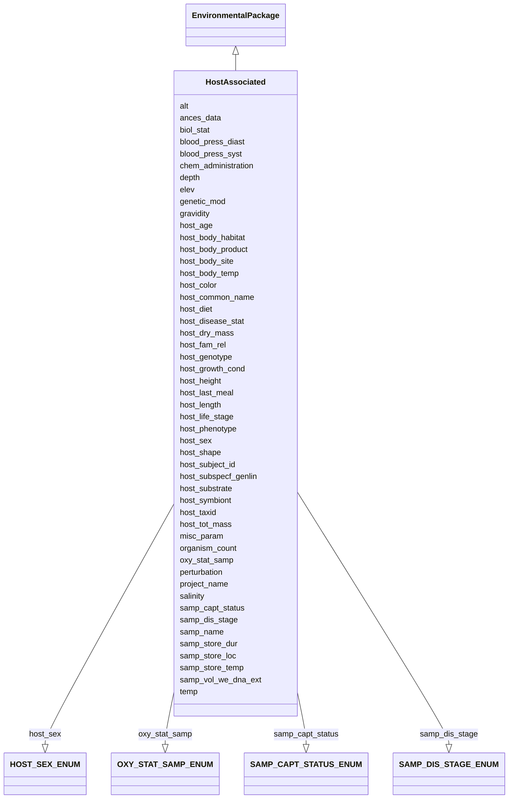

# Class: HostAssociated


URI: [mixs_6_2_proposal:HostAssociated](https://turbomam.github.io/mixs-envo-struct-knowl-extraction/HostAssociated)





## Inheritance
* [EnvironmentalPackage](EnvironmentalPackage.md)
    * **HostAssociated**


## Slots

| Name | Cardinality and Range | Description | Inheritance |
| ---  | --- | --- | --- |
| [samp_name](samp_name.md) | 1..1 <br/> [String](String.md) | A local identifier or name that for the material sample used for extracting n... | direct |
| [project_name](project_name.md) | 1..1 <br/> [String](String.md) | Name of the project within which the sequencing was organized | direct |
| [alt](alt.md) | 0..1 _recommended_ <br/> [String](String.md) | Heights of objects such as airplanes, space shuttles, rockets, atmospheric ba... | direct |
| [depth](depth.md) | 0..1 _recommended_ <br/> [String](String.md) | The vertical distance below local surface | direct |
| [elev](elev.md) | 0..1 _recommended_ <br/> [String](String.md) | Elevation of the sampling site is its height above a fixed reference point, m... | direct |
| [ances_data](ances_data.md) | 0..1 <br/> [String](String.md) | Information about either pedigree or other ancestral information description ... | direct |
| [biol_stat](biol_stat.md) | 0..1 <br/> [String](String.md) | The level of genome modification | direct |
| [genetic_mod](genetic_mod.md) | 0..1 <br/> [String](String.md) | Genetic modifications of the genome of an organism, which may occur naturally... | direct |
| [host_common_name](host_common_name.md) | 0..1 <br/> [String](String.md) | Common name of the host | direct |
| [samp_capt_status](samp_capt_status.md) | 0..1 <br/> [SAMPCAPTSTATUSENUM](SAMPCAPTSTATUSENUM.md) | Reason for the sample | direct |
| [samp_dis_stage](samp_dis_stage.md) | 0..1 <br/> [SAMPDISSTAGEENUM](SAMPDISSTAGEENUM.md) | Stage of the disease at the time of sample collection, e | direct |
| [host_taxid](host_taxid.md) | 0..1 <br/> [String](String.md) | NCBI taxon id of the host, e | direct |
| [host_subject_id](host_subject_id.md) | 0..1 <br/> [String](String.md) | A unique identifier by which each subject can be referred to, de-identified | direct |
| [host_age](host_age.md) | 0..1 <br/> [String](String.md) | Age of host at the time of sampling; relevant scale depends on species and st... | direct |
| [host_life_stage](host_life_stage.md) | 0..1 <br/> [String](String.md) | Description of life stage of host | direct |
| [host_sex](host_sex.md) | 0..1 <br/> [HOSTSEXENUM](HOSTSEXENUM.md) | Gender or physical sex of the host | direct |
| [host_disease_stat](host_disease_stat.md) | 0..* <br/> [String](String.md) | List of diseases with which the host has been diagnosed; can include multiple... | direct |
| [chem_administration](chem_administration.md) | 0..* <br/> [String](String.md) | List of chemical compounds administered to the host or site where sampling oc... | direct |
| [host_body_habitat](host_body_habitat.md) | 0..1 <br/> [String](String.md) | Original body habitat where the sample was obtained from | direct |
| [host_body_site](host_body_site.md) | 0..1 <br/> [String](String.md) | Name of body site where the sample was obtained from, such as a specific orga... | direct |
| [host_body_product](host_body_product.md) | 0..1 <br/> [String](String.md) | Substance produced by the body, e | direct |
| [host_tot_mass](host_tot_mass.md) | 0..1 <br/> [String](String.md) | Total mass of the host at collection, the unit depends on host | direct |
| [host_height](host_height.md) | 0..1 <br/> [String](String.md) | The height of subject | direct |
| [host_length](host_length.md) | 0..1 <br/> [String](String.md) | The length of subject | direct |
| [host_diet](host_diet.md) | 0..* <br/> [String](String.md) | Type of diet depending on the host, for animals omnivore, herbivore etc | direct |
| [host_last_meal](host_last_meal.md) | 0..* <br/> [String](String.md) | Content of last meal and time since feeding; can include multiple values | direct |
| [host_growth_cond](host_growth_cond.md) | 0..1 <br/> [String](String.md) | Literature reference giving growth conditions of the host | direct |
| [host_substrate](host_substrate.md) | 0..1 <br/> [String](String.md) | The growth substrate of the host | direct |
| [host_fam_rel](host_fam_rel.md) | 0..* <br/> [String](String.md) | Relationships to other hosts in the same study; can include multiple relation... | direct |
| [host_subspecf_genlin](host_subspecf_genlin.md) | 0..* <br/> [String](String.md) | Information about the genetic distinctness of the host organism below the sub... | direct |
| [host_genotype](host_genotype.md) | 0..1 <br/> [String](String.md) | Observed genotype | direct |
| [host_phenotype](host_phenotype.md) | 0..1 <br/> [String](String.md) | Phenotype of human or other host | direct |
| [host_body_temp](host_body_temp.md) | 0..1 <br/> [String](String.md) | Core body temperature of the host when sample was collected | direct |
| [host_dry_mass](host_dry_mass.md) | 0..1 <br/> [String](String.md) | Measurement of dry mass | direct |
| [blood_press_diast](blood_press_diast.md) | 0..1 <br/> [String](String.md) | Resting diastolic blood pressure, measured as mm mercury | direct |
| [blood_press_syst](blood_press_syst.md) | 0..1 <br/> [String](String.md) | Resting systolic blood pressure, measured as mm mercury | direct |
| [host_color](host_color.md) | 0..1 <br/> [String](String.md) | The color of host | direct |
| [host_shape](host_shape.md) | 0..1 <br/> [String](String.md) | Morphological shape of host | direct |
| [gravidity](gravidity.md) | 0..1 <br/> [String](String.md) | Whether or not subject is gravid, and if yes date due or date post-conception... | direct |
| [perturbation](perturbation.md) | 0..* <br/> [String](String.md) | Type of perturbation, e | direct |
| [salinity](salinity.md) | 0..1 <br/> [String](String.md) | The total concentration of all dissolved salts in a liquid or solid sample | direct |
| [oxy_stat_samp](oxy_stat_samp.md) | 0..1 <br/> [OXYSTATSAMPENUM](OXYSTATSAMPENUM.md) | Oxygenation status of sample | direct |
| [temp](temp.md) | 0..1 <br/> [String](String.md) | Temperature of the sample at the time of sampling | direct |
| [organism_count](organism_count.md) | 0..* <br/> [String](String.md) | Total cell count of any organism (or group of organisms) per gram, volume or ... | direct |
| [samp_vol_we_dna_ext](samp_vol_we_dna_ext.md) | 0..1 <br/> [String](String.md) | Volume (ml) or mass (g) of total collected sample processed for DNA extractio... | direct |
| [samp_store_temp](samp_store_temp.md) | 0..1 <br/> [String](String.md) | Temperature at which sample was stored, e | direct |
| [samp_store_dur](samp_store_dur.md) | 0..1 <br/> [String](String.md) | Duration for which the sample was stored | direct |
| [samp_store_loc](samp_store_loc.md) | 0..1 <br/> [String](String.md) | Location at which sample was stored, usually name of a specific freezer/room | direct |
| [host_symbiont](host_symbiont.md) | 0..* <br/> [String](String.md) | The taxonomic name of the organism(s) found living in mutualistic, commensali... | direct |
| [misc_param](misc_param.md) | 0..* <br/> [String](String.md) | Any other measurement performed or parameter collected, that is not listed he... | direct |


## Identifier and Mapping Information


### Schema Source


* from schema: https://turbomam.github.io/mixs-envo-struct-knowl-extraction//mixs_6_2_proposal


## Mappings

| Mapping Type | Mapped Value |
| ---  | ---  |
| self | mixs_6_2_proposal:HostAssociated |
| native | mixs_6_2_proposal:HostAssociated |


## LinkML Source

<!-- TODO: investigate https://stackoverflow.com/questions/37606292/how-to-create-tabbed-code-blocks-in-mkdocs-or-sphinx -->

### Direct

<details>
```yaml
name: HostAssociated
title: HostAssociated
from_schema: https://turbomam.github.io/mixs-envo-struct-knowl-extraction//mixs_6_2_proposal
is_a: EnvironmentalPackage
mixin: false
slots:
- samp_name
- project_name
- alt
- depth
- elev
- ances_data
- biol_stat
- genetic_mod
- host_common_name
- samp_capt_status
- samp_dis_stage
- host_taxid
- host_subject_id
- host_age
- host_life_stage
- host_sex
- host_disease_stat
- chem_administration
- host_body_habitat
- host_body_site
- host_body_product
- host_tot_mass
- host_height
- host_length
- host_diet
- host_last_meal
- host_growth_cond
- host_substrate
- host_fam_rel
- host_subspecf_genlin
- host_genotype
- host_phenotype
- host_body_temp
- host_dry_mass
- blood_press_diast
- blood_press_syst
- host_color
- host_shape
- gravidity
- perturbation
- salinity
- oxy_stat_samp
- temp
- organism_count
- samp_vol_we_dna_ext
- samp_store_temp
- samp_store_dur
- samp_store_loc
- host_symbiont
- misc_param
slot_usage:
  alt:
    name: alt
    domain_of:
    - Air
    - HostAssociated
    - MigsBa
    - MigsEu
    - MigsOrg
    - MigsPl
    - MigsVi
    - Mimag
    - MimarksC
    - MimarksS
    - Mims
    - Misag
    - MiscellaneousNaturalOrArtificialEnvironment
    - Miuvig
    - SymbiontAssociated
    recommended: true
  ances_data:
    name: ances_data
    domain_of:
    - Agriculture
    - FoodFarmEnvironment
    - HostAssociated
    - PlantAssociated
  chem_administration:
    name: chem_administration
    domain_of:
    - Agriculture
    - Air
    - FoodFarmEnvironment
    - HostAssociated
    - HumanAssociated
    - HumanGut
    - HumanOral
    - HumanSkin
    - HumanVaginal
    - MicrobialMatBiofilm
    - MiscellaneousNaturalOrArtificialEnvironment
    - PlantAssociated
    - Sediment
    - SymbiontAssociated
    - WastewaterSludge
    - Water
    required: false
    recommended: false
  depth:
    name: depth
    title: depth
    examples:
    - value: 10 meter
    domain_of:
    - Agriculture
    - FoodFarmEnvironment
    - HostAssociated
    - MicrobialMatBiofilm
    - MigsBa
    - MigsEu
    - MigsOrg
    - MigsPl
    - MigsVi
    - Mimag
    - MimarksC
    - MimarksS
    - Mims
    - Misag
    - MiscellaneousNaturalOrArtificialEnvironment
    - Miuvig
    - PlantAssociated
    - Sediment
    - Soil
    - SymbiontAssociated
    - WastewaterSludge
    - Water
    recommended: true
  elev:
    name: elev
    domain_of:
    - Agriculture
    - Air
    - HostAssociated
    - HydrocarbonResourcesCores
    - MicrobialMatBiofilm
    - MigsBa
    - MigsEu
    - MigsOrg
    - MigsPl
    - MigsVi
    - Mimag
    - MimarksC
    - MimarksS
    - Mims
    - Misag
    - MiscellaneousNaturalOrArtificialEnvironment
    - Miuvig
    - PlantAssociated
    - Sediment
    - Soil
    - SymbiontAssociated
    - Water
    recommended: true
  genetic_mod:
    name: genetic_mod
    string_serialization: '{PMID}|{DOI}|{URL}|{text}'
    multivalued: false
    domain_of:
    - Agriculture
    - FoodFarmEnvironment
    - FoodFoodProductionFacility
    - FoodHumanFoods
    - HostAssociated
    - PlantAssociated
  gravidity:
    name: gravidity
    domain_of:
    - HostAssociated
    - SymbiontAssociated
  host_age:
    name: host_age
    examples:
    - value: 10 days
    domain_of:
    - Agriculture
    - FoodFarmEnvironment
    - HostAssociated
    - HumanAssociated
    - HumanGut
    - HumanOral
    - HumanSkin
    - HumanVaginal
    - PlantAssociated
    - SymbiontAssociated
    required: false
    recommended: false
  host_body_habitat:
    name: host_body_habitat
    examples:
    - value: nasopharynx
    domain_of:
    - HostAssociated
    - SymbiontAssociated
  host_body_product:
    name: host_body_product
    slot_uri: MIXS:0000888
    domain_of:
    - HostAssociated
    - HumanAssociated
    - HumanGut
    - HumanOral
    - HumanSkin
    - HumanVaginal
    - SymbiontAssociated
  host_body_site:
    name: host_body_site
    examples:
    - value: gill [UBERON:0002535]
    domain_of:
    - HostAssociated
    - HumanAssociated
    - HumanGut
    - HumanOral
    - HumanSkin
    - HumanVaginal
    - SymbiontAssociated
  host_body_temp:
    name: host_body_temp
    examples:
    - value: 15 degree Celsius
    domain_of:
    - HostAssociated
    - HumanAssociated
    - HumanGut
    - HumanOral
    - HumanSkin
    - HumanVaginal
  host_color:
    name: host_color
    domain_of:
    - HostAssociated
    - SymbiontAssociated
  host_common_name:
    name: host_common_name
    examples:
    - value: human
    domain_of:
    - Agriculture
    - HostAssociated
    - PlantAssociated
    - SymbiontAssociated
    required: false
    recommended: false
  host_diet:
    name: host_diet
    examples:
    - value: herbivore
    domain_of:
    - HostAssociated
    - HumanAssociated
    - HumanGut
    - HumanOral
    - HumanSkin
    - HumanVaginal
  host_disease_stat:
    name: host_disease_stat
    description: List of diseases with which the host has been diagnosed; can include
      multiple diagnoses. The value of the field depends on host; for humans the terms
      should be chosen from the DO (Human Disease Ontology) at https://www.disease-ontology.org,
      non-human host diseases are free text
    examples:
    - value: rabies [DOID:11260]
    string_serialization: '{termLabel} [{termID}]|{text}'
    multivalued: true
    domain_of:
    - Agriculture
    - FoodFarmEnvironment
    - HostAssociated
    - HumanAssociated
    - HumanGut
    - HumanOral
    - HumanSkin
    - HumanVaginal
    - MigsBa
    - MigsEu
    - MigsVi
    - Miuvig
    - PlantAssociated
    required: false
    recommended: false
  host_dry_mass:
    name: host_dry_mass
    domain_of:
    - Agriculture
    - FoodFarmEnvironment
    - HostAssociated
    - PlantAssociated
    - SymbiontAssociated
  host_fam_rel:
    name: host_fam_rel
    examples:
    - value: offspring;Mussel25
    multivalued: true
    domain_of:
    - HostAssociated
    - HumanAssociated
    - HumanGut
    - HumanOral
    - HumanSkin
    - HumanVaginal
    - SymbiontAssociated
  host_genotype:
    name: host_genotype
    examples:
    - value: C57BL/6
    domain_of:
    - Agriculture
    - FoodFarmEnvironment
    - HostAssociated
    - HumanAssociated
    - HumanGut
    - HumanOral
    - HumanSkin
    - HumanVaginal
    - PlantAssociated
    - SymbiontAssociated
    required: false
    recommended: false
  host_growth_cond:
    name: host_growth_cond
    domain_of:
    - HostAssociated
    - SymbiontAssociated
  host_height:
    name: host_height
    examples:
    - value: 0.1 meter
    domain_of:
    - Agriculture
    - FoodFarmEnvironment
    - HostAssociated
    - HumanAssociated
    - HumanGut
    - HumanOral
    - HumanSkin
    - HumanVaginal
    - PlantAssociated
    - SymbiontAssociated
    required: false
    recommended: false
  host_last_meal:
    name: host_last_meal
    examples:
    - value: corn feed;P2H
    domain_of:
    - HostAssociated
    - HumanAssociated
    - HumanGut
    - HumanOral
    - HumanSkin
    - HumanVaginal
  host_length:
    name: host_length
    domain_of:
    - Agriculture
    - FoodFarmEnvironment
    - HostAssociated
    - PlantAssociated
    - SymbiontAssociated
    required: false
    recommended: false
  host_life_stage:
    name: host_life_stage
    examples:
    - value: adult
    domain_of:
    - Agriculture
    - HostAssociated
    - PlantAssociated
    - SymbiontAssociated
    required: false
    recommended: false
  host_phenotype:
    name: host_phenotype
    examples:
    - value: elongated [PATO:0001154]
    string_serialization: '{termLabel} [{termID}]'
    domain_of:
    - Agriculture
    - FoodFarmEnvironment
    - HostAssociated
    - HumanAssociated
    - HumanGut
    - HumanOral
    - HumanSkin
    - HumanVaginal
    - PlantAssociated
    - SymbiontAssociated
    required: false
    recommended: false
  host_sex:
    name: host_sex
    description: Gender or physical sex of the host.
    string_serialization: '[female|hermaphrodite|non-binary|male|transgender|transgender
      (female to male)|transgender (male to female)

      |undeclared]'
    slot_uri: MIXS:0000811
    domain_of:
    - HostAssociated
    - HumanAssociated
    - HumanGut
    - HumanOral
    - HumanSkin
    - HumanVaginal
    - SymbiontAssociated
  host_shape:
    name: host_shape
    domain_of:
    - HostAssociated
    - SymbiontAssociated
  host_subject_id:
    name: host_subject_id
    examples:
    - value: MPI123
    domain_of:
    - HostAssociated
    - HumanAssociated
    - HumanGut
    - HumanOral
    - HumanSkin
    - HumanVaginal
    - SymbiontAssociated
  host_substrate:
    name: host_substrate
    domain_of:
    - HostAssociated
    - SymbiontAssociated
  host_symbiont:
    name: host_symbiont
    description: The taxonomic name of the organism(s) found living in mutualistic,
      commensalistic, or parasitic symbiosis with the specific host.
    examples:
    - value: flukeworms
    slot_uri: MIXS:0001298
    multivalued: true
    domain_of:
    - Agriculture
    - HostAssociated
    - HumanAssociated
    - HumanGut
    - HumanOral
    - HumanSkin
    - HumanVaginal
    - PlantAssociated
    - SymbiontAssociated
  host_taxid:
    name: host_taxid
    description: NCBI taxon id of the host, e.g. 9606
    examples:
    - value: '7955'
    string_serialization: '{NCBI taxid}'
    domain_of:
    - Agriculture
    - FoodFarmEnvironment
    - HostAssociated
    - PlantAssociated
    - SymbiontAssociated
    required: false
    recommended: false
  host_tot_mass:
    name: host_tot_mass
    examples:
    - value: 2500 gram
    domain_of:
    - Agriculture
    - FoodFarmEnvironment
    - HostAssociated
    - HumanAssociated
    - HumanGut
    - HumanOral
    - HumanSkin
    - HumanVaginal
    - PlantAssociated
    - SymbiontAssociated
    required: false
    recommended: false
  misc_param:
    name: misc_param
    domain_of:
    - Agriculture
    - Air
    - FoodAnimalAndAnimalFeed
    - FoodFarmEnvironment
    - FoodFoodProductionFacility
    - FoodHumanFoods
    - HostAssociated
    - HumanAssociated
    - HumanGut
    - HumanOral
    - HumanSkin
    - HumanVaginal
    - HydrocarbonResourcesCores
    - HydrocarbonResourcesFluidsSwabs
    - MicrobialMatBiofilm
    - MiscellaneousNaturalOrArtificialEnvironment
    - PlantAssociated
    - Sediment
    - Soil
    - SymbiontAssociated
    - WastewaterSludge
    - Water
  organism_count:
    name: organism_count
    description: 'Total cell count of any organism (or group of organisms) per gram,
      volume or area of sample, should include name of organism followed by count.
      The method that was used for the enumeration (e.g. qPCR, atp, mpn, etc.) Should
      also be provided. (example: total prokaryotes; 3.5e7 cells per ml; qpcr)'
    examples:
    - value: total prokaryotes;3.5e7 cells per milliliter;qPCR
    string_serialization: '{text};{float} {unit};[qPCR|ATP|MPN|other]'
    multivalued: true
    domain_of:
    - Agriculture
    - Air
    - BuiltEnvironment
    - FoodAnimalAndAnimalFeed
    - FoodFarmEnvironment
    - FoodFoodProductionFacility
    - FoodHumanFoods
    - HostAssociated
    - HumanAssociated
    - HumanGut
    - HumanOral
    - HumanSkin
    - HumanVaginal
    - HydrocarbonResourcesCores
    - HydrocarbonResourcesFluidsSwabs
    - MicrobialMatBiofilm
    - MiscellaneousNaturalOrArtificialEnvironment
    - PlantAssociated
    - Sediment
    - SymbiontAssociated
    - WastewaterSludge
    - Water
    required: false
    recommended: false
  oxy_stat_samp:
    name: oxy_stat_samp
    domain_of:
    - Agriculture
    - Air
    - HostAssociated
    - HumanAssociated
    - HumanGut
    - HumanOral
    - HumanSkin
    - HumanVaginal
    - HydrocarbonResourcesCores
    - HydrocarbonResourcesFluidsSwabs
    - MicrobialMatBiofilm
    - MiscellaneousNaturalOrArtificialEnvironment
    - PlantAssociated
    - Sediment
    - SymbiontAssociated
    - WastewaterSludge
    - Water
    required: false
    recommended: false
  perturbation:
    name: perturbation
    string_serialization: '{text};{Rn/start_time/end_time/duration}'
    domain_of:
    - Agriculture
    - Air
    - FoodAnimalAndAnimalFeed
    - FoodFarmEnvironment
    - FoodHumanFoods
    - HostAssociated
    - HumanAssociated
    - HumanGut
    - HumanOral
    - HumanSkin
    - HumanVaginal
    - MicrobialMatBiofilm
    - MiscellaneousNaturalOrArtificialEnvironment
    - PlantAssociated
    - Sediment
    - SymbiontAssociated
    - WastewaterSludge
    - Water
    required: false
    recommended: false
  salinity:
    name: salinity
    multivalued: false
    domain_of:
    - Air
    - FoodFarmEnvironment
    - HostAssociated
    - HumanAssociated
    - HumanGut
    - HumanOral
    - HumanSkin
    - HumanVaginal
    - HydrocarbonResourcesCores
    - HydrocarbonResourcesFluidsSwabs
    - MicrobialMatBiofilm
    - MiscellaneousNaturalOrArtificialEnvironment
    - PlantAssociated
    - Sediment
    - SymbiontAssociated
    - WastewaterSludge
    - Water
  samp_store_dur:
    name: samp_store_dur
    description: Duration for which the sample was stored
    string_serialization: '{duration}'
    domain_of:
    - Agriculture
    - Air
    - FoodAnimalAndAnimalFeed
    - FoodFarmEnvironment
    - FoodFoodProductionFacility
    - FoodHumanFoods
    - HostAssociated
    - HumanAssociated
    - HumanGut
    - HumanOral
    - HumanSkin
    - HumanVaginal
    - HydrocarbonResourcesCores
    - HydrocarbonResourcesFluidsSwabs
    - MicrobialMatBiofilm
    - MiscellaneousNaturalOrArtificialEnvironment
    - PlantAssociated
    - Sediment
    - SymbiontAssociated
    - WastewaterSludge
    - Water
    required: false
    recommended: false
  samp_store_loc:
    name: samp_store_loc
    description: Location at which sample was stored, usually name of a specific freezer/room
    examples:
    - value: Freezer no:5
    domain_of:
    - Agriculture
    - Air
    - FoodAnimalAndAnimalFeed
    - FoodFoodProductionFacility
    - FoodHumanFoods
    - HostAssociated
    - HumanAssociated
    - HumanGut
    - HumanOral
    - HumanSkin
    - HumanVaginal
    - HydrocarbonResourcesCores
    - HydrocarbonResourcesFluidsSwabs
    - MicrobialMatBiofilm
    - MiscellaneousNaturalOrArtificialEnvironment
    - PlantAssociated
    - Sediment
    - SymbiontAssociated
    - WastewaterSludge
    - Water
    required: false
    recommended: false
  samp_vol_we_dna_ext:
    name: samp_vol_we_dna_ext
    description: 'Volume (ml) or mass (g) of total collected sample processed for
      DNA extraction. Note: total sample collected should be entered under the term
      Sample Size (MIXS:0000001).'
    domain_of:
    - Agriculture
    - Air
    - FoodAnimalAndAnimalFeed
    - FoodFarmEnvironment
    - FoodFoodProductionFacility
    - FoodHumanFoods
    - HostAssociated
    - HumanAssociated
    - HumanGut
    - HumanOral
    - HumanSkin
    - HumanVaginal
    - HydrocarbonResourcesCores
    - HydrocarbonResourcesFluidsSwabs
    - MicrobialMatBiofilm
    - MigsBa
    - MigsEu
    - MigsOrg
    - MigsPl
    - MigsVi
    - Mimag
    - MimarksC
    - MimarksS
    - Mims
    - Misag
    - MiscellaneousNaturalOrArtificialEnvironment
    - Miuvig
    - PlantAssociated
    - Sediment
    - Soil
    - SymbiontAssociated
    - WastewaterSludge
    - Water
    required: false
    recommended: false
  temp:
    name: temp
    domain_of:
    - Agriculture
    - Air
    - FoodAnimalAndAnimalFeed
    - FoodFarmEnvironment
    - FoodHumanFoods
    - HostAssociated
    - HumanAssociated
    - HumanGut
    - HumanOral
    - HumanSkin
    - HumanVaginal
    - HydrocarbonResourcesCores
    - HydrocarbonResourcesFluidsSwabs
    - MicrobialMatBiofilm
    - MigsBa
    - MigsEu
    - MigsOrg
    - MigsPl
    - MigsVi
    - Mimag
    - MimarksC
    - MimarksS
    - Mims
    - Misag
    - MiscellaneousNaturalOrArtificialEnvironment
    - Miuvig
    - PlantAssociated
    - Sediment
    - Soil
    - SymbiontAssociated
    - WastewaterSludge
    - Water
    required: false
    recommended: false

```
</details>

### Induced

<details>
```yaml
name: HostAssociated
title: HostAssociated
from_schema: https://turbomam.github.io/mixs-envo-struct-knowl-extraction//mixs_6_2_proposal
is_a: EnvironmentalPackage
mixin: false
slot_usage:
  alt:
    name: alt
    domain_of:
    - Air
    - HostAssociated
    - MigsBa
    - MigsEu
    - MigsOrg
    - MigsPl
    - MigsVi
    - Mimag
    - MimarksC
    - MimarksS
    - Mims
    - Misag
    - MiscellaneousNaturalOrArtificialEnvironment
    - Miuvig
    - SymbiontAssociated
    recommended: true
  ances_data:
    name: ances_data
    domain_of:
    - Agriculture
    - FoodFarmEnvironment
    - HostAssociated
    - PlantAssociated
  chem_administration:
    name: chem_administration
    domain_of:
    - Agriculture
    - Air
    - FoodFarmEnvironment
    - HostAssociated
    - HumanAssociated
    - HumanGut
    - HumanOral
    - HumanSkin
    - HumanVaginal
    - MicrobialMatBiofilm
    - MiscellaneousNaturalOrArtificialEnvironment
    - PlantAssociated
    - Sediment
    - SymbiontAssociated
    - WastewaterSludge
    - Water
    required: false
    recommended: false
  depth:
    name: depth
    title: depth
    examples:
    - value: 10 meter
    domain_of:
    - Agriculture
    - FoodFarmEnvironment
    - HostAssociated
    - MicrobialMatBiofilm
    - MigsBa
    - MigsEu
    - MigsOrg
    - MigsPl
    - MigsVi
    - Mimag
    - MimarksC
    - MimarksS
    - Mims
    - Misag
    - MiscellaneousNaturalOrArtificialEnvironment
    - Miuvig
    - PlantAssociated
    - Sediment
    - Soil
    - SymbiontAssociated
    - WastewaterSludge
    - Water
    recommended: true
  elev:
    name: elev
    domain_of:
    - Agriculture
    - Air
    - HostAssociated
    - HydrocarbonResourcesCores
    - MicrobialMatBiofilm
    - MigsBa
    - MigsEu
    - MigsOrg
    - MigsPl
    - MigsVi
    - Mimag
    - MimarksC
    - MimarksS
    - Mims
    - Misag
    - MiscellaneousNaturalOrArtificialEnvironment
    - Miuvig
    - PlantAssociated
    - Sediment
    - Soil
    - SymbiontAssociated
    - Water
    recommended: true
  genetic_mod:
    name: genetic_mod
    string_serialization: '{PMID}|{DOI}|{URL}|{text}'
    multivalued: false
    domain_of:
    - Agriculture
    - FoodFarmEnvironment
    - FoodFoodProductionFacility
    - FoodHumanFoods
    - HostAssociated
    - PlantAssociated
  gravidity:
    name: gravidity
    domain_of:
    - HostAssociated
    - SymbiontAssociated
  host_age:
    name: host_age
    examples:
    - value: 10 days
    domain_of:
    - Agriculture
    - FoodFarmEnvironment
    - HostAssociated
    - HumanAssociated
    - HumanGut
    - HumanOral
    - HumanSkin
    - HumanVaginal
    - PlantAssociated
    - SymbiontAssociated
    required: false
    recommended: false
  host_body_habitat:
    name: host_body_habitat
    examples:
    - value: nasopharynx
    domain_of:
    - HostAssociated
    - SymbiontAssociated
  host_body_product:
    name: host_body_product
    slot_uri: MIXS:0000888
    domain_of:
    - HostAssociated
    - HumanAssociated
    - HumanGut
    - HumanOral
    - HumanSkin
    - HumanVaginal
    - SymbiontAssociated
  host_body_site:
    name: host_body_site
    examples:
    - value: gill [UBERON:0002535]
    domain_of:
    - HostAssociated
    - HumanAssociated
    - HumanGut
    - HumanOral
    - HumanSkin
    - HumanVaginal
    - SymbiontAssociated
  host_body_temp:
    name: host_body_temp
    examples:
    - value: 15 degree Celsius
    domain_of:
    - HostAssociated
    - HumanAssociated
    - HumanGut
    - HumanOral
    - HumanSkin
    - HumanVaginal
  host_color:
    name: host_color
    domain_of:
    - HostAssociated
    - SymbiontAssociated
  host_common_name:
    name: host_common_name
    examples:
    - value: human
    domain_of:
    - Agriculture
    - HostAssociated
    - PlantAssociated
    - SymbiontAssociated
    required: false
    recommended: false
  host_diet:
    name: host_diet
    examples:
    - value: herbivore
    domain_of:
    - HostAssociated
    - HumanAssociated
    - HumanGut
    - HumanOral
    - HumanSkin
    - HumanVaginal
  host_disease_stat:
    name: host_disease_stat
    description: List of diseases with which the host has been diagnosed; can include
      multiple diagnoses. The value of the field depends on host; for humans the terms
      should be chosen from the DO (Human Disease Ontology) at https://www.disease-ontology.org,
      non-human host diseases are free text
    examples:
    - value: rabies [DOID:11260]
    string_serialization: '{termLabel} [{termID}]|{text}'
    multivalued: true
    domain_of:
    - Agriculture
    - FoodFarmEnvironment
    - HostAssociated
    - HumanAssociated
    - HumanGut
    - HumanOral
    - HumanSkin
    - HumanVaginal
    - MigsBa
    - MigsEu
    - MigsVi
    - Miuvig
    - PlantAssociated
    required: false
    recommended: false
  host_dry_mass:
    name: host_dry_mass
    domain_of:
    - Agriculture
    - FoodFarmEnvironment
    - HostAssociated
    - PlantAssociated
    - SymbiontAssociated
  host_fam_rel:
    name: host_fam_rel
    examples:
    - value: offspring;Mussel25
    multivalued: true
    domain_of:
    - HostAssociated
    - HumanAssociated
    - HumanGut
    - HumanOral
    - HumanSkin
    - HumanVaginal
    - SymbiontAssociated
  host_genotype:
    name: host_genotype
    examples:
    - value: C57BL/6
    domain_of:
    - Agriculture
    - FoodFarmEnvironment
    - HostAssociated
    - HumanAssociated
    - HumanGut
    - HumanOral
    - HumanSkin
    - HumanVaginal
    - PlantAssociated
    - SymbiontAssociated
    required: false
    recommended: false
  host_growth_cond:
    name: host_growth_cond
    domain_of:
    - HostAssociated
    - SymbiontAssociated
  host_height:
    name: host_height
    examples:
    - value: 0.1 meter
    domain_of:
    - Agriculture
    - FoodFarmEnvironment
    - HostAssociated
    - HumanAssociated
    - HumanGut
    - HumanOral
    - HumanSkin
    - HumanVaginal
    - PlantAssociated
    - SymbiontAssociated
    required: false
    recommended: false
  host_last_meal:
    name: host_last_meal
    examples:
    - value: corn feed;P2H
    domain_of:
    - HostAssociated
    - HumanAssociated
    - HumanGut
    - HumanOral
    - HumanSkin
    - HumanVaginal
  host_length:
    name: host_length
    domain_of:
    - Agriculture
    - FoodFarmEnvironment
    - HostAssociated
    - PlantAssociated
    - SymbiontAssociated
    required: false
    recommended: false
  host_life_stage:
    name: host_life_stage
    examples:
    - value: adult
    domain_of:
    - Agriculture
    - HostAssociated
    - PlantAssociated
    - SymbiontAssociated
    required: false
    recommended: false
  host_phenotype:
    name: host_phenotype
    examples:
    - value: elongated [PATO:0001154]
    string_serialization: '{termLabel} [{termID}]'
    domain_of:
    - Agriculture
    - FoodFarmEnvironment
    - HostAssociated
    - HumanAssociated
    - HumanGut
    - HumanOral
    - HumanSkin
    - HumanVaginal
    - PlantAssociated
    - SymbiontAssociated
    required: false
    recommended: false
  host_sex:
    name: host_sex
    description: Gender or physical sex of the host.
    string_serialization: '[female|hermaphrodite|non-binary|male|transgender|transgender
      (female to male)|transgender (male to female)

      |undeclared]'
    slot_uri: MIXS:0000811
    domain_of:
    - HostAssociated
    - HumanAssociated
    - HumanGut
    - HumanOral
    - HumanSkin
    - HumanVaginal
    - SymbiontAssociated
  host_shape:
    name: host_shape
    domain_of:
    - HostAssociated
    - SymbiontAssociated
  host_subject_id:
    name: host_subject_id
    examples:
    - value: MPI123
    domain_of:
    - HostAssociated
    - HumanAssociated
    - HumanGut
    - HumanOral
    - HumanSkin
    - HumanVaginal
    - SymbiontAssociated
  host_substrate:
    name: host_substrate
    domain_of:
    - HostAssociated
    - SymbiontAssociated
  host_symbiont:
    name: host_symbiont
    description: The taxonomic name of the organism(s) found living in mutualistic,
      commensalistic, or parasitic symbiosis with the specific host.
    examples:
    - value: flukeworms
    slot_uri: MIXS:0001298
    multivalued: true
    domain_of:
    - Agriculture
    - HostAssociated
    - HumanAssociated
    - HumanGut
    - HumanOral
    - HumanSkin
    - HumanVaginal
    - PlantAssociated
    - SymbiontAssociated
  host_taxid:
    name: host_taxid
    description: NCBI taxon id of the host, e.g. 9606
    examples:
    - value: '7955'
    string_serialization: '{NCBI taxid}'
    domain_of:
    - Agriculture
    - FoodFarmEnvironment
    - HostAssociated
    - PlantAssociated
    - SymbiontAssociated
    required: false
    recommended: false
  host_tot_mass:
    name: host_tot_mass
    examples:
    - value: 2500 gram
    domain_of:
    - Agriculture
    - FoodFarmEnvironment
    - HostAssociated
    - HumanAssociated
    - HumanGut
    - HumanOral
    - HumanSkin
    - HumanVaginal
    - PlantAssociated
    - SymbiontAssociated
    required: false
    recommended: false
  misc_param:
    name: misc_param
    domain_of:
    - Agriculture
    - Air
    - FoodAnimalAndAnimalFeed
    - FoodFarmEnvironment
    - FoodFoodProductionFacility
    - FoodHumanFoods
    - HostAssociated
    - HumanAssociated
    - HumanGut
    - HumanOral
    - HumanSkin
    - HumanVaginal
    - HydrocarbonResourcesCores
    - HydrocarbonResourcesFluidsSwabs
    - MicrobialMatBiofilm
    - MiscellaneousNaturalOrArtificialEnvironment
    - PlantAssociated
    - Sediment
    - Soil
    - SymbiontAssociated
    - WastewaterSludge
    - Water
  organism_count:
    name: organism_count
    description: 'Total cell count of any organism (or group of organisms) per gram,
      volume or area of sample, should include name of organism followed by count.
      The method that was used for the enumeration (e.g. qPCR, atp, mpn, etc.) Should
      also be provided. (example: total prokaryotes; 3.5e7 cells per ml; qpcr)'
    examples:
    - value: total prokaryotes;3.5e7 cells per milliliter;qPCR
    string_serialization: '{text};{float} {unit};[qPCR|ATP|MPN|other]'
    multivalued: true
    domain_of:
    - Agriculture
    - Air
    - BuiltEnvironment
    - FoodAnimalAndAnimalFeed
    - FoodFarmEnvironment
    - FoodFoodProductionFacility
    - FoodHumanFoods
    - HostAssociated
    - HumanAssociated
    - HumanGut
    - HumanOral
    - HumanSkin
    - HumanVaginal
    - HydrocarbonResourcesCores
    - HydrocarbonResourcesFluidsSwabs
    - MicrobialMatBiofilm
    - MiscellaneousNaturalOrArtificialEnvironment
    - PlantAssociated
    - Sediment
    - SymbiontAssociated
    - WastewaterSludge
    - Water
    required: false
    recommended: false
  oxy_stat_samp:
    name: oxy_stat_samp
    domain_of:
    - Agriculture
    - Air
    - HostAssociated
    - HumanAssociated
    - HumanGut
    - HumanOral
    - HumanSkin
    - HumanVaginal
    - HydrocarbonResourcesCores
    - HydrocarbonResourcesFluidsSwabs
    - MicrobialMatBiofilm
    - MiscellaneousNaturalOrArtificialEnvironment
    - PlantAssociated
    - Sediment
    - SymbiontAssociated
    - WastewaterSludge
    - Water
    required: false
    recommended: false
  perturbation:
    name: perturbation
    string_serialization: '{text};{Rn/start_time/end_time/duration}'
    domain_of:
    - Agriculture
    - Air
    - FoodAnimalAndAnimalFeed
    - FoodFarmEnvironment
    - FoodHumanFoods
    - HostAssociated
    - HumanAssociated
    - HumanGut
    - HumanOral
    - HumanSkin
    - HumanVaginal
    - MicrobialMatBiofilm
    - MiscellaneousNaturalOrArtificialEnvironment
    - PlantAssociated
    - Sediment
    - SymbiontAssociated
    - WastewaterSludge
    - Water
    required: false
    recommended: false
  salinity:
    name: salinity
    multivalued: false
    domain_of:
    - Air
    - FoodFarmEnvironment
    - HostAssociated
    - HumanAssociated
    - HumanGut
    - HumanOral
    - HumanSkin
    - HumanVaginal
    - HydrocarbonResourcesCores
    - HydrocarbonResourcesFluidsSwabs
    - MicrobialMatBiofilm
    - MiscellaneousNaturalOrArtificialEnvironment
    - PlantAssociated
    - Sediment
    - SymbiontAssociated
    - WastewaterSludge
    - Water
  samp_store_dur:
    name: samp_store_dur
    description: Duration for which the sample was stored
    string_serialization: '{duration}'
    domain_of:
    - Agriculture
    - Air
    - FoodAnimalAndAnimalFeed
    - FoodFarmEnvironment
    - FoodFoodProductionFacility
    - FoodHumanFoods
    - HostAssociated
    - HumanAssociated
    - HumanGut
    - HumanOral
    - HumanSkin
    - HumanVaginal
    - HydrocarbonResourcesCores
    - HydrocarbonResourcesFluidsSwabs
    - MicrobialMatBiofilm
    - MiscellaneousNaturalOrArtificialEnvironment
    - PlantAssociated
    - Sediment
    - SymbiontAssociated
    - WastewaterSludge
    - Water
    required: false
    recommended: false
  samp_store_loc:
    name: samp_store_loc
    description: Location at which sample was stored, usually name of a specific freezer/room
    examples:
    - value: Freezer no:5
    domain_of:
    - Agriculture
    - Air
    - FoodAnimalAndAnimalFeed
    - FoodFoodProductionFacility
    - FoodHumanFoods
    - HostAssociated
    - HumanAssociated
    - HumanGut
    - HumanOral
    - HumanSkin
    - HumanVaginal
    - HydrocarbonResourcesCores
    - HydrocarbonResourcesFluidsSwabs
    - MicrobialMatBiofilm
    - MiscellaneousNaturalOrArtificialEnvironment
    - PlantAssociated
    - Sediment
    - SymbiontAssociated
    - WastewaterSludge
    - Water
    required: false
    recommended: false
  samp_vol_we_dna_ext:
    name: samp_vol_we_dna_ext
    description: 'Volume (ml) or mass (g) of total collected sample processed for
      DNA extraction. Note: total sample collected should be entered under the term
      Sample Size (MIXS:0000001).'
    domain_of:
    - Agriculture
    - Air
    - FoodAnimalAndAnimalFeed
    - FoodFarmEnvironment
    - FoodFoodProductionFacility
    - FoodHumanFoods
    - HostAssociated
    - HumanAssociated
    - HumanGut
    - HumanOral
    - HumanSkin
    - HumanVaginal
    - HydrocarbonResourcesCores
    - HydrocarbonResourcesFluidsSwabs
    - MicrobialMatBiofilm
    - MigsBa
    - MigsEu
    - MigsOrg
    - MigsPl
    - MigsVi
    - Mimag
    - MimarksC
    - MimarksS
    - Mims
    - Misag
    - MiscellaneousNaturalOrArtificialEnvironment
    - Miuvig
    - PlantAssociated
    - Sediment
    - Soil
    - SymbiontAssociated
    - WastewaterSludge
    - Water
    required: false
    recommended: false
  temp:
    name: temp
    domain_of:
    - Agriculture
    - Air
    - FoodAnimalAndAnimalFeed
    - FoodFarmEnvironment
    - FoodHumanFoods
    - HostAssociated
    - HumanAssociated
    - HumanGut
    - HumanOral
    - HumanSkin
    - HumanVaginal
    - HydrocarbonResourcesCores
    - HydrocarbonResourcesFluidsSwabs
    - MicrobialMatBiofilm
    - MigsBa
    - MigsEu
    - MigsOrg
    - MigsPl
    - MigsVi
    - Mimag
    - MimarksC
    - MimarksS
    - Mims
    - Misag
    - MiscellaneousNaturalOrArtificialEnvironment
    - Miuvig
    - PlantAssociated
    - Sediment
    - Soil
    - SymbiontAssociated
    - WastewaterSludge
    - Water
    required: false
    recommended: false
attributes:
  samp_name:
    name: samp_name
    description: A local identifier or name that for the material sample used for
      extracting nucleic acids, and subsequent sequencing. It can refer either to
      the original material collected or to any derived sub-samples. It can have any
      format, but we suggest that you make it concise, unique and consistent within
      your lab, and as informative as possible. INSDC requires every sample name from
      a single Submitter to be unique. Use of a globally unique identifier for the
      field source_mat_id is recommended in addition to sample_name
    title: sample name
    notes:
    - sample
    examples:
    - value: ISDsoil1
    in_subset:
    - investigation
    from_schema: https://turbomam.github.io/mixs-envo-struct-knowl-extraction//mixs_6_2_proposal
    rank: 1000
    slot_uri: MIXS:0001107
    multivalued: false
    alias: samp_name
    owner: HostAssociated
    domain_of:
    - Air
    - BuiltEnvironment
    - FoodAnimalAndAnimalFeed
    - FoodFarmEnvironment
    - FoodFoodProductionFacility
    - FoodHumanFoods
    - HostAssociated
    - HumanAssociated
    - HumanGut
    - HumanOral
    - HumanSkin
    - HumanVaginal
    - HydrocarbonResourcesCores
    - HydrocarbonResourcesFluidsSwabs
    - MicrobialMatBiofilm
    - MigsBa
    - MigsEu
    - MigsOrg
    - MigsPl
    - MigsVi
    - Mimag
    - MimarksC
    - MimarksS
    - Mims
    - Misag
    - MiscellaneousNaturalOrArtificialEnvironment
    - Miuvig
    - PlantAssociated
    - Sediment
    - Soil
    - SymbiontAssociated
    - WastewaterSludge
    - Water
    range: string
    required: true
  project_name:
    name: project_name
    description: Name of the project within which the sequencing was organized
    title: project name
    notes:
    - project
    examples:
    - value: Forest soil metagenome
    in_subset:
    - investigation
    from_schema: https://turbomam.github.io/mixs-envo-struct-knowl-extraction//mixs_6_2_proposal
    rank: 1000
    slot_uri: MIXS:0000092
    multivalued: false
    alias: project_name
    owner: HostAssociated
    domain_of:
    - Air
    - BuiltEnvironment
    - FoodAnimalAndAnimalFeed
    - FoodFarmEnvironment
    - FoodFoodProductionFacility
    - FoodHumanFoods
    - HostAssociated
    - HumanAssociated
    - HumanGut
    - HumanOral
    - HumanSkin
    - HumanVaginal
    - HydrocarbonResourcesCores
    - HydrocarbonResourcesFluidsSwabs
    - MicrobialMatBiofilm
    - MigsBa
    - MigsEu
    - MigsOrg
    - MigsPl
    - MigsVi
    - Mimag
    - MimarksC
    - MimarksS
    - Mims
    - Misag
    - MiscellaneousNaturalOrArtificialEnvironment
    - Miuvig
    - PlantAssociated
    - Sediment
    - Soil
    - SymbiontAssociated
    - WastewaterSludge
    - Water
    range: string
    required: true
  alt:
    name: alt
    description: Heights of objects such as airplanes, space shuttles, rockets, atmospheric
      balloons and heights of places such as atmospheric layers and clouds. Used to
      measure the height of an object which is above the earth's surface. In this
      context, the altitude measurement is the vertical distance between the earth's
      surface above sea level and the sampled position in the air
    title: altitude
    from_schema: https://turbomam.github.io/mixs-envo-struct-knowl-extraction//mixs_6_2_proposal
    rank: 1000
    slot_uri: MIXS:0000094
    multivalued: false
    alias: alt
    owner: HostAssociated
    domain_of:
    - Air
    - HostAssociated
    - MigsBa
    - MigsEu
    - MigsOrg
    - MigsPl
    - MigsVi
    - Mimag
    - MimarksC
    - MimarksS
    - Mims
    - Misag
    - MiscellaneousNaturalOrArtificialEnvironment
    - Miuvig
    - SymbiontAssociated
    range: string
    recommended: true
    pattern: ^[-+]?[0-9]*\.?[0-9]+([eE][-+]?[0-9]+)? \S.*\S$
  depth:
    name: depth
    description: The vertical distance below local surface. For sediment or soil samples
      depth is measured from sediment or soil surface, respectively. Depth can be
      reported as an interval for subsurface samples
    title: depth
    examples:
    - value: 10 meter
    from_schema: https://turbomam.github.io/mixs-envo-struct-knowl-extraction//mixs_6_2_proposal
    rank: 1000
    slot_uri: MIXS:0000018
    multivalued: false
    alias: depth
    owner: HostAssociated
    domain_of:
    - Agriculture
    - FoodFarmEnvironment
    - HostAssociated
    - MicrobialMatBiofilm
    - MigsBa
    - MigsEu
    - MigsOrg
    - MigsPl
    - MigsVi
    - Mimag
    - MimarksC
    - MimarksS
    - Mims
    - Misag
    - MiscellaneousNaturalOrArtificialEnvironment
    - Miuvig
    - PlantAssociated
    - Sediment
    - Soil
    - SymbiontAssociated
    - WastewaterSludge
    - Water
    range: string
    recommended: true
    pattern: ^[-+]?[0-9]*\.?[0-9]+([eE][-+]?[0-9]+)? \S.*\S$
  elev:
    name: elev
    description: Elevation of the sampling site is its height above a fixed reference
      point, most commonly the mean sea level. Elevation is mainly used when referring
      to points on the earth's surface, while altitude is used for points above the
      surface, such as an aircraft in flight or a spacecraft in orbit
    title: elevation
    from_schema: https://turbomam.github.io/mixs-envo-struct-knowl-extraction//mixs_6_2_proposal
    rank: 1000
    slot_uri: MIXS:0000093
    multivalued: false
    alias: elev
    owner: HostAssociated
    domain_of:
    - Agriculture
    - Air
    - HostAssociated
    - HydrocarbonResourcesCores
    - MicrobialMatBiofilm
    - MigsBa
    - MigsEu
    - MigsOrg
    - MigsPl
    - MigsVi
    - Mimag
    - MimarksC
    - MimarksS
    - Mims
    - Misag
    - MiscellaneousNaturalOrArtificialEnvironment
    - Miuvig
    - PlantAssociated
    - Sediment
    - Soil
    - SymbiontAssociated
    - Water
    range: string
    recommended: true
    pattern: ^[-+]?[0-9]*\.?[0-9]+([eE][-+]?[0-9]+)? \S.*\S$
  ances_data:
    name: ances_data
    description: Information about either pedigree or other ancestral information
      description (e.g. parental variety in case of mutant or selection), e.g. A/3*B
      (meaning [(A x B) x B] x B)
    title: ancestral data
    from_schema: https://turbomam.github.io/mixs-envo-struct-knowl-extraction//mixs_6_2_proposal
    rank: 1000
    slot_uri: MIXS:0000247
    multivalued: false
    alias: ances_data
    owner: HostAssociated
    domain_of:
    - Agriculture
    - FoodFarmEnvironment
    - HostAssociated
    - PlantAssociated
    range: string
    required: false
    recommended: false
  biol_stat:
    name: biol_stat
    annotations:
      Expected_value:
        tag: Expected_value
        value: enumeration
    description: The level of genome modification
    title: biological status
    notes:
    - status
    examples:
    - value: natural
    from_schema: https://turbomam.github.io/mixs-envo-struct-knowl-extraction//mixs_6_2_proposal
    rank: 1000
    string_serialization: '[wild|natural|semi-natural|inbred line|breeder''s line|hybrid|clonal
      selection|mutant]'
    slot_uri: MIXS:0000858
    multivalued: false
    alias: biol_stat
    owner: HostAssociated
    domain_of:
    - HostAssociated
    - PlantAssociated
    range: string
    required: false
    recommended: false
  genetic_mod:
    name: genetic_mod
    description: Genetic modifications of the genome of an organism, which may occur
      naturally by spontaneous mutation, or be introduced by some experimental means,
      e.g. specification of a transgene or the gene knocked-out or details of transient
      transfection
    title: genetic modification
    from_schema: https://turbomam.github.io/mixs-envo-struct-knowl-extraction//mixs_6_2_proposal
    rank: 1000
    string_serialization: '{PMID}|{DOI}|{URL}|{text}'
    slot_uri: MIXS:0000859
    multivalued: false
    alias: genetic_mod
    owner: HostAssociated
    domain_of:
    - Agriculture
    - FoodFarmEnvironment
    - FoodFoodProductionFacility
    - FoodHumanFoods
    - HostAssociated
    - PlantAssociated
    range: string
    required: false
    recommended: false
  host_common_name:
    name: host_common_name
    description: Common name of the host
    title: host common name
    examples:
    - value: human
    from_schema: https://turbomam.github.io/mixs-envo-struct-knowl-extraction//mixs_6_2_proposal
    rank: 1000
    slot_uri: MIXS:0000248
    multivalued: false
    alias: host_common_name
    owner: HostAssociated
    domain_of:
    - Agriculture
    - HostAssociated
    - PlantAssociated
    - SymbiontAssociated
    range: string
    required: false
    recommended: false
  samp_capt_status:
    name: samp_capt_status
    description: Reason for the sample
    title: sample capture status
    notes:
    - sample
    - status
    examples:
    - value: farm sample
    from_schema: https://turbomam.github.io/mixs-envo-struct-knowl-extraction//mixs_6_2_proposal
    rank: 1000
    slot_uri: MIXS:0000860
    multivalued: false
    alias: samp_capt_status
    owner: HostAssociated
    domain_of:
    - HostAssociated
    - PlantAssociated
    range: SAMP_CAPT_STATUS_ENUM
    required: false
    recommended: false
  samp_dis_stage:
    name: samp_dis_stage
    description: Stage of the disease at the time of sample collection, e.g. inoculation,
      penetration, infection, growth and reproduction, dissemination of pathogen
    title: sample disease stage
    notes:
    - disease
    - sample
    examples:
    - value: infection
    from_schema: https://turbomam.github.io/mixs-envo-struct-knowl-extraction//mixs_6_2_proposal
    rank: 1000
    slot_uri: MIXS:0000249
    multivalued: false
    alias: samp_dis_stage
    owner: HostAssociated
    domain_of:
    - HostAssociated
    - PlantAssociated
    range: SAMP_DIS_STAGE_ENUM
    required: false
    recommended: false
  host_taxid:
    name: host_taxid
    description: NCBI taxon id of the host, e.g. 9606
    title: host taxid
    examples:
    - value: '7955'
    from_schema: https://turbomam.github.io/mixs-envo-struct-knowl-extraction//mixs_6_2_proposal
    rank: 1000
    string_serialization: '{NCBI taxid}'
    slot_uri: MIXS:0000250
    multivalued: false
    alias: host_taxid
    owner: HostAssociated
    domain_of:
    - Agriculture
    - FoodFarmEnvironment
    - HostAssociated
    - PlantAssociated
    - SymbiontAssociated
    range: string
    required: false
    recommended: false
  host_subject_id:
    name: host_subject_id
    description: A unique identifier by which each subject can be referred to, de-identified
    title: host subject id
    examples:
    - value: MPI123
    from_schema: https://turbomam.github.io/mixs-envo-struct-knowl-extraction//mixs_6_2_proposal
    rank: 1000
    slot_uri: MIXS:0000861
    multivalued: false
    alias: host_subject_id
    owner: HostAssociated
    domain_of:
    - HostAssociated
    - HumanAssociated
    - HumanGut
    - HumanOral
    - HumanSkin
    - HumanVaginal
    - SymbiontAssociated
    range: string
    required: false
    recommended: false
  host_age:
    name: host_age
    description: Age of host at the time of sampling; relevant scale depends on species
      and study, e.g. Could be seconds for amoebae or centuries for trees
    title: host age
    examples:
    - value: 10 days
    from_schema: https://turbomam.github.io/mixs-envo-struct-knowl-extraction//mixs_6_2_proposal
    rank: 1000
    slot_uri: MIXS:0000255
    multivalued: false
    alias: host_age
    owner: HostAssociated
    domain_of:
    - Agriculture
    - FoodFarmEnvironment
    - HostAssociated
    - HumanAssociated
    - HumanGut
    - HumanOral
    - HumanSkin
    - HumanVaginal
    - PlantAssociated
    - SymbiontAssociated
    range: string
    required: false
    recommended: false
    pattern: ^[-+]?[0-9]*\.?[0-9]+([eE][-+]?[0-9]+)? \S.*\S$
  host_life_stage:
    name: host_life_stage
    description: Description of life stage of host
    title: host life stage
    examples:
    - value: adult
    from_schema: https://turbomam.github.io/mixs-envo-struct-knowl-extraction//mixs_6_2_proposal
    rank: 1000
    slot_uri: MIXS:0000251
    multivalued: false
    alias: host_life_stage
    owner: HostAssociated
    domain_of:
    - Agriculture
    - HostAssociated
    - PlantAssociated
    - SymbiontAssociated
    range: string
    required: false
    recommended: false
  host_sex:
    name: host_sex
    description: Gender or physical sex of the host.
    title: host sex
    from_schema: https://turbomam.github.io/mixs-envo-struct-knowl-extraction//mixs_6_2_proposal
    rank: 1000
    string_serialization: '[female|hermaphrodite|non-binary|male|transgender|transgender
      (female to male)|transgender (male to female)

      |undeclared]'
    slot_uri: MIXS:0000811
    alias: host_sex
    owner: HostAssociated
    domain_of:
    - HostAssociated
    - HumanAssociated
    - HumanGut
    - HumanOral
    - HumanSkin
    - HumanVaginal
    - SymbiontAssociated
    range: HOST_SEX_ENUM
    required: false
    recommended: false
  host_disease_stat:
    name: host_disease_stat
    description: List of diseases with which the host has been diagnosed; can include
      multiple diagnoses. The value of the field depends on host; for humans the terms
      should be chosen from the DO (Human Disease Ontology) at https://www.disease-ontology.org,
      non-human host diseases are free text
    title: host disease status
    examples:
    - value: rabies [DOID:11260]
    from_schema: https://turbomam.github.io/mixs-envo-struct-knowl-extraction//mixs_6_2_proposal
    rank: 1000
    string_serialization: '{termLabel} [{termID}]|{text}'
    slot_uri: MIXS:0000031
    multivalued: true
    alias: host_disease_stat
    owner: HostAssociated
    domain_of:
    - Agriculture
    - FoodFarmEnvironment
    - HostAssociated
    - HumanAssociated
    - HumanGut
    - HumanOral
    - HumanSkin
    - HumanVaginal
    - MigsBa
    - MigsEu
    - MigsVi
    - Miuvig
    - PlantAssociated
    range: string
    required: false
    recommended: false
  chem_administration:
    name: chem_administration
    description: List of chemical compounds administered to the host or site where
      sampling occurred, and when (e.g. Antibiotics, n fertilizer, air filter); can
      include multiple compounds. For chemical entities of biological interest ontology
      (chebi) (v 163), http://purl.bioontology.org/ontology/chebi
    title: chemical administration
    from_schema: https://turbomam.github.io/mixs-envo-struct-knowl-extraction//mixs_6_2_proposal
    rank: 1000
    string_serialization: '{termLabel} [{termID}];{timestamp}'
    slot_uri: MIXS:0000751
    multivalued: true
    alias: chem_administration
    owner: HostAssociated
    domain_of:
    - Agriculture
    - Air
    - FoodFarmEnvironment
    - HostAssociated
    - HumanAssociated
    - HumanGut
    - HumanOral
    - HumanSkin
    - HumanVaginal
    - MicrobialMatBiofilm
    - MiscellaneousNaturalOrArtificialEnvironment
    - PlantAssociated
    - Sediment
    - SymbiontAssociated
    - WastewaterSludge
    - Water
    range: string
    required: false
    recommended: false
  host_body_habitat:
    name: host_body_habitat
    description: Original body habitat where the sample was obtained from
    title: host body habitat
    examples:
    - value: nasopharynx
    from_schema: https://turbomam.github.io/mixs-envo-struct-knowl-extraction//mixs_6_2_proposal
    rank: 1000
    slot_uri: MIXS:0000866
    multivalued: false
    alias: host_body_habitat
    owner: HostAssociated
    domain_of:
    - HostAssociated
    - SymbiontAssociated
    range: string
    required: false
    recommended: false
  host_body_site:
    name: host_body_site
    description: Name of body site where the sample was obtained from, such as a specific
      organ or tissue (tongue, lung etc...). For foundational model of anatomy ontology
      (fma) (v 4.11.0) or Uber-anatomy ontology (UBERON) (v releases/2014-06-15) terms,
      please see http://purl.bioontology.org/ontology/FMA or http://purl.bioontology.org/ontology/UBERON
    title: host body site
    examples:
    - value: gill [UBERON:0002535]
    from_schema: https://turbomam.github.io/mixs-envo-struct-knowl-extraction//mixs_6_2_proposal
    rank: 1000
    slot_uri: MIXS:0000867
    multivalued: false
    alias: host_body_site
    owner: HostAssociated
    domain_of:
    - HostAssociated
    - HumanAssociated
    - HumanGut
    - HumanOral
    - HumanSkin
    - HumanVaginal
    - SymbiontAssociated
    range: string
    required: false
    recommended: false
    pattern: ^\S+.*\S+ \[[a-zA-Z]{2,}:\d+\]$
  host_body_product:
    name: host_body_product
    description: Substance produced by the body, e.g. Stool, mucus, where the sample
      was obtained from. For foundational model of anatomy ontology (fma) or Uber-anatomy
      ontology (UBERON) terms, please see https://www.ebi.ac.uk/ols/ontologies/fma
      or https://www.ebi.ac.uk/ols/ontologies/uberon
    title: host body product
    from_schema: https://turbomam.github.io/mixs-envo-struct-knowl-extraction//mixs_6_2_proposal
    rank: 1000
    slot_uri: MIXS:0000888
    multivalued: false
    alias: host_body_product
    owner: HostAssociated
    domain_of:
    - HostAssociated
    - HumanAssociated
    - HumanGut
    - HumanOral
    - HumanSkin
    - HumanVaginal
    - SymbiontAssociated
    range: string
    required: false
    recommended: false
    pattern: ^\S+.*\S+ \[[a-zA-Z]{2,}:\d+\]$
  host_tot_mass:
    name: host_tot_mass
    description: Total mass of the host at collection, the unit depends on host
    title: host total mass
    examples:
    - value: 2500 gram
    from_schema: https://turbomam.github.io/mixs-envo-struct-knowl-extraction//mixs_6_2_proposal
    rank: 1000
    slot_uri: MIXS:0000263
    multivalued: false
    alias: host_tot_mass
    owner: HostAssociated
    domain_of:
    - Agriculture
    - FoodFarmEnvironment
    - HostAssociated
    - HumanAssociated
    - HumanGut
    - HumanOral
    - HumanSkin
    - HumanVaginal
    - PlantAssociated
    - SymbiontAssociated
    range: string
    required: false
    recommended: false
    pattern: ^[-+]?[0-9]*\.?[0-9]+([eE][-+]?[0-9]+)? \S.*\S$
  host_height:
    name: host_height
    description: The height of subject
    title: host height
    examples:
    - value: 0.1 meter
    from_schema: https://turbomam.github.io/mixs-envo-struct-knowl-extraction//mixs_6_2_proposal
    rank: 1000
    slot_uri: MIXS:0000264
    multivalued: false
    alias: host_height
    owner: HostAssociated
    domain_of:
    - Agriculture
    - FoodFarmEnvironment
    - HostAssociated
    - HumanAssociated
    - HumanGut
    - HumanOral
    - HumanSkin
    - HumanVaginal
    - PlantAssociated
    - SymbiontAssociated
    range: string
    required: false
    recommended: false
    pattern: ^[-+]?[0-9]*\.?[0-9]+([eE][-+]?[0-9]+)? \S.*\S$
  host_length:
    name: host_length
    description: The length of subject
    title: host length
    from_schema: https://turbomam.github.io/mixs-envo-struct-knowl-extraction//mixs_6_2_proposal
    rank: 1000
    slot_uri: MIXS:0000256
    multivalued: false
    alias: host_length
    owner: HostAssociated
    domain_of:
    - Agriculture
    - FoodFarmEnvironment
    - HostAssociated
    - PlantAssociated
    - SymbiontAssociated
    range: string
    required: false
    recommended: false
    pattern: ^[-+]?[0-9]*\.?[0-9]+([eE][-+]?[0-9]+)? \S.*\S$
  host_diet:
    name: host_diet
    description: Type of diet depending on the host, for animals omnivore, herbivore
      etc., for humans high-fat, meditteranean etc.; can include multiple diet types
    title: host diet
    examples:
    - value: herbivore
    from_schema: https://turbomam.github.io/mixs-envo-struct-knowl-extraction//mixs_6_2_proposal
    rank: 1000
    slot_uri: MIXS:0000869
    multivalued: true
    alias: host_diet
    owner: HostAssociated
    domain_of:
    - HostAssociated
    - HumanAssociated
    - HumanGut
    - HumanOral
    - HumanSkin
    - HumanVaginal
    range: string
    required: false
    recommended: false
  host_last_meal:
    name: host_last_meal
    description: Content of last meal and time since feeding; can include multiple
      values
    title: host last meal
    examples:
    - value: corn feed;P2H
    from_schema: https://turbomam.github.io/mixs-envo-struct-knowl-extraction//mixs_6_2_proposal
    rank: 1000
    string_serialization: '{text};{duration}'
    slot_uri: MIXS:0000870
    multivalued: true
    alias: host_last_meal
    owner: HostAssociated
    domain_of:
    - HostAssociated
    - HumanAssociated
    - HumanGut
    - HumanOral
    - HumanSkin
    - HumanVaginal
    range: string
    required: false
    recommended: false
  host_growth_cond:
    name: host_growth_cond
    description: Literature reference giving growth conditions of the host
    title: host growth conditions
    from_schema: https://turbomam.github.io/mixs-envo-struct-knowl-extraction//mixs_6_2_proposal
    rank: 1000
    slot_uri: MIXS:0000871
    multivalued: false
    alias: host_growth_cond
    owner: HostAssociated
    domain_of:
    - HostAssociated
    - SymbiontAssociated
    range: string
    required: false
    recommended: false
    structured_pattern:
      syntax: '{PMID}|{DOI}|{URL}|{text}'
      interpolated: true
      partial_match: true
  host_substrate:
    name: host_substrate
    description: The growth substrate of the host
    title: host substrate
    from_schema: https://turbomam.github.io/mixs-envo-struct-knowl-extraction//mixs_6_2_proposal
    rank: 1000
    slot_uri: MIXS:0000252
    multivalued: false
    alias: host_substrate
    owner: HostAssociated
    domain_of:
    - HostAssociated
    - SymbiontAssociated
    range: string
    required: false
    recommended: false
  host_fam_rel:
    name: host_fam_rel
    description: Relationships to other hosts in the same study; can include multiple
      relationships
    title: host family relationship
    examples:
    - value: offspring;Mussel25
    from_schema: https://turbomam.github.io/mixs-envo-struct-knowl-extraction//mixs_6_2_proposal
    rank: 1000
    string_serialization: '{text};{text}'
    slot_uri: MIXS:0000872
    multivalued: true
    alias: host_fam_rel
    owner: HostAssociated
    domain_of:
    - HostAssociated
    - HumanAssociated
    - HumanGut
    - HumanOral
    - HumanSkin
    - HumanVaginal
    - SymbiontAssociated
    range: string
    required: false
    recommended: false
  host_subspecf_genlin:
    name: host_subspecf_genlin
    annotations:
      Expected_value:
        tag: Expected_value
        value: Genetic lineage below lowest rank of NCBI taxonomy, which is subspecies,
          e.g. serovar, biotype, ecotype, variety, cultivar
    description: Information about the genetic distinctness of the host organism below
      the subspecies level e.g., serovar, serotype, biotype, ecotype, variety, cultivar,
      or any relevant genetic typing schemes like Group I plasmid. Subspecies should
      not be recorded in this term, but in the NCBI taxonomy. Supply both the lineage
      name and the lineage rank separated by a colon, e.g., biovar:abc123
    title: host subspecific genetic lineage
    notes:
    - host
    - host.
    - lineage
    examples:
    - value: 'serovar:Newport, variety:glabrum, cultivar: Red Delicious'
    from_schema: https://turbomam.github.io/mixs-envo-struct-knowl-extraction//mixs_6_2_proposal
    rank: 1000
    string_serialization: '{rank name}:{text}'
    slot_uri: MIXS:0001318
    multivalued: true
    alias: host_subspecf_genlin
    owner: HostAssociated
    domain_of:
    - Agriculture
    - FoodFarmEnvironment
    - HostAssociated
    - PlantAssociated
    range: string
    required: false
    recommended: false
  host_genotype:
    name: host_genotype
    description: Observed genotype
    title: host genotype
    examples:
    - value: C57BL/6
    from_schema: https://turbomam.github.io/mixs-envo-struct-knowl-extraction//mixs_6_2_proposal
    rank: 1000
    slot_uri: MIXS:0000365
    multivalued: false
    alias: host_genotype
    owner: HostAssociated
    domain_of:
    - Agriculture
    - FoodFarmEnvironment
    - HostAssociated
    - HumanAssociated
    - HumanGut
    - HumanOral
    - HumanSkin
    - HumanVaginal
    - PlantAssociated
    - SymbiontAssociated
    range: string
    required: false
    recommended: false
  host_phenotype:
    name: host_phenotype
    description: Phenotype of human or other host. For phenotypic quality ontology
      (pato) (v 2018-03-27) terms, please see http://purl.bioontology.org/ontology/pato.
      For Human Phenotype Ontology (HP) (v 2018-06-13) please see http://purl.bioontology.org/ontology/HP
    title: host phenotype
    examples:
    - value: elongated [PATO:0001154]
    from_schema: https://turbomam.github.io/mixs-envo-struct-knowl-extraction//mixs_6_2_proposal
    rank: 1000
    string_serialization: '{termLabel} [{termID}]'
    slot_uri: MIXS:0000874
    multivalued: false
    alias: host_phenotype
    owner: HostAssociated
    domain_of:
    - Agriculture
    - FoodFarmEnvironment
    - HostAssociated
    - HumanAssociated
    - HumanGut
    - HumanOral
    - HumanSkin
    - HumanVaginal
    - PlantAssociated
    - SymbiontAssociated
    range: string
    required: false
    recommended: false
  host_body_temp:
    name: host_body_temp
    description: Core body temperature of the host when sample was collected
    title: host body temperature
    examples:
    - value: 15 degree Celsius
    from_schema: https://turbomam.github.io/mixs-envo-struct-knowl-extraction//mixs_6_2_proposal
    rank: 1000
    slot_uri: MIXS:0000274
    multivalued: false
    alias: host_body_temp
    owner: HostAssociated
    domain_of:
    - HostAssociated
    - HumanAssociated
    - HumanGut
    - HumanOral
    - HumanSkin
    - HumanVaginal
    range: string
    required: false
    recommended: false
    pattern: ^[-+]?[0-9]*\.?[0-9]+([eE][-+]?[0-9]+)? \S.*\S$
  host_dry_mass:
    name: host_dry_mass
    description: Measurement of dry mass
    title: host dry mass
    from_schema: https://turbomam.github.io/mixs-envo-struct-knowl-extraction//mixs_6_2_proposal
    rank: 1000
    slot_uri: MIXS:0000257
    multivalued: false
    alias: host_dry_mass
    owner: HostAssociated
    domain_of:
    - Agriculture
    - FoodFarmEnvironment
    - HostAssociated
    - PlantAssociated
    - SymbiontAssociated
    range: string
    required: false
    recommended: false
    pattern: ^[-+]?[0-9]*\.?[0-9]+([eE][-+]?[0-9]+)? \S.*\S$
  blood_press_diast:
    name: blood_press_diast
    annotations:
      Preferred_unit:
        tag: Preferred_unit
        value: millimeter mercury
    description: Resting diastolic blood pressure, measured as mm mercury
    title: host blood pressure diastolic
    notes:
    - host
    - host.
    - pressure
    from_schema: https://turbomam.github.io/mixs-envo-struct-knowl-extraction//mixs_6_2_proposal
    rank: 1000
    slot_uri: MIXS:0000258
    multivalued: false
    alias: blood_press_diast
    owner: HostAssociated
    domain_of:
    - HostAssociated
    range: string
    required: false
    recommended: false
    pattern: ^[-+]?[0-9]*\.?[0-9]+([eE][-+]?[0-9]+)? \S.*\S$
  blood_press_syst:
    name: blood_press_syst
    annotations:
      Preferred_unit:
        tag: Preferred_unit
        value: millimeter mercury
    description: Resting systolic blood pressure, measured as mm mercury
    title: host blood pressure systolic
    notes:
    - host
    - host.
    - pressure
    from_schema: https://turbomam.github.io/mixs-envo-struct-knowl-extraction//mixs_6_2_proposal
    rank: 1000
    slot_uri: MIXS:0000259
    multivalued: false
    alias: blood_press_syst
    owner: HostAssociated
    domain_of:
    - HostAssociated
    range: string
    required: false
    recommended: false
    pattern: ^[-+]?[0-9]*\.?[0-9]+([eE][-+]?[0-9]+)? \S.*\S$
  host_color:
    name: host_color
    description: The color of host
    title: host color
    from_schema: https://turbomam.github.io/mixs-envo-struct-knowl-extraction//mixs_6_2_proposal
    rank: 1000
    slot_uri: MIXS:0000260
    multivalued: false
    alias: host_color
    owner: HostAssociated
    domain_of:
    - HostAssociated
    - SymbiontAssociated
    range: string
    required: false
    recommended: false
  host_shape:
    name: host_shape
    description: Morphological shape of host
    title: host shape
    from_schema: https://turbomam.github.io/mixs-envo-struct-knowl-extraction//mixs_6_2_proposal
    rank: 1000
    slot_uri: MIXS:0000261
    multivalued: false
    alias: host_shape
    owner: HostAssociated
    domain_of:
    - HostAssociated
    - SymbiontAssociated
    range: string
    required: false
    recommended: false
  gravidity:
    name: gravidity
    description: Whether or not subject is gravid, and if yes date due or date post-conception,
      specifying which is used
    title: gravidity
    from_schema: https://turbomam.github.io/mixs-envo-struct-knowl-extraction//mixs_6_2_proposal
    rank: 1000
    string_serialization: '{boolean};{timestamp}'
    slot_uri: MIXS:0000875
    multivalued: false
    alias: gravidity
    owner: HostAssociated
    domain_of:
    - HostAssociated
    - SymbiontAssociated
    range: string
    required: false
    recommended: false
  perturbation:
    name: perturbation
    description: Type of perturbation, e.g. chemical administration, physical disturbance,
      etc., coupled with perturbation regimen including how many times the perturbation
      was repeated, how long each perturbation lasted, and the start and end time
      of the entire perturbation period; can include multiple perturbation types
    title: perturbation
    from_schema: https://turbomam.github.io/mixs-envo-struct-knowl-extraction//mixs_6_2_proposal
    rank: 1000
    string_serialization: '{text};{Rn/start_time/end_time/duration}'
    slot_uri: MIXS:0000754
    multivalued: true
    alias: perturbation
    owner: HostAssociated
    domain_of:
    - Agriculture
    - Air
    - FoodAnimalAndAnimalFeed
    - FoodFarmEnvironment
    - FoodHumanFoods
    - HostAssociated
    - HumanAssociated
    - HumanGut
    - HumanOral
    - HumanSkin
    - HumanVaginal
    - MicrobialMatBiofilm
    - MiscellaneousNaturalOrArtificialEnvironment
    - PlantAssociated
    - Sediment
    - SymbiontAssociated
    - WastewaterSludge
    - Water
    range: string
    required: false
    recommended: false
  salinity:
    name: salinity
    description: The total concentration of all dissolved salts in a liquid or solid
      sample. While salinity can be measured by a complete chemical analysis, this
      method is difficult and time consuming. More often, it is instead derived from
      the conductivity measurement. This is known as practical salinity. These derivations
      compare the specific conductance of the sample to a salinity standard such as
      seawater
    title: salinity
    from_schema: https://turbomam.github.io/mixs-envo-struct-knowl-extraction//mixs_6_2_proposal
    rank: 1000
    slot_uri: MIXS:0000183
    multivalued: false
    alias: salinity
    owner: HostAssociated
    domain_of:
    - Air
    - FoodFarmEnvironment
    - HostAssociated
    - HumanAssociated
    - HumanGut
    - HumanOral
    - HumanSkin
    - HumanVaginal
    - HydrocarbonResourcesCores
    - HydrocarbonResourcesFluidsSwabs
    - MicrobialMatBiofilm
    - MiscellaneousNaturalOrArtificialEnvironment
    - PlantAssociated
    - Sediment
    - SymbiontAssociated
    - WastewaterSludge
    - Water
    range: string
    required: false
    recommended: false
    pattern: ^[-+]?[0-9]*\.?[0-9]+([eE][-+]?[0-9]+)? \S.*\S$
  oxy_stat_samp:
    name: oxy_stat_samp
    description: Oxygenation status of sample
    title: oxygenation status of sample
    from_schema: https://turbomam.github.io/mixs-envo-struct-knowl-extraction//mixs_6_2_proposal
    rank: 1000
    slot_uri: MIXS:0000753
    multivalued: false
    alias: oxy_stat_samp
    owner: HostAssociated
    domain_of:
    - Agriculture
    - Air
    - HostAssociated
    - HumanAssociated
    - HumanGut
    - HumanOral
    - HumanSkin
    - HumanVaginal
    - HydrocarbonResourcesCores
    - HydrocarbonResourcesFluidsSwabs
    - MicrobialMatBiofilm
    - MiscellaneousNaturalOrArtificialEnvironment
    - PlantAssociated
    - Sediment
    - SymbiontAssociated
    - WastewaterSludge
    - Water
    range: OXY_STAT_SAMP_ENUM
    required: false
    recommended: false
  temp:
    name: temp
    description: Temperature of the sample at the time of sampling
    title: temperature
    from_schema: https://turbomam.github.io/mixs-envo-struct-knowl-extraction//mixs_6_2_proposal
    rank: 1000
    slot_uri: MIXS:0000113
    multivalued: false
    alias: temp
    owner: HostAssociated
    domain_of:
    - Agriculture
    - Air
    - FoodAnimalAndAnimalFeed
    - FoodFarmEnvironment
    - FoodHumanFoods
    - HostAssociated
    - HumanAssociated
    - HumanGut
    - HumanOral
    - HumanSkin
    - HumanVaginal
    - HydrocarbonResourcesCores
    - HydrocarbonResourcesFluidsSwabs
    - MicrobialMatBiofilm
    - MigsBa
    - MigsEu
    - MigsOrg
    - MigsPl
    - MigsVi
    - Mimag
    - MimarksC
    - MimarksS
    - Mims
    - Misag
    - MiscellaneousNaturalOrArtificialEnvironment
    - Miuvig
    - PlantAssociated
    - Sediment
    - Soil
    - SymbiontAssociated
    - WastewaterSludge
    - Water
    range: string
    required: false
    recommended: false
    pattern: ^[-+]?[0-9]*\.?[0-9]+([eE][-+]?[0-9]+)? \S.*\S$
  organism_count:
    name: organism_count
    description: 'Total cell count of any organism (or group of organisms) per gram,
      volume or area of sample, should include name of organism followed by count.
      The method that was used for the enumeration (e.g. qPCR, atp, mpn, etc.) Should
      also be provided. (example: total prokaryotes; 3.5e7 cells per ml; qpcr)'
    title: organism count
    examples:
    - value: total prokaryotes;3.5e7 cells per milliliter;qPCR
    from_schema: https://turbomam.github.io/mixs-envo-struct-knowl-extraction//mixs_6_2_proposal
    rank: 1000
    string_serialization: '{text};{float} {unit};[qPCR|ATP|MPN|other]'
    slot_uri: MIXS:0000103
    multivalued: true
    alias: organism_count
    owner: HostAssociated
    domain_of:
    - Agriculture
    - Air
    - BuiltEnvironment
    - FoodAnimalAndAnimalFeed
    - FoodFarmEnvironment
    - FoodFoodProductionFacility
    - FoodHumanFoods
    - HostAssociated
    - HumanAssociated
    - HumanGut
    - HumanOral
    - HumanSkin
    - HumanVaginal
    - HydrocarbonResourcesCores
    - HydrocarbonResourcesFluidsSwabs
    - MicrobialMatBiofilm
    - MiscellaneousNaturalOrArtificialEnvironment
    - PlantAssociated
    - Sediment
    - SymbiontAssociated
    - WastewaterSludge
    - Water
    range: string
    required: false
    recommended: false
  samp_vol_we_dna_ext:
    name: samp_vol_we_dna_ext
    description: 'Volume (ml) or mass (g) of total collected sample processed for
      DNA extraction. Note: total sample collected should be entered under the term
      Sample Size (MIXS:0000001).'
    title: sample volume or weight for DNA extraction
    from_schema: https://turbomam.github.io/mixs-envo-struct-knowl-extraction//mixs_6_2_proposal
    rank: 1000
    slot_uri: MIXS:0000111
    multivalued: false
    alias: samp_vol_we_dna_ext
    owner: HostAssociated
    domain_of:
    - Agriculture
    - Air
    - FoodAnimalAndAnimalFeed
    - FoodFarmEnvironment
    - FoodFoodProductionFacility
    - FoodHumanFoods
    - HostAssociated
    - HumanAssociated
    - HumanGut
    - HumanOral
    - HumanSkin
    - HumanVaginal
    - HydrocarbonResourcesCores
    - HydrocarbonResourcesFluidsSwabs
    - MicrobialMatBiofilm
    - MigsBa
    - MigsEu
    - MigsOrg
    - MigsPl
    - MigsVi
    - Mimag
    - MimarksC
    - MimarksS
    - Mims
    - Misag
    - MiscellaneousNaturalOrArtificialEnvironment
    - Miuvig
    - PlantAssociated
    - Sediment
    - Soil
    - SymbiontAssociated
    - WastewaterSludge
    - Water
    range: string
    required: false
    recommended: false
    pattern: ^[-+]?[0-9]*\.?[0-9]+([eE][-+]?[0-9]+)? \S.*\S$
  samp_store_temp:
    name: samp_store_temp
    annotations:
      Preferred_unit:
        tag: Preferred_unit
        value: degree Celsius
    description: Temperature at which sample was stored, e.g. -80 degree Celsius
    title: sample storage temperature
    notes:
    - sample
    - storage
    - temperature
    examples:
    - value: -80 degree Celsius
    from_schema: https://turbomam.github.io/mixs-envo-struct-knowl-extraction//mixs_6_2_proposal
    rank: 1000
    slot_uri: MIXS:0000110
    multivalued: false
    alias: samp_store_temp
    owner: HostAssociated
    domain_of:
    - Agriculture
    - Air
    - FoodAnimalAndAnimalFeed
    - FoodFarmEnvironment
    - FoodFoodProductionFacility
    - FoodHumanFoods
    - HostAssociated
    - HumanAssociated
    - HumanGut
    - HumanOral
    - HumanSkin
    - HumanVaginal
    - HydrocarbonResourcesCores
    - HydrocarbonResourcesFluidsSwabs
    - MicrobialMatBiofilm
    - MiscellaneousNaturalOrArtificialEnvironment
    - PlantAssociated
    - Sediment
    - SymbiontAssociated
    - WastewaterSludge
    - Water
    range: string
    required: false
    recommended: false
    pattern: ^[-+]?[0-9]*\.?[0-9]+([eE][-+]?[0-9]+)? \S.*\S$
  samp_store_dur:
    name: samp_store_dur
    description: Duration for which the sample was stored
    title: sample storage duration
    from_schema: https://turbomam.github.io/mixs-envo-struct-knowl-extraction//mixs_6_2_proposal
    rank: 1000
    string_serialization: '{duration}'
    slot_uri: MIXS:0000116
    multivalued: false
    alias: samp_store_dur
    owner: HostAssociated
    domain_of:
    - Agriculture
    - Air
    - FoodAnimalAndAnimalFeed
    - FoodFarmEnvironment
    - FoodFoodProductionFacility
    - FoodHumanFoods
    - HostAssociated
    - HumanAssociated
    - HumanGut
    - HumanOral
    - HumanSkin
    - HumanVaginal
    - HydrocarbonResourcesCores
    - HydrocarbonResourcesFluidsSwabs
    - MicrobialMatBiofilm
    - MiscellaneousNaturalOrArtificialEnvironment
    - PlantAssociated
    - Sediment
    - SymbiontAssociated
    - WastewaterSludge
    - Water
    range: string
    required: false
    recommended: false
  samp_store_loc:
    name: samp_store_loc
    description: Location at which sample was stored, usually name of a specific freezer/room
    title: sample storage location
    examples:
    - value: Freezer no:5
    from_schema: https://turbomam.github.io/mixs-envo-struct-knowl-extraction//mixs_6_2_proposal
    rank: 1000
    slot_uri: MIXS:0000755
    multivalued: false
    alias: samp_store_loc
    owner: HostAssociated
    domain_of:
    - Agriculture
    - Air
    - FoodAnimalAndAnimalFeed
    - FoodFoodProductionFacility
    - FoodHumanFoods
    - HostAssociated
    - HumanAssociated
    - HumanGut
    - HumanOral
    - HumanSkin
    - HumanVaginal
    - HydrocarbonResourcesCores
    - HydrocarbonResourcesFluidsSwabs
    - MicrobialMatBiofilm
    - MiscellaneousNaturalOrArtificialEnvironment
    - PlantAssociated
    - Sediment
    - SymbiontAssociated
    - WastewaterSludge
    - Water
    range: string
    required: false
    recommended: false
  host_symbiont:
    name: host_symbiont
    description: The taxonomic name of the organism(s) found living in mutualistic,
      commensalistic, or parasitic symbiosis with the specific host.
    title: observed host symbionts
    examples:
    - value: flukeworms
    from_schema: https://turbomam.github.io/mixs-envo-struct-knowl-extraction//mixs_6_2_proposal
    rank: 1000
    slot_uri: MIXS:0001298
    multivalued: true
    alias: host_symbiont
    owner: HostAssociated
    domain_of:
    - Agriculture
    - HostAssociated
    - HumanAssociated
    - HumanGut
    - HumanOral
    - HumanSkin
    - HumanVaginal
    - PlantAssociated
    - SymbiontAssociated
    range: string
    required: false
    recommended: false
  misc_param:
    name: misc_param
    description: Any other measurement performed or parameter collected, that is not
      listed here
    title: miscellaneous parameter
    from_schema: https://turbomam.github.io/mixs-envo-struct-knowl-extraction//mixs_6_2_proposal
    rank: 1000
    string_serialization: '{text};{float} {unit}'
    slot_uri: MIXS:0000752
    multivalued: true
    alias: misc_param
    owner: HostAssociated
    domain_of:
    - Agriculture
    - Air
    - FoodAnimalAndAnimalFeed
    - FoodFarmEnvironment
    - FoodFoodProductionFacility
    - FoodHumanFoods
    - HostAssociated
    - HumanAssociated
    - HumanGut
    - HumanOral
    - HumanSkin
    - HumanVaginal
    - HydrocarbonResourcesCores
    - HydrocarbonResourcesFluidsSwabs
    - MicrobialMatBiofilm
    - MiscellaneousNaturalOrArtificialEnvironment
    - PlantAssociated
    - Sediment
    - Soil
    - SymbiontAssociated
    - WastewaterSludge
    - Water
    range: string
    required: false
    recommended: false

```
</details>