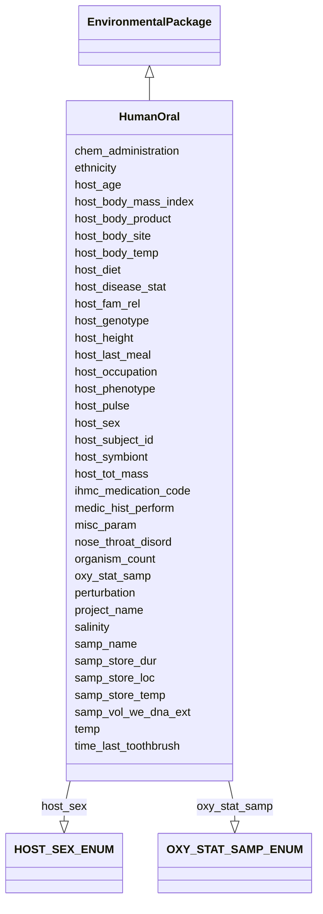

# Class: HumanOral


URI: [mixs_6_2_proposal:HumanOral](https://turbomam.github.io/mixs-envo-struct-knowl-extraction/HumanOral)





## Inheritance
* [EnvironmentalPackage](EnvironmentalPackage.md)
    * **HumanOral**


## Slots

| Name | Cardinality and Range | Description | Inheritance |
| ---  | --- | --- | --- |
| [samp_name](samp_name.md) | 1..1 <br/> [String](String.md) | A local identifier or name that for the material sample used for extracting n... | direct |
| [project_name](project_name.md) | 1..1 <br/> [String](String.md) | Name of the project within which the sequencing was organized | direct |
| [nose_throat_disord](nose_throat_disord.md) | 0..* <br/> [String](String.md) | History of nose/mouth/teeth/throat disorders; can include multiple disorders | direct |
| [time_last_toothbrush](time_last_toothbrush.md) | 0..1 <br/> [String](String.md) | Specification of the time since last toothbrushing | direct |
| [host_subject_id](host_subject_id.md) | 0..1 <br/> [String](String.md) | A unique identifier by which each subject can be referred to, de-identified | direct |
| [host_age](host_age.md) | 0..1 <br/> [String](String.md) | Age of host at the time of sampling; relevant scale depends on species and st... | direct |
| [host_sex](host_sex.md) | 0..1 <br/> [HOSTSEXENUM](HOSTSEXENUM.md) | Gender or physical sex of the host | direct |
| [host_disease_stat](host_disease_stat.md) | 0..* <br/> [String](String.md) | List of diseases with which the host has been diagnosed; can include multiple... | direct |
| [ihmc_medication_code](ihmc_medication_code.md) | 0..* <br/> [Integer](Integer.md) | Can include multiple medication codes | direct |
| [chem_administration](chem_administration.md) | 0..* <br/> [String](String.md) | List of chemical compounds administered to the host or site where sampling oc... | direct |
| [host_body_site](host_body_site.md) | 0..1 <br/> [String](String.md) | Name of body site where the sample was obtained from, such as a specific orga... | direct |
| [host_body_product](host_body_product.md) | 0..1 <br/> [String](String.md) | Substance produced by the body, e | direct |
| [host_tot_mass](host_tot_mass.md) | 0..1 <br/> [String](String.md) | Total mass of the host at collection, the unit depends on host | direct |
| [host_height](host_height.md) | 0..1 <br/> [String](String.md) | The height of subject | direct |
| [host_diet](host_diet.md) | 0..* <br/> [String](String.md) | Type of diet depending on the host, for animals omnivore, herbivore etc | direct |
| [host_last_meal](host_last_meal.md) | 0..* <br/> [String](String.md) | Content of last meal and time since feeding; can include multiple values | direct |
| [host_fam_rel](host_fam_rel.md) | 0..* <br/> [String](String.md) | Relationships to other hosts in the same study; can include multiple relation... | direct |
| [host_genotype](host_genotype.md) | 0..1 <br/> [String](String.md) | Observed genotype | direct |
| [host_phenotype](host_phenotype.md) | 0..1 <br/> [String](String.md) | Phenotype of human or other host | direct |
| [host_body_temp](host_body_temp.md) | 0..1 <br/> [String](String.md) | Core body temperature of the host when sample was collected | direct |
| [host_body_mass_index](host_body_mass_index.md) | 0..1 <br/> [String](String.md) | Body mass index, calculated as weight/(height)squared | direct |
| [ethnicity](ethnicity.md) | 0..* <br/> [String](String.md) | A category of people who identify with each other, usually on the basis of pr... | direct |
| [host_occupation](host_occupation.md) | 0..1 <br/> [String](String.md) | Most frequent job performed by subject | direct |
| [medic_hist_perform](medic_hist_perform.md) | 0..1 <br/> [Boolean](Boolean.md) | Whether full medical history was collected | direct |
| [host_pulse](host_pulse.md) | 0..1 <br/> [String](String.md) | Resting pulse, measured as beats per minute | direct |
| [perturbation](perturbation.md) | 0..* <br/> [String](String.md) | Type of perturbation, e | direct |
| [salinity](salinity.md) | 0..1 <br/> [String](String.md) | The total concentration of all dissolved salts in a liquid or solid sample | direct |
| [oxy_stat_samp](oxy_stat_samp.md) | 0..1 <br/> [OXYSTATSAMPENUM](OXYSTATSAMPENUM.md) | Oxygenation status of sample | direct |
| [temp](temp.md) | 0..1 <br/> [String](String.md) | Temperature of the sample at the time of sampling | direct |
| [organism_count](organism_count.md) | 0..* <br/> [String](String.md) | Total cell count of any organism (or group of organisms) per gram, volume or ... | direct |
| [samp_vol_we_dna_ext](samp_vol_we_dna_ext.md) | 0..1 <br/> [String](String.md) | Volume (ml) or mass (g) of total collected sample processed for DNA extractio... | direct |
| [samp_store_temp](samp_store_temp.md) | 0..1 <br/> [String](String.md) | Temperature at which sample was stored, e | direct |
| [samp_store_dur](samp_store_dur.md) | 0..1 <br/> [String](String.md) | Duration for which the sample was stored | direct |
| [host_symbiont](host_symbiont.md) | 0..* <br/> [String](String.md) | The taxonomic name of the organism(s) found living in mutualistic, commensali... | direct |
| [samp_store_loc](samp_store_loc.md) | 0..1 <br/> [String](String.md) | Location at which sample was stored, usually name of a specific freezer/room | direct |
| [misc_param](misc_param.md) | 0..* <br/> [String](String.md) | Any other measurement performed or parameter collected, that is not listed he... | direct |


## Identifier and Mapping Information


### Schema Source


* from schema: https://turbomam.github.io/mixs-envo-struct-knowl-extraction//GSC_MIxS_6


## Mappings

| Mapping Type | Mapped Value |
| ---  | ---  |
| self | mixs_6_2_proposal:HumanOral |
| native | mixs_6_2_proposal:HumanOral |


## LinkML Source

<!-- TODO: investigate https://stackoverflow.com/questions/37606292/how-to-create-tabbed-code-blocks-in-mkdocs-or-sphinx -->

### Direct

<details>
```yaml
name: HumanOral
title: HumanOral
from_schema: https://turbomam.github.io/mixs-envo-struct-knowl-extraction//GSC_MIxS_6
is_a: EnvironmentalPackage
mixin: false
slots:
- samp_name
- project_name
- nose_throat_disord
- time_last_toothbrush
- host_subject_id
- host_age
- host_sex
- host_disease_stat
- ihmc_medication_code
- chem_administration
- host_body_site
- host_body_product
- host_tot_mass
- host_height
- host_diet
- host_last_meal
- host_fam_rel
- host_genotype
- host_phenotype
- host_body_temp
- host_body_mass_index
- ethnicity
- host_occupation
- medic_hist_perform
- host_pulse
- perturbation
- salinity
- oxy_stat_samp
- temp
- organism_count
- samp_vol_we_dna_ext
- samp_store_temp
- samp_store_dur
- host_symbiont
- samp_store_loc
- misc_param
slot_usage:
  chem_administration:
    name: chem_administration
    domain_of:
    - Agriculture
    - Air
    - FoodFarmEnvironment
    - HostAssociated
    - HumanAssociated
    - HumanGut
    - HumanOral
    - HumanSkin
    - HumanVaginal
    - MicrobialMatBiofilm
    - MiscellaneousNaturalOrArtificialEnvironment
    - PlantAssociated
    - Sediment
    - SymbiontAssociated
    - WastewaterSludge
    - Water
    required: false
    recommended: false
  host_age:
    name: host_age
    examples:
    - value: 30 years
    domain_of:
    - Agriculture
    - FoodFarmEnvironment
    - HostAssociated
    - HumanAssociated
    - HumanGut
    - HumanOral
    - HumanSkin
    - HumanVaginal
    - PlantAssociated
    - SymbiontAssociated
    required: false
    recommended: false
  host_body_product:
    name: host_body_product
    slot_uri: MIXS:0000888
    domain_of:
    - HostAssociated
    - HumanAssociated
    - HumanGut
    - HumanOral
    - HumanSkin
    - HumanVaginal
    - SymbiontAssociated
  host_body_site:
    name: host_body_site
    examples:
    - value: Epithelium of tongue [fma284658]
    domain_of:
    - HostAssociated
    - HumanAssociated
    - HumanGut
    - HumanOral
    - HumanSkin
    - HumanVaginal
    - SymbiontAssociated
  host_body_temp:
    name: host_body_temp
    examples:
    - value: 36.5 degree Celsius
    domain_of:
    - HostAssociated
    - HumanAssociated
    - HumanGut
    - HumanOral
    - HumanSkin
    - HumanVaginal
  host_diet:
    name: host_diet
    examples:
    - value: high-fat
    domain_of:
    - HostAssociated
    - HumanAssociated
    - HumanGut
    - HumanOral
    - HumanSkin
    - HumanVaginal
  host_disease_stat:
    name: host_disease_stat
    description: List of diseases with which the host has been diagnosed; can include
      multiple diagnoses. The terms should be chosen from the DO (Human Disease Ontology)
      at https://www.disease-ontology.org.
    examples:
    - value: measles [DOID:8622]
    string_serialization: '{termLabel} [{termID}]'
    multivalued: true
    domain_of:
    - Agriculture
    - FoodFarmEnvironment
    - HostAssociated
    - HumanAssociated
    - HumanGut
    - HumanOral
    - HumanSkin
    - HumanVaginal
    - MigsBa
    - MigsEu
    - MigsVi
    - Miuvig
    - PlantAssociated
    required: false
    recommended: false
  host_fam_rel:
    name: host_fam_rel
    examples:
    - value: mother;ID298
    multivalued: true
    domain_of:
    - HostAssociated
    - HumanAssociated
    - HumanGut
    - HumanOral
    - HumanSkin
    - HumanVaginal
    - SymbiontAssociated
  host_genotype:
    name: host_genotype
    examples:
    - value: ST1
    domain_of:
    - Agriculture
    - FoodFarmEnvironment
    - HostAssociated
    - HumanAssociated
    - HumanGut
    - HumanOral
    - HumanSkin
    - HumanVaginal
    - PlantAssociated
    - SymbiontAssociated
    required: false
    recommended: false
  host_height:
    name: host_height
    examples:
    - value: 1.75 meter
    domain_of:
    - Agriculture
    - FoodFarmEnvironment
    - HostAssociated
    - HumanAssociated
    - HumanGut
    - HumanOral
    - HumanSkin
    - HumanVaginal
    - PlantAssociated
    - SymbiontAssociated
    required: false
    recommended: false
  host_last_meal:
    name: host_last_meal
    examples:
    - value: french fries;P5H30M
    domain_of:
    - HostAssociated
    - HumanAssociated
    - HumanGut
    - HumanOral
    - HumanSkin
    - HumanVaginal
  host_phenotype:
    name: host_phenotype
    examples:
    - value: Tinnitus [HP:0000360]
    string_serialization: '{termLabel} [{termID}]'
    domain_of:
    - Agriculture
    - FoodFarmEnvironment
    - HostAssociated
    - HumanAssociated
    - HumanGut
    - HumanOral
    - HumanSkin
    - HumanVaginal
    - PlantAssociated
    - SymbiontAssociated
    required: false
    recommended: false
  host_sex:
    name: host_sex
    description: Gender or physical sex of the host.
    string_serialization: '[female|hermaphrodite|non-binary|male|transgender|transgender
      (female to male)|transgender (male to female)

      |undeclared]'
    slot_uri: MIXS:0000811
    domain_of:
    - HostAssociated
    - HumanAssociated
    - HumanGut
    - HumanOral
    - HumanSkin
    - HumanVaginal
    - SymbiontAssociated
  host_subject_id:
    name: host_subject_id
    examples:
    - value: MPI123
    domain_of:
    - HostAssociated
    - HumanAssociated
    - HumanGut
    - HumanOral
    - HumanSkin
    - HumanVaginal
    - SymbiontAssociated
  host_symbiont:
    name: host_symbiont
    description: The taxonomic name of the organism(s) found living in mutualistic,
      commensalistic, or parasitic symbiosis with the specific host. The sampled symbiont
      can have its own symbionts. For example, parasites may have hyperparasites (=parasites
      of the parasite).
    examples:
    - value: flukeworms
    slot_uri: MIXS:0001298
    multivalued: true
    domain_of:
    - Agriculture
    - HostAssociated
    - HumanAssociated
    - HumanGut
    - HumanOral
    - HumanSkin
    - HumanVaginal
    - PlantAssociated
    - SymbiontAssociated
  host_tot_mass:
    name: host_tot_mass
    examples:
    - value: 65 kilogram
    domain_of:
    - Agriculture
    - FoodFarmEnvironment
    - HostAssociated
    - HumanAssociated
    - HumanGut
    - HumanOral
    - HumanSkin
    - HumanVaginal
    - PlantAssociated
    - SymbiontAssociated
    required: false
    recommended: false
  misc_param:
    name: misc_param
    domain_of:
    - Agriculture
    - Air
    - FoodAnimalAndAnimalFeed
    - FoodFarmEnvironment
    - FoodFoodProductionFacility
    - FoodHumanFoods
    - HostAssociated
    - HumanAssociated
    - HumanGut
    - HumanOral
    - HumanSkin
    - HumanVaginal
    - HydrocarbonResourcesCores
    - HydrocarbonResourcesFluidsSwabs
    - MicrobialMatBiofilm
    - MiscellaneousNaturalOrArtificialEnvironment
    - PlantAssociated
    - Sediment
    - Soil
    - SymbiontAssociated
    - WastewaterSludge
    - Water
  nose_throat_disord:
    name: nose_throat_disord
    description: History of nose/mouth/teeth/throat disorders; can include multiple
      disorders. The terms should be chosen from the DO (Human Disease Ontology) at
      http://www.disease-ontology.org, nose disease (https://disease-ontology.org/?id=DOID:2825),
      mouth disease (https://disease-ontology.org/?id=DOID:403), tooth disease (https://disease-ontology.org/?id=DOID:1091),
      or upper respiratory tract disease (https://disease-ontology.org/?id=DOID:974).
    title: nose/mouth/teeth/throat disorder
    slot_uri: MIXS:0000283
    domain_of:
    - HumanAssociated
    - HumanOral
  organism_count:
    name: organism_count
    description: 'Total cell count of any organism (or group of organisms) per gram,
      volume or area of sample, should include name of organism followed by count.
      The method that was used for the enumeration (e.g. qPCR, atp, mpn, etc.) Should
      also be provided. (example: total prokaryotes; 3.5e7 cells per ml; qpcr)'
    examples:
    - value: total prokaryotes;3.5e7 cells per milliliter;qPCR
    string_serialization: '{text};{float} {unit};[qPCR|ATP|MPN|other]'
    multivalued: true
    domain_of:
    - Agriculture
    - Air
    - BuiltEnvironment
    - FoodAnimalAndAnimalFeed
    - FoodFarmEnvironment
    - FoodFoodProductionFacility
    - FoodHumanFoods
    - HostAssociated
    - HumanAssociated
    - HumanGut
    - HumanOral
    - HumanSkin
    - HumanVaginal
    - HydrocarbonResourcesCores
    - HydrocarbonResourcesFluidsSwabs
    - MicrobialMatBiofilm
    - MiscellaneousNaturalOrArtificialEnvironment
    - PlantAssociated
    - Sediment
    - SymbiontAssociated
    - WastewaterSludge
    - Water
    required: false
    recommended: false
  oxy_stat_samp:
    name: oxy_stat_samp
    domain_of:
    - Agriculture
    - Air
    - HostAssociated
    - HumanAssociated
    - HumanGut
    - HumanOral
    - HumanSkin
    - HumanVaginal
    - HydrocarbonResourcesCores
    - HydrocarbonResourcesFluidsSwabs
    - MicrobialMatBiofilm
    - MiscellaneousNaturalOrArtificialEnvironment
    - PlantAssociated
    - Sediment
    - SymbiontAssociated
    - WastewaterSludge
    - Water
    required: false
    recommended: false
  perturbation:
    name: perturbation
    string_serialization: '{text};{Rn/start_time/end_time/duration}'
    domain_of:
    - Agriculture
    - Air
    - FoodAnimalAndAnimalFeed
    - FoodFarmEnvironment
    - FoodHumanFoods
    - HostAssociated
    - HumanAssociated
    - HumanGut
    - HumanOral
    - HumanSkin
    - HumanVaginal
    - MicrobialMatBiofilm
    - MiscellaneousNaturalOrArtificialEnvironment
    - PlantAssociated
    - Sediment
    - SymbiontAssociated
    - WastewaterSludge
    - Water
    required: false
    recommended: false
  salinity:
    name: salinity
    multivalued: false
    domain_of:
    - Air
    - FoodFarmEnvironment
    - HostAssociated
    - HumanAssociated
    - HumanGut
    - HumanOral
    - HumanSkin
    - HumanVaginal
    - HydrocarbonResourcesCores
    - HydrocarbonResourcesFluidsSwabs
    - MicrobialMatBiofilm
    - MiscellaneousNaturalOrArtificialEnvironment
    - PlantAssociated
    - Sediment
    - SymbiontAssociated
    - WastewaterSludge
    - Water
  samp_store_dur:
    name: samp_store_dur
    description: Duration for which the sample was stored
    string_serialization: '{duration}'
    domain_of:
    - Agriculture
    - Air
    - FoodAnimalAndAnimalFeed
    - FoodFarmEnvironment
    - FoodFoodProductionFacility
    - FoodHumanFoods
    - HostAssociated
    - HumanAssociated
    - HumanGut
    - HumanOral
    - HumanSkin
    - HumanVaginal
    - HydrocarbonResourcesCores
    - HydrocarbonResourcesFluidsSwabs
    - MicrobialMatBiofilm
    - MiscellaneousNaturalOrArtificialEnvironment
    - PlantAssociated
    - Sediment
    - SymbiontAssociated
    - WastewaterSludge
    - Water
    required: false
    recommended: false
  samp_store_loc:
    name: samp_store_loc
    description: Location at which sample was stored, usually name of a specific freezer/room
    examples:
    - value: Freezer no:5
    domain_of:
    - Agriculture
    - Air
    - FoodAnimalAndAnimalFeed
    - FoodFoodProductionFacility
    - FoodHumanFoods
    - HostAssociated
    - HumanAssociated
    - HumanGut
    - HumanOral
    - HumanSkin
    - HumanVaginal
    - HydrocarbonResourcesCores
    - HydrocarbonResourcesFluidsSwabs
    - MicrobialMatBiofilm
    - MiscellaneousNaturalOrArtificialEnvironment
    - PlantAssociated
    - Sediment
    - SymbiontAssociated
    - WastewaterSludge
    - Water
    required: false
    recommended: false
  samp_vol_we_dna_ext:
    name: samp_vol_we_dna_ext
    description: 'Volume (ml) or mass (g) of total collected sample processed for
      DNA extraction. Note: total sample collected should be entered under the term
      Sample Size (MIXS:0000001).'
    domain_of:
    - Agriculture
    - Air
    - FoodAnimalAndAnimalFeed
    - FoodFarmEnvironment
    - FoodFoodProductionFacility
    - FoodHumanFoods
    - HostAssociated
    - HumanAssociated
    - HumanGut
    - HumanOral
    - HumanSkin
    - HumanVaginal
    - HydrocarbonResourcesCores
    - HydrocarbonResourcesFluidsSwabs
    - MicrobialMatBiofilm
    - MigsBa
    - MigsEu
    - MigsOrg
    - MigsPl
    - MigsVi
    - Mimag
    - MimarksC
    - MimarksS
    - Mims
    - Misag
    - MiscellaneousNaturalOrArtificialEnvironment
    - Miuvig
    - PlantAssociated
    - Sediment
    - Soil
    - SymbiontAssociated
    - WastewaterSludge
    - Water
    required: false
    recommended: false
  temp:
    name: temp
    domain_of:
    - Agriculture
    - Air
    - FoodAnimalAndAnimalFeed
    - FoodFarmEnvironment
    - FoodHumanFoods
    - HostAssociated
    - HumanAssociated
    - HumanGut
    - HumanOral
    - HumanSkin
    - HumanVaginal
    - HydrocarbonResourcesCores
    - HydrocarbonResourcesFluidsSwabs
    - MicrobialMatBiofilm
    - MigsBa
    - MigsEu
    - MigsOrg
    - MigsPl
    - MigsVi
    - Mimag
    - MimarksC
    - MimarksS
    - Mims
    - Misag
    - MiscellaneousNaturalOrArtificialEnvironment
    - Miuvig
    - PlantAssociated
    - Sediment
    - Soil
    - SymbiontAssociated
    - WastewaterSludge
    - Water
    required: false
    recommended: false

```
</details>

### Induced

<details>
```yaml
name: HumanOral
title: HumanOral
from_schema: https://turbomam.github.io/mixs-envo-struct-knowl-extraction//GSC_MIxS_6
is_a: EnvironmentalPackage
mixin: false
slot_usage:
  chem_administration:
    name: chem_administration
    domain_of:
    - Agriculture
    - Air
    - FoodFarmEnvironment
    - HostAssociated
    - HumanAssociated
    - HumanGut
    - HumanOral
    - HumanSkin
    - HumanVaginal
    - MicrobialMatBiofilm
    - MiscellaneousNaturalOrArtificialEnvironment
    - PlantAssociated
    - Sediment
    - SymbiontAssociated
    - WastewaterSludge
    - Water
    required: false
    recommended: false
  host_age:
    name: host_age
    examples:
    - value: 30 years
    domain_of:
    - Agriculture
    - FoodFarmEnvironment
    - HostAssociated
    - HumanAssociated
    - HumanGut
    - HumanOral
    - HumanSkin
    - HumanVaginal
    - PlantAssociated
    - SymbiontAssociated
    required: false
    recommended: false
  host_body_product:
    name: host_body_product
    slot_uri: MIXS:0000888
    domain_of:
    - HostAssociated
    - HumanAssociated
    - HumanGut
    - HumanOral
    - HumanSkin
    - HumanVaginal
    - SymbiontAssociated
  host_body_site:
    name: host_body_site
    examples:
    - value: Epithelium of tongue [fma284658]
    domain_of:
    - HostAssociated
    - HumanAssociated
    - HumanGut
    - HumanOral
    - HumanSkin
    - HumanVaginal
    - SymbiontAssociated
  host_body_temp:
    name: host_body_temp
    examples:
    - value: 36.5 degree Celsius
    domain_of:
    - HostAssociated
    - HumanAssociated
    - HumanGut
    - HumanOral
    - HumanSkin
    - HumanVaginal
  host_diet:
    name: host_diet
    examples:
    - value: high-fat
    domain_of:
    - HostAssociated
    - HumanAssociated
    - HumanGut
    - HumanOral
    - HumanSkin
    - HumanVaginal
  host_disease_stat:
    name: host_disease_stat
    description: List of diseases with which the host has been diagnosed; can include
      multiple diagnoses. The terms should be chosen from the DO (Human Disease Ontology)
      at https://www.disease-ontology.org.
    examples:
    - value: measles [DOID:8622]
    string_serialization: '{termLabel} [{termID}]'
    multivalued: true
    domain_of:
    - Agriculture
    - FoodFarmEnvironment
    - HostAssociated
    - HumanAssociated
    - HumanGut
    - HumanOral
    - HumanSkin
    - HumanVaginal
    - MigsBa
    - MigsEu
    - MigsVi
    - Miuvig
    - PlantAssociated
    required: false
    recommended: false
  host_fam_rel:
    name: host_fam_rel
    examples:
    - value: mother;ID298
    multivalued: true
    domain_of:
    - HostAssociated
    - HumanAssociated
    - HumanGut
    - HumanOral
    - HumanSkin
    - HumanVaginal
    - SymbiontAssociated
  host_genotype:
    name: host_genotype
    examples:
    - value: ST1
    domain_of:
    - Agriculture
    - FoodFarmEnvironment
    - HostAssociated
    - HumanAssociated
    - HumanGut
    - HumanOral
    - HumanSkin
    - HumanVaginal
    - PlantAssociated
    - SymbiontAssociated
    required: false
    recommended: false
  host_height:
    name: host_height
    examples:
    - value: 1.75 meter
    domain_of:
    - Agriculture
    - FoodFarmEnvironment
    - HostAssociated
    - HumanAssociated
    - HumanGut
    - HumanOral
    - HumanSkin
    - HumanVaginal
    - PlantAssociated
    - SymbiontAssociated
    required: false
    recommended: false
  host_last_meal:
    name: host_last_meal
    examples:
    - value: french fries;P5H30M
    domain_of:
    - HostAssociated
    - HumanAssociated
    - HumanGut
    - HumanOral
    - HumanSkin
    - HumanVaginal
  host_phenotype:
    name: host_phenotype
    examples:
    - value: Tinnitus [HP:0000360]
    string_serialization: '{termLabel} [{termID}]'
    domain_of:
    - Agriculture
    - FoodFarmEnvironment
    - HostAssociated
    - HumanAssociated
    - HumanGut
    - HumanOral
    - HumanSkin
    - HumanVaginal
    - PlantAssociated
    - SymbiontAssociated
    required: false
    recommended: false
  host_sex:
    name: host_sex
    description: Gender or physical sex of the host.
    string_serialization: '[female|hermaphrodite|non-binary|male|transgender|transgender
      (female to male)|transgender (male to female)

      |undeclared]'
    slot_uri: MIXS:0000811
    domain_of:
    - HostAssociated
    - HumanAssociated
    - HumanGut
    - HumanOral
    - HumanSkin
    - HumanVaginal
    - SymbiontAssociated
  host_subject_id:
    name: host_subject_id
    examples:
    - value: MPI123
    domain_of:
    - HostAssociated
    - HumanAssociated
    - HumanGut
    - HumanOral
    - HumanSkin
    - HumanVaginal
    - SymbiontAssociated
  host_symbiont:
    name: host_symbiont
    description: The taxonomic name of the organism(s) found living in mutualistic,
      commensalistic, or parasitic symbiosis with the specific host. The sampled symbiont
      can have its own symbionts. For example, parasites may have hyperparasites (=parasites
      of the parasite).
    examples:
    - value: flukeworms
    slot_uri: MIXS:0001298
    multivalued: true
    domain_of:
    - Agriculture
    - HostAssociated
    - HumanAssociated
    - HumanGut
    - HumanOral
    - HumanSkin
    - HumanVaginal
    - PlantAssociated
    - SymbiontAssociated
  host_tot_mass:
    name: host_tot_mass
    examples:
    - value: 65 kilogram
    domain_of:
    - Agriculture
    - FoodFarmEnvironment
    - HostAssociated
    - HumanAssociated
    - HumanGut
    - HumanOral
    - HumanSkin
    - HumanVaginal
    - PlantAssociated
    - SymbiontAssociated
    required: false
    recommended: false
  misc_param:
    name: misc_param
    domain_of:
    - Agriculture
    - Air
    - FoodAnimalAndAnimalFeed
    - FoodFarmEnvironment
    - FoodFoodProductionFacility
    - FoodHumanFoods
    - HostAssociated
    - HumanAssociated
    - HumanGut
    - HumanOral
    - HumanSkin
    - HumanVaginal
    - HydrocarbonResourcesCores
    - HydrocarbonResourcesFluidsSwabs
    - MicrobialMatBiofilm
    - MiscellaneousNaturalOrArtificialEnvironment
    - PlantAssociated
    - Sediment
    - Soil
    - SymbiontAssociated
    - WastewaterSludge
    - Water
  nose_throat_disord:
    name: nose_throat_disord
    description: History of nose/mouth/teeth/throat disorders; can include multiple
      disorders. The terms should be chosen from the DO (Human Disease Ontology) at
      http://www.disease-ontology.org, nose disease (https://disease-ontology.org/?id=DOID:2825),
      mouth disease (https://disease-ontology.org/?id=DOID:403), tooth disease (https://disease-ontology.org/?id=DOID:1091),
      or upper respiratory tract disease (https://disease-ontology.org/?id=DOID:974).
    title: nose/mouth/teeth/throat disorder
    slot_uri: MIXS:0000283
    domain_of:
    - HumanAssociated
    - HumanOral
  organism_count:
    name: organism_count
    description: 'Total cell count of any organism (or group of organisms) per gram,
      volume or area of sample, should include name of organism followed by count.
      The method that was used for the enumeration (e.g. qPCR, atp, mpn, etc.) Should
      also be provided. (example: total prokaryotes; 3.5e7 cells per ml; qpcr)'
    examples:
    - value: total prokaryotes;3.5e7 cells per milliliter;qPCR
    string_serialization: '{text};{float} {unit};[qPCR|ATP|MPN|other]'
    multivalued: true
    domain_of:
    - Agriculture
    - Air
    - BuiltEnvironment
    - FoodAnimalAndAnimalFeed
    - FoodFarmEnvironment
    - FoodFoodProductionFacility
    - FoodHumanFoods
    - HostAssociated
    - HumanAssociated
    - HumanGut
    - HumanOral
    - HumanSkin
    - HumanVaginal
    - HydrocarbonResourcesCores
    - HydrocarbonResourcesFluidsSwabs
    - MicrobialMatBiofilm
    - MiscellaneousNaturalOrArtificialEnvironment
    - PlantAssociated
    - Sediment
    - SymbiontAssociated
    - WastewaterSludge
    - Water
    required: false
    recommended: false
  oxy_stat_samp:
    name: oxy_stat_samp
    domain_of:
    - Agriculture
    - Air
    - HostAssociated
    - HumanAssociated
    - HumanGut
    - HumanOral
    - HumanSkin
    - HumanVaginal
    - HydrocarbonResourcesCores
    - HydrocarbonResourcesFluidsSwabs
    - MicrobialMatBiofilm
    - MiscellaneousNaturalOrArtificialEnvironment
    - PlantAssociated
    - Sediment
    - SymbiontAssociated
    - WastewaterSludge
    - Water
    required: false
    recommended: false
  perturbation:
    name: perturbation
    string_serialization: '{text};{Rn/start_time/end_time/duration}'
    domain_of:
    - Agriculture
    - Air
    - FoodAnimalAndAnimalFeed
    - FoodFarmEnvironment
    - FoodHumanFoods
    - HostAssociated
    - HumanAssociated
    - HumanGut
    - HumanOral
    - HumanSkin
    - HumanVaginal
    - MicrobialMatBiofilm
    - MiscellaneousNaturalOrArtificialEnvironment
    - PlantAssociated
    - Sediment
    - SymbiontAssociated
    - WastewaterSludge
    - Water
    required: false
    recommended: false
  salinity:
    name: salinity
    multivalued: false
    domain_of:
    - Air
    - FoodFarmEnvironment
    - HostAssociated
    - HumanAssociated
    - HumanGut
    - HumanOral
    - HumanSkin
    - HumanVaginal
    - HydrocarbonResourcesCores
    - HydrocarbonResourcesFluidsSwabs
    - MicrobialMatBiofilm
    - MiscellaneousNaturalOrArtificialEnvironment
    - PlantAssociated
    - Sediment
    - SymbiontAssociated
    - WastewaterSludge
    - Water
  samp_store_dur:
    name: samp_store_dur
    description: Duration for which the sample was stored
    string_serialization: '{duration}'
    domain_of:
    - Agriculture
    - Air
    - FoodAnimalAndAnimalFeed
    - FoodFarmEnvironment
    - FoodFoodProductionFacility
    - FoodHumanFoods
    - HostAssociated
    - HumanAssociated
    - HumanGut
    - HumanOral
    - HumanSkin
    - HumanVaginal
    - HydrocarbonResourcesCores
    - HydrocarbonResourcesFluidsSwabs
    - MicrobialMatBiofilm
    - MiscellaneousNaturalOrArtificialEnvironment
    - PlantAssociated
    - Sediment
    - SymbiontAssociated
    - WastewaterSludge
    - Water
    required: false
    recommended: false
  samp_store_loc:
    name: samp_store_loc
    description: Location at which sample was stored, usually name of a specific freezer/room
    examples:
    - value: Freezer no:5
    domain_of:
    - Agriculture
    - Air
    - FoodAnimalAndAnimalFeed
    - FoodFoodProductionFacility
    - FoodHumanFoods
    - HostAssociated
    - HumanAssociated
    - HumanGut
    - HumanOral
    - HumanSkin
    - HumanVaginal
    - HydrocarbonResourcesCores
    - HydrocarbonResourcesFluidsSwabs
    - MicrobialMatBiofilm
    - MiscellaneousNaturalOrArtificialEnvironment
    - PlantAssociated
    - Sediment
    - SymbiontAssociated
    - WastewaterSludge
    - Water
    required: false
    recommended: false
  samp_vol_we_dna_ext:
    name: samp_vol_we_dna_ext
    description: 'Volume (ml) or mass (g) of total collected sample processed for
      DNA extraction. Note: total sample collected should be entered under the term
      Sample Size (MIXS:0000001).'
    domain_of:
    - Agriculture
    - Air
    - FoodAnimalAndAnimalFeed
    - FoodFarmEnvironment
    - FoodFoodProductionFacility
    - FoodHumanFoods
    - HostAssociated
    - HumanAssociated
    - HumanGut
    - HumanOral
    - HumanSkin
    - HumanVaginal
    - HydrocarbonResourcesCores
    - HydrocarbonResourcesFluidsSwabs
    - MicrobialMatBiofilm
    - MigsBa
    - MigsEu
    - MigsOrg
    - MigsPl
    - MigsVi
    - Mimag
    - MimarksC
    - MimarksS
    - Mims
    - Misag
    - MiscellaneousNaturalOrArtificialEnvironment
    - Miuvig
    - PlantAssociated
    - Sediment
    - Soil
    - SymbiontAssociated
    - WastewaterSludge
    - Water
    required: false
    recommended: false
  temp:
    name: temp
    domain_of:
    - Agriculture
    - Air
    - FoodAnimalAndAnimalFeed
    - FoodFarmEnvironment
    - FoodHumanFoods
    - HostAssociated
    - HumanAssociated
    - HumanGut
    - HumanOral
    - HumanSkin
    - HumanVaginal
    - HydrocarbonResourcesCores
    - HydrocarbonResourcesFluidsSwabs
    - MicrobialMatBiofilm
    - MigsBa
    - MigsEu
    - MigsOrg
    - MigsPl
    - MigsVi
    - Mimag
    - MimarksC
    - MimarksS
    - Mims
    - Misag
    - MiscellaneousNaturalOrArtificialEnvironment
    - Miuvig
    - PlantAssociated
    - Sediment
    - Soil
    - SymbiontAssociated
    - WastewaterSludge
    - Water
    required: false
    recommended: false
attributes:
  samp_name:
    name: samp_name
    description: A local identifier or name that for the material sample used for
      extracting nucleic acids, and subsequent sequencing. It can refer either to
      the original material collected or to any derived sub-samples. It can have any
      format, but we suggest that you make it concise, unique and consistent within
      your lab, and as informative as possible. INSDC requires every sample name from
      a single Submitter to be unique. Use of a globally unique identifier for the
      field source_mat_id is recommended in addition to sample_name
    title: sample name
    notes:
    - sample
    examples:
    - value: ISDsoil1
    in_subset:
    - investigation
    from_schema: https://turbomam.github.io/mixs-envo-struct-knowl-extraction//GSC_MIxS_6
    rank: 1000
    slot_uri: MIXS:0001107
    multivalued: false
    alias: samp_name
    owner: HumanOral
    domain_of:
    - Air
    - BuiltEnvironment
    - FoodAnimalAndAnimalFeed
    - FoodFarmEnvironment
    - FoodFoodProductionFacility
    - FoodHumanFoods
    - HostAssociated
    - HumanAssociated
    - HumanGut
    - HumanOral
    - HumanSkin
    - HumanVaginal
    - HydrocarbonResourcesCores
    - HydrocarbonResourcesFluidsSwabs
    - MicrobialMatBiofilm
    - MigsBa
    - MigsEu
    - MigsOrg
    - MigsPl
    - MigsVi
    - Mimag
    - MimarksC
    - MimarksS
    - Mims
    - Misag
    - MiscellaneousNaturalOrArtificialEnvironment
    - Miuvig
    - PlantAssociated
    - Sediment
    - Soil
    - SymbiontAssociated
    - WastewaterSludge
    - Water
    range: string
    required: true
  project_name:
    name: project_name
    description: Name of the project within which the sequencing was organized
    title: project name
    notes:
    - project
    examples:
    - value: Forest soil metagenome
    in_subset:
    - investigation
    from_schema: https://turbomam.github.io/mixs-envo-struct-knowl-extraction//GSC_MIxS_6
    rank: 1000
    slot_uri: MIXS:0000092
    multivalued: false
    alias: project_name
    owner: HumanOral
    domain_of:
    - Air
    - BuiltEnvironment
    - FoodAnimalAndAnimalFeed
    - FoodFarmEnvironment
    - FoodFoodProductionFacility
    - FoodHumanFoods
    - HostAssociated
    - HumanAssociated
    - HumanGut
    - HumanOral
    - HumanSkin
    - HumanVaginal
    - HydrocarbonResourcesCores
    - HydrocarbonResourcesFluidsSwabs
    - MicrobialMatBiofilm
    - MigsBa
    - MigsEu
    - MigsOrg
    - MigsPl
    - MigsVi
    - Mimag
    - MimarksC
    - MimarksS
    - Mims
    - Misag
    - MiscellaneousNaturalOrArtificialEnvironment
    - Miuvig
    - PlantAssociated
    - Sediment
    - Soil
    - SymbiontAssociated
    - WastewaterSludge
    - Water
    range: string
    required: true
  nose_throat_disord:
    name: nose_throat_disord
    description: History of nose/mouth/teeth/throat disorders; can include multiple
      disorders. The terms should be chosen from the DO (Human Disease Ontology) at
      http://www.disease-ontology.org, nose disease (https://disease-ontology.org/?id=DOID:2825),
      mouth disease (https://disease-ontology.org/?id=DOID:403), tooth disease (https://disease-ontology.org/?id=DOID:1091),
      or upper respiratory tract disease (https://disease-ontology.org/?id=DOID:974).
    title: nose/mouth/teeth/throat disorder
    from_schema: https://turbomam.github.io/mixs-envo-struct-knowl-extraction//GSC_MIxS_6
    rank: 1000
    slot_uri: MIXS:0000283
    multivalued: true
    alias: nose_throat_disord
    owner: HumanOral
    domain_of:
    - HumanAssociated
    - HumanOral
    range: string
    required: false
    recommended: false
  time_last_toothbrush:
    name: time_last_toothbrush
    description: Specification of the time since last toothbrushing
    title: time since last toothbrushing
    notes:
    - time
    comments:
    - P2H45M does not match ^P(?!$)(\\d+Y)?(\\d+M)?(\\d+W)?(\\d+D)?(T(?=\\d+[HMS])(\\d+H)?(\\d+M)?(\\d+S)?)?$
    - problematic ISO 8601 period validation
    examples:
    - value: PT2H45M
    from_schema: https://turbomam.github.io/mixs-envo-struct-knowl-extraction//GSC_MIxS_6
    rank: 1000
    slot_uri: MIXS:0000924
    alias: time_last_toothbrush
    owner: HumanOral
    domain_of:
    - HumanOral
    range: string
    required: false
    recommended: false
    pattern: ^P(?!$)(\d+Y)?(\d+M)?(\d+W)?(\d+D)?(T(?=\d+[HMS])(\d+H)?(\d+M)?(\d+S)?)?$
  host_subject_id:
    name: host_subject_id
    description: A unique identifier by which each subject can be referred to, de-identified
    title: host subject id
    examples:
    - value: MPI123
    from_schema: https://turbomam.github.io/mixs-envo-struct-knowl-extraction//GSC_MIxS_6
    rank: 1000
    slot_uri: MIXS:0000861
    multivalued: false
    alias: host_subject_id
    owner: HumanOral
    domain_of:
    - HostAssociated
    - HumanAssociated
    - HumanGut
    - HumanOral
    - HumanSkin
    - HumanVaginal
    - SymbiontAssociated
    range: string
    required: false
    recommended: false
  host_age:
    name: host_age
    description: Age of host at the time of sampling; relevant scale depends on species
      and study, e.g. Could be seconds for amoebae or centuries for trees
    title: host age
    examples:
    - value: 30 years
    from_schema: https://turbomam.github.io/mixs-envo-struct-knowl-extraction//GSC_MIxS_6
    rank: 1000
    slot_uri: MIXS:0000255
    multivalued: false
    alias: host_age
    owner: HumanOral
    domain_of:
    - Agriculture
    - FoodFarmEnvironment
    - HostAssociated
    - HumanAssociated
    - HumanGut
    - HumanOral
    - HumanSkin
    - HumanVaginal
    - PlantAssociated
    - SymbiontAssociated
    range: string
    required: false
    recommended: false
    pattern: ^[-+]?[0-9]*\.?[0-9]+([eE][-+]?[0-9]+)? \S.*\S$
  host_sex:
    name: host_sex
    description: Gender or physical sex of the host.
    title: host sex
    from_schema: https://turbomam.github.io/mixs-envo-struct-knowl-extraction//GSC_MIxS_6
    rank: 1000
    string_serialization: '[female|hermaphrodite|non-binary|male|transgender|transgender
      (female to male)|transgender (male to female)

      |undeclared]'
    slot_uri: MIXS:0000811
    alias: host_sex
    owner: HumanOral
    domain_of:
    - HostAssociated
    - HumanAssociated
    - HumanGut
    - HumanOral
    - HumanSkin
    - HumanVaginal
    - SymbiontAssociated
    range: HOST_SEX_ENUM
    required: false
    recommended: false
  host_disease_stat:
    name: host_disease_stat
    description: List of diseases with which the host has been diagnosed; can include
      multiple diagnoses. The terms should be chosen from the DO (Human Disease Ontology)
      at https://www.disease-ontology.org.
    title: host disease status
    examples:
    - value: measles [DOID:8622]
    from_schema: https://turbomam.github.io/mixs-envo-struct-knowl-extraction//GSC_MIxS_6
    rank: 1000
    string_serialization: '{termLabel} [{termID}]'
    slot_uri: MIXS:0000031
    multivalued: true
    alias: host_disease_stat
    owner: HumanOral
    domain_of:
    - Agriculture
    - FoodFarmEnvironment
    - HostAssociated
    - HumanAssociated
    - HumanGut
    - HumanOral
    - HumanSkin
    - HumanVaginal
    - MigsBa
    - MigsEu
    - MigsVi
    - Miuvig
    - PlantAssociated
    range: string
    required: false
    recommended: false
  ihmc_medication_code:
    name: ihmc_medication_code
    description: Can include multiple medication codes
    title: IHMC medication code
    notes:
    - code
    examples:
    - value: '810'
    from_schema: https://turbomam.github.io/mixs-envo-struct-knowl-extraction//GSC_MIxS_6
    rank: 1000
    slot_uri: MIXS:0000884
    multivalued: true
    alias: ihmc_medication_code
    owner: HumanOral
    domain_of:
    - HumanAssociated
    - HumanGut
    - HumanOral
    - HumanSkin
    - HumanVaginal
    range: integer
    required: false
    recommended: false
  chem_administration:
    name: chem_administration
    description: List of chemical compounds administered to the host or site where
      sampling occurred, and when (e.g. Antibiotics, n fertilizer, air filter); can
      include multiple compounds. For chemical entities of biological interest ontology
      (chebi) (v 163), http://purl.bioontology.org/ontology/chebi
    title: chemical administration
    from_schema: https://turbomam.github.io/mixs-envo-struct-knowl-extraction//GSC_MIxS_6
    rank: 1000
    string_serialization: '{termLabel} [{termID}];{timestamp}'
    slot_uri: MIXS:0000751
    multivalued: true
    alias: chem_administration
    owner: HumanOral
    domain_of:
    - Agriculture
    - Air
    - FoodFarmEnvironment
    - HostAssociated
    - HumanAssociated
    - HumanGut
    - HumanOral
    - HumanSkin
    - HumanVaginal
    - MicrobialMatBiofilm
    - MiscellaneousNaturalOrArtificialEnvironment
    - PlantAssociated
    - Sediment
    - SymbiontAssociated
    - WastewaterSludge
    - Water
    range: string
    required: false
    recommended: false
  host_body_site:
    name: host_body_site
    description: Name of body site where the sample was obtained from, such as a specific
      organ or tissue (tongue, lung etc...). For foundational model of anatomy ontology
      (fma) (v 4.11.0) or Uber-anatomy ontology (UBERON) (v releases/2014-06-15) terms,
      please see http://purl.bioontology.org/ontology/FMA or http://purl.bioontology.org/ontology/UBERON
    title: host body site
    examples:
    - value: Epithelium of tongue [fma284658]
    from_schema: https://turbomam.github.io/mixs-envo-struct-knowl-extraction//GSC_MIxS_6
    rank: 1000
    slot_uri: MIXS:0000867
    multivalued: false
    alias: host_body_site
    owner: HumanOral
    domain_of:
    - HostAssociated
    - HumanAssociated
    - HumanGut
    - HumanOral
    - HumanSkin
    - HumanVaginal
    - SymbiontAssociated
    range: string
    required: false
    recommended: false
    pattern: ^\S+.*\S+ \[[a-zA-Z]{2,}:\d+\]$
  host_body_product:
    name: host_body_product
    description: Substance produced by the body, e.g. Stool, mucus, where the sample
      was obtained from. For foundational model of anatomy ontology (fma) or Uber-anatomy
      ontology (UBERON) terms, please see https://www.ebi.ac.uk/ols/ontologies/fma
      or https://www.ebi.ac.uk/ols/ontologies/uberon
    title: host body product
    from_schema: https://turbomam.github.io/mixs-envo-struct-knowl-extraction//GSC_MIxS_6
    rank: 1000
    slot_uri: MIXS:0000888
    multivalued: false
    alias: host_body_product
    owner: HumanOral
    domain_of:
    - HostAssociated
    - HumanAssociated
    - HumanGut
    - HumanOral
    - HumanSkin
    - HumanVaginal
    - SymbiontAssociated
    range: string
    required: false
    recommended: false
    pattern: ^\S+.*\S+ \[[a-zA-Z]{2,}:\d+\]$
  host_tot_mass:
    name: host_tot_mass
    description: Total mass of the host at collection, the unit depends on host
    title: host total mass
    examples:
    - value: 65 kilogram
    from_schema: https://turbomam.github.io/mixs-envo-struct-knowl-extraction//GSC_MIxS_6
    rank: 1000
    slot_uri: MIXS:0000263
    multivalued: false
    alias: host_tot_mass
    owner: HumanOral
    domain_of:
    - Agriculture
    - FoodFarmEnvironment
    - HostAssociated
    - HumanAssociated
    - HumanGut
    - HumanOral
    - HumanSkin
    - HumanVaginal
    - PlantAssociated
    - SymbiontAssociated
    range: string
    required: false
    recommended: false
    pattern: ^[-+]?[0-9]*\.?[0-9]+([eE][-+]?[0-9]+)? \S.*\S$
  host_height:
    name: host_height
    description: The height of subject
    title: host height
    examples:
    - value: 1.75 meter
    from_schema: https://turbomam.github.io/mixs-envo-struct-knowl-extraction//GSC_MIxS_6
    rank: 1000
    slot_uri: MIXS:0000264
    multivalued: false
    alias: host_height
    owner: HumanOral
    domain_of:
    - Agriculture
    - FoodFarmEnvironment
    - HostAssociated
    - HumanAssociated
    - HumanGut
    - HumanOral
    - HumanSkin
    - HumanVaginal
    - PlantAssociated
    - SymbiontAssociated
    range: string
    required: false
    recommended: false
    pattern: ^[-+]?[0-9]*\.?[0-9]+([eE][-+]?[0-9]+)? \S.*\S$
  host_diet:
    name: host_diet
    description: Type of diet depending on the host, for animals omnivore, herbivore
      etc., for humans high-fat, meditteranean etc.; can include multiple diet types
    title: host diet
    examples:
    - value: high-fat
    from_schema: https://turbomam.github.io/mixs-envo-struct-knowl-extraction//GSC_MIxS_6
    rank: 1000
    slot_uri: MIXS:0000869
    multivalued: true
    alias: host_diet
    owner: HumanOral
    domain_of:
    - HostAssociated
    - HumanAssociated
    - HumanGut
    - HumanOral
    - HumanSkin
    - HumanVaginal
    range: string
    required: false
    recommended: false
  host_last_meal:
    name: host_last_meal
    description: Content of last meal and time since feeding; can include multiple
      values
    title: host last meal
    examples:
    - value: french fries;P5H30M
    from_schema: https://turbomam.github.io/mixs-envo-struct-knowl-extraction//GSC_MIxS_6
    rank: 1000
    string_serialization: '{text};{duration}'
    slot_uri: MIXS:0000870
    multivalued: true
    alias: host_last_meal
    owner: HumanOral
    domain_of:
    - HostAssociated
    - HumanAssociated
    - HumanGut
    - HumanOral
    - HumanSkin
    - HumanVaginal
    range: string
    required: false
    recommended: false
  host_fam_rel:
    name: host_fam_rel
    description: Relationships to other hosts in the same study; can include multiple
      relationships
    title: host family relationship
    examples:
    - value: mother;ID298
    from_schema: https://turbomam.github.io/mixs-envo-struct-knowl-extraction//GSC_MIxS_6
    rank: 1000
    string_serialization: '{text};{text}'
    slot_uri: MIXS:0000872
    multivalued: true
    alias: host_fam_rel
    owner: HumanOral
    domain_of:
    - HostAssociated
    - HumanAssociated
    - HumanGut
    - HumanOral
    - HumanSkin
    - HumanVaginal
    - SymbiontAssociated
    range: string
    required: false
    recommended: false
  host_genotype:
    name: host_genotype
    description: Observed genotype
    title: host genotype
    examples:
    - value: ST1
    from_schema: https://turbomam.github.io/mixs-envo-struct-knowl-extraction//GSC_MIxS_6
    rank: 1000
    slot_uri: MIXS:0000365
    multivalued: false
    alias: host_genotype
    owner: HumanOral
    domain_of:
    - Agriculture
    - FoodFarmEnvironment
    - HostAssociated
    - HumanAssociated
    - HumanGut
    - HumanOral
    - HumanSkin
    - HumanVaginal
    - PlantAssociated
    - SymbiontAssociated
    range: string
    required: false
    recommended: false
  host_phenotype:
    name: host_phenotype
    description: Phenotype of human or other host. For phenotypic quality ontology
      (pato) (v 2018-03-27) terms, please see http://purl.bioontology.org/ontology/pato.
      For Human Phenotype Ontology (HP) (v 2018-06-13) please see http://purl.bioontology.org/ontology/HP
    title: host phenotype
    examples:
    - value: Tinnitus [HP:0000360]
    from_schema: https://turbomam.github.io/mixs-envo-struct-knowl-extraction//GSC_MIxS_6
    rank: 1000
    string_serialization: '{termLabel} [{termID}]'
    slot_uri: MIXS:0000874
    multivalued: false
    alias: host_phenotype
    owner: HumanOral
    domain_of:
    - Agriculture
    - FoodFarmEnvironment
    - HostAssociated
    - HumanAssociated
    - HumanGut
    - HumanOral
    - HumanSkin
    - HumanVaginal
    - PlantAssociated
    - SymbiontAssociated
    range: string
    required: false
    recommended: false
  host_body_temp:
    name: host_body_temp
    description: Core body temperature of the host when sample was collected
    title: host body temperature
    examples:
    - value: 36.5 degree Celsius
    from_schema: https://turbomam.github.io/mixs-envo-struct-knowl-extraction//GSC_MIxS_6
    rank: 1000
    slot_uri: MIXS:0000274
    multivalued: false
    alias: host_body_temp
    owner: HumanOral
    domain_of:
    - HostAssociated
    - HumanAssociated
    - HumanGut
    - HumanOral
    - HumanSkin
    - HumanVaginal
    range: string
    required: false
    recommended: false
    pattern: ^[-+]?[0-9]*\.?[0-9]+([eE][-+]?[0-9]+)? \S.*\S$
  host_body_mass_index:
    name: host_body_mass_index
    annotations:
      Preferred_unit:
        tag: Preferred_unit
        value: kilogram per square meter
    description: Body mass index, calculated as weight/(height)squared
    title: host body-mass index
    notes:
    - host
    - host.
    examples:
    - value: 22 kilogram per square meter
    from_schema: https://turbomam.github.io/mixs-envo-struct-knowl-extraction//GSC_MIxS_6
    rank: 1000
    slot_uri: MIXS:0000317
    multivalued: false
    alias: host_body_mass_index
    owner: HumanOral
    domain_of:
    - HumanAssociated
    - HumanGut
    - HumanOral
    - HumanSkin
    - HumanVaginal
    range: string
    required: false
    recommended: false
    pattern: ^[-+]?[0-9]*\.?[0-9]+([eE][-+]?[0-9]+)? \S.*\S$
  ethnicity:
    name: ethnicity
    annotations:
      Expected_value:
        tag: Expected_value
        value: text recommend from Wikipedia list
    description: A category of people who identify with each other, usually on the
      basis of presumed similarities such as a common language, ancestry, history,
      society, culture, nation or social treatment within their residing area. https://en.wikipedia.org/wiki/List_of_contemporary_ethnic_groups
    title: ethnicity
    examples:
    - value: native american
    from_schema: https://turbomam.github.io/mixs-envo-struct-knowl-extraction//GSC_MIxS_6
    rank: 1000
    string_serialization: '{text}'
    slot_uri: MIXS:0000895
    multivalued: true
    alias: ethnicity
    owner: HumanOral
    domain_of:
    - HumanAssociated
    - HumanGut
    - HumanOral
    - HumanSkin
    - HumanVaginal
    range: string
    required: false
    recommended: false
  host_occupation:
    name: host_occupation
    description: Most frequent job performed by subject
    title: host occupation
    notes:
    - host
    - host.
    comments:
    - Couldn't convert host_occupation with value veterinary to integer
    - almost all host_occupation values in the NCBI biosample_set are strings, not
      integers
    examples:
    - value: veterinary
    from_schema: https://turbomam.github.io/mixs-envo-struct-knowl-extraction//GSC_MIxS_6
    rank: 1000
    slot_uri: MIXS:0000896
    alias: host_occupation
    owner: HumanOral
    domain_of:
    - HumanAssociated
    - HumanGut
    - HumanOral
    - HumanSkin
    - HumanVaginal
    range: string
    required: false
    recommended: false
  medic_hist_perform:
    name: medic_hist_perform
    description: Whether full medical history was collected
    title: medical history performed
    notes:
    - history
    examples:
    - value: '1'
    from_schema: https://turbomam.github.io/mixs-envo-struct-knowl-extraction//GSC_MIxS_6
    rank: 1000
    slot_uri: MIXS:0000897
    multivalued: false
    alias: medic_hist_perform
    owner: HumanOral
    domain_of:
    - HumanAssociated
    - HumanGut
    - HumanOral
    - HumanSkin
    - HumanVaginal
    range: boolean
    required: false
    recommended: false
  host_pulse:
    name: host_pulse
    annotations:
      Preferred_unit:
        tag: Preferred_unit
        value: beats per minute
    description: Resting pulse, measured as beats per minute
    title: host pulse
    notes:
    - host
    - host.
    examples:
    - value: 65 beats per minute
    from_schema: https://turbomam.github.io/mixs-envo-struct-knowl-extraction//GSC_MIxS_6
    rank: 1000
    slot_uri: MIXS:0000333
    multivalued: false
    alias: host_pulse
    owner: HumanOral
    domain_of:
    - HumanAssociated
    - HumanGut
    - HumanOral
    - HumanSkin
    - HumanVaginal
    range: string
    required: false
    recommended: false
    pattern: ^[-+]?[0-9]*\.?[0-9]+([eE][-+]?[0-9]+)? \S.*\S$
  perturbation:
    name: perturbation
    description: Type of perturbation, e.g. chemical administration, physical disturbance,
      etc., coupled with perturbation regimen including how many times the perturbation
      was repeated, how long each perturbation lasted, and the start and end time
      of the entire perturbation period; can include multiple perturbation types
    title: perturbation
    from_schema: https://turbomam.github.io/mixs-envo-struct-knowl-extraction//GSC_MIxS_6
    rank: 1000
    string_serialization: '{text};{Rn/start_time/end_time/duration}'
    slot_uri: MIXS:0000754
    multivalued: true
    alias: perturbation
    owner: HumanOral
    domain_of:
    - Agriculture
    - Air
    - FoodAnimalAndAnimalFeed
    - FoodFarmEnvironment
    - FoodHumanFoods
    - HostAssociated
    - HumanAssociated
    - HumanGut
    - HumanOral
    - HumanSkin
    - HumanVaginal
    - MicrobialMatBiofilm
    - MiscellaneousNaturalOrArtificialEnvironment
    - PlantAssociated
    - Sediment
    - SymbiontAssociated
    - WastewaterSludge
    - Water
    range: string
    required: false
    recommended: false
  salinity:
    name: salinity
    description: The total concentration of all dissolved salts in a liquid or solid
      sample. While salinity can be measured by a complete chemical analysis, this
      method is difficult and time consuming. More often, it is instead derived from
      the conductivity measurement. This is known as practical salinity. These derivations
      compare the specific conductance of the sample to a salinity standard such as
      seawater
    title: salinity
    from_schema: https://turbomam.github.io/mixs-envo-struct-knowl-extraction//GSC_MIxS_6
    rank: 1000
    slot_uri: MIXS:0000183
    multivalued: false
    alias: salinity
    owner: HumanOral
    domain_of:
    - Air
    - FoodFarmEnvironment
    - HostAssociated
    - HumanAssociated
    - HumanGut
    - HumanOral
    - HumanSkin
    - HumanVaginal
    - HydrocarbonResourcesCores
    - HydrocarbonResourcesFluidsSwabs
    - MicrobialMatBiofilm
    - MiscellaneousNaturalOrArtificialEnvironment
    - PlantAssociated
    - Sediment
    - SymbiontAssociated
    - WastewaterSludge
    - Water
    range: string
    required: false
    recommended: false
    pattern: ^[-+]?[0-9]*\.?[0-9]+([eE][-+]?[0-9]+)? \S.*\S$
  oxy_stat_samp:
    name: oxy_stat_samp
    description: Oxygenation status of sample
    title: oxygenation status of sample
    from_schema: https://turbomam.github.io/mixs-envo-struct-knowl-extraction//GSC_MIxS_6
    rank: 1000
    slot_uri: MIXS:0000753
    multivalued: false
    alias: oxy_stat_samp
    owner: HumanOral
    domain_of:
    - Agriculture
    - Air
    - HostAssociated
    - HumanAssociated
    - HumanGut
    - HumanOral
    - HumanSkin
    - HumanVaginal
    - HydrocarbonResourcesCores
    - HydrocarbonResourcesFluidsSwabs
    - MicrobialMatBiofilm
    - MiscellaneousNaturalOrArtificialEnvironment
    - PlantAssociated
    - Sediment
    - SymbiontAssociated
    - WastewaterSludge
    - Water
    range: OXY_STAT_SAMP_ENUM
    required: false
    recommended: false
  temp:
    name: temp
    description: Temperature of the sample at the time of sampling
    title: temperature
    from_schema: https://turbomam.github.io/mixs-envo-struct-knowl-extraction//GSC_MIxS_6
    rank: 1000
    slot_uri: MIXS:0000113
    multivalued: false
    alias: temp
    owner: HumanOral
    domain_of:
    - Agriculture
    - Air
    - FoodAnimalAndAnimalFeed
    - FoodFarmEnvironment
    - FoodHumanFoods
    - HostAssociated
    - HumanAssociated
    - HumanGut
    - HumanOral
    - HumanSkin
    - HumanVaginal
    - HydrocarbonResourcesCores
    - HydrocarbonResourcesFluidsSwabs
    - MicrobialMatBiofilm
    - MigsBa
    - MigsEu
    - MigsOrg
    - MigsPl
    - MigsVi
    - Mimag
    - MimarksC
    - MimarksS
    - Mims
    - Misag
    - MiscellaneousNaturalOrArtificialEnvironment
    - Miuvig
    - PlantAssociated
    - Sediment
    - Soil
    - SymbiontAssociated
    - WastewaterSludge
    - Water
    range: string
    required: false
    recommended: false
    pattern: ^[-+]?[0-9]*\.?[0-9]+([eE][-+]?[0-9]+)? \S.*\S$
  organism_count:
    name: organism_count
    description: 'Total cell count of any organism (or group of organisms) per gram,
      volume or area of sample, should include name of organism followed by count.
      The method that was used for the enumeration (e.g. qPCR, atp, mpn, etc.) Should
      also be provided. (example: total prokaryotes; 3.5e7 cells per ml; qpcr)'
    title: organism count
    examples:
    - value: total prokaryotes;3.5e7 cells per milliliter;qPCR
    from_schema: https://turbomam.github.io/mixs-envo-struct-knowl-extraction//GSC_MIxS_6
    rank: 1000
    string_serialization: '{text};{float} {unit};[qPCR|ATP|MPN|other]'
    slot_uri: MIXS:0000103
    multivalued: true
    alias: organism_count
    owner: HumanOral
    domain_of:
    - Agriculture
    - Air
    - BuiltEnvironment
    - FoodAnimalAndAnimalFeed
    - FoodFarmEnvironment
    - FoodFoodProductionFacility
    - FoodHumanFoods
    - HostAssociated
    - HumanAssociated
    - HumanGut
    - HumanOral
    - HumanSkin
    - HumanVaginal
    - HydrocarbonResourcesCores
    - HydrocarbonResourcesFluidsSwabs
    - MicrobialMatBiofilm
    - MiscellaneousNaturalOrArtificialEnvironment
    - PlantAssociated
    - Sediment
    - SymbiontAssociated
    - WastewaterSludge
    - Water
    range: string
    required: false
    recommended: false
  samp_vol_we_dna_ext:
    name: samp_vol_we_dna_ext
    description: 'Volume (ml) or mass (g) of total collected sample processed for
      DNA extraction. Note: total sample collected should be entered under the term
      Sample Size (MIXS:0000001).'
    title: sample volume or weight for DNA extraction
    from_schema: https://turbomam.github.io/mixs-envo-struct-knowl-extraction//GSC_MIxS_6
    rank: 1000
    slot_uri: MIXS:0000111
    multivalued: false
    alias: samp_vol_we_dna_ext
    owner: HumanOral
    domain_of:
    - Agriculture
    - Air
    - FoodAnimalAndAnimalFeed
    - FoodFarmEnvironment
    - FoodFoodProductionFacility
    - FoodHumanFoods
    - HostAssociated
    - HumanAssociated
    - HumanGut
    - HumanOral
    - HumanSkin
    - HumanVaginal
    - HydrocarbonResourcesCores
    - HydrocarbonResourcesFluidsSwabs
    - MicrobialMatBiofilm
    - MigsBa
    - MigsEu
    - MigsOrg
    - MigsPl
    - MigsVi
    - Mimag
    - MimarksC
    - MimarksS
    - Mims
    - Misag
    - MiscellaneousNaturalOrArtificialEnvironment
    - Miuvig
    - PlantAssociated
    - Sediment
    - Soil
    - SymbiontAssociated
    - WastewaterSludge
    - Water
    range: string
    required: false
    recommended: false
    pattern: ^[-+]?[0-9]*\.?[0-9]+([eE][-+]?[0-9]+)? \S.*\S$
  samp_store_temp:
    name: samp_store_temp
    annotations:
      Preferred_unit:
        tag: Preferred_unit
        value: degree Celsius
    description: Temperature at which sample was stored, e.g. -80 degree Celsius
    title: sample storage temperature
    notes:
    - sample
    - storage
    - temperature
    examples:
    - value: -80 degree Celsius
    from_schema: https://turbomam.github.io/mixs-envo-struct-knowl-extraction//GSC_MIxS_6
    rank: 1000
    slot_uri: MIXS:0000110
    multivalued: false
    alias: samp_store_temp
    owner: HumanOral
    domain_of:
    - Agriculture
    - Air
    - FoodAnimalAndAnimalFeed
    - FoodFarmEnvironment
    - FoodFoodProductionFacility
    - FoodHumanFoods
    - HostAssociated
    - HumanAssociated
    - HumanGut
    - HumanOral
    - HumanSkin
    - HumanVaginal
    - HydrocarbonResourcesCores
    - HydrocarbonResourcesFluidsSwabs
    - MicrobialMatBiofilm
    - MiscellaneousNaturalOrArtificialEnvironment
    - PlantAssociated
    - Sediment
    - SymbiontAssociated
    - WastewaterSludge
    - Water
    range: string
    required: false
    recommended: false
    pattern: ^[-+]?[0-9]*\.?[0-9]+([eE][-+]?[0-9]+)? \S.*\S$
  samp_store_dur:
    name: samp_store_dur
    description: Duration for which the sample was stored
    title: sample storage duration
    from_schema: https://turbomam.github.io/mixs-envo-struct-knowl-extraction//GSC_MIxS_6
    rank: 1000
    string_serialization: '{duration}'
    slot_uri: MIXS:0000116
    multivalued: false
    alias: samp_store_dur
    owner: HumanOral
    domain_of:
    - Agriculture
    - Air
    - FoodAnimalAndAnimalFeed
    - FoodFarmEnvironment
    - FoodFoodProductionFacility
    - FoodHumanFoods
    - HostAssociated
    - HumanAssociated
    - HumanGut
    - HumanOral
    - HumanSkin
    - HumanVaginal
    - HydrocarbonResourcesCores
    - HydrocarbonResourcesFluidsSwabs
    - MicrobialMatBiofilm
    - MiscellaneousNaturalOrArtificialEnvironment
    - PlantAssociated
    - Sediment
    - SymbiontAssociated
    - WastewaterSludge
    - Water
    range: string
    required: false
    recommended: false
  host_symbiont:
    name: host_symbiont
    description: The taxonomic name of the organism(s) found living in mutualistic,
      commensalistic, or parasitic symbiosis with the specific host. The sampled symbiont
      can have its own symbionts. For example, parasites may have hyperparasites (=parasites
      of the parasite).
    title: observed host symbionts
    examples:
    - value: flukeworms
    from_schema: https://turbomam.github.io/mixs-envo-struct-knowl-extraction//GSC_MIxS_6
    rank: 1000
    slot_uri: MIXS:0001298
    multivalued: true
    alias: host_symbiont
    owner: HumanOral
    domain_of:
    - Agriculture
    - HostAssociated
    - HumanAssociated
    - HumanGut
    - HumanOral
    - HumanSkin
    - HumanVaginal
    - PlantAssociated
    - SymbiontAssociated
    range: string
    required: false
    recommended: false
  samp_store_loc:
    name: samp_store_loc
    description: Location at which sample was stored, usually name of a specific freezer/room
    title: sample storage location
    examples:
    - value: Freezer no:5
    from_schema: https://turbomam.github.io/mixs-envo-struct-knowl-extraction//GSC_MIxS_6
    rank: 1000
    slot_uri: MIXS:0000755
    multivalued: false
    alias: samp_store_loc
    owner: HumanOral
    domain_of:
    - Agriculture
    - Air
    - FoodAnimalAndAnimalFeed
    - FoodFoodProductionFacility
    - FoodHumanFoods
    - HostAssociated
    - HumanAssociated
    - HumanGut
    - HumanOral
    - HumanSkin
    - HumanVaginal
    - HydrocarbonResourcesCores
    - HydrocarbonResourcesFluidsSwabs
    - MicrobialMatBiofilm
    - MiscellaneousNaturalOrArtificialEnvironment
    - PlantAssociated
    - Sediment
    - SymbiontAssociated
    - WastewaterSludge
    - Water
    range: string
    required: false
    recommended: false
  misc_param:
    name: misc_param
    description: Any other measurement performed or parameter collected, that is not
      listed here
    title: miscellaneous parameter
    from_schema: https://turbomam.github.io/mixs-envo-struct-knowl-extraction//GSC_MIxS_6
    rank: 1000
    string_serialization: '{text};{float} {unit}'
    slot_uri: MIXS:0000752
    multivalued: true
    alias: misc_param
    owner: HumanOral
    domain_of:
    - Agriculture
    - Air
    - FoodAnimalAndAnimalFeed
    - FoodFarmEnvironment
    - FoodFoodProductionFacility
    - FoodHumanFoods
    - HostAssociated
    - HumanAssociated
    - HumanGut
    - HumanOral
    - HumanSkin
    - HumanVaginal
    - HydrocarbonResourcesCores
    - HydrocarbonResourcesFluidsSwabs
    - MicrobialMatBiofilm
    - MiscellaneousNaturalOrArtificialEnvironment
    - PlantAssociated
    - Sediment
    - Soil
    - SymbiontAssociated
    - WastewaterSludge
    - Water
    range: string
    required: false
    recommended: false

```
</details>