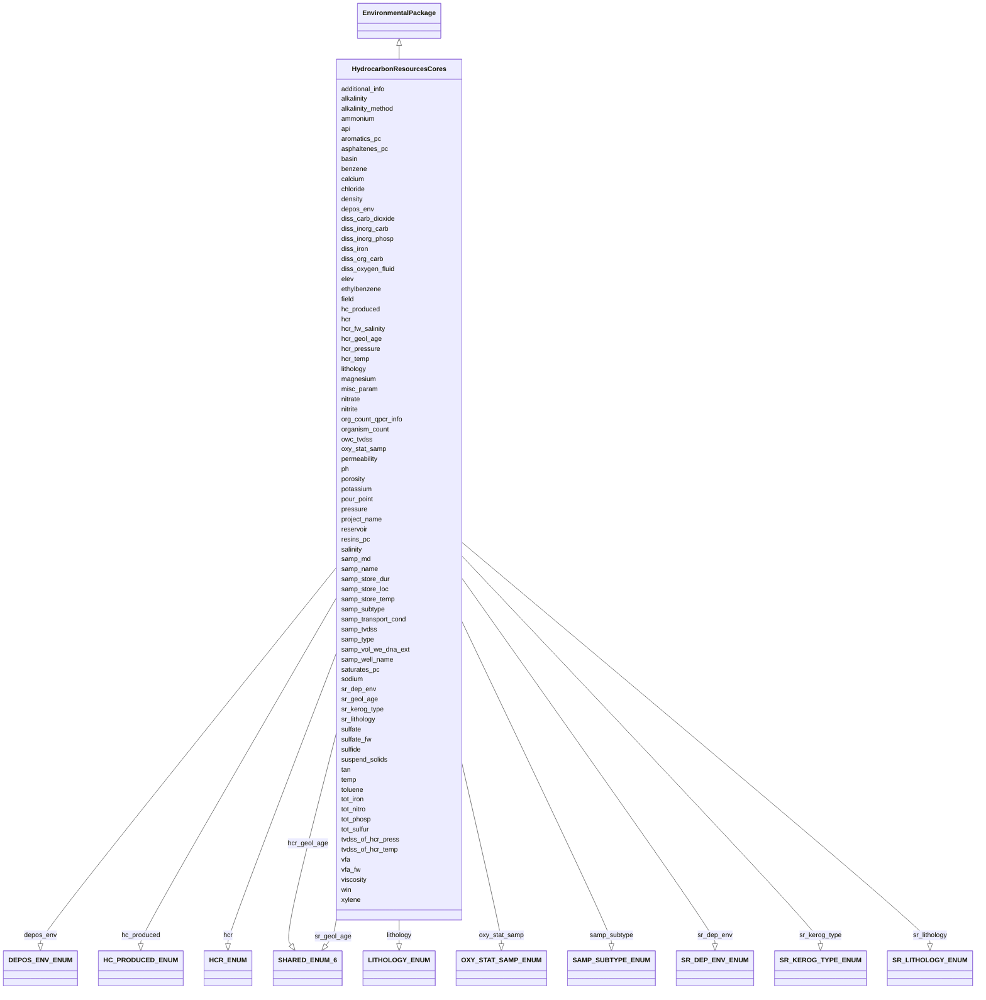

# Class: HydrocarbonResourcesCores


URI: [mixs_6_2_proposal:HydrocarbonResourcesCores](https://turbomam.github.io/mixs-envo-struct-knowl-extraction/HydrocarbonResourcesCores)





## Inheritance
* [EnvironmentalPackage](EnvironmentalPackage.md)
    * **HydrocarbonResourcesCores**


## Slots

| Name | Cardinality and Range | Description | Inheritance |
| ---  | --- | --- | --- |
| [samp_name](samp_name.md) | 1..1 <br/> [String](String.md) | A local identifier or name that for the material sample used for extracting n... | direct |
| [project_name](project_name.md) | 1..1 <br/> [String](String.md) | Name of the project within which the sequencing was organized | direct |
| [hcr](hcr.md) | 1..1 <br/> [HCRENUM](HCRENUM.md) | Main Hydrocarbon Resource type | direct |
| [hc_produced](hc_produced.md) | 1..1 <br/> [HCPRODUCEDENUM](HCPRODUCEDENUM.md) | Main hydrocarbon type produced from resource (i | direct |
| [basin](basin.md) | 1..1 <br/> [String](String.md) | Name of the basin (e | direct |
| [field](field.md) | 0..1 _recommended_ <br/> [String](String.md) | Name of the hydrocarbon field (e | direct |
| [reservoir](reservoir.md) | 0..1 _recommended_ <br/> [String](String.md) | Name of the reservoir (e | direct |
| [hcr_temp](hcr_temp.md) | 1..1 <br/> [String](String.md) | Original temperature of the hydrocarbon resource | direct |
| [tvdss_of_hcr_temp](tvdss_of_hcr_temp.md) | 0..1 <br/> [String](String.md) | True vertical depth subsea (TVDSS) of the hydrocarbon resource where the orig... | direct |
| [hcr_pressure](hcr_pressure.md) | 0..1 <br/> [String](String.md) | Original pressure of the hydrocarbon resource | direct |
| [tvdss_of_hcr_press](tvdss_of_hcr_press.md) | 0..1 <br/> [String](String.md) | True vertical depth subsea (TVDSS) of the hydrocarbon resource where the orig... | direct |
| [permeability](permeability.md) | 0..1 <br/> [String](String.md) | Measure of the ability of a hydrocarbon resource to allow fluids to pass thro... | direct |
| [porosity](porosity.md) | 0..1 <br/> [String](String.md) | Porosity of deposited sediment is volume of voids divided by the total volume... | direct |
| [lithology](lithology.md) | 0..1 _recommended_ <br/> [LITHOLOGYENUM](LITHOLOGYENUM.md) | Hydrocarbon resource main lithology (Additional information: http://petrowiki | direct |
| [depos_env](depos_env.md) | 0..1 _recommended_ <br/> [DEPOSENVENUM](DEPOSENVENUM.md) | Main depositional environment (https://en | direct |
| [hcr_geol_age](hcr_geol_age.md) | 0..1 _recommended_ <br/> [SHAREDENUM6](SHAREDENUM6.md) | Geological age of hydrocarbon resource (Additional info: https://en | direct |
| [owc_tvdss](owc_tvdss.md) | 0..1 <br/> [String](String.md) | Depth of the original oil water contact (OWC) zone (average) (m TVDSS) | direct |
| [hcr_fw_salinity](hcr_fw_salinity.md) | 0..1 _recommended_ <br/> [String](String.md) | Original formation water salinity (prior to secondary recovery e | direct |
| [sulfate_fw](sulfate_fw.md) | 1..1 <br/> [String](String.md) | Original sulfate concentration in the hydrocarbon resource | direct |
| [vfa_fw](vfa_fw.md) | 1..1 <br/> [String](String.md) | Original volatile fatty acid concentration in the hydrocarbon resource | direct |
| [sr_kerog_type](sr_kerog_type.md) | 0..1 <br/> [SRKEROGTYPEENUM](SRKEROGTYPEENUM.md) | Origin of kerogen | direct |
| [sr_lithology](sr_lithology.md) | 0..1 <br/> [SRLITHOLOGYENUM](SRLITHOLOGYENUM.md) | Lithology of source rock (https://en | direct |
| [sr_dep_env](sr_dep_env.md) | 0..1 <br/> [SRDEPENVENUM](SRDEPENVENUM.md) | Source rock depositional environment (https://en | direct |
| [sr_geol_age](sr_geol_age.md) | 0..1 <br/> [SHAREDENUM6](SHAREDENUM6.md) | Geological age of source rock (Additional info: https://en | direct |
| [samp_well_name](samp_well_name.md) | 0..1 _recommended_ <br/> [String](String.md) | Name of the well (e | direct |
| [win](win.md) | 0..1 _recommended_ <br/> [String](String.md) | A unique identifier of a well or wellbore | direct |
| [samp_type](samp_type.md) | 1..1 <br/> [String](String.md) | The type of material from which the sample was obtained | direct |
| [samp_subtype](samp_subtype.md) | 0..1 _recommended_ <br/> [SAMPSUBTYPEENUM](SAMPSUBTYPEENUM.md) | Name of sample sub-type | direct |
| [temp](temp.md) | 1..1 <br/> [String](String.md) | Temperature of the sample at the time of sampling | direct |
| [pressure](pressure.md) | 0..1 <br/> [String](String.md) | Pressure to which the sample is subject to, in atmospheres | direct |
| [samp_tvdss](samp_tvdss.md) | 0..1 _recommended_ <br/> [String](String.md) | Depth of the sample i | direct |
| [samp_md](samp_md.md) | 0..1 <br/> [String](String.md) | In non deviated well, measured depth is equal to the true vertical depth, TVD... | direct |
| [elev](elev.md) | 0..1 <br/> [String](String.md) | Elevation of the sampling site is its height above a fixed reference point, m... | direct |
| [oxy_stat_samp](oxy_stat_samp.md) | 0..1 <br/> [OXYSTATSAMPENUM](OXYSTATSAMPENUM.md) | Oxygenation status of sample | direct |
| [samp_transport_cond](samp_transport_cond.md) | 0..1 <br/> [String](String.md) | Sample transport duration (in days or hrs) and temperature the sample was exp... | direct |
| [samp_store_temp](samp_store_temp.md) | 0..1 <br/> [String](String.md) | Temperature at which sample was stored, e | direct |
| [samp_store_dur](samp_store_dur.md) | 0..1 <br/> [String](String.md) | Duration for which the sample was stored | direct |
| [samp_store_loc](samp_store_loc.md) | 0..1 <br/> [String](String.md) | Location at which sample was stored, usually name of a specific freezer/room | direct |
| [samp_vol_we_dna_ext](samp_vol_we_dna_ext.md) | 0..1 _recommended_ <br/> [String](String.md) | Volume (ml) or mass (g) of total collected sample processed for DNA extractio... | direct |
| [organism_count](organism_count.md) | 0..* _recommended_ <br/> [String](String.md) | Total cell count of any organism (or group of organisms) per gram, volume or ... | direct |
| [org_count_qpcr_info](org_count_qpcr_info.md) | 0..1 <br/> [String](String.md) | If qpcr was used for the cell count, the target gene name, the primer sequenc... | direct |
| [ph](ph.md) | 0..1 _recommended_ <br/> [Float](Float.md) | Ph measurement of the sample, or liquid portion of sample, or aqueous phase o... | direct |
| [salinity](salinity.md) | 0..1 <br/> [String](String.md) | The total concentration of all dissolved salts in a liquid or solid sample | direct |
| [alkalinity](alkalinity.md) | 0..1 <br/> [String](String.md) | Alkalinity, the ability of a solution to neutralize acids to the equivalence ... | direct |
| [alkalinity_method](alkalinity_method.md) | 0..1 <br/> [String](String.md) | Method used for alkalinity measurement | direct |
| [sulfate](sulfate.md) | 0..1 _recommended_ <br/> [String](String.md) | Concentration of sulfate in the sample | direct |
| [sulfide](sulfide.md) | 0..1 _recommended_ <br/> [String](String.md) | Concentration of sulfide in the sample | direct |
| [tot_sulfur](tot_sulfur.md) | 0..1 _recommended_ <br/> [String](String.md) | Concentration of total sulfur in the sample | direct |
| [nitrate](nitrate.md) | 0..1 _recommended_ <br/> [String](String.md) | Concentration of nitrate in the sample | direct |
| [nitrite](nitrite.md) | 0..1 _recommended_ <br/> [String](String.md) | Concentration of nitrite in the sample | direct |
| [ammonium](ammonium.md) | 0..1 _recommended_ <br/> [String](String.md) | Concentration of ammonium in the sample | direct |
| [tot_nitro](tot_nitro.md) | 0..1 <br/> [String](String.md) | Total nitrogen concentration of water samples, calculated by: total nitrogen ... | direct |
| [diss_iron](diss_iron.md) | 0..1 _recommended_ <br/> [String](String.md) | Concentration of dissolved iron in the sample | direct |
| [sodium](sodium.md) | 0..1 <br/> [String](String.md) | Sodium concentration in the sample | direct |
| [chloride](chloride.md) | 0..1 <br/> [String](String.md) | Concentration of chloride in the sample | direct |
| [potassium](potassium.md) | 0..1 <br/> [String](String.md) | Concentration of potassium in the sample | direct |
| [magnesium](magnesium.md) | 0..1 <br/> [String](String.md) | Concentration of magnesium in the sample | direct |
| [calcium](calcium.md) | 0..1 <br/> [String](String.md) | Concentration of calcium in the sample | direct |
| [tot_iron](tot_iron.md) | 0..1 _recommended_ <br/> [String](String.md) | Concentration of total iron in the sample | direct |
| [diss_org_carb](diss_org_carb.md) | 0..1 <br/> [String](String.md) | Concentration of dissolved organic carbon in the sample, liquid portion of th... | direct |
| [diss_inorg_carb](diss_inorg_carb.md) | 0..1 <br/> [String](String.md) | Dissolved inorganic carbon concentration in the sample, typically measured af... | direct |
| [diss_inorg_phosp](diss_inorg_phosp.md) | 0..1 _recommended_ <br/> [String](String.md) | Concentration of dissolved inorganic phosphorus in the sample | direct |
| [tot_phosp](tot_phosp.md) | 0..1 <br/> [String](String.md) | Total phosphorus concentration in the sample, calculated by: total phosphorus... | direct |
| [suspend_solids](suspend_solids.md) | 0..* <br/> [String](String.md) | Concentration of substances including a wide variety of material, such as sil... | direct |
| [density](density.md) | 0..1 <br/> [String](String.md) | Density of the sample, which is its mass per unit volume (aka volumetric mass... | direct |
| [diss_carb_dioxide](diss_carb_dioxide.md) | 0..1 <br/> [String](String.md) | Concentration of dissolved carbon dioxide in the sample or liquid portion of ... | direct |
| [diss_oxygen_fluid](diss_oxygen_fluid.md) | 0..1 <br/> [String](String.md) | Concentration of dissolved oxygen in the oil field produced fluids as it cont... | direct |
| [vfa](vfa.md) | 0..1 _recommended_ <br/> [String](String.md) | Concentration of Volatile Fatty Acids in the sample | direct |
| [benzene](benzene.md) | 0..1 _recommended_ <br/> [String](String.md) | Concentration of benzene in the sample | direct |
| [toluene](toluene.md) | 0..1 _recommended_ <br/> [String](String.md) | Concentration of toluene in the sample | direct |
| [ethylbenzene](ethylbenzene.md) | 0..1 _recommended_ <br/> [String](String.md) | Concentration of ethylbenzene in the sample | direct |
| [xylene](xylene.md) | 0..1 _recommended_ <br/> [String](String.md) | Concentration of xylene in the sample | direct |
| [api](api.md) | 1..1 <br/> [String](String.md) | API gravity is a measure of how heavy or light a petroleum liquid is compared... | direct |
| [tan](tan.md) | 0..1 _recommended_ <br/> [String](String.md) | Total Acid Number(TAN) is a measurement of acidity that is determined by the ... | direct |
| [viscosity](viscosity.md) | 0..1 <br/> [String](String.md) | A measure of oil's resistanceto gradual deformation byshear stressortensile s... | direct |
| [pour_point](pour_point.md) | 0..1 <br/> [String](String.md) | Temperature at which a liquid becomes semi solid and loses its flow character... | direct |
| [saturates_pc](saturates_pc.md) | 0..1 _recommended_ <br/> [String](String.md) | Saturate, Aromatic, Resin and Asphaltene(SARA) is an analysis method that div... | direct |
| [aromatics_pc](aromatics_pc.md) | 0..1 _recommended_ <br/> [String](String.md) | Saturate, Aromatic, Resin and Asphaltene(SARA) is an analysis method that div... | direct |
| [resins_pc](resins_pc.md) | 0..1 _recommended_ <br/> [String](String.md) | Saturate, Aromatic, Resin and Asphaltene(SARA) is an analysis method that div... | direct |
| [asphaltenes_pc](asphaltenes_pc.md) | 0..1 _recommended_ <br/> [String](String.md) | Saturate, Aromatic, Resin and Asphaltene(SARA) is an analysis method that div... | direct |
| [misc_param](misc_param.md) | 0..* <br/> [String](String.md) | Any other measurement performed or parameter collected, that is not listed he... | direct |
| [additional_info](additional_info.md) | 0..1 <br/> [String](String.md) | Information that doesn't fit anywhere else | direct |


## Identifier and Mapping Information


### Schema Source


* from schema: https://turbomam.github.io/mixs-envo-struct-knowl-extraction//mixs_6_2_proposal


## Mappings

| Mapping Type | Mapped Value |
| ---  | ---  |
| self | mixs_6_2_proposal:HydrocarbonResourcesCores |
| native | mixs_6_2_proposal:HydrocarbonResourcesCores |


## LinkML Source

<!-- TODO: investigate https://stackoverflow.com/questions/37606292/how-to-create-tabbed-code-blocks-in-mkdocs-or-sphinx -->

### Direct

<details>
```yaml
name: HydrocarbonResourcesCores
title: HydrocarbonResourcesCores
from_schema: https://turbomam.github.io/mixs-envo-struct-knowl-extraction//mixs_6_2_proposal
is_a: EnvironmentalPackage
mixin: false
slots:
- samp_name
- project_name
- hcr
- hc_produced
- basin
- field
- reservoir
- hcr_temp
- tvdss_of_hcr_temp
- hcr_pressure
- tvdss_of_hcr_press
- permeability
- porosity
- lithology
- depos_env
- hcr_geol_age
- owc_tvdss
- hcr_fw_salinity
- sulfate_fw
- vfa_fw
- sr_kerog_type
- sr_lithology
- sr_dep_env
- sr_geol_age
- samp_well_name
- win
- samp_type
- samp_subtype
- temp
- pressure
- samp_tvdss
- samp_md
- elev
- oxy_stat_samp
- samp_transport_cond
- samp_store_temp
- samp_store_dur
- samp_store_loc
- samp_vol_we_dna_ext
- organism_count
- org_count_qpcr_info
- ph
- salinity
- alkalinity
- alkalinity_method
- sulfate
- sulfide
- tot_sulfur
- nitrate
- nitrite
- ammonium
- tot_nitro
- diss_iron
- sodium
- chloride
- potassium
- magnesium
- calcium
- tot_iron
- diss_org_carb
- diss_inorg_carb
- diss_inorg_phosp
- tot_phosp
- suspend_solids
- density
- diss_carb_dioxide
- diss_oxygen_fluid
- vfa
- benzene
- toluene
- ethylbenzene
- xylene
- api
- tan
- viscosity
- pour_point
- saturates_pc
- aromatics_pc
- resins_pc
- asphaltenes_pc
- misc_param
- additional_info
slot_usage:
  ammonium:
    name: ammonium
    domain_of:
    - HydrocarbonResourcesCores
    - HydrocarbonResourcesFluidsSwabs
    - MicrobialMatBiofilm
    - MiscellaneousNaturalOrArtificialEnvironment
    - Sediment
    - Water
    recommended: true
  density:
    name: density
    domain_of:
    - HydrocarbonResourcesCores
    - HydrocarbonResourcesFluidsSwabs
    - MiscellaneousNaturalOrArtificialEnvironment
    - Sediment
    - Water
  depos_env:
    name: depos_env
    examples:
    - value: Continental - Alluvial
    domain_of:
    - HydrocarbonResourcesCores
    - HydrocarbonResourcesFluidsSwabs
  diss_inorg_carb:
    name: diss_inorg_carb
    domain_of:
    - HydrocarbonResourcesCores
    - HydrocarbonResourcesFluidsSwabs
    - MicrobialMatBiofilm
    - MiscellaneousNaturalOrArtificialEnvironment
    - Sediment
    - Water
  diss_inorg_phosp:
    name: diss_inorg_phosp
    domain_of:
    - HydrocarbonResourcesCores
    - HydrocarbonResourcesFluidsSwabs
    - Water
    recommended: true
  elev:
    name: elev
    domain_of:
    - Agriculture
    - Air
    - HostAssociated
    - HydrocarbonResourcesCores
    - MicrobialMatBiofilm
    - MigsBa
    - MigsEu
    - MigsOrg
    - MigsPl
    - MigsVi
    - Mimag
    - MimarksC
    - MimarksS
    - Mims
    - Misag
    - MiscellaneousNaturalOrArtificialEnvironment
    - Miuvig
    - PlantAssociated
    - Sediment
    - Soil
    - SymbiontAssociated
    - Water
    required: false
    recommended: false
  hcr_temp:
    name: hcr_temp
    domain_of:
    - HydrocarbonResourcesCores
    - HydrocarbonResourcesFluidsSwabs
    required: true
  misc_param:
    name: misc_param
    domain_of:
    - Agriculture
    - Air
    - FoodAnimalAndAnimalFeed
    - FoodFarmEnvironment
    - FoodFoodProductionFacility
    - FoodHumanFoods
    - HostAssociated
    - HumanAssociated
    - HumanGut
    - HumanOral
    - HumanSkin
    - HumanVaginal
    - HydrocarbonResourcesCores
    - HydrocarbonResourcesFluidsSwabs
    - MicrobialMatBiofilm
    - MiscellaneousNaturalOrArtificialEnvironment
    - PlantAssociated
    - Sediment
    - Soil
    - SymbiontAssociated
    - WastewaterSludge
    - Water
  nitrate:
    name: nitrate
    domain_of:
    - HydrocarbonResourcesCores
    - HydrocarbonResourcesFluidsSwabs
    - MicrobialMatBiofilm
    - MiscellaneousNaturalOrArtificialEnvironment
    - Sediment
    - WastewaterSludge
    - Water
    recommended: true
  nitrite:
    name: nitrite
    domain_of:
    - HydrocarbonResourcesCores
    - HydrocarbonResourcesFluidsSwabs
    - MicrobialMatBiofilm
    - MiscellaneousNaturalOrArtificialEnvironment
    - Sediment
    - Water
    recommended: true
  organism_count:
    name: organism_count
    description: 'Total cell count of any organism (or group of organisms) per gram,
      volume or area of sample, should include name of organism followed by count.
      The method that was used for the enumeration (e.g. qPCR, atp, mpn, etc.) Should
      also be provided. (example: total prokaryotes; 3.5e7 cells per ml; qpcr)'
    examples:
    - value: total prokaryotes;3.5e7 cells per milliliter;qPCR
    string_serialization: '{text};{float} {unit};[qPCR|ATP|MPN|other]'
    multivalued: true
    domain_of:
    - Agriculture
    - Air
    - BuiltEnvironment
    - FoodAnimalAndAnimalFeed
    - FoodFarmEnvironment
    - FoodFoodProductionFacility
    - FoodHumanFoods
    - HostAssociated
    - HumanAssociated
    - HumanGut
    - HumanOral
    - HumanSkin
    - HumanVaginal
    - HydrocarbonResourcesCores
    - HydrocarbonResourcesFluidsSwabs
    - MicrobialMatBiofilm
    - MiscellaneousNaturalOrArtificialEnvironment
    - PlantAssociated
    - Sediment
    - SymbiontAssociated
    - WastewaterSludge
    - Water
    recommended: true
  oxy_stat_samp:
    name: oxy_stat_samp
    domain_of:
    - Agriculture
    - Air
    - HostAssociated
    - HumanAssociated
    - HumanGut
    - HumanOral
    - HumanSkin
    - HumanVaginal
    - HydrocarbonResourcesCores
    - HydrocarbonResourcesFluidsSwabs
    - MicrobialMatBiofilm
    - MiscellaneousNaturalOrArtificialEnvironment
    - PlantAssociated
    - Sediment
    - SymbiontAssociated
    - WastewaterSludge
    - Water
    required: false
    recommended: false
  ph:
    name: ph
    description: Ph measurement of the sample, or liquid portion of sample, or aqueous
      phase of the fluid
    domain_of:
    - FoodFarmEnvironment
    - HydrocarbonResourcesCores
    - HydrocarbonResourcesFluidsSwabs
    - MicrobialMatBiofilm
    - MiscellaneousNaturalOrArtificialEnvironment
    - Sediment
    - Soil
    - WastewaterSludge
    - Water
    recommended: true
  salinity:
    name: salinity
    multivalued: false
    domain_of:
    - Air
    - FoodFarmEnvironment
    - HostAssociated
    - HumanAssociated
    - HumanGut
    - HumanOral
    - HumanSkin
    - HumanVaginal
    - HydrocarbonResourcesCores
    - HydrocarbonResourcesFluidsSwabs
    - MicrobialMatBiofilm
    - MiscellaneousNaturalOrArtificialEnvironment
    - PlantAssociated
    - Sediment
    - SymbiontAssociated
    - WastewaterSludge
    - Water
  samp_store_dur:
    name: samp_store_dur
    description: Duration for which the sample was stored
    string_serialization: '{duration}'
    domain_of:
    - Agriculture
    - Air
    - FoodAnimalAndAnimalFeed
    - FoodFarmEnvironment
    - FoodFoodProductionFacility
    - FoodHumanFoods
    - HostAssociated
    - HumanAssociated
    - HumanGut
    - HumanOral
    - HumanSkin
    - HumanVaginal
    - HydrocarbonResourcesCores
    - HydrocarbonResourcesFluidsSwabs
    - MicrobialMatBiofilm
    - MiscellaneousNaturalOrArtificialEnvironment
    - PlantAssociated
    - Sediment
    - SymbiontAssociated
    - WastewaterSludge
    - Water
    required: false
    recommended: false
  samp_store_loc:
    name: samp_store_loc
    description: Location at which sample was stored, usually name of a specific freezer/room
    examples:
    - value: Freezer no:5
    domain_of:
    - Agriculture
    - Air
    - FoodAnimalAndAnimalFeed
    - FoodFoodProductionFacility
    - FoodHumanFoods
    - HostAssociated
    - HumanAssociated
    - HumanGut
    - HumanOral
    - HumanSkin
    - HumanVaginal
    - HydrocarbonResourcesCores
    - HydrocarbonResourcesFluidsSwabs
    - MicrobialMatBiofilm
    - MiscellaneousNaturalOrArtificialEnvironment
    - PlantAssociated
    - Sediment
    - SymbiontAssociated
    - WastewaterSludge
    - Water
    required: false
    recommended: false
  samp_vol_we_dna_ext:
    name: samp_vol_we_dna_ext
    description: 'Volume (ml) or mass (g) of total collected sample processed for
      DNA extraction. Note: total sample collected should be entered under the term
      Sample Size (MIXS:0000001).'
    domain_of:
    - Agriculture
    - Air
    - FoodAnimalAndAnimalFeed
    - FoodFarmEnvironment
    - FoodFoodProductionFacility
    - FoodHumanFoods
    - HostAssociated
    - HumanAssociated
    - HumanGut
    - HumanOral
    - HumanSkin
    - HumanVaginal
    - HydrocarbonResourcesCores
    - HydrocarbonResourcesFluidsSwabs
    - MicrobialMatBiofilm
    - MigsBa
    - MigsEu
    - MigsOrg
    - MigsPl
    - MigsVi
    - Mimag
    - MimarksC
    - MimarksS
    - Mims
    - Misag
    - MiscellaneousNaturalOrArtificialEnvironment
    - Miuvig
    - PlantAssociated
    - Sediment
    - Soil
    - SymbiontAssociated
    - WastewaterSludge
    - Water
    recommended: true
  sulfate:
    name: sulfate
    domain_of:
    - HydrocarbonResourcesCores
    - HydrocarbonResourcesFluidsSwabs
    - MicrobialMatBiofilm
    - MiscellaneousNaturalOrArtificialEnvironment
    - Sediment
    - Water
    recommended: true
  sulfate_fw:
    name: sulfate_fw
    domain_of:
    - HydrocarbonResourcesCores
    - HydrocarbonResourcesFluidsSwabs
    required: true
  sulfide:
    name: sulfide
    domain_of:
    - HydrocarbonResourcesCores
    - HydrocarbonResourcesFluidsSwabs
    - MicrobialMatBiofilm
    - MiscellaneousNaturalOrArtificialEnvironment
    - Sediment
    - Water
    recommended: true
  temp:
    name: temp
    domain_of:
    - Agriculture
    - Air
    - FoodAnimalAndAnimalFeed
    - FoodFarmEnvironment
    - FoodHumanFoods
    - HostAssociated
    - HumanAssociated
    - HumanGut
    - HumanOral
    - HumanSkin
    - HumanVaginal
    - HydrocarbonResourcesCores
    - HydrocarbonResourcesFluidsSwabs
    - MicrobialMatBiofilm
    - MigsBa
    - MigsEu
    - MigsOrg
    - MigsPl
    - MigsVi
    - Mimag
    - MimarksC
    - MimarksS
    - Mims
    - Misag
    - MiscellaneousNaturalOrArtificialEnvironment
    - Miuvig
    - PlantAssociated
    - Sediment
    - Soil
    - SymbiontAssociated
    - WastewaterSludge
    - Water
    required: true
  tot_phosp:
    name: tot_phosp
    title: total phosphorus
    domain_of:
    - Agriculture
    - HydrocarbonResourcesCores
    - HydrocarbonResourcesFluidsSwabs
    - Water
    required: false
    recommended: false
  tvdss_of_hcr_press:
    name: tvdss_of_hcr_press
    description: True vertical depth subsea (TVDSS) of the hydrocarbon resource where
      the original pressure was measured (e.g. 1578 m).
    domain_of:
    - HydrocarbonResourcesCores
    - HydrocarbonResourcesFluidsSwabs
  vfa_fw:
    name: vfa_fw
    domain_of:
    - HydrocarbonResourcesCores
    - HydrocarbonResourcesFluidsSwabs
    required: true

```
</details>

### Induced

<details>
```yaml
name: HydrocarbonResourcesCores
title: HydrocarbonResourcesCores
from_schema: https://turbomam.github.io/mixs-envo-struct-knowl-extraction//mixs_6_2_proposal
is_a: EnvironmentalPackage
mixin: false
slot_usage:
  ammonium:
    name: ammonium
    domain_of:
    - HydrocarbonResourcesCores
    - HydrocarbonResourcesFluidsSwabs
    - MicrobialMatBiofilm
    - MiscellaneousNaturalOrArtificialEnvironment
    - Sediment
    - Water
    recommended: true
  density:
    name: density
    domain_of:
    - HydrocarbonResourcesCores
    - HydrocarbonResourcesFluidsSwabs
    - MiscellaneousNaturalOrArtificialEnvironment
    - Sediment
    - Water
  depos_env:
    name: depos_env
    examples:
    - value: Continental - Alluvial
    domain_of:
    - HydrocarbonResourcesCores
    - HydrocarbonResourcesFluidsSwabs
  diss_inorg_carb:
    name: diss_inorg_carb
    domain_of:
    - HydrocarbonResourcesCores
    - HydrocarbonResourcesFluidsSwabs
    - MicrobialMatBiofilm
    - MiscellaneousNaturalOrArtificialEnvironment
    - Sediment
    - Water
  diss_inorg_phosp:
    name: diss_inorg_phosp
    domain_of:
    - HydrocarbonResourcesCores
    - HydrocarbonResourcesFluidsSwabs
    - Water
    recommended: true
  elev:
    name: elev
    domain_of:
    - Agriculture
    - Air
    - HostAssociated
    - HydrocarbonResourcesCores
    - MicrobialMatBiofilm
    - MigsBa
    - MigsEu
    - MigsOrg
    - MigsPl
    - MigsVi
    - Mimag
    - MimarksC
    - MimarksS
    - Mims
    - Misag
    - MiscellaneousNaturalOrArtificialEnvironment
    - Miuvig
    - PlantAssociated
    - Sediment
    - Soil
    - SymbiontAssociated
    - Water
    required: false
    recommended: false
  hcr_temp:
    name: hcr_temp
    domain_of:
    - HydrocarbonResourcesCores
    - HydrocarbonResourcesFluidsSwabs
    required: true
  misc_param:
    name: misc_param
    domain_of:
    - Agriculture
    - Air
    - FoodAnimalAndAnimalFeed
    - FoodFarmEnvironment
    - FoodFoodProductionFacility
    - FoodHumanFoods
    - HostAssociated
    - HumanAssociated
    - HumanGut
    - HumanOral
    - HumanSkin
    - HumanVaginal
    - HydrocarbonResourcesCores
    - HydrocarbonResourcesFluidsSwabs
    - MicrobialMatBiofilm
    - MiscellaneousNaturalOrArtificialEnvironment
    - PlantAssociated
    - Sediment
    - Soil
    - SymbiontAssociated
    - WastewaterSludge
    - Water
  nitrate:
    name: nitrate
    domain_of:
    - HydrocarbonResourcesCores
    - HydrocarbonResourcesFluidsSwabs
    - MicrobialMatBiofilm
    - MiscellaneousNaturalOrArtificialEnvironment
    - Sediment
    - WastewaterSludge
    - Water
    recommended: true
  nitrite:
    name: nitrite
    domain_of:
    - HydrocarbonResourcesCores
    - HydrocarbonResourcesFluidsSwabs
    - MicrobialMatBiofilm
    - MiscellaneousNaturalOrArtificialEnvironment
    - Sediment
    - Water
    recommended: true
  organism_count:
    name: organism_count
    description: 'Total cell count of any organism (or group of organisms) per gram,
      volume or area of sample, should include name of organism followed by count.
      The method that was used for the enumeration (e.g. qPCR, atp, mpn, etc.) Should
      also be provided. (example: total prokaryotes; 3.5e7 cells per ml; qpcr)'
    examples:
    - value: total prokaryotes;3.5e7 cells per milliliter;qPCR
    string_serialization: '{text};{float} {unit};[qPCR|ATP|MPN|other]'
    multivalued: true
    domain_of:
    - Agriculture
    - Air
    - BuiltEnvironment
    - FoodAnimalAndAnimalFeed
    - FoodFarmEnvironment
    - FoodFoodProductionFacility
    - FoodHumanFoods
    - HostAssociated
    - HumanAssociated
    - HumanGut
    - HumanOral
    - HumanSkin
    - HumanVaginal
    - HydrocarbonResourcesCores
    - HydrocarbonResourcesFluidsSwabs
    - MicrobialMatBiofilm
    - MiscellaneousNaturalOrArtificialEnvironment
    - PlantAssociated
    - Sediment
    - SymbiontAssociated
    - WastewaterSludge
    - Water
    recommended: true
  oxy_stat_samp:
    name: oxy_stat_samp
    domain_of:
    - Agriculture
    - Air
    - HostAssociated
    - HumanAssociated
    - HumanGut
    - HumanOral
    - HumanSkin
    - HumanVaginal
    - HydrocarbonResourcesCores
    - HydrocarbonResourcesFluidsSwabs
    - MicrobialMatBiofilm
    - MiscellaneousNaturalOrArtificialEnvironment
    - PlantAssociated
    - Sediment
    - SymbiontAssociated
    - WastewaterSludge
    - Water
    required: false
    recommended: false
  ph:
    name: ph
    description: Ph measurement of the sample, or liquid portion of sample, or aqueous
      phase of the fluid
    domain_of:
    - FoodFarmEnvironment
    - HydrocarbonResourcesCores
    - HydrocarbonResourcesFluidsSwabs
    - MicrobialMatBiofilm
    - MiscellaneousNaturalOrArtificialEnvironment
    - Sediment
    - Soil
    - WastewaterSludge
    - Water
    recommended: true
  salinity:
    name: salinity
    multivalued: false
    domain_of:
    - Air
    - FoodFarmEnvironment
    - HostAssociated
    - HumanAssociated
    - HumanGut
    - HumanOral
    - HumanSkin
    - HumanVaginal
    - HydrocarbonResourcesCores
    - HydrocarbonResourcesFluidsSwabs
    - MicrobialMatBiofilm
    - MiscellaneousNaturalOrArtificialEnvironment
    - PlantAssociated
    - Sediment
    - SymbiontAssociated
    - WastewaterSludge
    - Water
  samp_store_dur:
    name: samp_store_dur
    description: Duration for which the sample was stored
    string_serialization: '{duration}'
    domain_of:
    - Agriculture
    - Air
    - FoodAnimalAndAnimalFeed
    - FoodFarmEnvironment
    - FoodFoodProductionFacility
    - FoodHumanFoods
    - HostAssociated
    - HumanAssociated
    - HumanGut
    - HumanOral
    - HumanSkin
    - HumanVaginal
    - HydrocarbonResourcesCores
    - HydrocarbonResourcesFluidsSwabs
    - MicrobialMatBiofilm
    - MiscellaneousNaturalOrArtificialEnvironment
    - PlantAssociated
    - Sediment
    - SymbiontAssociated
    - WastewaterSludge
    - Water
    required: false
    recommended: false
  samp_store_loc:
    name: samp_store_loc
    description: Location at which sample was stored, usually name of a specific freezer/room
    examples:
    - value: Freezer no:5
    domain_of:
    - Agriculture
    - Air
    - FoodAnimalAndAnimalFeed
    - FoodFoodProductionFacility
    - FoodHumanFoods
    - HostAssociated
    - HumanAssociated
    - HumanGut
    - HumanOral
    - HumanSkin
    - HumanVaginal
    - HydrocarbonResourcesCores
    - HydrocarbonResourcesFluidsSwabs
    - MicrobialMatBiofilm
    - MiscellaneousNaturalOrArtificialEnvironment
    - PlantAssociated
    - Sediment
    - SymbiontAssociated
    - WastewaterSludge
    - Water
    required: false
    recommended: false
  samp_vol_we_dna_ext:
    name: samp_vol_we_dna_ext
    description: 'Volume (ml) or mass (g) of total collected sample processed for
      DNA extraction. Note: total sample collected should be entered under the term
      Sample Size (MIXS:0000001).'
    domain_of:
    - Agriculture
    - Air
    - FoodAnimalAndAnimalFeed
    - FoodFarmEnvironment
    - FoodFoodProductionFacility
    - FoodHumanFoods
    - HostAssociated
    - HumanAssociated
    - HumanGut
    - HumanOral
    - HumanSkin
    - HumanVaginal
    - HydrocarbonResourcesCores
    - HydrocarbonResourcesFluidsSwabs
    - MicrobialMatBiofilm
    - MigsBa
    - MigsEu
    - MigsOrg
    - MigsPl
    - MigsVi
    - Mimag
    - MimarksC
    - MimarksS
    - Mims
    - Misag
    - MiscellaneousNaturalOrArtificialEnvironment
    - Miuvig
    - PlantAssociated
    - Sediment
    - Soil
    - SymbiontAssociated
    - WastewaterSludge
    - Water
    recommended: true
  sulfate:
    name: sulfate
    domain_of:
    - HydrocarbonResourcesCores
    - HydrocarbonResourcesFluidsSwabs
    - MicrobialMatBiofilm
    - MiscellaneousNaturalOrArtificialEnvironment
    - Sediment
    - Water
    recommended: true
  sulfate_fw:
    name: sulfate_fw
    domain_of:
    - HydrocarbonResourcesCores
    - HydrocarbonResourcesFluidsSwabs
    required: true
  sulfide:
    name: sulfide
    domain_of:
    - HydrocarbonResourcesCores
    - HydrocarbonResourcesFluidsSwabs
    - MicrobialMatBiofilm
    - MiscellaneousNaturalOrArtificialEnvironment
    - Sediment
    - Water
    recommended: true
  temp:
    name: temp
    domain_of:
    - Agriculture
    - Air
    - FoodAnimalAndAnimalFeed
    - FoodFarmEnvironment
    - FoodHumanFoods
    - HostAssociated
    - HumanAssociated
    - HumanGut
    - HumanOral
    - HumanSkin
    - HumanVaginal
    - HydrocarbonResourcesCores
    - HydrocarbonResourcesFluidsSwabs
    - MicrobialMatBiofilm
    - MigsBa
    - MigsEu
    - MigsOrg
    - MigsPl
    - MigsVi
    - Mimag
    - MimarksC
    - MimarksS
    - Mims
    - Misag
    - MiscellaneousNaturalOrArtificialEnvironment
    - Miuvig
    - PlantAssociated
    - Sediment
    - Soil
    - SymbiontAssociated
    - WastewaterSludge
    - Water
    required: true
  tot_phosp:
    name: tot_phosp
    title: total phosphorus
    domain_of:
    - Agriculture
    - HydrocarbonResourcesCores
    - HydrocarbonResourcesFluidsSwabs
    - Water
    required: false
    recommended: false
  tvdss_of_hcr_press:
    name: tvdss_of_hcr_press
    description: True vertical depth subsea (TVDSS) of the hydrocarbon resource where
      the original pressure was measured (e.g. 1578 m).
    domain_of:
    - HydrocarbonResourcesCores
    - HydrocarbonResourcesFluidsSwabs
  vfa_fw:
    name: vfa_fw
    domain_of:
    - HydrocarbonResourcesCores
    - HydrocarbonResourcesFluidsSwabs
    required: true
attributes:
  samp_name:
    name: samp_name
    description: A local identifier or name that for the material sample used for
      extracting nucleic acids, and subsequent sequencing. It can refer either to
      the original material collected or to any derived sub-samples. It can have any
      format, but we suggest that you make it concise, unique and consistent within
      your lab, and as informative as possible. INSDC requires every sample name from
      a single Submitter to be unique. Use of a globally unique identifier for the
      field source_mat_id is recommended in addition to sample_name
    title: sample name
    notes:
    - sample
    examples:
    - value: ISDsoil1
    in_subset:
    - investigation
    from_schema: https://turbomam.github.io/mixs-envo-struct-knowl-extraction//mixs_6_2_proposal
    rank: 1000
    slot_uri: MIXS:0001107
    multivalued: false
    alias: samp_name
    owner: HydrocarbonResourcesCores
    domain_of:
    - Air
    - BuiltEnvironment
    - FoodAnimalAndAnimalFeed
    - FoodFarmEnvironment
    - FoodFoodProductionFacility
    - FoodHumanFoods
    - HostAssociated
    - HumanAssociated
    - HumanGut
    - HumanOral
    - HumanSkin
    - HumanVaginal
    - HydrocarbonResourcesCores
    - HydrocarbonResourcesFluidsSwabs
    - MicrobialMatBiofilm
    - MigsBa
    - MigsEu
    - MigsOrg
    - MigsPl
    - MigsVi
    - Mimag
    - MimarksC
    - MimarksS
    - Mims
    - Misag
    - MiscellaneousNaturalOrArtificialEnvironment
    - Miuvig
    - PlantAssociated
    - Sediment
    - Soil
    - SymbiontAssociated
    - WastewaterSludge
    - Water
    range: string
    required: true
  project_name:
    name: project_name
    description: Name of the project within which the sequencing was organized
    title: project name
    notes:
    - project
    examples:
    - value: Forest soil metagenome
    in_subset:
    - investigation
    from_schema: https://turbomam.github.io/mixs-envo-struct-knowl-extraction//mixs_6_2_proposal
    rank: 1000
    slot_uri: MIXS:0000092
    multivalued: false
    alias: project_name
    owner: HydrocarbonResourcesCores
    domain_of:
    - Air
    - BuiltEnvironment
    - FoodAnimalAndAnimalFeed
    - FoodFarmEnvironment
    - FoodFoodProductionFacility
    - FoodHumanFoods
    - HostAssociated
    - HumanAssociated
    - HumanGut
    - HumanOral
    - HumanSkin
    - HumanVaginal
    - HydrocarbonResourcesCores
    - HydrocarbonResourcesFluidsSwabs
    - MicrobialMatBiofilm
    - MigsBa
    - MigsEu
    - MigsOrg
    - MigsPl
    - MigsVi
    - Mimag
    - MimarksC
    - MimarksS
    - Mims
    - Misag
    - MiscellaneousNaturalOrArtificialEnvironment
    - Miuvig
    - PlantAssociated
    - Sediment
    - Soil
    - SymbiontAssociated
    - WastewaterSludge
    - Water
    range: string
    required: true
  hcr:
    name: hcr
    description: Main Hydrocarbon Resource type. The term "Hydrocarbon Resource" HCR
      defined as a natural environmental feature containing large amounts of hydrocarbons
      at high concentrations potentially suitable for commercial exploitation. This
      term should not be confused with the Hydrocarbon Occurrence term which also
      includes hydrocarbon-rich environments with currently limited commercial interest
      such as seeps, outcrops, gas hydrates etc. If "other" is specified, please propose
      entry in "additional info" field
    title: hydrocarbon resource type
    notes:
    - hydrocarbon
    - resource
    - type
    examples:
    - value: Oil Sand
    from_schema: https://turbomam.github.io/mixs-envo-struct-knowl-extraction//mixs_6_2_proposal
    rank: 1000
    slot_uri: MIXS:0000988
    multivalued: false
    alias: hcr
    owner: HydrocarbonResourcesCores
    domain_of:
    - HydrocarbonResourcesCores
    - HydrocarbonResourcesFluidsSwabs
    range: HCR_ENUM
    required: true
  hc_produced:
    name: hc_produced
    description: Main hydrocarbon type produced from resource (i.e. Oil, gas, condensate,
      etc). If "other" is specified, please propose entry in "additional info" field
    title: hydrocarbon type produced
    notes:
    - hydrocarbon
    - type
    examples:
    - value: Gas
    from_schema: https://turbomam.github.io/mixs-envo-struct-knowl-extraction//mixs_6_2_proposal
    rank: 1000
    slot_uri: MIXS:0000989
    multivalued: false
    alias: hc_produced
    owner: HydrocarbonResourcesCores
    domain_of:
    - HydrocarbonResourcesCores
    - HydrocarbonResourcesFluidsSwabs
    range: HC_PRODUCED_ENUM
    required: true
  basin:
    name: basin
    description: Name of the basin (e.g. Campos)
    title: basin name
    examples:
    - value: Campos
    from_schema: https://turbomam.github.io/mixs-envo-struct-knowl-extraction//mixs_6_2_proposal
    rank: 1000
    slot_uri: MIXS:0000290
    multivalued: false
    alias: basin
    owner: HydrocarbonResourcesCores
    domain_of:
    - HydrocarbonResourcesCores
    - HydrocarbonResourcesFluidsSwabs
    range: string
    required: true
  field:
    name: field
    description: Name of the hydrocarbon field (e.g. Albacora)
    title: field name
    from_schema: https://turbomam.github.io/mixs-envo-struct-knowl-extraction//mixs_6_2_proposal
    rank: 1000
    slot_uri: MIXS:0000291
    multivalued: false
    alias: field
    owner: HydrocarbonResourcesCores
    domain_of:
    - HydrocarbonResourcesCores
    - HydrocarbonResourcesFluidsSwabs
    range: string
    recommended: true
  reservoir:
    name: reservoir
    description: Name of the reservoir (e.g. Carapebus)
    title: reservoir name
    from_schema: https://turbomam.github.io/mixs-envo-struct-knowl-extraction//mixs_6_2_proposal
    rank: 1000
    slot_uri: MIXS:0000303
    multivalued: false
    alias: reservoir
    owner: HydrocarbonResourcesCores
    domain_of:
    - HydrocarbonResourcesCores
    - HydrocarbonResourcesFluidsSwabs
    range: string
    recommended: true
  hcr_temp:
    name: hcr_temp
    description: Original temperature of the hydrocarbon resource
    title: hydrocarbon resource original temperature
    from_schema: https://turbomam.github.io/mixs-envo-struct-knowl-extraction//mixs_6_2_proposal
    rank: 1000
    slot_uri: MIXS:0000393
    multivalued: false
    alias: hcr_temp
    owner: HydrocarbonResourcesCores
    domain_of:
    - HydrocarbonResourcesCores
    - HydrocarbonResourcesFluidsSwabs
    range: string
    required: true
    structured_pattern:
      syntax: '{float} - {float} {unit}'
      interpolated: true
      partial_match: true
  tvdss_of_hcr_temp:
    name: tvdss_of_hcr_temp
    annotations:
      Preferred_unit:
        tag: Preferred_unit
        value: meter
    description: True vertical depth subsea (TVDSS) of the hydrocarbon resource where
      the original temperature was measured (e.g. 1345 m)
    title: depth (TVDSS) of hydrocarbon resource temperature
    notes:
    - depth
    - hydrocarbon
    - resource
    - temperature
    from_schema: https://turbomam.github.io/mixs-envo-struct-knowl-extraction//mixs_6_2_proposal
    rank: 1000
    slot_uri: MIXS:0000394
    multivalued: false
    alias: tvdss_of_hcr_temp
    owner: HydrocarbonResourcesCores
    domain_of:
    - HydrocarbonResourcesCores
    - HydrocarbonResourcesFluidsSwabs
    range: string
    required: false
    recommended: false
    pattern: ^[-+]?[0-9]*\.?[0-9]+([eE][-+]?[0-9]+)? \S.*\S$
  hcr_pressure:
    name: hcr_pressure
    annotations:
      Preferred_unit:
        tag: Preferred_unit
        value: atmosphere, kilopascal
    description: Original pressure of the hydrocarbon resource
    title: hydrocarbon resource original pressure
    notes:
    - hydrocarbon
    - pressure
    - resource
    from_schema: https://turbomam.github.io/mixs-envo-struct-knowl-extraction//mixs_6_2_proposal
    rank: 1000
    slot_uri: MIXS:0000395
    multivalued: false
    alias: hcr_pressure
    owner: HydrocarbonResourcesCores
    domain_of:
    - HydrocarbonResourcesCores
    - HydrocarbonResourcesFluidsSwabs
    range: string
    required: false
    recommended: false
    structured_pattern:
      syntax: '{float} - {float} {unit}'
      interpolated: true
      partial_match: true
  tvdss_of_hcr_press:
    name: tvdss_of_hcr_press
    description: True vertical depth subsea (TVDSS) of the hydrocarbon resource where
      the original pressure was measured (e.g. 1578 m).
    title: depth (TVDSS) of hydrocarbon resource pressure
    from_schema: https://turbomam.github.io/mixs-envo-struct-knowl-extraction//mixs_6_2_proposal
    rank: 1000
    slot_uri: MIXS:0000397
    multivalued: false
    alias: tvdss_of_hcr_press
    owner: HydrocarbonResourcesCores
    domain_of:
    - HydrocarbonResourcesCores
    - HydrocarbonResourcesFluidsSwabs
    range: string
    required: false
    recommended: false
    pattern: ^[-+]?[0-9]*\.?[0-9]+([eE][-+]?[0-9]+)? \S.*\S$
  permeability:
    name: permeability
    annotations:
      Expected_value:
        tag: Expected_value
        value: measurement value range
      Preferred_unit:
        tag: Preferred_unit
        value: mD
    description: 'Measure of the ability of a hydrocarbon resource to allow fluids
      to pass through it. (Additional information: https://en.wikipedia.org/wiki/Permeability_(earth_sciences))'
    title: permeability
    from_schema: https://turbomam.github.io/mixs-envo-struct-knowl-extraction//mixs_6_2_proposal
    rank: 1000
    string_serialization: '{integer} - {integer} {unit}'
    slot_uri: MIXS:0000404
    multivalued: false
    alias: permeability
    owner: HydrocarbonResourcesCores
    domain_of:
    - HydrocarbonResourcesCores
    range: string
    required: false
    recommended: false
  porosity:
    name: porosity
    annotations:
      Expected_value:
        tag: Expected_value
        value: measurement value or range
      Preferred_unit:
        tag: Preferred_unit
        value: percentage
    description: Porosity of deposited sediment is volume of voids divided by the
      total volume of sample
    title: porosity
    notes:
    - porosity
    from_schema: https://turbomam.github.io/mixs-envo-struct-knowl-extraction//mixs_6_2_proposal
    rank: 1000
    string_serialization: '{float} - {float} {unit}'
    slot_uri: MIXS:0000211
    multivalued: false
    alias: porosity
    owner: HydrocarbonResourcesCores
    domain_of:
    - Agriculture
    - HydrocarbonResourcesCores
    - Sediment
    range: string
    required: false
    recommended: false
  lithology:
    name: lithology
    description: 'Hydrocarbon resource main lithology (Additional information: http://petrowiki.org/Lithology_and_rock_type_determination).
      If "other" is specified, please propose entry in "additional info" field'
    title: lithology
    notes:
    - lithology
    examples:
    - value: Volcanic
    from_schema: https://turbomam.github.io/mixs-envo-struct-knowl-extraction//mixs_6_2_proposal
    rank: 1000
    slot_uri: MIXS:0000990
    multivalued: false
    alias: lithology
    owner: HydrocarbonResourcesCores
    domain_of:
    - HydrocarbonResourcesCores
    - HydrocarbonResourcesFluidsSwabs
    range: LITHOLOGY_ENUM
    recommended: true
  depos_env:
    name: depos_env
    description: Main depositional environment (https://en.wikipedia.org/wiki/Depositional_environment).
      If "other" is specified, please propose entry in "additional info" field
    title: depositional environment
    examples:
    - value: Continental - Alluvial
    from_schema: https://turbomam.github.io/mixs-envo-struct-knowl-extraction//mixs_6_2_proposal
    rank: 1000
    slot_uri: MIXS:0000992
    multivalued: false
    alias: depos_env
    owner: HydrocarbonResourcesCores
    domain_of:
    - HydrocarbonResourcesCores
    - HydrocarbonResourcesFluidsSwabs
    range: DEPOS_ENV_ENUM
    recommended: true
  hcr_geol_age:
    name: hcr_geol_age
    description: 'Geological age of hydrocarbon resource (Additional info: https://en.wikipedia.org/wiki/Period_(geology)).
      If "other" is specified, please propose entry in "additional info" field'
    title: hydrocarbon resource geological age
    notes:
    - age
    - hydrocarbon
    - resource
    examples:
    - value: Silurian
    from_schema: https://turbomam.github.io/mixs-envo-struct-knowl-extraction//mixs_6_2_proposal
    rank: 1000
    slot_uri: MIXS:0000993
    multivalued: false
    alias: hcr_geol_age
    owner: HydrocarbonResourcesCores
    domain_of:
    - HydrocarbonResourcesCores
    - HydrocarbonResourcesFluidsSwabs
    range: SHARED_ENUM_6
    recommended: true
  owc_tvdss:
    name: owc_tvdss
    annotations:
      Preferred_unit:
        tag: Preferred_unit
        value: meter
    description: Depth of the original oil water contact (OWC) zone (average) (m TVDSS)
    title: oil water contact depth
    notes:
    - depth
    - oil
    - water
    from_schema: https://turbomam.github.io/mixs-envo-struct-knowl-extraction//mixs_6_2_proposal
    rank: 1000
    slot_uri: MIXS:0000405
    multivalued: false
    alias: owc_tvdss
    owner: HydrocarbonResourcesCores
    domain_of:
    - HydrocarbonResourcesCores
    range: string
    required: false
    recommended: false
    pattern: ^[-+]?[0-9]*\.?[0-9]+([eE][-+]?[0-9]+)? \S.*\S$
  hcr_fw_salinity:
    name: hcr_fw_salinity
    annotations:
      Preferred_unit:
        tag: Preferred_unit
        value: milligram per liter
    description: Original formation water salinity (prior to secondary recovery e.g.
      Waterflooding) expressed as TDS
    title: formation water salinity
    notes:
    - salinity
    - water
    from_schema: https://turbomam.github.io/mixs-envo-struct-knowl-extraction//mixs_6_2_proposal
    rank: 1000
    slot_uri: MIXS:0000406
    multivalued: false
    alias: hcr_fw_salinity
    owner: HydrocarbonResourcesCores
    domain_of:
    - HydrocarbonResourcesCores
    - HydrocarbonResourcesFluidsSwabs
    range: string
    recommended: true
    pattern: ^[-+]?[0-9]*\.?[0-9]+([eE][-+]?[0-9]+)? \S.*\S$
  sulfate_fw:
    name: sulfate_fw
    description: Original sulfate concentration in the hydrocarbon resource
    title: sulfate in formation water
    from_schema: https://turbomam.github.io/mixs-envo-struct-knowl-extraction//mixs_6_2_proposal
    rank: 1000
    slot_uri: MIXS:0000407
    multivalued: false
    alias: sulfate_fw
    owner: HydrocarbonResourcesCores
    domain_of:
    - HydrocarbonResourcesCores
    - HydrocarbonResourcesFluidsSwabs
    range: string
    required: true
    pattern: ^[-+]?[0-9]*\.?[0-9]+([eE][-+]?[0-9]+)? \S.*\S$
  vfa_fw:
    name: vfa_fw
    description: Original volatile fatty acid concentration in the hydrocarbon resource
    title: vfa in formation water
    from_schema: https://turbomam.github.io/mixs-envo-struct-knowl-extraction//mixs_6_2_proposal
    rank: 1000
    slot_uri: MIXS:0000408
    multivalued: false
    alias: vfa_fw
    owner: HydrocarbonResourcesCores
    domain_of:
    - HydrocarbonResourcesCores
    - HydrocarbonResourcesFluidsSwabs
    range: string
    required: true
    pattern: ^[-+]?[0-9]*\.?[0-9]+([eE][-+]?[0-9]+)? \S.*\S$
  sr_kerog_type:
    name: sr_kerog_type
    description: 'Origin of kerogen. Type I: Algal (aquatic), Type II: planktonic
      and soft plant material (aquatic or terrestrial), Type III: terrestrial woody/
      fibrous plant material (terrestrial), Type IV: oxidized recycled woody debris
      (terrestrial) (additional information: https://en.wikipedia.org/wiki/Kerogen).
      If "other" is specified, please propose entry in "additional info" field'
    title: source rock kerogen type
    notes:
    - source
    - type
    examples:
    - value: Type IV
    from_schema: https://turbomam.github.io/mixs-envo-struct-knowl-extraction//mixs_6_2_proposal
    rank: 1000
    slot_uri: MIXS:0000994
    multivalued: false
    alias: sr_kerog_type
    owner: HydrocarbonResourcesCores
    domain_of:
    - HydrocarbonResourcesCores
    range: SR_KEROG_TYPE_ENUM
    required: false
    recommended: false
  sr_lithology:
    name: sr_lithology
    description: Lithology of source rock (https://en.wikipedia.org/wiki/Source_rock).
      If "other" is specified, please propose entry in "additional info" field
    title: source rock lithology
    notes:
    - lithology
    - source
    examples:
    - value: Coal
    from_schema: https://turbomam.github.io/mixs-envo-struct-knowl-extraction//mixs_6_2_proposal
    rank: 1000
    slot_uri: MIXS:0000995
    multivalued: false
    alias: sr_lithology
    owner: HydrocarbonResourcesCores
    domain_of:
    - HydrocarbonResourcesCores
    range: SR_LITHOLOGY_ENUM
    required: false
    recommended: false
  sr_dep_env:
    name: sr_dep_env
    description: Source rock depositional environment (https://en.wikipedia.org/wiki/Source_rock).
      If "other" is specified, please propose entry in "additional info" field
    title: source rock depositional environment
    notes:
    - environment
    - source
    examples:
    - value: Marine
    from_schema: https://turbomam.github.io/mixs-envo-struct-knowl-extraction//mixs_6_2_proposal
    rank: 1000
    slot_uri: MIXS:0000996
    multivalued: false
    alias: sr_dep_env
    owner: HydrocarbonResourcesCores
    domain_of:
    - HydrocarbonResourcesCores
    range: SR_DEP_ENV_ENUM
    required: false
    recommended: false
  sr_geol_age:
    name: sr_geol_age
    description: 'Geological age of source rock (Additional info: https://en.wikipedia.org/wiki/Period_(geology)).
      If "other" is specified, please propose entry in "additional info" field'
    title: source rock geological age
    notes:
    - age
    - source
    examples:
    - value: Silurian
    from_schema: https://turbomam.github.io/mixs-envo-struct-knowl-extraction//mixs_6_2_proposal
    rank: 1000
    slot_uri: MIXS:0000997
    multivalued: false
    alias: sr_geol_age
    owner: HydrocarbonResourcesCores
    domain_of:
    - HydrocarbonResourcesCores
    range: SHARED_ENUM_6
    required: false
    recommended: false
  samp_well_name:
    name: samp_well_name
    description: Name of the well (e.g. BXA1123) where sample was taken
    title: sample well name
    notes:
    - sample
    from_schema: https://turbomam.github.io/mixs-envo-struct-knowl-extraction//mixs_6_2_proposal
    rank: 1000
    slot_uri: MIXS:0000296
    multivalued: false
    alias: samp_well_name
    owner: HydrocarbonResourcesCores
    domain_of:
    - HydrocarbonResourcesCores
    - HydrocarbonResourcesFluidsSwabs
    range: string
    recommended: true
  win:
    name: win
    description: 'A unique identifier of a well or wellbore. This is part of the Global
      Framework for Well Identification initiative which is compiled by the Professional
      Petroleum Data Management Association (PPDM) in an effort to improve well identification
      systems. (Supporting information: https://ppdm.org/ and http://dl.ppdm.org/dl/690)'
    title: well identification number
    notes:
    - identifier
    - number
    from_schema: https://turbomam.github.io/mixs-envo-struct-knowl-extraction//mixs_6_2_proposal
    rank: 1000
    slot_uri: MIXS:0000297
    multivalued: false
    alias: win
    owner: HydrocarbonResourcesCores
    domain_of:
    - HydrocarbonResourcesCores
    - HydrocarbonResourcesFluidsSwabs
    range: string
    recommended: true
  samp_type:
    name: samp_type
    description: The type of material from which the sample was obtained. For the
      Hydrocarbon package, samples include types like core, rock trimmings, drill
      cuttings, piping section, coupon, pigging debris, solid deposit, produced fluid,
      produced water, injected water, swabs, etc. For the Food Package, samples are
      usually categorized as food, body products or tissues, or environmental material.
      This field accepts terms listed under environmental specimen (http://purl.obolibrary.org/obo/GENEPIO_0001246)
    title: sample type
    notes:
    - sample
    - type
    examples:
    - value: built environment sample [GENEPIO:0001248]
    from_schema: https://turbomam.github.io/mixs-envo-struct-knowl-extraction//mixs_6_2_proposal
    rank: 1000
    slot_uri: MIXS:0000998
    multivalued: false
    alias: samp_type
    owner: HydrocarbonResourcesCores
    domain_of:
    - FoodFarmEnvironment
    - FoodFoodProductionFacility
    - HydrocarbonResourcesCores
    - HydrocarbonResourcesFluidsSwabs
    range: string
    required: true
    pattern: ^\S+.*\S+ \[[a-zA-Z]{2,}:\d+\]$
  samp_subtype:
    name: samp_subtype
    description: Name of sample sub-type. For example if "sample type" is "Produced
      Water" then subtype could be "Oil Phase" or "Water Phase". If "other" is specified,
      please propose entry in "additional info" field
    title: sample subtype
    notes:
    - sample
    examples:
    - value: biofilm
    from_schema: https://turbomam.github.io/mixs-envo-struct-knowl-extraction//mixs_6_2_proposal
    rank: 1000
    slot_uri: MIXS:0000999
    multivalued: false
    alias: samp_subtype
    owner: HydrocarbonResourcesCores
    domain_of:
    - HydrocarbonResourcesCores
    - HydrocarbonResourcesFluidsSwabs
    range: SAMP_SUBTYPE_ENUM
    recommended: true
  temp:
    name: temp
    description: Temperature of the sample at the time of sampling
    title: temperature
    from_schema: https://turbomam.github.io/mixs-envo-struct-knowl-extraction//mixs_6_2_proposal
    rank: 1000
    slot_uri: MIXS:0000113
    multivalued: false
    alias: temp
    owner: HydrocarbonResourcesCores
    domain_of:
    - Agriculture
    - Air
    - FoodAnimalAndAnimalFeed
    - FoodFarmEnvironment
    - FoodHumanFoods
    - HostAssociated
    - HumanAssociated
    - HumanGut
    - HumanOral
    - HumanSkin
    - HumanVaginal
    - HydrocarbonResourcesCores
    - HydrocarbonResourcesFluidsSwabs
    - MicrobialMatBiofilm
    - MigsBa
    - MigsEu
    - MigsOrg
    - MigsPl
    - MigsVi
    - Mimag
    - MimarksC
    - MimarksS
    - Mims
    - Misag
    - MiscellaneousNaturalOrArtificialEnvironment
    - Miuvig
    - PlantAssociated
    - Sediment
    - Soil
    - SymbiontAssociated
    - WastewaterSludge
    - Water
    range: string
    required: true
    pattern: ^[-+]?[0-9]*\.?[0-9]+([eE][-+]?[0-9]+)? \S.*\S$
  pressure:
    name: pressure
    annotations:
      Preferred_unit:
        tag: Preferred_unit
        value: atmosphere
    description: Pressure to which the sample is subject to, in atmospheres
    title: pressure
    notes:
    - pressure
    examples:
    - value: 50 atmosphere
    from_schema: https://turbomam.github.io/mixs-envo-struct-knowl-extraction//mixs_6_2_proposal
    rank: 1000
    slot_uri: MIXS:0000412
    multivalued: false
    alias: pressure
    owner: HydrocarbonResourcesCores
    domain_of:
    - HydrocarbonResourcesCores
    - HydrocarbonResourcesFluidsSwabs
    - MicrobialMatBiofilm
    - MiscellaneousNaturalOrArtificialEnvironment
    - Sediment
    - Water
    range: string
    required: false
    recommended: false
    pattern: ^[-+]?[0-9]*\.?[0-9]+([eE][-+]?[0-9]+)? \S.*\S$
  samp_tvdss:
    name: samp_tvdss
    annotations:
      Expected_value:
        tag: Expected_value
        value: measurement value or measurement value range
      Preferred_unit:
        tag: Preferred_unit
        value: meter
    description: Depth of the sample i.e. The vertical distance between the sea level
      and the sampled position in the subsurface. Depth can be reported as an interval
      for subsurface samples e.g. 1325.75-1362.25 m
    title: sample true vertical depth subsea
    notes:
    - depth
    - sample
    from_schema: https://turbomam.github.io/mixs-envo-struct-knowl-extraction//mixs_6_2_proposal
    rank: 1000
    string_serialization: '{float}-{float} {unit}'
    slot_uri: MIXS:0000409
    multivalued: false
    alias: samp_tvdss
    owner: HydrocarbonResourcesCores
    domain_of:
    - HydrocarbonResourcesCores
    range: string
    recommended: true
  samp_md:
    name: samp_md
    annotations:
      Expected_value:
        tag: Expected_value
        value: measurement value;enumeration
      Preferred_unit:
        tag: Preferred_unit
        value: meter
    description: In non deviated well, measured depth is equal to the true vertical
      depth, TVD (TVD=TVDSS plus the reference or datum it refers to). In deviated
      wells, the MD is the length of trajectory of the borehole measured from the
      same reference or datum. Common datums used are ground level (GL), drilling
      rig floor (DF), rotary table (RT), kelly bushing (KB) and mean sea level (MSL).
      If "other" is specified, please propose entry in "additional info" field
    title: sample measured depth
    notes:
    - depth
    - measurement
    - sample
    examples:
    - value: 1534 meter;MSL
    from_schema: https://turbomam.github.io/mixs-envo-struct-knowl-extraction//mixs_6_2_proposal
    rank: 1000
    string_serialization: '{float} {unit};[GL|DF|RT|KB|MSL|other]'
    slot_uri: MIXS:0000413
    multivalued: false
    alias: samp_md
    owner: HydrocarbonResourcesCores
    domain_of:
    - HydrocarbonResourcesCores
    range: string
    required: false
    recommended: false
  elev:
    name: elev
    description: Elevation of the sampling site is its height above a fixed reference
      point, most commonly the mean sea level. Elevation is mainly used when referring
      to points on the earth's surface, while altitude is used for points above the
      surface, such as an aircraft in flight or a spacecraft in orbit
    title: elevation
    from_schema: https://turbomam.github.io/mixs-envo-struct-knowl-extraction//mixs_6_2_proposal
    rank: 1000
    slot_uri: MIXS:0000093
    multivalued: false
    alias: elev
    owner: HydrocarbonResourcesCores
    domain_of:
    - Agriculture
    - Air
    - HostAssociated
    - HydrocarbonResourcesCores
    - MicrobialMatBiofilm
    - MigsBa
    - MigsEu
    - MigsOrg
    - MigsPl
    - MigsVi
    - Mimag
    - MimarksC
    - MimarksS
    - Mims
    - Misag
    - MiscellaneousNaturalOrArtificialEnvironment
    - Miuvig
    - PlantAssociated
    - Sediment
    - Soil
    - SymbiontAssociated
    - Water
    range: string
    required: false
    recommended: false
    pattern: ^[-+]?[0-9]*\.?[0-9]+([eE][-+]?[0-9]+)? \S.*\S$
  oxy_stat_samp:
    name: oxy_stat_samp
    description: Oxygenation status of sample
    title: oxygenation status of sample
    from_schema: https://turbomam.github.io/mixs-envo-struct-knowl-extraction//mixs_6_2_proposal
    rank: 1000
    slot_uri: MIXS:0000753
    multivalued: false
    alias: oxy_stat_samp
    owner: HydrocarbonResourcesCores
    domain_of:
    - Agriculture
    - Air
    - HostAssociated
    - HumanAssociated
    - HumanGut
    - HumanOral
    - HumanSkin
    - HumanVaginal
    - HydrocarbonResourcesCores
    - HydrocarbonResourcesFluidsSwabs
    - MicrobialMatBiofilm
    - MiscellaneousNaturalOrArtificialEnvironment
    - PlantAssociated
    - Sediment
    - SymbiontAssociated
    - WastewaterSludge
    - Water
    range: OXY_STAT_SAMP_ENUM
    required: false
    recommended: false
  samp_transport_cond:
    name: samp_transport_cond
    annotations:
      Expected_value:
        tag: Expected_value
        value: measurement value;measurement value
      Preferred_unit:
        tag: Preferred_unit
        value: days;degree Celsius
    description: Sample transport duration (in days or hrs) and temperature the sample
      was exposed to (e.g. 5.5 days; 20 C)
    title: sample transport conditions
    notes:
    - condition
    - sample
    - transport
    examples:
    - value: 5 days;-20 degree Celsius
    from_schema: https://turbomam.github.io/mixs-envo-struct-knowl-extraction//mixs_6_2_proposal
    rank: 1000
    string_serialization: '{float} {unit};{float} {unit}'
    slot_uri: MIXS:0000410
    multivalued: false
    alias: samp_transport_cond
    owner: HydrocarbonResourcesCores
    domain_of:
    - HydrocarbonResourcesCores
    - HydrocarbonResourcesFluidsSwabs
    range: string
    required: false
    recommended: false
  samp_store_temp:
    name: samp_store_temp
    annotations:
      Preferred_unit:
        tag: Preferred_unit
        value: degree Celsius
    description: Temperature at which sample was stored, e.g. -80 degree Celsius
    title: sample storage temperature
    notes:
    - sample
    - storage
    - temperature
    examples:
    - value: -80 degree Celsius
    from_schema: https://turbomam.github.io/mixs-envo-struct-knowl-extraction//mixs_6_2_proposal
    rank: 1000
    slot_uri: MIXS:0000110
    multivalued: false
    alias: samp_store_temp
    owner: HydrocarbonResourcesCores
    domain_of:
    - Agriculture
    - Air
    - FoodAnimalAndAnimalFeed
    - FoodFarmEnvironment
    - FoodFoodProductionFacility
    - FoodHumanFoods
    - HostAssociated
    - HumanAssociated
    - HumanGut
    - HumanOral
    - HumanSkin
    - HumanVaginal
    - HydrocarbonResourcesCores
    - HydrocarbonResourcesFluidsSwabs
    - MicrobialMatBiofilm
    - MiscellaneousNaturalOrArtificialEnvironment
    - PlantAssociated
    - Sediment
    - SymbiontAssociated
    - WastewaterSludge
    - Water
    range: string
    required: false
    recommended: false
    pattern: ^[-+]?[0-9]*\.?[0-9]+([eE][-+]?[0-9]+)? \S.*\S$
  samp_store_dur:
    name: samp_store_dur
    description: Duration for which the sample was stored
    title: sample storage duration
    from_schema: https://turbomam.github.io/mixs-envo-struct-knowl-extraction//mixs_6_2_proposal
    rank: 1000
    string_serialization: '{duration}'
    slot_uri: MIXS:0000116
    multivalued: false
    alias: samp_store_dur
    owner: HydrocarbonResourcesCores
    domain_of:
    - Agriculture
    - Air
    - FoodAnimalAndAnimalFeed
    - FoodFarmEnvironment
    - FoodFoodProductionFacility
    - FoodHumanFoods
    - HostAssociated
    - HumanAssociated
    - HumanGut
    - HumanOral
    - HumanSkin
    - HumanVaginal
    - HydrocarbonResourcesCores
    - HydrocarbonResourcesFluidsSwabs
    - MicrobialMatBiofilm
    - MiscellaneousNaturalOrArtificialEnvironment
    - PlantAssociated
    - Sediment
    - SymbiontAssociated
    - WastewaterSludge
    - Water
    range: string
    required: false
    recommended: false
  samp_store_loc:
    name: samp_store_loc
    description: Location at which sample was stored, usually name of a specific freezer/room
    title: sample storage location
    examples:
    - value: Freezer no:5
    from_schema: https://turbomam.github.io/mixs-envo-struct-knowl-extraction//mixs_6_2_proposal
    rank: 1000
    slot_uri: MIXS:0000755
    multivalued: false
    alias: samp_store_loc
    owner: HydrocarbonResourcesCores
    domain_of:
    - Agriculture
    - Air
    - FoodAnimalAndAnimalFeed
    - FoodFoodProductionFacility
    - FoodHumanFoods
    - HostAssociated
    - HumanAssociated
    - HumanGut
    - HumanOral
    - HumanSkin
    - HumanVaginal
    - HydrocarbonResourcesCores
    - HydrocarbonResourcesFluidsSwabs
    - MicrobialMatBiofilm
    - MiscellaneousNaturalOrArtificialEnvironment
    - PlantAssociated
    - Sediment
    - SymbiontAssociated
    - WastewaterSludge
    - Water
    range: string
    required: false
    recommended: false
  samp_vol_we_dna_ext:
    name: samp_vol_we_dna_ext
    description: 'Volume (ml) or mass (g) of total collected sample processed for
      DNA extraction. Note: total sample collected should be entered under the term
      Sample Size (MIXS:0000001).'
    title: sample volume or weight for DNA extraction
    from_schema: https://turbomam.github.io/mixs-envo-struct-knowl-extraction//mixs_6_2_proposal
    rank: 1000
    slot_uri: MIXS:0000111
    multivalued: false
    alias: samp_vol_we_dna_ext
    owner: HydrocarbonResourcesCores
    domain_of:
    - Agriculture
    - Air
    - FoodAnimalAndAnimalFeed
    - FoodFarmEnvironment
    - FoodFoodProductionFacility
    - FoodHumanFoods
    - HostAssociated
    - HumanAssociated
    - HumanGut
    - HumanOral
    - HumanSkin
    - HumanVaginal
    - HydrocarbonResourcesCores
    - HydrocarbonResourcesFluidsSwabs
    - MicrobialMatBiofilm
    - MigsBa
    - MigsEu
    - MigsOrg
    - MigsPl
    - MigsVi
    - Mimag
    - MimarksC
    - MimarksS
    - Mims
    - Misag
    - MiscellaneousNaturalOrArtificialEnvironment
    - Miuvig
    - PlantAssociated
    - Sediment
    - Soil
    - SymbiontAssociated
    - WastewaterSludge
    - Water
    range: string
    recommended: true
    pattern: ^[-+]?[0-9]*\.?[0-9]+([eE][-+]?[0-9]+)? \S.*\S$
  organism_count:
    name: organism_count
    description: 'Total cell count of any organism (or group of organisms) per gram,
      volume or area of sample, should include name of organism followed by count.
      The method that was used for the enumeration (e.g. qPCR, atp, mpn, etc.) Should
      also be provided. (example: total prokaryotes; 3.5e7 cells per ml; qpcr)'
    title: organism count
    examples:
    - value: total prokaryotes;3.5e7 cells per milliliter;qPCR
    from_schema: https://turbomam.github.io/mixs-envo-struct-knowl-extraction//mixs_6_2_proposal
    rank: 1000
    string_serialization: '{text};{float} {unit};[qPCR|ATP|MPN|other]'
    slot_uri: MIXS:0000103
    multivalued: true
    alias: organism_count
    owner: HydrocarbonResourcesCores
    domain_of:
    - Agriculture
    - Air
    - BuiltEnvironment
    - FoodAnimalAndAnimalFeed
    - FoodFarmEnvironment
    - FoodFoodProductionFacility
    - FoodHumanFoods
    - HostAssociated
    - HumanAssociated
    - HumanGut
    - HumanOral
    - HumanSkin
    - HumanVaginal
    - HydrocarbonResourcesCores
    - HydrocarbonResourcesFluidsSwabs
    - MicrobialMatBiofilm
    - MiscellaneousNaturalOrArtificialEnvironment
    - PlantAssociated
    - Sediment
    - SymbiontAssociated
    - WastewaterSludge
    - Water
    range: string
    recommended: true
  org_count_qpcr_info:
    name: org_count_qpcr_info
    annotations:
      Expected_value:
        tag: Expected_value
        value: gene name;FWD:forward primer sequence;REV:reverse primer sequence;initial
          denaturation:degrees_minutes;denaturation:degrees_minutes;annealing:degrees_minutes;elongation:degrees_minutes;final
          elongation:degrees_minutes; total cycles
      Preferred_unit:
        tag: Preferred_unit
        value: number of cells per gram (or ml or cm^2)
    description: 'If qpcr was used for the cell count, the target gene name, the primer
      sequence and the cycling conditions should also be provided. (Example: 16S rrna;
      FWD:ACGTAGCTATGACGT REV:GTGCTAGTCGAGTAC; initial denaturation:90C_5min; denaturation:90C_2min;
      annealing:52C_30 sec; elongation:72C_30 sec; 90 C for 1 min; final elongation:72C_5min;
      30 cycles)'
    title: organism count qPCR information
    notes:
    - count
    - information
    - organism
    from_schema: https://turbomam.github.io/mixs-envo-struct-knowl-extraction//mixs_6_2_proposal
    rank: 1000
    string_serialization: '{text};FWD:{dna};REV:{dna};initial denaturation:degrees_minutes;denaturation:degrees_minutes;annealing:degrees_minutes;elongation:degrees_minutes;final
      elongation:degrees_minutes; total cycles'
    slot_uri: MIXS:0000099
    multivalued: false
    alias: org_count_qpcr_info
    owner: HydrocarbonResourcesCores
    domain_of:
    - HydrocarbonResourcesCores
    - HydrocarbonResourcesFluidsSwabs
    range: string
    required: false
    recommended: false
  ph:
    name: ph
    description: Ph measurement of the sample, or liquid portion of sample, or aqueous
      phase of the fluid
    title: pH
    from_schema: https://turbomam.github.io/mixs-envo-struct-knowl-extraction//mixs_6_2_proposal
    rank: 1000
    slot_uri: MIXS:0001001
    multivalued: false
    alias: ph
    owner: HydrocarbonResourcesCores
    domain_of:
    - FoodFarmEnvironment
    - HydrocarbonResourcesCores
    - HydrocarbonResourcesFluidsSwabs
    - MicrobialMatBiofilm
    - MiscellaneousNaturalOrArtificialEnvironment
    - Sediment
    - Soil
    - WastewaterSludge
    - Water
    range: float
    recommended: true
  salinity:
    name: salinity
    description: The total concentration of all dissolved salts in a liquid or solid
      sample. While salinity can be measured by a complete chemical analysis, this
      method is difficult and time consuming. More often, it is instead derived from
      the conductivity measurement. This is known as practical salinity. These derivations
      compare the specific conductance of the sample to a salinity standard such as
      seawater
    title: salinity
    from_schema: https://turbomam.github.io/mixs-envo-struct-knowl-extraction//mixs_6_2_proposal
    rank: 1000
    slot_uri: MIXS:0000183
    multivalued: false
    alias: salinity
    owner: HydrocarbonResourcesCores
    domain_of:
    - Air
    - FoodFarmEnvironment
    - HostAssociated
    - HumanAssociated
    - HumanGut
    - HumanOral
    - HumanSkin
    - HumanVaginal
    - HydrocarbonResourcesCores
    - HydrocarbonResourcesFluidsSwabs
    - MicrobialMatBiofilm
    - MiscellaneousNaturalOrArtificialEnvironment
    - PlantAssociated
    - Sediment
    - SymbiontAssociated
    - WastewaterSludge
    - Water
    range: string
    required: false
    recommended: false
    pattern: ^[-+]?[0-9]*\.?[0-9]+([eE][-+]?[0-9]+)? \S.*\S$
  alkalinity:
    name: alkalinity
    annotations:
      Preferred_unit:
        tag: Preferred_unit
        value: milliequivalent per liter, milligram per liter
    description: Alkalinity, the ability of a solution to neutralize acids to the
      equivalence point of carbonate or bicarbonate
    title: alkalinity
    notes:
    - alkalinity
    examples:
    - value: 50 milligram per liter
    from_schema: https://turbomam.github.io/mixs-envo-struct-knowl-extraction//mixs_6_2_proposal
    rank: 1000
    slot_uri: MIXS:0000421
    multivalued: false
    alias: alkalinity
    owner: HydrocarbonResourcesCores
    domain_of:
    - HydrocarbonResourcesCores
    - HydrocarbonResourcesFluidsSwabs
    - MicrobialMatBiofilm
    - MiscellaneousNaturalOrArtificialEnvironment
    - Sediment
    - WastewaterSludge
    - Water
    range: string
    required: false
    recommended: false
    pattern: ^[-+]?[0-9]*\.?[0-9]+([eE][-+]?[0-9]+)? \S.*\S$
  alkalinity_method:
    name: alkalinity_method
    description: Method used for alkalinity measurement
    title: alkalinity method
    notes:
    - alkalinity
    - method
    examples:
    - value: titration
    from_schema: https://turbomam.github.io/mixs-envo-struct-knowl-extraction//mixs_6_2_proposal
    rank: 1000
    slot_uri: MIXS:0000298
    multivalued: false
    alias: alkalinity_method
    owner: HydrocarbonResourcesCores
    domain_of:
    - HydrocarbonResourcesCores
    - HydrocarbonResourcesFluidsSwabs
    - Water
    range: string
    required: false
    recommended: false
  sulfate:
    name: sulfate
    description: Concentration of sulfate in the sample
    title: sulfate
    from_schema: https://turbomam.github.io/mixs-envo-struct-knowl-extraction//mixs_6_2_proposal
    rank: 1000
    slot_uri: MIXS:0000423
    multivalued: false
    alias: sulfate
    owner: HydrocarbonResourcesCores
    domain_of:
    - HydrocarbonResourcesCores
    - HydrocarbonResourcesFluidsSwabs
    - MicrobialMatBiofilm
    - MiscellaneousNaturalOrArtificialEnvironment
    - Sediment
    - Water
    range: string
    recommended: true
    pattern: ^[-+]?[0-9]*\.?[0-9]+([eE][-+]?[0-9]+)? \S.*\S$
  sulfide:
    name: sulfide
    description: Concentration of sulfide in the sample
    title: sulfide
    from_schema: https://turbomam.github.io/mixs-envo-struct-knowl-extraction//mixs_6_2_proposal
    rank: 1000
    slot_uri: MIXS:0000424
    multivalued: false
    alias: sulfide
    owner: HydrocarbonResourcesCores
    domain_of:
    - HydrocarbonResourcesCores
    - HydrocarbonResourcesFluidsSwabs
    - MicrobialMatBiofilm
    - MiscellaneousNaturalOrArtificialEnvironment
    - Sediment
    - Water
    range: string
    recommended: true
    pattern: ^[-+]?[0-9]*\.?[0-9]+([eE][-+]?[0-9]+)? \S.*\S$
  tot_sulfur:
    name: tot_sulfur
    annotations:
      Preferred_unit:
        tag: Preferred_unit
        value: milligram per liter, parts per million
    description: Concentration of total sulfur in the sample
    title: total sulfur
    notes:
    - sulfur
    - total
    from_schema: https://turbomam.github.io/mixs-envo-struct-knowl-extraction//mixs_6_2_proposal
    rank: 1000
    slot_uri: MIXS:0000419
    multivalued: false
    alias: tot_sulfur
    owner: HydrocarbonResourcesCores
    domain_of:
    - HydrocarbonResourcesCores
    - HydrocarbonResourcesFluidsSwabs
    range: string
    recommended: true
    pattern: ^[-+]?[0-9]*\.?[0-9]+([eE][-+]?[0-9]+)? \S.*\S$
  nitrate:
    name: nitrate
    description: Concentration of nitrate in the sample
    title: nitrate
    from_schema: https://turbomam.github.io/mixs-envo-struct-knowl-extraction//mixs_6_2_proposal
    rank: 1000
    slot_uri: MIXS:0000425
    multivalued: false
    alias: nitrate
    owner: HydrocarbonResourcesCores
    domain_of:
    - HydrocarbonResourcesCores
    - HydrocarbonResourcesFluidsSwabs
    - MicrobialMatBiofilm
    - MiscellaneousNaturalOrArtificialEnvironment
    - Sediment
    - WastewaterSludge
    - Water
    range: string
    recommended: true
    pattern: ^[-+]?[0-9]*\.?[0-9]+([eE][-+]?[0-9]+)? \S.*\S$
  nitrite:
    name: nitrite
    description: Concentration of nitrite in the sample
    title: nitrite
    from_schema: https://turbomam.github.io/mixs-envo-struct-knowl-extraction//mixs_6_2_proposal
    rank: 1000
    slot_uri: MIXS:0000426
    multivalued: false
    alias: nitrite
    owner: HydrocarbonResourcesCores
    domain_of:
    - HydrocarbonResourcesCores
    - HydrocarbonResourcesFluidsSwabs
    - MicrobialMatBiofilm
    - MiscellaneousNaturalOrArtificialEnvironment
    - Sediment
    - Water
    range: string
    recommended: true
    pattern: ^[-+]?[0-9]*\.?[0-9]+([eE][-+]?[0-9]+)? \S.*\S$
  ammonium:
    name: ammonium
    description: Concentration of ammonium in the sample
    title: ammonium
    from_schema: https://turbomam.github.io/mixs-envo-struct-knowl-extraction//mixs_6_2_proposal
    rank: 1000
    slot_uri: MIXS:0000427
    multivalued: false
    alias: ammonium
    owner: HydrocarbonResourcesCores
    domain_of:
    - HydrocarbonResourcesCores
    - HydrocarbonResourcesFluidsSwabs
    - MicrobialMatBiofilm
    - MiscellaneousNaturalOrArtificialEnvironment
    - Sediment
    - Water
    range: string
    recommended: true
    pattern: ^[-+]?[0-9]*\.?[0-9]+([eE][-+]?[0-9]+)? \S.*\S$
  tot_nitro:
    name: tot_nitro
    annotations:
      Preferred_unit:
        tag: Preferred_unit
        value: microgram per liter, micromole per liter, milligram per liter
    description: 'Total nitrogen concentration of water samples, calculated by: total
      nitrogen = total dissolved nitrogen + particulate nitrogen. Can also be measured
      without filtering, reported as nitrogen'
    title: total nitrogen concentration
    notes:
    - concentration
    - nitrogen
    - total
    examples:
    - value: 50 micromole per liter
    from_schema: https://turbomam.github.io/mixs-envo-struct-knowl-extraction//mixs_6_2_proposal
    rank: 1000
    slot_uri: MIXS:0000102
    multivalued: false
    alias: tot_nitro
    owner: HydrocarbonResourcesCores
    domain_of:
    - HydrocarbonResourcesCores
    - HydrocarbonResourcesFluidsSwabs
    - WastewaterSludge
    - Water
    range: string
    required: false
    recommended: false
    pattern: ^[-+]?[0-9]*\.?[0-9]+([eE][-+]?[0-9]+)? \S.*\S$
  diss_iron:
    name: diss_iron
    annotations:
      Preferred_unit:
        tag: Preferred_unit
        value: milligram per liter
    description: Concentration of dissolved iron in the sample
    title: dissolved iron
    notes:
    - dissolved
    from_schema: https://turbomam.github.io/mixs-envo-struct-knowl-extraction//mixs_6_2_proposal
    rank: 1000
    slot_uri: MIXS:0000139
    multivalued: false
    alias: diss_iron
    owner: HydrocarbonResourcesCores
    domain_of:
    - HydrocarbonResourcesCores
    - HydrocarbonResourcesFluidsSwabs
    range: string
    recommended: true
    pattern: ^[-+]?[0-9]*\.?[0-9]+([eE][-+]?[0-9]+)? \S.*\S$
  sodium:
    name: sodium
    annotations:
      Preferred_unit:
        tag: Preferred_unit
        value: milligram per liter, parts per million
    description: Sodium concentration in the sample
    title: sodium
    examples:
    - value: 10.5 milligram per liter
    from_schema: https://turbomam.github.io/mixs-envo-struct-knowl-extraction//mixs_6_2_proposal
    rank: 1000
    slot_uri: MIXS:0000428
    multivalued: false
    alias: sodium
    owner: HydrocarbonResourcesCores
    domain_of:
    - HydrocarbonResourcesCores
    - HydrocarbonResourcesFluidsSwabs
    - MicrobialMatBiofilm
    - MiscellaneousNaturalOrArtificialEnvironment
    - Sediment
    - WastewaterSludge
    - Water
    range: string
    required: false
    recommended: false
    pattern: ^[-+]?[0-9]*\.?[0-9]+([eE][-+]?[0-9]+)? \S.*\S$
  chloride:
    name: chloride
    annotations:
      Preferred_unit:
        tag: Preferred_unit
        value: milligram per liter, parts per million
    description: Concentration of chloride in the sample
    title: chloride
    examples:
    - value: 5000 milligram per liter
    from_schema: https://turbomam.github.io/mixs-envo-struct-knowl-extraction//mixs_6_2_proposal
    rank: 1000
    slot_uri: MIXS:0000429
    multivalued: false
    alias: chloride
    owner: HydrocarbonResourcesCores
    domain_of:
    - HydrocarbonResourcesCores
    - HydrocarbonResourcesFluidsSwabs
    - MicrobialMatBiofilm
    - MiscellaneousNaturalOrArtificialEnvironment
    - Sediment
    - Water
    range: string
    required: false
    recommended: false
    pattern: ^[-+]?[0-9]*\.?[0-9]+([eE][-+]?[0-9]+)? \S.*\S$
  potassium:
    name: potassium
    annotations:
      Preferred_unit:
        tag: Preferred_unit
        value: milligram per liter, parts per million
    description: Concentration of potassium in the sample
    title: potassium
    examples:
    - value: 463 milligram per liter
    from_schema: https://turbomam.github.io/mixs-envo-struct-knowl-extraction//mixs_6_2_proposal
    rank: 1000
    slot_uri: MIXS:0000430
    multivalued: false
    alias: potassium
    owner: HydrocarbonResourcesCores
    domain_of:
    - HydrocarbonResourcesCores
    - HydrocarbonResourcesFluidsSwabs
    - MicrobialMatBiofilm
    - MiscellaneousNaturalOrArtificialEnvironment
    - Sediment
    - Water
    range: string
    required: false
    recommended: false
    pattern: ^[-+]?[0-9]*\.?[0-9]+([eE][-+]?[0-9]+)? \S.*\S$
  magnesium:
    name: magnesium
    annotations:
      Preferred_unit:
        tag: Preferred_unit
        value: mole per liter, milligram per liter, parts per million, micromole per
          kilogram
    description: Concentration of magnesium in the sample
    title: magnesium
    examples:
    - value: 52.8 micromole per kilogram
    from_schema: https://turbomam.github.io/mixs-envo-struct-knowl-extraction//mixs_6_2_proposal
    rank: 1000
    slot_uri: MIXS:0000431
    multivalued: false
    alias: magnesium
    owner: HydrocarbonResourcesCores
    domain_of:
    - HydrocarbonResourcesCores
    - HydrocarbonResourcesFluidsSwabs
    - MicrobialMatBiofilm
    - Sediment
    - Water
    range: string
    required: false
    recommended: false
    pattern: ^[-+]?[0-9]*\.?[0-9]+([eE][-+]?[0-9]+)? \S.*\S$
  calcium:
    name: calcium
    annotations:
      Preferred_unit:
        tag: Preferred_unit
        value: milligram per liter, micromole per liter, parts per million
    description: Concentration of calcium in the sample
    title: calcium
    examples:
    - value: 0.2 micromole per liter
    from_schema: https://turbomam.github.io/mixs-envo-struct-knowl-extraction//mixs_6_2_proposal
    rank: 1000
    slot_uri: MIXS:0000432
    multivalued: false
    alias: calcium
    owner: HydrocarbonResourcesCores
    domain_of:
    - HydrocarbonResourcesCores
    - HydrocarbonResourcesFluidsSwabs
    - MicrobialMatBiofilm
    - MiscellaneousNaturalOrArtificialEnvironment
    - Sediment
    - Water
    range: string
    required: false
    recommended: false
    pattern: ^[-+]?[0-9]*\.?[0-9]+([eE][-+]?[0-9]+)? \S.*\S$
  tot_iron:
    name: tot_iron
    annotations:
      Preferred_unit:
        tag: Preferred_unit
        value: milligram per liter, milligram per kilogram
    description: Concentration of total iron in the sample
    title: total iron
    notes:
    - total
    from_schema: https://turbomam.github.io/mixs-envo-struct-knowl-extraction//mixs_6_2_proposal
    rank: 1000
    slot_uri: MIXS:0000105
    multivalued: false
    alias: tot_iron
    owner: HydrocarbonResourcesCores
    domain_of:
    - HydrocarbonResourcesCores
    - HydrocarbonResourcesFluidsSwabs
    range: string
    recommended: true
    pattern: ^[-+]?[0-9]*\.?[0-9]+([eE][-+]?[0-9]+)? \S.*\S$
  diss_org_carb:
    name: diss_org_carb
    annotations:
      Preferred_unit:
        tag: Preferred_unit
        value: micromole per liter, milligram per liter
    description: Concentration of dissolved organic carbon in the sample, liquid portion
      of the sample, or aqueous phase of the fluid
    title: dissolved organic carbon
    notes:
    - carbon
    - dissolved
    - organic
    examples:
    - value: 197 micromole per liter
    from_schema: https://turbomam.github.io/mixs-envo-struct-knowl-extraction//mixs_6_2_proposal
    rank: 1000
    slot_uri: MIXS:0000433
    multivalued: false
    alias: diss_org_carb
    owner: HydrocarbonResourcesCores
    domain_of:
    - HydrocarbonResourcesCores
    - HydrocarbonResourcesFluidsSwabs
    - MicrobialMatBiofilm
    - Sediment
    - Water
    range: string
    required: false
    recommended: false
    pattern: ^[-+]?[0-9]*\.?[0-9]+([eE][-+]?[0-9]+)? \S.*\S$
  diss_inorg_carb:
    name: diss_inorg_carb
    description: Dissolved inorganic carbon concentration in the sample, typically
      measured after filtering the sample using a 0.45 micrometer filter
    title: dissolved inorganic carbon
    from_schema: https://turbomam.github.io/mixs-envo-struct-knowl-extraction//mixs_6_2_proposal
    rank: 1000
    slot_uri: MIXS:0000434
    multivalued: false
    alias: diss_inorg_carb
    owner: HydrocarbonResourcesCores
    domain_of:
    - HydrocarbonResourcesCores
    - HydrocarbonResourcesFluidsSwabs
    - MicrobialMatBiofilm
    - MiscellaneousNaturalOrArtificialEnvironment
    - Sediment
    - Water
    range: string
    required: false
    recommended: false
    pattern: ^[-+]?[0-9]*\.?[0-9]+([eE][-+]?[0-9]+)? \S.*\S$
  diss_inorg_phosp:
    name: diss_inorg_phosp
    description: Concentration of dissolved inorganic phosphorus in the sample
    title: dissolved inorganic phosphorus
    from_schema: https://turbomam.github.io/mixs-envo-struct-knowl-extraction//mixs_6_2_proposal
    rank: 1000
    slot_uri: MIXS:0000106
    multivalued: false
    alias: diss_inorg_phosp
    owner: HydrocarbonResourcesCores
    domain_of:
    - HydrocarbonResourcesCores
    - HydrocarbonResourcesFluidsSwabs
    - Water
    range: string
    recommended: true
    pattern: ^[-+]?[0-9]*\.?[0-9]+([eE][-+]?[0-9]+)? \S.*\S$
  tot_phosp:
    name: tot_phosp
    description: 'Total phosphorus concentration in the sample, calculated by: total
      phosphorus = total dissolved phosphorus + particulate phosphorus'
    title: total phosphorus
    from_schema: https://turbomam.github.io/mixs-envo-struct-knowl-extraction//mixs_6_2_proposal
    rank: 1000
    slot_uri: MIXS:0000117
    multivalued: false
    alias: tot_phosp
    owner: HydrocarbonResourcesCores
    domain_of:
    - Agriculture
    - HydrocarbonResourcesCores
    - HydrocarbonResourcesFluidsSwabs
    - Water
    range: string
    required: false
    recommended: false
    pattern: ^[-+]?[0-9]*\.?[0-9]+([eE][-+]?[0-9]+)? \S.*\S$
  suspend_solids:
    name: suspend_solids
    annotations:
      Expected_value:
        tag: Expected_value
        value: suspended solid name;measurement value
      Preferred_unit:
        tag: Preferred_unit
        value: gram, microgram, milligram per liter, mole per liter, gram per liter,
          part per million
    description: Concentration of substances including a wide variety of material,
      such as silt, decaying plant and animal matter; can include multiple substances
    title: suspended solids
    notes:
    - solids
    - suspended
    from_schema: https://turbomam.github.io/mixs-envo-struct-knowl-extraction//mixs_6_2_proposal
    rank: 1000
    string_serialization: '{text};{float} {unit}'
    slot_uri: MIXS:0000150
    multivalued: true
    alias: suspend_solids
    owner: HydrocarbonResourcesCores
    domain_of:
    - HydrocarbonResourcesCores
    - HydrocarbonResourcesFluidsSwabs
    - WastewaterSludge
    range: string
    required: false
    recommended: false
  density:
    name: density
    description: Density of the sample, which is its mass per unit volume (aka volumetric
      mass density)
    title: density
    from_schema: https://turbomam.github.io/mixs-envo-struct-knowl-extraction//mixs_6_2_proposal
    rank: 1000
    slot_uri: MIXS:0000435
    multivalued: false
    alias: density
    owner: HydrocarbonResourcesCores
    domain_of:
    - HydrocarbonResourcesCores
    - HydrocarbonResourcesFluidsSwabs
    - MiscellaneousNaturalOrArtificialEnvironment
    - Sediment
    - Water
    range: string
    required: false
    recommended: false
    pattern: ^[-+]?[0-9]*\.?[0-9]+([eE][-+]?[0-9]+)? \S.*\S$
  diss_carb_dioxide:
    name: diss_carb_dioxide
    annotations:
      Preferred_unit:
        tag: Preferred_unit
        value: micromole per liter, milligram per liter
    description: Concentration of dissolved carbon dioxide in the sample or liquid
      portion of the sample
    title: dissolved carbon dioxide
    notes:
    - carbon
    - dissolved
    examples:
    - value: 5 milligram per liter
    from_schema: https://turbomam.github.io/mixs-envo-struct-knowl-extraction//mixs_6_2_proposal
    rank: 1000
    slot_uri: MIXS:0000436
    multivalued: false
    alias: diss_carb_dioxide
    owner: HydrocarbonResourcesCores
    domain_of:
    - HydrocarbonResourcesCores
    - HydrocarbonResourcesFluidsSwabs
    - MicrobialMatBiofilm
    - MiscellaneousNaturalOrArtificialEnvironment
    - Sediment
    - Water
    range: string
    required: false
    recommended: false
    pattern: ^[-+]?[0-9]*\.?[0-9]+([eE][-+]?[0-9]+)? \S.*\S$
  diss_oxygen_fluid:
    name: diss_oxygen_fluid
    annotations:
      Preferred_unit:
        tag: Preferred_unit
        value: micromole per kilogram, milligram per liter
    description: Concentration of dissolved oxygen in the oil field produced fluids
      as it contributes to oxgen-corrosion and microbial activity (e.g. Mic)
    title: dissolved oxygen in fluids
    notes:
    - dissolved
    - oxygen
    from_schema: https://turbomam.github.io/mixs-envo-struct-knowl-extraction//mixs_6_2_proposal
    rank: 1000
    slot_uri: MIXS:0000438
    multivalued: false
    alias: diss_oxygen_fluid
    owner: HydrocarbonResourcesCores
    domain_of:
    - HydrocarbonResourcesCores
    - HydrocarbonResourcesFluidsSwabs
    range: string
    required: false
    recommended: false
    pattern: ^[-+]?[0-9]*\.?[0-9]+([eE][-+]?[0-9]+)? \S.*\S$
  vfa:
    name: vfa
    annotations:
      Preferred_unit:
        tag: Preferred_unit
        value: milligram per liter, parts per million
    description: Concentration of Volatile Fatty Acids in the sample
    title: volatile fatty acids
    from_schema: https://turbomam.github.io/mixs-envo-struct-knowl-extraction//mixs_6_2_proposal
    rank: 1000
    slot_uri: MIXS:0000152
    multivalued: false
    alias: vfa
    owner: HydrocarbonResourcesCores
    domain_of:
    - HydrocarbonResourcesCores
    - HydrocarbonResourcesFluidsSwabs
    range: string
    recommended: true
    pattern: ^[-+]?[0-9]*\.?[0-9]+([eE][-+]?[0-9]+)? \S.*\S$
  benzene:
    name: benzene
    annotations:
      Preferred_unit:
        tag: Preferred_unit
        value: milligram per liter, parts per million
    description: Concentration of benzene in the sample
    title: benzene
    from_schema: https://turbomam.github.io/mixs-envo-struct-knowl-extraction//mixs_6_2_proposal
    rank: 1000
    slot_uri: MIXS:0000153
    multivalued: false
    alias: benzene
    owner: HydrocarbonResourcesCores
    domain_of:
    - HydrocarbonResourcesCores
    - HydrocarbonResourcesFluidsSwabs
    range: string
    recommended: true
    pattern: ^[-+]?[0-9]*\.?[0-9]+([eE][-+]?[0-9]+)? \S.*\S$
  toluene:
    name: toluene
    annotations:
      Preferred_unit:
        tag: Preferred_unit
        value: milligram per liter, parts per million
    description: Concentration of toluene in the sample
    title: toluene
    from_schema: https://turbomam.github.io/mixs-envo-struct-knowl-extraction//mixs_6_2_proposal
    rank: 1000
    slot_uri: MIXS:0000154
    multivalued: false
    alias: toluene
    owner: HydrocarbonResourcesCores
    domain_of:
    - HydrocarbonResourcesCores
    - HydrocarbonResourcesFluidsSwabs
    range: string
    recommended: true
    pattern: ^[-+]?[0-9]*\.?[0-9]+([eE][-+]?[0-9]+)? \S.*\S$
  ethylbenzene:
    name: ethylbenzene
    annotations:
      Preferred_unit:
        tag: Preferred_unit
        value: milligram per liter, parts per million
    description: Concentration of ethylbenzene in the sample
    title: ethylbenzene
    from_schema: https://turbomam.github.io/mixs-envo-struct-knowl-extraction//mixs_6_2_proposal
    rank: 1000
    slot_uri: MIXS:0000155
    multivalued: false
    alias: ethylbenzene
    owner: HydrocarbonResourcesCores
    domain_of:
    - HydrocarbonResourcesCores
    - HydrocarbonResourcesFluidsSwabs
    range: string
    recommended: true
    pattern: ^[-+]?[0-9]*\.?[0-9]+([eE][-+]?[0-9]+)? \S.*\S$
  xylene:
    name: xylene
    annotations:
      Preferred_unit:
        tag: Preferred_unit
        value: milligram per liter, parts per million
    description: Concentration of xylene in the sample
    title: xylene
    from_schema: https://turbomam.github.io/mixs-envo-struct-knowl-extraction//mixs_6_2_proposal
    rank: 1000
    slot_uri: MIXS:0000156
    multivalued: false
    alias: xylene
    owner: HydrocarbonResourcesCores
    domain_of:
    - HydrocarbonResourcesCores
    - HydrocarbonResourcesFluidsSwabs
    range: string
    recommended: true
    pattern: ^[-+]?[0-9]*\.?[0-9]+([eE][-+]?[0-9]+)? \S.*\S$
  api:
    name: api
    annotations:
      Preferred_unit:
        tag: Preferred_unit
        value: degrees API
    description: 'API gravity is a measure of how heavy or light a petroleum liquid
      is compared to water (source: https://en.wikipedia.org/wiki/API_gravity) (e.g.
      31.1 API)'
    title: API gravity
    examples:
    - value: 31.1 API
    from_schema: https://turbomam.github.io/mixs-envo-struct-knowl-extraction//mixs_6_2_proposal
    rank: 1000
    slot_uri: MIXS:0000157
    multivalued: false
    alias: api
    owner: HydrocarbonResourcesCores
    domain_of:
    - HydrocarbonResourcesCores
    - HydrocarbonResourcesFluidsSwabs
    range: string
    required: true
    pattern: ^[-+]?[0-9]*\.?[0-9]+([eE][-+]?[0-9]+)? \S.*\S$
  tan:
    name: tan
    annotations:
      Preferred_unit:
        tag: Preferred_unit
        value: milligram per liter
    description: 'Total Acid Number(TAN) is a measurement of acidity that is determined
      by the amount ofpotassium hydroxidein milligrams that is needed to neutralize
      the acids in one gram of oil.It is an important quality measurement ofcrude
      oil. (source: https://en.wikipedia.org/wiki/Total_acid_number)'
    title: total acid number
    notes:
    - number
    - total
    from_schema: https://turbomam.github.io/mixs-envo-struct-knowl-extraction//mixs_6_2_proposal
    rank: 1000
    slot_uri: MIXS:0000120
    multivalued: false
    alias: tan
    owner: HydrocarbonResourcesCores
    domain_of:
    - HydrocarbonResourcesCores
    - HydrocarbonResourcesFluidsSwabs
    range: string
    recommended: true
    pattern: ^[-+]?[0-9]*\.?[0-9]+([eE][-+]?[0-9]+)? \S.*\S$
  viscosity:
    name: viscosity
    annotations:
      Expected_value:
        tag: Expected_value
        value: measurement value;measurement value
      Preferred_unit:
        tag: Preferred_unit
        value: cP at degree Celsius
    description: A measure of oil's resistanceto gradual deformation byshear stressortensile
      stress (e.g. 3.5 cp; 100 C)
    title: viscosity
    from_schema: https://turbomam.github.io/mixs-envo-struct-knowl-extraction//mixs_6_2_proposal
    rank: 1000
    string_serialization: '{float} {unit};{float} {unit}'
    slot_uri: MIXS:0000126
    multivalued: false
    alias: viscosity
    owner: HydrocarbonResourcesCores
    domain_of:
    - HydrocarbonResourcesCores
    - HydrocarbonResourcesFluidsSwabs
    range: string
    required: false
    recommended: false
  pour_point:
    name: pour_point
    annotations:
      Preferred_unit:
        tag: Preferred_unit
        value: degree Celsius
    description: 'Temperature at which a liquid becomes semi solid and loses its flow
      characteristics. In crude oil a highpour pointis generally associated with a
      high paraffin content, typically found in crude deriving from a larger proportion
      of plant material. (soure: https://en.wikipedia.org/wiki/pour_point)'
    title: pour point
    from_schema: https://turbomam.github.io/mixs-envo-struct-knowl-extraction//mixs_6_2_proposal
    rank: 1000
    slot_uri: MIXS:0000127
    multivalued: false
    alias: pour_point
    owner: HydrocarbonResourcesCores
    domain_of:
    - HydrocarbonResourcesCores
    - HydrocarbonResourcesFluidsSwabs
    range: string
    required: false
    recommended: false
    pattern: ^[-+]?[0-9]*\.?[0-9]+([eE][-+]?[0-9]+)? \S.*\S$
  saturates_pc:
    name: saturates_pc
    annotations:
      Preferred_unit:
        tag: Preferred_unit
        value: percent
    description: 'Saturate, Aromatic, Resin and Asphaltene(SARA) is an analysis method
      that dividescrude oilcomponents according to their polarizability and polarity.
      There are three main methods to obtain SARA results. The most popular one is
      known as the Iatroscan TLC-FID and is referred to as IP-143 (source: https://en.wikipedia.org/wiki/Saturate,_aromatic,_resin_and_asphaltene)'
    title: saturates wt%
    from_schema: https://turbomam.github.io/mixs-envo-struct-knowl-extraction//mixs_6_2_proposal
    rank: 1000
    slot_uri: MIXS:0000131
    multivalued: false
    alias: saturates_pc
    owner: HydrocarbonResourcesCores
    domain_of:
    - HydrocarbonResourcesCores
    - HydrocarbonResourcesFluidsSwabs
    range: string
    recommended: true
    structured_pattern:
      syntax: '{name};{float} {unit}'
      interpolated: true
      partial_match: true
  aromatics_pc:
    name: aromatics_pc
    annotations:
      Preferred_unit:
        tag: Preferred_unit
        value: percent
    description: 'Saturate, Aromatic, Resin and Asphaltene(SARA) is an analysis method
      that dividescrude oilcomponents according to their polarizability and polarity.
      There are three main methods to obtain SARA results. The most popular one is
      known as the Iatroscan TLC-FID and is referred to as IP-143 (source: https://en.wikipedia.org/wiki/Saturate,_aromatic,_resin_and_asphaltene)'
    title: aromatics wt%
    from_schema: https://turbomam.github.io/mixs-envo-struct-knowl-extraction//mixs_6_2_proposal
    rank: 1000
    slot_uri: MIXS:0000133
    multivalued: false
    alias: aromatics_pc
    owner: HydrocarbonResourcesCores
    domain_of:
    - HydrocarbonResourcesCores
    - HydrocarbonResourcesFluidsSwabs
    range: string
    recommended: true
    structured_pattern:
      syntax: '{name};{float} {unit}'
      interpolated: true
      partial_match: true
  resins_pc:
    name: resins_pc
    annotations:
      Preferred_unit:
        tag: Preferred_unit
        value: percent
    description: 'Saturate, Aromatic, Resin and Asphaltene(SARA) is an analysis method
      that dividescrude oilcomponents according to their polarizability and polarity.
      There are three main methods to obtain SARA results. The most popular one is
      known as the Iatroscan TLC-FID and is referred to as IP-143 (source: https://en.wikipedia.org/wiki/Saturate,_aromatic,_resin_and_asphaltene)'
    title: resins wt%
    from_schema: https://turbomam.github.io/mixs-envo-struct-knowl-extraction//mixs_6_2_proposal
    rank: 1000
    slot_uri: MIXS:0000134
    multivalued: false
    alias: resins_pc
    owner: HydrocarbonResourcesCores
    domain_of:
    - HydrocarbonResourcesCores
    - HydrocarbonResourcesFluidsSwabs
    range: string
    recommended: true
    structured_pattern:
      syntax: '{name};{float} {unit}'
      interpolated: true
      partial_match: true
  asphaltenes_pc:
    name: asphaltenes_pc
    annotations:
      Preferred_unit:
        tag: Preferred_unit
        value: percent
    description: 'Saturate, Aromatic, Resin and Asphaltene(SARA) is an analysis method
      that dividescrude oilcomponents according to their polarizability and polarity.
      There are three main methods to obtain SARA results. The most popular one is
      known as the Iatroscan TLC-FID and is referred to as IP-143 (source: https://en.wikipedia.org/wiki/Saturate,_aromatic,_resin_and_asphaltene)'
    title: asphaltenes wt%
    from_schema: https://turbomam.github.io/mixs-envo-struct-knowl-extraction//mixs_6_2_proposal
    rank: 1000
    slot_uri: MIXS:0000135
    multivalued: false
    alias: asphaltenes_pc
    owner: HydrocarbonResourcesCores
    domain_of:
    - HydrocarbonResourcesCores
    - HydrocarbonResourcesFluidsSwabs
    range: string
    recommended: true
    structured_pattern:
      syntax: '{name};{float} {unit}'
      interpolated: true
      partial_match: true
  misc_param:
    name: misc_param
    description: Any other measurement performed or parameter collected, that is not
      listed here
    title: miscellaneous parameter
    from_schema: https://turbomam.github.io/mixs-envo-struct-knowl-extraction//mixs_6_2_proposal
    rank: 1000
    string_serialization: '{text};{float} {unit}'
    slot_uri: MIXS:0000752
    multivalued: true
    alias: misc_param
    owner: HydrocarbonResourcesCores
    domain_of:
    - Agriculture
    - Air
    - FoodAnimalAndAnimalFeed
    - FoodFarmEnvironment
    - FoodFoodProductionFacility
    - FoodHumanFoods
    - HostAssociated
    - HumanAssociated
    - HumanGut
    - HumanOral
    - HumanSkin
    - HumanVaginal
    - HydrocarbonResourcesCores
    - HydrocarbonResourcesFluidsSwabs
    - MicrobialMatBiofilm
    - MiscellaneousNaturalOrArtificialEnvironment
    - PlantAssociated
    - Sediment
    - Soil
    - SymbiontAssociated
    - WastewaterSludge
    - Water
    range: string
    required: false
    recommended: false
  additional_info:
    name: additional_info
    description: Information that doesn't fit anywhere else. Can also be used to propose
      new entries for fields with controlled vocabulary
    title: additional info
    notes:
    - information
    from_schema: https://turbomam.github.io/mixs-envo-struct-knowl-extraction//mixs_6_2_proposal
    rank: 1000
    slot_uri: MIXS:0000300
    multivalued: false
    alias: additional_info
    owner: HydrocarbonResourcesCores
    domain_of:
    - HydrocarbonResourcesCores
    - HydrocarbonResourcesFluidsSwabs
    range: string
    required: false
    recommended: false

```
</details>