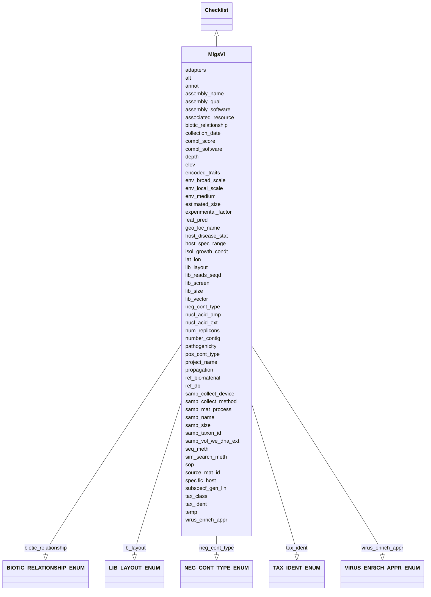

# Class: MigsVi


URI: [mixs_6_2_proposal:MigsVi](https://turbomam.github.io/mixs-envo-struct-knowl-extraction/MigsVi)





## Inheritance
* [Checklist](Checklist.md)
    * **MigsVi**


## Slots

| Name | Cardinality and Range | Description | Inheritance |
| ---  | --- | --- | --- |
| [host_spec_range](host_spec_range.md) | 0..* _recommended_ <br/> [String](String.md) | The range and diversity of host species that an organism is capable of infect... | direct |
| [collection_date](collection_date.md) | 1..1 <br/> [Datetime](Datetime.md) | The time of sampling, either as an instance (single point in time) or interva... | direct |
| [depth](depth.md) | 0..1 _recommended_ <br/> [String](String.md) | The vertical distance below local surface | direct |
| [tax_class](tax_class.md) | 0..1 <br/> [String](String.md) | Method used for taxonomic classification, along with reference database used,... | direct |
| [geo_loc_name](geo_loc_name.md) | 1..1 <br/> [String](String.md) | The geographical origin of the sample as defined by the country or sea name f... | direct |
| [project_name](project_name.md) | 1..1 <br/> [String](String.md) | Name of the project within which the sequencing was organized | direct |
| [nucl_acid_ext](nucl_acid_ext.md) | 0..1 _recommended_ <br/> [String](String.md) | A link to a literature reference, electronic resource or a standard operating... | direct |
| [lib_reads_seqd](lib_reads_seqd.md) | 0..1 <br/> [Integer](Integer.md) | Total number of clones sequenced from the library | direct |
| [lat_lon](lat_lon.md) | 1..1 <br/> [String](String.md) | The geographical origin of the sample as defined by latitude and longitude | direct |
| [propagation](propagation.md) | 1..1 <br/> [String](String.md) | The type of reproduction from the parent stock | direct |
| [pathogenicity](pathogenicity.md) | 0..1 _recommended_ <br/> [String](String.md) | To what is the entity pathogenic | direct |
| [env_local_scale](env_local_scale.md) | 1..1 <br/> [String](String.md) | Report the entity or entities which are in the sample or specimens local vici... | direct |
| [virus_enrich_appr](virus_enrich_appr.md) | 0..1 _recommended_ <br/> [VIRUSENRICHAPPRENUM](VIRUSENRICHAPPRENUM.md) | List of approaches used to enrich the sample for viruses, if any | direct |
| [num_replicons](num_replicons.md) | 0..1 _recommended_ <br/> [Integer](Integer.md) | Reports the number of replicons in a nuclear genome of eukaryotes, in the gen... | direct |
| [estimated_size](estimated_size.md) | 0..1 <br/> [String](String.md) | The estimated size of the genome prior to sequencing | direct |
| [host_disease_stat](host_disease_stat.md) | 0..* _recommended_ <br/> [String](String.md) | List of diseases with which the host has been diagnosed; can include multiple... | direct |
| [specific_host](specific_host.md) | 0..1 _recommended_ <br/> [String](String.md) | Report the host's taxonomic name and/or NCBI taxonomy ID | direct |
| [samp_name](samp_name.md) | 1..1 <br/> [String](String.md) | A local identifier or name that for the material sample used for extracting n... | direct |
| [elev](elev.md) | 0..1 _recommended_ <br/> [String](String.md) | Elevation of the sampling site is its height above a fixed reference point, m... | direct |
| [sim_search_meth](sim_search_meth.md) | 0..1 <br/> [String](String.md) | Tool used to compare ORFs with database, along with version and cutoffs used | direct |
| [temp](temp.md) | 0..1 _recommended_ <br/> [String](String.md) | Temperature of the sample at the time of sampling | direct |
| [samp_taxon_id](samp_taxon_id.md) | 1..1 <br/> [String](String.md) | NCBI taxon id of the sample | direct |
| [samp_mat_process](samp_mat_process.md) | 0..1 <br/> [String](String.md) | A brief description of any processing applied to the sample during or after r... | direct |
| [lib_screen](lib_screen.md) | 0..1 <br/> [String](String.md) | Specific enrichment or screening methods applied before and/or after creating... | direct |
| [seq_meth](seq_meth.md) | 1..1 <br/> [String](String.md) | Sequencing machine used | direct |
| [samp_size](samp_size.md) | 0..1 <br/> [String](String.md) | The total amount or size (volume (ml), mass (g) or area (m2) ) of sample coll... | direct |
| [source_mat_id](source_mat_id.md) | 0..* _recommended_ <br/> [String](String.md) | A unique identifier assigned to a material sample (as defined by http://rs | direct |
| [assembly_qual](assembly_qual.md) | 0..1 <br/> [String](String.md) | The assembly quality category is based on sets of criteria outlined for each ... | direct |
| [biotic_relationship](biotic_relationship.md) | 0..1 <br/> [BIOTICRELATIONSHIPENUM](BIOTICRELATIONSHIPENUM.md) | Description of relationship(s) between the subject organism and other organis... | direct |
| [env_medium](env_medium.md) | 1..1 <br/> [String](String.md) | Report the environmental material(s) immediately surrounding the sample or sp... | direct |
| [samp_collect_device](samp_collect_device.md) | 0..1 <br/> [String](String.md) | The device used to collect an environmental sample | direct |
| [feat_pred](feat_pred.md) | 0..1 <br/> [String](String.md) | Method used to predict UViGs features such as ORFs, integration site, etc | direct |
| [isol_growth_condt](isol_growth_condt.md) | 1..1 <br/> [String](String.md) | Publication reference in the form of pubmed ID (pmid), digital object identif... | direct |
| [lib_size](lib_size.md) | 0..1 <br/> [Integer](Integer.md) | Total number of clones in the library prepared for the project | direct |
| [env_broad_scale](env_broad_scale.md) | 1..1 <br/> [String](String.md) | Report the major environmental system the sample or specimen came from | direct |
| [lib_vector](lib_vector.md) | 0..1 <br/> [String](String.md) | Cloning vector type(s) used in construction of libraries | direct |
| [encoded_traits](encoded_traits.md) | 0..1 _recommended_ <br/> [String](String.md) | Should include key traits like antibiotic resistance or xenobiotic degradatio... | direct |
| [samp_vol_we_dna_ext](samp_vol_we_dna_ext.md) | 0..1 <br/> [String](String.md) | Volume (ml) or mass (g) of total collected sample processed for DNA extractio... | direct |
| [adapters](adapters.md) | 0..1 _recommended_ <br/> [String](String.md) | Adapters provide priming sequences for both amplification and sequencing of t... | direct |
| [assembly_name](assembly_name.md) | 0..1 _recommended_ <br/> [String](String.md) | Name/version of the assembly provided by the submitter that is used in the ge... | direct |
| [number_contig](number_contig.md) | 0..1 <br/> [Integer](Integer.md) | Total number of contigs in the cleaned/submitted assembly that makes up a giv... | direct |
| [compl_score](compl_score.md) | 0..1 <br/> [String](String.md) | Completeness score is typically based on either the fraction of markers found... | direct |
| [neg_cont_type](neg_cont_type.md) | 0..1 _recommended_ <br/> [NEGCONTTYPEENUM](NEGCONTTYPEENUM.md) | The substance or equipment used as a negative control in an investigation | direct |
| [nucl_acid_amp](nucl_acid_amp.md) | 0..1 _recommended_ <br/> [String](String.md) | A link to a literature reference, electronic resource or a standard operating... | direct |
| [alt](alt.md) | 0..1 _recommended_ <br/> [String](String.md) | Heights of objects such as airplanes, space shuttles, rockets, atmospheric ba... | direct |
| [lib_layout](lib_layout.md) | 0..1 <br/> [LIBLAYOUTENUM](LIBLAYOUTENUM.md) | Specify whether to expect single, paired, or other configuration of reads | direct |
| [annot](annot.md) | 0..1 _recommended_ <br/> [String](String.md) | Tool used for annotation, or for cases where annotation was provided by a com... | direct |
| [experimental_factor](experimental_factor.md) | 0..1 <br/> [String](String.md) | Experimental factors are essentially the variable aspects of an experiment de... | direct |
| [pos_cont_type](pos_cont_type.md) | 0..1 _recommended_ <br/> [String](String.md) | The substance, mixture, product, or apparatus used to verify that a process w... | direct |
| [ref_biomaterial](ref_biomaterial.md) | 0..1 <br/> [String](String.md) | Primary publication if isolated before genome publication; otherwise, primary... | direct |
| [assembly_software](assembly_software.md) | 1..1 <br/> [String](String.md) | Tool(s) used for assembly, including version number and parameters | direct |
| [tax_ident](tax_ident.md) | 0..1 _recommended_ <br/> [TAXIDENTENUM](TAXIDENTENUM.md) | The phylogenetic marker(s) used to assign an organism name to the SAG or MAG | direct |
| [ref_db](ref_db.md) | 0..1 <br/> [String](String.md) | List of database(s) used for ORF annotation, along with version number and re... | direct |
| [samp_collect_method](samp_collect_method.md) | 0..1 <br/> [String](String.md) | The method employed for collecting the sample | direct |
| [subspecf_gen_lin](subspecf_gen_lin.md) | 0..1 _recommended_ <br/> [String](String.md) | Information about the genetic distinctness of the sequenced organism below th... | direct |
| [compl_software](compl_software.md) | 0..1 <br/> [String](String.md) | Tools used for completion estimate, i | direct |
| [associated_resource](associated_resource.md) | 0..* _recommended_ <br/> [String](String.md) | A related resource that is referenced, cited, or otherwise associated to the ... | direct |
| [sop](sop.md) | 0..* _recommended_ <br/> [String](String.md) | Standard operating procedures used in assembly and/or annotation of genomes, ... | direct |


## Mixin Usage

| mixed into | description |
| --- | --- |


## Identifier and Mapping Information


### Schema Source


* from schema: https://turbomam.github.io/mixs-envo-struct-knowl-extraction//GSC_MIxS_6


## Mappings

| Mapping Type | Mapped Value |
| ---  | ---  |
| self | mixs_6_2_proposal:MigsVi |
| native | mixs_6_2_proposal:MigsVi |


## LinkML Source

<!-- TODO: investigate https://stackoverflow.com/questions/37606292/how-to-create-tabbed-code-blocks-in-mkdocs-or-sphinx -->

### Direct

<details>
```yaml
name: MigsVi
title: migs_ba
from_schema: https://turbomam.github.io/mixs-envo-struct-knowl-extraction//GSC_MIxS_6
is_a: Checklist
mixin: true
slots:
- host_spec_range
- collection_date
- depth
- tax_class
- geo_loc_name
- project_name
- nucl_acid_ext
- lib_reads_seqd
- lat_lon
- propagation
- pathogenicity
- env_local_scale
- virus_enrich_appr
- num_replicons
- estimated_size
- host_disease_stat
- specific_host
- samp_name
- elev
- sim_search_meth
- temp
- samp_taxon_id
- samp_mat_process
- lib_screen
- seq_meth
- samp_size
- source_mat_id
- assembly_qual
- biotic_relationship
- env_medium
- samp_collect_device
- feat_pred
- isol_growth_condt
- lib_size
- env_broad_scale
- lib_vector
- encoded_traits
- samp_vol_we_dna_ext
- adapters
- assembly_name
- number_contig
- compl_score
- neg_cont_type
- nucl_acid_amp
- alt
- lib_layout
- annot
- experimental_factor
- pos_cont_type
- ref_biomaterial
- assembly_software
- tax_ident
- ref_db
- samp_collect_method
- subspecf_gen_lin
- compl_software
- associated_resource
- sop
slot_usage:
  adapters:
    name: adapters
    string_serialization: '{dna};{dna}'
    domain_of:
    - Agriculture
    - MigsBa
    - MigsEu
    - MigsOrg
    - MigsPl
    - MigsVi
    - Mimag
    - MimarksS
    - Mims
    - Misag
    - Miuvig
    recommended: true
  alt:
    name: alt
    domain_of:
    - Air
    - HostAssociated
    - MigsBa
    - MigsEu
    - MigsOrg
    - MigsPl
    - MigsVi
    - Mimag
    - MimarksC
    - MimarksS
    - Mims
    - Misag
    - MiscellaneousNaturalOrArtificialEnvironment
    - Miuvig
    - SymbiontAssociated
    recommended: true
  annot:
    name: annot
    domain_of:
    - Agriculture
    - MigsBa
    - MigsEu
    - MigsOrg
    - MigsPl
    - MigsVi
    - Mimag
    - Mims
    - Misag
    - Miuvig
    recommended: true
  assembly_name:
    name: assembly_name
    domain_of:
    - Agriculture
    - MigsBa
    - MigsEu
    - MigsOrg
    - MigsPl
    - MigsVi
    - Mimag
    - Mims
    - Misag
    - Miuvig
    recommended: true
  assembly_qual:
    name: assembly_qual
    domain_of:
    - Agriculture
    - MigsBa
    - MigsEu
    - MigsOrg
    - MigsPl
    - MigsVi
    - Mimag
    - Mims
    - Misag
    - Miuvig
    required: false
    recommended: false
  assembly_software:
    name: assembly_software
    domain_of:
    - Agriculture
    - MigsBa
    - MigsEu
    - MigsOrg
    - MigsPl
    - MigsVi
    - Mimag
    - MimarksS
    - Mims
    - Misag
    - Miuvig
    required: true
  associated_resource:
    name: associated_resource
    string_serialization: '{PMID} | {DOI} | {URL}'
    domain_of:
    - Agriculture
    - MigsBa
    - MigsEu
    - MigsOrg
    - MigsPl
    - MigsVi
    - Mimag
    - MimarksC
    - MimarksS
    - Mims
    - Misag
    - Miuvig
  biotic_relationship:
    name: biotic_relationship
    domain_of:
    - Agriculture
    - MigsBa
    - MigsEu
    - MigsVi
    - MimarksC
    - Miuvig
    required: false
    recommended: false
  compl_score:
    name: compl_score
    domain_of:
    - MigsBa
    - MigsEu
    - MigsOrg
    - MigsPl
    - MigsVi
    - Mimag
    - Misag
    - Miuvig
    required: false
    recommended: false
  compl_software:
    name: compl_software
    domain_of:
    - MigsBa
    - MigsEu
    - MigsOrg
    - MigsPl
    - MigsVi
    - Mimag
    - Misag
    - Miuvig
    required: false
    recommended: false
  depth:
    name: depth
    title: depth
    examples:
    - value: 10 meter
    domain_of:
    - Agriculture
    - FoodFarmEnvironment
    - HostAssociated
    - MicrobialMatBiofilm
    - MigsBa
    - MigsEu
    - MigsOrg
    - MigsPl
    - MigsVi
    - Mimag
    - MimarksC
    - MimarksS
    - Mims
    - Misag
    - MiscellaneousNaturalOrArtificialEnvironment
    - Miuvig
    - PlantAssociated
    - Sediment
    - Soil
    - SymbiontAssociated
    - WastewaterSludge
    - Water
    recommended: true
  elev:
    name: elev
    domain_of:
    - Agriculture
    - Air
    - HostAssociated
    - HydrocarbonResourcesCores
    - MicrobialMatBiofilm
    - MigsBa
    - MigsEu
    - MigsOrg
    - MigsPl
    - MigsVi
    - Mimag
    - MimarksC
    - MimarksS
    - Mims
    - Misag
    - MiscellaneousNaturalOrArtificialEnvironment
    - Miuvig
    - PlantAssociated
    - Sediment
    - Soil
    - SymbiontAssociated
    - Water
    recommended: true
  encoded_traits:
    name: encoded_traits
    domain_of:
    - MigsBa
    - MigsPl
    - MigsVi
    recommended: true
  estimated_size:
    name: estimated_size
    domain_of:
    - MigsBa
    - MigsEu
    - MigsOrg
    - MigsPl
    - MigsVi
    - Miuvig
    required: false
    recommended: false
  experimental_factor:
    name: experimental_factor
    examples:
    - value: time series design [EFO:EFO_0001779]
    multivalued: false
    domain_of:
    - FoodAnimalAndAnimalFeed
    - FoodFoodProductionFacility
    - FoodHumanFoods
    - MigsBa
    - MigsEu
    - MigsOrg
    - MigsPl
    - MigsVi
    - Mimag
    - MimarksC
    - MimarksS
    - Mims
    - Misag
    - Miuvig
    required: false
    recommended: false
  feat_pred:
    name: feat_pred
    domain_of:
    - MigsBa
    - MigsEu
    - MigsOrg
    - MigsPl
    - MigsVi
    - Mimag
    - Mims
    - Misag
    - Miuvig
    required: false
    recommended: false
  geo_loc_name:
    name: geo_loc_name
    description: The geographical origin of the sample as defined by the country or
      sea name followed by specific region name. Country or sea names should be chosen
      from the INSDC country list (http://insdc.org/country.html), or the GAZ ontology
      (http://purl.bioontology.org/ontology/GAZ)
    domain_of:
    - FoodAnimalAndAnimalFeed
    - FoodFarmEnvironment
    - FoodFoodProductionFacility
    - FoodHumanFoods
    - MigsBa
    - MigsEu
    - MigsOrg
    - MigsPl
    - MigsVi
    - Mimag
    - MimarksC
    - MimarksS
    - Mims
    - Misag
    - Miuvig
    - SymbiontAssociated
  host_disease_stat:
    name: host_disease_stat
    description: List of diseases with which the host has been diagnosed; can include
      multiple diagnoses. The value of the field depends on host; for humans the terms
      should be chosen from the DO (Human Disease Ontology) at https://www.disease-ontology.org,
      non-human host diseases are free text
    examples:
    - value: rabies [DOID:11260]
    string_serialization: '{termLabel} [{termID}]|{text}'
    multivalued: true
    domain_of:
    - Agriculture
    - FoodFarmEnvironment
    - HostAssociated
    - HumanAssociated
    - HumanGut
    - HumanOral
    - HumanSkin
    - HumanVaginal
    - MigsBa
    - MigsEu
    - MigsVi
    - Miuvig
    - PlantAssociated
    recommended: true
  host_spec_range:
    name: host_spec_range
    domain_of:
    - Agriculture
    - MigsBa
    - MigsEu
    - MigsPl
    - MigsVi
    - Miuvig
    recommended: true
  isol_growth_condt:
    name: isol_growth_condt
    string_serialization: '{PMID}|{DOI}|{URL}'
    domain_of:
    - Agriculture
    - MigsBa
    - MigsEu
    - MigsOrg
    - MigsPl
    - MigsVi
    - MimarksC
    required: true
  lat_lon:
    name: lat_lon
    domain_of:
    - FoodAnimalAndAnimalFeed
    - FoodFarmEnvironment
    - FoodFoodProductionFacility
    - FoodHumanFoods
    - MigsBa
    - MigsEu
    - MigsOrg
    - MigsPl
    - MigsVi
    - Mimag
    - MimarksC
    - MimarksS
    - Mims
    - Misag
    - Miuvig
    - SymbiontAssociated
  lib_layout:
    name: lib_layout
    domain_of:
    - Agriculture
    - MigsBa
    - MigsEu
    - MigsOrg
    - MigsPl
    - MigsVi
    - Mimag
    - MimarksS
    - Mims
    - Misag
    - Miuvig
    required: false
    recommended: false
  lib_reads_seqd:
    name: lib_reads_seqd
    domain_of:
    - Agriculture
    - MigsBa
    - MigsEu
    - MigsOrg
    - MigsPl
    - MigsVi
    - Mimag
    - MimarksS
    - Mims
    - Misag
    - Miuvig
    required: false
    recommended: false
  lib_screen:
    name: lib_screen
    domain_of:
    - Agriculture
    - MigsBa
    - MigsEu
    - MigsOrg
    - MigsPl
    - MigsVi
    - Mimag
    - MimarksS
    - Mims
    - Misag
    - Miuvig
    required: false
    recommended: false
  lib_size:
    name: lib_size
    domain_of:
    - Agriculture
    - MigsBa
    - MigsEu
    - MigsOrg
    - MigsPl
    - MigsVi
    - Mimag
    - MimarksS
    - Mims
    - Misag
    - Miuvig
    required: false
    recommended: false
  lib_vector:
    name: lib_vector
    domain_of:
    - Agriculture
    - MigsBa
    - MigsEu
    - MigsOrg
    - MigsPl
    - MigsVi
    - Mimag
    - MimarksS
    - Mims
    - Misag
    - Miuvig
    required: false
    recommended: false
  nucl_acid_amp:
    name: nucl_acid_amp
    string_serialization: '{PMID}|{DOI}|{URL}'
    domain_of:
    - Agriculture
    - MigsBa
    - MigsEu
    - MigsOrg
    - MigsPl
    - MigsVi
    - Mimag
    - MimarksC
    - MimarksS
    - Mims
    - Misag
    - Miuvig
    recommended: true
  nucl_acid_ext:
    name: nucl_acid_ext
    string_serialization: '{PMID}|{DOI}|{URL}'
    domain_of:
    - Agriculture
    - FoodAnimalAndAnimalFeed
    - FoodFarmEnvironment
    - FoodFoodProductionFacility
    - FoodHumanFoods
    - MigsBa
    - MigsEu
    - MigsOrg
    - MigsPl
    - MigsVi
    - Mimag
    - MimarksC
    - MimarksS
    - Mims
    - Misag
    - Miuvig
    recommended: true
  num_replicons:
    name: num_replicons
    domain_of:
    - MigsBa
    - MigsEu
    - MigsVi
    recommended: true
  number_contig:
    name: number_contig
    domain_of:
    - MigsBa
    - MigsEu
    - MigsOrg
    - MigsPl
    - MigsVi
    - Mimag
    - Mims
    - Misag
    - Miuvig
    required: false
    recommended: false
  pathogenicity:
    name: pathogenicity
    string_serialization: '{text}'
    domain_of:
    - Agriculture
    - MigsBa
    - MigsEu
    - MigsVi
    - Miuvig
    recommended: true
  propagation:
    name: propagation
    domain_of:
    - MigsEu
    - MigsPl
    - MigsVi
    required: true
  ref_biomaterial:
    name: ref_biomaterial
    domain_of:
    - MigsBa
    - MigsEu
    - MigsOrg
    - MigsPl
    - MigsVi
    - Mimag
    - Mims
    - Misag
    - Miuvig
    required: false
    recommended: false
  ref_db:
    name: ref_db
    domain_of:
    - MigsBa
    - MigsEu
    - MigsOrg
    - MigsPl
    - MigsVi
    - Mimag
    - Mims
    - Misag
    - Miuvig
    required: false
    recommended: false
  samp_collect_device:
    name: samp_collect_device
    examples:
    - value: swab, biopsy, niskin bottle, push core, drag swab [GENEPIO:0002713]
    domain_of:
    - Agriculture
    - FoodAnimalAndAnimalFeed
    - FoodFarmEnvironment
    - FoodFoodProductionFacility
    - FoodHumanFoods
    - MigsBa
    - MigsEu
    - MigsOrg
    - MigsPl
    - MigsVi
    - Mimag
    - MimarksC
    - MimarksS
    - Mims
    - Misag
    - Miuvig
    required: false
    recommended: false
  samp_collect_method:
    name: samp_collect_method
    examples:
    - value: swabbing
    domain_of:
    - Agriculture
    - FoodAnimalAndAnimalFeed
    - FoodFoodProductionFacility
    - FoodHumanFoods
    - MigsBa
    - MigsEu
    - MigsOrg
    - MigsPl
    - MigsVi
    - Mimag
    - MimarksC
    - MimarksS
    - Mims
    - Misag
    - Miuvig
    required: false
    recommended: false
  samp_mat_process:
    name: samp_mat_process
    string_serialization: '{text}'
    domain_of:
    - Agriculture
    - MigsBa
    - MigsEu
    - MigsOrg
    - MigsPl
    - MigsVi
    - Mimag
    - MimarksC
    - MimarksS
    - Mims
    - Misag
    - Miuvig
    required: false
    recommended: false
  samp_size:
    name: samp_size
    examples:
    - value: 5 liter
    domain_of:
    - Agriculture
    - FoodAnimalAndAnimalFeed
    - FoodFarmEnvironment
    - FoodFoodProductionFacility
    - FoodHumanFoods
    - MigsBa
    - MigsEu
    - MigsOrg
    - MigsPl
    - MigsVi
    - Mimag
    - MimarksC
    - MimarksS
    - Mims
    - Misag
    - Miuvig
    required: false
    recommended: false
  samp_vol_we_dna_ext:
    name: samp_vol_we_dna_ext
    description: 'Volume (ml) or mass (g) of total collected sample processed for
      DNA extraction. Note: total sample collected should be entered under the term
      Sample Size (MIXS:0000001).'
    domain_of:
    - Agriculture
    - Air
    - FoodAnimalAndAnimalFeed
    - FoodFarmEnvironment
    - FoodFoodProductionFacility
    - FoodHumanFoods
    - HostAssociated
    - HumanAssociated
    - HumanGut
    - HumanOral
    - HumanSkin
    - HumanVaginal
    - HydrocarbonResourcesCores
    - HydrocarbonResourcesFluidsSwabs
    - MicrobialMatBiofilm
    - MigsBa
    - MigsEu
    - MigsOrg
    - MigsPl
    - MigsVi
    - Mimag
    - MimarksC
    - MimarksS
    - Mims
    - Misag
    - MiscellaneousNaturalOrArtificialEnvironment
    - Miuvig
    - PlantAssociated
    - Sediment
    - Soil
    - SymbiontAssociated
    - WastewaterSludge
    - Water
    required: false
    recommended: false
  sim_search_meth:
    name: sim_search_meth
    domain_of:
    - MigsBa
    - MigsEu
    - MigsOrg
    - MigsPl
    - MigsVi
    - Mimag
    - Mims
    - Misag
    - Miuvig
    required: false
    recommended: false
  sop:
    name: sop
    string_serialization: '{PMID}|{DOI}|{URL}'
    domain_of:
    - Agriculture
    - MigsBa
    - MigsEu
    - MigsOrg
    - MigsPl
    - MigsVi
    - Mimag
    - MimarksC
    - MimarksS
    - Mims
    - Misag
    - Miuvig
    recommended: true
  source_mat_id:
    name: source_mat_id
    domain_of:
    - Agriculture
    - MigsBa
    - MigsEu
    - MigsOrg
    - MigsPl
    - MigsVi
    - Mimag
    - MimarksC
    - MimarksS
    - Mims
    - Misag
    - Miuvig
    - SymbiontAssociated
    recommended: true
  specific_host:
    name: specific_host
    domain_of:
    - Agriculture
    - MigsBa
    - MigsEu
    - MigsPl
    - MigsVi
    - Miuvig
    recommended: true
  subspecf_gen_lin:
    name: subspecf_gen_lin
    domain_of:
    - FoodFoodProductionFacility
    - MigsBa
    - MigsEu
    - MigsOrg
    - MigsPl
    - MigsVi
    - MimarksC
    recommended: true
  tax_class:
    name: tax_class
    domain_of:
    - MigsBa
    - MigsEu
    - MigsOrg
    - MigsPl
    - MigsVi
    - Mimag
    - Mims
    - Misag
    - Miuvig
    required: false
    recommended: false
  tax_ident:
    name: tax_ident
    domain_of:
    - MigsBa
    - MigsEu
    - MigsOrg
    - MigsPl
    - MigsVi
    - Mimag
    - Misag
    - Miuvig
    recommended: true
  temp:
    name: temp
    domain_of:
    - Agriculture
    - Air
    - FoodAnimalAndAnimalFeed
    - FoodFarmEnvironment
    - FoodHumanFoods
    - HostAssociated
    - HumanAssociated
    - HumanGut
    - HumanOral
    - HumanSkin
    - HumanVaginal
    - HydrocarbonResourcesCores
    - HydrocarbonResourcesFluidsSwabs
    - MicrobialMatBiofilm
    - MigsBa
    - MigsEu
    - MigsOrg
    - MigsPl
    - MigsVi
    - Mimag
    - MimarksC
    - MimarksS
    - Mims
    - Misag
    - MiscellaneousNaturalOrArtificialEnvironment
    - Miuvig
    - PlantAssociated
    - Sediment
    - Soil
    - SymbiontAssociated
    - WastewaterSludge
    - Water
    recommended: true
  virus_enrich_appr:
    name: virus_enrich_appr
    domain_of:
    - MigsVi
    - Miuvig
    recommended: true

```
</details>

### Induced

<details>
```yaml
name: MigsVi
title: migs_ba
from_schema: https://turbomam.github.io/mixs-envo-struct-knowl-extraction//GSC_MIxS_6
is_a: Checklist
mixin: true
slot_usage:
  adapters:
    name: adapters
    string_serialization: '{dna};{dna}'
    domain_of:
    - Agriculture
    - MigsBa
    - MigsEu
    - MigsOrg
    - MigsPl
    - MigsVi
    - Mimag
    - MimarksS
    - Mims
    - Misag
    - Miuvig
    recommended: true
  alt:
    name: alt
    domain_of:
    - Air
    - HostAssociated
    - MigsBa
    - MigsEu
    - MigsOrg
    - MigsPl
    - MigsVi
    - Mimag
    - MimarksC
    - MimarksS
    - Mims
    - Misag
    - MiscellaneousNaturalOrArtificialEnvironment
    - Miuvig
    - SymbiontAssociated
    recommended: true
  annot:
    name: annot
    domain_of:
    - Agriculture
    - MigsBa
    - MigsEu
    - MigsOrg
    - MigsPl
    - MigsVi
    - Mimag
    - Mims
    - Misag
    - Miuvig
    recommended: true
  assembly_name:
    name: assembly_name
    domain_of:
    - Agriculture
    - MigsBa
    - MigsEu
    - MigsOrg
    - MigsPl
    - MigsVi
    - Mimag
    - Mims
    - Misag
    - Miuvig
    recommended: true
  assembly_qual:
    name: assembly_qual
    domain_of:
    - Agriculture
    - MigsBa
    - MigsEu
    - MigsOrg
    - MigsPl
    - MigsVi
    - Mimag
    - Mims
    - Misag
    - Miuvig
    required: false
    recommended: false
  assembly_software:
    name: assembly_software
    domain_of:
    - Agriculture
    - MigsBa
    - MigsEu
    - MigsOrg
    - MigsPl
    - MigsVi
    - Mimag
    - MimarksS
    - Mims
    - Misag
    - Miuvig
    required: true
  associated_resource:
    name: associated_resource
    string_serialization: '{PMID} | {DOI} | {URL}'
    domain_of:
    - Agriculture
    - MigsBa
    - MigsEu
    - MigsOrg
    - MigsPl
    - MigsVi
    - Mimag
    - MimarksC
    - MimarksS
    - Mims
    - Misag
    - Miuvig
  biotic_relationship:
    name: biotic_relationship
    domain_of:
    - Agriculture
    - MigsBa
    - MigsEu
    - MigsVi
    - MimarksC
    - Miuvig
    required: false
    recommended: false
  compl_score:
    name: compl_score
    domain_of:
    - MigsBa
    - MigsEu
    - MigsOrg
    - MigsPl
    - MigsVi
    - Mimag
    - Misag
    - Miuvig
    required: false
    recommended: false
  compl_software:
    name: compl_software
    domain_of:
    - MigsBa
    - MigsEu
    - MigsOrg
    - MigsPl
    - MigsVi
    - Mimag
    - Misag
    - Miuvig
    required: false
    recommended: false
  depth:
    name: depth
    title: depth
    examples:
    - value: 10 meter
    domain_of:
    - Agriculture
    - FoodFarmEnvironment
    - HostAssociated
    - MicrobialMatBiofilm
    - MigsBa
    - MigsEu
    - MigsOrg
    - MigsPl
    - MigsVi
    - Mimag
    - MimarksC
    - MimarksS
    - Mims
    - Misag
    - MiscellaneousNaturalOrArtificialEnvironment
    - Miuvig
    - PlantAssociated
    - Sediment
    - Soil
    - SymbiontAssociated
    - WastewaterSludge
    - Water
    recommended: true
  elev:
    name: elev
    domain_of:
    - Agriculture
    - Air
    - HostAssociated
    - HydrocarbonResourcesCores
    - MicrobialMatBiofilm
    - MigsBa
    - MigsEu
    - MigsOrg
    - MigsPl
    - MigsVi
    - Mimag
    - MimarksC
    - MimarksS
    - Mims
    - Misag
    - MiscellaneousNaturalOrArtificialEnvironment
    - Miuvig
    - PlantAssociated
    - Sediment
    - Soil
    - SymbiontAssociated
    - Water
    recommended: true
  encoded_traits:
    name: encoded_traits
    domain_of:
    - MigsBa
    - MigsPl
    - MigsVi
    recommended: true
  estimated_size:
    name: estimated_size
    domain_of:
    - MigsBa
    - MigsEu
    - MigsOrg
    - MigsPl
    - MigsVi
    - Miuvig
    required: false
    recommended: false
  experimental_factor:
    name: experimental_factor
    examples:
    - value: time series design [EFO:EFO_0001779]
    multivalued: false
    domain_of:
    - FoodAnimalAndAnimalFeed
    - FoodFoodProductionFacility
    - FoodHumanFoods
    - MigsBa
    - MigsEu
    - MigsOrg
    - MigsPl
    - MigsVi
    - Mimag
    - MimarksC
    - MimarksS
    - Mims
    - Misag
    - Miuvig
    required: false
    recommended: false
  feat_pred:
    name: feat_pred
    domain_of:
    - MigsBa
    - MigsEu
    - MigsOrg
    - MigsPl
    - MigsVi
    - Mimag
    - Mims
    - Misag
    - Miuvig
    required: false
    recommended: false
  geo_loc_name:
    name: geo_loc_name
    description: The geographical origin of the sample as defined by the country or
      sea name followed by specific region name. Country or sea names should be chosen
      from the INSDC country list (http://insdc.org/country.html), or the GAZ ontology
      (http://purl.bioontology.org/ontology/GAZ)
    domain_of:
    - FoodAnimalAndAnimalFeed
    - FoodFarmEnvironment
    - FoodFoodProductionFacility
    - FoodHumanFoods
    - MigsBa
    - MigsEu
    - MigsOrg
    - MigsPl
    - MigsVi
    - Mimag
    - MimarksC
    - MimarksS
    - Mims
    - Misag
    - Miuvig
    - SymbiontAssociated
  host_disease_stat:
    name: host_disease_stat
    description: List of diseases with which the host has been diagnosed; can include
      multiple diagnoses. The value of the field depends on host; for humans the terms
      should be chosen from the DO (Human Disease Ontology) at https://www.disease-ontology.org,
      non-human host diseases are free text
    examples:
    - value: rabies [DOID:11260]
    string_serialization: '{termLabel} [{termID}]|{text}'
    multivalued: true
    domain_of:
    - Agriculture
    - FoodFarmEnvironment
    - HostAssociated
    - HumanAssociated
    - HumanGut
    - HumanOral
    - HumanSkin
    - HumanVaginal
    - MigsBa
    - MigsEu
    - MigsVi
    - Miuvig
    - PlantAssociated
    recommended: true
  host_spec_range:
    name: host_spec_range
    domain_of:
    - Agriculture
    - MigsBa
    - MigsEu
    - MigsPl
    - MigsVi
    - Miuvig
    recommended: true
  isol_growth_condt:
    name: isol_growth_condt
    string_serialization: '{PMID}|{DOI}|{URL}'
    domain_of:
    - Agriculture
    - MigsBa
    - MigsEu
    - MigsOrg
    - MigsPl
    - MigsVi
    - MimarksC
    required: true
  lat_lon:
    name: lat_lon
    domain_of:
    - FoodAnimalAndAnimalFeed
    - FoodFarmEnvironment
    - FoodFoodProductionFacility
    - FoodHumanFoods
    - MigsBa
    - MigsEu
    - MigsOrg
    - MigsPl
    - MigsVi
    - Mimag
    - MimarksC
    - MimarksS
    - Mims
    - Misag
    - Miuvig
    - SymbiontAssociated
  lib_layout:
    name: lib_layout
    domain_of:
    - Agriculture
    - MigsBa
    - MigsEu
    - MigsOrg
    - MigsPl
    - MigsVi
    - Mimag
    - MimarksS
    - Mims
    - Misag
    - Miuvig
    required: false
    recommended: false
  lib_reads_seqd:
    name: lib_reads_seqd
    domain_of:
    - Agriculture
    - MigsBa
    - MigsEu
    - MigsOrg
    - MigsPl
    - MigsVi
    - Mimag
    - MimarksS
    - Mims
    - Misag
    - Miuvig
    required: false
    recommended: false
  lib_screen:
    name: lib_screen
    domain_of:
    - Agriculture
    - MigsBa
    - MigsEu
    - MigsOrg
    - MigsPl
    - MigsVi
    - Mimag
    - MimarksS
    - Mims
    - Misag
    - Miuvig
    required: false
    recommended: false
  lib_size:
    name: lib_size
    domain_of:
    - Agriculture
    - MigsBa
    - MigsEu
    - MigsOrg
    - MigsPl
    - MigsVi
    - Mimag
    - MimarksS
    - Mims
    - Misag
    - Miuvig
    required: false
    recommended: false
  lib_vector:
    name: lib_vector
    domain_of:
    - Agriculture
    - MigsBa
    - MigsEu
    - MigsOrg
    - MigsPl
    - MigsVi
    - Mimag
    - MimarksS
    - Mims
    - Misag
    - Miuvig
    required: false
    recommended: false
  nucl_acid_amp:
    name: nucl_acid_amp
    string_serialization: '{PMID}|{DOI}|{URL}'
    domain_of:
    - Agriculture
    - MigsBa
    - MigsEu
    - MigsOrg
    - MigsPl
    - MigsVi
    - Mimag
    - MimarksC
    - MimarksS
    - Mims
    - Misag
    - Miuvig
    recommended: true
  nucl_acid_ext:
    name: nucl_acid_ext
    string_serialization: '{PMID}|{DOI}|{URL}'
    domain_of:
    - Agriculture
    - FoodAnimalAndAnimalFeed
    - FoodFarmEnvironment
    - FoodFoodProductionFacility
    - FoodHumanFoods
    - MigsBa
    - MigsEu
    - MigsOrg
    - MigsPl
    - MigsVi
    - Mimag
    - MimarksC
    - MimarksS
    - Mims
    - Misag
    - Miuvig
    recommended: true
  num_replicons:
    name: num_replicons
    domain_of:
    - MigsBa
    - MigsEu
    - MigsVi
    recommended: true
  number_contig:
    name: number_contig
    domain_of:
    - MigsBa
    - MigsEu
    - MigsOrg
    - MigsPl
    - MigsVi
    - Mimag
    - Mims
    - Misag
    - Miuvig
    required: false
    recommended: false
  pathogenicity:
    name: pathogenicity
    string_serialization: '{text}'
    domain_of:
    - Agriculture
    - MigsBa
    - MigsEu
    - MigsVi
    - Miuvig
    recommended: true
  propagation:
    name: propagation
    domain_of:
    - MigsEu
    - MigsPl
    - MigsVi
    required: true
  ref_biomaterial:
    name: ref_biomaterial
    domain_of:
    - MigsBa
    - MigsEu
    - MigsOrg
    - MigsPl
    - MigsVi
    - Mimag
    - Mims
    - Misag
    - Miuvig
    required: false
    recommended: false
  ref_db:
    name: ref_db
    domain_of:
    - MigsBa
    - MigsEu
    - MigsOrg
    - MigsPl
    - MigsVi
    - Mimag
    - Mims
    - Misag
    - Miuvig
    required: false
    recommended: false
  samp_collect_device:
    name: samp_collect_device
    examples:
    - value: swab, biopsy, niskin bottle, push core, drag swab [GENEPIO:0002713]
    domain_of:
    - Agriculture
    - FoodAnimalAndAnimalFeed
    - FoodFarmEnvironment
    - FoodFoodProductionFacility
    - FoodHumanFoods
    - MigsBa
    - MigsEu
    - MigsOrg
    - MigsPl
    - MigsVi
    - Mimag
    - MimarksC
    - MimarksS
    - Mims
    - Misag
    - Miuvig
    required: false
    recommended: false
  samp_collect_method:
    name: samp_collect_method
    examples:
    - value: swabbing
    domain_of:
    - Agriculture
    - FoodAnimalAndAnimalFeed
    - FoodFoodProductionFacility
    - FoodHumanFoods
    - MigsBa
    - MigsEu
    - MigsOrg
    - MigsPl
    - MigsVi
    - Mimag
    - MimarksC
    - MimarksS
    - Mims
    - Misag
    - Miuvig
    required: false
    recommended: false
  samp_mat_process:
    name: samp_mat_process
    string_serialization: '{text}'
    domain_of:
    - Agriculture
    - MigsBa
    - MigsEu
    - MigsOrg
    - MigsPl
    - MigsVi
    - Mimag
    - MimarksC
    - MimarksS
    - Mims
    - Misag
    - Miuvig
    required: false
    recommended: false
  samp_size:
    name: samp_size
    examples:
    - value: 5 liter
    domain_of:
    - Agriculture
    - FoodAnimalAndAnimalFeed
    - FoodFarmEnvironment
    - FoodFoodProductionFacility
    - FoodHumanFoods
    - MigsBa
    - MigsEu
    - MigsOrg
    - MigsPl
    - MigsVi
    - Mimag
    - MimarksC
    - MimarksS
    - Mims
    - Misag
    - Miuvig
    required: false
    recommended: false
  samp_vol_we_dna_ext:
    name: samp_vol_we_dna_ext
    description: 'Volume (ml) or mass (g) of total collected sample processed for
      DNA extraction. Note: total sample collected should be entered under the term
      Sample Size (MIXS:0000001).'
    domain_of:
    - Agriculture
    - Air
    - FoodAnimalAndAnimalFeed
    - FoodFarmEnvironment
    - FoodFoodProductionFacility
    - FoodHumanFoods
    - HostAssociated
    - HumanAssociated
    - HumanGut
    - HumanOral
    - HumanSkin
    - HumanVaginal
    - HydrocarbonResourcesCores
    - HydrocarbonResourcesFluidsSwabs
    - MicrobialMatBiofilm
    - MigsBa
    - MigsEu
    - MigsOrg
    - MigsPl
    - MigsVi
    - Mimag
    - MimarksC
    - MimarksS
    - Mims
    - Misag
    - MiscellaneousNaturalOrArtificialEnvironment
    - Miuvig
    - PlantAssociated
    - Sediment
    - Soil
    - SymbiontAssociated
    - WastewaterSludge
    - Water
    required: false
    recommended: false
  sim_search_meth:
    name: sim_search_meth
    domain_of:
    - MigsBa
    - MigsEu
    - MigsOrg
    - MigsPl
    - MigsVi
    - Mimag
    - Mims
    - Misag
    - Miuvig
    required: false
    recommended: false
  sop:
    name: sop
    string_serialization: '{PMID}|{DOI}|{URL}'
    domain_of:
    - Agriculture
    - MigsBa
    - MigsEu
    - MigsOrg
    - MigsPl
    - MigsVi
    - Mimag
    - MimarksC
    - MimarksS
    - Mims
    - Misag
    - Miuvig
    recommended: true
  source_mat_id:
    name: source_mat_id
    domain_of:
    - Agriculture
    - MigsBa
    - MigsEu
    - MigsOrg
    - MigsPl
    - MigsVi
    - Mimag
    - MimarksC
    - MimarksS
    - Mims
    - Misag
    - Miuvig
    - SymbiontAssociated
    recommended: true
  specific_host:
    name: specific_host
    domain_of:
    - Agriculture
    - MigsBa
    - MigsEu
    - MigsPl
    - MigsVi
    - Miuvig
    recommended: true
  subspecf_gen_lin:
    name: subspecf_gen_lin
    domain_of:
    - FoodFoodProductionFacility
    - MigsBa
    - MigsEu
    - MigsOrg
    - MigsPl
    - MigsVi
    - MimarksC
    recommended: true
  tax_class:
    name: tax_class
    domain_of:
    - MigsBa
    - MigsEu
    - MigsOrg
    - MigsPl
    - MigsVi
    - Mimag
    - Mims
    - Misag
    - Miuvig
    required: false
    recommended: false
  tax_ident:
    name: tax_ident
    domain_of:
    - MigsBa
    - MigsEu
    - MigsOrg
    - MigsPl
    - MigsVi
    - Mimag
    - Misag
    - Miuvig
    recommended: true
  temp:
    name: temp
    domain_of:
    - Agriculture
    - Air
    - FoodAnimalAndAnimalFeed
    - FoodFarmEnvironment
    - FoodHumanFoods
    - HostAssociated
    - HumanAssociated
    - HumanGut
    - HumanOral
    - HumanSkin
    - HumanVaginal
    - HydrocarbonResourcesCores
    - HydrocarbonResourcesFluidsSwabs
    - MicrobialMatBiofilm
    - MigsBa
    - MigsEu
    - MigsOrg
    - MigsPl
    - MigsVi
    - Mimag
    - MimarksC
    - MimarksS
    - Mims
    - Misag
    - MiscellaneousNaturalOrArtificialEnvironment
    - Miuvig
    - PlantAssociated
    - Sediment
    - Soil
    - SymbiontAssociated
    - WastewaterSludge
    - Water
    recommended: true
  virus_enrich_appr:
    name: virus_enrich_appr
    domain_of:
    - MigsVi
    - Miuvig
    recommended: true
attributes:
  host_spec_range:
    name: host_spec_range
    description: The range and diversity of host species that an organism is capable
      of infecting, defined by NCBI taxonomy identifier
    title: host specificity or range
    from_schema: https://turbomam.github.io/mixs-envo-struct-knowl-extraction//GSC_MIxS_6
    rank: 1000
    string_serialization: '{integer}'
    slot_uri: MIXS:0000030
    multivalued: true
    alias: host_spec_range
    owner: MigsVi
    domain_of:
    - Agriculture
    - MigsBa
    - MigsEu
    - MigsPl
    - MigsVi
    - Miuvig
    range: string
    recommended: true
  collection_date:
    name: collection_date
    description: 'The time of sampling, either as an instance (single point in time)
      or interval. In case no exact time is available, the date/time can be right
      truncated i.e. all of these are valid times: 2008-01-23T19:23:10+00:00; 2008-01-23T19:23:10;
      2008-01-23; 2008-01; 2008; Except: 2008-01; 2008 all are ISO8601 compliant'
    title: collection date
    notes:
    - date
    examples:
    - value: '2013-03-25T12:42:31+00:32'
    in_subset:
    - environment
    from_schema: https://turbomam.github.io/mixs-envo-struct-knowl-extraction//GSC_MIxS_6
    rank: 1000
    slot_uri: MIXS:0000011
    multivalued: false
    alias: collection_date
    owner: MigsVi
    domain_of:
    - FoodAnimalAndAnimalFeed
    - FoodFarmEnvironment
    - FoodFoodProductionFacility
    - FoodHumanFoods
    - MigsBa
    - MigsEu
    - MigsOrg
    - MigsPl
    - MigsVi
    - Mimag
    - MimarksC
    - MimarksS
    - Mims
    - Misag
    - Miuvig
    - SymbiontAssociated
    range: datetime
    required: true
  depth:
    name: depth
    description: The vertical distance below local surface. For sediment or soil samples
      depth is measured from sediment or soil surface, respectively. Depth can be
      reported as an interval for subsurface samples
    title: depth
    examples:
    - value: 10 meter
    from_schema: https://turbomam.github.io/mixs-envo-struct-knowl-extraction//GSC_MIxS_6
    rank: 1000
    slot_uri: MIXS:0000018
    multivalued: false
    alias: depth
    owner: MigsVi
    domain_of:
    - Agriculture
    - FoodFarmEnvironment
    - HostAssociated
    - MicrobialMatBiofilm
    - MigsBa
    - MigsEu
    - MigsOrg
    - MigsPl
    - MigsVi
    - Mimag
    - MimarksC
    - MimarksS
    - Mims
    - Misag
    - MiscellaneousNaturalOrArtificialEnvironment
    - Miuvig
    - PlantAssociated
    - Sediment
    - Soil
    - SymbiontAssociated
    - WastewaterSludge
    - Water
    range: string
    recommended: true
    pattern: ^[-+]?[0-9]*\.?[0-9]+([eE][-+]?[0-9]+)? \S.*\S$
  tax_class:
    name: tax_class
    description: Method used for taxonomic classification, along with reference database
      used, classification rank, and thresholds used to classify new genomes
    title: taxonomic classification
    from_schema: https://turbomam.github.io/mixs-envo-struct-knowl-extraction//GSC_MIxS_6
    rank: 1000
    slot_uri: MIXS:0000064
    multivalued: false
    alias: tax_class
    owner: MigsVi
    domain_of:
    - MigsBa
    - MigsEu
    - MigsOrg
    - MigsPl
    - MigsVi
    - Mimag
    - Mims
    - Misag
    - Miuvig
    range: string
    required: false
    recommended: false
  geo_loc_name:
    name: geo_loc_name
    description: The geographical origin of the sample as defined by the country or
      sea name followed by specific region name. Country or sea names should be chosen
      from the INSDC country list (http://insdc.org/country.html), or the GAZ ontology
      (http://purl.bioontology.org/ontology/GAZ)
    title: geographic location (country and/or sea,region)
    from_schema: https://turbomam.github.io/mixs-envo-struct-knowl-extraction//GSC_MIxS_6
    rank: 1000
    string_serialization: '{term}: {term}, {text}'
    slot_uri: MIXS:0000010
    multivalued: false
    alias: geo_loc_name
    owner: MigsVi
    domain_of:
    - FoodAnimalAndAnimalFeed
    - FoodFarmEnvironment
    - FoodFoodProductionFacility
    - FoodHumanFoods
    - MigsBa
    - MigsEu
    - MigsOrg
    - MigsPl
    - MigsVi
    - Mimag
    - MimarksC
    - MimarksS
    - Mims
    - Misag
    - Miuvig
    - SymbiontAssociated
    range: string
    required: true
  project_name:
    name: project_name
    description: Name of the project within which the sequencing was organized
    title: project name
    notes:
    - project
    examples:
    - value: Forest soil metagenome
    in_subset:
    - investigation
    from_schema: https://turbomam.github.io/mixs-envo-struct-knowl-extraction//GSC_MIxS_6
    rank: 1000
    slot_uri: MIXS:0000092
    multivalued: false
    alias: project_name
    owner: MigsVi
    domain_of:
    - Air
    - BuiltEnvironment
    - FoodAnimalAndAnimalFeed
    - FoodFarmEnvironment
    - FoodFoodProductionFacility
    - FoodHumanFoods
    - HostAssociated
    - HumanAssociated
    - HumanGut
    - HumanOral
    - HumanSkin
    - HumanVaginal
    - HydrocarbonResourcesCores
    - HydrocarbonResourcesFluidsSwabs
    - MicrobialMatBiofilm
    - MigsBa
    - MigsEu
    - MigsOrg
    - MigsPl
    - MigsVi
    - Mimag
    - MimarksC
    - MimarksS
    - Mims
    - Misag
    - MiscellaneousNaturalOrArtificialEnvironment
    - Miuvig
    - PlantAssociated
    - Sediment
    - Soil
    - SymbiontAssociated
    - WastewaterSludge
    - Water
    range: string
    required: true
  nucl_acid_ext:
    name: nucl_acid_ext
    description: A link to a literature reference, electronic resource or a standard
      operating procedure (SOP), that describes the material separation to recover
      the nucleic acid fraction from a sample
    title: nucleic acid extraction
    from_schema: https://turbomam.github.io/mixs-envo-struct-knowl-extraction//GSC_MIxS_6
    rank: 1000
    string_serialization: '{PMID}|{DOI}|{URL}'
    slot_uri: MIXS:0000037
    multivalued: false
    alias: nucl_acid_ext
    owner: MigsVi
    domain_of:
    - Agriculture
    - FoodAnimalAndAnimalFeed
    - FoodFarmEnvironment
    - FoodFoodProductionFacility
    - FoodHumanFoods
    - MigsBa
    - MigsEu
    - MigsOrg
    - MigsPl
    - MigsVi
    - Mimag
    - MimarksC
    - MimarksS
    - Mims
    - Misag
    - Miuvig
    range: string
    recommended: true
    structured_pattern:
      syntax: '{PMID}|{DOI}|{URL}'
      interpolated: true
      partial_match: true
  lib_reads_seqd:
    name: lib_reads_seqd
    description: Total number of clones sequenced from the library
    title: library reads sequenced
    from_schema: https://turbomam.github.io/mixs-envo-struct-knowl-extraction//GSC_MIxS_6
    rank: 1000
    slot_uri: MIXS:0000040
    multivalued: false
    alias: lib_reads_seqd
    owner: MigsVi
    domain_of:
    - Agriculture
    - MigsBa
    - MigsEu
    - MigsOrg
    - MigsPl
    - MigsVi
    - Mimag
    - MimarksS
    - Mims
    - Misag
    - Miuvig
    range: integer
    required: false
    recommended: false
  lat_lon:
    name: lat_lon
    description: The geographical origin of the sample as defined by latitude and
      longitude. The values should be reported in decimal degrees and in WGS84 system
    title: geographic location (latitude and longitude)
    from_schema: https://turbomam.github.io/mixs-envo-struct-knowl-extraction//GSC_MIxS_6
    rank: 1000
    string_serialization: '{float} {float}'
    slot_uri: MIXS:0000009
    multivalued: false
    alias: lat_lon
    owner: MigsVi
    domain_of:
    - FoodAnimalAndAnimalFeed
    - FoodFarmEnvironment
    - FoodFoodProductionFacility
    - FoodHumanFoods
    - MigsBa
    - MigsEu
    - MigsOrg
    - MigsPl
    - MigsVi
    - Mimag
    - MimarksC
    - MimarksS
    - Mims
    - Misag
    - Miuvig
    - SymbiontAssociated
    range: string
    required: true
  propagation:
    name: propagation
    description: 'The type of reproduction from the parent stock. Values for this
      field is specific to different taxa. For phage or virus: lytic/lysogenic/temperate/obligately
      lytic. For plasmids: incompatibility group. For eukaryotes: sexual/asexual'
    title: propagation
    from_schema: https://turbomam.github.io/mixs-envo-struct-knowl-extraction//GSC_MIxS_6
    rank: 1000
    string_serialization: '{text}'
    slot_uri: MIXS:0000033
    multivalued: false
    alias: propagation
    owner: MigsVi
    domain_of:
    - MigsEu
    - MigsPl
    - MigsVi
    range: string
    required: true
  pathogenicity:
    name: pathogenicity
    description: To what is the entity pathogenic
    title: known pathogenicity
    from_schema: https://turbomam.github.io/mixs-envo-struct-knowl-extraction//GSC_MIxS_6
    rank: 1000
    string_serialization: '{text}'
    slot_uri: MIXS:0000027
    multivalued: false
    alias: pathogenicity
    owner: MigsVi
    domain_of:
    - Agriculture
    - MigsBa
    - MigsEu
    - MigsVi
    - Miuvig
    range: string
    recommended: true
  env_local_scale:
    name: env_local_scale
    annotations:
      Expected_value:
        tag: Expected_value
        value: Environmental entities having causal influences upon the entity at
          time of sampling
    description: 'Report the entity or entities which are in the sample or specimens
      local vicinity and which you believe have significant causal influences on your
      sample or specimen. We recommend using EnvO terms which are of smaller spatial
      grain than your entry for env_broad_scale. Terms, such as anatomical sites,
      from other OBO Library ontologies which interoperate with EnvO (e.g. UBERON)
      are accepted in this field. EnvO documentation about how to use the field: https://github.com/EnvironmentOntology/envo/wiki/Using-ENVO-with-MIxS'
    title: local environmental context
    notes:
    - context
    - environmental
    examples:
    - value: hillside [ENVO:01000333]
    in_subset:
    - environment
    from_schema: https://turbomam.github.io/mixs-envo-struct-knowl-extraction//GSC_MIxS_6
    rank: 1000
    string_serialization: '{termLabel} [{termID}]'
    slot_uri: MIXS:0000013
    multivalued: false
    alias: env_local_scale
    owner: MigsVi
    domain_of:
    - MigsBa
    - MigsEu
    - MigsOrg
    - MigsPl
    - MigsVi
    - Mimag
    - MimarksC
    - MimarksS
    - Mims
    - Misag
    - Miuvig
    range: string
    required: true
  virus_enrich_appr:
    name: virus_enrich_appr
    description: List of approaches used to enrich the sample for viruses, if any
    title: virus enrichment approach
    from_schema: https://turbomam.github.io/mixs-envo-struct-knowl-extraction//GSC_MIxS_6
    rank: 1000
    slot_uri: MIXS:0000036
    alias: virus_enrich_appr
    owner: MigsVi
    domain_of:
    - MigsVi
    - Miuvig
    range: VIRUS_ENRICH_APPR_ENUM
    recommended: true
  num_replicons:
    name: num_replicons
    description: Reports the number of replicons in a nuclear genome of eukaryotes,
      in the genome of a bacterium or archaea or the number of segments in a segmented
      virus. Always applied to the haploid chromosome count of a eukaryote
    title: number of replicons
    from_schema: https://turbomam.github.io/mixs-envo-struct-knowl-extraction//GSC_MIxS_6
    rank: 1000
    string_serialization: '{integer}'
    slot_uri: MIXS:0000022
    alias: num_replicons
    owner: MigsVi
    domain_of:
    - MigsBa
    - MigsEu
    - MigsVi
    range: integer
    recommended: true
  estimated_size:
    name: estimated_size
    description: The estimated size of the genome prior to sequencing. Of particular
      importance in the sequencing of (eukaryotic) genome which could remain in draft
      form for a long or unspecified period
    title: estimated size
    from_schema: https://turbomam.github.io/mixs-envo-struct-knowl-extraction//GSC_MIxS_6
    rank: 1000
    string_serialization: '{integer} bp'
    slot_uri: MIXS:0000024
    multivalued: false
    alias: estimated_size
    owner: MigsVi
    domain_of:
    - MigsBa
    - MigsEu
    - MigsOrg
    - MigsPl
    - MigsVi
    - Miuvig
    range: string
    required: false
    recommended: false
  host_disease_stat:
    name: host_disease_stat
    description: List of diseases with which the host has been diagnosed; can include
      multiple diagnoses. The value of the field depends on host; for humans the terms
      should be chosen from the DO (Human Disease Ontology) at https://www.disease-ontology.org,
      non-human host diseases are free text
    title: host disease status
    examples:
    - value: rabies [DOID:11260]
    from_schema: https://turbomam.github.io/mixs-envo-struct-knowl-extraction//GSC_MIxS_6
    rank: 1000
    string_serialization: '{termLabel} [{termID}]|{text}'
    slot_uri: MIXS:0000031
    multivalued: true
    alias: host_disease_stat
    owner: MigsVi
    domain_of:
    - Agriculture
    - FoodFarmEnvironment
    - HostAssociated
    - HumanAssociated
    - HumanGut
    - HumanOral
    - HumanSkin
    - HumanVaginal
    - MigsBa
    - MigsEu
    - MigsVi
    - Miuvig
    - PlantAssociated
    range: string
    recommended: true
  specific_host:
    name: specific_host
    description: Report the host's taxonomic name and/or NCBI taxonomy ID
    title: host scientific name
    from_schema: https://turbomam.github.io/mixs-envo-struct-knowl-extraction//GSC_MIxS_6
    rank: 1000
    string_serialization: '{text}|{NCBI taxid}'
    slot_uri: MIXS:0000029
    multivalued: false
    alias: specific_host
    owner: MigsVi
    domain_of:
    - Agriculture
    - MigsBa
    - MigsEu
    - MigsPl
    - MigsVi
    - Miuvig
    range: string
    recommended: true
  samp_name:
    name: samp_name
    description: A local identifier or name that for the material sample used for
      extracting nucleic acids, and subsequent sequencing. It can refer either to
      the original material collected or to any derived sub-samples. It can have any
      format, but we suggest that you make it concise, unique and consistent within
      your lab, and as informative as possible. INSDC requires every sample name from
      a single Submitter to be unique. Use of a globally unique identifier for the
      field source_mat_id is recommended in addition to sample_name
    title: sample name
    notes:
    - sample
    examples:
    - value: ISDsoil1
    in_subset:
    - investigation
    from_schema: https://turbomam.github.io/mixs-envo-struct-knowl-extraction//GSC_MIxS_6
    rank: 1000
    slot_uri: MIXS:0001107
    multivalued: false
    alias: samp_name
    owner: MigsVi
    domain_of:
    - Air
    - BuiltEnvironment
    - FoodAnimalAndAnimalFeed
    - FoodFarmEnvironment
    - FoodFoodProductionFacility
    - FoodHumanFoods
    - HostAssociated
    - HumanAssociated
    - HumanGut
    - HumanOral
    - HumanSkin
    - HumanVaginal
    - HydrocarbonResourcesCores
    - HydrocarbonResourcesFluidsSwabs
    - MicrobialMatBiofilm
    - MigsBa
    - MigsEu
    - MigsOrg
    - MigsPl
    - MigsVi
    - Mimag
    - MimarksC
    - MimarksS
    - Mims
    - Misag
    - MiscellaneousNaturalOrArtificialEnvironment
    - Miuvig
    - PlantAssociated
    - Sediment
    - Soil
    - SymbiontAssociated
    - WastewaterSludge
    - Water
    range: string
    required: true
  elev:
    name: elev
    description: Elevation of the sampling site is its height above a fixed reference
      point, most commonly the mean sea level. Elevation is mainly used when referring
      to points on the earth's surface, while altitude is used for points above the
      surface, such as an aircraft in flight or a spacecraft in orbit
    title: elevation
    from_schema: https://turbomam.github.io/mixs-envo-struct-knowl-extraction//GSC_MIxS_6
    rank: 1000
    slot_uri: MIXS:0000093
    multivalued: false
    alias: elev
    owner: MigsVi
    domain_of:
    - Agriculture
    - Air
    - HostAssociated
    - HydrocarbonResourcesCores
    - MicrobialMatBiofilm
    - MigsBa
    - MigsEu
    - MigsOrg
    - MigsPl
    - MigsVi
    - Mimag
    - MimarksC
    - MimarksS
    - Mims
    - Misag
    - MiscellaneousNaturalOrArtificialEnvironment
    - Miuvig
    - PlantAssociated
    - Sediment
    - Soil
    - SymbiontAssociated
    - Water
    range: string
    recommended: true
    pattern: ^[-+]?[0-9]*\.?[0-9]+([eE][-+]?[0-9]+)? \S.*\S$
  sim_search_meth:
    name: sim_search_meth
    description: Tool used to compare ORFs with database, along with version and cutoffs
      used
    title: similarity search method
    from_schema: https://turbomam.github.io/mixs-envo-struct-knowl-extraction//GSC_MIxS_6
    rank: 1000
    string_serialization: '{software};{version};{parameters}'
    slot_uri: MIXS:0000063
    multivalued: false
    alias: sim_search_meth
    owner: MigsVi
    domain_of:
    - MigsBa
    - MigsEu
    - MigsOrg
    - MigsPl
    - MigsVi
    - Mimag
    - Mims
    - Misag
    - Miuvig
    range: string
    required: false
    recommended: false
  temp:
    name: temp
    description: Temperature of the sample at the time of sampling
    title: temperature
    from_schema: https://turbomam.github.io/mixs-envo-struct-knowl-extraction//GSC_MIxS_6
    rank: 1000
    slot_uri: MIXS:0000113
    multivalued: false
    alias: temp
    owner: MigsVi
    domain_of:
    - Agriculture
    - Air
    - FoodAnimalAndAnimalFeed
    - FoodFarmEnvironment
    - FoodHumanFoods
    - HostAssociated
    - HumanAssociated
    - HumanGut
    - HumanOral
    - HumanSkin
    - HumanVaginal
    - HydrocarbonResourcesCores
    - HydrocarbonResourcesFluidsSwabs
    - MicrobialMatBiofilm
    - MigsBa
    - MigsEu
    - MigsOrg
    - MigsPl
    - MigsVi
    - Mimag
    - MimarksC
    - MimarksS
    - Mims
    - Misag
    - MiscellaneousNaturalOrArtificialEnvironment
    - Miuvig
    - PlantAssociated
    - Sediment
    - Soil
    - SymbiontAssociated
    - WastewaterSludge
    - Water
    range: string
    recommended: true
    pattern: ^[-+]?[0-9]*\.?[0-9]+([eE][-+]?[0-9]+)? \S.*\S$
  samp_taxon_id:
    name: samp_taxon_id
    annotations:
      Expected_value:
        tag: Expected_value
        value: Taxonomy ID
    description: NCBI taxon id of the sample.  Maybe be a single taxon or mixed taxa
      sample. Use 'synthetic metagenome for mock community/positive controls, or 'blank
      sample' for negative controls
    title: taxonomy ID of DNA sample
    notes:
    - dna
    - identifier
    - sample
    - taxon
    examples:
    - value: Gut Metagenome [NCBI:txid749906]
    in_subset:
    - investigation
    from_schema: https://turbomam.github.io/mixs-envo-struct-knowl-extraction//GSC_MIxS_6
    rank: 1000
    string_serialization: '{text} [NCBI:txid]'
    slot_uri: MIXS:0001320
    multivalued: false
    alias: samp_taxon_id
    owner: MigsVi
    domain_of:
    - MigsBa
    - MigsEu
    - MigsOrg
    - MigsPl
    - MigsVi
    - Mimag
    - MimarksC
    - MimarksS
    - Mims
    - Misag
    - Miuvig
    range: string
    required: true
  samp_mat_process:
    name: samp_mat_process
    description: A brief description of any processing applied to the sample during
      or after retrieving the sample from environment, or a link to the relevant protocol(s)
      performed
    title: sample material processing
    from_schema: https://turbomam.github.io/mixs-envo-struct-knowl-extraction//GSC_MIxS_6
    rank: 1000
    string_serialization: '{text}'
    slot_uri: MIXS:0000016
    multivalued: false
    alias: samp_mat_process
    owner: MigsVi
    domain_of:
    - Agriculture
    - MigsBa
    - MigsEu
    - MigsOrg
    - MigsPl
    - MigsVi
    - Mimag
    - MimarksC
    - MimarksS
    - Mims
    - Misag
    - Miuvig
    range: string
    required: false
    recommended: false
  lib_screen:
    name: lib_screen
    description: Specific enrichment or screening methods applied before and/or after
      creating libraries
    title: library screening strategy
    from_schema: https://turbomam.github.io/mixs-envo-struct-knowl-extraction//GSC_MIxS_6
    rank: 1000
    string_serialization: '{text}'
    slot_uri: MIXS:0000043
    multivalued: false
    alias: lib_screen
    owner: MigsVi
    domain_of:
    - Agriculture
    - MigsBa
    - MigsEu
    - MigsOrg
    - MigsPl
    - MigsVi
    - Mimag
    - MimarksS
    - Mims
    - Misag
    - Miuvig
    range: string
    required: false
    recommended: false
  seq_meth:
    name: seq_meth
    annotations:
      Expected_value:
        tag: Expected_value
        value: Text or OBI
    description: Sequencing machine used. Where possible the term should be taken
      from the OBI list of DNA sequencers (http://purl.obolibrary.org/obo/OBI_0400103)
    title: sequencing method
    notes:
    - method
    examples:
    - value: 454 Genome Sequencer FLX [OBI:0000702]
    in_subset:
    - sequencing
    from_schema: https://turbomam.github.io/mixs-envo-struct-knowl-extraction//GSC_MIxS_6
    rank: 1000
    string_serialization: '{termLabel} [{termID}]|{text}'
    slot_uri: MIXS:0000050
    multivalued: false
    alias: seq_meth
    owner: MigsVi
    domain_of:
    - Agriculture
    - FoodAnimalAndAnimalFeed
    - FoodFarmEnvironment
    - FoodFoodProductionFacility
    - FoodHumanFoods
    - MigsBa
    - MigsEu
    - MigsOrg
    - MigsPl
    - MigsVi
    - Mimag
    - MimarksC
    - MimarksS
    - Mims
    - Misag
    - Miuvig
    range: string
    required: true
  samp_size:
    name: samp_size
    description: The total amount or size (volume (ml), mass (g) or area (m2) ) of
      sample collected
    title: amount or size of sample collected
    examples:
    - value: 5 liter
    from_schema: https://turbomam.github.io/mixs-envo-struct-knowl-extraction//GSC_MIxS_6
    rank: 1000
    slot_uri: MIXS:0000001
    multivalued: false
    alias: samp_size
    owner: MigsVi
    domain_of:
    - Agriculture
    - FoodAnimalAndAnimalFeed
    - FoodFarmEnvironment
    - FoodFoodProductionFacility
    - FoodHumanFoods
    - MigsBa
    - MigsEu
    - MigsOrg
    - MigsPl
    - MigsVi
    - Mimag
    - MimarksC
    - MimarksS
    - Mims
    - Misag
    - Miuvig
    range: string
    required: false
    recommended: false
    pattern: ^[-+]?[0-9]*\.?[0-9]+([eE][-+]?[0-9]+)? \S.*\S$
  source_mat_id:
    name: source_mat_id
    description: A unique identifier assigned to a material sample (as defined by
      http://rs.tdwg.org/dwc/terms/materialSampleID, and as opposed to a particular
      digital record of a material sample) used for extracting nucleic acids, and
      subsequent sequencing. The identifier can refer either to the original material
      collected or to any derived sub-samples. The INSDC qualifiers /specimen_voucher,
      /bio_material, or /culture_collection may or may not share the same value as
      the source_mat_id field. For instance, the /specimen_voucher qualifier and source_mat_id
      may both contain 'UAM:Herps:14' , referring to both the specimen voucher and
      sampled tissue with the same identifier. However, the /culture_collection qualifier
      may refer to a value from an initial culture (e.g. ATCC:11775) while source_mat_id
      would refer to an identifier from some derived culture from which the nucleic
      acids were extracted (e.g. xatc123 or ark:/2154/R2)
    title: source material identifiers
    from_schema: https://turbomam.github.io/mixs-envo-struct-knowl-extraction//GSC_MIxS_6
    rank: 1000
    string_serialization: '{text}'
    slot_uri: MIXS:0000026
    multivalued: true
    alias: source_mat_id
    owner: MigsVi
    domain_of:
    - Agriculture
    - MigsBa
    - MigsEu
    - MigsOrg
    - MigsPl
    - MigsVi
    - Mimag
    - MimarksC
    - MimarksS
    - Mims
    - Misag
    - Miuvig
    - SymbiontAssociated
    range: string
    recommended: true
  assembly_qual:
    name: assembly_qual
    description: 'The assembly quality category is based on sets of criteria outlined
      for each assembly quality category. For MISAG/MIMAG; Finished: Single, validated,
      contiguous sequence per replicon without gaps or ambiguities with a consensus
      error rate equivalent to Q50 or better. High Quality Draft:Multiple fragments
      where gaps span repetitive regions. Presence of the 23S, 16S and 5S rRNA genes
      and at least 18 tRNAs. Medium Quality Draft:Many fragments with little to no
      review of assembly other than reporting of standard assembly statistics. Low
      Quality Draft:Many fragments with little to no review of assembly other than
      reporting of standard assembly statistics. Assembly statistics include, but
      are not limited to total assembly size, number of contigs, contig N50/L50, and
      maximum contig length. For MIUVIG; Finished: Single, validated, contiguous sequence
      per replicon without gaps or ambiguities, with extensive manual review and editing
      to annotate putative gene functions and transcriptional units. High-quality
      draft genome: One or multiple fragments, totaling  90% of the expected genome
      or replicon sequence or predicted complete. Genome fragment(s): One or multiple
      fragments, totalling < 90% of the expected genome or replicon sequence, or for
      which no genome size could be estimated'
    title: assembly quality
    from_schema: https://turbomam.github.io/mixs-envo-struct-knowl-extraction//GSC_MIxS_6
    rank: 1000
    string_serialization: '[Finished genome|High-quality draft genome|Medium-quality
      draft genome|Low-quality draft genome|Genome fragment(s)]'
    slot_uri: MIXS:0000056
    multivalued: false
    alias: assembly_qual
    owner: MigsVi
    domain_of:
    - Agriculture
    - MigsBa
    - MigsEu
    - MigsOrg
    - MigsPl
    - MigsVi
    - Mimag
    - Mims
    - Misag
    - Miuvig
    range: string
    required: false
    recommended: false
  biotic_relationship:
    name: biotic_relationship
    description: Description of relationship(s) between the subject organism and other
      organism(s) it is associated with. E.g., parasite on species X; mutualist with
      species Y. The target organism is the subject of the relationship, and the other
      organism(s) is the object
    title: observed biotic relationship
    from_schema: https://turbomam.github.io/mixs-envo-struct-knowl-extraction//GSC_MIxS_6
    rank: 1000
    slot_uri: MIXS:0000028
    multivalued: false
    alias: biotic_relationship
    owner: MigsVi
    domain_of:
    - Agriculture
    - MigsBa
    - MigsEu
    - MigsVi
    - MimarksC
    - Miuvig
    range: BIOTIC_RELATIONSHIP_ENUM
    required: false
    recommended: false
  env_medium:
    name: env_medium
    description: 'Report the environmental material(s) immediately surrounding the
      sample or specimen at the time of sampling. We recommend using subclasses of
      ''environmental material'' (http://purl.obolibrary.org/obo/ENVO_00010483). EnvO
      documentation about how to use the field: https://github.com/EnvironmentOntology/envo/wiki/Using-ENVO-with-MIxS
      . Terms from other OBO ontologies are permissible as long as they reference
      mass/volume nouns (e.g. air, water, blood) and not discrete, countable entities
      (e.g. a tree, a leaf, a table top)'
    title: environmental medium
    notes:
    - environmental
    examples:
    - value: bluegrass field soil [ENVO:00005789]
    in_subset:
    - environment
    from_schema: https://turbomam.github.io/mixs-envo-struct-knowl-extraction//GSC_MIxS_6
    rank: 1000
    slot_uri: MIXS:0000014
    multivalued: false
    alias: env_medium
    owner: MigsVi
    domain_of:
    - MigsBa
    - MigsEu
    - MigsOrg
    - MigsPl
    - MigsVi
    - Mimag
    - MimarksC
    - MimarksS
    - Mims
    - Misag
    - Miuvig
    range: string
    required: true
    pattern: ^\S+.*\S+ \[[a-zA-Z]{2,}:\d+\]$
  samp_collect_device:
    name: samp_collect_device
    description: The device used to collect an environmental sample. This field accepts
      terms listed under environmental sampling device (http://purl.obolibrary.org/obo/ENVO).
      This field also accepts terms listed under specimen collection device (http://purl.obolibrary.org/obo/GENEPIO_0002094)
    title: sample collection device
    examples:
    - value: swab, biopsy, niskin bottle, push core, drag swab [GENEPIO:0002713]
    from_schema: https://turbomam.github.io/mixs-envo-struct-knowl-extraction//GSC_MIxS_6
    rank: 1000
    string_serialization: '{termLabel} [{termID}]|{text}'
    slot_uri: MIXS:0000002
    multivalued: false
    alias: samp_collect_device
    owner: MigsVi
    domain_of:
    - Agriculture
    - FoodAnimalAndAnimalFeed
    - FoodFarmEnvironment
    - FoodFoodProductionFacility
    - FoodHumanFoods
    - MigsBa
    - MigsEu
    - MigsOrg
    - MigsPl
    - MigsVi
    - Mimag
    - MimarksC
    - MimarksS
    - Mims
    - Misag
    - Miuvig
    range: string
    required: false
    recommended: false
  feat_pred:
    name: feat_pred
    description: Method used to predict UViGs features such as ORFs, integration site,
      etc
    title: feature prediction
    from_schema: https://turbomam.github.io/mixs-envo-struct-knowl-extraction//GSC_MIxS_6
    rank: 1000
    string_serialization: '{software};{version};{parameters}'
    slot_uri: MIXS:0000061
    multivalued: false
    alias: feat_pred
    owner: MigsVi
    domain_of:
    - MigsBa
    - MigsEu
    - MigsOrg
    - MigsPl
    - MigsVi
    - Mimag
    - Mims
    - Misag
    - Miuvig
    range: string
    required: false
    recommended: false
  isol_growth_condt:
    name: isol_growth_condt
    description: Publication reference in the form of pubmed ID (pmid), digital object
      identifier (doi) or url for isolation and growth condition specifications of
      the organism/material
    title: isolation and growth condition
    from_schema: https://turbomam.github.io/mixs-envo-struct-knowl-extraction//GSC_MIxS_6
    rank: 1000
    string_serialization: '{PMID}|{DOI}|{URL}'
    slot_uri: MIXS:0000003
    multivalued: false
    alias: isol_growth_condt
    owner: MigsVi
    domain_of:
    - Agriculture
    - MigsBa
    - MigsEu
    - MigsOrg
    - MigsPl
    - MigsVi
    - MimarksC
    range: string
    required: true
    structured_pattern:
      syntax: '{PMID}|{DOI}|{URL}'
      interpolated: true
      partial_match: true
  lib_size:
    name: lib_size
    description: Total number of clones in the library prepared for the project
    title: library size
    from_schema: https://turbomam.github.io/mixs-envo-struct-knowl-extraction//GSC_MIxS_6
    rank: 1000
    slot_uri: MIXS:0000039
    multivalued: false
    alias: lib_size
    owner: MigsVi
    domain_of:
    - Agriculture
    - MigsBa
    - MigsEu
    - MigsOrg
    - MigsPl
    - MigsVi
    - Mimag
    - MimarksS
    - Mims
    - Misag
    - Miuvig
    range: integer
    required: false
    recommended: false
  env_broad_scale:
    name: env_broad_scale
    description: 'Report the major environmental system the sample or specimen came
      from. The system(s) identified should have a coarse spatial grain, to provide
      the general environmental context of where the sampling was done (e.g. in the
      desert or a rainforest). We recommend using subclasses of EnvOs biome class:  http://purl.obolibrary.org/obo/ENVO_00000428.
      EnvO documentation about how to use the field: https://github.com/EnvironmentOntology/envo/wiki/Using-ENVO-with-MIxS'
    title: broad-scale environmental context
    notes:
    - context
    - environmental
    examples:
    - value: rangeland biome [ENVO:01000247]
    in_subset:
    - environment
    from_schema: https://turbomam.github.io/mixs-envo-struct-knowl-extraction//GSC_MIxS_6
    rank: 1000
    slot_uri: MIXS:0000012
    multivalued: false
    alias: env_broad_scale
    owner: MigsVi
    domain_of:
    - MigsBa
    - MigsEu
    - MigsOrg
    - MigsPl
    - MigsVi
    - Mimag
    - MimarksC
    - MimarksS
    - Mims
    - Misag
    - Miuvig
    range: string
    required: true
    pattern: ^\S+.*\S+ \[[a-zA-Z]{2,}:\d+\]$
  lib_vector:
    name: lib_vector
    description: Cloning vector type(s) used in construction of libraries
    title: library vector
    from_schema: https://turbomam.github.io/mixs-envo-struct-knowl-extraction//GSC_MIxS_6
    rank: 1000
    string_serialization: '{text}'
    slot_uri: MIXS:0000042
    multivalued: false
    alias: lib_vector
    owner: MigsVi
    domain_of:
    - Agriculture
    - MigsBa
    - MigsEu
    - MigsOrg
    - MigsPl
    - MigsVi
    - Mimag
    - MimarksS
    - Mims
    - Misag
    - Miuvig
    range: string
    required: false
    recommended: false
  encoded_traits:
    name: encoded_traits
    description: Should include key traits like antibiotic resistance or xenobiotic
      degradation phenotypes for plasmids, converting genes for phage
    title: encoded traits
    from_schema: https://turbomam.github.io/mixs-envo-struct-knowl-extraction//GSC_MIxS_6
    rank: 1000
    string_serialization: '{text}'
    slot_uri: MIXS:0000034
    multivalued: false
    alias: encoded_traits
    owner: MigsVi
    domain_of:
    - MigsBa
    - MigsPl
    - MigsVi
    range: string
    recommended: true
  samp_vol_we_dna_ext:
    name: samp_vol_we_dna_ext
    description: 'Volume (ml) or mass (g) of total collected sample processed for
      DNA extraction. Note: total sample collected should be entered under the term
      Sample Size (MIXS:0000001).'
    title: sample volume or weight for DNA extraction
    from_schema: https://turbomam.github.io/mixs-envo-struct-knowl-extraction//GSC_MIxS_6
    rank: 1000
    slot_uri: MIXS:0000111
    multivalued: false
    alias: samp_vol_we_dna_ext
    owner: MigsVi
    domain_of:
    - Agriculture
    - Air
    - FoodAnimalAndAnimalFeed
    - FoodFarmEnvironment
    - FoodFoodProductionFacility
    - FoodHumanFoods
    - HostAssociated
    - HumanAssociated
    - HumanGut
    - HumanOral
    - HumanSkin
    - HumanVaginal
    - HydrocarbonResourcesCores
    - HydrocarbonResourcesFluidsSwabs
    - MicrobialMatBiofilm
    - MigsBa
    - MigsEu
    - MigsOrg
    - MigsPl
    - MigsVi
    - Mimag
    - MimarksC
    - MimarksS
    - Mims
    - Misag
    - MiscellaneousNaturalOrArtificialEnvironment
    - Miuvig
    - PlantAssociated
    - Sediment
    - Soil
    - SymbiontAssociated
    - WastewaterSludge
    - Water
    range: string
    required: false
    recommended: false
    pattern: ^[-+]?[0-9]*\.?[0-9]+([eE][-+]?[0-9]+)? \S.*\S$
  adapters:
    name: adapters
    description: Adapters provide priming sequences for both amplification and sequencing
      of the sample-library fragments. Both adapters should be reported; in uppercase
      letters
    title: adapters
    from_schema: https://turbomam.github.io/mixs-envo-struct-knowl-extraction//GSC_MIxS_6
    rank: 1000
    string_serialization: '{dna};{dna}'
    slot_uri: MIXS:0000048
    multivalued: false
    alias: adapters
    owner: MigsVi
    domain_of:
    - Agriculture
    - MigsBa
    - MigsEu
    - MigsOrg
    - MigsPl
    - MigsVi
    - Mimag
    - MimarksS
    - Mims
    - Misag
    - Miuvig
    range: string
    recommended: true
    structured_pattern:
      syntax: '{adapter_a};{adapter_b}'
      interpolated: true
      partial_match: true
  assembly_name:
    name: assembly_name
    description: Name/version of the assembly provided by the submitter that is used
      in the genome browsers and in the community
    title: assembly name
    from_schema: https://turbomam.github.io/mixs-envo-struct-knowl-extraction//GSC_MIxS_6
    rank: 1000
    slot_uri: MIXS:0000057
    multivalued: false
    alias: assembly_name
    owner: MigsVi
    domain_of:
    - Agriculture
    - MigsBa
    - MigsEu
    - MigsOrg
    - MigsPl
    - MigsVi
    - Mimag
    - Mims
    - Misag
    - Miuvig
    range: string
    recommended: true
    pattern: ^\S.*\S+ \S.*\S+$
  number_contig:
    name: number_contig
    description: Total number of contigs in the cleaned/submitted assembly that makes
      up a given genome, SAG, MAG, or UViG
    title: number of contigs
    from_schema: https://turbomam.github.io/mixs-envo-struct-knowl-extraction//GSC_MIxS_6
    rank: 1000
    slot_uri: MIXS:0000060
    multivalued: false
    alias: number_contig
    owner: MigsVi
    domain_of:
    - MigsBa
    - MigsEu
    - MigsOrg
    - MigsPl
    - MigsVi
    - Mimag
    - Mims
    - Misag
    - Miuvig
    range: integer
    required: false
    recommended: false
  compl_score:
    name: compl_score
    description: 'Completeness score is typically based on either the fraction of
      markers found as compared to a database or the percent of a genome found as
      compared to a closely related reference genome. High Quality Draft: >90%, Medium
      Quality Draft: >50%, and Low Quality Draft: < 50% should have the indicated
      completeness scores'
    title: completeness score
    from_schema: https://turbomam.github.io/mixs-envo-struct-knowl-extraction//GSC_MIxS_6
    rank: 1000
    string_serialization: '[high|med|low];{percentage}'
    slot_uri: MIXS:0000069
    multivalued: false
    alias: compl_score
    owner: MigsVi
    domain_of:
    - MigsBa
    - MigsEu
    - MigsOrg
    - MigsPl
    - MigsVi
    - Mimag
    - Misag
    - Miuvig
    range: string
    required: false
    recommended: false
  neg_cont_type:
    name: neg_cont_type
    annotations:
      Expected_value:
        tag: Expected_value
        value: enumeration or text
    description: The substance or equipment used as a negative control in an investigation
    title: negative control type
    notes:
    - type
    in_subset:
    - investigation
    from_schema: https://turbomam.github.io/mixs-envo-struct-knowl-extraction//GSC_MIxS_6
    rank: 1000
    slot_uri: MIXS:0001321
    multivalued: false
    alias: neg_cont_type
    owner: MigsVi
    domain_of:
    - MigsBa
    - MigsEu
    - MigsOrg
    - MigsPl
    - MigsVi
    - Mimag
    - MimarksC
    - MimarksS
    - Mims
    - Misag
    - Miuvig
    range: NEG_CONT_TYPE_ENUM
    recommended: true
  nucl_acid_amp:
    name: nucl_acid_amp
    description: A link to a literature reference, electronic resource or a standard
      operating procedure (SOP), that describes the enzymatic amplification (PCR,
      TMA, NASBA) of specific nucleic acids
    title: nucleic acid amplification
    from_schema: https://turbomam.github.io/mixs-envo-struct-knowl-extraction//GSC_MIxS_6
    rank: 1000
    string_serialization: '{PMID}|{DOI}|{URL}'
    slot_uri: MIXS:0000038
    multivalued: false
    alias: nucl_acid_amp
    owner: MigsVi
    domain_of:
    - Agriculture
    - MigsBa
    - MigsEu
    - MigsOrg
    - MigsPl
    - MigsVi
    - Mimag
    - MimarksC
    - MimarksS
    - Mims
    - Misag
    - Miuvig
    range: string
    recommended: true
  alt:
    name: alt
    description: Heights of objects such as airplanes, space shuttles, rockets, atmospheric
      balloons and heights of places such as atmospheric layers and clouds. Used to
      measure the height of an object which is above the earth's surface. In this
      context, the altitude measurement is the vertical distance between the earth's
      surface above sea level and the sampled position in the air
    title: altitude
    from_schema: https://turbomam.github.io/mixs-envo-struct-knowl-extraction//GSC_MIxS_6
    rank: 1000
    slot_uri: MIXS:0000094
    multivalued: false
    alias: alt
    owner: MigsVi
    domain_of:
    - Air
    - HostAssociated
    - MigsBa
    - MigsEu
    - MigsOrg
    - MigsPl
    - MigsVi
    - Mimag
    - MimarksC
    - MimarksS
    - Mims
    - Misag
    - MiscellaneousNaturalOrArtificialEnvironment
    - Miuvig
    - SymbiontAssociated
    range: string
    recommended: true
    pattern: ^[-+]?[0-9]*\.?[0-9]+([eE][-+]?[0-9]+)? \S.*\S$
  lib_layout:
    name: lib_layout
    description: Specify whether to expect single, paired, or other configuration
      of reads
    title: library layout
    from_schema: https://turbomam.github.io/mixs-envo-struct-knowl-extraction//GSC_MIxS_6
    rank: 1000
    slot_uri: MIXS:0000041
    multivalued: false
    alias: lib_layout
    owner: MigsVi
    domain_of:
    - Agriculture
    - MigsBa
    - MigsEu
    - MigsOrg
    - MigsPl
    - MigsVi
    - Mimag
    - MimarksS
    - Mims
    - Misag
    - Miuvig
    range: LIB_LAYOUT_ENUM
    required: false
    recommended: false
  annot:
    name: annot
    description: Tool used for annotation, or for cases where annotation was provided
      by a community jamboree or model organism database rather than by a specific
      submitter
    title: annotation
    from_schema: https://turbomam.github.io/mixs-envo-struct-knowl-extraction//GSC_MIxS_6
    rank: 1000
    slot_uri: MIXS:0000059
    multivalued: false
    alias: annot
    owner: MigsVi
    domain_of:
    - Agriculture
    - MigsBa
    - MigsEu
    - MigsOrg
    - MigsPl
    - MigsVi
    - Mimag
    - Mims
    - Misag
    - Miuvig
    range: string
    recommended: true
  experimental_factor:
    name: experimental_factor
    description: Experimental factors are essentially the variable aspects of an experiment
      design which can be used to describe an experiment, or set of experiments, in
      an increasingly detailed manner. This field accepts ontology terms from Experimental
      Factor Ontology (EFO) and/or Ontology for Biomedical Investigations (OBI). For
      a browser of EFO (v 2.95) terms, please see http://purl.bioontology.org/ontology/EFO;
      for a browser of OBI (v 2018-02-12) terms please see http://purl.bioontology.org/ontology/OBI
    title: experimental factor
    examples:
    - value: time series design [EFO:EFO_0001779]
    from_schema: https://turbomam.github.io/mixs-envo-struct-knowl-extraction//GSC_MIxS_6
    rank: 1000
    string_serialization: '{termLabel} [{termID}]|{text}'
    slot_uri: MIXS:0000008
    multivalued: false
    alias: experimental_factor
    owner: MigsVi
    domain_of:
    - FoodAnimalAndAnimalFeed
    - FoodFoodProductionFacility
    - FoodHumanFoods
    - MigsBa
    - MigsEu
    - MigsOrg
    - MigsPl
    - MigsVi
    - Mimag
    - MimarksC
    - MimarksS
    - Mims
    - Misag
    - Miuvig
    range: string
    required: false
    recommended: false
  pos_cont_type:
    name: pos_cont_type
    description: The substance, mixture, product, or apparatus used to verify that
      a process which is part of an investigation delivers a true positive
    title: positive control type
    notes:
    - type
    in_subset:
    - investigation
    from_schema: https://turbomam.github.io/mixs-envo-struct-knowl-extraction//GSC_MIxS_6
    rank: 1000
    string_serialization: '{term} or {text}'
    slot_uri: MIXS:0001322
    multivalued: false
    alias: pos_cont_type
    owner: MigsVi
    domain_of:
    - MigsBa
    - MigsEu
    - MigsOrg
    - MigsPl
    - MigsVi
    - Mimag
    - MimarksC
    - MimarksS
    - Mims
    - Misag
    - Miuvig
    range: string
    recommended: true
  ref_biomaterial:
    name: ref_biomaterial
    description: Primary publication if isolated before genome publication; otherwise,
      primary genome report
    title: reference for biomaterial
    from_schema: https://turbomam.github.io/mixs-envo-struct-knowl-extraction//GSC_MIxS_6
    rank: 1000
    slot_uri: MIXS:0000025
    multivalued: false
    alias: ref_biomaterial
    owner: MigsVi
    domain_of:
    - MigsBa
    - MigsEu
    - MigsOrg
    - MigsPl
    - MigsVi
    - Mimag
    - Mims
    - Misag
    - Miuvig
    range: string
    required: false
    recommended: false
    structured_pattern:
      syntax: '{PMID}|{DOI}|{URL}'
      interpolated: true
      partial_match: true
  assembly_software:
    name: assembly_software
    description: Tool(s) used for assembly, including version number and parameters
    title: assembly software
    from_schema: https://turbomam.github.io/mixs-envo-struct-knowl-extraction//GSC_MIxS_6
    rank: 1000
    string_serialization: '{software};{version};{parameters}'
    slot_uri: MIXS:0000058
    multivalued: false
    alias: assembly_software
    owner: MigsVi
    domain_of:
    - Agriculture
    - MigsBa
    - MigsEu
    - MigsOrg
    - MigsPl
    - MigsVi
    - Mimag
    - MimarksS
    - Mims
    - Misag
    - Miuvig
    range: string
    required: true
  tax_ident:
    name: tax_ident
    description: The phylogenetic marker(s) used to assign an organism name to the
      SAG or MAG
    title: taxonomic identity marker
    from_schema: https://turbomam.github.io/mixs-envo-struct-knowl-extraction//GSC_MIxS_6
    rank: 1000
    slot_uri: MIXS:0000053
    alias: tax_ident
    owner: MigsVi
    domain_of:
    - MigsBa
    - MigsEu
    - MigsOrg
    - MigsPl
    - MigsVi
    - Mimag
    - Misag
    - Miuvig
    range: TAX_IDENT_ENUM
    recommended: true
  ref_db:
    name: ref_db
    description: List of database(s) used for ORF annotation, along with version number
      and reference to website or publication
    title: reference database(s)
    from_schema: https://turbomam.github.io/mixs-envo-struct-knowl-extraction//GSC_MIxS_6
    rank: 1000
    string_serialization: '{database};{version};{reference}'
    slot_uri: MIXS:0000062
    multivalued: false
    alias: ref_db
    owner: MigsVi
    domain_of:
    - MigsBa
    - MigsEu
    - MigsOrg
    - MigsPl
    - MigsVi
    - Mimag
    - Mims
    - Misag
    - Miuvig
    range: string
    required: false
    recommended: false
  samp_collect_method:
    name: samp_collect_method
    description: The method employed for collecting the sample
    title: sample collection method
    examples:
    - value: swabbing
    from_schema: https://turbomam.github.io/mixs-envo-struct-knowl-extraction//GSC_MIxS_6
    rank: 1000
    slot_uri: MIXS:0001225
    multivalued: false
    alias: samp_collect_method
    owner: MigsVi
    domain_of:
    - Agriculture
    - FoodAnimalAndAnimalFeed
    - FoodFoodProductionFacility
    - FoodHumanFoods
    - MigsBa
    - MigsEu
    - MigsOrg
    - MigsPl
    - MigsVi
    - Mimag
    - MimarksC
    - MimarksS
    - Mims
    - Misag
    - Miuvig
    range: string
    required: false
    recommended: false
    structured_pattern:
      syntax: '{PMID}|{DOI}|{URL}|{text}'
      interpolated: true
      partial_match: true
  subspecf_gen_lin:
    name: subspecf_gen_lin
    description: Information about the genetic distinctness of the sequenced organism
      below the subspecies level, e.g., serovar, serotype, biotype, ecotype, or any
      relevant genetic typing schemes like Group I plasmid. Subspecies should not
      be recorded in this term, but in the NCBI taxonomy. Supply both the lineage
      name and the lineage rank separated by a colon, e.g., biovar:abc123
    title: subspecific genetic lineage
    from_schema: https://turbomam.github.io/mixs-envo-struct-knowl-extraction//GSC_MIxS_6
    rank: 1000
    string_serialization: '{rank name}:{text}'
    slot_uri: MIXS:0000020
    multivalued: false
    alias: subspecf_gen_lin
    owner: MigsVi
    domain_of:
    - FoodFoodProductionFacility
    - MigsBa
    - MigsEu
    - MigsOrg
    - MigsPl
    - MigsVi
    - MimarksC
    range: string
    recommended: true
  compl_software:
    name: compl_software
    description: Tools used for completion estimate, i.e. checkm, anvi'o, busco
    title: completeness software
    from_schema: https://turbomam.github.io/mixs-envo-struct-knowl-extraction//GSC_MIxS_6
    rank: 1000
    string_serialization: '{software};{version}'
    slot_uri: MIXS:0000070
    multivalued: false
    alias: compl_software
    owner: MigsVi
    domain_of:
    - MigsBa
    - MigsEu
    - MigsOrg
    - MigsPl
    - MigsVi
    - Mimag
    - Misag
    - Miuvig
    range: string
    required: false
    recommended: false
  associated_resource:
    name: associated_resource
    description: A related resource that is referenced, cited, or otherwise associated
      to the sequence
    title: relevant electronic resources
    from_schema: https://turbomam.github.io/mixs-envo-struct-knowl-extraction//GSC_MIxS_6
    rank: 1000
    string_serialization: '{PMID} | {DOI} | {URL}'
    slot_uri: MIXS:0000091
    multivalued: true
    alias: associated_resource
    owner: MigsVi
    domain_of:
    - Agriculture
    - MigsBa
    - MigsEu
    - MigsOrg
    - MigsPl
    - MigsVi
    - Mimag
    - MimarksC
    - MimarksS
    - Mims
    - Misag
    - Miuvig
    range: string
    recommended: true
  sop:
    name: sop
    description: Standard operating procedures used in assembly and/or annotation
      of genomes, metagenomes or environmental sequences
    title: relevant standard operating procedures
    from_schema: https://turbomam.github.io/mixs-envo-struct-knowl-extraction//GSC_MIxS_6
    rank: 1000
    string_serialization: '{PMID}|{DOI}|{URL}'
    slot_uri: MIXS:0000090
    multivalued: true
    alias: sop
    owner: MigsVi
    domain_of:
    - Agriculture
    - MigsBa
    - MigsEu
    - MigsOrg
    - MigsPl
    - MigsVi
    - Mimag
    - MimarksC
    - MimarksS
    - Mims
    - Misag
    - Miuvig
    range: string
    recommended: true

```
</details>