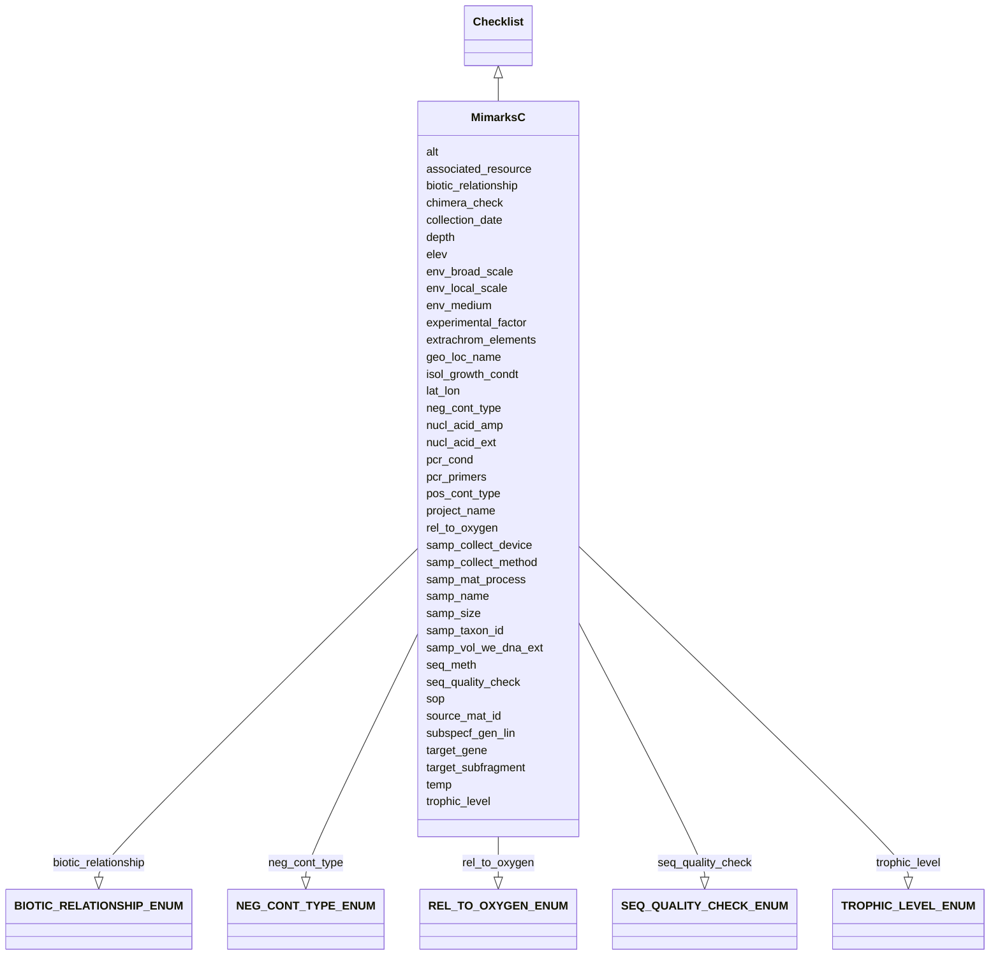

# Class: MimarksC


URI: [mixs_6_2_proposal:MimarksC](https://turbomam.github.io/mixs-envo-struct-knowl-extraction/MimarksC)





## Inheritance
* [Checklist](Checklist.md)
    * **MimarksC**


## Slots

| Name | Cardinality and Range | Description | Inheritance |
| ---  | --- | --- | --- |
| [collection_date](collection_date.md) | 1..1 <br/> [Datetime](Datetime.md) | The time of sampling, either as an instance (single point in time) or interva... | direct |
| [depth](depth.md) | 0..1 _recommended_ <br/> [String](String.md) | The vertical distance below local surface | direct |
| [geo_loc_name](geo_loc_name.md) | 1..1 <br/> [String](String.md) | The geographical origin of the sample as defined by the country or sea name f... | direct |
| [project_name](project_name.md) | 1..1 <br/> [String](String.md) | Name of the project within which the sequencing was organized | direct |
| [nucl_acid_ext](nucl_acid_ext.md) | 0..1 _recommended_ <br/> [String](String.md) | A link to a literature reference, electronic resource or a standard operating... | direct |
| [lat_lon](lat_lon.md) | 1..1 <br/> [String](String.md) | The geographical origin of the sample as defined by latitude and longitude | direct |
| [extrachrom_elements](extrachrom_elements.md) | 0..1 <br/> [Integer](Integer.md) | Do plasmids exist of significant phenotypic consequence (e | direct |
| [env_local_scale](env_local_scale.md) | 1..1 <br/> [String](String.md) | Report the entity or entities which are in the sample or specimens local vici... | direct |
| [chimera_check](chimera_check.md) | 0..1 _recommended_ <br/> [String](String.md) | Tool(s) used for chimera checking, including version number and parameters, t... | direct |
| [pcr_cond](pcr_cond.md) | 0..1 _recommended_ <br/> [String](String.md) | Description of reaction conditions and components of PCR in the form of 'init... | direct |
| [samp_name](samp_name.md) | 1..1 <br/> [String](String.md) | A local identifier or name that for the material sample used for extracting n... | direct |
| [elev](elev.md) | 0..1 _recommended_ <br/> [String](String.md) | Elevation of the sampling site is its height above a fixed reference point, m... | direct |
| [temp](temp.md) | 0..1 _recommended_ <br/> [String](String.md) | Temperature of the sample at the time of sampling | direct |
| [samp_taxon_id](samp_taxon_id.md) | 1..1 <br/> [String](String.md) | NCBI taxon id of the sample | direct |
| [seq_quality_check](seq_quality_check.md) | 0..1 _recommended_ <br/> [SEQQUALITYCHECKENUM](SEQQUALITYCHECKENUM.md) | Indicate if the sequence has been called by automatic systems (none) or under... | direct |
| [samp_mat_process](samp_mat_process.md) | 0..1 _recommended_ <br/> [String](String.md) | A brief description of any processing applied to the sample during or after r... | direct |
| [target_subfragment](target_subfragment.md) | 0..1 _recommended_ <br/> [String](String.md) | Name of subfragment of a gene or locus | direct |
| [seq_meth](seq_meth.md) | 1..1 <br/> [String](String.md) | Sequencing machine used | direct |
| [samp_size](samp_size.md) | 0..1 <br/> [String](String.md) | The total amount or size (volume (ml), mass (g) or area (m2) ) of sample coll... | direct |
| [source_mat_id](source_mat_id.md) | 0..* _recommended_ <br/> [String](String.md) | A unique identifier assigned to a material sample (as defined by http://rs | direct |
| [biotic_relationship](biotic_relationship.md) | 0..1 _recommended_ <br/> [BIOTICRELATIONSHIPENUM](BIOTICRELATIONSHIPENUM.md) | Description of relationship(s) between the subject organism and other organis... | direct |
| [env_medium](env_medium.md) | 1..1 <br/> [String](String.md) | Report the environmental material(s) immediately surrounding the sample or sp... | direct |
| [samp_collect_device](samp_collect_device.md) | 0..1 <br/> [String](String.md) | The device used to collect an environmental sample | direct |
| [isol_growth_condt](isol_growth_condt.md) | 1..1 <br/> [String](String.md) | Publication reference in the form of pubmed ID (pmid), digital object identif... | direct |
| [env_broad_scale](env_broad_scale.md) | 1..1 <br/> [String](String.md) | Report the major environmental system the sample or specimen came from | direct |
| [samp_vol_we_dna_ext](samp_vol_we_dna_ext.md) | 0..1 <br/> [String](String.md) | Volume (ml) or mass (g) of total collected sample processed for DNA extractio... | direct |
| [neg_cont_type](neg_cont_type.md) | 0..1 _recommended_ <br/> [NEGCONTTYPEENUM](NEGCONTTYPEENUM.md) | The substance or equipment used as a negative control in an investigation | direct |
| [nucl_acid_amp](nucl_acid_amp.md) | 0..1 _recommended_ <br/> [String](String.md) | A link to a literature reference, electronic resource or a standard operating... | direct |
| [alt](alt.md) | 0..1 _recommended_ <br/> [String](String.md) | Heights of objects such as airplanes, space shuttles, rockets, atmospheric ba... | direct |
| [target_gene](target_gene.md) | 1..1 <br/> [String](String.md) | Targeted gene or locus name for marker gene studies | direct |
| [experimental_factor](experimental_factor.md) | 0..1 <br/> [String](String.md) | Experimental factors are essentially the variable aspects of an experiment de... | direct |
| [pos_cont_type](pos_cont_type.md) | 0..1 _recommended_ <br/> [String](String.md) | The substance, mixture, product, or apparatus used to verify that a process w... | direct |
| [rel_to_oxygen](rel_to_oxygen.md) | 0..1 _recommended_ <br/> [RELTOOXYGENENUM](RELTOOXYGENENUM.md) | Is this organism an aerobe, anaerobe? Please note that aerobic and anaerobic ... | direct |
| [pcr_primers](pcr_primers.md) | 0..1 _recommended_ <br/> [String](String.md) | PCR primers that were used to amplify the sequence of the targeted gene, locu... | direct |
| [trophic_level](trophic_level.md) | 0..1 _recommended_ <br/> [TROPHICLEVELENUM](TROPHICLEVELENUM.md) | Trophic levels are the feeding position in a food chain | direct |
| [samp_collect_method](samp_collect_method.md) | 0..1 <br/> [String](String.md) | The method employed for collecting the sample | direct |
| [subspecf_gen_lin](subspecf_gen_lin.md) | 0..1 _recommended_ <br/> [String](String.md) | Information about the genetic distinctness of the sequenced organism below th... | direct |
| [associated_resource](associated_resource.md) | 0..* _recommended_ <br/> [String](String.md) | A related resource that is referenced, cited, or otherwise associated to the ... | direct |
| [sop](sop.md) | 0..* _recommended_ <br/> [String](String.md) | Standard operating procedures used in assembly and/or annotation of genomes, ... | direct |


## Mixin Usage

| mixed into | description |
| --- | --- |


## Identifier and Mapping Information


### Schema Source


* from schema: https://turbomam.github.io/mixs-envo-struct-knowl-extraction//GSC_MIxS_6


## Mappings

| Mapping Type | Mapped Value |
| ---  | ---  |
| self | mixs_6_2_proposal:MimarksC |
| native | mixs_6_2_proposal:MimarksC |


## LinkML Source

<!-- TODO: investigate https://stackoverflow.com/questions/37606292/how-to-create-tabbed-code-blocks-in-mkdocs-or-sphinx -->

### Direct

<details>
```yaml
name: MimarksC
title: migs_ba
from_schema: https://turbomam.github.io/mixs-envo-struct-knowl-extraction//GSC_MIxS_6
is_a: Checklist
mixin: true
slots:
- collection_date
- depth
- geo_loc_name
- project_name
- nucl_acid_ext
- lat_lon
- extrachrom_elements
- env_local_scale
- chimera_check
- pcr_cond
- samp_name
- elev
- temp
- samp_taxon_id
- seq_quality_check
- samp_mat_process
- target_subfragment
- seq_meth
- samp_size
- source_mat_id
- biotic_relationship
- env_medium
- samp_collect_device
- isol_growth_condt
- env_broad_scale
- samp_vol_we_dna_ext
- neg_cont_type
- nucl_acid_amp
- alt
- target_gene
- experimental_factor
- pos_cont_type
- rel_to_oxygen
- pcr_primers
- trophic_level
- samp_collect_method
- subspecf_gen_lin
- associated_resource
- sop
slot_usage:
  alt:
    name: alt
    domain_of:
    - Air
    - HostAssociated
    - MigsBa
    - MigsEu
    - MigsOrg
    - MigsPl
    - MigsVi
    - Mimag
    - MimarksC
    - MimarksS
    - Mims
    - Misag
    - MiscellaneousNaturalOrArtificialEnvironment
    - Miuvig
    - SymbiontAssociated
    recommended: true
  associated_resource:
    name: associated_resource
    string_serialization: '{PMID} | {DOI} | {URL}'
    domain_of:
    - Agriculture
    - MigsBa
    - MigsEu
    - MigsOrg
    - MigsPl
    - MigsVi
    - Mimag
    - MimarksC
    - MimarksS
    - Mims
    - Misag
    - Miuvig
  biotic_relationship:
    name: biotic_relationship
    domain_of:
    - Agriculture
    - MigsBa
    - MigsEu
    - MigsVi
    - MimarksC
    - Miuvig
    recommended: true
  chimera_check:
    name: chimera_check
    domain_of:
    - Agriculture
    - MimarksC
    - MimarksS
    recommended: true
  depth:
    name: depth
    title: depth
    examples:
    - value: 10 meter
    domain_of:
    - Agriculture
    - FoodFarmEnvironment
    - HostAssociated
    - MicrobialMatBiofilm
    - MigsBa
    - MigsEu
    - MigsOrg
    - MigsPl
    - MigsVi
    - Mimag
    - MimarksC
    - MimarksS
    - Mims
    - Misag
    - MiscellaneousNaturalOrArtificialEnvironment
    - Miuvig
    - PlantAssociated
    - Sediment
    - Soil
    - SymbiontAssociated
    - WastewaterSludge
    - Water
    recommended: true
  elev:
    name: elev
    domain_of:
    - Agriculture
    - Air
    - HostAssociated
    - HydrocarbonResourcesCores
    - MicrobialMatBiofilm
    - MigsBa
    - MigsEu
    - MigsOrg
    - MigsPl
    - MigsVi
    - Mimag
    - MimarksC
    - MimarksS
    - Mims
    - Misag
    - MiscellaneousNaturalOrArtificialEnvironment
    - Miuvig
    - PlantAssociated
    - Sediment
    - Soil
    - SymbiontAssociated
    - Water
    recommended: true
  experimental_factor:
    name: experimental_factor
    examples:
    - value: time series design [EFO:EFO_0001779]
    multivalued: false
    domain_of:
    - FoodAnimalAndAnimalFeed
    - FoodFoodProductionFacility
    - FoodHumanFoods
    - MigsBa
    - MigsEu
    - MigsOrg
    - MigsPl
    - MigsVi
    - Mimag
    - MimarksC
    - MimarksS
    - Mims
    - Misag
    - Miuvig
    required: false
    recommended: false
  extrachrom_elements:
    name: extrachrom_elements
    domain_of:
    - MigsBa
    - MigsEu
    - MigsOrg
    - MimarksC
    required: false
    recommended: false
  geo_loc_name:
    name: geo_loc_name
    description: The geographical origin of the sample as defined by the country or
      sea name followed by specific region name. Country or sea names should be chosen
      from the INSDC country list (http://insdc.org/country.html), or the GAZ ontology
      (http://purl.bioontology.org/ontology/GAZ)
    domain_of:
    - FoodAnimalAndAnimalFeed
    - FoodFarmEnvironment
    - FoodFoodProductionFacility
    - FoodHumanFoods
    - MigsBa
    - MigsEu
    - MigsOrg
    - MigsPl
    - MigsVi
    - Mimag
    - MimarksC
    - MimarksS
    - Mims
    - Misag
    - Miuvig
    - SymbiontAssociated
  isol_growth_condt:
    name: isol_growth_condt
    string_serialization: '{PMID}|{DOI}|{URL}'
    domain_of:
    - Agriculture
    - MigsBa
    - MigsEu
    - MigsOrg
    - MigsPl
    - MigsVi
    - MimarksC
    required: true
  lat_lon:
    name: lat_lon
    domain_of:
    - FoodAnimalAndAnimalFeed
    - FoodFarmEnvironment
    - FoodFoodProductionFacility
    - FoodHumanFoods
    - MigsBa
    - MigsEu
    - MigsOrg
    - MigsPl
    - MigsVi
    - Mimag
    - MimarksC
    - MimarksS
    - Mims
    - Misag
    - Miuvig
    - SymbiontAssociated
  nucl_acid_amp:
    name: nucl_acid_amp
    string_serialization: '{PMID}|{DOI}|{URL}'
    domain_of:
    - Agriculture
    - MigsBa
    - MigsEu
    - MigsOrg
    - MigsPl
    - MigsVi
    - Mimag
    - MimarksC
    - MimarksS
    - Mims
    - Misag
    - Miuvig
    recommended: true
  nucl_acid_ext:
    name: nucl_acid_ext
    string_serialization: '{PMID}|{DOI}|{URL}'
    domain_of:
    - Agriculture
    - FoodAnimalAndAnimalFeed
    - FoodFarmEnvironment
    - FoodFoodProductionFacility
    - FoodHumanFoods
    - MigsBa
    - MigsEu
    - MigsOrg
    - MigsPl
    - MigsVi
    - Mimag
    - MimarksC
    - MimarksS
    - Mims
    - Misag
    - Miuvig
    recommended: true
  pcr_cond:
    name: pcr_cond
    string_serialization: initial denaturation:degrees_minutes;annealing:degrees_minutes;elongation:degrees_minutes;final
      elongation:degrees_minutes;total cycles
    domain_of:
    - Agriculture
    - MimarksC
    - MimarksS
    recommended: true
  pcr_primers:
    name: pcr_primers
    examples:
    - value: FWD:GTGCCAGCMGCCGCGGTAA;REV:GGACTACHVGGGTWTCTAAT
    domain_of:
    - Agriculture
    - MimarksC
    - MimarksS
    recommended: true
  rel_to_oxygen:
    name: rel_to_oxygen
    domain_of:
    - MigsBa
    - Mimag
    - MimarksC
    - MimarksS
    - Mims
    - Misag
    recommended: true
  samp_collect_device:
    name: samp_collect_device
    examples:
    - value: swab, biopsy, niskin bottle, push core, drag swab [GENEPIO:0002713]
    domain_of:
    - Agriculture
    - FoodAnimalAndAnimalFeed
    - FoodFarmEnvironment
    - FoodFoodProductionFacility
    - FoodHumanFoods
    - MigsBa
    - MigsEu
    - MigsOrg
    - MigsPl
    - MigsVi
    - Mimag
    - MimarksC
    - MimarksS
    - Mims
    - Misag
    - Miuvig
    required: false
    recommended: false
  samp_collect_method:
    name: samp_collect_method
    examples:
    - value: swabbing
    domain_of:
    - Agriculture
    - FoodAnimalAndAnimalFeed
    - FoodFoodProductionFacility
    - FoodHumanFoods
    - MigsBa
    - MigsEu
    - MigsOrg
    - MigsPl
    - MigsVi
    - Mimag
    - MimarksC
    - MimarksS
    - Mims
    - Misag
    - Miuvig
    required: false
    recommended: false
  samp_mat_process:
    name: samp_mat_process
    string_serialization: '{text}'
    domain_of:
    - Agriculture
    - MigsBa
    - MigsEu
    - MigsOrg
    - MigsPl
    - MigsVi
    - Mimag
    - MimarksC
    - MimarksS
    - Mims
    - Misag
    - Miuvig
    recommended: true
  samp_size:
    name: samp_size
    examples:
    - value: 5 liter
    domain_of:
    - Agriculture
    - FoodAnimalAndAnimalFeed
    - FoodFarmEnvironment
    - FoodFoodProductionFacility
    - FoodHumanFoods
    - MigsBa
    - MigsEu
    - MigsOrg
    - MigsPl
    - MigsVi
    - Mimag
    - MimarksC
    - MimarksS
    - Mims
    - Misag
    - Miuvig
    required: false
    recommended: false
  samp_vol_we_dna_ext:
    name: samp_vol_we_dna_ext
    description: 'Volume (ml) or mass (g) of total collected sample processed for
      DNA extraction. Note: total sample collected should be entered under the term
      Sample Size (MIXS:0000001).'
    domain_of:
    - Agriculture
    - Air
    - FoodAnimalAndAnimalFeed
    - FoodFarmEnvironment
    - FoodFoodProductionFacility
    - FoodHumanFoods
    - HostAssociated
    - HumanAssociated
    - HumanGut
    - HumanOral
    - HumanSkin
    - HumanVaginal
    - HydrocarbonResourcesCores
    - HydrocarbonResourcesFluidsSwabs
    - MicrobialMatBiofilm
    - MigsBa
    - MigsEu
    - MigsOrg
    - MigsPl
    - MigsVi
    - Mimag
    - MimarksC
    - MimarksS
    - Mims
    - Misag
    - MiscellaneousNaturalOrArtificialEnvironment
    - Miuvig
    - PlantAssociated
    - Sediment
    - Soil
    - SymbiontAssociated
    - WastewaterSludge
    - Water
    required: false
    recommended: false
  seq_quality_check:
    name: seq_quality_check
    domain_of:
    - Agriculture
    - MimarksC
    - MimarksS
    recommended: true
  sop:
    name: sop
    string_serialization: '{PMID}|{DOI}|{URL}'
    domain_of:
    - Agriculture
    - MigsBa
    - MigsEu
    - MigsOrg
    - MigsPl
    - MigsVi
    - Mimag
    - MimarksC
    - MimarksS
    - Mims
    - Misag
    - Miuvig
    recommended: true
  source_mat_id:
    name: source_mat_id
    domain_of:
    - Agriculture
    - MigsBa
    - MigsEu
    - MigsOrg
    - MigsPl
    - MigsVi
    - Mimag
    - MimarksC
    - MimarksS
    - Mims
    - Misag
    - Miuvig
    - SymbiontAssociated
    recommended: true
  subspecf_gen_lin:
    name: subspecf_gen_lin
    domain_of:
    - FoodFoodProductionFacility
    - MigsBa
    - MigsEu
    - MigsOrg
    - MigsPl
    - MigsVi
    - MimarksC
    recommended: true
  target_gene:
    name: target_gene
    domain_of:
    - Agriculture
    - MimarksC
    - MimarksS
    required: true
  target_subfragment:
    name: target_subfragment
    domain_of:
    - Agriculture
    - MimarksC
    - MimarksS
    recommended: true
  temp:
    name: temp
    domain_of:
    - Agriculture
    - Air
    - FoodAnimalAndAnimalFeed
    - FoodFarmEnvironment
    - FoodHumanFoods
    - HostAssociated
    - HumanAssociated
    - HumanGut
    - HumanOral
    - HumanSkin
    - HumanVaginal
    - HydrocarbonResourcesCores
    - HydrocarbonResourcesFluidsSwabs
    - MicrobialMatBiofilm
    - MigsBa
    - MigsEu
    - MigsOrg
    - MigsPl
    - MigsVi
    - Mimag
    - MimarksC
    - MimarksS
    - Mims
    - Misag
    - MiscellaneousNaturalOrArtificialEnvironment
    - Miuvig
    - PlantAssociated
    - Sediment
    - Soil
    - SymbiontAssociated
    - WastewaterSludge
    - Water
    recommended: true
  trophic_level:
    name: trophic_level
    domain_of:
    - Agriculture
    - MigsBa
    - MigsEu
    - MimarksC
    recommended: true

```
</details>

### Induced

<details>
```yaml
name: MimarksC
title: migs_ba
from_schema: https://turbomam.github.io/mixs-envo-struct-knowl-extraction//GSC_MIxS_6
is_a: Checklist
mixin: true
slot_usage:
  alt:
    name: alt
    domain_of:
    - Air
    - HostAssociated
    - MigsBa
    - MigsEu
    - MigsOrg
    - MigsPl
    - MigsVi
    - Mimag
    - MimarksC
    - MimarksS
    - Mims
    - Misag
    - MiscellaneousNaturalOrArtificialEnvironment
    - Miuvig
    - SymbiontAssociated
    recommended: true
  associated_resource:
    name: associated_resource
    string_serialization: '{PMID} | {DOI} | {URL}'
    domain_of:
    - Agriculture
    - MigsBa
    - MigsEu
    - MigsOrg
    - MigsPl
    - MigsVi
    - Mimag
    - MimarksC
    - MimarksS
    - Mims
    - Misag
    - Miuvig
  biotic_relationship:
    name: biotic_relationship
    domain_of:
    - Agriculture
    - MigsBa
    - MigsEu
    - MigsVi
    - MimarksC
    - Miuvig
    recommended: true
  chimera_check:
    name: chimera_check
    domain_of:
    - Agriculture
    - MimarksC
    - MimarksS
    recommended: true
  depth:
    name: depth
    title: depth
    examples:
    - value: 10 meter
    domain_of:
    - Agriculture
    - FoodFarmEnvironment
    - HostAssociated
    - MicrobialMatBiofilm
    - MigsBa
    - MigsEu
    - MigsOrg
    - MigsPl
    - MigsVi
    - Mimag
    - MimarksC
    - MimarksS
    - Mims
    - Misag
    - MiscellaneousNaturalOrArtificialEnvironment
    - Miuvig
    - PlantAssociated
    - Sediment
    - Soil
    - SymbiontAssociated
    - WastewaterSludge
    - Water
    recommended: true
  elev:
    name: elev
    domain_of:
    - Agriculture
    - Air
    - HostAssociated
    - HydrocarbonResourcesCores
    - MicrobialMatBiofilm
    - MigsBa
    - MigsEu
    - MigsOrg
    - MigsPl
    - MigsVi
    - Mimag
    - MimarksC
    - MimarksS
    - Mims
    - Misag
    - MiscellaneousNaturalOrArtificialEnvironment
    - Miuvig
    - PlantAssociated
    - Sediment
    - Soil
    - SymbiontAssociated
    - Water
    recommended: true
  experimental_factor:
    name: experimental_factor
    examples:
    - value: time series design [EFO:EFO_0001779]
    multivalued: false
    domain_of:
    - FoodAnimalAndAnimalFeed
    - FoodFoodProductionFacility
    - FoodHumanFoods
    - MigsBa
    - MigsEu
    - MigsOrg
    - MigsPl
    - MigsVi
    - Mimag
    - MimarksC
    - MimarksS
    - Mims
    - Misag
    - Miuvig
    required: false
    recommended: false
  extrachrom_elements:
    name: extrachrom_elements
    domain_of:
    - MigsBa
    - MigsEu
    - MigsOrg
    - MimarksC
    required: false
    recommended: false
  geo_loc_name:
    name: geo_loc_name
    description: The geographical origin of the sample as defined by the country or
      sea name followed by specific region name. Country or sea names should be chosen
      from the INSDC country list (http://insdc.org/country.html), or the GAZ ontology
      (http://purl.bioontology.org/ontology/GAZ)
    domain_of:
    - FoodAnimalAndAnimalFeed
    - FoodFarmEnvironment
    - FoodFoodProductionFacility
    - FoodHumanFoods
    - MigsBa
    - MigsEu
    - MigsOrg
    - MigsPl
    - MigsVi
    - Mimag
    - MimarksC
    - MimarksS
    - Mims
    - Misag
    - Miuvig
    - SymbiontAssociated
  isol_growth_condt:
    name: isol_growth_condt
    string_serialization: '{PMID}|{DOI}|{URL}'
    domain_of:
    - Agriculture
    - MigsBa
    - MigsEu
    - MigsOrg
    - MigsPl
    - MigsVi
    - MimarksC
    required: true
  lat_lon:
    name: lat_lon
    domain_of:
    - FoodAnimalAndAnimalFeed
    - FoodFarmEnvironment
    - FoodFoodProductionFacility
    - FoodHumanFoods
    - MigsBa
    - MigsEu
    - MigsOrg
    - MigsPl
    - MigsVi
    - Mimag
    - MimarksC
    - MimarksS
    - Mims
    - Misag
    - Miuvig
    - SymbiontAssociated
  nucl_acid_amp:
    name: nucl_acid_amp
    string_serialization: '{PMID}|{DOI}|{URL}'
    domain_of:
    - Agriculture
    - MigsBa
    - MigsEu
    - MigsOrg
    - MigsPl
    - MigsVi
    - Mimag
    - MimarksC
    - MimarksS
    - Mims
    - Misag
    - Miuvig
    recommended: true
  nucl_acid_ext:
    name: nucl_acid_ext
    string_serialization: '{PMID}|{DOI}|{URL}'
    domain_of:
    - Agriculture
    - FoodAnimalAndAnimalFeed
    - FoodFarmEnvironment
    - FoodFoodProductionFacility
    - FoodHumanFoods
    - MigsBa
    - MigsEu
    - MigsOrg
    - MigsPl
    - MigsVi
    - Mimag
    - MimarksC
    - MimarksS
    - Mims
    - Misag
    - Miuvig
    recommended: true
  pcr_cond:
    name: pcr_cond
    string_serialization: initial denaturation:degrees_minutes;annealing:degrees_minutes;elongation:degrees_minutes;final
      elongation:degrees_minutes;total cycles
    domain_of:
    - Agriculture
    - MimarksC
    - MimarksS
    recommended: true
  pcr_primers:
    name: pcr_primers
    examples:
    - value: FWD:GTGCCAGCMGCCGCGGTAA;REV:GGACTACHVGGGTWTCTAAT
    domain_of:
    - Agriculture
    - MimarksC
    - MimarksS
    recommended: true
  rel_to_oxygen:
    name: rel_to_oxygen
    domain_of:
    - MigsBa
    - Mimag
    - MimarksC
    - MimarksS
    - Mims
    - Misag
    recommended: true
  samp_collect_device:
    name: samp_collect_device
    examples:
    - value: swab, biopsy, niskin bottle, push core, drag swab [GENEPIO:0002713]
    domain_of:
    - Agriculture
    - FoodAnimalAndAnimalFeed
    - FoodFarmEnvironment
    - FoodFoodProductionFacility
    - FoodHumanFoods
    - MigsBa
    - MigsEu
    - MigsOrg
    - MigsPl
    - MigsVi
    - Mimag
    - MimarksC
    - MimarksS
    - Mims
    - Misag
    - Miuvig
    required: false
    recommended: false
  samp_collect_method:
    name: samp_collect_method
    examples:
    - value: swabbing
    domain_of:
    - Agriculture
    - FoodAnimalAndAnimalFeed
    - FoodFoodProductionFacility
    - FoodHumanFoods
    - MigsBa
    - MigsEu
    - MigsOrg
    - MigsPl
    - MigsVi
    - Mimag
    - MimarksC
    - MimarksS
    - Mims
    - Misag
    - Miuvig
    required: false
    recommended: false
  samp_mat_process:
    name: samp_mat_process
    string_serialization: '{text}'
    domain_of:
    - Agriculture
    - MigsBa
    - MigsEu
    - MigsOrg
    - MigsPl
    - MigsVi
    - Mimag
    - MimarksC
    - MimarksS
    - Mims
    - Misag
    - Miuvig
    recommended: true
  samp_size:
    name: samp_size
    examples:
    - value: 5 liter
    domain_of:
    - Agriculture
    - FoodAnimalAndAnimalFeed
    - FoodFarmEnvironment
    - FoodFoodProductionFacility
    - FoodHumanFoods
    - MigsBa
    - MigsEu
    - MigsOrg
    - MigsPl
    - MigsVi
    - Mimag
    - MimarksC
    - MimarksS
    - Mims
    - Misag
    - Miuvig
    required: false
    recommended: false
  samp_vol_we_dna_ext:
    name: samp_vol_we_dna_ext
    description: 'Volume (ml) or mass (g) of total collected sample processed for
      DNA extraction. Note: total sample collected should be entered under the term
      Sample Size (MIXS:0000001).'
    domain_of:
    - Agriculture
    - Air
    - FoodAnimalAndAnimalFeed
    - FoodFarmEnvironment
    - FoodFoodProductionFacility
    - FoodHumanFoods
    - HostAssociated
    - HumanAssociated
    - HumanGut
    - HumanOral
    - HumanSkin
    - HumanVaginal
    - HydrocarbonResourcesCores
    - HydrocarbonResourcesFluidsSwabs
    - MicrobialMatBiofilm
    - MigsBa
    - MigsEu
    - MigsOrg
    - MigsPl
    - MigsVi
    - Mimag
    - MimarksC
    - MimarksS
    - Mims
    - Misag
    - MiscellaneousNaturalOrArtificialEnvironment
    - Miuvig
    - PlantAssociated
    - Sediment
    - Soil
    - SymbiontAssociated
    - WastewaterSludge
    - Water
    required: false
    recommended: false
  seq_quality_check:
    name: seq_quality_check
    domain_of:
    - Agriculture
    - MimarksC
    - MimarksS
    recommended: true
  sop:
    name: sop
    string_serialization: '{PMID}|{DOI}|{URL}'
    domain_of:
    - Agriculture
    - MigsBa
    - MigsEu
    - MigsOrg
    - MigsPl
    - MigsVi
    - Mimag
    - MimarksC
    - MimarksS
    - Mims
    - Misag
    - Miuvig
    recommended: true
  source_mat_id:
    name: source_mat_id
    domain_of:
    - Agriculture
    - MigsBa
    - MigsEu
    - MigsOrg
    - MigsPl
    - MigsVi
    - Mimag
    - MimarksC
    - MimarksS
    - Mims
    - Misag
    - Miuvig
    - SymbiontAssociated
    recommended: true
  subspecf_gen_lin:
    name: subspecf_gen_lin
    domain_of:
    - FoodFoodProductionFacility
    - MigsBa
    - MigsEu
    - MigsOrg
    - MigsPl
    - MigsVi
    - MimarksC
    recommended: true
  target_gene:
    name: target_gene
    domain_of:
    - Agriculture
    - MimarksC
    - MimarksS
    required: true
  target_subfragment:
    name: target_subfragment
    domain_of:
    - Agriculture
    - MimarksC
    - MimarksS
    recommended: true
  temp:
    name: temp
    domain_of:
    - Agriculture
    - Air
    - FoodAnimalAndAnimalFeed
    - FoodFarmEnvironment
    - FoodHumanFoods
    - HostAssociated
    - HumanAssociated
    - HumanGut
    - HumanOral
    - HumanSkin
    - HumanVaginal
    - HydrocarbonResourcesCores
    - HydrocarbonResourcesFluidsSwabs
    - MicrobialMatBiofilm
    - MigsBa
    - MigsEu
    - MigsOrg
    - MigsPl
    - MigsVi
    - Mimag
    - MimarksC
    - MimarksS
    - Mims
    - Misag
    - MiscellaneousNaturalOrArtificialEnvironment
    - Miuvig
    - PlantAssociated
    - Sediment
    - Soil
    - SymbiontAssociated
    - WastewaterSludge
    - Water
    recommended: true
  trophic_level:
    name: trophic_level
    domain_of:
    - Agriculture
    - MigsBa
    - MigsEu
    - MimarksC
    recommended: true
attributes:
  collection_date:
    name: collection_date
    description: 'The time of sampling, either as an instance (single point in time)
      or interval. In case no exact time is available, the date/time can be right
      truncated i.e. all of these are valid times: 2008-01-23T19:23:10+00:00; 2008-01-23T19:23:10;
      2008-01-23; 2008-01; 2008; Except: 2008-01; 2008 all are ISO8601 compliant'
    title: collection date
    notes:
    - date
    examples:
    - value: '2013-03-25T12:42:31+00:32'
    in_subset:
    - environment
    from_schema: https://turbomam.github.io/mixs-envo-struct-knowl-extraction//GSC_MIxS_6
    rank: 1000
    slot_uri: MIXS:0000011
    multivalued: false
    alias: collection_date
    owner: MimarksC
    domain_of:
    - FoodAnimalAndAnimalFeed
    - FoodFarmEnvironment
    - FoodFoodProductionFacility
    - FoodHumanFoods
    - MigsBa
    - MigsEu
    - MigsOrg
    - MigsPl
    - MigsVi
    - Mimag
    - MimarksC
    - MimarksS
    - Mims
    - Misag
    - Miuvig
    - SymbiontAssociated
    range: datetime
    required: true
  depth:
    name: depth
    description: The vertical distance below local surface. For sediment or soil samples
      depth is measured from sediment or soil surface, respectively. Depth can be
      reported as an interval for subsurface samples
    title: depth
    examples:
    - value: 10 meter
    from_schema: https://turbomam.github.io/mixs-envo-struct-knowl-extraction//GSC_MIxS_6
    rank: 1000
    slot_uri: MIXS:0000018
    multivalued: false
    alias: depth
    owner: MimarksC
    domain_of:
    - Agriculture
    - FoodFarmEnvironment
    - HostAssociated
    - MicrobialMatBiofilm
    - MigsBa
    - MigsEu
    - MigsOrg
    - MigsPl
    - MigsVi
    - Mimag
    - MimarksC
    - MimarksS
    - Mims
    - Misag
    - MiscellaneousNaturalOrArtificialEnvironment
    - Miuvig
    - PlantAssociated
    - Sediment
    - Soil
    - SymbiontAssociated
    - WastewaterSludge
    - Water
    range: string
    recommended: true
    pattern: ^[-+]?[0-9]*\.?[0-9]+([eE][-+]?[0-9]+)? \S.*\S$
  geo_loc_name:
    name: geo_loc_name
    description: The geographical origin of the sample as defined by the country or
      sea name followed by specific region name. Country or sea names should be chosen
      from the INSDC country list (http://insdc.org/country.html), or the GAZ ontology
      (http://purl.bioontology.org/ontology/GAZ)
    title: geographic location (country and/or sea,region)
    from_schema: https://turbomam.github.io/mixs-envo-struct-knowl-extraction//GSC_MIxS_6
    rank: 1000
    string_serialization: '{term}: {term}, {text}'
    slot_uri: MIXS:0000010
    multivalued: false
    alias: geo_loc_name
    owner: MimarksC
    domain_of:
    - FoodAnimalAndAnimalFeed
    - FoodFarmEnvironment
    - FoodFoodProductionFacility
    - FoodHumanFoods
    - MigsBa
    - MigsEu
    - MigsOrg
    - MigsPl
    - MigsVi
    - Mimag
    - MimarksC
    - MimarksS
    - Mims
    - Misag
    - Miuvig
    - SymbiontAssociated
    range: string
    required: true
  project_name:
    name: project_name
    description: Name of the project within which the sequencing was organized
    title: project name
    notes:
    - project
    examples:
    - value: Forest soil metagenome
    in_subset:
    - investigation
    from_schema: https://turbomam.github.io/mixs-envo-struct-knowl-extraction//GSC_MIxS_6
    rank: 1000
    slot_uri: MIXS:0000092
    multivalued: false
    alias: project_name
    owner: MimarksC
    domain_of:
    - Air
    - BuiltEnvironment
    - FoodAnimalAndAnimalFeed
    - FoodFarmEnvironment
    - FoodFoodProductionFacility
    - FoodHumanFoods
    - HostAssociated
    - HumanAssociated
    - HumanGut
    - HumanOral
    - HumanSkin
    - HumanVaginal
    - HydrocarbonResourcesCores
    - HydrocarbonResourcesFluidsSwabs
    - MicrobialMatBiofilm
    - MigsBa
    - MigsEu
    - MigsOrg
    - MigsPl
    - MigsVi
    - Mimag
    - MimarksC
    - MimarksS
    - Mims
    - Misag
    - MiscellaneousNaturalOrArtificialEnvironment
    - Miuvig
    - PlantAssociated
    - Sediment
    - Soil
    - SymbiontAssociated
    - WastewaterSludge
    - Water
    range: string
    required: true
  nucl_acid_ext:
    name: nucl_acid_ext
    description: A link to a literature reference, electronic resource or a standard
      operating procedure (SOP), that describes the material separation to recover
      the nucleic acid fraction from a sample
    title: nucleic acid extraction
    from_schema: https://turbomam.github.io/mixs-envo-struct-knowl-extraction//GSC_MIxS_6
    rank: 1000
    string_serialization: '{PMID}|{DOI}|{URL}'
    slot_uri: MIXS:0000037
    multivalued: false
    alias: nucl_acid_ext
    owner: MimarksC
    domain_of:
    - Agriculture
    - FoodAnimalAndAnimalFeed
    - FoodFarmEnvironment
    - FoodFoodProductionFacility
    - FoodHumanFoods
    - MigsBa
    - MigsEu
    - MigsOrg
    - MigsPl
    - MigsVi
    - Mimag
    - MimarksC
    - MimarksS
    - Mims
    - Misag
    - Miuvig
    range: string
    recommended: true
    structured_pattern:
      syntax: '{PMID}|{DOI}|{URL}'
      interpolated: true
      partial_match: true
  lat_lon:
    name: lat_lon
    description: The geographical origin of the sample as defined by latitude and
      longitude. The values should be reported in decimal degrees and in WGS84 system
    title: geographic location (latitude and longitude)
    from_schema: https://turbomam.github.io/mixs-envo-struct-knowl-extraction//GSC_MIxS_6
    rank: 1000
    string_serialization: '{float} {float}'
    slot_uri: MIXS:0000009
    multivalued: false
    alias: lat_lon
    owner: MimarksC
    domain_of:
    - FoodAnimalAndAnimalFeed
    - FoodFarmEnvironment
    - FoodFoodProductionFacility
    - FoodHumanFoods
    - MigsBa
    - MigsEu
    - MigsOrg
    - MigsPl
    - MigsVi
    - Mimag
    - MimarksC
    - MimarksS
    - Mims
    - Misag
    - Miuvig
    - SymbiontAssociated
    range: string
    required: true
  extrachrom_elements:
    name: extrachrom_elements
    description: Do plasmids exist of significant phenotypic consequence (e.g. ones
      that determine virulence or antibiotic resistance). Megaplasmids? Other plasmids
      (borrelia has 15+ plasmids)
    title: extrachromosomal elements
    from_schema: https://turbomam.github.io/mixs-envo-struct-knowl-extraction//GSC_MIxS_6
    rank: 1000
    slot_uri: MIXS:0000023
    multivalued: false
    alias: extrachrom_elements
    owner: MimarksC
    domain_of:
    - MigsBa
    - MigsEu
    - MigsOrg
    - MimarksC
    range: integer
    required: false
    recommended: false
  env_local_scale:
    name: env_local_scale
    annotations:
      Expected_value:
        tag: Expected_value
        value: Environmental entities having causal influences upon the entity at
          time of sampling
    description: 'Report the entity or entities which are in the sample or specimens
      local vicinity and which you believe have significant causal influences on your
      sample or specimen. We recommend using EnvO terms which are of smaller spatial
      grain than your entry for env_broad_scale. Terms, such as anatomical sites,
      from other OBO Library ontologies which interoperate with EnvO (e.g. UBERON)
      are accepted in this field. EnvO documentation about how to use the field: https://github.com/EnvironmentOntology/envo/wiki/Using-ENVO-with-MIxS'
    title: local environmental context
    notes:
    - context
    - environmental
    examples:
    - value: hillside [ENVO:01000333]
    in_subset:
    - environment
    from_schema: https://turbomam.github.io/mixs-envo-struct-knowl-extraction//GSC_MIxS_6
    rank: 1000
    string_serialization: '{termLabel} [{termID}]'
    slot_uri: MIXS:0000013
    multivalued: false
    alias: env_local_scale
    owner: MimarksC
    domain_of:
    - MigsBa
    - MigsEu
    - MigsOrg
    - MigsPl
    - MigsVi
    - Mimag
    - MimarksC
    - MimarksS
    - Mims
    - Misag
    - Miuvig
    range: string
    required: true
  chimera_check:
    name: chimera_check
    description: Tool(s) used for chimera checking, including version number and parameters,
      to discover and remove chimeric sequences. A chimeric sequence is comprised
      of two or more phylogenetically distinct parent sequences
    title: chimera check software
    from_schema: https://turbomam.github.io/mixs-envo-struct-knowl-extraction//GSC_MIxS_6
    rank: 1000
    string_serialization: '{software};{version};{parameters}'
    slot_uri: MIXS:0000052
    multivalued: false
    alias: chimera_check
    owner: MimarksC
    domain_of:
    - Agriculture
    - MimarksC
    - MimarksS
    range: string
    recommended: true
  pcr_cond:
    name: pcr_cond
    description: Description of reaction conditions and components of PCR in the form
      of 'initial denaturation:94degC_1.5min; annealing=...'
    title: pcr conditions
    from_schema: https://turbomam.github.io/mixs-envo-struct-knowl-extraction//GSC_MIxS_6
    rank: 1000
    string_serialization: initial denaturation:degrees_minutes;annealing:degrees_minutes;elongation:degrees_minutes;final
      elongation:degrees_minutes;total cycles
    slot_uri: MIXS:0000049
    multivalued: false
    alias: pcr_cond
    owner: MimarksC
    domain_of:
    - Agriculture
    - MimarksC
    - MimarksS
    range: string
    recommended: true
  samp_name:
    name: samp_name
    description: A local identifier or name that for the material sample used for
      extracting nucleic acids, and subsequent sequencing. It can refer either to
      the original material collected or to any derived sub-samples. It can have any
      format, but we suggest that you make it concise, unique and consistent within
      your lab, and as informative as possible. INSDC requires every sample name from
      a single Submitter to be unique. Use of a globally unique identifier for the
      field source_mat_id is recommended in addition to sample_name
    title: sample name
    notes:
    - sample
    examples:
    - value: ISDsoil1
    in_subset:
    - investigation
    from_schema: https://turbomam.github.io/mixs-envo-struct-knowl-extraction//GSC_MIxS_6
    rank: 1000
    slot_uri: MIXS:0001107
    multivalued: false
    alias: samp_name
    owner: MimarksC
    domain_of:
    - Air
    - BuiltEnvironment
    - FoodAnimalAndAnimalFeed
    - FoodFarmEnvironment
    - FoodFoodProductionFacility
    - FoodHumanFoods
    - HostAssociated
    - HumanAssociated
    - HumanGut
    - HumanOral
    - HumanSkin
    - HumanVaginal
    - HydrocarbonResourcesCores
    - HydrocarbonResourcesFluidsSwabs
    - MicrobialMatBiofilm
    - MigsBa
    - MigsEu
    - MigsOrg
    - MigsPl
    - MigsVi
    - Mimag
    - MimarksC
    - MimarksS
    - Mims
    - Misag
    - MiscellaneousNaturalOrArtificialEnvironment
    - Miuvig
    - PlantAssociated
    - Sediment
    - Soil
    - SymbiontAssociated
    - WastewaterSludge
    - Water
    range: string
    required: true
  elev:
    name: elev
    description: Elevation of the sampling site is its height above a fixed reference
      point, most commonly the mean sea level. Elevation is mainly used when referring
      to points on the earth's surface, while altitude is used for points above the
      surface, such as an aircraft in flight or a spacecraft in orbit
    title: elevation
    from_schema: https://turbomam.github.io/mixs-envo-struct-knowl-extraction//GSC_MIxS_6
    rank: 1000
    slot_uri: MIXS:0000093
    multivalued: false
    alias: elev
    owner: MimarksC
    domain_of:
    - Agriculture
    - Air
    - HostAssociated
    - HydrocarbonResourcesCores
    - MicrobialMatBiofilm
    - MigsBa
    - MigsEu
    - MigsOrg
    - MigsPl
    - MigsVi
    - Mimag
    - MimarksC
    - MimarksS
    - Mims
    - Misag
    - MiscellaneousNaturalOrArtificialEnvironment
    - Miuvig
    - PlantAssociated
    - Sediment
    - Soil
    - SymbiontAssociated
    - Water
    range: string
    recommended: true
    pattern: ^[-+]?[0-9]*\.?[0-9]+([eE][-+]?[0-9]+)? \S.*\S$
  temp:
    name: temp
    description: Temperature of the sample at the time of sampling
    title: temperature
    from_schema: https://turbomam.github.io/mixs-envo-struct-knowl-extraction//GSC_MIxS_6
    rank: 1000
    slot_uri: MIXS:0000113
    multivalued: false
    alias: temp
    owner: MimarksC
    domain_of:
    - Agriculture
    - Air
    - FoodAnimalAndAnimalFeed
    - FoodFarmEnvironment
    - FoodHumanFoods
    - HostAssociated
    - HumanAssociated
    - HumanGut
    - HumanOral
    - HumanSkin
    - HumanVaginal
    - HydrocarbonResourcesCores
    - HydrocarbonResourcesFluidsSwabs
    - MicrobialMatBiofilm
    - MigsBa
    - MigsEu
    - MigsOrg
    - MigsPl
    - MigsVi
    - Mimag
    - MimarksC
    - MimarksS
    - Mims
    - Misag
    - MiscellaneousNaturalOrArtificialEnvironment
    - Miuvig
    - PlantAssociated
    - Sediment
    - Soil
    - SymbiontAssociated
    - WastewaterSludge
    - Water
    range: string
    recommended: true
    pattern: ^[-+]?[0-9]*\.?[0-9]+([eE][-+]?[0-9]+)? \S.*\S$
  samp_taxon_id:
    name: samp_taxon_id
    annotations:
      Expected_value:
        tag: Expected_value
        value: Taxonomy ID
    description: NCBI taxon id of the sample.  Maybe be a single taxon or mixed taxa
      sample. Use 'synthetic metagenome for mock community/positive controls, or 'blank
      sample' for negative controls
    title: taxonomy ID of DNA sample
    notes:
    - dna
    - identifier
    - sample
    - taxon
    examples:
    - value: Gut Metagenome [NCBI:txid749906]
    in_subset:
    - investigation
    from_schema: https://turbomam.github.io/mixs-envo-struct-knowl-extraction//GSC_MIxS_6
    rank: 1000
    string_serialization: '{text} [NCBI:txid]'
    slot_uri: MIXS:0001320
    multivalued: false
    alias: samp_taxon_id
    owner: MimarksC
    domain_of:
    - MigsBa
    - MigsEu
    - MigsOrg
    - MigsPl
    - MigsVi
    - Mimag
    - MimarksC
    - MimarksS
    - Mims
    - Misag
    - Miuvig
    range: string
    required: true
  seq_quality_check:
    name: seq_quality_check
    description: Indicate if the sequence has been called by automatic systems (none)
      or undergone a manual editing procedure (e.g. by inspecting the raw data or
      chromatograms). Applied only for sequences that are not submitted to SRA,ENA
      or DRA
    title: sequence quality check
    from_schema: https://turbomam.github.io/mixs-envo-struct-knowl-extraction//GSC_MIxS_6
    rank: 1000
    slot_uri: MIXS:0000051
    multivalued: false
    alias: seq_quality_check
    owner: MimarksC
    domain_of:
    - Agriculture
    - MimarksC
    - MimarksS
    range: SEQ_QUALITY_CHECK_ENUM
    recommended: true
  samp_mat_process:
    name: samp_mat_process
    description: A brief description of any processing applied to the sample during
      or after retrieving the sample from environment, or a link to the relevant protocol(s)
      performed
    title: sample material processing
    from_schema: https://turbomam.github.io/mixs-envo-struct-knowl-extraction//GSC_MIxS_6
    rank: 1000
    string_serialization: '{text}'
    slot_uri: MIXS:0000016
    multivalued: false
    alias: samp_mat_process
    owner: MimarksC
    domain_of:
    - Agriculture
    - MigsBa
    - MigsEu
    - MigsOrg
    - MigsPl
    - MigsVi
    - Mimag
    - MimarksC
    - MimarksS
    - Mims
    - Misag
    - Miuvig
    range: string
    recommended: true
  target_subfragment:
    name: target_subfragment
    description: Name of subfragment of a gene or locus. Important to e.g. identify
      special regions on marker genes like V6 on 16S rRNA
    title: target subfragment
    from_schema: https://turbomam.github.io/mixs-envo-struct-knowl-extraction//GSC_MIxS_6
    rank: 1000
    slot_uri: MIXS:0000045
    multivalued: false
    alias: target_subfragment
    owner: MimarksC
    domain_of:
    - Agriculture
    - MimarksC
    - MimarksS
    range: string
    recommended: true
  seq_meth:
    name: seq_meth
    annotations:
      Expected_value:
        tag: Expected_value
        value: Text or OBI
    description: Sequencing machine used. Where possible the term should be taken
      from the OBI list of DNA sequencers (http://purl.obolibrary.org/obo/OBI_0400103)
    title: sequencing method
    notes:
    - method
    examples:
    - value: 454 Genome Sequencer FLX [OBI:0000702]
    in_subset:
    - sequencing
    from_schema: https://turbomam.github.io/mixs-envo-struct-knowl-extraction//GSC_MIxS_6
    rank: 1000
    string_serialization: '{termLabel} [{termID}]|{text}'
    slot_uri: MIXS:0000050
    multivalued: false
    alias: seq_meth
    owner: MimarksC
    domain_of:
    - Agriculture
    - FoodAnimalAndAnimalFeed
    - FoodFarmEnvironment
    - FoodFoodProductionFacility
    - FoodHumanFoods
    - MigsBa
    - MigsEu
    - MigsOrg
    - MigsPl
    - MigsVi
    - Mimag
    - MimarksC
    - MimarksS
    - Mims
    - Misag
    - Miuvig
    range: string
    required: true
  samp_size:
    name: samp_size
    description: The total amount or size (volume (ml), mass (g) or area (m2) ) of
      sample collected
    title: amount or size of sample collected
    examples:
    - value: 5 liter
    from_schema: https://turbomam.github.io/mixs-envo-struct-knowl-extraction//GSC_MIxS_6
    rank: 1000
    slot_uri: MIXS:0000001
    multivalued: false
    alias: samp_size
    owner: MimarksC
    domain_of:
    - Agriculture
    - FoodAnimalAndAnimalFeed
    - FoodFarmEnvironment
    - FoodFoodProductionFacility
    - FoodHumanFoods
    - MigsBa
    - MigsEu
    - MigsOrg
    - MigsPl
    - MigsVi
    - Mimag
    - MimarksC
    - MimarksS
    - Mims
    - Misag
    - Miuvig
    range: string
    required: false
    recommended: false
    pattern: ^[-+]?[0-9]*\.?[0-9]+([eE][-+]?[0-9]+)? \S.*\S$
  source_mat_id:
    name: source_mat_id
    description: A unique identifier assigned to a material sample (as defined by
      http://rs.tdwg.org/dwc/terms/materialSampleID, and as opposed to a particular
      digital record of a material sample) used for extracting nucleic acids, and
      subsequent sequencing. The identifier can refer either to the original material
      collected or to any derived sub-samples. The INSDC qualifiers /specimen_voucher,
      /bio_material, or /culture_collection may or may not share the same value as
      the source_mat_id field. For instance, the /specimen_voucher qualifier and source_mat_id
      may both contain 'UAM:Herps:14' , referring to both the specimen voucher and
      sampled tissue with the same identifier. However, the /culture_collection qualifier
      may refer to a value from an initial culture (e.g. ATCC:11775) while source_mat_id
      would refer to an identifier from some derived culture from which the nucleic
      acids were extracted (e.g. xatc123 or ark:/2154/R2)
    title: source material identifiers
    from_schema: https://turbomam.github.io/mixs-envo-struct-knowl-extraction//GSC_MIxS_6
    rank: 1000
    string_serialization: '{text}'
    slot_uri: MIXS:0000026
    multivalued: true
    alias: source_mat_id
    owner: MimarksC
    domain_of:
    - Agriculture
    - MigsBa
    - MigsEu
    - MigsOrg
    - MigsPl
    - MigsVi
    - Mimag
    - MimarksC
    - MimarksS
    - Mims
    - Misag
    - Miuvig
    - SymbiontAssociated
    range: string
    recommended: true
  biotic_relationship:
    name: biotic_relationship
    description: Description of relationship(s) between the subject organism and other
      organism(s) it is associated with. E.g., parasite on species X; mutualist with
      species Y. The target organism is the subject of the relationship, and the other
      organism(s) is the object
    title: observed biotic relationship
    from_schema: https://turbomam.github.io/mixs-envo-struct-knowl-extraction//GSC_MIxS_6
    rank: 1000
    slot_uri: MIXS:0000028
    multivalued: false
    alias: biotic_relationship
    owner: MimarksC
    domain_of:
    - Agriculture
    - MigsBa
    - MigsEu
    - MigsVi
    - MimarksC
    - Miuvig
    range: BIOTIC_RELATIONSHIP_ENUM
    recommended: true
  env_medium:
    name: env_medium
    description: 'Report the environmental material(s) immediately surrounding the
      sample or specimen at the time of sampling. We recommend using subclasses of
      ''environmental material'' (http://purl.obolibrary.org/obo/ENVO_00010483). EnvO
      documentation about how to use the field: https://github.com/EnvironmentOntology/envo/wiki/Using-ENVO-with-MIxS
      . Terms from other OBO ontologies are permissible as long as they reference
      mass/volume nouns (e.g. air, water, blood) and not discrete, countable entities
      (e.g. a tree, a leaf, a table top)'
    title: environmental medium
    notes:
    - environmental
    examples:
    - value: bluegrass field soil [ENVO:00005789]
    in_subset:
    - environment
    from_schema: https://turbomam.github.io/mixs-envo-struct-knowl-extraction//GSC_MIxS_6
    rank: 1000
    slot_uri: MIXS:0000014
    multivalued: false
    alias: env_medium
    owner: MimarksC
    domain_of:
    - MigsBa
    - MigsEu
    - MigsOrg
    - MigsPl
    - MigsVi
    - Mimag
    - MimarksC
    - MimarksS
    - Mims
    - Misag
    - Miuvig
    range: string
    required: true
    pattern: ^\S+.*\S+ \[[a-zA-Z]{2,}:\d+\]$
  samp_collect_device:
    name: samp_collect_device
    description: The device used to collect an environmental sample. This field accepts
      terms listed under environmental sampling device (http://purl.obolibrary.org/obo/ENVO).
      This field also accepts terms listed under specimen collection device (http://purl.obolibrary.org/obo/GENEPIO_0002094)
    title: sample collection device
    examples:
    - value: swab, biopsy, niskin bottle, push core, drag swab [GENEPIO:0002713]
    from_schema: https://turbomam.github.io/mixs-envo-struct-knowl-extraction//GSC_MIxS_6
    rank: 1000
    string_serialization: '{termLabel} [{termID}]|{text}'
    slot_uri: MIXS:0000002
    multivalued: false
    alias: samp_collect_device
    owner: MimarksC
    domain_of:
    - Agriculture
    - FoodAnimalAndAnimalFeed
    - FoodFarmEnvironment
    - FoodFoodProductionFacility
    - FoodHumanFoods
    - MigsBa
    - MigsEu
    - MigsOrg
    - MigsPl
    - MigsVi
    - Mimag
    - MimarksC
    - MimarksS
    - Mims
    - Misag
    - Miuvig
    range: string
    required: false
    recommended: false
  isol_growth_condt:
    name: isol_growth_condt
    description: Publication reference in the form of pubmed ID (pmid), digital object
      identifier (doi) or url for isolation and growth condition specifications of
      the organism/material
    title: isolation and growth condition
    from_schema: https://turbomam.github.io/mixs-envo-struct-knowl-extraction//GSC_MIxS_6
    rank: 1000
    string_serialization: '{PMID}|{DOI}|{URL}'
    slot_uri: MIXS:0000003
    multivalued: false
    alias: isol_growth_condt
    owner: MimarksC
    domain_of:
    - Agriculture
    - MigsBa
    - MigsEu
    - MigsOrg
    - MigsPl
    - MigsVi
    - MimarksC
    range: string
    required: true
    structured_pattern:
      syntax: '{PMID}|{DOI}|{URL}'
      interpolated: true
      partial_match: true
  env_broad_scale:
    name: env_broad_scale
    description: 'Report the major environmental system the sample or specimen came
      from. The system(s) identified should have a coarse spatial grain, to provide
      the general environmental context of where the sampling was done (e.g. in the
      desert or a rainforest). We recommend using subclasses of EnvOs biome class:  http://purl.obolibrary.org/obo/ENVO_00000428.
      EnvO documentation about how to use the field: https://github.com/EnvironmentOntology/envo/wiki/Using-ENVO-with-MIxS'
    title: broad-scale environmental context
    notes:
    - context
    - environmental
    examples:
    - value: rangeland biome [ENVO:01000247]
    in_subset:
    - environment
    from_schema: https://turbomam.github.io/mixs-envo-struct-knowl-extraction//GSC_MIxS_6
    rank: 1000
    slot_uri: MIXS:0000012
    multivalued: false
    alias: env_broad_scale
    owner: MimarksC
    domain_of:
    - MigsBa
    - MigsEu
    - MigsOrg
    - MigsPl
    - MigsVi
    - Mimag
    - MimarksC
    - MimarksS
    - Mims
    - Misag
    - Miuvig
    range: string
    required: true
    pattern: ^\S+.*\S+ \[[a-zA-Z]{2,}:\d+\]$
  samp_vol_we_dna_ext:
    name: samp_vol_we_dna_ext
    description: 'Volume (ml) or mass (g) of total collected sample processed for
      DNA extraction. Note: total sample collected should be entered under the term
      Sample Size (MIXS:0000001).'
    title: sample volume or weight for DNA extraction
    from_schema: https://turbomam.github.io/mixs-envo-struct-knowl-extraction//GSC_MIxS_6
    rank: 1000
    slot_uri: MIXS:0000111
    multivalued: false
    alias: samp_vol_we_dna_ext
    owner: MimarksC
    domain_of:
    - Agriculture
    - Air
    - FoodAnimalAndAnimalFeed
    - FoodFarmEnvironment
    - FoodFoodProductionFacility
    - FoodHumanFoods
    - HostAssociated
    - HumanAssociated
    - HumanGut
    - HumanOral
    - HumanSkin
    - HumanVaginal
    - HydrocarbonResourcesCores
    - HydrocarbonResourcesFluidsSwabs
    - MicrobialMatBiofilm
    - MigsBa
    - MigsEu
    - MigsOrg
    - MigsPl
    - MigsVi
    - Mimag
    - MimarksC
    - MimarksS
    - Mims
    - Misag
    - MiscellaneousNaturalOrArtificialEnvironment
    - Miuvig
    - PlantAssociated
    - Sediment
    - Soil
    - SymbiontAssociated
    - WastewaterSludge
    - Water
    range: string
    required: false
    recommended: false
    pattern: ^[-+]?[0-9]*\.?[0-9]+([eE][-+]?[0-9]+)? \S.*\S$
  neg_cont_type:
    name: neg_cont_type
    annotations:
      Expected_value:
        tag: Expected_value
        value: enumeration or text
    description: The substance or equipment used as a negative control in an investigation
    title: negative control type
    notes:
    - type
    in_subset:
    - investigation
    from_schema: https://turbomam.github.io/mixs-envo-struct-knowl-extraction//GSC_MIxS_6
    rank: 1000
    slot_uri: MIXS:0001321
    multivalued: false
    alias: neg_cont_type
    owner: MimarksC
    domain_of:
    - MigsBa
    - MigsEu
    - MigsOrg
    - MigsPl
    - MigsVi
    - Mimag
    - MimarksC
    - MimarksS
    - Mims
    - Misag
    - Miuvig
    range: NEG_CONT_TYPE_ENUM
    recommended: true
  nucl_acid_amp:
    name: nucl_acid_amp
    description: A link to a literature reference, electronic resource or a standard
      operating procedure (SOP), that describes the enzymatic amplification (PCR,
      TMA, NASBA) of specific nucleic acids
    title: nucleic acid amplification
    from_schema: https://turbomam.github.io/mixs-envo-struct-knowl-extraction//GSC_MIxS_6
    rank: 1000
    string_serialization: '{PMID}|{DOI}|{URL}'
    slot_uri: MIXS:0000038
    multivalued: false
    alias: nucl_acid_amp
    owner: MimarksC
    domain_of:
    - Agriculture
    - MigsBa
    - MigsEu
    - MigsOrg
    - MigsPl
    - MigsVi
    - Mimag
    - MimarksC
    - MimarksS
    - Mims
    - Misag
    - Miuvig
    range: string
    recommended: true
  alt:
    name: alt
    description: Heights of objects such as airplanes, space shuttles, rockets, atmospheric
      balloons and heights of places such as atmospheric layers and clouds. Used to
      measure the height of an object which is above the earth's surface. In this
      context, the altitude measurement is the vertical distance between the earth's
      surface above sea level and the sampled position in the air
    title: altitude
    from_schema: https://turbomam.github.io/mixs-envo-struct-knowl-extraction//GSC_MIxS_6
    rank: 1000
    slot_uri: MIXS:0000094
    multivalued: false
    alias: alt
    owner: MimarksC
    domain_of:
    - Air
    - HostAssociated
    - MigsBa
    - MigsEu
    - MigsOrg
    - MigsPl
    - MigsVi
    - Mimag
    - MimarksC
    - MimarksS
    - Mims
    - Misag
    - MiscellaneousNaturalOrArtificialEnvironment
    - Miuvig
    - SymbiontAssociated
    range: string
    recommended: true
    pattern: ^[-+]?[0-9]*\.?[0-9]+([eE][-+]?[0-9]+)? \S.*\S$
  target_gene:
    name: target_gene
    description: Targeted gene or locus name for marker gene studies
    title: target gene
    from_schema: https://turbomam.github.io/mixs-envo-struct-knowl-extraction//GSC_MIxS_6
    rank: 1000
    slot_uri: MIXS:0000044
    multivalued: false
    alias: target_gene
    owner: MimarksC
    domain_of:
    - Agriculture
    - MimarksC
    - MimarksS
    range: string
    required: true
  experimental_factor:
    name: experimental_factor
    description: Experimental factors are essentially the variable aspects of an experiment
      design which can be used to describe an experiment, or set of experiments, in
      an increasingly detailed manner. This field accepts ontology terms from Experimental
      Factor Ontology (EFO) and/or Ontology for Biomedical Investigations (OBI). For
      a browser of EFO (v 2.95) terms, please see http://purl.bioontology.org/ontology/EFO;
      for a browser of OBI (v 2018-02-12) terms please see http://purl.bioontology.org/ontology/OBI
    title: experimental factor
    examples:
    - value: time series design [EFO:EFO_0001779]
    from_schema: https://turbomam.github.io/mixs-envo-struct-knowl-extraction//GSC_MIxS_6
    rank: 1000
    string_serialization: '{termLabel} [{termID}]|{text}'
    slot_uri: MIXS:0000008
    multivalued: false
    alias: experimental_factor
    owner: MimarksC
    domain_of:
    - FoodAnimalAndAnimalFeed
    - FoodFoodProductionFacility
    - FoodHumanFoods
    - MigsBa
    - MigsEu
    - MigsOrg
    - MigsPl
    - MigsVi
    - Mimag
    - MimarksC
    - MimarksS
    - Mims
    - Misag
    - Miuvig
    range: string
    required: false
    recommended: false
  pos_cont_type:
    name: pos_cont_type
    description: The substance, mixture, product, or apparatus used to verify that
      a process which is part of an investigation delivers a true positive
    title: positive control type
    notes:
    - type
    in_subset:
    - investigation
    from_schema: https://turbomam.github.io/mixs-envo-struct-knowl-extraction//GSC_MIxS_6
    rank: 1000
    string_serialization: '{term} or {text}'
    slot_uri: MIXS:0001322
    multivalued: false
    alias: pos_cont_type
    owner: MimarksC
    domain_of:
    - MigsBa
    - MigsEu
    - MigsOrg
    - MigsPl
    - MigsVi
    - Mimag
    - MimarksC
    - MimarksS
    - Mims
    - Misag
    - Miuvig
    range: string
    recommended: true
  rel_to_oxygen:
    name: rel_to_oxygen
    description: Is this organism an aerobe, anaerobe? Please note that aerobic and
      anaerobic are valid descriptors for microbial environments
    title: relationship to oxygen
    from_schema: https://turbomam.github.io/mixs-envo-struct-knowl-extraction//GSC_MIxS_6
    rank: 1000
    slot_uri: MIXS:0000015
    multivalued: false
    alias: rel_to_oxygen
    owner: MimarksC
    domain_of:
    - MigsBa
    - Mimag
    - MimarksC
    - MimarksS
    - Mims
    - Misag
    range: REL_TO_OXYGEN_ENUM
    recommended: true
  pcr_primers:
    name: pcr_primers
    description: PCR primers that were used to amplify the sequence of the targeted
      gene, locus or subfragment. This field should contain all the primers used for
      a single PCR reaction if multiple forward or reverse primers are present in
      a single PCR reaction. The primer sequence should be reported in uppercase letters
    title: pcr primers
    examples:
    - value: FWD:GTGCCAGCMGCCGCGGTAA;REV:GGACTACHVGGGTWTCTAAT
    from_schema: https://turbomam.github.io/mixs-envo-struct-knowl-extraction//GSC_MIxS_6
    rank: 1000
    string_serialization: FWD:{dna};REV:{dna}
    slot_uri: MIXS:0000046
    multivalued: false
    alias: pcr_primers
    owner: MimarksC
    domain_of:
    - Agriculture
    - MimarksC
    - MimarksS
    range: string
    recommended: true
  trophic_level:
    name: trophic_level
    description: Trophic levels are the feeding position in a food chain. Microbes
      can be a range of producers (e.g. chemolithotroph)
    title: trophic level
    from_schema: https://turbomam.github.io/mixs-envo-struct-knowl-extraction//GSC_MIxS_6
    rank: 1000
    slot_uri: MIXS:0000032
    multivalued: false
    alias: trophic_level
    owner: MimarksC
    domain_of:
    - Agriculture
    - MigsBa
    - MigsEu
    - MimarksC
    range: TROPHIC_LEVEL_ENUM
    recommended: true
  samp_collect_method:
    name: samp_collect_method
    description: The method employed for collecting the sample
    title: sample collection method
    examples:
    - value: swabbing
    from_schema: https://turbomam.github.io/mixs-envo-struct-knowl-extraction//GSC_MIxS_6
    rank: 1000
    slot_uri: MIXS:0001225
    multivalued: false
    alias: samp_collect_method
    owner: MimarksC
    domain_of:
    - Agriculture
    - FoodAnimalAndAnimalFeed
    - FoodFoodProductionFacility
    - FoodHumanFoods
    - MigsBa
    - MigsEu
    - MigsOrg
    - MigsPl
    - MigsVi
    - Mimag
    - MimarksC
    - MimarksS
    - Mims
    - Misag
    - Miuvig
    range: string
    required: false
    recommended: false
    structured_pattern:
      syntax: '{PMID}|{DOI}|{URL}|{text}'
      interpolated: true
      partial_match: true
  subspecf_gen_lin:
    name: subspecf_gen_lin
    description: Information about the genetic distinctness of the sequenced organism
      below the subspecies level, e.g., serovar, serotype, biotype, ecotype, or any
      relevant genetic typing schemes like Group I plasmid. Subspecies should not
      be recorded in this term, but in the NCBI taxonomy. Supply both the lineage
      name and the lineage rank separated by a colon, e.g., biovar:abc123
    title: subspecific genetic lineage
    from_schema: https://turbomam.github.io/mixs-envo-struct-knowl-extraction//GSC_MIxS_6
    rank: 1000
    string_serialization: '{rank name}:{text}'
    slot_uri: MIXS:0000020
    multivalued: false
    alias: subspecf_gen_lin
    owner: MimarksC
    domain_of:
    - FoodFoodProductionFacility
    - MigsBa
    - MigsEu
    - MigsOrg
    - MigsPl
    - MigsVi
    - MimarksC
    range: string
    recommended: true
  associated_resource:
    name: associated_resource
    description: A related resource that is referenced, cited, or otherwise associated
      to the sequence
    title: relevant electronic resources
    from_schema: https://turbomam.github.io/mixs-envo-struct-knowl-extraction//GSC_MIxS_6
    rank: 1000
    string_serialization: '{PMID} | {DOI} | {URL}'
    slot_uri: MIXS:0000091
    multivalued: true
    alias: associated_resource
    owner: MimarksC
    domain_of:
    - Agriculture
    - MigsBa
    - MigsEu
    - MigsOrg
    - MigsPl
    - MigsVi
    - Mimag
    - MimarksC
    - MimarksS
    - Mims
    - Misag
    - Miuvig
    range: string
    recommended: true
  sop:
    name: sop
    description: Standard operating procedures used in assembly and/or annotation
      of genomes, metagenomes or environmental sequences
    title: relevant standard operating procedures
    from_schema: https://turbomam.github.io/mixs-envo-struct-knowl-extraction//GSC_MIxS_6
    rank: 1000
    string_serialization: '{PMID}|{DOI}|{URL}'
    slot_uri: MIXS:0000090
    multivalued: true
    alias: sop
    owner: MimarksC
    domain_of:
    - Agriculture
    - MigsBa
    - MigsEu
    - MigsOrg
    - MigsPl
    - MigsVi
    - Mimag
    - MimarksC
    - MimarksS
    - Mims
    - Misag
    - Miuvig
    range: string
    recommended: true

```
</details>