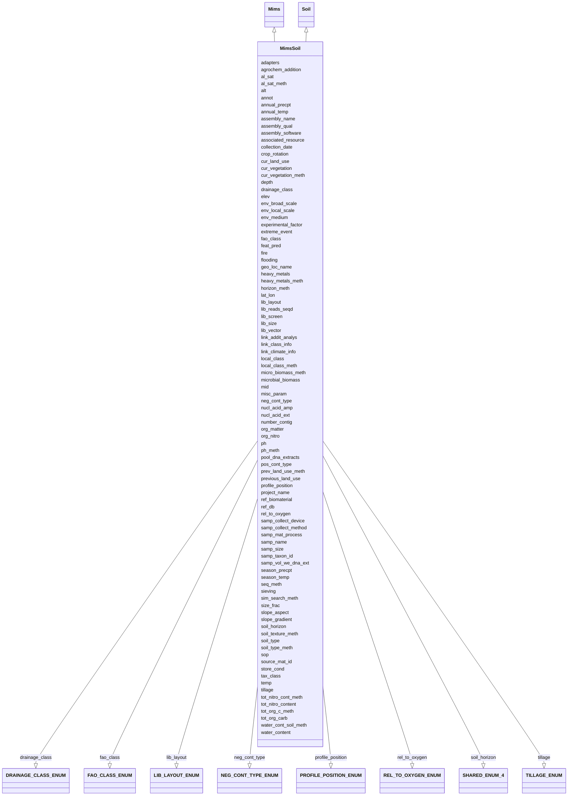

# Class: MimsSoil


URI: [mixs_6_2_proposal:MimsSoil](https://turbomam.github.io/mixs-envo-struct-knowl-extraction/MimsSoil)





## Inheritance
* [EnvironmentalPackage](EnvironmentalPackage.md)
    * [Soil](Soil.md)
        * **MimsSoil** [ [Mims](Mims.md)]


## Slots

| Name | Cardinality and Range | Description | Inheritance |
| ---  | --- | --- | --- |
| [source_mat_id](source_mat_id.md) | 0..* _recommended_ <br/> [String](String.md) | A unique identifier assigned to a material sample (as defined by http://rs | [Mims](Mims.md) |
| [geo_loc_name](geo_loc_name.md) | 1..1 <br/> [String](String.md) | The geographical origin of the sample as defined by the country or sea name f... | [Mims](Mims.md) |
| [lat_lon](lat_lon.md) | 1..1 <br/> [String](String.md) | The geographical origin of the sample as defined by latitude and longitude | [Mims](Mims.md) |
| [samp_name](samp_name.md) | 1..1 <br/> [String](String.md) | A local identifier or name that for the material sample used for extracting n... | [Soil](Soil.md), [Mims](Mims.md) |
| [samp_mat_process](samp_mat_process.md) | 0..1 _recommended_ <br/> [String](String.md) | A brief description of any processing applied to the sample during or after r... | [Mims](Mims.md) |
| [ref_biomaterial](ref_biomaterial.md) | 0..1 <br/> [String](String.md) | Primary publication if isolated before genome publication; otherwise, primary... | [Mims](Mims.md) |
| [lib_size](lib_size.md) | 0..1 _recommended_ <br/> [Integer](Integer.md) | Total number of clones in the library prepared for the project | [Mims](Mims.md) |
| [lib_reads_seqd](lib_reads_seqd.md) | 0..1 _recommended_ <br/> [Integer](Integer.md) | Total number of clones sequenced from the library | [Mims](Mims.md) |
| [env_local_scale](env_local_scale.md) | 1..1 <br/> [String](String.md) | Report the entity or entities which are in the sample or specimens local vici... | [Mims](Mims.md) |
| [tax_class](tax_class.md) | 0..1 <br/> [String](String.md) | Method used for taxonomic classification, along with reference database used,... | [Mims](Mims.md) |
| [adapters](adapters.md) | 0..1 _recommended_ <br/> [String](String.md) | Adapters provide priming sequences for both amplification and sequencing of t... | [Mims](Mims.md) |
| [samp_size](samp_size.md) | 0..1 _recommended_ <br/> [String](String.md) | The total amount or size (volume (ml), mass (g) or area (m2) ) of sample coll... | [Mims](Mims.md) |
| [sim_search_meth](sim_search_meth.md) | 0..1 <br/> [String](String.md) | Tool used to compare ORFs with database, along with version and cutoffs used | [Mims](Mims.md) |
| [assembly_name](assembly_name.md) | 0..1 _recommended_ <br/> [String](String.md) | Name/version of the assembly provided by the submitter that is used in the ge... | [Mims](Mims.md) |
| [seq_meth](seq_meth.md) | 1..1 <br/> [String](String.md) | Sequencing machine used | [Mims](Mims.md) |
| [collection_date](collection_date.md) | 1..1 <br/> [Datetime](Datetime.md) | The time of sampling, either as an instance (single point in time) or interva... | [Mims](Mims.md) |
| [lib_layout](lib_layout.md) | 0..1 _recommended_ <br/> [LIBLAYOUTENUM](LIBLAYOUTENUM.md) | Specify whether to expect single, paired, or other configuration of reads | [Mims](Mims.md) |
| [samp_vol_we_dna_ext](samp_vol_we_dna_ext.md) | 0..1 <br/> [String](String.md) | Volume (ml) or mass (g) of total collected sample processed for DNA extractio... | [Soil](Soil.md), [Mims](Mims.md) |
| [env_medium](env_medium.md) | 1..1 <br/> [String](String.md) | Report the environmental material(s) immediately surrounding the sample or sp... | [Mims](Mims.md) |
| [env_broad_scale](env_broad_scale.md) | 1..1 <br/> [String](String.md) | Report the major environmental system the sample or specimen came from | [Mims](Mims.md) |
| [feat_pred](feat_pred.md) | 0..1 <br/> [String](String.md) | Method used to predict UViGs features such as ORFs, integration site, etc | [Mims](Mims.md) |
| [samp_collect_method](samp_collect_method.md) | 0..1 _recommended_ <br/> [String](String.md) | The method employed for collecting the sample | [Mims](Mims.md) |
| [project_name](project_name.md) | 1..1 <br/> [String](String.md) | Name of the project within which the sequencing was organized | [Soil](Soil.md), [Mims](Mims.md) |
| [rel_to_oxygen](rel_to_oxygen.md) | 0..1 <br/> [RELTOOXYGENENUM](RELTOOXYGENENUM.md) | Is this organism an aerobe, anaerobe? Please note that aerobic and anaerobic ... | [Mims](Mims.md) |
| [experimental_factor](experimental_factor.md) | 0..1 _recommended_ <br/> [String](String.md) | Experimental factors are essentially the variable aspects of an experiment de... | [Mims](Mims.md) |
| [samp_collect_device](samp_collect_device.md) | 0..1 _recommended_ <br/> [String](String.md) | The device used to collect an environmental sample | [Mims](Mims.md) |
| [nucl_acid_ext](nucl_acid_ext.md) | 0..1 _recommended_ <br/> [String](String.md) | A link to a literature reference, electronic resource or a standard operating... | [Mims](Mims.md) |
| [lib_vector](lib_vector.md) | 0..1 _recommended_ <br/> [String](String.md) | Cloning vector type(s) used in construction of libraries | [Mims](Mims.md) |
| [lib_screen](lib_screen.md) | 0..1 _recommended_ <br/> [String](String.md) | Specific enrichment or screening methods applied before and/or after creating... | [Mims](Mims.md) |
| [assembly_software](assembly_software.md) | 0..1 _recommended_ <br/> [String](String.md) | Tool(s) used for assembly, including version number and parameters | [Mims](Mims.md) |
| [mid](mid.md) | 0..1 _recommended_ <br/> [String](String.md) | Molecular barcodes, called Multiplex Identifiers (MIDs), that are used to spe... | [Mims](Mims.md) |
| [nucl_acid_amp](nucl_acid_amp.md) | 0..1 _recommended_ <br/> [String](String.md) | A link to a literature reference, electronic resource or a standard operating... | [Mims](Mims.md) |
| [number_contig](number_contig.md) | 0..1 _recommended_ <br/> [Integer](Integer.md) | Total number of contigs in the cleaned/submitted assembly that makes up a giv... | [Mims](Mims.md) |
| [temp](temp.md) | 0..1 _recommended_ <br/> [String](String.md) | Temperature of the sample at the time of sampling | [Soil](Soil.md), [Mims](Mims.md) |
| [alt](alt.md) | 0..1 _recommended_ <br/> [String](String.md) | Heights of objects such as airplanes, space shuttles, rockets, atmospheric ba... | [Mims](Mims.md) |
| [elev](elev.md) | 1..1 _recommended_ <br/> [String](String.md) | Elevation of the sampling site is its height above a fixed reference point, m... | [Soil](Soil.md), [Mims](Mims.md) |
| [assembly_qual](assembly_qual.md) | 0..1 _recommended_ <br/> [String](String.md) | The assembly quality category is based on sets of criteria outlined for each ... | [Mims](Mims.md) |
| [size_frac](size_frac.md) | 0..1 <br/> [String](String.md) | Filtering pore size used in sample preparation | [Mims](Mims.md) |
| [pos_cont_type](pos_cont_type.md) | 0..1 _recommended_ <br/> [String](String.md) | The substance, mixture, product, or apparatus used to verify that a process w... | [Mims](Mims.md) |
| [neg_cont_type](neg_cont_type.md) | 0..1 _recommended_ <br/> [NEGCONTTYPEENUM](NEGCONTTYPEENUM.md) | The substance or equipment used as a negative control in an investigation | [Mims](Mims.md) |
| [annot](annot.md) | 0..1 _recommended_ <br/> [String](String.md) | Tool used for annotation, or for cases where annotation was provided by a com... | [Mims](Mims.md) |
| [samp_taxon_id](samp_taxon_id.md) | 1..1 <br/> [String](String.md) | NCBI taxon id of the sample | [Mims](Mims.md) |
| [depth](depth.md) | 1..1 _recommended_ <br/> [String](String.md) | The vertical distance below local surface | [Soil](Soil.md), [Mims](Mims.md) |
| [ref_db](ref_db.md) | 0..1 <br/> [String](String.md) | List of database(s) used for ORF annotation, along with version number and re... | [Mims](Mims.md) |
| [associated_resource](associated_resource.md) | 0..* _recommended_ <br/> [String](String.md) | A related resource that is referenced, cited, or otherwise associated to the ... | [Mims](Mims.md) |
| [sop](sop.md) | 0..* _recommended_ <br/> [String](String.md) | Standard operating procedures used in assembly and/or annotation of genomes, ... | [Mims](Mims.md) |
| [cur_land_use](cur_land_use.md) | 0..1 <br/> [String](String.md) | Present state of sample site | [Soil](Soil.md) |
| [cur_vegetation](cur_vegetation.md) | 0..1 <br/> [String](String.md) | Vegetation classification from one or more standard classification systems, o... | [Soil](Soil.md) |
| [cur_vegetation_meth](cur_vegetation_meth.md) | 0..1 <br/> [String](String.md) | Reference or method used in vegetation classification | [Soil](Soil.md) |
| [previous_land_use](previous_land_use.md) | 0..1 <br/> [String](String.md) | Previous land use and dates | [Soil](Soil.md) |
| [prev_land_use_meth](prev_land_use_meth.md) | 0..1 <br/> [String](String.md) | Reference or method used in determining previous land use and dates | [Soil](Soil.md) |
| [crop_rotation](crop_rotation.md) | 0..1 <br/> [String](String.md) | Whether or not crop is rotated, and if yes, rotation schedule | [Soil](Soil.md) |
| [agrochem_addition](agrochem_addition.md) | 0..* <br/> [String](String.md) | Addition of fertilizers, pesticides, etc | [Soil](Soil.md) |
| [tillage](tillage.md) | 0..* <br/> [TILLAGEENUM](TILLAGEENUM.md) | Note method(s) used for tilling | [Soil](Soil.md) |
| [fire](fire.md) | 0..1 <br/> [Datetime](Datetime.md) | Historical and/or physical evidence of fire | [Soil](Soil.md) |
| [flooding](flooding.md) | 0..1 <br/> [Datetime](Datetime.md) | Historical and/or physical evidence of flooding | [Soil](Soil.md) |
| [extreme_event](extreme_event.md) | 0..1 <br/> [Datetime](Datetime.md) | Unusual physical events that may have affected microbial populations | [Soil](Soil.md) |
| [soil_horizon](soil_horizon.md) | 0..1 <br/> [SHAREDENUM4](SHAREDENUM4.md) | Specific layer in the land area which measures parallel to the soil surface a... | [Soil](Soil.md) |
| [horizon_meth](horizon_meth.md) | 0..1 <br/> [String](String.md) | Reference or method used in determining the horizon | [Soil](Soil.md) |
| [sieving](sieving.md) | 0..1 <br/> [String](String.md) | Collection design of pooled samples and/or sieve size and amount of sample si... | [Soil](Soil.md) |
| [water_content](water_content.md) | 0..1 <br/> [String](String.md) | Water content measurement | [Soil](Soil.md) |
| [water_cont_soil_meth](water_cont_soil_meth.md) | 0..1 <br/> [String](String.md) | Reference or method used in determining the water content of soil | [Soil](Soil.md) |
| [pool_dna_extracts](pool_dna_extracts.md) | 0..1 <br/> [String](String.md) | Indicate whether multiple DNA extractions were mixed | [Soil](Soil.md) |
| [store_cond](store_cond.md) | 0..1 <br/> [String](String.md) | Explain how and for how long the soil sample was stored before DNA extraction... | [Soil](Soil.md) |
| [link_climate_info](link_climate_info.md) | 0..1 <br/> [String](String.md) | Link to climate resource | [Soil](Soil.md) |
| [annual_temp](annual_temp.md) | 0..1 <br/> [String](String.md) | Mean annual temperature | [Soil](Soil.md) |
| [season_temp](season_temp.md) | 0..1 <br/> [String](String.md) | Mean seasonal temperature | [Soil](Soil.md) |
| [annual_precpt](annual_precpt.md) | 0..1 <br/> [String](String.md) | The average of all annual precipitation values known, or an estimated equival... | [Soil](Soil.md) |
| [season_precpt](season_precpt.md) | 0..1 <br/> [String](String.md) | The average of all seasonal precipitation values known, or an estimated equiv... | [Soil](Soil.md) |
| [link_class_info](link_class_info.md) | 0..1 <br/> [String](String.md) | Link to digitized soil maps or other soil classification information | [Soil](Soil.md) |
| [fao_class](fao_class.md) | 0..1 <br/> [FAOCLASSENUM](FAOCLASSENUM.md) | Soil classification from the FAO World Reference Database for Soil Resources | [Soil](Soil.md) |
| [local_class](local_class.md) | 0..1 <br/> [String](String.md) | Soil classification based on local soil classification system | [Soil](Soil.md) |
| [local_class_meth](local_class_meth.md) | 0..1 <br/> [String](String.md) | Reference or method used in determining the local soil classification | [Soil](Soil.md) |
| [org_nitro](org_nitro.md) | 0..1 <br/> [String](String.md) | Concentration of organic nitrogen | [Soil](Soil.md) |
| [soil_type](soil_type.md) | 0..1 <br/> [String](String.md) | Description of the soil type or classification | [Soil](Soil.md) |
| [soil_type_meth](soil_type_meth.md) | 0..1 <br/> [String](String.md) | Reference or method used in determining soil series name or other lower-level... | [Soil](Soil.md) |
| [slope_gradient](slope_gradient.md) | 0..1 <br/> [String](String.md) | Commonly called 'slope' | [Soil](Soil.md) |
| [slope_aspect](slope_aspect.md) | 0..1 <br/> [String](String.md) | The direction a slope faces | [Soil](Soil.md) |
| [profile_position](profile_position.md) | 0..1 <br/> [PROFILEPOSITIONENUM](PROFILEPOSITIONENUM.md) | Cross-sectional position in the hillslope where sample was collected | [Soil](Soil.md) |
| [drainage_class](drainage_class.md) | 0..1 <br/> [DRAINAGECLASSENUM](DRAINAGECLASSENUM.md) | Drainage classification from a standard system such as the USDA system | [Soil](Soil.md) |
| [soil_texture_meth](soil_texture_meth.md) | 0..1 <br/> [String](String.md) | Reference or method used in determining soil texture | [Soil](Soil.md) |
| [ph](ph.md) | 0..1 <br/> [Float](Float.md) | Ph measurement of the sample, or liquid portion of sample, or aqueous phase o... | [Soil](Soil.md) |
| [ph_meth](ph_meth.md) | 0..1 <br/> [String](String.md) | Reference or method used in determining ph | [Soil](Soil.md) |
| [org_matter](org_matter.md) | 0..1 <br/> [String](String.md) | Concentration of organic matter | [Soil](Soil.md) |
| [tot_org_carb](tot_org_carb.md) | 0..1 <br/> [String](String.md) | Definition for soil: total organic carbon content of the soil, definition oth... | [Soil](Soil.md) |
| [tot_org_c_meth](tot_org_c_meth.md) | 0..1 <br/> [String](String.md) | Reference or method used in determining total organic carbon | [Soil](Soil.md) |
| [tot_nitro_content](tot_nitro_content.md) | 0..1 <br/> [String](String.md) | Total nitrogen content of the sample | [Soil](Soil.md) |
| [tot_nitro_cont_meth](tot_nitro_cont_meth.md) | 0..1 <br/> [String](String.md) | Reference or method used in determining the total nitrogen | [Soil](Soil.md) |
| [microbial_biomass](microbial_biomass.md) | 0..1 <br/> [String](String.md) | The part of the organic matter in the soil that constitutes living microorgan... | [Soil](Soil.md) |
| [micro_biomass_meth](micro_biomass_meth.md) | 0..1 <br/> [String](String.md) | Reference or method used in determining microbial biomass | [Soil](Soil.md) |
| [link_addit_analys](link_addit_analys.md) | 0..1 <br/> [String](String.md) | Link to additional analysis results performed on the sample | [Soil](Soil.md) |
| [heavy_metals](heavy_metals.md) | 0..* <br/> [String](String.md) | Heavy metals present in the sequenced sample and their concentrations | [Soil](Soil.md) |
| [heavy_metals_meth](heavy_metals_meth.md) | 0..1 <br/> [String](String.md) | Reference or method used in determining heavy metals | [Soil](Soil.md) |
| [al_sat](al_sat.md) | 0..1 <br/> [String](String.md) | Aluminum saturation (esp | [Soil](Soil.md) |
| [al_sat_meth](al_sat_meth.md) | 0..1 <br/> [String](String.md) | Reference or method used in determining Al saturation | [Soil](Soil.md) |
| [misc_param](misc_param.md) | 0..* <br/> [String](String.md) | Any other measurement performed or parameter collected, that is not listed he... | [Soil](Soil.md) |


## Usages

| used by | used in | type | used |
| ---  | --- | --- | --- |
| [MixsCompliantData](MixsCompliantData.md) | [mims_soil_data](mims_soil_data.md) | range | [MimsSoil](MimsSoil.md) |


## Identifier and Mapping Information


### Schema Source


* from schema: https://turbomam.github.io/mixs-envo-struct-knowl-extraction//mixs_6_2_proposal


## Mappings

| Mapping Type | Mapped Value |
| ---  | ---  |
| self | mixs_6_2_proposal:MimsSoil |
| native | mixs_6_2_proposal:MimsSoil |


## LinkML Source

<!-- TODO: investigate https://stackoverflow.com/questions/37606292/how-to-create-tabbed-code-blocks-in-mkdocs-or-sphinx -->

### Direct

<details>
```yaml
name: MimsSoil
title: Mims combined with Soil
from_schema: https://turbomam.github.io/mixs-envo-struct-knowl-extraction//mixs_6_2_proposal
is_a: Soil
mixins:
- Mims

```
</details>

### Induced

<details>
```yaml
name: MimsSoil
title: Mims combined with Soil
from_schema: https://turbomam.github.io/mixs-envo-struct-knowl-extraction//mixs_6_2_proposal
is_a: Soil
mixins:
- Mims
attributes:
  source_mat_id:
    name: source_mat_id
    description: A unique identifier assigned to a material sample (as defined by
      http://rs.tdwg.org/dwc/terms/materialSampleID, and as opposed to a particular
      digital record of a material sample) used for extracting nucleic acids, and
      subsequent sequencing. The identifier can refer either to the original material
      collected or to any derived sub-samples. The INSDC qualifiers /specimen_voucher,
      /bio_material, or /culture_collection may or may not share the same value as
      the source_mat_id field. For instance, the /specimen_voucher qualifier and source_mat_id
      may both contain 'UAM:Herps:14' , referring to both the specimen voucher and
      sampled tissue with the same identifier. However, the /culture_collection qualifier
      may refer to a value from an initial culture (e.g. ATCC:11775) while source_mat_id
      would refer to an identifier from some derived culture from which the nucleic
      acids were extracted (e.g. xatc123 or ark:/2154/R2)
    title: source material identifiers
    from_schema: https://turbomam.github.io/mixs-envo-struct-knowl-extraction//mixs_6_2_proposal
    rank: 1000
    string_serialization: '{text}'
    slot_uri: MIXS:0000026
    multivalued: true
    alias: source_mat_id
    owner: MimsSoil
    domain_of:
    - Agriculture
    - MigsBa
    - MigsEu
    - MigsOrg
    - MigsPl
    - MigsVi
    - Mimag
    - MimarksC
    - MimarksS
    - Mims
    - Misag
    - Miuvig
    - SymbiontAssociated
    range: string
    recommended: true
  geo_loc_name:
    name: geo_loc_name
    description: The geographical origin of the sample as defined by the country or
      sea name followed by specific region name. Country or sea names should be chosen
      from the INSDC country list (http://insdc.org/country.html), or the GAZ ontology
      (http://purl.bioontology.org/ontology/GAZ)
    title: geographic location (country and/or sea,region)
    from_schema: https://turbomam.github.io/mixs-envo-struct-knowl-extraction//mixs_6_2_proposal
    rank: 1000
    string_serialization: '{term}: {term}, {text}'
    slot_uri: MIXS:0000010
    multivalued: false
    alias: geo_loc_name
    owner: MimsSoil
    domain_of:
    - FoodAnimalAndAnimalFeed
    - FoodFarmEnvironment
    - FoodFoodProductionFacility
    - FoodHumanFoods
    - MigsBa
    - MigsEu
    - MigsOrg
    - MigsPl
    - MigsVi
    - Mimag
    - MimarksC
    - MimarksS
    - Mims
    - Misag
    - Miuvig
    - SymbiontAssociated
    range: string
    required: true
  lat_lon:
    name: lat_lon
    description: The geographical origin of the sample as defined by latitude and
      longitude. The values should be reported in decimal degrees and in WGS84 system
    title: geographic location (latitude and longitude)
    from_schema: https://turbomam.github.io/mixs-envo-struct-knowl-extraction//mixs_6_2_proposal
    rank: 1000
    string_serialization: '{float} {float}'
    slot_uri: MIXS:0000009
    multivalued: false
    alias: lat_lon
    owner: MimsSoil
    domain_of:
    - FoodAnimalAndAnimalFeed
    - FoodFarmEnvironment
    - FoodFoodProductionFacility
    - FoodHumanFoods
    - MigsBa
    - MigsEu
    - MigsOrg
    - MigsPl
    - MigsVi
    - Mimag
    - MimarksC
    - MimarksS
    - Mims
    - Misag
    - Miuvig
    - SymbiontAssociated
    range: string
    required: true
  samp_name:
    name: samp_name
    description: A local identifier or name that for the material sample used for
      extracting nucleic acids, and subsequent sequencing. It can refer either to
      the original material collected or to any derived sub-samples. It can have any
      format, but we suggest that you make it concise, unique and consistent within
      your lab, and as informative as possible. INSDC requires every sample name from
      a single Submitter to be unique. Use of a globally unique identifier for the
      field source_mat_id is recommended in addition to sample_name
    title: sample name
    notes:
    - sample
    examples:
    - value: ISDsoil1
    in_subset:
    - investigation
    from_schema: https://turbomam.github.io/mixs-envo-struct-knowl-extraction//mixs_6_2_proposal
    rank: 1000
    slot_uri: MIXS:0001107
    multivalued: false
    alias: samp_name
    owner: MimsSoil
    domain_of:
    - Air
    - BuiltEnvironment
    - FoodAnimalAndAnimalFeed
    - FoodFarmEnvironment
    - FoodFoodProductionFacility
    - FoodHumanFoods
    - HostAssociated
    - HumanAssociated
    - HumanGut
    - HumanOral
    - HumanSkin
    - HumanVaginal
    - HydrocarbonResourcesCores
    - HydrocarbonResourcesFluidsSwabs
    - MicrobialMatBiofilm
    - MigsBa
    - MigsEu
    - MigsOrg
    - MigsPl
    - MigsVi
    - Mimag
    - MimarksC
    - MimarksS
    - Mims
    - Misag
    - MiscellaneousNaturalOrArtificialEnvironment
    - Miuvig
    - PlantAssociated
    - Sediment
    - Soil
    - SymbiontAssociated
    - WastewaterSludge
    - Water
    range: string
    required: true
  samp_mat_process:
    name: samp_mat_process
    description: A brief description of any processing applied to the sample during
      or after retrieving the sample from environment, or a link to the relevant protocol(s)
      performed
    title: sample material processing
    from_schema: https://turbomam.github.io/mixs-envo-struct-knowl-extraction//mixs_6_2_proposal
    rank: 1000
    string_serialization: '{text}'
    slot_uri: MIXS:0000016
    multivalued: false
    alias: samp_mat_process
    owner: MimsSoil
    domain_of:
    - Agriculture
    - MigsBa
    - MigsEu
    - MigsOrg
    - MigsPl
    - MigsVi
    - Mimag
    - MimarksC
    - MimarksS
    - Mims
    - Misag
    - Miuvig
    range: string
    recommended: true
  ref_biomaterial:
    name: ref_biomaterial
    description: Primary publication if isolated before genome publication; otherwise,
      primary genome report
    title: reference for biomaterial
    from_schema: https://turbomam.github.io/mixs-envo-struct-knowl-extraction//mixs_6_2_proposal
    rank: 1000
    slot_uri: MIXS:0000025
    multivalued: false
    alias: ref_biomaterial
    owner: MimsSoil
    domain_of:
    - MigsBa
    - MigsEu
    - MigsOrg
    - MigsPl
    - MigsVi
    - Mimag
    - Mims
    - Misag
    - Miuvig
    range: string
    required: false
    recommended: false
    structured_pattern:
      syntax: '{PMID}|{DOI}|{URL}'
      interpolated: true
      partial_match: true
  lib_size:
    name: lib_size
    description: Total number of clones in the library prepared for the project
    title: library size
    from_schema: https://turbomam.github.io/mixs-envo-struct-knowl-extraction//mixs_6_2_proposal
    rank: 1000
    slot_uri: MIXS:0000039
    multivalued: false
    alias: lib_size
    owner: MimsSoil
    domain_of:
    - Agriculture
    - MigsBa
    - MigsEu
    - MigsOrg
    - MigsPl
    - MigsVi
    - Mimag
    - MimarksS
    - Mims
    - Misag
    - Miuvig
    range: integer
    recommended: true
  lib_reads_seqd:
    name: lib_reads_seqd
    description: Total number of clones sequenced from the library
    title: library reads sequenced
    from_schema: https://turbomam.github.io/mixs-envo-struct-knowl-extraction//mixs_6_2_proposal
    rank: 1000
    slot_uri: MIXS:0000040
    multivalued: false
    alias: lib_reads_seqd
    owner: MimsSoil
    domain_of:
    - Agriculture
    - MigsBa
    - MigsEu
    - MigsOrg
    - MigsPl
    - MigsVi
    - Mimag
    - MimarksS
    - Mims
    - Misag
    - Miuvig
    range: integer
    recommended: true
  env_local_scale:
    name: env_local_scale
    annotations:
      Expected_value:
        tag: Expected_value
        value: Environmental entities having causal influences upon the entity at
          time of sampling
    description: 'Report the entity or entities which are in the sample or specimens
      local vicinity and which you believe have significant causal influences on your
      sample or specimen. We recommend using EnvO terms which are of smaller spatial
      grain than your entry for env_broad_scale. Terms, such as anatomical sites,
      from other OBO Library ontologies which interoperate with EnvO (e.g. UBERON)
      are accepted in this field. EnvO documentation about how to use the field: https://github.com/EnvironmentOntology/envo/wiki/Using-ENVO-with-MIxS'
    title: local environmental context
    notes:
    - context
    - environmental
    examples:
    - value: hillside [ENVO:01000333]
    in_subset:
    - environment
    from_schema: https://turbomam.github.io/mixs-envo-struct-knowl-extraction//mixs_6_2_proposal
    rank: 1000
    string_serialization: '{termLabel} [{termID}]'
    slot_uri: MIXS:0000013
    multivalued: false
    alias: env_local_scale
    owner: MimsSoil
    domain_of:
    - MigsBa
    - MigsEu
    - MigsOrg
    - MigsPl
    - MigsVi
    - Mimag
    - MimarksC
    - MimarksS
    - Mims
    - Misag
    - Miuvig
    range: string
    required: true
  tax_class:
    name: tax_class
    description: Method used for taxonomic classification, along with reference database
      used, classification rank, and thresholds used to classify new genomes
    title: taxonomic classification
    from_schema: https://turbomam.github.io/mixs-envo-struct-knowl-extraction//mixs_6_2_proposal
    rank: 1000
    slot_uri: MIXS:0000064
    multivalued: false
    alias: tax_class
    owner: MimsSoil
    domain_of:
    - MigsBa
    - MigsEu
    - MigsOrg
    - MigsPl
    - MigsVi
    - Mimag
    - Mims
    - Misag
    - Miuvig
    range: string
    required: false
    recommended: false
  adapters:
    name: adapters
    description: Adapters provide priming sequences for both amplification and sequencing
      of the sample-library fragments. Both adapters should be reported; in uppercase
      letters
    title: adapters
    from_schema: https://turbomam.github.io/mixs-envo-struct-knowl-extraction//mixs_6_2_proposal
    rank: 1000
    string_serialization: '{dna};{dna}'
    slot_uri: MIXS:0000048
    multivalued: false
    alias: adapters
    owner: MimsSoil
    domain_of:
    - Agriculture
    - MigsBa
    - MigsEu
    - MigsOrg
    - MigsPl
    - MigsVi
    - Mimag
    - MimarksS
    - Mims
    - Misag
    - Miuvig
    range: string
    recommended: true
    structured_pattern:
      syntax: '{adapter_a};{adapter_b}'
      interpolated: true
      partial_match: true
  samp_size:
    name: samp_size
    description: The total amount or size (volume (ml), mass (g) or area (m2) ) of
      sample collected
    title: amount or size of sample collected
    examples:
    - value: 5 liter
    from_schema: https://turbomam.github.io/mixs-envo-struct-knowl-extraction//mixs_6_2_proposal
    rank: 1000
    slot_uri: MIXS:0000001
    multivalued: false
    alias: samp_size
    owner: MimsSoil
    domain_of:
    - Agriculture
    - FoodAnimalAndAnimalFeed
    - FoodFarmEnvironment
    - FoodFoodProductionFacility
    - FoodHumanFoods
    - MigsBa
    - MigsEu
    - MigsOrg
    - MigsPl
    - MigsVi
    - Mimag
    - MimarksC
    - MimarksS
    - Mims
    - Misag
    - Miuvig
    range: string
    recommended: true
    pattern: ^[-+]?[0-9]*\.?[0-9]+([eE][-+]?[0-9]+)? \S.*\S$
  sim_search_meth:
    name: sim_search_meth
    description: Tool used to compare ORFs with database, along with version and cutoffs
      used
    title: similarity search method
    from_schema: https://turbomam.github.io/mixs-envo-struct-knowl-extraction//mixs_6_2_proposal
    rank: 1000
    string_serialization: '{software};{version};{parameters}'
    slot_uri: MIXS:0000063
    multivalued: false
    alias: sim_search_meth
    owner: MimsSoil
    domain_of:
    - MigsBa
    - MigsEu
    - MigsOrg
    - MigsPl
    - MigsVi
    - Mimag
    - Mims
    - Misag
    - Miuvig
    range: string
    required: false
    recommended: false
  assembly_name:
    name: assembly_name
    description: Name/version of the assembly provided by the submitter that is used
      in the genome browsers and in the community
    title: assembly name
    from_schema: https://turbomam.github.io/mixs-envo-struct-knowl-extraction//mixs_6_2_proposal
    rank: 1000
    slot_uri: MIXS:0000057
    multivalued: false
    alias: assembly_name
    owner: MimsSoil
    domain_of:
    - Agriculture
    - MigsBa
    - MigsEu
    - MigsOrg
    - MigsPl
    - MigsVi
    - Mimag
    - Mims
    - Misag
    - Miuvig
    range: string
    recommended: true
    pattern: ^\S.*\S+ \S.*\S+$
  seq_meth:
    name: seq_meth
    annotations:
      Expected_value:
        tag: Expected_value
        value: Text or OBI
    description: Sequencing machine used. Where possible the term should be taken
      from the OBI list of DNA sequencers (http://purl.obolibrary.org/obo/OBI_0400103)
    title: sequencing method
    notes:
    - method
    examples:
    - value: 454 Genome Sequencer FLX [OBI:0000702]
    in_subset:
    - sequencing
    from_schema: https://turbomam.github.io/mixs-envo-struct-knowl-extraction//mixs_6_2_proposal
    rank: 1000
    string_serialization: '{termLabel} [{termID}]|{text}'
    slot_uri: MIXS:0000050
    multivalued: false
    alias: seq_meth
    owner: MimsSoil
    domain_of:
    - Agriculture
    - FoodAnimalAndAnimalFeed
    - FoodFarmEnvironment
    - FoodFoodProductionFacility
    - FoodHumanFoods
    - MigsBa
    - MigsEu
    - MigsOrg
    - MigsPl
    - MigsVi
    - Mimag
    - MimarksC
    - MimarksS
    - Mims
    - Misag
    - Miuvig
    range: string
    required: true
  collection_date:
    name: collection_date
    description: 'The time of sampling, either as an instance (single point in time)
      or interval. In case no exact time is available, the date/time can be right
      truncated i.e. all of these are valid times: 2008-01-23T19:23:10+00:00; 2008-01-23T19:23:10;
      2008-01-23; 2008-01; 2008; Except: 2008-01; 2008 all are ISO8601 compliant'
    title: collection date
    notes:
    - date
    examples:
    - value: '2013-03-25T12:42:31+00:32'
    in_subset:
    - environment
    from_schema: https://turbomam.github.io/mixs-envo-struct-knowl-extraction//mixs_6_2_proposal
    rank: 1000
    slot_uri: MIXS:0000011
    multivalued: false
    alias: collection_date
    owner: MimsSoil
    domain_of:
    - FoodAnimalAndAnimalFeed
    - FoodFarmEnvironment
    - FoodFoodProductionFacility
    - FoodHumanFoods
    - MigsBa
    - MigsEu
    - MigsOrg
    - MigsPl
    - MigsVi
    - Mimag
    - MimarksC
    - MimarksS
    - Mims
    - Misag
    - Miuvig
    - SymbiontAssociated
    range: datetime
    required: true
  lib_layout:
    name: lib_layout
    description: Specify whether to expect single, paired, or other configuration
      of reads
    title: library layout
    from_schema: https://turbomam.github.io/mixs-envo-struct-knowl-extraction//mixs_6_2_proposal
    rank: 1000
    slot_uri: MIXS:0000041
    multivalued: false
    alias: lib_layout
    owner: MimsSoil
    domain_of:
    - Agriculture
    - MigsBa
    - MigsEu
    - MigsOrg
    - MigsPl
    - MigsVi
    - Mimag
    - MimarksS
    - Mims
    - Misag
    - Miuvig
    range: LIB_LAYOUT_ENUM
    recommended: true
  samp_vol_we_dna_ext:
    name: samp_vol_we_dna_ext
    description: 'Volume (ml) or mass (g) of total collected sample processed for
      DNA extraction. Note: total sample collected should be entered under the term
      Sample Size (MIXS:0000001).'
    title: sample volume or weight for DNA extraction
    from_schema: https://turbomam.github.io/mixs-envo-struct-knowl-extraction//mixs_6_2_proposal
    rank: 1000
    slot_uri: MIXS:0000111
    multivalued: false
    alias: samp_vol_we_dna_ext
    owner: MimsSoil
    domain_of:
    - Agriculture
    - Air
    - FoodAnimalAndAnimalFeed
    - FoodFarmEnvironment
    - FoodFoodProductionFacility
    - FoodHumanFoods
    - HostAssociated
    - HumanAssociated
    - HumanGut
    - HumanOral
    - HumanSkin
    - HumanVaginal
    - HydrocarbonResourcesCores
    - HydrocarbonResourcesFluidsSwabs
    - MicrobialMatBiofilm
    - MigsBa
    - MigsEu
    - MigsOrg
    - MigsPl
    - MigsVi
    - Mimag
    - MimarksC
    - MimarksS
    - Mims
    - Misag
    - MiscellaneousNaturalOrArtificialEnvironment
    - Miuvig
    - PlantAssociated
    - Sediment
    - Soil
    - SymbiontAssociated
    - WastewaterSludge
    - Water
    range: string
    required: false
    recommended: false
    pattern: ^[-+]?[0-9]*\.?[0-9]+([eE][-+]?[0-9]+)? \S.*\S$
  env_medium:
    name: env_medium
    description: 'Report the environmental material(s) immediately surrounding the
      sample or specimen at the time of sampling. We recommend using subclasses of
      ''environmental material'' (http://purl.obolibrary.org/obo/ENVO_00010483). EnvO
      documentation about how to use the field: https://github.com/EnvironmentOntology/envo/wiki/Using-ENVO-with-MIxS
      . Terms from other OBO ontologies are permissible as long as they reference
      mass/volume nouns (e.g. air, water, blood) and not discrete, countable entities
      (e.g. a tree, a leaf, a table top)'
    title: environmental medium
    notes:
    - environmental
    examples:
    - value: bluegrass field soil [ENVO:00005789]
    in_subset:
    - environment
    from_schema: https://turbomam.github.io/mixs-envo-struct-knowl-extraction//mixs_6_2_proposal
    rank: 1000
    slot_uri: MIXS:0000014
    multivalued: false
    alias: env_medium
    owner: MimsSoil
    domain_of:
    - MigsBa
    - MigsEu
    - MigsOrg
    - MigsPl
    - MigsVi
    - Mimag
    - MimarksC
    - MimarksS
    - Mims
    - Misag
    - Miuvig
    range: string
    required: true
    pattern: ^\S+.*\S+ \[[a-zA-Z]{2,}:\d+\]$
  env_broad_scale:
    name: env_broad_scale
    description: 'Report the major environmental system the sample or specimen came
      from. The system(s) identified should have a coarse spatial grain, to provide
      the general environmental context of where the sampling was done (e.g. in the
      desert or a rainforest). We recommend using subclasses of EnvOs biome class:  http://purl.obolibrary.org/obo/ENVO_00000428.
      EnvO documentation about how to use the field: https://github.com/EnvironmentOntology/envo/wiki/Using-ENVO-with-MIxS'
    title: broad-scale environmental context
    notes:
    - context
    - environmental
    examples:
    - value: rangeland biome [ENVO:01000247]
    in_subset:
    - environment
    from_schema: https://turbomam.github.io/mixs-envo-struct-knowl-extraction//mixs_6_2_proposal
    rank: 1000
    slot_uri: MIXS:0000012
    multivalued: false
    alias: env_broad_scale
    owner: MimsSoil
    domain_of:
    - MigsBa
    - MigsEu
    - MigsOrg
    - MigsPl
    - MigsVi
    - Mimag
    - MimarksC
    - MimarksS
    - Mims
    - Misag
    - Miuvig
    range: string
    required: true
    pattern: ^\S+.*\S+ \[[a-zA-Z]{2,}:\d+\]$
  feat_pred:
    name: feat_pred
    description: Method used to predict UViGs features such as ORFs, integration site,
      etc
    title: feature prediction
    from_schema: https://turbomam.github.io/mixs-envo-struct-knowl-extraction//mixs_6_2_proposal
    rank: 1000
    string_serialization: '{software};{version};{parameters}'
    slot_uri: MIXS:0000061
    multivalued: false
    alias: feat_pred
    owner: MimsSoil
    domain_of:
    - MigsBa
    - MigsEu
    - MigsOrg
    - MigsPl
    - MigsVi
    - Mimag
    - Mims
    - Misag
    - Miuvig
    range: string
    required: false
    recommended: false
  samp_collect_method:
    name: samp_collect_method
    description: The method employed for collecting the sample
    title: sample collection method
    examples:
    - value: swabbing
    from_schema: https://turbomam.github.io/mixs-envo-struct-knowl-extraction//mixs_6_2_proposal
    rank: 1000
    slot_uri: MIXS:0001225
    multivalued: false
    alias: samp_collect_method
    owner: MimsSoil
    domain_of:
    - Agriculture
    - FoodAnimalAndAnimalFeed
    - FoodFoodProductionFacility
    - FoodHumanFoods
    - MigsBa
    - MigsEu
    - MigsOrg
    - MigsPl
    - MigsVi
    - Mimag
    - MimarksC
    - MimarksS
    - Mims
    - Misag
    - Miuvig
    range: string
    recommended: true
    structured_pattern:
      syntax: '{PMID}|{DOI}|{URL}|{text}'
      interpolated: true
      partial_match: true
  project_name:
    name: project_name
    description: Name of the project within which the sequencing was organized
    title: project name
    notes:
    - project
    examples:
    - value: Forest soil metagenome
    in_subset:
    - investigation
    from_schema: https://turbomam.github.io/mixs-envo-struct-knowl-extraction//mixs_6_2_proposal
    rank: 1000
    slot_uri: MIXS:0000092
    multivalued: false
    alias: project_name
    owner: MimsSoil
    domain_of:
    - Air
    - BuiltEnvironment
    - FoodAnimalAndAnimalFeed
    - FoodFarmEnvironment
    - FoodFoodProductionFacility
    - FoodHumanFoods
    - HostAssociated
    - HumanAssociated
    - HumanGut
    - HumanOral
    - HumanSkin
    - HumanVaginal
    - HydrocarbonResourcesCores
    - HydrocarbonResourcesFluidsSwabs
    - MicrobialMatBiofilm
    - MigsBa
    - MigsEu
    - MigsOrg
    - MigsPl
    - MigsVi
    - Mimag
    - MimarksC
    - MimarksS
    - Mims
    - Misag
    - MiscellaneousNaturalOrArtificialEnvironment
    - Miuvig
    - PlantAssociated
    - Sediment
    - Soil
    - SymbiontAssociated
    - WastewaterSludge
    - Water
    range: string
    required: true
  rel_to_oxygen:
    name: rel_to_oxygen
    description: Is this organism an aerobe, anaerobe? Please note that aerobic and
      anaerobic are valid descriptors for microbial environments
    title: relationship to oxygen
    from_schema: https://turbomam.github.io/mixs-envo-struct-knowl-extraction//mixs_6_2_proposal
    rank: 1000
    slot_uri: MIXS:0000015
    multivalued: false
    alias: rel_to_oxygen
    owner: MimsSoil
    domain_of:
    - MigsBa
    - Mimag
    - MimarksC
    - MimarksS
    - Mims
    - Misag
    range: REL_TO_OXYGEN_ENUM
    required: false
    recommended: false
  experimental_factor:
    name: experimental_factor
    description: Experimental factors are essentially the variable aspects of an experiment
      design which can be used to describe an experiment, or set of experiments, in
      an increasingly detailed manner. This field accepts ontology terms from Experimental
      Factor Ontology (EFO) and/or Ontology for Biomedical Investigations (OBI). For
      a browser of EFO (v 2.95) terms, please see http://purl.bioontology.org/ontology/EFO;
      for a browser of OBI (v 2018-02-12) terms please see http://purl.bioontology.org/ontology/OBI
    title: experimental factor
    examples:
    - value: time series design [EFO:EFO_0001779]
    from_schema: https://turbomam.github.io/mixs-envo-struct-knowl-extraction//mixs_6_2_proposal
    rank: 1000
    string_serialization: '{termLabel} [{termID}]|{text}'
    slot_uri: MIXS:0000008
    multivalued: false
    alias: experimental_factor
    owner: MimsSoil
    domain_of:
    - FoodAnimalAndAnimalFeed
    - FoodFoodProductionFacility
    - FoodHumanFoods
    - MigsBa
    - MigsEu
    - MigsOrg
    - MigsPl
    - MigsVi
    - Mimag
    - MimarksC
    - MimarksS
    - Mims
    - Misag
    - Miuvig
    range: string
    recommended: true
  samp_collect_device:
    name: samp_collect_device
    description: The device used to collect an environmental sample. This field accepts
      terms listed under environmental sampling device (http://purl.obolibrary.org/obo/ENVO).
      This field also accepts terms listed under specimen collection device (http://purl.obolibrary.org/obo/GENEPIO_0002094)
    title: sample collection device
    examples:
    - value: swab, biopsy, niskin bottle, push core, drag swab [GENEPIO:0002713]
    from_schema: https://turbomam.github.io/mixs-envo-struct-knowl-extraction//mixs_6_2_proposal
    rank: 1000
    string_serialization: '{termLabel} [{termID}]|{text}'
    slot_uri: MIXS:0000002
    multivalued: false
    alias: samp_collect_device
    owner: MimsSoil
    domain_of:
    - Agriculture
    - FoodAnimalAndAnimalFeed
    - FoodFarmEnvironment
    - FoodFoodProductionFacility
    - FoodHumanFoods
    - MigsBa
    - MigsEu
    - MigsOrg
    - MigsPl
    - MigsVi
    - Mimag
    - MimarksC
    - MimarksS
    - Mims
    - Misag
    - Miuvig
    range: string
    recommended: true
  nucl_acid_ext:
    name: nucl_acid_ext
    description: A link to a literature reference, electronic resource or a standard
      operating procedure (SOP), that describes the material separation to recover
      the nucleic acid fraction from a sample
    title: nucleic acid extraction
    from_schema: https://turbomam.github.io/mixs-envo-struct-knowl-extraction//mixs_6_2_proposal
    rank: 1000
    string_serialization: '{PMID}|{DOI}|{URL}'
    slot_uri: MIXS:0000037
    multivalued: false
    alias: nucl_acid_ext
    owner: MimsSoil
    domain_of:
    - Agriculture
    - FoodAnimalAndAnimalFeed
    - FoodFarmEnvironment
    - FoodFoodProductionFacility
    - FoodHumanFoods
    - MigsBa
    - MigsEu
    - MigsOrg
    - MigsPl
    - MigsVi
    - Mimag
    - MimarksC
    - MimarksS
    - Mims
    - Misag
    - Miuvig
    range: string
    recommended: true
    structured_pattern:
      syntax: '{PMID}|{DOI}|{URL}'
      interpolated: true
      partial_match: true
  lib_vector:
    name: lib_vector
    description: Cloning vector type(s) used in construction of libraries
    title: library vector
    from_schema: https://turbomam.github.io/mixs-envo-struct-knowl-extraction//mixs_6_2_proposal
    rank: 1000
    string_serialization: '{text}'
    slot_uri: MIXS:0000042
    multivalued: false
    alias: lib_vector
    owner: MimsSoil
    domain_of:
    - Agriculture
    - MigsBa
    - MigsEu
    - MigsOrg
    - MigsPl
    - MigsVi
    - Mimag
    - MimarksS
    - Mims
    - Misag
    - Miuvig
    range: string
    recommended: true
  lib_screen:
    name: lib_screen
    description: Specific enrichment or screening methods applied before and/or after
      creating libraries
    title: library screening strategy
    from_schema: https://turbomam.github.io/mixs-envo-struct-knowl-extraction//mixs_6_2_proposal
    rank: 1000
    string_serialization: '{text}'
    slot_uri: MIXS:0000043
    multivalued: false
    alias: lib_screen
    owner: MimsSoil
    domain_of:
    - Agriculture
    - MigsBa
    - MigsEu
    - MigsOrg
    - MigsPl
    - MigsVi
    - Mimag
    - MimarksS
    - Mims
    - Misag
    - Miuvig
    range: string
    recommended: true
  assembly_software:
    name: assembly_software
    description: Tool(s) used for assembly, including version number and parameters
    title: assembly software
    from_schema: https://turbomam.github.io/mixs-envo-struct-knowl-extraction//mixs_6_2_proposal
    rank: 1000
    string_serialization: '{software};{version};{parameters}'
    slot_uri: MIXS:0000058
    multivalued: false
    alias: assembly_software
    owner: MimsSoil
    domain_of:
    - Agriculture
    - MigsBa
    - MigsEu
    - MigsOrg
    - MigsPl
    - MigsVi
    - Mimag
    - MimarksS
    - Mims
    - Misag
    - Miuvig
    range: string
    recommended: true
  mid:
    name: mid
    description: Molecular barcodes, called Multiplex Identifiers (MIDs), that are
      used to specifically tag unique samples in a sequencing run. Sequence should
      be reported in uppercase letters
    title: multiplex identifiers
    from_schema: https://turbomam.github.io/mixs-envo-struct-knowl-extraction//mixs_6_2_proposal
    rank: 1000
    slot_uri: MIXS:0000047
    multivalued: false
    alias: mid
    owner: MimsSoil
    domain_of:
    - Agriculture
    - Mimag
    - MimarksS
    - Mims
    - Misag
    - Miuvig
    range: string
    recommended: true
    pattern: ^[ACGTRKSYMWBHDVN]+$
  nucl_acid_amp:
    name: nucl_acid_amp
    description: A link to a literature reference, electronic resource or a standard
      operating procedure (SOP), that describes the enzymatic amplification (PCR,
      TMA, NASBA) of specific nucleic acids
    title: nucleic acid amplification
    from_schema: https://turbomam.github.io/mixs-envo-struct-knowl-extraction//mixs_6_2_proposal
    rank: 1000
    string_serialization: '{PMID}|{DOI}|{URL}'
    slot_uri: MIXS:0000038
    multivalued: false
    alias: nucl_acid_amp
    owner: MimsSoil
    domain_of:
    - Agriculture
    - MigsBa
    - MigsEu
    - MigsOrg
    - MigsPl
    - MigsVi
    - Mimag
    - MimarksC
    - MimarksS
    - Mims
    - Misag
    - Miuvig
    range: string
    recommended: true
  number_contig:
    name: number_contig
    description: Total number of contigs in the cleaned/submitted assembly that makes
      up a given genome, SAG, MAG, or UViG
    title: number of contigs
    from_schema: https://turbomam.github.io/mixs-envo-struct-knowl-extraction//mixs_6_2_proposal
    rank: 1000
    slot_uri: MIXS:0000060
    multivalued: false
    alias: number_contig
    owner: MimsSoil
    domain_of:
    - MigsBa
    - MigsEu
    - MigsOrg
    - MigsPl
    - MigsVi
    - Mimag
    - Mims
    - Misag
    - Miuvig
    range: integer
    recommended: true
  temp:
    name: temp
    description: Temperature of the sample at the time of sampling
    title: temperature
    from_schema: https://turbomam.github.io/mixs-envo-struct-knowl-extraction//mixs_6_2_proposal
    rank: 1000
    slot_uri: MIXS:0000113
    multivalued: false
    alias: temp
    owner: MimsSoil
    domain_of:
    - Agriculture
    - Air
    - FoodAnimalAndAnimalFeed
    - FoodFarmEnvironment
    - FoodHumanFoods
    - HostAssociated
    - HumanAssociated
    - HumanGut
    - HumanOral
    - HumanSkin
    - HumanVaginal
    - HydrocarbonResourcesCores
    - HydrocarbonResourcesFluidsSwabs
    - MicrobialMatBiofilm
    - MigsBa
    - MigsEu
    - MigsOrg
    - MigsPl
    - MigsVi
    - Mimag
    - MimarksC
    - MimarksS
    - Mims
    - Misag
    - MiscellaneousNaturalOrArtificialEnvironment
    - Miuvig
    - PlantAssociated
    - Sediment
    - Soil
    - SymbiontAssociated
    - WastewaterSludge
    - Water
    range: string
    required: false
    recommended: true
    pattern: ^[-+]?[0-9]*\.?[0-9]+([eE][-+]?[0-9]+)? \S.*\S$
  alt:
    name: alt
    description: Heights of objects such as airplanes, space shuttles, rockets, atmospheric
      balloons and heights of places such as atmospheric layers and clouds. Used to
      measure the height of an object which is above the earth's surface. In this
      context, the altitude measurement is the vertical distance between the earth's
      surface above sea level and the sampled position in the air
    title: altitude
    from_schema: https://turbomam.github.io/mixs-envo-struct-knowl-extraction//mixs_6_2_proposal
    rank: 1000
    slot_uri: MIXS:0000094
    multivalued: false
    alias: alt
    owner: MimsSoil
    domain_of:
    - Air
    - HostAssociated
    - MigsBa
    - MigsEu
    - MigsOrg
    - MigsPl
    - MigsVi
    - Mimag
    - MimarksC
    - MimarksS
    - Mims
    - Misag
    - MiscellaneousNaturalOrArtificialEnvironment
    - Miuvig
    - SymbiontAssociated
    range: string
    recommended: true
    pattern: ^[-+]?[0-9]*\.?[0-9]+([eE][-+]?[0-9]+)? \S.*\S$
  elev:
    name: elev
    description: Elevation of the sampling site is its height above a fixed reference
      point, most commonly the mean sea level. Elevation is mainly used when referring
      to points on the earth's surface, while altitude is used for points above the
      surface, such as an aircraft in flight or a spacecraft in orbit
    title: elevation
    from_schema: https://turbomam.github.io/mixs-envo-struct-knowl-extraction//mixs_6_2_proposal
    rank: 1000
    slot_uri: MIXS:0000093
    multivalued: false
    alias: elev
    owner: MimsSoil
    domain_of:
    - Agriculture
    - Air
    - HostAssociated
    - HydrocarbonResourcesCores
    - MicrobialMatBiofilm
    - MigsBa
    - MigsEu
    - MigsOrg
    - MigsPl
    - MigsVi
    - Mimag
    - MimarksC
    - MimarksS
    - Mims
    - Misag
    - MiscellaneousNaturalOrArtificialEnvironment
    - Miuvig
    - PlantAssociated
    - Sediment
    - Soil
    - SymbiontAssociated
    - Water
    range: string
    required: true
    recommended: true
    pattern: ^[-+]?[0-9]*\.?[0-9]+([eE][-+]?[0-9]+)? \S.*\S$
  assembly_qual:
    name: assembly_qual
    description: 'The assembly quality category is based on sets of criteria outlined
      for each assembly quality category. For MISAG/MIMAG; Finished: Single, validated,
      contiguous sequence per replicon without gaps or ambiguities with a consensus
      error rate equivalent to Q50 or better. High Quality Draft:Multiple fragments
      where gaps span repetitive regions. Presence of the 23S, 16S and 5S rRNA genes
      and at least 18 tRNAs. Medium Quality Draft:Many fragments with little to no
      review of assembly other than reporting of standard assembly statistics. Low
      Quality Draft:Many fragments with little to no review of assembly other than
      reporting of standard assembly statistics. Assembly statistics include, but
      are not limited to total assembly size, number of contigs, contig N50/L50, and
      maximum contig length. For MIUVIG; Finished: Single, validated, contiguous sequence
      per replicon without gaps or ambiguities, with extensive manual review and editing
      to annotate putative gene functions and transcriptional units. High-quality
      draft genome: One or multiple fragments, totaling  90% of the expected genome
      or replicon sequence or predicted complete. Genome fragment(s): One or multiple
      fragments, totalling < 90% of the expected genome or replicon sequence, or for
      which no genome size could be estimated'
    title: assembly quality
    from_schema: https://turbomam.github.io/mixs-envo-struct-knowl-extraction//mixs_6_2_proposal
    rank: 1000
    string_serialization: '[Finished genome|High-quality draft genome|Medium-quality
      draft genome|Low-quality draft genome|Genome fragment(s)]'
    slot_uri: MIXS:0000056
    multivalued: false
    alias: assembly_qual
    owner: MimsSoil
    domain_of:
    - Agriculture
    - MigsBa
    - MigsEu
    - MigsOrg
    - MigsPl
    - MigsVi
    - Mimag
    - Mims
    - Misag
    - Miuvig
    range: string
    recommended: true
  size_frac:
    name: size_frac
    description: Filtering pore size used in sample preparation
    title: size fraction selected
    from_schema: https://turbomam.github.io/mixs-envo-struct-knowl-extraction//mixs_6_2_proposal
    rank: 1000
    string_serialization: '{float}-{float} {unit}'
    slot_uri: MIXS:0000017
    multivalued: false
    alias: size_frac
    owner: MimsSoil
    domain_of:
    - Mimag
    - MimarksS
    - Mims
    - Misag
    - Miuvig
    range: string
    required: false
    recommended: false
  pos_cont_type:
    name: pos_cont_type
    description: The substance, mixture, product, or apparatus used to verify that
      a process which is part of an investigation delivers a true positive
    title: positive control type
    notes:
    - type
    in_subset:
    - investigation
    from_schema: https://turbomam.github.io/mixs-envo-struct-knowl-extraction//mixs_6_2_proposal
    rank: 1000
    string_serialization: '{term} or {text}'
    slot_uri: MIXS:0001322
    multivalued: false
    alias: pos_cont_type
    owner: MimsSoil
    domain_of:
    - MigsBa
    - MigsEu
    - MigsOrg
    - MigsPl
    - MigsVi
    - Mimag
    - MimarksC
    - MimarksS
    - Mims
    - Misag
    - Miuvig
    range: string
    recommended: true
  neg_cont_type:
    name: neg_cont_type
    annotations:
      Expected_value:
        tag: Expected_value
        value: enumeration or text
    description: The substance or equipment used as a negative control in an investigation
    title: negative control type
    notes:
    - type
    in_subset:
    - investigation
    from_schema: https://turbomam.github.io/mixs-envo-struct-knowl-extraction//mixs_6_2_proposal
    rank: 1000
    slot_uri: MIXS:0001321
    multivalued: false
    alias: neg_cont_type
    owner: MimsSoil
    domain_of:
    - MigsBa
    - MigsEu
    - MigsOrg
    - MigsPl
    - MigsVi
    - Mimag
    - MimarksC
    - MimarksS
    - Mims
    - Misag
    - Miuvig
    range: NEG_CONT_TYPE_ENUM
    recommended: true
  annot:
    name: annot
    description: Tool used for annotation, or for cases where annotation was provided
      by a community jamboree or model organism database rather than by a specific
      submitter
    title: annotation
    from_schema: https://turbomam.github.io/mixs-envo-struct-knowl-extraction//mixs_6_2_proposal
    rank: 1000
    slot_uri: MIXS:0000059
    multivalued: false
    alias: annot
    owner: MimsSoil
    domain_of:
    - Agriculture
    - MigsBa
    - MigsEu
    - MigsOrg
    - MigsPl
    - MigsVi
    - Mimag
    - Mims
    - Misag
    - Miuvig
    range: string
    recommended: true
  samp_taxon_id:
    name: samp_taxon_id
    annotations:
      Expected_value:
        tag: Expected_value
        value: Taxonomy ID
    description: NCBI taxon id of the sample.  Maybe be a single taxon or mixed taxa
      sample. Use 'synthetic metagenome for mock community/positive controls, or 'blank
      sample' for negative controls
    title: taxonomy ID of DNA sample
    notes:
    - dna
    - identifier
    - sample
    - taxon
    examples:
    - value: Gut Metagenome [NCBI:txid749906]
    in_subset:
    - investigation
    from_schema: https://turbomam.github.io/mixs-envo-struct-knowl-extraction//mixs_6_2_proposal
    rank: 1000
    string_serialization: '{text} [NCBI:txid]'
    slot_uri: MIXS:0001320
    multivalued: false
    alias: samp_taxon_id
    owner: MimsSoil
    domain_of:
    - MigsBa
    - MigsEu
    - MigsOrg
    - MigsPl
    - MigsVi
    - Mimag
    - MimarksC
    - MimarksS
    - Mims
    - Misag
    - Miuvig
    range: string
    required: true
  depth:
    name: depth
    description: The vertical distance below local surface. For sediment or soil samples
      depth is measured from sediment or soil surface, respectively. Depth can be
      reported as an interval for subsurface samples
    title: depth
    examples:
    - value: 10 meter
    from_schema: https://turbomam.github.io/mixs-envo-struct-knowl-extraction//mixs_6_2_proposal
    rank: 1000
    slot_uri: MIXS:0000018
    multivalued: false
    alias: depth
    owner: MimsSoil
    domain_of:
    - Agriculture
    - FoodFarmEnvironment
    - HostAssociated
    - MicrobialMatBiofilm
    - MigsBa
    - MigsEu
    - MigsOrg
    - MigsPl
    - MigsVi
    - Mimag
    - MimarksC
    - MimarksS
    - Mims
    - Misag
    - MiscellaneousNaturalOrArtificialEnvironment
    - Miuvig
    - PlantAssociated
    - Sediment
    - Soil
    - SymbiontAssociated
    - WastewaterSludge
    - Water
    range: string
    required: true
    recommended: true
    pattern: ^[-+]?[0-9]*\.?[0-9]+([eE][-+]?[0-9]+)? \S.*\S$
  ref_db:
    name: ref_db
    description: List of database(s) used for ORF annotation, along with version number
      and reference to website or publication
    title: reference database(s)
    from_schema: https://turbomam.github.io/mixs-envo-struct-knowl-extraction//mixs_6_2_proposal
    rank: 1000
    string_serialization: '{database};{version};{reference}'
    slot_uri: MIXS:0000062
    multivalued: false
    alias: ref_db
    owner: MimsSoil
    domain_of:
    - MigsBa
    - MigsEu
    - MigsOrg
    - MigsPl
    - MigsVi
    - Mimag
    - Mims
    - Misag
    - Miuvig
    range: string
    required: false
    recommended: false
  associated_resource:
    name: associated_resource
    description: A related resource that is referenced, cited, or otherwise associated
      to the sequence
    title: relevant electronic resources
    from_schema: https://turbomam.github.io/mixs-envo-struct-knowl-extraction//mixs_6_2_proposal
    rank: 1000
    string_serialization: '{PMID} | {DOI} | {URL}'
    slot_uri: MIXS:0000091
    multivalued: true
    alias: associated_resource
    owner: MimsSoil
    domain_of:
    - Agriculture
    - MigsBa
    - MigsEu
    - MigsOrg
    - MigsPl
    - MigsVi
    - Mimag
    - MimarksC
    - MimarksS
    - Mims
    - Misag
    - Miuvig
    range: string
    recommended: true
  sop:
    name: sop
    description: Standard operating procedures used in assembly and/or annotation
      of genomes, metagenomes or environmental sequences
    title: relevant standard operating procedures
    from_schema: https://turbomam.github.io/mixs-envo-struct-knowl-extraction//mixs_6_2_proposal
    rank: 1000
    string_serialization: '{PMID}|{DOI}|{URL}'
    slot_uri: MIXS:0000090
    multivalued: true
    alias: sop
    owner: MimsSoil
    domain_of:
    - Agriculture
    - MigsBa
    - MigsEu
    - MigsOrg
    - MigsPl
    - MigsVi
    - Mimag
    - MimarksC
    - MimarksS
    - Mims
    - Misag
    - Miuvig
    range: string
    recommended: true
  cur_land_use:
    name: cur_land_use
    annotations:
      Expected_value:
        tag: Expected_value
        value: enumeration
    description: Present state of sample site
    title: current land use
    notes:
    - land
    - use
    examples:
    - value: conifers
    from_schema: https://turbomam.github.io/mixs-envo-struct-knowl-extraction//mixs_6_2_proposal
    rank: 1000
    string_serialization: '[cities|farmstead|industrial areas|roads/railroads|rock|sand|gravel|mudflats|salt
      flats|badlands|permanent snow or ice|saline seeps|mines/quarries|oil waste areas|small
      grains|row crops|vegetable crops|horticultural plants (e.g. tulips)|marshlands
      (grass,sedges,rushes)|tundra (mosses,lichens)|rangeland|pastureland (grasslands
      used for livestock grazing)|hayland|meadows (grasses,alfalfa,fescue,bromegrass,timothy)|shrub
      land (e.g. mesquite,sage-brush,creosote bush,shrub oak,eucalyptus)|successional
      shrub land (tree saplings,hazels,sumacs,chokecherry,shrub dogwoods,blackberries)|shrub
      crops (blueberries,nursery ornamentals,filberts)|vine crops (grapes)|conifers
      (e.g. pine,spruce,fir,cypress)|hardwoods (e.g. oak,hickory,elm,aspen)|intermixed
      hardwood and conifers|tropical (e.g. mangrove,palms)|rainforest (evergreen forest
      receiving >406 cm annual rainfall)|swamp (permanent or semi-permanent water
      body dominated by woody plants)|crop trees (nuts,fruit,christmas trees,nursery
      trees)]'
    slot_uri: MIXS:0001080
    multivalued: false
    alias: cur_land_use
    owner: MimsSoil
    domain_of:
    - Agriculture
    - Soil
    range: string
    required: false
    recommended: false
  cur_vegetation:
    name: cur_vegetation
    description: Vegetation classification from one or more standard classification
      systems, or agricultural crop
    title: current vegetation
    from_schema: https://turbomam.github.io/mixs-envo-struct-knowl-extraction//mixs_6_2_proposal
    rank: 1000
    string_serialization: '{text}'
    slot_uri: MIXS:0000312
    multivalued: false
    alias: cur_vegetation
    owner: MimsSoil
    domain_of:
    - Agriculture
    - Soil
    range: string
    required: false
    recommended: false
  cur_vegetation_meth:
    name: cur_vegetation_meth
    description: Reference or method used in vegetation classification
    title: current vegetation method
    from_schema: https://turbomam.github.io/mixs-envo-struct-knowl-extraction//mixs_6_2_proposal
    rank: 1000
    string_serialization: '{PMID}|{DOI}|{URL}'
    slot_uri: MIXS:0000314
    multivalued: false
    alias: cur_vegetation_meth
    owner: MimsSoil
    domain_of:
    - Agriculture
    - Soil
    range: string
    required: false
    recommended: false
    structured_pattern:
      syntax: '{PMID}|{DOI}|{URL}'
      interpolated: true
      partial_match: true
  previous_land_use:
    name: previous_land_use
    description: Previous land use and dates
    title: history/previous land use
    from_schema: https://turbomam.github.io/mixs-envo-struct-knowl-extraction//mixs_6_2_proposal
    rank: 1000
    string_serialization: '{text};{timestamp}'
    slot_uri: MIXS:0000315
    multivalued: false
    alias: previous_land_use
    owner: MimsSoil
    domain_of:
    - Agriculture
    - FoodFarmEnvironment
    - Soil
    range: string
    required: false
    recommended: false
  prev_land_use_meth:
    name: prev_land_use_meth
    description: Reference or method used in determining previous land use and dates
    title: history/previous land use method
    from_schema: https://turbomam.github.io/mixs-envo-struct-knowl-extraction//mixs_6_2_proposal
    rank: 1000
    string_serialization: '{PMID}|{DOI}|{URL}'
    slot_uri: MIXS:0000316
    multivalued: false
    alias: prev_land_use_meth
    owner: MimsSoil
    domain_of:
    - Agriculture
    - Soil
    range: string
    required: false
    recommended: false
    structured_pattern:
      syntax: '{PMID}|{DOI}|{URL}'
      interpolated: true
      partial_match: true
  crop_rotation:
    name: crop_rotation
    description: Whether or not crop is rotated, and if yes, rotation schedule
    title: history/crop rotation
    from_schema: https://turbomam.github.io/mixs-envo-struct-knowl-extraction//mixs_6_2_proposal
    rank: 1000
    string_serialization: '{boolean};{Rn/start_time/end_time/duration}'
    slot_uri: MIXS:0000318
    multivalued: false
    alias: crop_rotation
    owner: MimsSoil
    domain_of:
    - Agriculture
    - FoodFarmEnvironment
    - Soil
    range: string
    required: false
    recommended: false
    structured_pattern:
      syntax: '{crop_rotation_status};{schedule}'
      interpolated: true
      partial_match: true
  agrochem_addition:
    name: agrochem_addition
    annotations:
      Expected_value:
        tag: Expected_value
        value: agrochemical name;agrochemical amount;timestamp
      Preferred_unit:
        tag: Preferred_unit
        value: gram, mole per liter, milligram per liter
    description: Addition of fertilizers, pesticides, etc. - amount and time of applications
    title: history/agrochemical additions
    notes:
    - history
    examples:
    - value: roundup;5 milligram per liter;2018-06-21
    from_schema: https://turbomam.github.io/mixs-envo-struct-knowl-extraction//mixs_6_2_proposal
    rank: 1000
    string_serialization: '{text};{float} {unit};{timestamp}'
    slot_uri: MIXS:0000639
    multivalued: true
    alias: agrochem_addition
    owner: MimsSoil
    domain_of:
    - Agriculture
    - Soil
    range: string
    required: false
    recommended: false
  tillage:
    name: tillage
    description: Note method(s) used for tilling
    title: history/tillage
    from_schema: https://turbomam.github.io/mixs-envo-struct-knowl-extraction//mixs_6_2_proposal
    rank: 1000
    slot_uri: MIXS:0001081
    multivalued: true
    alias: tillage
    owner: MimsSoil
    domain_of:
    - Agriculture
    - FoodFarmEnvironment
    - Soil
    range: TILLAGE_ENUM
    required: false
    recommended: false
  fire:
    name: fire
    description: Historical and/or physical evidence of fire
    title: history/fire
    from_schema: https://turbomam.github.io/mixs-envo-struct-knowl-extraction//mixs_6_2_proposal
    rank: 1000
    slot_uri: MIXS:0001086
    multivalued: false
    alias: fire
    owner: MimsSoil
    domain_of:
    - Agriculture
    - Soil
    range: datetime
    required: false
    recommended: false
  flooding:
    name: flooding
    description: Historical and/or physical evidence of flooding
    title: history/flooding
    from_schema: https://turbomam.github.io/mixs-envo-struct-knowl-extraction//mixs_6_2_proposal
    rank: 1000
    slot_uri: MIXS:0000319
    multivalued: false
    alias: flooding
    owner: MimsSoil
    domain_of:
    - Agriculture
    - Soil
    range: datetime
    required: false
    recommended: false
  extreme_event:
    name: extreme_event
    description: Unusual physical events that may have affected microbial populations
    title: history/extreme events
    from_schema: https://turbomam.github.io/mixs-envo-struct-knowl-extraction//mixs_6_2_proposal
    rank: 1000
    slot_uri: MIXS:0000320
    multivalued: false
    alias: extreme_event
    owner: MimsSoil
    domain_of:
    - Agriculture
    - Soil
    range: datetime
    required: false
    recommended: false
  soil_horizon:
    name: soil_horizon
    description: Specific layer in the land area which measures parallel to the soil
      surface and possesses physical characteristics which differ from the layers
      above and beneath
    title: soil horizon
    examples:
    - value: A horizon
    from_schema: https://turbomam.github.io/mixs-envo-struct-knowl-extraction//mixs_6_2_proposal
    rank: 1000
    string_serialization: '[O horizon|A horizon|E horizon|B horizon|C horizon|R layer|Permafrost]'
    slot_uri: MIXS:0001082
    multivalued: false
    alias: soil_horizon
    owner: MimsSoil
    domain_of:
    - Agriculture
    - Soil
    range: SHARED_ENUM_4
    required: false
    recommended: false
  horizon_meth:
    name: horizon_meth
    description: Reference or method used in determining the horizon
    title: soil horizon method
    from_schema: https://turbomam.github.io/mixs-envo-struct-knowl-extraction//mixs_6_2_proposal
    rank: 1000
    string_serialization: '{PMID}|{DOI}|{URL}'
    slot_uri: MIXS:0000321
    multivalued: false
    alias: horizon_meth
    owner: MimsSoil
    domain_of:
    - Agriculture
    - Soil
    range: string
    required: false
    recommended: false
    structured_pattern:
      syntax: '{PMID}|{DOI}|{URL}'
      interpolated: true
      partial_match: true
  sieving:
    name: sieving
    description: Collection design of pooled samples and/or sieve size and amount
      of sample sieved
    title: composite design/sieving
    from_schema: https://turbomam.github.io/mixs-envo-struct-knowl-extraction//mixs_6_2_proposal
    rank: 1000
    string_serialization: '{text};{float} {unit}'
    slot_uri: MIXS:0000322
    multivalued: false
    alias: sieving
    owner: MimsSoil
    domain_of:
    - Agriculture
    - Soil
    range: string
    required: false
    recommended: false
  water_content:
    name: water_content
    description: Water content measurement
    title: water content
    from_schema: https://turbomam.github.io/mixs-envo-struct-knowl-extraction//mixs_6_2_proposal
    rank: 1000
    string_serialization: '{float}'
    slot_uri: MIXS:0000185
    multivalued: false
    alias: water_content
    owner: MimsSoil
    domain_of:
    - MicrobialMatBiofilm
    - Sediment
    - Soil
    range: string
    required: false
    recommended: false
    pattern: ^[-+]?[0-9]*\.?[0-9]+([eE][-+]?[0-9]+)? \S.*\S$
  water_cont_soil_meth:
    name: water_cont_soil_meth
    description: Reference or method used in determining the water content of soil
    title: water content method
    notes:
    - content
    - method
    - water
    from_schema: https://turbomam.github.io/mixs-envo-struct-knowl-extraction//mixs_6_2_proposal
    rank: 1000
    slot_uri: MIXS:0000323
    multivalued: false
    alias: water_cont_soil_meth
    owner: MimsSoil
    domain_of:
    - Soil
    range: string
    required: false
    recommended: false
    structured_pattern:
      syntax: '{PMID}|{DOI}|{URL}'
      interpolated: true
      partial_match: true
  pool_dna_extracts:
    name: pool_dna_extracts
    description: Indicate whether multiple DNA extractions were mixed. If the answer
      yes, the number of extracts that were pooled should be given
    title: pooling of DNA extracts (if done)
    examples:
    - value: yes;5
    from_schema: https://turbomam.github.io/mixs-envo-struct-knowl-extraction//mixs_6_2_proposal
    rank: 1000
    string_serialization: '{boolean};{integer}'
    slot_uri: MIXS:0000325
    multivalued: false
    alias: pool_dna_extracts
    owner: MimsSoil
    domain_of:
    - Agriculture
    - FoodAnimalAndAnimalFeed
    - FoodFoodProductionFacility
    - FoodHumanFoods
    - Soil
    range: string
    required: false
    recommended: false
  store_cond:
    name: store_cond
    description: Explain how and for how long the soil sample was stored before DNA
      extraction (fresh/frozen/other)
    title: storage conditions
    from_schema: https://turbomam.github.io/mixs-envo-struct-knowl-extraction//mixs_6_2_proposal
    rank: 1000
    string_serialization: '{text};{period}'
    slot_uri: MIXS:0000327
    multivalued: false
    alias: store_cond
    owner: MimsSoil
    domain_of:
    - Agriculture
    - Soil
    range: string
    required: false
    recommended: false
  link_climate_info:
    name: link_climate_info
    description: Link to climate resource
    title: link to climate information
    from_schema: https://turbomam.github.io/mixs-envo-struct-knowl-extraction//mixs_6_2_proposal
    rank: 1000
    string_serialization: '{PMID}|{DOI}|{URL}'
    slot_uri: MIXS:0000328
    multivalued: false
    alias: link_climate_info
    owner: MimsSoil
    domain_of:
    - Agriculture
    - Soil
    range: string
    required: false
    recommended: false
    structured_pattern:
      syntax: '{PMID}|{DOI}|{URL}'
      interpolated: true
      partial_match: true
  annual_temp:
    name: annual_temp
    annotations:
      Preferred_unit:
        tag: Preferred_unit
        value: degree Celsius
    description: Mean annual temperature
    title: mean annual temperature
    notes:
    - mean
    - temperature
    examples:
    - value: 12.5 degree Celsius
    from_schema: https://turbomam.github.io/mixs-envo-struct-knowl-extraction//mixs_6_2_proposal
    rank: 1000
    slot_uri: MIXS:0000642
    multivalued: false
    alias: annual_temp
    owner: MimsSoil
    domain_of:
    - Agriculture
    - Soil
    range: string
    required: false
    recommended: false
    pattern: ^[-+]?[0-9]*\.?[0-9]+([eE][-+]?[0-9]+)? \S.*\S$
  season_temp:
    name: season_temp
    annotations:
      Preferred_unit:
        tag: Preferred_unit
        value: degree Celsius
    description: Mean seasonal temperature
    title: mean seasonal temperature
    notes:
    - mean
    - season
    - temperature
    examples:
    - value: 18 degree Celsius
    from_schema: https://turbomam.github.io/mixs-envo-struct-knowl-extraction//mixs_6_2_proposal
    rank: 1000
    slot_uri: MIXS:0000643
    multivalued: false
    alias: season_temp
    owner: MimsSoil
    domain_of:
    - Agriculture
    - FoodFarmEnvironment
    - Soil
    range: string
    required: false
    recommended: false
    pattern: ^[-+]?[0-9]*\.?[0-9]+([eE][-+]?[0-9]+)? \S.*\S$
  annual_precpt:
    name: annual_precpt
    annotations:
      Preferred_unit:
        tag: Preferred_unit
        value: millimeter
    description: The average of all annual precipitation values known, or an estimated
      equivalent value derived by such methods as regional indexes or Isohyetal maps
    title: mean annual precipitation
    notes:
    - mean
    from_schema: https://turbomam.github.io/mixs-envo-struct-knowl-extraction//mixs_6_2_proposal
    rank: 1000
    slot_uri: MIXS:0000644
    multivalued: false
    alias: annual_precpt
    owner: MimsSoil
    domain_of:
    - Agriculture
    - Soil
    range: string
    required: false
    recommended: false
    pattern: ^[-+]?[0-9]*\.?[0-9]+([eE][-+]?[0-9]+)? \S.*\S$
  season_precpt:
    name: season_precpt
    description: The average of all seasonal precipitation values known, or an estimated
      equivalent value derived by such methods as regional indexes or Isohyetal maps
    title: mean seasonal precipitation
    from_schema: https://turbomam.github.io/mixs-envo-struct-knowl-extraction//mixs_6_2_proposal
    rank: 1000
    slot_uri: MIXS:0000645
    multivalued: false
    alias: season_precpt
    owner: MimsSoil
    domain_of:
    - Agriculture
    - FoodFarmEnvironment
    - Soil
    range: string
    required: false
    recommended: false
    pattern: ^[-+]?[0-9]*\.?[0-9]+([eE][-+]?[0-9]+)? \S.*\S$
  link_class_info:
    name: link_class_info
    description: Link to digitized soil maps or other soil classification information
    title: link to classification information
    from_schema: https://turbomam.github.io/mixs-envo-struct-knowl-extraction//mixs_6_2_proposal
    rank: 1000
    string_serialization: '{PMID}|{DOI}|{URL}'
    slot_uri: MIXS:0000329
    multivalued: false
    alias: link_class_info
    owner: MimsSoil
    domain_of:
    - Agriculture
    - Soil
    range: string
    required: false
    recommended: false
    structured_pattern:
      syntax: '{PMID}|{DOI}|{URL}'
      interpolated: true
      partial_match: true
  fao_class:
    name: fao_class
    description: Soil classification from the FAO World Reference Database for Soil
      Resources. The list can be found at http://www.fao.org/nr/land/sols/soil/wrb-soil-maps/reference-groups
    title: soil_taxonomic/FAO classification
    from_schema: https://turbomam.github.io/mixs-envo-struct-knowl-extraction//mixs_6_2_proposal
    rank: 1000
    string_serialization: '[Acrisols|Andosols|Arenosols|Cambisols|Chernozems|Ferralsols|Fluvisols|Gleysols|Greyzems|Gypsisols|Histosols|Kastanozems|Lithosols|Luvisols|Nitosols|Phaeozems|Planosols|Podzols|Podzoluvisols|Rankers|Regosols|Rendzinas|Solonchaks|Solonetz|Vertisols|Yermosols]'
    slot_uri: MIXS:0001083
    multivalued: false
    alias: fao_class
    owner: MimsSoil
    domain_of:
    - Agriculture
    - Soil
    range: FAO_CLASS_ENUM
    required: false
    recommended: false
  local_class:
    name: local_class
    description: Soil classification based on local soil classification system
    title: soil_taxonomic/local classification
    from_schema: https://turbomam.github.io/mixs-envo-struct-knowl-extraction//mixs_6_2_proposal
    rank: 1000
    string_serialization: '{text}'
    slot_uri: MIXS:0000330
    multivalued: false
    alias: local_class
    owner: MimsSoil
    domain_of:
    - Agriculture
    - Soil
    range: string
    required: false
    recommended: false
  local_class_meth:
    name: local_class_meth
    description: Reference or method used in determining the local soil classification
    title: soil_taxonomic/local classification method
    from_schema: https://turbomam.github.io/mixs-envo-struct-knowl-extraction//mixs_6_2_proposal
    rank: 1000
    string_serialization: '{PMID}|{DOI}|{URL}'
    slot_uri: MIXS:0000331
    multivalued: false
    alias: local_class_meth
    owner: MimsSoil
    domain_of:
    - Agriculture
    - Soil
    range: string
    required: false
    recommended: false
    structured_pattern:
      syntax: '{PMID}|{DOI}|{URL}'
      interpolated: true
      partial_match: true
  org_nitro:
    name: org_nitro
    description: Concentration of organic nitrogen
    title: organic nitrogen
    from_schema: https://turbomam.github.io/mixs-envo-struct-knowl-extraction//mixs_6_2_proposal
    rank: 1000
    slot_uri: MIXS:0000205
    multivalued: false
    alias: org_nitro
    owner: MimsSoil
    domain_of:
    - MicrobialMatBiofilm
    - MiscellaneousNaturalOrArtificialEnvironment
    - Sediment
    - Soil
    - Water
    range: string
    required: false
    recommended: false
    pattern: ^[-+]?[0-9]*\.?[0-9]+([eE][-+]?[0-9]+)? \S.*\S$
  soil_type:
    name: soil_type
    description: Description of the soil type or classification. This field accepts
      terms under soil (http://purl.obolibrary.org/obo/ENVO_00001998).  Multiple terms
      can be separated by pipes.
    title: soil type
    from_schema: https://turbomam.github.io/mixs-envo-struct-knowl-extraction//mixs_6_2_proposal
    rank: 1000
    string_serialization: '{termLabel} [{termID}]

      '
    slot_uri: MIXS:0000332
    multivalued: false
    alias: soil_type
    owner: MimsSoil
    domain_of:
    - Agriculture
    - FoodFarmEnvironment
    - Soil
    range: string
    required: false
    recommended: false
  soil_type_meth:
    name: soil_type_meth
    description: Reference or method used in determining soil series name or other
      lower-level classification
    title: soil type method
    from_schema: https://turbomam.github.io/mixs-envo-struct-knowl-extraction//mixs_6_2_proposal
    rank: 1000
    string_serialization: '{PMID}|{DOI}|{URL}'
    slot_uri: MIXS:0000334
    multivalued: false
    alias: soil_type_meth
    owner: MimsSoil
    domain_of:
    - Agriculture
    - FoodFarmEnvironment
    - Soil
    range: string
    required: false
    recommended: false
    structured_pattern:
      syntax: '{PMID}|{DOI}|{URL}'
      interpolated: true
      partial_match: true
  slope_gradient:
    name: slope_gradient
    description: Commonly called 'slope'. The angle between ground surface and a horizontal
      line (in percent). This is the direction that overland water would flow. This
      measure is usually taken with a hand level meter or clinometer
    title: slope gradient
    from_schema: https://turbomam.github.io/mixs-envo-struct-knowl-extraction//mixs_6_2_proposal
    rank: 1000
    slot_uri: MIXS:0000646
    multivalued: false
    alias: slope_gradient
    owner: MimsSoil
    domain_of:
    - Agriculture
    - Soil
    range: string
    required: false
    recommended: false
    pattern: ^[-+]?[0-9]*\.?[0-9]+([eE][-+]?[0-9]+)? \S.*\S$
  slope_aspect:
    name: slope_aspect
    description: The direction a slope faces. While looking down a slope use a compass
      to record the direction you are facing (direction or degrees); e.g., nw or 315
      degrees. This measure provides an indication of sun and wind exposure that will
      influence soil temperature and evapotranspiration
    title: slope aspect
    from_schema: https://turbomam.github.io/mixs-envo-struct-knowl-extraction//mixs_6_2_proposal
    rank: 1000
    slot_uri: MIXS:0000647
    multivalued: false
    alias: slope_aspect
    owner: MimsSoil
    domain_of:
    - Agriculture
    - Soil
    range: string
    required: false
    recommended: false
    pattern: ^[-+]?[0-9]*\.?[0-9]+([eE][-+]?[0-9]+)? \S.*\S$
  profile_position:
    name: profile_position
    description: Cross-sectional position in the hillslope where sample was collected.sample
      area position in relation to surrounding areas
    title: profile position
    from_schema: https://turbomam.github.io/mixs-envo-struct-knowl-extraction//mixs_6_2_proposal
    rank: 1000
    slot_uri: MIXS:0001084
    multivalued: false
    alias: profile_position
    owner: MimsSoil
    domain_of:
    - Agriculture
    - Soil
    range: PROFILE_POSITION_ENUM
    required: false
    recommended: false
  drainage_class:
    name: drainage_class
    description: Drainage classification from a standard system such as the USDA system
    title: drainage classification
    from_schema: https://turbomam.github.io/mixs-envo-struct-knowl-extraction//mixs_6_2_proposal
    rank: 1000
    slot_uri: MIXS:0001085
    multivalued: false
    alias: drainage_class
    owner: MimsSoil
    domain_of:
    - Agriculture
    - Soil
    range: DRAINAGE_CLASS_ENUM
    required: false
    recommended: false
  soil_texture_meth:
    name: soil_texture_meth
    description: Reference or method used in determining soil texture
    title: soil texture method
    from_schema: https://turbomam.github.io/mixs-envo-struct-knowl-extraction//mixs_6_2_proposal
    rank: 1000
    slot_uri: MIXS:0000336
    multivalued: false
    alias: soil_texture_meth
    owner: MimsSoil
    domain_of:
    - Agriculture
    - FoodFarmEnvironment
    - Soil
    range: string
    required: false
    recommended: false
    structured_pattern:
      syntax: '{PMID}|{DOI}|{URL}'
      interpolated: true
      partial_match: true
  ph:
    name: ph
    description: Ph measurement of the sample, or liquid portion of sample, or aqueous
      phase of the fluid
    title: pH
    from_schema: https://turbomam.github.io/mixs-envo-struct-knowl-extraction//mixs_6_2_proposal
    rank: 1000
    slot_uri: MIXS:0001001
    multivalued: false
    alias: ph
    owner: MimsSoil
    domain_of:
    - FoodFarmEnvironment
    - HydrocarbonResourcesCores
    - HydrocarbonResourcesFluidsSwabs
    - MicrobialMatBiofilm
    - MiscellaneousNaturalOrArtificialEnvironment
    - Sediment
    - Soil
    - WastewaterSludge
    - Water
    range: float
    required: false
    recommended: false
  ph_meth:
    name: ph_meth
    description: Reference or method used in determining ph
    title: pH method
    from_schema: https://turbomam.github.io/mixs-envo-struct-knowl-extraction//mixs_6_2_proposal
    rank: 1000
    string_serialization: '{PMID}|{DOI}|{URL}'
    slot_uri: MIXS:0001106
    multivalued: false
    alias: ph_meth
    owner: MimsSoil
    domain_of:
    - Agriculture
    - FoodFarmEnvironment
    - Soil
    range: string
    required: false
    recommended: false
    structured_pattern:
      syntax: '{PMID}|{DOI}|{URL}'
      interpolated: true
      partial_match: true
  org_matter:
    name: org_matter
    description: Concentration of organic matter
    title: organic matter
    from_schema: https://turbomam.github.io/mixs-envo-struct-knowl-extraction//mixs_6_2_proposal
    rank: 1000
    slot_uri: MIXS:0000204
    multivalued: false
    alias: org_matter
    owner: MimsSoil
    domain_of:
    - MicrobialMatBiofilm
    - MiscellaneousNaturalOrArtificialEnvironment
    - Sediment
    - Soil
    - Water
    range: string
    required: false
    recommended: false
    pattern: ^[-+]?[0-9]*\.?[0-9]+([eE][-+]?[0-9]+)? \S.*\S$
  tot_org_carb:
    name: tot_org_carb
    description: 'Definition for soil: total organic carbon content of the soil, definition
      otherwise: total organic carbon content'
    title: total organic carbon
    from_schema: https://turbomam.github.io/mixs-envo-struct-knowl-extraction//mixs_6_2_proposal
    rank: 1000
    string_serialization: '{float} {unit}'
    slot_uri: MIXS:0000533
    multivalued: false
    alias: tot_org_carb
    owner: MimsSoil
    domain_of:
    - Agriculture
    - FoodFarmEnvironment
    - MicrobialMatBiofilm
    - Sediment
    - Soil
    range: string
    required: false
    recommended: false
  tot_org_c_meth:
    name: tot_org_c_meth
    description: Reference or method used in determining total organic carbon
    title: total organic carbon method
    from_schema: https://turbomam.github.io/mixs-envo-struct-knowl-extraction//mixs_6_2_proposal
    rank: 1000
    string_serialization: '{PMID}|{DOI}|{URL}'
    slot_uri: MIXS:0000337
    multivalued: false
    alias: tot_org_c_meth
    owner: MimsSoil
    domain_of:
    - Agriculture
    - FoodFarmEnvironment
    - Soil
    range: string
    required: false
    recommended: false
    structured_pattern:
      syntax: '{PMID}|{DOI}|{URL}'
      interpolated: true
      partial_match: true
  tot_nitro_content:
    name: tot_nitro_content
    description: Total nitrogen content of the sample
    title: total nitrogen content
    from_schema: https://turbomam.github.io/mixs-envo-struct-knowl-extraction//mixs_6_2_proposal
    rank: 1000
    slot_uri: MIXS:0000530
    multivalued: false
    alias: tot_nitro_content
    owner: MimsSoil
    domain_of:
    - Agriculture
    - FoodFarmEnvironment
    - MicrobialMatBiofilm
    - Sediment
    - Soil
    range: string
    required: false
    recommended: false
    pattern: ^[-+]?[0-9]*\.?[0-9]+([eE][-+]?[0-9]+)? \S.*\S$
  tot_nitro_cont_meth:
    name: tot_nitro_cont_meth
    description: Reference or method used in determining the total nitrogen
    title: total nitrogen content method
    from_schema: https://turbomam.github.io/mixs-envo-struct-knowl-extraction//mixs_6_2_proposal
    rank: 1000
    string_serialization: '{PMID}|{DOI}|{URL}'
    slot_uri: MIXS:0000338
    multivalued: false
    alias: tot_nitro_cont_meth
    owner: MimsSoil
    domain_of:
    - Agriculture
    - FoodFarmEnvironment
    - Soil
    range: string
    required: false
    recommended: false
    structured_pattern:
      syntax: '{PMID}|{DOI}|{URL}'
      interpolated: true
      partial_match: true
  microbial_biomass:
    name: microbial_biomass
    description: The part of the organic matter in the soil that constitutes living
      microorganisms smaller than 5-10 micrometer. If you keep this, you would need
      to have correction factors used for conversion to the final units
    title: microbial biomass
    from_schema: https://turbomam.github.io/mixs-envo-struct-knowl-extraction//mixs_6_2_proposal
    rank: 1000
    slot_uri: MIXS:0000650
    multivalued: false
    alias: microbial_biomass
    owner: MimsSoil
    domain_of:
    - Agriculture
    - Soil
    range: string
    required: false
    recommended: false
    pattern: ^[-+]?[0-9]*\.?[0-9]+([eE][-+]?[0-9]+)? \S.*\S$
  micro_biomass_meth:
    name: micro_biomass_meth
    description: Reference or method used in determining microbial biomass
    title: microbial biomass method
    from_schema: https://turbomam.github.io/mixs-envo-struct-knowl-extraction//mixs_6_2_proposal
    rank: 1000
    string_serialization: '{PMID}|{DOI}|{URL}'
    slot_uri: MIXS:0000339
    alias: micro_biomass_meth
    owner: MimsSoil
    domain_of:
    - Agriculture
    - Soil
    range: string
    required: false
    recommended: false
    structured_pattern:
      syntax: '{PMID}|{DOI}|{URL}'
      interpolated: true
      partial_match: true
  link_addit_analys:
    name: link_addit_analys
    description: Link to additional analysis results performed on the sample
    title: links to additional analysis
    notes:
    - link
    from_schema: https://turbomam.github.io/mixs-envo-struct-knowl-extraction//mixs_6_2_proposal
    rank: 1000
    slot_uri: MIXS:0000340
    multivalued: false
    alias: link_addit_analys
    owner: MimsSoil
    domain_of:
    - Soil
    range: string
    required: false
    recommended: false
    structured_pattern:
      syntax: '{PMID}|{DOI}|{URL}'
      interpolated: true
      partial_match: true
  heavy_metals:
    name: heavy_metals
    annotations:
      Expected_value:
        tag: Expected_value
        value: heavy metal name;measurement value unit
      Preferred_unit:
        tag: Preferred_unit
        value: microgram per gram
    description: Heavy metals present in the sequenced sample and their concentrations.
      For multiple heavy metals and concentrations, add multiple copies of this field
    title: extreme_unusual_properties/heavy metals
    notes:
    - extreme
    - properties
    - unusual
    examples:
    - value: mercury;0.09 micrograms per gram
    from_schema: https://turbomam.github.io/mixs-envo-struct-knowl-extraction//mixs_6_2_proposal
    rank: 1000
    string_serialization: '{text};{float} {unit}'
    slot_uri: MIXS:0000652
    multivalued: true
    alias: heavy_metals
    owner: MimsSoil
    domain_of:
    - Soil
    range: string
    required: false
    recommended: false
  heavy_metals_meth:
    name: heavy_metals_meth
    description: Reference or method used in determining heavy metals
    title: extreme_unusual_properties/heavy metals method
    from_schema: https://turbomam.github.io/mixs-envo-struct-knowl-extraction//mixs_6_2_proposal
    rank: 1000
    string_serialization: '{PMID}|{DOI}|{URL}'
    slot_uri: MIXS:0000343
    multivalued: false
    alias: heavy_metals_meth
    owner: MimsSoil
    domain_of:
    - Agriculture
    - Soil
    range: string
    required: false
    recommended: false
    structured_pattern:
      syntax: '{PMID}|{DOI}|{URL}'
      interpolated: true
      partial_match: true
  al_sat:
    name: al_sat
    annotations:
      Preferred_unit:
        tag: Preferred_unit
        value: percentage
    description: Aluminum saturation (esp. For tropical soils)
    title: extreme_unusual_properties/Al saturation
    notes:
    - extreme
    - properties
    - saturation
    - unusual
    from_schema: https://turbomam.github.io/mixs-envo-struct-knowl-extraction//mixs_6_2_proposal
    rank: 1000
    slot_uri: MIXS:0000607
    multivalued: false
    alias: al_sat
    owner: MimsSoil
    domain_of:
    - Soil
    range: string
    required: false
    recommended: false
    pattern: ^[-+]?[0-9]*\.?[0-9]+([eE][-+]?[0-9]+)? \S.*\S$
  al_sat_meth:
    name: al_sat_meth
    description: Reference or method used in determining Al saturation
    title: extreme_unusual_properties/Al saturation method
    notes:
    - extreme
    - method
    - properties
    - saturation
    - unusual
    from_schema: https://turbomam.github.io/mixs-envo-struct-knowl-extraction//mixs_6_2_proposal
    rank: 1000
    slot_uri: MIXS:0000324
    multivalued: false
    alias: al_sat_meth
    owner: MimsSoil
    domain_of:
    - Soil
    range: string
    required: false
    recommended: false
    structured_pattern:
      syntax: '{PMID}|{DOI}|{URL}'
      interpolated: true
      partial_match: true
  misc_param:
    name: misc_param
    description: Any other measurement performed or parameter collected, that is not
      listed here
    title: miscellaneous parameter
    from_schema: https://turbomam.github.io/mixs-envo-struct-knowl-extraction//mixs_6_2_proposal
    rank: 1000
    string_serialization: '{text};{float} {unit}'
    slot_uri: MIXS:0000752
    multivalued: true
    alias: misc_param
    owner: MimsSoil
    domain_of:
    - Agriculture
    - Air
    - FoodAnimalAndAnimalFeed
    - FoodFarmEnvironment
    - FoodFoodProductionFacility
    - FoodHumanFoods
    - HostAssociated
    - HumanAssociated
    - HumanGut
    - HumanOral
    - HumanSkin
    - HumanVaginal
    - HydrocarbonResourcesCores
    - HydrocarbonResourcesFluidsSwabs
    - MicrobialMatBiofilm
    - MiscellaneousNaturalOrArtificialEnvironment
    - PlantAssociated
    - Sediment
    - Soil
    - SymbiontAssociated
    - WastewaterSludge
    - Water
    range: string
    required: false
    recommended: false

```
</details>