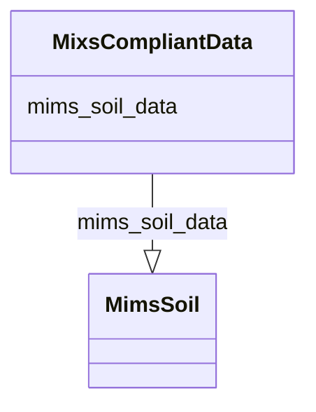

# Class: MixsCompliantData


_A collection of data that complies with some combination of a MIxS checklist and environmental package_


URI: [mixs_6_2_proposal:MixsCompliantData](https://turbomam.github.io/mixs-envo-struct-knowl-extraction/MixsCompliantData)





<!-- no inheritance hierarchy -->


## Slots

| Name | Cardinality and Range | Description | Inheritance |
| ---  | --- | --- | --- |
| [mims_soil_data](mims_soil_data.md) | 0..* <br/> [MimsSoil](MimsSoil.md) | Data that complies with Mims combined with Soil | direct |


## Usages

| used by | used in | type | used |
| ---  | --- | --- | --- |
| [MixsCompliantData](MixsCompliantData.md) | [mims_soil_data](mims_soil_data.md) | domain | [MixsCompliantData](MixsCompliantData.md) |


## Identifier and Mapping Information


### Schema Source


* from schema: https://turbomam.github.io/mixs-envo-struct-knowl-extraction//GSC_MIxS_6


## Mappings

| Mapping Type | Mapped Value |
| ---  | ---  |
| self | mixs_6_2_proposal:MixsCompliantData |
| native | mixs_6_2_proposal:MixsCompliantData |


## LinkML Source

<!-- TODO: investigate https://stackoverflow.com/questions/37606292/how-to-create-tabbed-code-blocks-in-mkdocs-or-sphinx -->

### Direct

<details>
```yaml
name: MixsCompliantData
description: A collection of data that complies with some combination of a MIxS checklist
  and environmental package
title: MIxS compliant data
from_schema: https://turbomam.github.io/mixs-envo-struct-knowl-extraction//GSC_MIxS_6
slots:
- mims_soil_data
tree_root: true

```
</details>

### Induced

<details>
```yaml
name: MixsCompliantData
description: A collection of data that complies with some combination of a MIxS checklist
  and environmental package
title: MIxS compliant data
from_schema: https://turbomam.github.io/mixs-envo-struct-knowl-extraction//GSC_MIxS_6
attributes:
  mims_soil_data:
    name: mims_soil_data
    description: Data that complies with Mims combined with Soil
    title: MimsSoil data
    from_schema: https://turbomam.github.io/mixs-envo-struct-knowl-extraction//GSC_MIxS_6
    rank: 1000
    domain: MixsCompliantData
    slot_uri: MIXS:mims_soil_data
    multivalued: true
    alias: mims_soil_data
    owner: MixsCompliantData
    domain_of:
    - MixsCompliantData
    range: MimsSoil
    inlined: true
    inlined_as_list: true
tree_root: true

```
</details>