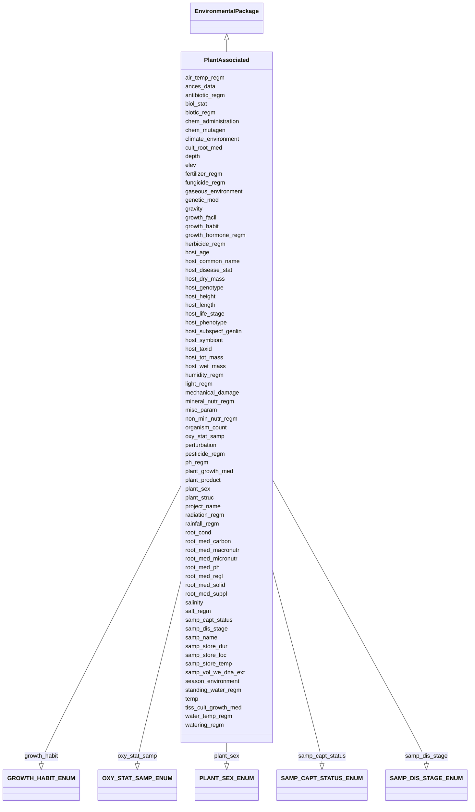

# Class: PlantAssociated


URI: [mixs_6_2_proposal:PlantAssociated](https://turbomam.github.io/mixs-envo-struct-knowl-extraction/PlantAssociated)





## Inheritance
* [EnvironmentalPackage](EnvironmentalPackage.md)
    * **PlantAssociated**


## Slots

| Name | Cardinality and Range | Description | Inheritance |
| ---  | --- | --- | --- |
| [samp_name](samp_name.md) | 1..1 <br/> [String](String.md) | A local identifier or name that for the material sample used for extracting n... | direct |
| [project_name](project_name.md) | 1..1 <br/> [String](String.md) | Name of the project within which the sequencing was organized | direct |
| [depth](depth.md) | 0..1 _recommended_ <br/> [String](String.md) | The vertical distance below local surface | direct |
| [elev](elev.md) | 0..1 _recommended_ <br/> [String](String.md) | Elevation of the sampling site is its height above a fixed reference point, m... | direct |
| [air_temp_regm](air_temp_regm.md) | 0..* <br/> [String](String.md) | Information about treatment involving an exposure to varying temperatures; sh... | direct |
| [ances_data](ances_data.md) | 0..1 <br/> [String](String.md) | Information about either pedigree or other ancestral information description ... | direct |
| [antibiotic_regm](antibiotic_regm.md) | 0..* <br/> [String](String.md) | Information about treatment involving antibiotic administration; should inclu... | direct |
| [biol_stat](biol_stat.md) | 0..1 <br/> [String](String.md) | The level of genome modification | direct |
| [biotic_regm](biotic_regm.md) | 0..1 <br/> [String](String.md) | Information about treatment(s) involving use of biotic factors, such as bacte... | direct |
| [chem_administration](chem_administration.md) | 0..* <br/> [String](String.md) | List of chemical compounds administered to the host or site where sampling oc... | direct |
| [chem_mutagen](chem_mutagen.md) | 0..* <br/> [String](String.md) | Treatment involving use of mutagens; should include the name of mutagen, amou... | direct |
| [climate_environment](climate_environment.md) | 0..* <br/> [String](String.md) | Treatment involving an exposure to a particular climate; treatment regimen in... | direct |
| [cult_root_med](cult_root_med.md) | 0..1 <br/> [String](String.md) | Name or reference for the hydroponic or in vitro culture rooting medium; can ... | direct |
| [fertilizer_regm](fertilizer_regm.md) | 0..* <br/> [String](String.md) | Information about treatment involving the use of fertilizers; should include ... | direct |
| [fungicide_regm](fungicide_regm.md) | 0..* <br/> [String](String.md) | Information about treatment involving use of fungicides; should include the n... | direct |
| [gaseous_environment](gaseous_environment.md) | 0..* <br/> [String](String.md) | Use of conditions with differing gaseous environments; should include the nam... | direct |
| [genetic_mod](genetic_mod.md) | 0..1 <br/> [String](String.md) | Genetic modifications of the genome of an organism, which may occur naturally... | direct |
| [gravity](gravity.md) | 0..* <br/> [String](String.md) | Information about treatment involving use of gravity factor to study various ... | direct |
| [growth_facil](growth_facil.md) | 0..1 <br/> [String](String.md) | Type of facility where the sampled plant was grown; controlled vocabulary: gr... | direct |
| [growth_habit](growth_habit.md) | 0..1 <br/> [GROWTHHABITENUM](GROWTHHABITENUM.md) | Characteristic shape, appearance or growth form of a plant species | direct |
| [growth_hormone_regm](growth_hormone_regm.md) | 0..* <br/> [String](String.md) | Information about treatment involving use of growth hormones; should include ... | direct |
| [herbicide_regm](herbicide_regm.md) | 0..* <br/> [String](String.md) | Information about treatment involving use of herbicides; information about tr... | direct |
| [host_age](host_age.md) | 0..1 <br/> [String](String.md) | Age of host at the time of sampling; relevant scale depends on species and st... | direct |
| [host_common_name](host_common_name.md) | 0..1 <br/> [String](String.md) | Common name of the host | direct |
| [host_disease_stat](host_disease_stat.md) | 0..* <br/> [String](String.md) | List of diseases with which the host has been diagnosed; can include multiple... | direct |
| [host_dry_mass](host_dry_mass.md) | 0..1 <br/> [String](String.md) | Measurement of dry mass | direct |
| [host_genotype](host_genotype.md) | 0..1 <br/> [String](String.md) | Observed genotype | direct |
| [host_height](host_height.md) | 0..1 <br/> [String](String.md) | The height of subject | direct |
| [host_subspecf_genlin](host_subspecf_genlin.md) | 0..* <br/> [String](String.md) | Information about the genetic distinctness of the host organism below the sub... | direct |
| [host_length](host_length.md) | 0..1 <br/> [String](String.md) | The length of subject | direct |
| [host_life_stage](host_life_stage.md) | 0..1 <br/> [String](String.md) | Description of life stage of host | direct |
| [host_phenotype](host_phenotype.md) | 0..1 <br/> [String](String.md) | Phenotype of human or other host | direct |
| [host_taxid](host_taxid.md) | 0..1 <br/> [String](String.md) | NCBI taxon id of the host, e | direct |
| [host_tot_mass](host_tot_mass.md) | 0..1 <br/> [String](String.md) | Total mass of the host at collection, the unit depends on host | direct |
| [host_wet_mass](host_wet_mass.md) | 0..1 <br/> [String](String.md) | Measurement of wet mass | direct |
| [humidity_regm](humidity_regm.md) | 0..* <br/> [String](String.md) | Information about treatment involving an exposure to varying degree of humidi... | direct |
| [light_regm](light_regm.md) | 0..1 <br/> [String](String.md) | Information about treatment(s) involving exposure to light, including both li... | direct |
| [mechanical_damage](mechanical_damage.md) | 0..* <br/> [String](String.md) | Information about any mechanical damage exerted on the plant; can include mul... | direct |
| [mineral_nutr_regm](mineral_nutr_regm.md) | 0..* <br/> [String](String.md) | Information about treatment involving the use of mineral supplements; should ... | direct |
| [misc_param](misc_param.md) | 0..* <br/> [String](String.md) | Any other measurement performed or parameter collected, that is not listed he... | direct |
| [non_min_nutr_regm](non_min_nutr_regm.md) | 0..* <br/> [String](String.md) | Information about treatment involving the exposure of plant to non-mineral nu... | direct |
| [organism_count](organism_count.md) | 0..* <br/> [String](String.md) | Total cell count of any organism (or group of organisms) per gram, volume or ... | direct |
| [oxy_stat_samp](oxy_stat_samp.md) | 0..1 <br/> [OXYSTATSAMPENUM](OXYSTATSAMPENUM.md) | Oxygenation status of sample | direct |
| [ph_regm](ph_regm.md) | 0..* <br/> [String](String.md) | Information about treatment involving exposure of plants to varying levels of... | direct |
| [perturbation](perturbation.md) | 0..* <br/> [String](String.md) | Type of perturbation, e | direct |
| [pesticide_regm](pesticide_regm.md) | 0..* <br/> [String](String.md) | Information about treatment involving use of insecticides; should include the... | direct |
| [plant_growth_med](plant_growth_med.md) | 0..1 <br/> [String](String.md) | Specification of the media for growing the plants or tissue cultured samples,... | direct |
| [plant_product](plant_product.md) | 0..1 <br/> [String](String.md) | Substance produced by the plant, where the sample was obtained from | direct |
| [plant_sex](plant_sex.md) | 0..1 <br/> [PLANTSEXENUM](PLANTSEXENUM.md) | Sex of the reproductive parts on the whole plant, e | direct |
| [plant_struc](plant_struc.md) | 0..1 <br/> [String](String.md) | Name of plant structure the sample was obtained from; for Plant Ontology (PO)... | direct |
| [radiation_regm](radiation_regm.md) | 0..* <br/> [String](String.md) | Information about treatment involving exposure of plant or a plant part to a ... | direct |
| [rainfall_regm](rainfall_regm.md) | 0..* <br/> [String](String.md) | Information about treatment involving an exposure to a given amount of rainfa... | direct |
| [root_cond](root_cond.md) | 0..1 <br/> [String](String.md) | Relevant rooting conditions such as field plot size, sowing density, containe... | direct |
| [root_med_carbon](root_med_carbon.md) | 0..1 <br/> [String](String.md) | Source of organic carbon in the culture rooting medium; e | direct |
| [root_med_macronutr](root_med_macronutr.md) | 0..1 <br/> [String](String.md) | Measurement of the culture rooting medium macronutrients (N,P, K, Ca, Mg, S);... | direct |
| [root_med_micronutr](root_med_micronutr.md) | 0..1 <br/> [String](String.md) | Measurement of the culture rooting medium micronutrients (Fe, Mn, Zn, B, Cu, ... | direct |
| [root_med_suppl](root_med_suppl.md) | 0..1 <br/> [String](String.md) | Organic supplements of the culture rooting medium, such as vitamins, amino ac... | direct |
| [root_med_ph](root_med_ph.md) | 0..1 <br/> [Float](Float.md) | pH measurement of the culture rooting medium; e | direct |
| [root_med_regl](root_med_regl.md) | 0..1 <br/> [String](String.md) | Growth regulators in the culture rooting medium such as cytokinins, auxins, g... | direct |
| [root_med_solid](root_med_solid.md) | 0..1 <br/> [String](String.md) | Specification of the solidifying agent in the culture rooting medium; e | direct |
| [salt_regm](salt_regm.md) | 0..* <br/> [String](String.md) | Information about treatment involving use of salts as supplement to liquid an... | direct |
| [samp_capt_status](samp_capt_status.md) | 0..1 <br/> [SAMPCAPTSTATUSENUM](SAMPCAPTSTATUSENUM.md) | Reason for the sample | direct |
| [samp_dis_stage](samp_dis_stage.md) | 0..1 <br/> [SAMPDISSTAGEENUM](SAMPDISSTAGEENUM.md) | Stage of the disease at the time of sample collection, e | direct |
| [salinity](salinity.md) | 0..1 <br/> [String](String.md) | The total concentration of all dissolved salts in a liquid or solid sample | direct |
| [samp_store_dur](samp_store_dur.md) | 0..1 <br/> [String](String.md) | Duration for which the sample was stored | direct |
| [samp_store_loc](samp_store_loc.md) | 0..1 <br/> [String](String.md) | Location at which sample was stored, usually name of a specific freezer/room | direct |
| [samp_store_temp](samp_store_temp.md) | 0..1 <br/> [String](String.md) | Temperature at which sample was stored, e | direct |
| [samp_vol_we_dna_ext](samp_vol_we_dna_ext.md) | 0..1 <br/> [String](String.md) | Volume (ml) or mass (g) of total collected sample processed for DNA extractio... | direct |
| [season_environment](season_environment.md) | 0..* <br/> [String](String.md) | Treatment involving an exposure to a particular season (e | direct |
| [standing_water_regm](standing_water_regm.md) | 0..* <br/> [String](String.md) | Treatment involving an exposure to standing water during a plant's life span,... | direct |
| [temp](temp.md) | 0..1 <br/> [String](String.md) | Temperature of the sample at the time of sampling | direct |
| [tiss_cult_growth_med](tiss_cult_growth_med.md) | 0..1 <br/> [String](String.md) | Description of plant tissue culture growth media used | direct |
| [water_temp_regm](water_temp_regm.md) | 0..* <br/> [String](String.md) | Information about treatment involving an exposure to water with varying degre... | direct |
| [watering_regm](watering_regm.md) | 0..* <br/> [String](String.md) | Information about treatment involving an exposure to watering frequencies, tr... | direct |
| [host_symbiont](host_symbiont.md) | 0..* <br/> [String](String.md) | The taxonomic name of the organism(s) found living in mutualistic, commensali... | direct |


## Identifier and Mapping Information


### Schema Source


* from schema: https://turbomam.github.io/mixs-envo-struct-knowl-extraction//GSC_MIxS_6


## Mappings

| Mapping Type | Mapped Value |
| ---  | ---  |
| self | mixs_6_2_proposal:PlantAssociated |
| native | mixs_6_2_proposal:PlantAssociated |


## LinkML Source

<!-- TODO: investigate https://stackoverflow.com/questions/37606292/how-to-create-tabbed-code-blocks-in-mkdocs-or-sphinx -->

### Direct

<details>
```yaml
name: PlantAssociated
title: PlantAssociated
from_schema: https://turbomam.github.io/mixs-envo-struct-knowl-extraction//GSC_MIxS_6
is_a: EnvironmentalPackage
mixin: false
slots:
- samp_name
- project_name
- depth
- elev
- air_temp_regm
- ances_data
- antibiotic_regm
- biol_stat
- biotic_regm
- chem_administration
- chem_mutagen
- climate_environment
- cult_root_med
- fertilizer_regm
- fungicide_regm
- gaseous_environment
- genetic_mod
- gravity
- growth_facil
- growth_habit
- growth_hormone_regm
- herbicide_regm
- host_age
- host_common_name
- host_disease_stat
- host_dry_mass
- host_genotype
- host_height
- host_subspecf_genlin
- host_length
- host_life_stage
- host_phenotype
- host_taxid
- host_tot_mass
- host_wet_mass
- humidity_regm
- light_regm
- mechanical_damage
- mineral_nutr_regm
- misc_param
- non_min_nutr_regm
- organism_count
- oxy_stat_samp
- ph_regm
- perturbation
- pesticide_regm
- plant_growth_med
- plant_product
- plant_sex
- plant_struc
- radiation_regm
- rainfall_regm
- root_cond
- root_med_carbon
- root_med_macronutr
- root_med_micronutr
- root_med_suppl
- root_med_ph
- root_med_regl
- root_med_solid
- salt_regm
- samp_capt_status
- samp_dis_stage
- salinity
- samp_store_dur
- samp_store_loc
- samp_store_temp
- samp_vol_we_dna_ext
- season_environment
- standing_water_regm
- temp
- tiss_cult_growth_med
- water_temp_regm
- watering_regm
- host_symbiont
slot_usage:
  ances_data:
    name: ances_data
    domain_of:
    - Agriculture
    - FoodFarmEnvironment
    - HostAssociated
    - PlantAssociated
  biotic_regm:
    name: biotic_regm
    multivalued: false
    domain_of:
    - FoodFarmEnvironment
    - PlantAssociated
    required: false
    recommended: false
  chem_administration:
    name: chem_administration
    domain_of:
    - Agriculture
    - Air
    - FoodFarmEnvironment
    - HostAssociated
    - HumanAssociated
    - HumanGut
    - HumanOral
    - HumanSkin
    - HumanVaginal
    - MicrobialMatBiofilm
    - MiscellaneousNaturalOrArtificialEnvironment
    - PlantAssociated
    - Sediment
    - SymbiontAssociated
    - WastewaterSludge
    - Water
    required: false
    recommended: false
  climate_environment:
    name: climate_environment
    string_serialization: '{text};{Rn/start_time/end_time/duration}'
    domain_of:
    - Agriculture
    - PlantAssociated
    required: false
    recommended: false
  depth:
    name: depth
    title: depth
    examples:
    - value: 10 meter
    domain_of:
    - Agriculture
    - FoodFarmEnvironment
    - HostAssociated
    - MicrobialMatBiofilm
    - MigsBa
    - MigsEu
    - MigsOrg
    - MigsPl
    - MigsVi
    - Mimag
    - MimarksC
    - MimarksS
    - Mims
    - Misag
    - MiscellaneousNaturalOrArtificialEnvironment
    - Miuvig
    - PlantAssociated
    - Sediment
    - Soil
    - SymbiontAssociated
    - WastewaterSludge
    - Water
    recommended: true
  elev:
    name: elev
    domain_of:
    - Agriculture
    - Air
    - HostAssociated
    - HydrocarbonResourcesCores
    - MicrobialMatBiofilm
    - MigsBa
    - MigsEu
    - MigsOrg
    - MigsPl
    - MigsVi
    - Mimag
    - MimarksC
    - MimarksS
    - Mims
    - Misag
    - MiscellaneousNaturalOrArtificialEnvironment
    - Miuvig
    - PlantAssociated
    - Sediment
    - Soil
    - SymbiontAssociated
    - Water
    recommended: true
  fungicide_regm:
    name: fungicide_regm
    string_serialization: '{text};{float} {unit};{Rn/start_time/end_time/duration}'
    domain_of:
    - Agriculture
    - PlantAssociated
    required: false
    recommended: false
  gaseous_environment:
    name: gaseous_environment
    string_serialization: '{text};{float} {unit};{Rn/start_time/end_time/duration}'
    domain_of:
    - Agriculture
    - PlantAssociated
    required: false
    recommended: false
  genetic_mod:
    name: genetic_mod
    string_serialization: '{PMID}|{DOI}|{URL}|{text}'
    multivalued: false
    domain_of:
    - Agriculture
    - FoodFarmEnvironment
    - FoodFoodProductionFacility
    - FoodHumanFoods
    - HostAssociated
    - PlantAssociated
  herbicide_regm:
    name: herbicide_regm
    string_serialization: '{text};{float} {unit};{Rn/start_time/end_time/duration}'
    domain_of:
    - Agriculture
    - PlantAssociated
    required: false
    recommended: false
  host_age:
    name: host_age
    examples:
    - value: 10 days
    domain_of:
    - Agriculture
    - FoodFarmEnvironment
    - HostAssociated
    - HumanAssociated
    - HumanGut
    - HumanOral
    - HumanSkin
    - HumanVaginal
    - PlantAssociated
    - SymbiontAssociated
    required: false
    recommended: false
  host_common_name:
    name: host_common_name
    examples:
    - value: rice
    domain_of:
    - Agriculture
    - HostAssociated
    - PlantAssociated
    - SymbiontAssociated
    required: false
    recommended: false
  host_disease_stat:
    name: host_disease_stat
    description: List of diseases with which the host has been diagnosed; can include
      multiple diagnoses. The value of the field depends on host; for humans the terms
      should be chosen from the DO (Human Disease Ontology) at https://www.disease-ontology.org,
      non-human host diseases are free text.
    examples:
    - value: downy mildew
    string_serialization: '{text}|{termLabel} [{termID}]'
    multivalued: true
    domain_of:
    - Agriculture
    - FoodFarmEnvironment
    - HostAssociated
    - HumanAssociated
    - HumanGut
    - HumanOral
    - HumanSkin
    - HumanVaginal
    - MigsBa
    - MigsEu
    - MigsVi
    - Miuvig
    - PlantAssociated
    required: false
    recommended: false
  host_dry_mass:
    name: host_dry_mass
    domain_of:
    - Agriculture
    - FoodFarmEnvironment
    - HostAssociated
    - PlantAssociated
    - SymbiontAssociated
  host_genotype:
    name: host_genotype
    examples:
    - value: Ts
    domain_of:
    - Agriculture
    - FoodFarmEnvironment
    - HostAssociated
    - HumanAssociated
    - HumanGut
    - HumanOral
    - HumanSkin
    - HumanVaginal
    - PlantAssociated
    - SymbiontAssociated
    required: false
    recommended: false
  host_height:
    name: host_height
    examples:
    - value: 1 meter
    domain_of:
    - Agriculture
    - FoodFarmEnvironment
    - HostAssociated
    - HumanAssociated
    - HumanGut
    - HumanOral
    - HumanSkin
    - HumanVaginal
    - PlantAssociated
    - SymbiontAssociated
    required: false
    recommended: false
  host_length:
    name: host_length
    domain_of:
    - Agriculture
    - FoodFarmEnvironment
    - HostAssociated
    - PlantAssociated
    - SymbiontAssociated
    required: false
    recommended: false
  host_life_stage:
    name: host_life_stage
    examples:
    - value: adult
    domain_of:
    - Agriculture
    - HostAssociated
    - PlantAssociated
    - SymbiontAssociated
    required: false
    recommended: false
  host_phenotype:
    name: host_phenotype
    examples:
    - value: seed pod; green [PATO:0000320]
    string_serialization: '{text};{termLabel} [{termID}]'
    domain_of:
    - Agriculture
    - FoodFarmEnvironment
    - HostAssociated
    - HumanAssociated
    - HumanGut
    - HumanOral
    - HumanSkin
    - HumanVaginal
    - PlantAssociated
    - SymbiontAssociated
    required: false
    recommended: false
  host_symbiont:
    name: host_symbiont
    description: The taxonomic name of the organism(s) found living in mutualistic,
      commensalistic, or parasitic symbiosis with the specific host. The sampled symbiont
      can have its own symbionts. For example, parasites may have hyperparasites (=parasites
      of the parasite).
    examples:
    - value: flukeworms
    slot_uri: MIXS:0001298
    multivalued: true
    domain_of:
    - Agriculture
    - HostAssociated
    - HumanAssociated
    - HumanGut
    - HumanOral
    - HumanSkin
    - HumanVaginal
    - PlantAssociated
    - SymbiontAssociated
  host_taxid:
    name: host_taxid
    description: NCBI taxon id of the host, e.g. 9606
    examples:
    - value: '4530'
    string_serialization: '{NCBI taxid}'
    domain_of:
    - Agriculture
    - FoodFarmEnvironment
    - HostAssociated
    - PlantAssociated
    - SymbiontAssociated
    required: false
    recommended: false
  host_tot_mass:
    name: host_tot_mass
    examples:
    - value: 2500 gram
    domain_of:
    - Agriculture
    - FoodFarmEnvironment
    - HostAssociated
    - HumanAssociated
    - HumanGut
    - HumanOral
    - HumanSkin
    - HumanVaginal
    - PlantAssociated
    - SymbiontAssociated
    required: false
    recommended: false
  misc_param:
    name: misc_param
    domain_of:
    - Agriculture
    - Air
    - FoodAnimalAndAnimalFeed
    - FoodFarmEnvironment
    - FoodFoodProductionFacility
    - FoodHumanFoods
    - HostAssociated
    - HumanAssociated
    - HumanGut
    - HumanOral
    - HumanSkin
    - HumanVaginal
    - HydrocarbonResourcesCores
    - HydrocarbonResourcesFluidsSwabs
    - MicrobialMatBiofilm
    - MiscellaneousNaturalOrArtificialEnvironment
    - PlantAssociated
    - Sediment
    - Soil
    - SymbiontAssociated
    - WastewaterSludge
    - Water
  non_min_nutr_regm:
    name: non_min_nutr_regm
    string_serialization: '{text};{float} {unit};{Rn/start_time/end_time/duration}'
    domain_of:
    - Agriculture
    - PlantAssociated
    required: false
    recommended: false
  organism_count:
    name: organism_count
    description: 'Total cell count of any organism (or group of organisms) per gram,
      volume or area of sample, should include name of organism followed by count.
      The method that was used for the enumeration (e.g. qPCR, atp, mpn, etc.) Should
      also be provided. (example: total prokaryotes; 3.5e7 cells per ml; qpcr)'
    examples:
    - value: total prokaryotes;3.5e7 cells per milliliter;qPCR
    string_serialization: '{text};{float} {unit};[qPCR|ATP|MPN|other]'
    multivalued: true
    domain_of:
    - Agriculture
    - Air
    - BuiltEnvironment
    - FoodAnimalAndAnimalFeed
    - FoodFarmEnvironment
    - FoodFoodProductionFacility
    - FoodHumanFoods
    - HostAssociated
    - HumanAssociated
    - HumanGut
    - HumanOral
    - HumanSkin
    - HumanVaginal
    - HydrocarbonResourcesCores
    - HydrocarbonResourcesFluidsSwabs
    - MicrobialMatBiofilm
    - MiscellaneousNaturalOrArtificialEnvironment
    - PlantAssociated
    - Sediment
    - SymbiontAssociated
    - WastewaterSludge
    - Water
    required: false
    recommended: false
  oxy_stat_samp:
    name: oxy_stat_samp
    domain_of:
    - Agriculture
    - Air
    - HostAssociated
    - HumanAssociated
    - HumanGut
    - HumanOral
    - HumanSkin
    - HumanVaginal
    - HydrocarbonResourcesCores
    - HydrocarbonResourcesFluidsSwabs
    - MicrobialMatBiofilm
    - MiscellaneousNaturalOrArtificialEnvironment
    - PlantAssociated
    - Sediment
    - SymbiontAssociated
    - WastewaterSludge
    - Water
    required: false
    recommended: false
  perturbation:
    name: perturbation
    string_serialization: '{text};{Rn/start_time/end_time/duration}'
    domain_of:
    - Agriculture
    - Air
    - FoodAnimalAndAnimalFeed
    - FoodFarmEnvironment
    - FoodHumanFoods
    - HostAssociated
    - HumanAssociated
    - HumanGut
    - HumanOral
    - HumanSkin
    - HumanVaginal
    - MicrobialMatBiofilm
    - MiscellaneousNaturalOrArtificialEnvironment
    - PlantAssociated
    - Sediment
    - SymbiontAssociated
    - WastewaterSludge
    - Water
    required: false
    recommended: false
  pesticide_regm:
    name: pesticide_regm
    string_serialization: '{text};{float} {unit};{Rn/start_time/end_time/duration}'
    domain_of:
    - Agriculture
    - PlantAssociated
    required: false
    recommended: false
  ph_regm:
    name: ph_regm
    string_serialization: '{float};{Rn/start_time/end_time/duration}'
    domain_of:
    - Agriculture
    - PlantAssociated
    required: false
    recommended: false
  plant_growth_med:
    name: plant_growth_med
    examples:
    - value: hydroponic plant culture media [EO:0007067]
    multivalued: false
    domain_of:
    - Agriculture
    - FoodFarmEnvironment
    - PlantAssociated
  plant_product:
    name: plant_product
    domain_of:
    - Agriculture
    - PlantAssociated
    required: false
    recommended: false
  plant_struc:
    name: plant_struc
    domain_of:
    - Agriculture
    - PlantAssociated
    required: false
    recommended: false
  root_med_macronutr:
    name: root_med_macronutr
    description: Measurement of the culture rooting medium macronutrients (N,P, K,
      Ca, Mg, S); e.g. KH2PO4 (170 mg/L).
    domain_of:
    - Agriculture
    - FoodFarmEnvironment
    - PlantAssociated
  root_med_micronutr:
    name: root_med_micronutr
    description: Measurement of the culture rooting medium micronutrients (Fe, Mn,
      Zn, B, Cu, Mo); e.g. H3BO3 (6.2 mg/L).
    domain_of:
    - FoodFarmEnvironment
    - PlantAssociated
  salinity:
    name: salinity
    multivalued: false
    domain_of:
    - Air
    - FoodFarmEnvironment
    - HostAssociated
    - HumanAssociated
    - HumanGut
    - HumanOral
    - HumanSkin
    - HumanVaginal
    - HydrocarbonResourcesCores
    - HydrocarbonResourcesFluidsSwabs
    - MicrobialMatBiofilm
    - MiscellaneousNaturalOrArtificialEnvironment
    - PlantAssociated
    - Sediment
    - SymbiontAssociated
    - WastewaterSludge
    - Water
  salt_regm:
    name: salt_regm
    string_serialization: '{text};{float} {unit};{Rn/start_time/end_time/duration}'
    domain_of:
    - Agriculture
    - PlantAssociated
    required: false
    recommended: false
  samp_store_dur:
    name: samp_store_dur
    description: Duration for which the sample was stored
    string_serialization: '{duration}'
    domain_of:
    - Agriculture
    - Air
    - FoodAnimalAndAnimalFeed
    - FoodFarmEnvironment
    - FoodFoodProductionFacility
    - FoodHumanFoods
    - HostAssociated
    - HumanAssociated
    - HumanGut
    - HumanOral
    - HumanSkin
    - HumanVaginal
    - HydrocarbonResourcesCores
    - HydrocarbonResourcesFluidsSwabs
    - MicrobialMatBiofilm
    - MiscellaneousNaturalOrArtificialEnvironment
    - PlantAssociated
    - Sediment
    - SymbiontAssociated
    - WastewaterSludge
    - Water
    required: false
    recommended: false
  samp_store_loc:
    name: samp_store_loc
    description: Location at which sample was stored, usually name of a specific freezer/room
    examples:
    - value: Freezer no:5
    domain_of:
    - Agriculture
    - Air
    - FoodAnimalAndAnimalFeed
    - FoodFoodProductionFacility
    - FoodHumanFoods
    - HostAssociated
    - HumanAssociated
    - HumanGut
    - HumanOral
    - HumanSkin
    - HumanVaginal
    - HydrocarbonResourcesCores
    - HydrocarbonResourcesFluidsSwabs
    - MicrobialMatBiofilm
    - MiscellaneousNaturalOrArtificialEnvironment
    - PlantAssociated
    - Sediment
    - SymbiontAssociated
    - WastewaterSludge
    - Water
    required: false
    recommended: false
  samp_vol_we_dna_ext:
    name: samp_vol_we_dna_ext
    description: 'Volume (ml) or mass (g) of total collected sample processed for
      DNA extraction. Note: total sample collected should be entered under the term
      Sample Size (MIXS:0000001).'
    domain_of:
    - Agriculture
    - Air
    - FoodAnimalAndAnimalFeed
    - FoodFarmEnvironment
    - FoodFoodProductionFacility
    - FoodHumanFoods
    - HostAssociated
    - HumanAssociated
    - HumanGut
    - HumanOral
    - HumanSkin
    - HumanVaginal
    - HydrocarbonResourcesCores
    - HydrocarbonResourcesFluidsSwabs
    - MicrobialMatBiofilm
    - MigsBa
    - MigsEu
    - MigsOrg
    - MigsPl
    - MigsVi
    - Mimag
    - MimarksC
    - MimarksS
    - Mims
    - Misag
    - MiscellaneousNaturalOrArtificialEnvironment
    - Miuvig
    - PlantAssociated
    - Sediment
    - Soil
    - SymbiontAssociated
    - WastewaterSludge
    - Water
    required: false
    recommended: false
  season_environment:
    name: season_environment
    string_serialization: '{text};{Rn/start_time/end_time/duration}'
    domain_of:
    - Agriculture
    - PlantAssociated
    required: false
    recommended: false
  standing_water_regm:
    name: standing_water_regm
    string_serialization: '{text};{Rn/start_time/end_time/duration}'
    domain_of:
    - Agriculture
    - PlantAssociated
    required: false
    recommended: false
  temp:
    name: temp
    domain_of:
    - Agriculture
    - Air
    - FoodAnimalAndAnimalFeed
    - FoodFarmEnvironment
    - FoodHumanFoods
    - HostAssociated
    - HumanAssociated
    - HumanGut
    - HumanOral
    - HumanSkin
    - HumanVaginal
    - HydrocarbonResourcesCores
    - HydrocarbonResourcesFluidsSwabs
    - MicrobialMatBiofilm
    - MigsBa
    - MigsEu
    - MigsOrg
    - MigsPl
    - MigsVi
    - Mimag
    - MimarksC
    - MimarksS
    - Mims
    - Misag
    - MiscellaneousNaturalOrArtificialEnvironment
    - Miuvig
    - PlantAssociated
    - Sediment
    - Soil
    - SymbiontAssociated
    - WastewaterSludge
    - Water
    required: false
    recommended: false
  water_temp_regm:
    name: water_temp_regm
    string_serialization: '{float} {unit};{Rn/start_time/end_time/duration}'
    domain_of:
    - Agriculture
    - PlantAssociated
    required: false
    recommended: false
  watering_regm:
    name: watering_regm
    string_serialization: '{float} {unit};{Rn/start_time/end_time/duration}'
    domain_of:
    - Agriculture
    - PlantAssociated
    required: false
    recommended: false

```
</details>

### Induced

<details>
```yaml
name: PlantAssociated
title: PlantAssociated
from_schema: https://turbomam.github.io/mixs-envo-struct-knowl-extraction//GSC_MIxS_6
is_a: EnvironmentalPackage
mixin: false
slot_usage:
  ances_data:
    name: ances_data
    domain_of:
    - Agriculture
    - FoodFarmEnvironment
    - HostAssociated
    - PlantAssociated
  biotic_regm:
    name: biotic_regm
    multivalued: false
    domain_of:
    - FoodFarmEnvironment
    - PlantAssociated
    required: false
    recommended: false
  chem_administration:
    name: chem_administration
    domain_of:
    - Agriculture
    - Air
    - FoodFarmEnvironment
    - HostAssociated
    - HumanAssociated
    - HumanGut
    - HumanOral
    - HumanSkin
    - HumanVaginal
    - MicrobialMatBiofilm
    - MiscellaneousNaturalOrArtificialEnvironment
    - PlantAssociated
    - Sediment
    - SymbiontAssociated
    - WastewaterSludge
    - Water
    required: false
    recommended: false
  climate_environment:
    name: climate_environment
    string_serialization: '{text};{Rn/start_time/end_time/duration}'
    domain_of:
    - Agriculture
    - PlantAssociated
    required: false
    recommended: false
  depth:
    name: depth
    title: depth
    examples:
    - value: 10 meter
    domain_of:
    - Agriculture
    - FoodFarmEnvironment
    - HostAssociated
    - MicrobialMatBiofilm
    - MigsBa
    - MigsEu
    - MigsOrg
    - MigsPl
    - MigsVi
    - Mimag
    - MimarksC
    - MimarksS
    - Mims
    - Misag
    - MiscellaneousNaturalOrArtificialEnvironment
    - Miuvig
    - PlantAssociated
    - Sediment
    - Soil
    - SymbiontAssociated
    - WastewaterSludge
    - Water
    recommended: true
  elev:
    name: elev
    domain_of:
    - Agriculture
    - Air
    - HostAssociated
    - HydrocarbonResourcesCores
    - MicrobialMatBiofilm
    - MigsBa
    - MigsEu
    - MigsOrg
    - MigsPl
    - MigsVi
    - Mimag
    - MimarksC
    - MimarksS
    - Mims
    - Misag
    - MiscellaneousNaturalOrArtificialEnvironment
    - Miuvig
    - PlantAssociated
    - Sediment
    - Soil
    - SymbiontAssociated
    - Water
    recommended: true
  fungicide_regm:
    name: fungicide_regm
    string_serialization: '{text};{float} {unit};{Rn/start_time/end_time/duration}'
    domain_of:
    - Agriculture
    - PlantAssociated
    required: false
    recommended: false
  gaseous_environment:
    name: gaseous_environment
    string_serialization: '{text};{float} {unit};{Rn/start_time/end_time/duration}'
    domain_of:
    - Agriculture
    - PlantAssociated
    required: false
    recommended: false
  genetic_mod:
    name: genetic_mod
    string_serialization: '{PMID}|{DOI}|{URL}|{text}'
    multivalued: false
    domain_of:
    - Agriculture
    - FoodFarmEnvironment
    - FoodFoodProductionFacility
    - FoodHumanFoods
    - HostAssociated
    - PlantAssociated
  herbicide_regm:
    name: herbicide_regm
    string_serialization: '{text};{float} {unit};{Rn/start_time/end_time/duration}'
    domain_of:
    - Agriculture
    - PlantAssociated
    required: false
    recommended: false
  host_age:
    name: host_age
    examples:
    - value: 10 days
    domain_of:
    - Agriculture
    - FoodFarmEnvironment
    - HostAssociated
    - HumanAssociated
    - HumanGut
    - HumanOral
    - HumanSkin
    - HumanVaginal
    - PlantAssociated
    - SymbiontAssociated
    required: false
    recommended: false
  host_common_name:
    name: host_common_name
    examples:
    - value: rice
    domain_of:
    - Agriculture
    - HostAssociated
    - PlantAssociated
    - SymbiontAssociated
    required: false
    recommended: false
  host_disease_stat:
    name: host_disease_stat
    description: List of diseases with which the host has been diagnosed; can include
      multiple diagnoses. The value of the field depends on host; for humans the terms
      should be chosen from the DO (Human Disease Ontology) at https://www.disease-ontology.org,
      non-human host diseases are free text.
    examples:
    - value: downy mildew
    string_serialization: '{text}|{termLabel} [{termID}]'
    multivalued: true
    domain_of:
    - Agriculture
    - FoodFarmEnvironment
    - HostAssociated
    - HumanAssociated
    - HumanGut
    - HumanOral
    - HumanSkin
    - HumanVaginal
    - MigsBa
    - MigsEu
    - MigsVi
    - Miuvig
    - PlantAssociated
    required: false
    recommended: false
  host_dry_mass:
    name: host_dry_mass
    domain_of:
    - Agriculture
    - FoodFarmEnvironment
    - HostAssociated
    - PlantAssociated
    - SymbiontAssociated
  host_genotype:
    name: host_genotype
    examples:
    - value: Ts
    domain_of:
    - Agriculture
    - FoodFarmEnvironment
    - HostAssociated
    - HumanAssociated
    - HumanGut
    - HumanOral
    - HumanSkin
    - HumanVaginal
    - PlantAssociated
    - SymbiontAssociated
    required: false
    recommended: false
  host_height:
    name: host_height
    examples:
    - value: 1 meter
    domain_of:
    - Agriculture
    - FoodFarmEnvironment
    - HostAssociated
    - HumanAssociated
    - HumanGut
    - HumanOral
    - HumanSkin
    - HumanVaginal
    - PlantAssociated
    - SymbiontAssociated
    required: false
    recommended: false
  host_length:
    name: host_length
    domain_of:
    - Agriculture
    - FoodFarmEnvironment
    - HostAssociated
    - PlantAssociated
    - SymbiontAssociated
    required: false
    recommended: false
  host_life_stage:
    name: host_life_stage
    examples:
    - value: adult
    domain_of:
    - Agriculture
    - HostAssociated
    - PlantAssociated
    - SymbiontAssociated
    required: false
    recommended: false
  host_phenotype:
    name: host_phenotype
    examples:
    - value: seed pod; green [PATO:0000320]
    string_serialization: '{text};{termLabel} [{termID}]'
    domain_of:
    - Agriculture
    - FoodFarmEnvironment
    - HostAssociated
    - HumanAssociated
    - HumanGut
    - HumanOral
    - HumanSkin
    - HumanVaginal
    - PlantAssociated
    - SymbiontAssociated
    required: false
    recommended: false
  host_symbiont:
    name: host_symbiont
    description: The taxonomic name of the organism(s) found living in mutualistic,
      commensalistic, or parasitic symbiosis with the specific host. The sampled symbiont
      can have its own symbionts. For example, parasites may have hyperparasites (=parasites
      of the parasite).
    examples:
    - value: flukeworms
    slot_uri: MIXS:0001298
    multivalued: true
    domain_of:
    - Agriculture
    - HostAssociated
    - HumanAssociated
    - HumanGut
    - HumanOral
    - HumanSkin
    - HumanVaginal
    - PlantAssociated
    - SymbiontAssociated
  host_taxid:
    name: host_taxid
    description: NCBI taxon id of the host, e.g. 9606
    examples:
    - value: '4530'
    string_serialization: '{NCBI taxid}'
    domain_of:
    - Agriculture
    - FoodFarmEnvironment
    - HostAssociated
    - PlantAssociated
    - SymbiontAssociated
    required: false
    recommended: false
  host_tot_mass:
    name: host_tot_mass
    examples:
    - value: 2500 gram
    domain_of:
    - Agriculture
    - FoodFarmEnvironment
    - HostAssociated
    - HumanAssociated
    - HumanGut
    - HumanOral
    - HumanSkin
    - HumanVaginal
    - PlantAssociated
    - SymbiontAssociated
    required: false
    recommended: false
  misc_param:
    name: misc_param
    domain_of:
    - Agriculture
    - Air
    - FoodAnimalAndAnimalFeed
    - FoodFarmEnvironment
    - FoodFoodProductionFacility
    - FoodHumanFoods
    - HostAssociated
    - HumanAssociated
    - HumanGut
    - HumanOral
    - HumanSkin
    - HumanVaginal
    - HydrocarbonResourcesCores
    - HydrocarbonResourcesFluidsSwabs
    - MicrobialMatBiofilm
    - MiscellaneousNaturalOrArtificialEnvironment
    - PlantAssociated
    - Sediment
    - Soil
    - SymbiontAssociated
    - WastewaterSludge
    - Water
  non_min_nutr_regm:
    name: non_min_nutr_regm
    string_serialization: '{text};{float} {unit};{Rn/start_time/end_time/duration}'
    domain_of:
    - Agriculture
    - PlantAssociated
    required: false
    recommended: false
  organism_count:
    name: organism_count
    description: 'Total cell count of any organism (or group of organisms) per gram,
      volume or area of sample, should include name of organism followed by count.
      The method that was used for the enumeration (e.g. qPCR, atp, mpn, etc.) Should
      also be provided. (example: total prokaryotes; 3.5e7 cells per ml; qpcr)'
    examples:
    - value: total prokaryotes;3.5e7 cells per milliliter;qPCR
    string_serialization: '{text};{float} {unit};[qPCR|ATP|MPN|other]'
    multivalued: true
    domain_of:
    - Agriculture
    - Air
    - BuiltEnvironment
    - FoodAnimalAndAnimalFeed
    - FoodFarmEnvironment
    - FoodFoodProductionFacility
    - FoodHumanFoods
    - HostAssociated
    - HumanAssociated
    - HumanGut
    - HumanOral
    - HumanSkin
    - HumanVaginal
    - HydrocarbonResourcesCores
    - HydrocarbonResourcesFluidsSwabs
    - MicrobialMatBiofilm
    - MiscellaneousNaturalOrArtificialEnvironment
    - PlantAssociated
    - Sediment
    - SymbiontAssociated
    - WastewaterSludge
    - Water
    required: false
    recommended: false
  oxy_stat_samp:
    name: oxy_stat_samp
    domain_of:
    - Agriculture
    - Air
    - HostAssociated
    - HumanAssociated
    - HumanGut
    - HumanOral
    - HumanSkin
    - HumanVaginal
    - HydrocarbonResourcesCores
    - HydrocarbonResourcesFluidsSwabs
    - MicrobialMatBiofilm
    - MiscellaneousNaturalOrArtificialEnvironment
    - PlantAssociated
    - Sediment
    - SymbiontAssociated
    - WastewaterSludge
    - Water
    required: false
    recommended: false
  perturbation:
    name: perturbation
    string_serialization: '{text};{Rn/start_time/end_time/duration}'
    domain_of:
    - Agriculture
    - Air
    - FoodAnimalAndAnimalFeed
    - FoodFarmEnvironment
    - FoodHumanFoods
    - HostAssociated
    - HumanAssociated
    - HumanGut
    - HumanOral
    - HumanSkin
    - HumanVaginal
    - MicrobialMatBiofilm
    - MiscellaneousNaturalOrArtificialEnvironment
    - PlantAssociated
    - Sediment
    - SymbiontAssociated
    - WastewaterSludge
    - Water
    required: false
    recommended: false
  pesticide_regm:
    name: pesticide_regm
    string_serialization: '{text};{float} {unit};{Rn/start_time/end_time/duration}'
    domain_of:
    - Agriculture
    - PlantAssociated
    required: false
    recommended: false
  ph_regm:
    name: ph_regm
    string_serialization: '{float};{Rn/start_time/end_time/duration}'
    domain_of:
    - Agriculture
    - PlantAssociated
    required: false
    recommended: false
  plant_growth_med:
    name: plant_growth_med
    examples:
    - value: hydroponic plant culture media [EO:0007067]
    multivalued: false
    domain_of:
    - Agriculture
    - FoodFarmEnvironment
    - PlantAssociated
  plant_product:
    name: plant_product
    domain_of:
    - Agriculture
    - PlantAssociated
    required: false
    recommended: false
  plant_struc:
    name: plant_struc
    domain_of:
    - Agriculture
    - PlantAssociated
    required: false
    recommended: false
  root_med_macronutr:
    name: root_med_macronutr
    description: Measurement of the culture rooting medium macronutrients (N,P, K,
      Ca, Mg, S); e.g. KH2PO4 (170 mg/L).
    domain_of:
    - Agriculture
    - FoodFarmEnvironment
    - PlantAssociated
  root_med_micronutr:
    name: root_med_micronutr
    description: Measurement of the culture rooting medium micronutrients (Fe, Mn,
      Zn, B, Cu, Mo); e.g. H3BO3 (6.2 mg/L).
    domain_of:
    - FoodFarmEnvironment
    - PlantAssociated
  salinity:
    name: salinity
    multivalued: false
    domain_of:
    - Air
    - FoodFarmEnvironment
    - HostAssociated
    - HumanAssociated
    - HumanGut
    - HumanOral
    - HumanSkin
    - HumanVaginal
    - HydrocarbonResourcesCores
    - HydrocarbonResourcesFluidsSwabs
    - MicrobialMatBiofilm
    - MiscellaneousNaturalOrArtificialEnvironment
    - PlantAssociated
    - Sediment
    - SymbiontAssociated
    - WastewaterSludge
    - Water
  salt_regm:
    name: salt_regm
    string_serialization: '{text};{float} {unit};{Rn/start_time/end_time/duration}'
    domain_of:
    - Agriculture
    - PlantAssociated
    required: false
    recommended: false
  samp_store_dur:
    name: samp_store_dur
    description: Duration for which the sample was stored
    string_serialization: '{duration}'
    domain_of:
    - Agriculture
    - Air
    - FoodAnimalAndAnimalFeed
    - FoodFarmEnvironment
    - FoodFoodProductionFacility
    - FoodHumanFoods
    - HostAssociated
    - HumanAssociated
    - HumanGut
    - HumanOral
    - HumanSkin
    - HumanVaginal
    - HydrocarbonResourcesCores
    - HydrocarbonResourcesFluidsSwabs
    - MicrobialMatBiofilm
    - MiscellaneousNaturalOrArtificialEnvironment
    - PlantAssociated
    - Sediment
    - SymbiontAssociated
    - WastewaterSludge
    - Water
    required: false
    recommended: false
  samp_store_loc:
    name: samp_store_loc
    description: Location at which sample was stored, usually name of a specific freezer/room
    examples:
    - value: Freezer no:5
    domain_of:
    - Agriculture
    - Air
    - FoodAnimalAndAnimalFeed
    - FoodFoodProductionFacility
    - FoodHumanFoods
    - HostAssociated
    - HumanAssociated
    - HumanGut
    - HumanOral
    - HumanSkin
    - HumanVaginal
    - HydrocarbonResourcesCores
    - HydrocarbonResourcesFluidsSwabs
    - MicrobialMatBiofilm
    - MiscellaneousNaturalOrArtificialEnvironment
    - PlantAssociated
    - Sediment
    - SymbiontAssociated
    - WastewaterSludge
    - Water
    required: false
    recommended: false
  samp_vol_we_dna_ext:
    name: samp_vol_we_dna_ext
    description: 'Volume (ml) or mass (g) of total collected sample processed for
      DNA extraction. Note: total sample collected should be entered under the term
      Sample Size (MIXS:0000001).'
    domain_of:
    - Agriculture
    - Air
    - FoodAnimalAndAnimalFeed
    - FoodFarmEnvironment
    - FoodFoodProductionFacility
    - FoodHumanFoods
    - HostAssociated
    - HumanAssociated
    - HumanGut
    - HumanOral
    - HumanSkin
    - HumanVaginal
    - HydrocarbonResourcesCores
    - HydrocarbonResourcesFluidsSwabs
    - MicrobialMatBiofilm
    - MigsBa
    - MigsEu
    - MigsOrg
    - MigsPl
    - MigsVi
    - Mimag
    - MimarksC
    - MimarksS
    - Mims
    - Misag
    - MiscellaneousNaturalOrArtificialEnvironment
    - Miuvig
    - PlantAssociated
    - Sediment
    - Soil
    - SymbiontAssociated
    - WastewaterSludge
    - Water
    required: false
    recommended: false
  season_environment:
    name: season_environment
    string_serialization: '{text};{Rn/start_time/end_time/duration}'
    domain_of:
    - Agriculture
    - PlantAssociated
    required: false
    recommended: false
  standing_water_regm:
    name: standing_water_regm
    string_serialization: '{text};{Rn/start_time/end_time/duration}'
    domain_of:
    - Agriculture
    - PlantAssociated
    required: false
    recommended: false
  temp:
    name: temp
    domain_of:
    - Agriculture
    - Air
    - FoodAnimalAndAnimalFeed
    - FoodFarmEnvironment
    - FoodHumanFoods
    - HostAssociated
    - HumanAssociated
    - HumanGut
    - HumanOral
    - HumanSkin
    - HumanVaginal
    - HydrocarbonResourcesCores
    - HydrocarbonResourcesFluidsSwabs
    - MicrobialMatBiofilm
    - MigsBa
    - MigsEu
    - MigsOrg
    - MigsPl
    - MigsVi
    - Mimag
    - MimarksC
    - MimarksS
    - Mims
    - Misag
    - MiscellaneousNaturalOrArtificialEnvironment
    - Miuvig
    - PlantAssociated
    - Sediment
    - Soil
    - SymbiontAssociated
    - WastewaterSludge
    - Water
    required: false
    recommended: false
  water_temp_regm:
    name: water_temp_regm
    string_serialization: '{float} {unit};{Rn/start_time/end_time/duration}'
    domain_of:
    - Agriculture
    - PlantAssociated
    required: false
    recommended: false
  watering_regm:
    name: watering_regm
    string_serialization: '{float} {unit};{Rn/start_time/end_time/duration}'
    domain_of:
    - Agriculture
    - PlantAssociated
    required: false
    recommended: false
attributes:
  samp_name:
    name: samp_name
    description: A local identifier or name that for the material sample used for
      extracting nucleic acids, and subsequent sequencing. It can refer either to
      the original material collected or to any derived sub-samples. It can have any
      format, but we suggest that you make it concise, unique and consistent within
      your lab, and as informative as possible. INSDC requires every sample name from
      a single Submitter to be unique. Use of a globally unique identifier for the
      field source_mat_id is recommended in addition to sample_name
    title: sample name
    notes:
    - sample
    examples:
    - value: ISDsoil1
    in_subset:
    - investigation
    from_schema: https://turbomam.github.io/mixs-envo-struct-knowl-extraction//GSC_MIxS_6
    rank: 1000
    slot_uri: MIXS:0001107
    multivalued: false
    alias: samp_name
    owner: PlantAssociated
    domain_of:
    - Air
    - BuiltEnvironment
    - FoodAnimalAndAnimalFeed
    - FoodFarmEnvironment
    - FoodFoodProductionFacility
    - FoodHumanFoods
    - HostAssociated
    - HumanAssociated
    - HumanGut
    - HumanOral
    - HumanSkin
    - HumanVaginal
    - HydrocarbonResourcesCores
    - HydrocarbonResourcesFluidsSwabs
    - MicrobialMatBiofilm
    - MigsBa
    - MigsEu
    - MigsOrg
    - MigsPl
    - MigsVi
    - Mimag
    - MimarksC
    - MimarksS
    - Mims
    - Misag
    - MiscellaneousNaturalOrArtificialEnvironment
    - Miuvig
    - PlantAssociated
    - Sediment
    - Soil
    - SymbiontAssociated
    - WastewaterSludge
    - Water
    range: string
    required: true
  project_name:
    name: project_name
    description: Name of the project within which the sequencing was organized
    title: project name
    notes:
    - project
    examples:
    - value: Forest soil metagenome
    in_subset:
    - investigation
    from_schema: https://turbomam.github.io/mixs-envo-struct-knowl-extraction//GSC_MIxS_6
    rank: 1000
    slot_uri: MIXS:0000092
    multivalued: false
    alias: project_name
    owner: PlantAssociated
    domain_of:
    - Air
    - BuiltEnvironment
    - FoodAnimalAndAnimalFeed
    - FoodFarmEnvironment
    - FoodFoodProductionFacility
    - FoodHumanFoods
    - HostAssociated
    - HumanAssociated
    - HumanGut
    - HumanOral
    - HumanSkin
    - HumanVaginal
    - HydrocarbonResourcesCores
    - HydrocarbonResourcesFluidsSwabs
    - MicrobialMatBiofilm
    - MigsBa
    - MigsEu
    - MigsOrg
    - MigsPl
    - MigsVi
    - Mimag
    - MimarksC
    - MimarksS
    - Mims
    - Misag
    - MiscellaneousNaturalOrArtificialEnvironment
    - Miuvig
    - PlantAssociated
    - Sediment
    - Soil
    - SymbiontAssociated
    - WastewaterSludge
    - Water
    range: string
    required: true
  depth:
    name: depth
    description: The vertical distance below local surface. For sediment or soil samples
      depth is measured from sediment or soil surface, respectively. Depth can be
      reported as an interval for subsurface samples
    title: depth
    examples:
    - value: 10 meter
    from_schema: https://turbomam.github.io/mixs-envo-struct-knowl-extraction//GSC_MIxS_6
    rank: 1000
    slot_uri: MIXS:0000018
    multivalued: false
    alias: depth
    owner: PlantAssociated
    domain_of:
    - Agriculture
    - FoodFarmEnvironment
    - HostAssociated
    - MicrobialMatBiofilm
    - MigsBa
    - MigsEu
    - MigsOrg
    - MigsPl
    - MigsVi
    - Mimag
    - MimarksC
    - MimarksS
    - Mims
    - Misag
    - MiscellaneousNaturalOrArtificialEnvironment
    - Miuvig
    - PlantAssociated
    - Sediment
    - Soil
    - SymbiontAssociated
    - WastewaterSludge
    - Water
    range: string
    recommended: true
    pattern: ^[-+]?[0-9]*\.?[0-9]+([eE][-+]?[0-9]+)? \S.*\S$
  elev:
    name: elev
    description: Elevation of the sampling site is its height above a fixed reference
      point, most commonly the mean sea level. Elevation is mainly used when referring
      to points on the earth's surface, while altitude is used for points above the
      surface, such as an aircraft in flight or a spacecraft in orbit
    title: elevation
    from_schema: https://turbomam.github.io/mixs-envo-struct-knowl-extraction//GSC_MIxS_6
    rank: 1000
    slot_uri: MIXS:0000093
    multivalued: false
    alias: elev
    owner: PlantAssociated
    domain_of:
    - Agriculture
    - Air
    - HostAssociated
    - HydrocarbonResourcesCores
    - MicrobialMatBiofilm
    - MigsBa
    - MigsEu
    - MigsOrg
    - MigsPl
    - MigsVi
    - Mimag
    - MimarksC
    - MimarksS
    - Mims
    - Misag
    - MiscellaneousNaturalOrArtificialEnvironment
    - Miuvig
    - PlantAssociated
    - Sediment
    - Soil
    - SymbiontAssociated
    - Water
    range: string
    recommended: true
    pattern: ^[-+]?[0-9]*\.?[0-9]+([eE][-+]?[0-9]+)? \S.*\S$
  air_temp_regm:
    name: air_temp_regm
    annotations:
      Expected_value:
        tag: Expected_value
        value: temperature value;treatment interval and duration
      Preferred_unit:
        tag: Preferred_unit
        value: meter
    description: Information about treatment involving an exposure to varying temperatures;
      should include the temperature, treatment regimen including how many times the
      treatment was repeated, how long each treatment lasted, and the start and end
      time of the entire treatment; can include different temperature regimens
    title: air temperature regimen
    notes:
    - air
    - regimen
    - temperature
    examples:
    - value: 25 degree Celsius;R2/2018-05-11T14:30/2018-05-11T19:30/P1H30M
    from_schema: https://turbomam.github.io/mixs-envo-struct-knowl-extraction//GSC_MIxS_6
    rank: 1000
    string_serialization: '{float} {unit};{Rn/start_time/end_time/duration}'
    slot_uri: MIXS:0000551
    multivalued: true
    alias: air_temp_regm
    owner: PlantAssociated
    domain_of:
    - PlantAssociated
    range: string
    required: false
    recommended: false
  ances_data:
    name: ances_data
    description: Information about either pedigree or other ancestral information
      description (e.g. parental variety in case of mutant or selection), e.g. A/3*B
      (meaning [(A x B) x B] x B)
    title: ancestral data
    from_schema: https://turbomam.github.io/mixs-envo-struct-knowl-extraction//GSC_MIxS_6
    rank: 1000
    slot_uri: MIXS:0000247
    multivalued: false
    alias: ances_data
    owner: PlantAssociated
    domain_of:
    - Agriculture
    - FoodFarmEnvironment
    - HostAssociated
    - PlantAssociated
    range: string
    required: false
    recommended: false
  antibiotic_regm:
    name: antibiotic_regm
    annotations:
      Expected_value:
        tag: Expected_value
        value: antibiotic name;antibiotic amount;treatment interval and duration
      Preferred_unit:
        tag: Preferred_unit
        value: milligram
    description: Information about treatment involving antibiotic administration;
      should include the name of antibiotic, amount administered, treatment regimen
      including how many times the treatment was repeated, how long each treatment
      lasted, and the start and end time of the entire treatment; can include multiple
      antibiotic regimens
    title: antibiotic regimen
    notes:
    - regimen
    examples:
    - value: penicillin;5 milligram;R2/2018-05-11T14:30/2018-05-11T19:30/P1H30M
    from_schema: https://turbomam.github.io/mixs-envo-struct-knowl-extraction//GSC_MIxS_6
    rank: 1000
    string_serialization: '{text};{float} {unit};{Rn/start_time/end_time/duration}'
    slot_uri: MIXS:0000553
    multivalued: true
    alias: antibiotic_regm
    owner: PlantAssociated
    domain_of:
    - PlantAssociated
    range: string
    required: false
    recommended: false
  biol_stat:
    name: biol_stat
    annotations:
      Expected_value:
        tag: Expected_value
        value: enumeration
    description: The level of genome modification
    title: biological status
    notes:
    - status
    examples:
    - value: natural
    from_schema: https://turbomam.github.io/mixs-envo-struct-knowl-extraction//GSC_MIxS_6
    rank: 1000
    string_serialization: '[wild|natural|semi-natural|inbred line|breeder''s line|hybrid|clonal
      selection|mutant]'
    slot_uri: MIXS:0000858
    multivalued: false
    alias: biol_stat
    owner: PlantAssociated
    domain_of:
    - HostAssociated
    - PlantAssociated
    range: string
    required: false
    recommended: false
  biotic_regm:
    name: biotic_regm
    description: Information about treatment(s) involving use of biotic factors, such
      as bacteria, viruses or fungi
    title: biotic regimen
    from_schema: https://turbomam.github.io/mixs-envo-struct-knowl-extraction//GSC_MIxS_6
    rank: 1000
    slot_uri: MIXS:0001038
    multivalued: false
    alias: biotic_regm
    owner: PlantAssociated
    domain_of:
    - FoodFarmEnvironment
    - PlantAssociated
    range: string
    required: false
    recommended: false
  chem_administration:
    name: chem_administration
    description: List of chemical compounds administered to the host or site where
      sampling occurred, and when (e.g. Antibiotics, n fertilizer, air filter); can
      include multiple compounds. For chemical entities of biological interest ontology
      (chebi) (v 163), http://purl.bioontology.org/ontology/chebi
    title: chemical administration
    from_schema: https://turbomam.github.io/mixs-envo-struct-knowl-extraction//GSC_MIxS_6
    rank: 1000
    string_serialization: '{termLabel} [{termID}];{timestamp}'
    slot_uri: MIXS:0000751
    multivalued: true
    alias: chem_administration
    owner: PlantAssociated
    domain_of:
    - Agriculture
    - Air
    - FoodFarmEnvironment
    - HostAssociated
    - HumanAssociated
    - HumanGut
    - HumanOral
    - HumanSkin
    - HumanVaginal
    - MicrobialMatBiofilm
    - MiscellaneousNaturalOrArtificialEnvironment
    - PlantAssociated
    - Sediment
    - SymbiontAssociated
    - WastewaterSludge
    - Water
    range: string
    required: false
    recommended: false
  chem_mutagen:
    name: chem_mutagen
    annotations:
      Expected_value:
        tag: Expected_value
        value: mutagen name;mutagen amount;treatment interval and duration
      Preferred_unit:
        tag: Preferred_unit
        value: milligram per liter
    description: Treatment involving use of mutagens; should include the name of mutagen,
      amount administered, treatment regimen including how many times the treatment
      was repeated, how long each treatment lasted, and the start and end time of
      the entire treatment; can include multiple mutagen regimens
    title: chemical mutagen
    examples:
    - value: nitrous acid;0.5 milligram per liter;R2/2018-05-11T14:30/2018-05-11T19:30/P1H30M
    from_schema: https://turbomam.github.io/mixs-envo-struct-knowl-extraction//GSC_MIxS_6
    rank: 1000
    string_serialization: '{text};{float} {unit};{Rn/start_time/end_time/duration}'
    slot_uri: MIXS:0000555
    multivalued: true
    alias: chem_mutagen
    owner: PlantAssociated
    domain_of:
    - PlantAssociated
    range: string
    required: false
    recommended: false
  climate_environment:
    name: climate_environment
    description: Treatment involving an exposure to a particular climate; treatment
      regimen including how many times the treatment was repeated, how long each treatment
      lasted, and the start and end time of the entire treatment; can include multiple
      climates
    title: climate environment
    from_schema: https://turbomam.github.io/mixs-envo-struct-knowl-extraction//GSC_MIxS_6
    rank: 1000
    string_serialization: '{text};{Rn/start_time/end_time/duration}'
    slot_uri: MIXS:0001040
    multivalued: true
    alias: climate_environment
    owner: PlantAssociated
    domain_of:
    - Agriculture
    - PlantAssociated
    range: string
    required: false
    recommended: false
  cult_root_med:
    name: cult_root_med
    annotations:
      Expected_value:
        tag: Expected_value
        value: name, PMID,DOI or url
    description: Name or reference for the hydroponic or in vitro culture rooting
      medium; can be the name of a commonly used medium or reference to a specific
      medium, e.g. Murashige and Skoog medium. If the medium has not been formally
      published, use the rooting medium descriptors
    title: culture rooting medium
    notes:
    - culture
    examples:
    - value: http://himedialabs.com/TD/PT158.pdf
    from_schema: https://turbomam.github.io/mixs-envo-struct-knowl-extraction//GSC_MIxS_6
    rank: 1000
    string_serialization: '{text}|{PMID}|{DOI}|{URL}'
    slot_uri: MIXS:0001041
    multivalued: false
    alias: cult_root_med
    owner: PlantAssociated
    domain_of:
    - PlantAssociated
    range: string
    required: false
    recommended: false
  fertilizer_regm:
    name: fertilizer_regm
    annotations:
      Expected_value:
        tag: Expected_value
        value: fertilizer name;fertilizer amount;treatment interval and duration
      Preferred_unit:
        tag: Preferred_unit
        value: gram, mole per liter, milligram per liter
    description: Information about treatment involving the use of fertilizers; should
      include the name of fertilizer, amount administered, treatment regimen including
      how many times the treatment was repeated, how long each treatment lasted, and
      the start and end time of the entire treatment; can include multiple fertilizer
      regimens
    title: fertilizer regimen
    notes:
    - regimen
    examples:
    - value: urea;0.6 milligram per liter;R2/2018-05-11:T14:30/2018-05-11T19:30/P1H30M
    from_schema: https://turbomam.github.io/mixs-envo-struct-knowl-extraction//GSC_MIxS_6
    rank: 1000
    string_serialization: '{text};{float} {unit};{Rn/start_time/end_time/duration}'
    slot_uri: MIXS:0000556
    multivalued: true
    alias: fertilizer_regm
    owner: PlantAssociated
    domain_of:
    - PlantAssociated
    range: string
    required: false
    recommended: false
  fungicide_regm:
    name: fungicide_regm
    description: Information about treatment involving use of fungicides; should include
      the name of fungicide, amount administered, treatment regimen including how
      many times the treatment was repeated, how long each treatment lasted, and the
      start and end time of the entire treatment; can include multiple fungicide regimens
    title: fungicide regimen
    from_schema: https://turbomam.github.io/mixs-envo-struct-knowl-extraction//GSC_MIxS_6
    rank: 1000
    string_serialization: '{text};{float} {unit};{Rn/start_time/end_time/duration}'
    slot_uri: MIXS:0000557
    multivalued: true
    alias: fungicide_regm
    owner: PlantAssociated
    domain_of:
    - Agriculture
    - PlantAssociated
    range: string
    required: false
    recommended: false
  gaseous_environment:
    name: gaseous_environment
    description: Use of conditions with differing gaseous environments; should include
      the name of gaseous compound, amount administered, treatment duration, interval
      and total experimental duration; can include multiple gaseous environment regimens
    title: gaseous environment
    from_schema: https://turbomam.github.io/mixs-envo-struct-knowl-extraction//GSC_MIxS_6
    rank: 1000
    string_serialization: '{text};{float} {unit};{Rn/start_time/end_time/duration}'
    slot_uri: MIXS:0000558
    multivalued: true
    alias: gaseous_environment
    owner: PlantAssociated
    domain_of:
    - Agriculture
    - PlantAssociated
    range: string
    required: false
    recommended: false
  genetic_mod:
    name: genetic_mod
    description: Genetic modifications of the genome of an organism, which may occur
      naturally by spontaneous mutation, or be introduced by some experimental means,
      e.g. specification of a transgene or the gene knocked-out or details of transient
      transfection
    title: genetic modification
    from_schema: https://turbomam.github.io/mixs-envo-struct-knowl-extraction//GSC_MIxS_6
    rank: 1000
    string_serialization: '{PMID}|{DOI}|{URL}|{text}'
    slot_uri: MIXS:0000859
    multivalued: false
    alias: genetic_mod
    owner: PlantAssociated
    domain_of:
    - Agriculture
    - FoodFarmEnvironment
    - FoodFoodProductionFacility
    - FoodHumanFoods
    - HostAssociated
    - PlantAssociated
    range: string
    required: false
    recommended: false
  gravity:
    name: gravity
    annotations:
      Expected_value:
        tag: Expected_value
        value: gravity factor value;treatment interval and duration
      Preferred_unit:
        tag: Preferred_unit
        value: meter per square second, g
    description: Information about treatment involving use of gravity factor to study
      various types of responses in presence, absence or modified levels of gravity;
      treatment regimen including how many times the treatment was repeated, how long
      each treatment lasted, and the start and end time of the entire treatment; can
      include multiple treatments
    title: gravity
    examples:
    - value: 12 g;R2/2018-05-11T14:30/2018-05-11T19:30/P1H30M
    from_schema: https://turbomam.github.io/mixs-envo-struct-knowl-extraction//GSC_MIxS_6
    rank: 1000
    string_serialization: '{float} {unit};{Rn/start_time/end_time/duration}'
    slot_uri: MIXS:0000559
    multivalued: true
    alias: gravity
    owner: PlantAssociated
    domain_of:
    - PlantAssociated
    range: string
    required: false
    recommended: false
  growth_facil:
    name: growth_facil
    annotations:
      Expected_value:
        tag: Expected_value
        value: free text or CO
    description: 'Type of facility where the sampled plant was grown; controlled vocabulary:
      growth chamber, open top chamber, glasshouse, experimental garden, field. Alternatively
      use Crop Ontology (CO) terms, see http://www.cropontology.org/ontology/CO_715/Crop%20Research'
    title: growth facility
    notes:
    - facility
    - growth
    examples:
    - value: Growth chamber [CO_715:0000189]
    from_schema: https://turbomam.github.io/mixs-envo-struct-knowl-extraction//GSC_MIxS_6
    rank: 1000
    string_serialization: '{text}|{termLabel} [{termID}]'
    slot_uri: MIXS:0001043
    multivalued: false
    alias: growth_facil
    owner: PlantAssociated
    domain_of:
    - PlantAssociated
    range: string
    required: false
    recommended: false
  growth_habit:
    name: growth_habit
    description: Characteristic shape, appearance or growth form of a plant species
    title: growth habit
    notes:
    - growth
    examples:
    - value: spreading
    from_schema: https://turbomam.github.io/mixs-envo-struct-knowl-extraction//GSC_MIxS_6
    rank: 1000
    slot_uri: MIXS:0001044
    multivalued: false
    alias: growth_habit
    owner: PlantAssociated
    domain_of:
    - FoodFarmEnvironment
    - PlantAssociated
    range: GROWTH_HABIT_ENUM
    required: false
    recommended: false
  growth_hormone_regm:
    name: growth_hormone_regm
    annotations:
      Expected_value:
        tag: Expected_value
        value: growth hormone name;growth hormone amount;treatment interval and duration
      Preferred_unit:
        tag: Preferred_unit
        value: gram, mole per liter, milligram per liter
    description: Information about treatment involving use of growth hormones; should
      include the name of growth hormone, amount administered, treatment regimen including
      how many times the treatment was repeated, how long each treatment lasted, and
      the start and end time of the entire treatment; can include multiple growth
      hormone regimens
    title: growth hormone regimen
    notes:
    - growth
    - regimen
    examples:
    - value: abscisic acid;0.5 milligram per liter;R2/2018-05-11T14:30/2018-05-11T19:30/P1H30M
    from_schema: https://turbomam.github.io/mixs-envo-struct-knowl-extraction//GSC_MIxS_6
    rank: 1000
    string_serialization: '{text};{float} {unit};{Rn/start_time/end_time/duration}'
    slot_uri: MIXS:0000560
    multivalued: true
    alias: growth_hormone_regm
    owner: PlantAssociated
    domain_of:
    - PlantAssociated
    range: string
    required: false
    recommended: false
  herbicide_regm:
    name: herbicide_regm
    description: Information about treatment involving use of herbicides; information
      about treatment involving use of growth hormones; should include the name of
      herbicide, amount administered, treatment regimen including how many times the
      treatment was repeated, how long each treatment lasted, and the start and end
      time of the entire treatment; can include multiple regimens
    title: herbicide regimen
    from_schema: https://turbomam.github.io/mixs-envo-struct-knowl-extraction//GSC_MIxS_6
    rank: 1000
    string_serialization: '{text};{float} {unit};{Rn/start_time/end_time/duration}'
    slot_uri: MIXS:0000561
    multivalued: true
    alias: herbicide_regm
    owner: PlantAssociated
    domain_of:
    - Agriculture
    - PlantAssociated
    range: string
    required: false
    recommended: false
  host_age:
    name: host_age
    description: Age of host at the time of sampling; relevant scale depends on species
      and study, e.g. Could be seconds for amoebae or centuries for trees
    title: host age
    examples:
    - value: 10 days
    from_schema: https://turbomam.github.io/mixs-envo-struct-knowl-extraction//GSC_MIxS_6
    rank: 1000
    slot_uri: MIXS:0000255
    multivalued: false
    alias: host_age
    owner: PlantAssociated
    domain_of:
    - Agriculture
    - FoodFarmEnvironment
    - HostAssociated
    - HumanAssociated
    - HumanGut
    - HumanOral
    - HumanSkin
    - HumanVaginal
    - PlantAssociated
    - SymbiontAssociated
    range: string
    required: false
    recommended: false
    pattern: ^[-+]?[0-9]*\.?[0-9]+([eE][-+]?[0-9]+)? \S.*\S$
  host_common_name:
    name: host_common_name
    description: Common name of the host
    title: host common name
    examples:
    - value: rice
    from_schema: https://turbomam.github.io/mixs-envo-struct-knowl-extraction//GSC_MIxS_6
    rank: 1000
    slot_uri: MIXS:0000248
    multivalued: false
    alias: host_common_name
    owner: PlantAssociated
    domain_of:
    - Agriculture
    - HostAssociated
    - PlantAssociated
    - SymbiontAssociated
    range: string
    required: false
    recommended: false
  host_disease_stat:
    name: host_disease_stat
    description: List of diseases with which the host has been diagnosed; can include
      multiple diagnoses. The value of the field depends on host; for humans the terms
      should be chosen from the DO (Human Disease Ontology) at https://www.disease-ontology.org,
      non-human host diseases are free text.
    title: host disease status
    examples:
    - value: downy mildew
    from_schema: https://turbomam.github.io/mixs-envo-struct-knowl-extraction//GSC_MIxS_6
    rank: 1000
    string_serialization: '{text}|{termLabel} [{termID}]'
    slot_uri: MIXS:0000031
    multivalued: true
    alias: host_disease_stat
    owner: PlantAssociated
    domain_of:
    - Agriculture
    - FoodFarmEnvironment
    - HostAssociated
    - HumanAssociated
    - HumanGut
    - HumanOral
    - HumanSkin
    - HumanVaginal
    - MigsBa
    - MigsEu
    - MigsVi
    - Miuvig
    - PlantAssociated
    range: string
    required: false
    recommended: false
  host_dry_mass:
    name: host_dry_mass
    description: Measurement of dry mass
    title: host dry mass
    from_schema: https://turbomam.github.io/mixs-envo-struct-knowl-extraction//GSC_MIxS_6
    rank: 1000
    slot_uri: MIXS:0000257
    multivalued: false
    alias: host_dry_mass
    owner: PlantAssociated
    domain_of:
    - Agriculture
    - FoodFarmEnvironment
    - HostAssociated
    - PlantAssociated
    - SymbiontAssociated
    range: string
    required: false
    recommended: false
    pattern: ^[-+]?[0-9]*\.?[0-9]+([eE][-+]?[0-9]+)? \S.*\S$
  host_genotype:
    name: host_genotype
    description: Observed genotype
    title: host genotype
    examples:
    - value: Ts
    from_schema: https://turbomam.github.io/mixs-envo-struct-knowl-extraction//GSC_MIxS_6
    rank: 1000
    slot_uri: MIXS:0000365
    multivalued: false
    alias: host_genotype
    owner: PlantAssociated
    domain_of:
    - Agriculture
    - FoodFarmEnvironment
    - HostAssociated
    - HumanAssociated
    - HumanGut
    - HumanOral
    - HumanSkin
    - HumanVaginal
    - PlantAssociated
    - SymbiontAssociated
    range: string
    required: false
    recommended: false
  host_height:
    name: host_height
    description: The height of subject
    title: host height
    examples:
    - value: 1 meter
    from_schema: https://turbomam.github.io/mixs-envo-struct-knowl-extraction//GSC_MIxS_6
    rank: 1000
    slot_uri: MIXS:0000264
    multivalued: false
    alias: host_height
    owner: PlantAssociated
    domain_of:
    - Agriculture
    - FoodFarmEnvironment
    - HostAssociated
    - HumanAssociated
    - HumanGut
    - HumanOral
    - HumanSkin
    - HumanVaginal
    - PlantAssociated
    - SymbiontAssociated
    range: string
    required: false
    recommended: false
    pattern: ^[-+]?[0-9]*\.?[0-9]+([eE][-+]?[0-9]+)? \S.*\S$
  host_subspecf_genlin:
    name: host_subspecf_genlin
    annotations:
      Expected_value:
        tag: Expected_value
        value: Genetic lineage below lowest rank of NCBI taxonomy, which is subspecies,
          e.g. serovar, biotype, ecotype, variety, cultivar
    description: Information about the genetic distinctness of the host organism below
      the subspecies level e.g., serovar, serotype, biotype, ecotype, variety, cultivar,
      or any relevant genetic typing schemes like Group I plasmid. Subspecies should
      not be recorded in this term, but in the NCBI taxonomy. Supply both the lineage
      name and the lineage rank separated by a colon, e.g., biovar:abc123
    title: host subspecific genetic lineage
    notes:
    - host
    - host.
    - lineage
    examples:
    - value: 'serovar:Newport, variety:glabrum, cultivar: Red Delicious'
    from_schema: https://turbomam.github.io/mixs-envo-struct-knowl-extraction//GSC_MIxS_6
    rank: 1000
    string_serialization: '{rank name}:{text}'
    slot_uri: MIXS:0001318
    multivalued: true
    alias: host_subspecf_genlin
    owner: PlantAssociated
    domain_of:
    - Agriculture
    - FoodFarmEnvironment
    - HostAssociated
    - PlantAssociated
    range: string
    required: false
    recommended: false
  host_length:
    name: host_length
    description: The length of subject
    title: host length
    from_schema: https://turbomam.github.io/mixs-envo-struct-knowl-extraction//GSC_MIxS_6
    rank: 1000
    slot_uri: MIXS:0000256
    multivalued: false
    alias: host_length
    owner: PlantAssociated
    domain_of:
    - Agriculture
    - FoodFarmEnvironment
    - HostAssociated
    - PlantAssociated
    - SymbiontAssociated
    range: string
    required: false
    recommended: false
    pattern: ^[-+]?[0-9]*\.?[0-9]+([eE][-+]?[0-9]+)? \S.*\S$
  host_life_stage:
    name: host_life_stage
    description: Description of life stage of host
    title: host life stage
    examples:
    - value: adult
    from_schema: https://turbomam.github.io/mixs-envo-struct-knowl-extraction//GSC_MIxS_6
    rank: 1000
    slot_uri: MIXS:0000251
    multivalued: false
    alias: host_life_stage
    owner: PlantAssociated
    domain_of:
    - Agriculture
    - HostAssociated
    - PlantAssociated
    - SymbiontAssociated
    range: string
    required: false
    recommended: false
  host_phenotype:
    name: host_phenotype
    description: Phenotype of human or other host. For phenotypic quality ontology
      (pato) (v 2018-03-27) terms, please see http://purl.bioontology.org/ontology/pato.
      For Human Phenotype Ontology (HP) (v 2018-06-13) please see http://purl.bioontology.org/ontology/HP
    title: host phenotype
    examples:
    - value: seed pod; green [PATO:0000320]
    from_schema: https://turbomam.github.io/mixs-envo-struct-knowl-extraction//GSC_MIxS_6
    rank: 1000
    string_serialization: '{text};{termLabel} [{termID}]'
    slot_uri: MIXS:0000874
    multivalued: false
    alias: host_phenotype
    owner: PlantAssociated
    domain_of:
    - Agriculture
    - FoodFarmEnvironment
    - HostAssociated
    - HumanAssociated
    - HumanGut
    - HumanOral
    - HumanSkin
    - HumanVaginal
    - PlantAssociated
    - SymbiontAssociated
    range: string
    required: false
    recommended: false
  host_taxid:
    name: host_taxid
    description: NCBI taxon id of the host, e.g. 9606
    title: host taxid
    examples:
    - value: '4530'
    from_schema: https://turbomam.github.io/mixs-envo-struct-knowl-extraction//GSC_MIxS_6
    rank: 1000
    string_serialization: '{NCBI taxid}'
    slot_uri: MIXS:0000250
    multivalued: false
    alias: host_taxid
    owner: PlantAssociated
    domain_of:
    - Agriculture
    - FoodFarmEnvironment
    - HostAssociated
    - PlantAssociated
    - SymbiontAssociated
    range: string
    required: false
    recommended: false
  host_tot_mass:
    name: host_tot_mass
    description: Total mass of the host at collection, the unit depends on host
    title: host total mass
    examples:
    - value: 2500 gram
    from_schema: https://turbomam.github.io/mixs-envo-struct-knowl-extraction//GSC_MIxS_6
    rank: 1000
    slot_uri: MIXS:0000263
    multivalued: false
    alias: host_tot_mass
    owner: PlantAssociated
    domain_of:
    - Agriculture
    - FoodFarmEnvironment
    - HostAssociated
    - HumanAssociated
    - HumanGut
    - HumanOral
    - HumanSkin
    - HumanVaginal
    - PlantAssociated
    - SymbiontAssociated
    range: string
    required: false
    recommended: false
    pattern: ^[-+]?[0-9]*\.?[0-9]+([eE][-+]?[0-9]+)? \S.*\S$
  host_wet_mass:
    name: host_wet_mass
    annotations:
      Preferred_unit:
        tag: Preferred_unit
        value: kilogram, gram
    description: Measurement of wet mass
    title: host wet mass
    notes:
    - host
    - host.
    - mass
    - wet
    examples:
    - value: 1500 gram
    from_schema: https://turbomam.github.io/mixs-envo-struct-knowl-extraction//GSC_MIxS_6
    rank: 1000
    slot_uri: MIXS:0000567
    multivalued: false
    alias: host_wet_mass
    owner: PlantAssociated
    domain_of:
    - PlantAssociated
    range: string
    required: false
    recommended: false
    pattern: ^[-+]?[0-9]*\.?[0-9]+([eE][-+]?[0-9]+)? \S.*\S$
  humidity_regm:
    name: humidity_regm
    annotations:
      Expected_value:
        tag: Expected_value
        value: humidity value;treatment interval and duration
      Preferred_unit:
        tag: Preferred_unit
        value: gram per cubic meter
    description: Information about treatment involving an exposure to varying degree
      of humidity; information about treatment involving use of growth hormones; should
      include amount of humidity administered, treatment regimen including how many
      times the treatment was repeated, how long each treatment lasted, and the start
      and end time of the entire treatment; can include multiple regimens
    title: humidity regimen
    notes:
    - humidity
    - regimen
    examples:
    - value: 25 gram per cubic meter;R2/2018-05-11T14:30/2018-05-11T19:30/P1H30M
    from_schema: https://turbomam.github.io/mixs-envo-struct-knowl-extraction//GSC_MIxS_6
    rank: 1000
    string_serialization: '{float} {unit};{Rn/start_time/end_time/duration}'
    slot_uri: MIXS:0000568
    multivalued: true
    alias: humidity_regm
    owner: PlantAssociated
    domain_of:
    - PlantAssociated
    range: string
    required: false
    recommended: false
  light_regm:
    name: light_regm
    annotations:
      Expected_value:
        tag: Expected_value
        value: exposure type;light intensity;light quality
      Preferred_unit:
        tag: Preferred_unit
        value: lux; micrometer, nanometer, angstrom
    description: Information about treatment(s) involving exposure to light, including
      both light intensity and quality
    title: light regimen
    notes:
    - light
    - regimen
    examples:
    - value: incandescant light;10 lux;450 nanometer
    from_schema: https://turbomam.github.io/mixs-envo-struct-knowl-extraction//GSC_MIxS_6
    rank: 1000
    string_serialization: '{text};{float} {unit};{float} {unit}'
    slot_uri: MIXS:0000569
    multivalued: false
    alias: light_regm
    owner: PlantAssociated
    domain_of:
    - PlantAssociated
    range: string
    required: false
    recommended: false
  mechanical_damage:
    name: mechanical_damage
    annotations:
      Expected_value:
        tag: Expected_value
        value: damage type;body site
    description: Information about any mechanical damage exerted on the plant; can
      include multiple damages and sites
    title: mechanical damage
    examples:
    - value: pruning;bark
    from_schema: https://turbomam.github.io/mixs-envo-struct-knowl-extraction//GSC_MIxS_6
    rank: 1000
    string_serialization: '{text};{text}'
    slot_uri: MIXS:0001052
    multivalued: true
    alias: mechanical_damage
    owner: PlantAssociated
    domain_of:
    - FoodFarmEnvironment
    - PlantAssociated
    range: string
    required: false
    recommended: false
  mineral_nutr_regm:
    name: mineral_nutr_regm
    annotations:
      Expected_value:
        tag: Expected_value
        value: mineral nutrient name;mineral nutrient amount;treatment interval and
          duration
      Preferred_unit:
        tag: Preferred_unit
        value: gram, mole per liter, milligram per liter
    description: Information about treatment involving the use of mineral supplements;
      should include the name of mineral nutrient, amount administered, treatment
      regimen including how many times the treatment was repeated, how long each treatment
      lasted, and the start and end time of the entire treatment; can include multiple
      mineral nutrient regimens
    title: mineral nutrient regimen
    notes:
    - mineral
    - nutrient
    - regimen
    examples:
    - value: potassium;15 gram;R2/2018-05-11T14:30/2018-05-11T19:30/P1H30M
    from_schema: https://turbomam.github.io/mixs-envo-struct-knowl-extraction//GSC_MIxS_6
    rank: 1000
    string_serialization: '{text};{float} {unit};{Rn/start_time/end_time/duration}'
    slot_uri: MIXS:0000570
    multivalued: true
    alias: mineral_nutr_regm
    owner: PlantAssociated
    domain_of:
    - PlantAssociated
    range: string
    required: false
    recommended: false
  misc_param:
    name: misc_param
    description: Any other measurement performed or parameter collected, that is not
      listed here
    title: miscellaneous parameter
    from_schema: https://turbomam.github.io/mixs-envo-struct-knowl-extraction//GSC_MIxS_6
    rank: 1000
    string_serialization: '{text};{float} {unit}'
    slot_uri: MIXS:0000752
    multivalued: true
    alias: misc_param
    owner: PlantAssociated
    domain_of:
    - Agriculture
    - Air
    - FoodAnimalAndAnimalFeed
    - FoodFarmEnvironment
    - FoodFoodProductionFacility
    - FoodHumanFoods
    - HostAssociated
    - HumanAssociated
    - HumanGut
    - HumanOral
    - HumanSkin
    - HumanVaginal
    - HydrocarbonResourcesCores
    - HydrocarbonResourcesFluidsSwabs
    - MicrobialMatBiofilm
    - MiscellaneousNaturalOrArtificialEnvironment
    - PlantAssociated
    - Sediment
    - Soil
    - SymbiontAssociated
    - WastewaterSludge
    - Water
    range: string
    required: false
    recommended: false
  non_min_nutr_regm:
    name: non_min_nutr_regm
    description: Information about treatment involving the exposure of plant to non-mineral
      nutrient such as oxygen, hydrogen or carbon; should include the name of non-mineral
      nutrient, amount administered, treatment regimen including how many times the
      treatment was repeated, how long each treatment lasted, and the start and end
      time of the entire treatment; can include multiple non-mineral nutrient regimens
    title: non-mineral nutrient regimen
    from_schema: https://turbomam.github.io/mixs-envo-struct-knowl-extraction//GSC_MIxS_6
    rank: 1000
    string_serialization: '{text};{float} {unit};{Rn/start_time/end_time/duration}'
    slot_uri: MIXS:0000571
    multivalued: true
    alias: non_min_nutr_regm
    owner: PlantAssociated
    domain_of:
    - Agriculture
    - PlantAssociated
    range: string
    required: false
    recommended: false
  organism_count:
    name: organism_count
    description: 'Total cell count of any organism (or group of organisms) per gram,
      volume or area of sample, should include name of organism followed by count.
      The method that was used for the enumeration (e.g. qPCR, atp, mpn, etc.) Should
      also be provided. (example: total prokaryotes; 3.5e7 cells per ml; qpcr)'
    title: organism count
    examples:
    - value: total prokaryotes;3.5e7 cells per milliliter;qPCR
    from_schema: https://turbomam.github.io/mixs-envo-struct-knowl-extraction//GSC_MIxS_6
    rank: 1000
    string_serialization: '{text};{float} {unit};[qPCR|ATP|MPN|other]'
    slot_uri: MIXS:0000103
    multivalued: true
    alias: organism_count
    owner: PlantAssociated
    domain_of:
    - Agriculture
    - Air
    - BuiltEnvironment
    - FoodAnimalAndAnimalFeed
    - FoodFarmEnvironment
    - FoodFoodProductionFacility
    - FoodHumanFoods
    - HostAssociated
    - HumanAssociated
    - HumanGut
    - HumanOral
    - HumanSkin
    - HumanVaginal
    - HydrocarbonResourcesCores
    - HydrocarbonResourcesFluidsSwabs
    - MicrobialMatBiofilm
    - MiscellaneousNaturalOrArtificialEnvironment
    - PlantAssociated
    - Sediment
    - SymbiontAssociated
    - WastewaterSludge
    - Water
    range: string
    required: false
    recommended: false
  oxy_stat_samp:
    name: oxy_stat_samp
    description: Oxygenation status of sample
    title: oxygenation status of sample
    from_schema: https://turbomam.github.io/mixs-envo-struct-knowl-extraction//GSC_MIxS_6
    rank: 1000
    slot_uri: MIXS:0000753
    multivalued: false
    alias: oxy_stat_samp
    owner: PlantAssociated
    domain_of:
    - Agriculture
    - Air
    - HostAssociated
    - HumanAssociated
    - HumanGut
    - HumanOral
    - HumanSkin
    - HumanVaginal
    - HydrocarbonResourcesCores
    - HydrocarbonResourcesFluidsSwabs
    - MicrobialMatBiofilm
    - MiscellaneousNaturalOrArtificialEnvironment
    - PlantAssociated
    - Sediment
    - SymbiontAssociated
    - WastewaterSludge
    - Water
    range: OXY_STAT_SAMP_ENUM
    required: false
    recommended: false
  ph_regm:
    name: ph_regm
    description: Information about treatment involving exposure of plants to varying
      levels of ph of the growth media, treatment regimen including how many times
      the treatment was repeated, how long each treatment lasted, and the start and
      end time of the entire treatment; can include multiple regimen
    title: pH regimen
    from_schema: https://turbomam.github.io/mixs-envo-struct-knowl-extraction//GSC_MIxS_6
    rank: 1000
    string_serialization: '{float};{Rn/start_time/end_time/duration}'
    slot_uri: MIXS:0001056
    multivalued: true
    alias: ph_regm
    owner: PlantAssociated
    domain_of:
    - Agriculture
    - PlantAssociated
    range: string
    required: false
    recommended: false
  perturbation:
    name: perturbation
    description: Type of perturbation, e.g. chemical administration, physical disturbance,
      etc., coupled with perturbation regimen including how many times the perturbation
      was repeated, how long each perturbation lasted, and the start and end time
      of the entire perturbation period; can include multiple perturbation types
    title: perturbation
    from_schema: https://turbomam.github.io/mixs-envo-struct-knowl-extraction//GSC_MIxS_6
    rank: 1000
    string_serialization: '{text};{Rn/start_time/end_time/duration}'
    slot_uri: MIXS:0000754
    multivalued: true
    alias: perturbation
    owner: PlantAssociated
    domain_of:
    - Agriculture
    - Air
    - FoodAnimalAndAnimalFeed
    - FoodFarmEnvironment
    - FoodHumanFoods
    - HostAssociated
    - HumanAssociated
    - HumanGut
    - HumanOral
    - HumanSkin
    - HumanVaginal
    - MicrobialMatBiofilm
    - MiscellaneousNaturalOrArtificialEnvironment
    - PlantAssociated
    - Sediment
    - SymbiontAssociated
    - WastewaterSludge
    - Water
    range: string
    required: false
    recommended: false
  pesticide_regm:
    name: pesticide_regm
    description: Information about treatment involving use of insecticides; should
      include the name of pesticide, amount administered, treatment regimen including
      how many times the treatment was repeated, how long each treatment lasted, and
      the start and end time of the entire treatment; can include multiple pesticide
      regimens
    title: pesticide regimen
    from_schema: https://turbomam.github.io/mixs-envo-struct-knowl-extraction//GSC_MIxS_6
    rank: 1000
    string_serialization: '{text};{float} {unit};{Rn/start_time/end_time/duration}'
    slot_uri: MIXS:0000573
    multivalued: true
    alias: pesticide_regm
    owner: PlantAssociated
    domain_of:
    - Agriculture
    - PlantAssociated
    range: string
    required: false
    recommended: false
  plant_growth_med:
    name: plant_growth_med
    description: Specification of the media for growing the plants or tissue cultured
      samples, e.g. soil, aeroponic, hydroponic, in vitro solid culture medium, in
      vitro liquid culture medium. Recommended value is a specific value from EO:plant
      growth medium (follow this link for terms http://purl.obolibrary.org/obo/EO_0007147)
      or other controlled vocabulary
    title: plant growth medium
    examples:
    - value: hydroponic plant culture media [EO:0007067]
    from_schema: https://turbomam.github.io/mixs-envo-struct-knowl-extraction//GSC_MIxS_6
    rank: 1000
    string_serialization: '{termLabel} [{termID}] or [husk|other artificial liquid
      medium|other artificial solid medium|peat moss|perlite|pumice|sand|soil|vermiculite|water]'
    slot_uri: MIXS:0001057
    multivalued: false
    alias: plant_growth_med
    owner: PlantAssociated
    domain_of:
    - Agriculture
    - FoodFarmEnvironment
    - PlantAssociated
    range: string
    required: false
    recommended: false
  plant_product:
    name: plant_product
    description: Substance produced by the plant, where the sample was obtained from
    title: plant product
    from_schema: https://turbomam.github.io/mixs-envo-struct-knowl-extraction//GSC_MIxS_6
    rank: 1000
    string_serialization: '{text}'
    slot_uri: MIXS:0001058
    multivalued: false
    alias: plant_product
    owner: PlantAssociated
    domain_of:
    - Agriculture
    - PlantAssociated
    range: string
    required: false
    recommended: false
  plant_sex:
    name: plant_sex
    description: Sex of the reproductive parts on the whole plant, e.g. pistillate,
      staminate, monoecieous, hermaphrodite
    title: plant sex
    notes:
    - plant
    examples:
    - value: Hermaphroditic
    from_schema: https://turbomam.github.io/mixs-envo-struct-knowl-extraction//GSC_MIxS_6
    rank: 1000
    slot_uri: MIXS:0001059
    multivalued: false
    alias: plant_sex
    owner: PlantAssociated
    domain_of:
    - PlantAssociated
    range: PLANT_SEX_ENUM
    required: false
    recommended: false
  plant_struc:
    name: plant_struc
    description: Name of plant structure the sample was obtained from; for Plant Ontology
      (PO) (v releases/2017-12-14) terms, see http://purl.bioontology.org/ontology/PO,
      e.g. petiole epidermis (PO_0000051). If an individual flower is sampled, the
      sex of it can be recorded here
    title: plant structure
    from_schema: https://turbomam.github.io/mixs-envo-struct-knowl-extraction//GSC_MIxS_6
    rank: 1000
    slot_uri: MIXS:0001060
    multivalued: false
    alias: plant_struc
    owner: PlantAssociated
    domain_of:
    - Agriculture
    - PlantAssociated
    range: string
    required: false
    recommended: false
    pattern: ^\S+.*\S+ \[[a-zA-Z]{2,}:\d+\]$
  radiation_regm:
    name: radiation_regm
    annotations:
      Expected_value:
        tag: Expected_value
        value: radiation type name;radiation amount;treatment interval and duration
      Preferred_unit:
        tag: Preferred_unit
        value: rad, gray
    description: Information about treatment involving exposure of plant or a plant
      part to a particular radiation regimen; should include the radiation type, amount
      or intensity administered, treatment regimen including how many times the treatment
      was repeated, how long each treatment lasted, and the start and end time of
      the entire treatment; can include multiple radiation regimens
    title: radiation regimen
    notes:
    - regimen
    examples:
    - value: gamma radiation;60 gray;R2/2018-05-11T14:30/2018-05-11T19:30/P1H30M
    from_schema: https://turbomam.github.io/mixs-envo-struct-knowl-extraction//GSC_MIxS_6
    rank: 1000
    string_serialization: '{text};{float} {unit};{Rn/start_time/end_time/duration}'
    slot_uri: MIXS:0000575
    multivalued: true
    alias: radiation_regm
    owner: PlantAssociated
    domain_of:
    - PlantAssociated
    range: string
    required: false
    recommended: false
  rainfall_regm:
    name: rainfall_regm
    annotations:
      Expected_value:
        tag: Expected_value
        value: measurement value;treatment interval and duration
      Preferred_unit:
        tag: Preferred_unit
        value: millimeter
    description: Information about treatment involving an exposure to a given amount
      of rainfall, treatment regimen including how many times the treatment was repeated,
      how long each treatment lasted, and the start and end time of the entire treatment;
      can include multiple regimens
    title: rainfall regimen
    notes:
    - rain
    - regimen
    examples:
    - value: 15 millimeter;R2/2018-05-11T14:30/2018-05-11T19:30/P1H30M
    from_schema: https://turbomam.github.io/mixs-envo-struct-knowl-extraction//GSC_MIxS_6
    rank: 1000
    string_serialization: '{float} {unit};{Rn/start_time/end_time/duration}'
    slot_uri: MIXS:0000576
    multivalued: true
    alias: rainfall_regm
    owner: PlantAssociated
    domain_of:
    - PlantAssociated
    range: string
    required: false
    recommended: false
  root_cond:
    name: root_cond
    description: Relevant rooting conditions such as field plot size, sowing density,
      container dimensions, number of plants per container
    title: rooting conditions
    notes:
    - condition
    examples:
    - value: http://himedialabs.com/TD/PT158.pdf
    from_schema: https://turbomam.github.io/mixs-envo-struct-knowl-extraction//GSC_MIxS_6
    rank: 1000
    slot_uri: MIXS:0001061
    multivalued: false
    alias: root_cond
    owner: PlantAssociated
    domain_of:
    - FoodFarmEnvironment
    - PlantAssociated
    range: string
    required: false
    recommended: false
    structured_pattern:
      syntax: '{PMID}|{DOI}|{URL}|{text}'
      interpolated: true
      partial_match: true
  root_med_carbon:
    name: root_med_carbon
    annotations:
      Expected_value:
        tag: Expected_value
        value: carbon source name;measurement value
      Preferred_unit:
        tag: Preferred_unit
        value: milligram per liter
    description: Source of organic carbon in the culture rooting medium; e.g. sucrose
    title: rooting medium carbon
    notes:
    - carbon
    examples:
    - value: sucrose
    from_schema: https://turbomam.github.io/mixs-envo-struct-knowl-extraction//GSC_MIxS_6
    rank: 1000
    string_serialization: '{text};{float} {unit}'
    slot_uri: MIXS:0000577
    multivalued: false
    alias: root_med_carbon
    owner: PlantAssociated
    domain_of:
    - Agriculture
    - FoodFarmEnvironment
    - PlantAssociated
    range: string
    required: false
    recommended: false
  root_med_macronutr:
    name: root_med_macronutr
    description: Measurement of the culture rooting medium macronutrients (N,P, K,
      Ca, Mg, S); e.g. KH2PO4 (170 mg/L).
    title: rooting medium macronutrients
    from_schema: https://turbomam.github.io/mixs-envo-struct-knowl-extraction//GSC_MIxS_6
    rank: 1000
    string_serialization: '{text};{float} {unit}'
    slot_uri: MIXS:0000578
    multivalued: false
    alias: root_med_macronutr
    owner: PlantAssociated
    domain_of:
    - Agriculture
    - FoodFarmEnvironment
    - PlantAssociated
    range: string
    required: false
    recommended: false
  root_med_micronutr:
    name: root_med_micronutr
    description: Measurement of the culture rooting medium micronutrients (Fe, Mn,
      Zn, B, Cu, Mo); e.g. H3BO3 (6.2 mg/L).
    title: rooting medium micronutrients
    from_schema: https://turbomam.github.io/mixs-envo-struct-knowl-extraction//GSC_MIxS_6
    rank: 1000
    string_serialization: '{text};{float} {unit}'
    slot_uri: MIXS:0000579
    multivalued: false
    alias: root_med_micronutr
    owner: PlantAssociated
    domain_of:
    - FoodFarmEnvironment
    - PlantAssociated
    range: string
    required: false
    recommended: false
  root_med_suppl:
    name: root_med_suppl
    annotations:
      Expected_value:
        tag: Expected_value
        value: supplement name;measurement value
      Preferred_unit:
        tag: Preferred_unit
        value: milligram per liter
    description: Organic supplements of the culture rooting medium, such as vitamins,
      amino acids, organic acids, antibiotics activated charcoal; e.g. nicotinic acid
      (0.5mg/L)
    title: rooting medium organic supplements
    notes:
    - organic
    examples:
    - value: nicotinic acid;0.5 milligram per liter
    from_schema: https://turbomam.github.io/mixs-envo-struct-knowl-extraction//GSC_MIxS_6
    rank: 1000
    string_serialization: '{text};{float} {unit}'
    slot_uri: MIXS:0000580
    multivalued: false
    alias: root_med_suppl
    owner: PlantAssociated
    domain_of:
    - PlantAssociated
    range: string
    required: false
    recommended: false
  root_med_ph:
    name: root_med_ph
    description: pH measurement of the culture rooting medium; e.g. 5.5
    title: rooting medium pH
    notes:
    - ph
    examples:
    - value: '7.5'
    from_schema: https://turbomam.github.io/mixs-envo-struct-knowl-extraction//GSC_MIxS_6
    rank: 1000
    slot_uri: MIXS:0001062
    multivalued: false
    alias: root_med_ph
    owner: PlantAssociated
    domain_of:
    - Agriculture
    - FoodFarmEnvironment
    - PlantAssociated
    range: float
    required: false
    recommended: false
  root_med_regl:
    name: root_med_regl
    annotations:
      Expected_value:
        tag: Expected_value
        value: regulator name;measurement value
      Preferred_unit:
        tag: Preferred_unit
        value: milligram per liter
    description: Growth regulators in the culture rooting medium such as cytokinins,
      auxins, gybberellins, abscisic acid; e.g. 0.5mg/L NAA
    title: rooting medium regulators
    examples:
    - value: abscisic acid;0.75 milligram per liter
    from_schema: https://turbomam.github.io/mixs-envo-struct-knowl-extraction//GSC_MIxS_6
    rank: 1000
    string_serialization: '{text};{float} {unit}'
    slot_uri: MIXS:0000581
    multivalued: false
    alias: root_med_regl
    owner: PlantAssociated
    domain_of:
    - PlantAssociated
    range: string
    required: false
    recommended: false
  root_med_solid:
    name: root_med_solid
    description: Specification of the solidifying agent in the culture rooting medium;
      e.g. agar
    title: rooting medium solidifier
    examples:
    - value: agar
    from_schema: https://turbomam.github.io/mixs-envo-struct-knowl-extraction//GSC_MIxS_6
    rank: 1000
    slot_uri: MIXS:0001063
    multivalued: false
    alias: root_med_solid
    owner: PlantAssociated
    domain_of:
    - PlantAssociated
    range: string
    required: false
    recommended: false
  salt_regm:
    name: salt_regm
    description: Information about treatment involving use of salts as supplement
      to liquid and soil growth media; should include the name of salt, amount administered,
      treatment regimen including how many times the treatment was repeated, how long
      each treatment lasted, and the start and end time of the entire treatment; can
      include multiple salt regimens
    title: salt regimen
    from_schema: https://turbomam.github.io/mixs-envo-struct-knowl-extraction//GSC_MIxS_6
    rank: 1000
    string_serialization: '{text};{float} {unit};{Rn/start_time/end_time/duration}'
    slot_uri: MIXS:0000582
    multivalued: true
    alias: salt_regm
    owner: PlantAssociated
    domain_of:
    - Agriculture
    - PlantAssociated
    range: string
    required: false
    recommended: false
  samp_capt_status:
    name: samp_capt_status
    description: Reason for the sample
    title: sample capture status
    notes:
    - sample
    - status
    examples:
    - value: farm sample
    from_schema: https://turbomam.github.io/mixs-envo-struct-knowl-extraction//GSC_MIxS_6
    rank: 1000
    slot_uri: MIXS:0000860
    multivalued: false
    alias: samp_capt_status
    owner: PlantAssociated
    domain_of:
    - HostAssociated
    - PlantAssociated
    range: SAMP_CAPT_STATUS_ENUM
    required: false
    recommended: false
  samp_dis_stage:
    name: samp_dis_stage
    description: Stage of the disease at the time of sample collection, e.g. inoculation,
      penetration, infection, growth and reproduction, dissemination of pathogen
    title: sample disease stage
    notes:
    - disease
    - sample
    examples:
    - value: infection
    from_schema: https://turbomam.github.io/mixs-envo-struct-knowl-extraction//GSC_MIxS_6
    rank: 1000
    slot_uri: MIXS:0000249
    multivalued: false
    alias: samp_dis_stage
    owner: PlantAssociated
    domain_of:
    - HostAssociated
    - PlantAssociated
    range: SAMP_DIS_STAGE_ENUM
    required: false
    recommended: false
  salinity:
    name: salinity
    description: The total concentration of all dissolved salts in a liquid or solid
      sample. While salinity can be measured by a complete chemical analysis, this
      method is difficult and time consuming. More often, it is instead derived from
      the conductivity measurement. This is known as practical salinity. These derivations
      compare the specific conductance of the sample to a salinity standard such as
      seawater
    title: salinity
    from_schema: https://turbomam.github.io/mixs-envo-struct-knowl-extraction//GSC_MIxS_6
    rank: 1000
    slot_uri: MIXS:0000183
    multivalued: false
    alias: salinity
    owner: PlantAssociated
    domain_of:
    - Air
    - FoodFarmEnvironment
    - HostAssociated
    - HumanAssociated
    - HumanGut
    - HumanOral
    - HumanSkin
    - HumanVaginal
    - HydrocarbonResourcesCores
    - HydrocarbonResourcesFluidsSwabs
    - MicrobialMatBiofilm
    - MiscellaneousNaturalOrArtificialEnvironment
    - PlantAssociated
    - Sediment
    - SymbiontAssociated
    - WastewaterSludge
    - Water
    range: string
    required: false
    recommended: false
    pattern: ^[-+]?[0-9]*\.?[0-9]+([eE][-+]?[0-9]+)? \S.*\S$
  samp_store_dur:
    name: samp_store_dur
    description: Duration for which the sample was stored
    title: sample storage duration
    from_schema: https://turbomam.github.io/mixs-envo-struct-knowl-extraction//GSC_MIxS_6
    rank: 1000
    string_serialization: '{duration}'
    slot_uri: MIXS:0000116
    multivalued: false
    alias: samp_store_dur
    owner: PlantAssociated
    domain_of:
    - Agriculture
    - Air
    - FoodAnimalAndAnimalFeed
    - FoodFarmEnvironment
    - FoodFoodProductionFacility
    - FoodHumanFoods
    - HostAssociated
    - HumanAssociated
    - HumanGut
    - HumanOral
    - HumanSkin
    - HumanVaginal
    - HydrocarbonResourcesCores
    - HydrocarbonResourcesFluidsSwabs
    - MicrobialMatBiofilm
    - MiscellaneousNaturalOrArtificialEnvironment
    - PlantAssociated
    - Sediment
    - SymbiontAssociated
    - WastewaterSludge
    - Water
    range: string
    required: false
    recommended: false
  samp_store_loc:
    name: samp_store_loc
    description: Location at which sample was stored, usually name of a specific freezer/room
    title: sample storage location
    examples:
    - value: Freezer no:5
    from_schema: https://turbomam.github.io/mixs-envo-struct-knowl-extraction//GSC_MIxS_6
    rank: 1000
    slot_uri: MIXS:0000755
    multivalued: false
    alias: samp_store_loc
    owner: PlantAssociated
    domain_of:
    - Agriculture
    - Air
    - FoodAnimalAndAnimalFeed
    - FoodFoodProductionFacility
    - FoodHumanFoods
    - HostAssociated
    - HumanAssociated
    - HumanGut
    - HumanOral
    - HumanSkin
    - HumanVaginal
    - HydrocarbonResourcesCores
    - HydrocarbonResourcesFluidsSwabs
    - MicrobialMatBiofilm
    - MiscellaneousNaturalOrArtificialEnvironment
    - PlantAssociated
    - Sediment
    - SymbiontAssociated
    - WastewaterSludge
    - Water
    range: string
    required: false
    recommended: false
  samp_store_temp:
    name: samp_store_temp
    annotations:
      Preferred_unit:
        tag: Preferred_unit
        value: degree Celsius
    description: Temperature at which sample was stored, e.g. -80 degree Celsius
    title: sample storage temperature
    notes:
    - sample
    - storage
    - temperature
    examples:
    - value: -80 degree Celsius
    from_schema: https://turbomam.github.io/mixs-envo-struct-knowl-extraction//GSC_MIxS_6
    rank: 1000
    slot_uri: MIXS:0000110
    multivalued: false
    alias: samp_store_temp
    owner: PlantAssociated
    domain_of:
    - Agriculture
    - Air
    - FoodAnimalAndAnimalFeed
    - FoodFarmEnvironment
    - FoodFoodProductionFacility
    - FoodHumanFoods
    - HostAssociated
    - HumanAssociated
    - HumanGut
    - HumanOral
    - HumanSkin
    - HumanVaginal
    - HydrocarbonResourcesCores
    - HydrocarbonResourcesFluidsSwabs
    - MicrobialMatBiofilm
    - MiscellaneousNaturalOrArtificialEnvironment
    - PlantAssociated
    - Sediment
    - SymbiontAssociated
    - WastewaterSludge
    - Water
    range: string
    required: false
    recommended: false
    pattern: ^[-+]?[0-9]*\.?[0-9]+([eE][-+]?[0-9]+)? \S.*\S$
  samp_vol_we_dna_ext:
    name: samp_vol_we_dna_ext
    description: 'Volume (ml) or mass (g) of total collected sample processed for
      DNA extraction. Note: total sample collected should be entered under the term
      Sample Size (MIXS:0000001).'
    title: sample volume or weight for DNA extraction
    from_schema: https://turbomam.github.io/mixs-envo-struct-knowl-extraction//GSC_MIxS_6
    rank: 1000
    slot_uri: MIXS:0000111
    multivalued: false
    alias: samp_vol_we_dna_ext
    owner: PlantAssociated
    domain_of:
    - Agriculture
    - Air
    - FoodAnimalAndAnimalFeed
    - FoodFarmEnvironment
    - FoodFoodProductionFacility
    - FoodHumanFoods
    - HostAssociated
    - HumanAssociated
    - HumanGut
    - HumanOral
    - HumanSkin
    - HumanVaginal
    - HydrocarbonResourcesCores
    - HydrocarbonResourcesFluidsSwabs
    - MicrobialMatBiofilm
    - MigsBa
    - MigsEu
    - MigsOrg
    - MigsPl
    - MigsVi
    - Mimag
    - MimarksC
    - MimarksS
    - Mims
    - Misag
    - MiscellaneousNaturalOrArtificialEnvironment
    - Miuvig
    - PlantAssociated
    - Sediment
    - Soil
    - SymbiontAssociated
    - WastewaterSludge
    - Water
    range: string
    required: false
    recommended: false
    pattern: ^[-+]?[0-9]*\.?[0-9]+([eE][-+]?[0-9]+)? \S.*\S$
  season_environment:
    name: season_environment
    description: Treatment involving an exposure to a particular season (e.g. Winter,
      summer, rabi, rainy etc.), treatment regimen including how many times the treatment
      was repeated, how long each treatment lasted, and the start and end time of
      the entire treatment
    title: seasonal environment
    from_schema: https://turbomam.github.io/mixs-envo-struct-knowl-extraction//GSC_MIxS_6
    rank: 1000
    string_serialization: '{text};{Rn/start_time/end_time/duration}'
    slot_uri: MIXS:0001068
    multivalued: true
    alias: season_environment
    owner: PlantAssociated
    domain_of:
    - Agriculture
    - PlantAssociated
    range: string
    required: false
    recommended: false
  standing_water_regm:
    name: standing_water_regm
    description: Treatment involving an exposure to standing water during a plant's
      life span, types can be flood water or standing water, treatment regimen including
      how many times the treatment was repeated, how long each treatment lasted, and
      the start and end time of the entire treatment; can include multiple regimens
    title: standing water regimen
    from_schema: https://turbomam.github.io/mixs-envo-struct-knowl-extraction//GSC_MIxS_6
    rank: 1000
    string_serialization: '{text};{Rn/start_time/end_time/duration}'
    slot_uri: MIXS:0001069
    multivalued: true
    alias: standing_water_regm
    owner: PlantAssociated
    domain_of:
    - Agriculture
    - PlantAssociated
    range: string
    required: false
    recommended: false
  temp:
    name: temp
    description: Temperature of the sample at the time of sampling
    title: temperature
    from_schema: https://turbomam.github.io/mixs-envo-struct-knowl-extraction//GSC_MIxS_6
    rank: 1000
    slot_uri: MIXS:0000113
    multivalued: false
    alias: temp
    owner: PlantAssociated
    domain_of:
    - Agriculture
    - Air
    - FoodAnimalAndAnimalFeed
    - FoodFarmEnvironment
    - FoodHumanFoods
    - HostAssociated
    - HumanAssociated
    - HumanGut
    - HumanOral
    - HumanSkin
    - HumanVaginal
    - HydrocarbonResourcesCores
    - HydrocarbonResourcesFluidsSwabs
    - MicrobialMatBiofilm
    - MigsBa
    - MigsEu
    - MigsOrg
    - MigsPl
    - MigsVi
    - Mimag
    - MimarksC
    - MimarksS
    - Mims
    - Misag
    - MiscellaneousNaturalOrArtificialEnvironment
    - Miuvig
    - PlantAssociated
    - Sediment
    - Soil
    - SymbiontAssociated
    - WastewaterSludge
    - Water
    range: string
    required: false
    recommended: false
    pattern: ^[-+]?[0-9]*\.?[0-9]+([eE][-+]?[0-9]+)? \S.*\S$
  tiss_cult_growth_med:
    name: tiss_cult_growth_med
    description: Description of plant tissue culture growth media used
    title: tissue culture growth media
    notes:
    - culture
    - growth
    examples:
    - value: https://link.springer.com/content/pdf/10.1007/BF02796489.pdf
    from_schema: https://turbomam.github.io/mixs-envo-struct-knowl-extraction//GSC_MIxS_6
    rank: 1000
    slot_uri: MIXS:0001070
    multivalued: false
    alias: tiss_cult_growth_med
    owner: PlantAssociated
    domain_of:
    - PlantAssociated
    range: string
    required: false
    recommended: false
    structured_pattern:
      syntax: '{PMID}|{DOI}|{URL}|{text}'
      interpolated: true
      partial_match: true
  water_temp_regm:
    name: water_temp_regm
    description: Information about treatment involving an exposure to water with varying
      degree of temperature, treatment regimen including how many times the treatment
      was repeated, how long each treatment lasted, and the start and end time of
      the entire treatment; can include multiple regimens
    title: water temperature regimen
    from_schema: https://turbomam.github.io/mixs-envo-struct-knowl-extraction//GSC_MIxS_6
    rank: 1000
    string_serialization: '{float} {unit};{Rn/start_time/end_time/duration}'
    slot_uri: MIXS:0000590
    multivalued: true
    alias: water_temp_regm
    owner: PlantAssociated
    domain_of:
    - Agriculture
    - PlantAssociated
    range: string
    required: false
    recommended: false
  watering_regm:
    name: watering_regm
    description: Information about treatment involving an exposure to watering frequencies,
      treatment regimen including how many times the treatment was repeated, how long
      each treatment lasted, and the start and end time of the entire treatment; can
      include multiple regimens
    title: watering regimen
    from_schema: https://turbomam.github.io/mixs-envo-struct-knowl-extraction//GSC_MIxS_6
    rank: 1000
    string_serialization: '{float} {unit};{Rn/start_time/end_time/duration}'
    slot_uri: MIXS:0000591
    multivalued: true
    alias: watering_regm
    owner: PlantAssociated
    domain_of:
    - Agriculture
    - PlantAssociated
    range: string
    required: false
    recommended: false
  host_symbiont:
    name: host_symbiont
    description: The taxonomic name of the organism(s) found living in mutualistic,
      commensalistic, or parasitic symbiosis with the specific host. The sampled symbiont
      can have its own symbionts. For example, parasites may have hyperparasites (=parasites
      of the parasite).
    title: observed host symbionts
    examples:
    - value: flukeworms
    from_schema: https://turbomam.github.io/mixs-envo-struct-knowl-extraction//GSC_MIxS_6
    rank: 1000
    slot_uri: MIXS:0001298
    multivalued: true
    alias: host_symbiont
    owner: PlantAssociated
    domain_of:
    - Agriculture
    - HostAssociated
    - HumanAssociated
    - HumanGut
    - HumanOral
    - HumanSkin
    - HumanVaginal
    - PlantAssociated
    - SymbiontAssociated
    range: string
    required: false
    recommended: false

```
</details>