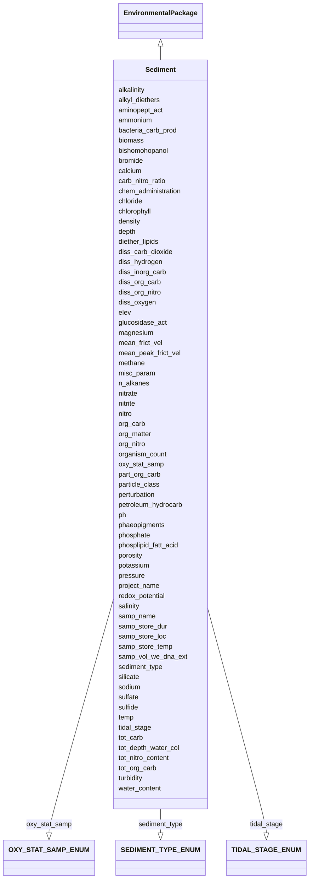

# Class: Sediment


URI: [mixs_6_2_proposal:Sediment](https://turbomam.github.io/mixs-envo-struct-knowl-extraction/Sediment)





## Inheritance
* [EnvironmentalPackage](EnvironmentalPackage.md)
    * **Sediment**


## Slots

| Name | Cardinality and Range | Description | Inheritance |
| ---  | --- | --- | --- |
| [samp_name](samp_name.md) | 1..1 <br/> [String](String.md) | A local identifier or name that for the material sample used for extracting n... | direct |
| [project_name](project_name.md) | 1..1 <br/> [String](String.md) | Name of the project within which the sequencing was organized | direct |
| [depth](depth.md) | 1..1 <br/> [String](String.md) | The vertical distance below local surface | direct |
| [elev](elev.md) | 0..1 _recommended_ <br/> [String](String.md) | Elevation of the sampling site is its height above a fixed reference point, m... | direct |
| [alkalinity](alkalinity.md) | 0..1 <br/> [String](String.md) | Alkalinity, the ability of a solution to neutralize acids to the equivalence ... | direct |
| [alkyl_diethers](alkyl_diethers.md) | 0..1 <br/> [String](String.md) | Concentration of alkyl diethers | direct |
| [aminopept_act](aminopept_act.md) | 0..1 <br/> [String](String.md) | Measurement of aminopeptidase activity | direct |
| [ammonium](ammonium.md) | 0..1 <br/> [String](String.md) | Concentration of ammonium in the sample | direct |
| [bacteria_carb_prod](bacteria_carb_prod.md) | 0..1 <br/> [String](String.md) | Measurement of bacterial carbon production | direct |
| [biomass](biomass.md) | 0..* <br/> [String](String.md) | Amount of biomass; should include the name for the part of biomass measured, ... | direct |
| [bishomohopanol](bishomohopanol.md) | 0..1 <br/> [String](String.md) | Concentration of bishomohopanol | direct |
| [bromide](bromide.md) | 0..1 <br/> [String](String.md) | Concentration of bromide | direct |
| [calcium](calcium.md) | 0..1 <br/> [String](String.md) | Concentration of calcium in the sample | direct |
| [carb_nitro_ratio](carb_nitro_ratio.md) | 0..1 <br/> [Float](Float.md) | Ratio of amount or concentrations of carbon to nitrogen | direct |
| [chem_administration](chem_administration.md) | 0..* <br/> [String](String.md) | List of chemical compounds administered to the host or site where sampling oc... | direct |
| [chloride](chloride.md) | 0..1 <br/> [String](String.md) | Concentration of chloride in the sample | direct |
| [chlorophyll](chlorophyll.md) | 0..1 <br/> [String](String.md) | Concentration of chlorophyll | direct |
| [density](density.md) | 0..1 <br/> [String](String.md) | Density of the sample, which is its mass per unit volume (aka volumetric mass... | direct |
| [diether_lipids](diether_lipids.md) | 0..* <br/> [String](String.md) | Concentration of diether lipids; can include multiple types of diether lipids | direct |
| [diss_carb_dioxide](diss_carb_dioxide.md) | 0..1 <br/> [String](String.md) | Concentration of dissolved carbon dioxide in the sample or liquid portion of ... | direct |
| [diss_hydrogen](diss_hydrogen.md) | 0..1 <br/> [String](String.md) | Concentration of dissolved hydrogen | direct |
| [diss_inorg_carb](diss_inorg_carb.md) | 0..1 <br/> [String](String.md) | Dissolved inorganic carbon concentration in the sample, typically measured af... | direct |
| [diss_org_carb](diss_org_carb.md) | 0..1 <br/> [String](String.md) | Concentration of dissolved organic carbon in the sample, liquid portion of th... | direct |
| [diss_org_nitro](diss_org_nitro.md) | 0..1 <br/> [String](String.md) | Dissolved organic nitrogen concentration measured as; total dissolved nitroge... | direct |
| [diss_oxygen](diss_oxygen.md) | 0..1 <br/> [String](String.md) | Concentration of dissolved oxygen | direct |
| [glucosidase_act](glucosidase_act.md) | 0..1 <br/> [String](String.md) | Measurement of glucosidase activity | direct |
| [magnesium](magnesium.md) | 0..1 <br/> [String](String.md) | Concentration of magnesium in the sample | direct |
| [mean_frict_vel](mean_frict_vel.md) | 0..1 <br/> [String](String.md) | Measurement of mean friction velocity | direct |
| [mean_peak_frict_vel](mean_peak_frict_vel.md) | 0..1 <br/> [String](String.md) | Measurement of mean peak friction velocity | direct |
| [methane](methane.md) | 0..1 <br/> [String](String.md) | Methane (gas) amount or concentration at the time of sampling | direct |
| [misc_param](misc_param.md) | 0..* <br/> [String](String.md) | Any other measurement performed or parameter collected, that is not listed he... | direct |
| [n_alkanes](n_alkanes.md) | 0..* <br/> [String](String.md) | Concentration of n-alkanes; can include multiple n-alkanes | direct |
| [nitrate](nitrate.md) | 0..1 <br/> [String](String.md) | Concentration of nitrate in the sample | direct |
| [nitrite](nitrite.md) | 0..1 <br/> [String](String.md) | Concentration of nitrite in the sample | direct |
| [nitro](nitro.md) | 0..1 <br/> [String](String.md) | Concentration of nitrogen (total) | direct |
| [org_carb](org_carb.md) | 0..1 <br/> [String](String.md) | Concentration of organic carbon | direct |
| [org_matter](org_matter.md) | 0..1 <br/> [String](String.md) | Concentration of organic matter | direct |
| [org_nitro](org_nitro.md) | 0..1 <br/> [String](String.md) | Concentration of organic nitrogen | direct |
| [organism_count](organism_count.md) | 0..* <br/> [String](String.md) | Total cell count of any organism (or group of organisms) per gram, volume or ... | direct |
| [oxy_stat_samp](oxy_stat_samp.md) | 0..1 <br/> [OXYSTATSAMPENUM](OXYSTATSAMPENUM.md) | Oxygenation status of sample | direct |
| [ph](ph.md) | 0..1 <br/> [Float](Float.md) | Ph measurement of the sample, or liquid portion of sample, or aqueous phase o... | direct |
| [particle_class](particle_class.md) | 0..* <br/> [String](String.md) | Particles are classified, based on their size, into six general categories:cl... | direct |
| [part_org_carb](part_org_carb.md) | 0..1 <br/> [String](String.md) | Concentration of particulate organic carbon | direct |
| [perturbation](perturbation.md) | 0..* <br/> [String](String.md) | Type of perturbation, e | direct |
| [petroleum_hydrocarb](petroleum_hydrocarb.md) | 0..1 <br/> [String](String.md) | Concentration of petroleum hydrocarbon | direct |
| [phaeopigments](phaeopigments.md) | 0..* <br/> [String](String.md) | Concentration of phaeopigments; can include multiple phaeopigments | direct |
| [phosphate](phosphate.md) | 0..1 <br/> [String](String.md) | Concentration of phosphate | direct |
| [phosplipid_fatt_acid](phosplipid_fatt_acid.md) | 0..* <br/> [String](String.md) | Concentration of phospholipid fatty acids; can include multiple values | direct |
| [porosity](porosity.md) | 0..1 <br/> [String](String.md) | Porosity of deposited sediment is volume of voids divided by the total volume... | direct |
| [potassium](potassium.md) | 0..1 <br/> [String](String.md) | Concentration of potassium in the sample | direct |
| [pressure](pressure.md) | 0..1 <br/> [String](String.md) | Pressure to which the sample is subject to, in atmospheres | direct |
| [redox_potential](redox_potential.md) | 0..1 <br/> [String](String.md) | Redox potential, measured relative to a hydrogen cell, indicating oxidation o... | direct |
| [salinity](salinity.md) | 0..1 <br/> [String](String.md) | The total concentration of all dissolved salts in a liquid or solid sample | direct |
| [samp_store_dur](samp_store_dur.md) | 0..1 <br/> [String](String.md) | Duration for which the sample was stored | direct |
| [samp_store_loc](samp_store_loc.md) | 0..1 <br/> [String](String.md) | Location at which sample was stored, usually name of a specific freezer/room | direct |
| [samp_store_temp](samp_store_temp.md) | 0..1 <br/> [String](String.md) | Temperature at which sample was stored, e | direct |
| [samp_vol_we_dna_ext](samp_vol_we_dna_ext.md) | 0..1 <br/> [String](String.md) | Volume (ml) or mass (g) of total collected sample processed for DNA extractio... | direct |
| [sediment_type](sediment_type.md) | 0..1 <br/> [SEDIMENTTYPEENUM](SEDIMENTTYPEENUM.md) | Information about the sediment type based on major constituents | direct |
| [silicate](silicate.md) | 0..1 <br/> [String](String.md) | Concentration of silicate | direct |
| [sodium](sodium.md) | 0..1 <br/> [String](String.md) | Sodium concentration in the sample | direct |
| [sulfate](sulfate.md) | 0..1 <br/> [String](String.md) | Concentration of sulfate in the sample | direct |
| [sulfide](sulfide.md) | 0..1 <br/> [String](String.md) | Concentration of sulfide in the sample | direct |
| [temp](temp.md) | 0..1 <br/> [String](String.md) | Temperature of the sample at the time of sampling | direct |
| [tidal_stage](tidal_stage.md) | 0..1 <br/> [TIDALSTAGEENUM](TIDALSTAGEENUM.md) | Stage of tide | direct |
| [tot_carb](tot_carb.md) | 0..1 <br/> [String](String.md) | Total carbon content | direct |
| [tot_depth_water_col](tot_depth_water_col.md) | 0..1 <br/> [String](String.md) | Measurement of total depth of water column | direct |
| [tot_nitro_content](tot_nitro_content.md) | 0..1 <br/> [String](String.md) | Total nitrogen content of the sample | direct |
| [tot_org_carb](tot_org_carb.md) | 0..1 <br/> [String](String.md) | Definition for soil: total organic carbon content of the soil, definition oth... | direct |
| [turbidity](turbidity.md) | 0..1 <br/> [String](String.md) | Measure of the amount of cloudiness or haziness in water caused by individual... | direct |
| [water_content](water_content.md) | 0..1 <br/> [String](String.md) | Water content measurement | direct |


## Identifier and Mapping Information


### Schema Source


* from schema: https://turbomam.github.io/mixs-envo-struct-knowl-extraction//mixs_6_2_proposal


## Mappings

| Mapping Type | Mapped Value |
| ---  | ---  |
| self | mixs_6_2_proposal:Sediment |
| native | mixs_6_2_proposal:Sediment |


## LinkML Source

<!-- TODO: investigate https://stackoverflow.com/questions/37606292/how-to-create-tabbed-code-blocks-in-mkdocs-or-sphinx -->

### Direct

<details>
```yaml
name: Sediment
title: Sediment
from_schema: https://turbomam.github.io/mixs-envo-struct-knowl-extraction//mixs_6_2_proposal
is_a: EnvironmentalPackage
mixin: false
slots:
- samp_name
- project_name
- depth
- elev
- alkalinity
- alkyl_diethers
- aminopept_act
- ammonium
- bacteria_carb_prod
- biomass
- bishomohopanol
- bromide
- calcium
- carb_nitro_ratio
- chem_administration
- chloride
- chlorophyll
- density
- diether_lipids
- diss_carb_dioxide
- diss_hydrogen
- diss_inorg_carb
- diss_org_carb
- diss_org_nitro
- diss_oxygen
- glucosidase_act
- magnesium
- mean_frict_vel
- mean_peak_frict_vel
- methane
- misc_param
- n_alkanes
- nitrate
- nitrite
- nitro
- org_carb
- org_matter
- org_nitro
- organism_count
- oxy_stat_samp
- ph
- particle_class
- part_org_carb
- perturbation
- petroleum_hydrocarb
- phaeopigments
- phosphate
- phosplipid_fatt_acid
- porosity
- potassium
- pressure
- redox_potential
- salinity
- samp_store_dur
- samp_store_loc
- samp_store_temp
- samp_vol_we_dna_ext
- sediment_type
- silicate
- sodium
- sulfate
- sulfide
- temp
- tidal_stage
- tot_carb
- tot_depth_water_col
- tot_nitro_content
- tot_org_carb
- turbidity
- water_content
slot_usage:
  alkyl_diethers:
    name: alkyl_diethers
    domain_of:
    - MicrobialMatBiofilm
    - Sediment
    - Water
  ammonium:
    name: ammonium
    domain_of:
    - HydrocarbonResourcesCores
    - HydrocarbonResourcesFluidsSwabs
    - MicrobialMatBiofilm
    - MiscellaneousNaturalOrArtificialEnvironment
    - Sediment
    - Water
    required: false
    recommended: false
  bacteria_carb_prod:
    name: bacteria_carb_prod
    domain_of:
    - MicrobialMatBiofilm
    - Sediment
    - Water
  carb_nitro_ratio:
    name: carb_nitro_ratio
    string_serialization: '{float} {unit}'
    domain_of:
    - MicrobialMatBiofilm
    - Sediment
    - Water
  chem_administration:
    name: chem_administration
    domain_of:
    - Agriculture
    - Air
    - FoodFarmEnvironment
    - HostAssociated
    - HumanAssociated
    - HumanGut
    - HumanOral
    - HumanSkin
    - HumanVaginal
    - MicrobialMatBiofilm
    - MiscellaneousNaturalOrArtificialEnvironment
    - PlantAssociated
    - Sediment
    - SymbiontAssociated
    - WastewaterSludge
    - Water
    required: false
    recommended: false
  density:
    name: density
    domain_of:
    - HydrocarbonResourcesCores
    - HydrocarbonResourcesFluidsSwabs
    - MiscellaneousNaturalOrArtificialEnvironment
    - Sediment
    - Water
  depth:
    name: depth
    title: depth
    examples:
    - value: 10 meter
    domain_of:
    - Agriculture
    - FoodFarmEnvironment
    - HostAssociated
    - MicrobialMatBiofilm
    - MigsBa
    - MigsEu
    - MigsOrg
    - MigsPl
    - MigsVi
    - Mimag
    - MimarksC
    - MimarksS
    - Mims
    - Misag
    - MiscellaneousNaturalOrArtificialEnvironment
    - Miuvig
    - PlantAssociated
    - Sediment
    - Soil
    - SymbiontAssociated
    - WastewaterSludge
    - Water
    required: true
  diss_inorg_carb:
    name: diss_inorg_carb
    domain_of:
    - HydrocarbonResourcesCores
    - HydrocarbonResourcesFluidsSwabs
    - MicrobialMatBiofilm
    - MiscellaneousNaturalOrArtificialEnvironment
    - Sediment
    - Water
  diss_org_nitro:
    name: diss_org_nitro
    domain_of:
    - MicrobialMatBiofilm
    - MiscellaneousNaturalOrArtificialEnvironment
    - Sediment
    - Water
  elev:
    name: elev
    domain_of:
    - Agriculture
    - Air
    - HostAssociated
    - HydrocarbonResourcesCores
    - MicrobialMatBiofilm
    - MigsBa
    - MigsEu
    - MigsOrg
    - MigsPl
    - MigsVi
    - Mimag
    - MimarksC
    - MimarksS
    - Mims
    - Misag
    - MiscellaneousNaturalOrArtificialEnvironment
    - Miuvig
    - PlantAssociated
    - Sediment
    - Soil
    - SymbiontAssociated
    - Water
    recommended: true
  methane:
    name: methane
    examples:
    - value: 0.15 micromole per liter
    domain_of:
    - Air
    - MicrobialMatBiofilm
    - Sediment
  misc_param:
    name: misc_param
    domain_of:
    - Agriculture
    - Air
    - FoodAnimalAndAnimalFeed
    - FoodFarmEnvironment
    - FoodFoodProductionFacility
    - FoodHumanFoods
    - HostAssociated
    - HumanAssociated
    - HumanGut
    - HumanOral
    - HumanSkin
    - HumanVaginal
    - HydrocarbonResourcesCores
    - HydrocarbonResourcesFluidsSwabs
    - MicrobialMatBiofilm
    - MiscellaneousNaturalOrArtificialEnvironment
    - PlantAssociated
    - Sediment
    - Soil
    - SymbiontAssociated
    - WastewaterSludge
    - Water
  n_alkanes:
    name: n_alkanes
    domain_of:
    - MicrobialMatBiofilm
    - Sediment
    - Water
  nitrate:
    name: nitrate
    domain_of:
    - HydrocarbonResourcesCores
    - HydrocarbonResourcesFluidsSwabs
    - MicrobialMatBiofilm
    - MiscellaneousNaturalOrArtificialEnvironment
    - Sediment
    - WastewaterSludge
    - Water
    required: false
    recommended: false
  nitrite:
    name: nitrite
    domain_of:
    - HydrocarbonResourcesCores
    - HydrocarbonResourcesFluidsSwabs
    - MicrobialMatBiofilm
    - MiscellaneousNaturalOrArtificialEnvironment
    - Sediment
    - Water
    required: false
    recommended: false
  org_carb:
    name: org_carb
    domain_of:
    - MicrobialMatBiofilm
    - MiscellaneousNaturalOrArtificialEnvironment
    - Sediment
    - Water
  org_matter:
    name: org_matter
    domain_of:
    - MicrobialMatBiofilm
    - MiscellaneousNaturalOrArtificialEnvironment
    - Sediment
    - Soil
    - Water
  org_nitro:
    name: org_nitro
    domain_of:
    - MicrobialMatBiofilm
    - MiscellaneousNaturalOrArtificialEnvironment
    - Sediment
    - Soil
    - Water
  organism_count:
    name: organism_count
    description: 'Total cell count of any organism (or group of organisms) per gram,
      volume or area of sample, should include name of organism followed by count.
      The method that was used for the enumeration (e.g. qPCR, atp, mpn, etc.) Should
      also be provided. (example: total prokaryotes; 3.5e7 cells per ml; qpcr)'
    examples:
    - value: total prokaryotes;3.5e7 cells per milliliter;qPCR
    string_serialization: '{text};{float} {unit};[qPCR|ATP|MPN|other]'
    multivalued: true
    domain_of:
    - Agriculture
    - Air
    - BuiltEnvironment
    - FoodAnimalAndAnimalFeed
    - FoodFarmEnvironment
    - FoodFoodProductionFacility
    - FoodHumanFoods
    - HostAssociated
    - HumanAssociated
    - HumanGut
    - HumanOral
    - HumanSkin
    - HumanVaginal
    - HydrocarbonResourcesCores
    - HydrocarbonResourcesFluidsSwabs
    - MicrobialMatBiofilm
    - MiscellaneousNaturalOrArtificialEnvironment
    - PlantAssociated
    - Sediment
    - SymbiontAssociated
    - WastewaterSludge
    - Water
    required: false
    recommended: false
  oxy_stat_samp:
    name: oxy_stat_samp
    domain_of:
    - Agriculture
    - Air
    - HostAssociated
    - HumanAssociated
    - HumanGut
    - HumanOral
    - HumanSkin
    - HumanVaginal
    - HydrocarbonResourcesCores
    - HydrocarbonResourcesFluidsSwabs
    - MicrobialMatBiofilm
    - MiscellaneousNaturalOrArtificialEnvironment
    - PlantAssociated
    - Sediment
    - SymbiontAssociated
    - WastewaterSludge
    - Water
    required: false
    recommended: false
  part_org_carb:
    name: part_org_carb
    domain_of:
    - MicrobialMatBiofilm
    - Sediment
    - Water
  perturbation:
    name: perturbation
    string_serialization: '{text};{Rn/start_time/end_time/duration}'
    domain_of:
    - Agriculture
    - Air
    - FoodAnimalAndAnimalFeed
    - FoodFarmEnvironment
    - FoodHumanFoods
    - HostAssociated
    - HumanAssociated
    - HumanGut
    - HumanOral
    - HumanSkin
    - HumanVaginal
    - MicrobialMatBiofilm
    - MiscellaneousNaturalOrArtificialEnvironment
    - PlantAssociated
    - Sediment
    - SymbiontAssociated
    - WastewaterSludge
    - Water
    required: false
    recommended: false
  ph:
    name: ph
    description: Ph measurement of the sample, or liquid portion of sample, or aqueous
      phase of the fluid
    domain_of:
    - FoodFarmEnvironment
    - HydrocarbonResourcesCores
    - HydrocarbonResourcesFluidsSwabs
    - MicrobialMatBiofilm
    - MiscellaneousNaturalOrArtificialEnvironment
    - Sediment
    - Soil
    - WastewaterSludge
    - Water
    required: false
    recommended: false
  phosplipid_fatt_acid:
    name: phosplipid_fatt_acid
    domain_of:
    - MicrobialMatBiofilm
    - MiscellaneousNaturalOrArtificialEnvironment
    - Sediment
    - Water
  salinity:
    name: salinity
    multivalued: false
    domain_of:
    - Air
    - FoodFarmEnvironment
    - HostAssociated
    - HumanAssociated
    - HumanGut
    - HumanOral
    - HumanSkin
    - HumanVaginal
    - HydrocarbonResourcesCores
    - HydrocarbonResourcesFluidsSwabs
    - MicrobialMatBiofilm
    - MiscellaneousNaturalOrArtificialEnvironment
    - PlantAssociated
    - Sediment
    - SymbiontAssociated
    - WastewaterSludge
    - Water
  samp_store_dur:
    name: samp_store_dur
    description: Duration for which the sample was stored
    string_serialization: '{duration}'
    domain_of:
    - Agriculture
    - Air
    - FoodAnimalAndAnimalFeed
    - FoodFarmEnvironment
    - FoodFoodProductionFacility
    - FoodHumanFoods
    - HostAssociated
    - HumanAssociated
    - HumanGut
    - HumanOral
    - HumanSkin
    - HumanVaginal
    - HydrocarbonResourcesCores
    - HydrocarbonResourcesFluidsSwabs
    - MicrobialMatBiofilm
    - MiscellaneousNaturalOrArtificialEnvironment
    - PlantAssociated
    - Sediment
    - SymbiontAssociated
    - WastewaterSludge
    - Water
    required: false
    recommended: false
  samp_store_loc:
    name: samp_store_loc
    description: Location at which sample was stored, usually name of a specific freezer/room
    examples:
    - value: Freezer no:5
    domain_of:
    - Agriculture
    - Air
    - FoodAnimalAndAnimalFeed
    - FoodFoodProductionFacility
    - FoodHumanFoods
    - HostAssociated
    - HumanAssociated
    - HumanGut
    - HumanOral
    - HumanSkin
    - HumanVaginal
    - HydrocarbonResourcesCores
    - HydrocarbonResourcesFluidsSwabs
    - MicrobialMatBiofilm
    - MiscellaneousNaturalOrArtificialEnvironment
    - PlantAssociated
    - Sediment
    - SymbiontAssociated
    - WastewaterSludge
    - Water
    required: false
    recommended: false
  samp_vol_we_dna_ext:
    name: samp_vol_we_dna_ext
    description: 'Volume (ml) or mass (g) of total collected sample processed for
      DNA extraction. Note: total sample collected should be entered under the term
      Sample Size (MIXS:0000001).'
    domain_of:
    - Agriculture
    - Air
    - FoodAnimalAndAnimalFeed
    - FoodFarmEnvironment
    - FoodFoodProductionFacility
    - FoodHumanFoods
    - HostAssociated
    - HumanAssociated
    - HumanGut
    - HumanOral
    - HumanSkin
    - HumanVaginal
    - HydrocarbonResourcesCores
    - HydrocarbonResourcesFluidsSwabs
    - MicrobialMatBiofilm
    - MigsBa
    - MigsEu
    - MigsOrg
    - MigsPl
    - MigsVi
    - Mimag
    - MimarksC
    - MimarksS
    - Mims
    - Misag
    - MiscellaneousNaturalOrArtificialEnvironment
    - Miuvig
    - PlantAssociated
    - Sediment
    - Soil
    - SymbiontAssociated
    - WastewaterSludge
    - Water
    required: false
    recommended: false
  sulfate:
    name: sulfate
    domain_of:
    - HydrocarbonResourcesCores
    - HydrocarbonResourcesFluidsSwabs
    - MicrobialMatBiofilm
    - MiscellaneousNaturalOrArtificialEnvironment
    - Sediment
    - Water
    required: false
    recommended: false
  sulfide:
    name: sulfide
    domain_of:
    - HydrocarbonResourcesCores
    - HydrocarbonResourcesFluidsSwabs
    - MicrobialMatBiofilm
    - MiscellaneousNaturalOrArtificialEnvironment
    - Sediment
    - Water
    required: false
    recommended: false
  temp:
    name: temp
    domain_of:
    - Agriculture
    - Air
    - FoodAnimalAndAnimalFeed
    - FoodFarmEnvironment
    - FoodHumanFoods
    - HostAssociated
    - HumanAssociated
    - HumanGut
    - HumanOral
    - HumanSkin
    - HumanVaginal
    - HydrocarbonResourcesCores
    - HydrocarbonResourcesFluidsSwabs
    - MicrobialMatBiofilm
    - MigsBa
    - MigsEu
    - MigsOrg
    - MigsPl
    - MigsVi
    - Mimag
    - MimarksC
    - MimarksS
    - Mims
    - Misag
    - MiscellaneousNaturalOrArtificialEnvironment
    - Miuvig
    - PlantAssociated
    - Sediment
    - Soil
    - SymbiontAssociated
    - WastewaterSludge
    - Water
    required: false
    recommended: false
  tot_carb:
    name: tot_carb
    domain_of:
    - Agriculture
    - MicrobialMatBiofilm
    - Sediment
    required: false
    recommended: false
  tot_nitro_content:
    name: tot_nitro_content
    multivalued: false
    domain_of:
    - Agriculture
    - FoodFarmEnvironment
    - MicrobialMatBiofilm
    - Sediment
    - Soil
    required: false
    recommended: false
  tot_org_carb:
    name: tot_org_carb
    string_serialization: '{float} {unit}'
    domain_of:
    - Agriculture
    - FoodFarmEnvironment
    - MicrobialMatBiofilm
    - Sediment
    - Soil
    required: false
    recommended: false
  turbidity:
    name: turbidity
    domain_of:
    - FoodFarmEnvironment
    - MicrobialMatBiofilm
    - Sediment
    - Water
  water_content:
    name: water_content
    string_serialization: '{float} {unit}'
    domain_of:
    - MicrobialMatBiofilm
    - Sediment
    - Soil

```
</details>

### Induced

<details>
```yaml
name: Sediment
title: Sediment
from_schema: https://turbomam.github.io/mixs-envo-struct-knowl-extraction//mixs_6_2_proposal
is_a: EnvironmentalPackage
mixin: false
slot_usage:
  alkyl_diethers:
    name: alkyl_diethers
    domain_of:
    - MicrobialMatBiofilm
    - Sediment
    - Water
  ammonium:
    name: ammonium
    domain_of:
    - HydrocarbonResourcesCores
    - HydrocarbonResourcesFluidsSwabs
    - MicrobialMatBiofilm
    - MiscellaneousNaturalOrArtificialEnvironment
    - Sediment
    - Water
    required: false
    recommended: false
  bacteria_carb_prod:
    name: bacteria_carb_prod
    domain_of:
    - MicrobialMatBiofilm
    - Sediment
    - Water
  carb_nitro_ratio:
    name: carb_nitro_ratio
    string_serialization: '{float} {unit}'
    domain_of:
    - MicrobialMatBiofilm
    - Sediment
    - Water
  chem_administration:
    name: chem_administration
    domain_of:
    - Agriculture
    - Air
    - FoodFarmEnvironment
    - HostAssociated
    - HumanAssociated
    - HumanGut
    - HumanOral
    - HumanSkin
    - HumanVaginal
    - MicrobialMatBiofilm
    - MiscellaneousNaturalOrArtificialEnvironment
    - PlantAssociated
    - Sediment
    - SymbiontAssociated
    - WastewaterSludge
    - Water
    required: false
    recommended: false
  density:
    name: density
    domain_of:
    - HydrocarbonResourcesCores
    - HydrocarbonResourcesFluidsSwabs
    - MiscellaneousNaturalOrArtificialEnvironment
    - Sediment
    - Water
  depth:
    name: depth
    title: depth
    examples:
    - value: 10 meter
    domain_of:
    - Agriculture
    - FoodFarmEnvironment
    - HostAssociated
    - MicrobialMatBiofilm
    - MigsBa
    - MigsEu
    - MigsOrg
    - MigsPl
    - MigsVi
    - Mimag
    - MimarksC
    - MimarksS
    - Mims
    - Misag
    - MiscellaneousNaturalOrArtificialEnvironment
    - Miuvig
    - PlantAssociated
    - Sediment
    - Soil
    - SymbiontAssociated
    - WastewaterSludge
    - Water
    required: true
  diss_inorg_carb:
    name: diss_inorg_carb
    domain_of:
    - HydrocarbonResourcesCores
    - HydrocarbonResourcesFluidsSwabs
    - MicrobialMatBiofilm
    - MiscellaneousNaturalOrArtificialEnvironment
    - Sediment
    - Water
  diss_org_nitro:
    name: diss_org_nitro
    domain_of:
    - MicrobialMatBiofilm
    - MiscellaneousNaturalOrArtificialEnvironment
    - Sediment
    - Water
  elev:
    name: elev
    domain_of:
    - Agriculture
    - Air
    - HostAssociated
    - HydrocarbonResourcesCores
    - MicrobialMatBiofilm
    - MigsBa
    - MigsEu
    - MigsOrg
    - MigsPl
    - MigsVi
    - Mimag
    - MimarksC
    - MimarksS
    - Mims
    - Misag
    - MiscellaneousNaturalOrArtificialEnvironment
    - Miuvig
    - PlantAssociated
    - Sediment
    - Soil
    - SymbiontAssociated
    - Water
    recommended: true
  methane:
    name: methane
    examples:
    - value: 0.15 micromole per liter
    domain_of:
    - Air
    - MicrobialMatBiofilm
    - Sediment
  misc_param:
    name: misc_param
    domain_of:
    - Agriculture
    - Air
    - FoodAnimalAndAnimalFeed
    - FoodFarmEnvironment
    - FoodFoodProductionFacility
    - FoodHumanFoods
    - HostAssociated
    - HumanAssociated
    - HumanGut
    - HumanOral
    - HumanSkin
    - HumanVaginal
    - HydrocarbonResourcesCores
    - HydrocarbonResourcesFluidsSwabs
    - MicrobialMatBiofilm
    - MiscellaneousNaturalOrArtificialEnvironment
    - PlantAssociated
    - Sediment
    - Soil
    - SymbiontAssociated
    - WastewaterSludge
    - Water
  n_alkanes:
    name: n_alkanes
    domain_of:
    - MicrobialMatBiofilm
    - Sediment
    - Water
  nitrate:
    name: nitrate
    domain_of:
    - HydrocarbonResourcesCores
    - HydrocarbonResourcesFluidsSwabs
    - MicrobialMatBiofilm
    - MiscellaneousNaturalOrArtificialEnvironment
    - Sediment
    - WastewaterSludge
    - Water
    required: false
    recommended: false
  nitrite:
    name: nitrite
    domain_of:
    - HydrocarbonResourcesCores
    - HydrocarbonResourcesFluidsSwabs
    - MicrobialMatBiofilm
    - MiscellaneousNaturalOrArtificialEnvironment
    - Sediment
    - Water
    required: false
    recommended: false
  org_carb:
    name: org_carb
    domain_of:
    - MicrobialMatBiofilm
    - MiscellaneousNaturalOrArtificialEnvironment
    - Sediment
    - Water
  org_matter:
    name: org_matter
    domain_of:
    - MicrobialMatBiofilm
    - MiscellaneousNaturalOrArtificialEnvironment
    - Sediment
    - Soil
    - Water
  org_nitro:
    name: org_nitro
    domain_of:
    - MicrobialMatBiofilm
    - MiscellaneousNaturalOrArtificialEnvironment
    - Sediment
    - Soil
    - Water
  organism_count:
    name: organism_count
    description: 'Total cell count of any organism (or group of organisms) per gram,
      volume or area of sample, should include name of organism followed by count.
      The method that was used for the enumeration (e.g. qPCR, atp, mpn, etc.) Should
      also be provided. (example: total prokaryotes; 3.5e7 cells per ml; qpcr)'
    examples:
    - value: total prokaryotes;3.5e7 cells per milliliter;qPCR
    string_serialization: '{text};{float} {unit};[qPCR|ATP|MPN|other]'
    multivalued: true
    domain_of:
    - Agriculture
    - Air
    - BuiltEnvironment
    - FoodAnimalAndAnimalFeed
    - FoodFarmEnvironment
    - FoodFoodProductionFacility
    - FoodHumanFoods
    - HostAssociated
    - HumanAssociated
    - HumanGut
    - HumanOral
    - HumanSkin
    - HumanVaginal
    - HydrocarbonResourcesCores
    - HydrocarbonResourcesFluidsSwabs
    - MicrobialMatBiofilm
    - MiscellaneousNaturalOrArtificialEnvironment
    - PlantAssociated
    - Sediment
    - SymbiontAssociated
    - WastewaterSludge
    - Water
    required: false
    recommended: false
  oxy_stat_samp:
    name: oxy_stat_samp
    domain_of:
    - Agriculture
    - Air
    - HostAssociated
    - HumanAssociated
    - HumanGut
    - HumanOral
    - HumanSkin
    - HumanVaginal
    - HydrocarbonResourcesCores
    - HydrocarbonResourcesFluidsSwabs
    - MicrobialMatBiofilm
    - MiscellaneousNaturalOrArtificialEnvironment
    - PlantAssociated
    - Sediment
    - SymbiontAssociated
    - WastewaterSludge
    - Water
    required: false
    recommended: false
  part_org_carb:
    name: part_org_carb
    domain_of:
    - MicrobialMatBiofilm
    - Sediment
    - Water
  perturbation:
    name: perturbation
    string_serialization: '{text};{Rn/start_time/end_time/duration}'
    domain_of:
    - Agriculture
    - Air
    - FoodAnimalAndAnimalFeed
    - FoodFarmEnvironment
    - FoodHumanFoods
    - HostAssociated
    - HumanAssociated
    - HumanGut
    - HumanOral
    - HumanSkin
    - HumanVaginal
    - MicrobialMatBiofilm
    - MiscellaneousNaturalOrArtificialEnvironment
    - PlantAssociated
    - Sediment
    - SymbiontAssociated
    - WastewaterSludge
    - Water
    required: false
    recommended: false
  ph:
    name: ph
    description: Ph measurement of the sample, or liquid portion of sample, or aqueous
      phase of the fluid
    domain_of:
    - FoodFarmEnvironment
    - HydrocarbonResourcesCores
    - HydrocarbonResourcesFluidsSwabs
    - MicrobialMatBiofilm
    - MiscellaneousNaturalOrArtificialEnvironment
    - Sediment
    - Soil
    - WastewaterSludge
    - Water
    required: false
    recommended: false
  phosplipid_fatt_acid:
    name: phosplipid_fatt_acid
    domain_of:
    - MicrobialMatBiofilm
    - MiscellaneousNaturalOrArtificialEnvironment
    - Sediment
    - Water
  salinity:
    name: salinity
    multivalued: false
    domain_of:
    - Air
    - FoodFarmEnvironment
    - HostAssociated
    - HumanAssociated
    - HumanGut
    - HumanOral
    - HumanSkin
    - HumanVaginal
    - HydrocarbonResourcesCores
    - HydrocarbonResourcesFluidsSwabs
    - MicrobialMatBiofilm
    - MiscellaneousNaturalOrArtificialEnvironment
    - PlantAssociated
    - Sediment
    - SymbiontAssociated
    - WastewaterSludge
    - Water
  samp_store_dur:
    name: samp_store_dur
    description: Duration for which the sample was stored
    string_serialization: '{duration}'
    domain_of:
    - Agriculture
    - Air
    - FoodAnimalAndAnimalFeed
    - FoodFarmEnvironment
    - FoodFoodProductionFacility
    - FoodHumanFoods
    - HostAssociated
    - HumanAssociated
    - HumanGut
    - HumanOral
    - HumanSkin
    - HumanVaginal
    - HydrocarbonResourcesCores
    - HydrocarbonResourcesFluidsSwabs
    - MicrobialMatBiofilm
    - MiscellaneousNaturalOrArtificialEnvironment
    - PlantAssociated
    - Sediment
    - SymbiontAssociated
    - WastewaterSludge
    - Water
    required: false
    recommended: false
  samp_store_loc:
    name: samp_store_loc
    description: Location at which sample was stored, usually name of a specific freezer/room
    examples:
    - value: Freezer no:5
    domain_of:
    - Agriculture
    - Air
    - FoodAnimalAndAnimalFeed
    - FoodFoodProductionFacility
    - FoodHumanFoods
    - HostAssociated
    - HumanAssociated
    - HumanGut
    - HumanOral
    - HumanSkin
    - HumanVaginal
    - HydrocarbonResourcesCores
    - HydrocarbonResourcesFluidsSwabs
    - MicrobialMatBiofilm
    - MiscellaneousNaturalOrArtificialEnvironment
    - PlantAssociated
    - Sediment
    - SymbiontAssociated
    - WastewaterSludge
    - Water
    required: false
    recommended: false
  samp_vol_we_dna_ext:
    name: samp_vol_we_dna_ext
    description: 'Volume (ml) or mass (g) of total collected sample processed for
      DNA extraction. Note: total sample collected should be entered under the term
      Sample Size (MIXS:0000001).'
    domain_of:
    - Agriculture
    - Air
    - FoodAnimalAndAnimalFeed
    - FoodFarmEnvironment
    - FoodFoodProductionFacility
    - FoodHumanFoods
    - HostAssociated
    - HumanAssociated
    - HumanGut
    - HumanOral
    - HumanSkin
    - HumanVaginal
    - HydrocarbonResourcesCores
    - HydrocarbonResourcesFluidsSwabs
    - MicrobialMatBiofilm
    - MigsBa
    - MigsEu
    - MigsOrg
    - MigsPl
    - MigsVi
    - Mimag
    - MimarksC
    - MimarksS
    - Mims
    - Misag
    - MiscellaneousNaturalOrArtificialEnvironment
    - Miuvig
    - PlantAssociated
    - Sediment
    - Soil
    - SymbiontAssociated
    - WastewaterSludge
    - Water
    required: false
    recommended: false
  sulfate:
    name: sulfate
    domain_of:
    - HydrocarbonResourcesCores
    - HydrocarbonResourcesFluidsSwabs
    - MicrobialMatBiofilm
    - MiscellaneousNaturalOrArtificialEnvironment
    - Sediment
    - Water
    required: false
    recommended: false
  sulfide:
    name: sulfide
    domain_of:
    - HydrocarbonResourcesCores
    - HydrocarbonResourcesFluidsSwabs
    - MicrobialMatBiofilm
    - MiscellaneousNaturalOrArtificialEnvironment
    - Sediment
    - Water
    required: false
    recommended: false
  temp:
    name: temp
    domain_of:
    - Agriculture
    - Air
    - FoodAnimalAndAnimalFeed
    - FoodFarmEnvironment
    - FoodHumanFoods
    - HostAssociated
    - HumanAssociated
    - HumanGut
    - HumanOral
    - HumanSkin
    - HumanVaginal
    - HydrocarbonResourcesCores
    - HydrocarbonResourcesFluidsSwabs
    - MicrobialMatBiofilm
    - MigsBa
    - MigsEu
    - MigsOrg
    - MigsPl
    - MigsVi
    - Mimag
    - MimarksC
    - MimarksS
    - Mims
    - Misag
    - MiscellaneousNaturalOrArtificialEnvironment
    - Miuvig
    - PlantAssociated
    - Sediment
    - Soil
    - SymbiontAssociated
    - WastewaterSludge
    - Water
    required: false
    recommended: false
  tot_carb:
    name: tot_carb
    domain_of:
    - Agriculture
    - MicrobialMatBiofilm
    - Sediment
    required: false
    recommended: false
  tot_nitro_content:
    name: tot_nitro_content
    multivalued: false
    domain_of:
    - Agriculture
    - FoodFarmEnvironment
    - MicrobialMatBiofilm
    - Sediment
    - Soil
    required: false
    recommended: false
  tot_org_carb:
    name: tot_org_carb
    string_serialization: '{float} {unit}'
    domain_of:
    - Agriculture
    - FoodFarmEnvironment
    - MicrobialMatBiofilm
    - Sediment
    - Soil
    required: false
    recommended: false
  turbidity:
    name: turbidity
    domain_of:
    - FoodFarmEnvironment
    - MicrobialMatBiofilm
    - Sediment
    - Water
  water_content:
    name: water_content
    string_serialization: '{float} {unit}'
    domain_of:
    - MicrobialMatBiofilm
    - Sediment
    - Soil
attributes:
  samp_name:
    name: samp_name
    description: A local identifier or name that for the material sample used for
      extracting nucleic acids, and subsequent sequencing. It can refer either to
      the original material collected or to any derived sub-samples. It can have any
      format, but we suggest that you make it concise, unique and consistent within
      your lab, and as informative as possible. INSDC requires every sample name from
      a single Submitter to be unique. Use of a globally unique identifier for the
      field source_mat_id is recommended in addition to sample_name
    title: sample name
    notes:
    - sample
    examples:
    - value: ISDsoil1
    in_subset:
    - investigation
    from_schema: https://turbomam.github.io/mixs-envo-struct-knowl-extraction//mixs_6_2_proposal
    rank: 1000
    slot_uri: MIXS:0001107
    multivalued: false
    alias: samp_name
    owner: Sediment
    domain_of:
    - Air
    - BuiltEnvironment
    - FoodAnimalAndAnimalFeed
    - FoodFarmEnvironment
    - FoodFoodProductionFacility
    - FoodHumanFoods
    - HostAssociated
    - HumanAssociated
    - HumanGut
    - HumanOral
    - HumanSkin
    - HumanVaginal
    - HydrocarbonResourcesCores
    - HydrocarbonResourcesFluidsSwabs
    - MicrobialMatBiofilm
    - MigsBa
    - MigsEu
    - MigsOrg
    - MigsPl
    - MigsVi
    - Mimag
    - MimarksC
    - MimarksS
    - Mims
    - Misag
    - MiscellaneousNaturalOrArtificialEnvironment
    - Miuvig
    - PlantAssociated
    - Sediment
    - Soil
    - SymbiontAssociated
    - WastewaterSludge
    - Water
    range: string
    required: true
  project_name:
    name: project_name
    description: Name of the project within which the sequencing was organized
    title: project name
    notes:
    - project
    examples:
    - value: Forest soil metagenome
    in_subset:
    - investigation
    from_schema: https://turbomam.github.io/mixs-envo-struct-knowl-extraction//mixs_6_2_proposal
    rank: 1000
    slot_uri: MIXS:0000092
    multivalued: false
    alias: project_name
    owner: Sediment
    domain_of:
    - Air
    - BuiltEnvironment
    - FoodAnimalAndAnimalFeed
    - FoodFarmEnvironment
    - FoodFoodProductionFacility
    - FoodHumanFoods
    - HostAssociated
    - HumanAssociated
    - HumanGut
    - HumanOral
    - HumanSkin
    - HumanVaginal
    - HydrocarbonResourcesCores
    - HydrocarbonResourcesFluidsSwabs
    - MicrobialMatBiofilm
    - MigsBa
    - MigsEu
    - MigsOrg
    - MigsPl
    - MigsVi
    - Mimag
    - MimarksC
    - MimarksS
    - Mims
    - Misag
    - MiscellaneousNaturalOrArtificialEnvironment
    - Miuvig
    - PlantAssociated
    - Sediment
    - Soil
    - SymbiontAssociated
    - WastewaterSludge
    - Water
    range: string
    required: true
  depth:
    name: depth
    description: The vertical distance below local surface. For sediment or soil samples
      depth is measured from sediment or soil surface, respectively. Depth can be
      reported as an interval for subsurface samples
    title: depth
    examples:
    - value: 10 meter
    from_schema: https://turbomam.github.io/mixs-envo-struct-knowl-extraction//mixs_6_2_proposal
    rank: 1000
    slot_uri: MIXS:0000018
    multivalued: false
    alias: depth
    owner: Sediment
    domain_of:
    - Agriculture
    - FoodFarmEnvironment
    - HostAssociated
    - MicrobialMatBiofilm
    - MigsBa
    - MigsEu
    - MigsOrg
    - MigsPl
    - MigsVi
    - Mimag
    - MimarksC
    - MimarksS
    - Mims
    - Misag
    - MiscellaneousNaturalOrArtificialEnvironment
    - Miuvig
    - PlantAssociated
    - Sediment
    - Soil
    - SymbiontAssociated
    - WastewaterSludge
    - Water
    range: string
    required: true
    pattern: ^[-+]?[0-9]*\.?[0-9]+([eE][-+]?[0-9]+)? \S.*\S$
  elev:
    name: elev
    description: Elevation of the sampling site is its height above a fixed reference
      point, most commonly the mean sea level. Elevation is mainly used when referring
      to points on the earth's surface, while altitude is used for points above the
      surface, such as an aircraft in flight or a spacecraft in orbit
    title: elevation
    from_schema: https://turbomam.github.io/mixs-envo-struct-knowl-extraction//mixs_6_2_proposal
    rank: 1000
    slot_uri: MIXS:0000093
    multivalued: false
    alias: elev
    owner: Sediment
    domain_of:
    - Agriculture
    - Air
    - HostAssociated
    - HydrocarbonResourcesCores
    - MicrobialMatBiofilm
    - MigsBa
    - MigsEu
    - MigsOrg
    - MigsPl
    - MigsVi
    - Mimag
    - MimarksC
    - MimarksS
    - Mims
    - Misag
    - MiscellaneousNaturalOrArtificialEnvironment
    - Miuvig
    - PlantAssociated
    - Sediment
    - Soil
    - SymbiontAssociated
    - Water
    range: string
    recommended: true
    pattern: ^[-+]?[0-9]*\.?[0-9]+([eE][-+]?[0-9]+)? \S.*\S$
  alkalinity:
    name: alkalinity
    annotations:
      Preferred_unit:
        tag: Preferred_unit
        value: milliequivalent per liter, milligram per liter
    description: Alkalinity, the ability of a solution to neutralize acids to the
      equivalence point of carbonate or bicarbonate
    title: alkalinity
    notes:
    - alkalinity
    examples:
    - value: 50 milligram per liter
    from_schema: https://turbomam.github.io/mixs-envo-struct-knowl-extraction//mixs_6_2_proposal
    rank: 1000
    slot_uri: MIXS:0000421
    multivalued: false
    alias: alkalinity
    owner: Sediment
    domain_of:
    - HydrocarbonResourcesCores
    - HydrocarbonResourcesFluidsSwabs
    - MicrobialMatBiofilm
    - MiscellaneousNaturalOrArtificialEnvironment
    - Sediment
    - WastewaterSludge
    - Water
    range: string
    required: false
    recommended: false
    pattern: ^[-+]?[0-9]*\.?[0-9]+([eE][-+]?[0-9]+)? \S.*\S$
  alkyl_diethers:
    name: alkyl_diethers
    description: Concentration of alkyl diethers
    title: alkyl diethers
    from_schema: https://turbomam.github.io/mixs-envo-struct-knowl-extraction//mixs_6_2_proposal
    rank: 1000
    slot_uri: MIXS:0000490
    multivalued: false
    alias: alkyl_diethers
    owner: Sediment
    domain_of:
    - MicrobialMatBiofilm
    - Sediment
    - Water
    range: string
    required: false
    recommended: false
    pattern: ^[-+]?[0-9]*\.?[0-9]+([eE][-+]?[0-9]+)? \S.*\S$
  aminopept_act:
    name: aminopept_act
    annotations:
      Preferred_unit:
        tag: Preferred_unit
        value: mole per liter per hour
    description: Measurement of aminopeptidase activity
    title: aminopeptidase activity
    examples:
    - value: 0.269 mole per liter per hour
    from_schema: https://turbomam.github.io/mixs-envo-struct-knowl-extraction//mixs_6_2_proposal
    rank: 1000
    slot_uri: MIXS:0000172
    multivalued: false
    alias: aminopept_act
    owner: Sediment
    domain_of:
    - MicrobialMatBiofilm
    - Sediment
    - Water
    range: string
    required: false
    recommended: false
    pattern: ^[-+]?[0-9]*\.?[0-9]+([eE][-+]?[0-9]+)? \S.*\S$
  ammonium:
    name: ammonium
    description: Concentration of ammonium in the sample
    title: ammonium
    from_schema: https://turbomam.github.io/mixs-envo-struct-knowl-extraction//mixs_6_2_proposal
    rank: 1000
    slot_uri: MIXS:0000427
    multivalued: false
    alias: ammonium
    owner: Sediment
    domain_of:
    - HydrocarbonResourcesCores
    - HydrocarbonResourcesFluidsSwabs
    - MicrobialMatBiofilm
    - MiscellaneousNaturalOrArtificialEnvironment
    - Sediment
    - Water
    range: string
    required: false
    recommended: false
    pattern: ^[-+]?[0-9]*\.?[0-9]+([eE][-+]?[0-9]+)? \S.*\S$
  bacteria_carb_prod:
    name: bacteria_carb_prod
    description: Measurement of bacterial carbon production
    title: bacterial carbon production
    from_schema: https://turbomam.github.io/mixs-envo-struct-knowl-extraction//mixs_6_2_proposal
    rank: 1000
    slot_uri: MIXS:0000173
    multivalued: false
    alias: bacteria_carb_prod
    owner: Sediment
    domain_of:
    - MicrobialMatBiofilm
    - Sediment
    - Water
    range: string
    required: false
    recommended: false
    pattern: ^[-+]?[0-9]*\.?[0-9]+([eE][-+]?[0-9]+)? \S.*\S$
  biomass:
    name: biomass
    annotations:
      Expected_value:
        tag: Expected_value
        value: biomass type;measurement value
      Preferred_unit:
        tag: Preferred_unit
        value: ton, kilogram, gram
    description: Amount of biomass; should include the name for the part of biomass
      measured, e.g. Microbial, total. Can include multiple measurements
    title: biomass
    notes:
    - biomass
    examples:
    - value: total;20 gram
    from_schema: https://turbomam.github.io/mixs-envo-struct-knowl-extraction//mixs_6_2_proposal
    rank: 1000
    string_serialization: '{text};{float} {unit}'
    slot_uri: MIXS:0000174
    multivalued: true
    alias: biomass
    owner: Sediment
    domain_of:
    - MicrobialMatBiofilm
    - MiscellaneousNaturalOrArtificialEnvironment
    - Sediment
    - Water
    range: string
    required: false
    recommended: false
  bishomohopanol:
    name: bishomohopanol
    annotations:
      Preferred_unit:
        tag: Preferred_unit
        value: microgram per liter, microgram per gram
    description: Concentration of bishomohopanol
    title: bishomohopanol
    examples:
    - value: 14 microgram per liter
    from_schema: https://turbomam.github.io/mixs-envo-struct-knowl-extraction//mixs_6_2_proposal
    rank: 1000
    slot_uri: MIXS:0000175
    multivalued: false
    alias: bishomohopanol
    owner: Sediment
    domain_of:
    - MicrobialMatBiofilm
    - Sediment
    - Water
    range: string
    required: false
    recommended: false
    pattern: ^[-+]?[0-9]*\.?[0-9]+([eE][-+]?[0-9]+)? \S.*\S$
  bromide:
    name: bromide
    annotations:
      Preferred_unit:
        tag: Preferred_unit
        value: parts per million
    description: Concentration of bromide
    title: bromide
    examples:
    - value: 0.05 parts per million
    from_schema: https://turbomam.github.io/mixs-envo-struct-knowl-extraction//mixs_6_2_proposal
    rank: 1000
    slot_uri: MIXS:0000176
    multivalued: false
    alias: bromide
    owner: Sediment
    domain_of:
    - MicrobialMatBiofilm
    - MiscellaneousNaturalOrArtificialEnvironment
    - Sediment
    - Water
    range: string
    required: false
    recommended: false
    pattern: ^[-+]?[0-9]*\.?[0-9]+([eE][-+]?[0-9]+)? \S.*\S$
  calcium:
    name: calcium
    annotations:
      Preferred_unit:
        tag: Preferred_unit
        value: milligram per liter, micromole per liter, parts per million
    description: Concentration of calcium in the sample
    title: calcium
    examples:
    - value: 0.2 micromole per liter
    from_schema: https://turbomam.github.io/mixs-envo-struct-knowl-extraction//mixs_6_2_proposal
    rank: 1000
    slot_uri: MIXS:0000432
    multivalued: false
    alias: calcium
    owner: Sediment
    domain_of:
    - HydrocarbonResourcesCores
    - HydrocarbonResourcesFluidsSwabs
    - MicrobialMatBiofilm
    - MiscellaneousNaturalOrArtificialEnvironment
    - Sediment
    - Water
    range: string
    required: false
    recommended: false
    pattern: ^[-+]?[0-9]*\.?[0-9]+([eE][-+]?[0-9]+)? \S.*\S$
  carb_nitro_ratio:
    name: carb_nitro_ratio
    description: Ratio of amount or concentrations of carbon to nitrogen
    title: carbon/nitrogen ratio
    from_schema: https://turbomam.github.io/mixs-envo-struct-knowl-extraction//mixs_6_2_proposal
    rank: 1000
    string_serialization: '{float} {unit}'
    slot_uri: MIXS:0000310
    alias: carb_nitro_ratio
    owner: Sediment
    domain_of:
    - MicrobialMatBiofilm
    - Sediment
    - Water
    range: float
    required: false
    recommended: false
  chem_administration:
    name: chem_administration
    description: List of chemical compounds administered to the host or site where
      sampling occurred, and when (e.g. Antibiotics, n fertilizer, air filter); can
      include multiple compounds. For chemical entities of biological interest ontology
      (chebi) (v 163), http://purl.bioontology.org/ontology/chebi
    title: chemical administration
    from_schema: https://turbomam.github.io/mixs-envo-struct-knowl-extraction//mixs_6_2_proposal
    rank: 1000
    string_serialization: '{termLabel} [{termID}];{timestamp}'
    slot_uri: MIXS:0000751
    multivalued: true
    alias: chem_administration
    owner: Sediment
    domain_of:
    - Agriculture
    - Air
    - FoodFarmEnvironment
    - HostAssociated
    - HumanAssociated
    - HumanGut
    - HumanOral
    - HumanSkin
    - HumanVaginal
    - MicrobialMatBiofilm
    - MiscellaneousNaturalOrArtificialEnvironment
    - PlantAssociated
    - Sediment
    - SymbiontAssociated
    - WastewaterSludge
    - Water
    range: string
    required: false
    recommended: false
  chloride:
    name: chloride
    annotations:
      Preferred_unit:
        tag: Preferred_unit
        value: milligram per liter, parts per million
    description: Concentration of chloride in the sample
    title: chloride
    examples:
    - value: 5000 milligram per liter
    from_schema: https://turbomam.github.io/mixs-envo-struct-knowl-extraction//mixs_6_2_proposal
    rank: 1000
    slot_uri: MIXS:0000429
    multivalued: false
    alias: chloride
    owner: Sediment
    domain_of:
    - HydrocarbonResourcesCores
    - HydrocarbonResourcesFluidsSwabs
    - MicrobialMatBiofilm
    - MiscellaneousNaturalOrArtificialEnvironment
    - Sediment
    - Water
    range: string
    required: false
    recommended: false
    pattern: ^[-+]?[0-9]*\.?[0-9]+([eE][-+]?[0-9]+)? \S.*\S$
  chlorophyll:
    name: chlorophyll
    annotations:
      Preferred_unit:
        tag: Preferred_unit
        value: milligram per cubic meter, microgram per liter
    description: Concentration of chlorophyll
    title: chlorophyll
    examples:
    - value: 5 milligram per cubic meter
    from_schema: https://turbomam.github.io/mixs-envo-struct-knowl-extraction//mixs_6_2_proposal
    rank: 1000
    slot_uri: MIXS:0000177
    multivalued: false
    alias: chlorophyll
    owner: Sediment
    domain_of:
    - MicrobialMatBiofilm
    - MiscellaneousNaturalOrArtificialEnvironment
    - Sediment
    - Water
    range: string
    required: false
    recommended: false
    pattern: ^[-+]?[0-9]*\.?[0-9]+([eE][-+]?[0-9]+)? \S.*\S$
  density:
    name: density
    description: Density of the sample, which is its mass per unit volume (aka volumetric
      mass density)
    title: density
    from_schema: https://turbomam.github.io/mixs-envo-struct-knowl-extraction//mixs_6_2_proposal
    rank: 1000
    slot_uri: MIXS:0000435
    multivalued: false
    alias: density
    owner: Sediment
    domain_of:
    - HydrocarbonResourcesCores
    - HydrocarbonResourcesFluidsSwabs
    - MiscellaneousNaturalOrArtificialEnvironment
    - Sediment
    - Water
    range: string
    required: false
    recommended: false
    pattern: ^[-+]?[0-9]*\.?[0-9]+([eE][-+]?[0-9]+)? \S.*\S$
  diether_lipids:
    name: diether_lipids
    annotations:
      Expected_value:
        tag: Expected_value
        value: diether lipid name;measurement value
      Preferred_unit:
        tag: Preferred_unit
        value: nanogram per liter
    description: Concentration of diether lipids; can include multiple types of diether
      lipids
    title: diether lipids
    examples:
    - value: 0.2 nanogram per liter
    from_schema: https://turbomam.github.io/mixs-envo-struct-knowl-extraction//mixs_6_2_proposal
    rank: 1000
    string_serialization: '{text};{float} {unit}'
    slot_uri: MIXS:0000178
    multivalued: true
    alias: diether_lipids
    owner: Sediment
    domain_of:
    - MicrobialMatBiofilm
    - MiscellaneousNaturalOrArtificialEnvironment
    - Sediment
    - Water
    range: string
    required: false
    recommended: false
  diss_carb_dioxide:
    name: diss_carb_dioxide
    annotations:
      Preferred_unit:
        tag: Preferred_unit
        value: micromole per liter, milligram per liter
    description: Concentration of dissolved carbon dioxide in the sample or liquid
      portion of the sample
    title: dissolved carbon dioxide
    notes:
    - carbon
    - dissolved
    examples:
    - value: 5 milligram per liter
    from_schema: https://turbomam.github.io/mixs-envo-struct-knowl-extraction//mixs_6_2_proposal
    rank: 1000
    slot_uri: MIXS:0000436
    multivalued: false
    alias: diss_carb_dioxide
    owner: Sediment
    domain_of:
    - HydrocarbonResourcesCores
    - HydrocarbonResourcesFluidsSwabs
    - MicrobialMatBiofilm
    - MiscellaneousNaturalOrArtificialEnvironment
    - Sediment
    - Water
    range: string
    required: false
    recommended: false
    pattern: ^[-+]?[0-9]*\.?[0-9]+([eE][-+]?[0-9]+)? \S.*\S$
  diss_hydrogen:
    name: diss_hydrogen
    annotations:
      Preferred_unit:
        tag: Preferred_unit
        value: micromole per liter
    description: Concentration of dissolved hydrogen
    title: dissolved hydrogen
    notes:
    - dissolved
    examples:
    - value: 0.3 micromole per liter
    from_schema: https://turbomam.github.io/mixs-envo-struct-knowl-extraction//mixs_6_2_proposal
    rank: 1000
    slot_uri: MIXS:0000179
    multivalued: false
    alias: diss_hydrogen
    owner: Sediment
    domain_of:
    - MicrobialMatBiofilm
    - MiscellaneousNaturalOrArtificialEnvironment
    - Sediment
    - Water
    range: string
    required: false
    recommended: false
    pattern: ^[-+]?[0-9]*\.?[0-9]+([eE][-+]?[0-9]+)? \S.*\S$
  diss_inorg_carb:
    name: diss_inorg_carb
    description: Dissolved inorganic carbon concentration in the sample, typically
      measured after filtering the sample using a 0.45 micrometer filter
    title: dissolved inorganic carbon
    from_schema: https://turbomam.github.io/mixs-envo-struct-knowl-extraction//mixs_6_2_proposal
    rank: 1000
    slot_uri: MIXS:0000434
    multivalued: false
    alias: diss_inorg_carb
    owner: Sediment
    domain_of:
    - HydrocarbonResourcesCores
    - HydrocarbonResourcesFluidsSwabs
    - MicrobialMatBiofilm
    - MiscellaneousNaturalOrArtificialEnvironment
    - Sediment
    - Water
    range: string
    required: false
    recommended: false
    pattern: ^[-+]?[0-9]*\.?[0-9]+([eE][-+]?[0-9]+)? \S.*\S$
  diss_org_carb:
    name: diss_org_carb
    annotations:
      Preferred_unit:
        tag: Preferred_unit
        value: micromole per liter, milligram per liter
    description: Concentration of dissolved organic carbon in the sample, liquid portion
      of the sample, or aqueous phase of the fluid
    title: dissolved organic carbon
    notes:
    - carbon
    - dissolved
    - organic
    examples:
    - value: 197 micromole per liter
    from_schema: https://turbomam.github.io/mixs-envo-struct-knowl-extraction//mixs_6_2_proposal
    rank: 1000
    slot_uri: MIXS:0000433
    multivalued: false
    alias: diss_org_carb
    owner: Sediment
    domain_of:
    - HydrocarbonResourcesCores
    - HydrocarbonResourcesFluidsSwabs
    - MicrobialMatBiofilm
    - Sediment
    - Water
    range: string
    required: false
    recommended: false
    pattern: ^[-+]?[0-9]*\.?[0-9]+([eE][-+]?[0-9]+)? \S.*\S$
  diss_org_nitro:
    name: diss_org_nitro
    description: Dissolved organic nitrogen concentration measured as; total dissolved
      nitrogen - NH4 - NO3 - NO2
    title: dissolved organic nitrogen
    from_schema: https://turbomam.github.io/mixs-envo-struct-knowl-extraction//mixs_6_2_proposal
    rank: 1000
    slot_uri: MIXS:0000162
    multivalued: false
    alias: diss_org_nitro
    owner: Sediment
    domain_of:
    - MicrobialMatBiofilm
    - MiscellaneousNaturalOrArtificialEnvironment
    - Sediment
    - Water
    range: string
    required: false
    recommended: false
    pattern: ^[-+]?[0-9]*\.?[0-9]+([eE][-+]?[0-9]+)? \S.*\S$
  diss_oxygen:
    name: diss_oxygen
    annotations:
      Preferred_unit:
        tag: Preferred_unit
        value: micromole per kilogram, milligram per liter
    description: Concentration of dissolved oxygen
    title: dissolved oxygen
    notes:
    - dissolved
    - oxygen
    examples:
    - value: 175 micromole per kilogram
    from_schema: https://turbomam.github.io/mixs-envo-struct-knowl-extraction//mixs_6_2_proposal
    rank: 1000
    slot_uri: MIXS:0000119
    multivalued: false
    alias: diss_oxygen
    owner: Sediment
    domain_of:
    - MicrobialMatBiofilm
    - MiscellaneousNaturalOrArtificialEnvironment
    - Sediment
    - Water
    range: string
    required: false
    recommended: false
    pattern: ^[-+]?[0-9]*\.?[0-9]+([eE][-+]?[0-9]+)? \S.*\S$
  glucosidase_act:
    name: glucosidase_act
    annotations:
      Preferred_unit:
        tag: Preferred_unit
        value: mol per liter per hour
    description: Measurement of glucosidase activity
    title: glucosidase activity
    examples:
    - value: 5 mol per liter per hour
    from_schema: https://turbomam.github.io/mixs-envo-struct-knowl-extraction//mixs_6_2_proposal
    rank: 1000
    slot_uri: MIXS:0000137
    multivalued: false
    alias: glucosidase_act
    owner: Sediment
    domain_of:
    - MicrobialMatBiofilm
    - Sediment
    - Water
    range: string
    required: false
    recommended: false
    pattern: ^[-+]?[0-9]*\.?[0-9]+([eE][-+]?[0-9]+)? \S.*\S$
  magnesium:
    name: magnesium
    annotations:
      Preferred_unit:
        tag: Preferred_unit
        value: mole per liter, milligram per liter, parts per million, micromole per
          kilogram
    description: Concentration of magnesium in the sample
    title: magnesium
    examples:
    - value: 52.8 micromole per kilogram
    from_schema: https://turbomam.github.io/mixs-envo-struct-knowl-extraction//mixs_6_2_proposal
    rank: 1000
    slot_uri: MIXS:0000431
    multivalued: false
    alias: magnesium
    owner: Sediment
    domain_of:
    - HydrocarbonResourcesCores
    - HydrocarbonResourcesFluidsSwabs
    - MicrobialMatBiofilm
    - Sediment
    - Water
    range: string
    required: false
    recommended: false
    pattern: ^[-+]?[0-9]*\.?[0-9]+([eE][-+]?[0-9]+)? \S.*\S$
  mean_frict_vel:
    name: mean_frict_vel
    annotations:
      Preferred_unit:
        tag: Preferred_unit
        value: meter per second
    description: Measurement of mean friction velocity
    title: mean friction velocity
    notes:
    - mean
    - velocity
    examples:
    - value: 0.5 meter per second
    from_schema: https://turbomam.github.io/mixs-envo-struct-knowl-extraction//mixs_6_2_proposal
    rank: 1000
    slot_uri: MIXS:0000498
    multivalued: false
    alias: mean_frict_vel
    owner: Sediment
    domain_of:
    - MicrobialMatBiofilm
    - Sediment
    - Water
    range: string
    required: false
    recommended: false
    pattern: ^[-+]?[0-9]*\.?[0-9]+([eE][-+]?[0-9]+)? \S.*\S$
  mean_peak_frict_vel:
    name: mean_peak_frict_vel
    annotations:
      Preferred_unit:
        tag: Preferred_unit
        value: meter per second
    description: Measurement of mean peak friction velocity
    title: mean peak friction velocity
    notes:
    - mean
    - peak
    - velocity
    examples:
    - value: 1 meter per second
    from_schema: https://turbomam.github.io/mixs-envo-struct-knowl-extraction//mixs_6_2_proposal
    rank: 1000
    slot_uri: MIXS:0000502
    multivalued: false
    alias: mean_peak_frict_vel
    owner: Sediment
    domain_of:
    - MicrobialMatBiofilm
    - Sediment
    - Water
    range: string
    required: false
    recommended: false
    pattern: ^[-+]?[0-9]*\.?[0-9]+([eE][-+]?[0-9]+)? \S.*\S$
  methane:
    name: methane
    description: Methane (gas) amount or concentration at the time of sampling
    title: methane
    examples:
    - value: 0.15 micromole per liter
    from_schema: https://turbomam.github.io/mixs-envo-struct-knowl-extraction//mixs_6_2_proposal
    rank: 1000
    slot_uri: MIXS:0000101
    multivalued: false
    alias: methane
    owner: Sediment
    domain_of:
    - Air
    - MicrobialMatBiofilm
    - Sediment
    range: string
    required: false
    recommended: false
    pattern: ^[-+]?[0-9]*\.?[0-9]+([eE][-+]?[0-9]+)? \S.*\S$
  misc_param:
    name: misc_param
    description: Any other measurement performed or parameter collected, that is not
      listed here
    title: miscellaneous parameter
    from_schema: https://turbomam.github.io/mixs-envo-struct-knowl-extraction//mixs_6_2_proposal
    rank: 1000
    string_serialization: '{text};{float} {unit}'
    slot_uri: MIXS:0000752
    multivalued: true
    alias: misc_param
    owner: Sediment
    domain_of:
    - Agriculture
    - Air
    - FoodAnimalAndAnimalFeed
    - FoodFarmEnvironment
    - FoodFoodProductionFacility
    - FoodHumanFoods
    - HostAssociated
    - HumanAssociated
    - HumanGut
    - HumanOral
    - HumanSkin
    - HumanVaginal
    - HydrocarbonResourcesCores
    - HydrocarbonResourcesFluidsSwabs
    - MicrobialMatBiofilm
    - MiscellaneousNaturalOrArtificialEnvironment
    - PlantAssociated
    - Sediment
    - Soil
    - SymbiontAssociated
    - WastewaterSludge
    - Water
    range: string
    required: false
    recommended: false
  n_alkanes:
    name: n_alkanes
    description: Concentration of n-alkanes; can include multiple n-alkanes
    title: n-alkanes
    from_schema: https://turbomam.github.io/mixs-envo-struct-knowl-extraction//mixs_6_2_proposal
    rank: 1000
    string_serialization: '{text};{float} {unit}'
    slot_uri: MIXS:0000503
    multivalued: true
    alias: n_alkanes
    owner: Sediment
    domain_of:
    - MicrobialMatBiofilm
    - Sediment
    - Water
    range: string
    required: false
    recommended: false
  nitrate:
    name: nitrate
    description: Concentration of nitrate in the sample
    title: nitrate
    from_schema: https://turbomam.github.io/mixs-envo-struct-knowl-extraction//mixs_6_2_proposal
    rank: 1000
    slot_uri: MIXS:0000425
    multivalued: false
    alias: nitrate
    owner: Sediment
    domain_of:
    - HydrocarbonResourcesCores
    - HydrocarbonResourcesFluidsSwabs
    - MicrobialMatBiofilm
    - MiscellaneousNaturalOrArtificialEnvironment
    - Sediment
    - WastewaterSludge
    - Water
    range: string
    required: false
    recommended: false
    pattern: ^[-+]?[0-9]*\.?[0-9]+([eE][-+]?[0-9]+)? \S.*\S$
  nitrite:
    name: nitrite
    description: Concentration of nitrite in the sample
    title: nitrite
    from_schema: https://turbomam.github.io/mixs-envo-struct-knowl-extraction//mixs_6_2_proposal
    rank: 1000
    slot_uri: MIXS:0000426
    multivalued: false
    alias: nitrite
    owner: Sediment
    domain_of:
    - HydrocarbonResourcesCores
    - HydrocarbonResourcesFluidsSwabs
    - MicrobialMatBiofilm
    - MiscellaneousNaturalOrArtificialEnvironment
    - Sediment
    - Water
    range: string
    required: false
    recommended: false
    pattern: ^[-+]?[0-9]*\.?[0-9]+([eE][-+]?[0-9]+)? \S.*\S$
  nitro:
    name: nitro
    annotations:
      Preferred_unit:
        tag: Preferred_unit
        value: micromole per liter
    description: Concentration of nitrogen (total)
    title: nitrogen
    notes:
    - nitrogen
    examples:
    - value: 4.2 micromole per liter
    from_schema: https://turbomam.github.io/mixs-envo-struct-knowl-extraction//mixs_6_2_proposal
    rank: 1000
    slot_uri: MIXS:0000504
    multivalued: false
    alias: nitro
    owner: Sediment
    domain_of:
    - MicrobialMatBiofilm
    - MiscellaneousNaturalOrArtificialEnvironment
    - Sediment
    - Water
    range: string
    required: false
    recommended: false
    pattern: ^[-+]?[0-9]*\.?[0-9]+([eE][-+]?[0-9]+)? \S.*\S$
  org_carb:
    name: org_carb
    description: Concentration of organic carbon
    title: organic carbon
    from_schema: https://turbomam.github.io/mixs-envo-struct-knowl-extraction//mixs_6_2_proposal
    rank: 1000
    slot_uri: MIXS:0000508
    multivalued: false
    alias: org_carb
    owner: Sediment
    domain_of:
    - MicrobialMatBiofilm
    - MiscellaneousNaturalOrArtificialEnvironment
    - Sediment
    - Water
    range: string
    required: false
    recommended: false
    pattern: ^[-+]?[0-9]*\.?[0-9]+([eE][-+]?[0-9]+)? \S.*\S$
  org_matter:
    name: org_matter
    description: Concentration of organic matter
    title: organic matter
    from_schema: https://turbomam.github.io/mixs-envo-struct-knowl-extraction//mixs_6_2_proposal
    rank: 1000
    slot_uri: MIXS:0000204
    multivalued: false
    alias: org_matter
    owner: Sediment
    domain_of:
    - MicrobialMatBiofilm
    - MiscellaneousNaturalOrArtificialEnvironment
    - Sediment
    - Soil
    - Water
    range: string
    required: false
    recommended: false
    pattern: ^[-+]?[0-9]*\.?[0-9]+([eE][-+]?[0-9]+)? \S.*\S$
  org_nitro:
    name: org_nitro
    description: Concentration of organic nitrogen
    title: organic nitrogen
    from_schema: https://turbomam.github.io/mixs-envo-struct-knowl-extraction//mixs_6_2_proposal
    rank: 1000
    slot_uri: MIXS:0000205
    multivalued: false
    alias: org_nitro
    owner: Sediment
    domain_of:
    - MicrobialMatBiofilm
    - MiscellaneousNaturalOrArtificialEnvironment
    - Sediment
    - Soil
    - Water
    range: string
    required: false
    recommended: false
    pattern: ^[-+]?[0-9]*\.?[0-9]+([eE][-+]?[0-9]+)? \S.*\S$
  organism_count:
    name: organism_count
    description: 'Total cell count of any organism (or group of organisms) per gram,
      volume or area of sample, should include name of organism followed by count.
      The method that was used for the enumeration (e.g. qPCR, atp, mpn, etc.) Should
      also be provided. (example: total prokaryotes; 3.5e7 cells per ml; qpcr)'
    title: organism count
    examples:
    - value: total prokaryotes;3.5e7 cells per milliliter;qPCR
    from_schema: https://turbomam.github.io/mixs-envo-struct-knowl-extraction//mixs_6_2_proposal
    rank: 1000
    string_serialization: '{text};{float} {unit};[qPCR|ATP|MPN|other]'
    slot_uri: MIXS:0000103
    multivalued: true
    alias: organism_count
    owner: Sediment
    domain_of:
    - Agriculture
    - Air
    - BuiltEnvironment
    - FoodAnimalAndAnimalFeed
    - FoodFarmEnvironment
    - FoodFoodProductionFacility
    - FoodHumanFoods
    - HostAssociated
    - HumanAssociated
    - HumanGut
    - HumanOral
    - HumanSkin
    - HumanVaginal
    - HydrocarbonResourcesCores
    - HydrocarbonResourcesFluidsSwabs
    - MicrobialMatBiofilm
    - MiscellaneousNaturalOrArtificialEnvironment
    - PlantAssociated
    - Sediment
    - SymbiontAssociated
    - WastewaterSludge
    - Water
    range: string
    required: false
    recommended: false
  oxy_stat_samp:
    name: oxy_stat_samp
    description: Oxygenation status of sample
    title: oxygenation status of sample
    from_schema: https://turbomam.github.io/mixs-envo-struct-knowl-extraction//mixs_6_2_proposal
    rank: 1000
    slot_uri: MIXS:0000753
    multivalued: false
    alias: oxy_stat_samp
    owner: Sediment
    domain_of:
    - Agriculture
    - Air
    - HostAssociated
    - HumanAssociated
    - HumanGut
    - HumanOral
    - HumanSkin
    - HumanVaginal
    - HydrocarbonResourcesCores
    - HydrocarbonResourcesFluidsSwabs
    - MicrobialMatBiofilm
    - MiscellaneousNaturalOrArtificialEnvironment
    - PlantAssociated
    - Sediment
    - SymbiontAssociated
    - WastewaterSludge
    - Water
    range: OXY_STAT_SAMP_ENUM
    required: false
    recommended: false
  ph:
    name: ph
    description: Ph measurement of the sample, or liquid portion of sample, or aqueous
      phase of the fluid
    title: pH
    from_schema: https://turbomam.github.io/mixs-envo-struct-knowl-extraction//mixs_6_2_proposal
    rank: 1000
    slot_uri: MIXS:0001001
    multivalued: false
    alias: ph
    owner: Sediment
    domain_of:
    - FoodFarmEnvironment
    - HydrocarbonResourcesCores
    - HydrocarbonResourcesFluidsSwabs
    - MicrobialMatBiofilm
    - MiscellaneousNaturalOrArtificialEnvironment
    - Sediment
    - Soil
    - WastewaterSludge
    - Water
    range: float
    required: false
    recommended: false
  particle_class:
    name: particle_class
    annotations:
      Expected_value:
        tag: Expected_value
        value: particle name;measurement value
      Preferred_unit:
        tag: Preferred_unit
        value: micrometer
    description: Particles are classified, based on their size, into six general categories:clay,
      silt, sand, gravel, cobbles, and boulders; should include amount of particle
      preceded by the name of the particle type; can include multiple values
    title: particle classification
    notes:
    - classification
    - particle
    from_schema: https://turbomam.github.io/mixs-envo-struct-knowl-extraction//mixs_6_2_proposal
    rank: 1000
    string_serialization: '{text};{float} {unit}'
    slot_uri: MIXS:0000206
    multivalued: true
    alias: particle_class
    owner: Sediment
    domain_of:
    - Sediment
    range: string
    required: false
    recommended: false
  part_org_carb:
    name: part_org_carb
    description: Concentration of particulate organic carbon
    title: particulate organic carbon
    from_schema: https://turbomam.github.io/mixs-envo-struct-knowl-extraction//mixs_6_2_proposal
    rank: 1000
    slot_uri: MIXS:0000515
    multivalued: false
    alias: part_org_carb
    owner: Sediment
    domain_of:
    - MicrobialMatBiofilm
    - Sediment
    - Water
    range: string
    required: false
    recommended: false
    pattern: ^[-+]?[0-9]*\.?[0-9]+([eE][-+]?[0-9]+)? \S.*\S$
  perturbation:
    name: perturbation
    description: Type of perturbation, e.g. chemical administration, physical disturbance,
      etc., coupled with perturbation regimen including how many times the perturbation
      was repeated, how long each perturbation lasted, and the start and end time
      of the entire perturbation period; can include multiple perturbation types
    title: perturbation
    from_schema: https://turbomam.github.io/mixs-envo-struct-knowl-extraction//mixs_6_2_proposal
    rank: 1000
    string_serialization: '{text};{Rn/start_time/end_time/duration}'
    slot_uri: MIXS:0000754
    multivalued: true
    alias: perturbation
    owner: Sediment
    domain_of:
    - Agriculture
    - Air
    - FoodAnimalAndAnimalFeed
    - FoodFarmEnvironment
    - FoodHumanFoods
    - HostAssociated
    - HumanAssociated
    - HumanGut
    - HumanOral
    - HumanSkin
    - HumanVaginal
    - MicrobialMatBiofilm
    - MiscellaneousNaturalOrArtificialEnvironment
    - PlantAssociated
    - Sediment
    - SymbiontAssociated
    - WastewaterSludge
    - Water
    range: string
    required: false
    recommended: false
  petroleum_hydrocarb:
    name: petroleum_hydrocarb
    annotations:
      Preferred_unit:
        tag: Preferred_unit
        value: micromole per liter
    description: Concentration of petroleum hydrocarbon
    title: petroleum hydrocarbon
    notes:
    - hydrocarbon
    - petroleum
    examples:
    - value: 0.05 micromole per liter
    from_schema: https://turbomam.github.io/mixs-envo-struct-knowl-extraction//mixs_6_2_proposal
    rank: 1000
    slot_uri: MIXS:0000516
    multivalued: false
    alias: petroleum_hydrocarb
    owner: Sediment
    domain_of:
    - MicrobialMatBiofilm
    - Sediment
    - Water
    range: string
    required: false
    recommended: false
    pattern: ^[-+]?[0-9]*\.?[0-9]+([eE][-+]?[0-9]+)? \S.*\S$
  phaeopigments:
    name: phaeopigments
    annotations:
      Expected_value:
        tag: Expected_value
        value: phaeopigment name;measurement value
      Preferred_unit:
        tag: Preferred_unit
        value: milligram per cubic meter
    description: Concentration of phaeopigments; can include multiple phaeopigments
    title: phaeopigments
    examples:
    - value: 2.5 milligram per cubic meter
    from_schema: https://turbomam.github.io/mixs-envo-struct-knowl-extraction//mixs_6_2_proposal
    rank: 1000
    string_serialization: '{text};{float} {unit}'
    slot_uri: MIXS:0000180
    multivalued: true
    alias: phaeopigments
    owner: Sediment
    domain_of:
    - MicrobialMatBiofilm
    - Sediment
    - Water
    range: string
    required: false
    recommended: false
  phosphate:
    name: phosphate
    annotations:
      Preferred_unit:
        tag: Preferred_unit
        value: micromole per liter
    description: Concentration of phosphate
    title: phosphate
    notes:
    - phosphate
    examples:
    - value: 0.7 micromole per liter
    from_schema: https://turbomam.github.io/mixs-envo-struct-knowl-extraction//mixs_6_2_proposal
    rank: 1000
    slot_uri: MIXS:0000505
    multivalued: false
    alias: phosphate
    owner: Sediment
    domain_of:
    - MicrobialMatBiofilm
    - MiscellaneousNaturalOrArtificialEnvironment
    - Sediment
    - WastewaterSludge
    - Water
    range: string
    required: false
    recommended: false
    pattern: ^[-+]?[0-9]*\.?[0-9]+([eE][-+]?[0-9]+)? \S.*\S$
  phosplipid_fatt_acid:
    name: phosplipid_fatt_acid
    description: Concentration of phospholipid fatty acids; can include multiple values
    title: phospholipid fatty acid
    from_schema: https://turbomam.github.io/mixs-envo-struct-knowl-extraction//mixs_6_2_proposal
    rank: 1000
    string_serialization: '{text};{float} {unit}'
    slot_uri: MIXS:0000181
    multivalued: true
    alias: phosplipid_fatt_acid
    owner: Sediment
    domain_of:
    - MicrobialMatBiofilm
    - MiscellaneousNaturalOrArtificialEnvironment
    - Sediment
    - Water
    range: string
    required: false
    recommended: false
  porosity:
    name: porosity
    annotations:
      Expected_value:
        tag: Expected_value
        value: measurement value or range
      Preferred_unit:
        tag: Preferred_unit
        value: percentage
    description: Porosity of deposited sediment is volume of voids divided by the
      total volume of sample
    title: porosity
    notes:
    - porosity
    from_schema: https://turbomam.github.io/mixs-envo-struct-knowl-extraction//mixs_6_2_proposal
    rank: 1000
    string_serialization: '{float} - {float} {unit}'
    slot_uri: MIXS:0000211
    multivalued: false
    alias: porosity
    owner: Sediment
    domain_of:
    - Agriculture
    - HydrocarbonResourcesCores
    - Sediment
    range: string
    required: false
    recommended: false
  potassium:
    name: potassium
    annotations:
      Preferred_unit:
        tag: Preferred_unit
        value: milligram per liter, parts per million
    description: Concentration of potassium in the sample
    title: potassium
    examples:
    - value: 463 milligram per liter
    from_schema: https://turbomam.github.io/mixs-envo-struct-knowl-extraction//mixs_6_2_proposal
    rank: 1000
    slot_uri: MIXS:0000430
    multivalued: false
    alias: potassium
    owner: Sediment
    domain_of:
    - HydrocarbonResourcesCores
    - HydrocarbonResourcesFluidsSwabs
    - MicrobialMatBiofilm
    - MiscellaneousNaturalOrArtificialEnvironment
    - Sediment
    - Water
    range: string
    required: false
    recommended: false
    pattern: ^[-+]?[0-9]*\.?[0-9]+([eE][-+]?[0-9]+)? \S.*\S$
  pressure:
    name: pressure
    annotations:
      Preferred_unit:
        tag: Preferred_unit
        value: atmosphere
    description: Pressure to which the sample is subject to, in atmospheres
    title: pressure
    notes:
    - pressure
    examples:
    - value: 50 atmosphere
    from_schema: https://turbomam.github.io/mixs-envo-struct-knowl-extraction//mixs_6_2_proposal
    rank: 1000
    slot_uri: MIXS:0000412
    multivalued: false
    alias: pressure
    owner: Sediment
    domain_of:
    - HydrocarbonResourcesCores
    - HydrocarbonResourcesFluidsSwabs
    - MicrobialMatBiofilm
    - MiscellaneousNaturalOrArtificialEnvironment
    - Sediment
    - Water
    range: string
    required: false
    recommended: false
    pattern: ^[-+]?[0-9]*\.?[0-9]+([eE][-+]?[0-9]+)? \S.*\S$
  redox_potential:
    name: redox_potential
    annotations:
      Preferred_unit:
        tag: Preferred_unit
        value: millivolt
    description: Redox potential, measured relative to a hydrogen cell, indicating
      oxidation or reduction potential
    title: redox potential
    examples:
    - value: 300 millivolt
    from_schema: https://turbomam.github.io/mixs-envo-struct-knowl-extraction//mixs_6_2_proposal
    rank: 1000
    slot_uri: MIXS:0000182
    multivalued: false
    alias: redox_potential
    owner: Sediment
    domain_of:
    - MicrobialMatBiofilm
    - Sediment
    - Water
    range: string
    required: false
    recommended: false
    pattern: ^[-+]?[0-9]*\.?[0-9]+([eE][-+]?[0-9]+)? \S.*\S$
  salinity:
    name: salinity
    description: The total concentration of all dissolved salts in a liquid or solid
      sample. While salinity can be measured by a complete chemical analysis, this
      method is difficult and time consuming. More often, it is instead derived from
      the conductivity measurement. This is known as practical salinity. These derivations
      compare the specific conductance of the sample to a salinity standard such as
      seawater
    title: salinity
    from_schema: https://turbomam.github.io/mixs-envo-struct-knowl-extraction//mixs_6_2_proposal
    rank: 1000
    slot_uri: MIXS:0000183
    multivalued: false
    alias: salinity
    owner: Sediment
    domain_of:
    - Air
    - FoodFarmEnvironment
    - HostAssociated
    - HumanAssociated
    - HumanGut
    - HumanOral
    - HumanSkin
    - HumanVaginal
    - HydrocarbonResourcesCores
    - HydrocarbonResourcesFluidsSwabs
    - MicrobialMatBiofilm
    - MiscellaneousNaturalOrArtificialEnvironment
    - PlantAssociated
    - Sediment
    - SymbiontAssociated
    - WastewaterSludge
    - Water
    range: string
    required: false
    recommended: false
    pattern: ^[-+]?[0-9]*\.?[0-9]+([eE][-+]?[0-9]+)? \S.*\S$
  samp_store_dur:
    name: samp_store_dur
    description: Duration for which the sample was stored
    title: sample storage duration
    from_schema: https://turbomam.github.io/mixs-envo-struct-knowl-extraction//mixs_6_2_proposal
    rank: 1000
    string_serialization: '{duration}'
    slot_uri: MIXS:0000116
    multivalued: false
    alias: samp_store_dur
    owner: Sediment
    domain_of:
    - Agriculture
    - Air
    - FoodAnimalAndAnimalFeed
    - FoodFarmEnvironment
    - FoodFoodProductionFacility
    - FoodHumanFoods
    - HostAssociated
    - HumanAssociated
    - HumanGut
    - HumanOral
    - HumanSkin
    - HumanVaginal
    - HydrocarbonResourcesCores
    - HydrocarbonResourcesFluidsSwabs
    - MicrobialMatBiofilm
    - MiscellaneousNaturalOrArtificialEnvironment
    - PlantAssociated
    - Sediment
    - SymbiontAssociated
    - WastewaterSludge
    - Water
    range: string
    required: false
    recommended: false
  samp_store_loc:
    name: samp_store_loc
    description: Location at which sample was stored, usually name of a specific freezer/room
    title: sample storage location
    examples:
    - value: Freezer no:5
    from_schema: https://turbomam.github.io/mixs-envo-struct-knowl-extraction//mixs_6_2_proposal
    rank: 1000
    slot_uri: MIXS:0000755
    multivalued: false
    alias: samp_store_loc
    owner: Sediment
    domain_of:
    - Agriculture
    - Air
    - FoodAnimalAndAnimalFeed
    - FoodFoodProductionFacility
    - FoodHumanFoods
    - HostAssociated
    - HumanAssociated
    - HumanGut
    - HumanOral
    - HumanSkin
    - HumanVaginal
    - HydrocarbonResourcesCores
    - HydrocarbonResourcesFluidsSwabs
    - MicrobialMatBiofilm
    - MiscellaneousNaturalOrArtificialEnvironment
    - PlantAssociated
    - Sediment
    - SymbiontAssociated
    - WastewaterSludge
    - Water
    range: string
    required: false
    recommended: false
  samp_store_temp:
    name: samp_store_temp
    annotations:
      Preferred_unit:
        tag: Preferred_unit
        value: degree Celsius
    description: Temperature at which sample was stored, e.g. -80 degree Celsius
    title: sample storage temperature
    notes:
    - sample
    - storage
    - temperature
    examples:
    - value: -80 degree Celsius
    from_schema: https://turbomam.github.io/mixs-envo-struct-knowl-extraction//mixs_6_2_proposal
    rank: 1000
    slot_uri: MIXS:0000110
    multivalued: false
    alias: samp_store_temp
    owner: Sediment
    domain_of:
    - Agriculture
    - Air
    - FoodAnimalAndAnimalFeed
    - FoodFarmEnvironment
    - FoodFoodProductionFacility
    - FoodHumanFoods
    - HostAssociated
    - HumanAssociated
    - HumanGut
    - HumanOral
    - HumanSkin
    - HumanVaginal
    - HydrocarbonResourcesCores
    - HydrocarbonResourcesFluidsSwabs
    - MicrobialMatBiofilm
    - MiscellaneousNaturalOrArtificialEnvironment
    - PlantAssociated
    - Sediment
    - SymbiontAssociated
    - WastewaterSludge
    - Water
    range: string
    required: false
    recommended: false
    pattern: ^[-+]?[0-9]*\.?[0-9]+([eE][-+]?[0-9]+)? \S.*\S$
  samp_vol_we_dna_ext:
    name: samp_vol_we_dna_ext
    description: 'Volume (ml) or mass (g) of total collected sample processed for
      DNA extraction. Note: total sample collected should be entered under the term
      Sample Size (MIXS:0000001).'
    title: sample volume or weight for DNA extraction
    from_schema: https://turbomam.github.io/mixs-envo-struct-knowl-extraction//mixs_6_2_proposal
    rank: 1000
    slot_uri: MIXS:0000111
    multivalued: false
    alias: samp_vol_we_dna_ext
    owner: Sediment
    domain_of:
    - Agriculture
    - Air
    - FoodAnimalAndAnimalFeed
    - FoodFarmEnvironment
    - FoodFoodProductionFacility
    - FoodHumanFoods
    - HostAssociated
    - HumanAssociated
    - HumanGut
    - HumanOral
    - HumanSkin
    - HumanVaginal
    - HydrocarbonResourcesCores
    - HydrocarbonResourcesFluidsSwabs
    - MicrobialMatBiofilm
    - MigsBa
    - MigsEu
    - MigsOrg
    - MigsPl
    - MigsVi
    - Mimag
    - MimarksC
    - MimarksS
    - Mims
    - Misag
    - MiscellaneousNaturalOrArtificialEnvironment
    - Miuvig
    - PlantAssociated
    - Sediment
    - Soil
    - SymbiontAssociated
    - WastewaterSludge
    - Water
    range: string
    required: false
    recommended: false
    pattern: ^[-+]?[0-9]*\.?[0-9]+([eE][-+]?[0-9]+)? \S.*\S$
  sediment_type:
    name: sediment_type
    description: Information about the sediment type based on major constituents
    title: sediment type
    notes:
    - sediment
    - type
    examples:
    - value: biogenous
    from_schema: https://turbomam.github.io/mixs-envo-struct-knowl-extraction//mixs_6_2_proposal
    rank: 1000
    slot_uri: MIXS:0001078
    multivalued: false
    alias: sediment_type
    owner: Sediment
    domain_of:
    - Sediment
    range: SEDIMENT_TYPE_ENUM
    required: false
    recommended: false
  silicate:
    name: silicate
    annotations:
      Preferred_unit:
        tag: Preferred_unit
        value: micromole per liter
    description: Concentration of silicate
    title: silicate
    examples:
    - value: 0.05 micromole per liter
    from_schema: https://turbomam.github.io/mixs-envo-struct-knowl-extraction//mixs_6_2_proposal
    rank: 1000
    slot_uri: MIXS:0000184
    multivalued: false
    alias: silicate
    owner: Sediment
    domain_of:
    - MicrobialMatBiofilm
    - MiscellaneousNaturalOrArtificialEnvironment
    - Sediment
    - Water
    range: string
    required: false
    recommended: false
    pattern: ^[-+]?[0-9]*\.?[0-9]+([eE][-+]?[0-9]+)? \S.*\S$
  sodium:
    name: sodium
    annotations:
      Preferred_unit:
        tag: Preferred_unit
        value: milligram per liter, parts per million
    description: Sodium concentration in the sample
    title: sodium
    examples:
    - value: 10.5 milligram per liter
    from_schema: https://turbomam.github.io/mixs-envo-struct-knowl-extraction//mixs_6_2_proposal
    rank: 1000
    slot_uri: MIXS:0000428
    multivalued: false
    alias: sodium
    owner: Sediment
    domain_of:
    - HydrocarbonResourcesCores
    - HydrocarbonResourcesFluidsSwabs
    - MicrobialMatBiofilm
    - MiscellaneousNaturalOrArtificialEnvironment
    - Sediment
    - WastewaterSludge
    - Water
    range: string
    required: false
    recommended: false
    pattern: ^[-+]?[0-9]*\.?[0-9]+([eE][-+]?[0-9]+)? \S.*\S$
  sulfate:
    name: sulfate
    description: Concentration of sulfate in the sample
    title: sulfate
    from_schema: https://turbomam.github.io/mixs-envo-struct-knowl-extraction//mixs_6_2_proposal
    rank: 1000
    slot_uri: MIXS:0000423
    multivalued: false
    alias: sulfate
    owner: Sediment
    domain_of:
    - HydrocarbonResourcesCores
    - HydrocarbonResourcesFluidsSwabs
    - MicrobialMatBiofilm
    - MiscellaneousNaturalOrArtificialEnvironment
    - Sediment
    - Water
    range: string
    required: false
    recommended: false
    pattern: ^[-+]?[0-9]*\.?[0-9]+([eE][-+]?[0-9]+)? \S.*\S$
  sulfide:
    name: sulfide
    description: Concentration of sulfide in the sample
    title: sulfide
    from_schema: https://turbomam.github.io/mixs-envo-struct-knowl-extraction//mixs_6_2_proposal
    rank: 1000
    slot_uri: MIXS:0000424
    multivalued: false
    alias: sulfide
    owner: Sediment
    domain_of:
    - HydrocarbonResourcesCores
    - HydrocarbonResourcesFluidsSwabs
    - MicrobialMatBiofilm
    - MiscellaneousNaturalOrArtificialEnvironment
    - Sediment
    - Water
    range: string
    required: false
    recommended: false
    pattern: ^[-+]?[0-9]*\.?[0-9]+([eE][-+]?[0-9]+)? \S.*\S$
  temp:
    name: temp
    description: Temperature of the sample at the time of sampling
    title: temperature
    from_schema: https://turbomam.github.io/mixs-envo-struct-knowl-extraction//mixs_6_2_proposal
    rank: 1000
    slot_uri: MIXS:0000113
    multivalued: false
    alias: temp
    owner: Sediment
    domain_of:
    - Agriculture
    - Air
    - FoodAnimalAndAnimalFeed
    - FoodFarmEnvironment
    - FoodHumanFoods
    - HostAssociated
    - HumanAssociated
    - HumanGut
    - HumanOral
    - HumanSkin
    - HumanVaginal
    - HydrocarbonResourcesCores
    - HydrocarbonResourcesFluidsSwabs
    - MicrobialMatBiofilm
    - MigsBa
    - MigsEu
    - MigsOrg
    - MigsPl
    - MigsVi
    - Mimag
    - MimarksC
    - MimarksS
    - Mims
    - Misag
    - MiscellaneousNaturalOrArtificialEnvironment
    - Miuvig
    - PlantAssociated
    - Sediment
    - Soil
    - SymbiontAssociated
    - WastewaterSludge
    - Water
    range: string
    required: false
    recommended: false
    pattern: ^[-+]?[0-9]*\.?[0-9]+([eE][-+]?[0-9]+)? \S.*\S$
  tidal_stage:
    name: tidal_stage
    description: Stage of tide
    title: tidal stage
    examples:
    - value: high tide
    from_schema: https://turbomam.github.io/mixs-envo-struct-knowl-extraction//mixs_6_2_proposal
    rank: 1000
    slot_uri: MIXS:0000750
    multivalued: false
    alias: tidal_stage
    owner: Sediment
    domain_of:
    - Sediment
    - Water
    range: TIDAL_STAGE_ENUM
    required: false
    recommended: false
  tot_carb:
    name: tot_carb
    description: Total carbon content
    title: total carbon
    from_schema: https://turbomam.github.io/mixs-envo-struct-knowl-extraction//mixs_6_2_proposal
    rank: 1000
    slot_uri: MIXS:0000525
    multivalued: false
    alias: tot_carb
    owner: Sediment
    domain_of:
    - Agriculture
    - MicrobialMatBiofilm
    - Sediment
    range: string
    required: false
    recommended: false
    pattern: ^[-+]?[0-9]*\.?[0-9]+([eE][-+]?[0-9]+)? \S.*\S$
  tot_depth_water_col:
    name: tot_depth_water_col
    annotations:
      Preferred_unit:
        tag: Preferred_unit
        value: meter
    description: Measurement of total depth of water column
    title: total depth of water column
    notes:
    - depth
    - total
    - water
    examples:
    - value: 500 meter
    from_schema: https://turbomam.github.io/mixs-envo-struct-knowl-extraction//mixs_6_2_proposal
    rank: 1000
    slot_uri: MIXS:0000634
    multivalued: false
    alias: tot_depth_water_col
    owner: Sediment
    domain_of:
    - Sediment
    - Water
    range: string
    required: false
    recommended: false
    pattern: ^[-+]?[0-9]*\.?[0-9]+([eE][-+]?[0-9]+)? \S.*\S$
  tot_nitro_content:
    name: tot_nitro_content
    description: Total nitrogen content of the sample
    title: total nitrogen content
    from_schema: https://turbomam.github.io/mixs-envo-struct-knowl-extraction//mixs_6_2_proposal
    rank: 1000
    slot_uri: MIXS:0000530
    multivalued: false
    alias: tot_nitro_content
    owner: Sediment
    domain_of:
    - Agriculture
    - FoodFarmEnvironment
    - MicrobialMatBiofilm
    - Sediment
    - Soil
    range: string
    required: false
    recommended: false
    pattern: ^[-+]?[0-9]*\.?[0-9]+([eE][-+]?[0-9]+)? \S.*\S$
  tot_org_carb:
    name: tot_org_carb
    description: 'Definition for soil: total organic carbon content of the soil, definition
      otherwise: total organic carbon content'
    title: total organic carbon
    from_schema: https://turbomam.github.io/mixs-envo-struct-knowl-extraction//mixs_6_2_proposal
    rank: 1000
    string_serialization: '{float} {unit}'
    slot_uri: MIXS:0000533
    multivalued: false
    alias: tot_org_carb
    owner: Sediment
    domain_of:
    - Agriculture
    - FoodFarmEnvironment
    - MicrobialMatBiofilm
    - Sediment
    - Soil
    range: string
    required: false
    recommended: false
  turbidity:
    name: turbidity
    description: Measure of the amount of cloudiness or haziness in water caused by
      individual particles
    title: turbidity
    from_schema: https://turbomam.github.io/mixs-envo-struct-knowl-extraction//mixs_6_2_proposal
    rank: 1000
    slot_uri: MIXS:0000191
    multivalued: false
    alias: turbidity
    owner: Sediment
    domain_of:
    - FoodFarmEnvironment
    - MicrobialMatBiofilm
    - Sediment
    - Water
    range: string
    required: false
    recommended: false
    pattern: ^[-+]?[0-9]*\.?[0-9]+([eE][-+]?[0-9]+)? \S.*\S$
  water_content:
    name: water_content
    description: Water content measurement
    title: water content
    from_schema: https://turbomam.github.io/mixs-envo-struct-knowl-extraction//mixs_6_2_proposal
    rank: 1000
    string_serialization: '{float} {unit}'
    slot_uri: MIXS:0000185
    multivalued: false
    alias: water_content
    owner: Sediment
    domain_of:
    - MicrobialMatBiofilm
    - Sediment
    - Soil
    range: string
    required: false
    recommended: false
    pattern: ^[-+]?[0-9]*\.?[0-9]+([eE][-+]?[0-9]+)? \S.*\S$

```
</details>