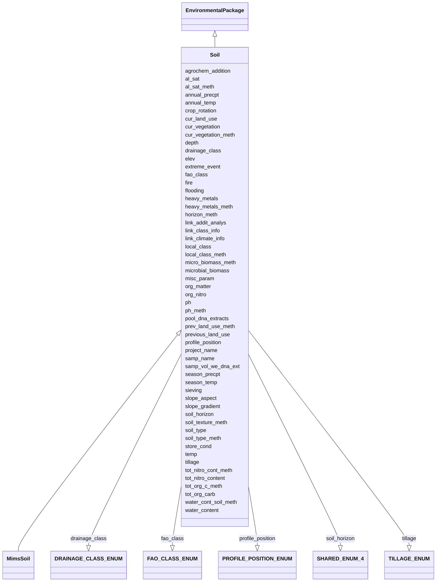

# Class: Soil


URI: [mixs_6_2_proposal:Soil](https://turbomam.github.io/mixs-envo-struct-knowl-extraction/Soil)





## Inheritance
* [EnvironmentalPackage](EnvironmentalPackage.md)
    * **Soil**
        * [MimsSoil](MimsSoil.md) [ [Mims](Mims.md)]


## Slots

| Name | Cardinality and Range | Description | Inheritance |
| ---  | --- | --- | --- |
| [samp_name](samp_name.md) | 1..1 <br/> [String](String.md) | A local identifier or name that for the material sample used for extracting n... | direct |
| [project_name](project_name.md) | 1..1 <br/> [String](String.md) | Name of the project within which the sequencing was organized | direct |
| [depth](depth.md) | 1..1 <br/> [String](String.md) | The vertical distance below local surface | direct |
| [elev](elev.md) | 1..1 <br/> [String](String.md) | Elevation of the sampling site is its height above a fixed reference point, m... | direct |
| [cur_land_use](cur_land_use.md) | 0..1 <br/> [String](String.md) | Present state of sample site | direct |
| [cur_vegetation](cur_vegetation.md) | 0..1 <br/> [String](String.md) | Vegetation classification from one or more standard classification systems, o... | direct |
| [cur_vegetation_meth](cur_vegetation_meth.md) | 0..1 <br/> [String](String.md) | Reference or method used in vegetation classification | direct |
| [previous_land_use](previous_land_use.md) | 0..1 <br/> [String](String.md) | Previous land use and dates | direct |
| [prev_land_use_meth](prev_land_use_meth.md) | 0..1 <br/> [String](String.md) | Reference or method used in determining previous land use and dates | direct |
| [crop_rotation](crop_rotation.md) | 0..1 <br/> [String](String.md) | Whether or not crop is rotated, and if yes, rotation schedule | direct |
| [agrochem_addition](agrochem_addition.md) | 0..* <br/> [String](String.md) | Addition of fertilizers, pesticides, etc | direct |
| [tillage](tillage.md) | 0..* <br/> [TILLAGEENUM](TILLAGEENUM.md) | Note method(s) used for tilling | direct |
| [fire](fire.md) | 0..1 <br/> [Datetime](Datetime.md) | Historical and/or physical evidence of fire | direct |
| [flooding](flooding.md) | 0..1 <br/> [Datetime](Datetime.md) | Historical and/or physical evidence of flooding | direct |
| [extreme_event](extreme_event.md) | 0..1 <br/> [Datetime](Datetime.md) | Unusual physical events that may have affected microbial populations | direct |
| [soil_horizon](soil_horizon.md) | 0..1 <br/> [SHAREDENUM4](SHAREDENUM4.md) | Specific layer in the land area which measures parallel to the soil surface a... | direct |
| [horizon_meth](horizon_meth.md) | 0..1 <br/> [String](String.md) | Reference or method used in determining the horizon | direct |
| [sieving](sieving.md) | 0..1 <br/> [String](String.md) | Collection design of pooled samples and/or sieve size and amount of sample si... | direct |
| [water_content](water_content.md) | 0..1 <br/> [String](String.md) | Water content measurement | direct |
| [water_cont_soil_meth](water_cont_soil_meth.md) | 0..1 <br/> [String](String.md) | Reference or method used in determining the water content of soil | direct |
| [samp_vol_we_dna_ext](samp_vol_we_dna_ext.md) | 0..1 <br/> [String](String.md) | Volume (ml) or mass (g) of total collected sample processed for DNA extractio... | direct |
| [pool_dna_extracts](pool_dna_extracts.md) | 0..1 <br/> [String](String.md) | Indicate whether multiple DNA extractions were mixed | direct |
| [store_cond](store_cond.md) | 0..1 <br/> [String](String.md) | Explain how and for how long the soil sample was stored before DNA extraction... | direct |
| [link_climate_info](link_climate_info.md) | 0..1 <br/> [String](String.md) | Link to climate resource | direct |
| [annual_temp](annual_temp.md) | 0..1 <br/> [String](String.md) | Mean annual temperature | direct |
| [season_temp](season_temp.md) | 0..1 <br/> [String](String.md) | Mean seasonal temperature | direct |
| [annual_precpt](annual_precpt.md) | 0..1 <br/> [String](String.md) | The average of all annual precipitation values known, or an estimated equival... | direct |
| [season_precpt](season_precpt.md) | 0..1 <br/> [String](String.md) | The average of all seasonal precipitation values known, or an estimated equiv... | direct |
| [link_class_info](link_class_info.md) | 0..1 <br/> [String](String.md) | Link to digitized soil maps or other soil classification information | direct |
| [fao_class](fao_class.md) | 0..1 <br/> [FAOCLASSENUM](FAOCLASSENUM.md) | Soil classification from the FAO World Reference Database for Soil Resources | direct |
| [local_class](local_class.md) | 0..1 <br/> [String](String.md) | Soil classification based on local soil classification system | direct |
| [local_class_meth](local_class_meth.md) | 0..1 <br/> [String](String.md) | Reference or method used in determining the local soil classification | direct |
| [org_nitro](org_nitro.md) | 0..1 <br/> [String](String.md) | Concentration of organic nitrogen | direct |
| [temp](temp.md) | 0..1 <br/> [String](String.md) | Temperature of the sample at the time of sampling | direct |
| [soil_type](soil_type.md) | 0..1 <br/> [String](String.md) | Description of the soil type or classification | direct |
| [soil_type_meth](soil_type_meth.md) | 0..1 <br/> [String](String.md) | Reference or method used in determining soil series name or other lower-level... | direct |
| [slope_gradient](slope_gradient.md) | 0..1 <br/> [String](String.md) | Commonly called 'slope' | direct |
| [slope_aspect](slope_aspect.md) | 0..1 <br/> [String](String.md) | The direction a slope faces | direct |
| [profile_position](profile_position.md) | 0..1 <br/> [PROFILEPOSITIONENUM](PROFILEPOSITIONENUM.md) | Cross-sectional position in the hillslope where sample was collected | direct |
| [drainage_class](drainage_class.md) | 0..1 <br/> [DRAINAGECLASSENUM](DRAINAGECLASSENUM.md) | Drainage classification from a standard system such as the USDA system | direct |
| [soil_texture_meth](soil_texture_meth.md) | 0..1 <br/> [String](String.md) | Reference or method used in determining soil texture | direct |
| [ph](ph.md) | 0..1 <br/> [Float](Float.md) | Ph measurement of the sample, or liquid portion of sample, or aqueous phase o... | direct |
| [ph_meth](ph_meth.md) | 0..1 <br/> [String](String.md) | Reference or method used in determining ph | direct |
| [org_matter](org_matter.md) | 0..1 <br/> [String](String.md) | Concentration of organic matter | direct |
| [tot_org_carb](tot_org_carb.md) | 0..1 <br/> [String](String.md) | Definition for soil: total organic carbon content of the soil, definition oth... | direct |
| [tot_org_c_meth](tot_org_c_meth.md) | 0..1 <br/> [String](String.md) | Reference or method used in determining total organic carbon | direct |
| [tot_nitro_content](tot_nitro_content.md) | 0..1 <br/> [String](String.md) | Total nitrogen content of the sample | direct |
| [tot_nitro_cont_meth](tot_nitro_cont_meth.md) | 0..1 <br/> [String](String.md) | Reference or method used in determining the total nitrogen | direct |
| [microbial_biomass](microbial_biomass.md) | 0..1 <br/> [String](String.md) | The part of the organic matter in the soil that constitutes living microorgan... | direct |
| [micro_biomass_meth](micro_biomass_meth.md) | 0..1 <br/> [String](String.md) | Reference or method used in determining microbial biomass | direct |
| [link_addit_analys](link_addit_analys.md) | 0..1 <br/> [String](String.md) | Link to additional analysis results performed on the sample | direct |
| [heavy_metals](heavy_metals.md) | 0..* <br/> [String](String.md) | Heavy metals present in the sequenced sample and their concentrations | direct |
| [heavy_metals_meth](heavy_metals_meth.md) | 0..1 <br/> [String](String.md) | Reference or method used in determining heavy metals | direct |
| [al_sat](al_sat.md) | 0..1 <br/> [String](String.md) | Aluminum saturation (esp | direct |
| [al_sat_meth](al_sat_meth.md) | 0..1 <br/> [String](String.md) | Reference or method used in determining Al saturation | direct |
| [misc_param](misc_param.md) | 0..* <br/> [String](String.md) | Any other measurement performed or parameter collected, that is not listed he... | direct |


## Identifier and Mapping Information


### Schema Source


* from schema: https://turbomam.github.io/mixs-envo-struct-knowl-extraction//mixs_6_2_proposal


## Mappings

| Mapping Type | Mapped Value |
| ---  | ---  |
| self | mixs_6_2_proposal:Soil |
| native | mixs_6_2_proposal:Soil |


## LinkML Source

<!-- TODO: investigate https://stackoverflow.com/questions/37606292/how-to-create-tabbed-code-blocks-in-mkdocs-or-sphinx -->

### Direct

<details>
```yaml
name: Soil
title: Soil
from_schema: https://turbomam.github.io/mixs-envo-struct-knowl-extraction//mixs_6_2_proposal
is_a: EnvironmentalPackage
mixin: false
slots:
- samp_name
- project_name
- depth
- elev
- cur_land_use
- cur_vegetation
- cur_vegetation_meth
- previous_land_use
- prev_land_use_meth
- crop_rotation
- agrochem_addition
- tillage
- fire
- flooding
- extreme_event
- soil_horizon
- horizon_meth
- sieving
- water_content
- water_cont_soil_meth
- samp_vol_we_dna_ext
- pool_dna_extracts
- store_cond
- link_climate_info
- annual_temp
- season_temp
- annual_precpt
- season_precpt
- link_class_info
- fao_class
- local_class
- local_class_meth
- org_nitro
- temp
- soil_type
- soil_type_meth
- slope_gradient
- slope_aspect
- profile_position
- drainage_class
- soil_texture_meth
- ph
- ph_meth
- org_matter
- tot_org_carb
- tot_org_c_meth
- tot_nitro_content
- tot_nitro_cont_meth
- microbial_biomass
- micro_biomass_meth
- link_addit_analys
- heavy_metals
- heavy_metals_meth
- al_sat
- al_sat_meth
- misc_param
slot_usage:
  crop_rotation:
    name: crop_rotation
    string_serialization: '{boolean};{Rn/start_time/end_time/duration}'
    domain_of:
    - Agriculture
    - FoodFarmEnvironment
    - Soil
    required: false
    recommended: false
  cur_vegetation:
    name: cur_vegetation
    domain_of:
    - Agriculture
    - Soil
    required: false
    recommended: false
  cur_vegetation_meth:
    name: cur_vegetation_meth
    string_serialization: '{PMID}|{DOI}|{URL}'
    domain_of:
    - Agriculture
    - Soil
    required: false
    recommended: false
  depth:
    name: depth
    title: depth
    examples:
    - value: 10 meter
    domain_of:
    - Agriculture
    - FoodFarmEnvironment
    - HostAssociated
    - MicrobialMatBiofilm
    - MigsBa
    - MigsEu
    - MigsOrg
    - MigsPl
    - MigsVi
    - Mimag
    - MimarksC
    - MimarksS
    - Mims
    - Misag
    - MiscellaneousNaturalOrArtificialEnvironment
    - Miuvig
    - PlantAssociated
    - Sediment
    - Soil
    - SymbiontAssociated
    - WastewaterSludge
    - Water
    required: true
  drainage_class:
    name: drainage_class
    domain_of:
    - Agriculture
    - Soil
    required: false
    recommended: false
  elev:
    name: elev
    domain_of:
    - Agriculture
    - Air
    - HostAssociated
    - HydrocarbonResourcesCores
    - MicrobialMatBiofilm
    - MigsBa
    - MigsEu
    - MigsOrg
    - MigsPl
    - MigsVi
    - Mimag
    - MimarksC
    - MimarksS
    - Mims
    - Misag
    - MiscellaneousNaturalOrArtificialEnvironment
    - Miuvig
    - PlantAssociated
    - Sediment
    - Soil
    - SymbiontAssociated
    - Water
    required: true
  extreme_event:
    name: extreme_event
    domain_of:
    - Agriculture
    - Soil
    required: false
    recommended: false
  fao_class:
    name: fao_class
    string_serialization: '[Acrisols|Andosols|Arenosols|Cambisols|Chernozems|Ferralsols|Fluvisols|Gleysols|Greyzems|Gypsisols|Histosols|Kastanozems|Lithosols|Luvisols|Nitosols|Phaeozems|Planosols|Podzols|Podzoluvisols|Rankers|Regosols|Rendzinas|Solonchaks|Solonetz|Vertisols|Yermosols]'
    domain_of:
    - Agriculture
    - Soil
    required: false
    recommended: false
  fire:
    name: fire
    domain_of:
    - Agriculture
    - Soil
    required: false
    recommended: false
  flooding:
    name: flooding
    domain_of:
    - Agriculture
    - Soil
    required: false
    recommended: false
  heavy_metals_meth:
    name: heavy_metals_meth
    string_serialization: '{PMID}|{DOI}|{URL}'
    domain_of:
    - Agriculture
    - Soil
    required: false
    recommended: false
  horizon_meth:
    name: horizon_meth
    string_serialization: '{PMID}|{DOI}|{URL}'
    domain_of:
    - Agriculture
    - Soil
    required: false
    recommended: false
  link_class_info:
    name: link_class_info
    string_serialization: '{PMID}|{DOI}|{URL}'
    domain_of:
    - Agriculture
    - Soil
  link_climate_info:
    name: link_climate_info
    string_serialization: '{PMID}|{DOI}|{URL}'
    domain_of:
    - Agriculture
    - Soil
  local_class:
    name: local_class
    domain_of:
    - Agriculture
    - Soil
    required: false
    recommended: false
  local_class_meth:
    name: local_class_meth
    string_serialization: '{PMID}|{DOI}|{URL}'
    domain_of:
    - Agriculture
    - Soil
    required: false
    recommended: false
  micro_biomass_meth:
    name: micro_biomass_meth
    string_serialization: '{PMID}|{DOI}|{URL}'
    domain_of:
    - Agriculture
    - Soil
    required: false
    recommended: false
  microbial_biomass:
    name: microbial_biomass
    domain_of:
    - Agriculture
    - Soil
    required: false
    recommended: false
  misc_param:
    name: misc_param
    domain_of:
    - Agriculture
    - Air
    - FoodAnimalAndAnimalFeed
    - FoodFarmEnvironment
    - FoodFoodProductionFacility
    - FoodHumanFoods
    - HostAssociated
    - HumanAssociated
    - HumanGut
    - HumanOral
    - HumanSkin
    - HumanVaginal
    - HydrocarbonResourcesCores
    - HydrocarbonResourcesFluidsSwabs
    - MicrobialMatBiofilm
    - MiscellaneousNaturalOrArtificialEnvironment
    - PlantAssociated
    - Sediment
    - Soil
    - SymbiontAssociated
    - WastewaterSludge
    - Water
  org_matter:
    name: org_matter
    domain_of:
    - MicrobialMatBiofilm
    - MiscellaneousNaturalOrArtificialEnvironment
    - Sediment
    - Soil
    - Water
  org_nitro:
    name: org_nitro
    domain_of:
    - MicrobialMatBiofilm
    - MiscellaneousNaturalOrArtificialEnvironment
    - Sediment
    - Soil
    - Water
  ph:
    name: ph
    description: Ph measurement of the sample, or liquid portion of sample, or aqueous
      phase of the fluid
    domain_of:
    - FoodFarmEnvironment
    - HydrocarbonResourcesCores
    - HydrocarbonResourcesFluidsSwabs
    - MicrobialMatBiofilm
    - MiscellaneousNaturalOrArtificialEnvironment
    - Sediment
    - Soil
    - WastewaterSludge
    - Water
    required: false
    recommended: false
  ph_meth:
    name: ph_meth
    description: Reference or method used in determining ph
    string_serialization: '{PMID}|{DOI}|{URL}'
    domain_of:
    - Agriculture
    - FoodFarmEnvironment
    - Soil
    required: false
    recommended: false
  pool_dna_extracts:
    name: pool_dna_extracts
    examples:
    - value: yes;5
    string_serialization: '{boolean};{integer}'
    multivalued: false
    domain_of:
    - Agriculture
    - FoodAnimalAndAnimalFeed
    - FoodFoodProductionFacility
    - FoodHumanFoods
    - Soil
    required: false
    recommended: false
  prev_land_use_meth:
    name: prev_land_use_meth
    string_serialization: '{PMID}|{DOI}|{URL}'
    domain_of:
    - Agriculture
    - Soil
    required: false
    recommended: false
  previous_land_use:
    name: previous_land_use
    domain_of:
    - Agriculture
    - FoodFarmEnvironment
    - Soil
    required: false
    recommended: false
  profile_position:
    name: profile_position
    domain_of:
    - Agriculture
    - Soil
    required: false
    recommended: false
  samp_vol_we_dna_ext:
    name: samp_vol_we_dna_ext
    description: 'Volume (ml) or mass (g) of total collected sample processed for
      DNA extraction. Note: total sample collected should be entered under the term
      Sample Size (MIXS:0000001).'
    domain_of:
    - Agriculture
    - Air
    - FoodAnimalAndAnimalFeed
    - FoodFarmEnvironment
    - FoodFoodProductionFacility
    - FoodHumanFoods
    - HostAssociated
    - HumanAssociated
    - HumanGut
    - HumanOral
    - HumanSkin
    - HumanVaginal
    - HydrocarbonResourcesCores
    - HydrocarbonResourcesFluidsSwabs
    - MicrobialMatBiofilm
    - MigsBa
    - MigsEu
    - MigsOrg
    - MigsPl
    - MigsVi
    - Mimag
    - MimarksC
    - MimarksS
    - Mims
    - Misag
    - MiscellaneousNaturalOrArtificialEnvironment
    - Miuvig
    - PlantAssociated
    - Sediment
    - Soil
    - SymbiontAssociated
    - WastewaterSludge
    - Water
    required: false
    recommended: false
  season_precpt:
    name: season_precpt
    multivalued: false
    domain_of:
    - Agriculture
    - FoodFarmEnvironment
    - Soil
  sieving:
    name: sieving
    domain_of:
    - Agriculture
    - Soil
    required: false
    recommended: false
  slope_aspect:
    name: slope_aspect
    domain_of:
    - Agriculture
    - Soil
    required: false
    recommended: false
  slope_gradient:
    name: slope_gradient
    domain_of:
    - Agriculture
    - Soil
    required: false
    recommended: false
  soil_horizon:
    name: soil_horizon
    description: Specific layer in the land area which measures parallel to the soil
      surface and possesses physical characteristics which differ from the layers
      above and beneath
    examples:
    - value: A horizon
    string_serialization: '[O horizon|A horizon|E horizon|B horizon|C horizon|R layer|Permafrost]'
    slot_uri: MIXS:0001082
    domain_of:
    - Agriculture
    - Soil
    required: false
    recommended: false
  soil_texture_meth:
    name: soil_texture_meth
    description: Reference or method used in determining soil texture
    title: soil texture method
    domain_of:
    - Agriculture
    - FoodFarmEnvironment
    - Soil
  soil_type:
    name: soil_type
    description: Description of the soil type or classification. This field accepts
      terms under soil (http://purl.obolibrary.org/obo/ENVO_00001998).  Multiple terms
      can be separated by pipes.
    string_serialization: '{termLabel} [{termID}]

      '
    multivalued: false
    domain_of:
    - Agriculture
    - FoodFarmEnvironment
    - Soil
    required: false
    recommended: false
  soil_type_meth:
    name: soil_type_meth
    string_serialization: '{PMID}|{DOI}|{URL}'
    domain_of:
    - Agriculture
    - FoodFarmEnvironment
    - Soil
    required: false
    recommended: false
  store_cond:
    name: store_cond
    domain_of:
    - Agriculture
    - Soil
    required: false
    recommended: false
  temp:
    name: temp
    domain_of:
    - Agriculture
    - Air
    - FoodAnimalAndAnimalFeed
    - FoodFarmEnvironment
    - FoodHumanFoods
    - HostAssociated
    - HumanAssociated
    - HumanGut
    - HumanOral
    - HumanSkin
    - HumanVaginal
    - HydrocarbonResourcesCores
    - HydrocarbonResourcesFluidsSwabs
    - MicrobialMatBiofilm
    - MigsBa
    - MigsEu
    - MigsOrg
    - MigsPl
    - MigsVi
    - Mimag
    - MimarksC
    - MimarksS
    - Mims
    - Misag
    - MiscellaneousNaturalOrArtificialEnvironment
    - Miuvig
    - PlantAssociated
    - Sediment
    - Soil
    - SymbiontAssociated
    - WastewaterSludge
    - Water
    required: false
    recommended: false
  tillage:
    name: tillage
    multivalued: true
    domain_of:
    - Agriculture
    - FoodFarmEnvironment
    - Soil
    required: false
    recommended: false
  tot_nitro_cont_meth:
    name: tot_nitro_cont_meth
    string_serialization: '{PMID}|{DOI}|{URL}'
    domain_of:
    - Agriculture
    - FoodFarmEnvironment
    - Soil
    required: false
    recommended: false
  tot_nitro_content:
    name: tot_nitro_content
    multivalued: false
    domain_of:
    - Agriculture
    - FoodFarmEnvironment
    - MicrobialMatBiofilm
    - Sediment
    - Soil
    required: false
    recommended: false
  tot_org_c_meth:
    name: tot_org_c_meth
    string_serialization: '{PMID}|{DOI}|{URL}'
    domain_of:
    - Agriculture
    - FoodFarmEnvironment
    - Soil
    required: false
    recommended: false
  tot_org_carb:
    name: tot_org_carb
    string_serialization: '{float} {unit}'
    domain_of:
    - Agriculture
    - FoodFarmEnvironment
    - MicrobialMatBiofilm
    - Sediment
    - Soil
    required: false
    recommended: false
  water_content:
    name: water_content
    string_serialization: '{float}'
    domain_of:
    - MicrobialMatBiofilm
    - Sediment
    - Soil

```
</details>

### Induced

<details>
```yaml
name: Soil
title: Soil
from_schema: https://turbomam.github.io/mixs-envo-struct-knowl-extraction//mixs_6_2_proposal
is_a: EnvironmentalPackage
mixin: false
slot_usage:
  crop_rotation:
    name: crop_rotation
    string_serialization: '{boolean};{Rn/start_time/end_time/duration}'
    domain_of:
    - Agriculture
    - FoodFarmEnvironment
    - Soil
    required: false
    recommended: false
  cur_vegetation:
    name: cur_vegetation
    domain_of:
    - Agriculture
    - Soil
    required: false
    recommended: false
  cur_vegetation_meth:
    name: cur_vegetation_meth
    string_serialization: '{PMID}|{DOI}|{URL}'
    domain_of:
    - Agriculture
    - Soil
    required: false
    recommended: false
  depth:
    name: depth
    title: depth
    examples:
    - value: 10 meter
    domain_of:
    - Agriculture
    - FoodFarmEnvironment
    - HostAssociated
    - MicrobialMatBiofilm
    - MigsBa
    - MigsEu
    - MigsOrg
    - MigsPl
    - MigsVi
    - Mimag
    - MimarksC
    - MimarksS
    - Mims
    - Misag
    - MiscellaneousNaturalOrArtificialEnvironment
    - Miuvig
    - PlantAssociated
    - Sediment
    - Soil
    - SymbiontAssociated
    - WastewaterSludge
    - Water
    required: true
  drainage_class:
    name: drainage_class
    domain_of:
    - Agriculture
    - Soil
    required: false
    recommended: false
  elev:
    name: elev
    domain_of:
    - Agriculture
    - Air
    - HostAssociated
    - HydrocarbonResourcesCores
    - MicrobialMatBiofilm
    - MigsBa
    - MigsEu
    - MigsOrg
    - MigsPl
    - MigsVi
    - Mimag
    - MimarksC
    - MimarksS
    - Mims
    - Misag
    - MiscellaneousNaturalOrArtificialEnvironment
    - Miuvig
    - PlantAssociated
    - Sediment
    - Soil
    - SymbiontAssociated
    - Water
    required: true
  extreme_event:
    name: extreme_event
    domain_of:
    - Agriculture
    - Soil
    required: false
    recommended: false
  fao_class:
    name: fao_class
    string_serialization: '[Acrisols|Andosols|Arenosols|Cambisols|Chernozems|Ferralsols|Fluvisols|Gleysols|Greyzems|Gypsisols|Histosols|Kastanozems|Lithosols|Luvisols|Nitosols|Phaeozems|Planosols|Podzols|Podzoluvisols|Rankers|Regosols|Rendzinas|Solonchaks|Solonetz|Vertisols|Yermosols]'
    domain_of:
    - Agriculture
    - Soil
    required: false
    recommended: false
  fire:
    name: fire
    domain_of:
    - Agriculture
    - Soil
    required: false
    recommended: false
  flooding:
    name: flooding
    domain_of:
    - Agriculture
    - Soil
    required: false
    recommended: false
  heavy_metals_meth:
    name: heavy_metals_meth
    string_serialization: '{PMID}|{DOI}|{URL}'
    domain_of:
    - Agriculture
    - Soil
    required: false
    recommended: false
  horizon_meth:
    name: horizon_meth
    string_serialization: '{PMID}|{DOI}|{URL}'
    domain_of:
    - Agriculture
    - Soil
    required: false
    recommended: false
  link_class_info:
    name: link_class_info
    string_serialization: '{PMID}|{DOI}|{URL}'
    domain_of:
    - Agriculture
    - Soil
  link_climate_info:
    name: link_climate_info
    string_serialization: '{PMID}|{DOI}|{URL}'
    domain_of:
    - Agriculture
    - Soil
  local_class:
    name: local_class
    domain_of:
    - Agriculture
    - Soil
    required: false
    recommended: false
  local_class_meth:
    name: local_class_meth
    string_serialization: '{PMID}|{DOI}|{URL}'
    domain_of:
    - Agriculture
    - Soil
    required: false
    recommended: false
  micro_biomass_meth:
    name: micro_biomass_meth
    string_serialization: '{PMID}|{DOI}|{URL}'
    domain_of:
    - Agriculture
    - Soil
    required: false
    recommended: false
  microbial_biomass:
    name: microbial_biomass
    domain_of:
    - Agriculture
    - Soil
    required: false
    recommended: false
  misc_param:
    name: misc_param
    domain_of:
    - Agriculture
    - Air
    - FoodAnimalAndAnimalFeed
    - FoodFarmEnvironment
    - FoodFoodProductionFacility
    - FoodHumanFoods
    - HostAssociated
    - HumanAssociated
    - HumanGut
    - HumanOral
    - HumanSkin
    - HumanVaginal
    - HydrocarbonResourcesCores
    - HydrocarbonResourcesFluidsSwabs
    - MicrobialMatBiofilm
    - MiscellaneousNaturalOrArtificialEnvironment
    - PlantAssociated
    - Sediment
    - Soil
    - SymbiontAssociated
    - WastewaterSludge
    - Water
  org_matter:
    name: org_matter
    domain_of:
    - MicrobialMatBiofilm
    - MiscellaneousNaturalOrArtificialEnvironment
    - Sediment
    - Soil
    - Water
  org_nitro:
    name: org_nitro
    domain_of:
    - MicrobialMatBiofilm
    - MiscellaneousNaturalOrArtificialEnvironment
    - Sediment
    - Soil
    - Water
  ph:
    name: ph
    description: Ph measurement of the sample, or liquid portion of sample, or aqueous
      phase of the fluid
    domain_of:
    - FoodFarmEnvironment
    - HydrocarbonResourcesCores
    - HydrocarbonResourcesFluidsSwabs
    - MicrobialMatBiofilm
    - MiscellaneousNaturalOrArtificialEnvironment
    - Sediment
    - Soil
    - WastewaterSludge
    - Water
    required: false
    recommended: false
  ph_meth:
    name: ph_meth
    description: Reference or method used in determining ph
    string_serialization: '{PMID}|{DOI}|{URL}'
    domain_of:
    - Agriculture
    - FoodFarmEnvironment
    - Soil
    required: false
    recommended: false
  pool_dna_extracts:
    name: pool_dna_extracts
    examples:
    - value: yes;5
    string_serialization: '{boolean};{integer}'
    multivalued: false
    domain_of:
    - Agriculture
    - FoodAnimalAndAnimalFeed
    - FoodFoodProductionFacility
    - FoodHumanFoods
    - Soil
    required: false
    recommended: false
  prev_land_use_meth:
    name: prev_land_use_meth
    string_serialization: '{PMID}|{DOI}|{URL}'
    domain_of:
    - Agriculture
    - Soil
    required: false
    recommended: false
  previous_land_use:
    name: previous_land_use
    domain_of:
    - Agriculture
    - FoodFarmEnvironment
    - Soil
    required: false
    recommended: false
  profile_position:
    name: profile_position
    domain_of:
    - Agriculture
    - Soil
    required: false
    recommended: false
  samp_vol_we_dna_ext:
    name: samp_vol_we_dna_ext
    description: 'Volume (ml) or mass (g) of total collected sample processed for
      DNA extraction. Note: total sample collected should be entered under the term
      Sample Size (MIXS:0000001).'
    domain_of:
    - Agriculture
    - Air
    - FoodAnimalAndAnimalFeed
    - FoodFarmEnvironment
    - FoodFoodProductionFacility
    - FoodHumanFoods
    - HostAssociated
    - HumanAssociated
    - HumanGut
    - HumanOral
    - HumanSkin
    - HumanVaginal
    - HydrocarbonResourcesCores
    - HydrocarbonResourcesFluidsSwabs
    - MicrobialMatBiofilm
    - MigsBa
    - MigsEu
    - MigsOrg
    - MigsPl
    - MigsVi
    - Mimag
    - MimarksC
    - MimarksS
    - Mims
    - Misag
    - MiscellaneousNaturalOrArtificialEnvironment
    - Miuvig
    - PlantAssociated
    - Sediment
    - Soil
    - SymbiontAssociated
    - WastewaterSludge
    - Water
    required: false
    recommended: false
  season_precpt:
    name: season_precpt
    multivalued: false
    domain_of:
    - Agriculture
    - FoodFarmEnvironment
    - Soil
  sieving:
    name: sieving
    domain_of:
    - Agriculture
    - Soil
    required: false
    recommended: false
  slope_aspect:
    name: slope_aspect
    domain_of:
    - Agriculture
    - Soil
    required: false
    recommended: false
  slope_gradient:
    name: slope_gradient
    domain_of:
    - Agriculture
    - Soil
    required: false
    recommended: false
  soil_horizon:
    name: soil_horizon
    description: Specific layer in the land area which measures parallel to the soil
      surface and possesses physical characteristics which differ from the layers
      above and beneath
    examples:
    - value: A horizon
    string_serialization: '[O horizon|A horizon|E horizon|B horizon|C horizon|R layer|Permafrost]'
    slot_uri: MIXS:0001082
    domain_of:
    - Agriculture
    - Soil
    required: false
    recommended: false
  soil_texture_meth:
    name: soil_texture_meth
    description: Reference or method used in determining soil texture
    title: soil texture method
    domain_of:
    - Agriculture
    - FoodFarmEnvironment
    - Soil
  soil_type:
    name: soil_type
    description: Description of the soil type or classification. This field accepts
      terms under soil (http://purl.obolibrary.org/obo/ENVO_00001998).  Multiple terms
      can be separated by pipes.
    string_serialization: '{termLabel} [{termID}]

      '
    multivalued: false
    domain_of:
    - Agriculture
    - FoodFarmEnvironment
    - Soil
    required: false
    recommended: false
  soil_type_meth:
    name: soil_type_meth
    string_serialization: '{PMID}|{DOI}|{URL}'
    domain_of:
    - Agriculture
    - FoodFarmEnvironment
    - Soil
    required: false
    recommended: false
  store_cond:
    name: store_cond
    domain_of:
    - Agriculture
    - Soil
    required: false
    recommended: false
  temp:
    name: temp
    domain_of:
    - Agriculture
    - Air
    - FoodAnimalAndAnimalFeed
    - FoodFarmEnvironment
    - FoodHumanFoods
    - HostAssociated
    - HumanAssociated
    - HumanGut
    - HumanOral
    - HumanSkin
    - HumanVaginal
    - HydrocarbonResourcesCores
    - HydrocarbonResourcesFluidsSwabs
    - MicrobialMatBiofilm
    - MigsBa
    - MigsEu
    - MigsOrg
    - MigsPl
    - MigsVi
    - Mimag
    - MimarksC
    - MimarksS
    - Mims
    - Misag
    - MiscellaneousNaturalOrArtificialEnvironment
    - Miuvig
    - PlantAssociated
    - Sediment
    - Soil
    - SymbiontAssociated
    - WastewaterSludge
    - Water
    required: false
    recommended: false
  tillage:
    name: tillage
    multivalued: true
    domain_of:
    - Agriculture
    - FoodFarmEnvironment
    - Soil
    required: false
    recommended: false
  tot_nitro_cont_meth:
    name: tot_nitro_cont_meth
    string_serialization: '{PMID}|{DOI}|{URL}'
    domain_of:
    - Agriculture
    - FoodFarmEnvironment
    - Soil
    required: false
    recommended: false
  tot_nitro_content:
    name: tot_nitro_content
    multivalued: false
    domain_of:
    - Agriculture
    - FoodFarmEnvironment
    - MicrobialMatBiofilm
    - Sediment
    - Soil
    required: false
    recommended: false
  tot_org_c_meth:
    name: tot_org_c_meth
    string_serialization: '{PMID}|{DOI}|{URL}'
    domain_of:
    - Agriculture
    - FoodFarmEnvironment
    - Soil
    required: false
    recommended: false
  tot_org_carb:
    name: tot_org_carb
    string_serialization: '{float} {unit}'
    domain_of:
    - Agriculture
    - FoodFarmEnvironment
    - MicrobialMatBiofilm
    - Sediment
    - Soil
    required: false
    recommended: false
  water_content:
    name: water_content
    string_serialization: '{float}'
    domain_of:
    - MicrobialMatBiofilm
    - Sediment
    - Soil
attributes:
  samp_name:
    name: samp_name
    description: A local identifier or name that for the material sample used for
      extracting nucleic acids, and subsequent sequencing. It can refer either to
      the original material collected or to any derived sub-samples. It can have any
      format, but we suggest that you make it concise, unique and consistent within
      your lab, and as informative as possible. INSDC requires every sample name from
      a single Submitter to be unique. Use of a globally unique identifier for the
      field source_mat_id is recommended in addition to sample_name
    title: sample name
    notes:
    - sample
    examples:
    - value: ISDsoil1
    in_subset:
    - investigation
    from_schema: https://turbomam.github.io/mixs-envo-struct-knowl-extraction//mixs_6_2_proposal
    rank: 1000
    slot_uri: MIXS:0001107
    multivalued: false
    alias: samp_name
    owner: Soil
    domain_of:
    - Air
    - BuiltEnvironment
    - FoodAnimalAndAnimalFeed
    - FoodFarmEnvironment
    - FoodFoodProductionFacility
    - FoodHumanFoods
    - HostAssociated
    - HumanAssociated
    - HumanGut
    - HumanOral
    - HumanSkin
    - HumanVaginal
    - HydrocarbonResourcesCores
    - HydrocarbonResourcesFluidsSwabs
    - MicrobialMatBiofilm
    - MigsBa
    - MigsEu
    - MigsOrg
    - MigsPl
    - MigsVi
    - Mimag
    - MimarksC
    - MimarksS
    - Mims
    - Misag
    - MiscellaneousNaturalOrArtificialEnvironment
    - Miuvig
    - PlantAssociated
    - Sediment
    - Soil
    - SymbiontAssociated
    - WastewaterSludge
    - Water
    range: string
    required: true
  project_name:
    name: project_name
    description: Name of the project within which the sequencing was organized
    title: project name
    notes:
    - project
    examples:
    - value: Forest soil metagenome
    in_subset:
    - investigation
    from_schema: https://turbomam.github.io/mixs-envo-struct-knowl-extraction//mixs_6_2_proposal
    rank: 1000
    slot_uri: MIXS:0000092
    multivalued: false
    alias: project_name
    owner: Soil
    domain_of:
    - Air
    - BuiltEnvironment
    - FoodAnimalAndAnimalFeed
    - FoodFarmEnvironment
    - FoodFoodProductionFacility
    - FoodHumanFoods
    - HostAssociated
    - HumanAssociated
    - HumanGut
    - HumanOral
    - HumanSkin
    - HumanVaginal
    - HydrocarbonResourcesCores
    - HydrocarbonResourcesFluidsSwabs
    - MicrobialMatBiofilm
    - MigsBa
    - MigsEu
    - MigsOrg
    - MigsPl
    - MigsVi
    - Mimag
    - MimarksC
    - MimarksS
    - Mims
    - Misag
    - MiscellaneousNaturalOrArtificialEnvironment
    - Miuvig
    - PlantAssociated
    - Sediment
    - Soil
    - SymbiontAssociated
    - WastewaterSludge
    - Water
    range: string
    required: true
  depth:
    name: depth
    description: The vertical distance below local surface. For sediment or soil samples
      depth is measured from sediment or soil surface, respectively. Depth can be
      reported as an interval for subsurface samples
    title: depth
    examples:
    - value: 10 meter
    from_schema: https://turbomam.github.io/mixs-envo-struct-knowl-extraction//mixs_6_2_proposal
    rank: 1000
    slot_uri: MIXS:0000018
    multivalued: false
    alias: depth
    owner: Soil
    domain_of:
    - Agriculture
    - FoodFarmEnvironment
    - HostAssociated
    - MicrobialMatBiofilm
    - MigsBa
    - MigsEu
    - MigsOrg
    - MigsPl
    - MigsVi
    - Mimag
    - MimarksC
    - MimarksS
    - Mims
    - Misag
    - MiscellaneousNaturalOrArtificialEnvironment
    - Miuvig
    - PlantAssociated
    - Sediment
    - Soil
    - SymbiontAssociated
    - WastewaterSludge
    - Water
    range: string
    required: true
    pattern: ^[-+]?[0-9]*\.?[0-9]+([eE][-+]?[0-9]+)? \S.*\S$
  elev:
    name: elev
    description: Elevation of the sampling site is its height above a fixed reference
      point, most commonly the mean sea level. Elevation is mainly used when referring
      to points on the earth's surface, while altitude is used for points above the
      surface, such as an aircraft in flight or a spacecraft in orbit
    title: elevation
    from_schema: https://turbomam.github.io/mixs-envo-struct-knowl-extraction//mixs_6_2_proposal
    rank: 1000
    slot_uri: MIXS:0000093
    multivalued: false
    alias: elev
    owner: Soil
    domain_of:
    - Agriculture
    - Air
    - HostAssociated
    - HydrocarbonResourcesCores
    - MicrobialMatBiofilm
    - MigsBa
    - MigsEu
    - MigsOrg
    - MigsPl
    - MigsVi
    - Mimag
    - MimarksC
    - MimarksS
    - Mims
    - Misag
    - MiscellaneousNaturalOrArtificialEnvironment
    - Miuvig
    - PlantAssociated
    - Sediment
    - Soil
    - SymbiontAssociated
    - Water
    range: string
    required: true
    pattern: ^[-+]?[0-9]*\.?[0-9]+([eE][-+]?[0-9]+)? \S.*\S$
  cur_land_use:
    name: cur_land_use
    annotations:
      Expected_value:
        tag: Expected_value
        value: enumeration
    description: Present state of sample site
    title: current land use
    notes:
    - land
    - use
    examples:
    - value: conifers
    from_schema: https://turbomam.github.io/mixs-envo-struct-knowl-extraction//mixs_6_2_proposal
    rank: 1000
    string_serialization: '[cities|farmstead|industrial areas|roads/railroads|rock|sand|gravel|mudflats|salt
      flats|badlands|permanent snow or ice|saline seeps|mines/quarries|oil waste areas|small
      grains|row crops|vegetable crops|horticultural plants (e.g. tulips)|marshlands
      (grass,sedges,rushes)|tundra (mosses,lichens)|rangeland|pastureland (grasslands
      used for livestock grazing)|hayland|meadows (grasses,alfalfa,fescue,bromegrass,timothy)|shrub
      land (e.g. mesquite,sage-brush,creosote bush,shrub oak,eucalyptus)|successional
      shrub land (tree saplings,hazels,sumacs,chokecherry,shrub dogwoods,blackberries)|shrub
      crops (blueberries,nursery ornamentals,filberts)|vine crops (grapes)|conifers
      (e.g. pine,spruce,fir,cypress)|hardwoods (e.g. oak,hickory,elm,aspen)|intermixed
      hardwood and conifers|tropical (e.g. mangrove,palms)|rainforest (evergreen forest
      receiving >406 cm annual rainfall)|swamp (permanent or semi-permanent water
      body dominated by woody plants)|crop trees (nuts,fruit,christmas trees,nursery
      trees)]'
    slot_uri: MIXS:0001080
    multivalued: false
    alias: cur_land_use
    owner: Soil
    domain_of:
    - Agriculture
    - Soil
    range: string
    required: false
    recommended: false
  cur_vegetation:
    name: cur_vegetation
    description: Vegetation classification from one or more standard classification
      systems, or agricultural crop
    title: current vegetation
    from_schema: https://turbomam.github.io/mixs-envo-struct-knowl-extraction//mixs_6_2_proposal
    rank: 1000
    string_serialization: '{text}'
    slot_uri: MIXS:0000312
    multivalued: false
    alias: cur_vegetation
    owner: Soil
    domain_of:
    - Agriculture
    - Soil
    range: string
    required: false
    recommended: false
  cur_vegetation_meth:
    name: cur_vegetation_meth
    description: Reference or method used in vegetation classification
    title: current vegetation method
    from_schema: https://turbomam.github.io/mixs-envo-struct-knowl-extraction//mixs_6_2_proposal
    rank: 1000
    string_serialization: '{PMID}|{DOI}|{URL}'
    slot_uri: MIXS:0000314
    multivalued: false
    alias: cur_vegetation_meth
    owner: Soil
    domain_of:
    - Agriculture
    - Soil
    range: string
    required: false
    recommended: false
    structured_pattern:
      syntax: '{PMID}|{DOI}|{URL}'
      interpolated: true
      partial_match: true
  previous_land_use:
    name: previous_land_use
    description: Previous land use and dates
    title: history/previous land use
    from_schema: https://turbomam.github.io/mixs-envo-struct-knowl-extraction//mixs_6_2_proposal
    rank: 1000
    string_serialization: '{text};{timestamp}'
    slot_uri: MIXS:0000315
    multivalued: false
    alias: previous_land_use
    owner: Soil
    domain_of:
    - Agriculture
    - FoodFarmEnvironment
    - Soil
    range: string
    required: false
    recommended: false
  prev_land_use_meth:
    name: prev_land_use_meth
    description: Reference or method used in determining previous land use and dates
    title: history/previous land use method
    from_schema: https://turbomam.github.io/mixs-envo-struct-knowl-extraction//mixs_6_2_proposal
    rank: 1000
    string_serialization: '{PMID}|{DOI}|{URL}'
    slot_uri: MIXS:0000316
    multivalued: false
    alias: prev_land_use_meth
    owner: Soil
    domain_of:
    - Agriculture
    - Soil
    range: string
    required: false
    recommended: false
    structured_pattern:
      syntax: '{PMID}|{DOI}|{URL}'
      interpolated: true
      partial_match: true
  crop_rotation:
    name: crop_rotation
    description: Whether or not crop is rotated, and if yes, rotation schedule
    title: history/crop rotation
    from_schema: https://turbomam.github.io/mixs-envo-struct-knowl-extraction//mixs_6_2_proposal
    rank: 1000
    string_serialization: '{boolean};{Rn/start_time/end_time/duration}'
    slot_uri: MIXS:0000318
    multivalued: false
    alias: crop_rotation
    owner: Soil
    domain_of:
    - Agriculture
    - FoodFarmEnvironment
    - Soil
    range: string
    required: false
    recommended: false
    structured_pattern:
      syntax: '{crop_rotation_status};{schedule}'
      interpolated: true
      partial_match: true
  agrochem_addition:
    name: agrochem_addition
    annotations:
      Expected_value:
        tag: Expected_value
        value: agrochemical name;agrochemical amount;timestamp
      Preferred_unit:
        tag: Preferred_unit
        value: gram, mole per liter, milligram per liter
    description: Addition of fertilizers, pesticides, etc. - amount and time of applications
    title: history/agrochemical additions
    notes:
    - history
    examples:
    - value: roundup;5 milligram per liter;2018-06-21
    from_schema: https://turbomam.github.io/mixs-envo-struct-knowl-extraction//mixs_6_2_proposal
    rank: 1000
    string_serialization: '{text};{float} {unit};{timestamp}'
    slot_uri: MIXS:0000639
    multivalued: true
    alias: agrochem_addition
    owner: Soil
    domain_of:
    - Agriculture
    - Soil
    range: string
    required: false
    recommended: false
  tillage:
    name: tillage
    description: Note method(s) used for tilling
    title: history/tillage
    from_schema: https://turbomam.github.io/mixs-envo-struct-knowl-extraction//mixs_6_2_proposal
    rank: 1000
    slot_uri: MIXS:0001081
    multivalued: true
    alias: tillage
    owner: Soil
    domain_of:
    - Agriculture
    - FoodFarmEnvironment
    - Soil
    range: TILLAGE_ENUM
    required: false
    recommended: false
  fire:
    name: fire
    description: Historical and/or physical evidence of fire
    title: history/fire
    from_schema: https://turbomam.github.io/mixs-envo-struct-knowl-extraction//mixs_6_2_proposal
    rank: 1000
    slot_uri: MIXS:0001086
    multivalued: false
    alias: fire
    owner: Soil
    domain_of:
    - Agriculture
    - Soil
    range: datetime
    required: false
    recommended: false
  flooding:
    name: flooding
    description: Historical and/or physical evidence of flooding
    title: history/flooding
    from_schema: https://turbomam.github.io/mixs-envo-struct-knowl-extraction//mixs_6_2_proposal
    rank: 1000
    slot_uri: MIXS:0000319
    multivalued: false
    alias: flooding
    owner: Soil
    domain_of:
    - Agriculture
    - Soil
    range: datetime
    required: false
    recommended: false
  extreme_event:
    name: extreme_event
    description: Unusual physical events that may have affected microbial populations
    title: history/extreme events
    from_schema: https://turbomam.github.io/mixs-envo-struct-knowl-extraction//mixs_6_2_proposal
    rank: 1000
    slot_uri: MIXS:0000320
    multivalued: false
    alias: extreme_event
    owner: Soil
    domain_of:
    - Agriculture
    - Soil
    range: datetime
    required: false
    recommended: false
  soil_horizon:
    name: soil_horizon
    description: Specific layer in the land area which measures parallel to the soil
      surface and possesses physical characteristics which differ from the layers
      above and beneath
    title: soil horizon
    examples:
    - value: A horizon
    from_schema: https://turbomam.github.io/mixs-envo-struct-knowl-extraction//mixs_6_2_proposal
    rank: 1000
    string_serialization: '[O horizon|A horizon|E horizon|B horizon|C horizon|R layer|Permafrost]'
    slot_uri: MIXS:0001082
    multivalued: false
    alias: soil_horizon
    owner: Soil
    domain_of:
    - Agriculture
    - Soil
    range: SHARED_ENUM_4
    required: false
    recommended: false
  horizon_meth:
    name: horizon_meth
    description: Reference or method used in determining the horizon
    title: soil horizon method
    from_schema: https://turbomam.github.io/mixs-envo-struct-knowl-extraction//mixs_6_2_proposal
    rank: 1000
    string_serialization: '{PMID}|{DOI}|{URL}'
    slot_uri: MIXS:0000321
    multivalued: false
    alias: horizon_meth
    owner: Soil
    domain_of:
    - Agriculture
    - Soil
    range: string
    required: false
    recommended: false
    structured_pattern:
      syntax: '{PMID}|{DOI}|{URL}'
      interpolated: true
      partial_match: true
  sieving:
    name: sieving
    description: Collection design of pooled samples and/or sieve size and amount
      of sample sieved
    title: composite design/sieving
    from_schema: https://turbomam.github.io/mixs-envo-struct-knowl-extraction//mixs_6_2_proposal
    rank: 1000
    string_serialization: '{text};{float} {unit}'
    slot_uri: MIXS:0000322
    multivalued: false
    alias: sieving
    owner: Soil
    domain_of:
    - Agriculture
    - Soil
    range: string
    required: false
    recommended: false
  water_content:
    name: water_content
    description: Water content measurement
    title: water content
    from_schema: https://turbomam.github.io/mixs-envo-struct-knowl-extraction//mixs_6_2_proposal
    rank: 1000
    string_serialization: '{float}'
    slot_uri: MIXS:0000185
    multivalued: false
    alias: water_content
    owner: Soil
    domain_of:
    - MicrobialMatBiofilm
    - Sediment
    - Soil
    range: string
    required: false
    recommended: false
    pattern: ^[-+]?[0-9]*\.?[0-9]+([eE][-+]?[0-9]+)? \S.*\S$
  water_cont_soil_meth:
    name: water_cont_soil_meth
    description: Reference or method used in determining the water content of soil
    title: water content method
    notes:
    - content
    - method
    - water
    from_schema: https://turbomam.github.io/mixs-envo-struct-knowl-extraction//mixs_6_2_proposal
    rank: 1000
    slot_uri: MIXS:0000323
    multivalued: false
    alias: water_cont_soil_meth
    owner: Soil
    domain_of:
    - Soil
    range: string
    required: false
    recommended: false
    structured_pattern:
      syntax: '{PMID}|{DOI}|{URL}'
      interpolated: true
      partial_match: true
  samp_vol_we_dna_ext:
    name: samp_vol_we_dna_ext
    description: 'Volume (ml) or mass (g) of total collected sample processed for
      DNA extraction. Note: total sample collected should be entered under the term
      Sample Size (MIXS:0000001).'
    title: sample volume or weight for DNA extraction
    from_schema: https://turbomam.github.io/mixs-envo-struct-knowl-extraction//mixs_6_2_proposal
    rank: 1000
    slot_uri: MIXS:0000111
    multivalued: false
    alias: samp_vol_we_dna_ext
    owner: Soil
    domain_of:
    - Agriculture
    - Air
    - FoodAnimalAndAnimalFeed
    - FoodFarmEnvironment
    - FoodFoodProductionFacility
    - FoodHumanFoods
    - HostAssociated
    - HumanAssociated
    - HumanGut
    - HumanOral
    - HumanSkin
    - HumanVaginal
    - HydrocarbonResourcesCores
    - HydrocarbonResourcesFluidsSwabs
    - MicrobialMatBiofilm
    - MigsBa
    - MigsEu
    - MigsOrg
    - MigsPl
    - MigsVi
    - Mimag
    - MimarksC
    - MimarksS
    - Mims
    - Misag
    - MiscellaneousNaturalOrArtificialEnvironment
    - Miuvig
    - PlantAssociated
    - Sediment
    - Soil
    - SymbiontAssociated
    - WastewaterSludge
    - Water
    range: string
    required: false
    recommended: false
    pattern: ^[-+]?[0-9]*\.?[0-9]+([eE][-+]?[0-9]+)? \S.*\S$
  pool_dna_extracts:
    name: pool_dna_extracts
    description: Indicate whether multiple DNA extractions were mixed. If the answer
      yes, the number of extracts that were pooled should be given
    title: pooling of DNA extracts (if done)
    examples:
    - value: yes;5
    from_schema: https://turbomam.github.io/mixs-envo-struct-knowl-extraction//mixs_6_2_proposal
    rank: 1000
    string_serialization: '{boolean};{integer}'
    slot_uri: MIXS:0000325
    multivalued: false
    alias: pool_dna_extracts
    owner: Soil
    domain_of:
    - Agriculture
    - FoodAnimalAndAnimalFeed
    - FoodFoodProductionFacility
    - FoodHumanFoods
    - Soil
    range: string
    required: false
    recommended: false
  store_cond:
    name: store_cond
    description: Explain how and for how long the soil sample was stored before DNA
      extraction (fresh/frozen/other)
    title: storage conditions
    from_schema: https://turbomam.github.io/mixs-envo-struct-knowl-extraction//mixs_6_2_proposal
    rank: 1000
    string_serialization: '{text};{period}'
    slot_uri: MIXS:0000327
    multivalued: false
    alias: store_cond
    owner: Soil
    domain_of:
    - Agriculture
    - Soil
    range: string
    required: false
    recommended: false
  link_climate_info:
    name: link_climate_info
    description: Link to climate resource
    title: link to climate information
    from_schema: https://turbomam.github.io/mixs-envo-struct-knowl-extraction//mixs_6_2_proposal
    rank: 1000
    string_serialization: '{PMID}|{DOI}|{URL}'
    slot_uri: MIXS:0000328
    multivalued: false
    alias: link_climate_info
    owner: Soil
    domain_of:
    - Agriculture
    - Soil
    range: string
    required: false
    recommended: false
    structured_pattern:
      syntax: '{PMID}|{DOI}|{URL}'
      interpolated: true
      partial_match: true
  annual_temp:
    name: annual_temp
    annotations:
      Preferred_unit:
        tag: Preferred_unit
        value: degree Celsius
    description: Mean annual temperature
    title: mean annual temperature
    notes:
    - mean
    - temperature
    examples:
    - value: 12.5 degree Celsius
    from_schema: https://turbomam.github.io/mixs-envo-struct-knowl-extraction//mixs_6_2_proposal
    rank: 1000
    slot_uri: MIXS:0000642
    multivalued: false
    alias: annual_temp
    owner: Soil
    domain_of:
    - Agriculture
    - Soil
    range: string
    required: false
    recommended: false
    pattern: ^[-+]?[0-9]*\.?[0-9]+([eE][-+]?[0-9]+)? \S.*\S$
  season_temp:
    name: season_temp
    annotations:
      Preferred_unit:
        tag: Preferred_unit
        value: degree Celsius
    description: Mean seasonal temperature
    title: mean seasonal temperature
    notes:
    - mean
    - season
    - temperature
    examples:
    - value: 18 degree Celsius
    from_schema: https://turbomam.github.io/mixs-envo-struct-knowl-extraction//mixs_6_2_proposal
    rank: 1000
    slot_uri: MIXS:0000643
    multivalued: false
    alias: season_temp
    owner: Soil
    domain_of:
    - Agriculture
    - FoodFarmEnvironment
    - Soil
    range: string
    required: false
    recommended: false
    pattern: ^[-+]?[0-9]*\.?[0-9]+([eE][-+]?[0-9]+)? \S.*\S$
  annual_precpt:
    name: annual_precpt
    annotations:
      Preferred_unit:
        tag: Preferred_unit
        value: millimeter
    description: The average of all annual precipitation values known, or an estimated
      equivalent value derived by such methods as regional indexes or Isohyetal maps
    title: mean annual precipitation
    notes:
    - mean
    from_schema: https://turbomam.github.io/mixs-envo-struct-knowl-extraction//mixs_6_2_proposal
    rank: 1000
    slot_uri: MIXS:0000644
    multivalued: false
    alias: annual_precpt
    owner: Soil
    domain_of:
    - Agriculture
    - Soil
    range: string
    required: false
    recommended: false
    pattern: ^[-+]?[0-9]*\.?[0-9]+([eE][-+]?[0-9]+)? \S.*\S$
  season_precpt:
    name: season_precpt
    description: The average of all seasonal precipitation values known, or an estimated
      equivalent value derived by such methods as regional indexes or Isohyetal maps
    title: mean seasonal precipitation
    from_schema: https://turbomam.github.io/mixs-envo-struct-knowl-extraction//mixs_6_2_proposal
    rank: 1000
    slot_uri: MIXS:0000645
    multivalued: false
    alias: season_precpt
    owner: Soil
    domain_of:
    - Agriculture
    - FoodFarmEnvironment
    - Soil
    range: string
    required: false
    recommended: false
    pattern: ^[-+]?[0-9]*\.?[0-9]+([eE][-+]?[0-9]+)? \S.*\S$
  link_class_info:
    name: link_class_info
    description: Link to digitized soil maps or other soil classification information
    title: link to classification information
    from_schema: https://turbomam.github.io/mixs-envo-struct-knowl-extraction//mixs_6_2_proposal
    rank: 1000
    string_serialization: '{PMID}|{DOI}|{URL}'
    slot_uri: MIXS:0000329
    multivalued: false
    alias: link_class_info
    owner: Soil
    domain_of:
    - Agriculture
    - Soil
    range: string
    required: false
    recommended: false
    structured_pattern:
      syntax: '{PMID}|{DOI}|{URL}'
      interpolated: true
      partial_match: true
  fao_class:
    name: fao_class
    description: Soil classification from the FAO World Reference Database for Soil
      Resources. The list can be found at http://www.fao.org/nr/land/sols/soil/wrb-soil-maps/reference-groups
    title: soil_taxonomic/FAO classification
    from_schema: https://turbomam.github.io/mixs-envo-struct-knowl-extraction//mixs_6_2_proposal
    rank: 1000
    string_serialization: '[Acrisols|Andosols|Arenosols|Cambisols|Chernozems|Ferralsols|Fluvisols|Gleysols|Greyzems|Gypsisols|Histosols|Kastanozems|Lithosols|Luvisols|Nitosols|Phaeozems|Planosols|Podzols|Podzoluvisols|Rankers|Regosols|Rendzinas|Solonchaks|Solonetz|Vertisols|Yermosols]'
    slot_uri: MIXS:0001083
    multivalued: false
    alias: fao_class
    owner: Soil
    domain_of:
    - Agriculture
    - Soil
    range: FAO_CLASS_ENUM
    required: false
    recommended: false
  local_class:
    name: local_class
    description: Soil classification based on local soil classification system
    title: soil_taxonomic/local classification
    from_schema: https://turbomam.github.io/mixs-envo-struct-knowl-extraction//mixs_6_2_proposal
    rank: 1000
    string_serialization: '{text}'
    slot_uri: MIXS:0000330
    multivalued: false
    alias: local_class
    owner: Soil
    domain_of:
    - Agriculture
    - Soil
    range: string
    required: false
    recommended: false
  local_class_meth:
    name: local_class_meth
    description: Reference or method used in determining the local soil classification
    title: soil_taxonomic/local classification method
    from_schema: https://turbomam.github.io/mixs-envo-struct-knowl-extraction//mixs_6_2_proposal
    rank: 1000
    string_serialization: '{PMID}|{DOI}|{URL}'
    slot_uri: MIXS:0000331
    multivalued: false
    alias: local_class_meth
    owner: Soil
    domain_of:
    - Agriculture
    - Soil
    range: string
    required: false
    recommended: false
    structured_pattern:
      syntax: '{PMID}|{DOI}|{URL}'
      interpolated: true
      partial_match: true
  org_nitro:
    name: org_nitro
    description: Concentration of organic nitrogen
    title: organic nitrogen
    from_schema: https://turbomam.github.io/mixs-envo-struct-knowl-extraction//mixs_6_2_proposal
    rank: 1000
    slot_uri: MIXS:0000205
    multivalued: false
    alias: org_nitro
    owner: Soil
    domain_of:
    - MicrobialMatBiofilm
    - MiscellaneousNaturalOrArtificialEnvironment
    - Sediment
    - Soil
    - Water
    range: string
    required: false
    recommended: false
    pattern: ^[-+]?[0-9]*\.?[0-9]+([eE][-+]?[0-9]+)? \S.*\S$
  temp:
    name: temp
    description: Temperature of the sample at the time of sampling
    title: temperature
    from_schema: https://turbomam.github.io/mixs-envo-struct-knowl-extraction//mixs_6_2_proposal
    rank: 1000
    slot_uri: MIXS:0000113
    multivalued: false
    alias: temp
    owner: Soil
    domain_of:
    - Agriculture
    - Air
    - FoodAnimalAndAnimalFeed
    - FoodFarmEnvironment
    - FoodHumanFoods
    - HostAssociated
    - HumanAssociated
    - HumanGut
    - HumanOral
    - HumanSkin
    - HumanVaginal
    - HydrocarbonResourcesCores
    - HydrocarbonResourcesFluidsSwabs
    - MicrobialMatBiofilm
    - MigsBa
    - MigsEu
    - MigsOrg
    - MigsPl
    - MigsVi
    - Mimag
    - MimarksC
    - MimarksS
    - Mims
    - Misag
    - MiscellaneousNaturalOrArtificialEnvironment
    - Miuvig
    - PlantAssociated
    - Sediment
    - Soil
    - SymbiontAssociated
    - WastewaterSludge
    - Water
    range: string
    required: false
    recommended: false
    pattern: ^[-+]?[0-9]*\.?[0-9]+([eE][-+]?[0-9]+)? \S.*\S$
  soil_type:
    name: soil_type
    description: Description of the soil type or classification. This field accepts
      terms under soil (http://purl.obolibrary.org/obo/ENVO_00001998).  Multiple terms
      can be separated by pipes.
    title: soil type
    from_schema: https://turbomam.github.io/mixs-envo-struct-knowl-extraction//mixs_6_2_proposal
    rank: 1000
    string_serialization: '{termLabel} [{termID}]

      '
    slot_uri: MIXS:0000332
    multivalued: false
    alias: soil_type
    owner: Soil
    domain_of:
    - Agriculture
    - FoodFarmEnvironment
    - Soil
    range: string
    required: false
    recommended: false
  soil_type_meth:
    name: soil_type_meth
    description: Reference or method used in determining soil series name or other
      lower-level classification
    title: soil type method
    from_schema: https://turbomam.github.io/mixs-envo-struct-knowl-extraction//mixs_6_2_proposal
    rank: 1000
    string_serialization: '{PMID}|{DOI}|{URL}'
    slot_uri: MIXS:0000334
    multivalued: false
    alias: soil_type_meth
    owner: Soil
    domain_of:
    - Agriculture
    - FoodFarmEnvironment
    - Soil
    range: string
    required: false
    recommended: false
    structured_pattern:
      syntax: '{PMID}|{DOI}|{URL}'
      interpolated: true
      partial_match: true
  slope_gradient:
    name: slope_gradient
    description: Commonly called 'slope'. The angle between ground surface and a horizontal
      line (in percent). This is the direction that overland water would flow. This
      measure is usually taken with a hand level meter or clinometer
    title: slope gradient
    from_schema: https://turbomam.github.io/mixs-envo-struct-knowl-extraction//mixs_6_2_proposal
    rank: 1000
    slot_uri: MIXS:0000646
    multivalued: false
    alias: slope_gradient
    owner: Soil
    domain_of:
    - Agriculture
    - Soil
    range: string
    required: false
    recommended: false
    pattern: ^[-+]?[0-9]*\.?[0-9]+([eE][-+]?[0-9]+)? \S.*\S$
  slope_aspect:
    name: slope_aspect
    description: The direction a slope faces. While looking down a slope use a compass
      to record the direction you are facing (direction or degrees); e.g., nw or 315
      degrees. This measure provides an indication of sun and wind exposure that will
      influence soil temperature and evapotranspiration
    title: slope aspect
    from_schema: https://turbomam.github.io/mixs-envo-struct-knowl-extraction//mixs_6_2_proposal
    rank: 1000
    slot_uri: MIXS:0000647
    multivalued: false
    alias: slope_aspect
    owner: Soil
    domain_of:
    - Agriculture
    - Soil
    range: string
    required: false
    recommended: false
    pattern: ^[-+]?[0-9]*\.?[0-9]+([eE][-+]?[0-9]+)? \S.*\S$
  profile_position:
    name: profile_position
    description: Cross-sectional position in the hillslope where sample was collected.sample
      area position in relation to surrounding areas
    title: profile position
    from_schema: https://turbomam.github.io/mixs-envo-struct-knowl-extraction//mixs_6_2_proposal
    rank: 1000
    slot_uri: MIXS:0001084
    multivalued: false
    alias: profile_position
    owner: Soil
    domain_of:
    - Agriculture
    - Soil
    range: PROFILE_POSITION_ENUM
    required: false
    recommended: false
  drainage_class:
    name: drainage_class
    description: Drainage classification from a standard system such as the USDA system
    title: drainage classification
    from_schema: https://turbomam.github.io/mixs-envo-struct-knowl-extraction//mixs_6_2_proposal
    rank: 1000
    slot_uri: MIXS:0001085
    multivalued: false
    alias: drainage_class
    owner: Soil
    domain_of:
    - Agriculture
    - Soil
    range: DRAINAGE_CLASS_ENUM
    required: false
    recommended: false
  soil_texture_meth:
    name: soil_texture_meth
    description: Reference or method used in determining soil texture
    title: soil texture method
    from_schema: https://turbomam.github.io/mixs-envo-struct-knowl-extraction//mixs_6_2_proposal
    rank: 1000
    slot_uri: MIXS:0000336
    multivalued: false
    alias: soil_texture_meth
    owner: Soil
    domain_of:
    - Agriculture
    - FoodFarmEnvironment
    - Soil
    range: string
    required: false
    recommended: false
    structured_pattern:
      syntax: '{PMID}|{DOI}|{URL}'
      interpolated: true
      partial_match: true
  ph:
    name: ph
    description: Ph measurement of the sample, or liquid portion of sample, or aqueous
      phase of the fluid
    title: pH
    from_schema: https://turbomam.github.io/mixs-envo-struct-knowl-extraction//mixs_6_2_proposal
    rank: 1000
    slot_uri: MIXS:0001001
    multivalued: false
    alias: ph
    owner: Soil
    domain_of:
    - FoodFarmEnvironment
    - HydrocarbonResourcesCores
    - HydrocarbonResourcesFluidsSwabs
    - MicrobialMatBiofilm
    - MiscellaneousNaturalOrArtificialEnvironment
    - Sediment
    - Soil
    - WastewaterSludge
    - Water
    range: float
    required: false
    recommended: false
  ph_meth:
    name: ph_meth
    description: Reference or method used in determining ph
    title: pH method
    from_schema: https://turbomam.github.io/mixs-envo-struct-knowl-extraction//mixs_6_2_proposal
    rank: 1000
    string_serialization: '{PMID}|{DOI}|{URL}'
    slot_uri: MIXS:0001106
    multivalued: false
    alias: ph_meth
    owner: Soil
    domain_of:
    - Agriculture
    - FoodFarmEnvironment
    - Soil
    range: string
    required: false
    recommended: false
    structured_pattern:
      syntax: '{PMID}|{DOI}|{URL}'
      interpolated: true
      partial_match: true
  org_matter:
    name: org_matter
    description: Concentration of organic matter
    title: organic matter
    from_schema: https://turbomam.github.io/mixs-envo-struct-knowl-extraction//mixs_6_2_proposal
    rank: 1000
    slot_uri: MIXS:0000204
    multivalued: false
    alias: org_matter
    owner: Soil
    domain_of:
    - MicrobialMatBiofilm
    - MiscellaneousNaturalOrArtificialEnvironment
    - Sediment
    - Soil
    - Water
    range: string
    required: false
    recommended: false
    pattern: ^[-+]?[0-9]*\.?[0-9]+([eE][-+]?[0-9]+)? \S.*\S$
  tot_org_carb:
    name: tot_org_carb
    description: 'Definition for soil: total organic carbon content of the soil, definition
      otherwise: total organic carbon content'
    title: total organic carbon
    from_schema: https://turbomam.github.io/mixs-envo-struct-knowl-extraction//mixs_6_2_proposal
    rank: 1000
    string_serialization: '{float} {unit}'
    slot_uri: MIXS:0000533
    multivalued: false
    alias: tot_org_carb
    owner: Soil
    domain_of:
    - Agriculture
    - FoodFarmEnvironment
    - MicrobialMatBiofilm
    - Sediment
    - Soil
    range: string
    required: false
    recommended: false
  tot_org_c_meth:
    name: tot_org_c_meth
    description: Reference or method used in determining total organic carbon
    title: total organic carbon method
    from_schema: https://turbomam.github.io/mixs-envo-struct-knowl-extraction//mixs_6_2_proposal
    rank: 1000
    string_serialization: '{PMID}|{DOI}|{URL}'
    slot_uri: MIXS:0000337
    multivalued: false
    alias: tot_org_c_meth
    owner: Soil
    domain_of:
    - Agriculture
    - FoodFarmEnvironment
    - Soil
    range: string
    required: false
    recommended: false
    structured_pattern:
      syntax: '{PMID}|{DOI}|{URL}'
      interpolated: true
      partial_match: true
  tot_nitro_content:
    name: tot_nitro_content
    description: Total nitrogen content of the sample
    title: total nitrogen content
    from_schema: https://turbomam.github.io/mixs-envo-struct-knowl-extraction//mixs_6_2_proposal
    rank: 1000
    slot_uri: MIXS:0000530
    multivalued: false
    alias: tot_nitro_content
    owner: Soil
    domain_of:
    - Agriculture
    - FoodFarmEnvironment
    - MicrobialMatBiofilm
    - Sediment
    - Soil
    range: string
    required: false
    recommended: false
    pattern: ^[-+]?[0-9]*\.?[0-9]+([eE][-+]?[0-9]+)? \S.*\S$
  tot_nitro_cont_meth:
    name: tot_nitro_cont_meth
    description: Reference or method used in determining the total nitrogen
    title: total nitrogen content method
    from_schema: https://turbomam.github.io/mixs-envo-struct-knowl-extraction//mixs_6_2_proposal
    rank: 1000
    string_serialization: '{PMID}|{DOI}|{URL}'
    slot_uri: MIXS:0000338
    multivalued: false
    alias: tot_nitro_cont_meth
    owner: Soil
    domain_of:
    - Agriculture
    - FoodFarmEnvironment
    - Soil
    range: string
    required: false
    recommended: false
    structured_pattern:
      syntax: '{PMID}|{DOI}|{URL}'
      interpolated: true
      partial_match: true
  microbial_biomass:
    name: microbial_biomass
    description: The part of the organic matter in the soil that constitutes living
      microorganisms smaller than 5-10 micrometer. If you keep this, you would need
      to have correction factors used for conversion to the final units
    title: microbial biomass
    from_schema: https://turbomam.github.io/mixs-envo-struct-knowl-extraction//mixs_6_2_proposal
    rank: 1000
    slot_uri: MIXS:0000650
    multivalued: false
    alias: microbial_biomass
    owner: Soil
    domain_of:
    - Agriculture
    - Soil
    range: string
    required: false
    recommended: false
    pattern: ^[-+]?[0-9]*\.?[0-9]+([eE][-+]?[0-9]+)? \S.*\S$
  micro_biomass_meth:
    name: micro_biomass_meth
    description: Reference or method used in determining microbial biomass
    title: microbial biomass method
    from_schema: https://turbomam.github.io/mixs-envo-struct-knowl-extraction//mixs_6_2_proposal
    rank: 1000
    string_serialization: '{PMID}|{DOI}|{URL}'
    slot_uri: MIXS:0000339
    alias: micro_biomass_meth
    owner: Soil
    domain_of:
    - Agriculture
    - Soil
    range: string
    required: false
    recommended: false
    structured_pattern:
      syntax: '{PMID}|{DOI}|{URL}'
      interpolated: true
      partial_match: true
  link_addit_analys:
    name: link_addit_analys
    description: Link to additional analysis results performed on the sample
    title: links to additional analysis
    notes:
    - link
    from_schema: https://turbomam.github.io/mixs-envo-struct-knowl-extraction//mixs_6_2_proposal
    rank: 1000
    slot_uri: MIXS:0000340
    multivalued: false
    alias: link_addit_analys
    owner: Soil
    domain_of:
    - Soil
    range: string
    required: false
    recommended: false
    structured_pattern:
      syntax: '{PMID}|{DOI}|{URL}'
      interpolated: true
      partial_match: true
  heavy_metals:
    name: heavy_metals
    annotations:
      Expected_value:
        tag: Expected_value
        value: heavy metal name;measurement value unit
      Preferred_unit:
        tag: Preferred_unit
        value: microgram per gram
    description: Heavy metals present in the sequenced sample and their concentrations.
      For multiple heavy metals and concentrations, add multiple copies of this field
    title: extreme_unusual_properties/heavy metals
    notes:
    - extreme
    - properties
    - unusual
    examples:
    - value: mercury;0.09 micrograms per gram
    from_schema: https://turbomam.github.io/mixs-envo-struct-knowl-extraction//mixs_6_2_proposal
    rank: 1000
    string_serialization: '{text};{float} {unit}'
    slot_uri: MIXS:0000652
    multivalued: true
    alias: heavy_metals
    owner: Soil
    domain_of:
    - Soil
    range: string
    required: false
    recommended: false
  heavy_metals_meth:
    name: heavy_metals_meth
    description: Reference or method used in determining heavy metals
    title: extreme_unusual_properties/heavy metals method
    from_schema: https://turbomam.github.io/mixs-envo-struct-knowl-extraction//mixs_6_2_proposal
    rank: 1000
    string_serialization: '{PMID}|{DOI}|{URL}'
    slot_uri: MIXS:0000343
    multivalued: false
    alias: heavy_metals_meth
    owner: Soil
    domain_of:
    - Agriculture
    - Soil
    range: string
    required: false
    recommended: false
    structured_pattern:
      syntax: '{PMID}|{DOI}|{URL}'
      interpolated: true
      partial_match: true
  al_sat:
    name: al_sat
    annotations:
      Preferred_unit:
        tag: Preferred_unit
        value: percentage
    description: Aluminum saturation (esp. For tropical soils)
    title: extreme_unusual_properties/Al saturation
    notes:
    - extreme
    - properties
    - saturation
    - unusual
    from_schema: https://turbomam.github.io/mixs-envo-struct-knowl-extraction//mixs_6_2_proposal
    rank: 1000
    slot_uri: MIXS:0000607
    multivalued: false
    alias: al_sat
    owner: Soil
    domain_of:
    - Soil
    range: string
    required: false
    recommended: false
    pattern: ^[-+]?[0-9]*\.?[0-9]+([eE][-+]?[0-9]+)? \S.*\S$
  al_sat_meth:
    name: al_sat_meth
    description: Reference or method used in determining Al saturation
    title: extreme_unusual_properties/Al saturation method
    notes:
    - extreme
    - method
    - properties
    - saturation
    - unusual
    from_schema: https://turbomam.github.io/mixs-envo-struct-knowl-extraction//mixs_6_2_proposal
    rank: 1000
    slot_uri: MIXS:0000324
    multivalued: false
    alias: al_sat_meth
    owner: Soil
    domain_of:
    - Soil
    range: string
    required: false
    recommended: false
    structured_pattern:
      syntax: '{PMID}|{DOI}|{URL}'
      interpolated: true
      partial_match: true
  misc_param:
    name: misc_param
    description: Any other measurement performed or parameter collected, that is not
      listed here
    title: miscellaneous parameter
    from_schema: https://turbomam.github.io/mixs-envo-struct-knowl-extraction//mixs_6_2_proposal
    rank: 1000
    string_serialization: '{text};{float} {unit}'
    slot_uri: MIXS:0000752
    multivalued: true
    alias: misc_param
    owner: Soil
    domain_of:
    - Agriculture
    - Air
    - FoodAnimalAndAnimalFeed
    - FoodFarmEnvironment
    - FoodFoodProductionFacility
    - FoodHumanFoods
    - HostAssociated
    - HumanAssociated
    - HumanGut
    - HumanOral
    - HumanSkin
    - HumanVaginal
    - HydrocarbonResourcesCores
    - HydrocarbonResourcesFluidsSwabs
    - MicrobialMatBiofilm
    - MiscellaneousNaturalOrArtificialEnvironment
    - PlantAssociated
    - Sediment
    - Soil
    - SymbiontAssociated
    - WastewaterSludge
    - Water
    range: string
    required: false
    recommended: false

```
</details>