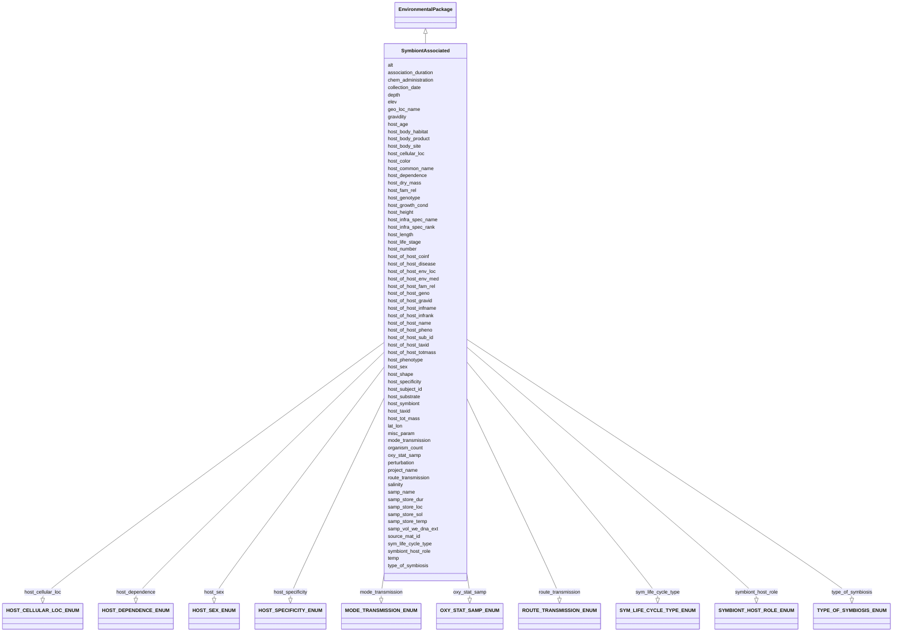

# Class: SymbiontAssociated


URI: [mixs_6_2_proposal:SymbiontAssociated](https://turbomam.github.io/mixs-envo-struct-knowl-extraction/SymbiontAssociated)





## Inheritance
* [EnvironmentalPackage](EnvironmentalPackage.md)
    * **SymbiontAssociated**


## Slots

| Name | Cardinality and Range | Description | Inheritance |
| ---  | --- | --- | --- |
| [samp_name](samp_name.md) | 1..1 <br/> [String](String.md) | A local identifier or name that for the material sample used for extracting n... | direct |
| [project_name](project_name.md) | 1..1 <br/> [String](String.md) | Name of the project within which the sequencing was organized | direct |
| [lat_lon](lat_lon.md) | 1..1 <br/> [String](String.md) | The geographical origin of the sample as defined by latitude and longitude | direct |
| [geo_loc_name](geo_loc_name.md) | 1..1 <br/> [String](String.md) | The geographical origin of the sample as defined by the country or sea name f... | direct |
| [collection_date](collection_date.md) | 1..1 <br/> [Datetime](Datetime.md) | The time of sampling, either as an instance (single point in time) or interva... | direct |
| [alt](alt.md) | 0..1 _recommended_ <br/> [String](String.md) | Heights of objects such as airplanes, space shuttles, rockets, atmospheric ba... | direct |
| [depth](depth.md) | 0..1 _recommended_ <br/> [String](String.md) | The vertical distance below local surface | direct |
| [elev](elev.md) | 0..1 _recommended_ <br/> [String](String.md) | Elevation of the sampling site is its height above a fixed reference point, m... | direct |
| [host_subject_id](host_subject_id.md) | 0..1 <br/> [String](String.md) | A unique identifier by which each subject can be referred to, de-identified | direct |
| [host_common_name](host_common_name.md) | 0..1 <br/> [String](String.md) | Common name of the host | direct |
| [host_taxid](host_taxid.md) | 0..1 <br/> [String](String.md) | NCBI taxon id of the host | direct |
| [source_mat_id](source_mat_id.md) | 0..* <br/> [String](String.md) | A unique identifier assigned to a material sample (as defined by http://rs | direct |
| [host_dependence](host_dependence.md) | 1..1 <br/> [HOSTDEPENDENCEENUM](HOSTDEPENDENCEENUM.md) | Type of host dependence for the symbiotic host organism to its host | direct |
| [type_of_symbiosis](type_of_symbiosis.md) | 0..1 _recommended_ <br/> [TYPEOFSYMBIOSISENUM](TYPEOFSYMBIOSISENUM.md) | Type of biological interaction established between the symbiotic host organis... | direct |
| [sym_life_cycle_type](sym_life_cycle_type.md) | 1..1 <br/> [SYMLIFECYCLETYPEENUM](SYMLIFECYCLETYPEENUM.md) | Type of life cycle of the symbiotic host species (the thing being sampled) | direct |
| [host_life_stage](host_life_stage.md) | 1..1 <br/> [String](String.md) | Description of life stage of host | direct |
| [host_age](host_age.md) | 0..1 <br/> [String](String.md) | Age of host at the time of sampling; relevant scale depends on species and st... | direct |
| [host_sex](host_sex.md) | 0..1 <br/> [HOSTSEXENUM](HOSTSEXENUM.md) | Physical sex of the host | direct |
| [mode_transmission](mode_transmission.md) | 0..1 _recommended_ <br/> [MODETRANSMISSIONENUM](MODETRANSMISSIONENUM.md) | The process through which the symbiotic host organism entered the host from w... | direct |
| [route_transmission](route_transmission.md) | 0..1 <br/> [ROUTETRANSMISSIONENUM](ROUTETRANSMISSIONENUM.md) | Description of path taken by the symbiotic host organism being sampled in ord... | direct |
| [host_body_habitat](host_body_habitat.md) | 0..1 <br/> [String](String.md) | Original body habitat where the sample was obtained from | direct |
| [host_body_site](host_body_site.md) | 0..1 <br/> [String](String.md) | Name of body site where the sample was obtained from, such as a specific orga... | direct |
| [host_body_product](host_body_product.md) | 0..1 <br/> [String](String.md) | Substance produced by the body, e | direct |
| [host_tot_mass](host_tot_mass.md) | 0..1 <br/> [String](String.md) | Total mass of the host at collection, the unit depends on host | direct |
| [host_height](host_height.md) | 0..1 <br/> [String](String.md) | The height of subject | direct |
| [host_length](host_length.md) | 0..1 <br/> [String](String.md) | The length of subject | direct |
| [host_growth_cond](host_growth_cond.md) | 0..1 <br/> [String](String.md) | Literature reference giving growth conditions of the host | direct |
| [host_substrate](host_substrate.md) | 0..1 <br/> [String](String.md) | The growth substrate of the host | direct |
| [host_fam_rel](host_fam_rel.md) | 0..1 <br/> [String](String.md) | Relationships to other hosts in the same study; can include multiple relation... | direct |
| [host_infra_spec_name](host_infra_spec_name.md) | 0..1 <br/> [String](String.md) | Taxonomic information about the host below subspecies level | direct |
| [host_infra_spec_rank](host_infra_spec_rank.md) | 0..1 <br/> [String](String.md) | Taxonomic rank information about the host below subspecies level, such as var... | direct |
| [host_genotype](host_genotype.md) | 0..1 <br/> [String](String.md) | Observed genotype | direct |
| [host_phenotype](host_phenotype.md) | 0..1 <br/> [String](String.md) | Phenotype of human or other host | direct |
| [host_dry_mass](host_dry_mass.md) | 0..1 <br/> [String](String.md) | Measurement of dry mass | direct |
| [host_color](host_color.md) | 0..1 <br/> [String](String.md) | The color of host | direct |
| [host_shape](host_shape.md) | 0..1 <br/> [String](String.md) | Morphological shape of host | direct |
| [gravidity](gravidity.md) | 0..1 <br/> [String](String.md) | Whether or not subject is gravid, and if yes date due or date post-conception... | direct |
| [host_number](host_number.md) | 0..1 <br/> [String](String.md) | Number of symbiotic host individuals pooled at the time of collection | direct |
| [host_symbiont](host_symbiont.md) | 0..1 <br/> [String](String.md) | The taxonomic name of the organism(s) found living in mutualistic, commensali... | direct |
| [host_specificity](host_specificity.md) | 0..1 _recommended_ <br/> [HOSTSPECIFICITYENUM](HOSTSPECIFICITYENUM.md) | Level of specificity of symbiont-host interaction: e | direct |
| [symbiont_host_role](symbiont_host_role.md) | 0..1 _recommended_ <br/> [SYMBIONTHOSTROLEENUM](SYMBIONTHOSTROLEENUM.md) | Role of the host in the life cycle of the symbiotic organism | direct |
| [host_cellular_loc](host_cellular_loc.md) | 0..1 _recommended_ <br/> [HOSTCELLULARLOCENUM](HOSTCELLULARLOCENUM.md) | The localization of the symbiotic host organism within the host from which it... | direct |
| [association_duration](association_duration.md) | 0..1 <br/> [String](String.md) | Time spent in host of the symbiotic organism at the time of sampling; relevan... | direct |
| [host_of_host_coinf](host_of_host_coinf.md) | 0..1 <br/> [String](String.md) | The taxonomic name of any coinfecting organism observed in a symbiotic relati... | direct |
| [host_of_host_name](host_of_host_name.md) | 0..1 <br/> [String](String.md) | Common name of the host of the symbiotic host organism | direct |
| [host_of_host_env_loc](host_of_host_env_loc.md) | 0..* <br/> [String](String.md) | For a symbiotic host organism the local anatomical environment within its hos... | direct |
| [host_of_host_env_med](host_of_host_env_med.md) | 0..1 <br/> [String](String.md) | Report the environmental material(s) immediately surrounding the symbiotic ho... | direct |
| [host_of_host_taxid](host_of_host_taxid.md) | 0..1 <br/> [String](String.md) | NCBI taxon id of the host of the symbiotic host organism | direct |
| [host_of_host_sub_id](host_of_host_sub_id.md) | 0..1 <br/> [String](String.md) | A unique identifier by which each host of the symbiotic host organism subject... | direct |
| [host_of_host_disease](host_of_host_disease.md) | 0..* <br/> [String](String.md) | List of diseases with which the host of the symbiotic host organism has been ... | direct |
| [host_of_host_fam_rel](host_of_host_fam_rel.md) | 0..* <br/> [String](String.md) | Familial relationship of the host of the symbiotic host organisms to other ho... | direct |
| [host_of_host_infname](host_of_host_infname.md) | 0..1 <br/> [String](String.md) | Taxonomic name information of the host of the symbiotic host organism below s... | direct |
| [host_of_host_infrank](host_of_host_infrank.md) | 0..1 <br/> [String](String.md) | Taxonomic rank information about the host of the symbiotic host organism belo... | direct |
| [host_of_host_geno](host_of_host_geno.md) | 0..1 <br/> [String](String.md) | Observed genotype of the host of the symbiotic host organism | direct |
| [host_of_host_pheno](host_of_host_pheno.md) | 0..1 <br/> [String](String.md) | Phenotype of the host of the symbiotic host organism | direct |
| [host_of_host_gravid](host_of_host_gravid.md) | 0..1 <br/> [String](String.md) | Whether or not the host of the symbiotic host organism is gravid, and if yes ... | direct |
| [host_of_host_totmass](host_of_host_totmass.md) | 0..1 <br/> [String](String.md) | Total mass of the host of the symbiotic host organism at collection, the unit... | direct |
| [chem_administration](chem_administration.md) | 0..* <br/> [String](String.md) | List of chemical compounds administered to the host or site where sampling oc... | direct |
| [perturbation](perturbation.md) | 0..* <br/> [String](String.md) | Type of perturbation, e | direct |
| [salinity](salinity.md) | 0..* <br/> [String](String.md) | The total concentration of all dissolved salts in a liquid or solid sample | direct |
| [oxy_stat_samp](oxy_stat_samp.md) | 0..1 <br/> [OXYSTATSAMPENUM](OXYSTATSAMPENUM.md) | Oxygenation status of sample | direct |
| [temp](temp.md) | 0..1 <br/> [String](String.md) | Temperature of the sample at the time of sampling | direct |
| [organism_count](organism_count.md) | 0..* <br/> [String](String.md) | Total cell count of any organism (or group of organisms) per gram, volume or ... | direct |
| [samp_vol_we_dna_ext](samp_vol_we_dna_ext.md) | 0..1 <br/> [String](String.md) | Volume (ml), weight (g) of processed sample, or surface area swabbed from sam... | direct |
| [samp_store_temp](samp_store_temp.md) | 0..1 <br/> [String](String.md) | Temperature at which sample was stored, e | direct |
| [samp_store_dur](samp_store_dur.md) | 0..1 <br/> [String](String.md) | Duration for which the sample was stored | direct |
| [samp_store_loc](samp_store_loc.md) | 0..1 <br/> [String](String.md) | Location at which sample was stored, usually name of a specific freezer/room | direct |
| [samp_store_sol](samp_store_sol.md) | 0..1 <br/> [String](String.md) | Solution within which sample was stored, if any | direct |
| [misc_param](misc_param.md) | 0..* <br/> [String](String.md) | Any other measurement performed or parameter collected, that is not listed he... | direct |


## Identifier and Mapping Information


### Schema Source


* from schema: https://turbomam.github.io/mixs-envo-struct-knowl-extraction//GSC_MIxS_6


## Mappings

| Mapping Type | Mapped Value |
| ---  | ---  |
| self | mixs_6_2_proposal:SymbiontAssociated |
| native | mixs_6_2_proposal:SymbiontAssociated |


## LinkML Source

<!-- TODO: investigate https://stackoverflow.com/questions/37606292/how-to-create-tabbed-code-blocks-in-mkdocs-or-sphinx -->

### Direct

<details>
```yaml
name: SymbiontAssociated
title: SymbiontAssociated
from_schema: https://turbomam.github.io/mixs-envo-struct-knowl-extraction//GSC_MIxS_6
is_a: EnvironmentalPackage
mixin: false
slots:
- samp_name
- project_name
- lat_lon
- geo_loc_name
- collection_date
- alt
- depth
- elev
- host_subject_id
- host_common_name
- host_taxid
- source_mat_id
- host_dependence
- type_of_symbiosis
- sym_life_cycle_type
- host_life_stage
- host_age
- host_sex
- mode_transmission
- route_transmission
- host_body_habitat
- host_body_site
- host_body_product
- host_tot_mass
- host_height
- host_length
- host_growth_cond
- host_substrate
- host_fam_rel
- host_infra_spec_name
- host_infra_spec_rank
- host_genotype
- host_phenotype
- host_dry_mass
- host_color
- host_shape
- gravidity
- host_number
- host_symbiont
- host_specificity
- symbiont_host_role
- host_cellular_loc
- association_duration
- host_of_host_coinf
- host_of_host_name
- host_of_host_env_loc
- host_of_host_env_med
- host_of_host_taxid
- host_of_host_sub_id
- host_of_host_disease
- host_of_host_fam_rel
- host_of_host_infname
- host_of_host_infrank
- host_of_host_geno
- host_of_host_pheno
- host_of_host_gravid
- host_of_host_totmass
- chem_administration
- perturbation
- salinity
- oxy_stat_samp
- temp
- organism_count
- samp_vol_we_dna_ext
- samp_store_temp
- samp_store_dur
- samp_store_loc
- samp_store_sol
- misc_param
slot_usage:
  alt:
    name: alt
    domain_of:
    - Air
    - HostAssociated
    - MigsBa
    - MigsEu
    - MigsOrg
    - MigsPl
    - MigsVi
    - Mimag
    - MimarksC
    - MimarksS
    - Mims
    - Misag
    - MiscellaneousNaturalOrArtificialEnvironment
    - Miuvig
    - SymbiontAssociated
    recommended: true
  chem_administration:
    name: chem_administration
    domain_of:
    - Agriculture
    - Air
    - FoodFarmEnvironment
    - HostAssociated
    - HumanAssociated
    - HumanGut
    - HumanOral
    - HumanSkin
    - HumanVaginal
    - MicrobialMatBiofilm
    - MiscellaneousNaturalOrArtificialEnvironment
    - PlantAssociated
    - Sediment
    - SymbiontAssociated
    - WastewaterSludge
    - Water
    required: false
    recommended: false
  depth:
    name: depth
    title: depth
    examples:
    - value: 10 meter
    domain_of:
    - Agriculture
    - FoodFarmEnvironment
    - HostAssociated
    - MicrobialMatBiofilm
    - MigsBa
    - MigsEu
    - MigsOrg
    - MigsPl
    - MigsVi
    - Mimag
    - MimarksC
    - MimarksS
    - Mims
    - Misag
    - MiscellaneousNaturalOrArtificialEnvironment
    - Miuvig
    - PlantAssociated
    - Sediment
    - Soil
    - SymbiontAssociated
    - WastewaterSludge
    - Water
    recommended: true
  elev:
    name: elev
    domain_of:
    - Agriculture
    - Air
    - HostAssociated
    - HydrocarbonResourcesCores
    - MicrobialMatBiofilm
    - MigsBa
    - MigsEu
    - MigsOrg
    - MigsPl
    - MigsVi
    - Mimag
    - MimarksC
    - MimarksS
    - Mims
    - Misag
    - MiscellaneousNaturalOrArtificialEnvironment
    - Miuvig
    - PlantAssociated
    - Sediment
    - Soil
    - SymbiontAssociated
    - Water
    recommended: true
  geo_loc_name:
    name: geo_loc_name
    description: The geographical origin of the sample as defined by the country or
      sea name followed by specific region name. Country or sea names should be chosen
      from the INSDC country list (http://insdc.org/country.html), or the GAZ ontology
      (http://purl.bioontology.org/ontology/GAZ).
    domain_of:
    - FoodAnimalAndAnimalFeed
    - FoodFarmEnvironment
    - FoodFoodProductionFacility
    - FoodHumanFoods
    - MigsBa
    - MigsEu
    - MigsOrg
    - MigsPl
    - MigsVi
    - Mimag
    - MimarksC
    - MimarksS
    - Mims
    - Misag
    - Miuvig
    - SymbiontAssociated
  gravidity:
    name: gravidity
    domain_of:
    - HostAssociated
    - SymbiontAssociated
  host_age:
    name: host_age
    examples:
    - value: nan
    domain_of:
    - Agriculture
    - FoodFarmEnvironment
    - HostAssociated
    - HumanAssociated
    - HumanGut
    - HumanOral
    - HumanSkin
    - HumanVaginal
    - PlantAssociated
    - SymbiontAssociated
    required: false
    recommended: false
  host_body_habitat:
    name: host_body_habitat
    examples:
    - value: anterior end of a tapeworm
    domain_of:
    - HostAssociated
    - SymbiontAssociated
  host_body_product:
    name: host_body_product
    slot_uri: MIXS:0000868
    domain_of:
    - HostAssociated
    - HumanAssociated
    - HumanGut
    - HumanOral
    - HumanSkin
    - HumanVaginal
    - SymbiontAssociated
  host_body_site:
    name: host_body_site
    examples:
    - value: scolex [UBERON:0015119]
    domain_of:
    - HostAssociated
    - HumanAssociated
    - HumanGut
    - HumanOral
    - HumanSkin
    - HumanVaginal
    - SymbiontAssociated
  host_color:
    name: host_color
    domain_of:
    - HostAssociated
    - SymbiontAssociated
  host_common_name:
    name: host_common_name
    examples:
    - value: trematode
    domain_of:
    - Agriculture
    - HostAssociated
    - PlantAssociated
    - SymbiontAssociated
    required: false
    recommended: false
  host_dry_mass:
    name: host_dry_mass
    domain_of:
    - Agriculture
    - FoodFarmEnvironment
    - HostAssociated
    - PlantAssociated
    - SymbiontAssociated
  host_fam_rel:
    name: host_fam_rel
    examples:
    - value: clone;P15
    multivalued: false
    domain_of:
    - HostAssociated
    - HumanAssociated
    - HumanGut
    - HumanOral
    - HumanSkin
    - HumanVaginal
    - SymbiontAssociated
  host_genotype:
    name: host_genotype
    examples:
    - value: nan
    domain_of:
    - Agriculture
    - FoodFarmEnvironment
    - HostAssociated
    - HumanAssociated
    - HumanGut
    - HumanOral
    - HumanSkin
    - HumanVaginal
    - PlantAssociated
    - SymbiontAssociated
    required: false
    recommended: false
  host_growth_cond:
    name: host_growth_cond
    domain_of:
    - HostAssociated
    - SymbiontAssociated
  host_height:
    name: host_height
    examples:
    - value: nan
    domain_of:
    - Agriculture
    - FoodFarmEnvironment
    - HostAssociated
    - HumanAssociated
    - HumanGut
    - HumanOral
    - HumanSkin
    - HumanVaginal
    - PlantAssociated
    - SymbiontAssociated
    required: false
    recommended: false
  host_length:
    name: host_length
    domain_of:
    - Agriculture
    - FoodFarmEnvironment
    - HostAssociated
    - PlantAssociated
    - SymbiontAssociated
    required: false
    recommended: false
  host_life_stage:
    name: host_life_stage
    examples:
    - value: redia
    domain_of:
    - Agriculture
    - HostAssociated
    - PlantAssociated
    - SymbiontAssociated
    required: true
  host_phenotype:
    name: host_phenotype
    examples:
    - value: soldier
    string_serialization: '{term}'
    domain_of:
    - Agriculture
    - FoodFarmEnvironment
    - HostAssociated
    - HumanAssociated
    - HumanGut
    - HumanOral
    - HumanSkin
    - HumanVaginal
    - PlantAssociated
    - SymbiontAssociated
    required: false
    recommended: false
  host_sex:
    name: host_sex
    description: Physical sex of the host.
    string_serialization: '[female|hermaphrodite|male|neuter]'
    slot_uri: MIXS:0000862
    domain_of:
    - HostAssociated
    - HumanAssociated
    - HumanGut
    - HumanOral
    - HumanSkin
    - HumanVaginal
    - SymbiontAssociated
  host_shape:
    name: host_shape
    domain_of:
    - HostAssociated
    - SymbiontAssociated
  host_subject_id:
    name: host_subject_id
    examples:
    - value: P14
    domain_of:
    - HostAssociated
    - HumanAssociated
    - HumanGut
    - HumanOral
    - HumanSkin
    - HumanVaginal
    - SymbiontAssociated
  host_substrate:
    name: host_substrate
    domain_of:
    - HostAssociated
    - SymbiontAssociated
  host_symbiont:
    name: host_symbiont
    description: 'The taxonomic name of the organism(s) found living in mutualistic,
      commensalistic, or parasitic symbiosis with the specific host. For cases when
      the specific host of the sample is a symbiont this field should refer to other
      organisms it is associated with. E.g.: hyperparasite species X (parasite of
      the parasite)'
    examples:
    - value: Paragordius varius
    slot_uri: MIXS:0001309
    multivalued: false
    domain_of:
    - Agriculture
    - HostAssociated
    - HumanAssociated
    - HumanGut
    - HumanOral
    - HumanSkin
    - HumanVaginal
    - PlantAssociated
    - SymbiontAssociated
  host_taxid:
    name: host_taxid
    description: NCBI taxon id of the host.
    examples:
    - value: '395013'
    string_serialization: '{integer}'
    domain_of:
    - Agriculture
    - FoodFarmEnvironment
    - HostAssociated
    - PlantAssociated
    - SymbiontAssociated
    required: false
    recommended: false
  host_tot_mass:
    name: host_tot_mass
    examples:
    - value: nan
    domain_of:
    - Agriculture
    - FoodFarmEnvironment
    - HostAssociated
    - HumanAssociated
    - HumanGut
    - HumanOral
    - HumanSkin
    - HumanVaginal
    - PlantAssociated
    - SymbiontAssociated
    required: false
    recommended: false
  lat_lon:
    name: lat_lon
    domain_of:
    - FoodAnimalAndAnimalFeed
    - FoodFarmEnvironment
    - FoodFoodProductionFacility
    - FoodHumanFoods
    - MigsBa
    - MigsEu
    - MigsOrg
    - MigsPl
    - MigsVi
    - Mimag
    - MimarksC
    - MimarksS
    - Mims
    - Misag
    - Miuvig
    - SymbiontAssociated
  misc_param:
    name: misc_param
    domain_of:
    - Agriculture
    - Air
    - FoodAnimalAndAnimalFeed
    - FoodFarmEnvironment
    - FoodFoodProductionFacility
    - FoodHumanFoods
    - HostAssociated
    - HumanAssociated
    - HumanGut
    - HumanOral
    - HumanSkin
    - HumanVaginal
    - HydrocarbonResourcesCores
    - HydrocarbonResourcesFluidsSwabs
    - MicrobialMatBiofilm
    - MiscellaneousNaturalOrArtificialEnvironment
    - PlantAssociated
    - Sediment
    - Soil
    - SymbiontAssociated
    - WastewaterSludge
    - Water
  organism_count:
    name: organism_count
    description: 'Total cell count of any organism (or group of organisms) per gram,
      volume or area of sample, should include name of organism followed by count.
      The method that was used for the enumeration (e.g. qPCR, atp, mpn, etc.) Should
      also be provided. (example: total prokaryotes; 3.5e7 cells per ml; qpcr).'
    examples:
    - value: total prokaryotes;3.5e7 cells per milliliter;qPCR
    string_serialization: '{text};{float} {unit}'
    multivalued: true
    domain_of:
    - Agriculture
    - Air
    - BuiltEnvironment
    - FoodAnimalAndAnimalFeed
    - FoodFarmEnvironment
    - FoodFoodProductionFacility
    - FoodHumanFoods
    - HostAssociated
    - HumanAssociated
    - HumanGut
    - HumanOral
    - HumanSkin
    - HumanVaginal
    - HydrocarbonResourcesCores
    - HydrocarbonResourcesFluidsSwabs
    - MicrobialMatBiofilm
    - MiscellaneousNaturalOrArtificialEnvironment
    - PlantAssociated
    - Sediment
    - SymbiontAssociated
    - WastewaterSludge
    - Water
    required: false
    recommended: false
  oxy_stat_samp:
    name: oxy_stat_samp
    domain_of:
    - Agriculture
    - Air
    - HostAssociated
    - HumanAssociated
    - HumanGut
    - HumanOral
    - HumanSkin
    - HumanVaginal
    - HydrocarbonResourcesCores
    - HydrocarbonResourcesFluidsSwabs
    - MicrobialMatBiofilm
    - MiscellaneousNaturalOrArtificialEnvironment
    - PlantAssociated
    - Sediment
    - SymbiontAssociated
    - WastewaterSludge
    - Water
    required: false
    recommended: false
  perturbation:
    name: perturbation
    string_serialization: '{text};{Rn/start_time/end_time/duration}'
    domain_of:
    - Agriculture
    - Air
    - FoodAnimalAndAnimalFeed
    - FoodFarmEnvironment
    - FoodHumanFoods
    - HostAssociated
    - HumanAssociated
    - HumanGut
    - HumanOral
    - HumanSkin
    - HumanVaginal
    - MicrobialMatBiofilm
    - MiscellaneousNaturalOrArtificialEnvironment
    - PlantAssociated
    - Sediment
    - SymbiontAssociated
    - WastewaterSludge
    - Water
    required: false
    recommended: false
  salinity:
    name: salinity
    multivalued: true
    domain_of:
    - Air
    - FoodFarmEnvironment
    - HostAssociated
    - HumanAssociated
    - HumanGut
    - HumanOral
    - HumanSkin
    - HumanVaginal
    - HydrocarbonResourcesCores
    - HydrocarbonResourcesFluidsSwabs
    - MicrobialMatBiofilm
    - MiscellaneousNaturalOrArtificialEnvironment
    - PlantAssociated
    - Sediment
    - SymbiontAssociated
    - WastewaterSludge
    - Water
  samp_store_dur:
    name: samp_store_dur
    description: Duration for which the sample was stored.
    string_serialization: '{duration}'
    domain_of:
    - Agriculture
    - Air
    - FoodAnimalAndAnimalFeed
    - FoodFarmEnvironment
    - FoodFoodProductionFacility
    - FoodHumanFoods
    - HostAssociated
    - HumanAssociated
    - HumanGut
    - HumanOral
    - HumanSkin
    - HumanVaginal
    - HydrocarbonResourcesCores
    - HydrocarbonResourcesFluidsSwabs
    - MicrobialMatBiofilm
    - MiscellaneousNaturalOrArtificialEnvironment
    - PlantAssociated
    - Sediment
    - SymbiontAssociated
    - WastewaterSludge
    - Water
    required: false
    recommended: false
  samp_store_loc:
    name: samp_store_loc
    description: Location at which sample was stored, usually name of a specific freezer/room.
    examples:
    - value: Freezer no:5
    domain_of:
    - Agriculture
    - Air
    - FoodAnimalAndAnimalFeed
    - FoodFoodProductionFacility
    - FoodHumanFoods
    - HostAssociated
    - HumanAssociated
    - HumanGut
    - HumanOral
    - HumanSkin
    - HumanVaginal
    - HydrocarbonResourcesCores
    - HydrocarbonResourcesFluidsSwabs
    - MicrobialMatBiofilm
    - MiscellaneousNaturalOrArtificialEnvironment
    - PlantAssociated
    - Sediment
    - SymbiontAssociated
    - WastewaterSludge
    - Water
    required: false
    recommended: false
  samp_vol_we_dna_ext:
    name: samp_vol_we_dna_ext
    description: Volume (ml), weight (g) of processed sample, or surface area swabbed
      from sample for DNA extraction.
    domain_of:
    - Agriculture
    - Air
    - FoodAnimalAndAnimalFeed
    - FoodFarmEnvironment
    - FoodFoodProductionFacility
    - FoodHumanFoods
    - HostAssociated
    - HumanAssociated
    - HumanGut
    - HumanOral
    - HumanSkin
    - HumanVaginal
    - HydrocarbonResourcesCores
    - HydrocarbonResourcesFluidsSwabs
    - MicrobialMatBiofilm
    - MigsBa
    - MigsEu
    - MigsOrg
    - MigsPl
    - MigsVi
    - Mimag
    - MimarksC
    - MimarksS
    - Mims
    - Misag
    - MiscellaneousNaturalOrArtificialEnvironment
    - Miuvig
    - PlantAssociated
    - Sediment
    - Soil
    - SymbiontAssociated
    - WastewaterSludge
    - Water
    required: false
    recommended: false
  source_mat_id:
    name: source_mat_id
    domain_of:
    - Agriculture
    - MigsBa
    - MigsEu
    - MigsOrg
    - MigsPl
    - MigsVi
    - Mimag
    - MimarksC
    - MimarksS
    - Mims
    - Misag
    - Miuvig
    - SymbiontAssociated
    required: false
    recommended: false
  temp:
    name: temp
    domain_of:
    - Agriculture
    - Air
    - FoodAnimalAndAnimalFeed
    - FoodFarmEnvironment
    - FoodHumanFoods
    - HostAssociated
    - HumanAssociated
    - HumanGut
    - HumanOral
    - HumanSkin
    - HumanVaginal
    - HydrocarbonResourcesCores
    - HydrocarbonResourcesFluidsSwabs
    - MicrobialMatBiofilm
    - MigsBa
    - MigsEu
    - MigsOrg
    - MigsPl
    - MigsVi
    - Mimag
    - MimarksC
    - MimarksS
    - Mims
    - Misag
    - MiscellaneousNaturalOrArtificialEnvironment
    - Miuvig
    - PlantAssociated
    - Sediment
    - Soil
    - SymbiontAssociated
    - WastewaterSludge
    - Water
    required: false
    recommended: false

```
</details>

### Induced

<details>
```yaml
name: SymbiontAssociated
title: SymbiontAssociated
from_schema: https://turbomam.github.io/mixs-envo-struct-knowl-extraction//GSC_MIxS_6
is_a: EnvironmentalPackage
mixin: false
slot_usage:
  alt:
    name: alt
    domain_of:
    - Air
    - HostAssociated
    - MigsBa
    - MigsEu
    - MigsOrg
    - MigsPl
    - MigsVi
    - Mimag
    - MimarksC
    - MimarksS
    - Mims
    - Misag
    - MiscellaneousNaturalOrArtificialEnvironment
    - Miuvig
    - SymbiontAssociated
    recommended: true
  chem_administration:
    name: chem_administration
    domain_of:
    - Agriculture
    - Air
    - FoodFarmEnvironment
    - HostAssociated
    - HumanAssociated
    - HumanGut
    - HumanOral
    - HumanSkin
    - HumanVaginal
    - MicrobialMatBiofilm
    - MiscellaneousNaturalOrArtificialEnvironment
    - PlantAssociated
    - Sediment
    - SymbiontAssociated
    - WastewaterSludge
    - Water
    required: false
    recommended: false
  depth:
    name: depth
    title: depth
    examples:
    - value: 10 meter
    domain_of:
    - Agriculture
    - FoodFarmEnvironment
    - HostAssociated
    - MicrobialMatBiofilm
    - MigsBa
    - MigsEu
    - MigsOrg
    - MigsPl
    - MigsVi
    - Mimag
    - MimarksC
    - MimarksS
    - Mims
    - Misag
    - MiscellaneousNaturalOrArtificialEnvironment
    - Miuvig
    - PlantAssociated
    - Sediment
    - Soil
    - SymbiontAssociated
    - WastewaterSludge
    - Water
    recommended: true
  elev:
    name: elev
    domain_of:
    - Agriculture
    - Air
    - HostAssociated
    - HydrocarbonResourcesCores
    - MicrobialMatBiofilm
    - MigsBa
    - MigsEu
    - MigsOrg
    - MigsPl
    - MigsVi
    - Mimag
    - MimarksC
    - MimarksS
    - Mims
    - Misag
    - MiscellaneousNaturalOrArtificialEnvironment
    - Miuvig
    - PlantAssociated
    - Sediment
    - Soil
    - SymbiontAssociated
    - Water
    recommended: true
  geo_loc_name:
    name: geo_loc_name
    description: The geographical origin of the sample as defined by the country or
      sea name followed by specific region name. Country or sea names should be chosen
      from the INSDC country list (http://insdc.org/country.html), or the GAZ ontology
      (http://purl.bioontology.org/ontology/GAZ).
    domain_of:
    - FoodAnimalAndAnimalFeed
    - FoodFarmEnvironment
    - FoodFoodProductionFacility
    - FoodHumanFoods
    - MigsBa
    - MigsEu
    - MigsOrg
    - MigsPl
    - MigsVi
    - Mimag
    - MimarksC
    - MimarksS
    - Mims
    - Misag
    - Miuvig
    - SymbiontAssociated
  gravidity:
    name: gravidity
    domain_of:
    - HostAssociated
    - SymbiontAssociated
  host_age:
    name: host_age
    examples:
    - value: nan
    domain_of:
    - Agriculture
    - FoodFarmEnvironment
    - HostAssociated
    - HumanAssociated
    - HumanGut
    - HumanOral
    - HumanSkin
    - HumanVaginal
    - PlantAssociated
    - SymbiontAssociated
    required: false
    recommended: false
  host_body_habitat:
    name: host_body_habitat
    examples:
    - value: anterior end of a tapeworm
    domain_of:
    - HostAssociated
    - SymbiontAssociated
  host_body_product:
    name: host_body_product
    slot_uri: MIXS:0000868
    domain_of:
    - HostAssociated
    - HumanAssociated
    - HumanGut
    - HumanOral
    - HumanSkin
    - HumanVaginal
    - SymbiontAssociated
  host_body_site:
    name: host_body_site
    examples:
    - value: scolex [UBERON:0015119]
    domain_of:
    - HostAssociated
    - HumanAssociated
    - HumanGut
    - HumanOral
    - HumanSkin
    - HumanVaginal
    - SymbiontAssociated
  host_color:
    name: host_color
    domain_of:
    - HostAssociated
    - SymbiontAssociated
  host_common_name:
    name: host_common_name
    examples:
    - value: trematode
    domain_of:
    - Agriculture
    - HostAssociated
    - PlantAssociated
    - SymbiontAssociated
    required: false
    recommended: false
  host_dry_mass:
    name: host_dry_mass
    domain_of:
    - Agriculture
    - FoodFarmEnvironment
    - HostAssociated
    - PlantAssociated
    - SymbiontAssociated
  host_fam_rel:
    name: host_fam_rel
    examples:
    - value: clone;P15
    multivalued: false
    domain_of:
    - HostAssociated
    - HumanAssociated
    - HumanGut
    - HumanOral
    - HumanSkin
    - HumanVaginal
    - SymbiontAssociated
  host_genotype:
    name: host_genotype
    examples:
    - value: nan
    domain_of:
    - Agriculture
    - FoodFarmEnvironment
    - HostAssociated
    - HumanAssociated
    - HumanGut
    - HumanOral
    - HumanSkin
    - HumanVaginal
    - PlantAssociated
    - SymbiontAssociated
    required: false
    recommended: false
  host_growth_cond:
    name: host_growth_cond
    domain_of:
    - HostAssociated
    - SymbiontAssociated
  host_height:
    name: host_height
    examples:
    - value: nan
    domain_of:
    - Agriculture
    - FoodFarmEnvironment
    - HostAssociated
    - HumanAssociated
    - HumanGut
    - HumanOral
    - HumanSkin
    - HumanVaginal
    - PlantAssociated
    - SymbiontAssociated
    required: false
    recommended: false
  host_length:
    name: host_length
    domain_of:
    - Agriculture
    - FoodFarmEnvironment
    - HostAssociated
    - PlantAssociated
    - SymbiontAssociated
    required: false
    recommended: false
  host_life_stage:
    name: host_life_stage
    examples:
    - value: redia
    domain_of:
    - Agriculture
    - HostAssociated
    - PlantAssociated
    - SymbiontAssociated
    required: true
  host_phenotype:
    name: host_phenotype
    examples:
    - value: soldier
    string_serialization: '{term}'
    domain_of:
    - Agriculture
    - FoodFarmEnvironment
    - HostAssociated
    - HumanAssociated
    - HumanGut
    - HumanOral
    - HumanSkin
    - HumanVaginal
    - PlantAssociated
    - SymbiontAssociated
    required: false
    recommended: false
  host_sex:
    name: host_sex
    description: Physical sex of the host.
    string_serialization: '[female|hermaphrodite|male|neuter]'
    slot_uri: MIXS:0000862
    domain_of:
    - HostAssociated
    - HumanAssociated
    - HumanGut
    - HumanOral
    - HumanSkin
    - HumanVaginal
    - SymbiontAssociated
  host_shape:
    name: host_shape
    domain_of:
    - HostAssociated
    - SymbiontAssociated
  host_subject_id:
    name: host_subject_id
    examples:
    - value: P14
    domain_of:
    - HostAssociated
    - HumanAssociated
    - HumanGut
    - HumanOral
    - HumanSkin
    - HumanVaginal
    - SymbiontAssociated
  host_substrate:
    name: host_substrate
    domain_of:
    - HostAssociated
    - SymbiontAssociated
  host_symbiont:
    name: host_symbiont
    description: 'The taxonomic name of the organism(s) found living in mutualistic,
      commensalistic, or parasitic symbiosis with the specific host. For cases when
      the specific host of the sample is a symbiont this field should refer to other
      organisms it is associated with. E.g.: hyperparasite species X (parasite of
      the parasite)'
    examples:
    - value: Paragordius varius
    slot_uri: MIXS:0001309
    multivalued: false
    domain_of:
    - Agriculture
    - HostAssociated
    - HumanAssociated
    - HumanGut
    - HumanOral
    - HumanSkin
    - HumanVaginal
    - PlantAssociated
    - SymbiontAssociated
  host_taxid:
    name: host_taxid
    description: NCBI taxon id of the host.
    examples:
    - value: '395013'
    string_serialization: '{integer}'
    domain_of:
    - Agriculture
    - FoodFarmEnvironment
    - HostAssociated
    - PlantAssociated
    - SymbiontAssociated
    required: false
    recommended: false
  host_tot_mass:
    name: host_tot_mass
    examples:
    - value: nan
    domain_of:
    - Agriculture
    - FoodFarmEnvironment
    - HostAssociated
    - HumanAssociated
    - HumanGut
    - HumanOral
    - HumanSkin
    - HumanVaginal
    - PlantAssociated
    - SymbiontAssociated
    required: false
    recommended: false
  lat_lon:
    name: lat_lon
    domain_of:
    - FoodAnimalAndAnimalFeed
    - FoodFarmEnvironment
    - FoodFoodProductionFacility
    - FoodHumanFoods
    - MigsBa
    - MigsEu
    - MigsOrg
    - MigsPl
    - MigsVi
    - Mimag
    - MimarksC
    - MimarksS
    - Mims
    - Misag
    - Miuvig
    - SymbiontAssociated
  misc_param:
    name: misc_param
    domain_of:
    - Agriculture
    - Air
    - FoodAnimalAndAnimalFeed
    - FoodFarmEnvironment
    - FoodFoodProductionFacility
    - FoodHumanFoods
    - HostAssociated
    - HumanAssociated
    - HumanGut
    - HumanOral
    - HumanSkin
    - HumanVaginal
    - HydrocarbonResourcesCores
    - HydrocarbonResourcesFluidsSwabs
    - MicrobialMatBiofilm
    - MiscellaneousNaturalOrArtificialEnvironment
    - PlantAssociated
    - Sediment
    - Soil
    - SymbiontAssociated
    - WastewaterSludge
    - Water
  organism_count:
    name: organism_count
    description: 'Total cell count of any organism (or group of organisms) per gram,
      volume or area of sample, should include name of organism followed by count.
      The method that was used for the enumeration (e.g. qPCR, atp, mpn, etc.) Should
      also be provided. (example: total prokaryotes; 3.5e7 cells per ml; qpcr).'
    examples:
    - value: total prokaryotes;3.5e7 cells per milliliter;qPCR
    string_serialization: '{text};{float} {unit}'
    multivalued: true
    domain_of:
    - Agriculture
    - Air
    - BuiltEnvironment
    - FoodAnimalAndAnimalFeed
    - FoodFarmEnvironment
    - FoodFoodProductionFacility
    - FoodHumanFoods
    - HostAssociated
    - HumanAssociated
    - HumanGut
    - HumanOral
    - HumanSkin
    - HumanVaginal
    - HydrocarbonResourcesCores
    - HydrocarbonResourcesFluidsSwabs
    - MicrobialMatBiofilm
    - MiscellaneousNaturalOrArtificialEnvironment
    - PlantAssociated
    - Sediment
    - SymbiontAssociated
    - WastewaterSludge
    - Water
    required: false
    recommended: false
  oxy_stat_samp:
    name: oxy_stat_samp
    domain_of:
    - Agriculture
    - Air
    - HostAssociated
    - HumanAssociated
    - HumanGut
    - HumanOral
    - HumanSkin
    - HumanVaginal
    - HydrocarbonResourcesCores
    - HydrocarbonResourcesFluidsSwabs
    - MicrobialMatBiofilm
    - MiscellaneousNaturalOrArtificialEnvironment
    - PlantAssociated
    - Sediment
    - SymbiontAssociated
    - WastewaterSludge
    - Water
    required: false
    recommended: false
  perturbation:
    name: perturbation
    string_serialization: '{text};{Rn/start_time/end_time/duration}'
    domain_of:
    - Agriculture
    - Air
    - FoodAnimalAndAnimalFeed
    - FoodFarmEnvironment
    - FoodHumanFoods
    - HostAssociated
    - HumanAssociated
    - HumanGut
    - HumanOral
    - HumanSkin
    - HumanVaginal
    - MicrobialMatBiofilm
    - MiscellaneousNaturalOrArtificialEnvironment
    - PlantAssociated
    - Sediment
    - SymbiontAssociated
    - WastewaterSludge
    - Water
    required: false
    recommended: false
  salinity:
    name: salinity
    multivalued: true
    domain_of:
    - Air
    - FoodFarmEnvironment
    - HostAssociated
    - HumanAssociated
    - HumanGut
    - HumanOral
    - HumanSkin
    - HumanVaginal
    - HydrocarbonResourcesCores
    - HydrocarbonResourcesFluidsSwabs
    - MicrobialMatBiofilm
    - MiscellaneousNaturalOrArtificialEnvironment
    - PlantAssociated
    - Sediment
    - SymbiontAssociated
    - WastewaterSludge
    - Water
  samp_store_dur:
    name: samp_store_dur
    description: Duration for which the sample was stored.
    string_serialization: '{duration}'
    domain_of:
    - Agriculture
    - Air
    - FoodAnimalAndAnimalFeed
    - FoodFarmEnvironment
    - FoodFoodProductionFacility
    - FoodHumanFoods
    - HostAssociated
    - HumanAssociated
    - HumanGut
    - HumanOral
    - HumanSkin
    - HumanVaginal
    - HydrocarbonResourcesCores
    - HydrocarbonResourcesFluidsSwabs
    - MicrobialMatBiofilm
    - MiscellaneousNaturalOrArtificialEnvironment
    - PlantAssociated
    - Sediment
    - SymbiontAssociated
    - WastewaterSludge
    - Water
    required: false
    recommended: false
  samp_store_loc:
    name: samp_store_loc
    description: Location at which sample was stored, usually name of a specific freezer/room.
    examples:
    - value: Freezer no:5
    domain_of:
    - Agriculture
    - Air
    - FoodAnimalAndAnimalFeed
    - FoodFoodProductionFacility
    - FoodHumanFoods
    - HostAssociated
    - HumanAssociated
    - HumanGut
    - HumanOral
    - HumanSkin
    - HumanVaginal
    - HydrocarbonResourcesCores
    - HydrocarbonResourcesFluidsSwabs
    - MicrobialMatBiofilm
    - MiscellaneousNaturalOrArtificialEnvironment
    - PlantAssociated
    - Sediment
    - SymbiontAssociated
    - WastewaterSludge
    - Water
    required: false
    recommended: false
  samp_vol_we_dna_ext:
    name: samp_vol_we_dna_ext
    description: Volume (ml), weight (g) of processed sample, or surface area swabbed
      from sample for DNA extraction.
    domain_of:
    - Agriculture
    - Air
    - FoodAnimalAndAnimalFeed
    - FoodFarmEnvironment
    - FoodFoodProductionFacility
    - FoodHumanFoods
    - HostAssociated
    - HumanAssociated
    - HumanGut
    - HumanOral
    - HumanSkin
    - HumanVaginal
    - HydrocarbonResourcesCores
    - HydrocarbonResourcesFluidsSwabs
    - MicrobialMatBiofilm
    - MigsBa
    - MigsEu
    - MigsOrg
    - MigsPl
    - MigsVi
    - Mimag
    - MimarksC
    - MimarksS
    - Mims
    - Misag
    - MiscellaneousNaturalOrArtificialEnvironment
    - Miuvig
    - PlantAssociated
    - Sediment
    - Soil
    - SymbiontAssociated
    - WastewaterSludge
    - Water
    required: false
    recommended: false
  source_mat_id:
    name: source_mat_id
    domain_of:
    - Agriculture
    - MigsBa
    - MigsEu
    - MigsOrg
    - MigsPl
    - MigsVi
    - Mimag
    - MimarksC
    - MimarksS
    - Mims
    - Misag
    - Miuvig
    - SymbiontAssociated
    required: false
    recommended: false
  temp:
    name: temp
    domain_of:
    - Agriculture
    - Air
    - FoodAnimalAndAnimalFeed
    - FoodFarmEnvironment
    - FoodHumanFoods
    - HostAssociated
    - HumanAssociated
    - HumanGut
    - HumanOral
    - HumanSkin
    - HumanVaginal
    - HydrocarbonResourcesCores
    - HydrocarbonResourcesFluidsSwabs
    - MicrobialMatBiofilm
    - MigsBa
    - MigsEu
    - MigsOrg
    - MigsPl
    - MigsVi
    - Mimag
    - MimarksC
    - MimarksS
    - Mims
    - Misag
    - MiscellaneousNaturalOrArtificialEnvironment
    - Miuvig
    - PlantAssociated
    - Sediment
    - Soil
    - SymbiontAssociated
    - WastewaterSludge
    - Water
    required: false
    recommended: false
attributes:
  samp_name:
    name: samp_name
    description: A local identifier or name that for the material sample used for
      extracting nucleic acids, and subsequent sequencing. It can refer either to
      the original material collected or to any derived sub-samples. It can have any
      format, but we suggest that you make it concise, unique and consistent within
      your lab, and as informative as possible. INSDC requires every sample name from
      a single Submitter to be unique. Use of a globally unique identifier for the
      field source_mat_id is recommended in addition to sample_name
    title: sample name
    notes:
    - sample
    examples:
    - value: ISDsoil1
    in_subset:
    - investigation
    from_schema: https://turbomam.github.io/mixs-envo-struct-knowl-extraction//GSC_MIxS_6
    rank: 1000
    slot_uri: MIXS:0001107
    multivalued: false
    alias: samp_name
    owner: SymbiontAssociated
    domain_of:
    - Air
    - BuiltEnvironment
    - FoodAnimalAndAnimalFeed
    - FoodFarmEnvironment
    - FoodFoodProductionFacility
    - FoodHumanFoods
    - HostAssociated
    - HumanAssociated
    - HumanGut
    - HumanOral
    - HumanSkin
    - HumanVaginal
    - HydrocarbonResourcesCores
    - HydrocarbonResourcesFluidsSwabs
    - MicrobialMatBiofilm
    - MigsBa
    - MigsEu
    - MigsOrg
    - MigsPl
    - MigsVi
    - Mimag
    - MimarksC
    - MimarksS
    - Mims
    - Misag
    - MiscellaneousNaturalOrArtificialEnvironment
    - Miuvig
    - PlantAssociated
    - Sediment
    - Soil
    - SymbiontAssociated
    - WastewaterSludge
    - Water
    range: string
    required: true
  project_name:
    name: project_name
    description: Name of the project within which the sequencing was organized
    title: project name
    notes:
    - project
    examples:
    - value: Forest soil metagenome
    in_subset:
    - investigation
    from_schema: https://turbomam.github.io/mixs-envo-struct-knowl-extraction//GSC_MIxS_6
    rank: 1000
    slot_uri: MIXS:0000092
    multivalued: false
    alias: project_name
    owner: SymbiontAssociated
    domain_of:
    - Air
    - BuiltEnvironment
    - FoodAnimalAndAnimalFeed
    - FoodFarmEnvironment
    - FoodFoodProductionFacility
    - FoodHumanFoods
    - HostAssociated
    - HumanAssociated
    - HumanGut
    - HumanOral
    - HumanSkin
    - HumanVaginal
    - HydrocarbonResourcesCores
    - HydrocarbonResourcesFluidsSwabs
    - MicrobialMatBiofilm
    - MigsBa
    - MigsEu
    - MigsOrg
    - MigsPl
    - MigsVi
    - Mimag
    - MimarksC
    - MimarksS
    - Mims
    - Misag
    - MiscellaneousNaturalOrArtificialEnvironment
    - Miuvig
    - PlantAssociated
    - Sediment
    - Soil
    - SymbiontAssociated
    - WastewaterSludge
    - Water
    range: string
    required: true
  lat_lon:
    name: lat_lon
    description: The geographical origin of the sample as defined by latitude and
      longitude. The values should be reported in decimal degrees and in WGS84 system
    title: geographic location (latitude and longitude)
    from_schema: https://turbomam.github.io/mixs-envo-struct-knowl-extraction//GSC_MIxS_6
    rank: 1000
    string_serialization: '{float} {float}'
    slot_uri: MIXS:0000009
    multivalued: false
    alias: lat_lon
    owner: SymbiontAssociated
    domain_of:
    - FoodAnimalAndAnimalFeed
    - FoodFarmEnvironment
    - FoodFoodProductionFacility
    - FoodHumanFoods
    - MigsBa
    - MigsEu
    - MigsOrg
    - MigsPl
    - MigsVi
    - Mimag
    - MimarksC
    - MimarksS
    - Mims
    - Misag
    - Miuvig
    - SymbiontAssociated
    range: string
    required: true
  geo_loc_name:
    name: geo_loc_name
    description: The geographical origin of the sample as defined by the country or
      sea name followed by specific region name. Country or sea names should be chosen
      from the INSDC country list (http://insdc.org/country.html), or the GAZ ontology
      (http://purl.bioontology.org/ontology/GAZ).
    title: geographic location (country and/or sea,region)
    from_schema: https://turbomam.github.io/mixs-envo-struct-knowl-extraction//GSC_MIxS_6
    rank: 1000
    string_serialization: '{term}: {term}, {text}'
    slot_uri: MIXS:0000010
    multivalued: false
    alias: geo_loc_name
    owner: SymbiontAssociated
    domain_of:
    - FoodAnimalAndAnimalFeed
    - FoodFarmEnvironment
    - FoodFoodProductionFacility
    - FoodHumanFoods
    - MigsBa
    - MigsEu
    - MigsOrg
    - MigsPl
    - MigsVi
    - Mimag
    - MimarksC
    - MimarksS
    - Mims
    - Misag
    - Miuvig
    - SymbiontAssociated
    range: string
    required: true
  collection_date:
    name: collection_date
    description: 'The time of sampling, either as an instance (single point in time)
      or interval. In case no exact time is available, the date/time can be right
      truncated i.e. all of these are valid times: 2008-01-23T19:23:10+00:00; 2008-01-23T19:23:10;
      2008-01-23; 2008-01; 2008; Except: 2008-01; 2008 all are ISO8601 compliant'
    title: collection date
    notes:
    - date
    examples:
    - value: '2013-03-25T12:42:31+00:32'
    in_subset:
    - environment
    from_schema: https://turbomam.github.io/mixs-envo-struct-knowl-extraction//GSC_MIxS_6
    rank: 1000
    slot_uri: MIXS:0000011
    multivalued: false
    alias: collection_date
    owner: SymbiontAssociated
    domain_of:
    - FoodAnimalAndAnimalFeed
    - FoodFarmEnvironment
    - FoodFoodProductionFacility
    - FoodHumanFoods
    - MigsBa
    - MigsEu
    - MigsOrg
    - MigsPl
    - MigsVi
    - Mimag
    - MimarksC
    - MimarksS
    - Mims
    - Misag
    - Miuvig
    - SymbiontAssociated
    range: datetime
    required: true
  alt:
    name: alt
    description: Heights of objects such as airplanes, space shuttles, rockets, atmospheric
      balloons and heights of places such as atmospheric layers and clouds. Used to
      measure the height of an object which is above the earth's surface. In this
      context, the altitude measurement is the vertical distance between the earth's
      surface above sea level and the sampled position in the air
    title: altitude
    from_schema: https://turbomam.github.io/mixs-envo-struct-knowl-extraction//GSC_MIxS_6
    rank: 1000
    slot_uri: MIXS:0000094
    multivalued: false
    alias: alt
    owner: SymbiontAssociated
    domain_of:
    - Air
    - HostAssociated
    - MigsBa
    - MigsEu
    - MigsOrg
    - MigsPl
    - MigsVi
    - Mimag
    - MimarksC
    - MimarksS
    - Mims
    - Misag
    - MiscellaneousNaturalOrArtificialEnvironment
    - Miuvig
    - SymbiontAssociated
    range: string
    recommended: true
    pattern: ^[-+]?[0-9]*\.?[0-9]+([eE][-+]?[0-9]+)? \S.*\S$
  depth:
    name: depth
    description: The vertical distance below local surface. For sediment or soil samples
      depth is measured from sediment or soil surface, respectively. Depth can be
      reported as an interval for subsurface samples
    title: depth
    examples:
    - value: 10 meter
    from_schema: https://turbomam.github.io/mixs-envo-struct-knowl-extraction//GSC_MIxS_6
    rank: 1000
    slot_uri: MIXS:0000018
    multivalued: false
    alias: depth
    owner: SymbiontAssociated
    domain_of:
    - Agriculture
    - FoodFarmEnvironment
    - HostAssociated
    - MicrobialMatBiofilm
    - MigsBa
    - MigsEu
    - MigsOrg
    - MigsPl
    - MigsVi
    - Mimag
    - MimarksC
    - MimarksS
    - Mims
    - Misag
    - MiscellaneousNaturalOrArtificialEnvironment
    - Miuvig
    - PlantAssociated
    - Sediment
    - Soil
    - SymbiontAssociated
    - WastewaterSludge
    - Water
    range: string
    recommended: true
    pattern: ^[-+]?[0-9]*\.?[0-9]+([eE][-+]?[0-9]+)? \S.*\S$
  elev:
    name: elev
    description: Elevation of the sampling site is its height above a fixed reference
      point, most commonly the mean sea level. Elevation is mainly used when referring
      to points on the earth's surface, while altitude is used for points above the
      surface, such as an aircraft in flight or a spacecraft in orbit
    title: elevation
    from_schema: https://turbomam.github.io/mixs-envo-struct-knowl-extraction//GSC_MIxS_6
    rank: 1000
    slot_uri: MIXS:0000093
    multivalued: false
    alias: elev
    owner: SymbiontAssociated
    domain_of:
    - Agriculture
    - Air
    - HostAssociated
    - HydrocarbonResourcesCores
    - MicrobialMatBiofilm
    - MigsBa
    - MigsEu
    - MigsOrg
    - MigsPl
    - MigsVi
    - Mimag
    - MimarksC
    - MimarksS
    - Mims
    - Misag
    - MiscellaneousNaturalOrArtificialEnvironment
    - Miuvig
    - PlantAssociated
    - Sediment
    - Soil
    - SymbiontAssociated
    - Water
    range: string
    recommended: true
    pattern: ^[-+]?[0-9]*\.?[0-9]+([eE][-+]?[0-9]+)? \S.*\S$
  host_subject_id:
    name: host_subject_id
    description: A unique identifier by which each subject can be referred to, de-identified
    title: host subject id
    examples:
    - value: P14
    from_schema: https://turbomam.github.io/mixs-envo-struct-knowl-extraction//GSC_MIxS_6
    rank: 1000
    slot_uri: MIXS:0000861
    multivalued: false
    alias: host_subject_id
    owner: SymbiontAssociated
    domain_of:
    - HostAssociated
    - HumanAssociated
    - HumanGut
    - HumanOral
    - HumanSkin
    - HumanVaginal
    - SymbiontAssociated
    range: string
    required: false
    recommended: false
  host_common_name:
    name: host_common_name
    description: Common name of the host
    title: host common name
    examples:
    - value: trematode
    from_schema: https://turbomam.github.io/mixs-envo-struct-knowl-extraction//GSC_MIxS_6
    rank: 1000
    slot_uri: MIXS:0000248
    multivalued: false
    alias: host_common_name
    owner: SymbiontAssociated
    domain_of:
    - Agriculture
    - HostAssociated
    - PlantAssociated
    - SymbiontAssociated
    range: string
    required: false
    recommended: false
  host_taxid:
    name: host_taxid
    description: NCBI taxon id of the host.
    title: host taxid
    examples:
    - value: '395013'
    from_schema: https://turbomam.github.io/mixs-envo-struct-knowl-extraction//GSC_MIxS_6
    rank: 1000
    string_serialization: '{integer}'
    slot_uri: MIXS:0000250
    multivalued: false
    alias: host_taxid
    owner: SymbiontAssociated
    domain_of:
    - Agriculture
    - FoodFarmEnvironment
    - HostAssociated
    - PlantAssociated
    - SymbiontAssociated
    range: string
    required: false
    recommended: false
  source_mat_id:
    name: source_mat_id
    description: A unique identifier assigned to a material sample (as defined by
      http://rs.tdwg.org/dwc/terms/materialSampleID, and as opposed to a particular
      digital record of a material sample) used for extracting nucleic acids, and
      subsequent sequencing. The identifier can refer either to the original material
      collected or to any derived sub-samples. The INSDC qualifiers /specimen_voucher,
      /bio_material, or /culture_collection may or may not share the same value as
      the source_mat_id field. For instance, the /specimen_voucher qualifier and source_mat_id
      may both contain 'UAM:Herps:14' , referring to both the specimen voucher and
      sampled tissue with the same identifier. However, the /culture_collection qualifier
      may refer to a value from an initial culture (e.g. ATCC:11775) while source_mat_id
      would refer to an identifier from some derived culture from which the nucleic
      acids were extracted (e.g. xatc123 or ark:/2154/R2)
    title: source material identifiers
    from_schema: https://turbomam.github.io/mixs-envo-struct-knowl-extraction//GSC_MIxS_6
    rank: 1000
    string_serialization: '{text}'
    slot_uri: MIXS:0000026
    multivalued: true
    alias: source_mat_id
    owner: SymbiontAssociated
    domain_of:
    - Agriculture
    - MigsBa
    - MigsEu
    - MigsOrg
    - MigsPl
    - MigsVi
    - Mimag
    - MimarksC
    - MimarksS
    - Mims
    - Misag
    - Miuvig
    - SymbiontAssociated
    range: string
    required: false
    recommended: false
  host_dependence:
    name: host_dependence
    description: Type of host dependence for the symbiotic host organism to its host
    title: host dependence
    notes:
    - host
    - host.
    examples:
    - value: obligate
    from_schema: https://turbomam.github.io/mixs-envo-struct-knowl-extraction//GSC_MIxS_6
    rank: 1000
    slot_uri: MIXS:0001315
    multivalued: false
    alias: host_dependence
    owner: SymbiontAssociated
    domain_of:
    - SymbiontAssociated
    range: HOST_DEPENDENCE_ENUM
    required: true
  type_of_symbiosis:
    name: type_of_symbiosis
    description: Type of biological interaction established between the symbiotic
      host organism being sampled and its respective host
    title: type of symbiosis
    notes:
    - symbiosis
    - type
    examples:
    - value: parasitic
    from_schema: https://turbomam.github.io/mixs-envo-struct-knowl-extraction//GSC_MIxS_6
    rank: 1000
    slot_uri: MIXS:0001307
    multivalued: false
    alias: type_of_symbiosis
    owner: SymbiontAssociated
    domain_of:
    - SymbiontAssociated
    range: TYPE_OF_SYMBIOSIS_ENUM
    recommended: true
  sym_life_cycle_type:
    name: sym_life_cycle_type
    annotations:
      Expected_value:
        tag: Expected_value
        value: type of life cycle of the symbiotic organism (host of the samples)
    description: Type of life cycle of the symbiotic host species (the thing being
      sampled). Simple life cycles occur within a single host, complex ones within
      multiple different hosts over the course of their normal life cycle
    title: symbiotic host organism life cycle type
    notes:
    - host
    - host.
    - life
    - organism
    - symbiosis
    - type
    examples:
    - value: complex life cycle
    from_schema: https://turbomam.github.io/mixs-envo-struct-knowl-extraction//GSC_MIxS_6
    rank: 1000
    slot_uri: MIXS:0001300
    multivalued: false
    alias: sym_life_cycle_type
    owner: SymbiontAssociated
    domain_of:
    - SymbiontAssociated
    range: SYM_LIFE_CYCLE_TYPE_ENUM
    required: true
  host_life_stage:
    name: host_life_stage
    description: Description of life stage of host
    title: host life stage
    examples:
    - value: redia
    from_schema: https://turbomam.github.io/mixs-envo-struct-knowl-extraction//GSC_MIxS_6
    rank: 1000
    slot_uri: MIXS:0000251
    multivalued: false
    alias: host_life_stage
    owner: SymbiontAssociated
    domain_of:
    - Agriculture
    - HostAssociated
    - PlantAssociated
    - SymbiontAssociated
    range: string
    required: true
  host_age:
    name: host_age
    description: Age of host at the time of sampling; relevant scale depends on species
      and study, e.g. Could be seconds for amoebae or centuries for trees
    title: host age
    examples:
    - value: nan
    from_schema: https://turbomam.github.io/mixs-envo-struct-knowl-extraction//GSC_MIxS_6
    rank: 1000
    slot_uri: MIXS:0000255
    multivalued: false
    alias: host_age
    owner: SymbiontAssociated
    domain_of:
    - Agriculture
    - FoodFarmEnvironment
    - HostAssociated
    - HumanAssociated
    - HumanGut
    - HumanOral
    - HumanSkin
    - HumanVaginal
    - PlantAssociated
    - SymbiontAssociated
    range: string
    required: false
    recommended: false
    pattern: ^[-+]?[0-9]*\.?[0-9]+([eE][-+]?[0-9]+)? \S.*\S$
  host_sex:
    name: host_sex
    description: Physical sex of the host.
    title: host sex
    from_schema: https://turbomam.github.io/mixs-envo-struct-knowl-extraction//GSC_MIxS_6
    rank: 1000
    string_serialization: '[female|hermaphrodite|male|neuter]'
    slot_uri: MIXS:0000862
    alias: host_sex
    owner: SymbiontAssociated
    domain_of:
    - HostAssociated
    - HumanAssociated
    - HumanGut
    - HumanOral
    - HumanSkin
    - HumanVaginal
    - SymbiontAssociated
    range: HOST_SEX_ENUM
    required: false
    recommended: false
  mode_transmission:
    name: mode_transmission
    description: The process through which the symbiotic host organism entered the
      host from which it was sampled
    title: mode of transmission
    examples:
    - value: horizontal:castrator
    from_schema: https://turbomam.github.io/mixs-envo-struct-knowl-extraction//GSC_MIxS_6
    rank: 1000
    slot_uri: MIXS:0001312
    alias: mode_transmission
    owner: SymbiontAssociated
    domain_of:
    - SymbiontAssociated
    range: MODE_TRANSMISSION_ENUM
    recommended: true
  route_transmission:
    name: route_transmission
    description: Description of path taken by the symbiotic host organism being sampled
      in order to establish a symbiotic relationship with the host (with which it
      was observed at the time of sampling) via a mode of transmission (specified
      in mode_transmission)
    title: route of transmission
    notes:
    - route
    from_schema: https://turbomam.github.io/mixs-envo-struct-knowl-extraction//GSC_MIxS_6
    rank: 1000
    slot_uri: MIXS:0001316
    multivalued: false
    alias: route_transmission
    owner: SymbiontAssociated
    domain_of:
    - SymbiontAssociated
    range: ROUTE_TRANSMISSION_ENUM
    required: false
    recommended: false
  host_body_habitat:
    name: host_body_habitat
    description: Original body habitat where the sample was obtained from
    title: host body habitat
    examples:
    - value: anterior end of a tapeworm
    from_schema: https://turbomam.github.io/mixs-envo-struct-knowl-extraction//GSC_MIxS_6
    rank: 1000
    slot_uri: MIXS:0000866
    multivalued: false
    alias: host_body_habitat
    owner: SymbiontAssociated
    domain_of:
    - HostAssociated
    - SymbiontAssociated
    range: string
    required: false
    recommended: false
  host_body_site:
    name: host_body_site
    description: Name of body site where the sample was obtained from, such as a specific
      organ or tissue (tongue, lung etc...). For foundational model of anatomy ontology
      (fma) (v 4.11.0) or Uber-anatomy ontology (UBERON) (v releases/2014-06-15) terms,
      please see http://purl.bioontology.org/ontology/FMA or http://purl.bioontology.org/ontology/UBERON
    title: host body site
    examples:
    - value: scolex [UBERON:0015119]
    from_schema: https://turbomam.github.io/mixs-envo-struct-knowl-extraction//GSC_MIxS_6
    rank: 1000
    slot_uri: MIXS:0000867
    multivalued: false
    alias: host_body_site
    owner: SymbiontAssociated
    domain_of:
    - HostAssociated
    - HumanAssociated
    - HumanGut
    - HumanOral
    - HumanSkin
    - HumanVaginal
    - SymbiontAssociated
    range: string
    required: false
    recommended: false
    pattern: ^\S+.*\S+ \[[a-zA-Z]{2,}:\d+\]$
  host_body_product:
    name: host_body_product
    description: Substance produced by the body, e.g. Stool, mucus, where the sample
      was obtained from. For foundational model of anatomy ontology (fma) or Uber-anatomy
      ontology (UBERON) terms, please see https://www.ebi.ac.uk/ols/ontologies/fma
      or https://www.ebi.ac.uk/ols/ontologies/uberon
    title: host body product
    from_schema: https://turbomam.github.io/mixs-envo-struct-knowl-extraction//GSC_MIxS_6
    rank: 1000
    slot_uri: MIXS:0000868
    multivalued: false
    alias: host_body_product
    owner: SymbiontAssociated
    domain_of:
    - HostAssociated
    - HumanAssociated
    - HumanGut
    - HumanOral
    - HumanSkin
    - HumanVaginal
    - SymbiontAssociated
    range: string
    required: false
    recommended: false
    pattern: ^\S+.*\S+ \[[a-zA-Z]{2,}:\d+\]$
  host_tot_mass:
    name: host_tot_mass
    description: Total mass of the host at collection, the unit depends on host
    title: host total mass
    examples:
    - value: nan
    from_schema: https://turbomam.github.io/mixs-envo-struct-knowl-extraction//GSC_MIxS_6
    rank: 1000
    slot_uri: MIXS:0000263
    multivalued: false
    alias: host_tot_mass
    owner: SymbiontAssociated
    domain_of:
    - Agriculture
    - FoodFarmEnvironment
    - HostAssociated
    - HumanAssociated
    - HumanGut
    - HumanOral
    - HumanSkin
    - HumanVaginal
    - PlantAssociated
    - SymbiontAssociated
    range: string
    required: false
    recommended: false
    pattern: ^[-+]?[0-9]*\.?[0-9]+([eE][-+]?[0-9]+)? \S.*\S$
  host_height:
    name: host_height
    description: The height of subject
    title: host height
    examples:
    - value: nan
    from_schema: https://turbomam.github.io/mixs-envo-struct-knowl-extraction//GSC_MIxS_6
    rank: 1000
    slot_uri: MIXS:0000264
    multivalued: false
    alias: host_height
    owner: SymbiontAssociated
    domain_of:
    - Agriculture
    - FoodFarmEnvironment
    - HostAssociated
    - HumanAssociated
    - HumanGut
    - HumanOral
    - HumanSkin
    - HumanVaginal
    - PlantAssociated
    - SymbiontAssociated
    range: string
    required: false
    recommended: false
    pattern: ^[-+]?[0-9]*\.?[0-9]+([eE][-+]?[0-9]+)? \S.*\S$
  host_length:
    name: host_length
    description: The length of subject
    title: host length
    from_schema: https://turbomam.github.io/mixs-envo-struct-knowl-extraction//GSC_MIxS_6
    rank: 1000
    slot_uri: MIXS:0000256
    multivalued: false
    alias: host_length
    owner: SymbiontAssociated
    domain_of:
    - Agriculture
    - FoodFarmEnvironment
    - HostAssociated
    - PlantAssociated
    - SymbiontAssociated
    range: string
    required: false
    recommended: false
    pattern: ^[-+]?[0-9]*\.?[0-9]+([eE][-+]?[0-9]+)? \S.*\S$
  host_growth_cond:
    name: host_growth_cond
    description: Literature reference giving growth conditions of the host
    title: host growth conditions
    from_schema: https://turbomam.github.io/mixs-envo-struct-knowl-extraction//GSC_MIxS_6
    rank: 1000
    slot_uri: MIXS:0000871
    multivalued: false
    alias: host_growth_cond
    owner: SymbiontAssociated
    domain_of:
    - HostAssociated
    - SymbiontAssociated
    range: string
    required: false
    recommended: false
    structured_pattern:
      syntax: '{PMID}|{DOI}|{URL}|{text}'
      interpolated: true
      partial_match: true
  host_substrate:
    name: host_substrate
    description: The growth substrate of the host
    title: host substrate
    from_schema: https://turbomam.github.io/mixs-envo-struct-knowl-extraction//GSC_MIxS_6
    rank: 1000
    slot_uri: MIXS:0000252
    multivalued: false
    alias: host_substrate
    owner: SymbiontAssociated
    domain_of:
    - HostAssociated
    - SymbiontAssociated
    range: string
    required: false
    recommended: false
  host_fam_rel:
    name: host_fam_rel
    description: Relationships to other hosts in the same study; can include multiple
      relationships
    title: host family relationship
    examples:
    - value: clone;P15
    from_schema: https://turbomam.github.io/mixs-envo-struct-knowl-extraction//GSC_MIxS_6
    rank: 1000
    string_serialization: '{text};{text}'
    slot_uri: MIXS:0000872
    multivalued: false
    alias: host_fam_rel
    owner: SymbiontAssociated
    domain_of:
    - HostAssociated
    - HumanAssociated
    - HumanGut
    - HumanOral
    - HumanSkin
    - HumanVaginal
    - SymbiontAssociated
    range: string
    required: false
    recommended: false
  host_infra_spec_name:
    name: host_infra_spec_name
    description: Taxonomic information about the host below subspecies level
    title: host infra-specific name
    notes:
    - host
    - host.
    from_schema: https://turbomam.github.io/mixs-envo-struct-knowl-extraction//GSC_MIxS_6
    rank: 1000
    slot_uri: MIXS:0000253
    multivalued: false
    alias: host_infra_spec_name
    owner: SymbiontAssociated
    domain_of:
    - SymbiontAssociated
    range: string
    required: false
    recommended: false
  host_infra_spec_rank:
    name: host_infra_spec_rank
    description: Taxonomic rank information about the host below subspecies level,
      such as variety, form, rank etc
    title: host infra-specific rank
    notes:
    - host
    - host.
    - rank
    from_schema: https://turbomam.github.io/mixs-envo-struct-knowl-extraction//GSC_MIxS_6
    rank: 1000
    slot_uri: MIXS:0000254
    multivalued: false
    alias: host_infra_spec_rank
    owner: SymbiontAssociated
    domain_of:
    - SymbiontAssociated
    range: string
    required: false
    recommended: false
  host_genotype:
    name: host_genotype
    description: Observed genotype
    title: host genotype
    examples:
    - value: nan
    from_schema: https://turbomam.github.io/mixs-envo-struct-knowl-extraction//GSC_MIxS_6
    rank: 1000
    slot_uri: MIXS:0000365
    multivalued: false
    alias: host_genotype
    owner: SymbiontAssociated
    domain_of:
    - Agriculture
    - FoodFarmEnvironment
    - HostAssociated
    - HumanAssociated
    - HumanGut
    - HumanOral
    - HumanSkin
    - HumanVaginal
    - PlantAssociated
    - SymbiontAssociated
    range: string
    required: false
    recommended: false
  host_phenotype:
    name: host_phenotype
    description: Phenotype of human or other host. For phenotypic quality ontology
      (pato) (v 2018-03-27) terms, please see http://purl.bioontology.org/ontology/pato.
      For Human Phenotype Ontology (HP) (v 2018-06-13) please see http://purl.bioontology.org/ontology/HP
    title: host phenotype
    examples:
    - value: soldier
    from_schema: https://turbomam.github.io/mixs-envo-struct-knowl-extraction//GSC_MIxS_6
    rank: 1000
    string_serialization: '{term}'
    slot_uri: MIXS:0000874
    multivalued: false
    alias: host_phenotype
    owner: SymbiontAssociated
    domain_of:
    - Agriculture
    - FoodFarmEnvironment
    - HostAssociated
    - HumanAssociated
    - HumanGut
    - HumanOral
    - HumanSkin
    - HumanVaginal
    - PlantAssociated
    - SymbiontAssociated
    range: string
    required: false
    recommended: false
  host_dry_mass:
    name: host_dry_mass
    description: Measurement of dry mass
    title: host dry mass
    from_schema: https://turbomam.github.io/mixs-envo-struct-knowl-extraction//GSC_MIxS_6
    rank: 1000
    slot_uri: MIXS:0000257
    multivalued: false
    alias: host_dry_mass
    owner: SymbiontAssociated
    domain_of:
    - Agriculture
    - FoodFarmEnvironment
    - HostAssociated
    - PlantAssociated
    - SymbiontAssociated
    range: string
    required: false
    recommended: false
    pattern: ^[-+]?[0-9]*\.?[0-9]+([eE][-+]?[0-9]+)? \S.*\S$
  host_color:
    name: host_color
    description: The color of host
    title: host color
    from_schema: https://turbomam.github.io/mixs-envo-struct-knowl-extraction//GSC_MIxS_6
    rank: 1000
    slot_uri: MIXS:0000260
    multivalued: false
    alias: host_color
    owner: SymbiontAssociated
    domain_of:
    - HostAssociated
    - SymbiontAssociated
    range: string
    required: false
    recommended: false
  host_shape:
    name: host_shape
    description: Morphological shape of host
    title: host shape
    from_schema: https://turbomam.github.io/mixs-envo-struct-knowl-extraction//GSC_MIxS_6
    rank: 1000
    slot_uri: MIXS:0000261
    multivalued: false
    alias: host_shape
    owner: SymbiontAssociated
    domain_of:
    - HostAssociated
    - SymbiontAssociated
    range: string
    required: false
    recommended: false
  gravidity:
    name: gravidity
    description: Whether or not subject is gravid, and if yes date due or date post-conception,
      specifying which is used
    title: gravidity
    from_schema: https://turbomam.github.io/mixs-envo-struct-knowl-extraction//GSC_MIxS_6
    rank: 1000
    string_serialization: '{boolean};{timestamp}'
    slot_uri: MIXS:0000875
    multivalued: false
    alias: gravidity
    owner: SymbiontAssociated
    domain_of:
    - HostAssociated
    - SymbiontAssociated
    range: string
    required: false
    recommended: false
  host_number:
    name: host_number
    annotations:
      Expected_value:
        tag: Expected_value
        value: count
    description: Number of symbiotic host individuals pooled at the time of collection
    title: host number individual
    notes:
    - host
    - host.
    - number
    examples:
    - value: '3'
    from_schema: https://turbomam.github.io/mixs-envo-struct-knowl-extraction//GSC_MIxS_6
    rank: 1000
    string_serialization: '{float} m'
    slot_uri: MIXS:0001305
    multivalued: false
    alias: host_number
    owner: SymbiontAssociated
    domain_of:
    - SymbiontAssociated
    range: string
    required: false
    recommended: false
  host_symbiont:
    name: host_symbiont
    description: 'The taxonomic name of the organism(s) found living in mutualistic,
      commensalistic, or parasitic symbiosis with the specific host. For cases when
      the specific host of the sample is a symbiont this field should refer to other
      organisms it is associated with. E.g.: hyperparasite species X (parasite of
      the parasite)'
    title: observed host symbionts
    examples:
    - value: Paragordius varius
    from_schema: https://turbomam.github.io/mixs-envo-struct-knowl-extraction//GSC_MIxS_6
    rank: 1000
    slot_uri: MIXS:0001309
    multivalued: false
    alias: host_symbiont
    owner: SymbiontAssociated
    domain_of:
    - Agriculture
    - HostAssociated
    - HumanAssociated
    - HumanGut
    - HumanOral
    - HumanSkin
    - HumanVaginal
    - PlantAssociated
    - SymbiontAssociated
    range: string
    required: false
    recommended: false
  host_specificity:
    name: host_specificity
    description: 'Level of specificity of symbiont-host interaction: e.g. generalist
      (symbiont able to establish associations with distantly related hosts) or species-specific'
    title: host specificity
    notes:
    - host
    - host.
    examples:
    - value: species-specific
    from_schema: https://turbomam.github.io/mixs-envo-struct-knowl-extraction//GSC_MIxS_6
    rank: 1000
    slot_uri: MIXS:0001308
    multivalued: false
    alias: host_specificity
    owner: SymbiontAssociated
    domain_of:
    - SymbiontAssociated
    range: HOST_SPECIFICITY_ENUM
    recommended: true
  symbiont_host_role:
    name: symbiont_host_role
    description: Role of the host in the life cycle of the symbiotic organism
    title: host of the symbiont role
    notes:
    - host
    - host.
    - symbiosis
    examples:
    - value: intermediate
    from_schema: https://turbomam.github.io/mixs-envo-struct-knowl-extraction//GSC_MIxS_6
    rank: 1000
    slot_uri: MIXS:0001303
    multivalued: false
    alias: symbiont_host_role
    owner: SymbiontAssociated
    domain_of:
    - SymbiontAssociated
    range: SYMBIONT_HOST_ROLE_ENUM
    recommended: true
  host_cellular_loc:
    name: host_cellular_loc
    description: 'The localization of the symbiotic host organism within the host
      from which it was sampled: e.g. intracellular if the symbiotic host organism
      is localized within the cells or extracellular if the symbiotic host organism
      is localized outside of cells'
    title: host cellular location
    notes:
    - host
    - host.
    - location
    examples:
    - value: extracellular
    from_schema: https://turbomam.github.io/mixs-envo-struct-knowl-extraction//GSC_MIxS_6
    rank: 1000
    slot_uri: MIXS:0001313
    alias: host_cellular_loc
    owner: SymbiontAssociated
    domain_of:
    - SymbiontAssociated
    range: HOST_CELLULAR_LOC_ENUM
    recommended: true
  association_duration:
    name: association_duration
    annotations:
      Preferred_unit:
        tag: Preferred_unit
        value: year, day, hour
    description: Time spent in host of the symbiotic organism at the time of sampling;
      relevant scale depends on symbiotic organism and study
    title: duration of association with the host
    notes:
    - duration
    - host
    - host.
    - period
    from_schema: https://turbomam.github.io/mixs-envo-struct-knowl-extraction//GSC_MIxS_6
    rank: 1000
    slot_uri: MIXS:0001299
    multivalued: false
    alias: association_duration
    owner: SymbiontAssociated
    domain_of:
    - SymbiontAssociated
    range: string
    required: false
    recommended: false
    pattern: ^[-+]?[0-9]*\.?[0-9]+([eE][-+]?[0-9]+)? \S.*\S$
  host_of_host_coinf:
    name: host_of_host_coinf
    annotations:
      Expected_value:
        tag: Expected_value
        value: species name of coinfecting organism(s)
    description: The taxonomic name of any coinfecting organism observed in a symbiotic
      relationship with the host of the sampled host organism. e.g. where a sample
      collected from a host trematode species (A) which was collected from a host_of_host
      fish (B) that was also infected with a nematode (C), the value here would be
      (C) the nematode {species name} or {common name}. Multiple co-infecting species
      may be added in a comma-separated list. For listing symbiotic organisms associated
      with the host (A) use the term Observed host symbiont
    title: observed coinfecting organisms in host of host
    notes:
    - host
    - host.
    - observed
    - organism
    examples:
    - value: Maritrema novaezealandense
    from_schema: https://turbomam.github.io/mixs-envo-struct-knowl-extraction//GSC_MIxS_6
    rank: 1000
    string_serialization: '{text}'
    slot_uri: MIXS:0001310
    multivalued: false
    alias: host_of_host_coinf
    owner: SymbiontAssociated
    domain_of:
    - SymbiontAssociated
    range: string
    required: false
    recommended: false
  host_of_host_name:
    name: host_of_host_name
    description: Common name of the host of the symbiotic host organism
    title: host of the symbiotic host common name
    notes:
    - host
    - host.
    - symbiosis
    examples:
    - value: snail
    from_schema: https://turbomam.github.io/mixs-envo-struct-knowl-extraction//GSC_MIxS_6
    rank: 1000
    slot_uri: MIXS:0001324
    alias: host_of_host_name
    owner: SymbiontAssociated
    domain_of:
    - SymbiontAssociated
    range: string
    required: false
    recommended: false
  host_of_host_env_loc:
    name: host_of_host_env_loc
    annotations:
      Expected_value:
        tag: Expected_value
        value: UBERON term(s), multiple values can be separated by pipes
    description: For a symbiotic host organism the local anatomical environment within
      its host may have causal influences. Report the anatomical entity(s) which are
      in the direct environment of the symbiotic host organism being sampled and which
      you believe have significant causal influences on your sample or specimen. For
      example, if the symbiotic host organism being sampled is an intestinal worm,
      its local environmental context will be the term for intestine from UBERON (http://uberon.github.io/)
    title: host of the symbiotic host local environmental context
    notes:
    - context
    - environmental
    - host
    - host.
    - symbiosis
    examples:
    - value: small intestine[uberon:0002108]
    from_schema: https://turbomam.github.io/mixs-envo-struct-knowl-extraction//GSC_MIxS_6
    rank: 1000
    string_serialization: small intestine [UBERON:0002108]
    slot_uri: MIXS:0001325
    multivalued: true
    alias: host_of_host_env_loc
    owner: SymbiontAssociated
    domain_of:
    - SymbiontAssociated
    range: string
    required: false
    recommended: false
  host_of_host_env_med:
    name: host_of_host_env_med
    annotations:
      Expected_value:
        tag: Expected_value
        value: An ontology term for a material such as a tissue type or excreted substance
    description: 'Report the environmental material(s) immediately surrounding the
      symbiotic host organism at the time of sampling. This usually will be a tissue
      or substance type from the host, but may be another material if the symbiont
      is external to the host. We recommend using classes from the UBERON ontology,
      but subclasses of ''environmental material'' (http://purl.obolibrary.org/obo/ENVO_00010483)
      may also be used. EnvO documentation about how to use the field: https://github.com/EnvironmentOntology/envo/wiki/Using-ENVO-with-MIxS
      . Terms from other OBO ontologies are permissible as long as they reference
      mass/volume nouns (e.g. air, water, blood) and not discrete, countable entities
      (e.g. intestines, heart).MIxS . Terms from other OBO ontologies are permissible
      as long as they reference mass/volume nouns (e.g. air, water, blood) and not
      discrete, countable entities (e.g. intestines, heart)'
    title: host of the symbiotic host environemental medium
    notes:
    - environmental
    - host
    - host.
    - symbiosis
    examples:
    - value: feces[uberon:0001988]
    from_schema: https://turbomam.github.io/mixs-envo-struct-knowl-extraction//GSC_MIxS_6
    rank: 1000
    string_serialization: '{termLabel} [{termID}]'
    slot_uri: MIXS:0001326
    alias: host_of_host_env_med
    owner: SymbiontAssociated
    domain_of:
    - SymbiontAssociated
    range: string
    required: false
    recommended: false
  host_of_host_taxid:
    name: host_of_host_taxid
    annotations:
      Expected_value:
        tag: Expected_value
        value: NCBI taxon identifier of the host of the symbiotic taxon organism
    description: NCBI taxon id of the host of the symbiotic host organism
    title: host of the symbiotic host taxon id
    notes:
    - host
    - host.
    - identifier
    - symbiosis
    - taxon
    examples:
    - value: '145637'
    from_schema: https://turbomam.github.io/mixs-envo-struct-knowl-extraction//GSC_MIxS_6
    rank: 1000
    string_serialization: '{integer}'
    slot_uri: MIXS:0001306
    multivalued: false
    alias: host_of_host_taxid
    owner: SymbiontAssociated
    domain_of:
    - SymbiontAssociated
    range: string
    required: false
    recommended: false
  host_of_host_sub_id:
    name: host_of_host_sub_id
    description: 'A unique identifier by which each host of the symbiotic host organism
      subject can be referred to, de-identified, e.g. #H14'
    title: host of the symbiotic host subject id
    notes:
    - host
    - host.
    - identifier
    - symbiosis
    examples:
    - value: H3
    from_schema: https://turbomam.github.io/mixs-envo-struct-knowl-extraction//GSC_MIxS_6
    rank: 1000
    slot_uri: MIXS:0001327
    multivalued: false
    alias: host_of_host_sub_id
    owner: SymbiontAssociated
    domain_of:
    - SymbiontAssociated
    range: string
    required: false
    recommended: false
  host_of_host_disease:
    name: host_of_host_disease
    annotations:
      Expected_value:
        tag: Expected_value
        value: disease name or Disease Ontology term
    description: List of diseases with which the host of the symbiotic host organism
      has been diagnosed; can include multiple diagnoses. The value of the field depends
      on host; for humans the terms should be chosen from the DO (Human Disease Ontology)
      at https://www.disease-ontology.org, non-human host diseases are free text
    title: host of the symbiotic host disease status
    notes:
    - disease
    - host
    - host.
    - status
    - symbiosis
    examples:
    - value: rabies [DOID:11260]
    from_schema: https://turbomam.github.io/mixs-envo-struct-knowl-extraction//GSC_MIxS_6
    rank: 1000
    string_serialization: '{termLabel} [{termID}]|{text}'
    slot_uri: MIXS:0001319
    multivalued: true
    alias: host_of_host_disease
    owner: SymbiontAssociated
    domain_of:
    - SymbiontAssociated
    range: string
    required: false
    recommended: false
  host_of_host_fam_rel:
    name: host_of_host_fam_rel
    annotations:
      Expected_value:
        tag: Expected_value
        value: relationship type;arbitrary identifier
    description: Familial relationship of the host of the symbiotic host organisms
      to other hosts of symbiotic host organism in the same study; can include multiple
      relationships
    title: host of the symbiotic host family relationship
    notes:
    - family
    - host
    - host.
    - relationship
    - symbiosis
    from_schema: https://turbomam.github.io/mixs-envo-struct-knowl-extraction//GSC_MIxS_6
    rank: 1000
    string_serialization: '{text};{text}'
    slot_uri: MIXS:0001328
    multivalued: true
    alias: host_of_host_fam_rel
    owner: SymbiontAssociated
    domain_of:
    - SymbiontAssociated
    range: string
    required: false
    recommended: false
  host_of_host_infname:
    name: host_of_host_infname
    description: Taxonomic name information of the host of the symbiotic host organism
      below subspecies level
    title: host of the symbiotic host infra-specific name
    notes:
    - host
    - host.
    - symbiosis
    from_schema: https://turbomam.github.io/mixs-envo-struct-knowl-extraction//GSC_MIxS_6
    rank: 1000
    slot_uri: MIXS:0001329
    multivalued: false
    alias: host_of_host_infname
    owner: SymbiontAssociated
    domain_of:
    - SymbiontAssociated
    range: string
    required: false
    recommended: false
  host_of_host_infrank:
    name: host_of_host_infrank
    description: Taxonomic rank information about the host of the symbiotic host organism
      below subspecies level, such as variety, form, rank etc
    title: host of the symbiotic host infra-specific rank
    notes:
    - host
    - host.
    - rank
    - symbiosis
    from_schema: https://turbomam.github.io/mixs-envo-struct-knowl-extraction//GSC_MIxS_6
    rank: 1000
    slot_uri: MIXS:0001330
    multivalued: false
    alias: host_of_host_infrank
    owner: SymbiontAssociated
    domain_of:
    - SymbiontAssociated
    range: string
    required: false
    recommended: false
  host_of_host_geno:
    name: host_of_host_geno
    description: Observed genotype of the host of the symbiotic host organism
    title: host of the symbiotic host genotype
    notes:
    - host
    - host.
    - symbiosis
    from_schema: https://turbomam.github.io/mixs-envo-struct-knowl-extraction//GSC_MIxS_6
    rank: 1000
    slot_uri: MIXS:0001331
    multivalued: false
    alias: host_of_host_geno
    owner: SymbiontAssociated
    domain_of:
    - SymbiontAssociated
    range: string
    required: false
    recommended: false
  host_of_host_pheno:
    name: host_of_host_pheno
    annotations:
      Expected_value:
        tag: Expected_value
        value: phenotype of the host of the symbiotic organism; PATO
    description: Phenotype of the host of the symbiotic host organism. For phenotypic
      quality ontology (PATO) terms, see http://purl.bioontology.org/ontology/pato
    title: host of the symbiotic host phenotype
    notes:
    - host
    - host.
    - symbiosis
    from_schema: https://turbomam.github.io/mixs-envo-struct-knowl-extraction//GSC_MIxS_6
    rank: 1000
    string_serialization: '{term}'
    slot_uri: MIXS:0001332
    multivalued: false
    alias: host_of_host_pheno
    owner: SymbiontAssociated
    domain_of:
    - SymbiontAssociated
    range: string
    required: false
    recommended: false
  host_of_host_gravid:
    name: host_of_host_gravid
    annotations:
      Expected_value:
        tag: Expected_value
        value: gravidity status;timestamp
    description: Whether or not the host of the symbiotic host organism is gravid,
      and if yes date due or date post-conception, specifying which is used
    title: host of the symbiotic host gravidity
    notes:
    - host
    - host.
    - symbiosis
    from_schema: https://turbomam.github.io/mixs-envo-struct-knowl-extraction//GSC_MIxS_6
    rank: 1000
    string_serialization: '{boolean};{timestamp}'
    slot_uri: MIXS:0001333
    multivalued: false
    alias: host_of_host_gravid
    owner: SymbiontAssociated
    domain_of:
    - SymbiontAssociated
    range: string
    required: false
    recommended: false
  host_of_host_totmass:
    name: host_of_host_totmass
    description: Total mass of the host of the symbiotic host organism at collection,
      the unit depends on the host
    title: host of the symbiotic host total mass
    notes:
    - host
    - host.
    - mass
    - symbiosis
    - total
    from_schema: https://turbomam.github.io/mixs-envo-struct-knowl-extraction//GSC_MIxS_6
    rank: 1000
    slot_uri: MIXS:0001334
    multivalued: false
    alias: host_of_host_totmass
    owner: SymbiontAssociated
    domain_of:
    - SymbiontAssociated
    range: string
    required: false
    recommended: false
    pattern: ^[-+]?[0-9]*\.?[0-9]+([eE][-+]?[0-9]+)? \S.*\S$
  chem_administration:
    name: chem_administration
    description: List of chemical compounds administered to the host or site where
      sampling occurred, and when (e.g. Antibiotics, n fertilizer, air filter); can
      include multiple compounds. For chemical entities of biological interest ontology
      (chebi) (v 163), http://purl.bioontology.org/ontology/chebi
    title: chemical administration
    from_schema: https://turbomam.github.io/mixs-envo-struct-knowl-extraction//GSC_MIxS_6
    rank: 1000
    string_serialization: '{termLabel} [{termID}];{timestamp}'
    slot_uri: MIXS:0000751
    multivalued: true
    alias: chem_administration
    owner: SymbiontAssociated
    domain_of:
    - Agriculture
    - Air
    - FoodFarmEnvironment
    - HostAssociated
    - HumanAssociated
    - HumanGut
    - HumanOral
    - HumanSkin
    - HumanVaginal
    - MicrobialMatBiofilm
    - MiscellaneousNaturalOrArtificialEnvironment
    - PlantAssociated
    - Sediment
    - SymbiontAssociated
    - WastewaterSludge
    - Water
    range: string
    required: false
    recommended: false
  perturbation:
    name: perturbation
    description: Type of perturbation, e.g. chemical administration, physical disturbance,
      etc., coupled with perturbation regimen including how many times the perturbation
      was repeated, how long each perturbation lasted, and the start and end time
      of the entire perturbation period; can include multiple perturbation types
    title: perturbation
    from_schema: https://turbomam.github.io/mixs-envo-struct-knowl-extraction//GSC_MIxS_6
    rank: 1000
    string_serialization: '{text};{Rn/start_time/end_time/duration}'
    slot_uri: MIXS:0000754
    multivalued: true
    alias: perturbation
    owner: SymbiontAssociated
    domain_of:
    - Agriculture
    - Air
    - FoodAnimalAndAnimalFeed
    - FoodFarmEnvironment
    - FoodHumanFoods
    - HostAssociated
    - HumanAssociated
    - HumanGut
    - HumanOral
    - HumanSkin
    - HumanVaginal
    - MicrobialMatBiofilm
    - MiscellaneousNaturalOrArtificialEnvironment
    - PlantAssociated
    - Sediment
    - SymbiontAssociated
    - WastewaterSludge
    - Water
    range: string
    required: false
    recommended: false
  salinity:
    name: salinity
    description: The total concentration of all dissolved salts in a liquid or solid
      sample. While salinity can be measured by a complete chemical analysis, this
      method is difficult and time consuming. More often, it is instead derived from
      the conductivity measurement. This is known as practical salinity. These derivations
      compare the specific conductance of the sample to a salinity standard such as
      seawater
    title: salinity
    from_schema: https://turbomam.github.io/mixs-envo-struct-knowl-extraction//GSC_MIxS_6
    rank: 1000
    slot_uri: MIXS:0000183
    multivalued: true
    alias: salinity
    owner: SymbiontAssociated
    domain_of:
    - Air
    - FoodFarmEnvironment
    - HostAssociated
    - HumanAssociated
    - HumanGut
    - HumanOral
    - HumanSkin
    - HumanVaginal
    - HydrocarbonResourcesCores
    - HydrocarbonResourcesFluidsSwabs
    - MicrobialMatBiofilm
    - MiscellaneousNaturalOrArtificialEnvironment
    - PlantAssociated
    - Sediment
    - SymbiontAssociated
    - WastewaterSludge
    - Water
    range: string
    required: false
    recommended: false
    pattern: ^[-+]?[0-9]*\.?[0-9]+([eE][-+]?[0-9]+)? \S.*\S$
  oxy_stat_samp:
    name: oxy_stat_samp
    description: Oxygenation status of sample
    title: oxygenation status of sample
    from_schema: https://turbomam.github.io/mixs-envo-struct-knowl-extraction//GSC_MIxS_6
    rank: 1000
    slot_uri: MIXS:0000753
    multivalued: false
    alias: oxy_stat_samp
    owner: SymbiontAssociated
    domain_of:
    - Agriculture
    - Air
    - HostAssociated
    - HumanAssociated
    - HumanGut
    - HumanOral
    - HumanSkin
    - HumanVaginal
    - HydrocarbonResourcesCores
    - HydrocarbonResourcesFluidsSwabs
    - MicrobialMatBiofilm
    - MiscellaneousNaturalOrArtificialEnvironment
    - PlantAssociated
    - Sediment
    - SymbiontAssociated
    - WastewaterSludge
    - Water
    range: OXY_STAT_SAMP_ENUM
    required: false
    recommended: false
  temp:
    name: temp
    description: Temperature of the sample at the time of sampling
    title: temperature
    from_schema: https://turbomam.github.io/mixs-envo-struct-knowl-extraction//GSC_MIxS_6
    rank: 1000
    slot_uri: MIXS:0000113
    multivalued: false
    alias: temp
    owner: SymbiontAssociated
    domain_of:
    - Agriculture
    - Air
    - FoodAnimalAndAnimalFeed
    - FoodFarmEnvironment
    - FoodHumanFoods
    - HostAssociated
    - HumanAssociated
    - HumanGut
    - HumanOral
    - HumanSkin
    - HumanVaginal
    - HydrocarbonResourcesCores
    - HydrocarbonResourcesFluidsSwabs
    - MicrobialMatBiofilm
    - MigsBa
    - MigsEu
    - MigsOrg
    - MigsPl
    - MigsVi
    - Mimag
    - MimarksC
    - MimarksS
    - Mims
    - Misag
    - MiscellaneousNaturalOrArtificialEnvironment
    - Miuvig
    - PlantAssociated
    - Sediment
    - Soil
    - SymbiontAssociated
    - WastewaterSludge
    - Water
    range: string
    required: false
    recommended: false
    pattern: ^[-+]?[0-9]*\.?[0-9]+([eE][-+]?[0-9]+)? \S.*\S$
  organism_count:
    name: organism_count
    description: 'Total cell count of any organism (or group of organisms) per gram,
      volume or area of sample, should include name of organism followed by count.
      The method that was used for the enumeration (e.g. qPCR, atp, mpn, etc.) Should
      also be provided. (example: total prokaryotes; 3.5e7 cells per ml; qpcr).'
    title: organism count
    examples:
    - value: total prokaryotes;3.5e7 cells per milliliter;qPCR
    from_schema: https://turbomam.github.io/mixs-envo-struct-knowl-extraction//GSC_MIxS_6
    rank: 1000
    string_serialization: '{text};{float} {unit}'
    slot_uri: MIXS:0000103
    multivalued: true
    alias: organism_count
    owner: SymbiontAssociated
    domain_of:
    - Agriculture
    - Air
    - BuiltEnvironment
    - FoodAnimalAndAnimalFeed
    - FoodFarmEnvironment
    - FoodFoodProductionFacility
    - FoodHumanFoods
    - HostAssociated
    - HumanAssociated
    - HumanGut
    - HumanOral
    - HumanSkin
    - HumanVaginal
    - HydrocarbonResourcesCores
    - HydrocarbonResourcesFluidsSwabs
    - MicrobialMatBiofilm
    - MiscellaneousNaturalOrArtificialEnvironment
    - PlantAssociated
    - Sediment
    - SymbiontAssociated
    - WastewaterSludge
    - Water
    range: string
    required: false
    recommended: false
  samp_vol_we_dna_ext:
    name: samp_vol_we_dna_ext
    description: Volume (ml), weight (g) of processed sample, or surface area swabbed
      from sample for DNA extraction.
    title: sample volume or weight for DNA extraction
    from_schema: https://turbomam.github.io/mixs-envo-struct-knowl-extraction//GSC_MIxS_6
    rank: 1000
    slot_uri: MIXS:0000111
    multivalued: false
    alias: samp_vol_we_dna_ext
    owner: SymbiontAssociated
    domain_of:
    - Agriculture
    - Air
    - FoodAnimalAndAnimalFeed
    - FoodFarmEnvironment
    - FoodFoodProductionFacility
    - FoodHumanFoods
    - HostAssociated
    - HumanAssociated
    - HumanGut
    - HumanOral
    - HumanSkin
    - HumanVaginal
    - HydrocarbonResourcesCores
    - HydrocarbonResourcesFluidsSwabs
    - MicrobialMatBiofilm
    - MigsBa
    - MigsEu
    - MigsOrg
    - MigsPl
    - MigsVi
    - Mimag
    - MimarksC
    - MimarksS
    - Mims
    - Misag
    - MiscellaneousNaturalOrArtificialEnvironment
    - Miuvig
    - PlantAssociated
    - Sediment
    - Soil
    - SymbiontAssociated
    - WastewaterSludge
    - Water
    range: string
    required: false
    recommended: false
    pattern: ^[-+]?[0-9]*\.?[0-9]+([eE][-+]?[0-9]+)? \S.*\S$
  samp_store_temp:
    name: samp_store_temp
    annotations:
      Preferred_unit:
        tag: Preferred_unit
        value: degree Celsius
    description: Temperature at which sample was stored, e.g. -80 degree Celsius
    title: sample storage temperature
    notes:
    - sample
    - storage
    - temperature
    examples:
    - value: -80 degree Celsius
    from_schema: https://turbomam.github.io/mixs-envo-struct-knowl-extraction//GSC_MIxS_6
    rank: 1000
    slot_uri: MIXS:0000110
    multivalued: false
    alias: samp_store_temp
    owner: SymbiontAssociated
    domain_of:
    - Agriculture
    - Air
    - FoodAnimalAndAnimalFeed
    - FoodFarmEnvironment
    - FoodFoodProductionFacility
    - FoodHumanFoods
    - HostAssociated
    - HumanAssociated
    - HumanGut
    - HumanOral
    - HumanSkin
    - HumanVaginal
    - HydrocarbonResourcesCores
    - HydrocarbonResourcesFluidsSwabs
    - MicrobialMatBiofilm
    - MiscellaneousNaturalOrArtificialEnvironment
    - PlantAssociated
    - Sediment
    - SymbiontAssociated
    - WastewaterSludge
    - Water
    range: string
    required: false
    recommended: false
    pattern: ^[-+]?[0-9]*\.?[0-9]+([eE][-+]?[0-9]+)? \S.*\S$
  samp_store_dur:
    name: samp_store_dur
    description: Duration for which the sample was stored.
    title: sample storage duration
    from_schema: https://turbomam.github.io/mixs-envo-struct-knowl-extraction//GSC_MIxS_6
    rank: 1000
    string_serialization: '{duration}'
    slot_uri: MIXS:0000116
    multivalued: false
    alias: samp_store_dur
    owner: SymbiontAssociated
    domain_of:
    - Agriculture
    - Air
    - FoodAnimalAndAnimalFeed
    - FoodFarmEnvironment
    - FoodFoodProductionFacility
    - FoodHumanFoods
    - HostAssociated
    - HumanAssociated
    - HumanGut
    - HumanOral
    - HumanSkin
    - HumanVaginal
    - HydrocarbonResourcesCores
    - HydrocarbonResourcesFluidsSwabs
    - MicrobialMatBiofilm
    - MiscellaneousNaturalOrArtificialEnvironment
    - PlantAssociated
    - Sediment
    - SymbiontAssociated
    - WastewaterSludge
    - Water
    range: string
    required: false
    recommended: false
  samp_store_loc:
    name: samp_store_loc
    description: Location at which sample was stored, usually name of a specific freezer/room.
    title: sample storage location
    examples:
    - value: Freezer no:5
    from_schema: https://turbomam.github.io/mixs-envo-struct-knowl-extraction//GSC_MIxS_6
    rank: 1000
    slot_uri: MIXS:0000755
    multivalued: false
    alias: samp_store_loc
    owner: SymbiontAssociated
    domain_of:
    - Agriculture
    - Air
    - FoodAnimalAndAnimalFeed
    - FoodFoodProductionFacility
    - FoodHumanFoods
    - HostAssociated
    - HumanAssociated
    - HumanGut
    - HumanOral
    - HumanSkin
    - HumanVaginal
    - HydrocarbonResourcesCores
    - HydrocarbonResourcesFluidsSwabs
    - MicrobialMatBiofilm
    - MiscellaneousNaturalOrArtificialEnvironment
    - PlantAssociated
    - Sediment
    - SymbiontAssociated
    - WastewaterSludge
    - Water
    range: string
    required: false
    recommended: false
  samp_store_sol:
    name: samp_store_sol
    annotations:
      Expected_value:
        tag: Expected_value
        value: solution name
    description: Solution within which sample was stored, if any
    title: sample storage solution
    notes:
    - sample
    - storage
    examples:
    - value: 5% ethanol
    from_schema: https://turbomam.github.io/mixs-envo-struct-knowl-extraction//GSC_MIxS_6
    rank: 1000
    string_serialization: '{text}'
    slot_uri: MIXS:0001317
    multivalued: false
    alias: samp_store_sol
    owner: SymbiontAssociated
    domain_of:
    - SymbiontAssociated
    range: string
    required: false
    recommended: false
  misc_param:
    name: misc_param
    description: Any other measurement performed or parameter collected, that is not
      listed here
    title: miscellaneous parameter
    from_schema: https://turbomam.github.io/mixs-envo-struct-knowl-extraction//GSC_MIxS_6
    rank: 1000
    string_serialization: '{text};{float} {unit}'
    slot_uri: MIXS:0000752
    multivalued: true
    alias: misc_param
    owner: SymbiontAssociated
    domain_of:
    - Agriculture
    - Air
    - FoodAnimalAndAnimalFeed
    - FoodFarmEnvironment
    - FoodFoodProductionFacility
    - FoodHumanFoods
    - HostAssociated
    - HumanAssociated
    - HumanGut
    - HumanOral
    - HumanSkin
    - HumanVaginal
    - HydrocarbonResourcesCores
    - HydrocarbonResourcesFluidsSwabs
    - MicrobialMatBiofilm
    - MiscellaneousNaturalOrArtificialEnvironment
    - PlantAssociated
    - Sediment
    - Soil
    - SymbiontAssociated
    - WastewaterSludge
    - Water
    range: string
    required: false
    recommended: false

```
</details>