# Class: WastewaterSludge


URI: [mixs_6_2_proposal:WastewaterSludge](https://turbomam.github.io/mixs-envo-struct-knowl-extraction/WastewaterSludge)

```mermaid
 classDiagram
    class WastewaterSludge
      EnvironmentalPackage <|-- WastewaterSludge
      
      WastewaterSludge : alkalinity
        
      WastewaterSludge : biochem_oxygen_dem
        
      WastewaterSludge : chem_administration
        
      WastewaterSludge : chem_oxygen_dem
        
      WastewaterSludge : depth
        
      WastewaterSludge : efficiency_percent
        
      WastewaterSludge : emulsions
        
      WastewaterSludge : gaseous_substances
        
      WastewaterSludge : indust_eff_percent
        
      WastewaterSludge : inorg_particles
        
      WastewaterSludge : misc_param
        
      WastewaterSludge : nitrate
        
      WastewaterSludge : org_particles
        
      WastewaterSludge : organism_count
        
      WastewaterSludge : oxy_stat_samp
        
          WastewaterSludge --|> OXY_STAT_SAMP_ENUM : oxy_stat_samp
        
      WastewaterSludge : perturbation
        
      WastewaterSludge : ph
        
      WastewaterSludge : phosphate
        
      WastewaterSludge : pre_treatment
        
      WastewaterSludge : primary_treatment
        
      WastewaterSludge : project_name
        
      WastewaterSludge : reactor_type
        
      WastewaterSludge : salinity
        
      WastewaterSludge : samp_name
        
      WastewaterSludge : samp_store_dur
        
      WastewaterSludge : samp_store_loc
        
      WastewaterSludge : samp_store_temp
        
      WastewaterSludge : samp_vol_we_dna_ext
        
      WastewaterSludge : secondary_treatment
        
      WastewaterSludge : sewage_type
        
      WastewaterSludge : sludge_retent_time
        
      WastewaterSludge : sodium
        
      WastewaterSludge : soluble_inorg_mat
        
      WastewaterSludge : soluble_org_mat
        
      WastewaterSludge : suspend_solids
        
      WastewaterSludge : temp
        
      WastewaterSludge : tertiary_treatment
        
      WastewaterSludge : tot_nitro
        
      WastewaterSludge : tot_phosphate
        
      WastewaterSludge : wastewater_type
        
      
```





## Inheritance
* [EnvironmentalPackage](EnvironmentalPackage.md)
    * **WastewaterSludge**


## Slots

| Name | Cardinality and Range | Description | Inheritance |
| ---  | --- | --- | --- |
| [samp_name](samp_name.md) | 1..1 <br/> [String](String.md) | A local identifier or name that for the material sample used for extracting n... | direct |
| [project_name](project_name.md) | 1..1 <br/> [String](String.md) | Name of the project within which the sequencing was organized | direct |
| [depth](depth.md) | 0..1 _recommended_ <br/> [String](String.md) | The vertical distance below local surface | direct |
| [alkalinity](alkalinity.md) | 0..1 <br/> [String](String.md) | Alkalinity, the ability of a solution to neutralize acids to the equivalence ... | direct |
| [biochem_oxygen_dem](biochem_oxygen_dem.md) | 0..1 <br/> [String](String.md) | Amount of dissolved oxygen needed by aerobic biological organisms in a body o... | direct |
| [chem_administration](chem_administration.md) | 0..* <br/> [String](String.md) | List of chemical compounds administered to the host or site where sampling oc... | direct |
| [chem_oxygen_dem](chem_oxygen_dem.md) | 0..1 <br/> [String](String.md) | A measure of the capacity of water to consume oxygen during the decomposition... | direct |
| [efficiency_percent](efficiency_percent.md) | 0..1 <br/> [String](String.md) | Percentage of volatile solids removed from the anaerobic digestor | direct |
| [emulsions](emulsions.md) | 0..* <br/> [String](String.md) | Amount or concentration of substances such as paints, adhesives, mayonnaise, ... | direct |
| [gaseous_substances](gaseous_substances.md) | 0..* <br/> [String](String.md) | Amount or concentration of substances such as hydrogen sulfide, carbon dioxid... | direct |
| [indust_eff_percent](indust_eff_percent.md) | 0..1 <br/> [String](String.md) | Percentage of industrial effluents received by wastewater treatment plant | direct |
| [inorg_particles](inorg_particles.md) | 0..* <br/> [String](String.md) | Concentration of particles such as sand, grit, metal particles, ceramics, etc | direct |
| [misc_param](misc_param.md) | 0..* <br/> [String](String.md) | Any other measurement performed or parameter collected, that is not listed he... | direct |
| [nitrate](nitrate.md) | 0..1 <br/> [String](String.md) | Concentration of nitrate in the sample | direct |
| [org_particles](org_particles.md) | 0..* <br/> [String](String.md) | Concentration of particles such as faeces, hairs, food, vomit, paper fibers, ... | direct |
| [organism_count](organism_count.md) | 0..* <br/> [String](String.md) | Total cell count of any organism (or group of organisms) per gram, volume or ... | direct |
| [oxy_stat_samp](oxy_stat_samp.md) | 0..1 <br/> [OXYSTATSAMPENUM](OXYSTATSAMPENUM.md) | Oxygenation status of sample | direct |
| [ph](ph.md) | 0..1 <br/> [Float](Float.md) | Ph measurement of the sample, or liquid portion of sample, or aqueous phase o... | direct |
| [perturbation](perturbation.md) | 0..* <br/> [String](String.md) | Type of perturbation, e | direct |
| [phosphate](phosphate.md) | 0..1 <br/> [String](String.md) | Concentration of phosphate | direct |
| [pre_treatment](pre_treatment.md) | 0..1 <br/> [String](String.md) | The process of pre-treatment removes materials that can be easily collected f... | direct |
| [primary_treatment](primary_treatment.md) | 0..1 <br/> [String](String.md) | The process to produce both a generally homogeneous liquid capable of being t... | direct |
| [reactor_type](reactor_type.md) | 0..1 <br/> [String](String.md) | Anaerobic digesters can be designed and engineered to operate using a number ... | direct |
| [salinity](salinity.md) | 0..1 <br/> [String](String.md) | The total concentration of all dissolved salts in a liquid or solid sample | direct |
| [samp_store_dur](samp_store_dur.md) | 0..1 <br/> [String](String.md) | Duration for which the sample was stored | direct |
| [samp_store_loc](samp_store_loc.md) | 0..1 <br/> [String](String.md) | Location at which sample was stored, usually name of a specific freezer/room | direct |
| [samp_store_temp](samp_store_temp.md) | 0..1 <br/> [String](String.md) | Temperature at which sample was stored, e | direct |
| [samp_vol_we_dna_ext](samp_vol_we_dna_ext.md) | 0..1 <br/> [String](String.md) | Volume (ml) or mass (g) of total collected sample processed for DNA extractio... | direct |
| [secondary_treatment](secondary_treatment.md) | 0..1 <br/> [String](String.md) | The process for substantially degrading the biological content of the sewage | direct |
| [sewage_type](sewage_type.md) | 0..1 <br/> [String](String.md) | Type of wastewater treatment plant as municipial or industrial | direct |
| [sludge_retent_time](sludge_retent_time.md) | 0..1 <br/> [String](String.md) | The time activated sludge remains in reactor | direct |
| [sodium](sodium.md) | 0..1 <br/> [String](String.md) | Sodium concentration in the sample | direct |
| [soluble_inorg_mat](soluble_inorg_mat.md) | 0..* <br/> [String](String.md) | Concentration of substances such as ammonia, road-salt, sea-salt, cyanide, hy... | direct |
| [soluble_org_mat](soluble_org_mat.md) | 0..* <br/> [String](String.md) | Concentration of substances such as urea, fruit sugars, soluble proteins, dru... | direct |
| [suspend_solids](suspend_solids.md) | 0..* <br/> [String](String.md) | Concentration of substances including a wide variety of material, such as sil... | direct |
| [temp](temp.md) | 0..1 <br/> [String](String.md) | Temperature of the sample at the time of sampling | direct |
| [tertiary_treatment](tertiary_treatment.md) | 0..1 <br/> [String](String.md) | The process providing a final treatment stage to raise the effluent quality b... | direct |
| [tot_nitro](tot_nitro.md) | 0..1 <br/> [String](String.md) | Total nitrogen concentration of water samples, calculated by: total nitrogen ... | direct |
| [tot_phosphate](tot_phosphate.md) | 0..1 <br/> [String](String.md) | Total amount or concentration of phosphate | direct |
| [wastewater_type](wastewater_type.md) | 0..1 <br/> [String](String.md) | The origin of wastewater such as human waste, rainfall, storm drains, etc | direct |


## Identifier and Mapping Information


### Schema Source


* from schema: https://turbomam.github.io/mixs-envo-struct-knowl-extraction//mixs_6_2_proposal


## Mappings

| Mapping Type | Mapped Value |
| ---  | ---  |
| self | mixs_6_2_proposal:WastewaterSludge |
| native | mixs_6_2_proposal:WastewaterSludge |


## LinkML Source

<!-- TODO: investigate https://stackoverflow.com/questions/37606292/how-to-create-tabbed-code-blocks-in-mkdocs-or-sphinx -->

### Direct

<details>
```yaml
name: WastewaterSludge
title: WastewaterSludge
from_schema: https://turbomam.github.io/mixs-envo-struct-knowl-extraction//mixs_6_2_proposal
is_a: EnvironmentalPackage
mixin: false
slots:
- samp_name
- project_name
- depth
- alkalinity
- biochem_oxygen_dem
- chem_administration
- chem_oxygen_dem
- efficiency_percent
- emulsions
- gaseous_substances
- indust_eff_percent
- inorg_particles
- misc_param
- nitrate
- org_particles
- organism_count
- oxy_stat_samp
- ph
- perturbation
- phosphate
- pre_treatment
- primary_treatment
- reactor_type
- salinity
- samp_store_dur
- samp_store_loc
- samp_store_temp
- samp_vol_we_dna_ext
- secondary_treatment
- sewage_type
- sludge_retent_time
- sodium
- soluble_inorg_mat
- soluble_org_mat
- suspend_solids
- temp
- tertiary_treatment
- tot_nitro
- tot_phosphate
- wastewater_type
slot_usage:
  chem_administration:
    name: chem_administration
    domain_of:
    - Agriculture
    - Air
    - FoodFarmEnvironment
    - HostAssociated
    - HumanAssociated
    - HumanGut
    - HumanOral
    - HumanSkin
    - HumanVaginal
    - MicrobialMatBiofilm
    - MiscellaneousNaturalOrArtificialEnvironment
    - PlantAssociated
    - Sediment
    - SymbiontAssociated
    - WastewaterSludge
    - Water
    required: false
    recommended: false
  depth:
    name: depth
    title: depth
    examples:
    - value: 10 meter
    domain_of:
    - Agriculture
    - FoodFarmEnvironment
    - HostAssociated
    - MicrobialMatBiofilm
    - MigsBa
    - MigsEu
    - MigsOrg
    - MigsPl
    - MigsVi
    - Mimag
    - MimarksC
    - MimarksS
    - Mims
    - Misag
    - MiscellaneousNaturalOrArtificialEnvironment
    - Miuvig
    - PlantAssociated
    - Sediment
    - Soil
    - SymbiontAssociated
    - WastewaterSludge
    - Water
    recommended: true
  misc_param:
    name: misc_param
    domain_of:
    - Agriculture
    - Air
    - FoodAnimalAndAnimalFeed
    - FoodFarmEnvironment
    - FoodFoodProductionFacility
    - FoodHumanFoods
    - HostAssociated
    - HumanAssociated
    - HumanGut
    - HumanOral
    - HumanSkin
    - HumanVaginal
    - HydrocarbonResourcesCores
    - HydrocarbonResourcesFluidsSwabs
    - MicrobialMatBiofilm
    - MiscellaneousNaturalOrArtificialEnvironment
    - PlantAssociated
    - Sediment
    - Soil
    - SymbiontAssociated
    - WastewaterSludge
    - Water
  nitrate:
    name: nitrate
    domain_of:
    - HydrocarbonResourcesCores
    - HydrocarbonResourcesFluidsSwabs
    - MicrobialMatBiofilm
    - MiscellaneousNaturalOrArtificialEnvironment
    - Sediment
    - WastewaterSludge
    - Water
    required: false
    recommended: false
  organism_count:
    name: organism_count
    description: 'Total cell count of any organism (or group of organisms) per gram,
      volume or area of sample, should include name of organism followed by count.
      The method that was used for the enumeration (e.g. qPCR, atp, mpn, etc.) Should
      also be provided. (example: total prokaryotes; 3.5e7 cells per ml; qpcr)'
    examples:
    - value: total prokaryotes;3.5e7 cells per milliliter;qPCR
    string_serialization: '{text};{float} {unit};[qPCR|ATP|MPN|other]'
    multivalued: true
    domain_of:
    - Agriculture
    - Air
    - BuiltEnvironment
    - FoodAnimalAndAnimalFeed
    - FoodFarmEnvironment
    - FoodFoodProductionFacility
    - FoodHumanFoods
    - HostAssociated
    - HumanAssociated
    - HumanGut
    - HumanOral
    - HumanSkin
    - HumanVaginal
    - HydrocarbonResourcesCores
    - HydrocarbonResourcesFluidsSwabs
    - MicrobialMatBiofilm
    - MiscellaneousNaturalOrArtificialEnvironment
    - PlantAssociated
    - Sediment
    - SymbiontAssociated
    - WastewaterSludge
    - Water
    required: false
    recommended: false
  oxy_stat_samp:
    name: oxy_stat_samp
    domain_of:
    - Agriculture
    - Air
    - HostAssociated
    - HumanAssociated
    - HumanGut
    - HumanOral
    - HumanSkin
    - HumanVaginal
    - HydrocarbonResourcesCores
    - HydrocarbonResourcesFluidsSwabs
    - MicrobialMatBiofilm
    - MiscellaneousNaturalOrArtificialEnvironment
    - PlantAssociated
    - Sediment
    - SymbiontAssociated
    - WastewaterSludge
    - Water
    required: false
    recommended: false
  perturbation:
    name: perturbation
    string_serialization: '{text};{Rn/start_time/end_time/duration}'
    domain_of:
    - Agriculture
    - Air
    - FoodAnimalAndAnimalFeed
    - FoodFarmEnvironment
    - FoodHumanFoods
    - HostAssociated
    - HumanAssociated
    - HumanGut
    - HumanOral
    - HumanSkin
    - HumanVaginal
    - MicrobialMatBiofilm
    - MiscellaneousNaturalOrArtificialEnvironment
    - PlantAssociated
    - Sediment
    - SymbiontAssociated
    - WastewaterSludge
    - Water
    required: false
    recommended: false
  ph:
    name: ph
    description: Ph measurement of the sample, or liquid portion of sample, or aqueous
      phase of the fluid
    domain_of:
    - FoodFarmEnvironment
    - HydrocarbonResourcesCores
    - HydrocarbonResourcesFluidsSwabs
    - MicrobialMatBiofilm
    - MiscellaneousNaturalOrArtificialEnvironment
    - Sediment
    - Soil
    - WastewaterSludge
    - Water
    required: false
    recommended: false
  salinity:
    name: salinity
    multivalued: false
    domain_of:
    - Air
    - FoodFarmEnvironment
    - HostAssociated
    - HumanAssociated
    - HumanGut
    - HumanOral
    - HumanSkin
    - HumanVaginal
    - HydrocarbonResourcesCores
    - HydrocarbonResourcesFluidsSwabs
    - MicrobialMatBiofilm
    - MiscellaneousNaturalOrArtificialEnvironment
    - PlantAssociated
    - Sediment
    - SymbiontAssociated
    - WastewaterSludge
    - Water
  samp_store_dur:
    name: samp_store_dur
    description: Duration for which the sample was stored
    string_serialization: '{duration}'
    domain_of:
    - Agriculture
    - Air
    - FoodAnimalAndAnimalFeed
    - FoodFarmEnvironment
    - FoodFoodProductionFacility
    - FoodHumanFoods
    - HostAssociated
    - HumanAssociated
    - HumanGut
    - HumanOral
    - HumanSkin
    - HumanVaginal
    - HydrocarbonResourcesCores
    - HydrocarbonResourcesFluidsSwabs
    - MicrobialMatBiofilm
    - MiscellaneousNaturalOrArtificialEnvironment
    - PlantAssociated
    - Sediment
    - SymbiontAssociated
    - WastewaterSludge
    - Water
    required: false
    recommended: false
  samp_store_loc:
    name: samp_store_loc
    description: Location at which sample was stored, usually name of a specific freezer/room
    examples:
    - value: Freezer no:5
    domain_of:
    - Agriculture
    - Air
    - FoodAnimalAndAnimalFeed
    - FoodFoodProductionFacility
    - FoodHumanFoods
    - HostAssociated
    - HumanAssociated
    - HumanGut
    - HumanOral
    - HumanSkin
    - HumanVaginal
    - HydrocarbonResourcesCores
    - HydrocarbonResourcesFluidsSwabs
    - MicrobialMatBiofilm
    - MiscellaneousNaturalOrArtificialEnvironment
    - PlantAssociated
    - Sediment
    - SymbiontAssociated
    - WastewaterSludge
    - Water
    required: false
    recommended: false
  samp_vol_we_dna_ext:
    name: samp_vol_we_dna_ext
    description: 'Volume (ml) or mass (g) of total collected sample processed for
      DNA extraction. Note: total sample collected should be entered under the term
      Sample Size (MIXS:0000001).'
    domain_of:
    - Agriculture
    - Air
    - FoodAnimalAndAnimalFeed
    - FoodFarmEnvironment
    - FoodFoodProductionFacility
    - FoodHumanFoods
    - HostAssociated
    - HumanAssociated
    - HumanGut
    - HumanOral
    - HumanSkin
    - HumanVaginal
    - HydrocarbonResourcesCores
    - HydrocarbonResourcesFluidsSwabs
    - MicrobialMatBiofilm
    - MigsBa
    - MigsEu
    - MigsOrg
    - MigsPl
    - MigsVi
    - Mimag
    - MimarksC
    - MimarksS
    - Mims
    - Misag
    - MiscellaneousNaturalOrArtificialEnvironment
    - Miuvig
    - PlantAssociated
    - Sediment
    - Soil
    - SymbiontAssociated
    - WastewaterSludge
    - Water
    required: false
    recommended: false
  temp:
    name: temp
    domain_of:
    - Agriculture
    - Air
    - FoodAnimalAndAnimalFeed
    - FoodFarmEnvironment
    - FoodHumanFoods
    - HostAssociated
    - HumanAssociated
    - HumanGut
    - HumanOral
    - HumanSkin
    - HumanVaginal
    - HydrocarbonResourcesCores
    - HydrocarbonResourcesFluidsSwabs
    - MicrobialMatBiofilm
    - MigsBa
    - MigsEu
    - MigsOrg
    - MigsPl
    - MigsVi
    - Mimag
    - MimarksC
    - MimarksS
    - Mims
    - Misag
    - MiscellaneousNaturalOrArtificialEnvironment
    - Miuvig
    - PlantAssociated
    - Sediment
    - Soil
    - SymbiontAssociated
    - WastewaterSludge
    - Water
    required: false
    recommended: false

```
</details>

### Induced

<details>
```yaml
name: WastewaterSludge
title: WastewaterSludge
from_schema: https://turbomam.github.io/mixs-envo-struct-knowl-extraction//mixs_6_2_proposal
is_a: EnvironmentalPackage
mixin: false
slot_usage:
  chem_administration:
    name: chem_administration
    domain_of:
    - Agriculture
    - Air
    - FoodFarmEnvironment
    - HostAssociated
    - HumanAssociated
    - HumanGut
    - HumanOral
    - HumanSkin
    - HumanVaginal
    - MicrobialMatBiofilm
    - MiscellaneousNaturalOrArtificialEnvironment
    - PlantAssociated
    - Sediment
    - SymbiontAssociated
    - WastewaterSludge
    - Water
    required: false
    recommended: false
  depth:
    name: depth
    title: depth
    examples:
    - value: 10 meter
    domain_of:
    - Agriculture
    - FoodFarmEnvironment
    - HostAssociated
    - MicrobialMatBiofilm
    - MigsBa
    - MigsEu
    - MigsOrg
    - MigsPl
    - MigsVi
    - Mimag
    - MimarksC
    - MimarksS
    - Mims
    - Misag
    - MiscellaneousNaturalOrArtificialEnvironment
    - Miuvig
    - PlantAssociated
    - Sediment
    - Soil
    - SymbiontAssociated
    - WastewaterSludge
    - Water
    recommended: true
  misc_param:
    name: misc_param
    domain_of:
    - Agriculture
    - Air
    - FoodAnimalAndAnimalFeed
    - FoodFarmEnvironment
    - FoodFoodProductionFacility
    - FoodHumanFoods
    - HostAssociated
    - HumanAssociated
    - HumanGut
    - HumanOral
    - HumanSkin
    - HumanVaginal
    - HydrocarbonResourcesCores
    - HydrocarbonResourcesFluidsSwabs
    - MicrobialMatBiofilm
    - MiscellaneousNaturalOrArtificialEnvironment
    - PlantAssociated
    - Sediment
    - Soil
    - SymbiontAssociated
    - WastewaterSludge
    - Water
  nitrate:
    name: nitrate
    domain_of:
    - HydrocarbonResourcesCores
    - HydrocarbonResourcesFluidsSwabs
    - MicrobialMatBiofilm
    - MiscellaneousNaturalOrArtificialEnvironment
    - Sediment
    - WastewaterSludge
    - Water
    required: false
    recommended: false
  organism_count:
    name: organism_count
    description: 'Total cell count of any organism (or group of organisms) per gram,
      volume or area of sample, should include name of organism followed by count.
      The method that was used for the enumeration (e.g. qPCR, atp, mpn, etc.) Should
      also be provided. (example: total prokaryotes; 3.5e7 cells per ml; qpcr)'
    examples:
    - value: total prokaryotes;3.5e7 cells per milliliter;qPCR
    string_serialization: '{text};{float} {unit};[qPCR|ATP|MPN|other]'
    multivalued: true
    domain_of:
    - Agriculture
    - Air
    - BuiltEnvironment
    - FoodAnimalAndAnimalFeed
    - FoodFarmEnvironment
    - FoodFoodProductionFacility
    - FoodHumanFoods
    - HostAssociated
    - HumanAssociated
    - HumanGut
    - HumanOral
    - HumanSkin
    - HumanVaginal
    - HydrocarbonResourcesCores
    - HydrocarbonResourcesFluidsSwabs
    - MicrobialMatBiofilm
    - MiscellaneousNaturalOrArtificialEnvironment
    - PlantAssociated
    - Sediment
    - SymbiontAssociated
    - WastewaterSludge
    - Water
    required: false
    recommended: false
  oxy_stat_samp:
    name: oxy_stat_samp
    domain_of:
    - Agriculture
    - Air
    - HostAssociated
    - HumanAssociated
    - HumanGut
    - HumanOral
    - HumanSkin
    - HumanVaginal
    - HydrocarbonResourcesCores
    - HydrocarbonResourcesFluidsSwabs
    - MicrobialMatBiofilm
    - MiscellaneousNaturalOrArtificialEnvironment
    - PlantAssociated
    - Sediment
    - SymbiontAssociated
    - WastewaterSludge
    - Water
    required: false
    recommended: false
  perturbation:
    name: perturbation
    string_serialization: '{text};{Rn/start_time/end_time/duration}'
    domain_of:
    - Agriculture
    - Air
    - FoodAnimalAndAnimalFeed
    - FoodFarmEnvironment
    - FoodHumanFoods
    - HostAssociated
    - HumanAssociated
    - HumanGut
    - HumanOral
    - HumanSkin
    - HumanVaginal
    - MicrobialMatBiofilm
    - MiscellaneousNaturalOrArtificialEnvironment
    - PlantAssociated
    - Sediment
    - SymbiontAssociated
    - WastewaterSludge
    - Water
    required: false
    recommended: false
  ph:
    name: ph
    description: Ph measurement of the sample, or liquid portion of sample, or aqueous
      phase of the fluid
    domain_of:
    - FoodFarmEnvironment
    - HydrocarbonResourcesCores
    - HydrocarbonResourcesFluidsSwabs
    - MicrobialMatBiofilm
    - MiscellaneousNaturalOrArtificialEnvironment
    - Sediment
    - Soil
    - WastewaterSludge
    - Water
    required: false
    recommended: false
  salinity:
    name: salinity
    multivalued: false
    domain_of:
    - Air
    - FoodFarmEnvironment
    - HostAssociated
    - HumanAssociated
    - HumanGut
    - HumanOral
    - HumanSkin
    - HumanVaginal
    - HydrocarbonResourcesCores
    - HydrocarbonResourcesFluidsSwabs
    - MicrobialMatBiofilm
    - MiscellaneousNaturalOrArtificialEnvironment
    - PlantAssociated
    - Sediment
    - SymbiontAssociated
    - WastewaterSludge
    - Water
  samp_store_dur:
    name: samp_store_dur
    description: Duration for which the sample was stored
    string_serialization: '{duration}'
    domain_of:
    - Agriculture
    - Air
    - FoodAnimalAndAnimalFeed
    - FoodFarmEnvironment
    - FoodFoodProductionFacility
    - FoodHumanFoods
    - HostAssociated
    - HumanAssociated
    - HumanGut
    - HumanOral
    - HumanSkin
    - HumanVaginal
    - HydrocarbonResourcesCores
    - HydrocarbonResourcesFluidsSwabs
    - MicrobialMatBiofilm
    - MiscellaneousNaturalOrArtificialEnvironment
    - PlantAssociated
    - Sediment
    - SymbiontAssociated
    - WastewaterSludge
    - Water
    required: false
    recommended: false
  samp_store_loc:
    name: samp_store_loc
    description: Location at which sample was stored, usually name of a specific freezer/room
    examples:
    - value: Freezer no:5
    domain_of:
    - Agriculture
    - Air
    - FoodAnimalAndAnimalFeed
    - FoodFoodProductionFacility
    - FoodHumanFoods
    - HostAssociated
    - HumanAssociated
    - HumanGut
    - HumanOral
    - HumanSkin
    - HumanVaginal
    - HydrocarbonResourcesCores
    - HydrocarbonResourcesFluidsSwabs
    - MicrobialMatBiofilm
    - MiscellaneousNaturalOrArtificialEnvironment
    - PlantAssociated
    - Sediment
    - SymbiontAssociated
    - WastewaterSludge
    - Water
    required: false
    recommended: false
  samp_vol_we_dna_ext:
    name: samp_vol_we_dna_ext
    description: 'Volume (ml) or mass (g) of total collected sample processed for
      DNA extraction. Note: total sample collected should be entered under the term
      Sample Size (MIXS:0000001).'
    domain_of:
    - Agriculture
    - Air
    - FoodAnimalAndAnimalFeed
    - FoodFarmEnvironment
    - FoodFoodProductionFacility
    - FoodHumanFoods
    - HostAssociated
    - HumanAssociated
    - HumanGut
    - HumanOral
    - HumanSkin
    - HumanVaginal
    - HydrocarbonResourcesCores
    - HydrocarbonResourcesFluidsSwabs
    - MicrobialMatBiofilm
    - MigsBa
    - MigsEu
    - MigsOrg
    - MigsPl
    - MigsVi
    - Mimag
    - MimarksC
    - MimarksS
    - Mims
    - Misag
    - MiscellaneousNaturalOrArtificialEnvironment
    - Miuvig
    - PlantAssociated
    - Sediment
    - Soil
    - SymbiontAssociated
    - WastewaterSludge
    - Water
    required: false
    recommended: false
  temp:
    name: temp
    domain_of:
    - Agriculture
    - Air
    - FoodAnimalAndAnimalFeed
    - FoodFarmEnvironment
    - FoodHumanFoods
    - HostAssociated
    - HumanAssociated
    - HumanGut
    - HumanOral
    - HumanSkin
    - HumanVaginal
    - HydrocarbonResourcesCores
    - HydrocarbonResourcesFluidsSwabs
    - MicrobialMatBiofilm
    - MigsBa
    - MigsEu
    - MigsOrg
    - MigsPl
    - MigsVi
    - Mimag
    - MimarksC
    - MimarksS
    - Mims
    - Misag
    - MiscellaneousNaturalOrArtificialEnvironment
    - Miuvig
    - PlantAssociated
    - Sediment
    - Soil
    - SymbiontAssociated
    - WastewaterSludge
    - Water
    required: false
    recommended: false
attributes:
  samp_name:
    name: samp_name
    description: A local identifier or name that for the material sample used for
      extracting nucleic acids, and subsequent sequencing. It can refer either to
      the original material collected or to any derived sub-samples. It can have any
      format, but we suggest that you make it concise, unique and consistent within
      your lab, and as informative as possible. INSDC requires every sample name from
      a single Submitter to be unique. Use of a globally unique identifier for the
      field source_mat_id is recommended in addition to sample_name
    title: sample name
    notes:
    - sample
    examples:
    - value: ISDsoil1
    in_subset:
    - investigation
    from_schema: https://turbomam.github.io/mixs-envo-struct-knowl-extraction//mixs_6_2_proposal
    rank: 1000
    slot_uri: MIXS:0001107
    multivalued: false
    alias: samp_name
    owner: WastewaterSludge
    domain_of:
    - Air
    - BuiltEnvironment
    - FoodAnimalAndAnimalFeed
    - FoodFarmEnvironment
    - FoodFoodProductionFacility
    - FoodHumanFoods
    - HostAssociated
    - HumanAssociated
    - HumanGut
    - HumanOral
    - HumanSkin
    - HumanVaginal
    - HydrocarbonResourcesCores
    - HydrocarbonResourcesFluidsSwabs
    - MicrobialMatBiofilm
    - MigsBa
    - MigsEu
    - MigsOrg
    - MigsPl
    - MigsVi
    - Mimag
    - MimarksC
    - MimarksS
    - Mims
    - Misag
    - MiscellaneousNaturalOrArtificialEnvironment
    - Miuvig
    - PlantAssociated
    - Sediment
    - Soil
    - SymbiontAssociated
    - WastewaterSludge
    - Water
    range: string
    required: true
  project_name:
    name: project_name
    description: Name of the project within which the sequencing was organized
    title: project name
    notes:
    - project
    examples:
    - value: Forest soil metagenome
    in_subset:
    - investigation
    from_schema: https://turbomam.github.io/mixs-envo-struct-knowl-extraction//mixs_6_2_proposal
    rank: 1000
    slot_uri: MIXS:0000092
    multivalued: false
    alias: project_name
    owner: WastewaterSludge
    domain_of:
    - Air
    - BuiltEnvironment
    - FoodAnimalAndAnimalFeed
    - FoodFarmEnvironment
    - FoodFoodProductionFacility
    - FoodHumanFoods
    - HostAssociated
    - HumanAssociated
    - HumanGut
    - HumanOral
    - HumanSkin
    - HumanVaginal
    - HydrocarbonResourcesCores
    - HydrocarbonResourcesFluidsSwabs
    - MicrobialMatBiofilm
    - MigsBa
    - MigsEu
    - MigsOrg
    - MigsPl
    - MigsVi
    - Mimag
    - MimarksC
    - MimarksS
    - Mims
    - Misag
    - MiscellaneousNaturalOrArtificialEnvironment
    - Miuvig
    - PlantAssociated
    - Sediment
    - Soil
    - SymbiontAssociated
    - WastewaterSludge
    - Water
    range: string
    required: true
  depth:
    name: depth
    description: The vertical distance below local surface. For sediment or soil samples
      depth is measured from sediment or soil surface, respectively. Depth can be
      reported as an interval for subsurface samples
    title: depth
    examples:
    - value: 10 meter
    from_schema: https://turbomam.github.io/mixs-envo-struct-knowl-extraction//mixs_6_2_proposal
    rank: 1000
    slot_uri: MIXS:0000018
    multivalued: false
    alias: depth
    owner: WastewaterSludge
    domain_of:
    - Agriculture
    - FoodFarmEnvironment
    - HostAssociated
    - MicrobialMatBiofilm
    - MigsBa
    - MigsEu
    - MigsOrg
    - MigsPl
    - MigsVi
    - Mimag
    - MimarksC
    - MimarksS
    - Mims
    - Misag
    - MiscellaneousNaturalOrArtificialEnvironment
    - Miuvig
    - PlantAssociated
    - Sediment
    - Soil
    - SymbiontAssociated
    - WastewaterSludge
    - Water
    range: string
    recommended: true
    pattern: ^[-+]?[0-9]*\.?[0-9]+([eE][-+]?[0-9]+)? \S.*\S$
  alkalinity:
    name: alkalinity
    annotations:
      Preferred_unit:
        tag: Preferred_unit
        value: milliequivalent per liter, milligram per liter
    description: Alkalinity, the ability of a solution to neutralize acids to the
      equivalence point of carbonate or bicarbonate
    title: alkalinity
    notes:
    - alkalinity
    examples:
    - value: 50 milligram per liter
    from_schema: https://turbomam.github.io/mixs-envo-struct-knowl-extraction//mixs_6_2_proposal
    rank: 1000
    slot_uri: MIXS:0000421
    multivalued: false
    alias: alkalinity
    owner: WastewaterSludge
    domain_of:
    - HydrocarbonResourcesCores
    - HydrocarbonResourcesFluidsSwabs
    - MicrobialMatBiofilm
    - MiscellaneousNaturalOrArtificialEnvironment
    - Sediment
    - WastewaterSludge
    - Water
    range: string
    required: false
    recommended: false
    pattern: ^[-+]?[0-9]*\.?[0-9]+([eE][-+]?[0-9]+)? \S.*\S$
  biochem_oxygen_dem:
    name: biochem_oxygen_dem
    annotations:
      Preferred_unit:
        tag: Preferred_unit
        value: milligram per liter
    description: Amount of dissolved oxygen needed by aerobic biological organisms
      in a body of water to break down organic material present in a given water sample
      at certain temperature over a specific time period
    title: biochemical oxygen demand
    notes:
    - oxygen
    from_schema: https://turbomam.github.io/mixs-envo-struct-knowl-extraction//mixs_6_2_proposal
    rank: 1000
    slot_uri: MIXS:0000653
    multivalued: false
    alias: biochem_oxygen_dem
    owner: WastewaterSludge
    domain_of:
    - WastewaterSludge
    range: string
    required: false
    recommended: false
    pattern: ^[-+]?[0-9]*\.?[0-9]+([eE][-+]?[0-9]+)? \S.*\S$
  chem_administration:
    name: chem_administration
    description: List of chemical compounds administered to the host or site where
      sampling occurred, and when (e.g. Antibiotics, n fertilizer, air filter); can
      include multiple compounds. For chemical entities of biological interest ontology
      (chebi) (v 163), http://purl.bioontology.org/ontology/chebi
    title: chemical administration
    from_schema: https://turbomam.github.io/mixs-envo-struct-knowl-extraction//mixs_6_2_proposal
    rank: 1000
    string_serialization: '{termLabel} [{termID}];{timestamp}'
    slot_uri: MIXS:0000751
    multivalued: true
    alias: chem_administration
    owner: WastewaterSludge
    domain_of:
    - Agriculture
    - Air
    - FoodFarmEnvironment
    - HostAssociated
    - HumanAssociated
    - HumanGut
    - HumanOral
    - HumanSkin
    - HumanVaginal
    - MicrobialMatBiofilm
    - MiscellaneousNaturalOrArtificialEnvironment
    - PlantAssociated
    - Sediment
    - SymbiontAssociated
    - WastewaterSludge
    - Water
    range: string
    required: false
    recommended: false
  chem_oxygen_dem:
    name: chem_oxygen_dem
    annotations:
      Preferred_unit:
        tag: Preferred_unit
        value: milligram per liter
    description: A measure of the capacity of water to consume oxygen during the decomposition
      of organic matter and the oxidation of inorganic chemicals such as ammonia and
      nitrite
    title: chemical oxygen demand
    notes:
    - oxygen
    from_schema: https://turbomam.github.io/mixs-envo-struct-knowl-extraction//mixs_6_2_proposal
    rank: 1000
    slot_uri: MIXS:0000656
    multivalued: false
    alias: chem_oxygen_dem
    owner: WastewaterSludge
    domain_of:
    - WastewaterSludge
    range: string
    required: false
    recommended: false
    pattern: ^[-+]?[0-9]*\.?[0-9]+([eE][-+]?[0-9]+)? \S.*\S$
  efficiency_percent:
    name: efficiency_percent
    annotations:
      Preferred_unit:
        tag: Preferred_unit
        value: micromole per liter
    description: Percentage of volatile solids removed from the anaerobic digestor
    title: efficiency percent
    notes:
    - percent
    from_schema: https://turbomam.github.io/mixs-envo-struct-knowl-extraction//mixs_6_2_proposal
    rank: 1000
    slot_uri: MIXS:0000657
    multivalued: false
    alias: efficiency_percent
    owner: WastewaterSludge
    domain_of:
    - WastewaterSludge
    range: string
    required: false
    recommended: false
    pattern: ^[-+]?[0-9]*\.?[0-9]+([eE][-+]?[0-9]+)? \S.*\S$
  emulsions:
    name: emulsions
    annotations:
      Expected_value:
        tag: Expected_value
        value: emulsion name;measurement value
      Preferred_unit:
        tag: Preferred_unit
        value: gram per liter
    description: Amount or concentration of substances such as paints, adhesives,
      mayonnaise, hair colorants, emulsified oils, etc.; can include multiple emulsion
      types
    title: emulsions
    from_schema: https://turbomam.github.io/mixs-envo-struct-knowl-extraction//mixs_6_2_proposal
    rank: 1000
    string_serialization: '{text};{float} {unit}'
    slot_uri: MIXS:0000660
    multivalued: true
    alias: emulsions
    owner: WastewaterSludge
    domain_of:
    - WastewaterSludge
    range: string
    required: false
    recommended: false
  gaseous_substances:
    name: gaseous_substances
    annotations:
      Expected_value:
        tag: Expected_value
        value: gaseous substance name;measurement value
      Preferred_unit:
        tag: Preferred_unit
        value: micromole per liter
    description: Amount or concentration of substances such as hydrogen sulfide, carbon
      dioxide, methane, etc.; can include multiple substances
    title: gaseous substances
    from_schema: https://turbomam.github.io/mixs-envo-struct-knowl-extraction//mixs_6_2_proposal
    rank: 1000
    string_serialization: '{text};{float} {unit}'
    slot_uri: MIXS:0000661
    multivalued: true
    alias: gaseous_substances
    owner: WastewaterSludge
    domain_of:
    - WastewaterSludge
    range: string
    required: false
    recommended: false
  indust_eff_percent:
    name: indust_eff_percent
    annotations:
      Preferred_unit:
        tag: Preferred_unit
        value: percentage
    description: Percentage of industrial effluents received by wastewater treatment
      plant
    title: industrial effluent percent
    notes:
    - percent
    from_schema: https://turbomam.github.io/mixs-envo-struct-knowl-extraction//mixs_6_2_proposal
    rank: 1000
    slot_uri: MIXS:0000662
    multivalued: false
    alias: indust_eff_percent
    owner: WastewaterSludge
    domain_of:
    - WastewaterSludge
    range: string
    required: false
    recommended: false
    pattern: ^[-+]?[0-9]*\.?[0-9]+([eE][-+]?[0-9]+)? \S.*\S$
  inorg_particles:
    name: inorg_particles
    annotations:
      Expected_value:
        tag: Expected_value
        value: inorganic particle name;measurement value
      Preferred_unit:
        tag: Preferred_unit
        value: mole per liter, milligram per liter
    description: Concentration of particles such as sand, grit, metal particles, ceramics,
      etc.; can include multiple particles
    title: inorganic particles
    notes:
    - inorganic
    - particle
    from_schema: https://turbomam.github.io/mixs-envo-struct-knowl-extraction//mixs_6_2_proposal
    rank: 1000
    string_serialization: '{text};{float} {unit}'
    slot_uri: MIXS:0000664
    multivalued: true
    alias: inorg_particles
    owner: WastewaterSludge
    domain_of:
    - WastewaterSludge
    range: string
    required: false
    recommended: false
  misc_param:
    name: misc_param
    description: Any other measurement performed or parameter collected, that is not
      listed here
    title: miscellaneous parameter
    from_schema: https://turbomam.github.io/mixs-envo-struct-knowl-extraction//mixs_6_2_proposal
    rank: 1000
    string_serialization: '{text};{float} {unit}'
    slot_uri: MIXS:0000752
    multivalued: true
    alias: misc_param
    owner: WastewaterSludge
    domain_of:
    - Agriculture
    - Air
    - FoodAnimalAndAnimalFeed
    - FoodFarmEnvironment
    - FoodFoodProductionFacility
    - FoodHumanFoods
    - HostAssociated
    - HumanAssociated
    - HumanGut
    - HumanOral
    - HumanSkin
    - HumanVaginal
    - HydrocarbonResourcesCores
    - HydrocarbonResourcesFluidsSwabs
    - MicrobialMatBiofilm
    - MiscellaneousNaturalOrArtificialEnvironment
    - PlantAssociated
    - Sediment
    - Soil
    - SymbiontAssociated
    - WastewaterSludge
    - Water
    range: string
    required: false
    recommended: false
  nitrate:
    name: nitrate
    description: Concentration of nitrate in the sample
    title: nitrate
    from_schema: https://turbomam.github.io/mixs-envo-struct-knowl-extraction//mixs_6_2_proposal
    rank: 1000
    slot_uri: MIXS:0000425
    multivalued: false
    alias: nitrate
    owner: WastewaterSludge
    domain_of:
    - HydrocarbonResourcesCores
    - HydrocarbonResourcesFluidsSwabs
    - MicrobialMatBiofilm
    - MiscellaneousNaturalOrArtificialEnvironment
    - Sediment
    - WastewaterSludge
    - Water
    range: string
    required: false
    recommended: false
    pattern: ^[-+]?[0-9]*\.?[0-9]+([eE][-+]?[0-9]+)? \S.*\S$
  org_particles:
    name: org_particles
    annotations:
      Expected_value:
        tag: Expected_value
        value: particle name;measurement value
      Preferred_unit:
        tag: Preferred_unit
        value: gram per liter
    description: Concentration of particles such as faeces, hairs, food, vomit, paper
      fibers, plant material, humus, etc
    title: organic particles
    notes:
    - organic
    - particle
    from_schema: https://turbomam.github.io/mixs-envo-struct-knowl-extraction//mixs_6_2_proposal
    rank: 1000
    string_serialization: '{text};{float} {unit}'
    slot_uri: MIXS:0000665
    multivalued: true
    alias: org_particles
    owner: WastewaterSludge
    domain_of:
    - WastewaterSludge
    range: string
    required: false
    recommended: false
  organism_count:
    name: organism_count
    description: 'Total cell count of any organism (or group of organisms) per gram,
      volume or area of sample, should include name of organism followed by count.
      The method that was used for the enumeration (e.g. qPCR, atp, mpn, etc.) Should
      also be provided. (example: total prokaryotes; 3.5e7 cells per ml; qpcr)'
    title: organism count
    examples:
    - value: total prokaryotes;3.5e7 cells per milliliter;qPCR
    from_schema: https://turbomam.github.io/mixs-envo-struct-knowl-extraction//mixs_6_2_proposal
    rank: 1000
    string_serialization: '{text};{float} {unit};[qPCR|ATP|MPN|other]'
    slot_uri: MIXS:0000103
    multivalued: true
    alias: organism_count
    owner: WastewaterSludge
    domain_of:
    - Agriculture
    - Air
    - BuiltEnvironment
    - FoodAnimalAndAnimalFeed
    - FoodFarmEnvironment
    - FoodFoodProductionFacility
    - FoodHumanFoods
    - HostAssociated
    - HumanAssociated
    - HumanGut
    - HumanOral
    - HumanSkin
    - HumanVaginal
    - HydrocarbonResourcesCores
    - HydrocarbonResourcesFluidsSwabs
    - MicrobialMatBiofilm
    - MiscellaneousNaturalOrArtificialEnvironment
    - PlantAssociated
    - Sediment
    - SymbiontAssociated
    - WastewaterSludge
    - Water
    range: string
    required: false
    recommended: false
  oxy_stat_samp:
    name: oxy_stat_samp
    description: Oxygenation status of sample
    title: oxygenation status of sample
    from_schema: https://turbomam.github.io/mixs-envo-struct-knowl-extraction//mixs_6_2_proposal
    rank: 1000
    slot_uri: MIXS:0000753
    multivalued: false
    alias: oxy_stat_samp
    owner: WastewaterSludge
    domain_of:
    - Agriculture
    - Air
    - HostAssociated
    - HumanAssociated
    - HumanGut
    - HumanOral
    - HumanSkin
    - HumanVaginal
    - HydrocarbonResourcesCores
    - HydrocarbonResourcesFluidsSwabs
    - MicrobialMatBiofilm
    - MiscellaneousNaturalOrArtificialEnvironment
    - PlantAssociated
    - Sediment
    - SymbiontAssociated
    - WastewaterSludge
    - Water
    range: OXY_STAT_SAMP_ENUM
    required: false
    recommended: false
  ph:
    name: ph
    description: Ph measurement of the sample, or liquid portion of sample, or aqueous
      phase of the fluid
    title: pH
    from_schema: https://turbomam.github.io/mixs-envo-struct-knowl-extraction//mixs_6_2_proposal
    rank: 1000
    slot_uri: MIXS:0001001
    multivalued: false
    alias: ph
    owner: WastewaterSludge
    domain_of:
    - FoodFarmEnvironment
    - HydrocarbonResourcesCores
    - HydrocarbonResourcesFluidsSwabs
    - MicrobialMatBiofilm
    - MiscellaneousNaturalOrArtificialEnvironment
    - Sediment
    - Soil
    - WastewaterSludge
    - Water
    range: float
    required: false
    recommended: false
  perturbation:
    name: perturbation
    description: Type of perturbation, e.g. chemical administration, physical disturbance,
      etc., coupled with perturbation regimen including how many times the perturbation
      was repeated, how long each perturbation lasted, and the start and end time
      of the entire perturbation period; can include multiple perturbation types
    title: perturbation
    from_schema: https://turbomam.github.io/mixs-envo-struct-knowl-extraction//mixs_6_2_proposal
    rank: 1000
    string_serialization: '{text};{Rn/start_time/end_time/duration}'
    slot_uri: MIXS:0000754
    multivalued: true
    alias: perturbation
    owner: WastewaterSludge
    domain_of:
    - Agriculture
    - Air
    - FoodAnimalAndAnimalFeed
    - FoodFarmEnvironment
    - FoodHumanFoods
    - HostAssociated
    - HumanAssociated
    - HumanGut
    - HumanOral
    - HumanSkin
    - HumanVaginal
    - MicrobialMatBiofilm
    - MiscellaneousNaturalOrArtificialEnvironment
    - PlantAssociated
    - Sediment
    - SymbiontAssociated
    - WastewaterSludge
    - Water
    range: string
    required: false
    recommended: false
  phosphate:
    name: phosphate
    annotations:
      Preferred_unit:
        tag: Preferred_unit
        value: micromole per liter
    description: Concentration of phosphate
    title: phosphate
    notes:
    - phosphate
    examples:
    - value: 0.7 micromole per liter
    from_schema: https://turbomam.github.io/mixs-envo-struct-knowl-extraction//mixs_6_2_proposal
    rank: 1000
    slot_uri: MIXS:0000505
    multivalued: false
    alias: phosphate
    owner: WastewaterSludge
    domain_of:
    - MicrobialMatBiofilm
    - MiscellaneousNaturalOrArtificialEnvironment
    - Sediment
    - WastewaterSludge
    - Water
    range: string
    required: false
    recommended: false
    pattern: ^[-+]?[0-9]*\.?[0-9]+([eE][-+]?[0-9]+)? \S.*\S$
  pre_treatment:
    name: pre_treatment
    annotations:
      Expected_value:
        tag: Expected_value
        value: pre-treatment type
    description: The process of pre-treatment removes materials that can be easily
      collected from the raw wastewater
    title: pre-treatment
    from_schema: https://turbomam.github.io/mixs-envo-struct-knowl-extraction//mixs_6_2_proposal
    rank: 1000
    string_serialization: '{text}'
    slot_uri: MIXS:0000348
    multivalued: false
    alias: pre_treatment
    owner: WastewaterSludge
    domain_of:
    - WastewaterSludge
    range: string
    required: false
    recommended: false
  primary_treatment:
    name: primary_treatment
    annotations:
      Expected_value:
        tag: Expected_value
        value: primary treatment type
    description: The process to produce both a generally homogeneous liquid capable
      of being treated biologically and a sludge that can be separately treated or
      processed
    title: primary treatment
    notes:
    - primary
    - treatment
    from_schema: https://turbomam.github.io/mixs-envo-struct-knowl-extraction//mixs_6_2_proposal
    rank: 1000
    string_serialization: '{text}'
    slot_uri: MIXS:0000349
    multivalued: false
    alias: primary_treatment
    owner: WastewaterSludge
    domain_of:
    - WastewaterSludge
    range: string
    required: false
    recommended: false
  reactor_type:
    name: reactor_type
    annotations:
      Expected_value:
        tag: Expected_value
        value: reactor type name
    description: Anaerobic digesters can be designed and engineered to operate using
      a number of different process configurations, as batch or continuous, mesophilic,
      high solid or low solid, and single stage or multistage
    title: reactor type
    notes:
    - type
    from_schema: https://turbomam.github.io/mixs-envo-struct-knowl-extraction//mixs_6_2_proposal
    rank: 1000
    string_serialization: '{text}'
    slot_uri: MIXS:0000350
    multivalued: false
    alias: reactor_type
    owner: WastewaterSludge
    domain_of:
    - WastewaterSludge
    range: string
    required: false
    recommended: false
  salinity:
    name: salinity
    description: The total concentration of all dissolved salts in a liquid or solid
      sample. While salinity can be measured by a complete chemical analysis, this
      method is difficult and time consuming. More often, it is instead derived from
      the conductivity measurement. This is known as practical salinity. These derivations
      compare the specific conductance of the sample to a salinity standard such as
      seawater
    title: salinity
    from_schema: https://turbomam.github.io/mixs-envo-struct-knowl-extraction//mixs_6_2_proposal
    rank: 1000
    slot_uri: MIXS:0000183
    multivalued: false
    alias: salinity
    owner: WastewaterSludge
    domain_of:
    - Air
    - FoodFarmEnvironment
    - HostAssociated
    - HumanAssociated
    - HumanGut
    - HumanOral
    - HumanSkin
    - HumanVaginal
    - HydrocarbonResourcesCores
    - HydrocarbonResourcesFluidsSwabs
    - MicrobialMatBiofilm
    - MiscellaneousNaturalOrArtificialEnvironment
    - PlantAssociated
    - Sediment
    - SymbiontAssociated
    - WastewaterSludge
    - Water
    range: string
    required: false
    recommended: false
    pattern: ^[-+]?[0-9]*\.?[0-9]+([eE][-+]?[0-9]+)? \S.*\S$
  samp_store_dur:
    name: samp_store_dur
    description: Duration for which the sample was stored
    title: sample storage duration
    from_schema: https://turbomam.github.io/mixs-envo-struct-knowl-extraction//mixs_6_2_proposal
    rank: 1000
    string_serialization: '{duration}'
    slot_uri: MIXS:0000116
    multivalued: false
    alias: samp_store_dur
    owner: WastewaterSludge
    domain_of:
    - Agriculture
    - Air
    - FoodAnimalAndAnimalFeed
    - FoodFarmEnvironment
    - FoodFoodProductionFacility
    - FoodHumanFoods
    - HostAssociated
    - HumanAssociated
    - HumanGut
    - HumanOral
    - HumanSkin
    - HumanVaginal
    - HydrocarbonResourcesCores
    - HydrocarbonResourcesFluidsSwabs
    - MicrobialMatBiofilm
    - MiscellaneousNaturalOrArtificialEnvironment
    - PlantAssociated
    - Sediment
    - SymbiontAssociated
    - WastewaterSludge
    - Water
    range: string
    required: false
    recommended: false
  samp_store_loc:
    name: samp_store_loc
    description: Location at which sample was stored, usually name of a specific freezer/room
    title: sample storage location
    examples:
    - value: Freezer no:5
    from_schema: https://turbomam.github.io/mixs-envo-struct-knowl-extraction//mixs_6_2_proposal
    rank: 1000
    slot_uri: MIXS:0000755
    multivalued: false
    alias: samp_store_loc
    owner: WastewaterSludge
    domain_of:
    - Agriculture
    - Air
    - FoodAnimalAndAnimalFeed
    - FoodFoodProductionFacility
    - FoodHumanFoods
    - HostAssociated
    - HumanAssociated
    - HumanGut
    - HumanOral
    - HumanSkin
    - HumanVaginal
    - HydrocarbonResourcesCores
    - HydrocarbonResourcesFluidsSwabs
    - MicrobialMatBiofilm
    - MiscellaneousNaturalOrArtificialEnvironment
    - PlantAssociated
    - Sediment
    - SymbiontAssociated
    - WastewaterSludge
    - Water
    range: string
    required: false
    recommended: false
  samp_store_temp:
    name: samp_store_temp
    annotations:
      Preferred_unit:
        tag: Preferred_unit
        value: degree Celsius
    description: Temperature at which sample was stored, e.g. -80 degree Celsius
    title: sample storage temperature
    notes:
    - sample
    - storage
    - temperature
    examples:
    - value: -80 degree Celsius
    from_schema: https://turbomam.github.io/mixs-envo-struct-knowl-extraction//mixs_6_2_proposal
    rank: 1000
    slot_uri: MIXS:0000110
    multivalued: false
    alias: samp_store_temp
    owner: WastewaterSludge
    domain_of:
    - Agriculture
    - Air
    - FoodAnimalAndAnimalFeed
    - FoodFarmEnvironment
    - FoodFoodProductionFacility
    - FoodHumanFoods
    - HostAssociated
    - HumanAssociated
    - HumanGut
    - HumanOral
    - HumanSkin
    - HumanVaginal
    - HydrocarbonResourcesCores
    - HydrocarbonResourcesFluidsSwabs
    - MicrobialMatBiofilm
    - MiscellaneousNaturalOrArtificialEnvironment
    - PlantAssociated
    - Sediment
    - SymbiontAssociated
    - WastewaterSludge
    - Water
    range: string
    required: false
    recommended: false
    pattern: ^[-+]?[0-9]*\.?[0-9]+([eE][-+]?[0-9]+)? \S.*\S$
  samp_vol_we_dna_ext:
    name: samp_vol_we_dna_ext
    description: 'Volume (ml) or mass (g) of total collected sample processed for
      DNA extraction. Note: total sample collected should be entered under the term
      Sample Size (MIXS:0000001).'
    title: sample volume or weight for DNA extraction
    from_schema: https://turbomam.github.io/mixs-envo-struct-knowl-extraction//mixs_6_2_proposal
    rank: 1000
    slot_uri: MIXS:0000111
    multivalued: false
    alias: samp_vol_we_dna_ext
    owner: WastewaterSludge
    domain_of:
    - Agriculture
    - Air
    - FoodAnimalAndAnimalFeed
    - FoodFarmEnvironment
    - FoodFoodProductionFacility
    - FoodHumanFoods
    - HostAssociated
    - HumanAssociated
    - HumanGut
    - HumanOral
    - HumanSkin
    - HumanVaginal
    - HydrocarbonResourcesCores
    - HydrocarbonResourcesFluidsSwabs
    - MicrobialMatBiofilm
    - MigsBa
    - MigsEu
    - MigsOrg
    - MigsPl
    - MigsVi
    - Mimag
    - MimarksC
    - MimarksS
    - Mims
    - Misag
    - MiscellaneousNaturalOrArtificialEnvironment
    - Miuvig
    - PlantAssociated
    - Sediment
    - Soil
    - SymbiontAssociated
    - WastewaterSludge
    - Water
    range: string
    required: false
    recommended: false
    pattern: ^[-+]?[0-9]*\.?[0-9]+([eE][-+]?[0-9]+)? \S.*\S$
  secondary_treatment:
    name: secondary_treatment
    annotations:
      Expected_value:
        tag: Expected_value
        value: secondary treatment type
    description: The process for substantially degrading the biological content of
      the sewage
    title: secondary treatment
    notes:
    - secondary
    - treatment
    from_schema: https://turbomam.github.io/mixs-envo-struct-knowl-extraction//mixs_6_2_proposal
    rank: 1000
    string_serialization: '{text}'
    slot_uri: MIXS:0000351
    multivalued: false
    alias: secondary_treatment
    owner: WastewaterSludge
    domain_of:
    - WastewaterSludge
    range: string
    required: false
    recommended: false
  sewage_type:
    name: sewage_type
    annotations:
      Expected_value:
        tag: Expected_value
        value: sewage type name
    description: Type of wastewater treatment plant as municipial or industrial
    title: sewage type
    notes:
    - type
    from_schema: https://turbomam.github.io/mixs-envo-struct-knowl-extraction//mixs_6_2_proposal
    rank: 1000
    string_serialization: '{text}'
    slot_uri: MIXS:0000215
    multivalued: false
    alias: sewage_type
    owner: WastewaterSludge
    domain_of:
    - WastewaterSludge
    range: string
    required: false
    recommended: false
  sludge_retent_time:
    name: sludge_retent_time
    annotations:
      Preferred_unit:
        tag: Preferred_unit
        value: hours
    description: The time activated sludge remains in reactor
    title: sludge retention time
    notes:
    - time
    from_schema: https://turbomam.github.io/mixs-envo-struct-knowl-extraction//mixs_6_2_proposal
    rank: 1000
    slot_uri: MIXS:0000669
    multivalued: false
    alias: sludge_retent_time
    owner: WastewaterSludge
    domain_of:
    - WastewaterSludge
    range: string
    required: false
    recommended: false
    pattern: ^[-+]?[0-9]*\.?[0-9]+([eE][-+]?[0-9]+)? \S.*\S$
  sodium:
    name: sodium
    annotations:
      Preferred_unit:
        tag: Preferred_unit
        value: milligram per liter, parts per million
    description: Sodium concentration in the sample
    title: sodium
    examples:
    - value: 10.5 milligram per liter
    from_schema: https://turbomam.github.io/mixs-envo-struct-knowl-extraction//mixs_6_2_proposal
    rank: 1000
    slot_uri: MIXS:0000428
    multivalued: false
    alias: sodium
    owner: WastewaterSludge
    domain_of:
    - HydrocarbonResourcesCores
    - HydrocarbonResourcesFluidsSwabs
    - MicrobialMatBiofilm
    - MiscellaneousNaturalOrArtificialEnvironment
    - Sediment
    - WastewaterSludge
    - Water
    range: string
    required: false
    recommended: false
    pattern: ^[-+]?[0-9]*\.?[0-9]+([eE][-+]?[0-9]+)? \S.*\S$
  soluble_inorg_mat:
    name: soluble_inorg_mat
    annotations:
      Expected_value:
        tag: Expected_value
        value: soluble inorganic material name;measurement value
      Preferred_unit:
        tag: Preferred_unit
        value: gram, microgram, mole per liter, gram per liter, parts per million
    description: Concentration of substances such as ammonia, road-salt, sea-salt,
      cyanide, hydrogen sulfide, thiocyanates, thiosulfates, etc
    title: soluble inorganic material
    notes:
    - inorganic
    - material
    - soluble
    from_schema: https://turbomam.github.io/mixs-envo-struct-knowl-extraction//mixs_6_2_proposal
    rank: 1000
    string_serialization: '{text};{float} {unit}'
    slot_uri: MIXS:0000672
    multivalued: true
    alias: soluble_inorg_mat
    owner: WastewaterSludge
    domain_of:
    - WastewaterSludge
    range: string
    required: false
    recommended: false
  soluble_org_mat:
    name: soluble_org_mat
    annotations:
      Expected_value:
        tag: Expected_value
        value: soluble organic material name;measurement value
      Preferred_unit:
        tag: Preferred_unit
        value: gram, microgram, mole per liter, gram per liter, parts per million
    description: Concentration of substances such as urea, fruit sugars, soluble proteins,
      drugs, pharmaceuticals, etc
    title: soluble organic material
    notes:
    - material
    - organic
    - soluble
    from_schema: https://turbomam.github.io/mixs-envo-struct-knowl-extraction//mixs_6_2_proposal
    rank: 1000
    string_serialization: '{text};{float} {unit}'
    slot_uri: MIXS:0000673
    multivalued: true
    alias: soluble_org_mat
    owner: WastewaterSludge
    domain_of:
    - WastewaterSludge
    range: string
    required: false
    recommended: false
  suspend_solids:
    name: suspend_solids
    annotations:
      Expected_value:
        tag: Expected_value
        value: suspended solid name;measurement value
      Preferred_unit:
        tag: Preferred_unit
        value: gram, microgram, milligram per liter, mole per liter, gram per liter,
          part per million
    description: Concentration of substances including a wide variety of material,
      such as silt, decaying plant and animal matter; can include multiple substances
    title: suspended solids
    notes:
    - solids
    - suspended
    from_schema: https://turbomam.github.io/mixs-envo-struct-knowl-extraction//mixs_6_2_proposal
    rank: 1000
    string_serialization: '{text};{float} {unit}'
    slot_uri: MIXS:0000150
    multivalued: true
    alias: suspend_solids
    owner: WastewaterSludge
    domain_of:
    - HydrocarbonResourcesCores
    - HydrocarbonResourcesFluidsSwabs
    - WastewaterSludge
    range: string
    required: false
    recommended: false
  temp:
    name: temp
    description: Temperature of the sample at the time of sampling
    title: temperature
    from_schema: https://turbomam.github.io/mixs-envo-struct-knowl-extraction//mixs_6_2_proposal
    rank: 1000
    slot_uri: MIXS:0000113
    multivalued: false
    alias: temp
    owner: WastewaterSludge
    domain_of:
    - Agriculture
    - Air
    - FoodAnimalAndAnimalFeed
    - FoodFarmEnvironment
    - FoodHumanFoods
    - HostAssociated
    - HumanAssociated
    - HumanGut
    - HumanOral
    - HumanSkin
    - HumanVaginal
    - HydrocarbonResourcesCores
    - HydrocarbonResourcesFluidsSwabs
    - MicrobialMatBiofilm
    - MigsBa
    - MigsEu
    - MigsOrg
    - MigsPl
    - MigsVi
    - Mimag
    - MimarksC
    - MimarksS
    - Mims
    - Misag
    - MiscellaneousNaturalOrArtificialEnvironment
    - Miuvig
    - PlantAssociated
    - Sediment
    - Soil
    - SymbiontAssociated
    - WastewaterSludge
    - Water
    range: string
    required: false
    recommended: false
    pattern: ^[-+]?[0-9]*\.?[0-9]+([eE][-+]?[0-9]+)? \S.*\S$
  tertiary_treatment:
    name: tertiary_treatment
    annotations:
      Expected_value:
        tag: Expected_value
        value: tertiary treatment type
    description: The process providing a final treatment stage to raise the effluent
      quality before it is discharged to the receiving environment
    title: tertiary treatment
    notes:
    - treatment
    from_schema: https://turbomam.github.io/mixs-envo-struct-knowl-extraction//mixs_6_2_proposal
    rank: 1000
    string_serialization: '{text}'
    slot_uri: MIXS:0000352
    multivalued: false
    alias: tertiary_treatment
    owner: WastewaterSludge
    domain_of:
    - WastewaterSludge
    range: string
    required: false
    recommended: false
  tot_nitro:
    name: tot_nitro
    annotations:
      Preferred_unit:
        tag: Preferred_unit
        value: microgram per liter, micromole per liter, milligram per liter
    description: 'Total nitrogen concentration of water samples, calculated by: total
      nitrogen = total dissolved nitrogen + particulate nitrogen. Can also be measured
      without filtering, reported as nitrogen'
    title: total nitrogen concentration
    notes:
    - concentration
    - nitrogen
    - total
    examples:
    - value: 50 micromole per liter
    from_schema: https://turbomam.github.io/mixs-envo-struct-knowl-extraction//mixs_6_2_proposal
    rank: 1000
    slot_uri: MIXS:0000102
    multivalued: false
    alias: tot_nitro
    owner: WastewaterSludge
    domain_of:
    - HydrocarbonResourcesCores
    - HydrocarbonResourcesFluidsSwabs
    - WastewaterSludge
    - Water
    range: string
    required: false
    recommended: false
    pattern: ^[-+]?[0-9]*\.?[0-9]+([eE][-+]?[0-9]+)? \S.*\S$
  tot_phosphate:
    name: tot_phosphate
    annotations:
      Preferred_unit:
        tag: Preferred_unit
        value: microgram per liter, micromole per liter
    description: Total amount or concentration of phosphate
    title: total phosphate
    notes:
    - phosphate
    - total
    from_schema: https://turbomam.github.io/mixs-envo-struct-knowl-extraction//mixs_6_2_proposal
    rank: 1000
    slot_uri: MIXS:0000689
    multivalued: false
    alias: tot_phosphate
    owner: WastewaterSludge
    domain_of:
    - WastewaterSludge
    range: string
    required: false
    recommended: false
    pattern: ^[-+]?[0-9]*\.?[0-9]+([eE][-+]?[0-9]+)? \S.*\S$
  wastewater_type:
    name: wastewater_type
    annotations:
      Expected_value:
        tag: Expected_value
        value: wastewater type name
    description: The origin of wastewater such as human waste, rainfall, storm drains,
      etc
    title: wastewater type
    notes:
    - type
    from_schema: https://turbomam.github.io/mixs-envo-struct-knowl-extraction//mixs_6_2_proposal
    rank: 1000
    string_serialization: '{text}'
    slot_uri: MIXS:0000353
    multivalued: false
    alias: wastewater_type
    owner: WastewaterSludge
    domain_of:
    - WastewaterSludge
    range: string
    required: false
    recommended: false

```
</details>